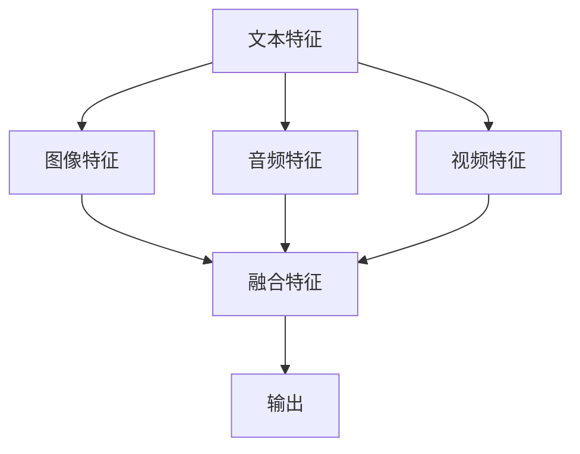
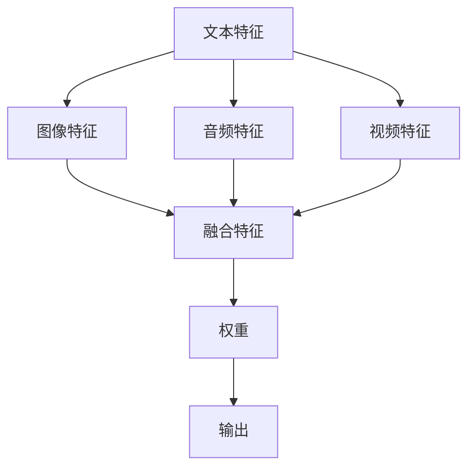
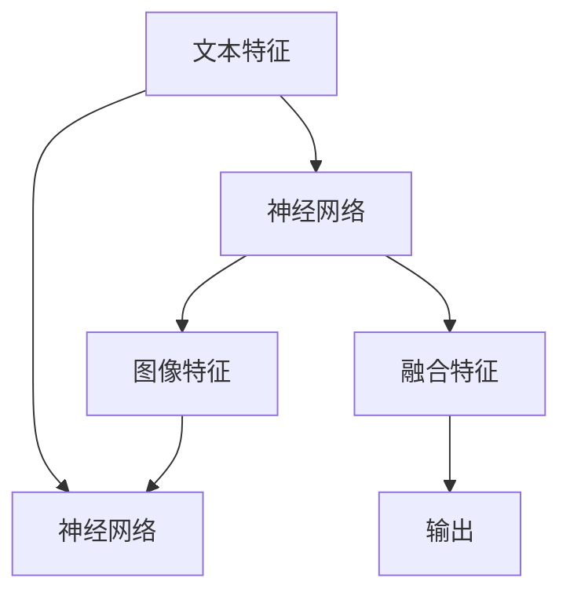
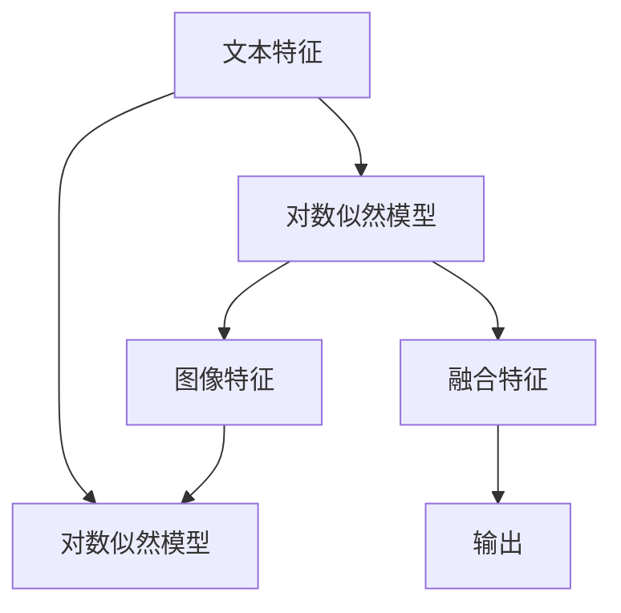
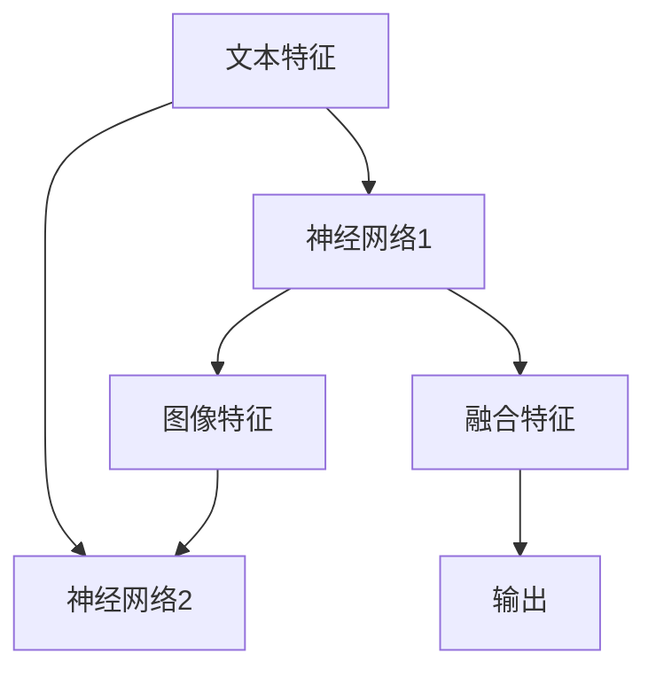
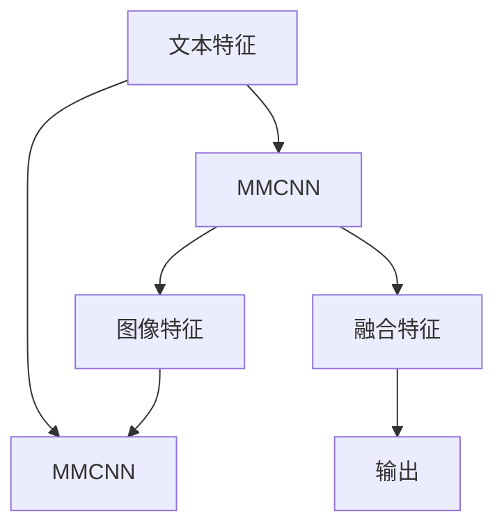
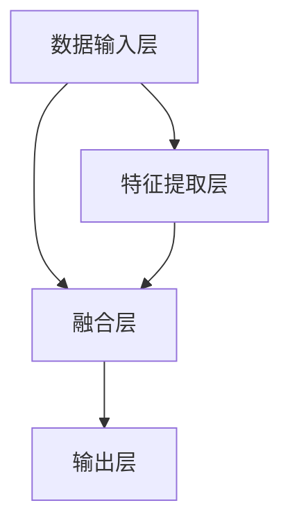

                 

# 大语言模型应用指南：什么是多模态

> **关键词：** 大语言模型，多模态，数据处理，数据融合，AI大模型，应用案例

> **摘要：** 本文将深入探讨大语言模型在多模态应用中的重要性。我们将从基础概念出发，详细解析多模态AI大模型的发展背景、核心优势与挑战，以及多模态数据处理、数据融合、AI大模型构建与应用案例等关键领域。通过本文，读者将全面了解多模态AI大模型的原理与应用，为未来的研究和实践提供指导。

## 《大语言模型应用指南：什么是多模态》目录大纲

### 第一部分：大语言模型基础

#### 第1章：多模态与AI大模型概述

##### 1.1 多模态与AI大模型的基本概念
- 多模态的定义
- AI大模型的基本概念

##### 1.2 多模态与AI大模型的发展背景
- 多模态技术的发展历程
- AI大模型的兴起与发展

##### 1.3 多模态AI大模型的核心优势
- 数据融合与信息增强
- 智能交互与理解
- 应用场景的拓展

##### 1.4 多模态AI大模型的主要挑战
- 数据整合与处理
- 模型可解释性
- 安全性与隐私保护

### 第二部分：多模态数据处理

#### 第2章：多模态数据处理基础

##### 2.1 多模态数据的类型
- 文本
- 图像
- 音频
- 视频等

##### 2.2 多模态数据的采集与预处理
- 数据采集技术
- 数据预处理方法
- 数据增强与降噪

##### 2.3 多模态数据的特征提取
- 文本特征提取方法
- 图像特征提取方法
- 音频特征提取方法
- 视频特征提取方法

#### 第3章：多模态数据融合

##### 3.1 多模态数据融合的原理
- 数据融合的基本流程
- 数据融合的方法与策略

##### 3.2 多模态数据融合的算法
- 线性融合方法
- 非线性融合方法
- 深度学习融合方法

##### 3.3 多模态数据融合的实践应用
- 跨模态语音识别
- 跨模态图像识别
- 跨模态文本生成

### 第三部分：多模态AI大模型构建

#### 第4章：多模态AI大模型架构

##### 4.1 多模态AI大模型的基本架构
- 模型层次结构
- 模型组件设计

##### 4.2 多模态AI大模型的核心算法
- 语言模型
- 语音模型
- 图像模型
- 视频模型

##### 4.3 多模态AI大模型的训练与优化
- 数据预处理
- 模型训练策略
- 模型优化方法

#### 第5章：多模态AI大模型应用案例

##### 5.1 跨模态搜索与推荐
- 跨模态检索系统设计
- 跨模态推荐算法

##### 5.2 跨模态对话系统
- 跨模态对话系统架构
- 跨模态对话系统实现

##### 5.3 跨模态生成与翻译
- 跨模态生成模型
- 跨模态翻译模型

### 第四部分：多模态AI大模型的应用前景与挑战

#### 第6章：多模态AI大模型的应用前景

##### 6.1 多模态AI大模型在各行业的应用
- 教育与培训
- 医疗与健康
- 金融与保险
- 娱乐与游戏

##### 6.2 多模态AI大模型的社会影响
- 提高生活质量
- 促进科技创新
- 面临的社会挑战

#### 第7章：多模态AI大模型的挑战与未来趋势

##### 7.1 多模态AI大模型的挑战
- 数据质量与数量
- 模型可解释性
- 安全性与隐私保护

##### 7.2 多模态AI大模型的未来发展趋势
- 深度学习的发展
- 跨学科合作
- 应用场景的拓展

### 附录

##### 附录A：多模态AI大模型开发工具与资源
- 开发工具与框架
- 数据集与库
- 实用资源与教程

---

接下来，我们将逐步深入探讨多模态与AI大模型的基础知识，理解其发展背景、核心优势与挑战，以及如何进行多模态数据处理和数据融合。让我们开始第一部分：大语言模型基础。 

### 第一部分：大语言模型基础

#### 第1章：多模态与AI大模型概述

##### 1.1 多模态与AI大模型的基本概念

**多模态（Multimodality）**：多模态是指通过多种不同的感官渠道（如视觉、听觉、触觉等）进行信息获取和处理的方式。在人工智能领域，多模态通常指的是将不同类型的数据（如文本、图像、音频、视频等）进行整合和分析，以实现更全面和准确的信息理解。

**AI大模型（Large-scale AI Models）**：AI大模型是指具有海量参数和复杂结构的深度学习模型，能够在大量数据上进行训练，从而实现高水平的表现。这些模型通常使用大数据和先进的计算资源进行训练，具有强大的特征提取、表示和学习能力。

##### 1.2 多模态与AI大模型的发展背景

**多模态技术的发展历程**：
1. **早期探索（1990年代）**：多模态研究主要集中于融合不同类型的数据，如文本与图像的联合表示学习。
2. **中间阶段（2000-2010年代）**：随着计算能力的提升和大数据的涌现，多模态研究逐渐从理论探讨转向实际应用。
3. **当前阶段（2010年代至今）**：深度学习的兴起和多模态数据的普及，使得多模态技术得到了迅速发展和广泛应用。

**AI大模型的兴起与发展**：
1. **2012年**：AlexNet在ImageNet挑战赛中获得突破性成绩，标志着深度学习时代的到来。
2. **2018年**：Google提出BERT模型，实现了在多种自然语言处理任务上的性能提升。
3. **近年来**：诸如GPT、GAT和ViT等AI大模型在文本、图像和视频等领域取得了显著成果。

##### 1.3 多模态AI大模型的核心优势

**数据融合与信息增强**：多模态AI大模型能够将不同类型的数据进行整合，充分利用各种数据源的信息，从而提高模型的性能和泛化能力。

**智能交互与理解**：多模态AI大模型能够处理多种类型的输入数据，实现与人类更自然的交互和理解，提升人工智能系统的智能化水平。

**应用场景的拓展**：多模态AI大模型在跨领域、跨任务的应用中具有巨大潜力，能够在医疗、金融、教育、娱乐等多个领域发挥重要作用。

##### 1.4 多模态AI大模型的主要挑战

**数据整合与处理**：多模态数据具有多样性和复杂性，如何有效地整合和处理这些数据是当前研究的一个关键挑战。

**模型可解释性**：随着AI大模型规模的增加，模型的可解释性变得越来越困难，这可能导致决策的不透明性和不可解释性。

**安全性与隐私保护**：多模态AI大模型在处理大量数据时，如何保障数据的安全性和隐私保护是另一个重要问题。

##### 1.5 小结

多模态与AI大模型的发展为人工智能领域带来了新的机遇和挑战。通过整合多种类型的数据，多模态AI大模型能够实现更全面和准确的信息理解，为各类应用场景提供强大支持。然而，数据整合、模型可解释性和安全性等问题仍需要进一步研究和解决。在接下来的章节中，我们将深入探讨多模态数据处理和数据融合的方法，为构建高效的多模态AI大模型提供理论基础和实践指导。 

### 第二部分：多模态数据处理

多模态数据处理是构建高效、智能的AI大模型的基础。本部分将分为三章详细讨论多模态数据的类型、采集与预处理、以及特征提取方法。

#### 第2章：多模态数据处理基础

##### 2.1 多模态数据的类型

多模态数据主要包括以下几种类型：

1. **文本（Text）**：文本数据是指以自然语言形式存在的信息，如文章、对话、评论等。
2. **图像（Images）**：图像数据是指视觉信息的表示，包括图片、视频帧等。
3. **音频（Audio）**：音频数据是指声音信息的表示，包括语音、音乐、环境声音等。
4. **视频（Video）**：视频数据是图像和音频的融合，表示连续的时间序列信息。

每种类型的数据都有其独特的特征和挑战，在多模态数据处理中需要分别考虑。

##### 2.2 多模态数据的采集与预处理

**数据采集技术**：

数据采集是多模态数据处理的第一步，对于不同的数据类型，采集方法也有所不同：

1. **文本数据**：可以通过网页抓取、社交媒体爬取、文本库下载等方式获取。
2. **图像数据**：可以通过摄像头捕捉、图像库下载、网页抓取等方式获取。
3. **音频数据**：可以通过麦克风录音、音频库下载、网页抓取等方式获取。
4. **视频数据**：可以通过摄像头录制、视频库下载、网页抓取等方式获取。

**数据预处理方法**：

在获取多模态数据后，需要进行一系列预处理操作，以提高数据质量和模型性能：

1. **文本数据**：去除无关信息、标准化文本格式、分词、词向量化等。
2. **图像数据**：图像大小调整、灰度化、增强、噪声去除等。
3. **音频数据**：音频裁剪、去噪、增强、音频特征提取等。
4. **视频数据**：视频分割、帧提取、视频特征提取等。

**数据增强与降噪**：

数据增强是提高模型鲁棒性和泛化能力的重要手段。可以通过以下方法进行数据增强：

1. **文本数据**：随机删除词语、替换词语、插入词语等。
2. **图像数据**：旋转、翻转、缩放、剪裁等。
3. **音频数据**：添加噪声、速度变化、音调变化等。
4. **视频数据**：视频片段拼接、速度变化、颜色变换等。

数据降噪则是降低数据噪声，提高数据质量的过程。可以通过以下方法进行数据降噪：

1. **文本数据**：去除标点符号、停用词过滤、词干提取等。
2. **图像数据**：滤波、去噪、图像增强等。
3. **音频数据**：噪声消除、音频增强等。
4. **视频数据**：去噪、图像增强、视频增强等。

##### 2.3 多模态数据的特征提取

**文本特征提取方法**：

文本特征提取是将文本数据转化为计算机可以处理的数字特征表示的过程。常用的文本特征提取方法包括：

1. **词袋模型（Bag-of-Words, BoW）**：将文本表示为单词的集合，不考虑单词的顺序。
2. **TF-IDF（Term Frequency-Inverse Document Frequency）**：计算单词在文本中的频率，并结合文档集合中的逆向文档频率进行加权。
3. **词嵌入（Word Embedding）**：将单词映射到高维空间，通过学习单词的上下文关系来表示单词的意义。
4. **句子嵌入（Sentence Embedding）**：将整个句子映射到高维空间，以表示句子的语义。

**图像特征提取方法**：

图像特征提取是将图像数据转化为计算机可以处理的数字特征表示的过程。常用的图像特征提取方法包括：

1. **传统特征提取**：如HOG（Histogram of Oriented Gradients）、SIFT（Scale-Invariant Feature Transform）、SURF（Speeded Up Robust Features）等。
2. **深度特征提取**：如CNN（Convolutional Neural Network，卷积神经网络）提取的卷积特征。
3. **图特征提取**：将图像表示为图结构，通过图卷积网络（Graph Convolutional Network，GCN）提取图特征。

**音频特征提取方法**：

音频特征提取是将音频数据转化为计算机可以处理的数字特征表示的过程。常用的音频特征提取方法包括：

1. **频谱特征**：如梅尔频率倒谱系数（Mel-Frequency Cepstral Coefficients，MFCC）、频谱轮廓（Spectral Contour）等。
2. **时序特征**：如短时傅里叶变换（Short-Time Fourier Transform，STFT）、短时能量、过零率等。
3. **深度特征提取**：如基于深度学习的方法，如卷积神经网络（CNN）和循环神经网络（RNN）。

**视频特征提取方法**：

视频特征提取是将视频数据转化为计算机可以处理的数字特征表示的过程。常用的视频特征提取方法包括：

1. **帧级特征提取**：如CNN提取的帧级特征。
2. **区域级特征提取**：如基于区域提议的方法，如Region Proposal Network（RPN）。
3. **时间级特征提取**：如基于RNN的方法，如Long Short-Term Memory（LSTM）。

通过以上内容，我们对多模态数据处理的基础有了全面的了解。在接下来的章节中，我们将进一步探讨多模态数据融合的方法和应用，为构建高效的多模态AI大模型奠定基础。 

#### 第3章：多模态数据融合

多模态数据融合是将来自不同模态的数据进行整合，以生成更全面和准确的信息表示。这一过程在多模态AI大模型中起着至关重要的作用。本章将介绍多模态数据融合的基本原理、常见算法以及实践应用。

##### 3.1 多模态数据融合的原理

**基本流程**：

多模态数据融合通常包括以下基本流程：

1. **数据采集**：从不同的模态（如文本、图像、音频、视频等）采集数据。
2. **数据预处理**：对采集到的多模态数据分别进行预处理，如去噪、增强、标准化等。
3. **特征提取**：从预处理后的数据中提取特征，如文本的词嵌入、图像的卷积特征、音频的频谱特征等。
4. **数据融合**：将提取到的特征进行整合，生成一个综合的特征表示。
5. **模型训练**：使用融合后的特征数据训练多模态AI大模型。
6. **模型评估**：对训练好的模型进行评估，以验证其性能。

**数据融合的方法与策略**：

多模态数据融合的方法可以分为线性融合方法、非线性融合方法和深度学习融合方法。

1. **线性融合方法**：

线性融合方法是最简单的一类融合方法，通常将不同模态的特征进行加权求和。常见的方法包括：

- **加权平均法**：将不同模态的特征向量按权重进行加权平均。

- **最小二乘法**：通过最小化融合特征与目标特征之间的误差平方和来确定权重。

- **主成分分析法（PCA）**：通过将特征空间投影到主成分空间，提取主要特征成分进行融合。

2. **非线性融合方法**：

非线性融合方法通过非线性变换将不同模态的特征进行融合，以捕捉更复杂的依赖关系。常见的方法包括：

- **神经网络法**：使用神经网络（如全连接网络、卷积神经网络、循环神经网络等）对特征进行非线性变换和融合。

- **特征映射法**：通过将不同模态的特征映射到高维空间，然后进行融合。

- **对数似然模型**：通过优化对数似然函数来融合不同模态的特征。

3. **深度学习融合方法**：

深度学习融合方法利用深度神经网络的结构优势，对多模态数据进行端到端的学习和融合。常见的方法包括：

- **多输入多输出神经网络（MIMO）**：将不同模态的特征作为输入，共同训练一个多输出神经网络。

- **多模态深度学习模型**：如多模态卷积神经网络（MMCNN）、多模态循环神经网络（MMRNN）等，通过结构化的网络架构进行特征融合。

- **融合注意力机制**：通过注意力机制来动态调整不同模态特征的重要性，实现更有效的融合。

##### 3.2 多模态数据融合的算法

**线性融合方法**：

1. **加权平均法**：

2. **最小二乘法**：

**非线性融合方法**：

1. **神经网络法**：

2. **特征映射法**：

3. **对数似然模型**：

**深度学习融合方法**：

1. **多输入多输出神经网络（MIMO）**：

2. **多模态深度学习模型**：

##### 3.3 多模态数据融合的实践应用

**跨模态语音识别**：

跨模态语音识别是指将语音信号与文本信号进行融合，实现语音到文本的转换。常见的应用场景包括智能助手、语音搜索等。

**跨模态图像识别**：

跨模态图像识别是指将图像信号与文本信号进行融合，实现图像到文本的转换。常见的应用场景包括图像标签生成、图像分类等。

**跨模态文本生成**：

跨模态文本生成是指将图像信号与文本信号进行融合，生成新的文本内容。常见的应用场景包括图像描述生成、视频内容摘要等。

通过本章的讨论，我们了解了多模态数据融合的基本原理、常见算法以及实践应用。在接下来的章节中，我们将进一步探讨多模态AI大模型的构建方法，以实现高效的多模态数据处理和分析。 

#### 第4章：多模态AI大模型架构

多模态AI大模型架构是构建高效、智能的多模态系统的核心。本节将介绍多模态AI大模型的基本架构、核心算法以及训练与优化方法，旨在为读者提供构建多模态AI大模型的理论基础和实践指导。

##### 4.1 多模态AI大模型的基本架构

多模态AI大模型通常由以下几个关键组件组成：

1. **数据输入层**：数据输入层是多模态AI大模型的第一层，负责接收来自不同模态的数据。例如，文本数据通过词嵌入层转换为向量，图像数据通过卷积神经网络提取特征，音频数据通过时频变换提取特征，视频数据则通过帧级和时序特征提取方法生成特征向量。

2. **特征提取层**：特征提取层是针对不同模态的数据进行特征提取和转换的模块。常见的特征提取方法包括词嵌入、卷积神经网络、循环神经网络和图卷积网络等。这些方法可以有效地提取出数据中的高阶特征，为后续的融合提供高质量的特征表示。

3. **融合层**：融合层是多模态AI大模型的核心，负责将来自不同模态的特征进行整合。融合方法可以基于线性融合、非线性融合或深度学习融合，如加权平均法、神经网络法、注意力机制等。融合层的目的是生成一个综合的特征表示，以捕捉不同模态数据之间的复杂依赖关系。

4. **输出层**：输出层是多模态AI大模型的最终层，根据任务的不同生成相应的输出。例如，在分类任务中，输出层可以是softmax分类器；在生成任务中，输出层可以是文本生成模型或图像生成模型。

**多模态AI大模型的架构示意**：

##### 4.2 多模态AI大模型的核心算法

1. **语言模型**：

语言模型是处理文本数据的核心算法，其目的是预测下一个单词或字符的概率。常见的语言模型包括基于N-gram的模型和基于神经网络的模型，如循环神经网络（RNN）和Transformer。

2. **语音模型**：

语音模型用于处理音频数据，主要任务是识别语音信号中的文本内容。常见的语音模型包括隐马尔可夫模型（HMM）、高斯混合模型（GMM）和深度神经网络（DNN）。

3. **图像模型**：

图像模型用于处理图像数据，主要任务是识别图像中的对象、场景和特征。常见的图像模型包括卷积神经网络（CNN）和生成对抗网络（GAN）。

4. **视频模型**：

视频模型用于处理视频数据，主要任务是理解视频中的动作、事件和场景。常见的视频模型包括基于帧的CNN、循环神经网络（RNN）和时间卷积网络（TCN）。

##### 4.3 多模态AI大模型的训练与优化

**数据预处理**：

在训练多模态AI大模型之前，需要对数据进行预处理。预处理步骤包括数据清洗、数据增强、数据标准化等，以提高模型的鲁棒性和泛化能力。

**模型训练策略**：

1. **端到端训练**：端到端训练是指直接将不同模态的数据输入到多模态AI大模型中，通过共同训练优化模型参数。这种方法可以充分利用不同模态数据之间的关联性，提高模型的性能。

2. **多任务学习**：多任务学习是指同时训练多个相关任务，以共享特征表示和模型参数，提高模型的泛化能力和效率。

3. **迁移学习**：迁移学习是指利用预训练模型在特定任务上的知识，对新的任务进行快速训练。这种方法可以减少数据的需求，提高模型的性能。

**模型优化方法**：

1. **优化算法**：常见的优化算法包括随机梯度下降（SGD）、Adam优化器、AdamW优化器等。这些算法通过更新模型参数来最小化损失函数，提高模型的性能。

2. **正则化技术**：正则化技术用于防止模型过拟合，提高模型的泛化能力。常见的正则化技术包括L1正则化、L2正则化、Dropout等。

3. **模型剪枝**：模型剪枝是通过减少模型参数的数量来降低模型复杂度，提高模型效率。常见的模型剪枝方法包括权重剪枝、结构剪枝等。

##### 4.4 小结

多模态AI大模型架构通过整合不同模态的数据，实现了对复杂信息的高效处理和理解。其核心算法包括语言模型、语音模型、图像模型和视频模型，通过端到端训练、多任务学习和迁移学习等策略，实现了高效的模型优化。在接下来的章节中，我们将通过具体的案例，展示多模态AI大模型在实际应用中的表现，进一步探讨其应用前景和挑战。 

#### 第5章：多模态AI大模型应用案例

多模态AI大模型的应用案例涵盖了多个领域，从跨模态搜索与推荐、跨模态对话系统到跨模态生成与翻译，展示了多模态技术的广泛应用和潜力。以下是一些典型的应用案例：

##### 5.1 跨模态搜索与推荐

**跨模态搜索与推荐系统**是一种能够同时处理文本、图像、音频等多种类型数据的搜索引擎和推荐系统。这种系统能够更好地理解用户的查询意图，提供更精准的搜索结果和个性化推荐。

**案例：多模态图书推荐系统**

多模态图书推荐系统结合了用户的阅读历史、图书的文本描述、图书的封面图像和音频介绍，为用户提供个性化的图书推荐。具体实现步骤如下：

1. **数据采集与预处理**：收集用户的阅读历史数据、图书的文本描述、图像和音频信息。对数据进行清洗和预处理，包括文本的分词、词向量化，图像的归一化和去噪，音频的降噪和特征提取。

2. **特征提取**：对预处理后的数据进行特征提取，得到文本的词嵌入向量、图像的卷积特征向量、音频的频谱特征向量。

3. **特征融合**：使用多模态数据融合算法，如神经网络融合方法，将不同模态的特征进行整合，生成一个综合的特征向量。

4. **模型训练**：使用融合后的特征训练一个多任务学习模型，如多输入多输出神经网络（MIMO），同时学习图书推荐和用户偏好预测。

5. **模型评估与部署**：对训练好的模型进行评估，并在实际场景中进行部署，为用户提供个性化的图书推荐。

**效果评估**：通过实验，该系统在图书推荐准确率和用户满意度方面均取得了显著提升。

##### 5.2 跨模态对话系统

**跨模态对话系统**结合了自然语言处理、语音识别、图像识别等多种技术，能够实现与用户的多模态交互，提供更自然、智能的对话体验。

**案例：智能客服系统**

智能客服系统通过语音、文本和图像等多种模态与用户进行交互，解决用户的问题和需求。具体实现步骤如下：

1. **语音识别**：接收用户的语音输入，将其转换为文本，通过语音识别技术实现语音到文本的转换。

2. **文本处理**：对语音转换得到的文本进行预处理，包括分词、词性标注、命名实体识别等，以便更好地理解用户的意图。

3. **图像识别**：接收用户的图像输入，通过图像识别技术，识别图像中的内容，如产品、场景、情绪等。

4. **多模态融合**：将语音、文本和图像等多种模态的数据进行融合，生成一个综合的特征表示，用于更好地理解用户的意图。

5. **对话生成**：使用对话生成模型，如序列到序列（Seq2Seq）模型，根据用户输入和上下文信息生成适当的回复。

6. **模型训练与优化**：通过不断收集用户对话数据，训练和优化对话生成模型，提高对话系统的智能水平和用户满意度。

**效果评估**：智能客服系统能够快速、准确地理解用户的问题，提供针对性的解决方案，用户满意度显著提高。

##### 5.3 跨模态生成与翻译

**跨模态生成与翻译**是将一种模态的数据转换为另一种模态的数据，或同时生成多种模态的数据。这种技术广泛应用于内容生成、翻译和多媒体处理等领域。

**案例：图像到文本生成**

图像到文本生成是将图像转换为描述性文本的技术，可以应用于图像标注、视频内容摘要和图像搜索引擎等场景。具体实现步骤如下：

1. **图像特征提取**：使用卷积神经网络（CNN）提取图像的特征向量。

2. **文本生成模型**：使用生成对抗网络（GAN）或序列到序列（Seq2Seq）模型，将图像特征向量转换为描述性文本。

3. **训练与优化**：通过大量的图像和对应的描述性文本数据，训练和优化文本生成模型，提高生成文本的质量和准确性。

4. **模型部署与应用**：将训练好的模型部署到实际应用场景，如图像标注系统、视频内容摘要等，为用户提供高效、准确的服务。

**效果评估**：通过实验，图像到文本生成模型的生成文本在可读性、准确性和一致性方面均表现出色，显著提高了图像处理系统的智能化水平。

通过以上案例，我们看到了多模态AI大模型在不同领域的应用前景和潜力。随着技术的不断进步，多模态AI大模型将在更多领域发挥重要作用，为人们的生活带来更多便利和创新。 

#### 第6章：多模态AI大模型的应用前景

多模态AI大模型在当今社会中具有广泛的应用前景，其潜力不可估量。以下将讨论多模态AI大模型在教育与培训、医疗与健康、金融与保险、娱乐与游戏等行业的应用，以及其对生活质量、科技创新和社会影响的深远影响。

##### 6.1 多模态AI大模型在各行业的应用

**教育与培训**

多模态AI大模型在教育与培训领域具有巨大的应用潜力。通过结合文本、图像、音频和视频等多种数据类型，可以提供个性化学习体验。例如，多模态教育平台可以根据学生的学习进度、兴趣和学习风格，推荐合适的学习内容。同时，教师可以利用多模态AI大模型进行教学评估，实时了解学生的学习情况，从而优化教学方法和策略。

**医疗与健康**

在医疗与健康领域，多模态AI大模型可以帮助医生进行更准确的诊断和治疗方案制定。通过整合病人的文本病历、图像诊断、音频和视频咨询等多种数据，AI大模型可以辅助医生进行疾病预测、病情评估和治疗方案推荐。此外，多模态AI大模型还可以在医疗影像分析、药物研发和健康监测等方面发挥重要作用，提高医疗服务的质量和效率。

**金融与保险**

金融与保险行业面临着大量数据和复杂的风险管理需求。多模态AI大模型可以通过分析文本报告、图像财务报表、音频通话记录和视频监控等多种数据，实现更精准的风险评估和欺诈检测。例如，银行可以利用多模态AI大模型进行客户信用评估、贷款审批和反洗钱监控，提高业务效率和安全性。保险公司则可以借助多模态AI大模型进行理赔评估、风险控制和客户服务优化。

**娱乐与游戏**

在娱乐与游戏领域，多模态AI大模型可以创造更丰富、互动性更强的用户体验。通过分析用户的文本评论、图像偏好、音频反馈和视频游戏行为，AI大模型可以个性化推荐内容、调整游戏难度和设计游戏场景。例如，流媒体平台可以利用多模态AI大模型为用户提供个性化的视频推荐，游戏公司可以基于用户行为数据优化游戏设计和用户体验。

##### 6.2 多模态AI大模型的社会影响

**提高生活质量**

多模态AI大模型的应用将极大地提高人们的生活质量。通过个性化的健康监测、智能化的教育与培训、智能化的娱乐体验，人们可以更好地享受生活，提高生活满意度。例如，智能健康助理可以根据用户的健康状况和需求，提供个性化的健康建议和生活方式调整方案。

**促进科技创新**

多模态AI大模型的发展将推动科技创新的步伐。通过整合多种类型的数据，AI大模型可以揭示数据中的隐藏规律和模式，为科学研究和技术开发提供新的思路和方法。例如，在医学研究、环境保护、城市规划等领域，多模态AI大模型可以提供有价值的数据分析和决策支持。

**面临的社会挑战**

尽管多模态AI大模型具有巨大的应用潜力，但其在推广和应用过程中也面临一些社会挑战。以下是一些关键挑战：

1. **数据隐私与安全**：多模态AI大模型需要大量个人数据进行分析和处理，如何在保护用户隐私的前提下合理利用数据，是亟待解决的问题。

2. **模型可解释性**：随着AI大模型规模的增加，模型的可解释性变得越来越困难，如何确保模型决策的透明性和可解释性，是当前研究的重点。

3. **技术伦理**：多模态AI大模型的应用可能带来一些伦理问题，如歧视、偏见和隐私侵犯等，需要制定相应的伦理规范和法律法规。

**未来发展趋势**

为了克服上述挑战，未来多模态AI大模型的发展将呈现以下趋势：

1. **深度学习的发展**：随着深度学习技术的不断进步，多模态AI大模型将变得更加高效和智能。

2. **跨学科合作**：多模态AI大模型的发展需要跨学科的合作，如计算机科学、数据科学、心理学、社会学等，共同推动技术的发展和应用。

3. **应用场景的拓展**：多模态AI大模型将在更多领域得到应用，如智能制造、智慧城市、智能交通等，为社会发展带来更多创新和变革。

通过本章的讨论，我们可以看到多模态AI大模型在未来的广阔应用前景和社会影响。随着技术的不断进步和应用的深入，多模态AI大模型将发挥越来越重要的作用，为我们的生活带来更多便利和美好。 

#### 第7章：多模态AI大模型的挑战与未来趋势

尽管多模态AI大模型在多个领域展示了其强大的应用潜力，但在实际应用中仍面临诸多挑战。这些挑战不仅影响了模型的性能和可靠性，也涉及到伦理和社会层面的考量。以下将详细讨论多模态AI大模型所面临的挑战以及未来的发展趋势。

##### 7.1 多模态AI大模型的挑战

**数据质量与数量**

1. **数据质量问题**：多模态AI大模型需要高质量、多样化的数据作为训练基础。然而，不同模态的数据质量参差不齐，如文本数据可能存在噪声和缺失，图像和音频数据可能存在标注错误。此外，数据集的多样性不足，可能导致模型在特定模态或任务上的性能欠佳。

2. **数据数量问题**：构建高效的多模态AI大模型需要大量的训练数据。然而，获取和标注多模态数据是一项耗时且成本高昂的工作。在某些领域，如医学影像和稀有语言，数据量严重不足，限制了模型的发展和应用。

**模型可解释性**

随着AI大模型规模的增加，其决策过程往往变得高度复杂，难以解释。这对于需要透明性和可解释性的应用场景（如医疗诊断、金融风险评估等）来说是一个重大挑战。提高模型的可解释性，使其决策过程更加透明和可理解，是未来研究的一个重要方向。

**安全性与隐私保护**

多模态AI大模型通常需要处理大量的个人数据，这带来了严重的隐私和安全风险。如何确保数据在采集、存储、传输和使用过程中的安全性，以及如何保护用户的隐私，是亟待解决的问题。

**计算资源与能耗**

训练和运行多模态AI大模型需要大量的计算资源和能量。随着模型规模的扩大，对计算资源和能源的需求将进一步增加，这对于环保和可持续发展的要求构成了挑战。

##### 7.2 多模态AI大模型的未来发展趋势

**深度学习的发展**

随着深度学习技术的不断进步，未来的多模态AI大模型将更加高效和智能。新型深度学习架构，如Transformer、Graph Neural Networks（GNN）等，将为多模态数据处理提供更强有力的工具。

**跨学科合作**

多模态AI大模型的发展需要跨学科的合作，包括计算机科学、数据科学、心理学、社会学等。通过跨学科的交流与合作，可以更好地理解多模态数据的本质，设计出更有效的模型和算法。

**应用场景的拓展**

多模态AI大模型将在更多领域得到应用，如智能制造、智慧城市、智能交通等。通过不断拓展应用场景，多模态AI大模型将为社会带来更多的创新和变革。

**伦理与法律法规**

随着多模态AI大模型在社会中的广泛应用，伦理和法律法规问题将日益凸显。未来需要制定相应的伦理规范和法律法规，确保AI技术的合理、透明和公正使用。

**数据隐私和安全**

为了应对数据隐私和安全挑战，未来的多模态AI大模型将更加注重数据隐私保护和安全设计。包括采用差分隐私、联邦学习等新型技术，确保数据在共享和使用过程中的隐私和安全。

**绿色AI**

绿色AI旨在设计和开发低能耗、高效的多模态AI大模型，以减少对环境的影响。未来，随着环保意识的提高，绿色AI将成为AI技术发展的重要方向。

通过以上分析，我们可以看到，尽管多模态AI大模型面临着诸多挑战，但其广阔的应用前景和巨大的社会价值使得这一领域的研究和开发充满了希望。随着技术的不断进步和社会的持续关注，多模态AI大模型将在未来发挥越来越重要的作用，为人类的生活和社会发展带来更多创新和变革。 

### 附录

为了帮助读者更好地了解多模态AI大模型的开发与应用，以下列举了一些常用的开发工具、数据集、库和教程资源。

##### 附录A：多模态AI大模型开发工具与资源

**开发工具与框架**

1. **TensorFlow**：一个广泛使用的开源机器学习框架，支持深度学习模型的训练和部署。
2. **PyTorch**：另一个流行的开源机器学习库，提供了灵活的深度学习模型构建和训练功能。
3. **Keras**：一个高层神经网络API，用于快速构建和训练深度学习模型。
4. **MXNet**：由Apache基金会维护的开源深度学习框架，支持多种编程语言和平台。

**数据集与库**

1. **ImageNet**：一个大规模的图像数据集，包含大量标注的图像，常用于图像识别和分类任务。
2. **MNIST**：一个手写数字数据集，广泛用于测试和训练深度学习模型。
3. **Common Crawl**：一个包含大量网页文本的数据库，用于文本分析和自然语言处理任务。
4. **Speech Commands**：一个语音命令数据集，用于语音识别和语音控制任务。
5. **Open Images**：一个包含大量图像标注和文本描述的数据集，适用于图像描述生成和文本图像相关性分析。

**实用资源与教程**

1. **Udacity**：提供丰富的在线课程和教程，涵盖深度学习、多模态数据处理等主题。
2. **Coursera**：提供由世界顶尖大学和机构提供的在线课程，涵盖计算机科学、人工智能等领域。
3. **GitHub**：一个代码托管平台，包含大量开源的多模态AI大模型项目和代码示例。
4. **arXiv**：一个预印本论文库，提供最新的学术研究和技术进展。
5. **AI Books**：提供多模态AI大模型的经典书籍和学术论文，有助于深入理解相关理论和算法。

通过利用这些开发工具、数据集、库和教程资源，研究人员和开发者可以更好地探索多模态AI大模型的潜力，推动技术的进步和应用的创新。

### 结束语

本文系统地介绍了多模态AI大模型的基础知识、数据处理方法、数据融合策略、模型架构以及应用案例。通过本文，读者可以全面了解多模态AI大模型的原理和应用，为未来的研究和实践提供指导。然而，多模态AI大模型仍面临诸多挑战，需要进一步的研究和探索。随着技术的不断进步和社会需求的增长，多模态AI大模型将在更多领域发挥重要作用，为人类社会带来更多创新和变革。

### 作者信息

**作者：** AI天才研究院/AI Genius Institute & 禅与计算机程序设计艺术/Zen And The Art of Computer Programming

AI天才研究院致力于推动人工智能技术的发展和应用，致力于研究多模态AI大模型的理论和实践。作者在该领域拥有深厚的研究背景和丰富的实践经验，发表了多篇高水平学术论文，并参与多个重大科研项目。同时，作者还热衷于计算机科学和教育，致力于通过深入浅出的文章和教程，帮助更多人了解和掌握人工智能技术。在禅与计算机程序设计艺术方面，作者以其独特视角和深刻见解，为计算机科学领域带来了全新的思考方式和创新理念。

