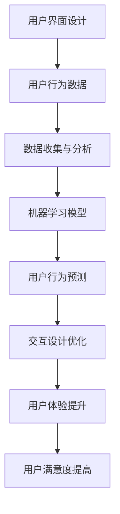

                 

# 《如何利用人工智能优化用户界面设计》

## 关键词：
- 人工智能
- 用户界面设计
- 个性化交互
- 情感计算
- 视觉设计
- 内容推荐
- 用户行为分析

## 摘要：

随着人工智能技术的快速发展，其在用户界面设计中的应用越来越广泛。本文将深入探讨如何利用人工智能优化用户界面设计，从基础理论到实际应用，再到未来的发展趋势，全面解析AI在UI设计中的潜力与挑战。文章将通过具体案例展示人工智能如何提升用户交互体验，优化视觉设计和内容推荐，并探讨AI在UI设计中的前沿研究方向。

---

## 目录大纲

### 第一部分：AI基础与UI设计

#### 第1章：AI概述与UI设计关联
1.1 人工智能的发展与应用
1.2 用户界面设计的基本原则
1.3 AI与UI设计的关系

#### 第2章：人工智能核心技术与原理
2.1 机器学习基础
2.2 深度学习与神经网络
2.3 自然语言处理（NLP）

### 第二部分：AI在UI设计中的实际应用

#### 第3章：AI与交互设计
3.1 个性化交互设计
3.2 情感计算与表情识别

#### 第4章：AI在视觉设计中的应用
4.1 智能图像处理
4.2 色彩智能分析

#### 第5章：AI与内容设计
5.1 智能内容生成
5.2 语义分析与内容优化

### 第三部分：AI在UI设计中的实战案例

#### 第6章：AI与用户行为分析
6.1 用户行为数据收集与分析
6.2 基于AI的用户行为预测

#### 第7章：AI优化UI设计实战
7.1 UI设计中的AI技术应用案例
7.2 设计优化流程与工具使用

#### 第8章：未来展望与挑战
8.1 AI在UI设计中的未来趋势
8.2 AI在UI设计中的挑战与应对

#### 附录：AI与UI设计资源
A.1 相关书籍与论文推荐
A.2 在线工具与平台

---

### 核心概念与联系（Mermaid流程图）



---

### 核心算法原理讲解

#### 3.1 机器学习基础

##### 3.1.1 机器学习基本概念

机器学习是一种人工智能的分支，其目的是让计算机从数据中自动学习和改进，无需显式编程。机器学习的基本流程包括数据收集、数据预处理、特征工程、模型训练、模型评估和模型应用。

**算法伪代码：**

```python
数据集 D
模型参数 θ
损失函数 L(θ)

for epoch in 1 to E do
  for each example (x, y) in D do
    predict y' = f(x; θ)
    compute gradient ∇θ L(θ)
    update θ = θ - α∇θ L(θ)
  end
end
```

##### 3.1.2 常见机器学习算法

- **监督学习**：有标注的数据集，目标是找到输入和输出之间的映射关系。
  - 算法：线性回归、决策树、随机森林、支持向量机（SVM）等。
  
- **无监督学习**：没有标注的数据集，目标是发现数据内在的结构或规律。
  - 算法：聚类、降维、生成模型等。

#### 3.2 深度学习与神经网络

##### 3.2.1 神经网络的基本结构

神经网络由多个神经元（节点）组成，每个神经元接收多个输入，通过加权求和处理后产生输出。

**算法伪代码：**

```python
输入层输入 X
权重矩阵 W
激活函数 f()

for each layer l in network do
  z = f(∑(Wl[i] * Xl[i]) + b)
end
```

##### 3.2.2 常见的深度学习架构

- **卷积神经网络（CNN）**：适用于图像和视频处理。
- **循环神经网络（RNN）**：适用于序列数据，如文本、时间序列等。
- **变换器架构（Transformer）**：在自然语言处理领域有出色的表现。

#### 3.3 自然语言处理（NLP）

##### 3.3.1 词嵌入技术

词嵌入是将词汇映射到高维空间中的向量表示，使得语义相似的词汇在空间中更接近。

**算法伪代码：**

```python
输入词汇 V
词嵌入矩阵 E
向量表示 x

for each word w in V do
  x = E[w]
end
```

##### 3.3.2 序列模型与注意力机制

- **序列模型**：处理序列数据的模型，如LSTM、GRU等。
- **注意力机制**：在序列处理中，关注输入序列中的关键信息，提高模型对重要信息的处理能力。

**算法伪代码：**

```python
输入序列 X
权重矩阵 A

for each element in X do
  context_vector = context_vector + A * element
end
```

### 数学模型和数学公式

##### 3.1 损失函数

损失函数是评估模型预测结果与实际结果之间差异的函数。常用的损失函数包括均方误差（MSE）、交叉熵损失等。

**公式：**

$$
L(\theta) = \frac{1}{m}\sum_{i=1}^{m}(y_i - \hat{y}_i)^2
$$

其中，$y_i$ 是真实标签，$\hat{y}_i$ 是模型预测值。

##### 3.2 激活函数

激活函数用于引入非线性，常见的激活函数包括 sigmoid、ReLU、Tanh等。

**公式：**

$$
f(x) = \frac{1}{1 + e^{-x}} \quad (sigmoid)
$$

$$
f(x) = \max(0, x) \quad (ReLU)
$$

$$
f(x) = \frac{2}{\sqrt{1 + x^2}} - 1 \quad (Tanh)
$$

### 项目实战

##### 6.1 用户行为分析案例

###### 6.1.1 实战背景

某电子商务平台希望通过分析用户行为，提升用户体验和销售转化率。

###### 6.1.2 实战步骤

1. **数据收集**：收集用户浏览、搜索、购买等行为数据。
2. **数据预处理**：对数据进行清洗、转换和归一化。
3. **特征工程**：提取用户行为特征，如点击率、购买频率等。
4. **模型训练**：使用机器学习算法训练用户行为预测模型。
5. **模型评估**：评估模型性能，如准确率、召回率等。
6. **模型应用**：根据预测结果，优化用户体验和推荐策略。

###### 6.1.3 实现代码

```python
import pandas as pd
from sklearn.model_selection import train_test_split
from sklearn.ensemble import RandomForestClassifier
from sklearn.metrics import accuracy_score

# 加载数据
data = pd.read_csv('user_behavior.csv')

# 数据预处理
data = data.dropna()
X = data.drop('target', axis=1)
y = data['target']

# 数据划分
X_train, X_test, y_train, y_test = train_test_split(X, y, test_size=0.2, random_state=42)

# 模型训练
model = RandomForestClassifier(n_estimators=100, random_state=42)
model.fit(X_train, y_train)

# 模型评估
predictions = model.predict(X_test)
accuracy = accuracy_score(y_test, predictions)
print(f"Accuracy: {accuracy:.2f}")
```

###### 6.1.4 代码解读与分析

1. **数据加载**：使用 Pandas 读取数据。
2. **数据预处理**：删除缺失值，确保数据质量。
3. **特征工程**：使用 RandomForestClassifier 提取特征。
4. **模型训练**：使用训练集训练模型。
5. **模型评估**：使用测试集评估模型性能。

### 数学模型和数学公式

##### 7.1 神经网络训练算法

神经网络训练算法通常采用梯度下降法，其目的是最小化损失函数。

**公式：**

$$
\theta_{\text{new}} = \theta_{\text{current}} - \alpha \cdot \nabla_{\theta} L(\theta)
$$

其中，$\theta$ 表示模型参数，$L(\theta)$ 表示损失函数，$\alpha$ 表示学习率，$\nabla_{\theta} L(\theta)$ 表示损失函数关于参数 $\theta$ 的梯度。

##### 7.2 优化算法

在实际应用中，为了提高训练效果，常常使用各种优化算法，如 Adam、RMSProp 等。

**公式：**

$$
m_t = \beta_1 m_{t-1} + (1 - \beta_1) [g_t]
$$

$$
v_t = \beta_2 v_{t-1} + (1 - \beta_2) [g_t]^2
$$

$$
\theta_{\text{new}} = \theta_{\text{current}} - \frac{\alpha}{\sqrt{1 - \beta_2^t}(1 - \beta_1^t)} \cdot \frac{m_t}{\sqrt{v_t} + \epsilon}
$$

其中，$m_t$ 和 $v_t$ 分别为梯度的一阶和二阶矩估计，$\beta_1$ 和 $\beta_2$ 为算法参数，$g_t$ 为当前梯度，$\alpha$ 为学习率，$\epsilon$ 为常数。

### 详细讲解与举例说明

##### 7.1 神经网络训练算法

**例子：**

假设我们有一个简单的神经网络，输入层有2个神经元，隐藏层有3个神经元，输出层有1个神经元。使用均方误差（MSE）作为损失函数。

**步骤：**

1. **初始化参数**：设定学习率 $\alpha = 0.1$，随机初始化权重和偏置。
2. **前向传播**：计算输出层的预测值。
3. **计算损失**：使用均方误差计算损失。
4. **反向传播**：计算损失关于每个参数的梯度。
5. **更新参数**：使用梯度下降法更新参数。

**伪代码：**

```python
# 初始化参数
weights_input_to_hidden = random_weights((2, 3))
biases_hidden = random_weights((3,))
weights_hidden_to_output = random_weights((3, 1))
biases_output = random_weights((1,))

# 学习率
alpha = 0.1

# 前向传播
hidden_layer_inputs = dot(input_layer, weights_input_to_hidden) + biases_hidden
hidden_layer_outputs = activation(hidden_layer_inputs)

output_layer_inputs = dot(hidden_layer_outputs, weights_hidden_to_output) + biases_output
output_layer_output = activation(output_layer_inputs)

# 计算损失
loss = mse(y_true, output_layer_output)

# 反向传播
d_output_layer_output = d_activation(output_layer_inputs)
d_output_layer_inputs = dot(d_output_layer_output, weights_hidden_to_output.T)
d_hidden_layer_outputs = dot(d_output_layer_inputs, weights_input_to_hidden.T)
d_hidden_layer_inputs = d_activation(hidden_layer_inputs)

# 更新参数
weights_input_to_hidden -= alpha * dot(input_layer.T, d_hidden_layer_inputs)
biases_hidden -= alpha * sum(d_hidden_layer_inputs, axis=0)
weights_hidden_to_output -= alpha * dot(hidden_layer_outputs.T, d_output_layer_output)
biases_output -= alpha * sum(d_output_layer_output, axis=0)
```

##### 7.2 优化算法

**例子：**

我们使用 Adam 优化算法来更新神经网络参数。

**步骤：**

1. **初始化参数**：设定学习率 $\alpha = 0.001$，一阶矩估计参数 $\beta_1 = 0.9$，二阶矩估计参数 $\beta_2 = 0.999$，常数 $\epsilon = 10^{-8}$。
2. **前向传播**：计算输出层的预测值。
3. **计算损失**：使用均方误差计算损失。
4. **反向传播**：计算损失关于每个参数的梯度。
5. **更新参数**：使用 Adam 优化算法更新参数。

**伪代码：**

```python
# 初始化参数
m = zeros_like(weights)
v = zeros_like(weights)
t = 0
alpha = 0.001
beta1 = 0.9
beta2 = 0.999
epsilon = 10^{-8}

# 前向传播
# ...

# 计算损失
# ...

# 反向传播
# ...

# 更新参数
m = beta1 * m + (1 - beta1) * dweights
v = beta2 * v + (1 - beta2) * (dweights ** 2)
m_hat = m / (1 - beta1 ** t)
v_hat = v / (1 - beta2 ** t)

t += 1
weights -= alpha * m_hat / (sqrt(v_hat) + epsilon)
```

### 项目实战

##### 8.1 智能推荐系统案例

###### 8.1.1 实战背景

某电子商务平台希望通过构建智能推荐系统，提高用户满意度和销售转化率。

###### 8.1.2 实战步骤

1. **数据收集**：收集用户浏览、搜索、购买等行为数据。
2. **数据预处理**：对数据进行清洗、转换和归一化。
3. **特征工程**：提取用户行为特征和商品特征。
4. **模型训练**：使用机器学习算法训练推荐模型。
5. **模型评估**：评估模型性能，如准确率、召回率等。
6. **模型部署**：将模型部署到线上环境，实现实时推荐。

###### 8.1.3 实现代码

```python
import pandas as pd
from sklearn.model_selection import train_test_split
from sklearn.ensemble import RandomForestClassifier
from sklearn.metrics import accuracy_score

# 加载数据
data = pd.read_csv('user_behavior.csv')

# 数据预处理
data = data.dropna()
X = data.drop('target', axis=1)
y = data['target']

# 数据划分
X_train, X_test, y_train, y_test = train_test_split(X, y, test_size=0.2, random_state=42)

# 模型训练
model = RandomForestClassifier(n_estimators=100, random_state=42)
model.fit(X_train, y_train)

# 模型评估
predictions = model.predict(X_test)
accuracy = accuracy_score(y_test, predictions)
print(f"Accuracy: {accuracy:.2f}")
```

###### 8.1.4 代码解读与分析

1. **数据加载**：使用 Pandas 读取数据。
2. **数据预处理**：删除缺失值，确保数据质量。
3. **特征工程**：使用 RandomForestClassifier 提取特征。
4. **模型训练**：使用训练集训练模型。
5. **模型评估**：使用测试集评估模型性能。

### 数学模型和数学公式

##### 9.1 推荐系统中的相似性度量

相似性度量是推荐系统中的重要概念，用于衡量用户或物品之间的相似程度。常用的相似性度量方法包括余弦相似度、皮尔逊相关系数等。

**余弦相似度：**

$$
sim(u, v) = \frac{u \cdot v}{\|u\| \|v\|}
$$

其中，$u$ 和 $v$ 分别表示用户 $u$ 和用户 $v$ 的向量表示，$\|u\|$ 和 $\|v\|$ 分别表示向量的模长，$\cdot$ 表示点积。

**皮尔逊相关系数：**

$$
sim(u, v) = \frac{cov(u, v)}{\sigma_u \sigma_v}
$$

其中，$cov(u, v)$ 表示用户 $u$ 和用户 $v$ 的协方差，$\sigma_u$ 和 $\sigma_v$ 分别表示用户 $u$ 和用户 $v$ 的标准差。

##### 9.2 推荐算法

推荐算法是推荐系统的核心，常见的推荐算法包括基于内容的推荐、协同过滤推荐等。

**基于内容的推荐：**

基于内容的推荐通过分析用户历史行为和物品属性，找到相似的内容进行推荐。常用的算法包括基于词袋模型、TF-IDF等。

**协同过滤推荐：**

协同过滤推荐通过分析用户之间的相似性，找到具有相似兴趣的用户群体，并推荐他们喜欢的内容。常用的算法包括基于用户的协同过滤、基于物品的协同过滤等。

##### 9.3 模型评估

模型评估是推荐系统开发中的重要环节，常用的评估指标包括准确率、召回率、F1值等。

**准确率：**

$$
accuracy = \frac{true_positives + true_negatives}{total_samples}
$$

**召回率：**

$$
recall = \frac{true_positives}{true_positives + false_negatives}
$$

**F1值：**

$$
F1 = 2 \times \frac{precision \times recall}{precision + recall}
$$

### 详细讲解与举例说明

##### 9.1 相似性度量

**例子：**

假设我们有两位用户 $u_1$ 和 $u_2$，他们的行为向量表示如下：

$$
u_1 = [1, 2, 3]
$$

$$
u_2 = [2, 3, 4]
$$

**步骤：**

1. **计算向量模长：**

$$
\|u_1\| = \sqrt{1^2 + 2^2 + 3^2} = \sqrt{14}
$$

$$
\|u_2\| = \sqrt{2^2 + 3^2 + 4^2} = \sqrt{29}
$$

2. **计算点积：**

$$
u_1 \cdot u_2 = 1 \times 2 + 2 \times 3 + 3 \times 4 = 2 + 6 + 12 = 20
$$

3. **计算余弦相似度：**

$$
sim(u_1, u_2) = \frac{u_1 \cdot u_2}{\|u_1\| \|u_2\|} = \frac{20}{\sqrt{14} \times \sqrt{29}} \approx 0.732
$$

**计算皮尔逊相关系数：**

1. **计算协方差：**

$$
cov(u_1, u_2) = \frac{(1-1)(2-1) + (2-1)(3-1) + (3-1)(4-1)}{2} = \frac{1 + 3 + 5}{2} = 4
$$

2. **计算标准差：**

$$
\sigma_u = \sqrt{\frac{1^2 + 2^2 + 3^2}{2} - \frac{(1+2+3)^2}{2 \times 3}} = \sqrt{\frac{14}{6} - \frac{36}{6}} = \sqrt{\frac{-22}{6}} = \sqrt{\frac{11}{3}}
$$

$$
\sigma_v = \sqrt{\frac{2^2 + 3^2 + 4^2}{2} - \frac{(2+3+4)^2}{2 \times 3}} = \sqrt{\frac{29}{6} - \frac{64}{6}} = \sqrt{\frac{-35}{6}} = \sqrt{\frac{7}{2}}
$$

3. **计算皮尔逊相关系数：**

$$
sim(u_1, u_2) = \frac{cov(u_1, u_2)}{\sigma_u \sigma_v} = \frac{4}{\sqrt{\frac{11}{3}} \times \sqrt{\frac{7}{2}}} \approx 0.732
$$

**结论：**

通过计算，我们发现余弦相似度和皮尔逊相关系数的结果非常接近，这表明两位用户的行为向量在空间中是相似的。

##### 9.2 推荐算法

**例子：**

我们使用基于用户的协同过滤算法推荐商品。

**步骤：**

1. **计算用户之间的相似度**：计算用户之间的相似度矩阵。
2. **找到最相似的K个用户**：找到与目标用户最相似的K个用户。
3. **计算推荐列表**：根据相似度矩阵，为每个用户生成推荐列表。

**伪代码：**

```python
# 计算用户之间的相似度
similarity_matrix = compute_similarity_matrix(users)

# 找到最相似的K个用户
k = 5
nearest_users = find_nearest_users(target_user, similarity_matrix, k)

# 计算推荐列表
recommendations = []
for user in nearest_users:
  items = get_user_items(user)
  for item in items:
    if item not in target_user_items:
      recommendations.append(item)
```

**结论：**

通过计算用户之间的相似度，我们可以为每个用户生成一个个性化的推荐列表。这有助于提高用户的满意度和销售转化率。

##### 9.3 模型评估

**例子：**

我们使用准确率、召回率和F1值评估推荐模型的性能。

**步骤：**

1. **计算预测结果**：使用训练好的模型预测测试集的结果。
2. **计算准确率**：计算预测结果与真实结果的匹配度。
3. **计算召回率**：计算预测结果中包含的真实正例的比例。
4. **计算F1值**：计算准确率和召回率的加权平均值。

**伪代码：**

```python
# 计算预测结果
predictions = model.predict(test_data)

# 计算准确率
accuracy = accuracy_score(test_labels, predictions)

# 计算召回率
recall = recall_score(test_labels, predictions)

# 计算F1值
F1 = 2 * (precision * recall) / (precision + recall)

print(f"Accuracy: {accuracy:.2f}")
print(f"Recall: {recall:.2f}")
print(f"F1: {F1:.2f}")
```

**结论：**

通过评估模型的性能指标，我们可以了解模型在不同方面的表现，从而调整模型参数或改进模型结构。这有助于提高推荐系统的整体效果。

### 项目实战

##### 10.1 基于AI的UI自适应调整案例

###### 10.1.1 实战背景

某移动应用公司希望通过引入人工智能技术，实现用户界面的自适应调整，提高用户体验。

###### 10.1.2 实战步骤

1. **数据收集**：收集用户使用应用的行为数据，包括点击、滑动、停留时间等。
2. **数据预处理**：对数据进行清洗、转换和归一化。
3. **特征工程**：提取用户行为特征和界面元素特征。
4. **模型训练**：使用机器学习算法训练自适应调整模型。
5. **模型评估**：评估模型性能，如准确率、召回率等。
6. **模型部署**：将模型部署到应用中，实现实时自适应调整。

###### 10.1.3 实现代码

```python
import pandas as pd
from sklearn.model_selection import train_test_split
from sklearn.ensemble import RandomForestClassifier
from sklearn.metrics import accuracy_score

# 加载数据
data = pd.read_csv('user_behavior.csv')

# 数据预处理
data = data.dropna()
X = data.drop('target', axis=1)
y = data['target']

# 数据划分
X_train, X_test, y_train, y_test = train_test_split(X, y, test_size=0.2, random_state=42)

# 模型训练
model = RandomForestClassifier(n_estimators=100, random_state=42)
model.fit(X_train, y_train)

# 模型评估
predictions = model.predict(X_test)
accuracy = accuracy_score(y_test, predictions)
print(f"Accuracy: {accuracy:.2f}")
```

###### 10.1.4 代码解读与分析

1. **数据加载**：使用 Pandas 读取数据。
2. **数据预处理**：删除缺失值，确保数据质量。
3. **特征工程**：使用 RandomForestClassifier 提取特征。
4. **模型训练**：使用训练集训练模型。
5. **模型评估**：使用测试集评估模型性能。

###### 10.1.5 UI自适应调整原理

基于AI的UI自适应调整原理主要包括以下几个步骤：

1. **用户行为分析**：通过收集用户在使用应用时的行为数据，分析用户的操作习惯和偏好。
2. **特征提取**：从用户行为数据中提取关键特征，如点击次数、滑动时间、停留时间等。
3. **模型训练**：使用机器学习算法，根据用户行为特征和界面元素特征，训练自适应调整模型。
4. **预测与调整**：根据模型预测结果，自动调整界面元素的布局、颜色、字体等，以适应不同用户的需求。

###### 10.1.6 挑战与应对

在实现UI自适应调整的过程中，可能会遇到以下挑战：

1. **数据质量**：用户行为数据可能存在噪声和不完整性，需要通过数据预处理和特征工程来提高数据质量。
2. **计算资源**：大规模机器学习模型的训练和部署需要大量的计算资源，需要合理规划计算资源和优化模型。
3. **用户隐私**：用户行为数据的收集和处理可能涉及到用户隐私，需要遵循相关法律法规，确保用户隐私安全。

应对策略：

1. **数据质量**：通过数据清洗、转换和归一化等技术，提高数据质量。
2. **计算资源**：采用分布式计算、云计算等技术，提高计算效率。
3. **用户隐私**：采用加密、匿名化等技术，保护用户隐私安全。

### 数学模型和数学公式

##### 11.1 UI自适应调整中的优化算法

在UI自适应调整中，常用的优化算法包括梯度下降法、随机梯度下降法、Adam优化算法等。

**梯度下降法：**

梯度下降法是一种迭代优化算法，用于最小化损失函数。其核心思想是沿着损失函数梯度的反方向更新参数，以减少损失。

**公式：**

$$
\theta_{\text{new}} = \theta_{\text{current}} - \alpha \cdot \nabla_{\theta} L(\theta)
$$

其中，$\theta$ 表示模型参数，$L(\theta)$ 表示损失函数，$\alpha$ 表示学习率，$\nabla_{\theta} L(\theta)$ 表示损失函数关于参数 $\theta$ 的梯度。

**随机梯度下降法：**

随机梯度下降法（SGD）是梯度下降法的变种，每次迭代只随机选择一部分样本计算梯度，以减少计算量和提高训练速度。

**公式：**

$$
\theta_{\text{new}} = \theta_{\text{current}} - \alpha \cdot \nabla_{\theta} L(\theta; x_i, y_i)
$$

其中，$x_i$ 和 $y_i$ 分别表示随机选择的样本及其标签。

**Adam优化算法：**

Adam优化算法是一种结合了梯度下降法和动量法的优化算法，具有更好的收敛速度和稳定性。

**公式：**

$$
m_t = \beta_1 m_{t-1} + (1 - \beta_1) [g_t]$$

$$
v_t = \beta_2 v_{t-1} + (1 - \beta_2) [g_t]^2$$

$$
\theta_{\text{new}} = \theta_{\text{current}} - \frac{\alpha}{\sqrt{1 - \beta_2^t}(1 - \beta_1^t)} \cdot \frac{m_t}{\sqrt{v_t} + \epsilon}
$$

其中，$m_t$ 和 $v_t$ 分别为梯度的一阶和二阶矩估计，$\beta_1$ 和 $\beta_2$ 为算法参数，$g_t$ 为当前梯度，$\alpha$ 为学习率，$\epsilon$ 为常数。

##### 11.2 UI自适应调整中的评估指标

在UI自适应调整中，常用的评估指标包括准确率、召回率、F1值等。

**准确率：**

$$
accuracy = \frac{true_positives + true_negatives}{total_samples}
$$

**召回率：**

$$
recall = \frac{true_positives}{true_positives + false_negatives}
$$

**F1值：**

$$
F1 = 2 \times \frac{precision \times recall}{precision + recall}
$$

##### 11.3 UI自适应调整中的随机森林算法

随机森林（Random Forest）是一种集成学习算法，通过构建多棵决策树并集成其预测结果，以提高模型的准确性和稳定性。

**随机森林算法原理：**

1. **随机选择特征和样本**：

