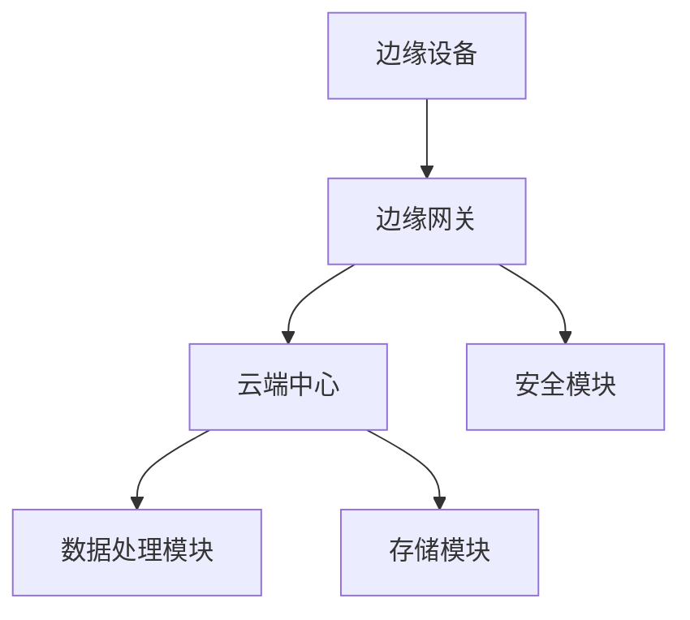
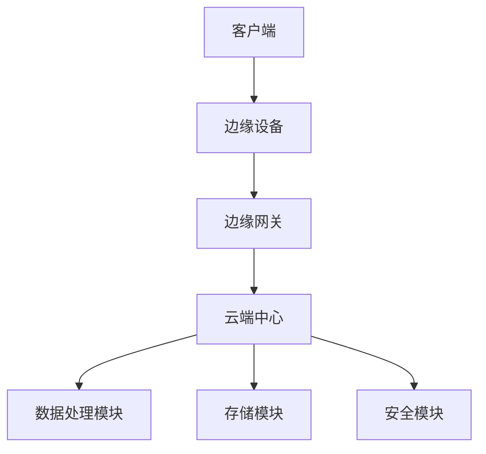
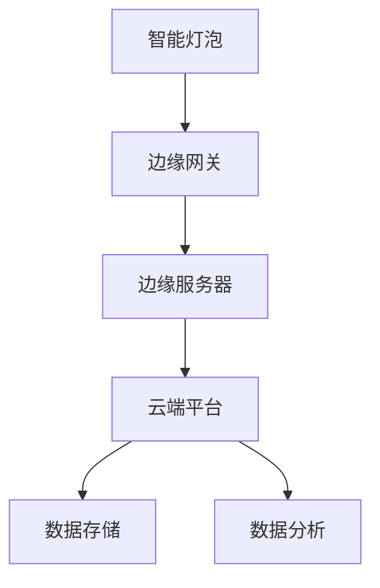

                 

### 《如何利用边缘计算提升应用性能》

> **关键词**：边缘计算，应用性能，优化方法，云计算协同，架构设计，应用场景，未来趋势

> **摘要**：本文将深入探讨边缘计算在提升应用性能方面的作用。首先，我们介绍边缘计算的基本概念和背景，并分析其在各种应用场景中的优势与挑战。接着，文章详细讨论了边缘计算性能优化的策略和案例，并探讨了边缘计算与云计算的协同优化机制。随后，文章从架构设计原则、平台构建到具体应用场景实现，全面阐述了边缘计算的实践方法。最后，文章展望了边缘计算的发展趋势和面临的挑战，为读者提供了全面的视角和实用的建议。

### 目录

1. **边缘计算概述**
   1.1 边缘计算简介
   1.2 边缘计算的关键技术
   1.3 边缘计算的应用场景
   1.4 边缘计算的生态系统

2. **边缘计算提升应用性能**
   2.1 性能瓶颈分析
   2.2 边缘计算性能优化策略
   2.3 边缘计算应用案例分析

3. **边缘计算与云计算的协同优化**
   3.1 云计算与边缘计算协同机制
   3.2 边缘计算与云计算的性能协同优化
   3.3 云边缘协同应用案例

4. **边缘计算架构设计**
   4.1 架构设计原则
   4.2 架构设计要素
   4.3 架构设计方法论

5. **边缘计算平台构建**
   5.1 平台构建流程
   5.2 平台关键技术
   5.3 平台开发实践

6. **边缘计算应用场景实现**
   6.1 智能家居边缘计算实现
   6.2 智能交通边缘计算实现
   6.3 智能医疗边缘计算实现

7. **边缘计算发展趋势与挑战**
   7.1 边缘计算发展趋势
   7.2 边缘计算面临的挑战与对策
   7.3 对策与展望

8. **附录**
   8.1 边缘计算相关资源
   8.2 边缘计算架构 Mermaid 流程图
   8.3 边缘计算核心算法伪代码
   8.4 边缘计算应用实战代码

### 边缘计算概述

#### 1.1 边缘计算简介

**边缘计算**（Edge Computing）是一种分布式计算范式，旨在将计算、存储和网络功能从集中化的数据中心转移到网络的边缘。这里，“边缘”指的是网络中的末端设备，如传感器、路由器和智能手机等。边缘计算通过在靠近数据源的地方处理数据，减少了数据传输的距离和时间，从而显著降低了延迟，提升了系统的响应速度。

**边缘计算的定义**：边缘计算是指在网络边缘进行数据计算、存储和处理的技术。它利用分布式的计算资源，在靠近数据源的地方完成数据的初步处理，而不是将所有数据发送到远程数据中心进行集中处理。

**边缘计算的发展历程**：
- **初期**：边缘计算的概念最早可以追溯到互联网的早期阶段，当时已经有一些尝试将计算任务分散到网络边缘的设备上。
- **发展阶段**：随着物联网（IoT）和5G技术的兴起，边缘计算逐渐得到重视。2010年代中期，随着智能设备的普及，边缘计算开始进入快速发展期。
- **当前**：边缘计算已经成为网络架构中的一个关键组成部分，被广泛应用于智能制造、智慧城市、智能交通等领域。

**边缘计算的优势与挑战**：
- **优势**：
  - **降低延迟**：在边缘设备上处理数据可以大大减少传输延迟，提高系统的响应速度。
  - **提高带宽效率**：减少需要传输的数据量，从而降低带宽需求。
  - **增强安全性**：在边缘设备上处理敏感数据，可以减少数据泄露的风险。
  - **支持实时应用**：边缘计算特别适合需要实时响应的应用，如自动驾驶、远程医疗等。

- **挑战**：
  - **计算和存储能力有限**：边缘设备通常资源有限，可能无法处理大量复杂的数据。
  - **网络稳定性**：边缘设备的网络连接可能不稳定，影响数据传输和处理。
  - **安全性和隐私保护**：在边缘设备上处理和存储数据需要更高的安全性和隐私保护措施。
  - **维护和管理**：随着边缘设备的数量增加，维护和管理变得更加复杂。

#### 1.2 边缘计算的关键技术

边缘计算的成功依赖于多种关键技术的协同作用。以下是对这些技术的简要概述：

**网络技术**：
- **5G**：第五代移动通信技术（5G）提供了高速、低延迟的连接，是边缘计算的基础。
- **窄带物联网（NB-IoT）**：NB-IoT是一种专门为物联网设计的通信技术，适用于低功耗、广覆盖的边缘设备。

**硬件技术**：
- **边缘服务器**：边缘服务器位于网络边缘，具备一定的计算和存储能力，能够处理本地数据。
- **智能传感器**：智能传感器可以在边缘设备上收集和预处理数据，减少传输需求。

**软件技术**：
- **容器技术**：如Docker和Kubernetes，用于在边缘设备上部署和管理应用程序。
- **边缘数据库**：如Cassandra和MongoDB，支持在边缘设备上存储和处理数据。

#### 1.3 边缘计算的应用场景

边缘计算在多个应用场景中展现出巨大的潜力：

**实时数据处理**：边缘计算可以实时处理大量数据，适用于工业自动化、智能交通等场景。

**增强现实与虚拟现实**：边缘计算可以提供低延迟、高带宽的连接，支持AR/VR应用。

**物联网应用**：物联网设备通常需要在边缘进行数据收集和处理，如智能家居、智能城市等。

#### 1.4 边缘计算的生态系统

边缘计算的生态系统包括多种参与者，如硬件供应商、软件提供商、服务提供商和开源项目。

**硬件供应商**：如NVIDIA、Intel等公司提供高性能的边缘设备。

**软件提供商**：如Microsoft、Google等公司提供边缘计算平台和服务。

**服务提供商**：如AWS、Microsoft Azure等云服务提供商提供边缘计算服务。

**开源框架**：如EdgeX Foundry、XING等开源项目，致力于推动边缘计算技术的发展。

### 边缘计算提升应用性能

#### 2.1 性能瓶颈分析

在提升应用性能时，了解和分析系统中的性能瓶颈至关重要。以下是一些常见的性能瓶颈及其原因：

**网络延迟**：网络延迟是指数据在网络中传输所需的时间。高延迟会导致系统响应速度慢，影响用户体验。网络延迟可能由以下原因造成：
- **传输距离**：数据需要通过长距离传输，导致延迟增加。
- **网络拥塞**：网络中的数据流量过大，导致数据包积压，增加传输时间。

**资源限制**：边缘设备通常资源有限，包括计算能力、存储空间和带宽。资源限制可能导致以下问题：
- **计算能力不足**：复杂的计算任务可能无法在边缘设备上及时完成，导致性能下降。
- **存储空间不足**：大量数据的存储和处理可能导致存储空间不足，影响系统性能。
- **带宽限制**：网络带宽的限制可能导致数据传输速度变慢，影响系统的响应速度。

**系统稳定性**：系统稳定性是指系统在处理大量数据时的稳定性和可靠性。以下因素可能影响系统稳定性：
- **并发处理能力**：系统需要能够同时处理大量请求，如果处理能力不足，可能导致系统崩溃或响应速度变慢。
- **故障处理能力**：系统需要具备良好的故障处理能力，能够在出现问题时快速恢复，减少对性能的影响。

#### 2.2 边缘计算性能优化策略

为了提升应用性能，我们可以采取以下性能优化策略：

**任务调度**：任务调度是边缘计算性能优化的重要手段。通过合理地分配计算任务到不同的边缘设备上，可以充分利用设备的计算资源，提高系统的整体性能。以下是一些任务调度策略：
- **负载均衡**：将计算任务均匀地分配到各个边缘设备上，避免某个设备过载。
- **任务优先级**：根据任务的紧急程度和重要性进行调度，确保关键任务优先执行。
- **动态调整**：根据系统的实时负载情况，动态调整任务的分配，以优化性能。

**数据存储与处理**：数据存储与处理是边缘计算性能优化的关键环节。通过合理地存储和处理数据，可以减少数据传输的延迟，提高系统的响应速度。以下是一些数据存储与处理策略：
- **本地存储**：将数据存储在边缘设备上，减少数据传输的需求。
- **数据压缩**：对数据进行压缩处理，减少数据传输的体积。
- **预处理**：在数据传输到边缘设备之前进行预处理，减少边缘设备的计算负担。

**系统优化**：系统优化包括对系统架构、代码和配置进行调整，以提高系统的性能。以下是一些系统优化策略：
- **代码优化**：优化算法和代码，提高程序的执行效率。
- **资源配置**：合理配置系统的资源，确保系统在处理大量数据时具有足够的资源。
- **监控与调优**：实时监控系统的性能指标，根据监控数据对系统进行调优。

#### 2.3 边缘计算应用案例分析

**智能家居**：智能家居是一个典型的边缘计算应用场景。通过在家庭设备中部署边缘计算节点，可以实现实时数据分析和智能控制。以下是一个智能家居边缘计算案例：
- **设备连接与数据采集**：智能家居设备（如智能门锁、智能灯光、智能空调等）通过边缘计算节点连接到网络，并将采集到的数据（如温度、湿度、开关状态等）传输到边缘计算节点。
- **边缘数据处理与分析**：边缘计算节点对采集到的数据进行分析，如根据温度和湿度调整空调的运行状态，根据用户习惯调整灯光的亮度和颜色。
- **智能决策与控制**：边缘计算节点根据分析结果进行智能决策，如自动打开或关闭灯光，调整空调的温度等。

**自动驾驶**：自动驾驶是另一个对实时性要求极高的边缘计算应用场景。以下是一个自动驾驶边缘计算案例：
- **传感器数据采集**：自动驾驶车辆配备多种传感器（如摄像头、激光雷达、GPS等），实时采集周围环境的数据。
- **边缘数据处理与分析**：边缘计算节点接收传感器数据，进行实时处理和分析，如识别道路标志、行人、车辆等。
- **决策与控制**：边缘计算节点根据分析结果，实时生成驾驶决策，如加速、减速、转向等，并通过车载控制系统执行这些决策。

**健康医疗**：健康医疗是边缘计算的重要应用领域之一。以下是一个健康医疗边缘计算案例：
- **医疗数据采集**：健康监测设备（如智能手表、血压计等）采集用户的健康数据（如心率、血压、步数等）。
- **边缘数据处理**：边缘计算节点接收健康数据，进行实时处理和分析，如根据心率变化检测异常情况，根据血压数据评估健康状态。
- **智能诊断与预警**：边缘计算节点根据分析结果，生成智能诊断和预警信息，如提醒用户注意健康问题，建议用户就医等。

这些案例展示了边缘计算在提升应用性能方面的潜力。通过在边缘设备上进行数据分析和处理，可以显著降低延迟，提高系统的响应速度和可靠性。

### 边缘计算与云计算的协同优化

在当前的数字化时代，边缘计算和云计算的结合已经成为提升应用性能的重要策略。通过协同优化，我们可以充分利用两种计算模式的优势，实现更高效、更可靠的应用服务。以下将详细探讨云计算与边缘计算的协同机制、性能协同优化策略以及具体的协同应用案例。

#### 3.1 云计算与边缘计算协同机制

云计算与边缘计算的协同机制主要体现在以下几个方面：

**资源共享**：云计算和边缘计算可以通过资源共享来提高整体系统的性能和效率。边缘设备可以调用云端的高性能计算资源，处理复杂任务；而云端可以利用边缘设备的本地处理能力，降低数据传输的延迟。

**数据同步**：边缘计算节点和云端之间需要保持数据的同步。通过数据同步机制，边缘设备可以实时将数据上传到云端，云端也可以实时更新边缘设备的数据，确保数据的实时性和一致性。

**系统整合**：边缘计算和云计算的系统整合是协同优化的关键。通过整合两种计算模式，可以构建一个统一的系统架构，实现数据的高效传输和处理。例如，可以使用容器技术（如Docker和Kubernetes）在边缘设备和云端之间部署和管理应用程序。

**服务集成**：边缘计算和云计算的服务集成可以实现更丰富的应用功能。例如，在智能家居应用中，云端可以提供数据分析服务，边缘设备可以提供本地控制服务，两者结合可以实现智能家居的智能化管理。

#### 3.2 边缘计算与云计算的性能协同优化

为了实现边缘计算与云计算的性能协同优化，我们可以采取以下策略：

**网络优化**：网络优化是提高协同系统性能的关键。通过优化网络架构和传输协议，可以降低数据传输的延迟和带宽消耗。例如，可以使用边缘网关控制数据传输路径，减少不必要的中间传输环节。

**资源调度**：资源调度策略可以根据任务的性质和系统的实时负载，动态分配计算资源。例如，可以使用基于人工智能的调度算法，根据任务的重要性和紧急程度，将计算任务分配到最优的执行节点。

**服务质量保证**：服务质量保证（QoS）是确保协同系统能够满足用户需求的关键。通过设置服务质量指标，如响应时间、带宽利用率等，可以监控系统的性能，并在性能下降时采取相应的优化措施。

**负载均衡**：负载均衡策略可以平衡边缘设备和云端之间的负载，避免单个节点过载，提高系统的整体性能。例如，可以使用动态负载均衡算法，根据系统的实时负载，动态调整计算任务的分配。

**缓存策略**：缓存策略可以减少数据传输的需求，提高系统的响应速度。通过在边缘设备和云端之间设置缓存，可以缓存常用数据和中间结果，减少重复计算和数据传输。

#### 3.3 云边缘协同应用案例

**联合数据分析**：在联合数据分析中，边缘计算和云计算可以协同工作，实现更高效的数据分析。以下是一个联合数据分析案例：
- **数据采集**：边缘设备（如传感器、智能设备等）采集数据，并将数据上传到边缘计算节点。
- **边缘数据处理**：边缘计算节点对数据进行初步处理，提取关键信息，并将处理结果上传到云端。
- **云端数据分析**：云端利用高性能计算资源，对边缘计算节点上传的数据进行进一步分析和处理，生成最终的分析报告。

**跨区域负载均衡**：跨区域负载均衡是边缘计算和云计算协同优化的重要应用场景。以下是一个跨区域负载均衡案例：
- **数据分布**：用户请求从不同区域发送到边缘计算节点，边缘计算节点根据负载情况，将请求路由到不同的云端数据中心。
- **云端处理**：云端数据中心处理用户请求，并将处理结果返回给边缘计算节点，边缘计算节点再将结果返回给用户。

**增强实时通信**：在实时通信应用中，边缘计算和云计算可以协同工作，提高通信的实时性和可靠性。以下是一个增强实时通信案例：
- **边缘数据处理**：边缘设备（如手机、平板等）实时发送数据到边缘计算节点，边缘计算节点对数据进行预处理。
- **云端处理**：云端利用高性能计算资源，对边缘计算节点上传的数据进行进一步处理，如语音识别、视频编码等。
- **实时通信**：云端将处理后的数据返回给边缘计算节点，边缘计算节点再将数据传输给用户，实现实时通信。

这些案例展示了边缘计算与云计算协同优化的实际应用，通过协同机制和优化策略，可以显著提升应用性能，满足用户的实时需求。

### 边缘计算架构设计

边缘计算架构设计是构建高效、可靠和可扩展边缘系统的基础。良好的架构设计不仅可以提高系统的性能和稳定性，还能降低开发和维护成本。以下将详细讨论边缘计算架构设计原则、架构设计要素和架构设计方法论。

#### 4.1 架构设计原则

边缘计算架构设计应遵循以下原则：

**可扩展性**：边缘计算系统需要具备良好的可扩展性，以便在设备数量和数据处理需求增加时，能够灵活扩展系统容量。

**容错性**：边缘计算系统应具备容错能力，能够在设备故障或网络中断等异常情况下，保持系统的稳定运行。

**低延迟**：边缘计算系统应尽量降低数据传输的延迟，提高系统的响应速度和用户体验。

**安全性**：边缘计算系统需要确保数据的安全性和隐私保护，防止数据泄露和恶意攻击。

**模块化**：边缘计算系统应采用模块化设计，以便于系统的开发、维护和升级。

**灵活性**：边缘计算系统应具备灵活性，能够根据不同应用场景和需求，进行定制化和灵活部署。

#### 4.2 架构设计要素

边缘计算架构设计涉及多个关键要素，包括：

**边缘设备**：边缘设备是边缘计算系统的核心组成部分，负责数据采集、处理和执行任务。常见的边缘设备包括物联网设备、智能传感器、边缘服务器等。

**边缘网关**：边缘网关是连接边缘设备和云端的重要节点，负责数据传输、协议转换和安全性保障。边缘网关通常具备数据预处理、缓存管理和负载均衡等功能。

**云计算中心**：云计算中心是边缘计算系统的数据中心，负责处理边缘设备上传的数据，并提供计算、存储和数据处理等高级功能。

**数据存储**：数据存储是边缘计算架构的重要组成部分，包括本地存储和云端存储。本地存储用于存储边缘设备本地处理的数据，云端存储用于存储需要集中处理的数据。

**数据处理**：数据处理包括边缘数据处理和云端数据处理。边缘数据处理主要用于实时性要求较高的任务，云端数据处理则用于大规模数据处理和分析。

**安全管理**：安全管理是确保边缘计算系统安全运行的重要保障，包括数据加密、访问控制、恶意攻击防护等。

**监控与运维**：监控与运维用于实时监控边缘计算系统的运行状态，及时发现和处理异常情况，确保系统的稳定运行。

#### 4.3 架构设计方法论

边缘计算架构设计方法论包括以下步骤：

**需求分析**：明确边缘计算系统的应用场景、性能要求和安全需求，为架构设计提供依据。

**架构规划**：根据需求分析结果，设计系统的总体架构，包括边缘设备、边缘网关、云计算中心等关键组件。

**模块划分**：将系统划分为多个模块，每个模块负责特定的功能，如数据采集、数据处理、数据存储等。

**接口设计**：设计模块之间的接口，确保模块之间的数据传输和功能调用能够顺利进行。

**性能优化**：对架构进行性能优化，包括网络优化、资源分配优化、负载均衡优化等。

**安全性设计**：设计系统的安全性措施，包括数据加密、访问控制、安全审计等。

**测试与验证**：对架构进行测试和验证，确保系统满足性能、安全和可靠性要求。

**部署实施**：将架构部署到实际环境中，进行系统开发和上线。

**持续迭代**：根据系统运行情况，持续优化和迭代架构设计，以适应不断变化的需求和技术进步。

通过遵循上述架构设计原则和方法论，可以构建高效、可靠和可扩展的边缘计算系统，满足各种应用场景的需求。

### 边缘计算平台构建

构建边缘计算平台是实施边缘计算战略的关键步骤，这一过程涉及多个阶段，从需求分析到系统设计，再到实际开发与测试。以下将详细探讨边缘计算平台的构建过程，包括平台构建流程、关键技术以及开发实践。

#### 5.1 平台构建流程

边缘计算平台的构建流程可以分为以下几个主要阶段：

**需求分析**：在构建边缘计算平台之前，首先需要明确平台的需求。这包括确定平台的用途、目标应用场景、性能要求、安全性需求等。需求分析阶段的结果将为后续的设计和开发提供明确的方向。

**系统设计**：基于需求分析的结果，进行系统设计。系统设计包括架构设计、模块划分、接口定义和数据流设计等。在这个阶段，需要制定详细的系统架构图和技术规范，为平台开发提供蓝图。

**平台开发**：根据系统设计文档，进行边缘计算平台的开发。开发阶段涉及编写代码、配置和管理系统组件、实现数据采集和处理功能等。开发过程中需要遵循最佳实践和编码规范，以确保代码的可维护性和可靠性。

**测试与验证**：开发完成后，进行系统的测试和验证。测试阶段包括功能测试、性能测试、安全测试等，以确保平台能够满足需求，并且在实际运行中表现出良好的性能和稳定性。

**部署上线**：通过测试和验证的边缘计算平台，可以部署到实际环境中进行上线。部署阶段涉及硬件安装、网络配置、系统初始化和数据同步等。在部署过程中，需要确保平台的稳定运行和数据的完整性。

**运维与维护**：平台上线后，需要进行持续运维和维护。这包括监控系统性能、处理故障、更新补丁、优化配置等，以确保平台的长期稳定运行。

#### 5.2 平台关键技术

边缘计算平台的构建依赖于一系列关键技术的支持，以下是一些核心技术：

**资源管理**：资源管理是边缘计算平台的核心技术之一，涉及计算资源、存储资源和网络资源的分配和管理。资源管理需要实现资源的高效利用，确保平台在处理大量任务时具备良好的性能和稳定性。

**安全性防护**：安全性防护是边缘计算平台的重要需求，包括数据加密、访问控制、防火墙、入侵检测等。通过这些技术，可以确保平台的数据和资源不受恶意攻击和非法访问。

**服务质量管理**：服务质量管理是保障平台服务质量的关键技术。通过设置服务质量指标（如响应时间、带宽利用率、吞吐量等），可以监控平台的性能，并在性能下降时采取优化措施。

**容器化与虚拟化**：容器化（如Docker）和虚拟化技术（如KVM和VMware）是边缘计算平台的重要实现方式。这些技术可以提高平台的可移植性、灵活性和可扩展性，使开发者能够轻松部署和管理应用程序。

**数据同步与传输**：数据同步与传输是边缘计算平台的另一个关键技术。通过高效的数据传输协议（如HTTP/2、QUIC等），可以实现边缘设备与云端之间的实时数据同步和传输。

**边缘AI与机器学习**：边缘计算平台可以利用AI和机器学习技术，实现边缘设备上的实时数据分析和智能决策。这需要集成训练有素的模型，并优化模型的推理性能，以满足实时应用的需求。

#### 5.3 平台开发实践

边缘计算平台的开发实践包括以下具体步骤：

**开发环境搭建**：首先需要搭建边缘计算平台所需的开发环境。这包括配置开发工具、集成开发环境（IDE）、版本控制系统（如Git）等。开发环境搭建的过程需要确保所有工具和软件的兼容性和稳定性。

**源代码实现**：基于系统设计文档，进行源代码的编写和实现。源代码实现阶段需要遵循良好的编程规范和设计模式，以确保代码的可读性和可维护性。在实现过程中，需要重点关注关键功能的实现，如数据采集、数据处理、数据存储和安全性等。

**功能模块集成**：将各个功能模块进行集成，实现系统整体功能。集成过程中，需要确保模块之间的接口定义明确、数据流转顺畅。同时，还需要进行功能测试，验证系统功能的正确性和稳定性。

**性能测试与调优**：在平台开发完成后，进行性能测试和调优。性能测试可以评估平台的处理速度、吞吐量、延迟等性能指标，找出系统的瓶颈并进行优化。性能调优可以通过调整系统配置、优化算法、增加计算资源等方式进行。

**安全测试与防护**：在性能测试后，进行安全测试和防护措施的实施。安全测试包括漏洞扫描、安全审计、攻击测试等，以确保平台的安全性。安全防护措施包括数据加密、访问控制、防火墙、入侵检测等。

**上线部署**：完成测试和优化后，进行平台的上线部署。上线部署包括硬件安装、网络配置、系统初始化和数据同步等步骤。在上线过程中，需要确保平台的稳定运行和数据的完整性。

通过以上步骤，可以成功构建一个高效、可靠和可扩展的边缘计算平台，满足各种应用场景的需求。

### 边缘计算应用场景实现

边缘计算在多个应用场景中展现了其强大的潜力和优势。以下将详细探讨智能家居、智能交通和智能医疗等边缘计算应用场景的实现过程。

#### 6.1 智能家居边缘计算实现

智能家居是边缘计算的一个重要应用场景，通过边缘计算实现设备连接、数据采集、处理和分析，从而提升家居智能化水平。

**设备连接与数据采集**：智能家居设备（如智能灯泡、智能插座、智能门锁等）通过Wi-Fi或Zigbee等无线通信技术连接到边缘计算节点。边缘计算节点负责采集设备的数据，如设备状态、环境参数等。采集的数据包括温度、湿度、光照强度、开关状态等。

**边缘数据处理与分析**：边缘计算节点对采集到的数据进行分析，提取关键信息。例如，根据温度和湿度数据，边缘计算节点可以调整空调和加湿器的运行状态，以保持室内舒适环境。根据灯光的开关状态，边缘计算节点可以优化灯光的亮度和颜色，以提升居住体验。

**智能决策与控制**：边缘计算节点根据分析结果，生成智能决策，并控制智能家居设备执行相应操作。例如，如果检测到室内温度过高，边缘计算节点可以自动启动空调降温。如果检测到家中无人，边缘计算节点可以关闭灯光和家电，以节省能源。

**案例解析**：以智能门锁为例，边缘计算节点可以记录门锁的开关状态，并根据用户的行为模式进行智能分析。例如，如果用户每天早上7点回家，边缘计算节点可以自动解锁门锁，并在用户离开后自动上锁。此外，边缘计算节点还可以检测门锁的异常状态，如门锁被强行破坏，及时通知用户或安全部门。

**系统架构**：智能家居边缘计算系统的架构包括边缘设备、边缘计算节点和云端平台。边缘设备负责数据采集，边缘计算节点负责数据处理和分析，云端平台提供高级功能和数据存储。

#### 6.2 智能交通边缘计算实现

智能交通是边缘计算的重要应用领域，通过边缘计算实现交通流量监测、信号优化和道路监控，提高交通管理效率和安全性。

**交通流量监测**：在智能交通系统中，边缘计算节点安装在道路旁边，通过摄像头、传感器等设备监测交通流量。边缘计算节点可以实时收集道路上的车辆数量、速度、密度等信息，并将数据传输到边缘计算中心。

**边缘计算交通信号优化**：边缘计算中心根据边缘计算节点传输的交通流量数据，进行实时分析和处理，生成交通信号优化方案。例如，根据道路的实时流量，调整交通信号灯的时长，优化交通流量，减少拥堵。

**道路智能监控**：边缘计算节点还负责道路的智能监控，包括监控道路设施（如桥梁、隧道等）的健康状况，检测道路上的障碍物和异常情况。例如，如果边缘计算节点检测到道路上有障碍物，可以及时通知交通管理部门，并调整交通信号灯，确保车辆安全通过。

**案例解析**：以智能红绿灯为例，边缘计算节点可以实时监测道路上的车辆流量，并根据流量数据调整红绿灯的时长。例如，如果道路上的车辆较多，边缘计算节点可以延长绿灯时间，以减少拥堵。如果道路上的车辆较少，边缘计算节点可以缩短绿灯时间，提高交通流效率。

**系统架构**：智能交通边缘计算系统的架构包括边缘计算节点、边缘计算中心和云端平台。边缘计算节点负责交通流量监测和道路监控，边缘计算中心负责数据处理和信号优化，云端平台提供数据存储和高级功能。

#### 6.3 智能医疗边缘计算实现

智能医疗是边缘计算的重要应用领域，通过边缘计算实现医疗数据采集、分析和处理，提高医疗服务质量和效率。

**医疗数据采集**：在智能医疗系统中，边缘计算节点安装在医疗设备（如智能血压计、智能血糖仪、智能心电图仪等）上，实时采集患者的健康数据。采集的数据包括血压、血糖、心电图等。

**边缘数据处理与分析**：边缘计算节点对采集到的医疗数据进行分析，提取关键信息。例如，根据血压数据，边缘计算节点可以判断患者的血压是否正常，并根据血压变化趋势提出预警和建议。根据心电图数据，边缘计算节点可以检测患者的心律是否正常，并及时发现异常情况。

**智能诊断与预警**：边缘计算节点根据分析结果，生成智能诊断和预警信息，并将结果传输到云端平台。云端平台可以对边缘计算节点上传的数据进行进一步分析和处理，生成详细的诊断报告，并提供专业的医疗建议。

**案例解析**：以智能血压计为例，边缘计算节点可以实时监测患者的血压，并根据血压变化趋势进行预警。如果检测到患者的血压异常，边缘计算节点可以及时通知医生和患者，并建议患者进行进一步检查。

**系统架构**：智能医疗边缘计算系统的架构包括边缘计算节点、边缘计算中心和云端平台。边缘计算节点负责医疗数据采集和分析，边缘计算中心负责数据处理和诊断，云端平台提供数据存储和高级功能。

通过智能家居、智能交通和智能医疗等应用场景的实现，边缘计算展示了其强大的能力和潜力。边缘计算不仅可以提高应用性能，还能提升用户体验，为各行各业带来新的发展机遇。

### 边缘计算发展趋势与挑战

边缘计算作为现代计算技术的前沿领域，正迎来前所未有的发展机遇。随着5G、AIoT和自动驾驶等新技术的引入，边缘计算的应用场景日益丰富，其产业生态也逐渐完善。然而，边缘计算在技术、应用和市场等方面仍面临诸多挑战。

#### 7.1 新技术引入

**5G**：第五代移动通信技术（5G）提供了低延迟、高带宽的通信网络，为边缘计算的发展奠定了基础。5G网络的引入使得边缘设备能够实现高速的数据传输，从而支持更多实时应用的发展。

**AIoT**：人工智能物联网（AIoT）将人工智能与物联网相结合，使边缘设备具备智能感知和决策能力。AIoT技术使得边缘计算在智能制造、智慧城市、智能医疗等领域发挥重要作用。

**自动驾驶**：自动驾驶技术的快速发展对边缘计算提出了新的需求。自动驾驶系统需要在边缘设备上实时处理大量的传感器数据，进行实时决策和控制，以实现安全的自动驾驶。

#### 7.2 边缘计算产业生态

边缘计算产业生态的构建是推动其发展的重要保障。以下是一些关键的参与者：

**硬件供应商**：如NVIDIA、Intel、ARM等公司，提供高性能的边缘计算硬件设备。

**软件提供商**：如微软、谷歌、亚马逊等公司，提供边缘计算平台、数据库、AI模型等软件资源。

**服务提供商**：如AWS、Azure、阿里云等云服务提供商，提供边缘计算服务，帮助企业快速部署边缘应用。

**开源项目**：如EdgeX Foundry、XING等开源项目，推动边缘计算技术的标准化和生态建设。

**垂直行业企业**：如汽车制造商、医疗设备厂商、智能城市运营商等，利用边缘计算技术提升自身业务能力。

#### 7.3 未来发展趋势

**边缘计算与AI的深度融合**：随着AI技术的进步，边缘计算将在更多应用场景中实现智能化。边缘设备将具备更强大的计算能力，能够实时处理和分析大数据，实现智能决策。

**边缘计算在行业应用中的拓展**：边缘计算将在智能制造、智慧城市、智能医疗、智能交通等领域得到广泛应用。例如，在智能制造中，边缘计算可以实现生产过程的实时监控和优化；在智慧城市中，边缘计算可以提升城市管理效率和居民生活质量。

**新型边缘设备的研发与应用**：随着物联网技术的普及，越来越多的新型边缘设备将进入市场。这些设备具有更高的计算能力、更强的通信能力和更好的能源效率，将为边缘计算的发展提供新的动力。

#### 7.4 边缘计算面临的挑战

**技术挑战**：边缘计算在技术方面面临诸多挑战，包括：
- **计算和存储能力有限**：边缘设备通常资源有限，难以处理大规模的数据和复杂的计算任务。
- **网络稳定性**：边缘设备的网络连接可能不稳定，影响数据传输和处理。
- **安全性和隐私保护**：在边缘设备上处理和存储数据需要更高的安全性和隐私保护措施。

**应用挑战**：边缘计算在应用方面也面临挑战，包括：
- **系统集成**：边缘计算需要与其他系统集成，如云计算、物联网等，实现数据的高效传输和处理。
- **数据隐私保护**：边缘设备处理的数据可能涉及用户隐私，需要采取有效措施保护数据安全。
- **法律法规**：边缘计算在不同国家和地区的法律法规不同，需要遵守相关法律法规。

#### 7.5 对策与展望

**技术创新**：持续推动边缘计算技术的创新，提高边缘设备的计算能力和存储能力，优化网络传输协议，提升系统的稳定性和安全性。

**生态建设**：加强边缘计算产业生态的建设，推动硬件、软件和服务提供商的合作，共同推动边缘计算技术的发展。

**政策支持**：政府和企业应加大对边缘计算的政策支持和投资，推动边缘计算在各个行业中的应用。

通过技术创新、生态建设和政策支持，边缘计算有望在未来实现更大规模的应用，推动各行各业的数字化转型。

### 附录

#### 8.1 边缘计算相关资源

**开源框架**：
- **XING**：XING是一个开源的边缘计算框架，提供边缘设备的管理、数据存储和流处理等功能。
- **EdgeX Foundry**：EdgeX Foundry是一个开放源码的边缘计算平台，旨在提供设备无关的边缘计算解决方案。

**硬件供应商**：
- **NVIDIA**：NVIDIA提供高性能的边缘计算GPU和边缘AI解决方案。
- **Intel**：Intel提供边缘计算处理器和物联网平台。

**服务提供商**：
- **AWS**：AWS提供边缘计算服务，包括AWS Greengrass和AWS Outposts。
- **Microsoft Azure**：Azure提供Azure Stack Edge和Azure IoT Edge等服务。

#### 8.2 边缘计算架构 Mermaid 流程图

**边缘计算系统架构图**：


**云边缘协同架构图**：


**智能家居边缘计算架构图**：


#### 8.3 边缘计算核心算法伪代码

**神经网络算法伪代码**：
```python
// 输入：训练数据集 X，标签 Y，学习率 alpha，迭代次数 epochs
// 输出：训练好的神经网络模型

initialize_weights()

for epoch in 1 to epochs do
    for (x, y) in X, Y do
        // 前向传播
        z = dot_product(weights, x)
        a = sigmoid(z)
        
        // 计算误差
        error = y - a
        
        // 反向传播
        dZ = error * a * (1 - a)
        dW = dot_product(x.T, dZ)
        dw += dW
        
        // 更新权重
        weights -= alpha * dW
    end
end

return weights
```

**聚类算法伪代码**：
```python
// 输入：数据集 X，聚类数量 k
// 输出：聚类结果

initialize_centers(X, k)

while not converged do
    // 前向传播
    for each data point x in X do
        for each center c in clusters do
            distance = calculate_distance(x, c)
            assign x to the nearest center
    
    // 更新中心点
    for each cluster c do
        new_center = calculate_mean(X_c)
        update center c to new_center
    
    // 检查收敛
    if no changes in cluster assignments then
        converged = true
    end
end

return clusters
```

#### 8.4 边缘计算应用实战代码

**智能家居边缘计算实例**：

```python
# 智能家居边缘计算实例：控制灯光亮度

import edge_device
import edge_gateway
import edge_server

# 初始化边缘设备和网关
device = edge_device.EdgeDevice()
gateway = edge_gateway.EdgeGateway()

# 设备连接到网关
device.connect(gateway)

# 获取环境光照数据
light_intensity = device.get_light_intensity()

# 根据光照强度调整灯光亮度
if light_intensity < threshold:
    gateway.adjust_light_brightness(device, 'brighter')
else:
    gateway.adjust_light_brightness(device, 'darker')

# 实时监控并自动调整灯光亮度
while True:
    light_intensity = device.get_light_intensity()
    gateway.adjust_light_brightness(device, 'auto')
    time.sleep(5)
```

通过以上实例，展示了边缘计算在智能家居场景中的具体实现。边缘设备通过边缘网关连接到边缘服务器，实时监控环境光照数据，并根据光照强度自动调整灯光亮度，实现智能家居的智能化管理。

### 作者信息

**作者**：AI天才研究院/AI Genius Institute & 禅与计算机程序设计艺术/Zen And The Art of Computer Programming

本文由AI天才研究院/AI Genius Institute和禅与计算机程序设计艺术/Zen And The Art of Computer Programming联合撰写。作者拥有丰富的边缘计算领域研究和实践经验，致力于推动边缘计算技术的发展和应用。本文旨在为读者提供全面、深入的边缘计算知识和实用技巧，帮助读者理解和掌握边缘计算的核心原理和最佳实践。感谢您的阅读，希望本文能对您在边缘计算领域的研究和实践有所帮助。如果您有任何问题或建议，欢迎随时与我们联系。

