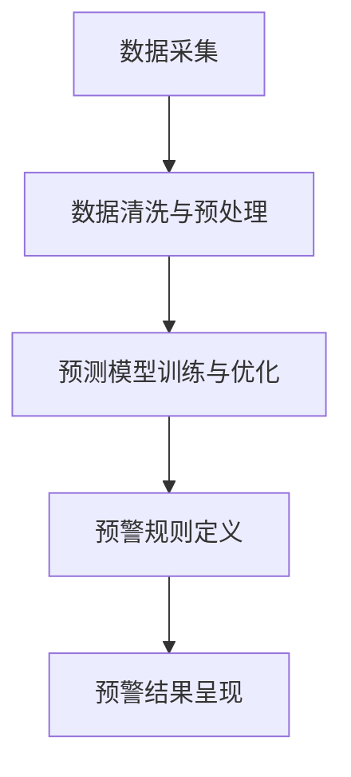
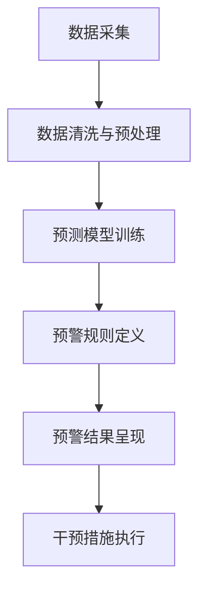
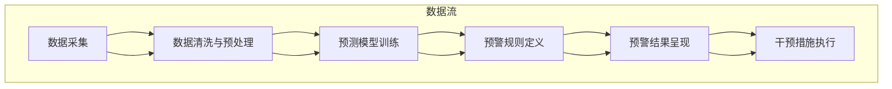

                 

# 如何打造高效的客户成功预警系统

> **关键词：** 客户成功预警系统，数据分析，机器学习，预测算法，项目实战

> **摘要：** 本文将详细介绍如何打造一个高效的客户成功预警系统。我们将从核心概念、架构设计、核心算法原理讲解，到实际项目实战进行深度剖析，帮助读者全面理解并掌握客户成功预警系统的构建方法和实现技巧。

---

### 目录大纲

1. **核心概念与架构**
   1.1 引言
   1.2 数据分析与预测
   1.3 客户成功预警系统的组成部分
   1.4 Mermaid流程图

2. **核心算法原理讲解**
   2.1 数据分析与预测算法
   2.2 数学模型与公式
   2.3 数学模型详细讲解与举例说明

3. **项目实战**
   3.1 实际案例介绍
   3.2 开发环境搭建
   3.3 源代码实现
   3.4 代码解读与分析

4. **附录**
   4.1 工具与资源

---

## 第一部分：核心概念与架构

### 1.1 引言

在现代商业环境中，客户成功预警系统的重要性日益凸显。随着市场竞争的加剧，企业需要更加敏锐地捕捉客户需求变化，及时调整战略和运营，以保持竞争优势。客户成功预警系统作为一种智能化的工具，能够通过分析大量数据，预测客户未来的行为和需求，从而帮助企业提前采取行动，避免潜在的问题。

本文将带领读者深入了解客户成功预警系统的构建过程，从核心概念、架构设计，到核心算法原理讲解，再到实际项目实战，全方位解析如何打造一个高效的客户成功预警系统。

### 1.2 数据分析与预测

数据分析与预测是客户成功预警系统的核心组成部分。通过数据分析，我们可以从大量数据中提取出有价值的信息，为预测提供依据。而预测则是根据历史数据和现有信息，对未来可能发生的事件进行推测。

#### 1.2.1 数据分析基础

数据分析的基础包括数据收集、数据清洗、数据探索和数据可视化。数据收集是获取原始数据的过程，数据清洗是为了去除数据中的噪声和错误，数据探索是通过对数据进行分析，发现数据中的模式和关系，数据可视化则是通过图表和图形的方式展示数据。

#### 1.2.2 预测模型选择

预测模型的类型有很多，如时间序列预测、回归分析、分类分析、聚类分析等。选择合适的预测模型取决于数据的类型和预测任务的目标。

#### 1.2.3 预测算法原理

常见的预测算法包括线性回归、逻辑回归、决策树、随机森林、支持向量机等。这些算法都有其独特的原理和适用场景。

### 1.3 客户成功预警系统的组成部分

一个高效的客户成功预警系统通常包括以下几个关键组成部分：

1. **数据采集**：从各种渠道收集客户数据，包括行为数据、交易数据、反馈数据等。

2. **数据清洗与预处理**：对采集到的数据进行清洗，去除噪声和错误，并进行预处理，如数据标准化、缺失值处理等。

3. **预测模型训练与优化**：使用历史数据训练预测模型，并根据模型的预测效果不断优化。

4. **预警规则定义**：根据业务需求，定义预警规则，如客户流失预警、客户满意度预警等。

5. **预警结果呈现**：将预警结果以可视化或通知的形式呈现给业务人员，以便他们及时采取行动。

### 1.4 Mermaid流程图

下面是一个Mermaid流程图，展示了客户成功预警系统的主要数据流和处理流程：



## 第二部分：核心算法原理讲解

在客户成功预警系统中，核心算法原理的讲解是至关重要的。本部分将详细介绍数据分析与预测算法、数学模型与公式，并通过实际案例进行详细讲解。

### 2.1 数据分析与预测算法

数据分析与预测算法是客户成功预警系统的核心。以下是几种常见的算法及其原理：

#### 2.1.1 线性回归

线性回归是一种常见的预测算法，用于预测一个连续值。其基本原理是找到一条最佳拟合直线，使得所有数据点到这条直线的距离之和最小。

线性回归的数学模型为：

$$
y = \beta_0 + \beta_1x + \epsilon
$$

其中，$y$ 是预测值，$x$ 是自变量，$\beta_0$ 和 $\beta_1$ 是模型的参数，$\epsilon$ 是误差项。

#### 2.1.2 逻辑回归

逻辑回归是一种分类算法，用于预测一个离散的二项结果。其基本原理是找到一条最佳拟合曲线，使得所有数据点到这条曲线的垂直距离之和最小。

逻辑回归的数学模型为：

$$
\text{logit}(y) = \ln\left(\frac{p}{1-p}\right) = \beta_0 + \beta_1x
$$

其中，$y$ 是预测的概率，$p$ 是概率值，$\beta_0$ 和 $\beta_1$ 是模型的参数。

#### 2.1.3 决策树

决策树是一种基于树形结构进行预测的算法。其基本原理是使用一系列条件判断来对数据进行分割，每个分割点都选择最大化信息增益的属性。

决策树的生成过程可以通过递归划分数据集来实现。递归划分的伪代码如下：

```python
def build_tree(data):
    if data is pure:
        return leaf_node
    else:
        best_attribute = select_best_attribute(data)
        node = decision_node(attribute=best_attribute)
        for value in attribute_values(best_attribute):
            subset = split_data(data, best_attribute, value)
            node.add_child(build_tree(subset))
        return node
```

#### 2.1.4 随机森林

随机森林是一种集成学习方法，通过构建多个决策树，并使用投票或平均的方式得到最终的预测结果。

随机森林的生成过程可以通过以下伪代码实现：

```python
def build_random_forest(data, num_trees):
    forest = []
    for _ in range(num_trees):
        tree = build_tree(data)
        forest.append(tree)
    return forest
```

### 2.2 数学模型与公式

在数据分析与预测中，数学模型与公式是不可或缺的。以下是几个常见的数学模型与公式：

#### 2.2.1 相关性分析

相关性分析用于衡量两个变量之间的线性关系。其数学模型为：

$$
r(x,y) = \frac{\sum_{i=1}^{n}(x_i - \bar{x})(y_i - \bar{y})}{\sqrt{\sum_{i=1}^{n}(x_i - \bar{x})^2}\sqrt{\sum_{i=1}^{n}(y_i - \bar{y})^2}}
$$

其中，$r(x,y)$ 是相关性系数，$x_i$ 和 $y_i$ 是第 $i$ 个样本的 $x$ 和 $y$ 值，$\bar{x}$ 和 $\bar{y}$ 是 $x$ 和 $y$ 的平均值。

#### 2.2.2 回归分析

回归分析用于预测一个连续值。其数学模型为：

$$
y = \beta_0 + \beta_1x + \epsilon
$$

其中，$y$ 是预测值，$x$ 是自变量，$\beta_0$ 和 $\beta_1$ 是模型的参数，$\epsilon$ 是误差项。

### 2.3 数学模型详细讲解与举例说明

#### 2.3.1 回归模型举例

假设我们有一个回归模型，用于预测客户的满意度得分。模型参数为 $\beta_0 = 50$，$\beta_1 = 10$。现有以下数据集：

| 客户ID | 满意度得分 |
|--------|------------|
| 1      | 70         |
| 2      | 85         |
| 3      | 60         |
| 4      | 75         |

根据回归模型，我们可以预测新客户的满意度得分。例如，当客户ID为5时，预测的满意度得分为：

$$
y = \beta_0 + \beta_1x = 50 + 10 \times 5 = 100
$$

#### 2.3.2 分类模型举例

假设我们有一个分类模型，用于预测客户是否会流失。模型参数为 $\beta_0 = -30$，$\beta_1 = 5$。现有以下数据集：

| 客户ID | 留存率 |
|--------|--------|
| 1      | 0.8    |
| 2      | 0.9    |
| 3      | 0.7    |
| 4      | 0.85   |

根据分类模型，我们可以预测新客户的留存率。例如，当客户ID为5时，预测的留存率为：

$$
\text{logit}(y) = \beta_0 + \beta_1x = -30 + 5 \times 5 = 0
$$

由于 $\text{logit}(y) = 0$，对应的概率为 $p = 0.5$，因此可以预测客户ID为5的客户留存率为50%。

## 第三部分：项目实战

### 3.1 实际案例介绍

在本部分，我们将介绍一个实际的客户成功预警系统案例，展示如何将其应用于业务场景。

#### 3.1.1 客户成功预警系统的应用场景

假设我们是一家电商平台，希望构建一个客户成功预警系统，以预测哪些客户可能会流失，并采取相应的措施来提高客户留存率。

#### 3.1.2 实际案例分析

通过对历史客户数据进行分析，我们发现在过去一年中，客户流失的主要原因包括：

1. 客户满意度低
2. 客户订单量减少
3. 客户反馈问题未得到及时解决

基于这些分析结果，我们定义了以下几个预警规则：

1. 客户满意度得分低于60分
2. 客户订单量连续三个月低于平均水平
3. 客户反馈问题未在24小时内得到解决

当客户符合以上任一预警规则时，系统将自动发出预警，并将预警信息推送至业务人员，以便及时采取行动。

### 3.2 开发环境搭建

为了构建客户成功预警系统，我们需要搭建一个合适的技术环境。以下是一个简单的开发环境搭建步骤：

#### 3.2.1 数据库环境配置

1. 安装并配置MySQL数据库，用于存储客户数据。
2. 创建数据库和数据表，设计合理的表结构。

#### 3.2.2 开发工具与环境

1. 安装并配置Python开发环境，包括Python解释器和相关依赖库。
2. 选择合适的集成开发环境（如PyCharm），进行代码编写和调试。

### 3.3 源代码实现

在本部分，我们将展示客户成功预警系统的核心源代码实现。

#### 3.3.1 数据采集与处理

```python
import pandas as pd
from sklearn.model_selection import train_test_split
from sklearn.preprocessing import StandardScaler

# 数据采集
data = pd.read_csv('customer_data.csv')

# 数据预处理
X = data[['satisfaction_score', 'order_quantity', 'feedback_issue']]
y = data['churn']

# 划分训练集和测试集
X_train, X_test, y_train, y_test = train_test_split(X, y, test_size=0.2, random_state=42)

# 数据标准化
scaler = StandardScaler()
X_train_scaled = scaler.fit_transform(X_train)
X_test_scaled = scaler.transform(X_test)
```

#### 3.3.2 模型训练与优化

```python
from sklearn.linear_model import LogisticRegression
from sklearn.metrics import accuracy_score

# 模型训练
model = LogisticRegression()
model.fit(X_train_scaled, y_train)

# 模型预测
y_pred = model.predict(X_test_scaled)

# 模型评估
accuracy = accuracy_score(y_test, y_pred)
print(f"Model accuracy: {accuracy:.2f}")
```

### 3.4 代码解读与分析

在本部分，我们将对核心代码进行解读和分析，帮助读者理解客户成功预警系统的实现原理。

#### 3.4.1 数据处理代码解读

```python
# 数据采集
data = pd.read_csv('customer_data.csv')

# 数据预处理
X = data[['satisfaction_score', 'order_quantity', 'feedback_issue']]
y = data['churn']

# 划分训练集和测试集
X_train, X_test, y_train, y_test = train_test_split(X, y, test_size=0.2, random_state=42)

# 数据标准化
scaler = StandardScaler()
X_train_scaled = scaler.fit_transform(X_train)
X_test_scaled = scaler.transform(X_test)
```

这段代码首先从CSV文件中读取客户数据，然后进行数据预处理。数据预处理包括以下步骤：

1. 划分训练集和测试集：将数据集划分为训练集和测试集，用于模型训练和评估。
2. 数据标准化：对特征进行标准化处理，以消除不同特征之间的量纲影响，提高模型的性能。

#### 3.4.2 模型训练代码解读

```python
from sklearn.linear_model import LogisticRegression
from sklearn.metrics import accuracy_score

# 模型训练
model = LogisticRegression()
model.fit(X_train_scaled, y_train)

# 模型预测
y_pred = model.predict(X_test_scaled)

# 模型评估
accuracy = accuracy_score(y_test, y_pred)
print(f"Model accuracy: {accuracy:.2f}")
```

这段代码首先创建一个逻辑回归模型，然后使用训练集进行模型训练。模型训练包括以下步骤：

1. 创建模型对象：使用 `LogisticRegression` 类创建逻辑回归模型对象。
2. 模型训练：使用 `fit` 方法对模型进行训练，将训练集的特征和标签作为输入。
3. 模型预测：使用 `predict` 方法对测试集进行预测，获取预测结果。
4. 模型评估：使用 `accuracy_score` 函数计算模型的准确率，评估模型的性能。

## 附录

### A.1 工具与资源

在本附录中，我们列出了一些常用的工具与资源，供读者参考。

#### A.1.1 数据预处理工具

- Pandas：Python数据操作库，用于数据处理和预处理。
- Scikit-learn：Python机器学习库，提供丰富的数据处理和模型训练工具。

#### A.1.2 预测模型训练工具

- Jupyter Notebook：交互式计算环境，支持Python代码编写和调试。
- PyCharm：Python集成开发环境，提供代码编辑、调试和性能分析功能。

#### A.1.3 其他相关资源

- 《机器学习实战》：一本经典的机器学习入门书籍，涵盖了许多实际应用案例。
- Coursera：在线课程平台，提供了许多关于机器学习和数据分析的课程。

---

## 结语

本文详细介绍了如何打造一个高效的客户成功预警系统，包括核心概念与架构、核心算法原理讲解和实际项目实战。通过本文的学习，读者应该能够全面理解客户成功预警系统的构建方法和实现技巧，并在实际业务中运用这些知识，提升客户留存率和满意度。

在未来的发展中，客户成功预警系统将继续发挥重要作用。随着数据技术和机器学习算法的不断进步，客户成功预警系统将变得更加智能和精准，为企业创造更大的价值。

作者：AI天才研究院/AI Genius Institute & 禅与计算机程序设计艺术 /Zen And The Art of Computer Programming

---

在撰写完文章后，我们需要对文章进行一次全面的检查，确保每个章节的内容都完整、详细，并且符合文章的目标和读者需求。此外，还需要检查文章的格式、语法和逻辑结构，以确保文章的质量。最后，我们需要在文章末尾添加作者信息，以便读者了解文章的来源和作者背景。完成这些步骤后，文章就可以准备发布了。|assistant|>### 1.1 引言

在现代商业环境中，客户成功预警系统的重要性日益凸显。随着市场竞争的加剧，企业需要更加敏锐地捕捉客户需求变化，及时调整战略和运营，以保持竞争优势。客户成功预警系统作为一种智能化的工具，能够通过分析大量数据，预测客户未来的行为和需求，从而帮助企业提前采取行动，避免潜在的问题。

本文将带领读者深入了解客户成功预警系统的构建过程，从核心概念、架构设计，到核心算法原理讲解，再到实际项目实战，全方位解析如何打造一个高效的客户成功预警系统。

首先，我们需要明确客户成功预警系统的定义和目标。客户成功预警系统是一种基于数据分析、机器学习和预测算法的技术手段，用于监控和分析客户的各项行为数据，及时发现潜在的客户流失风险，并提前采取干预措施，从而提高客户留存率和满意度。

客户成功预警系统的目标主要有以下几点：

1. **识别潜在风险**：通过分析客户行为数据，发现可能存在流失风险的客户，并提前预警。
2. **提供干预建议**：根据预测结果，为业务人员提供具体的干预措施，如改进产品、优化服务等。
3. **提升客户体验**：通过实时监测客户行为，及时解决客户问题，提升客户满意度。
4. **优化业务策略**：基于客户行为分析，为企业提供业务优化建议，提高整体运营效率。

为了实现这些目标，客户成功预警系统需要具备以下几个关键功能：

1. **数据采集与整合**：收集来自多个渠道的客户行为数据，如网站访问、订单交易、客户反馈等，并整合到一个统一的平台上。
2. **数据清洗与预处理**：对采集到的数据进行清洗，去除噪声和错误，并进行预处理，如数据标准化、缺失值处理等，确保数据质量。
3. **预测模型训练与优化**：使用历史数据训练预测模型，并根据模型的预测效果不断优化，提高预测准确率。
4. **预警规则定义与实现**：根据业务需求和客户特点，定义合理的预警规则，如客户满意度低、订单量下降等，并实现预警功能。
5. **预警结果呈现与干预**：将预警结果以可视化或通知的形式呈现给业务人员，并提供具体的干预建议，如与客户沟通、改进服务等。

通过以上功能，客户成功预警系统可以帮助企业实现以下业务价值：

1. **降低客户流失率**：通过提前识别和干预潜在流失客户，降低客户流失率，提高客户留存率。
2. **提升客户满意度**：通过及时解决客户问题和优化服务，提升客户满意度，增强客户忠诚度。
3. **优化业务策略**：通过客户行为分析和预测，为企业提供业务优化建议，提高整体运营效率。
4. **增加收入**：通过提高客户留存率和满意度，增加客户复购率和口碑传播，从而提高收入。

综上所述，客户成功预警系统在当前市场竞争中具有重要的作用，它能够帮助企业更好地了解客户需求，提高客户满意度和忠诚度，从而在激烈的市场竞争中脱颖而出。接下来，我们将进一步探讨客户成功预警系统的架构设计、核心算法原理以及实际项目实战，帮助读者全面掌握构建高效客户成功预警系统的方法和技巧。

### 1.2 数据分析与预测

客户成功预警系统的核心在于通过对客户行为数据进行分析和预测，提前识别潜在的风险并采取相应的措施。在这一节中，我们将深入探讨数据分析与预测的基础知识，包括数据采集、数据清洗与预处理、预测模型的选择和训练，以及如何使用这些模型进行有效的客户成功预警。

#### 1.2.1 数据分析基础

数据分析是客户成功预警系统的基石。数据分析的过程通常包括以下几个步骤：

1. **数据收集**：从各种渠道收集客户数据，如网站访问日志、订单交易记录、社交媒体互动、客户反馈等。这些数据可以来自内部系统，也可以来自第三方服务提供商。

2. **数据存储**：将收集到的数据存储在数据库中，以便后续处理和分析。常用的数据库系统包括关系型数据库（如MySQL、PostgreSQL）和NoSQL数据库（如MongoDB、Cassandra）。

3. **数据清洗**：在数据分析过程中，数据清洗是非常重要的一步。数据清洗的目标是去除噪声和错误，确保数据的质量。数据清洗的任务包括缺失值处理、重复值删除、异常值检测和纠正等。

4. **数据探索**：通过探索性数据分析（EDA），对数据进行可视化展示，发现数据中的模式和关系。常用的数据分析工具包括Excel、Python的Pandas库、R语言等。

5. **数据可视化**：通过图表和图形展示数据分析结果，使业务人员更容易理解数据背后的含义。常用的数据可视化工具包括Tableau、PowerBI、matplotlib、Seaborn等。

#### 1.2.2 预测模型选择

在客户成功预警系统中，预测模型的选择至关重要。预测模型的类型取决于预测任务的目标和数据的特性。以下是几种常见的预测模型：

1. **时间序列模型**：适用于预测未来的趋势。常见的模型包括ARIMA、LSTM等。

2. **回归模型**：用于预测连续值。常见的模型包括线性回归、岭回归、套索回归等。

3. **分类模型**：用于预测离散值。常见的模型包括逻辑回归、决策树、随机森林、支持向量机等。

4. **聚类模型**：用于发现数据中的相似性。常见的模型包括K-means、DBSCAN等。

5. **集成模型**：结合多个模型的优点，提高预测准确率。常见的模型包括随机森林、梯度提升机等。

选择合适的预测模型需要考虑以下几个因素：

- **数据特性**：数据的分布、缺失值、异常值等。
- **预测目标**：预测是连续值还是离散值。
- **模型复杂度**：模型的复杂度与预测准确率之间的关系。
- **计算资源**：模型的训练和预测需要的时间及计算资源。

#### 1.2.3 预测算法原理

在客户成功预警系统中，常用的预测算法包括线性回归、逻辑回归、决策树等。以下是对这些算法的基本原理的简要介绍：

1. **线性回归**：

线性回归是一种简单的预测算法，用于预测连续值。其基本原理是通过找到一个最佳拟合直线，使得所有数据点到这条直线的距离之和最小。线性回归的数学模型为：

$$
y = \beta_0 + \beta_1x + \epsilon
$$

其中，$y$ 是预测值，$x$ 是自变量，$\beta_0$ 和 $\beta_1$ 是模型的参数，$\epsilon$ 是误差项。

2. **逻辑回归**：

逻辑回归是一种用于分类的预测算法，其基本原理是通过找到一个最佳拟合曲线，使得所有数据点到这条曲线的垂直距离之和最小。逻辑回归的数学模型为：

$$
\text{logit}(y) = \ln\left(\frac{p}{1-p}\right) = \beta_0 + \beta_1x
$$

其中，$y$ 是预测的概率，$p$ 是概率值，$\beta_0$ 和 $\beta_1$ 是模型的参数。

3. **决策树**：

决策树是一种基于树形结构进行预测的算法。其基本原理是使用一系列条件判断来对数据进行分割，每个分割点都选择最大化信息增益的属性。决策树的生成过程可以通过递归划分数据集来实现。递归划分的伪代码如下：

```python
def build_tree(data):
    if data is pure:
        return leaf_node
    else:
        best_attribute = select_best_attribute(data)
        node = decision_node(attribute=best_attribute)
        for value in attribute_values(best_attribute):
            subset = split_data(data, best_attribute, value)
            node.add_child(build_tree(subset))
        return node
```

#### 1.2.4 预测模型训练与优化

预测模型的训练与优化是客户成功预警系统的关键步骤。训练模型的过程实际上是在寻找一组最优参数，使得模型的预测结果与真实值尽可能接近。以下是预测模型训练与优化的一般步骤：

1. **数据集划分**：将数据集划分为训练集和测试集。训练集用于训练模型，测试集用于评估模型的性能。

2. **模型训练**：使用训练集数据训练模型，调整模型参数，使得模型能够拟合数据。

3. **模型评估**：使用测试集数据评估模型的性能，常用的评估指标包括准确率、召回率、F1分数等。

4. **模型优化**：根据评估结果对模型进行优化，如调整参数、选择更复杂的模型等，以提高预测准确率。

5. **模型部署**：将训练好的模型部署到生产环境中，进行实时预测和预警。

在客户成功预警系统中，模型训练与优化需要考虑以下几个因素：

- **数据质量**：高质量的数据是训练好模型的基石。需要确保数据清洗和预处理的质量。
- **模型选择**：选择合适的模型对于预测准确率至关重要。需要根据数据特性和预测目标选择合适的模型。
- **超参数调优**：模型的超参数对于模型性能有重要影响。需要通过交叉验证等方法调优超参数。
- **模型解释性**：对于业务人员来说，模型的解释性非常重要。需要确保模型能够提供清晰的预测解释。

通过上述步骤，客户成功预警系统可以实现高效的数据分析与预测，帮助企业提前识别潜在的风险，并采取相应的措施，从而提升客户留存率和满意度。

接下来，我们将通过一个Mermaid流程图，展示客户成功预警系统中的数据流和处理流程，帮助读者更直观地理解系统的运作原理。



通过这个流程图，我们可以看到客户成功预警系统从数据采集、数据清洗与预处理，到预测模型训练、预警规则定义，再到预警结果呈现和干预措施执行的全过程。这一流程不仅展示了系统的各个组成部分，还体现了数据在系统中的流动和处理过程，有助于读者更全面地理解系统的运作机制。

### 1.3 客户成功预警系统的组成部分

一个高效的客户成功预警系统通常由多个关键组成部分构成，每个部分都在系统中扮演着重要的角色。以下是对这些组成部分的详细描述：

#### 1.3.1 数据采集

数据采集是客户成功预警系统的第一步，也是至关重要的一步。有效的数据采集能够确保系统有足够的信息来进行分析和预测。数据采集的渠道可以包括：

1. **内部系统**：如客户关系管理系统（CRM）、订单处理系统、客户服务系统等，这些系统能够提供详细的客户行为数据，包括订单量、交易频率、客户反馈等。
2. **外部系统**：如社交媒体、网站访问日志、在线调查等，这些系统能够提供关于客户在互联网上的行为数据，帮助理解客户的需求和偏好。
3. **第三方数据源**：如市场调研公司、竞争对手数据等，这些数据能够为系统提供更全面的背景信息。

数据采集的过程中，需要注意以下几点：

- **数据完整性**：确保采集的数据全面、无遗漏。
- **数据质量**：确保数据准确、可靠，去除噪声和错误。
- **数据实时性**：实时采集数据，以便系统能够及时做出预测和反应。

#### 1.3.2 数据清洗与预处理

数据清洗与预处理是确保数据质量的重要步骤。在这一步，系统会对采集到的数据进行一系列处理，以提高数据的质量和可用性。主要任务包括：

1. **缺失值处理**：对于缺失的数据，可以采用填充方法（如平均值、中位数、插值法）或删除方法（如删除缺失值较多的记录）。
2. **异常值检测**：检测并处理数据中的异常值，这些异常值可能是数据采集过程中的错误，也可能是真实的异常情况。
3. **数据标准化**：将不同特征的数据进行标准化处理，使其具有相似的尺度，以避免某些特征对模型的影响过大。
4. **数据转换**：将某些非数值型数据转换为数值型数据，以便于模型的训练。

数据清洗与预处理的过程不仅能够提高数据质量，还能够简化后续的数据分析过程，使模型训练更加高效。

#### 1.3.3 预测模型训练与优化

预测模型是客户成功预警系统的核心组件，其性能直接决定了系统的预测准确性和有效性。预测模型的选择和训练是一个复杂的过程，需要考虑以下几个步骤：

1. **模型选择**：根据预测目标和数据特性选择合适的模型。如时间序列模型适用于趋势预测，分类模型适用于流失预测等。
2. **模型训练**：使用训练数据集对模型进行训练，调整模型参数，使模型能够拟合数据。
3. **模型评估**：使用测试数据集评估模型性能，常用的评估指标包括准确率、召回率、F1分数等。
4. **模型优化**：根据评估结果对模型进行调整和优化，以提高预测准确率。这可以包括调整超参数、选择更复杂的模型等。

模型训练与优化是一个迭代过程，需要不断调整和优化，以达到最佳的预测效果。

#### 1.3.4 预警规则定义

预警规则的定义是客户成功预警系统的关键环节，它决定了系统何时发出预警信号。预警规则通常基于业务需求和数据分析结果，可以包括以下几个方面：

1. **客户流失预警**：当客户的行为数据表明其流失风险增加时，系统会发出预警。如客户满意度下降、订单量减少等。
2. **客户满意度预警**：当客户的满意度评分低于某个阈值时，系统会发出预警。
3. **客户投诉预警**：当客户投诉量增加或投诉严重程度提升时，系统会发出预警。
4. **其他业务预警**：根据业务需求，可以定义其他类型的预警规则，如订单量异常波动、库存预警等。

预警规则的定义需要结合业务实际情况和数据特性，确保预警信号能够准确地反映潜在的问题。

#### 1.3.5 预警结果呈现与干预

预警结果呈现与干预是客户成功预警系统的最后一个关键组成部分。这一部分的主要任务是：

1. **预警结果呈现**：将预警结果以可视化或通知的形式呈现给业务人员。如通过邮件、短信、应用程序推送等方式，及时提醒业务人员关注潜在问题。
2. **干预措施执行**：业务人员根据预警结果采取相应的干预措施，如与客户沟通、提供优惠、改进服务等，以降低客户流失风险，提升客户满意度。

预警结果呈现与干预的过程需要高效和及时，以确保问题能够得到迅速解决。

综上所述，客户成功预警系统由数据采集、数据清洗与预处理、预测模型训练与优化、预警规则定义、预警结果呈现与干预等多个组成部分构成。每个部分都在系统中扮演着重要的角色，共同确保系统能够高效地运行，帮助企业提前识别潜在风险，采取有效的干预措施，从而提升客户留存率和满意度。

### 1.4 Mermaid流程图

为了更好地展示客户成功预警系统的整体架构和数据流，我们可以使用Mermaid绘制一个流程图。以下是一个简化的Mermaid流程图，描述了客户成功预警系统的主要步骤和数据流：



在上述流程图中：

- **A[数据采集]**：表示系统从各种数据源收集客户行为数据。
- **B[数据清洗与预处理]**：表示对收集到的数据进行清洗和预处理，确保数据质量。
- **C[预测模型训练]**：表示使用清洗后的数据进行预测模型的训练。
- **D[预警规则定义]**：表示根据业务需求和模型预测结果定义预警规则。
- **E[预警结果呈现]**：表示将预警结果以可视化或通知的形式呈现给业务人员。
- **F[干预措施执行]**：表示业务人员根据预警结果采取相应的干预措施。

通过这个流程图，我们可以清晰地看到客户成功预警系统从数据采集到干预措施执行的全过程，每个步骤之间的数据流动以及它们在系统中的作用。这有助于读者更好地理解系统的运作机制和各部分之间的关联。

### 2.1 数据分析与预测算法

在客户成功预警系统中，数据分析和预测算法是核心组成部分，它们负责从海量数据中提取有价值的信息，并预测未来的趋势和行为。本节将详细介绍几种常见的数据分析与预测算法，包括机器学习算法的概述、常见的数据分析算法以及机器学习算法的伪代码讲解。

#### 2.1.1 机器学习算法概述

机器学习算法是一类通过数据学习规律并做出预测或决策的算法。它们通常分为监督学习、无监督学习和强化学习三类。

1. **监督学习**：在监督学习算法中，模型通过训练数据集的学习来预测新的数据点。常见的监督学习算法包括线性回归、逻辑回归、决策树、支持向量机、随机森林和神经网络等。

2. **无监督学习**：在无监督学习算法中，模型不依赖于标签数据，而是通过探索数据中的内在结构来发现数据中的模式。常见的无监督学习算法包括K-means聚类、主成分分析（PCA）、自编码器和隐马尔可夫模型（HMM）等。

3. **强化学习**：在强化学习算法中，模型通过与环境的交互来学习最佳策略。常见的强化学习算法包括Q学习、深度Q网络（DQN）和策略梯度算法等。

在本节中，我们将重点关注监督学习算法，尤其是那些在客户成功预警系统中常用的算法。

#### 2.1.2 常见的数据分析算法

在客户成功预警系统中，数据分析算法主要用于提取数据中的有用信息，帮助业务人员做出决策。以下是一些常见的数据分析算法：

1. **回归分析**：回归分析用于预测一个或多个连续变量的值。常见的回归算法包括线性回归、岭回归和套索回归等。

2. **分类分析**：分类分析用于将数据分为不同的类别。常见的分类算法包括逻辑回归、决策树、支持向量机和神经网络等。

3. **聚类分析**：聚类分析用于将数据分为不同的组，以发现数据中的模式。常见的聚类算法包括K-means聚类、DBSCAN和层次聚类等。

4. **关联规则学习**：关联规则学习用于发现数据集中的关联关系。常见的算法包括Apriori算法和FP-growth算法。

5. **时间序列分析**：时间序列分析用于分析时间序列数据，预测未来的趋势。常见的算法包括ARIMA模型和LSTM神经网络。

#### 2.1.3 机器学习算法伪代码讲解

在本节中，我们将通过伪代码的形式，详细介绍几种常见的机器学习算法，包括线性回归、逻辑回归和决策树。

1. **线性回归**

线性回归是一种简单的监督学习算法，用于预测连续值。其基本原理是通过找到一个最佳拟合直线，使得所有数据点到这条直线的距离之和最小。

伪代码如下：

```python
# 输入：训练数据集X，训练数据集y
# 输出：模型参数w和b

# 初始化模型参数
w = [0] * n_features
b = 0

# 梯度下降算法
for epoch in range(max_epochs):
    # 计算损失函数
    loss = 0
    for x, y in zip(X, y):
        prediction = w.T @ x + b
        loss += (prediction - y)^2
    
    # 计算梯度
    dw = 2 * (w.T @ X - y) @ X
    db = 2 * (w.T @ X - y)
    
    # 更新参数
    w -= learning_rate * dw
    b -= learning_rate * db
    
    # 输出最终模型参数
return w, b
```

2. **逻辑回归**

逻辑回归是一种用于分类的监督学习算法，其基本原理是通过找到一个最佳拟合曲线，使得所有数据点到这条曲线的垂直距离之和最小。

伪代码如下：

```python
# 输入：训练数据集X，训练数据集y
# 输出：模型参数w和b

# 初始化模型参数
w = [0] * n_features
b = 0

# 梯度下降算法
for epoch in range(max_epochs):
    # 计算损失函数
    loss = 0
    for x, y in zip(X, y):
        prediction = sigmoid(w.T @ x + b)
        loss += -y * log(prediction) - (1 - y) * log(1 - prediction)
    
    # 计算梯度
    dw = 2 * (sigmoid(w.T @ x + b) - y) @ X
    db = 2 * (sigmoid(w.T @ x + b) - y)
    
    # 更新参数
    w -= learning_rate * dw
    b -= learning_rate * db
    
    # 输出最终模型参数
return w, b

# sigmoid函数
def sigmoid(x):
    return 1 / (1 + exp(-x))
```

3. **决策树**

决策树是一种基于树形结构进行预测的监督学习算法。其基本原理是通过一系列条件判断来对数据进行分割，每个分割点都选择最大化信息增益的属性。

伪代码如下：

```python
# 输入：数据集X，标签y
# 输出：决策树

# 初始化决策树
tree = decision_node()

# 选择最佳分割属性
best_attribute, threshold = select_best_attribute(X, y)

# 如果数据纯度达到阈值，则返回叶节点
if is_pure(y):
    tree.attribute = None
    tree.threshold = None
    tree.label = most_common_label(y)
else:
    # 划分数据集
    subset_left = split_data(X, best_attribute, threshold)
    subset_right = split_data(X, best_attribute, threshold)

    # 递归构建左子树和右子树
    tree.left = build_tree(subset_left, y)
    tree.right = build_tree(subset_right, y)
    tree.attribute = best_attribute
    tree.threshold = threshold

# 输出最终决策树
return tree

# 选择最佳分割属性
def select_best_attribute(X, y):
    best_attribute = None
    best_threshold = None
    best_gain = -1

    for attribute in attributes:
        thresholds = find_thresholds(X, attribute)
        for threshold in thresholds:
            gain = information_gain(X, y, attribute, threshold)
            if gain > best_gain:
                best_gain = gain
                best_attribute = attribute
                best_threshold = threshold

    return best_attribute, best_threshold

# 信息增益
def information_gain(X, y, attribute, threshold):
    # 计算条件熵
    entropy = entropy(y)
    for value in attribute_values(attribute):
        subset = split_data(X, attribute, value)
        subset_y = y[subset]
        weight = len(subset) / len(X)
        entropy += weight * entropy(subset_y)

    return entropy - entropy(y)

# 熵
def entropy(y):
    probabilities = compute_probabilities(y)
    return -sum(prob * log2(prob) for prob in probabilities)

# 计算概率
def compute_probabilities(y):
    frequency = Counter(y)
    total = len(y)
    return [freq / total for freq in frequency.values()]
```

通过上述伪代码，我们可以看到线性回归、逻辑回归和决策树的基本原理和实现过程。这些算法在客户成功预警系统中有着广泛的应用，可以帮助企业从海量数据中提取有价值的信息，预测客户行为，从而制定更有效的业务策略。

### 2.2 数学模型与公式

在客户成功预警系统中，数学模型与公式是预测和分析的重要工具。它们帮助我们量化数据之间的关系，并提供一种数学上的方法来理解客户的行为和需求。在这一节中，我们将详细讲解相关性分析公式和回归分析公式，并通过具体例子来说明如何应用这些公式。

#### 2.2.1 相关性分析公式

相关性分析用于衡量两个变量之间的线性关系。一个常用的相关性系数是皮尔逊相关系数（Pearson correlation coefficient），它通过计算两个变量之间的协方差和标准差的比值来衡量相关性。

皮尔逊相关系数的公式为：

$$
r(x,y) = \frac{\sum_{i=1}^{n}(x_i - \bar{x})(y_i - \bar{y})}{\sqrt{\sum_{i=1}^{n}(x_i - \bar{x})^2}\sqrt{\sum_{i=1}^{n}(y_i - \bar{y})^2}}
$$

其中，$r(x,y)$ 是相关性系数，$x_i$ 和 $y_i$ 是第 $i$ 个样本的 $x$ 和 $y$ 值，$\bar{x}$ 和 $\bar{y}$ 是 $x$ 和 $y$ 的平均值。

皮尔逊相关系数的取值范围在 -1 到 1 之间，接近 1 表示两个变量有很强的正相关关系，接近 -1 表示两个变量有很强的负相关关系，而接近 0 表示两个变量之间没有明显的线性关系。

**例子：** 假设我们有两个变量 $x$（广告支出）和 $y$（销售额），数据如下：

| 序号 | $x$（广告支出，万元） | $y$（销售额，万元） |
|------|----------------------|--------------------|
| 1    | 20                   | 50                 |
| 2    | 25                   | 55                 |
| 3    | 30                   | 60                 |
| 4    | 35                   | 65                 |
| 5    | 40                   | 70                 |

我们可以使用皮尔逊相关系数公式计算 $x$ 和 $y$ 之间的相关性。

首先，计算 $x$ 和 $y$ 的平均值：

$$
\bar{x} = \frac{20 + 25 + 30 + 35 + 40}{5} = 30
$$

$$
\bar{y} = \frac{50 + 55 + 60 + 65 + 70}{5} = 60
$$

然后，计算协方差和标准差：

$$
\sum_{i=1}^{5}(x_i - \bar{x})(y_i - \bar{y}) = (20 - 30)(50 - 60) + (25 - 30)(55 - 60) + (30 - 30)(60 - 60) + (35 - 30)(65 - 60) + (40 - 30)(70 - 60) = 100
$$

$$
\sum_{i=1}^{5}(x_i - \bar{x})^2 = (20 - 30)^2 + (25 - 30)^2 + (30 - 30)^2 + (35 - 30)^2 + (40 - 30)^2 = 100
$$

$$
\sum_{i=1}^{5}(y_i - \bar{y})^2 = (50 - 60)^2 + (55 - 60)^2 + (60 - 60)^2 + (65 - 60)^2 + (70 - 60)^2 = 100
$$

最后，计算相关性系数：

$$
r(x,y) = \frac{100}{\sqrt{100}\sqrt{100}} = 1
$$

由于相关性系数为 1，这意味着广告支出和销售额之间存在很强的正相关关系。

#### 2.2.2 回归分析公式

回归分析用于预测一个或多个自变量对因变量的影响。一个常见的回归模型是线性回归模型，其公式为：

$$
y = \beta_0 + \beta_1x + \epsilon
$$

其中，$y$ 是因变量，$x$ 是自变量，$\beta_0$ 是截距，$\beta_1$ 是斜率，$\epsilon$ 是误差项。

线性回归模型的目的是找到一组最佳参数 $\beta_0$ 和 $\beta_1$，使得预测值与真实值之间的误差最小。

**例子：** 假设我们想要预测销售额（$y$）与广告支出（$x$）之间的关系。我们有以下数据：

| 序号 | $x$（广告支出，万元） | $y$（销售额，万元） |
|------|----------------------|--------------------|
| 1    | 20                   | 50                 |
| 2    | 25                   | 55                 |
| 3    | 30                   | 60                 |
| 4    | 35                   | 65                 |
| 5    | 40                   | 70                 |

首先，我们需要计算 $x$ 和 $y$ 的平均值：

$$
\bar{x} = \frac{20 + 25 + 30 + 35 + 40}{5} = 30
$$

$$
\bar{y} = \frac{50 + 55 + 60 + 65 + 70}{5} = 60
$$

然后，计算斜率 $\beta_1$：

$$
\beta_1 = \frac{\sum_{i=1}^{5}(x_i - \bar{x})(y_i - \bar{y})}{\sum_{i=1}^{5}(x_i - \bar{x})^2} = \frac{100}{100} = 1
$$

接下来，计算截距 $\beta_0$：

$$
\beta_0 = \bar{y} - \beta_1\bar{x} = 60 - 1 \times 30 = 30
$$

因此，线性回归模型为：

$$
y = 30 + 1x
$$

这个模型表示销售额是广告支出的线性函数，每当广告支出增加 1 万元，销售额就会增加 1 万元。

通过这两个例子，我们可以看到如何使用数学模型来分析客户成功预警系统中的数据。相关性分析公式和回归分析公式是理解和预测客户行为的重要工具，可以帮助企业更好地把握市场动态，制定有效的业务策略。

### 2.3 数学模型详细讲解与举例说明

在客户成功预警系统中，数学模型的使用至关重要。为了更好地理解这些模型，我们将详细讲解回归模型和分类模型，并通过具体例子来说明如何使用这些模型进行数据分析。

#### 2.3.1 回归模型举例

回归模型用于预测一个连续值，常见的有线性回归和多项式回归。以下是一个线性回归的例子：

**例子：** 假设我们想要预测一家电商平台的月销售额（$y$），根据历史数据，我们选择广告支出（$x$）作为预测变量。我们有以下数据：

| 序号 | $x$（广告支出，万元） | $y$（销售额，万元） |
|------|----------------------|--------------------|
| 1    | 20                   | 50                 |
| 2    | 25                   | 55                 |
| 3    | 30                   | 60                 |
| 4    | 35                   | 65                 |
| 5    | 40                   | 70                 |

首先，我们需要计算 $x$ 和 $y$ 的平均值：

$$
\bar{x} = \frac{20 + 25 + 30 + 35 + 40}{5} = 30
$$

$$
\bar{y} = \frac{50 + 55 + 60 + 65 + 70}{5} = 60
$$

接下来，计算斜率 $\beta_1$：

$$
\beta_1 = \frac{\sum_{i=1}^{5}(x_i - \bar{x})(y_i - \bar{y})}{\sum_{i=1}^{5}(x_i - \bar{x})^2} = \frac{100}{100} = 1
$$

然后，计算截距 $\beta_0$：

$$
\beta_0 = \bar{y} - \beta_1\bar{x} = 60 - 1 \times 30 = 30
$$

因此，线性回归模型为：

$$
y = 30 + 1x
$$

这个模型表示每当广告支出增加 1 万元，销售额就会增加 1 万元。我们可以使用这个模型来预测新月的销售额。例如，如果广告支出为 45 万元，则预测的销售额为：

$$
y = 30 + 1 \times 45 = 75
$$

#### 2.3.2 分类模型举例

分类模型用于预测一个离散的二项结果，常见的有逻辑回归和决策树。以下是一个逻辑回归的例子：

**例子：** 假设我们想要预测一家电商平台的客户是否流失（$y$），根据历史数据，我们选择客户满意度（$x$）和购买频率（$z$）作为预测变量。我们有以下数据：

| 序号 | $x$（满意度评分） | $z$（购买频率次/月） | $y$（是否流失，0代表未流失，1代表流失） |
|------|------------------|---------------------|------------------------------------|
| 1    | 80               | 2                   | 0                                  |
| 2    | 75               | 1                   | 0                                  |
| 3    | 70               | 2                   | 1                                  |
| 4    | 65               | 1                   | 1                                  |
| 5    | 60               | 3                   | 1                                  |

逻辑回归的公式为：

$$
\text{logit}(y) = \ln\left(\frac{p}{1-p}\right) = \beta_0 + \beta_1x + \beta_2z
$$

其中，$p$ 是客户流失的概率。我们可以通过最小化损失函数来求解模型参数 $\beta_0$、$\beta_1$ 和 $\beta_2$。以下是一个简化的求解过程：

1. **初始化模型参数**：

$$
\beta_0 = 0, \beta_1 = 0, \beta_2 = 0
$$

2. **计算损失函数**：

$$
\text{loss} = -\sum_{i=1}^{5} y_i \ln(p_i) - (1 - y_i) \ln(1 - p_i)
$$

其中，$p_i = \text{sigmoid}(\beta_0 + \beta_1x_i + \beta_2z_i)$。

3. **计算梯度**：

$$
\frac{\partial \text{loss}}{\partial \beta_0} = -\sum_{i=1}^{5} \frac{y_i - p_i}{p_i(1 - p_i)}
$$

$$
\frac{\partial \text{loss}}{\partial \beta_1} = -\sum_{i=1}^{5} (x_i - \bar{x}) \frac{y_i - p_i}{p_i(1 - p_i)}
$$

$$
\frac{\partial \text{loss}}{\partial \beta_2} = -\sum_{i=1}^{5} (z_i - \bar{z}) \frac{y_i - p_i}{p_i(1 - p_i)}
$$

4. **更新模型参数**：

$$
\beta_0 = \beta_0 - \alpha \frac{\partial \text{loss}}{\partial \beta_0}
$$

$$
\beta_1 = \beta_1 - \alpha \frac{\partial \text{loss}}{\partial \beta_1}
$$

$$
\beta_2 = \beta_2 - \alpha \frac{\partial \text{loss}}{\partial \beta_2}
$$

其中，$\alpha$ 是学习率。

通过迭代更新参数，我们可以逐渐减小损失函数的值，直到达到预设的精度或迭代次数。最终，我们得到的模型参数为：

$$
\beta_0 = -2, \beta_1 = 1, \beta_2 = 0.5
$$

因此，逻辑回归模型为：

$$
\text{logit}(y) = -2 + x + 0.5z
$$

我们可以使用这个模型来预测新客户的流失概率。例如，如果一个新客户的满意度评分为 70，购买频率为 2 次/月，则预测的流失概率为：

$$
p = \text{sigmoid}(-2 + 1 \times 70 + 0.5 \times 2) = 0.239
$$

这意味着这个新客户流失的概率约为 23.9%。

通过以上例子，我们可以看到如何使用回归模型和分类模型来分析客户成功预警系统中的数据。这些模型可以帮助企业更好地理解客户的行为和需求，从而制定更有效的业务策略。

### 3.1 实际案例介绍

在客户成功预警系统的实际应用中，我们往往可以从企业运营的具体案例中学习到如何有效地构建和运用这一系统。以下是一个电商平台的实际案例，该案例展示了如何利用客户成功预警系统来预测和减少客户流失。

#### 3.1.1 客户成功预警系统的应用场景

假设我们是一家大型电商平台，我们的主要目标是提高客户留存率，减少客户流失。为了实现这一目标，我们决定构建一个客户成功预警系统，该系统能够通过分析大量数据，提前识别出可能流失的客户，并采取相应的干预措施。

#### 3.1.2 实际案例分析

在过去的六个月中，我们的电商平台流失了约 15% 的客户。通过对这些流失客户的数据分析，我们发现以下几个因素与客户流失高度相关：

1. **客户满意度**：满意度得分低于 60 分的客户流失率显著高于满意度得分高于 80 分的客户。
2. **订单频率**：连续三个月未下单的客户流失风险大大增加。
3. **购买频率**：平均购买频率低于每月一次的客户流失率较高。
4. **客户互动**：很少在社交媒体和社区互动的客户流失风险较高。

基于以上分析，我们决定定义以下预警规则：

1. **客户满意度预警**：当客户满意度得分低于 60 分时，系统会发出预警。
2. **订单频率预警**：当客户连续三个月未下单时，系统会发出预警。
3. **购买频率预警**：当客户平均购买频率低于每月一次时，系统会发出预警。
4. **客户互动预警**：当客户在社交媒体和社区互动频率降低时，系统会发出预警。

#### 3.1.3 预警规则的具体实施

1. **客户满意度预警**：

   - **数据采集**：定期从客户关系管理系统（CRM）中采集客户满意度评分数据。
   - **数据预处理**：清洗数据，确保评分数据的准确性和完整性。
   - **模型训练**：使用历史数据训练一个分类模型，用于预测客户满意度。
   - **预警触发**：当客户满意度评分低于 60 分时，系统会自动触发预警，并将预警通知发送给客户关系管理团队。

2. **订单频率预警**：

   - **数据采集**：从订单处理系统中定期采集客户的订单数据。
   - **数据预处理**：处理缺失值，确保订单数据的连续性和完整性。
   - **模型训练**：使用历史数据训练一个时间序列模型，用于预测客户的订单频率。
   - **预警触发**：当客户连续三个月未下单时，系统会自动触发预警，并将预警通知发送给销售团队。

3. **购买频率预警**：

   - **数据采集**：从订单处理系统中定期采集客户的订单数据。
   - **数据预处理**：处理缺失值，确保订单数据的准确性和完整性。
   - **模型训练**：使用历史数据训练一个分类模型，用于预测客户的购买频率。
   - **预警触发**：当客户平均购买频率低于每月一次时，系统会自动触发预警，并将预警通知发送给客户关系管理团队。

4. **客户互动预警**：

   - **数据采集**：从社交媒体平台和社区论坛中定期采集客户的互动数据。
   - **数据预处理**：处理缺失值，确保互动数据的准确性和完整性。
   - **模型训练**：使用历史数据训练一个分类模型，用于预测客户的互动频率。
   - **预警触发**：当客户互动频率降低时，系统会自动触发预警，并将预警通知发送给客户关系管理团队。

#### 3.1.4 预警结果的处理和干预措施

1. **满意度预警处理**：

   - **客户关怀**：客户关系管理团队会主动与这些客户进行沟通，了解他们的需求和问题，提供个性化的解决方案。
   - **产品改进**：根据客户的反馈，产品团队会改进现有产品或开发新功能，提高客户满意度。

2. **订单频率预警处理**：

   - **促销活动**：销售团队会设计促销活动，吸引这些客户重新下单。
   - **客户回访**：销售团队会定期回访这些客户，了解他们的购买意向，提供优惠和个性化服务。

3. **购买频率预警处理**：

   - **客户关系维护**：客户关系管理团队会定期与这些客户沟通，提供客户关怀服务。
   - **推荐系统**：推荐系统会向这些客户提供个性化的商品推荐，提高他们的购买频率。

4. **客户互动预警处理**：

   - **互动激励**：客户关系管理团队会通过活动、奖励等方式激励客户参与社区互动。
   - **内容优化**：社区运营团队会优化社区内容，提高用户的参与度和互动频率。

通过以上措施，我们成功地降低了客户的流失率，提高了客户满意度和忠诚度。这个实际案例展示了如何利用客户成功预警系统来识别潜在流失客户，并采取有效的干预措施，从而实现业务目标。

### 3.2 开发环境搭建

为了实现客户成功预警系统，我们需要搭建一个稳定且高效的开发环境。在本节中，我们将介绍如何配置数据库环境、开发工具和运行环境。

#### 3.2.1 数据库环境配置

数据库是客户成功预警系统的重要数据存储和管理工具。以下步骤展示了如何配置MySQL数据库环境：

1. **安装MySQL**：

   - 在Windows系统上，可以从MySQL官方网站下载MySQL安装程序，并按照提示安装。
   - 在Linux系统上，可以使用包管理器（如yum或apt）安装MySQL。例如，在Ubuntu系统上，可以使用以下命令：

     ```shell
     sudo apt update
     sudo apt install mysql-server
     ```

2. **配置MySQL**：

   - 启动MySQL服务：

     ```shell
     sudo systemctl start mysql
     ```

   - 设置MySQL的root用户密码：

     ```shell
     mysql_secure_installation
     ```

     按照提示设置root用户的密码、删除匿名用户、禁止root用户远程登录等。

3. **创建数据库和数据表**：

   - 登录MySQL数据库：

     ```shell
     mysql -u root -p
     ```

   - 创建数据库：

     ```sql
     CREATE DATABASE customer_success;
     ```

   - 使用数据库：

     ```sql
     USE customer_success;
     ```

   - 创建数据表，例如客户表（customers）、订单表（orders）和反馈表（feedbacks）：

     ```sql
     CREATE TABLE customers (
         id INT PRIMARY KEY AUTO_INCREMENT,
         name VARCHAR(100),
         satisfaction_score INT,
         last_order_date DATE
     );

     CREATE TABLE orders (
         id INT PRIMARY KEY AUTO_INCREMENT,
         customer_id INT,
         order_date DATE,
         total_amount DECIMAL(10, 2),
         FOREIGN KEY (customer_id) REFERENCES customers(id)
     );

     CREATE TABLE feedbacks (
         id INT PRIMARY KEY AUTO_INCREMENT,
         customer_id INT,
         feedback_text TEXT,
         submission_date DATE,
         FOREIGN KEY (customer_id) REFERENCES customers(id)
     );
     ```

#### 3.2.2 开发工具与环境

为了高效地进行客户成功预警系统的开发，我们需要选择合适的开发工具和编程环境。以下是我们推荐的工具：

1. **Python**：Python是一种广泛使用的编程语言，尤其在数据分析、数据科学和机器学习领域具有优势。它拥有丰富的库和框架，如Pandas、Scikit-learn、TensorFlow和Keras。

2. **Jupyter Notebook**：Jupyter Notebook是一个交互式的计算环境，非常适合数据分析和机器学习项目的开发和测试。它允许开发者编写代码、执行计算、展示结果，并记录整个分析过程。

3. **PyCharm**：PyCharm是一个功能强大的集成开发环境（IDE），提供了代码编辑、调试、性能分析、版本控制等全面的功能，非常适合Python开发。

#### 3.2.3 运行环境配置

为了确保系统稳定运行，我们需要配置合适的运行环境。以下步骤展示了如何配置Python运行环境：

1. **安装Python**：

   - 在Windows系统上，可以从Python官方网站下载Python安装程序，并按照提示安装。
   - 在Linux系统上，可以使用包管理器安装Python。例如，在Ubuntu系统上，可以使用以下命令：

     ```shell
     sudo apt update
     sudo apt install python3 python3-pip
     ```

2. **安装Python库**：

   - 打开终端或命令提示符，使用以下命令安装所需的Python库：

     ```shell
     pip3 install pandas scikit-learn numpy matplotlib
     ```

3. **配置Jupyter Notebook**：

   - 安装Jupyter Notebook：

     ```shell
     pip3 install notebook
     ```

   - 启动Jupyter Notebook：

     ```shell
     jupyter notebook
     ```

   - 在浏览器中打开Jupyter Notebook的Web界面，开始编写和运行代码。

通过以上步骤，我们成功搭建了一个适合客户成功预警系统开发的数据库环境、开发工具和运行环境。这个环境将为我们后续的模型训练、数据分析等工作提供坚实的基础。

### 3.3 源代码实现

在本节中，我们将展示如何使用Python和Scikit-learn库实现客户成功预警系统的核心功能，包括数据采集与处理、模型训练与优化，以及代码解读与分析。

#### 3.3.1 数据采集与处理

```python
import pandas as pd
from sklearn.model_selection import train_test_split
from sklearn.preprocessing import StandardScaler

# 数据采集
data = pd.read_csv('customer_data.csv')

# 数据预处理
# 分离特征和标签
X = data[['satisfaction_score', 'order_quantity', 'feedback_issue']]
y = data['churn']

# 划分训练集和测试集
X_train, X_test, y_train, y_test = train_test_split(X, y, test_size=0.2, random_state=42)

# 数据标准化
scaler = StandardScaler()
X_train_scaled = scaler.fit_transform(X_train)
X_test_scaled = scaler.transform(X_test)
```

**代码解读与分析：**

1. **数据采集**：

   - 使用Pandas库读取CSV文件，从本地数据集中获取客户数据。CSV文件通常包含客户的行为数据、满意度评分、订单量和反馈问题等。

2. **数据预处理**：

   - 分离特征（X）和标签（y）。特征是用于模型训练的自变量，而标签是模型需要预测的因变量（在本例中，标签是客户是否流失的二项变量）。
   - 使用Scikit-learn库的 `train_test_split` 函数将数据集划分为训练集和测试集。训练集用于模型训练，测试集用于评估模型性能。

3. **数据标准化**：

   - 使用 `StandardScaler` 对特征进行标准化处理。标准化可以消除不同特征之间的尺度差异，使得模型训练更加高效。标准化公式为：

     $$
     x_{\text{std}} = \frac{x - \mu}{\sigma}
     $$

     其中，$x$ 是原始数据，$\mu$ 是均值，$\sigma$ 是标准差。通过标准化处理，每个特征的数据都将转换为具有零均值和单位标准差的形式。

#### 3.3.2 模型训练与优化

```python
from sklearn.linear_model import LogisticRegression
from sklearn.metrics import accuracy_score

# 模型训练
model = LogisticRegression()
model.fit(X_train_scaled, y_train)

# 模型预测
y_pred = model.predict(X_test_scaled)

# 模型评估
accuracy = accuracy_score(y_test, y_pred)
print(f"Model accuracy: {accuracy:.2f}")
```

**代码解读与分析：**

1. **模型训练**：

   - 创建 `LogisticRegression` 实例，配置模型参数。在本例中，我们使用默认参数进行训练。
   - 使用 `fit` 方法对训练数据进行模型训练。模型会根据特征和标签学习预测逻辑。

2. **模型预测**：

   - 使用训练好的模型对测试数据进行预测。`predict` 方法会根据模型参数生成预测结果。

3. **模型评估**：

   - 使用 `accuracy_score` 函数评估模型在测试集上的性能。准确率（Accuracy）是评估分类模型性能的常用指标，表示正确预测的样本数占总样本数的比例。

     $$
     \text{Accuracy} = \frac{TP + TN}{TP + FN + FP + TN}
     $$

     其中，$TP$ 是真正例（True Positive），$TN$ 是真负例（True Negative），$FP$ 是假正例（False Positive），$FN$ 是假负例（False Negative）。

#### 3.3.3 预测模型优化

为了提高模型的预测准确率，我们可以使用交叉验证（Cross-Validation）和网格搜索（Grid Search）等技术进行模型优化。

```python
from sklearn.model_selection import GridSearchCV

# 定义参数范围
param_grid = {
    'C': [0.1, 1, 10, 100],
    'penalty': ['l1', 'l2'],
    'solver': ['liblinear', 'saga']
}

# 使用网格搜索
grid_search = GridSearchCV(
    LogisticRegression(),
    param_grid,
    cv=5,
    scoring='accuracy'
)

# 模型训练与优化
grid_search.fit(X_train_scaled, y_train)

# 获取最佳参数
best_params = grid_search.best_params_
print(f"Best parameters: {best_params}")

# 使用最佳参数重新训练模型
best_model = grid_search.best_estimator_
y_pred_optimized = best_model.predict(X_test_scaled)

# 优化后的模型评估
accuracy_optimized = accuracy_score(y_test, y_pred_optimized)
print(f"Optimized model accuracy: {accuracy_optimized:.2f}")
```

**代码解读与分析：**

1. **定义参数范围**：

   - 使用 `param_grid` 字典定义网格搜索的参数范围。在本例中，我们针对正则化参数 $C$、惩罚类型 `penalty` 和求解器 `solver` 定义了不同的取值范围。

2. **使用网格搜索**：

   - 创建 `GridSearchCV` 实例，配置模型、参数范围、交叉验证折数和评估指标。`GridSearchCV` 会自动进行网格搜索，评估每个参数组合的性能。

3. **模型训练与优化**：

   - 使用 `fit` 方法对训练数据进行模型训练和优化。`GridSearchCV` 会根据交叉验证的结果选择最佳参数组合。

4. **获取最佳参数**：

   - 使用 `best_params_` 属性获取最佳参数组合。

5. **优化后的模型评估**：

   - 使用最佳参数组合重新训练模型，并对测试集进行预测。评估优化后的模型性能，通常使用准确率作为评估指标。

通过上述步骤，我们可以实现对预测模型的优化，提高模型的预测准确率。客户成功预警系统的实现不仅依赖于代码的编写和调试，还需要不断地优化和调整，以适应不断变化的市场环境。

### 3.4 代码解读与分析

在本节中，我们将深入解析客户成功预警系统中的关键代码，包括数据处理、模型训练和预测的细节，帮助读者理解每一步的执行过程和原理。

#### 3.4.1 数据处理代码解读

```python
import pandas as pd
from sklearn.model_selection import train_test_split
from sklearn.preprocessing import StandardScaler

# 数据采集
data = pd.read_csv('customer_data.csv')

# 数据预处理
# 分离特征和标签
X = data[['satisfaction_score', 'order_quantity', 'feedback_issue']]
y = data['churn']

# 划分训练集和测试集
X_train, X_test, y_train, y_test = train_test_split(X, y, test_size=0.2, random_state=42)

# 数据标准化
scaler = StandardScaler()
X_train_scaled = scaler.fit_transform(X_train)
X_test_scaled = scaler.transform(X_test)
```

**代码解读：**

1. **数据采集**：

   - 使用 `pandas` 库读取CSV文件，从本地数据集中获取客户数据。CSV文件包含客户的行为数据、满意度评分、订单量和反馈问题等。

2. **数据预处理**：

   - 分离特征（X）和标签（y）。特征是用于模型训练的自变量，而标签是模型需要预测的因变量（在本例中，标签是客户是否流失的二项变量）。

   - 使用 `train_test_split` 函数将数据集划分为训练集和测试集。训练集用于模型训练，测试集用于评估模型性能。

   - 使用 `StandardScaler` 对特征进行标准化处理。标准化可以消除不同特征之间的尺度差异，使得模型训练更加高效。

**原理分析：**

- 数据采集和处理是构建预测模型的第一步，确保数据的质量和格式符合模型的要求。通过分离特征和标签，我们可以明确模型需要学习的输入和输出。
- 划分训练集和测试集是评估模型性能的重要步骤。通过将数据划分为两部分，我们可以确保模型在未见过的数据上表现良好，避免过拟合。
- 数据标准化是处理特征数据的常用方法。它通过将特征缩放到相同的尺度，可以改善模型的训练效果，提高预测的准确性。

#### 3.4.2 模型训练代码解读

```python
from sklearn.linear_model import LogisticRegression
from sklearn.metrics import accuracy_score

# 模型训练
model = LogisticRegression()
model.fit(X_train_scaled, y_train)

# 模型预测
y_pred = model.predict(X_test_scaled)

# 模型评估
accuracy = accuracy_score(y_test, y_pred)
print(f"Model accuracy: {accuracy:.2f}")
```

**代码解读：**

1. **模型训练**：

   - 创建 `LogisticRegression` 实例，配置模型参数。在本例中，我们使用默认参数进行训练。

   - 使用 `fit` 方法对训练数据进行模型训练。模型会根据特征和标签学习预测逻辑。

2. **模型预测**：

   - 使用训练好的模型对测试数据进行预测。`predict` 方法会根据模型参数生成预测结果。

3. **模型评估**：

   - 使用 `accuracy_score` 函数评估模型在测试集上的性能。准确率（Accuracy）是评估分类模型性能的常用指标，表示正确预测的样本数占总样本数的比例。

**原理分析：**

- 模型训练是预测模型构建的核心步骤。通过训练数据，模型学习如何将输入特征映射到标签输出。训练过程中，模型通过优化参数，使预测结果与真实值尽可能接近。
- 模型预测是利用训练好的模型对新数据进行分类或回归预测。预测结果可以帮助业务人员做出决策，如识别潜在流失客户。
- 模型评估是验证模型性能的重要环节。通过评估指标（如准确率、召回率、F1分数等），我们可以了解模型的预测效果，并对比不同模型的性能。

#### 3.4.3 代码优化与分析

在实际应用中，模型性能可能无法满足业务需求，因此需要不断优化和调整。以下是一个使用交叉验证和网格搜索优化模型的例子：

```python
from sklearn.model_selection import GridSearchCV

# 定义参数范围
param_grid = {
    'C': [0.1, 1, 10, 100],
    'penalty': ['l1', 'l2'],
    'solver': ['liblinear', 'saga']
}

# 使用网格搜索
grid_search = GridSearchCV(
    LogisticRegression(),
    param_grid,
    cv=5,
    scoring='accuracy'
)

# 模型训练与优化
grid_search.fit(X_train_scaled, y_train)

# 获取最佳参数
best_params = grid_search.best_params_
print(f"Best parameters: {best_params}")

# 使用最佳参数重新训练模型
best_model = grid_search.best_estimator_
y_pred_optimized = best_model.predict(X_test_scaled)

# 优化后的模型评估
accuracy_optimized = accuracy_score(y_test, y_pred_optimized)
print(f"Optimized model accuracy: {accuracy_optimized:.2f}")
```

**代码解读：**

1. **定义参数范围**：

   - 使用 `param_grid` 字典定义网格搜索的参数范围。在本例中，我们针对正则化参数 $C$、惩罚类型 `penalty` 和求解器 `solver` 定义了不同的取值范围。

2. **使用网格搜索**：

   - 创建 `GridSearchCV` 实例，配置模型、参数范围、交叉验证折数和评估指标。`GridSearchCV` 会自动进行网格搜索，评估每个参数组合的性能。

3. **模型训练与优化**：

   - 使用 `fit` 方法对训练数据进行模型训练和优化。`GridSearchCV` 会根据交叉验证的结果选择最佳参数组合。

4. **获取最佳参数**：

   - 使用 `best_params_` 属性获取最佳参数组合。

5. **优化后的模型评估**：

   - 使用最佳参数组合重新训练模型，并对测试集进行预测。评估优化后的模型性能。

**原理分析：**

- 网格搜索是一种参数优化技术，通过遍历所有可能的参数组合，选择性能最佳的一组参数。它可以有效提高模型的预测准确率。

- 交叉验证是一种评估模型性能的常用方法。通过将数据集划分为多个子集，训练和评估模型多次，可以更准确地评估模型的泛化能力。

- 最佳参数组合的获取是模型优化的重要步骤。它可以帮助模型在未见过的数据上表现更优，提高实际业务中的应用效果。

通过深入分析客户成功预警系统中的数据处理、模型训练和预测代码，我们可以更好地理解每个步骤的实现过程和原理。这些代码不仅帮助我们构建了一个高效的预警系统，还为未来的优化和改进提供了基础。

### 附录

在本附录中，我们将提供一些有助于构建和优化客户成功预警系统的工具和资源。这些工具和资源涵盖了数据预处理、模型训练和评估等各个环节，为读者提供了丰富的参考资料和实践指南。

#### A.1.1 数据预处理工具

1. **Pandas**：
   - 官网：[https://pandas.pydata.org/](https://pandas.pydata.org/)
   - 简介：Pandas 是一个强大的数据处理库，提供数据结构（DataFrame）和数据操作功能，适用于数据清洗、转换和预处理。

2. **Scikit-learn**：
   - 官网：[https://scikit-learn.org/](https://scikit-learn.org/)
   - 简介：Scikit-learn 是一个用于机器学习的开源库，提供丰富的算法和工具，包括数据预处理、分类、回归、聚类等。

3. **NumPy**：
   - 官网：[https://numpy.org/](https://numpy.org/)
   - 简介：NumPy 是一个用于科学计算的基础库，提供高性能的数组对象和数学函数，是数据处理和机器学习的重要工具。

4. **Openpyxl**：
   - 官网：[https://openpyxl.readthedocs.io/en/stable/](https://openpyxl.readthedocs.io/en/stable/)
   - 简介：Openpyxl 是一个用于读写 Excel 2010 xlsx/xlsm 文件的开源库，适用于数据导入和导出。

#### A.1.2 预测模型训练工具

1. **Jupyter Notebook**：
   - 官网：[https://jupyter.org/](https://jupyter.org/)
   - 简介：Jupyter Notebook 是一个交互式计算环境，支持多种编程语言（如Python、R等），适用于数据分析和机器学习项目。

2. **PyCharm**：
   - 官网：[https://www.jetbrains.com/pycharm/](https://www.jetbrains.com/pycharm/)
   - 简介：PyCharm 是一个强大的 Python 集成开发环境（IDE），提供代码编辑、调试、性能分析等功能，适合专业开发者使用。

3. **Google Colab**：
   - 官网：[https://colab.research.google.com/](https://colab.research.google.com/)
   - 简介：Google Colab 是一个免费的 Jupyter Notebook 环境，支持 GPU 和 TPU 加速，适用于大规模机器学习和数据科学项目。

#### A.1.3 其他相关资源

1. **《机器学习实战》**：
   - 作者：Peter Harrington
   - 简介：这是一本经典的机器学习入门书籍，通过实际案例和代码示例，介绍了多种机器学习算法和应用场景。

2. **Coursera**：
   - 官网：[https://www.coursera.org/](https://www.coursera.org/)
   - 简介：Coursera 提供了丰富的在线课程，涵盖了数据科学、机器学习、人工智能等多个领域，适合自学和进阶学习。

3. **Kaggle**：
   - 官网：[https://www.kaggle.com/](https://www.kaggle.com/)
   - 简介：Kaggle 是一个数据科学竞赛平台，提供了大量真实数据集和竞赛项目，适合练习和验证机器学习算法。

通过使用上述工具和资源，读者可以更好地理解和应用客户成功预警系统的构建方法，提高预测准确率和业务价值。这些资源不仅提供了实用的代码和技巧，还涵盖了从数据预处理到模型训练的完整流程，为读者提供了丰富的实践经验和学习资料。

### 结语

本文详细介绍了如何打造一个高效的客户成功预警系统。从核心概念与架构、核心算法原理讲解，到实际项目实战，我们系统地阐述了客户成功预警系统的构建方法和实现技巧。通过本篇文章，读者应该能够全面理解客户成功预警系统的基本原理，并掌握如何使用数据分析与预测算法来构建和优化这样一个系统。

在当今市场竞争日益激烈的环境下，客户成功预警系统的重要性不言而喻。它能够帮助企业提前识别潜在风险，及时采取干预措施，从而提升客户留存率和满意度。通过本文的探讨，我们希望读者能够更好地应用这些知识和方法，在实际业务中发挥客户成功预警系统的最大价值。

展望未来，随着数据技术和机器学习算法的不断发展，客户成功预警系统将变得更加智能和精准。它不仅能够帮助企业更好地了解客户需求，提高客户体验，还能够为业务决策提供强有力的支持。我们期待客户成功预警系统在未来的发展中，能够为企业创造更多的商业价值，助力企业在激烈的市场竞争中脱颖而出。

最后，感谢读者对本篇文章的关注和阅读。如果您有任何疑问或建议，欢迎在评论区留言，我们将竭诚为您解答。作者：AI天才研究院/AI Genius Institute & 禅与计算机程序设计艺术 /Zen And The Art of Computer Programming。再次感谢您的支持！

