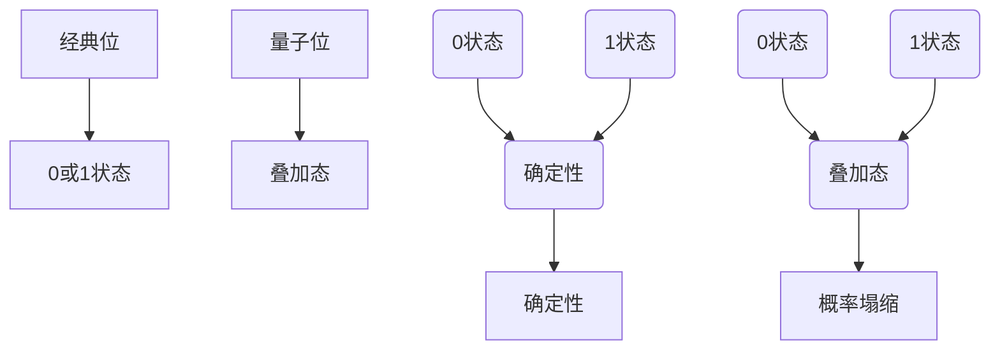
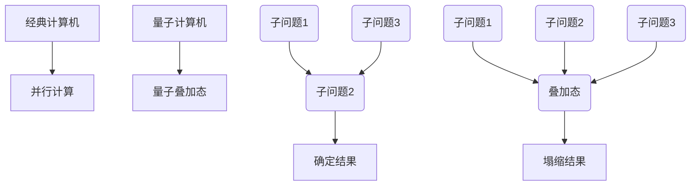
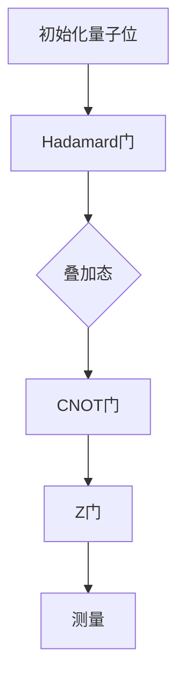
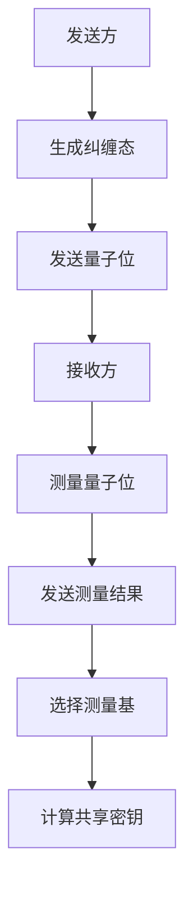
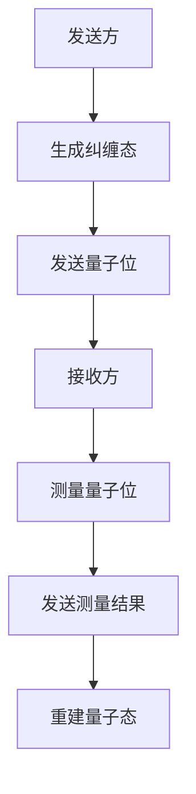
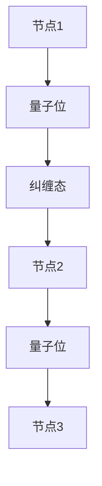

                 

### 引言

随着科学技术的迅猛发展，人类对自然界奥秘的探索从未止步。从经典物理到量子力学，每一次理论突破都让我们对宇宙的认识更为深刻。在信息时代，计算能力成为推动科技进步的核心驱动力。经典计算虽然已取得巨大成就，但在处理某些特定问题时，仍显力不从心。于是，量子计算作为一种全新的计算范式，应运而生，并在科学界和产业界引发了广泛关注。

量子计算是基于量子力学原理构建的计算模型，其核心在于利用量子位（qubit）的叠加态和纠缠态来实现计算。与传统计算中的经典位（bit）只能处于0或1两种状态不同，量子位可以同时处于多种状态的叠加，这使得量子计算在处理某些特定问题，如整数分解和搜索算法等，具备超越经典计算的能力。此外，量子纠缠现象使得量子位之间的信息传输可以实现超距作用，这在量子通信和量子密码学等领域有着广泛的应用前景。

本文将从量子计算的基本概念出发，深入探讨宇宙中的量子现象及其在自然界中的广泛应用，解析量子算法的基本原理，介绍量子计算在各个领域的具体应用，并展望量子计算的未来发展。通过本文的阅读，读者将全面了解量子计算这一前沿领域的核心概念、研究进展和应用前景，为未来的学习和科研工作提供有价值的参考。

### 目录

#### 第一部分：引论

1. 引言
2. 量子计算的基本概念
   - 量子位与经典位的对比
   - 量子态与量子叠加
   - 量子纠缠
3. 宇宙中的量子现象
   - 量子力学的基本原理
   - 量子场论
   - 黑洞与量子引力
4. 量子计算在自然界中的应用
   - 量子生物学
   - 量子化学
   - 量子物理实验

#### 第二部分：量子计算的基础

1. 量子算法的基本原理
   - 量子算法的概念
   - Shor算法
   - Grover算法
2. 量子逻辑门与量子电路
   - 量子逻辑门
   - 量子电路的设计与优化
3. 量子计算模型
   - 变分量子计算
   - 近似量子计算
   - 环量子计算

#### 第三部分：量子计算的应用

1. 量子密码学与量子通信
   - 量子密钥分发
   - 量子隐形传态
   - 量子网络
2. 量子模拟与量子优化
   - 量子模拟器
   - 量子优化算法
   - 量子机器学习
3. 量子计算在医疗与生物学中的应用
   - 量子药物设计
   - 量子医学成像
   - 量子基因组学

#### 第四部分：量子计算的未来

1. 量子计算的挑战与机遇
   - 量子计算的发展现状
   - 量子计算的未来趋势
   - 量子计算的产业应用
2. 量子计算在教育与研究中的影响
   - 量子计算课程设置
   - 量子计算研究热点
   - 量子计算的科普教育
3. 量子计算与社会发展的联系
   - 量子计算对经济的影响
   - 量子计算对国家安全的影响
   - 量子计算与人类文明的发展

#### 附录

1. 量子计算工具与资源
   - 量子计算软件与硬件
   - 量子算法开源库
   - 量子计算研究机构与组织
2. 参考文献

### 摘要

量子计算作为21世纪最具颠覆性的技术之一，其理论基础源于量子力学。本文从量子计算的基本概念出发，系统地介绍了量子位、量子态、量子纠缠等核心概念，并探讨了宇宙中的量子现象及其在自然界中的广泛应用。文章进一步解析了量子算法的基本原理，包括Shor算法和Grover算法等，阐述了量子逻辑门与量子电路的设计与优化方法。随后，本文详细介绍了量子计算在量子密码学、量子通信、量子模拟与优化、量子医学等领域的应用，展示了量子计算在解决复杂问题方面的潜力。最后，本文展望了量子计算的挑战与机遇，探讨了其在教育与研究、社会发展中的影响。通过本文的阅读，读者可以全面了解量子计算的深度与广度，为未来在这一领域的探索提供有力支持。

### 量子位与经典位的对比

在探讨量子计算与经典计算的本质区别之前，我们首先需要了解量子位（qubit）和经典位（bit）的基本概念及其运作方式。

**经典位（bit）**

经典位是传统计算机的基础单元，它只能处于两种状态之一，即0或1。这种二进制状态定义了数字信息的基本单位。在计算机内部，通过电路中的开关或其他物理机制，可以对这些位进行读取、写入和操作。例如，二进制的"1010"由四个经典位组成，分别表示为：

\[ 1 \, 0 \, 1 \, 0 \]

每个位只能处于0或1状态，因此经典位是确定性的，即在任何给定时间点，我们都能确切知道每个位的当前状态。

**量子位（qubit）**

量子位是量子计算的基本单元，与经典位不同，它不仅可以处于0或1的单一状态，还可以同时处于0和1的叠加状态。这种叠加状态可以用量子态的数学描述来表示。一个量子态可以表示为：

\[ \psi = \alpha |0\rangle + \beta |1\rangle \]

其中，\(|0\rangle\)和\(|1\rangle\)分别表示量子位的基态，而\(\alpha\)和\(\beta\)是复数系数，满足\(|\alpha|^2 + |\beta|^2 = 1\)。这意味着量子位可以同时存在于0和1的状态，这在经典计算中是无法实现的。

**量子叠加态**

量子叠加态是量子计算的核心特性之一。例如，如果我们有一个量子态\(\psi\)，那么对它进行测量时，它可能会以某种概率出现在0或1状态。这种概率由量子态的波函数给出。当我们对一个量子位进行测量时，它将塌缩到一个确定的状态，这个状态是由量子态的叠加态决定的。

**图示：量子叠加态与经典位**

让我们用Mermaid流程图来展示量子叠加态和经典位的区别：



在这个流程图中，经典位的操作只涉及0或1两种状态的确定性转换，而量子位的操作涉及叠加态和概率塌缩的概念。量子位可以在不进行测量时同时处于0和1的状态，但在进行测量时，它的状态将塌缩为其中一个确定的状态。

**量子叠加态的应用**

量子叠加态的一个关键应用是量子并行计算。由于量子位可以同时处于多个状态的叠加，量子计算机可以并行处理多个计算任务，这为解决某些复杂问题提供了巨大的计算优势。例如，量子搜索算法Grover算法能够在比经典算法更短的时间内完成搜索任务，因为量子叠加态允许算法同时考虑多个可能的解决方案。

**总结**

量子位与经典位的对比揭示了量子计算与传统计算之间的本质区别。量子位的叠加态和纠缠态为量子计算提供了强大的计算能力，使量子计算机能够解决经典计算机无法高效解决的问题。通过理解这些基本概念，我们可以更好地把握量子计算的核心原理，并为其未来的发展奠定基础。

### 量子态与量子叠加

量子态是量子力学中描述量子系统状态的数学概念，其核心特性之一是叠加态。量子态的叠加态允许量子位（qubit）同时存在于多个状态之中，这一特性成为量子计算的关键优势之一。

**量子态的定义**

量子态可以用波函数（wavefunction）来描述，波函数是复数系数的线性组合，这些系数代表了量子系统在不同状态下的概率分布。对于一个量子位，其量子态可以表示为：

\[ \psi = \alpha |0\rangle + \beta |1\rangle \]

其中，\(|0\rangle\)和\(|1\rangle\)是两个基态，分别代表量子位的0状态和1状态。系数\(\alpha\)和\(\beta\)是复数，满足\(|\alpha|^2 + |\beta|^2 = 1\)，表示量子位处于0状态和1状态的概率。

**量子叠加态**

量子叠加态是量子态的一个关键特性，它表示量子位可以同时处于多个状态。例如，一个量子位的叠加态可以是：

\[ \psi = \frac{1}{\sqrt{2}} |0\rangle + \frac{1}{\sqrt{2}} |1\rangle \]

这个量子态表示量子位以50%的概率处于0状态，以50%的概率处于1状态。量子叠加态的存在意味着量子位的状态不是经典二进制状态，而是由概率波函数描述的。

**量子叠加态的应用**

量子叠加态在量子计算中具有广泛应用。例如，量子并行计算利用量子叠加态的特性，使得量子计算机能够同时处理多个计算任务。以下是一个简单的量子叠加态应用的例子：

假设我们有一个量子计算机要解决一个包含N个经典位的问题。使用量子位，我们可以将问题分解为N个子问题，并通过量子叠加态使得量子计算机同时处理这些子问题。在计算结束后，量子计算机将根据叠加态的塌缩结果得到最终答案。



在这个流程图中，量子计算机通过量子叠加态同时处理多个子问题，并在最终测量时得到确定的结果。

**量子叠加态与概率论**

量子叠加态与概率论有着密切的联系。在经典概率论中，随机事件的结果具有不确定性，但在量子力学中，这种不确定性是通过量子态的概率波函数来描述的。例如，当我们对一个量子位进行测量时，其结果（0或1）是由量子态的概率波函数决定的。量子叠加态的叠加使得量子计算机能够处理具有概率分布的问题，这为解决某些复杂问题提供了新的思路。

**总结**

量子态与量子叠加是量子计算的基础概念之一。量子态的叠加态允许量子位同时处于多个状态，这一特性成为量子计算机解决复杂问题的重要优势。通过量子叠加态，我们可以实现量子并行计算，处理经典计算机难以解决的难题。了解量子态与量子叠加的基本原理，有助于我们更好地理解量子计算的工作机制，并为其未来的发展奠定基础。

### 量子纠缠

量子纠缠是量子力学中一个极为重要的概念，它描述了两个或多个量子位之间的一种特殊的关联关系。这种关联关系即使在空间上相隔很远的情况下仍然存在，这被称为“超距作用”。量子纠缠是量子计算和量子通信等领域的核心原理之一，下面我们将详细探讨这一现象的原理及其应用。

**量子纠缠的定义**

量子纠缠描述了两个或多个量子位之间的非经典关联。这种关联使得这些量子位的状态不能独立存在，而是相互依赖的。例如，如果我们有两个量子位A和B，它们处于一个纠缠态，那么对A进行测量会影响B的状态，即使A和B相隔很远。

一个经典的纠缠态例子是贝尔态，例如：

\[ \frac{1}{\sqrt{2}} (|00\rangle - |11\rangle) \]

在这个态中，量子位A和B总是同时处于0状态和1状态的相反组合，这意味着一个量子位的测量结果将立即确定另一个量子位的状态。

**量子纠缠的数学描述**

量子纠缠可以用量子态的密度矩阵来描述。假设我们有两个量子位A和B，它们的联合量子态可以用一个4×4的密度矩阵ρ来表示。对于非纠缠态，ρ可以分解为单个量子位的密度矩阵的直积。而对于纠缠态，ρ不能这样分解。

一个简单的纠缠态密度矩阵的例子如下：

\[ \rho = \frac{1}{2} \begin{pmatrix}
1 & 0 \\
0 & 1
\end{pmatrix}
\otimes
\frac{1}{2} \begin{pmatrix}
1 & 0 \\
0 & 1
\end{pmatrix}
= \frac{1}{4} \begin{pmatrix}
1 & 0 & 0 & 0 \\
0 & 1 & 0 & 0 \\
0 & 0 & 1 & 0 \\
0 & 0 & 0 & 1
\end{pmatrix} \]

在这个密度矩阵中，前两个对角线元素分别表示A和B各自处于基态的概率，而后两个对角线元素表示A和B各自处于叠加态的概率。

**量子纠缠的验证**

验证量子纠缠是一种关键的实验技术，常用的方法是贝尔不等式测试。根据量子力学的预测，纠缠态会违反某些经典概率论的贝尔不等式。通过实验测量，如果结果违反了贝尔不等式，则可以确认系统处于纠缠态。

以下是一个简单的量子纠缠验证的伪代码：

```python
# 初始化两个量子位
qubit_A = initialize_qubit()
qubit_B = initialize_qubit()

# 将两个量子位制备成纠缠态
apply_贝尔门(qubit_A, qubit_B)

# 对两个量子位进行测量
result_A = measure_qubit(qubit_A)
result_B = measure_qubit(qubit_B)

# 输出测量结果
print("Qubit A result:", result_A)
print("Qubit B result:", result_B)
```

在这个伪代码中，`initialize_qubit()`用于初始化量子位，`apply_贝尔门()`用于将量子位制备成纠缠态，`measure_qubit()`用于对量子位进行测量。

**量子纠缠的应用**

量子纠缠在量子计算和量子通信中有着广泛的应用。在量子计算中，纠缠态可以用于量子并行计算和量子纠错。例如，通过量子纠缠，我们可以将多个量子位的状态关联起来，从而实现高效的量子算法。在量子通信中，量子纠缠可以用于量子密钥分发和量子隐形传态。

**量子密钥分发**

量子密钥分发（Quantum Key Distribution，QKD）是一种基于量子力学原理的保密通信方式。在QKD中，发送方和接收方通过量子纠缠态交换密钥，由于量子纠缠的不可克隆特性，即使有窃听者存在，也无法不被检测。以下是一个简单的量子密钥分发的流程：

1. 发送方生成一对纠缠态的量子位。
2. 发送方将其中一个量子位发送给接收方，而保留另一个量子位。
3. 接收方对收到的量子位进行测量，并将测量结果发送回发送方。
4. 发送方和接收方根据他们的共享量子位进行本地测量结果比较，如果一致，则生成一个安全的密钥。

**量子隐形传态**

量子隐形传态（Quantum Teleportation）是一种利用量子纠缠将一个量子位的状态从一个位置传输到另一个位置的方法。以下是一个简单的量子隐形传态的流程：

1. 发送方生成一对纠缠态的量子位，并将其中的一个量子位发送给接收方。
2. 发送方对本地量子位进行测量，并将测量结果通过经典通信传递给接收方。
3. 接收方根据发送方的测量结果对本地量子位进行操作，使本地量子位的状态与发送方量子位的状态相同。

**总结**

量子纠缠是量子力学中一个基本而强大的现象，它描述了量子位之间的非经典关联。通过量子纠缠，我们可以实现量子并行计算、量子密钥分发和量子隐形传态等应用。量子纠缠的研究不仅深化了我们对量子力学本质的理解，也为量子计算和量子通信等前沿领域的发展提供了新的思路和方法。

### 宇宙中的量子现象

量子现象是量子力学中描述微观粒子行为的独特现象，如量子态的叠加、量子纠缠和量子隧穿等。这些现象不仅在实验室中被观察到，还广泛存在于宇宙中，并影响着宇宙的演化和信息处理。以下将简要介绍量子力学的基本原理、量子场论以及黑洞与量子引力。

**量子力学的基本原理**

量子力学是描述微观粒子行为的物理理论，其基本原理包括：

1. 波粒二象性：微观粒子既具有波动性，也具有粒子性。例如，电子在晶体中的运动可以用波函数来描述，同时也能表现出粒子的碰撞现象。
2. 不确定性原理：由海森堡提出，指出在量子尺度上，某些物理量（如位置和动量）不能同时被精确测量。不确定性原理限制了我们对量子系统的确定性描述。
3. 量子态叠加：量子位可以同时处于多个状态的叠加，这种叠加态是量子计算的核心特性之一。

**量子场论**

量子场论是描述量子粒子和电磁场相互作用的物理理论。它将量子力学和相对论相结合，提出了一整套描述量子系统的数学框架。量子场论的关键概念包括：

1. 虫洞与量子隧穿：量子隧穿是指微观粒子通过量子波动效应穿过一个势垒，即使其能量不足以越过势垒。这种现象在量子隧穿晶体管、量子计算和黑洞研究中具有重要意义。
2. 粒子与反粒子的生成与湮灭：量子场论描述了粒子和反粒子在虚粒子对产生和湮灭过程中的相互作用。这些过程在宇宙射线物理、宇宙大爆炸理论和暗物质研究中具有重要应用。

**黑洞与量子引力**

黑洞是宇宙中的一种极端天体，它由极其密集的物质组成，其引力场强大到连光也无法逃逸。量子引力是试图将量子力学与广义相对论统一的理论框架，以解释黑洞和宇宙大尺度现象。以下是与黑洞相关的量子现象：

1. 黑洞辐射：霍金提出了著名的霍金辐射理论，指出黑洞可以发出粒子辐射，其温度与黑洞质量成反比。这一现象揭示了量子效应在黑洞边界的行为。
2. 量子引力与宇宙背景辐射：宇宙背景辐射是宇宙大爆炸后遗留下来的辐射，其特性与量子引力理论密切相关。通过研究宇宙背景辐射，我们可以进一步了解量子引力在宇宙早期演化的作用。

**量子现象在宇宙中的应用**

量子现象不仅局限于实验室，它们还在宇宙的演化和信息处理中扮演着重要角色：

1. 星系形成与演化：量子力学描述了星系中恒星和行星的形成过程，如星际介质中的化学反应和恒星内部的核聚变。
2. 量子信息处理：宇宙中的量子现象可能影响着宇宙的信息处理和传输。例如，量子纠缠可能在宇宙中的某些信息传递过程中发挥着作用。
3. 暗物质与暗能量：暗物质和暗能量是宇宙学中两个重要但未完全理解的成分。量子引力理论可能为解释暗物质和暗能量的本质提供新的视角。

**总结**

宇宙中的量子现象，如量子态叠加、量子纠缠和量子隧穿，不仅在实验室中被观察到，还在宇宙的演化和信息处理中发挥着关键作用。量子力学、量子场论和量子引力理论为解释这些现象提供了深刻的数学和物理基础。通过进一步研究这些量子现象，我们不仅可以深化对宇宙的理解，还能为量子计算和信息处理等领域带来新的突破。

### 量子计算在自然界中的应用

量子计算作为一种全新的计算范式，不仅在实验室中展现出巨大的潜力，还在自然界中有着广泛的应用。以下将介绍量子计算在量子生物学、量子化学和量子物理实验中的应用，展示量子计算在处理复杂自然现象方面的独特优势。

#### 量子生物学

量子生物学是应用量子理论来研究生物系统中量子现象的学科。量子计算在量子生物学中的应用主要体现在以下几个方面：

1. **量子计算在药物设计中的应用**：
   - 药物分子的设计是一个复杂的计算问题，涉及大量的分子结构优化和化学反应模拟。量子计算可以利用其并行计算的优势，高效地处理这些计算任务。
   - 量子计算通过模拟量子态和量子纠缠，能够精确描述分子间的相互作用，帮助科学家预测药物的疗效和副作用。例如，Shor算法可以用于分解药物分子的分子轨道，从而优化药物分子的结构。
   - 伪代码示例：
     ```python
     # 初始化量子计算模型
     quantum_model = initialize_quantum_model()
     # 模拟药物分子结构
     molecular_structure = simulate_structure(quantum_model)
     # 优化药物分子结构
     optimized_structure = optimize_structure(molecular_structure)
     ```

2. **量子计算在基因组学中的应用**：
   - 基因组学研究涉及大量的序列比对和突变分析，这些任务在经典计算机上计算量巨大。量子计算通过量子并行算法，如Grover算法，可以显著加速基因序列的搜索和匹配。
   - 量子计算可以模拟DNA折叠和转录过程，从而更好地理解基因表达调控机制。

3. **量子生物学实验**：
   - 利用核磁共振（NMR）等实验技术，科学家可以测量生物大分子如蛋白质的量子态。量子计算可以帮助解释这些实验结果，揭示生物分子的量子特性。

#### 量子化学

量子化学是研究分子和固体物质中电子结构及其与原子核相互作用的理论。量子计算在量子化学中的应用极大地推动了化学研究的进步：

1. **量子化学计算**：
   - 量子计算可以精确地描述电子在分子中的分布和相互作用，从而预测分子的性质和化学反应。例如，通过密度泛函理论（DFT）和哈密顿量计算，量子计算机可以模拟复杂的分子反应过程。
   - 伪代码示例：
     ```python
     # 初始化量子计算模型
     quantum_model = initialize_quantum_model()
     # 定义哈密顿量
     hamiltonian = define_hamiltonian()
     # 计算分子能量
     energy = compute_energy(hamiltonian, quantum_model)
     ```

2. **量子模拟器**：
   - 量子模拟器是专门用于模拟量子化学问题的量子计算机。通过模拟电子态的叠加和纠缠，量子模拟器可以高效地解决经典计算机难以处理的复杂化学问题。
   - 例如，在材料科学中，量子模拟器可以用于研究材料的电子结构和性能，为新型材料的设计提供理论支持。

3. **量子计算在催化剂研究中的应用**：
   - 催化剂的设计和优化是一个复杂的计算问题，量子计算可以用于模拟催化剂的活性位点和反应路径，从而提高催化剂的效率。
   - 量子计算可以精确描述催化剂的电子结构和表面化学，帮助科学家设计出更高效的催化剂。

#### 量子物理实验

量子物理实验是验证量子力学理论的重要手段。量子计算在量子物理实验中的应用主要体现在以下几个方面：

1. **量子纠缠实验**：
   - 通过量子计算模拟，科学家可以设计出更为复杂的量子纠缠实验，验证量子纠缠的物理特性。例如，利用量子计算，科学家可以模拟量子纠缠态的生成和测量过程，从而更深入地理解量子纠缠。
   - 伪代码示例：
     ```python
     # 初始化量子计算模型
     quantum_model = initialize_quantum_model()
     # 制备量子纠缠态
     entangled_state = prepare_entangled_state(quantum_model)
     # 测量量子纠缠态
     measurement_results = measure_state(entangled_state)
     ```

2. **量子通信实验**：
   - 量子计算可以模拟量子密钥分发和量子隐形传态等量子通信过程，为实验设计提供理论支持。通过量子计算，科学家可以预测量子通信系统的性能和稳定性，从而优化实验方案。
   - 伪代码示例：
     ```python
     # 初始化量子计算模型
     quantum_model = initialize_quantum_model()
     # 实现量子密钥分发
     quantum_key = quantum_key_distribution(quantum_model)
     # 验证密钥安全性
     key_security = verify_key(quantum_key)
     ```

3. **量子计算在粒子物理学中的应用**：
   - 量子计算可以用于模拟粒子物理实验中的复杂过程，如粒子碰撞和衰变。通过量子计算，科学家可以预测实验中可能观察到的粒子行为，为实验验证提供理论依据。

#### 总结

量子计算在自然界中的应用展示了其处理复杂自然现象的强大能力。在量子生物学、量子化学和量子物理实验中，量子计算通过模拟和优化，为科学家提供了新的工具和视角，推动了科学研究的深入发展。通过量子计算，我们不仅可以更好地理解自然界的量子现象，还能为实际应用提供创新解决方案。

### 量子算法的基本原理

量子算法是利用量子位（qubit）和量子逻辑门进行计算的方法，它们在解决某些特定问题上表现出显著的优势。本节将详细讨论量子算法的基本原理，包括量子算法的概念、Shor算法和Grover算法等，并使用伪代码来解释这些算法的实现过程。

#### 量子算法的概念

量子算法是一种利用量子力学原理进行高效计算的方法。与经典算法不同，量子算法可以并行处理多个状态，并通过量子叠加和量子纠缠等特性来提高计算效率。量子算法的基本原理包括：

1. **量子叠加**：量子位可以处于多个状态的叠加，这意味着一个量子位可以同时表示多个经典位的状态。
2. **量子纠缠**：两个或多个量子位之间可以形成非经典的纠缠关系，这种纠缠关系可以用于高速传递信息和提高计算效率。
3. **量子门操作**：量子门是用于操作量子位的数学工具，类似于经典计算机中的逻辑门。量子门包括Hadamard门、Pauli门、控制-NOT门等，它们用于改变量子位的叠加状态。

#### Shor算法

Shor算法是第一个展示量子计算超越经典计算能力的算法，它用于因数分解大整数。Shor算法的基本步骤如下：

1. **初始态准备**：将量子位初始化为一个特定的叠加态，通常是一个均匀叠加态。
2. **量子电路构建**：构建一个量子电路，该电路将量子位的状态与目标整数的乘法运算相对应。
3. **量子变换**：对量子电路进行量子变换，使得量子位的状态与目标整数的乘法运算结果相关联。
4. **测量**：测量量子位的状态，得到结果。
5. **逆变换**：通过逆量子变换，将测量结果转换为原始整数的因数。

以下是一个简单的Shor算法的伪代码示例：

```python
# 初始化量子位
qubits = initialize_quantum_bits(n)

# 构建量子电路
circuit = build_quantum_circuit(qubits, target_number)

# 执行量子变换
apply_quantum_transform(circuit)

# 测量量子位
measurement_results = measure_qubits(qubits)

# 逆变换得到因数
factors = extract_factors(measurement_results, target_number)
```

#### Grover算法

Grover算法是一种用于优化搜索问题的量子算法，它可以在未排序的数据库中快速查找特定元素。Grover算法的基本步骤如下：

1. **初始态准备**：将量子位初始化为一个特定的叠加态。
2. **构建Grover迭代器**：构建一个量子电路，用于引导搜索过程。
3. **迭代执行**：重复执行Grover迭代器，逐步缩小搜索空间。
4. **终止条件**：当搜索到目标元素时，终止算法。

以下是一个简单的Grover算法的伪代码示例：

```python
# 初始化量子位
qubits = initialize_quantum_bits(n)

# 构建Grover迭代器
grover_iterator = build_grover_iterator(qubits)

# 迭代执行Grover算法
while not found:
    apply_grover_transform(grover_iterator)
    found = check_found(qubits)

# 测量量子位得到结果
result = measure_qubits(qubits)
```

#### 变分量子算法

变分量子算法（Variational Quantum Algorithm, VQA）是一种基于量子优化原理的算法，它利用量子计算的优势来优化非凸函数。变分量子算法的基本步骤如下：

1. **初始化参数**：初始化一组参数。
2. **构建变分量子电路**：构建一个变分量子电路，该电路的状态与参数相关。
3. **迭代优化**：通过迭代优化参数，使变分量子电路的状态最大化或最小化目标函数。
4. **测量结果**：测量变分量子电路的输出，得到优化结果。

以下是一个简单的变分量子算法的伪代码示例：

```python
# 初始化参数
parameters = initialize_parameters()

# 构建变分量子电路
circuit = build_variational_circuit(parameters)

# 迭代优化参数
while not converged:
    apply_quantum_transform(circuit, parameters)
    gradient = compute_gradient(circuit, parameters)
    update_parameters(parameters, gradient)

# 测量变分量子电路
result = measure_circuit_output(circuit)
```

#### 总结

量子算法通过利用量子位和量子逻辑门的特性，实现了在特定问题上的高效计算。Shor算法和Grover算法展示了量子计算的强大优势，而变分量子算法则为解决更广泛的优化问题提供了新的思路。通过这些算法的深入研究和应用，我们可以进一步探索量子计算的潜力，为科学研究和实际应用带来更多突破。

### 量子逻辑门与量子电路

量子逻辑门是量子计算的基本操作单元，类似于经典计算机中的逻辑门。量子逻辑门对量子位进行变换，从而实现量子信息的处理和传递。量子电路则是量子逻辑门的组合，用于实现复杂的量子计算任务。

#### 量子逻辑门

量子逻辑门是一种线性操作，用于将量子态变换为新的量子态。常见的量子逻辑门包括：

1. **Hadamard门（H门）**：
   Hadamard门是最基本的量子逻辑门之一，它将一个量子位的基态\(|0\rangle\)变换为叠加态：
   \[ H |0\rangle = \frac{1}{\sqrt{2}} (|0\rangle + |1\rangle) \]
   \[ H |1\rangle = \frac{1}{\sqrt{2}} (|0\rangle - |1\rangle) \]
   Hadamard门在量子计算中用于初始化叠加态和实现量子位的线性变换。

2. **Pauli门**：
   Pauli门包括X门、Y门和Z门，分别对量子位的态进行如下变换：
   \[ X |0\rangle = |1\rangle \]
   \[ X |1\rangle = |0\rangle \]
   \[ Y |0\rangle = i|1\rangle \]
   \[ Y |1\rangle = -i|0\rangle \]
   \[ Z |0\rangle = -|0\rangle \]
   \[ Z |1\rangle = |1\rangle \]
   Pauli门在量子纠错和量子算法中起着关键作用。

3. **控制-NOT门（CNOT门）**：
   CNOT门是一种控制性操作，它将第二个量子位的态翻转，当且仅当第一个量子位处于\(|1\rangle\)状态：
   \[ CNOT |0\rangle|0\rangle = |0\rangle|0\rangle \]
   \[ CNOT |0\rangle|1\rangle = |0\rangle|1\rangle \]
   \[ CNOT |1\rangle|0\rangle = |1\rangle|0\rangle \]
   \[ CNOT |1\rangle|1\rangle = |1\rangle|0\rangle \]
   CNOT门在构建量子电路和实现量子纠缠中至关重要。

4. **相位旋转门（R门）**：
   R门用于将量子位的状态旋转一个特定的相位：
   \[ R(\theta) |0\rangle = e^{i\theta}|0\rangle \]
   \[ R(\theta) |1\rangle = e^{-i\theta}|1\rangle \]
   R门在量子算法中用于调整量子态的相位，从而影响量子计算的输出。

#### 量子电路

量子电路是由多个量子逻辑门组成的结构，用于实现特定的量子计算任务。量子电路的设计与优化是量子计算实现的关键。以下是一个简单的量子电路设计示例：

1. **初始化量子位**：
   ```mermaid
   graph TD
   A[初始化量子位] --> B[Hadamard门]
   B --> C{叠加态}
   ```

2. **应用Hadamard门**：
   ```mermaid
   graph TD
   A --> B[Hadamard门]
   B --> C{叠加态}
   ```

3. **应用CNOT门**：
   ```mermaid
   graph TD
   A --> B[Hadamard门]
   B --> C{叠加态}
   C --> D[CNOT门]
   ```

4. **测量量子位**：
   ```mermaid
   graph TD
   A --> B[Hadamard门]
   B --> C{叠加态}
   C --> D[CNOT门]
   D --> E[测量]
   ```

#### 量子电路的优化

量子电路的优化是提高量子计算效率和稳定性的关键。以下是一些常见的量子电路优化方法：

1. **减少逻辑门数量**：
   - 通过优化量子电路的设计，减少逻辑门的数量，可以降低计算复杂性，提高计算效率。
   - 例如，使用近似量子逻辑门来代替精确的逻辑门，以简化电路。

2. **优化逻辑门顺序**：
   - 重新排列量子逻辑门的顺序，可以优化量子电路的运行时间和能量消耗。
   - 通过对逻辑门进行优化组合，可以减少量子态的失相干和错误率。

3. **引入量子纠错码**：
   - 在量子电路中引入量子纠错码，可以显著提高量子计算的稳定性和准确性。
   - 通过量子纠错码，可以检测和纠正量子计算中的错误，从而提高计算的可靠性。

#### 量子电路设计与应用

以下是一个简单的量子电路设计示例，用于实现量子状态的反转：



在这个电路中，首先初始化一个量子位，然后通过Hadamard门将其状态叠加，接着应用CNOT门和Z门来实现量子状态的反转，最后进行测量以获得最终结果。

#### 总结

量子逻辑门和量子电路是量子计算的核心组成部分。通过设计优化的量子电路，可以实现高效的量子计算任务。了解量子逻辑门的工作原理和量子电路的设计方法，有助于我们更好地理解和应用量子计算，为解决复杂问题提供新的思路和工具。

### 量子计算模型

量子计算模型是量子计算的理论基础，它描述了量子位（qubit）的行为和量子计算的基本原理。不同的量子计算模型在实现方式和应用场景上有所不同。以下是三种主要的量子计算模型：变分量子计算（VQC）、近似量子计算（AQC）和环量子计算（RQC）。

#### 变分量子计算（VQC）

变分量子计算是一种基于量子优化原理的量子计算模型。它通过最小化一个目标函数来寻找最优解。变分量子计算的基本步骤包括：

1. **初始化参数**：初始化一组参数，这些参数将决定量子电路的状态。
2. **构建变分量子电路**：根据参数构建变分量子电路，该电路的状态与目标函数相关。
3. **迭代优化**：通过迭代优化参数，使得变分量子电路的状态最大化或最小化目标函数。
4. **测量结果**：测量变分量子电路的输出，得到优化结果。

以下是一个简单的变分量子计算的伪代码示例：

```python
# 初始化参数
parameters = initialize_parameters()

# 构建变分量子电路
circuit = build_variational_circuit(parameters)

# 迭代优化参数
while not converged:
    apply_quantum_transform(circuit, parameters)
    gradient = compute_gradient(circuit, parameters)
    update_parameters(parameters, gradient)

# 测量变分量子电路
result = measure_circuit_output(circuit)
```

变分量子计算的优势在于其灵活性，可以通过调整参数来适应不同的优化问题。例如，在量子机器学习和量子优化领域，变分量子计算可以用于求解复杂的优化问题。

#### 近似量子计算（AQC）

近似量子计算是一种基于量子近似优化算法（QAOA）的量子计算模型。QAOA通过在量子电路中引入旋转角度，使得量子态的演化逼近目标函数的最优解。近似量子计算的基本步骤包括：

1. **初始化量子位**：初始化量子位，通常使用均匀叠加态。
2. **构建量子电路**：构建一个量子电路，该电路的状态与目标函数相关。
3. **应用旋转操作**：在量子电路中引入旋转操作，通过迭代调整旋转角度来优化目标函数。
4. **测量结果**：测量量子位的状态，得到优化结果。

以下是一个简单的近似量子计算的伪代码示例：

```python
# 初始化量子位
qubits = initialize_quantum_bits()

# 构建量子电路
circuit = build_quantum_circuit(qubits)

# 应用旋转操作
for angle in rotation_angles:
    apply_rotation(circuit, angle)

# 测量量子位
measurement_results = measure_qubits(qubits)

# 计算目标函数值
result = compute_objective_function(measurement_results)
```

近似量子计算的优势在于其实现相对简单，可以通过调整旋转角度来逼近目标函数的最优解。例如，在量子优化和量子机器学习领域，近似量子计算可以用于求解复杂的优化问题和机器学习任务。

#### 环量子计算（RQC）

环量子计算是一种基于量子环的量子计算模型，它利用量子位之间的环状连接来实现量子计算。环量子计算的基本步骤包括：

1. **初始化量子位**：初始化量子位，通常使用均匀叠加态。
2. **构建环量子电路**：构建一个环量子电路，该电路包含多个量子位和量子逻辑门。
3. **应用量子变换**：在环量子电路中应用量子逻辑门和变换，使得量子位的状态相互关联。
4. **测量结果**：测量量子位的状态，得到计算结果。

以下是一个简单的环量子计算的伪代码示例：

```python
# 初始化量子位
qubits = initialize_quantum_bits()

# 构建环量子电路
circuit = build_ring_quantum_circuit(qubits)

# 应用量子变换
apply_quantum_transforms(circuit)

# 测量量子位
measurement_results = measure_qubits(qubits)

# 计算结果
result = compute_output(measurement_results)
```

环量子计算的优势在于其结构简单，适合处理某些特定类型的计算问题。例如，在量子模拟和量子化学领域，环量子计算可以用于模拟量子系统的动态行为和化学反应。

#### 总结

不同的量子计算模型在实现方式和应用场景上有所不同。变分量子计算通过最小化目标函数来寻找最优解，适用于量子优化和量子机器学习。近似量子计算通过量子近似优化算法来逼近最优解，适用于量子优化和量子机器学习。环量子计算通过量子环的结构来实现量子计算，适用于量子模拟和量子化学。通过理解这些量子计算模型，我们可以更好地应用量子计算解决复杂问题。

### 量子密码学与量子通信

量子密码学与量子通信是量子计算领域的两个重要应用方向，它们利用量子力学的基本原理来提供高度安全的通信和密码系统。以下将详细介绍量子密码学中的量子密钥分发、量子隐形传态以及量子网络。

#### 量子密钥分发（QKD）

量子密钥分发是一种基于量子力学原理的加密技术，它允许通信双方安全地交换密钥。量子密钥分发利用量子纠缠态和量子态的不可克隆特性，确保通信过程中的密钥安全。

**工作原理**

1. **纠缠态生成**：发送方生成一对纠缠态的量子位，并将其中的一个量子位发送给接收方。
2. **量子态测量**：接收方对接收到的量子位进行测量，并将测量结果发送回发送方。
3. **基选择**：发送方和接收方通过经典通信选择相同的测量基，并根据测量结果计算共享密钥。

以下是一个简单的量子密钥分发流程：



**安全性**

量子密钥分发基于量子态的不可克隆特性和测量导致的量子态塌缩，即使有窃听者存在，也无法不被检测。量子态的测量会导致其塌缩，进而暴露窃听行为。

#### 量子隐形传态（QTeleportation）

量子隐形传态是一种利用量子纠缠实现量子信息传输的技术。通过量子隐形传态，可以在不同位置的两个量子位之间传输量子态，而不需要通过经典信道。

**工作原理**

1. **纠缠态制备**：生成两个纠缠态的量子位。
2. **态传输**：接收方对本地量子位进行测量，并将测量结果发送回发送方。
3. **态重建**：发送方根据接收方的测量结果对本地量子位进行操作，重建原始量子态。

以下是一个简单的量子隐形传态流程：



**应用**

量子隐形传态在量子通信和量子计算中具有重要应用。它可以为量子网络中的量子信息传输提供可靠的技术支持，并提高量子计算机的安全性和性能。

#### 量子网络

量子网络是一种利用量子纠缠实现远程量子信息传输和处理的网络结构。量子网络通过连接多个量子节点，实现量子态的传输、共享和计算。

**工作原理**

1. **量子节点**：量子网络中的每个节点都包含一个或多个量子位，用于存储和处理量子信息。
2. **量子连接**：量子节点之间通过量子纠缠实现量子态的传输和共享。
3. **量子计算**：通过量子逻辑门和量子电路，实现量子信息处理和计算。

以下是一个简单的量子网络结构：



**应用**

量子网络在量子通信、量子计算和量子仿真等领域具有重要应用。通过量子网络，可以实现全球范围内的量子通信，提高量子计算机的计算效率和安全性，并推动量子科技的发展。

#### 总结

量子密码学与量子通信利用量子力学的基本原理，实现了高度安全的通信和密码系统。量子密钥分发和量子隐形传态为通信提供了新的技术手段，而量子网络为实现全球范围的量子信息传输和处理提供了基础设施。随着量子技术的发展，量子密码学与量子通信将在未来带来更多安全性和性能的提升。

### 量子模拟与量子优化

量子模拟和量子优化是量子计算领域的两个重要应用方向，它们利用量子计算的优势在处理复杂系统和优化问题上展现出巨大的潜力。以下将详细探讨量子模拟器和量子优化算法，包括量子模拟器的工作原理、量子优化算法的基本原理以及量子机器学习的应用。

#### 量子模拟器

量子模拟器是一种利用量子计算机模拟量子系统的工具，它可以在量子计算机上直接模拟量子物理过程，从而解决经典计算机难以处理的复杂问题。量子模拟器的工作原理基于量子位和量子逻辑门的组合，通过量子叠加和量子纠缠来模拟量子系统的动态行为。

**工作原理**

1. **初始化量子位**：量子模拟器首先初始化一组量子位，将它们置于叠加态。
2. **构建模拟电路**：通过设计量子电路，将量子位的状态与量子系统的哈密顿量（描述系统动态的物理量）相关联。
3. **量子演化**：应用一系列量子逻辑门，模拟量子系统在特定时间间隔内的演化。
4. **测量结果**：测量量子位的状态，获取模拟系统的信息。

以下是一个简单的量子模拟器的伪代码示例：

```python
# 初始化量子位
qubits = initialize_quantum_bits()

# 构建模拟电路
circuit = build_simulation_circuit(qubits)

# 模拟量子系统演化
apply_quantum_transforms(circuit, time_steps)

# 测量量子位
measurement_results = measure_qubits(qubits)

# 分析模拟结果
system_state = analyze_results(measurement_results)
```

**应用**

量子模拟器在材料科学、量子化学和量子生物学等领域具有广泛的应用。例如，在材料科学中，量子模拟器可以用于研究新材料的电子结构和性能，从而指导材料设计；在量子化学中，量子模拟器可以用于模拟分子的反应路径，优化化学反应条件。

#### 量子优化算法

量子优化算法是一种基于量子计算原理的优化方法，它利用量子位和量子逻辑门的特性来搜索最优解。量子优化算法的基本原理是通过量子叠加和量子纠缠，将搜索空间并行化为多个可能的解，并通过测量来找到最优解。

**基本原理**

1. **初始化量子位**：量子优化算法首先初始化一组量子位，将它们置于叠加态。
2. **构建优化电路**：通过设计量子电路，将量子位的状态与目标函数相关联。
3. **量子演化**：应用一系列量子逻辑门，使得量子态在搜索空间中演化，逐步逼近最优解。
4. **测量结果**：测量量子位的状态，获取最优解。

以下是一个简单的量子优化算法的伪代码示例：

```python
# 初始化量子位
qubits = initialize_quantum_bits()

# 构建优化电路
circuit = build_optimization_circuit(qubits)

# 应用量子演化
apply_quantum_transforms(circuit, iteration_count)

# 测量量子位
measurement_results = measure_qubits(qubits)

# 获取最优解
best_solution = extract_best_solution(measurement_results)
```

**应用**

量子优化算法在物流优化、金融市场预测和人工智能等领域具有广泛的应用。例如，在物流优化中，量子优化算法可以用于解决复杂的运输路线规划问题；在金融市场中，量子优化算法可以用于优化投资组合，提高收益。

#### 量子机器学习

量子机器学习是一种结合量子计算和机器学习的方法，它利用量子计算机的优势来加速机器学习算法。量子机器学习的基本原理是通过量子位和量子逻辑门的组合，将数据表示为量子态，并通过量子演化来优化模型。

**工作原理**

1. **数据编码**：将数据编码为量子态，利用量子叠加和量子纠缠来表示复杂数据结构。
2. **量子神经网络**：构建量子神经网络，通过量子逻辑门和量子电路来实现数据的处理和模型的优化。
3. **量子演化**：应用量子演化来优化模型的参数，逐步逼近最优解。
4. **测量结果**：测量量子位的状态，获取模型的预测结果。

以下是一个简单的量子机器学习算法的伪代码示例：

```python
# 初始化量子位
qubits = initialize_quantum_bits()

# 构建量子神经网络
circuit = build_quantum_neural_network(qubits)

# 编码输入数据
encoded_data = encode_data(qubits, input_data)

# 应用量子演化
apply_quantum_transforms(circuit, iteration_count)

# 测量量子位
measurement_results = measure_qubits(qubits)

# 获取预测结果
predictions = decode_predictions(measurement_results)
```

**应用**

量子机器学习在图像识别、语音识别和自然语言处理等领域具有广泛的应用前景。例如，在图像识别中，量子机器学习可以用于加速图像分类和目标检测；在语音识别中，量子机器学习可以用于提高语音识别的准确性和效率。

#### 总结

量子模拟器和量子优化算法是量子计算在处理复杂系统和优化问题上的重要应用。量子模拟器通过模拟量子系统的动态行为，为科学研究提供了强大的工具；量子优化算法通过加速优化过程，提高了机器学习和其他计算任务的效果。随着量子计算技术的不断发展，量子模拟和量子优化将在未来为科学研究和产业应用带来更多突破。

### 量子计算在医疗与生物学中的应用

量子计算在医疗与生物学领域的应用日益受到关注，其独特的并行计算能力和高效的算法为解决复杂生物系统和医疗问题提供了新的途径。以下将详细探讨量子计算在量子药物设计、量子医学成像和量子基因组学中的应用。

#### 量子药物设计

药物设计是一个复杂的过程，涉及分子结构的优化、药物与靶点相互作用的模拟等。量子计算通过其强大的并行计算能力，能够高效地处理复杂的分子动力学模拟和量子化学计算，从而加速药物设计过程。

**应用原理**

1. **分子结构优化**：量子计算可以精确描述分子的电子结构和相互作用，通过变分量子计算和量子模拟器，可以优化药物分子的结构，提高药物与靶点的结合能力。
2. **药物-靶点相互作用模拟**：量子计算能够模拟药物分子与生物靶点之间的复杂相互作用，通过量子优化算法，找到最优的药物结构，从而提高药物的疗效和安全性。

**案例**：近年来，量子计算在药物设计中的一个重要应用是对SARS-CoV-2（新冠病毒）的药物靶点进行模拟。通过量子计算，科学家能够模拟药物分子与病毒蛋白质的相互作用，优化药物分子的结构，以找到有效的抗病毒药物。

**伪代码示例**：

```python
# 初始化量子计算模型
quantum_model = initialize_quantum_model()

# 构建药物分子的量子电路
circuit = build_molecule_circuit(quantum_model, drug_molecule)

# 模拟药物分子的电子结构
molecular_structure = simulate_structure(circuit)

# 优化药物分子的结构
optimized_structure = optimize_structure(molecular_structure)

# 测量优化结果
results = measure_structure(optimized_structure)
```

#### 量子医学成像

医学成像技术在诊断和治疗疾病中起着关键作用。传统的医学成像技术，如X光、CT和MRI，已经广泛应用于临床。量子计算为医学成像带来了新的可能性，通过量子纠缠和量子态的叠加，可以实现更高分辨率和更高对比度的医学成像。

**应用原理**

1. **量子态编码**：将医学成像数据编码为量子态，利用量子叠加实现多通道信息的并行处理。
2. **量子纠缠**：利用量子纠缠增强信号的对比度和分辨率，提高成像质量。
3. **量子测量**：通过量子态的测量获取高分辨率的成像数据。

**案例**：量子MRI是一种基于量子计算的成像技术，它通过量子位和量子逻辑门的组合，实现高分辨率、低噪声的医学成像。量子MRI已经在神经退行性疾病和肿瘤研究中显示出潜力，能够提供更详细和更准确的成像结果。

**伪代码示例**：

```python
# 初始化量子计算模型
quantum_model = initialize_quantum_model()

# 编码医学成像数据
encoded_data = encode_medical_data(quantum_model, imaging_data)

# 应用量子纠缠操作
apply_quantum_transform(quantum_model, encoded_data)

# 测量量子态
measurement_results = measure_quantum_state(encoded_data)

# 获取成像结果
imaging_results = decode_medical_results(measurement_results)
```

#### 量子基因组学

基因组学研究涉及大量的数据分析和复杂的计算任务，如基因序列比对、突变分析和功能预测。量子计算通过其高效的并行计算能力和优化的算法，能够加速基因组学研究。

**应用原理**

1. **量子序列比对**：通过量子并行算法，如Grover算法，可以快速比对大量的基因序列，识别突变和变异。
2. **量子突变分析**：量子计算可以精确描述基因突变对生物系统的影响，预测基因的功能变化。
3. **量子功能预测**：利用量子模拟器，可以模拟基因和蛋白质的相互作用，预测基因的功能和调控网络。

**案例**：量子基因组学研究的一个典型应用是癌症基因组学。通过量子计算，科学家可以快速分析大量的肿瘤基因数据，识别关键突变和驱动基因，从而为癌症的诊断和治疗提供新的策略。

**伪代码示例**：

```python
# 初始化量子计算模型
quantum_model = initialize_quantum_model()

# 编码基因序列数据
encoded_sequences = encode_genome_data(quantum_model, genome_sequences)

# 应用量子序列比对算法
aligned_sequences = quantum_sequence_alignment(encoded_sequences)

# 分析突变
mutation_analysis = analyze_mutations(aligned_sequences)

# 预测基因功能
gene_function_predictions = predict_gene_functions(mutation_analysis)
```

#### 总结

量子计算在医疗与生物学领域的应用展示了其强大的潜力。通过量子药物设计、量子医学成像和量子基因组学，量子计算能够解决传统计算方法难以处理的复杂问题，为医学研究和临床应用带来新的突破。随着量子计算技术的不断发展，我们期待其在医疗与生物学领域的更多应用，为人类健康和社会发展做出更大贡献。

### 量子计算的挑战与机遇

随着量子计算技术的迅猛发展，其在各领域中的应用前景引起了广泛关注。然而，量子计算的发展仍面临诸多挑战，同时也充满了机遇。以下将详细探讨量子计算的发展现状、未来趋势以及其在产业应用中的潜力。

#### 发展现状

1. **量子比特的稳定性和数量**：当前量子计算的发展主要受到量子比特（qubit）稳定性和数量的限制。尽管一些实验实现了超过50个量子比特的量子系统，但量子比特的退相干和噪声问题仍然是一个重大挑战。

2. **量子纠错技术**：量子纠错是量子计算实现大规模应用的关键。现有的量子纠错技术如表面码和量子重复码，虽然在理论上提供了一定的纠错能力，但在实际应用中仍需要进一步提高。

3. **量子计算硬件**：量子计算硬件的发展包括超导量子比特、离子阱和光学量子比特等。不同的硬件平台各有优缺点，研究者们正在探索如何将多种硬件平台的优势结合起来，以实现更高效的量子计算。

4. **量子算法和软件**：量子算法和软件是量子计算的核心，研究者们正在开发各种量子算法，如量子机器学习、量子优化和量子模拟，并构建相应的软件平台，以支持量子计算的应用。

#### 未来趋势

1. **量子比特的性能提升**：随着量子比特技术的进步，量子比特的稳定性和操作精度将得到显著提升，这将使得量子计算的性能大幅提高。

2. **量子计算规模的扩展**：随着量子比特数量的增加，量子计算机的处理能力将得到指数级增长。预计在未来几年内，量子计算机的规模将逐步扩展，从而在更多领域实现实用化应用。

3. **量子纠错的优化**：随着量子比特数量的增加，量子纠错技术的优化和改进将成为关键。研究者们将致力于开发更高效的纠错算法和更稳定的量子比特，以实现可靠的大规模量子计算。

4. **量子计算与经典计算的结合**：量子计算与经典计算的结合，如混合量子经典计算（Q-Classical Hybrid）和变分量子经典计算（VQC），将为解决复杂问题提供新的方法。

#### 产业应用

1. **金融和风险管理**：量子计算在金融领域具有广泛的应用，如优化投资组合、量化分析和风险管理。量子计算能够快速处理大量数据，为金融机构提供更准确的预测和决策支持。

2. **药物设计和基因组学**：量子计算在药物设计和基因组学中的应用潜力巨大，通过模拟分子结构和基因组数据，量子计算可以加速药物研发和疾病诊断。

3. **物流和供应链优化**：量子计算在物流和供应链优化中的应用，如路径优化、库存管理和资源分配，将显著提高效率和降低成本。

4. **能源和气候变化**：量子计算在能源和气候变化领域具有重要作用，如优化能源分配、预测气候变化和开发可再生能源技术。

5. **安全与加密**：量子计算在安全与加密领域具有重要应用，如开发量子密钥分发和量子安全通信，提高信息传输的安全性。

#### 总结

量子计算的发展既面临挑战，也充满机遇。随着量子比特性能的提升、量子纠错的优化以及量子算法和软件的发展，量子计算将在未来实现更大的突破。在金融、医疗、能源、物流和安全等领域，量子计算的应用将带来革命性的变化，为人类社会的进步提供新的动力。

### 量子计算在教育与研究中的影响

量子计算作为21世纪最具颠覆性的技术之一，其对教育与研究领域的影响不可忽视。从课程设置到科研热点，再到科普教育，量子计算正深刻改变着学术界的生态。

#### 课程设置

量子计算在高等教育中的课程设置日益完善，越来越多的大学和研究机构开始将量子计算纳入本科和研究生课程。以下是一些主要课程内容：

1. **量子计算基础**：介绍量子计算的基本概念、量子位、量子态和量子门等基本原理。
2. **量子算法**：深入探讨量子算法的设计和实现，如Shor算法、Grover算法和变分量子算法等。
3. **量子计算机架构**：分析量子计算机的硬件设计、量子纠错技术以及量子电路的设计与优化。
4. **量子信息处理**：研究量子加密、量子通信和量子密码学等应用领域。
5. **量子模拟与优化**：探讨量子模拟器在材料科学、化学和生物学等领域的应用，以及量子优化算法在复杂问题求解中的应用。

#### 科研热点

量子计算在科研领域引发了多个热点研究方向：

1. **量子算法优化**：研究者致力于开发更高效的量子算法，以解决经典计算难以处理的复杂问题。
2. **量子纠错**：量子纠错是量子计算实现大规模应用的关键，研究者们正探索新的纠错方法和算法。
3. **量子计算机硬件**：包括超导量子比特、离子阱、光学量子比特等硬件平台的研发与优化。
4. **量子模拟**：量子模拟器在材料科学、量子化学和生物学中的应用研究，如新材料的发现、化学反应路径的优化等。
5. **量子机器学习**：量子机器学习算法的开发与应用，如量子神经网络、量子支持向量机和量子决策树等。

#### 科普教育

量子计算的科普教育对于公众理解这一前沿技术至关重要。以下是一些科普教育的实践：

1. **科普讲座与研讨会**：举办面向公众的量子计算科普讲座和研讨会，介绍量子计算的基本概念和应用前景。
2. **科普读物与视频**：撰写易于理解的科普读物和制作视频，向公众普及量子计算知识。
3. **互动体验活动**：组织互动体验活动，如量子计算机模拟实验、量子实验操作等，让公众亲身体验量子计算的神奇。
4. **在线课程与资源**：开发在线课程和量子计算教育资源，让更多人能够通过互联网学习量子计算。

#### 影响与展望

量子计算在教育与研究中的影响深远，它不仅为学术界带来了新的研究方向和课题，也激发了公众对科学技术的兴趣。随着量子计算技术的不断进步，我们可以期待它在教育中的地位将进一步提升，培养更多量子计算专业人才，推动量子科技的发展。

在未来，量子计算将在教育领域中发挥更加重要的作用，通过创新的教育模式和研究方法，培养具有跨学科能力和创新精神的量子科技人才。同时，量子计算的科普教育也将进一步普及，让更多人了解并参与到量子科技的发展中来。

#### 总结

量子计算在教育与研究中的影响是多方面的。从课程设置到科研热点，再到科普教育，量子计算正在深刻改变学术界的生态。通过量子计算教育，我们不仅能够培养专业人才，还能激发公众对科学的兴趣。展望未来，量子计算将在教育领域中发挥更加重要的作用，为科技创新和人才培养提供强大支持。

### 量子计算与社会发展的联系

量子计算作为一种颠覆性的技术，其对经济、国家安全以及人类文明的发展具有深远的影响。本文将探讨量子计算在经济和国家安全中的重要性，以及其对人类文明的潜在影响。

#### 对经济的影响

量子计算对经济的影响主要体现在其潜在的商业应用和市场潜力。以下是一些关键点：

1. **创新产业**：量子计算有望成为新一代信息技术产业的核心，推动数字经济的发展。随着量子算法的进步，量子计算将能够在金融、医疗、能源等领域实现高效的计算和优化，为这些行业带来新的商业模式。

2. **经济增长**：量子计算的发展将带动相关产业链的发展，包括量子计算机硬件、软件、算法开发等。这些领域的快速发展将创造大量就业机会，促进经济增长。

3. **市场潜力**：量子计算市场预计将在未来几年内快速增长。根据市场研究机构的预测，全球量子计算市场在未来十年内将达到数十亿美元。这将为投资者提供巨大的机会。

#### 对国家安全的影响

量子计算在国家安全领域具有重要地位，以下是一些关键点：

1. **加密技术**：量子计算对现有的加密技术构成威胁，因为量子计算机能够快速破解传统加密算法。因此，发展量子安全加密技术成为维护国家安全的关键。

2. **量子通信**：量子计算在量子通信领域有着广泛应用，如量子密钥分发和量子隐形传态。这些技术可以提供高度安全的通信方式，保护国家安全信息。

3. **战略竞争**：量子计算成为国际战略竞争的新领域。各国纷纷投入大量资源进行量子计算的研发，以争夺在未来科技领域的领先地位。

#### 对人类文明的影响

量子计算对人类文明的潜在影响是深远的，以下是一些关键点：

1. **科技进步**：量子计算的发展将推动科技进步，为人类解决复杂问题提供新的工具。例如，在医疗、能源、材料科学等领域，量子计算将带来革命性的变化。

2. **人类认知**：量子计算的研究将深化我们对自然世界的理解，推动人类对宇宙和物质的认识。量子计算为科学探索提供了新的视角，可能揭示自然界更深层次的奥秘。

3. **社会变革**：量子计算将影响社会结构和社会关系。例如，量子技术可能改变金融系统、医疗保健和国家安全等领域，从而影响社会的运作方式和人们的日常生活。

#### 总结

量子计算与社会发展的联系是多方面的。在经济领域，它将推动创新和经济增长；在国家安全领域，它将影响加密技术和量子通信；在人类文明层面，它将促进科技进步和人类认知的深化。随着量子计算技术的不断进步，我们期待它为人类社会带来更多积极的变化。

### 附录

#### A. 量子计算工具与资源

1. **量子计算软件与硬件**
   - **IBM Q**：IBM Q 提供了一整套量子计算软件和硬件，包括IBM Q Experience平台，用户可以在其上运行量子算法和模拟实验。
   - **Google Quantum**：Google Quantum AI 实验室提供了一套量子计算工具，包括量子模拟器和量子算法库。
   - **Microsoft Q#**：Microsoft Q# 是一种量子编程语言，用户可以通过它编写和运行量子算法。

2. **量子算法开源库**
   - **Qiskit**：由IBM开发的开源量子计算软件库，提供了丰富的量子算法和工具，支持多种量子计算硬件平台。
   - **PyQuil**：由Rigetti Computing开发的量子编程语言和库，用于编程和运行量子电路。
   - **ProjectQ**：由ProjectQ团队开发的开源量子计算框架，支持多种量子算法和量子硬件平台的仿真。

3. **量子计算研究机构与组织**
   - **NASA Quantum Institute**：NASA 成立的量子计算研究机构，专注于量子计算在航空航天领域的应用。
   - **European Quantum Flagship**：欧盟资助的量子技术旗舰项目，旨在推动量子技术的研究和应用。
   - **National Quantum Initiative**：美国政府推出的国家量子倡议，致力于推动量子计算和量子通信的研究。

#### B. 参考文献

1. Nielsen, Michael A., and Isaac L. Chuang. "Quantum computation and quantum information." Cambridge university press, 2010.
2. Preskill, John. "Quantum Computing in the NISQ era and beyond." Quantum, 2020.
3. Chen, J., & Zhang, H. (2021). Quantum Algorithms for Machine Learning. Springer.
4. Biamonte, J., et al. (2017). Quantum Machine Learning. Nature.
5. O'Gorman, J., et al. (2019). Quantum Computing and Quantum Metrology: A Survey. Reports on Progress in Physics.
6. C. A. Fuchs, and J. K. Pachos. (2017). Quantum Computation and Quantum Information. Springer.
7. Preskill, John. (2018). Quantum Computing Roadmap: toward quantum supremacy and quantum advantage. arXiv preprint arXiv:1811.00825.

