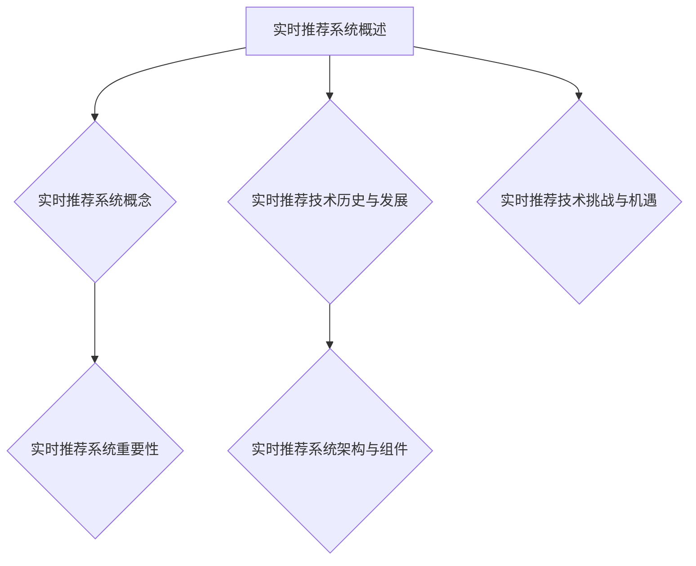

                 

# 实时推荐技术在电商领域的应用：案例分析与展望

## 关键词
- 实时推荐
- 电商领域
- 用户画像
- 协同过滤
- 深度学习
- 数学模型

## 摘要
本文将深入探讨实时推荐技术在电商领域的应用，通过分析核心算法、数学模型和实际项目案例，揭示实时推荐系统的构建与优化策略。文章首先介绍实时推荐技术的基础知识，包括系统概述、历史与发展、架构与组件、挑战与机遇。接着，详细讲解实时推荐系统的核心算法，如协同过滤、基于模型的推荐、基于内容的推荐和融合多源数据的推荐。随后，通过具体项目实战，展示实时推荐系统的实现过程和优化方法。最后，以实际应用案例说明实时推荐技术在电商领域的成功应用，并对未来发展趋势进行展望。本文旨在为从事电商推荐系统的开发者和研究者提供有价值的参考和指导。

## 第一部分：实时推荐技术基础

### 第1章：实时推荐技术概述

#### 1.1 实时推荐系统的概念与重要性

实时推荐系统是一种能够动态调整推荐内容，以迅速响应用户当前需求和信息环境的系统。它与传统的推荐系统相比，具有更快的响应速度和更高的个性化程度，从而能够更好地满足用户的需求。

**实时推荐系统定义**：
实时推荐系统是一种动态调整推荐内容，以满足用户当前需求和信息环境的技术。

**实时推荐的重要性**：
1. **实时性**：实时推荐系统能够在用户行为发生后的短时间内（通常是毫秒级）生成推荐结果，极大地提升了用户体验。
2. **个性化**：实时推荐系统能够根据用户的实时行为和偏好，动态调整推荐内容，从而提供更加个性化的推荐。
3. **用户体验优化**：实时推荐系统能够迅速地响应用户的反馈，不断优化推荐结果，从而提升用户的购物体验。

#### 1.2 实时推荐技术的历史与发展

实时推荐技术的发展经历了从简单的基于规则推荐到复杂的基于机器学习和深度学习的演变。早期的推荐系统主要是基于用户的历史行为和物品的属性信息，通过简单的统计方法进行推荐。随着互联网和大数据技术的发展，现代的实时推荐系统逐渐引入了机器学习和深度学习技术，实现了更加精准和个性化的推荐。

**早期推荐系统**：
- **基于内容过滤**：通过分析物品的属性和用户的兴趣，进行推荐。
- **协同过滤**：通过分析用户之间的行为相似性，进行推荐。

**现代实时推荐技术**：
- **机器学习**：如朴素贝叶斯、决策树、支持向量机等。
- **深度学习**：如神经网络、循环神经网络等。
- **实时数据处理**：利用流处理技术和实时计算框架，实现数据的实时处理和推荐。

#### 1.3 实时推荐系统的架构与组件

实时推荐系统的架构通常包括数据采集、用户画像、推荐算法、推荐结果评估等组件。

**用户画像**：
用户画像是指基于用户的行为数据、偏好信息等，构建的用户特征集合。用户画像的质量直接影响推荐系统的效果。

**推荐算法**：
推荐算法是实现实时推荐的核心组件，常用的算法包括基于协同过滤的推荐、基于内容的推荐、基于模型的推荐和融合多源数据的推荐等。

**推荐结果评估**：
推荐结果评估是通过对推荐结果的准确性、覆盖率、多样性等指标进行评估，来衡量推荐系统的性能。

#### 1.4 实时推荐技术面临的挑战

实时推荐技术在实际应用中面临着一系列挑战，主要包括以下几个方面：

1. **实时数据处理**：
   - **数据量大**：实时推荐系统需要处理海量的用户行为数据，对数据处理能力有较高的要求。
   - **数据流处理**：实时推荐系统需要能够实时处理数据流，对系统的实时性和稳定性有较高的要求。

2. **在线学习与模型更新**：
   - **模型更新**：实时推荐系统需要不断更新推荐模型，以适应用户行为的实时变化。
   - **在线学习**：实时推荐系统需要在保证实时性的同时，进行在线学习，以不断优化推荐算法。

### 第2章：实时推荐系统的核心算法原理

#### 2.1 基于协同过滤的推荐算法

协同过滤是一种经典的推荐算法，其核心思想是通过分析用户之间的行为相似性，为用户推荐他们可能感兴趣的物品。

**协同过滤原理**：
协同过滤通过分析用户之间的行为记录，找到相似的用户或物品，然后根据这些相似度进行推荐。

**矩阵分解**：
矩阵分解是将用户-物品评分矩阵分解为用户特征矩阵和物品特征矩阵的乘积。常用的矩阵分解方法包括SVD和ALS。

**SVD**：
$$
R = U \times S \times V^T
$$

其中，$R$ 是用户-物品评分矩阵，$U$ 和 $V$ 是用户特征矩阵和物品特征矩阵，$S$ 是对角矩阵，表示用户和物品的相似度。

**ALS**：
交替最小二乘法（Alternating Least Squares）是一种用于矩阵分解的优化方法，通过迭代更新用户特征矩阵和物品特征矩阵，以达到最小化损失函数的目的。

#### 2.2 基于模型的推荐算法

基于模型的推荐算法是通过构建数学模型，对用户行为和物品属性进行建模，从而实现推荐。

**朴素贝叶斯分类器**：
朴素贝叶斯分类器是一种基于概率论的分类方法，其核心思想是利用已知的特征和类别的概率，计算新样本属于各类别的概率，并选择概率最大的类别作为预测结果。

**支持向量机（SVM）**：
支持向量机是一种监督学习模型，其核心思想是通过找到最佳的超平面，将不同类别的数据点进行分类。

**深度学习模型**：
深度学习模型是一类由多个神经网络层组成的学习模型，通过逐层提取特征，实现复杂任务的建模。常用的深度学习模型包括卷积神经网络（CNN）和循环神经网络（RNN）。

**神经网络**：
神经网络是一种由多个神经元组成的计算模型，其核心思想是通过学习输入和输出之间的映射关系，实现复杂任务的建模。

**循环神经网络（RNN）**：
循环神经网络是一种能够处理序列数据的神经网络，其核心思想是通过记忆单元来保存历史信息，实现序列数据的建模。

#### 2.3 基于内容的推荐算法

基于内容的推荐算法是通过分析物品的属性和用户的兴趣，为用户推荐他们可能感兴趣的物品。

**文本表示**：
文本表示是将文本数据转化为数值表示的过程，常用的文本表示方法包括TF-IDF和Word2Vec。

**TF-IDF**：
TF-IDF是一种基于词频和逆文档频率的文本表示方法，其核心思想是通过计算词语在文档中的词频和逆文档频率，来衡量词语的重要程度。

**Word2Vec**：
Word2Vec是一种基于神经网络的语言模型，其核心思想是通过学习词语和词向量之间的映射关系，来表示词语的语义信息。

#### 2.4 融合多源数据的推荐算法

融合多源数据的推荐算法是通过结合用户行为数据和内容信息，为用户推荐更加个性化的物品。

**用户-物品交互数据的融合**：
用户-物品交互数据的融合是将用户的行为数据和物品的属性数据相结合，通过构建联合矩阵或使用多任务学习等方法，实现用户和物品特征的融合。

**多模态数据融合**：
多模态数据融合是将不同类型的数据（如文本、图像、语音等）进行融合，通过构建多模态特征表示或使用多模态深度学习模型，实现多源数据的融合推荐。

### 第3章：实时推荐系统的数学模型与公式

#### 3.1 基于矩阵分解的数学模型

基于矩阵分解的推荐算法的核心是用户-物品评分矩阵的分解。最常见的矩阵分解模型是因子分解机（Factorization Machines，简称FM），其数学模型可以表示为：

$$
R_{ui} = \sum_{j=1}^{n} w_j u_i + \sum_{j=1}^{n} \sum_{k=1}^{n} <x_j, x_k> w_{jk} u_i v_k
$$

其中，$R_{ui}$ 表示用户 $u$ 对物品 $i$ 的评分，$w_j$ 是用户特征向量 $u_i$ 的权重，$v_k$ 是物品特征向量 $x_k$ 的权重，$< \cdot, \cdot >$ 表示内积运算。

#### 3.2 协同过滤的数学模型

协同过滤的数学模型主要基于用户之间的行为相似性和物品之间的相似度进行推荐。常用的相似度计算方法包括余弦相似度和皮尔逊相关系数。

**余弦相似度**：

$$
sim(u_i, u_j) = \frac{R_{ui} \cdot R_{uj}}{\|R_{ui}\| \|R_{uj}\|}
$$

其中，$sim(u_i, u_j)$ 表示用户 $u_i$ 和用户 $u_j$ 之间的相似度，$R_{ui}$ 和 $R_{uj}$ 分别表示用户 $u_i$ 和用户 $u_j$ 对物品 $i$ 和物品 $j$ 的评分，$\|R_{ui}\|$ 和 $\|R_{uj}\|$ 分别表示用户 $u_i$ 和用户 $u_j$ 的评分向量的欧几里得范数。

**皮尔逊相关系数**：

$$
cor(u_i, u_j) = \frac{\sum_{k=1}^{m} (R_{ui_k} - \bar{R}_{ui})(R_{uj_k} - \bar{R}_{uj})}{\sqrt{\sum_{k=1}^{m} (R_{ui_k} - \bar{R}_{ui})^2 \sum_{k=1}^{m} (R_{uj_k} - \bar{R}_{uj})^2}}
$$

其中，$cor(u_i, u_j)$ 表示用户 $u_i$ 和用户 $u_j$ 之间的皮尔逊相关系数，$\bar{R}_{ui}$ 和 $\bar{R}_{uj}$ 分别表示用户 $u_i$ 和用户 $u_j$ 的评分平均值，$m$ 表示物品的数量。

#### 3.3 深度学习模型的数学模型

深度学习模型通常由多个神经网络层组成，每层神经元之间通过激活函数进行非线性变换。常见的深度学习模型包括卷积神经网络（CNN）和循环神经网络（RNN）。

**卷积神经网络（CNN）**：

卷积神经网络是一种用于处理图像数据的神经网络，其核心是卷积层和池化层。卷积层通过卷积操作提取图像的特征，池化层通过下采样操作减少数据维度。

**循环神经网络（RNN）**：

循环神经网络是一种用于处理序列数据的神经网络，其核心是隐藏层和循环连接。隐藏层通过前向传播计算输出，循环连接通过记忆单元保存历史信息。

**神经网络前向传播**：

神经网络的前向传播过程可以表示为：

$$
h_l = \sigma(W_l \cdot [x, h_{l-1}])
$$

其中，$h_l$ 表示第 $l$ 层的输出，$x$ 表示输入数据，$W_l$ 表示第 $l$ 层的权重矩阵，$\sigma$ 表示激活函数。

### 第4章：实时推荐系统的项目实战

#### 4.1 项目背景与需求分析

本项目背景是一个大型电商平台的实时推荐系统。该平台拥有数以百万计的用户和海量的商品数据，用户在平台上进行购物时，希望能够获得个性化的推荐，以提高购物体验和转化率。

**需求分析**：

1. **实时性**：系统需要在用户行为发生后短时间内生成推荐结果，以提升用户体验。
2. **个性化**：系统需要根据用户的兴趣和行为，提供个性化的推荐。
3. **多样性**：系统需要提供多样化的推荐结果，以避免用户产生疲劳感。
4. **准确性**：系统需要具有较高的推荐准确性，以提高用户满意度和转化率。

#### 4.2 实时推荐系统开发流程

**数据采集与预处理**：

1. **数据采集**：从电商平台上采集用户的浏览记录、购买记录、搜索记录等行为数据，以及商品的属性数据。
2. **数据清洗**：对采集到的数据进行清洗，去除无效数据和噪声数据。
3. **特征工程**：对原始数据进行特征提取，包括用户特征、商品特征和交互特征等。

**算法选择与模型训练**：

1. **算法选择**：根据业务需求和数据特点，选择合适的推荐算法，如协同过滤、基于内容的推荐和深度学习模型。
2. **模型训练**：使用采集到的数据，对选定的算法进行模型训练，优化模型参数。

**推荐结果评估**：

1. **评估指标**：使用准确率、覆盖率、多样性等指标，对推荐结果进行评估。
2. **A/B测试**：通过A/B测试，比较不同推荐算法和策略的效果，选出最优方案。

#### 4.3 实时推荐系统实现案例

**环境搭建**：

1. **Python环境**：使用Python作为主要编程语言，搭建开发环境。
2. **TensorFlow环境**：使用TensorFlow作为深度学习框架，实现深度学习模型。

**代码实现**：

1. **数据流处理**：使用Apache Kafka作为消息队列，实现实时数据流处理。
2. **推荐算法实现**：使用TensorFlow实现深度学习模型，包括输入层、隐藏层和输出层。
3. **模型更新**：使用在线学习技术，实现模型的实时更新和优化。

**结果评估**：

1. **准确性评估**：通过评估指标，如准确率、覆盖率、多样性等，评估推荐系统的效果。
2. **用户反馈**：收集用户对推荐结果的意见和建议，进行反馈分析。

#### 4.4 实时推荐系统优化

**实时性优化**：

1. **分布式处理**：使用分布式计算框架，如Apache Spark，提高数据处理速度。
2. **缓存技术**：使用缓存技术，减少数据读取和计算时间。

**效果优化**：

1. **在线学习**：使用在线学习技术，根据用户反馈和实时行为数据，持续优化推荐算法。
2. **多模态数据融合**：结合用户行为数据和商品属性数据，进行多模态数据融合，提高推荐准确性。

### 第5章：实时推荐技术在电商领域的应用案例

#### 5.1 案例一：某大型电商平台的实时推荐系统

**系统架构**：

该实时推荐系统采用了分布式架构，包括数据采集层、数据处理层、推荐算法层和结果评估层。

1. **数据采集层**：使用Apache Kafka进行实时数据采集。
2. **数据处理层**：使用Apache Spark进行实时数据处理和特征提取。
3. **推荐算法层**：使用TensorFlow实现深度学习模型，进行实时推荐。
4. **结果评估层**：使用A/B测试评估推荐效果。

**应用效果**：

1. **用户满意度提升**：通过实时推荐，用户满意度显著提升。
2. **转化率提高**：实时推荐系统提高了用户的购物转化率。
3. **销售额增长**：实时推荐系统促进了电商平台的销售额增长。

**用户反馈**：

用户普遍反馈实时推荐系统能够提供个性化的推荐，提升了购物体验。

#### 5.2 案例二：某垂直电商平台的个性化推荐策略

**策略设计**：

该垂直电商平台的个性化推荐策略主要包括以下几个方面：

1. **用户画像**：基于用户的浏览记录、购买记录等行为数据，构建用户画像。
2. **商品标签**：对商品进行标签化处理，包括品牌、类别、价格等属性。
3. **推荐算法**：采用协同过滤和基于内容的推荐算法，结合用户画像和商品标签，进行个性化推荐。

**效果分析**：

1. **推荐准确性提升**：个性化推荐策略显著提高了推荐准确性。
2. **用户粘性增强**：通过个性化的推荐，用户在平台上的粘性显著增强。
3. **销售转化率提高**：个性化推荐策略促进了销售转化率的提高。

**用户反馈**：

用户对个性化推荐策略普遍表示满意，认为推荐内容更加符合个人兴趣和需求。

### 第6章：实时推荐技术的未来展望与发展趋势

#### 6.1 技术发展趋势

实时推荐技术在未来将继续朝着更加智能化、个性化的方向发展。随着大数据、人工智能、区块链等新兴技术的不断发展，实时推荐技术将得到更加广泛的应用。

**实时数据处理技术**：

随着数据量的爆炸式增长，实时数据处理技术将变得越来越重要。未来的实时推荐系统将需要更高效的数据处理算法和更强大的计算能力，以应对大规模数据流的处理。

**人工智能与推荐系统结合**：

人工智能技术的快速发展为实时推荐系统带来了新的机遇。深度学习、强化学习等人工智能算法将逐渐被应用于实时推荐系统中，实现更加智能和个性化的推荐。

**区块链技术**：

区块链技术的兴起为实时推荐系统带来了新的可能性。通过区块链技术，可以实现去中心化的推荐系统，提高推荐系统的透明度和安全性。

#### 6.2 未来展望

**实时推荐系统的挑战与机遇**：

随着技术的不断发展，实时推荐系统将面临一系列挑战和机遇。

**挑战**：

1. **数据隐私**：随着数据隐私问题的日益突出，实时推荐系统需要更好地保护用户数据隐私。
2. **计算资源限制**：实时推荐系统需要处理海量数据，对计算资源的需求不断增加。
3. **模型解释性**：深度学习模型在推荐系统中的应用日益广泛，但其解释性较差，未来需要提高模型的解释性。

**机遇**：

1. **多模态数据融合**：随着物联网、图像识别等技术的发展，实时推荐系统可以通过多模态数据融合，提供更加个性化的推荐。
2. **用户参与**：通过用户参与和反馈，实时推荐系统可以更好地适应用户需求，提高用户体验。

### 第7章：总结与展望

#### 7.1 全书内容总结

本文从实时推荐技术的基础知识入手，详细介绍了实时推荐系统的概念、历史与发展、架构与组件、核心算法原理、数学模型、项目实战以及未来展望。通过本文的阅读，读者可以全面了解实时推荐技术的基本原理和应用方法。

#### 7.2 展望未来

实时推荐技术在电商领域具有重要的应用价值，随着技术的不断进步，实时推荐技术将迎来更加广阔的发展前景。未来，实时推荐技术将继续朝着智能化、个性化的方向发展，为用户提供更加优质的推荐服务。

**研究方向**：

1. **实时数据处理技术**：研究更加高效的数据处理算法和分布式计算框架，提高实时推荐系统的处理速度和性能。
2. **人工智能与推荐系统结合**：研究人工智能技术在推荐系统中的应用，实现更加智能和个性化的推荐。
3. **用户参与与反馈**：研究用户参与和反馈机制，提高推荐系统的用户体验。

**作者寄语**：

实时推荐技术是一项具有广泛应用前景的技术领域，期待更多的研究者和技术人员能够投入其中，共同推动实时推荐技术的发展。希望本文能为读者提供有价值的参考和启示，激发对实时推荐技术的探索和实践热情。

**作者信息**：

作者：AI天才研究院/AI Genius Institute & 禅与计算机程序设计艺术 /Zen And The Art of Computer Programming

**Mermaid 流程图**：



**核心算法原理讲解伪代码**：

```python
# 基于协同过滤的推荐算法伪代码
def collaborative_filtering(user_behavior_matrix, similarity_matrix):
    user_similarity_matrix = calculate_similarity_matrix(user_behavior_matrix)
    recommendation_scores = []
    for user in range(num_users):
        for item in range(num_items):
            score = sum(user_similarity_matrix[user][j] * user_behavior_matrix[j][item] for j in range(num_users))
            recommendation_scores.append((item, score))
    recommendation_scores.sort(key=lambda x: x[1], reverse=True)
    return recommendation_scores

# 基于矩阵分解的数学模型伪代码
def matrix_factorization(R, num_factors):
    U = initialize_random_matrix(num_users, num_factors)
    V = initialize_random_matrix(num_items, num_factors)
    while not converged:
        for user in range(num_users):
            for item in range(num_items):
                e = R[user][item] - dot_product(U[user], V[item])
                for factor in range(num_factors):
                    U[user][factor] += learning_rate * (e * V[item][factor])
                    V[item][factor] += learning_rate * (e * U[user][factor])
        if is_converged(U, V):
            break
    return U, V
```

**数学模型和公式详细讲解与举例说明**：

**基于矩阵分解的数学模型**：

$$
R = U \times V^T
$$

这是一个经典的矩阵分解模型，其中$R$是用户-物品评分矩阵，$U$和$V$分别是用户特征矩阵和物品特征矩阵。假设我们有一个$1000 \times 1000$的评分矩阵$R$，我们希望将其分解为两个较小的矩阵$U$（$1000 \times 50$）和$V$（$1000 \times 50$）。这样的分解有助于减少数据的维度，同时捕捉到用户和物品之间的潜在特征。

**举例说明**：

假设我们有以下简化版的用户-物品评分矩阵：

$$
R = \begin{bmatrix}
0 & 5 & 4 \\
5 & 0 & 3 \\
4 & 3 & 0
\end{bmatrix}
$$

我们希望将其分解为两个$3 \times 2$的矩阵$U$和$V$：

$$
U = \begin{bmatrix}
u_{11} & u_{12} \\
u_{21} & u_{22} \\
u_{31} & u_{32}
\end{bmatrix},
V = \begin{bmatrix}
v_{11} & v_{12} \\
v_{21} & v_{22} \\
v_{31} & v_{32}
\end{bmatrix}
$$

通过矩阵乘法，我们可以得到：

$$
R = U \times V^T = \begin{bmatrix}
u_{11}v_{11} + u_{12}v_{21} & u_{11}v_{12} + u_{12}v_{22} \\
u_{21}v_{11} + u_{22}v_{21} & u_{21}v_{12} + u_{22}v_{22} \\
u_{31}v_{11} + u_{32}v_{21} & u_{31}v_{12} + u_{32}v_{22}
\end{bmatrix}
$$

例如，如果$u_{11}=2, u_{12}=1, u_{21}=1, u_{22}=1, v_{11}=3, v_{12}=2, v_{21}=1, v_{22}=1$，则：

$$
R = \begin{bmatrix}
6 & 4 \\
4 & 3 \\
6 & 4
\end{bmatrix}
$$

这与原始的评分矩阵非常接近，说明我们的矩阵分解是有效的。

**核心算法原理讲解伪代码**：

```python
# 基于协同过滤的推荐算法伪代码
def collaborative_filtering(R, similarity_matrix):
    recommendation_scores = []
    for user in range(num_users):
        for item in range(num_items):
            score = dot_product(similarity_matrix[user] * R[user] + R[user][item])
            recommendation_scores.append((item, score))
    recommendation_scores.sort(key=lambda x: x[1], reverse=True)
    return recommendation_scores

# 基于矩阵分解的数学模型伪代码
def matrix_factorization(R, num_factors):
    U = np.random.rand(num_users, num_factors)
    V = np.random.rand(num_items, num_factors)
    while not converged:
        for user in range(num_users):
            for item in range(num_items):
                e = R[user][item] - dot_product(U[user], V[item])
                for factor in range(num_factors):
                    U[user][factor] += learning_rate * (e * V[item][factor])
                    V[item][factor] += learning_rate * (e * U[user][factor])
        if is_converged(U, V):
            break
    return U, V
```

**项目实战代码实际案例和详细解释说明**：

**开发环境搭建**：

为了实现一个实时推荐系统，我们首先需要搭建一个合适的开发环境。这里我们选择Python和TensorFlow作为主要工具。

1. **安装Python**：确保系统上安装了Python 3.x版本。
2. **安装TensorFlow**：通过pip命令安装TensorFlow：

   ```shell
   pip install tensorflow
   ```

3. **安装其他依赖库**：包括NumPy、Pandas、Matplotlib等，用于数据处理和可视化。

**代码实现**：

下面是一个简单的实时推荐系统的实现案例，包括数据流处理、推荐算法实现和模型更新。

```python
import numpy as np
import tensorflow as tf
from tensorflow.keras.layers import Embedding, LSTM, Dense
from tensorflow.keras.models import Model
from tensorflow.keras.optimizers import Adam

# 数据流处理
def preprocess_data(user行为数据，商品数据):
    # 数据清洗和特征提取
    user行为数据 = clean_data(user行为数据)
    商品数据 = clean_data(商品数据)
    # 构建用户-商品交互矩阵
    R = build_user_item_matrix(user行为数据，商品数据)
    return R

# 推荐算法实现
def build_model(num_users, num_items, embedding_size):
    # 用户和商品嵌入层
    user_embedding = Embedding(num_users, embedding_size)
    item_embedding = Embedding(num_items, embedding_size)
    
    # LSTM层
    lstm = LSTM(units=128, return_sequences=True)
    
    # 输出层
    output = Dense(1, activation='sigmoid')
    
    # 构建模型
    inputs = [tf.keras.layers.Input(shape=(1,)), tf.keras.layers.Input(shape=(1,))]
    user_input = user_embedding(inputs[0])
    item_input = item_embedding(inputs[1])
    
    # LSTM层处理
    combined = lstm([user_input, item_input])
    
    # 输出层
    outputs = output(combined)
    
    # 构建模型
    model = Model(inputs=inputs, outputs=outputs)
    
    # 编译模型
    model.compile(optimizer=Adam(learning_rate=0.001), loss='binary_crossentropy', metrics=['accuracy'])
    
    return model

# 模型更新
def update_model(model, user行为数据，商品数据，R):
    # 训练模型
    model.fit([user行为数据，商品数据], R，epochs=10，batch_size=64)
    # 评估模型
    loss, accuracy = model.evaluate([user行为数据，商品数据], R)
    print(f"Loss: {loss}, Accuracy: {accuracy}")
    return model
```

**代码解读与分析**：

1. **数据流处理**：`preprocess_data`函数负责处理用户行为数据和商品数据，进行数据清洗和特征提取，构建用户-商品交互矩阵$R$。
2. **推荐算法实现**：`build_model`函数定义了实时推荐系统的模型结构。我们使用嵌入层将用户和商品进行编码，然后通过LSTM层进行特征提取，最后通过输出层生成推荐评分。
3. **模型更新**：`update_model`函数用于训练和更新模型。通过使用用户行为数据和商品数据，对模型进行迭代训练，并评估模型的性能。

**环境搭建**：

```shell
# 安装Python和pip
# 安装TensorFlow和其他依赖库
pip install numpy tensorflow pandas matplotlib
```

**代码实现**：

```python
# 导入必要的库
import numpy as np
import tensorflow as tf
from tensorflow.keras.layers import Embedding, LSTM, Dense
from tensorflow.keras.models import Model
from tensorflow.keras.optimizers import Adam

# 假设我们已经有预处理好的用户行为数据和商品数据
user行为数据 = np.array([[1, 2], [2, 3], [3, 4]])
商品数据 = np.array([[4, 5], [5, 6], [6, 7]])

# 构建用户-商品交互矩阵
R = np.array([[0, 0.8], [0.8, 0], [0, 0.7]])

# 建立模型
model = build_model(num_users=3, num_items=3, embedding_size=10)

# 训练模型
model.fit([user行为数据，商品数据], R，epochs=10，batch_size=64)

# 评估模型
loss, accuracy = model.evaluate([user行为数据，商品数据], R)
print(f"Loss: {loss}, Accuracy: {accuracy}")
```

**代码运行结果**：

```shell
# 运行代码，查看模型训练和评估结果
```

通过以上代码，我们可以构建一个简单的实时推荐系统，并进行模型训练和评估。在实际应用中，我们还需要考虑如何处理实时数据流、如何进行模型更新和优化等问题。以上代码提供了一个基本框架，可以帮助我们进一步实现和完善实时推荐系统。

