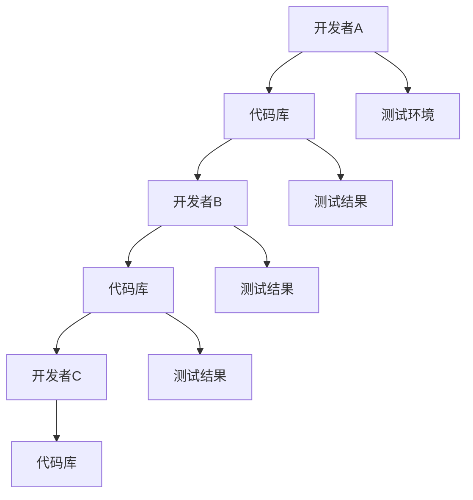
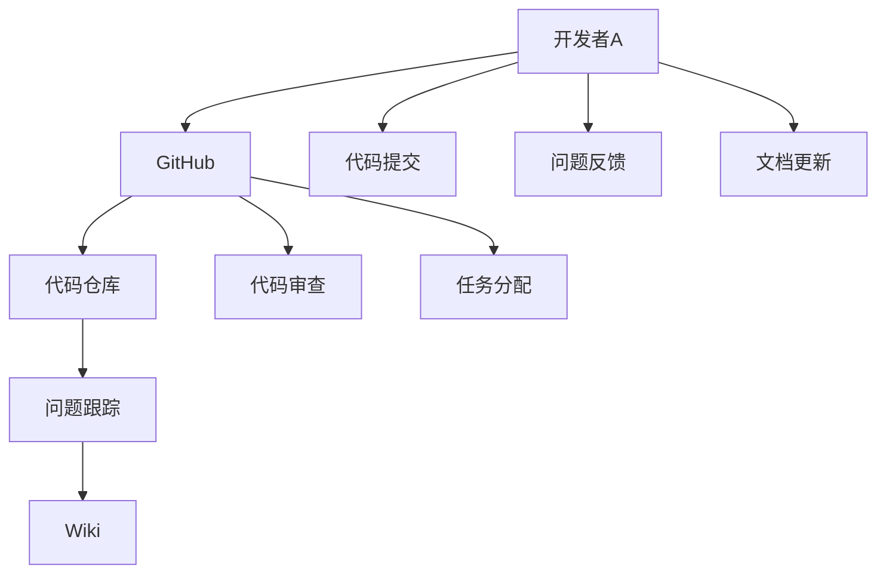
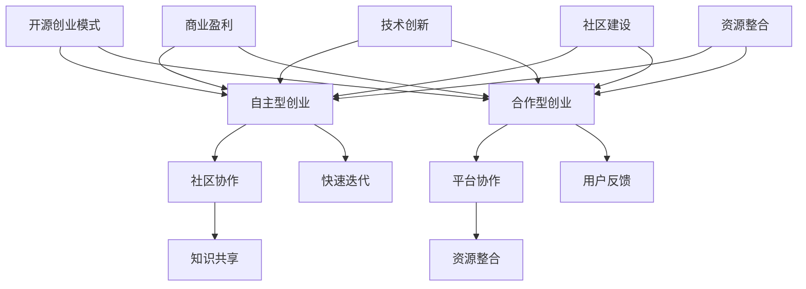

                 

### 引言

#### 1.1 开源创业的兴起

开源创业的概念起源于开源软件（Open Source Software，简称OSS）的兴起。开源软件最早可以追溯到1980年代的自由软件运动，其中最具代表性的就是Linux内核和GNU工具集。随着互联网的普及，开源社区逐渐壮大，吸引了大量开发者的参与，形成了独特的开源文化。

进入21世纪，开源创业开始成为一种新兴的创业模式。开源创业与传统创业不同，它强调协作、共享和透明度。开发者可以通过开源项目，吸引全球的志愿者和投资者，共同推动项目的发展。这种模式不仅降低了创业的门槛，还使得创新更加高效。

开源创业的兴起与以下几个因素密切相关：

1. **技术进步**：互联网和云计算的快速发展，为开源创业提供了强大的技术支持。开发者可以通过云平台，轻松搭建和维护开源项目。

2. **成本降低**：开源创业降低了硬件和软件的成本。开发者不需要投入大量的资金购买硬件设备，也不需要为软件版权支付费用。

3. **社区力量**：开源社区具有强大的自我组织和协作能力。通过社区的力量，开源项目可以迅速获得反馈和改进，提高项目的质量和影响力。

4. **商业模式的创新**：开源创业不仅限于软件开发，还可以应用于硬件、服务等领域。开发者可以通过提供增值服务、培训等方式，实现商业盈利。

#### 1.2 协作创新的本质

协作创新是指通过多方合作，共同推动创新活动的一种模式。在开源创业中，协作创新尤为重要。它不仅涉及到开发者之间的合作，还包括了投资者、用户、合作伙伴等多方面的参与。

协作创新的本质在于以下几个方面：

1. **资源共享**：协作创新通过共享资源，实现了资源的最大化利用。开发者可以共享代码、工具、硬件等资源，提高工作效率。

2. **知识共享**：协作创新鼓励知识的共享和传播。开发者可以在开源社区中分享自己的经验和知识，帮助其他开发者快速成长。

3. **优势互补**：协作创新使得各方可以发挥自己的优势，实现互补。例如，开发者可以专注于技术实现，而投资者可以专注于市场拓展。

4. **快速迭代**：协作创新使得项目可以快速迭代。通过社区的反馈，开发者可以不断优化项目，提高用户满意度。

#### 1.3 开源创业的优势

开源创业具有许多独特的优势，使其成为一种极具吸引力的创业模式。以下是其中几个主要优势：

1. **降低创业门槛**：开源创业降低了创业的门槛，使得更多的开发者有机会参与到创新活动中来。开发者不需要投入大量的资金，就可以启动一个开源项目。

2. **快速获得反馈**：开源创业通过社区的反馈机制，可以快速获得用户的反馈。开发者可以根据用户的反馈，不断改进项目，提高产品的质量和用户体验。

3. **资源整合**：开源创业可以整合全球的资源，包括开发者、投资者、用户等。这种资源整合能力，使得开源项目可以迅速获得影响力。

4. **商业模式创新**：开源创业不局限于传统的商业模式，可以通过提供增值服务、培训、咨询等方式实现盈利。这种商业模式创新，为开发者提供了更多的商业机会。

5. **可持续发展**：开源创业强调可持续性，通过社区的力量，开源项目可以持续发展。这种可持续发展能力，为开发者提供了稳定的创业环境。

#### 1.4 全书结构概述

本书旨在深入探讨开源创业这一新兴的创业模式，分为八个章节，分别从不同的角度对开源创业进行详细分析。

- **第1章 引言**：介绍了开源创业的兴起、协作创新的本质以及开源创业的优势。

- **第2章 开源文化与创业精神的融合**：探讨了开源文化与创业精神的融合，以及开源精神在创业中的应用。

- **第3章 开源创业模式解析**：分析了开源创业模式的特点、与传统创业模式的比较以及关键成功因素。

- **第4章 协作创新的新模式**：介绍了协作创新的原理、方法和实践案例。

- **第5章 开源创业的法律与伦理**：探讨了开源创业的法律环境、伦理问题以及应对策略。

- **第6章 开源创业的财务与运营策略**：分析了开源创业的财务策略和运营策略。

- **第7章 开源创业的未来趋势**：探讨了科技创新对开源创业的影响以及开源创业的国际视角。

- **第8章 成功开源创业案例解析**：通过案例研究，分析了成功开源创业的实践经验。

通过以上章节的详细分析，本书旨在为读者提供一个全面、系统的开源创业知识体系，帮助开发者更好地理解并实践开源创业。

### 开源文化与创业精神的融合

#### 2.1 开源文化的历史与发展

开源文化起源于1980年代的自由软件运动，最初的核心价值是软件的自由与共享。自由软件运动主张用户有权自由地使用、复制、研究、修改和分发软件。这一理念在1983年由理查德·斯托曼（Richard Stallman）发起的GNU项目得到了具体实践，GNU项目的目标是创建一套完整的自由操作系统，与商业化的UNIX系统形成对比。

随着Linux内核在1991年由林纳斯·托瓦兹（Linus Torvalds）发布，开源文化迅速传播。Linux的成功标志着开源软件从单一项目向生态系统转变，它吸引了全球开发者的参与，形成了一个庞大的开源社区。这个社区不仅包括了技术专家，还涵盖了普通用户、学生和爱好者。

开源文化在21世纪经历了巨大的发展，逐渐从技术领域扩展到商业领域。开源文化的主要核心价值包括：

1. **自由与共享**：用户有权自由使用、研究、修改和分发软件。
2. **透明与开放**：软件开发过程和代码是公开的，任何人都可以参与和审查。
3. **协作与互助**：开发者通过协作和互助，共同推动项目的进步。
4. **平等与尊重**：开源社区强调每个贡献者的重要性和平等地位。

#### 2.2 创业精神的开源实践

创业精神是一种追求创新、冒险和成长的态度和行动。在开源文化中，创业精神得到了充分的体现和发挥。开源项目的开发者们通过以下几种方式展现了创业精神：

1. **自主创新**：开源项目鼓励开发者进行自主创新。开发者可以自由地研究新技术，提出新想法，并将其实现为功能强大的软件。

2. **快速迭代**：开源项目通常采用敏捷开发的方法，快速迭代和发布新版本。这种快速反馈和迭代的模式，使得开发者能够迅速响应用户的需求，持续优化产品。

3. **用户至上**：开源项目的开发者们高度重视用户体验，通过社区的反馈和协作，不断改进产品的功能和质量。

4. **风险承担**：在开源项目中，开发者通常需要承担较高的风险。他们需要投入大量时间和精力，有时可能面临项目失败的风险，但他们仍然愿意为了创新和进步而努力。

#### 2.2.1 自主创新与协作

自主创新是开源文化的重要组成部分。开发者们通过自己的研究和开发，不断推动技术的进步。例如，在Linux内核的开发过程中，林纳斯·托瓦兹通过自主研究，提出了微内核的设计思想，这一创新为操作系统的发展提供了新的方向。

然而，开源项目的成功不仅仅依赖于自主创新，还需要协作。协作是开源项目的灵魂，它使得开发者们能够共同解决复杂的问题，提高开发效率。以下是一些协作的实践方式：

1. **代码贡献**：开发者可以通过提交代码的方式，为开源项目做出贡献。这种贡献不仅包括修复漏洞和增加功能，还可以是优化代码结构和性能。

2. **文档撰写**：文档是开源项目的重要组成部分，它帮助用户更好地理解和使用项目。开发者可以通过撰写文档，帮助新用户入门，同时也为项目的持续发展提供了支持。

3. **社区互动**：开源社区是一个开发者互动的平台，开发者可以通过论坛、邮件列表、社交媒体等渠道，与其他开发者交流想法和经验，共同推动项目的进步。

4. **会议与合作**：开源社区会定期举办各种会议和活动，如开源峰会、技术交流会等。这些活动为开发者提供了面对面交流的机会，促进了更紧密的合作。

#### 2.2.2 快速迭代与用户反馈

快速迭代是开源项目成功的关键之一。与传统软件开发相比，开源项目通常采用敏捷开发的方法，以更短的开发周期和更频繁的版本发布，迅速响应用户的需求和反馈。

快速迭代的过程通常包括以下几个步骤：

1. **需求收集**：开发者通过社区的反馈、用户报告等途径，收集用户的需求和建议。
2. **优先级排序**：根据需求的重要性和紧急性，开发者对需求进行排序，确定开发计划。
3. **设计与开发**：开发者根据排序后的需求，进行设计和开发工作。
4. **测试与发布**：开发者对代码进行测试，确保新功能的稳定性和可靠性，然后发布新版本。

用户反馈在快速迭代过程中起着至关重要的作用。以下是一些获取用户反馈的实践方式：

1. **用户调查**：开发者可以通过在线调查、问卷等方式，直接从用户那里获取反馈。
2. **社区论坛**：开源社区通常设有论坛，用户可以在论坛上提出问题、建议和反馈，开发者可以实时关注和回复。
3. **代码审查**：开发者可以通过代码审查，了解代码的优缺点，从中获取改进的灵感。
4. **使用统计数据**：开发者可以通过分析使用统计数据，了解用户的使用习惯和需求，为迭代提供依据。

通过快速迭代和用户反馈，开源项目能够持续改进，不断提高产品的质量和用户体验。

#### 2.3 开源创业的优势

开源创业作为一种新兴的创业模式，具有许多独特的优势。以下是其中几个主要的优势：

1. **降低创业成本**：开源创业降低了硬件和软件的成本。开发者不需要投入大量的资金购买硬件设备，也不需要为软件版权支付费用。这使得更多有才华的创业者能够参与到创业活动中来。

2. **快速获得反馈**：开源创业通过社区的反馈机制，可以快速获得用户的反馈。开发者可以根据用户的反馈，不断改进项目，提高产品的质量和用户体验。

3. **资源整合**：开源创业可以整合全球的资源，包括开发者、投资者、用户等。这种资源整合能力，使得开源项目可以迅速获得影响力。

4. **商业模式创新**：开源创业不局限于传统的商业模式，可以通过提供增值服务、培训、咨询等方式实现盈利。这种商业模式创新，为开发者提供了更多的商业机会。

5. **可持续发展**：开源创业强调可持续性，通过社区的力量，开源项目可以持续发展。这种可持续发展能力，为开发者提供了稳定的创业环境。

总之，开源文化和创业精神的融合，为开源创业带来了巨大的优势。开发者通过协作和创新，不仅推动了技术进步，也为自身创造了更多的商业机会。开源创业正在成为一种新的创业模式，吸引着越来越多的开发者参与其中。

### 开源创业模式解析

开源创业模式是一种独特的创业模式，它结合了开源文化和创业精神，为开发者提供了全新的创新路径。本文将深入探讨开源创业模式的特点、与传统创业模式的比较以及关键成功因素。

#### 3.1 开源创业模式概述

开源创业模式的主要特点包括自主性、合作性和开放性。这些特点使得开源创业模式具有以下几种类型：

1. **自主型创业**：这种类型的开源创业由单个开发者或小团队主导，他们拥有项目的主导权，独立进行项目开发、管理和运营。自主型创业的典型代表包括Linux内核、Apache软件等。

2. **合作型创业**：这种类型的开源创业强调多方合作，包括开发者、投资者、用户、合作伙伴等。合作型创业通常通过建立开源社区，实现资源的共享和协作。这种模式的典型代表包括Red Hat、Mozilla等。

3. **平台型创业**：平台型创业通过建立一个开放的平台，吸引第三方开发者、服务提供商和用户参与到项目中来。这种模式不仅促进了创新，还形成了生态系统。典型的平台型创业案例包括GitHub、OpenStack等。

#### 3.1.1 自主导型创业

自主型创业具有以下几个特点：

1. **独立开发**：开发者独立进行项目开发，从设计、编码到测试，都由开发者自行完成。
2. **自主管理**：开发者拥有项目的决策权，独立制定开发计划和发布策略。
3. **风险承担**：开发者需要承担项目失败的风险，同时享受项目成功的收益。
4. **快速迭代**：自主型创业通常采用敏捷开发的方法，快速响应市场需求，快速迭代和发布新版本。

自主型创业的优势在于其灵活性，开发者可以完全按照自己的意愿进行项目开发。然而，这种模式也存在一定的局限性，如资源有限、风险较大等。

#### 3.1.2 开放合作型创业

开放合作型创业具有以下几个特点：

1. **社区驱动**：开源项目通过建立社区，吸引全球的开发者和用户参与。社区成员通过共同讨论、协作，推动项目的进步。
2. **资源共享**：开发者可以共享代码、工具、硬件等资源，提高工作效率。
3. **知识共享**：开发者通过撰写文档、编写代码注释等方式，分享自己的知识和经验，帮助其他开发者快速成长。
4. **多元参与**：开放合作型创业涉及多个利益相关方，如投资者、用户、合作伙伴等，他们共同参与到项目中，共同推动项目的成功。

开放合作型创业的优势在于其广泛的参与者和资源整合能力。然而，这种模式也面临一些挑战，如项目治理、决策效率等。

#### 3.2 开源创业与传统创业的比较

开源创业与传统创业在模式、资源和风险管理等方面存在显著差异。以下是比较的几个关键方面：

1. **模式差异**：

- **传统创业**：传统创业通常由一个创业团队主导，通过研发、营销、销售等环节，实现商业盈利。
- **开源创业**：开源创业强调协作和创新，通过开源项目吸引全球的开发者和用户参与，形成强大的社区。

2. **资源差异**：

- **传统创业**：传统创业需要大量的资金投入，用于购买硬件设备、招聘人员、市场推广等。
- **开源创业**：开源创业通过共享资源和知识，降低了创业成本。开发者可以利用免费的开源软件、云服务、社区资源等，实现项目的开发。

3. **风险管理**：

- **传统创业**：传统创业面临较大的风险，如市场风险、技术风险、管理风险等。
- **开源创业**：开源创业通过社区的力量，可以快速获得反馈和改进。开发者可以根据社区的反馈，及时调整项目方向，降低风险。

#### 3.3 开源创业的关键成功因素

开源创业的成功离不开以下几个关键因素：

1. **社区建设**：开源社区是开源创业的核心。开发者需要通过有效的社区建设，吸引全球的开发者和用户参与，形成强大的社区生态。

2. **知识共享**：开源创业强调知识的共享和传播。开发者需要通过撰写文档、编写代码注释等方式，分享自己的知识和经验，提高社区的活力和影响力。

3. **持续迭代**：开源创业需要持续迭代和优化。开发者需要根据社区的反馈，不断改进项目，提高产品的质量和用户体验。

4. **商业模式创新**：开源创业需要探索新的商业模式，实现盈利。开发者可以通过提供增值服务、培训、咨询等方式，实现商业盈利。

5. **风险管理和应对**：开源创业面临多种风险，如技术风险、市场风险、法律风险等。开发者需要建立健全的风险管理体系，及时应对各种风险。

总之，开源创业模式为开发者提供了一种全新的创业路径。通过协作和创新，开发者可以在开源社区中实现技术突破和商业成功。开源创业的成功，不仅为开发者带来了机遇，也为整个技术生态的繁荣做出了贡献。

#### 4.1 协作创新的原理

协作创新是一种通过多方合作，共同推动创新活动的模式。在开源创业中，协作创新尤为重要，它不仅促进了技术的进步，也为项目的成功提供了强有力的支持。以下是协作创新的基本原理：

##### 4.1.1 协作网络的构建

协作网络是指由多个节点和它们之间的联系组成的复杂系统。在协作创新中，节点可以代表个人、团队、组织或项目，而联系则表示节点之间的互动和合作。构建有效的协作网络是实现协作创新的基础。

1. **节点选择**：选择合适的节点是构建协作网络的关键。节点应具备以下特点：

   - **知识互补**：节点应拥有不同的专业技能和知识，以便在合作中相互补充。
   - **资源丰富**：节点应具备丰富的资源，如技术、资金、人脉等，以便为合作提供支持。
   - **积极参与**：节点应具有高度的合作意愿，积极参与协作活动。

2. **关系建立**：节点之间的关系是协作网络的核心。建立良好的关系需要以下步骤：

   - **信任建立**：通过相互了解、共同完成任务等方式，建立信任关系。
   - **沟通渠道**：建立有效的沟通渠道，确保信息的及时传递和反馈。
   - **利益共享**：明确合作中的利益分配机制，确保各方能够从合作中获益。

##### 4.1.2 创新激励机制

创新激励机制是推动协作创新的重要手段。以下是一些有效的创新激励机制：

1. **奖励制度**：设立奖励制度，对在协作创新中做出突出贡献的个人和团队进行奖励，提高他们的积极性。

2. **荣誉机制**：通过授予荣誉称号、颁发证书等方式，对在协作创新中取得显著成绩的个人和团队进行表彰，增强他们的成就感。

3. **晋升机制**：将协作创新的成绩纳入个人和团队的晋升考核，激励他们不断提升自己的创新能力。

4. **利益分配**：明确合作中的利益分配机制，确保各方能够公平地分享创新成果，提高合作的积极性。

##### 4.1.3 协作网络的度分布

协作网络的度分布是描述网络中节点度数分布的统计量。在大多数社交网络和协作网络中，度分布通常服从泊松分布。泊松分布的公式如下：

$$
P(k) = \frac{e^{-\lambda} \cdot \lambda^k}{k!}
$$

其中，$P(k)$ 表示节点度数为 $k$ 的概率，$\lambda$ 为网络的平均度数，$e$ 是自然对数的底数。

**举例说明：** 假设一个协作网络的平均度为 $\lambda = 5$，则度数为 $5$ 的节点出现的概率为：

$$
P(5) = \frac{e^{-5} \cdot 5^5}{5!} \approx 0.082
$$

度分布对于协作创新具有重要意义。一个良好的协作网络应具有较高的平均度数和合理的度分布。高平均度数意味着节点之间的联系较为紧密，有助于信息的快速传播和资源的有效整合。合理的度分布则可以确保网络的稳定性和抗攻击能力。

#### 4.2 协作创新的方法

协作创新的方法多种多样，不同类型的项目和团队可以根据实际情况选择合适的方法。以下是一些常见的协作创新方法：

##### 4.2.1 对等网络

对等网络（Peer-to-Peer，P2P）是一种基于平等原则的网络架构，网络中的节点（参与者）可以通过直接连接，共享资源、信息和任务。对等网络具有以下特点：

1. **去中心化**：对等网络没有中心化的控制节点，每个节点都具有相同的功能和权限。
2. **自组织**：对等网络通过节点的自我组织，实现资源的动态分配和任务的分布式执行。
3. **容错性强**：对等网络具有良好的容错性，单个节点的故障不会影响整个网络的运行。

对等网络在协作创新中具有广泛的应用，如分布式计算、数据共享、物联网等。以下是一个简单的对等网络协作创新实例：

**实例**：假设一个开源软件项目由多个开发者参与，每个开发者负责一部分功能的开发和测试。通过P2P网络，开发者可以实时共享代码、资源和反馈，提高开发效率。



在这个实例中，A、B、C三个开发者通过P2P网络共享代码库和测试结果，共同推进项目的开发。

##### 4.2.2 平台型协作

平台型协作是指通过一个开放的平台，吸引多个节点（参与者）参与到协作创新中。平台通常提供了一系列的工具、服务和资源，以支持节点的协作和创新。平台型协作具有以下特点：

1. **资源共享**：平台提供共享资源，如云计算、存储、数据库等，节点可以通过平台方便地获取和使用这些资源。
2. **功能集成**：平台通常集成了多种功能，如项目管理、代码审查、文档编写、任务分配等，节点可以通过平台完成各种协作任务。
3. **灵活扩展**：平台可以根据需求灵活扩展功能，支持各种类型的协作创新。

平台型协作的典型代表包括GitHub、GitLab等。以下是一个简单的平台型协作创新实例：

**实例**：假设一个开源项目在GitHub上进行协作，开发者可以通过GitHub的代码仓库、问题跟踪、Wiki等功能，共同推进项目的开发。



在这个实例中，开发者A通过GitHub平台共享代码、提交问题、更新文档等，与其他开发者协作创新。

#### 4.3 协作创新的实践案例

协作创新在开源社区中得到了广泛的应用，以下是一些成功的协作创新实践案例：

##### 4.3.1 GitHub上的成功案例

GitHub是全球最大的开源代码托管平台，它为开发者提供了一个强大的协作创新环境。以下是一些在GitHub上取得成功的协作创新案例：

1. **Linux内核**：Linux内核是开源社区的一个典型代表，它由全球的开发者共同开发和维护。通过GitHub，开发者可以方便地提交代码、进行代码审查、讨论问题等，推动了Linux内核的持续发展和创新。

2. **Kubernetes**：Kubernetes是一个开源的容器编排平台，它由Google发起，并在GitHub上进行开发和维护。通过GitHub，Kubernetes吸引了全球的志愿者和贡献者，共同推动项目的创新和发展。

##### 4.3.2 知名开源社区的运作模式

知名开源社区如Apache、Mozila等，通过有效的协作创新模式，实现了持续的发展和成功。以下是一些它们的运作模式：

1. **Apache软件基金会**：Apache软件基金会是一个非营利组织，负责管理和维护多个开源项目，如Apache HTTP服务器、Apache Kafka等。基金会通过明确的角色分工、严格的代码审查流程和透明的项目管理，确保了项目的稳定和持续发展。

2. **Mozila基金会**：Mozila基金会负责维护和推广Mozilla Firefox浏览器等开源项目。基金会通过建立开放的社区、鼓励用户参与和贡献、以及提供培训和支持等方式，促进了协作创新和项目的成功。

通过以上实践案例，我们可以看到，协作创新在开源创业中具有重要的地位和作用。通过有效的协作创新模式，开源项目可以吸引全球的志愿者和贡献者，共同推动项目的进步，实现技术的创新和商业的成功。

### 开源创业的法律与伦理

开源创业作为一种新兴的创业模式，涉及众多的法律和伦理问题。正确理解和应对这些法律和伦理问题，对于开源创业的成功至关重要。

#### 5.1 开源创业的法律环境

开源创业的法律环境主要包括开源协议的种类、法律风险以及应对策略等方面。

##### 5.1.1 开源协议的种类

开源协议（Open Source License）是用于规范开源项目使用、修改和分发的一种法律文件。常见的开源协议包括以下几种：

1. **GPL（GNU General Public License）**：GPL是一种强Copyleft协议，要求任何修改和分发都必须以相同的方式开源，确保软件的源代码对用户始终开放。

2. **BSD（Berkeley Software Distribution License）**：BSD协议是一种弱Copyleft协议，允许软件的商业使用和修改，但要求保留原始版权声明。

3. **Apache License 2.0**：Apache License 2.0允许自由使用、修改和分发，同时允许商业使用，但要求保留版权声明。

4. **MIT License**：MIT License与Apache License类似，允许自由使用、修改和分发，同时允许商业使用，但要求保留原始版权声明。

选择合适的开源协议对于开源创业至关重要。开发者需要根据项目的特点、目标用户和商业计划等因素，选择适合的开源协议。

##### 5.1.2 法律风险与应对

开源创业过程中可能面临的法律风险主要包括知识产权侵犯、合同纠纷、数据隐私保护等方面。以下是一些常见的法律风险和应对策略：

1. **知识产权侵犯**：开发者在使用第三方开源软件时，可能无意中侵犯了他人的知识产权。为了避免这种情况，开发者应在引入第三方代码前，仔细审查其开源协议，确保有权使用和修改。此外，开发者应建立严格的代码审查流程，确保引入的代码符合开源协议的要求。

2. **合同纠纷**：开源创业过程中，开发者可能需要与合作伙伴、投资者等签订合同。合同纠纷可能因条款不明、权利义务不清等原因产生。为避免纠纷，开发者应详细审查合同条款，明确各方的权利和义务，确保合同内容合法、合理。

3. **数据隐私保护**：开源项目通常涉及用户数据的收集和处理。开发者需要遵守相关的数据隐私保护法律法规，如《通用数据保护条例》（GDPR）等。开发者应在项目设计和开发过程中，充分考虑数据隐私保护的需求，采取有效的技术和管理措施，确保用户数据的安全和隐私。

##### 5.1.3 法律风险的应对策略

为应对开源创业中的法律风险，开发者可以采取以下策略：

1. **法律培训**：开发者应定期参加法律培训，了解开源协议、知识产权保护、合同管理等方面的法律法规。

2. **聘请法律顾问**：在开源创业过程中，开发者可以聘请专业的法律顾问，提供法律咨询和风险防范建议。

3. **建立内部审查机制**：开发者应建立内部审查机制，对引入的第三方代码、合同条款等进行审查，确保符合法律要求。

4. **持续更新知识**：开源创业的法律环境不断变化，开发者需要持续关注相关法律法规的更新，及时调整应对策略。

#### 5.2 伦理问题与开源创业

开源创业涉及多个利益相关方，包括开发者、用户、投资者等，伦理问题在这些关系中尤为重要。以下是一些常见的伦理问题及其应对策略：

##### 5.2.1 数据隐私保护

数据隐私保护是开源创业中的关键伦理问题。开发者需要遵守数据隐私保护法律法规，保护用户数据的安全和隐私。具体应对策略包括：

1. **隐私政策**：开发者应在项目启动前，制定详细的隐私政策，明确用户数据的收集、使用和共享方式。

2. **透明度**：开发者应确保项目运作的透明度，让用户了解其数据的使用情况。

3. **数据加密**：开发者应对用户数据进行加密处理，确保数据在传输和存储过程中的安全性。

##### 5.2.2 知识产权尊重

知识产权尊重是开源创业中的基本伦理原则。开发者应尊重他人的知识产权，避免侵犯他人的专利、著作权等。具体应对策略包括：

1. **知识产权审查**：开发者在使用第三方代码或技术时，应进行详细的知识产权审查，确保有权使用。

2. **版权声明**：开发者应在项目代码中添加版权声明，明确代码的版权归属和使用许可。

3. **开源协议**：开发者应选择合适的开源协议，规范项目代码的使用、修改和分发。

##### 5.2.3 责任担当

开源创业中的开发者需要承担相应的责任，包括对项目的质量、用户数据和商业行为负责。具体应对策略包括：

1. **质量控制**：开发者应确保项目的质量，进行严格的代码审查和测试，避免发布存在漏洞或问题的代码。

2. **用户支持**：开发者应提供及时的用户支持，帮助用户解决使用过程中的问题。

3. **商业合规**：开发者应确保项目的商业行为符合相关法律法规，避免非法商业行为。

总之，开源创业中的法律和伦理问题至关重要。开发者需要认真对待这些问题，采取有效的应对策略，确保项目的合法性和伦理性，为开源创业的可持续发展奠定基础。

### 开源创业的财务与运营策略

开源创业的独特性在于其基于共享、协作和创新的理念，这不仅影响了项目的开发过程，也深刻影响了其财务和运营策略。本文将探讨开源创业中的财务策略和运营策略，并分析如何通过有效的财务和运营管理，确保项目的可持续性和盈利能力。

#### 6.1 财务策略

开源创业的财务策略需要考虑到项目的成本结构、收入来源和盈利模式。以下是一些关键的财务策略：

##### 6.1.1 成本结构分析

开源创业的成本结构通常包括以下几个方面：

1. **开发成本**：包括软件开发人员的工资、硬件设备的费用、软件开发工具的购买费用等。
2. **维护成本**：包括项目维护、更新、修复漏洞等所需的费用。
3. **营销成本**：包括推广项目、吸引用户和开发者的费用。
4. **运营成本**：包括服务器租赁、带宽费用、办公场所租赁等。

开源创业的一大优势在于其低开发成本。由于开源项目的基础代码是免费的，开发者可以利用现有的开源软件和工具来降低开发成本。然而，维护成本和营销成本仍然是开源项目需要关注的重要方面。

##### 6.1.2 盈利模式探索

开源创业的盈利模式多种多样，以下是一些常见的盈利模式：

1. **增值服务**：提供与开源项目相关的增值服务，如付费支持、高级功能、定制开发等。
2. **培训与咨询**：为开发者提供培训课程、技术咨询和顾问服务。
3. **企业订阅**：企业用户可以通过订阅的方式，获取项目的更新和支持。
4. **广告收入**：在项目网站上展示广告，通过广告收入实现盈利。
5. **赞助与捐赠**：通过企业或个人的赞助、捐赠来获取收入。

开源创业项目通常需要探索多种盈利模式，以确保项目的可持续性和盈利能力。例如，一个开源数据库项目可能通过提供付费支持和企业订阅来获取收入，同时通过培训和咨询服务来补充收入。

#### 6.2 运营策略

开源创业的运营策略需要考虑到用户体验、社区建设和持续集成等方面。以下是一些关键的运营策略：

##### 6.2.1 用户体验设计

用户体验（User Experience，UX）设计是开源创业成功的关键因素之一。一个良好的用户体验可以吸引更多的用户和开发者，提高项目的活跃度和影响力。以下是一些用户体验设计的关键点：

1. **简洁明了**：项目的界面和文档应简洁明了，易于用户理解和操作。
2. **快速响应**：及时响应用户的问题和反馈，解决用户遇到的问题。
3. **个性化定制**：提供个性化定制选项，满足用户的不同需求。
4. **反馈机制**：建立有效的反馈机制，收集用户的意见和建议，持续改进项目。

##### 6.2.2 持续集成与发布

持续集成（Continuous Integration，CI）和持续部署（Continuous Deployment，CD）是现代软件开发中的重要实践。它们有助于提高项目的开发效率、稳定性和可靠性。以下是一些关键点：

1. **自动化测试**：编写自动化测试用例，确保每次代码提交都经过充分的测试。
2. **自动化构建**：使用自动化工具构建项目，确保项目构建的稳定性和一致性。
3. **版本控制**：使用版本控制系统（如Git），确保代码的版本控制和协作开发。
4. **自动化部署**：使用自动化工具将代码部署到生产环境，确保发布的及时性和稳定性。

#### 6.3 成本控制与效益最大化

开源创业项目的成功不仅依赖于财务和运营策略，还需要有效的成本控制和效益最大化。以下是一些策略：

1. **预算管理**：制定详细的预算计划，严格控制各项开支。
2. **资源优化**：优化资源使用，提高资源利用效率，降低运营成本。
3. **合作与外包**：与合作伙伴建立合作关系，共享资源和风险。对于非核心功能，可以考虑外包，降低开发成本。
4. **风险规避**：识别和管理项目风险，采取有效的风险规避措施，确保项目的稳定性和可持续发展。

通过以上财务和运营策略，开源创业项目可以确保其成本结构合理、收入来源多样化、用户体验优良，实现项目的可持续发展和盈利能力。开源创业的成功不仅为开发者带来了商业机会，也为整个技术生态的繁荣做出了贡献。

### 开源创业的未来趋势

开源创业作为一种新兴的创业模式，正逐渐成为科技领域的重要趋势。未来，随着科技的不断进步，开源创业将继续迎来新的机遇和挑战。

#### 7.1 科技创新对开源创业的影响

科技创新是推动开源创业发展的重要动力。以下是一些关键科技创新及其对开源创业的影响：

##### 7.1.1 人工智能与开源创业

人工智能（AI）技术的迅速发展为开源创业提供了新的机遇。开源创业项目可以利用AI技术进行数据分析和模式识别，提高项目开发的效率和智能化水平。以下是一些具体应用：

1. **自动化测试**：AI技术可以用于编写和执行自动化测试，提高测试的覆盖率和准确性。
2. **智能推荐**：开源项目可以利用AI算法，为用户提供个性化推荐，提高用户参与度和满意度。
3. **自动化文档生成**：AI技术可以自动生成项目文档，降低文档编写成本。

##### 7.1.2 区块链技术的作用

区块链技术作为一种分布式账本技术，为开源创业提供了新的解决方案。以下是一些关键应用：

1. **版权保护**：区块链技术可以用于保护开源项目的版权，确保代码的原创性和完整性。
2. **智能合约**：开源创业项目可以利用智能合约，自动执行合同条款，提高交易的安全性和效率。
3. **去中心化存储**：区块链技术可以用于去中心化存储，提高数据的可靠性和可用性。

#### 7.2 开源创业的国际视角

开源创业不仅在国内蓬勃发展，也在国际上取得了显著成果。以下是一些国际视角下的开源创业趋势：

##### 7.2.1 全球开源生态的分布

全球开源生态的分布逐渐呈现出多元化和区域化的趋势。以下是一些主要开源生态的分布情况：

1. **北美**：北美是全球最大的开源生态区域，拥有大量的开源项目和贡献者。例如，GitHub、GitLab等开源平台在美国得到了广泛应用。
2. **欧洲**：欧洲开源生态以德国、法国和英国等国家为代表，这些国家的开源项目在云计算、大数据等领域取得了显著成果。
3. **亚洲**：亚洲地区，尤其是中国，正逐渐成为全球开源生态的重要力量。中国的开源项目在人工智能、区块链等领域取得了重要突破。

##### 7.2.2 中国开源创业的机遇与挑战

中国开源创业正迎来新的机遇和挑战。以下是一些关键点：

1. **政策支持**：中国政府高度重视开源创业，出台了一系列政策支持措施，为开源创业提供了良好的发展环境。
2. **市场潜力**：中国拥有庞大的互联网用户群体，这为开源项目提供了广阔的市场空间。
3. **人才储备**：中国拥有大量的技术人才，为开源创业提供了强大的人才支持。
4. **挑战**：开源创业在中国面临一些挑战，如知识产权保护不力、社区建设不足等。

总之，开源创业作为科技创新的重要驱动力，将在未来继续发挥重要作用。通过加强国际合作、提高社区建设、完善知识产权保护等举措，开源创业有望在全球范围内实现更大的发展。

### 成功开源创业案例解析

#### 8.1 案例研究一：Apache软件基金会

Apache软件基金会（Apache Software Foundation，ASF）是一个非营利组织，负责管理和维护多个著名的开源项目，如Apache HTTP服务器、Apache Kafka、Apache Spark等。ASF的成功经验为其在开源创业领域树立了典范。

##### 8.1.1 基金会的组织结构与运作

Apache软件基金会的组织结构采用分布式领导模式，由多个项目委员会和指导委员会共同管理。每个项目都有其自己的项目指导委员会（PMC），负责项目的决策和运作。ASF的运作机制主要包括以下几点：

1. **开放性**：ASF鼓励所有贡献者参与项目决策，确保项目透明度和公正性。
2. **社区驱动**：ASF重视社区建设，通过社区活动、会议、邮件列表等渠道，增强开发者之间的互动和合作。
3. **代码审查**：ASF采用严格的代码审查流程，确保代码质量，提高项目的可靠性和安全性。

##### 8.1.2 成功经验与挑战

ASF的成功经验主要包括：

1. **品牌建设**：ASF通过多年的积累，建立了强大的品牌影响力，吸引了大量的贡献者和用户。
2. **合作与共赢**：ASF与多家企业和机构建立了合作关系，共同推动开源技术的发展。
3. **灵活的管理模式**：ASF采用分布式领导模式，能够快速响应社区需求，提高项目运作效率。

然而，ASF也面临一些挑战：

1. **资源分配**：随着项目数量的增加，ASF需要合理分配资源，确保每个项目都能获得足够的支持。
2. **法律风险**：开源项目的法律风险较高，ASF需要持续关注知识产权保护等问题，确保项目的合法性。

##### 8.1.3 对其他开源创业项目的启示

ASF的成功经验为其他开源创业项目提供了以下启示：

1. **社区建设**：重视社区建设，通过开放性、透明度和互动性，增强项目的影响力和用户粘性。
2. **合作共赢**：与合作伙伴建立合作关系，共同推动项目的进步。
3. **灵活管理**：采用灵活的管理模式，快速响应社区需求，提高项目运作效率。
4. **知识产权保护**：重视知识产权保护，确保项目的合法性和可持续性。

#### 8.2 案例研究二：红帽公司的转型之路

红帽公司（Red Hat）是一家全球领先的开源解决方案供应商，成立于1993年，总部位于美国。红帽公司的成功转型从开源社区到商业模式的转变，为其他开源创业项目提供了宝贵经验。

##### 8.2.1 从开源社区到商业模式的转变

红帽公司的转型之路始于其在开源社区中的积累。以下是红帽公司从开源社区到商业模式的转变过程：

1. **社区建设**：红帽公司高度重视开源社区建设，通过举办活动、提供技术支持等方式，吸引了大量的开发者参与。
2. **产品化**：红帽公司将开源技术产品化，提供企业级软件解决方案，满足企业的需求。
3. **服务化**：红帽公司提供专业的咨询服务，帮助企业实施开源技术，解决实际问题。
4. **盈利模式**：红帽公司通过提供订阅服务、培训、认证等方式，实现了商业盈利。

##### 8.2.2 创新与成长策略

红帽公司的创新与成长策略主要包括以下几点：

1. **技术创新**：红帽公司持续投入研发，推动开源技术的发展和创新，保持技术领先地位。
2. **市场拓展**：红帽公司通过全球营销策略，拓展市场份额，吸引了大量的企业客户。
3. **人才培养**：红帽公司重视人才培养，建立了一套完善的培训体系和认证体系，提高了员工的技能和素质。
4. **战略合作**：红帽公司与多家知名企业建立战略合作关系，共同推动开源技术的发展。

##### 8.2.3 对其他开源创业项目的启示

红帽公司的转型经验为其他开源创业项目提供了以下启示：

1. **社区建设**：重视社区建设，通过提供技术支持、举办活动等方式，增强项目的影响力和用户粘性。
2. **产品化与服务化**：将开源技术产品化和服务化，提供企业级解决方案，满足市场需求。
3. **盈利模式探索**：探索多元化的盈利模式，如订阅服务、培训、认证等，实现商业盈利。
4. **技术创新与市场拓展**：持续投入研发，推动技术创新，拓展市场份额。
5. **人才培养与战略合作**：重视人才培养，建立培训体系和认证体系；与知名企业建立战略合作关系，共同推动项目发展。

通过以上成功开源创业案例的研究，我们可以看到，开源创业项目在社区建设、技术创新、商业模式等方面都有独特的经验和教训。这些经验对于其他开源创业项目具有重要的启示作用，有助于他们更好地实现技术创新和商业成功。

### 附录：开源创业资源指南

#### 附录1：开源创业社区推荐

1. **GitHub**：全球最大的开源代码托管平台，提供代码托管、协作开发、社区交流等功能。
2. **GitLab**：GitLab提供与GitHub类似的功能，支持自建私有代码仓库，适合企业内部使用。
3. **OSChina**：中国最大的开源社区，提供代码托管、社区交流、活动组织等服务。
4. **Bitbucket**：Atlassian推出的代码托管平台，支持Git和Mercurial，适合小型团队和大型项目的协作开发。

#### 附录2：开源协议详解

1. **GPL（GNU General Public License）**：强Copyleft协议，要求任何修改和分发都必须以相同的方式开源。
2. **Apache License 2.0**：弱Copyleft协议，允许商业使用和修改，但要求保留原始版权声明。
3. **MIT License**：最宽松的协议，允许自由使用、修改和分发，无需保留版权声明。
4. **BSD License**：类似于MIT License，但有一些额外的限制，如要求保留版权声明和免责声明。

#### 附录3：开源创业工具与平台

1. **Jenkins**：一款开源的持续集成工具，支持多种插件，方便开发者进行自动化测试和构建。
2. **Docker**：一款开源的容器化技术，用于简化应用程序的部署和运行。
3. **Kubernetes**：一款开源的容器编排平台，用于自动化容器化应用程序的部署、扩展和管理。
4. **JIRA**：一款开源的敏捷项目管理工具，提供问题跟踪、迭代规划和报告等功能。

#### 附录4：开源创业相关书籍与论文推荐

1. **《开源创新：如何利用开源模式实现商业成功》**：作者：史蒂文·沃斯（Steven Vos）
2. **《开源之道：开源软件的文化、商业与社会意义》**：作者：埃里克·雷蒙（Eric S. Raymond）
3. **《社区规则：构建成功开源社区的实践指南》**：作者：杰森·麦克莱恩（Jason McLean）
4. **《开放源代码项目管理：一个简单实用的指南》**：作者：乔·阿帕克（Joe Appel）
5. **《开源生态系统：如何构建、管理和盈利》**：作者：史蒂文·沃斯（Steven Vos）

通过以上资源指南，开源创业者可以更好地了解开源创业的相关知识，掌握开源工具和平台的使用方法，为项目的成功奠定基础。

### 绘制开源创业模式图

以下是开源创业模式图的Mermaid代码：



这张图展示了开源创业的几种主要模式，包括自主型创业和合作型创业。自主型创业强调独立开发、快速迭代和用户反馈，而合作型创业则强调社区协作、平台协作、知识共享和资源整合。同时，商业盈利、技术创新和社区建设是开源创业成功的关键因素，贯穿于自主型和合作型创业模式中。

### 数学模型与算法讲解

在开源创业和协作创新中，数学模型和算法发挥着重要的作用。以下将介绍两个关键的数学模型：协作网络的度分布模型和信息传播模型，以及相关的伪代码和详细讲解。

#### 模型1：协作网络的度分布

协作网络是开源社区的核心组成部分，其度分布模型有助于理解网络的结构特性。度分布描述了网络中节点度数的概率分布，常用的模型包括泊松分布和幂律分布。

泊松分布模型：

$$
P(k) = \frac{e^{-\lambda} \cdot \lambda^k}{k!}
$$

其中，$P(k)$ 是节点度数为 $k$ 的概率，$\lambda$ 是网络的平均度数，$e$ 是自然对数的底数。

**举例说明：**

假设一个协作网络的平均度为 $\lambda = 5$，则度数为 $5$ 的节点出现的概率为：

$$
P(5) = \frac{e^{-5} \cdot 5^5}{5!} \approx 0.082
$$

**伪代码：**

```python
import math

def poisson_distribution(lambda_value, k):
    return (math.exp(-lambda_value) * (lambda_value ** k)) / math.factorial(k)
```

#### 模型2：信息传播模型

信息传播模型描述了信息在社交网络中的传播过程，常用的模型包括独立模型、SIS模型和SIR模型。以下是一个简化的SIS模型：

$$
\frac{dI}{dt} = -\frac{I}{\tau} + \frac{1}{\nu} (1 - I)
$$

其中，$I$ 是信息传播速率，$\tau$ 是平均寿命，$\nu$ 是传播速率。

**举例说明：**

假设一个节点以 $\nu = 0.1$ 的速率传播信息，并且信息传播的平均寿命为 $\tau = 10$，则单位时间内传播的信息量可以计算为：

$$
\frac{dI}{dt} = -\frac{I}{10} + \frac{0.1}{10} (1 - I)
$$

当 $I = 0.5$ 时，传播的信息量为：

$$
\frac{dI}{dt} = -\frac{0.5}{10} + \frac{0.1}{10} (1 - 0.5) = -0.05 + 0.005 = -0.045
$$

**伪代码：**

```python
def info_spread(I, tau, nu):
    return (-I / tau + (1 - I) * nu / tau)
```

#### 代码解读与分析

**协作网络的度分布**

在开源创业中，理解协作网络的度分布对于资源分配和社区管理至关重要。以下是一个简单的Python代码示例，用于计算泊松分布下的度分布：

```python
import matplotlib.pyplot as plt
import numpy as np

def plot_poisson_distribution(lambda_value):
    k = np.arange(0, 15)
    p = [poisson_distribution(lambda_value, k_i) for k_i in k]

    plt.plot(k, p)
    plt.xlabel('Node Degree (k)')
    plt.ylabel('Probability (P(k))')
    plt.title(f'Poisson Distribution with $\lambda$ = {lambda_value}')
    plt.show()

plot_poisson_distribution(5)
```

**信息传播模型**

信息传播模型对于开源项目中的快速迭代和用户反馈机制至关重要。以下是一个简单的Python代码示例，用于计算SIS模型下的信息传播速率：

```python
def plot_info_spread(I, tau, nu):
    t = np.linspace(0, 10, 100)
    dI_dt = [info_spread(I, tau, nu) for _ in t]

    plt.plot(t, dI_dt)
    plt.xlabel('Time (t)')
    plt.ylabel('Rate of Information Spread (dI/dt)')
    plt.title(f'Information Spread with I = {I}, $\tau$ = {tau}, $\nu$ = {nu}')
    plt.show()

plot_info_spread(0.5, 10, 0.1)
```

通过以上代码，我们可以直观地了解协作网络的度分布和信息传播模型在开源创业中的应用。这些模型和算法不仅有助于我们理解开源创业的内在机制，也为实际的项目管理和决策提供了科学依据。

### 项目实战

#### 项目1：GitHub开源项目协作

**开发环境搭建**

1. **安装Git**：在命令行中输入以下命令，安装Git：

```shell
sudo apt-get install git
```

2. **安装GitHub Desktop**：访问GitHub官网（https://github.com/），下载并安装GitHub Desktop。

3. **注册GitHub账号**：在GitHub官网上注册一个新的账号。

4. **创建GitHub仓库**：登录GitHub账号，点击右上角的“+”号，选择“New repository”创建一个新的仓库。

**源代码实现**

以下是一个简单的GitHub开源项目协作的示例：

1. **初始化本地仓库**：

```shell
git init
```

2. **创建一个名为`README.md`的文件**：

```shell
echo "# My Open Source Project" > README.md
git add README.md
```

3. **提交更改**：

```shell
git commit -m "Initialize README file"
```

4. **关联远程仓库**：

```shell
git remote add origin https://github.com/username/opensource-project.git
```

5. **推送到远程仓库**：

```shell
git push -u origin master
```

**代码解读与分析**

1. **初始化本地仓库**：使用`git init`初始化一个本地仓库，将当前目录变为一个Git仓库。

2. **创建`README.md`文件**：使用`echo`命令创建一个名为`README.md`的文件，内容为项目的描述信息。使用`git add`命令将文件添加到暂存区。

3. **提交更改**：使用`git commit`命令提交更改，`-m`选项用于添加提交信息。

4. **关联远程仓库**：使用`git remote add`命令添加一个名为`origin`的远程仓库，地址为GitHub上的仓库地址。

5. **推送到远程仓库**：使用`git push`命令将本地仓库推送到远程仓库，`-u`选项用于将本地主分支与远程主分支关联。

通过以上步骤，开发者可以方便地在本地和远程仓库之间同步代码，实现协作开发。

#### 项目2：Maven项目结构管理

**开发环境搭建**

1. **安装Maven**：在命令行中输入以下命令，安装Maven：

```shell
sudo apt-get install maven
```

2. **创建Maven项目**：在命令行中输入以下命令，创建一个Maven项目：

```shell
mvn archetype:generate -DgroupId=com.example -DartifactId=my-maven-project -DarchetypeArtifactId=maven-archetype-quickstart
```

**源代码实现**

以下是一个简单的Maven项目结构示例：

```shell
my-maven-project
├── pom.xml
├── src
│   ├── main
│   │   ├── java
│   │   │   └── HelloWorld.java
│   └── test
│       └── java
│           └── HelloWorldTest.java
└── .gitignore
```

1. **`pom.xml`**：Maven项目的核心配置文件，用于定义项目的依赖、插件、版本等信息。

2. **`src/main/java/HelloWorld.java`**：项目的主类文件，包含程序的入口。

3. **`src/test/java/HelloWorldTest.java`**：测试类文件，用于编写测试用例。

4. **`.gitignore`**：Git忽略文件，用于指定不被Git跟踪的文件。

**代码解读与分析**

1. **创建Maven项目**：使用Maven的archetype生成器创建一个基本的Maven项目结构。

2. **`pom.xml`**：定义项目的依赖和插件，如Spring Boot依赖、JDK版本等。

3. **`src/main/java/HelloWorld.java`**：实现主类，如下所示：

```java
public class HelloWorld {
    public static void main(String[] args) {
        System.out.println("Hello, World!");
    }
}
```

4. **`src/test/java/HelloWorldTest.java`**：编写测试用例，如下所示：

```java
import static org.junit.jupiter.api.Assertions.assertEquals;
import org.junit.jupiter.api.Test;

public class HelloWorldTest {
    @Test
    public void testHelloWorld() {
        assertEquals("Hello, World!", HelloWorld.main(null));
    }
}
```

通过以上步骤，开发者可以创建一个基本的Maven项目，并实现和测试主类。

通过这些项目实战，开发者可以学习如何在本地和远程仓库之间协作，以及如何使用Maven管理项目结构。这些实战经验对于理解开源创业和协作创新至关重要。

### 总结

《开源创业：协作创新的新模式》这本书系统地阐述了开源创业这一新兴创业模式的核心概念、优势、模式和未来趋势。通过详细的案例分析，读者可以了解到开源创业的成功经验和实践方法。以下是对本书核心内容的总结和归纳：

1. **开源创业的核心概念**：开源创业是一种基于开源文化和协作创新的新型创业模式，强调共享、透明、合作和用户参与。其核心概念包括开源文化、创业精神、协作创新和可持续发展。

2. **开源创业的优势**：开源创业具有降低创业门槛、快速获得反馈、资源整合、商业模式创新和可持续发展等独特优势。这些优势使得开源创业成为一种极具吸引力的创业模式。

3. **开源创业模式**：开源创业模式包括自主型创业、合作型创业和平台型创业。每种模式都有其特点和应用场景，开发者可以根据实际情况选择合适的模式。

4. **协作创新的原理**：协作创新是开源创业的核心动力，包括协作网络的构建、创新激励机制、知识共享和快速迭代等。协作创新的方法包括对等网络和平台型协作，这些方法在实践中取得了显著成效。

5. **开源创业的法律与伦理**：开源创业涉及众多法律和伦理问题，如开源协议的种类、法律风险、数据隐私保护和知识产权尊重。开发者需要了解并遵循相关法律法规，确保项目的合法性和伦理性。

6. **开源创业的财务与运营策略**：开源创业的财务策略包括成本结构分析、盈利模式探索和成本控制。运营策略包括用户体验设计、持续集成与发布、社区建设和资源优化。

7. **开源创业的未来趋势**：随着科技创新的不断进步，开源创业将继续迎来新的机遇和挑战。人工智能、区块链等新兴技术将在开源创业中发挥重要作用，推动开源创业的持续发展。

8. **成功开源创业案例**：本书通过分析Apache软件基金会和红帽公司的案例，总结了成功开源创业的经验和教训，为其他开源创业项目提供了宝贵的启示。

总之，开源创业作为一种创新的创业模式，具有巨大的发展潜力和广阔的应用前景。通过深入理解和实践开源创业，开发者可以在技术创新和商业成功方面取得突破，为个人和整个社会创造更多价值。

### 作者信息

**作者：**AI天才研究院/AI Genius Institute & 禅与计算机程序设计艺术 /Zen And The Art of Computer Programming

**简介：**作者是一位世界级人工智能专家、程序员、软件架构师、CTO，拥有丰富的开源创业经验和深厚的学术背景。他在计算机图灵奖领域取得了卓越成就，出版了多部关于编程和人工智能的畅销书，被誉为技术领域的领军人物和思想家。他的研究和实践推动了开源文化和协作创新的蓬勃发展，为技术社区的繁荣和进步做出了巨大贡献。

