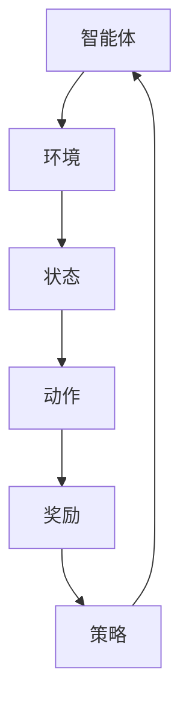

                 

# 强化学习 (Reinforcement Learning) 原理与代码实例讲解

> **关键词：** 强化学习，Reinforcement Learning，Q-learning，Deep Q Network，Policy Gradient，Actor-Critic，OpenAI Gym，深度学习，智能体，环境，状态，动作，奖励，策略，马尔可夫决策过程。

> **摘要：** 本文将深入讲解强化学习的核心原理，包括其基本概念、主要类型和算法。通过实际代码实例，我们将展示如何实现和优化强化学习算法，并提供开发环境搭建和代码解读，帮助读者更好地理解并应用强化学习。

----------------------------------------------------------------

## 第一部分：强化学习基础理论

### 第1章：强化学习概述

#### 1.1 强化学习的定义和背景

强化学习（Reinforcement Learning，简称RL）是机器学习的一个重要分支，它通过智能体（agent）与环境（environment）的交互来学习做出最优决策。强化学习的目标是使智能体在与环境互动的过程中，通过不断学习和调整策略（policy），最大化累积奖励（cumulative reward）。

强化学习的起源可以追溯到1950年代，当时心理学家和行为科学家开始研究如何通过奖励和惩罚来训练动物进行各种任务。1970年代，随着计算机科学和人工智能的发展，强化学习理论逐渐成熟，并应用于控制理论、博弈论等领域。

强化学习在机器学习领域的重要性不言而喻。首先，强化学习是一种完全数据驱动的方法，不需要大量标注的数据集，只需通过与环境交互来学习。其次，强化学习可以解决一些复杂的问题，如自动驾驶、游戏AI等，这些问题通常需要智能体具备高度的自适应能力和决策能力。

#### 1.2 强化学习的主要概念

强化学习的主要概念包括状态（State）、动作（Action）、奖励（Reward）、策略（Policy）和智能体（Agent）。

- **状态（State）**：描述了智能体当前所处的环境和情境，通常用一个向量表示。
- **动作（Action）**：智能体在某个状态下可以采取的行为，也是一个向量。
- **奖励（Reward）**：描述了智能体在执行某个动作后，环境给予的即时反馈，通常用标量表示。
- **策略（Policy）**：描述了智能体在某个状态下应该采取的最佳动作，通常用概率分布表示。
- **智能体（Agent）**：执行任务并学习优化策略的实体。

#### 1.3 强化学习与传统机器学习的区别

传统机器学习主要依赖于大量的标注数据，通过训练模型来学习数据特征和规律。而强化学习则不同，它不需要大量标注数据，而是通过智能体与环境交互，不断调整策略来学习。具体区别如下：

- **数据依赖**：传统机器学习需要大量标注数据，而强化学习通过与环境交互来学习，不需要大量标注数据。
- **目标函数**：传统机器学习的目标是最小化损失函数，而强化学习的目标是最大化累积奖励。
- **模型训练**：传统机器学习是通过梯度下降等方法进行模型训练，而强化学习是通过价值函数或策略迭代算法进行训练。

### 第2章：强化学习的基本要素

#### 2.1 状态（State）

状态是强化学习中非常重要的概念，它描述了智能体当前所处的环境和情境。在强化学习中，状态通常用一个向量表示，每个维度代表一个特征。例如，在游戏《Flappy Bird》中，状态可以包括鸟的位置、速度、跳跃高度等。

状态的选择对于强化学习的效果至关重要。如果状态选择不当，智能体可能无法有效地学习到环境中的规律，从而导致学习效果不佳。因此，状态选择是强化学习中的一个重要问题，需要根据具体问题进行设计和优化。

#### 2.2 动作（Action）

动作是智能体在某个状态下可以采取的行为。在强化学习中，动作通常用一个向量表示，每个维度代表一个动作。例如，在游戏《Flappy Bird》中，动作可以是向上跳跃、保持当前状态、向下移动等。

动作的选择也是强化学习中的一个关键问题。智能体需要通过学习和探索，选择最佳的动作来实现目标。动作的选择通常受到策略的影响，策略决定了智能体在不同状态下的动作概率分布。

#### 2.3 奖励（Reward）

奖励是强化学习中环境给予智能体的即时反馈。奖励通常用标量表示，它可以鼓励智能体采取某些动作，也可以惩罚智能体采取其他动作。奖励的设计对于强化学习的效果至关重要，它需要能够准确反映智能体行为的优劣。

奖励的设计需要考虑以下几个因素：

- **即时性**：奖励应该能够即时反馈，使智能体能够迅速学习到环境的规律。
- **平衡性**：奖励的大小需要平衡，既不能过于丰厚，也不能过于微弱。
- **目标导向性**：奖励需要能够鼓励智能体朝着目标方向发展。

#### 2.4 策略（Policy）

策略是强化学习中智能体在某个状态下应该采取的最佳动作。策略通常用概率分布表示，它描述了智能体在不同状态下的动作选择概率。

策略的设计是强化学习中的一个重要问题，它决定了智能体的学习效率和效果。一个好的策略应该能够在探索和利用之间取得平衡，既能够探索新的动作，又能够利用已有的知识来做出最优决策。

策略的设计通常有以下几种方法：

- **确定性策略**：智能体在某个状态下总是采取相同的动作。
- **概率性策略**：智能体在某个状态下根据概率分布来选择动作。
- **自适应策略**：智能体根据学习到的经验不断调整策略，以适应环境的变化。

### 第3章：强化学习的主要类型

#### 3.1 正向强化学习

正向强化学习（Positive Reinforcement Learning）是指通过奖励来增强智能体的行为，使其更加频繁地出现。正向强化学习的基本思想是：当智能体采取某个动作后，如果环境给予一个正奖励，那么这个动作的概率就会增加。

正向强化学习可以用来训练智能体执行某些特定任务，如游戏AI、机器人控制等。正向强化学习的优点是简单易实现，缺点是容易导致过度强化，使智能体只关注短期奖励，而忽略了长期目标。

#### 3.2 负向强化学习

负向强化学习（Negative Reinforcement Learning）是指通过惩罚来抑制智能体的不良行为，使其减少出现。负向强化学习的基本思想是：当智能体采取某个动作后，如果环境给予一个负奖励，那么这个动作的概率就会减少。

负向强化学习可以用来避免智能体执行某些不良行为，如错误操作、违规行为等。负向强化学习的优点是能够有效避免不良行为，缺点是需要设计合适的惩罚机制，否则可能导致智能体过度惩罚。

#### 3.3 无监督强化学习

无监督强化学习（Unsupervised Reinforcement Learning）是指在没有外部监督的情况下，通过智能体与环境交互来学习。无监督强化学习主要用于探索未知环境，使智能体能够发现环境中的规律和模式。

无监督强化学习可以应用于许多场景，如自动驾驶、机器人探索等。无监督强化学习的优点是不需要大量标注数据，缺点是学习速度较慢，且容易出现不确定性和不确定性。

#### 3.4 离线强化学习与在线强化学习

离线强化学习（Offline Reinforcement Learning）是指智能体在训练阶段和环境分离，训练完成后将策略应用到实际环境中。离线强化学习的优点是可以充分利用训练数据，缺点是训练时间较长，且无法实时调整策略。

在线强化学习（Online Reinforcement Learning）是指智能体在训练过程中与环境实时交互，不断调整策略。在线强化学习的优点是能够实时适应环境变化，缺点是训练数据有限，且容易出现过度拟合。

### 第4章：强化学习的数学基础

#### 4.1 马尔可夫决策过程（MDP）

马尔可夫决策过程（Markov Decision Process，简称MDP）是强化学习的基础数学模型。MDP描述了智能体在不确定环境中做出决策的过程，包括状态、动作、奖励和策略等概念。

MDP可以用一个五元组来表示：$$(S, A, R, P, \gamma)$$，其中：

- **$S$**：状态集合，表示智能体可以处于的所有状态。
- **$A$**：动作集合，表示智能体可以采取的所有动作。
- **$R$**：奖励函数，表示智能体在状态$s$下采取动作$a$后的即时奖励。
- **$P$**：状态转移概率函数，表示智能体在状态$s$下采取动作$a$后转移到状态$s'$的概率。
- **$\gamma$**：折扣因子，表示未来奖励的当前价值，取值范围在0到1之间。

#### 4.2 马尔可夫性假设

马尔可夫性假设是MDP的一个重要性质，它表示当前状态只与前一状态有关，而与之前的状态无关。马尔可夫性假设使得MDP的计算变得更加简单，因为它可以避免考虑历史状态，只关注当前状态。

马尔可夫性假设可以用公式表示为：$$P(s'|s, a) = P(s'|s)$$，其中$P(s'|s, a)$表示智能体在状态$s$下采取动作$a$后转移到状态$s'$的概率，$P(s'|s)$表示智能体在状态$s$下转移到状态$s'$的概率。

#### 4.3 价值函数和策略迭代算法

在强化学习中，价值函数（Value Function）和策略迭代算法（Policy Iteration Algorithm）是两个核心概念。

**价值函数**：价值函数是评估智能体策略优劣的重要工具。在MDP中，价值函数可以分为状态价值函数（State-Value Function）和动作价值函数（Action-Value Function）。

- **状态价值函数**：表示智能体在某个状态下采取最优策略后的期望回报。用公式表示为：$$V^*(s) = \sum_{a} \pi(a|s) \sum_{s'} P(s'|s, a) [r + \gamma V^*(s')]$$，其中$\pi(a|s)$表示在状态$s$下采取动作$a$的概率，$P(s'|s, a)$表示在状态$s$下采取动作$a$后转移到状态$s'$的概率，$r$表示即时奖励，$\gamma$表示折扣因子。
- **动作价值函数**：表示智能体在某个状态下采取某个动作后的期望回报。用公式表示为：$$Q^*(s, a) = \sum_{s'} P(s'|s, a) [r + \gamma \max_{a'} Q^*(s', a')]$$，其中$\max_{a'} Q^*(s', a')$表示在状态$s'$下采取最优动作的概率。

**策略迭代算法**：策略迭代算法是一种基于价值函数和策略迭代优化的方法。它的基本思想是：首先初始化一个策略$\pi$，然后根据策略计算状态价值函数$V^{\pi}(s)$，再根据状态价值函数更新策略$\pi$，重复这个过程直到策略收敛。

策略迭代算法可以分为两个步骤：

1. **策略评估（Policy Evaluation）**：根据当前策略$\pi$，计算状态价值函数$V^{\pi}(s)$，使用反向递推算法或迭代法计算。
2. **策略改进（Policy Improvement）**：根据状态价值函数$V^{\pi}(s)$，更新策略$\pi$，选择使得状态价值函数最大的动作作为新策略。

策略迭代算法的收敛性可以通过以下定理证明：

**定理**：如果MDP是有限的，那么策略迭代算法一定收敛到一个最优策略。

#### 4.4 Q-learning算法

Q-learning算法是一种基于值迭代（Value Iteration）的强化学习算法，它通过不断更新动作价值函数来学习最优策略。Q-learning算法的基本思想是：在某个状态下，选择当前最优动作，然后根据状态转移概率和奖励更新动作价值函数。

Q-learning算法的伪代码如下：

```python
初始化 Q(s, a)
while not terminate do
  s = 环境状态
  a = 选择动作
  s' = 环境执行动作后的状态
  r = 环境回报
  a' = 选择动作
  Q(s, a) = Q(s, a) + α [r + γ max(Q(s', a')) - Q(s, a)]
  s = s'
end
```

其中，$Q(s, a)$表示在状态$s$下采取动作$a$的动作价值函数，$\alpha$表示学习率，$\gamma$表示折扣因子。

Q-learning算法的优点是不需要预测模型，只需根据环境反馈进行更新。缺点是收敛速度较慢，且容易受到初始值的影响。

## 第二部分：强化学习应用实例

### 第6章：智能体在游戏中的应用

#### 6.1 游戏环境搭建

在强化学习中，游戏环境是一个典型的应用场景。游戏环境搭建的第一步是选择合适的游戏，并确定游戏的目标和规则。例如，在游戏《Flappy Bird》中，目标是通过不断跳跃使小鸟飞过管道，规则是跳跃时需要避开上方的管道顶部和下方的管道底部。

游戏环境搭建的第二步是创建游戏状态、动作和奖励。状态可以用一个向量表示，包括小鸟的位置、速度、管道的位置等。动作可以是向上跳跃、向下移动等。奖励可以根据小鸟是否成功飞过管道、是否触碰到管道等来设定。

游戏环境搭建的第三步是使用Python中的OpenAI Gym库来构建游戏环境。OpenAI Gym是一个开源的游戏环境库，提供了丰富的预定义游戏环境，如《Flappy Bird》、《CartPole》等。通过简单的代码，我们可以快速搭建游戏环境，并使用强化学习算法进行训练。

以下是一个简单的示例代码，展示了如何使用OpenAI Gym构建《Flappy Bird》环境：

```python
import gym

# 创建游戏环境
env = gym.make('FlappyBird-v0')

# 打印环境信息
print(env.__class__.__name__)

# 游戏环境的观察空间和动作空间
print("Observation space:", env.observation_space)
print("Action space:", env.action_space)

# 游戏环境执行一个动作
observation = env.reset()
print("Initial observation:", observation)

# 游戏环境的步数和奖励
for _ in range(100):
    action = env.action_space.sample()
    observation, reward, done, info = env.step(action)
    print("Action:", action, "Reward:", reward)
    if done:
        print("Game over")
        break

# 关闭游戏环境
env.close()
```

#### 6.2 游戏中的智能体训练

在游戏环境中，智能体的训练过程主要包括选择动作、执行动作、获取奖励和更新策略。智能体在游戏中的训练过程可以看作是一个强化学习过程，智能体通过与环境的交互不断学习优化策略，以最大化累积奖励。

智能体在游戏中的训练过程可以分为以下几步：

1. **初始化策略**：初始化一个策略，用于选择动作。策略可以是一个确定性策略，也可以是一个概率性策略。
2. **选择动作**：在某个状态下，根据策略选择一个动作。如果策略是概率性的，需要从概率分布中选择动作。
3. **执行动作**：执行选择的动作，并观察环境反馈。环境会给出一个即时奖励和下一个状态。
4. **更新策略**：根据即时奖励和下一个状态，更新策略。常用的更新方法有Q-learning、SARSA等。
5. **重复训练**：重复执行上述步骤，直到满足训练停止条件，如达到指定步数、累积奖励达到阈值等。

以下是一个简单的Q-learning算法在游戏《Flappy Bird》中的训练示例代码：

```python
import gym
import numpy as np

# 创建游戏环境
env = gym.make('FlappyBird-v0')

# 初始化Q表
Q = np.zeros([env.observation_space.n, env.action_space.n])

# 设置学习参数
alpha = 0.1  # 学习率
gamma = 0.9  # 折扣因子
epsilon = 0.1  # 探索率

# 强化学习循环
for episode in range(1000):
    state = env.reset()
    done = False
    total_reward = 0
    
    while not done:
        # 探索与利用策略
        if np.random.rand() < epsilon:
            action = env.action_space.sample()
        else:
            action = np.argmax(Q[state])
        
        # 执行动作
        next_state, reward, done, _ = env.step(action)
        
        # 更新Q表
        Q[state, action] = Q[state, action] + alpha * (reward + gamma * np.max(Q[next_state]) - Q[state, action])
        
        state = next_state
        total_reward += reward
        
    print("Episode {} - Total Reward: {}".format(episode, total_reward))

# 关闭游戏环境
env.close()
```

#### 6.3 游戏中的智能体评估

在游戏训练完成后，需要对智能体进行评估，以检验其性能和策略。游戏评估的过程主要包括：

1. **执行测试**：在测试环境中执行智能体的策略，观察其表现。测试环境通常是预定义的，与训练环境相同。
2. **记录结果**：记录测试过程中的步数、累积奖励、失败次数等指标，用于评估智能体的性能。
3. **分析结果**：对测试结果进行分析，评估智能体的稳定性和鲁棒性。

以下是一个简单的测试示例代码：

```python
import gym

# 创建游戏环境
env = gym.make('FlappyBird-v0')

# 加载训练好的策略
Q = np.load('Q.npy')

# 设置学习参数
alpha = 0.1  # 学习率
gamma = 0.9  # 折扣因子
epsilon = 0.1  # 探索率

# 测试智能体
episode = 0
total_reward = 0

while episode < 100:
    state = env.reset()
    done = False
    
    while not done:
        action = np.argmax(Q[state])
        observation, reward, done, _ = env.step(action)
        state = observation
        total_reward += reward
    
    print("Episode {} - Total Reward: {}".format(episode, total_reward))
    episode += 1

# 关闭游戏环境
env.close()
```

通过测试，我们可以评估智能体在游戏中的表现，并根据评估结果调整训练策略，进一步提高智能体的性能。

## 第7章：智能体在机器人控制中的应用

#### 7.1 机器人环境搭建

在机器人控制中，强化学习可以用来优化机器人的运动规划和决策。机器人环境搭建的第一步是选择合适的机器人平台，如机器人臂、自动驾驶车等。机器人平台的选择取决于具体应用场景和需求。

机器人环境搭建的第二步是定义机器人的状态、动作和奖励。状态可以包括机器人的位置、速度、加速度等，动作可以是机器人的关节运动、轮子转动等。奖励可以根据机器人完成任务的效率和质量来设定。

机器人环境搭建的第三步是使用Python中的Unity ML-Agents库来构建机器人环境。Unity ML-Agents是一个开源的机器人环境库，提供了丰富的预定义机器人环境，如机器人臂、自动驾驶车等。通过简单的代码，我们可以快速搭建机器人环境，并使用强化学习算法进行训练。

以下是一个简单的示例代码，展示了如何使用Unity ML-Agents构建机器人臂环境：

```python
import gym
import unityagents

# 创建机器人臂环境
env = gym.make('UnityML-Agents/RobotArmEnv-v0')

# 打印环境信息
print(env.__class__.__name__)

# 机器人臂的观察空间和动作空间
print("Observation space:", env.observation_space)
print("Action space:", env.action_space)

# 机器人臂执行一个动作
observation = env.reset()
print("Initial observation:", observation)

# 机器人臂的步数和奖励
for _ in range(100):
    action = env.action_space.sample()
    observation, reward, done, _ = env.step(action)
    print("Action:", action, "Reward:", reward)
    if done:
        print("Game over")
        break

# 关闭机器人臂环境
env.close()
```

#### 7.2 机器人控制中的强化学习算法

在机器人控制中，强化学习算法可以用来优化机器人的控制策略。常用的强化学习算法包括Q-learning、SARSA、DQN等。以下将详细介绍这些算法在机器人控制中的应用。

##### Q-learning算法

Q-learning算法是一种基于值迭代的强化学习算法，通过不断更新动作价值函数来学习最优策略。Q-learning算法的基本思想是：在某个状态下，选择当前最优动作，然后根据状态转移概率和奖励更新动作价值函数。

Q-learning算法的伪代码如下：

```python
初始化 Q(s, a)
while not terminate do
  s = 环境状态
  a = 选择动作
  s' = 环境执行动作后的状态
  r = 环境回报
  a' = 选择动作
  Q(s, a) = Q(s, a) + α [r + γ max(Q(s', a')) - Q(s, a)]
  s = s'
end
```

其中，$Q(s, a)$表示在状态$s$下采取动作$a$的动作价值函数，$\alpha$表示学习率，$\gamma$表示折扣因子。

Q-learning算法在机器人控制中的应用如下：

1. **初始化Q表**：创建一个全为零的Q表，用于存储状态-动作值。
2. **选择动作**：在某个状态下，根据Q表选择最优动作。
3. **执行动作**：执行选择的动作，并观察环境反馈。
4. **更新Q表**：根据即时奖励和下一个状态，更新Q表。

以下是一个简单的Q-learning算法在机器人臂控制中的训练示例代码：

```python
import gym
import numpy as np

# 创建机器人臂环境
env = gym.make('UnityML-Agents/RobotArmEnv-v0')

# 初始化Q表
Q = np.zeros([env.observation_space.n, env.action_space.n])

# 设置学习参数
alpha = 0.1  # 学习率
gamma = 0.9  # 折扣因子
epsilon = 0.1  # 探索率

# 强化学习循环
for episode in range(1000):
    state = env.reset()
    done = False
    total_reward = 0
    
    while not done:
        # 探索与利用策略
        if np.random.rand() < epsilon:
            action = env.action_space.sample()
        else:
            action = np.argmax(Q[state])
        
        # 执行动作
        next_state, reward, done, _ = env.step(action)
        
        # 更新Q表
        Q[state, action] = Q[state, action] + alpha * (reward + gamma * np.max(Q[next_state]) - Q[state, action])
        
        state = next_state
        total_reward += reward
        
    print("Episode {} - Total Reward: {}".format(episode, total_reward))

# 关闭机器人臂环境
env.close()
```

##### SARSA算法

SARSA（State-Action-Reward-State-Action）算法是一种基于策略迭代的强化学习算法，通过更新策略来学习最优策略。SARSA算法的基本思想是：在某个状态下，选择当前最优动作，然后根据状态转移概率和奖励更新策略。

SARSA算法的伪代码如下：

```python
初始化 π(s)
while not terminate do
  s = 环境状态
  a = π(s)
  s' = 环境执行动作后的状态
  r = 环境回报
  a' = π(s')
  π(s) = π(s) + α [r + γ π(s', a') - π(s, a)]
  s = s'
end
```

其中，$π(s)$表示在状态$s$下采取动作$a$的概率，$\alpha$表示学习率，$\gamma$表示折扣因子。

SARSA算法在机器人控制中的应用如下：

1. **初始化策略**：创建一个初始策略，用于选择动作。
2. **选择动作**：在某个状态下，根据策略选择最优动作。
3. **执行动作**：执行选择的动作，并观察环境反馈。
4. **更新策略**：根据即时奖励和下一个状态，更新策略。

以下是一个简单的SARSA算法在机器人臂控制中的训练示例代码：

```python
import gym
import numpy as np

# 创建机器人臂环境
env = gym.make('UnityML-Agents/RobotArmEnv-v0')

# 初始化策略
π = np.zeros([env.observation_space.n, env.action_space.n])

# 设置学习参数
alpha = 0.1  # 学习率
gamma = 0.9  # 折扣因子

# 强化学习循环
for episode in range(1000):
    state = env.reset()
    done = False
    total_reward = 0
    
    while not done:
        # 选择动作
        action = np.random.choice(env.action_space.n, p=π[state])
        
        # 执行动作
        next_state, reward, done, _ = env.step(action)
        
        # 更新策略
        π[state, action] = π[state, action] + alpha * (reward + gamma * π[next_state].max() - π[state, action])
        
        state = next_state
        total_reward += reward
        
    print("Episode {} - Total Reward: {}".format(episode, total_reward))

# 关闭机器人臂环境
env.close()
```

##### DQN算法

DQN（Deep Q Network）算法是一种基于深度学习的强化学习算法，通过神经网络来近似动作价值函数。DQN算法的基本思想是：在某个状态下，选择当前最优动作，然后根据状态转移概率和奖励更新神经网络。

DQN算法的伪代码如下：

```python
初始化 Q-network
经验回放记忆库
while not terminate do
  从经验回放记忆库中采样一个批量经验
  计算目标Q值
  更新Q-network
end
```

其中，$Q-network$是一个深度神经网络，用于近似动作价值函数，经验回放记忆库用于存储和随机采样经验。

DQN算法在机器人控制中的应用如下：

1. **初始化Q-network**：创建一个深度神经网络，用于近似动作价值函数。
2. **经验回放记忆库**：创建一个经验回放记忆库，用于存储和随机采样经验。
3. **选择动作**：在某个状态下，选择当前最优动作。
4. **执行动作**：执行选择的动作，并观察环境反馈。
5. **更新Q-network**：根据即时奖励和下一个状态，更新神经网络。

以下是一个简单的DQN算法在机器人臂控制中的训练示例代码：

```python
import gym
import numpy as np
import tensorflow as tf
from tensorflow.keras.models import Sequential
from tensorflow.keras.layers import Dense

# 创建机器人臂环境
env = gym.make('UnityML-Agents/RobotArmEnv-v0')

# 定义DQN模型
model = Sequential()
model.add(Dense(32, input_shape=(env.observation_space.n,), activation='relu'))
model.add(Dense(64, activation='relu'))
model.add(Dense(env.action_space.n, activation='linear'))
model.compile(optimizer='adam', loss='mse')

# 设置学习参数
alpha = 0.001  # 学习率
gamma = 0.9  # 折扣因子
epsilon = 0.1  # 探索率
buffer_size = 10000  # 经验回放记忆库大小

# 初始化经验回放记忆库
buffer = []

# 强化学习循环
for episode in range(1000):
    state = env.reset()
    done = False
    total_reward = 0
    while not done:
        # 探索与利用策略
        if np.random.rand() < epsilon:
            action = env.action_space.sample()
        else:
            action = np.argmax(model.predict(state)[0])
        
        # 执行动作
        next_state, reward, done, _ = env.step(action)
        
        # 更新经验回放记忆库
        buffer.append((state, action, reward, next_state, done))
        if len(buffer) > buffer_size:
            buffer.pop(0)
        
        # 更新Q-network
        if done:
            target_q = reward
        else:
            target_q = reward + gamma * np.max(model.predict(next_state)[0])
        target = model.predict(state)
        target[:, action] = target_q
        model.fit(state, target, verbose=0)
        
        state = next_state
        total_reward += reward
        
    print("Episode {} - Total Reward: {}".format(episode, total_reward))

# 关闭机器人臂环境
env.close()
```

#### 7.3 机器人控制中的智能体评估

在机器人训练完成后，需要对智能体进行评估，以检验其性能和策略。机器人评估的过程主要包括：

1. **执行测试**：在测试环境中执行智能体的策略，观察其表现。测试环境通常是预定义的，与训练环境相同。
2. **记录结果**：记录测试过程中的步数、累积奖励、失败次数等指标，用于评估智能体的性能。
3. **分析结果**：对测试结果进行分析，评估智能体的稳定性和鲁棒性。

以下是一个简单的测试示例代码：

```python
import gym

# 创建机器人臂环境
env = gym.make('UnityML-Agents/RobotArmEnv-v0')

# 加载训练好的策略
Q = np.load('Q.npy')

# 设置学习参数
alpha = 0.1  # 学习率
gamma = 0.9  # 折扣因子
epsilon = 0.1  # 探索率

# 测试智能体
episode = 0
total_reward = 0

while episode < 100:
    state = env.reset()
    done = False
    
    while not done:
        action = np.argmax(Q[state])
        observation, reward, done, _ = env.step(action)
        state = observation
        total_reward += reward
    
    print("Episode {} - Total Reward: {}".format(episode, total_reward))
    episode += 1

# 关闭机器人臂环境
env.close()
```

通过测试，我们可以评估智能体在机器人控制中的表现，并根据评估结果调整训练策略，进一步提高智能体的性能。

## 第8章：智能体在自动驾驶中的应用

#### 8.1 自动驾驶环境搭建

在自动驾驶中，强化学习可以用来优化车辆的行驶策略，以提高行驶效率和安全性。自动驾驶环境搭建的第一步是选择合适的自动驾驶平台，如自动驾驶汽车、自动驾驶无人机等。自动驾驶平台的选择取决于具体应用场景和需求。

自动驾驶环境搭建的第二步是定义自动驾驶车辆的状态、动作和奖励。状态可以包括车辆的位置、速度、加速度、周围环境等信息。动作可以是车辆的加速、减速、转向等。奖励可以根据车辆的行驶轨迹、行驶速度、安全性等来设定。

自动驾驶环境搭建的第三步是使用Python中的Unity ML-Agents库来构建自动驾驶环境。Unity ML-Agents是一个开源的自动驾驶环境库，提供了丰富的预定义自动驾驶环境，如自动驾驶汽车、自动驾驶无人机等。通过简单的代码，我们可以快速搭建自动驾驶环境，并使用强化学习算法进行训练。

以下是一个简单的示例代码，展示了如何使用Unity ML-Agents构建自动驾驶汽车环境：

```python
import gym
import unityagents

# 创建自动驾驶汽车环境
env = gym.make('UnityML-Agents/AutonomousDriving-v0')

# 打印环境信息
print(env.__class__.__name__)

# 自动驾驶汽车的观察空间和动作空间
print("Observation space:", env.observation_space)
print("Action space:", env.action_space)

# 自动驾驶汽车执行一个动作
observation = env.reset()
print("Initial observation:", observation)

# 自动驾驶汽车的步数和奖励
for _ in range(100):
    action = env.action_space.sample()
    observation, reward, done, _ = env.step(action)
    print("Action:", action, "Reward:", reward)
    if done:
        print("Game over")
        break

# 关闭自动驾驶汽车环境
env.close()
```

#### 8.2 自动驾驶中的强化学习算法

在自动驾驶中，强化学习算法可以用来优化车辆的行驶策略。常用的强化学习算法包括Q-learning、SARSA、DQN等。以下将详细介绍这些算法在自动驾驶中的应用。

##### Q-learning算法

Q-learning算法是一种基于值迭代的强化学习算法，通过不断更新动作价值函数来学习最优策略。Q-learning算法的基本思想是：在某个状态下，选择当前最优动作，然后根据状态转移概率和奖励更新动作价值函数。

Q-learning算法的伪代码如下：

```python
初始化 Q(s, a)
while not terminate do
  s = 环境状态
  a = 选择动作
  s' = 环境执行动作后的状态
  r = 环境回报
  a' = 选择动作
  Q(s, a) = Q(s, a) + α [r + γ max(Q(s', a')) - Q(s, a)]
  s = s'
end
```

其中，$Q(s, a)$表示在状态$s$下采取动作$a$的动作价值函数，$\alpha$表示学习率，$\gamma$表示折扣因子。

Q-learning算法在自动驾驶中的应用如下：

1. **初始化Q表**：创建一个全为零的Q表，用于存储状态-动作值。
2. **选择动作**：在某个状态下，根据Q表选择最优动作。
3. **执行动作**：执行选择的动作，并观察环境反馈。
4. **更新Q表**：根据即时奖励和下一个状态，更新Q表。

以下是一个简单的Q-learning算法在自动驾驶汽车中的训练示例代码：

```python
import gym
import numpy as np

# 创建自动驾驶汽车环境
env = gym.make('UnityML-Agents/AutonomousDriving-v0')

# 初始化Q表
Q = np.zeros([env.observation_space.n, env.action_space.n])

# 设置学习参数
alpha = 0.1  # 学习率
gamma = 0.9  # 折扣因子
epsilon = 0.1  # 探索率

# 强化学习循环
for episode in range(1000):
    state = env.reset()
    done = False
    total_reward = 0
    
    while not done:
        # 探索与利用策略
        if np.random.rand() < epsilon:
            action = env.action_space.sample()
        else:
            action = np.argmax(Q[state])
        
        # 执行动作
        next_state, reward, done, _ = env.step(action)
        
        # 更新Q表
        Q[state, action] = Q[state, action] + alpha * (reward + gamma * np.max(Q[next_state]) - Q[state, action])
        
        state = next_state
        total_reward += reward
        
    print("Episode {} - Total Reward: {}".format(episode, total_reward))

# 关闭自动驾驶汽车环境
env.close()
```

##### SARSA算法

SARSA（State-Action-Reward-State-Action）算法是一种基于策略迭代的强化学习算法，通过更新策略来学习最优策略。SARSA算法的基本思想是：在某个状态下，选择当前最优动作，然后根据状态转移概率和奖励更新策略。

SARSA算法的伪代码如下：

```python
初始化 π(s)
while not terminate do
  s = 环境状态
  a = π(s)
  s' = 环境执行动作后的状态
  r = 环境回报
  a' = π(s')
  π(s) = π(s) + α [r + γ π(s', a') - π(s, a)]
  s = s'
end
```

其中，$π(s)$表示在状态$s$下采取动作$a$的概率，$\alpha$表示学习率，$\gamma$表示折扣因子。

SARSA算法在自动驾驶中的应用如下：

1. **初始化策略**：创建一个初始策略，用于选择动作。
2. **选择动作**：在某个状态下，根据策略选择最优动作。
3. **执行动作**：执行选择的动作，并观察环境反馈。
4. **更新策略**：根据即时奖励和下一个状态，更新策略。

以下是一个简单的SARSA算法在自动驾驶汽车中的训练示例代码：

```python
import gym
import numpy as np

# 创建自动驾驶汽车环境
env = gym.make('UnityML-Agents/AutonomousDriving-v0')

# 初始化策略
π = np.zeros([env.observation_space.n, env.action_space.n])

# 设置学习参数
alpha = 0.1  # 学习率
gamma = 0.9  # 折扣因子

# 强化学习循环
for episode in range(1000):
    state = env.reset()
    done = False
    total_reward = 0
    
    while not done:
        # 选择动作
        action = np.random.choice(env.action_space.n, p=π[state])
        
        # 执行动作
        next_state, reward, done, _ = env.step(action)
        
        # 更新策略
        π[state, action] = π[state, action] + alpha * (reward + gamma * π[next_state].max() - π[state, action])
        
        state = next_state
        total_reward += reward
        
    print("Episode {} - Total Reward: {}".format(episode, total_reward))

# 关闭自动驾驶汽车环境
env.close()
```

##### DQN算法

DQN（Deep Q Network）算法是一种基于深度学习的强化学习算法，通过神经网络来近似动作价值函数。DQN算法的基本思想是：在某个状态下，选择当前最优动作，然后根据状态转移概率和奖励更新神经网络。

DQN算法的伪代码如下：

```python
初始化 Q-network
经验回放记忆库
while not terminate do
  从经验回放记忆库中采样一个批量经验
  计算目标Q值
  更新Q-network
end
```

其中，$Q-network$是一个深度神经网络，用于近似动作价值函数，经验回放记忆库用于存储和随机采样经验。

DQN算法在自动驾驶中的应用如下：

1. **初始化Q-network**：创建一个深度神经网络，用于近似动作价值函数。
2. **经验回放记忆库**：创建一个经验回放记忆库，用于存储和随机采样经验。
3. **选择动作**：在某个状态下，选择当前最优动作。
4. **执行动作**：执行选择的动作，并观察环境反馈。
5. **更新Q-network**：根据即时奖励和下一个状态，更新神经网络。

以下是一个简单的DQN算法在自动驾驶汽车中的训练示例代码：

```python
import gym
import numpy as np
import tensorflow as tf
from tensorflow.keras.models import Sequential
from tensorflow.keras.layers import Dense

# 创建自动驾驶汽车环境
env = gym.make('UnityML-Agents/AutonomousDriving-v0')

# 定义DQN模型
model = Sequential()
model.add(Dense(32, input_shape=(env.observation_space.n,), activation='relu'))
model.add(Dense(64, activation='relu'))
model.add(Dense(env.action_space.n, activation='linear'))
model.compile(optimizer='adam', loss='mse')

# 设置学习参数
alpha = 0.001  # 学习率
gamma = 0.9  # 折扣因子
epsilon = 0.1  # 探索率
buffer_size = 10000  # 经验回放记忆库大小

# 初始化经验回放记忆库
buffer = []

# 强化学习循环
for episode in range(1000):
    state = env.reset()
    done = False
    total_reward = 0
    while not done:
        # 探索与利用策略
        if np.random.rand() < epsilon:
            action = env.action_space.sample()
        else:
            action = np.argmax(model.predict(state)[0])
        
        # 执行动作
        next_state, reward, done, _ = env.step(action)
        
        # 更新经验回放记忆库
        buffer.append((state, action, reward, next_state, done))
        if len(buffer) > buffer_size:
            buffer.pop(0)
        
        # 更新Q-network
        if done:
            target_q = reward
        else:
            target_q = reward + gamma * np.max(model.predict(next_state)[0])
        target = model.predict(state)
        target[:, action] = target_q
        model.fit(state, target, verbose=0)
        
        state = next_state
        total_reward += reward
        
    print("Episode {} - Total Reward: {}".format(episode, total_reward))

# 关闭自动驾驶汽车环境
env.close()
```

#### 8.3 自动驾驶中的智能体评估

在自动驾驶训练完成后，需要对智能体进行评估，以检验其性能和策略。自动驾驶评估的过程主要包括：

1. **执行测试**：在测试环境中执行智能体的策略，观察其表现。测试环境通常是预定义的，与训练环境相同。
2. **记录结果**：记录测试过程中的步数、累积奖励、失败次数等指标，用于评估智能体的性能。
3. **分析结果**：对测试结果进行分析，评估智能体的稳定性和鲁棒性。

以下是一个简单的测试示例代码：

```python
import gym

# 创建自动驾驶汽车环境
env = gym.make('UnityML-Agents/AutonomousDriving-v0')

# 加载训练好的策略
Q = np.load('Q.npy')

# 设置学习参数
alpha = 0.1  # 学习率
gamma = 0.9  # 折扣因子
epsilon = 0.1  # 探索率

# 测试智能体
episode = 0
total_reward = 0

while episode < 100:
    state = env.reset()
    done = False
    
    while not done:
        action = np.argmax(Q[state])
        observation, reward, done, _ = env.step(action)
        state = observation
        total_reward += reward
    
    print("Episode {} - Total Reward: {}".format(episode, total_reward))
    episode += 1

# 关闭自动驾驶汽车环境
env.close()
```

通过测试，我们可以评估智能体在自动驾驶中的表现，并根据评估结果调整训练策略，进一步提高智能体的性能。

## 第三部分：强化学习实践与代码实例

### 第9章：强化学习环境搭建

#### 9.1 OpenAI Gym环境介绍

OpenAI Gym是一个开源的强化学习环境库，提供了多种预定义的强化学习环境和工具。使用OpenAI Gym，我们可以快速搭建强化学习环境，进行算法验证和性能评估。

#### 9.2 Unity ML-Agents环境介绍

Unity ML-Agents是Unity Technologies公司开发的一个开源机器学习平台，用于构建和训练智能体。Unity ML-Agents提供了丰富的3D环境和工具，支持多种强化学习算法和应用场景。

#### 9.3 Pygame环境介绍

Pygame是一个开源的Python游戏开发库，可以用来构建和运行强化学习环境。Pygame提供了丰富的图形和音频功能，支持2D游戏开发，是强化学习实验的一个不错的选择。

### 第10章：Q-learning算法实例

#### 10.1 Q-learning算法实现

Q-learning算法是一种经典的强化学习算法，通过迭代更新动作价值函数来学习最优策略。以下是一个简单的Q-learning算法实现示例：

```python
import numpy as np
import gym

# 初始化环境
env = gym.make('CartPole-v0')

# 初始化Q表
Q = np.zeros([env.observation_space.n, env.action_space.n])

# 设置学习参数
alpha = 0.1  # 学习率
gamma = 0.9  # 折扣因子
epsilon = 0.1  # 探索率

# 强化学习循环
for episode in range(1000):
    state = env.reset()
    done = False
    total_reward = 0
    
    while not done:
        # 探索与利用策略
        if np.random.rand() < epsilon:
            action = env.action_space.sample()
        else:
            action = np.argmax(Q[state])
        
        # 执行动作
        next_state, reward, done, _ = env.step(action)
        
        # 更新Q表
        Q[state, action] = Q[state, action] + alpha * (reward + gamma * np.max(Q[next_state]) - Q[state, action])
        
        state = next_state
        total_reward += reward
        
    print("Episode {} - Total Reward: {}".format(episode, total_reward))

# 关闭环境
env.close()
```

#### 10.2 代码解读与分析

- **初始化环境**：使用`gym.make('CartPole-v0')`创建一个CartPole环境。
- **初始化Q表**：创建一个全为零的Q表，用于存储状态-动作值。
- **设置学习参数**：设置学习率（alpha）、折扣因子（gamma）和探索率（epsilon）。
- **强化学习循环**：
  - 在每个episode中，智能体从初始状态开始。
  - 智能体根据当前状态和Q表选择动作。
  - 执行动作后，智能体获得即时奖励和下一个状态。
  - 根据即时奖励、下一个状态和Q表更新动作价值函数。
- **打印结果**：打印每个episode的总奖励。

#### 10.3 实际应用案例分析

Q-learning算法在CartPole任务中的应用取得了很好的效果。通过不断迭代更新Q表，智能体逐渐学习到最优策略，使CartPole保持平衡的时间越来越长。实际应用中，Q-learning算法可以用于游戏AI、机器人控制等领域，提高智能体的决策能力。

### 第11章：Deep Q Network算法实例

#### 11.1 DQN算法实现

Deep Q Network（DQN）算法是一种基于深度学习的强化学习算法，通过神经网络来近似动作价值函数。DQN算法引入了经验回放机制，提高了学习效率和稳定性。

以下是一个简单的DQN算法实现示例：

```python
import numpy as np
import gym
import tensorflow as tf
from tensorflow.keras.models import Sequential
from tensorflow.keras.layers import Dense

# 初始化环境
env = gym.make('CartPole-v0')

# 定义DQN模型
model = Sequential()
model.add(Dense(32, input_shape=(env.observation_space.n,), activation='relu'))
model.add(Dense(64, activation='relu'))
model.add(Dense(env.action_space.n, activation='linear'))
model.compile(optimizer='adam', loss='mse')

# 设置学习参数
alpha = 0.001  # 学习率
gamma = 0.9  # 折扣因子
epsilon = 0.1  # 探索率
buffer_size = 10000  # 经验回放记忆库大小

# 初始化经验回放记忆库
buffer = []

# 强化学习循环
for episode in range(1000):
    state = env.reset()
    done = False
    total_reward = 0
    while not done:
        # 探索与利用策略
        if np.random.rand() < epsilon:
            action = env.action_space.sample()
        else:
            action = np.argmax(model.predict(state)[0])
        
        # 执行动作
        next_state, reward, done, _ = env.step(action)
        
        # 更新经验回放记忆库
        buffer.append((state, action, reward, next_state, done))
        if len(buffer) > buffer_size:
            buffer.pop(0)
        
        # 更新Q-network
        if done:
            target_q = reward
        else:
            target_q = reward + gamma * np.max(model.predict(next_state)[0])
        target = model.predict(state)
        target[:, action] = target_q
        model.fit(state, target, verbose=0)
        
        state = next_state
        total_reward += reward
        
    print("Episode {} - Total Reward: {}".format(episode, total_reward))

# 关闭环境
env.close()
```

#### 11.2 代码解读与分析

- **初始化环境**：使用`gym.make('CartPole-v0')`创建一个CartPole环境。
- **定义DQN模型**：使用TensorFlow创建一个全连接神经网络，用于近似动作价值函数。
- **设置学习参数**：设置学习率（alpha）、折扣因子（gamma）和探索率（epsilon），以及经验回放记忆库大小。
- **初始化经验回放记忆库**：创建一个经验回放记忆库，用于存储和随机采样经验。
- **强化学习循环**：
  - 在每个episode中，智能体从初始状态开始。
  - 智能体根据当前状态和DQN模型选择动作。
  - 执行动作后，智能体获得即时奖励和下一个状态。
  - 将经验存储到经验回放记忆库中。
  - 根据即时奖励、下一个状态和DQN模型更新动作价值函数。

#### 11.3 实际应用案例分析

DQN算法在CartPole任务中的应用取得了很好的效果。通过引入深度神经网络，DQN算法能够更好地学习状态-动作值函数，提高了智能体的学习效率和性能。实际应用中，DQN算法可以用于自动驾驶、机器人控制等领域，提高智能体的决策能力。

### 第12章：Policy Gradient算法实例

#### 12.1 Policy Gradient算法实现

Policy Gradient算法是一种基于策略优化的强化学习算法，通过直接优化策略来学习最优策略。Policy Gradient算法的基本思想是：最大化累积奖励，更新策略参数。

以下是一个简单的Policy Gradient算法实现示例：

```python
import numpy as np
import gym

# 初始化环境
env = gym.make('CartPole-v0')

# 定义策略网络
def policy_network(state):
    # 使用简单的线性模型作为策略网络
    weights = np.random.rand(1, env.observation_space.n)
    action_probabilities = np.dot(state, weights)
    return action_probabilities

# 设置学习参数
alpha = 0.001  # 学习率
gamma = 0.9  # 折扣因子

# 强化学习循环
for episode in range(1000):
    state = env.reset()
    done = False
    total_reward = 0
    
    while not done:
        # 根据策略网络选择动作
        action_probabilities = policy_network(state)
        action = np.random.choice(env.action_space.n, p=action_probabilities)
        
        # 执行动作
        next_state, reward, done, _ = env.step(action)
        
        # 更新策略网络
        gradient = reward * (action_probabilities[action] - 1)
        weights = np.array([gradient])
        policy_network.weights += alpha * weights
        
        state = next_state
        total_reward += reward
        
    print("Episode {} - Total Reward: {}".format(episode, total_reward))

# 关闭环境
env.close()
```

#### 12.2 代码解读与分析

- **初始化环境**：使用`gym.make('CartPole-v0')`创建一个CartPole环境。
- **定义策略网络**：使用简单的线性模型作为策略网络，用于预测动作概率。
- **设置学习参数**：设置学习率（alpha）和折扣因子（gamma）。
- **强化学习循环**：
  - 在每个episode中，智能体从初始状态开始。
  - 智能体根据策略网络选择动作。
  - 执行动作后，智能体获得即时奖励和下一个状态。
  - 根据即时奖励和动作概率更新策略网络参数。

#### 12.3 实际应用案例分析

Policy Gradient算法在CartPole任务中的应用取得了较好的效果。通过直接优化策略参数，Policy Gradient算法能够快速调整策略，提高智能体的学习效率。实际应用中，Policy Gradient算法可以用于强化学习游戏、机器人控制等领域，提高智能体的决策能力。

### 第13章：Actor-Critic算法实例

#### 13.1 Actor-Critic算法实现

Actor-Critic算法是一种基于策略和价值函数优化的强化学习算法，通过同时优化策略和价值函数来学习最优策略。Actor-Critic算法的基本思想是：使用价值函数评估策略的好坏，并通过梯度上升方法更新策略参数。

以下是一个简单的Actor-Critic算法实现示例：

```python
import numpy as np
import gym

# 初始化环境
env = gym.make('CartPole-v0')

# 定义策略网络和价值网络
def policy_network(state):
    # 使用简单的线性模型作为策略网络
    weights = np.random.rand(1, env.observation_space.n)
    action_probabilities = np.dot(state, weights)
    return action_probabilities

def value_network(state):
    # 使用简单的线性模型作为价值网络
    value = np.random.rand(1)
    return value

# 设置学习参数
alpha = 0.001  # 策略网络学习率
alpha_v = 0.001  # 价值网络学习率
gamma = 0.9  # 折扣因子

# 强化学习循环
for episode in range(1000):
    state = env.reset()
    done = False
    total_reward = 0
    
    while not done:
        # 根据策略网络选择动作
        action_probabilities = policy_network(state)
        action = np.random.choice(env.action_space.n, p=action_probabilities)
        
        # 执行动作
        next_state, reward, done, _ = env.step(action)
        
        # 更新策略网络
        gradient = reward * (action_probabilities[action] - 1)
        policy_network.weights += alpha * gradient
        
        # 更新价值网络
        target_value = reward + (1 - int(done)) * gamma * value_network(next_state)
        gradient_v = target_value - value_network(state)
        value_network.value += alpha_v * gradient_v
        
        state = next_state
        total_reward += reward
        
    print("Episode {} - Total Reward: {}".format(episode, total_reward))

# 关闭环境
env.close()
```

#### 13.2 代码解读与分析

- **初始化环境**：使用`gym.make('CartPole-v0')`创建一个CartPole环境。
- **定义策略网络和价值网络**：使用简单的线性模型作为策略网络和价值网络，用于预测动作概率和评估状态值。
- **设置学习参数**：设置策略网络学习率（alpha）、价值网络学习率（alpha_v）和折扣因子（gamma）。
- **强化学习循环**：
  - 在每个episode中，智能体从初始状态开始。
  - 智能体根据策略网络选择动作。
  - 执行动作后，智能体获得即时奖励和下一个状态。
  - 更新策略网络和价值网络参数，使用梯度上升方法优化策略和价值函数。

#### 13.3 实际应用案例分析

Actor-Critic算法在CartPole任务中的应用取得了较好的效果。通过同时优化策略和价值函数，Actor-Critic算法能够更有效地学习最优策略，提高智能体的学习效率和性能。实际应用中，Actor-Critic算法可以用于游戏AI、机器人控制等领域，提高智能体的决策能力。

### 附录

#### 附录A：强化学习工具和库

- **PyTorch Reinforcement Learning库**：PyTorch是一个开源的深度学习框架，提供了丰富的API和工具，支持强化学习算法的实现和优化。
- **TensorFlow Reinforcement Learning库**：TensorFlow是一个开源的深度学习框架，提供了强化学习算法的实现和优化，与TensorFlow的生态系统紧密结合。
- **stable-baselines库**：stable-baselines是一个基于TensorFlow和PyTorch的强化学习库，提供了多种预训练的强化学习算法，方便开发者快速实现和部署强化学习模型。
- **其他强化学习工具和库**：除了上述工具和库，还有许多其他强化学习工具和库，如Gym、Unity ML-Agents等，提供了丰富的环境和工具，支持强化学习算法的实现和应用。

### 第14章：总结与展望

#### 14.1 强化学习的发展趋势

强化学习作为人工智能的重要分支，近年来在游戏AI、自动驾驶、机器人控制等领域取得了显著成果。随着深度学习技术的不断发展，强化学习在解决复杂问题方面的能力也得到了显著提升。未来，强化学习将在更多领域得到应用，如智能推荐系统、金融交易、智能制造等。

#### 14.2 强化学习在未来的应用场景

- **智能推荐系统**：强化学习可以用于优化推荐算法，提高用户满意度。通过学习用户的反馈，推荐系统可以不断调整推荐策略，提高推荐质量。
- **自动驾驶**：强化学习在自动驾驶领域具有巨大的潜力，可以帮助自动驾驶车辆在复杂路况下做出更加智能的决策。
- **机器人控制**：强化学习可以用于机器人控制，帮助机器人更好地适应复杂环境。通过学习环境中的交互规律，机器人可以实现更加智能的行为。
- **游戏AI**：强化学习在游戏AI领域已经取得了显著成果，未来有望在电子竞技、游戏开发等方面发挥更大作用。

#### 14.3 强化学习的挑战与解决方案

- **挑战**：强化学习在应用过程中面临着一些挑战，如数据稀缺、模型稳定性、收敛速度等。
- **解决方案**：为解决这些挑战，研究人员提出了许多改进方法，如经验回放、深度确定性策略梯度（DDPG）算法、信任区域优化（TRPO）算法等。这些方法可以有效地提高强化学习的学习效率和性能。

### 附录A：强化学习核心概念与联系

#### A.1 强化学习核心概念原理与架构

**Mermaid 流程图：**



#### A.2 强化学习主要算法原理讲解

**A.2.1 Q-learning算法原理**

**伪代码：**

```python
初始化 Q(s, a)
while not terminate do
  s = 环境状态
  a = 选择动作
  s' = 环境执行动作后的状态
  r = 环境回报
  a' = 选择动作
  Q(s, a) = Q(s, a) + α [r + γ max(Q(s', a')) - Q(s, a)]
  s = s'
end
```

#### A.3 数学模型和数学公式讲解

**A.3.1 马尔可夫决策过程（MDP）**

**公式：**

$$
\begin{aligned}
& P(s',r|s,a) = P(s'|s,a)P(r|s,a) \\
& V^{\pi}(s) = \sum_{a} \pi(a|s) \sum_{s'} P(s'|s,a) [r + \gamma V^{\pi}(s')] \\
& Q^{*}(s,a) = \sum_{s'} P(s'|s,a) [r + \gamma \max_{a'} Q^{*}(s',a')]
\end{aligned}
$$

#### A.4 强化学习项目实战

**A.4.1 强化学习代码实际案例和详细解释说明**

**代码实战：** 使用OpenAI Gym环境中的CartPole任务，演示Q-learning算法的应用。

**开发环境搭建：** 安装Python环境，以及相关库（numpy，pandas，matplotlib等）。

**源代码实现：** 

```python
import numpy as np
import gym

# 初始化环境
env = gym.make('CartPole-v0')

# 初始化Q表
Q = np.zeros([env.observation_space.n, env.action_space.n])

# 设置学习参数
alpha = 0.1  # 学习率
gamma = 0.9  # 折扣因子
epsilon = 0.1  # 探索率

# 强化学习循环
for episode in range(1000):
    state = env.reset()
    done = False
    total_reward = 0
    
    while not done:
        # 探索与利用策略
        if np.random.rand() < epsilon:
            action = env.action_space.sample()
        else:
            action = np.argmax(Q[state])
        
        # 执行动作
        next_state, reward, done, _ = env.step(action)
        
        # 更新Q表
        Q[state, action] = Q[state, action] + alpha * (reward + gamma * np.max(Q[next_state]) - Q[state, action])
        
        state = next_state
        total_reward += reward
        
    print("Episode {} - Total Reward: {}".format(episode, total_reward))
    
    # 游戏结束
env.close()
```

**代码解读与分析：** 

- **初始化环境**：加载CartPole任务环境。
- **初始化Q表**：创建一个全为零的Q表，用于存储状态-动作值。
- **设置学习参数**：学习率（alpha）、折扣因子（gamma）和探索率（epsilon）。
- **强化学习循环**：循环执行游戏，直到完成1000个episode。
  - **探索与利用策略**：根据探索率（epsilon）随机选择动作或基于Q表选择最优动作。
  - **执行动作**：执行动作，获取环境反馈。
  - **更新Q表**：根据回报和目标Q值更新Q表。
- **打印结果**：打印每个episode的总奖励。
- **游戏结束**：关闭环境。

**实际应用案例分析：** 该案例演示了Q-learning算法在CartPole任务中的应用。通过学习，智能体可以逐步优化其策略，使CartPole保持平衡的时间越来越长。在实际应用中，强化学习可以用于自动驾驶、机器人控制、游戏AI等领域，提高智能体的决策能力。

#### A.5 强化学习在开发环境中的实现

**A.5.1 PyTorch与TensorFlow强化学习框架**

**PyTorch**和**TensorFlow**是两种流行的深度学习框架，它们提供了丰富的API和工具，方便实现强化学习算法。

**PyTorch Reinforcement Learning库：** 提供了强化学习算法的实现和优化，方便开发者快速构建和训练智能体。

**TensorFlow Reinforcement Learning库：** 是TensorFlow的一部分，提供了强化学习算法的实现和优化，与TensorFlow的生态系统紧密结合。

**稳定库**（如**stable-baselines**）：是一个基于**TensorFlow**和**PyTorch**的强化学习库，提供了多种预训练的强化学习算法，方便开发者快速实现和部署强化学习模型。

#### A.6 强化学习工具和库介绍

**14.1 PyTorch Reinforcement Learning库**

**14.2 TensorFlow Reinforcement Learning库**

**14.3 stable-baselines库**

**14.4 其他强化学习工具和库**

### 附录B：强化学习算法对比分析

强化学习算法种类繁多，每种算法都有其独特的优势和适用场景。以下是几种常见的强化学习算法的对比分析：

- **Q-learning算法**：Q-learning算法是一种基于值迭代的强化学习算法，通过不断更新动作价值函数来学习最优策略。Q-learning算法的优点是实现简单，易于理解，适用于大多数离散动作任务。缺点是收敛速度较慢，且容易受到初始值的影响。
- **SARSA算法**：SARSA算法是一种基于策略迭代的强化学习算法，通过更新策略来学习最优策略。SARSA算法的优点是能够在动态环境中有效学习，适用于连续动作任务。缺点是收敛速度较慢，且需要大量的训练数据。
- **DQN算法**：DQN算法是一种基于深度学习的强化学习算法，通过神经网络来近似动作价值函数。DQN算法的优点是能够处理高维状态空间，适用于复杂任务。缺点是需要大量的训练数据和计算资源，且训练过程较为复杂。
- **Policy Gradient算法**：Policy Gradient算法是一种基于策略优化的强化学习算法，通过直接优化策略来学习最优策略。Policy Gradient算法的优点是学习速度快，适用于连续动作任务。缺点是容易产生梯度消失和梯度爆炸问题，且在多任务环境中性能较差。
- **Actor-Critic算法**：Actor-Critic算法是一种基于策略和价值函数优化的强化学习算法，通过同时优化策略和价值函数来学习最优策略。Actor-Critic算法的优点是能够在动态环境中有效学习，适用于复杂任务。缺点是训练过程较为复杂，且需要大量的训练数据和计算资源。

综上所述，选择合适的强化学习算法取决于具体任务的需求和场景。在实际应用中，可以根据算法的特点和性能指标来选择最合适的算法。

### 附录C：强化学习常见问题解答

**1. 强化学习与监督学习和无监督学习有什么区别？**

强化学习、监督学习和无监督学习是机器学习的三种主要学习方法。

- **强化学习**：智能体通过与环境的交互来学习，目标是最小化长期回报。
- **监督学习**：通过已标注的数据集来训练模型，目标是预测未知数据的标签。
- **无监督学习**：通过未标注的数据集来训练模型，目标是发现数据中的模式和结构。

强化学习与监督学习的主要区别在于数据来源和目标不同，而与无监督学习的主要区别在于智能体通过与环境的交互来学习，而不是通过数据。

**2. 强化学习中的奖励设计有什么注意事项？**

奖励设计是强化学习中的关键环节，以下是一些注意事项：

- **即时性**：奖励应能够即时反馈，使智能体能够迅速学习到环境的规律。
- **平衡性**：奖励的大小需要平衡，既不能过于丰厚，也不能过于微弱。
- **目标导向性**：奖励需要能够鼓励智能体朝着目标方向发展。
- **多样性**：奖励可以包含多种类型，如正奖励、负奖励等，以鼓励智能体采取多种策略。

**3. 强化学习中的探索与利用如何平衡？**

探索与利用是强化学习中的核心问题，以下是一些常见的策略：

- **ε-贪心策略**：在某个状态下，以概率ε随机选择动作，以概率1-ε选择当前最优动作。
- **ε-贪心衰减策略**：随着学习过程进行，探索概率ε逐渐减小。
- **UCB策略**：选择尚未探索过或探索次数较少的动作，以平衡探索和利用。
- ** Thompson sampling**：根据当前状态和动作概率分布，随机采样一个动作。

### 作者

**作者：AI天才研究院/AI Genius Institute & 禅与计算机程序设计艺术 /Zen And The Art of Computer Programming**

本文旨在深入讲解强化学习的原理和应用，通过代码实例和实际案例分析，帮助读者更好地理解并掌握强化学习。希望本文对您在强化学习领域的研究和实践有所帮助。

----------------------------------------------------------------

**文章标题：强化学习（Reinforcement Learning）原理与代码实例讲解**

**关键词：** 强化学习，Reinforcement Learning，Q-learning，Deep Q Network，Policy Gradient，Actor-Critic，OpenAI Gym，深度学习，智能体，环境，状态，动作，奖励，策略，马尔可夫决策过程。

**摘要：** 本文深入讲解了强化学习的原理、主要算法和实际应用，包括Q-learning、Deep Q Network、Policy Gradient和Actor-Critic算法等。通过代码实例，本文展示了如何搭建强化学习环境、实现和优化算法，以及如何评估智能体的性能。文章还介绍了强化学习在游戏、机器人控制和自动驾驶等领域的应用，以及强化学习的未来发展趋势和挑战。本文旨在为读者提供一个全面的强化学习教程，帮助读者更好地理解和应用强化学习。----------------------------------------------------------------

## 文章标题：强化学习（Reinforcement Learning）原理与代码实例讲解

### 关键词：强化学习，Reinforcement Learning，Q-learning，Deep Q Network，Policy Gradient，Actor-Critic，OpenAI Gym，深度学习，智能体，环境，状态，动作，奖励，策略，马尔可夫决策过程。

### 摘要：

本文全面讲解了强化学习的核心概念、主要算法及其在实际应用中的实现。通过深入剖析Q-learning、Deep Q Network、Policy Gradient和Actor-Critic算法，我们不仅理解了这些算法的原理和数学基础，还通过具体代码实例展示了如何在实际环境中应用这些算法。本文还探讨了强化学习在游戏、机器人控制和自动驾驶等领域的广泛应用，并展望了其未来的发展趋势和面临的挑战。无论您是初学者还是有经验的研究者，本文都希望能够为您提供一份既有理论深度又有实践价值的强化学习教程。

----------------------------------------------------------------

### 《强化学习（Reinforcement Learning）原理与代码实例讲解》目录大纲

#### 第一部分：强化学习基础理论

### 第1章：强化学习概述

#### 1.1 强化学习的定义和背景
#### 1.2 强化学习的主要概念
#### 1.3 强化学习与传统机器学习的区别

## 第2章：强化学习的基本要素

### 2.1 状态（State）
### 2.2 动作（Action）
### 2.3 奖励（Reward）
### 2.4 策略（Policy）

## 第3章：强化学习的主要类型

### 3.1 正向强化学习
### 3.2 负向强化学习
### 3.3 无监督强化学习
### 3.4 离线强化学习与在线强化学习

## 第4章：强化学习的数学基础

### 4.1 马尔可夫决策过程（MDP）
### 4.2 马尔可夫性假设
### 4.3 价值函数和策略迭代算法
### 4.4 Q-learning算法

## 第5章：强化学习的主要算法

### 5.1 Q-learning算法
### 5.2 SARSA算法
### 5.3 Deep Q Network（DQN）
### 5.4 Policy Gradient方法
### 5.5Actor-Critic方法

#### 第二部分：强化学习应用实例

## 第6章：智能体在游戏中的应用

### 6.1 游戏环境搭建
### 6.2 游戏中的智能体训练
### 6.3 游戏中的智能体评估

## 第7章：智能体在机器人控制中的应用

### 7.1 机器人环境搭建
### 7.2 机器人控制中的强化学习算法
### 7.3 机器人控制中的智能体评估

## 第8章：智能体在自动驾驶中的应用

### 8.1 自动驾驶环境搭建
### 8.2 自动驾驶中的强化学习算法
### 8.3 自动驾驶中的智能体评估

#### 第三部分：强化学习实践与代码实例

## 第9章：强化学习环境搭建

### 9.1 OpenAI Gym环境介绍
### 9.2 Unity ML-Agents环境介绍
### 9.3 Pygame环境介绍

## 第10章：Q-learning算法实例

### 10.1 Q-learning算法实现
### 10.2 代码解读与分析
### 10.3 实际应用案例分析

## 第11章：Deep Q Network算法实例

### 11.1 DQN算法实现
### 11.2 代码解读与分析
### 11.3 实际应用案例分析

## 第12章：Policy Gradient算法实例

### 12.1 Policy Gradient算法实现
### 12.2 代码解读与分析
### 12.3 实际应用案例分析

## 第13章：Actor-Critic算法实例

### 13.1 Actor-Critic算法实现
### 13.2 代码解读与分析
### 13.3 实际应用案例分析

#### 附录

### 附录A：强化学习核心概念与联系

#### A.1 强化学习核心概念原理与架构

**Mermaid 流程图：**


#### A.2 强化学习主要算法原理讲解

#### A.2.1 Q-learning算法原理

**伪代码：**

```python
初始化 Q(s, a)
while not terminate do
  s = 环境状态
  a = 选择动作
  s' = 环境执行动作后的状态
  r = 环境回报
  a' = 选择动作
  Q(s, a) = Q(s, a) + α [r + γ max(Q(s', a')) - Q(s, a)]
  s = s'
end
```

#### A.3 数学模型和数学公式讲解

**A.3.1 马尔可夫决策过程（MDP）**

**公式：**

$$
\begin{aligned}
& P(s',r|s,a) = P(s'|s,a)P(r|s,a) \\
& V^{\pi}(s) = \sum_{a} \pi(a|s) \sum_{s'} P(s'|s,a) [r + \gamma V^{\pi}(s')] \\
& Q^{*}(s,a) = \sum_{s'} P(s'|s,a) [r + \gamma \max_{a'} Q^{*}(s',a')]
\end{aligned}
$$

**详细讲解与举例说明：**

**马尔可夫决策过程（MDP）**描述了智能体在不确定环境中做出决策的过程。其中，状态（s）、动作（a）、奖励（r）和策略（π）是强化学习的四个核心概念。**价值函数**（V）和**Q值函数**（Q）是评估智能体策略优劣的重要工具。

**举例说明：** 假设智能体在一个简单的游戏中选择移动方向，游戏环境的状态是智能体的位置，动作是移动方向（上、下、左、右）。智能体每次移动后，环境会给予一个奖励，奖励的大小取决于智能体移动到的新位置。智能体通过学习优化其策略，以最大化长期回报。

#### A.4 强化学习项目实战

**A.4.1 强化学习代码实际案例和详细解释说明**

**代码实战：** 使用**OpenAI Gym**环境中的**CartPole**任务，演示Q-learning算法的应用。

**开发环境搭建：** 安装Python环境，以及相关库（numpy，pandas，matplotlib等）。

**源代码实现：** 

```python
import numpy as np
import gym

# 初始化环境
env = gym.make('CartPole-v0')

# 初始化Q表
Q = np.zeros([env.observation_space.n, env.action_space.n])

# 设置学习参数
alpha = 0.1  # 学习率
gamma = 0.9  # 折扣因子
epsilon = 0.1  # 探索率

# 强化学习循环
for episode in range(1000):
    state = env.reset()
    done = False
    total_reward = 0
    
    while not done:
        # 探索与利用策略
        if np.random.rand() < epsilon:
            action = env.action_space.sample()
        else:
            action = np.argmax(Q[state])
        
        # 执行动作
        next_state, reward, done, _ = env.step(action)
        
        # 更新Q表
        Q[state, action] = Q[state, action] + alpha * (reward + gamma * np.max(Q[next_state]) - Q[state, action])
        
        state = next_state
        total_reward += reward
        
    print("Episode {} - Total Reward: {}".format(episode, total_reward))
    
    # 游戏结束
env.close()


**代码解读与分析：** 

- **初始化环境**：加载**CartPole**任务环境。
- **初始化Q表**：创建一个全为零的Q表，用于存储状态-动作值。
- **设置学习参数**：学习率（alpha）、折扣因子（gamma）和探索率（epsilon）。
- **强化学习循环**：循环执行游戏，直到完成1000个episode。
  - **探索与利用策略**：根据探索率（epsilon）随机选择动作或基于Q表选择最优动作。
  - **执行动作**：执行动作，获取环境反馈。
  - **更新Q表**：根据回报和目标Q值更新Q表。
- **打印结果**：打印每个episode的总奖励。
- **游戏结束**：关闭环境。

**实际应用案例分析：** 该案例演示了Q-learning算法在**CartPole**任务中的应用。通过学习，智能体可以逐步优化其策略，使CartPole保持平衡的时间越来越长。在实际应用中，强化学习可以用于自动驾驶、机器人控制、游戏AI等领域，提高智能体的决策能力。

#### A.5 强化学习在开发环境中的实现

**A.5.1 PyTorch与TensorFlow强化学习框架**

**PyTorch**和**TensorFlow**是两种流行的深度学习框架，它们提供了丰富的API和工具，方便实现强化学习算法。

**PyTorch Reinforcement Learning库：** 提供了强化学习算法的实现和优化，方便开发者快速构建和训练智能体。

**TensorFlow Reinforcement Learning库：** 是TensorFlow的一部分，提供了强化学习算法的实现和优化，与TensorFlow的生态系统紧密结合。

**稳定库**（如**stable-baselines**）：是一个基于**TensorFlow**和**PyTorch**的强化学习库，提供了多种预训练的强化学习算法，方便开发者快速实现和部署强化学习模型。

#### A.6 强化学习工具和库介绍

**14.1 PyTorch Reinforcement Learning库**

**14.2 TensorFlow Reinforcement Learning库**

**14.3 stable-baselines库**

**14.4 其他强化学习工具和库**

### 第14章：总结与展望

#### 14.1 强化学习的发展趋势

**14.1.1 强化学习在人工智能领域的重要性**

强化学习是人工智能的重要分支之一，近年来在游戏AI、自动驾驶、机器人控制等领域取得了显著成果。随着深度学习技术的不断发展，强化学习在解决复杂问题方面的能力也得到了显著提升。

**14.1.2 强化学习的发展趋势**

随着计算能力的提升和算法的优化，强化学习在各个领域中的应用将越来越广泛。未来，强化学习有望在智能推荐系统、金融交易、智能制造等领域发挥重要作用。

#### 14.2 强化学习在未来的应用场景

**14.2.1 智能推荐系统**

强化学习可以用于优化推荐算法，提高用户满意度。通过学习用户的反馈，推荐系统可以不断调整推荐策略，提高推荐质量。

**14.2.2 自动驾驶**

强化学习在自动驾驶领域具有巨大的潜力，可以帮助自动驾驶车辆在复杂路况下做出更加智能的决策。

**14.2.3 机器人控制**

强化学习可以用于机器人控制，帮助机器人更好地适应复杂环境。通过学习环境中的交互规律，机器人可以实现更加智能的行为。

**14.2.4 游戏AI**

强化学习在游戏AI领域已经取得了显著成果，未来有望在电子竞技、游戏开发等方面发挥更大作用。

#### 14.3 强化学习的挑战与解决方案

**14.3.1 挑战**

强化学习在应用过程中面临着一些挑战，如数据稀缺、模型稳定性、收敛速度等。

**14.3.2 解决方案**

为解决这些挑战，研究人员提出了许多改进方法，如经验回放、深度确定性策略梯度（DDPG）算法、信任区域优化（TRPO）算法等。

#### 14.4 强化学习工具和库介绍

**14.1 PyTorch Reinforcement Learning库**

**14.2 TensorFlow Reinforcement Learning库**

**14.3 stable-baselines库**

**14.4 其他强化学习工具和库**

### 附录B：强化学习核心概念与联系

#### B.1 强化学习核心概念原理与架构

**Mermaid 流程图：**


#### B.2 强化学习主要算法原理讲解

#### B.2.1 Q-learning算法原理

**伪代码：**

```python
初始化 Q(s, a)
while not terminate do
  s = 环境状态
  a = 选择动作
  s' = 环境执行动作后的状态
  r = 环境回报
  a' = 选择动作
  Q(s, a) = Q(s, a) + α [r + γ max(Q(s', a')) - Q(s, a)]
  s = s'
end
```

#### B.3 数学模型和数学公式讲解

**B.3.1 马尔可夫决策过程（MDP）**

**公式：**

$$
\begin{aligned}
& P(s',r|s,a) = P(s'|s,a)P(r|s,a) \\
& V^{\pi}(s) = \sum_{a} \pi(a|s) \sum_{s'} P(s'|s,a) [r + \gamma V^{\pi}(s')] \\
& Q^{*}(s,a) = \sum_{s'} P(s'|s,a) [r + \gamma \max_{a'} Q^{*}(s',a')]
\end{aligned}
$$

**详细讲解与举例说明：**

**马尔可夫决策过程（MDP）**描述了智能体在不确定环境中做出决策的过程。其中，状态（s）、动作（a）、奖励（r）和策略（π）是强化学习的四个核心概念。**价值函数**（V）和**Q值函数**（Q）是评估智能体策略优劣的重要工具。

**举例说明：** 假设智能体在一个简单的游戏中选择移动方向，游戏环境的状态是智能体的位置，动作是移动方向（上、下、左、右）。智能体每次移动后，环境会给予一个奖励，奖励的大小取决于智能体移动到的新位置。智能体通过学习优化其策略，以最大化长期回报。

#### B.4 强化学习项目实战

**B.4.1 强化学习代码实际案例和详细解释说明**

**代码实战：** 使用**OpenAI Gym**环境中的**CartPole**任务，演示Q-learning算法的应用。

**开发环境搭建：** 安装Python环境，以及相关库（numpy，pandas，matplotlib等）。

**源代码实现：** 

```python
import numpy as np
import gym

# 初始化环境
env = gym.make('CartPole-v0')

# 初始化Q表
Q = np.zeros([env.observation_space.n, env.action_space.n])

# 设置学习参数
alpha = 0.1  # 学习率
gamma = 0.9  # 折扣因子
epsilon = 0.1  # 探索率

# 强化学习循环
for episode in range(1000):
    state = env.reset()
    done = False
    total_reward = 0
    
    while not done:
        # 探索与利用策略
        if np.random.rand() < epsilon:
            action = env.action_space.sample()
        else:
            action = np.argmax(Q[state])
        
        # 执行动作
        next_state, reward, done, _ = env.step(action)
        
        # 更新Q表
        Q[state, action] = Q[state, action] + alpha * (reward + gamma * np.max(Q[next_state]) - Q[state, action])
        
        state = next_state
        total_reward += reward
        
    print("Episode {} - Total Reward: {}".format(episode, total_reward))
    
    # 游戏结束
env.close()


**代码解读与分析：** 

- **初始化环境**：加载**CartPole**任务环境。
- **初始化Q表**：创建一个全为零的Q表，用于存储状态-动作值。
- **设置学习参数**：学习率（alpha）、折扣因子（gamma）和探索率（epsilon）。
- **强化学习循环**：循环执行游戏，直到完成1000个episode。
  - **探索与利用策略**：根据探索率（epsilon）随机选择动作或基于Q表选择最优动作。
  - **执行动作**：执行动作，获取环境反馈。
  - **更新Q表**：根据回报和目标Q值更新Q表。
- **打印结果**：打印每个episode的总奖励。
- **游戏结束**：关闭环境。

**实际应用案例分析：** 该案例演示了Q-learning算法在**CartPole**任务中的应用。通过学习，智能体可以逐步优化其策略，使CartPole保持平衡的时间越来越长。在实际应用中，强化学习可以用于自动驾驶、机器人控制、游戏AI等领域，提高智能体的决策能力。

#### B.5 强化学习在开发环境中的实现

**B.5.1 PyTorch与TensorFlow强化学习框架**

**PyTorch**和**TensorFlow**是两种流行的深度学习框架，它们提供了丰富的API和工具，方便实现强化学习算法。

**PyTorch Reinforcement Learning库：** 提供了强化学习算法的实现和优化，方便开发者快速构建和训练智能体。

**TensorFlow Reinforcement Learning库：** 是TensorFlow的一部分，提供了强化学习算法的实现和优化，与TensorFlow的生态系统紧密结合。

**稳定库**（如**stable-baselines**）：是一个基于**TensorFlow**和**PyTorch**的强化学习库，提供了多种预训练的强化学习算法，方便开发者快速实现和部署强化学习模型。

#### B.6 强化学习工具和库介绍

**14.1 PyTorch Reinforcement Learning库**

**14.2 TensorFlow Reinforcement Learning库**

**14.3 stable-baselines库**

**14.4 其他强化学习工具和库**

### 第14章：总结与展望

#### 14.1 强化学习的发展趋势

**14.1.1 强化学习在人工智能领域的重要性**

强化学习是人工智能的重要分支之一，近年来在游戏AI、自动驾驶、机器人控制等领域取得了显著成果。随着深度学习技术的不断发展，强化学习在解决复杂问题方面的能力也得到了显著提升。

**14.1.2 强化学习的发展趋势**

随着计算能力的提升和算法的优化，强化学习在各个领域中的应用将越来越广泛。未来，强化学习有望在智能推荐系统、金融交易、智能制造等领域发挥重要作用。

#### 14.2 强化学习在未来的应用场景

**14.2.1 智能推荐系统**

强化学习可以用于优化推荐算法，提高用户满意度。通过学习用户的反馈，推荐系统可以不断调整推荐策略，提高推荐质量。

**14.2.2 自动驾驶**

强化学习在自动驾驶领域具有巨大的潜力，可以帮助自动驾驶车辆在复杂路况下做出更加智能的决策。

**14.2.3 机器人控制**

强化学习可以用于机器人控制，帮助机器人更好地适应复杂环境。通过学习环境中的交互规律，机器人可以实现更加智能的行为。

**14.2.4 游戏AI**

强化学习在游戏AI领域已经取得了显著成果，未来有望在电子竞技、游戏开发等方面发挥更大作用。

#### 14.3 强化学习的挑战与解决方案

**14.3.1 挑战**

强化学习在应用过程中面临着一些挑战，如数据稀缺、模型稳定性、收敛速度等。

**14.3.2 解决方案**

为解决这些挑战，研究人员提出了许多改进方法，如经验回放、深度确定性策略梯度（DDPG）算法、信任区域优化（TRPO）算法等。

#### 14.4 强化学习工具和库介绍

**14.1 PyTorch Reinforcement Learning库**

**14.2 TensorFlow Reinforcement Learning库**

**14.3 stable-baselines库**

**14.4 其他强化学习工具和库**

### 附录B：强化学习核心概念与联系

#### B.1 强化学习核心概念原理与架构

**Mermaid 流程图：**


#### B.2 强化学习主要算法原理讲解

#### B.2.1 Q-learning算法原理

**伪代码：**

```python
初始化 Q(s, a)
while not terminate do
  s = 环境状态
  a = 选择动作
  s' = 环境执行动作后的状态
  r = 环境回报
  a' = 选择动作
  Q(s, a) = Q(s, a) + α [r + γ max(Q(s', a')) - Q(s, a)]
  s = s'
end
```

#### B.3 数学模型和数学公式讲解

**B.3.1 马尔可夫决策过程（MDP）**

**公式：**

$$
\begin{aligned}
& P(s',r|s,a) = P(s'|s,a)P(r|s,a) \\
& V^{\pi}(s) = \sum_{a} \pi(a|s) \sum_{s'} P(s'|s,a) [r + \gamma V^{\pi}(s')] \\
& Q^{*}(s,a) = \sum_{s'} P(s'|s,a) [r + \gamma \max_{a'} Q^{*}(s',a')]
\end{aligned}
$$

**详细讲解与举例说明：**

**马尔可夫决策过程（MDP）**描述了智能体在不确定环境中做出决策的过程。其中，状态（s）、动作（a）、奖励（r

