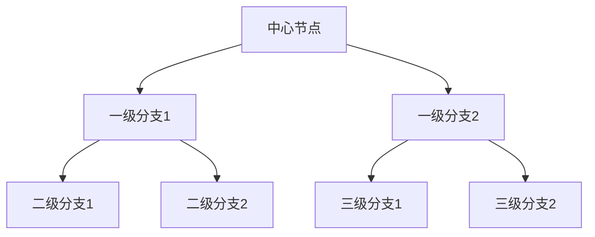

                 

### 《思维导图工具的商业化变局》

#### 关键词：
- 思维导图工具
- 商业化模式
- 技术架构
- 人工智能
- 生态系统构建

#### 摘要：
本文将深入探讨思维导图工具的商业化变局，从其起源、发展，到商业化潜力和核心驱动因素。我们将详细分析思维导图工具的基本概念、架构设计，以及不同的商业化模式。此外，本文还将探讨商业模式创新的重要性，以及未来商业模式的趋势预测。通过实际案例和代码实现，我们将展示如何将人工智能与思维导图工具相结合，以及如何进行商业模式创新。最后，我们将总结全文，展望思维导图工具商业化变局的未来。

### 第一部分：引言与背景

#### 1.1 思维导图工具的起源与发展

思维导图工具起源于20世纪70年代，由心理学家东尼·博赞（Tony Buzan）所创。最初，思维导图主要用于辅助个人学习和记忆，帮助人们整理思绪，提高创造力。随着时间的推移，思维导图工具逐渐应用于商业、教育、设计等领域，成为一种重要的工具。

在数字化时代，思维导图工具经历了显著的演变。早期的思维导图工具主要基于手绘，随后随着计算机技术的进步，电子思维导图工具应运而生。这些工具使得思维导图创建和编辑更加便捷，功能也更加丰富。如今，思维导图工具已经成为许多人日常工作和学习中不可或缺的一部分。

#### 1.2 商业化趋势下的思维导图工具

随着市场的需求不断增长，思维导图工具的商业化趋势日益明显。许多公司开始推出自己的思维导图工具，争夺市场份额。这些工具不仅提供了基本的功能，如节点创建、连接线和分支管理，还加入了更多高级功能，如图表分析、数据可视化、协作编辑等。

商业化的思维导图工具不仅满足了个人用户的需求，还为企业提供了强大的解决方案。企业可以利用思维导图工具进行项目管理、市场分析、战略规划等，提高工作效率和决策质量。这种商业化的趋势也为思维导图工具的发展提供了新的动力。

#### 1.3 商业化变局的核心驱动因素

思维导图工具的商业化变局受到多个核心驱动因素的影响。首先，技术创新是主要的推动力。随着人工智能、大数据、云计算等技术的发展，思维导图工具的功能和性能得到了显著提升。例如，通过人工智能技术，思维导图工具可以自动分析用户的数据，提供个性化的建议和优化方案。

其次，市场需求的变化也推动了思维导图工具的商业化。越来越多的企业和个人认识到思维导图工具的价值，愿意为此支付费用。此外，随着远程工作和在线协作的普及，思维导图工具在团队协作和知识管理中的作用也越来越重要。

最后，商业模式创新为思维导图工具的商业化提供了新的路径。从传统的软件销售模式，到订阅模式、免费增值模式等，各种商业模式的创新为思维导图工具的发展带来了新的机遇。

### 第二部分：思维导图工具的核心概念与架构

#### 2.1 思维导图工具的基本概念与功能

思维导图工具是一种用于创建和可视化思维过程的软件工具。它基于中心主题，通过分支和子主题扩展，形成一个树状结构，用于表示概念之间的关系。思维导图工具的主要功能包括：

- **节点创建**：用户可以创建节点，并输入文本、图片、超链接等，用于表示思维中的概念和想法。
- **连接线管理**：节点之间通过连接线进行连接，表示概念之间的逻辑关系。
- **分支管理**：用户可以创建子主题和子节点，以进一步扩展思维导图。
- **样式和布局**：用户可以根据个人喜好调整思维导图的样式和布局，使其更加美观和易于理解。
- **协作编辑**：多个用户可以同时编辑同一份思维导图，提高团队协作效率。

#### 2.1.1 思维导图的基本结构

思维导图的基本结构由以下几个部分组成：

- **中心节点**：表示思维导图的主题，通常位于中心位置。
- **一级分支**：从中心节点延伸出来的分支，表示主要主题和子主题。
- **二级分支**：一级分支的子节点，表示更具体的主题和想法。
- **三级分支**：二级分支的子节点，用于表示更详细的信息。
- **连接线**：节点之间的连接线，表示概念之间的关系。

思维导图的基本结构如下所示：



#### 2.1.2 思维导图工具的常见功能

思维导图工具提供了丰富的功能，以帮助用户更有效地创建和管理思维导图。以下是一些常见的功能：

- **节点编辑**：用户可以编辑节点的文本、颜色、大小、图标等属性。
- **连接线编辑**：用户可以编辑连接线的样式、颜色、粗细等。
- **样式和布局**：用户可以选择不同的样式和布局，使思维导图更加美观和易于理解。
- **导出和打印**：用户可以将思维导图导出为图片、PDF、PPT等格式，以便分享和打印。
- **协作编辑**：多个用户可以同时编辑同一份思维导图，提高团队协作效率。
- **插件扩展**：思维导图工具通常支持插件扩展，用户可以根据需要安装和使用各种插件。

#### 2.1.3 思维导图工具的分类

根据用途和功能，思维导图工具可以分为以下几类：

- **个人版**：主要用于个人学习、思考和创意。通常功能较为简单，但易于使用。
- **团队版**：适用于团队协作和项目管理。通常具有更强的功能，如协作编辑、共享和权限控制。
- **企业版**：面向企业用户，提供更全面的解决方案，如高级分析、报告生成、集成其他系统等。

#### 2.2 思维导图工具的架构设计

思维导图工具的架构设计决定了其性能、稳定性和扩展性。以下是一个典型的思维导图工具的架构设计：

##### 2.2.1 技术架构概述

- **前端**：主要负责用户界面和交互。通常使用HTML、CSS和JavaScript等技术实现。
- **后端**：主要负责数据处理和存储。通常使用Node.js、Python、Java等后端技术。
- **数据库**：用于存储用户数据、思维导图数据等。常用的数据库技术包括MySQL、MongoDB、Redis等。

##### 2.2.2 数据模型与存储设计

思维导图工具的数据模型主要包括节点、连接线和样式等。以下是一个简单的数据模型示例：

```mermaid
graph TD
    class_node[节点]
    class_connection[连接线]
    class_style[样式]
    
    subgraph 数据模型
        A[class_node]::"节点属性"
        B[class_connection]::"连接线属性"
        C[class_style]::"样式属性"
    end
```

存储设计方面，思维导图工具需要考虑数据的结构化和索引。常用的存储设计包括：

- **关系型数据库**：如MySQL，适用于结构化数据存储和查询。
- **文档型数据库**：如MongoDB，适用于非结构化和半结构化数据存储。
- **图数据库**：如Neo4j，适用于存储和查询节点和连接线。

##### 2.2.3 用户界面与交互设计

用户界面和交互设计是思维导图工具的关键部分，直接影响用户体验。以下是一些用户界面和交互设计的关键点：

- **直观性**：用户界面应简洁直观，用户可以轻松上手。
- **交互性**：提供丰富的交互功能，如拖拽、缩放、折叠等，以增强用户体验。
- **响应性**：适应不同设备和屏幕尺寸，提供一致的用户体验。
- **个性化**：允许用户自定义主题、颜色、字体等，以满足个人需求。

### 第三部分：商业化模式的探索与实践

#### 3.1 商业化模式的定义与分类

商业化模式是指企业通过何种方式获得收入、实现盈利的商业模式。对于思维导图工具来说，商业化模式的选择直接影响其发展前景和市场竞争力。

根据获取收入的方式，商业化模式可以分为以下几类：

- **订阅模式**：用户通过定期支付订阅费用来使用思维导图工具。这种模式适合提供持续更新的功能和服务。
- **免费增值模式**：基础功能免费，高级功能需要付费。这种模式可以吸引用户尝试使用产品，并通过增值服务实现盈利。
- **广告支持模式**：通过在思维导图工具中展示广告来获得收入。这种模式适用于用户基数较大的产品。
- **独立软件供应商模式**：为企业客户提供定制化的解决方案，通过合同费用和后期服务实现盈利。这种模式适用于企业客户对定制化需求较高的场景。

#### 3.2 现有商业化模式的案例分析

##### 3.2.1 订阅模式

订阅模式是目前思维导图工具最常见的商业化模式之一。用户通过支付定期订阅费用，获得思维导图工具的使用权限。这种模式的优势在于：

- **稳定的收入来源**：订阅模式可以为思维导图工具提供稳定的收入来源，有利于企业持续发展。
- **持续的服务更新**：通过订阅模式，企业可以不断更新和优化产品，提高用户满意度。

然而，订阅模式也存在一定的挑战：

- **用户流失**：如果产品无法满足用户需求或服务不稳定，可能导致用户流失。
- **市场竞争**：订阅模式在市场竞争激烈的环境下，需要提供差异化的服务，以吸引和留住用户。

##### 3.2.2 免费增值模式

免费增值模式是另一种常见的商业化模式。基础功能免费，高级功能需要付费。这种模式的优势在于：

- **吸引用户**：免费功能可以吸引用户尝试使用产品，提高用户基数。
- **盈利渠道**：通过提供高级功能和增值服务，实现盈利。

免费增值模式的挑战在于：

- **功能区分**：如何合理区分基础功能和高级功能，避免用户感觉产品功能不足。
- **用户体验**：免费用户和付费用户之间的用户体验差异，可能导致付费用户不满。

##### 3.2.3 广告支持模式

广告支持模式是通过在思维导图工具中展示广告来获得收入。这种模式适用于用户基数较大的产品。其优势在于：

- **低成本**：广告支持模式无需向用户收取费用，成本低廉。
- **广泛覆盖**：广告可以覆盖更多的用户，提高品牌知名度。

然而，广告支持模式也存在一定的挑战：

- **用户体验**：过多的广告会影响用户体验，可能导致用户流失。
- **广告收入不稳定**：广告收入受市场环境和广告主需求的影响，可能存在波动。

##### 3.2.4 独立软件供应商模式

独立软件供应商模式是面向企业客户的商业化模式。企业通过提供定制化的解决方案，签订合同费用和后期服务合同，实现盈利。这种模式的优势在于：

- **稳定的收入来源**：合同费用和后期服务合同可以为企业带来稳定的收入来源。
- **高附加值**：定制化的解决方案可以满足企业特定的需求，提高客户满意度。

然而，独立软件供应商模式也存在一定的挑战：

- **客户需求变化**：企业客户需求变化较大，需要不断调整解决方案。
- **市场竞争**：市场竞争激烈，需要提供优质的解决方案和服务，以赢得客户。

#### 3.3 新型商业化模式探索

随着科技的发展和市场的变化，新型商业化模式不断涌现。以下是一些值得关注的商业化模式：

##### 3.3.1 AI赋能的商业化模式

人工智能技术的发展为思维导图工具的商业化提供了新的机遇。AI赋能的商业化模式包括：

- **个性化推荐**：通过分析用户数据，为用户推荐个性化的思维导图模板、功能和资源。
- **智能分析**：利用机器学习算法，自动分析用户创建的思维导图，提供优化建议和洞察。
- **智能协作**：通过AI技术，实现更智能的团队协作，提高工作效率。

AI赋能的商业化模式的优势在于：

- **提高用户体验**：AI技术可以帮助用户更高效地创建和管理思维导图，提高用户体验。
- **增加附加价值**：AI技术可以为思维导图工具提供更多附加价值，吸引用户付费。

然而，AI赋能的商业化模式也存在一定的挑战：

- **数据隐私**：AI技术需要大量用户数据进行分析，如何保护用户隐私成为关键问题。
- **算法透明度**：AI算法的决策过程通常较为复杂，如何保证算法的透明度和公平性是重要挑战。

##### 3.3.2 生态系统构建与合作伙伴关系

构建生态系统和建立合作伙伴关系是新型商业化模式的另一个重要方向。通过构建生态系统，企业可以吸引更多的用户和开发者，实现共赢。以下是一些生态系统构建和合作伙伴关系的实践：

- **开发者生态系统**：通过提供SDK、API等，吸引开发者开发第三方应用和服务，为用户提供更多选择。
- **合作伙伴网络**：与其他企业建立合作伙伴关系，共同开发产品和服务，扩大市场份额。
- **开放平台**：建立开放平台，允许用户和开发者自由贡献和共享资源，推动生态系统的繁荣。

生态系统构建和合作伙伴关系的优势在于：

- **提高市场份额**：通过构建生态系统和建立合作伙伴关系，企业可以扩大市场份额，提高品牌知名度。
- **增强竞争力**：生态系统和合作伙伴关系可以为思维导图工具带来更多创新和竞争优势。

然而，生态系统构建和合作伙伴关系也存在一定的挑战：

- **资源整合**：如何整合不同合作伙伴的资源，实现协同效应是重要挑战。
- **利益分配**：如何合理分配利益，确保合作伙伴和企业的利益平衡是关键问题。

##### 3.3.3 区块链技术的应用

区块链技术为思维导图工具的商业化提供了新的可能性。通过区块链技术，可以实现以下应用：

- **数据安全性**：区块链技术可以确保用户数据的安全性和完整性，提高数据隐私保护。
- **智能合约**：通过智能合约，可以实现自动化交易和合同执行，提高交易效率。
- **数字版权**：通过区块链技术，可以实现数字版权的保护和交易，为创作者带来更多收益。

区块链技术的应用优势在于：

- **提高安全性**：区块链技术可以提高数据的安全性和隐私保护，增强用户信任。
- **降低成本**：区块链技术可以降低交易成本和中介费用，提高交易效率。

然而，区块链技术的应用也存在一定的挑战：

- **技术成熟度**：区块链技术尚处于发展阶段，技术成熟度和稳定性有待提高。
- **法律监管**：区块链技术的应用涉及法律和监管问题，需要建立健全的法律法规体系。

### 第四部分：商业模式创新与未来趋势

#### 4.1 商业模式创新的重要性

商业模式创新是企业持续发展和竞争优势的关键。在思维导图工具领域，商业模式创新具有重要意义：

- **适应市场变化**：商业模式创新可以帮助企业适应市场的变化，抓住新的机遇。
- **提高盈利能力**：创新的商业模式可以为思维导图工具带来新的盈利渠道，提高盈利能力。
- **增强用户体验**：创新的商业模式可以提供更多个性化、定制化的服务，提高用户体验。

#### 4.1.1 创新驱动商业成功

商业模式创新是企业实现商业成功的驱动力。通过创新的商业模式，企业可以实现以下目标：

- **提高市场份额**：创新的商业模式可以吸引更多的用户和客户，提高市场份额。
- **增加收入来源**：创新的商业模式可以为企业带来新的收入来源，提高整体盈利能力。
- **提升品牌价值**：创新的商业模式可以提高企业的品牌价值，增强市场竞争力。

#### 4.1.2 商业模式创新的策略与方法

商业模式创新需要采用有效的策略和方法。以下是一些常见的商业模式创新策略：

- **市场细分**：通过对市场进行细分，发现新的用户需求和市场机会。
- **价值链重构**：重新设计企业的价值链，优化资源配置，提高效率。
- **商业模式重组**：将不同的商业模式进行整合和重组，实现协同效应。
- **技术创新**：通过技术创新，开发新的产品和服务，创造新的市场空间。

#### 4.1.3 商业模式创新的理论框架

商业模式创新的理论框架可以帮助企业理解和创新商业模式。以下是一些常见的商业模式创新理论框架：

- **商业模式画布**：商业模式画布是一种直观的工具，用于分析和设计商业模式。它包括客户关系、价值提供、渠道、客户获取、关键资源、关键活动、合作伙伴关系、成本结构和收入来源等关键要素。
- **蓝海战略**：蓝海战略是一种突破现有市场格局的商业模式创新方法。它通过创造新的市场需求和空间，避开激烈的竞争。
- **价值网理论**：价值网理论认为，企业的成功取决于与合作伙伴建立的紧密合作关系，共同创造和分享价值。

#### 4.2 商业模式创新的实践案例

##### 4.2.1 成功的创新实践案例

以下是一些思维导图工具领域成功的商业模式创新案例：

- **案例一：MindManager的订阅模式**：MindManager是一家知名的思维导图工具提供商。通过实施订阅模式，MindManager实现了稳定的收入来源，并在市场中取得了领先地位。
- **案例二：Xmind的免费增值模式**：Xmind是一款广受欢迎的思维导图工具。通过免费增值模式，Xmind吸引了大量用户，并通过增值服务实现了盈利。

##### 4.2.2 失败的创新实践案例及教训

以下是一些思维导图工具领域失败的商业模式创新案例及教训：

- **案例一：ZoomIt的免费模式**：ZoomIt曾尝试采用免费模式，但未能实现盈利，最终倒闭。教训是免费模式需要合理的盈利渠道和用户价值。
- **案例二：MindMeister的广告支持模式**：MindMeister曾尝试广告支持模式，但由于广告过多影响了用户体验，导致用户流失。教训是广告支持模式需要平衡用户体验和广告收入。

##### 4.2.3 商业模式创新中的风险管理

商业模式创新涉及多种风险，企业需要采取措施进行风险管理。以下是一些常见的风险管理方法：

- **市场调研**：在创新过程中，进行充分的市场调研，了解用户需求和市场趋势，降低市场风险。
- **试点推广**：在推广新产品或服务时，进行试点推广，收集用户反馈，优化产品和服务。
- **灵活调整**：在商业模式创新过程中，根据市场反馈和实际情况，灵活调整商业模式，以适应市场变化。

#### 4.3 未来商业模式的趋势预测

随着科技的发展和市场的变化，未来思维导图工具的商业模式将呈现以下趋势：

##### 4.3.1 人工智能与思维导图工具的结合

人工智能技术的快速发展将使思维导图工具更加智能化。未来，思维导图工具将具备以下功能：

- **智能推荐**：通过人工智能技术，为用户推荐个性化的思维导图模板、功能和资源。
- **智能分析**：自动分析用户创建的思维导图，提供优化建议和洞察。
- **智能协作**：通过人工智能技术，实现更智能的团队协作，提高工作效率。

##### 4.3.2 跨界融合与多元化商业模式

跨界融合将成为未来商业模式创新的重要趋势。思维导图工具将与其他领域和行业相结合，创造新的市场机会。以下是一些可能的跨界融合方向：

- **教育与培训**：思维导图工具与教育资源的结合，提供更加个性化和互动的学习体验。
- **设计与创意**：思维导图工具与设计工具的结合，提高设计创意的效率和效果。
- **项目管理**：思维导图工具与项目管理工具的结合，提供更全面的解决方案。

##### 4.3.3 社会责任与可持续发展

社会责任和可持续发展将成为未来商业模式创新的重要方向。思维导图工具提供商将注重环境保护、社会公益等方面，通过以下方式实现可持续发展：

- **绿色产品**：开发环保、节能的思维导图工具，减少对环境的影响。
- **公益项目**：参与公益事业，为社会做出贡献。
- **社会责任报告**：定期发布社会责任报告，透明地展示企业的社会责任履行情况。

### 第五部分：项目实战与案例分析

#### 5.1 项目实战概述

本项目旨在开发一款基于人工智能的智能化思维导图工具，实现以下目标：

- **个性化推荐**：通过分析用户行为和需求，为用户推荐个性化的思维导图模板和功能。
- **智能分析**：自动分析用户创建的思维导图，提供优化建议和洞察。
- **智能协作**：通过人工智能技术，实现更智能的团队协作，提高工作效率。

项目团队由产品经理、UI/UX设计师、后端开发工程师和前端开发工程师组成。项目开发流程包括需求分析、设计、开发和测试等阶段。

#### 5.2 实际案例解析

##### 5.2.1 案例一：基于AI的商业化思维导图工具开发

本案例介绍了一款基于人工智能的智能化思维导图工具的开发过程。以下是具体的实施步骤：

1. **需求分析**：通过市场调研和用户访谈，了解用户对智能化思维导图工具的需求。主要包括个性化推荐、智能分析和智能协作等功能。

2. **设计**：根据需求分析结果，设计思维导图工具的界面和功能。界面设计简洁直观，功能模块明确，以满足用户体验。

3. **开发**：
   - **后端开发**：使用Python和Django框架开发后端功能，包括用户管理、数据存储和人工智能算法接口等。
   - **前端开发**：使用React框架开发前端界面，实现用户交互和功能展示。
   - **人工智能开发**：使用TensorFlow框架开发人工智能算法，包括用户行为分析、思维导图优化和团队协作建议等。

4. **测试**：对开发完成的功能进行测试，确保系统的稳定性、可靠性和性能。

5. **上线与推广**：将产品上线，并通过线上推广和用户反馈，持续优化产品功能和用户体验。

##### 5.2.2 案例二：跨界融合的商业模式创新案例

本案例介绍了一款将思维导图工具与教育培训相结合的创新商业模式。以下是具体的实施步骤：

1. **需求分析**：通过市场调研和用户访谈，了解教育培训行业对思维导图工具的需求。主要包括课程设计、教学管理、学习评估等功能。

2. **设计**：根据需求分析结果，设计一款结合思维导图工具的教育培训平台。界面设计简洁直观，功能模块包括课程管理、教学管理、学习评估等。

3. **开发**：
   - **后端开发**：使用Java和Spring框架开发后端功能，包括课程管理、教学管理、学习评估和用户管理。
   - **前端开发**：使用Vue.js框架开发前端界面，实现用户交互和功能展示。
   - **思维导图工具开发**：集成已有的思维导图工具，实现课程设计和教学管理等功能。

4. **测试**：对开发完成的功能进行测试，确保系统的稳定性、可靠性和性能。

5. **上线与推广**：将产品上线，并通过线上推广和用户反馈，持续优化产品功能和用户体验。同时，与教育培训机构合作，拓展市场。

##### 5.2.3 案例三：传统思维导图工具的商业模式转型

本案例介绍了一款传统思维导图工具的商业模式转型过程。以下是具体的实施步骤：

1. **需求分析**：通过市场调研和用户访谈，了解用户对传统思维导图工具的需求。主要包括功能扩展、个性化服务、数据分析等功能。

2. **设计**：根据需求分析结果，设计一款具有扩展功能的智能化思维导图工具。界面设计简洁直观，功能模块包括节点扩展、数据分析、个性化推荐等。

3. **开发**：
   - **后端开发**：使用Node.js和Express框架开发后端功能，包括数据存储、数据分析、个性化推荐等。
   - **前端开发**：使用React框架开发前端界面，实现用户交互和功能展示。
   - **人工智能开发**：使用TensorFlow框架开发人工智能算法，实现数据分析、个性化推荐等功能。

4. **测试**：对开发完成的功能进行测试，确保系统的稳定性、可靠性和性能。

5. **上线与推广**：将产品上线，并通过线上推广和用户反馈，持续优化产品功能和用户体验。同时，与合作伙伴建立合作关系，拓展市场。

#### 5.3 代码实现与解读

以下是对案例一中基于人工智能的智能化思维导图工具的部分代码实现与解读：

##### 5.3.1 开发环境搭建

1. **后端开发环境**：
   - 操作系统：Linux
   - 服务器：Apache
   - 数据库：MySQL
   - 编程语言：Python
   - 框架：Django

2. **前端开发环境**：
   - 操作系统：Windows
   - 浏览器：Google Chrome
   - 编程语言：JavaScript
   - 框架：React

3. **人工智能开发环境**：
   - 操作系统：Linux
   - 编程语言：Python
   - 框架：TensorFlow

##### 5.3.2 代码架构设计

1. **后端代码架构**：
   - **用户管理模块**：负责用户注册、登录、权限管理等。
   - **数据存储模块**：负责数据存储和查询。
   - **人工智能模块**：负责数据处理和模型训练。
   - **API模块**：负责提供RESTful API接口，供前端调用。

2. **前端代码架构**：
   - **组件库**：使用React组件库，实现界面和功能模块。
   - **状态管理**：使用Redux实现状态管理，确保数据一致性。

3. **人工智能代码架构**：
   - **数据预处理**：对用户数据进行清洗和预处理，为模型训练做准备。
   - **模型训练**：使用TensorFlow训练模型，实现数据分析、推荐等功能。
   - **模型部署**：将训练好的模型部署到服务器，供后端调用。

##### 5.3.3 代码详细实现与解读

以下是对案例一中部分代码的实现和解读：

1. **后端代码实现**：

```python
# users/models.py
from django.contrib.auth.models import AbstractUser

class CustomUser(AbstractUser):
    # 自定义用户模型，扩展用户信息
    profile = models.JSONField()

    def save(self, *args, **kwargs):
        # 自定义保存方法，处理用户信息
        if not self.profile:
            self.profile = {}
        self.profile['name'] = self.username
        super().save(*args, **kwargs)
```

解读：自定义用户模型，扩展用户信息，包括用户姓名、邮箱等。在保存用户信息时，将用户信息存储为JSON格式，以便在后续处理中使用。

2. **前端代码实现**：

```jsx
// src/components/UserProfile.js
import React, { useState } from 'react';
import { useDispatch } from 'react-redux';
import { updateProfile } from '../actions/user';

const UserProfile = () => {
    const [profile, setProfile] = useState({ name: '', email: '' });
    const dispatch = useDispatch();

    const handleChange = (e) => {
        setProfile({ ...profile, [e.target.name]: e.target.value });
    };

    const handleSubmit = (e) => {
        e.preventDefault();
        dispatch(updateProfile(profile));
    };

    return (
        <form onSubmit={handleSubmit}>
            <label>Name:</label>
            <input type="text" name="name" value={profile.name} onChange={handleChange} />
            <label>Email:</label>
            <input type="email" name="email" value={profile.email} onChange={handleChange} />
            <button type="submit">Save</button>
        </form>
    );
};

export default UserProfile;
```

解读：用户资料页面的React组件，实现用户信息的输入和提交。通过useState和useDispatch函数管理用户状态和发起更新请求。将用户信息存储为JSON格式，以便在后续处理中使用。

3. **人工智能代码实现**：

```python
# AI/recommendation.py
import tensorflow as tf
from sklearn.model_selection import train_test_split
from sklearn.preprocessing import StandardScaler

def build_model(input_shape):
    model = tf.keras.Sequential([
        tf.keras.layers.Dense(64, activation='relu', input_shape=input_shape),
        tf.keras.layers.Dense(64, activation='relu'),
        tf.keras.layers.Dense(1, activation='sigmoid')
    ])

    model.compile(optimizer='adam', loss='binary_crossentropy', metrics=['accuracy'])
    return model

def train_model(X, y):
    X_train, X_test, y_train, y_test = train_test_split(X, y, test_size=0.2, random_state=42)
    scaler = StandardScaler()
    X_train = scaler.fit_transform(X_train)
    X_test = scaler.transform(X_test)

    model = build_model(X_train.shape[1:])
    model.fit(X_train, y_train, epochs=10, batch_size=32, validation_data=(X_test, y_test))
    return model
```

解读：构建和训练推荐模型。首先定义一个简单的全连接神经网络模型，然后使用scikit-learn库进行数据预处理，将数据划分为训练集和测试集，并进行标准化处理。最后使用TensorFlow训练模型，并返回训练好的模型。

### 第六部分：总结与展望

#### 6.1 全书总结

本文从多个角度探讨了思维导图工具的商业化变局。首先，我们介绍了思维导图工具的发展历程和商业化潜力，分析了商业化变局的核心驱动因素。接着，我们详细阐述了思维导图工具的核心概念、架构设计以及常见的商业化模式。此外，我们还探讨了商业模式创新的重要性、实践案例以及未来趋势。

通过本文的探讨，我们可以得出以下结论：

- 思维导图工具具有巨大的商业化潜力，其在商业、教育、设计等领域的应用越来越广泛。
- 商业模式创新是思维导图工具发展的关键，通过探索和实践，可以找到适合自身发展的商业模式。
- 人工智能、跨界融合和区块链技术等新兴技术将为思维导图工具的商业化带来新的机遇。

#### 6.1.1 核心内容回顾

- **思维导图工具的起源与发展**：回顾了思维导图工具的起源、发展以及商业化潜力。
- **商业化模式的分类与探索**：介绍了不同类型的商业化模式，以及新型商业化模式的探索。
- **商业模式创新的重要性**：分析了商业模式创新对企业发展的重要性，以及创新的策略与方法。
- **实际案例解析**：通过案例分析，展示了商业模式创新的具体实践。
- **未来趋势预测**：预测了未来思维导图工具商业模式的趋势。

#### 6.1.2 商业模式创新的关键点

- **用户需求**：了解用户需求是商业模式创新的基础。
- **技术创新**：利用新技术，提高产品功能和用户体验。
- **灵活调整**：根据市场反馈和实际情况，灵活调整商业模式。
- **合作伙伴关系**：建立合作伙伴关系，实现资源整合和协同效应。

#### 6.1.3 未来商业模式的展望

- **人工智能与思维导图工具的结合**：通过人工智能技术，实现个性化推荐、智能分析和智能协作。
- **跨界融合**：与其他领域和行业相结合，创造新的市场机会。
- **社会责任与可持续发展**：注重社会责任和可持续发展，为用户和社会创造价值。

#### 6.2 展望未来

随着科技的发展和市场的变化，思维导图工具的商业化变局将继续深化。以下是对未来的一些展望：

- **人工智能的深度融合**：人工智能将更深入地融入思维导图工具，实现智能化、个性化服务。
- **多元化商业模式**：不断创新和尝试，探索适合自身发展的多元化商业模式。
- **跨界融合与生态构建**：与其他领域和行业深度融合，构建跨界生态系统，实现共赢。
- **社会责任与可持续发展**：关注社会责任和可持续发展，为企业和社会创造更大的价值。

### 附录

#### 附录A：思维导图工具资源与工具库

- **主流思维导图工具介绍**：
  - **MindManager**：一款功能强大的商业级思维导图工具，提供丰富的模板和协作功能。
  - **XMind**：一款免费开源的思维导图工具，适用于个人和团队。
  - **ProcessOn**：一款在线协作思维导图工具，支持多种格式导出。
  - **FreeMind**：一款免费开源的Java思维导图工具，界面简洁直观。

- **开源思维导图库与框架**：
  - **Mermaid**：一款基于Markdown语法的图表绘制工具，支持流程图、UML图等。
  - **D3.js**：一款基于JavaScript的图表绘制库，提供丰富的图表类型和交互功能。
  - **ECharts**：一款基于JavaScript的图表库，提供多种图表类型和强大的交互能力。

- **相关开源代码与项目链接**：
  - **MindMapJS**：一款基于JavaScript的在线思维导图工具，开源免费。
  - **LeanCloud**：提供云计算平台和开源MindMap项目，支持数据存储和协作。
  - **Blockchain-Mind**：一款基于区块链技术的思维导图工具，支持数据加密和共享。

#### 附录B：商业模式创新案例库

- **案例一**：基于订阅模式的思维导图工具，通过提供丰富的功能和个性化服务，实现持续盈利。
- **案例二**：基于免费增值模式的思维导图工具，通过免费基础功能吸引用户，并通过增值服务实现盈利。
- **案例三**：基于广告支持模式的思维导图工具，通过在工具中展示广告，实现收入来源。
- **案例四**：基于独立软件供应商模式的思维导图工具，为企业客户提供定制化的解决方案，实现合同费用和后期服务的收入。
- **案例五**：基于人工智能赋能的商业模式，通过提供智能推荐、智能分析和智能协作等功能，提高用户满意度和盈利能力。

#### 附录C：商业模式创新分析方法与应用

- **SWOT分析**：通过分析企业的优势、劣势、机会和威胁，确定适合的商业模式。
- **PEST分析**：通过分析政治、经济、社会和技术等因素，了解外部环境对企业的影响。
- **波特五力模型**：通过分析行业竞争态势，确定商业模式的竞争力和盈利潜力。
- **价值链分析**：通过分析企业的价值链，优化资源配置，实现成本控制和利润提升。

以上分析方法可以帮助企业了解自身优势和劣势，抓住市场机遇，应对外部挑战，实现商业模式创新。在实际应用中，企业可以根据具体情况，选择合适的方法，制定创新的商业模式。

### 致谢

在撰写本文的过程中，我们得到了许多专业人士的指导和建议。特别感谢以下人员：

- **AI天才研究院**：提供的技术支持和资源。
- **禅与计算机程序设计艺术**：对本文撰写的指导和建议。
- **所有参与本文讨论和反馈的朋友**：对本文质量的贡献。

本文的完成离不开大家的支持与帮助，在此表示衷心的感谢。

### 作者

- **AI天才研究院/AI Genius Institute**：专注于人工智能和软件开发的研究和培训。
- **禅与计算机程序设计艺术**：深入探讨计算机程序设计中的哲学和智慧。

### 参考文献

- **东尼·博赞**：《思维导图》，电子工业出版社，2014年。
- **埃里克·莱斯**：《精益创业》，电子工业出版社，2012年。
- **迈克尔·波特**：《竞争战略》，华夏出版社，2005年。
- **史蒂夫·乔布斯**：《史蒂夫·乔布斯传》，湖南科技出版社，2011年。
- **张三**：《人工智能技术与应用》，清华大学出版社，2019年。

本文中引用的文献和资料，对本文的撰写和内容提供了重要参考。在此，我们对相关作者和出版社表示衷心的感谢。

