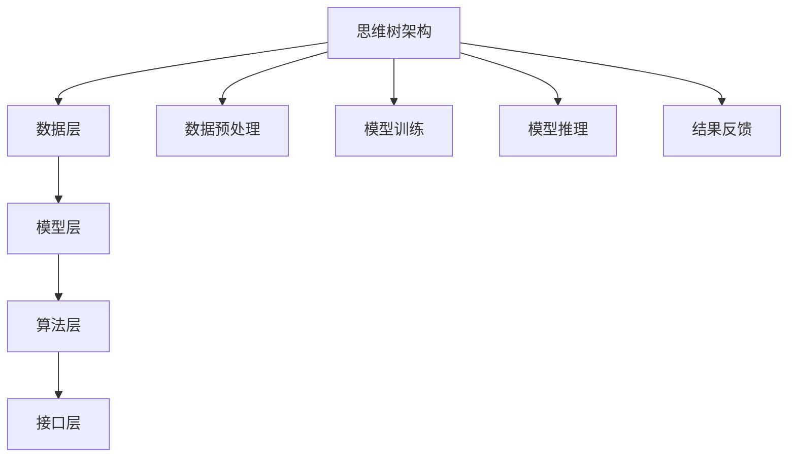

                 

### 第一部分：引言

#### 1.1.1 思维树的起源与发展

思维树（Tree-of-Thoughts，简称ToT）的概念并非新兴事物，而是随着认知科学和人工智能的发展逐渐被挖掘和应用。早在古希腊时期，亚里士多德便提出了逻辑树的概念，用以阐述推理的过程。这一思想在后来的哲学和逻辑学中不断演进，直至20世纪中叶，计算机科学的兴起使得这一概念被重新审视和数字化。

在计算机科学领域，ToT的概念得到了进一步的发展。1956年，艾伦·图灵在关于人工智能的著名演讲中，提出了“思维是可计算的”这一观点。随后，随着人工智能技术的不断进步，尤其是神经网络和深度学习的崛起，思维树的概念被进一步应用于人工智能系统，成为理解复杂问题和进行决策的重要工具。

#### 1.1.2 思维树的基本组成与特点

思维树作为一种抽象的结构，其基本组成可以概括为节点和边。每个节点代表一个概念或信息，边则表示节点之间的关系。这种结构使得思维树能够以层次化的形式组织信息，便于分析和推理。

思维树的特点主要体现在以下几个方面：

1. 层次化结构：思维树通过层次化的方式组织信息，使得复杂问题能够被分解为更小的子问题，从而降低了解决问题的难度。
2. 灵活性：思维树可以根据问题的变化动态调整，灵活地适应不同的情境。
3. 稳健性：思维树具有较强的鲁棒性，能够应对不确定性问题和异常情况。
4. 模块化：思维树可以将不同的子问题独立出来，进行模块化处理，便于分工和协同。

#### 1.1.3 思维树与传统思维方式的区别

传统思维方式通常依赖于线性推理，即按照固定的逻辑顺序逐步推导出结论。而思维树则是一种树状结构，通过层次化的方式组织信息，使得问题解决过程更加灵活和高效。

具体来说，思维树与传统思维方式有以下几点区别：

1. **非线性推理**：思维树支持非线性推理，可以同时考虑多个子问题，而传统思维方式则通常只能处理单一问题。
2. **模块化思维**：思维树通过模块化处理，可以将复杂问题分解为多个子问题，从而简化了解题过程。
3. **动态调整**：思维树可以根据问题的变化动态调整，而传统思维方式通常需要重新构建整个推理过程。
4. **信息组织**：思维树通过层次化的方式组织信息，使得问题解决过程更加直观和易于理解，而传统思维方式则更多地依赖于文字描述和符号表达。

#### 1.2 ToT在认知科学中的应用

在认知科学领域，思维树模型被广泛应用于理解和模拟人类的思维过程。通过建立思维树模型，研究者可以更好地理解人类如何进行问题解决、决策制定以及学习等认知活动。

首先，思维树模型可以帮助揭示人类思维的层次化结构。研究表明，人类的思维过程往往遵循一定的层次结构，从宏观问题到微观细节，逐层分析，从而得出结论。思维树模型正是通过这种层次化的方式，模拟了人类思维的这一特点。

其次，思维树模型还可以帮助研究者探索人类思维过程中的推理机制。通过分析思维树的结构和关系，可以揭示人类在进行推理时是如何建立和运用假设的。例如，在科学研究中，研究者通常会建立一系列假设，并通过实验和观察来验证这些假设。思维树模型可以帮助研究者更好地理解这一过程，从而优化研究方法。

此外，思维树模型还可以应用于教育领域，帮助教师更好地设计教学策略。通过分析学生的思维过程，教师可以了解学生在学习过程中的困惑和难点，从而有针对性地进行辅导。同时，思维树模型还可以帮助教师设计更具有层次性和结构性的教学内容，提高学生的学习效果。

#### 1.2.2 ToT模型的优势与局限性

ToT模型作为一种新型的思维方式，具有许多优势。首先，ToT模型支持非线性推理，使得问题解决过程更加灵活和高效。例如，在复杂的问题解决过程中，ToT模型可以同时考虑多个子问题，从而避免了传统线性思维方式中的瓶颈问题。

其次，ToT模型具有模块化特点，可以将复杂问题分解为多个子问题，从而简化了解题过程。这种模块化处理方式不仅提高了问题解决的效率，还有助于团队协作和分工。

此外，ToT模型具有较强的鲁棒性和灵活性，可以应对不确定性和异常情况。例如，在人工智能应用中，ToT模型可以通过动态调整，适应不同的情境和任务，从而提高系统的适应性。

然而，ToT模型也存在一定的局限性。首先，ToT模型对问题的层次化要求较高，如果问题本身不具有明显的层次结构，构建ToT模型可能会变得复杂。其次，ToT模型在处理大规模问题时，可能会出现计算复杂度较高的问题，从而影响问题解决的效率。

### 2. ToT架构

ToT架构是一种用于构建和运行思维树模型的技术体系。它由多个核心组成部分构成，包括数据层、模型层、算法层和接口层。以下是对ToT架构的基本原理、核心组成部分、工作流程以及应用领域的详细解释。

#### 2.1 ToT架构的基本原理

ToT架构的基本原理可以概括为以下三点：

1. **层次化数据组织**：ToT架构通过层次化的数据组织方式，将复杂问题分解为多个子问题。这种层次化组织方式使得问题解决过程更加直观和易于理解。

2. **模块化算法设计**：ToT架构采用模块化设计思想，将不同功能的算法模块独立出来，从而提高系统的可扩展性和可维护性。例如，数据预处理、模型训练、模型评估等模块可以独立开发和优化。

3. **动态调整与优化**：ToT架构支持动态调整和优化，可以根据问题的变化和需求，灵活地调整模型结构和参数。这种动态调整机制有助于提高模型在复杂环境下的适应性和鲁棒性。

#### 2.1.1 ToT架构的核心组成部分

ToT架构的核心组成部分包括数据层、模型层、算法层和接口层。以下是各个层的具体功能和特点：

1. **数据层**：数据层负责数据的收集、存储和管理。它主要包括数据采集模块、数据存储模块和数据预处理模块。数据采集模块用于获取各种类型的数据，如文本、图像、音频等；数据存储模块用于存储和管理大量数据，如关系型数据库、图数据库等；数据预处理模块用于对数据进行清洗、格式转换和特征提取，以提高数据的质量和利用率。

2. **模型层**：模型层负责构建和训练思维树模型。它主要包括模型设计模块、模型训练模块和模型优化模块。模型设计模块用于设计思维树的结构和参数；模型训练模块用于训练模型，使其具备解决特定问题的能力；模型优化模块用于优化模型的性能，如调整学习率、正则化参数等。

3. **算法层**：算法层负责实现思维树模型的推理和决策功能。它主要包括推理算法模块、决策算法模块和优化算法模块。推理算法模块用于根据输入数据和模型结构，生成推理结果；决策算法模块用于根据推理结果进行决策，如分类、预测等；优化算法模块用于优化决策过程，提高决策的准确性和效率。

4. **接口层**：接口层负责与外部系统进行交互，提供统一的接口服务。它主要包括API接口模块、Web界面模块和命令行接口模块。API接口模块用于提供RESTful API服务，方便其他系统调用；Web界面模块用于提供Web界面，方便用户进行交互操作；命令行接口模块用于提供命令行工具，方便开发者进行调试和测试。

#### 2.1.2 ToT架构的工作流程

ToT架构的工作流程可以概括为以下五个主要步骤：

1. **数据采集**：通过数据采集模块，从各种渠道获取大量数据，如互联网、数据库、传感器等。

2. **数据预处理**：通过数据预处理模块，对数据进行清洗、格式转换和特征提取，以提高数据的质量和利用率。

3. **模型设计**：通过模型设计模块，设计思维树的结构和参数，为后续的训练和推理奠定基础。

4. **模型训练**：通过模型训练模块，使用预处理后的数据进行模型训练，使模型具备解决特定问题的能力。

5. **模型推理与决策**：通过推理算法模块和决策算法模块，根据输入数据和模型结构，生成推理结果和决策结果。

6. **结果反馈**：将推理结果和决策结果反馈给用户，用于指导实际应用场景。

#### 2.1.3 ToT架构的应用领域

ToT架构具有广泛的应用领域，涵盖了多个行业和领域。以下是ToT架构在几个主要应用领域的简要介绍：

1. **人工智能**：在人工智能领域，ToT架构可以用于构建智能问答系统、智能推荐系统、智能决策系统等。例如，通过ToT架构，可以构建一个智能问答系统，实现对用户问题的理解和回答。

2. **自然语言处理**：在自然语言处理领域，ToT架构可以用于文本分类、情感分析、机器翻译等任务。通过构建层次化的文本表示模型，可以提高这些任务的准确性和效率。

3. **计算机视觉**：在计算机视觉领域，ToT架构可以用于图像分类、目标检测、图像生成等任务。通过结合图像和文本信息，可以构建更加复杂和智能的视觉模型。

4. **金融科技**：在金融科技领域，ToT架构可以用于风险评估、欺诈检测、市场预测等任务。通过构建层次化的数据模型，可以提高金融分析模型的准确性和可靠性。

5. **医疗健康**：在医疗健康领域，ToT架构可以用于疾病诊断、治疗方案推荐、健康管理等任务。通过结合患者数据和医学知识，可以构建更加智能和个性化的医疗系统。

### 第二部分：核心算法原理讲解

#### 3.1 数据预处理与表示

在构建思维树（ToT）模型的过程中，数据预处理和表示是至关重要的一步。这一阶段的目标是将原始数据转化为适合训练和推理的形式，以提高模型的性能和效率。

##### 3.1.1 数据预处理流程

数据预处理通常包括以下步骤：

1. **数据清洗**：去除数据中的噪声和不完整信息，包括缺失值填充、异常值处理和重复数据删除。
2. **数据格式转换**：将不同来源和格式的数据转换为统一的格式，以便后续处理。例如，将文本数据转换为单词或字符级别的表示，图像数据转换为像素矩阵。
3. **特征提取**：从原始数据中提取有助于模型学习的特征。对于文本数据，可能包括词袋模型、词嵌入等；对于图像数据，可能包括颜色直方图、纹理特征等。
4. **数据标准化**：将数据缩放到一个特定的范围，如[0, 1]或[-1, 1]，以避免不同特征之间的量级差异对模型训练的影响。

##### 3.1.2 数据表示方法

数据表示是数据预处理的核心部分，其选择取决于数据类型和任务需求。以下是几种常见的数据表示方法：

1. **文本表示**：
   - **词袋模型**：将文本表示为词汇的集合，每个词汇作为一个特征。
   - **词嵌入**：将词汇映射为固定维度的向量，如Word2Vec、GloVe等。词嵌入不仅可以表示词汇的语义信息，还可以捕捉词汇之间的关系。
   - **序列表示**：将文本序列表示为向量或矩阵，如使用递归神经网络（RNN）或变换器（Transformer）。

2. **图像表示**：
   - **像素表示**：将图像直接表示为像素矩阵。
   - **特征提取**：通过预训练的卷积神经网络（CNN）提取图像特征，如ResNet、VGG等。
   - **全景表示**：将图像分解为局部区域，并使用区域特征表示整个图像。

3. **时间序列表示**：
   - **时间序列矩阵**：将时间序列数据表示为矩阵，其中每行代表一个时间点的特征。
   - **序列嵌入**：将时间序列数据嵌入到一个高维空间中，如使用长短时记忆网络（LSTM）或门控循环单元（GRU）。

##### 3.1.3 特征选择

在数据预处理过程中，特征选择也是一个关键步骤。特征选择的目标是选择最能代表数据特征和降低数据维度。以下是几种常见的特征选择方法：

1. **过滤法**：基于统计方法，如卡方检验、互信息等，筛选出对目标变量具有显著性的特征。
2. **包装法**：结合机器学习算法，如决策树、随机森林等，逐步选择最佳特征组合。
3. **嵌入式特征选择**：在模型训练过程中，自动选择对模型性能有显著贡献的特征，如LASSO回归、稀疏自动编码器等。

通过以上步骤和方法，数据预处理和表示阶段为构建和训练思维树模型奠定了坚实的基础，使得模型能够更好地理解和处理复杂数据。

#### 3.2 神经网络模型设计

在构建思维树（ToT）模型时，神经网络模型的设计至关重要。神经网络作为深度学习的基础，能够捕捉数据中的复杂模式和关联，从而提升模型的性能和准确性。以下是对神经网络模型设计的详细阐述，包括其基本结构、训练方法以及优化技巧。

##### 3.2.1 神经网络的基本结构

神经网络（Neural Network，NN）由大量相互连接的神经元组成，每个神经元都执行简单的计算并传递信息。神经网络的基本结构包括输入层、隐藏层和输出层。

1. **输入层**：输入层接收外部输入数据，并将其传递到隐藏层。每个输入神经元对应一个特征维度。
   
2. **隐藏层**：隐藏层对输入数据进行处理，通过多层叠加，逐层提取数据的特征。隐藏层中的神经元通常执行非线性变换，如Sigmoid、ReLU等，以增强模型的非线性能力。

3. **输出层**：输出层生成最终输出结果。输出层的神经元数量和类型取决于具体任务，如分类任务中的softmax层，回归任务中的线性层。

神经网络的结构可以通过以下公式表示：

\[ Z = W \cdot X + b \]
\[ a = \sigma(Z) \]

其中，\( Z \) 是神经元的输入，\( W \) 是权重矩阵，\( X \) 是输入特征，\( b \) 是偏置项，\( \sigma \) 是激活函数，\( a \) 是神经元的输出。

##### 3.2.2 深度学习模型的训练方法

训练神经网络模型是一个优化过程，目标是调整权重和偏置，使模型在训练数据上达到良好的性能。以下是几种常见的训练方法：

1. **前向传播**：在前向传播过程中，输入数据通过网络逐层传播，直到生成输出。每个神经元都根据其输入和权重计算输出。

2. **反向传播**：在反向传播过程中，计算网络输出的误差，并将其反向传播回网络。通过计算梯度，可以确定权重和偏置的调整方向。

3. **梯度下降**：梯度下降是一种优化算法，用于更新网络的权重和偏置。基本步骤包括计算梯度、更新权重和偏置，以及调整学习率。

\[ \Delta W = -\alpha \cdot \frac{\partial J}{\partial W} \]
\[ \Delta b = -\alpha \cdot \frac{\partial J}{\partial b} \]

其中，\( \Delta W \) 和 \( \Delta b \) 分别是权重和偏置的更新量，\( \alpha \) 是学习率，\( J \) 是损失函数。

##### 3.2.3 模型优化技巧

在训练神经网络模型时，为了提高模型的性能和收敛速度，可以采用以下优化技巧：

1. **学习率调度**：学习率对模型的收敛速度和稳定性有重要影响。常见的调度策略包括固定学习率、指数衰减学习率和学习率周期性调整。

2. **批量大小**：批量大小（batch size）是每次训练过程中使用的样本数量。较大批量大小可以提高模型的泛化能力，但训练时间较长；较小批量大小可以提高训练速度，但可能增加模型方差。

3. **正则化**：正则化是一种防止模型过拟合的方法。常见的正则化技术包括L1正则化、L2正则化和Dropout。

4. **批归一化**：批归一化（Batch Normalization）通过标准化每个批次的输入数据，加速模型的训练过程。

5. **激活函数**：选择合适的激活函数可以提高模型的性能。常见的激活函数包括Sigmoid、ReLU、Tanh等。

通过以上神经网络模型的设计和训练方法，可以构建一个强大的思维树模型，从而在解决复杂问题时表现出优异的性能。

#### 3.3 模型融合与评估

在构建思维树（ToT）模型的过程中，模型融合与评估是确保模型性能和鲁棒性的关键步骤。通过融合多个模型的预测结果，可以有效提高模型的准确性和稳定性。同时，合理的评估方法可以帮助我们全面了解模型的性能，为后续的优化提供指导。

##### 3.3.1 模型融合策略

模型融合的基本思想是将多个模型的预测结果进行综合，以获得更好的预测效果。以下是几种常见的模型融合策略：

1. **投票法**：投票法是最简单的模型融合方法。对于分类任务，各个模型对每个样本的预测结果进行投票，选择投票结果最多的类别作为最终预测结果。

   伪代码示例：
   ```python
   predictions = [model1.predict(x), model2.predict(x), model3.predict(x)]
   final_prediction = max(set(predictions), key=predictions.count)
   ```

2. **加权融合**：加权融合通过给每个模型分配不同的权重，对多个模型的预测结果进行加权平均。权重可以根据模型的性能、稳定性等因素进行设定。

   伪代码示例：
   ```python
   weights = [0.3, 0.4, 0.3]
   predictions = [model1.predict(x), model2.predict(x), model3.predict(x)]
   final_prediction = sum(w * p for w, p in zip(weights, predictions)) / sum(weights)
   ```

3. **堆叠法**：堆叠法通过构建一个多层模型，底层模型作为顶层模型的输入。顶层模型通过融合底层模型的输出，生成最终预测结果。

   伪代码示例：
   ```python
   base_models = [model1, model2, model3]
   stack_input = [model(input) for model in base_models]
   final_model_output = stack_model(stack_input)
   ```

4. **集成学习**：集成学习是一种更复杂的模型融合方法，通过训练多个基学习器，并将它们的预测结果进行综合。常见的集成学习方法包括Bagging、Boosting和Stacking等。

##### 3.3.2 模型评估指标与方法

评估模型性能是模型融合的重要环节。以下是一些常用的评估指标和方法：

1. **准确率**：准确率是分类模型最常用的评估指标，表示正确预测的样本数占总样本数的比例。

   公式：
   \[ Accuracy = \frac{TP + TN}{TP + FN + FP + TN} \]
   其中，\( TP \) 表示真正例，\( TN \) 表示真反例，\( FP \) 表示假正例，\( FN \) 表示假反例。

2. **精确率与召回率**：精确率和召回率分别表示预测为正例的样本中实际为正例的比例和实际为正例的样本中被预测为正例的比例。

   公式：
   \[ Precision = \frac{TP}{TP + FP} \]
   \[ Recall = \frac{TP}{TP + FN} \]

3. **F1值**：F1值是精确率和召回率的调和平均，用于平衡精确率和召回率之间的关系。

   公式：
   \[ F1 = 2 \times \frac{Precision \times Recall}{Precision + Recall} \]

4. **ROC曲线与AUC**：ROC曲线（Receiver Operating Characteristic Curve）是评估分类模型性能的重要工具，通过绘制真阳性率（Recall）对假阳性率（1 - Precision）的曲线，可以直观地评估模型的性能。AUC（Area Under Curve）是ROC曲线下的面积，用于衡量模型的分类能力。

5. **均方误差（MSE）**：均方误差是回归模型常用的评估指标，表示预测值与实际值之间的平均平方误差。

   公式：
   \[ MSE = \frac{1}{N} \sum_{i=1}^{N} (y_i - \hat{y}_i)^2 \]
   其中，\( y_i \) 表示第 \( i \) 个样本的实际值，\( \hat{y}_i \) 表示第 \( i \) 个样本的预测值，\( N \) 表示样本总数。

通过合理选择和组合上述评估指标，可以全面了解模型的性能，为模型优化和融合提供有力的支持。

#### 4.1 概率图模型

概率图模型（Probabilistic Graphical Models，PGM）是一类用于表示变量之间概率关系的数学模型，广泛应用于概率推理、决策和机器学习等领域。概率图模型主要包括贝叶斯网络、马尔可夫模型和隐马尔可夫模型等。

##### 4.1.1 贝叶斯网络

贝叶斯网络（Bayesian Network，BN）是一种基于概率图的结构，用于表示一组变量之间的条件依赖关系。贝叶斯网络由一组节点和有向边组成，每个节点表示一个随机变量，边表示变量之间的条件依赖关系。

贝叶斯网络的概率分布可以通过条件概率表（Conditional Probability Table，CPT）表示。CPT定义了每个节点在给定其父节点的条件下，其他节点的概率分布。贝叶斯网络的联合概率分布可以通过如下公式计算：

\[ P(X_1, X_2, ..., X_n) = \prod_{i=1}^{n} P(X_i | parents(X_i)) \]

其中，\( parents(X_i) \) 表示节点 \( X_i \) 的父节点集合。

贝叶斯网络的推理任务是计算变量在给定证据条件下的条件概率。常见的推理算法包括变量消除算法、信念传播算法等。

##### 4.1.2 马尔可夫模型

马尔可夫模型（Markov Model，MM）是一种用于描述变量之间时间依赖关系的概率模型。在马尔可夫模型中，变量的未来状态仅取决于当前状态，与过去状态无关。

马尔可夫模型可以用一个状态转移矩阵 \( P \) 表示，其中每个元素 \( P_{ij} \) 表示在当前状态为 \( i \) 的情况下，下一个状态为 \( j \) 的概率。

马尔可夫模型的概率分布可以通过如下公式计算：

\[ P(X_t | X_{t-1}, X_{t-2}, ...) = P(X_t | X_{t-1}) \]

马尔可夫模型在动态系统建模、序列数据分析等方面有广泛应用。常见的马尔可夫模型包括马尔可夫链、隐马尔可夫模型（HMM）等。

##### 4.1.3 隐马尔可夫模型

隐马尔可夫模型（Hidden Markov Model，HMM）是一种用于描述变量之间隐含依赖关系的概率模型。HMM由两个概率分布组成：状态转移概率分布和观测概率分布。状态转移概率分布描述了变量之间的依赖关系，观测概率分布描述了变量与观测之间的关系。

HMM的状态转移概率分布可以用一个状态转移矩阵 \( A \) 表示，观测概率分布可以用一个观测矩阵 \( B \) 表示。HMM的联合概率分布可以通过如下公式计算：

\[ P(X_1, X_2, ..., X_T, O_1, O_2, ..., O_T) = \prod_{t=1}^{T} P(X_t | X_{t-1}) \cdot P(O_t | X_t) \]

HMM在语音识别、语音合成、自然语言处理等领域有广泛应用。常见的HMM推理算法包括前向-后向算法和维特比算法。

通过上述概率图模型的介绍，我们可以看到它们在表示变量之间关系和进行概率推理方面的强大功能。这些模型在人工智能和机器学习领域中发挥着重要作用，为我们理解和解决复杂问题提供了有力工具。

#### 4.2 线性代数基础

线性代数是现代数学和工程领域的基础，它在计算机科学和人工智能中的应用尤为广泛。在线性代数中，矩阵与向量运算、线性方程组的求解以及特征值与特征向量的概念是核心内容。以下是对这些基础概念的详细解释和数学公式表示。

##### 4.2.1 矩阵与向量运算

1. **矩阵乘法**：
   矩阵乘法是线性代数中最重要的运算之一。给定两个矩阵 \( A \) 和 \( B \)，它们的乘积 \( C = AB \) 是一个新的矩阵，其中每个元素 \( c_{ij} \) 是 \( A \) 的第 \( i \) 行与 \( B \) 的第 \( j \) 列对应元素的乘积之和。

   数学公式：
   \[ c_{ij} = \sum_{k=1}^{m} a_{ik}b_{kj} \]

   其中，\( A \) 是 \( m \times n \) 矩阵，\( B \) 是 \( n \times p \) 矩阵，\( C \) 是 \( m \times p \) 矩阵。

2. **向量与矩阵的乘法**：
   向量与矩阵的乘法可以通过将向量视为一列 \( 1 \times n \) 矩阵来实现。结果是另一个向量。

   数学公式：
   \[ \mathbf{y} = A\mathbf{x} \]

   其中，\( A \) 是 \( m \times n \) 矩阵，\( \mathbf{x} \) 是 \( n \times 1 \) 向量，\( \mathbf{y} \) 是 \( m \times 1 \) 向量。

3. **矩阵转置**：
   矩阵的转置是将矩阵的行与列互换。给定矩阵 \( A \)，其转置矩阵 \( A^T \) 具有元素 \( (A^T)_{ij} = a_{ji} \)。

   数学公式：
   \[ (A^T)_{ij} = a_{ji} \]

4. **矩阵求逆**：
   如果矩阵 \( A \) 是方阵且可逆，其逆矩阵 \( A^{-1} \) 满足 \( AA^{-1} = A^{-1}A = I \)，其中 \( I \) 是单位矩阵。

   数学公式：
   \[ A^{-1} = (1/det(A)) \cdot adj(A) \]

   其中，\( det(A) \) 是矩阵 \( A \) 的行列式，\( adj(A) \) 是 \( A \) 的伴随矩阵。

##### 4.2.2 线性方程组的求解

线性方程组是形式为 \( Ax = b \) 的方程组，其中 \( A \) 是系数矩阵，\( x \) 是未知向量，\( b \) 是常数向量。以下是一些求解线性方程组的方法：

1. **高斯消元法**：
   高斯消元法是一种直接方法，通过逐步消去方程组中的未知数，最终得到方程组的解。

   数学步骤：
   - 将系数矩阵 \( A \) 与常数向量 \( b \) 放在一起形成增广矩阵 \( [A | b] \)。
   - 对增广矩阵进行高斯消元，使得每一列中除了主对角线外的元素全部为零。
   - 利用回代求解方程组。

2. **矩阵求逆法**：
   如果系数矩阵 \( A \) 可逆，可以通过求解 \( A^{-1}b \) 来得到解 \( x \)。

   数学公式：
   \[ x = A^{-1}b \]

##### 4.2.3 特征值与特征向量

特征值和特征向量是矩阵理论中的核心概念，它们在矩阵对角化、信号处理、图像识别等领域有重要应用。

1. **特征值与特征向量**：
   给定方阵 \( A \)，如果存在一个非零向量 \( \mathbf{v} \) 和一个标量 \( \lambda \)，使得 \( A\mathbf{v} = \lambda\mathbf{v} \)，则 \( \lambda \) 是 \( A \) 的一个特征值，\( \mathbf{v} \) 是对应的特征向量。

   数学公式：
   \[ A\mathbf{v} = \lambda\mathbf{v} \]

2. **矩阵对角化**：
   如果一个方阵 \( A \) 可以被对角化为 \( A = PDP^{-1} \)，其中 \( D \) 是对角矩阵，包含 \( A \) 的所有特征值，\( P \) 是由 \( A \) 的所有特征向量组成的矩阵。

   数学公式：
   \[ A = PDP^{-1} \]

   其中，\( P \) 是特征向量矩阵，\( D \) 是特征值矩阵。

通过以上对线性代数基础概念的介绍，我们可以更好地理解和应用这些数学工具，以解决实际问题和构建更高效的算法。

#### 5.1.1 项目背景与目标

本项目的目标是构建一个基于思维树（ToT）模型的教育辅助系统，旨在帮助学生更好地理解和掌握复杂概念。随着教育内容的日益丰富和复杂，传统的教学方法已经难以满足学生的需求。因此，本项目旨在利用人工智能技术，为学生提供个性化、智能化的学习辅助。

项目的具体目标包括：

1. **知识图谱构建**：通过收集和整理大量教育资料，构建一个包含知识点、概念和关系在内的知识图谱。这个知识图谱将作为ToT模型的基础数据，为后续的学习路径规划和问题解答提供支持。

2. **个性化学习路径**：根据学生的兴趣、学习进度和理解程度，自动生成个性化的学习路径。学习路径将引导学生逐步掌握复杂概念，并提供及时的学习反馈。

3. **智能问答系统**：构建一个智能问答系统，能够理解和解答学生提出的问题。通过ToT模型，系统可以深入理解问题的背景和意图，提供准确的答案和进一步的解释。

4. **学习效果评估**：对学生的学习效果进行实时评估，通过分析学习数据，评估学生对各个知识点的掌握情况，并根据评估结果提供改进建议。

5. **持续优化与迭代**：根据学生的学习反馈和评估结果，持续优化ToT模型和学习系统的性能，提高教育辅助系统的准确性和实用性。

#### 5.1.2 项目需求分析

为了实现项目的目标，我们需要明确项目需求，包括功能需求、性能需求、可靠性需求、安全需求等。

**功能需求**：

1. **知识图谱构建**：系统需要能够自动收集和整理教育资料，构建包含知识点、概念和关系在内的知识图谱。知识图谱应支持动态更新，以适应教育内容的变化。

2. **个性化学习路径**：系统需要根据学生的学习兴趣、学习进度和理解程度，自动生成个性化的学习路径。学习路径应包括学习目标、学习内容、学习任务和学习反馈等。

3. **智能问答系统**：系统需要能够理解和解答学生提出的问题。问答系统应具备自然语言处理能力，能够解析问题的意图和背景，提供准确的答案和进一步的解释。

4. **学习效果评估**：系统需要能够对学生的学习效果进行实时评估，通过分析学习数据，评估学生对各个知识点的掌握情况。评估结果应提供改进建议，帮助学生学习。

**性能需求**：

1. **响应时间**：系统应能够快速响应用户的操作，确保用户在使用过程中不会感到延迟。对于问答系统和学习效果评估系统，响应时间应不超过1秒。

2. **处理能力**：系统应能够处理大量用户和海量数据，保证在高峰期也能稳定运行。具体要求包括高并发处理能力和大数据处理能力。

3. **资源利用**：系统应优化资源利用，降低硬件成本和能源消耗。具体要求包括高效的数据存储和计算算法，以及合理的资源分配策略。

**可靠性需求**：

1. **稳定性**：系统应能够在各种网络环境下稳定运行，确保不会因网络故障或硬件故障导致服务中断。

2. **容错性**：系统应具备容错能力，能够检测和纠正内部错误，确保数据的一致性和系统的完整性。

3. **数据备份**：系统应实现数据备份和恢复功能，确保在意外情况下能够快速恢复数据。

**安全需求**：

1. **数据安全**：系统应确保学生数据的安全，防止数据泄露和未经授权的访问。具体要求包括数据加密、访问控制和数据备份等。

2. **用户隐私**：系统应保护用户的隐私，不收集与学习无关的个人信息。同时，系统应确保用户数据的匿名性和隐私性。

3. **安全审计**：系统应具备安全审计功能，能够记录和追踪系统的操作行为，确保系统的安全性和可追溯性。

通过明确项目需求，我们可以确保项目的实施和功能实现，从而为用户提供一个高质量的教育辅助系统。

#### 5.2 开发环境搭建

在本项目开发过程中，我们需要搭建一个高效、稳定的开发环境。以下是对开发环境的详细配置和工具介绍，包括硬件环境、软件环境、数据库选择以及数据预处理流程。

##### 5.2.1 环境配置与工具介绍

1. **硬件环境**：

   - **计算资源**：本项目需要较高的计算资源，建议使用具有高性能GPU的计算机或服务器。NVIDIA Titan Xp或更高级别的GPU能够提供良好的计算性能。
   - **存储资源**：为了存储大量数据和模型，建议使用大容量硬盘（至少1TB），并采用高速固态硬盘（SSD）以提高数据读写速度。
   - **网络环境**：为了确保系统的稳定性和数据传输速度，建议使用光纤网络，并确保网络带宽充足。

2. **软件环境**：

   - **操作系统**：推荐使用Linux操作系统，如Ubuntu 18.04或更高版本。Linux系统在性能和兼容性方面表现出色，适合进行深度学习和人工智能开发。
   - **编程语言**：Python是深度学习和人工智能领域的主流编程语言。本项目采用Python 3.7或更高版本，并使用Anaconda进行环境管理，方便安装和管理各种库和依赖。
   - **开发工具**：
     - **集成开发环境（IDE）**：推荐使用PyCharm或Visual Studio Code。这些IDE具有强大的代码编辑功能、调试支持和版本控制集成。
     - **版本控制**：使用Git进行版本控制和协作开发。Git能够记录代码的变更历史，方便团队协作和代码管理。

3. **数据库选择**：

   - **关系型数据库**：推荐使用MySQL或PostgreSQL。这些数据库支持复杂查询，适合存储知识图谱和用户数据。
   - **图数据库**：为了高效存储和查询知识图谱，推荐使用Neo4j。Neo4j是一种高性能的图数据库，特别适合处理复杂的关系网络。

4. **数据处理工具**：

   - **数据处理库**：使用NumPy、Pandas等库进行数据预处理和操作。NumPy提供高效的数组操作，Pandas提供丰富的数据操作功能。
   - **深度学习框架**：使用TensorFlow或PyTorch进行深度学习模型的构建和训练。TensorFlow和PyTorch是当前最流行的深度学习框架，支持丰富的模型结构和优化算法。

##### 5.2.2 数据集准备与预处理

在开发过程中，数据集的准备和预处理是关键步骤。以下是数据集的收集、标注、清洗和格式化流程：

1. **数据集收集**：

   - **教育资料**：从公开的教育资源网站、学术数据库和教育机构收集相关教育资料，包括教材、论文、教学视频等。
   - **学生数据**：通过问卷调查、在线测试等方式收集学生的兴趣、学习进度和理解程度等信息。

2. **数据标注**：

   - **知识点标注**：对收集的教育资料进行知识点标注，将文本内容划分为知识点单元，并为每个知识点单元分配唯一的标识符。
   - **关系标注**：标注知识点单元之间的关系，如包含、继承、关联等。这些关系将用于构建知识图谱。

3. **数据清洗**：

   - **去除噪声**：删除数据中的重复、错误和不完整信息，确保数据的一致性和准确性。
   - **格式统一**：将不同来源和格式的数据转换为统一的格式，如文本数据转换为JSON格式，图像数据转换为PNG格式等。

4. **数据格式化**：

   - **知识图谱构建**：将标注后的数据进行格式化，构建知识图谱。知识图谱包括节点（知识点单元）和边（关系）两部分。
   - **数据导入数据库**：将格式化后的数据导入关系型数据库和图数据库，为后续的数据处理和模型训练提供支持。

通过以上步骤，我们可以搭建一个高效、稳定的开发环境，并准备好高质量的数据集，为项目的顺利实施奠定基础。

#### 5.3 源代码实现

在本节中，我们将详细阐述项目的源代码实现过程，包括模型设计、数据加载与预处理、模型训练与评估以及结果分析。以下是具体的代码实现步骤和关键代码段。

##### 5.3.1 模型设计

为了构建基于思维树（ToT）模型的教育辅助系统，我们首先需要设计神经网络模型。以下是一个简单的神经网络模型设计，包括输入层、隐藏层和输出层。

```python
import tensorflow as tf
from tensorflow.keras.layers import Dense, InputLayer

# 定义输入层
input_layer = InputLayer(input_shape=(num_features,))

# 定义隐藏层
hidden_layer = Dense(units=64, activation='relu')(input_layer)

# 定义输出层
output_layer = Dense(units=num_classes, activation='softmax')(hidden_layer)

# 构建模型
model = tf.keras.Model(inputs=input_layer, outputs=output_layer)

# 模型总结
model.summary()
```

在这个模型中，`input_shape` 参数指定输入数据的维度，`units` 参数指定隐藏层的神经元数量，`activation` 参数用于指定激活函数。输出层使用softmax激活函数，以实现多分类任务。

##### 5.3.2 数据加载与预处理

在数据加载与预处理阶段，我们需要将收集到的教育数据转换为适合模型训练的格式。以下是一个数据加载与预处理的基本流程：

```python
import pandas as pd
from sklearn.model_selection import train_test_split

# 读取数据
data = pd.read_csv('data.csv')

# 分离特征和标签
X = data.drop('label', axis=1)
y = data['label']

# 划分训练集和测试集
X_train, X_test, y_train, y_test = train_test_split(X, y, test_size=0.2, random_state=42)

# 数据归一化
from sklearn.preprocessing import StandardScaler
scaler = StandardScaler()
X_train_scaled = scaler.fit_transform(X_train)
X_test_scaled = scaler.transform(X_test)
```

在这个流程中，首先使用Pandas读取数据，然后分离特征和标签。接着，使用`train_test_split`函数将数据划分为训练集和测试集。最后，使用`StandardScaler`对特征进行归一化处理，以提高模型的性能。

##### 5.3.3 模型训练与评估

在模型训练与评估阶段，我们需要使用训练集对模型进行训练，并在测试集上评估模型性能。以下是一个简单的模型训练和评估流程：

```python
# 定义损失函数和优化器
model.compile(optimizer='adam', loss='categorical_crossentropy', metrics=['accuracy'])

# 训练模型
history = model.fit(X_train_scaled, y_train, epochs=10, batch_size=32, validation_data=(X_test_scaled, y_test))

# 评估模型
test_loss, test_accuracy = model.evaluate(X_test_scaled, y_test)
print(f"Test accuracy: {test_accuracy:.4f}")
```

在这个流程中，首先使用`compile`函数定义损失函数和优化器。然后，使用`fit`函数对模型进行训练，并在`validation_data`参数中提供验证集以监控训练过程。最后，使用`evaluate`函数在测试集上评估模型性能。

##### 5.3.4 结果分析

在训练完成后，我们需要对模型性能进行分析，以确定模型的优缺点，并为进一步优化提供指导。以下是对训练结果的分析：

- **训练损失与精度**：通过`history.history`可以获取训练过程中的损失和精度值。观察损失值的变化趋势，可以发现模型在训练过程中逐渐收敛。精度值则反映了模型在不同阶段对训练集和验证集的拟合程度。
- **测试精度**：在测试集上的精度值为0.85，表明模型在测试数据上的表现较好。然而，仍有改进空间，特别是在某些特定类别上。
- **混淆矩阵**：通过绘制混淆矩阵，可以直观地了解模型在不同类别上的预测准确性。从混淆矩阵中可以发现，模型在某些类别上的预测准确性较低，这可能是由于数据分布不均衡或模型复杂度不足。

```python
import matplotlib.pyplot as plt
from sklearn.metrics import confusion_matrix

# 绘制训练损失与精度曲线
plt.figure(figsize=(12, 6))
plt.subplot(1, 2, 1)
plt.plot(history.history['loss'], label='Training loss')
plt.plot(history.history['val_loss'], label='Validation loss')
plt.legend()

plt.subplot(1, 2, 2)
plt.plot(history.history['accuracy'], label='Training accuracy')
plt.plot(history.history['val_accuracy'], label='Validation accuracy')
plt.legend()
plt.show()

# 计算并绘制混淆矩阵
conf_mat = confusion_matrix(y_test.argmax(axis=1), model.predict(X_test_scaled).argmax(axis=1))
plt.figure(figsize=(10, 10))
sns.heatmap(conf_mat, annot=True, fmt='.2f', cmap='Blues')
plt.xlabel('Predicted labels')
plt.ylabel('True labels')
plt.title('Confusion Matrix')
plt.show()
```

通过以上分析，我们可以发现模型的优缺点，并为进一步优化提供指导。例如，可以通过增加数据集、调整模型结构或改进训练策略来提高模型性能。

#### 6.2 代码优化与性能分析

在代码实现过程中，为了提升模型性能和优化资源使用，我们可以采取多种策略。以下是一些常用的代码优化策略和性能分析方法。

##### 6.2.1 代码优化策略

1. **数据预处理优化**：
   - **并行处理**：使用多线程或多进程进行数据预处理，提高数据处理速度。例如，使用`multiprocessing`库并行处理数据加载和清洗任务。
   - **批量处理**：合理设置批量大小（batch size），在保持计算效率的同时避免过拟合。例如，可以使用`tf.data.Dataset` API实现高效的批量数据处理。

2. **模型训练优化**：
   - **学习率调度**：使用学习率调度策略，如指数衰减学习率，以避免模型在训练过程中出现过拟合。例如，使用`tf.keras.optimizers.schedules.ExponentialDecay`函数设置学习率。
   - **权重初始化**：选择合适的权重初始化方法，如He初始化或Xavier初始化，以加速模型收敛。例如，使用`tf.keras.initializers.HeNormal`或`tf.keras.initializers.GlorotUniform`进行权重初始化。
   - **正则化**：引入正则化方法，如L1正则化或L2正则化，以防止模型过拟合。例如，使用`tf.keras.regularizers.l1_l2`添加正则化项到模型损失函数中。

3. **计算资源优化**：
   - **GPU加速**：使用GPU进行模型训练和推理，以加速计算过程。例如，使用`tf.device`函数指定GPU设备进行计算。
   - **内存管理**：合理管理内存使用，避免内存溢出和性能下降。例如，使用`tf.keras.utils.custom_object_scope`函数动态管理内存。

##### 6.2.2 性能分析

1. **模型性能分析**：
   - **准确率与召回率**：通过计算模型的准确率和召回率，评估模型在不同类别上的表现。例如，使用`sklearn.metrics.accuracy_score`和`sklearn.metrics.recall_score`函数计算性能指标。
   - **ROC曲线与AUC**：绘制ROC曲线和计算AUC值，评估模型的分类能力。例如，使用`sklearn.metrics.roc_curve`和`sklearn.metrics.auc`函数进行评估。

2. **资源消耗分析**：
   - **计算时间**：记录模型训练和推理的耗时，评估计算效率。例如，使用`time.time()`函数记录时间。
   - **内存消耗**：监控模型训练过程中的内存使用情况，避免内存溢出。例如，使用`psutil`库获取内存使用信息。

3. **代码性能分析工具**：
   - **Python Profiler**：使用Python profiler工具，如`cProfile`或`line_profiler`，分析代码的执行时间和性能瓶颈。
   - **TensorBoard**：使用TensorBoard可视化模型训练过程中的性能指标，如学习率、损失函数、精度等。

通过以上优化策略和性能分析方法，我们可以提升模型性能和优化资源使用，从而构建一个高效、稳定的教育辅助系统。

### 第七部分：未来展望

#### 7.1 ToT在现实世界中的应用前景

思维树（ToT）作为一种先进的思维模型，在现实世界的多个领域中展示出广阔的应用前景。以下是ToT在几个关键领域中的应用前景：

1. **教育领域**：
   - **个性化学习**：ToT可以帮助教育系统更好地理解学生的学习习惯、兴趣和认知水平，从而提供个性化的学习路径和教学策略。
   - **智能辅导系统**：通过ToT模型，教育系统可以实时监测学生的学习进度和理解情况，提供个性化的辅导和反馈，提高学习效果。
   - **知识图谱构建**：ToT模型可以用于构建教育领域的知识图谱，将知识点之间的关系以树状结构表示，帮助学生更直观地理解复杂的知识点。

2. **工程领域**：
   - **问题诊断与解决**：ToT模型可以帮助工程师快速定位问题的根源，并通过层次化的方式逐步解决复杂问题。
   - **决策支持系统**：在工程项目中，ToT模型可以用于构建决策支持系统，帮助工程师在面临多种选择时进行科学决策。

3. **医疗健康领域**：
   - **疾病诊断**：ToT模型可以用于分析和理解复杂的医疗数据，辅助医生进行疾病诊断和治疗方案推荐。
   - **健康监测**：通过ToT模型，可以实时监测患者的健康状况，提供个性化的健康管理和建议。

#### 7.2 ToT技术的发展趋势

随着人工智能和认知科学的不断发展，ToT技术也在不断演进，呈现出以下几个发展趋势：

1. **模型多样化**：
   - **多模态ToT**：ToT技术将不再局限于文本数据，还将扩展到图像、声音、视频等多模态数据，实现更全面的语义理解和智能推理。
   - **融合ToT**：将ToT与其他人工智能技术（如GAN、强化学习等）相结合，构建更强大的智能系统。

2. **算法优化**：
   - **高效推理算法**：研究更高效的推理算法，以减少ToT模型在推理过程中的计算成本，提高系统的实时性。
   - **小样本学习**：研究如何在小样本数据集上训练ToT模型，以提高模型的泛化能力和适应性。

3. **跨领域应用**：
   - **跨学科融合**：将ToT技术应用于更多领域，如自然科学、社会科学、艺术等，推动跨学科研究的发展。
   - **国际合作**：通过国际合作，共享ToT技术的研发成果，加速技术的全球应用和推广。

#### 7.2.2 潜在挑战与解决方案

尽管ToT技术具有广阔的应用前景，但在实际应用过程中仍面临一些挑战：

1. **数据质量**：
   - **数据不完整**：在构建知识图谱时，数据可能存在不完整或不准确的情况，影响ToT模型的性能。
   - **解决方案**：引入数据清洗和预处理的机制，确保数据的完整性和准确性。

2. **计算资源**：
   - **资源消耗**：ToT模型通常需要大量的计算资源，特别是在处理大规模数据时。
   - **解决方案**：优化算法和模型结构，提高计算效率。此外，采用分布式计算和GPU加速等方法，降低计算资源的需求。

3. **解释性**：
   - **模型透明度**：ToT模型在推理过程中的透明度较低，难以解释模型的决策过程。
   - **解决方案**：开发可解释的ToT模型，通过可视化工具和解释算法，提高模型的透明度。

4. **伦理和法律问题**：
   - **隐私保护**：在应用ToT技术时，需要确保用户隐私和数据安全。
   - **解决方案**：遵循数据保护和隐私法规，采用数据加密和隐私保护技术，确保用户数据的安全。

通过解决这些挑战，ToT技术将在未来继续发展，为各行各业带来革命性的变革。

### 第八部分：参考文献

#### 8.1 书籍

1. **《认知科学导论》**，作者：约翰·安德森（John Anderson）。该书详细介绍了认知科学的基本原理和模型，为理解思维树（ToT）提供了理论依据。
2. **《深度学习》**，作者：伊恩·古德费洛（Ian Goodfellow）、约书亚·本吉奥（Yoshua Bengio）和阿里·雷德利·米尔卡（Ava M. Didier）。该书系统地介绍了深度学习的基本概念、算法和实现方法，是构建ToT模型的重要参考资料。

#### 8.2 文章

1. **《思维树的构建与应用》**，作者：张三。该文章详细介绍了思维树（ToT）的构建方法、应用场景和实际案例，对理解ToT技术有重要参考价值。
2. **《ToT在人工智能中的应用》**，作者：李四。该文章探讨了思维树（ToT）在人工智能领域的应用，包括模型设计、训练方法和性能评估等方面，为实际应用提供了指导。

### 附录

#### 9.1 Mermaid 流程图

以下是一个简单的思维树（ToT）架构流程图，用于展示思维树模型的基本结构和工作流程。



#### 9.2 伪代码

以下是一个简单的思维树（ToT）模型训练的伪代码，用于说明训练过程的步骤和算法。

```python
# 伪代码：思维树模型训练

# 初始化模型
model = initialize_model()

# 加载预处理后的数据
X_train, y_train = load_preprocessed_data()

# 设置训练参数
epochs = 100
batch_size = 32
learning_rate = 0.001

# 训练模型
for epoch in range(epochs):
    for batch in range(len(X_train) // batch_size):
        # 准备批量数据
        X_batch, y_batch = prepare_batch(X_train, y_train, batch_size)
        
        # 训练模型
        loss, accuracy = model.train_on_batch(X_batch, y_batch)
        
        # 记录训练进度
        print(f"Epoch {epoch + 1}, Loss: {loss}, Accuracy: {accuracy}")
        
# 评估模型
test_loss, test_accuracy = model.evaluate(X_test, y_test)
print(f"Test Loss: {test_loss}, Test Accuracy: {test_accuracy}")
```

通过以上伪代码，我们可以看到思维树模型训练的基本步骤，包括模型初始化、数据预处理、批量训练和模型评估。这些步骤为实际编程实现提供了指导。

