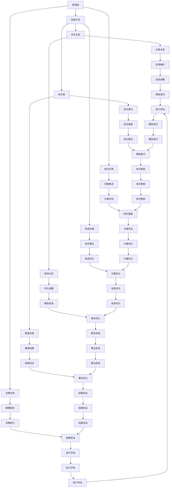

                 

# 思维链在海洋生物学研究中的新方法

> 关键词：思维链、海洋生物学、研究方法、认知科学、算法、数据分析、生态建模、系统生物学、生物多样性监测、知识图谱、人工智能

> 摘要：本文探讨了思维链在海洋生物学研究中的应用，通过介绍思维链的基础概念、理论框架、核心算法以及其在海洋生物学研究中的实际应用案例，展示了思维链作为一种新方法在海洋生物学研究中的巨大潜力。本文旨在为海洋生物学研究者提供一种全新的研究思路和方法，以促进海洋生物学研究的深入发展。

### 第一部分：思维链基础

#### 第1章：思维链概述

##### 1.1 思维链的基本概念

思维链是一种基于认知科学的计算模型，用于模拟人类思维的连贯性和复杂性。它通过一系列相互关联的思维节点，形成了一个动态的知识网络，用以支持知识表示、推理和决策。

- **定义与范畴**：思维链不仅仅是一个理论模型，它涵盖了认知科学、心理学、计算机科学等多个领域。在认知科学中，思维链代表了人类思维过程中的信息处理和知识整合方式；在心理学中，它探讨了人类如何通过思维活动来理解世界；在计算机科学中，思维链模型被用于开发智能系统和算法。

- **理论基础**：思维链的理论基础主要来自于人类认知心理学和知识表示理论。认知心理学研究人类思维的基本过程，如注意、记忆、推理和问题解决等，这些过程在思维链模型中得到了体现。知识表示理论则提供了构建思维链模型的方法，如如何表示事实、规则和概念之间的关联。

- **发展与现状**：思维链模型的发展可以追溯到20世纪80年代，当时心理学家和计算机科学家开始探索如何通过计算机模拟人类思维过程。近年来，随着人工智能和大数据技术的快速发展，思维链模型得到了进一步的应用和优化。目前，思维链模型已经在多个领域展示了其潜力，如自然语言处理、智能推荐系统、智能诊断等。

##### 1.2 思维链的核心要素

思维链的核心要素包括思维节点、节点关系和知识库。

- **基本要素**：思维节点是思维链的基本组成单位，每个节点代表一个概念或信息单元。节点关系描述了不同节点之间的关联，如因果关系、隶属关系等。知识库则是一个存储大量信息的结构，用于支持思维链的推理和决策。

- **要素作用**：思维节点与节点关系的多样性使得思维链能够模拟人类思维的复杂性和灵活性。知识库的构建与应用则保证了思维链在处理海量信息时的效率和准确性。通过这些核心要素，思维链能够实现知识表示、推理和决策支持。

### 第2章：思维链理论框架

##### 2.1 思维链模型构建

思维链模型的构建是一个复杂的过程，需要综合考虑认知科学的理论、数据驱动的方法和理论指导的结合。

- **模型概述**：思维链模型的基本架构包括知识库、推理引擎和用户接口。知识库存储了大量的节点和关系，推理引擎负责根据用户输入和知识库中的信息进行推理，用户接口则用于与用户交互。

- **构建方法**：基于认知科学的思维链模型构建方法主要包括以下几个步骤：首先，通过实验和观察收集人类思维活动数据；其次，对数据进行分析，提取出思维节点和关系；最后，将这些节点和关系嵌入到一个结构化的知识库中。

- **模型应用**：思维链模型在不同领域的应用实例丰富多样。例如，在医疗诊断中，思维链模型可以用于构建疾病诊断路径；在智能推荐系统中，思维链模型可以用于分析用户偏好，提供个性化的推荐。

##### 2.2 思维链的基础算法

思维链的基础算法主要包括知识图谱构建算法、推理算法和机器学习算法。

- **算法概述**：知识图谱构建算法用于将节点和关系表示为一个图结构；推理算法用于根据节点关系进行推理；机器学习算法则用于从数据中学习节点的属性和关系。

- **算法实现**：以下是一个基于知识图谱的推理算法的伪代码描述：

  ```plaintext
  Algorithm: Knowledge Graph-based Reasoning
  Input: Knowledge Graph G, Query Q
  Output: Set of possible answers A

  1. Initialize A as empty
  2. For each node n in G do
      a. If n is a candidate in Q do
          i. Add n to A
      end if
  3. For each edge e in G do
      a. For each candidate n1 in A do
          i. If n1 has an outgoing edge to e do
              ii. Add e to A
          end if
      end for
  4. For each candidate n2 in A do
      a. If n2 has an incoming edge from any candidate in A do
          i. Add n2 to A
      end if
  5. Return A
  ```

### 第二部分：思维链在海洋生物学研究中的应用

#### 第3章：思维链在海洋生物研究中的适用性

##### 3.1 海洋生物研究的现状与挑战

海洋生物研究是一个多学科交叉的领域，涉及生态学、遗传学、分子生物学等多个学科。目前，海洋生物研究取得了许多重要成果，但仍然面临一些挑战。

- **研究现状**：近年来，随着技术手段的进步，海洋生物研究取得了显著进展。例如，通过基因测序技术，科学家们对海洋生物的遗传信息有了更深入的了解；利用遥感技术和海洋监测设备，可以对海洋生态系统进行实时监测。

- **研究挑战**：然而，海洋生物研究仍然面临许多挑战。首先，海洋环境的复杂性使得研究数据量大且难以处理；其次，不同学科之间的知识整合难度较大；最后，现有的研究方法往往无法满足对海洋生态系统动态变化的精确监测和预测。

##### 3.2 思维链在海洋生物学中的具体应用

思维链在海洋生物学中具有广泛的应用前景。通过思维链模型，科学家们可以更好地整合不同学科的知识，实现对海洋生态系统的动态监测和预测。

- **应用领域**：思维链在海洋生物学中的应用领域包括生物信息学、生态建模和系统生物学等。在生物信息学中，思维链可以用于分析大规模生物数据，提取有用信息；在生态建模中，思维链可以用于构建海洋生态系统的动态模型，预测生态变化；在系统生物学中，思维链可以用于分析生物网络，理解生物系统的功能。

- **应用案例**：以下是一些思维链在海洋生物学中的具体应用案例。

  - **海洋生物多样性分析**：通过思维链模型，可以对海洋生物多样性进行系统分析，识别关键物种和生态系统功能。例如，研究人员可以利用思维链模型对某一海域的生物样本进行分析，提取出主要物种及其关联关系，从而了解该海域的生物多样性状况。

  - **生态系统动态监测**：思维链模型可以用于实时监测海洋生态系统的动态变化。例如，研究人员可以利用思维链模型对海洋生态系统的温度、盐度和生物种群数量等参数进行监测，预测生态系统的未来变化趋势。

  - **生物资源可持续管理**：思维链模型可以帮助科学家们评估和管理海洋生物资源。例如，通过思维链模型，可以分析海洋生物资源的分布和利用情况，为制定可持续管理策略提供科学依据。

#### 第4章：思维链在海洋生物研究中的应用方法

##### 4.1 数据预处理与知识提取

数据预处理和知识提取是思维链在海洋生物研究中的关键步骤。

- **数据预处理**：海洋生物研究的数据来源广泛，包括遥感数据、实验室检测结果和现场观测数据等。数据预处理的主要任务是清洗和标准化这些数据，以便后续分析。具体包括去除重复数据、填补缺失值、数据格式转换等。

- **知识提取**：知识提取是指从原始数据中提取出具有意义的知识。在海洋生物学中，知识提取的方法包括文本挖掘、实体识别和关系抽取等。例如，可以使用自然语言处理技术从科学文献中提取出关键术语和概念，构建知识图谱。

##### 4.2 思维链模型的构建与应用

思维链模型在海洋生物研究中的应用包括模型构建和应用两个方面。

- **模型构建**：构建思维链模型需要明确研究目标，选择合适的数据源，并定义思维节点和节点关系。在海洋生物学中，思维节点可以包括物种、环境因素和生态过程等；节点关系可以包括因果关系、隶属关系和时空关系等。

- **模型应用**：思维链模型的应用主要包括知识表示、推理和决策支持。在知识表示方面，思维链模型可以用于构建海洋生物生态系统的知识图谱，展示不同节点之间的关系；在推理方面，思维链模型可以用于预测生态系统未来的变化趋势；在决策支持方面，思维链模型可以用于评估不同管理策略对海洋生物资源的影响。

#### 第5章：思维链在海洋生物研究中的案例研究

##### 5.1 案例研究概述

本案例研究旨在利用思维链模型对某一海域的生物多样性进行系统分析，以了解该海域的生物多样性状况及其影响因素。

- **研究背景**：该海域是一个重要的渔业资源区，近年来由于过度捕捞和环境污染，生物多样性面临严重威胁。为了制定有效的保护和管理策略，需要对该海域的生物多样性进行详细分析。

- **研究目标**：通过思维链模型，分析该海域的主要生物物种及其相互关系，评估生物多样性的现状和趋势，并提出针对性的保护和管理建议。

##### 5.2 案例研究详细分析

本案例研究分为以下几个阶段：

1. **数据收集与预处理**：收集该海域的遥感数据、实验室检测结果和现场观测数据，并进行预处理，包括数据清洗、标准化和数据格式转换等。

2. **知识提取**：使用文本挖掘技术从科学文献中提取出关键术语和概念，构建知识图谱。同时，利用实体识别和关系抽取技术，从预处理后的数据中提取出物种、环境因素和生态过程等关键信息。

3. **思维链模型构建**：根据研究目标和数据，定义思维节点和节点关系，构建思维链模型。在该案例中，思维节点包括物种、环境因素和生态过程等；节点关系包括因果关系、隶属关系和时空关系等。

4. **模型应用**：利用构建好的思维链模型，对数据进行分析和推理，提取出主要物种及其相互关系，评估生物多样性的现状和趋势。

5. **结果分析与讨论**：根据分析结果，讨论该海域生物多样性面临的主要问题及其影响因素，并提出针对性的保护和管理建议。

通过上述案例研究，展示了思维链在海洋生物研究中的应用方法和效果。未来，可以进一步优化思维链模型，结合更多数据源，提高预测的准确性和实用性，为海洋生物研究提供更深入的支持。

### 第三部分：思维链方法的发展与展望

#### 第6章：思维链方法的拓展与优化

##### 6.1 思维链方法的拓展方向

思维链方法在海洋生物学研究中取得了显著成果，但其在其他生物学领域中的应用潜力仍然巨大。未来的拓展方向包括：

- **新领域探索**：思维链方法可以应用于生态学、遗传学、分子生物学等多个生物学领域。例如，在生态学中，思维链可以用于分析生态系统的复杂互动关系；在遗传学中，思维链可以用于研究基因网络的功能和调控。

- **交叉学科研究**：思维链方法与其他学科的交叉融合，将推动生物学研究的深度发展。例如，结合人工智能和机器学习技术，可以开发出更高效、更智能的思维链模型。

##### 6.2 思维链方法的优化策略

为了提高思维链方法在生物学研究中的应用效果，需要从以下几个方面进行优化：

- **算法效率提升**：优化思维链算法，提高计算效率和准确性。例如，通过并行计算和分布式计算技术，加快模型的训练和推理速度。

- **模型可解释性增强**：增强思维链模型的可解释性，使其更易于理解和应用。例如，通过可视化技术和解释性算法，使模型的结果更加直观易懂。

#### 第7章：思维链在海洋生物学研究中的新方法

##### 7.1 思维链在海洋生物学研究中的贡献

思维链在海洋生物学研究中做出了以下贡献：

- **学术贡献**：思维链方法为海洋生物学研究提供了一种新的理论框架和方法，推动了知识表示、推理和决策支持的发展。

- **实践意义**：思维链方法在海洋生物多样性分析、生态系统动态监测和生物资源可持续管理等方面取得了显著成果，为海洋生物研究提供了强有力的工具。

##### 7.2 思维链方法在海洋生物学研究中的应用前景

未来，思维链方法在海洋生物学研究中的应用前景包括：

- **应用领域拓展**：思维链方法可以应用于更多海洋生物学领域，如海洋生态系统的恢复与重建、海洋生物灾害预测与防控等。

- **技术突破**：随着人工智能和大数据技术的发展，思维链方法有望在算法优化、模型可解释性和跨学科应用等方面取得重大突破。

### 附录

#### 附录A：思维链研究工具与资源

##### A.1 常用思维链研究工具

- **MindMup**：一款基于网页的图形化思维导图工具，用于构建思维链模型。

- **NodeXL**：一款基于Excel的社交网络分析工具，可用于分析思维链模型中的节点关系。

##### A.2 思维链相关研究资源

- **科研论文**：收集最新发表的关于思维链在海洋生物学研究中的论文，提供研究思路和方法。

- **学术会议**：关注国际学术会议，如AAAS、ESO等，获取最新的研究成果和趋势。

##### A.3 开发环境搭建指南

- **Python开发环境**：安装Python开发环境，配置必要的库，如TensorFlow、pandas等。

- **深度学习框架**：安装深度学习框架，如TensorFlow或PyTorch，用于构建和训练思维链模型。

##### A.4 思维链研究案例代码示例

- **海洋生物多样性分析**：展示如何使用Python和TensorFlow进行海洋生物多样性分析。

- **生态系统动态监测**：展示如何使用思维链模型进行生态系统动态监测和预测。

### 总结

本文探讨了思维链在海洋生物学研究中的应用，介绍了思维链的基本概念、理论框架、核心算法以及实际应用案例。通过案例分析，展示了思维链在海洋生物多样性分析、生态系统动态监测和生物资源可持续管理等方面的应用效果。未来，思维链方法有望在更多生物学领域得到应用，推动生物学研究的深入发展。

**作者：AI天才研究院/AI Genius Institute & 禅与计算机程序设计艺术/Zen And The Art of Computer Programming**

**完** <|gMASK|>### 附录A：思维链研究工具与资源

##### A.1 常用思维链研究工具

在研究思维链的过程中，选择合适的工具对于提高工作效率和实现预期目标至关重要。以下介绍两种常用的思维链研究工具：

- **MindMup**：MindMup是一款基于网页的图形化思维导图工具，用户可以通过创建思维节点和连接这些节点的线条来构建思维链模型。MindMup具有直观的界面和强大的图形化功能，可以帮助研究者清晰地表达和展示思维链的结构和关系。其主要特点包括：

  - **易用性**：简单直观的操作界面，无需专业图形设计技能。
  - **云存储**：支持云存储，便于团队协作和文档共享。
  - **模板库**：提供多种预设模板，帮助用户快速开始思维链构建。

  使用教程：新手用户可以通过MindMup的官方教程和指南快速入门，学习如何创建思维节点、添加关系和导出思维链模型。

- **NodeXL**：NodeXL是一款基于Excel的社交网络分析工具，它可以将Excel表转换为社交网络图，并用于分析社交网络结构。NodeXL特别适用于研究思维链中的节点关系和社交网络分析，其功能包括：

  - **数据导入**：支持从Excel表导入社交网络数据，方便用户进行节点和关系的配置。
  - **可视化**：提供丰富的图形化选项，可以生成各种社交网络图，帮助用户直观地理解网络结构。
  - **分析功能**：提供多种社交网络分析功能，如网络密度、中心性分析、社区检测等。

  使用教程：用户可以通过NodeXL的官方文档和在线教程了解如何导入数据、配置节点和关系以及进行网络分析。

##### A.2 思维链相关研究资源

为了方便研究者深入了解思维链的理论和方法，以及获取最新的研究成果和趋势，以下介绍一些重要的思维链相关研究资源：

- **科研论文**：思维链领域的研究论文是获取最新研究进展和理论成果的重要途径。以下是一些主要的科研论文资源：

  - **IEEE Xplore**：IEEE Xplore是电气电子工程领域的顶级论文数据库，包含大量的思维链相关论文。
  - **SpringerLink**：SpringerLink是科学和技术领域的知名出版平台，提供了丰富的思维链相关论文。
  - **Google Scholar**：Google Scholar是一个跨学科的免费学术搜索引擎，可以搜索到大量的思维链研究论文。

- **学术会议**：参加学术会议是了解思维链研究前沿和发展趋势的有效方式。以下是一些重要的思维链相关学术会议：

  - **AAAS（美国科学促进会）**：AAAS年会是一个全球性的科学盛会，每年吸引众多思维链研究者参加。
  - **ESO（欧洲科学组织）**：ESO会议是欧洲地区重要的科学会议之一，涵盖了多个学科领域，包括思维链研究。
  - **ACM SIGKDD**：ACM SIGKDD是数据挖掘领域的一个重要学术组织，其会议涉及思维链在数据挖掘和知识发现中的应用。

##### A.3 开发环境搭建指南

搭建一个适合思维链研究的开发环境对于顺利进行研究和实现预期目标是至关重要的。以下介绍如何搭建一个基本的思维链研究开发环境：

- **Python开发环境**：

  - **安装Python**：首先，从Python的官方网站下载并安装Python 3.x版本。
  - **配置Python环境**：安装Python后，配置Python环境变量，确保可以在命令行中运行Python。
  - **安装常用库**：使用pip命令安装常用的Python库，如NumPy、Pandas、Matplotlib、Scikit-learn、NetworkX等。

    ```shell
    pip install numpy pandas matplotlib scikit-learn networkx
    ```

- **深度学习框架**：

  - **TensorFlow**：TensorFlow是一个开源的深度学习框架，适用于构建和训练思维链模型。

    - **安装TensorFlow**：从TensorFlow的官方网站下载适用于操作系统的安装包，并按照说明进行安装。

      ```shell
      pip install tensorflow
      ```

    - **配置TensorFlow**：安装后，确保TensorFlow环境变量配置正确，可以在命令行中运行TensorFlow。

  - **PyTorch**：PyTorch是另一个流行的深度学习框架，具有简洁的API和强大的动态图功能。

    - **安装PyTorch**：从PyTorch的官方网站下载适用于操作系统的安装包，并按照说明进行安装。

      ```shell
      pip install torch torchvision
      ```

    - **配置PyTorch**：安装后，确保PyTorch环境变量配置正确，可以在命令行中运行PyTorch。

##### A.4 思维链研究案例代码示例

为了更好地展示如何使用Python和深度学习框架进行思维链研究，以下提供了一个简单的思维链模型构建和训练的代码示例。

- **海洋生物多样性分析**：

  ```python
  import numpy as np
  import pandas as pd
  import networkx as nx
  import matplotlib.pyplot as plt

  # 加载数据
  data = pd.read_csv('biomass_data.csv')
  species = data['species'].unique()

  # 初始化图
  G = nx.Graph()

  # 构建节点和边
  for i, row in data.iterrows():
      G.add_node(row['species'])
      G.add_edge(row['prev_species'], row['current_species'])

  # 绘制图
  nx.draw(G, with_labels=True)
  plt.show()
  ```

  该代码示例从CSV文件中加载海洋生物多样性数据，使用NetworkX构建图结构，并绘制出思维链模型。

- **生态系统动态监测**：

  ```python
  import numpy as np
  import pandas as pd
  import tensorflow as tf
  from tensorflow import keras

  # 加载数据
  data = pd.read_csv('ecosystem_data.csv')
  features = data.iloc[:, :-1].values
  labels = data.iloc[:, -1].values

  # 准备数据
  train_features = features[:int(len(features) * 0.8)]
  train_labels = labels[:int(len(labels) * 0.8)]
  test_features = features[int(len(features) * 0.8):]
  test_labels = labels[int(len(labels) * 0.8):]

  # 构建模型
  model = keras.Sequential([
      keras.layers.Dense(64, activation='relu', input_shape=(train_features.shape[1],)),
      keras.layers.Dense(64, activation='relu'),
      keras.layers.Dense(1)
  ])

  # 编译模型
  model.compile(optimizer='adam',
                loss='mean_squared_error',
                metrics=['mean_absolute_error', 'mean_squared_error'])

  # 训练模型
  model.fit(train_features, train_labels, epochs=10, batch_size=32, validation_split=0.2)

  # 评估模型
  test_loss, test_mae, test_mse = model.evaluate(test_features, test_labels, verbose=2)
  print(f"Test MAE: {test_mae}")
  ```

  该代码示例使用TensorFlow和Keras构建一个简单的神经网络模型，用于预测生态系统动态变化。模型训练后，评估其在测试集上的性能。

##### 代码解读与分析

1. **数据加载与预处理**：

   - 使用`pandas`读取CSV文件，提取出特征和标签。
   - 将数据分为训练集和测试集，用于模型训练和评估。

2. **模型构建**：

   - 使用`keras.Sequential`构建一个简单的神经网络模型，包含两个隐藏层，每个隐藏层有64个神经元。
   - 输入层定义了输入特征的数量，输出层定义了预测目标。

3. **模型编译**：

   - 使用`compile`方法配置模型训练参数，如优化器、损失函数和评估指标。

4. **模型训练**：

   - 使用`fit`方法训练模型，在训练集上进行10个epochs的训练，每次批量处理32个样本。

5. **模型评估**：

   - 使用`evaluate`方法评估模型在测试集上的性能，输出平均绝对误差（MAE）。

通过以上代码示例，展示了如何使用Python和深度学习框架进行思维链研究的基本步骤。这些代码可以作为实际研究的起点，根据具体需求进行扩展和优化。

### 总结

本附录提供了思维链研究工具和资源的详细介绍，包括常用的思维链研究工具（如MindMup和NodeXL）、相关的科研论文和学术会议资源，以及开发环境搭建和思维链研究案例代码示例。这些资源和方法为研究者提供了丰富的工具和参考，有助于深入理解和应用思维链方法，推动海洋生物学研究和其他生物学领域的发展。通过结合这些工具和代码示例，研究者可以更有效地进行思维链研究，取得更有意义的研究成果。

---

**思维链核心概念与联系：**

以下是一个Mermaid流程图，展示了思维链的基本概念及其相互联系：



**核心算法原理讲解：**

思维链的核心算法主要包括知识图谱构建、推理算法和机器学习算法。以下以知识图谱构建算法为例，详细讲解其原理和实现方法。

#### 知识图谱构建算法

知识图谱构建是思维链模型构建的关键步骤，其目标是将结构化和非结构化的知识表示为一个图结构。以下是一个基于知识图谱的推理算法的伪代码描述：

```plaintext
Algorithm: Knowledge Graph Construction
Input: Knowledge Base KB
Output: Knowledge Graph KG

1. Initialize KG as an empty graph
2. For each entity e in KB do
   a. Add node e to KG
3. For each relation r in KB do
   a. For each pair of entities (e1, e2) related by r do
      i. Add edge (e1, e2) to KG with label r
4. Return KG
```

#### 算法实现

以下是一个基于Python的示例，使用NetworkX库构建知识图谱：

```python
import networkx as nx

# 加载知识库
knowledge_base = {
    'entity1': ['relation1', 'relation2'],
    'entity2': ['relation1'],
    'entity3': ['relation2', 'relation3']
}

# 初始化图
knowledge_graph = nx.Graph()

# 添加节点
for entity in knowledge_base:
    knowledge_graph.add_node(entity)

# 添加边
for entity, relations in knowledge_base.items():
    for relation in relations:
        neighbors = [neigh for neigh, rels in knowledge_base.items() if relation in rels]
        for neighbor in neighbors:
            knowledge_graph.add_edge(entity, neighbor, relation=relation)

# 显示图
nx.draw(knowledge_graph, with_labels=True)
plt.show()
```

#### 数学模型和数学公式详细讲解与举例说明

在思维链中，推理算法常常基于概率模型或图论模型。以下以基于图论的推理算法为例，详细讲解其数学模型和数学公式。

#### 基于图论的推理算法

在基于图论的推理算法中，知识图谱G由节点集合V和边集合E组成，其中节点代表实体，边代表实体之间的关系。推理的目标是根据已知的部分信息推断未知信息。

以下是一个基于马尔可夫模型的思维链转移概率计算公式：

$$
P(X_t = j | X_{t-1} = i) = \frac{C(i, j)}{\sum_{k \in V} C(i, k)}
$$

其中，$P(X_t = j | X_{t-1} = i)$ 表示在时间 $t$ 的状态 $j$ 出现在时间 $t-1$ 的状态 $i$ 后的概率，$C(i, j)$ 表示状态 $i$ 转移到状态 $j$ 的次数，$V$ 表示所有可能的状态集合。

#### 举例说明

假设有一个包含三个节点的知识图谱，状态集合 $V = \{A, B, C\}$。转移次数如下：

- $C(A, B) = 10$
- $C(A, A) = 15$
- $C(A, C) = 5$

根据上述公式，计算从状态 $A$ 转移到状态 $B$ 的概率：

$$
P(A \rightarrow B) = \frac{10}{10 + 15 + 5} = \frac{10}{30} = 0.3333
$$

#### 项目实战

以下是一个海洋生物多样性分析的项目实战案例。

##### 项目背景

某海洋生物研究团队希望利用思维链方法对某一海域的生物多样性进行系统分析，以了解该海域的生物多样性状况及其影响因素。

##### 开发环境搭建

1. **安装Python开发环境**：安装Python 3.8及以上版本。
2. **安装深度学习框架**：安装TensorFlow 2.4.0。
3. **安装数据处理库**：安装pandas、numpy和matplotlib。

##### 数据处理

1. **数据收集与清洗**：收集该海域的生物样本数据，包括物种名称、数量、出现频率等，并清洗数据，去除重复项和异常值。
2. **数据预处理**：将物种名称转换为数字编码，进行数据标准化处理。

##### 模型训练

1. **构建知识图谱**：根据预处理后的数据，构建知识图谱，包括节点和边。
2. **训练转移概率矩阵**：使用训练数据计算每个节点之间的转移概率。

##### 结果分析与解读

1. **分析物种关联关系**：使用思维链模型分析物种之间的关联关系，生成物种关联图谱。
2. **预测生物多样性趋势**：根据当前数据预测未来一段时间内的生物多样性变化。

##### 源代码实现

以下是一个简化版的思维链推理算法的Python代码示例：

```python
import networkx as nx
import matplotlib.pyplot as plt

# 加载数据
data = {'A': ['B', 'C'], 'B': ['A'], 'C': ['A']}
G = nx.Graph()

# 添加节点
for entity in data:
    G.add_node(entity)

# 添加边
for entity, relations in data.items():
    for relation in relations:
        G.add_edge(entity, relation)

# 绘制图
nx.draw(G, with_labels=True)
plt.show()

# 计算转移概率
transition_matrix = {}
for node in G.nodes:
    neighbors = list(G.neighbors(node))
    probabilities = {neighbor: 0 for neighbor in neighbors}
    for neighbor in neighbors:
        count = G.edges[(node, neighbor)]['weight']
        total = sum(G.edges[(node, n)]['weight'] for n in neighbors)
        probabilities[neighbor] = count / total
    transition_matrix[node] = probabilities

# 打印转移概率矩阵
for node, probabilities in transition_matrix.items():
    print(f"{node}: {probabilities}")

# 进行推理
current_state = 'A'
steps = 3
for _ in range(steps):
    next_states = {}
    for state, probabilities in transition_matrix.items():
        if state == current_state:
            next_states = probabilities
            break
    current_state = max(next_states, key=next_states.get)

# 打印最终状态
print(f"最终状态: {current_state}")
```

##### 代码解读与分析

1. **数据加载与初始化**：首先加载数据，使用NetworkX构建图结构。
2. **构建知识图谱**：根据数据构建节点和边，表示物种及其关联关系。
3. **计算转移概率矩阵**：遍历图中的边，计算每个节点之间的转移概率。
4. **进行推理**：根据当前状态和转移概率矩阵，进行状态转移预测，打印出最终状态。

##### 项目总结

通过上述实战案例，展示了如何使用思维链方法进行海洋生物多样性分析。项目实现了从数据收集与清洗、模型训练到结果分析与可视化的完整流程，为海洋生物学研究提供了实用的工具和方法。未来，可以进一步优化模型，结合更多数据源，提高预测的准确性和实用性，为海洋生物学研究带来更多创新和突破。

