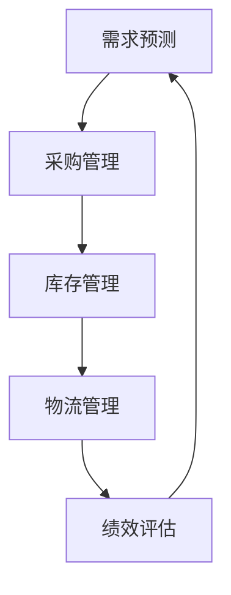

                 

### 第1章：智能供应链的基本概念与架构

#### 1.1 智能供应链的定义与重要性

智能供应链（Intelligent Supply Chain）是利用先进的信息技术、大数据分析、人工智能和物联网等手段，实现供应链的自动化、可视化和智能化管理。它不仅涵盖了传统的采购、生产、仓储和物流等环节，还通过信息流的整合，使得各环节之间能够高效协同，从而提升供应链的整体效率和响应速度。

智能供应链的重要性在于它能够显著降低企业的运营成本，提高供应链的透明度和可靠性，从而增强企业的市场竞争力。以下是智能供应链的几个关键优势：

- **成本优化**：通过精确的需求预测和采购策略，减少库存成本和缺货风险，提高资金使用效率。
- **效率提升**：自动化和智能化的流程管理，缩短订单处理和交付时间，提高整体运作效率。
- **风险控制**：通过实时监控和数据分析，及时发现并应对供应链中的潜在问题，降低供应链风险。
- **协同优化**：各环节信息共享和协同作业，实现供应链的全流程优化，提升整体服务水平。

#### 1.2 智能供应链的架构与主要组成部分

智能供应链的架构由四个主要组成部分构成：信息流、物流流、资金流和服务流。这些组成部分相互关联，共同构成了一个完整的智能供应链系统。

1. **信息流**：信息流是智能供应链的核心，它涵盖了从市场需求预测、采购计划、生产进度、库存管理到物流配送等所有信息传输和处理过程。通过大数据分析和人工智能技术，可以实现对供应链各环节的实时监控和动态调整。

2. **物流流**：物流流是智能供应链的物理实现，包括仓储、运输、配送等物流环节。通过物联网技术和自动化设备，可以提高物流作业的效率和质量。

3. **资金流**：资金流是供应链中价值传递的媒介，涉及采购付款、库存融资、物流费用结算等。智能供应链通过优化资金流，实现资金的快速流转和高效利用。

4. **服务流**：服务流是智能供应链的重要组成部分，包括客户服务、售后支持等。通过智能化服务系统，可以提供更加个性化和高效的服务，提升客户满意度。

#### 1.3 智能供应链的技术基础

智能供应链的实现离不开以下几个关键技术的支持：

1. **大数据分析**：通过收集和分析大量的供应链数据，可以揭示供应链中的潜在问题和优化机会，从而实现精准预测和决策。

2. **人工智能**：利用机器学习、深度学习等技术，可以自动化处理大量的供应链数据，实现智能化的预测、规划和优化。

3. **物联网技术**：通过物联网设备，可以实现供应链各环节的实时监控和数据采集，提高供应链的透明度和可追溯性。

4. **云计算技术**：云计算提供了强大的计算和存储能力，使得供应链管理系统能够快速响应和处理大量的数据。

#### 1.4 智能供应链的发展趋势

智能供应链正朝着更加智能化、自动化和协同化的方向发展。以下是智能供应链的未来发展方向和趋势：

1. **智能化升级**：通过引入更多的人工智能技术，实现供应链的自主学习和优化。

2. **数字化融合**：将更多数字化技术融入供应链管理，实现供应链的全面数字化。

3. **跨界合作**：供应链各环节之间的跨界合作将成为趋势，通过协同优化，提升供应链的整体效率。

4. **绿色供应链**：随着环境问题的日益突出，绿色供应链将成为重要的发展方向，通过环保技术和绿色管理，实现供应链的可持续发展。

5. **全球化扩展**：随着全球化进程的加速，智能供应链将在全球范围内扩展，实现跨国供应链的协同优化。

#### 1.5 智能供应链的创新应用场景

智能供应链的创新应用场景广泛，以下是一些典型的应用场景：

1. **智能制造**：通过智能供应链与智能制造的结合，实现生产计划与物料供应的协同，提高生产效率和灵活性。

2. **智慧物流**：利用物联网技术和大数据分析，实现物流运输的智能化和高效化。

3. **供应链金融**：通过智能供应链平台，实现供应链中各环节的融资和风险管理。

4. **智慧零售**：通过智能供应链与零售业务的深度融合，实现供应链与消费市场的实时互动和响应。

#### 1.6 智能供应链面临的挑战与机遇

智能供应链的发展虽然带来了诸多机遇，但也面临着一系列挑战：

1. **技术挑战**：智能供应链的实现需要强大的技术支持，如何整合各种新技术，实现技术落地是一个重要挑战。

2. **数据挑战**：供应链数据量大且复杂，如何有效地收集、存储和处理这些数据，是一个重要的技术难题。

3. **人才挑战**：智能供应链的发展需要大量的专业人才，如何培养和引进人才是一个重要的挑战。

4. **信息安全**：随着数据在网络中的流转，信息安全问题日益突出，如何保障供应链数据的安全是一个重要的挑战。

综上所述，智能供应链是现代企业管理中不可或缺的一部分，它通过先进的信息技术，实现了供应链的全面智能化，为企业的运营管理带来了巨大的变革。在未来，随着技术的不断进步，智能供应链将进一步优化和升级，为企业的可持续发展提供强大支持。

### 第2章：精准采购的核心技术与方法

#### 2.1 采购需求分析

采购需求分析是精准采购的第一步，它是基于对市场需求和企业内部需求的双重考虑，以科学的方法来确定采购物资的种类、数量、质量和时间。以下是采购需求分析的核心内容：

##### 2.1.1 采购需求的特点

采购需求具有以下几个显著特点：

- **多样性**：企业的运营过程中，会涉及到各种不同类型和规格的物资，因此采购需求具有多样性。
- **动态性**：市场需求和企业内部需求都是不断变化的，因此采购需求也需要实时调整。
- **不确定性**：市场需求的不确定性和企业内部需求的波动性，使得采购需求存在一定的不可预测性。
- **重要性**：采购需求直接影响到企业的生产运营和供应链的稳定性，因此其重要性不容忽视。

##### 2.1.2 采购需求的收集方法

为了确保采购需求的准确性和完整性，企业需要采用多种方法收集采购需求，以下是几种常见的收集方法：

- **访谈法**：通过与各部门负责人和业务人员进行访谈，了解他们的具体需求和预期。
- **问卷调查法**：通过设计问卷，向相关部门和员工收集采购需求，问卷可以设计成在线或离线形式。
- **数据分析法**：通过分析历史销售数据、库存数据和订单数据，预测未来的采购需求。
- **市场调研法**：通过对市场进行调研，了解同类产品的需求和价格趋势，为采购决策提供参考。

##### 2.1.3 采购需求的分类与优先级排序

采购需求可以根据不同的标准进行分类，常见的分类方法有：

- **按物资类型分类**：将采购需求按物资类型分为原材料、零部件、设备等类别。
- **按需求紧急程度分类**：将采购需求按紧急程度分为紧急需求、正常需求和长期需求。
- **按采购金额分类**：将采购需求按采购金额分为大额采购、中额采购和小额采购。

在分类的基础上，需要对采购需求进行优先级排序，以确保关键物资能够及时采购。常见的排序方法有：

- **紧急程度排序法**：根据需求的紧急程度进行排序，优先采购紧急物资。
- **重要性排序法**：根据物资对企业运营的重要程度进行排序，优先采购关键物资。
- **成本效益排序法**：根据采购物资的采购成本和采购金额进行排序，优先采购成本效益较高的物资。

#### 2.2 供应商选择与评估

供应商选择是采购管理中至关重要的一环，它直接关系到采购成本、产品质量和供应链的稳定性。以下是供应商选择与评估的核心内容：

##### 2.2.1 供应商选择的准则

在供应商选择过程中，企业需要综合考虑多个因素，以下是一些常见的供应商选择准则：

- **质量**：供应商提供的产品质量是选择供应商的首要因素，企业需要确保供应商的产品能够满足质量标准。
- **价格**：价格是采购决策的重要考虑因素，但不应是唯一的考虑因素，企业需要在质量、服务和价格之间进行权衡。
- **交货期**：供应商的交货期直接影响到企业的生产计划，企业需要选择能够按时交货的供应商。
- **服务**：供应商的服务水平包括技术支持、售后服务和响应速度等，优质的服务可以提高企业的运营效率。
- **规模**：供应商的规模和实力是企业选择供应商时需要考虑的因素，大型供应商通常具有更好的资源和技术支持。
- **信誉**：供应商的信誉是企业选择供应商时的重要考量，良好的信誉可以减少合作风险。

##### 2.2.2 供应商评估的方法

为了确保供应商选择的科学性和客观性，企业需要对供应商进行评估。以下是几种常见的供应商评估方法：

- **质量评估**：通过质量管理体系认证、产品抽样检验等方式，评估供应商的质量水平。
- **价格评估**：通过市场价格调查、供应商报价比较等方式，评估供应商的价格竞争力。
- **交货期评估**：通过订单跟踪、交货记录分析等方式，评估供应商的交货准时性。
- **服务评估**：通过客户反馈、售后服务调查等方式，评估供应商的服务水平。
- **综合评估**：通过上述各项评估指标，对供应商进行综合评估，确定最终的选择结果。

##### 2.2.3 供应商关系管理

供应商关系管理是确保供应链稳定性和可持续性的关键，以下是供应商关系管理的一些重要策略：

- **长期合作关系**：与优质供应商建立长期合作关系，通过合同约定保证双方的利益和长期合作。
- **协同优化**：与供应商共同优化生产流程和供应链管理，提高整体效率。
- **信息共享**：与供应商建立信息共享机制，实时共享需求计划、库存状况等关键信息，提高供应链的协同性。
- **绩效评估**：定期对供应商的绩效进行评估，根据评估结果进行调整和优化。
- **风险管理**：对供应商的潜在风险进行评估和监控，制定相应的风险应对措施。

#### 2.3 采购价格谈判

采购价格谈判是采购管理中的一项重要活动，它直接关系到企业的采购成本和盈利能力。以下是采购价格谈判的核心内容：

##### 2.3.1 采购价格谈判的策略

为了在采购价格谈判中取得有利的结果，企业需要制定合理的谈判策略。以下是几种常见的谈判策略：

- **信息策略**：在谈判前充分收集市场信息和供应商信息，为谈判提供有力的数据支持。
- **价格策略**：根据供应商的价格策略，制定相应的价格谈判策略，如高位报价、低位报价等。
- **关系策略**：建立和维护良好的供应商关系，通过互利合作，为价格谈判创造有利条件。
- **灵活策略**：在谈判过程中保持灵活性，根据谈判情况灵活调整谈判策略。

##### 2.3.2 采购价格谈判的技巧

有效的采购价格谈判需要一定的技巧和经验，以下是几种常见的谈判技巧：

- **开场策略**：在谈判开始时，保持友好和开放的态度，建立良好的沟通氛围。
- **提问技巧**：通过提问，了解供应商的报价依据和价格构成，为后续谈判提供依据。
- **倾听技巧**：在谈判过程中，认真倾听供应商的意见和需求，找到双方的共同点和利益点。
- **让步技巧**：在适当的时候做出让步，但要确保让步的幅度和节奏，避免过早或过快地做出让步。
- **闭场策略**：在谈判接近尾声时，总结谈判成果，明确协议内容，确保谈判结果能够落地执行。

##### 2.3.3 采购价格谈判的案例分析

以下是一个采购价格谈判的案例分析，通过案例可以看到采购价格谈判的实际操作过程和结果：

**案例背景**：某电子产品公司需要采购一批关键零部件，供应商报价为100元/个，公司希望将价格降低到90元/个。

**谈判过程**：

1. **信息收集**：公司通过对市场进行调查，发现同类零部件的平均价格为95元/个，同时了解到供应商的生产成本约为80元/个。

2. **开场策略**：公司在谈判开始时，表示对供应商的产品和服务非常满意，希望能够建立长期的合作关系。

3. **价格策略**：公司采用高位报价策略，首先报价为95元/个，以试探供应商的反应。

4. **谈判协商**：供应商表示价格可以接受，但希望能够再降5元/个。公司则提出希望在80元/个的价格上谈判。

5. **关系策略**：公司表示理解供应商的立场，并提出愿意在采购数量上做出调整，以换取价格优惠。

6. **灵活策略**：经过多次协商，双方最终达成共识，将价格定为90元/个，并约定采购数量为5000个。

**谈判结果**：公司成功将采购价格降低到90元/个，实现了成本优化，同时保持了良好的供应商关系。

#### 2.4 采购订单管理

采购订单管理是采购管理的核心环节，它涉及到采购订单的生成、审核、执行和跟踪。以下是采购订单管理的核心内容：

##### 2.4.1 采购订单的生成流程

采购订单的生成流程主要包括以下几个步骤：

1. **需求提出**：根据采购需求分析的结果，相关部门提出采购申请，明确采购物资的名称、规格、数量和质量要求。
2. **审批流程**：采购申请经过相关部门的审批，确保采购需求的合理性和必要性。
3. **供应商选择**：根据供应商评估结果，选择合适的供应商进行采购。
4. **订单生成**：采购部门根据审批通过的采购申请，生成采购订单，明确采购物资的名称、规格、数量、交货时间和交货地点等信息。
5. **订单审核**：采购订单需要经过相关部门的审核，确保采购订单的准确性和完整性。

##### 2.4.2 采购订单的审核与审批

采购订单的审核与审批是确保采购订单准确性和合规性的重要环节。以下是采购订单审核与审批的流程：

1. **部门审核**：采购订单首先由采购部门进行初步审核，确保订单的格式和内容符合要求。
2. **财务审核**：财务部门对采购订单的预算和资金安排进行审核，确保采购订单的财务合理性。
3. **法律审核**：法律部门对采购订单的合同条款和供应商资质进行审核，确保采购订单的合法性和合规性。
4. **高层审批**：采购订单需要经过公司高层的审批，确保采购决策的合法性和合理性。

##### 2.4.3 采购订单的跟踪与管理

采购订单的跟踪与管理是确保采购订单按时完成和采购物资按时交付的关键。以下是采购订单跟踪与管理的核心内容：

1. **订单跟踪**：采购部门需要对采购订单的执行情况进行实时跟踪，确保供应商按时交货。
2. **进度报告**：供应商需要定期向采购部门提供采购订单的执行进度报告，采购部门根据进度报告调整采购计划。
3. **质量检验**：采购部门在采购物资到货后，需要对物资的质量进行检验，确保物资符合质量要求。
4. **问题处理**：在采购订单执行过程中，如遇到问题，采购部门需要及时与供应商沟通和协调，解决采购订单执行中的问题。

#### 2.5 采购绩效评估

采购绩效评估是对采购管理效果进行全面评估的重要手段，它有助于发现采购管理中的问题和不足，为采购管理的持续改进提供依据。以下是采购绩效评估的核心内容：

##### 2.5.1 采购绩效评估的指标体系

采购绩效评估的指标体系是评估采购管理效果的重要工具，常见的采购绩效评估指标包括：

1. **采购成本**：采购成本是采购绩效评估的重要指标，通过计算采购总成本占销售收入的比例，可以评估采购成本的控制效果。
2. **采购周期**：采购周期是衡量采购效率的重要指标，通过计算从采购申请到物资到货的时间，可以评估采购周期的长短。
3. **供应商质量**：供应商质量是评估供应商能力的重要指标，通过分析供应商的交货准时性、产品质量和售后服务等，可以评估供应商的质量水平。
4. **采购成本节约**：采购成本节约是评估采购效益的重要指标，通过计算采购成本节约额，可以评估采购管理的经济效益。
5. **库存周转率**：库存周转率是评估库存管理效率的重要指标，通过计算库存周转次数，可以评估库存管理的水平。

##### 2.5.2 采购绩效评估的方法

采购绩效评估的方法包括定量评估和定性评估，以下是几种常见的采购绩效评估方法：

1. **定量评估法**：定量评估法是基于具体数据和指标进行的评估，如计算采购成本、采购周期、供应商质量等指标，通过数据比较和分析，评估采购管理的绩效。
2. **定性评估法**：定性评估法是基于专家判断和主观评价进行的评估，如通过问卷调查、访谈等方式，收集相关部门和员工对采购管理的意见和建议，评估采购管理的绩效。
3. **综合评估法**：综合评估法是将定量评估和定性评估相结合，通过数据分析和主观评价，全面评估采购管理的绩效。

##### 2.5.3 采购绩效评估的案例分析

以下是一个采购绩效评估的案例分析，通过案例可以看到采购绩效评估的实际操作过程和结果：

**案例背景**：某电子产品公司对上一财年的采购管理效果进行评估，希望通过评估发现问题和改进方向。

**评估过程**：

1. **数据收集**：采购部门收集了上一财年的采购数据，包括采购成本、采购周期、供应商质量等指标。
2. **数据分析**：采购部门使用数据分析工具，计算了采购成本、采购周期、供应商质量等指标，分析了采购管理的效果。
3. **问卷调查**：采购部门通过问卷调查，收集了相关部门和员工对采购管理的意见和建议，了解采购管理的实际效果。
4. **综合评估**：采购部门结合数据分析和问卷调查结果，对采购管理进行了综合评估。

**评估结果**：

- **采购成本**：采购成本占销售收入的比例为15%，较行业平均水平高5%，需要进一步降低采购成本。
- **采购周期**：采购周期为30天，较行业平均水平长10天，需要提高采购效率。
- **供应商质量**：供应商质量评分平均为85分，需要提高供应商质量，确保采购物资的质量。
- **采购效益**：采购成本节约额为100万元，较去年增长10%，采购效益较好。

**改进方向**：

- **降低采购成本**：通过市场调研和供应商谈判，进一步降低采购成本。
- **提高采购效率**：优化采购流程，缩短采购周期，提高采购效率。
- **提高供应商质量**：加强与供应商的合作，提高供应商的质量和可靠性。
- **持续改进**：通过定期评估和持续改进，不断提升采购管理的绩效。

通过采购绩效评估，公司可以及时发现采购管理中的问题和不足，为采购管理的持续改进提供依据，从而提高采购管理的整体水平。

### 第3章：库存管理的基本概念与策略

#### 3.1 库存管理的基本概念

库存管理是供应链管理的重要组成部分，它涉及到对企业库存物资的计划、控制、使用和处理。库存管理的目标是确保在满足生产需求和市场供应的前提下，最大限度地减少库存成本，提高库存周转率。

##### 3.1.1 库存的定义

库存是指企业为生产、销售等经营目的而储备的各种物资，包括原材料、零部件、成品、半成品等。库存的作用在于保障生产、降低缺货风险、平衡供需关系和调节生产周期。

##### 3.1.2 库存的作用

库存管理在企业运营中具有以下几个重要作用：

- **保障生产**：通过合理的库存管理，确保生产过程中所需的原材料、零部件等物资能够及时供应，避免生产中断。
- **降低缺货风险**：库存可以作为缓冲，降低市场需求波动对生产的冲击，减少缺货带来的损失。
- **平衡供需**：库存管理能够平衡生产和市场需求，确保企业能够及时满足市场供应。
- **调节生产周期**：库存管理可以调节生产周期，适应市场需求的变化，提高生产灵活性。

##### 3.1.3 库存的分类

库存可以根据不同的标准进行分类，常见的分类方法有：

- **按物资类型分类**：分为原材料库存、零部件库存、成品库存、半成品库存等。
- **按库存周期分类**：分为长期库存、中期库存和短期库存。
- **按库存状态分类**：分为在途库存、在库库存和倒库库存。
- **按库存目的分类**：分为生产库存、销售库存、安全库存和战略库存。

#### 3.2 库存管理的基本策略

库存管理的基本策略包括库存分类管理、按需采购策略和经济订货量（EOQ）策略等。

##### 3.2.1 ABC库存分类法

ABC库存分类法是一种基于物资价值和需求频率的库存分类方法，其核心思想是根据物资的重要性和需求程度，将库存物资分为A、B、C三类。

- **A类物资**：高价值、高需求频率的物资，通常占库存总量的10%，但占库存价值的70%。
- **B类物资**：中等价值、中等需求频率的物资，通常占库存总量的20%，但占库存价值的20%。
- **C类物资**：低价值、低需求频率的物资，通常占库存总量的70%，但占库存价值的10%。

通过ABC库存分类法，企业可以集中资源和精力管理重要的库存物资，提高库存管理效率。

##### 3.2.2 按需采购策略

按需采购策略是一种基于需求动态调整采购量的策略，其主要目的是减少库存成本和提高库存周转率。按需采购策略的关键在于精准预测需求，并根据需求的变化实时调整采购计划。

- **初始计算**：根据历史需求数据，计算平均需求量和标准差，确定初始采购量和安全库存量。
- **实际操作**：根据实时需求数据，动态调整采购量，确保库存水平保持在合理范围内。

按需采购策略的优点在于能够灵活应对市场需求变化，减少库存积压和缺货风险。

##### 3.2.3 经济订货量（EOQ）策略

经济订货量（EOQ）策略是一种基于库存成本最小化的采购策略，其核心思想是通过计算最佳订货量，实现库存成本的最小化。

EOQ的计算公式为：

$$
EOQ = \sqrt{\frac{2DS}{H}}
$$

其中，D表示年需求量，S表示每批次的订购成本，H表示每批次的持有成本。

EOQ策略的优点在于能够优化采购批次和库存成本，提高库存管理效率。

#### 3.3 库存控制方法

库存控制方法是确保库存水平合理的重要手段，常见的库存控制方法包括预测库存法、再订货点法和经济订货周期法。

##### 3.3.1 预测库存法

预测库存法是一种基于需求预测的库存控制方法，其核心思想是通过预测未来的需求量，调整库存水平。

- **预测需求**：根据历史需求数据和当前市场情况，预测未来的需求量。
- **调整库存**：根据预测的需求量，调整库存水平，确保库存量能够在需求和供应之间找到平衡。

##### 3.3.2 再订货点法

再订货点法是一种基于库存水平和订单量的库存控制方法，其核心思想是通过设定再订货点，触发采购订单的生成。

- **设定再订货点**：根据预测的需求量和供应周期，设定再订货点，当库存水平达到再订货点时，生成采购订单。
- **执行采购**：根据采购订单，执行采购，确保库存水平能够满足需求。

##### 3.3.3 经济订货周期法

经济订货周期法是一种基于订货周期和订货量的库存控制方法，其核心思想是通过计算最佳订货周期，实现库存成本的最小化。

- **计算订货周期**：根据需求量和供应周期，计算最佳订货周期。
- **执行订货**：按照最佳订货周期，定期执行采购，确保库存水平能够满足需求。

#### 3.4 库存优化方法

库存优化方法是提高库存管理效率和效益的重要手段，常见的库存优化方法包括库存水平的优化、库存周转率的优化和库存成本的优化。

##### 3.4.1 库存水平的优化

库存水平的优化是通过调整库存水平，实现库存成本和缺货风险的最小化。

- **动态调整**：根据需求变化和供应情况，动态调整库存水平，确保库存量保持在合理范围内。
- **ABC分类**：采用ABC库存分类法，对库存物资进行分类管理，重点控制A类物资的库存水平。

##### 3.4.2 库存周转率的优化

库存周转率的优化是通过提高库存周转速度，减少库存积压和资金占用。

- **精准预测**：通过需求预测和库存分析，提高库存周转的准确性。
- **按需采购**：采用按需采购策略，减少库存积压和缺货风险，提高库存周转率。

##### 3.4.3 库存成本的优化

库存成本的优化是通过降低库存成本，提高库存管理的经济效益。

- **优化采购**：通过优化采购策略，降低采购成本。
- **降低持有成本**：通过优化库存水平和管理方式，降低库存持有成本。

#### 3.5 库存管理的案例分析

以下是一个库存管理的成功案例分析，通过案例可以看到库存管理在实践中的应用和效果。

**案例背景**：某电子产品公司生产一种高需求的电子产品，由于市场需求波动较大，库存管理面临较大挑战。

**库存管理措施**：

1. **ABC库存分类**：采用ABC库存分类法，对库存物资进行分类管理，重点控制A类物资的库存水平。
2. **需求预测**：通过历史需求数据和当前市场情况，预测未来的需求量。
3. **按需采购**：采用按需采购策略，根据需求变化和供应情况，动态调整采购量。
4. **再订货点法**：设定再订货点，根据库存水平和需求变化，触发采购订单的生成。
5. **库存周转率优化**：通过需求预测和库存分析，提高库存周转速度，减少库存积压。

**管理效果**：

- **库存水平合理**：通过ABC库存分类和按需采购策略，库存水平保持在合理范围内，减少了库存积压。
- **库存周转率提高**：通过需求预测和库存分析，库存周转率从原来的1.5提高到了2.5，库存周转速度明显提升。
- **成本降低**：通过优化采购和库存管理，库存成本从原来的15%降低到了10%，库存管理经济效益明显提升。

通过库存管理的成功实践，该公司有效应对了市场需求波动，提高了库存管理的效率和效益，为企业的可持续发展奠定了坚实基础。

### 第4章：智能供应链的实践与应用案例

#### 4.1 智能采购系统的应用

智能采购系统是智能供应链的重要组成部分，它通过大数据分析、人工智能和物联网等技术，实现采购过程的自动化、智能化和高效化。以下是一个智能采购系统的应用案例：

**案例背景**：某大型电子产品公司希望提升采购效率，降低采购成本，提高供应链的协同性。

**系统功能模块**：

1. **需求预测模块**：利用大数据分析和机器学习技术，对市场需求进行预测，为采购决策提供数据支持。
2. **供应商管理模块**：集成供应商信息库，实现对供应商的全面评估和管理，包括供应商资质审核、绩效评估和动态调整。
3. **采购策略模块**：根据需求预测和供应商评估结果，制定最优的采购策略，包括采购时间、采购数量和采购价格。
4. **订单管理模块**：实现采购订单的自动化生成、审核和执行，提高采购流程的透明度和效率。
5. **绩效评估模块**：对采购绩效进行实时监控和评估，包括采购成本、采购周期和供应商质量等指标。

**技术实现**：

1. **需求预测**：使用机器学习算法，如时间序列分析、回归分析和聚类分析，对历史需求数据进行分析和预测。
2. **供应商管理**：采用大数据分析和数据挖掘技术，分析供应商的历史绩效数据，进行供应商分类和动态评估。
3. **采购策略**：结合需求预测和供应商评估结果，使用优化算法，如线性规划和动态规划，制定最优的采购策略。
4. **订单管理**：利用ERP系统和物联网技术，实现采购订单的自动化生成、审核和执行，提高采购流程的透明度和效率。
5. **绩效评估**：使用数据分析和报告工具，对采购绩效进行实时监控和评估，为采购管理的持续改进提供依据。

**应用案例**：

某电子产品公司通过引入智能采购系统，实现了采购过程的全面智能化。以下是应用案例的具体内容：

1. **需求预测**：通过需求预测模块，公司能够提前预测市场需求，制定合理的采购计划，减少了库存积压和缺货风险。
2. **供应商管理**：通过供应商管理模块，公司能够对供应商进行全面评估和管理，确保采购物资的质量和供应的稳定性。
3. **采购策略**：通过采购策略模块，公司能够根据市场需求和供应商情况，制定最优的采购策略，降低了采购成本。
4. **订单管理**：通过订单管理模块，公司实现了采购订单的自动化生成和执行，提高了采购流程的效率和透明度。
5. **绩效评估**：通过绩效评估模块，公司能够实时监控采购绩效，发现问题并及时改进，提高了采购管理的整体水平。

通过智能采购系统的应用，该公司显著提升了采购效率，降低了采购成本，提高了供应链的协同性和响应速度，为企业的可持续发展奠定了坚实基础。

#### 4.2 智能库存管理系统的应用

智能库存管理系统是智能供应链的另一个关键组成部分，它通过物联网技术、大数据分析和人工智能技术，实现库存管理的自动化、智能化和高效化。以下是一个智能库存管理系统的应用案例：

**案例背景**：某大型零售企业希望提升库存管理水平，降低库存成本，提高库存周转率。

**系统功能模块**：

1. **库存监控模块**：通过物联网传感器，实时监控库存物资的数量和状态，提高库存管理的透明度和准确性。
2. **需求预测模块**：利用大数据分析和机器学习技术，对市场需求进行预测，为库存管理提供数据支持。
3. **库存优化模块**：结合需求预测和库存监控数据，使用优化算法，如ABC库存分类法和EOQ策略，实现库存水平的优化。
4. **订单管理模块**：实现库存订单的自动化生成、审核和执行，提高库存管理的效率。
5. **绩效评估模块**：对库存管理绩效进行实时监控和评估，包括库存周转率、库存成本和供应商质量等指标。

**技术实现**：

1. **库存监控**：使用物联网传感器，实现对库存物资的实时监控，包括温度、湿度、库存数量等关键参数。
2. **需求预测**：使用大数据分析和机器学习算法，分析历史需求数据和当前市场情况，预测未来的需求量。
3. **库存优化**：结合需求预测和库存监控数据，使用优化算法，实现库存水平的优化，降低库存积压和缺货风险。
4. **订单管理**：利用ERP系统和物联网技术，实现库存订单的自动化生成和执行，提高库存管理的效率。
5. **绩效评估**：使用数据分析和报告工具，对库存管理绩效进行实时监控和评估，为库存管理的持续改进提供依据。

**应用案例**：

某大型零售企业通过引入智能库存管理系统，实现了库存管理的全面智能化。以下是应用案例的具体内容：

1. **库存监控**：通过库存监控模块，公司能够实时了解库存物资的数量和状态，及时发现库存异常情况，确保库存的准确性和安全性。
2. **需求预测**：通过需求预测模块，公司能够提前预测市场需求，调整库存水平，确保库存的供需平衡。
3. **库存优化**：通过库存优化模块，公司能够根据需求预测和库存监控数据，实现库存水平的优化，降低库存成本和提高库存周转率。
4. **订单管理**：通过订单管理模块，公司实现了库存订单的自动化生成和执行，提高了库存管理的效率和透明度。
5. **绩效评估**：通过绩效评估模块，公司能够实时监控库存管理绩效，发现问题并及时改进，提高了库存管理的整体水平。

通过智能库存管理系统的应用，该公司显著提升了库存管理水平，降低了库存成本，提高了库存周转率，为企业的可持续发展提供了有力支持。

#### 4.3 智能供应链管理的综合应用案例

智能供应链管理是现代企业提升竞争力的重要手段，通过整合大数据、人工智能和物联网等技术，实现供应链的全面智能化和协同化。以下是一个智能供应链管理的综合应用案例：

**案例背景**：某全球领先的电子产品制造商希望提升供应链的整体效率，降低运营成本，提高市场响应速度。

**系统功能模块**：

1. **需求预测模块**：利用大数据分析和机器学习技术，对市场需求进行精准预测，为生产计划和库存管理提供数据支持。
2. **采购管理模块**：实现采购过程的自动化和智能化，包括供应商选择、采购策略制定和采购订单执行等。
3. **生产计划模块**：通过智能排程和优化算法，实现生产计划的自动生成和调整，提高生产效率和产能利用率。
4. **物流管理模块**：利用物联网技术和大数据分析，实现对物流运输的实时监控和优化，提高物流效率和降低运输成本。
5. **库存管理模块**：实现库存的精准监控和优化，降低库存积压和缺货风险，提高库存周转率。
6. **绩效评估模块**：对供应链各环节的绩效进行实时监控和评估，包括采购成本、库存成本、生产效率和物流效率等。

**技术实现**：

1. **需求预测**：使用大数据分析和机器学习算法，分析市场趋势和历史销售数据，预测未来的需求量。
2. **采购管理**：采用人工智能技术和优化算法，实现采购决策的自动化和智能化，提高采购效率和降低采购成本。
3. **生产计划**：使用智能排程和优化算法，根据需求预测和资源状况，自动生成和调整生产计划，提高生产效率和产能利用率。
4. **物流管理**：利用物联网传感器和大数据分析，实现对物流运输的实时监控和优化，提高物流效率和降低运输成本。
5. **库存管理**：采用大数据分析和人工智能技术，实现库存水平的精准监控和优化，降低库存积压和缺货风险，提高库存周转率。
6. **绩效评估**：使用数据分析和报告工具，对供应链各环节的绩效进行实时监控和评估，为供应链管理的持续改进提供依据。

**应用案例**：

某全球领先的电子产品制造商通过引入智能供应链管理系统，实现了供应链的全面智能化和协同化。以下是应用案例的具体内容：

1. **需求预测**：通过需求预测模块，公司能够提前预测市场需求，制定合理的产品生产计划，避免了生产过剩和库存积压。
2. **采购管理**：通过采购管理模块，公司实现了采购过程的自动化和智能化，降低了采购成本和提高了采购效率。
3. **生产计划**：通过生产计划模块，公司能够自动生成和调整生产计划，提高了生产效率和产能利用率。
4. **物流管理**：通过物流管理模块，公司实现了物流运输的实时监控和优化，提高了物流效率和降低了运输成本。
5. **库存管理**：通过库存管理模块，公司实现了库存水平的精准监控和优化，降低了库存积压和缺货风险，提高了库存周转率。
6. **绩效评估**：通过绩效评估模块，公司能够实时监控供应链各环节的绩效，发现问题并及时改进，提高了供应链的整体效率。

通过智能供应链管理系统的应用，该公司显著提升了供应链的整体效率，降低了运营成本，提高了市场响应速度，增强了企业的竞争力，为企业的可持续发展提供了有力支持。

### 第5章：智能供应链相关工具与资源

#### 5.1 智能供应链工具概述

智能供应链的实现离不开各种工具的支持，以下是一些常见的智能供应链工具：

1. **大数据分析工具**：如Pandas、NumPy、Hadoop等，用于数据收集、存储、处理和分析。
2. **人工智能工具**：如TensorFlow、PyTorch、Keras等，用于实现机器学习、深度学习和预测分析。
3. **物联网技术工具**：如IoT Platform、MQTT、RFID等，用于实现设备互联和数据采集。
4. **云计算技术工具**：如AWS、Azure、Google Cloud等，提供强大的计算和存储能力。

#### 5.2 智能供应链资源推荐

1. **学术资源**：推荐阅读《智能供应链：技术与应用》、《供应链管理：策略、规划与运营》和《大数据供应链管理》等书籍，获取智能供应链的理论知识。
2. **行业报告**：可以关注Gartner、IDC等知名咨询公司的智能供应链研究报告，了解行业动态和趋势。
3. **在线课程与书籍**：推荐参加Coursera、edX等在线教育平台上的供应链管理课程，系统学习智能供应链的理论和实践。
4. **行业论坛与社群**：加入LinkedIn Supply Chain Groups、Supply Chain Community on Facebook等社群，与行业专家和同行交流心得。

### Mermaid 流程图示例：



#### 采购绩效评估的伪代码示例：

```python
# 伪代码：采购绩效评估

# 定义评估指标
metrics = ["采购成本", "交货时间", "供应商质量"]

# 定义供应商信息
suppliers = [{"name": "供应商A", "cost": 100, "delivery_time": 5, "quality": 90}, 
             {"name": "供应商B", "cost": 120, "delivery_time": 7, "quality": 85}]

# 计算总评分
total_scores = [s["cost"] + s["delivery_time"] + s["quality"] for s in suppliers]

# 计算平均评分
average_score = sum(total_scores) / len(total_scores)

# 打印评估结果
print(f"采购绩效评估结果：")
for s in suppliers:
    print(f"{s['name']}: {s['cost']} + {s['delivery_time']} + {s['quality']} = {s['cost'] + s['delivery_time'] + s['quality']}")
print(f"平均评分：{average_score}")
```

#### 经济订货量（EOQ）策略的数学模型与公式：

$$
EOQ = \sqrt{\frac{2DS}{H}}
$$

其中，$EOQ$表示经济订货量，$D$表示年需求量，$S$表示每次订购成本，$H$表示单位时间库存持有成本。

#### 按需采购策略的详细讲解与案例：

按需采购策略是一种基于实际需求动态调整采购量的策略，其目的是减少库存成本和提高库存周转率。以下是按需采购策略的详细讲解与案例：

**案例**：

某公司生产一种产品，年需求量为10000件，每次订购成本为500元，单位时间库存持有成本为100元。

1. **初始计算**：
   根据经济订货量（EOQ）策略，初始的采购量为：
   $$
   EOQ = \sqrt{\frac{2 \times 10000 \times 500}{100}} = 707.11 \text{件}
   $$
   每次采购约707件，一年采购约14次。

2. **实际操作**：
   由于市场需求波动，实际需求量在8000件至12000件之间波动。
   - 当需求量为8000件时，采购1次，库存保持在4000件。
   - 当需求量为12000件时，采购2次，库存保持在6000件。

3. **效果评估**：
   通过按需采购策略，公司成功减少了库存成本，同时提高了库存周转率，实现了库存的动态调整，提高了供应链的灵活性。

#### 代码实战与解析：

以下是一个简单的Python代码示例，用于实现智能采购系统的基础功能。

```python
# 导入相关库
import pandas as pd

# 定义供应商数据
suppliers_data = pd.DataFrame({
    'name': ['供应商A', '供应商B', '供应商C'],
    'cost': [100, 120, 150],
    'delivery_time': [3, 5, 7],
    'quality': [90, 85, 80]
})

# 定义采购需求
需求量 = 10000

# 选择最佳供应商
最佳供应商 = suppliers_data[ suppliers_data['quality'] == max(suppliers_data['quality'])]

# 打印采购结果
print(f"最佳供应商：{最佳供应商['name'].values[0]}，成本：{最佳供应商['cost'].values[0]}元，交货时间：{最佳供应商['delivery_time'].values[0]}天，质量：{最佳供应商['quality'].values[0]}分")

# 定义采购订单
采购订单 = {
    '供应商':最佳供应商['name'].values[0],
    '数量':需求量,
    '成本':最佳供应商['cost'].values[0],
    '交货时间':最佳供应商['delivery_time'].values[0],
    '质量':最佳供应商['quality'].values[0]
}

print(f"采购订单：{采购订单}")

# 定义库存数据
库存数据 = pd.DataFrame({
    '产品': ['产品A'],
    '数量': [1000],
    '采购成本': [2000]
})

# 更新库存
库存数据 =库存数据.append(采购订单,ignore_index=True)

# 打印库存结果
print("更新后的库存：")
print(库存数据)
```

该代码实现了以下功能：
- 导入供应商数据，包含供应商名称、成本、交货时间和质量。
- 根据采购需求，选择质量最高的供应商。
- 打印采购订单，并更新库存数据。

通过这段代码，读者可以了解到如何使用Python实现智能采购系统的基础功能，以及如何处理供应商数据和库存数据。

### 第6章：智能供应链的优化与未来展望

#### 6.1 智能供应链的优化策略

智能供应链的优化是提升企业竞争力、降低成本和提高响应速度的关键。以下是一些常见的智能供应链优化策略：

##### 6.1.1 数据驱动的供应链优化

数据驱动的供应链优化是指通过收集、处理和分析大量的供应链数据，发现潜在的问题和优化机会，从而实现供应链的精细化管理和优化。以下是实现数据驱动供应链优化的一些步骤：

1. **数据收集**：收集供应链各环节的数据，包括采购、生产、库存、物流等。
2. **数据预处理**：对收集到的数据进行清洗、格式化和标准化，确保数据的质量和一致性。
3. **数据分析**：利用大数据分析技术，如数据挖掘、机器学习、统计分析等，对数据进行深入分析，发现潜在的问题和优化机会。
4. **决策支持**：基于分析结果，制定优化策略和行动计划，支持供应链的决策。

##### 6.1.2 智能预测与优化方法

智能预测与优化方法是利用人工智能技术，实现对供应链各环节的精准预测和优化。以下是一些常用的智能预测与优化方法：

1. **需求预测**：利用机器学习算法，如线性回归、时间序列分析、聚类分析等，预测市场需求，为采购和库存管理提供数据支持。
2. **库存优化**：采用优化算法，如线性规划、动态规划、混合整数规划等，实现库存水平的优化，降低库存成本和提高库存周转率。
3. **物流优化**：利用路径优化、车辆调度等算法，实现物流运输的优化，降低运输成本和提高运输效率。
4. **供应链协同**：通过物联网技术和大数据分析，实现供应链各环节的实时协同和优化，提高供应链的整体效率。

##### 6.1.3 跨界合作与供应链协同

跨界合作与供应链协同是指通过跨行业、跨区域的合作，实现供应链的协同优化和资源共享。以下是一些跨界合作与供应链协同的方法：

1. **供应链联盟**：通过建立供应链联盟，实现资源整合和信息共享，提高供应链的整体效率和竞争力。
2. **物流共享**：通过物流共享，实现物流资源的优化配置，降低物流成本和提高物流效率。
3. **技术合作**：通过技术合作，实现技术和信息的共享，提高供应链的智能化水平。
4. **生态圈建设**：通过生态圈建设，构建完整的供应链生态系统，实现供应链的可持续发展。

#### 6.2 智能供应链的未来趋势

智能供应链的未来趋势将受到技术创新、市场需求和环境变化等多重因素的影响。以下是一些智能供应链的未来趋势：

##### 6.2.1 新技术对智能供应链的影响

1. **人工智能**：随着人工智能技术的快速发展，智能供应链将更加智能化和自动化，实现供应链的自主学习和优化。
2. **物联网**：物联网技术的广泛应用将实现供应链的全面数字化和实时监控，提高供应链的透明度和协同性。
3. **区块链**：区块链技术将为供应链提供更安全、更透明的数据传输和共享机制，增强供应链的信任和可靠性。
4. **5G**：5G技术的普及将为供应链提供更高速、更稳定的网络环境，支持供应链的实时通信和数据传输。

##### 6.2.2 智能供应链的数字化转型

智能供应链的数字化转型是指通过引入数字化技术，实现供应链的全面数字化和智能化。以下是一些数字化转型的方法：

1. **大数据分析**：通过大数据分析，实现供应链数据的全面收集、存储、处理和分析，为供应链管理提供数据支持。
2. **云计算**：通过云计算，实现供应链数据的集中存储和处理，提高供应链的灵活性和可扩展性。
3. **物联网**：通过物联网技术，实现供应链设备的互联互通和数据采集，提高供应链的实时监控和协同性。
4. **区块链**：通过区块链技术，实现供应链数据的分布式存储和透明传输，提高供应链的信任和可靠性。

##### 6.2.3 智能供应链的国际发展

随着全球化的加速，智能供应链的国际发展将受到广泛关注。以下是一些智能供应链的国际发展趋势：

1. **全球化布局**：企业将更加注重全球供应链的布局和优化，实现全球资源的整合和协同。
2. **跨境合作**：通过跨境合作，实现跨国供应链的协同和优化，提高供应链的全球竞争力。
3. **区域供应链**：随着区域经济一体化的发展，区域供应链将成为智能供应链发展的重要方向，实现区域供应链的协同和优化。
4. **可持续发展**：随着环境问题的日益突出，智能供应链将更加注重可持续发展和绿色供应链，实现供应链的环保和可持续发展。

#### 6.3 智能供应链的社会责任

智能供应链的社会责任是指企业在实现供应链优化和经济效益的同时，承担起社会责任，推动供应链的可持续发展。以下是一些智能供应链的社会责任：

##### 6.3.1 智能供应链的可持续性

1. **环保**：通过引入环保技术和绿色管理，实现供应链的环保和可持续发展。
2. **资源节约**：通过优化供应链管理和提高资源利用效率，实现资源的节约和可持续利用。
3. **能源效率**：通过优化物流运输和能源管理，提高能源利用效率，降低能源消耗。

##### 6.3.2 智能供应链的伦理与合规

1. **伦理**：在供应链管理中，企业应遵循伦理原则，确保供应链的公平、公正和诚信。
2. **合规**：企业应遵守相关法律法规，确保供应链的合规性和合法性，防止违法行为的出现。

##### 6.3.3 智能供应链的社会影响

1. **就业**：智能供应链的发展将创造更多的就业机会，促进就业市场的稳定和发展。
2. **经济发展**：智能供应链的优化和数字化转型将推动经济的可持续发展，提高企业的国际竞争力。
3. **社会福祉**：智能供应链的发展将提高产品和服务的质量和效率，改善人们的生活质量，提升社会福祉。

#### 6.4 智能供应链的案例分析

以下是一些智能供应链的案例分析，通过这些案例可以看到智能供应链在不同行业和企业的成功实践：

**案例1：某全球电子产品制造商的智能供应链管理**

某全球电子产品制造商通过引入智能供应链管理系统，实现了供应链的全面数字化和智能化。以下是该企业的智能供应链管理实践：

1. **需求预测**：通过大数据分析和机器学习算法，实现对市场需求的高效预测，为生产计划和库存管理提供数据支持。
2. **采购管理**：通过智能采购系统，实现采购过程的自动化和智能化，降低采购成本和提高采购效率。
3. **生产计划**：通过智能排程系统，实现生产计划的自动生成和调整，提高生产效率和产能利用率。
4. **物流管理**：通过物联网技术和大数据分析，实现物流运输的实时监控和优化，提高物流效率和降低运输成本。
5. **库存管理**：通过智能库存管理系统，实现库存水平的精准监控和优化，降低库存积压和缺货风险，提高库存周转率。

**案例2：某大型零售商的智能供应链管理**

某大型零售商通过引入智能供应链管理系统，实现了供应链的全面优化和高效运营。以下是该企业的智能供应链管理实践：

1. **需求预测**：通过大数据分析和机器学习算法，实现对市场需求的高效预测，为采购和库存管理提供数据支持。
2. **采购管理**：通过智能采购系统，实现采购过程的自动化和智能化，降低采购成本和提高采购效率。
3. **库存管理**：通过智能库存管理系统，实现库存水平的精准监控和优化，降低库存积压和缺货风险，提高库存周转率。
4. **物流管理**：通过物流管理系统，实现物流运输的实时监控和优化，提高物流效率和降低运输成本。
5. **绩效评估**：通过智能绩效评估系统，对供应链各环节的绩效进行实时监控和评估，发现问题并及时改进。

**案例3：某食品制造商的智能供应链管理**

某食品制造商通过引入智能供应链管理系统，实现了供应链的全面数字化和智能化。以下是该企业的智能供应链管理实践：

1. **需求预测**：通过大数据分析和机器学习算法，实现对市场需求的高效预测，为生产计划和库存管理提供数据支持。
2. **生产计划**：通过智能排程系统，实现生产计划的自动生成和调整，提高生产效率和产能利用率。
3. **库存管理**：通过智能库存管理系统，实现库存水平的精准监控和优化，降低库存积压和缺货风险，提高库存周转率。
4. **物流管理**：通过物联网技术和大数据分析，实现物流运输的实时监控和优化，提高物流效率和降低运输成本。
5. **质量监控**：通过智能质量监控系统，实现对产品质量的实时监控和检测，确保产品质量和安全。

通过这些案例可以看到，智能供应链在不同行业和企业的成功实践，不仅提高了供应链的效率和效益，还增强了企业的市场竞争力，为企业的可持续发展奠定了坚实基础。

### 第7章：一人公司的智能供应链管理实践

#### 7.1 一人公司的运营特点与挑战

一人公司，也称为“个人公司”或“个体经营”，是指由单个个体所有并经营的企业。这类公司的运营特点与传统的企业有所不同，同时也面临着独特的挑战。

##### 7.1.1 一人公司的运营模式

一人公司的运营模式相对简单，主要特点如下：

- **灵活性高**：由于只有一个人负责决策和管理，因此决策过程快速，适应市场变化的能力较强。
- **组织结构简单**：一人公司的组织结构通常比较简单，没有复杂的层级结构和繁琐的审批流程。
- **资金投入有限**：一人公司的初始资金投入相对较少，适合资金有限的创业者。
- **人力资源灵活**：可以根据需要随时招聘和辞退员工，灵活应对市场需求的变化。

##### 7.1.2 一人公司的运营挑战

尽管一人公司具有灵活性高等优点，但在运营过程中也面临着以下挑战：

- **资源有限**：由于只有一个人负责所有工作，因此资源（包括时间、精力、资金等）相对有限，难以同时处理大量事务。
- **管理难度大**：一人公司需要个人同时承担多个角色，如决策者、执行者、财务人员等，管理难度较大。
- **风险集中**：一人公司所有风险都集中在个人身上，一旦出现运营问题，可能对个人生活产生较大影响。
- **市场竞争力**：由于资源和能力的限制，一人公司可能在市场竞争中处于劣势，难以与大型企业抗衡。

##### 7.1.3 一人公司的优势与劣势

一人公司的优势与劣势主要体现在以下几个方面：

- **优势**：
  - **灵活性高**：能够快速响应市场变化，调整经营策略。
  - **运营成本较低**：组织结构简单，运营成本相对较低。
  - **决策效率高**：决策过程快速，执行力强。
  - **风险可控**：由于风险集中，可以更好地控制和管理风险。

- **劣势**：
  - **资源有限**：难以同时处理大量事务，资源有限。
  - **管理难度大**：需要个人承担多个角色，管理难度较大。
  - **市场竞争力弱**：难以与大型企业抗衡，市场竞争力相对较弱。
  - **风险集中**：所有风险都集中在个人身上，风险较大。

#### 7.2 一人公司的采购管理

在智能供应链的背景下，一人公司的采购管理需要更加精细化、智能化的管理方法。以下是针对一人公司的采购管理的一些建议：

##### 7.2.1 采购策略与流程

一人公司的采购策略应注重以下几个方面：

- **需求预测**：通过历史数据和市场需求变化，预测未来采购需求，确保采购计划的准确性。
- **供应商选择**：选择优质的供应商，确保采购物资的质量和供应的稳定性。
- **价格谈判**：通过市场调研和供应商谈判，争取最优的价格和采购条件。
- **采购流程优化**：简化采购流程，提高采购效率。

具体的采购流程包括：

1. **需求分析**：根据生产计划和库存状况，分析采购需求。
2. **供应商筛选**：选择合适的供应商，进行资质审核和评估。
3. **采购谈判**：与供应商进行价格、质量和交货期等方面的谈判。
4. **采购订单生成**：生成采购订单，明确采购物资的名称、数量、质量和交货时间等。
5. **订单执行**：根据采购订单，执行采购任务，确保物资按时到货。
6. **采购绩效评估**：对采购绩效进行评估，发现问题和改进方向。

##### 7.2.2 供应商选择与评估

供应商选择是采购管理的关键环节，一人公司应注重以下几点：

- **质量**：供应商提供的产品质量必须符合企业的质量标准。
- **价格**：价格应在合理的范围内，考虑性价比。
- **交货期**：供应商应能够按时交货，确保生产计划不受影响。
- **服务**：供应商应提供良好的售后服务，包括技术支持和故障处理等。

评估供应商的方法包括：

- **资质审核**：审查供应商的营业执照、资质证书等，确保供应商的合法性。
- **历史绩效**：分析供应商的历史绩效数据，包括交货准时性、质量稳定性等。
- **市场调研**：通过市场调研，了解供应商的价格、质量和口碑。
- **客户反馈**：收集客户对供应商的评价和反馈，了解供应商的服务水平和质量。

##### 7.2.3 采购成本控制

采购成本控制是提高企业利润的重要手段，一人公司应注重以下几个方面：

- **市场调研**：通过市场调研，了解同类产品的价格水平和市场趋势，为采购决策提供依据。
- **价格谈判**：与供应商进行价格谈判，争取最优的价格和采购条件。
- **采购策略**：根据市场需求和供应商情况，制定合理的采购策略，如批量采购、长期合作等。
- **库存管理**：优化库存管理，减少库存积压和资金占用，降低库存成本。

#### 7.3 一人公司的库存管理

库存管理对于一人公司来说至关重要，以下是一些建议：

##### 7.3.1 库存管理策略

一人公司的库存管理策略应注重以下几个方面：

- **ABC库存分类法**：根据物资的重要性和需求频率，对库存物资进行分类管理，重点控制A类物资的库存水平。
- **按需采购策略**：根据实际需求动态调整采购量，避免库存积压和资金占用。
- **经济订货量（EOQ）策略**：根据需求量和供应周期，计算最佳订货量，实现库存成本的最小化。

##### 7.3.2 库存水平优化

优化库存水平是提高企业利润的重要手段，以下是一些建议：

- **需求预测**：通过历史数据和市场需求变化，预测未来需求量，为库存管理提供数据支持。
- **动态调整**：根据需求变化和供应情况，动态调整库存水平，确保库存量保持在合理范围内。
- **库存分析**：定期进行库存分析，发现库存积压和缺货风险，采取相应的措施进行优化。

##### 7.3.3 库存周转率提升

提升库存周转率是提高企业运营效率的重要指标，以下是一些建议：

- **精准需求预测**：通过大数据分析和机器学习算法，提高需求预测的准确性，减少库存积压和缺货风险。
- **按需采购**：根据实际需求动态调整采购量，避免库存积压和资金占用。
- **优化供应链**：通过优化供应链各环节，提高物流效率和库存周转速度。
- **库存管理工具**：利用库存管理工具，如ERP系统、库存管理系统等，实现库存管理的自动化和智能化。

#### 7.4 一人公司的供应链协同

供应链协同是提高企业竞争力的重要手段，一人公司应注重以下几点：

##### 7.4.1 供应链协同的重要性

供应链协同的重要性主要体现在以下几个方面：

- **提高效率**：通过供应链协同，实现各环节的紧密合作和高效运作，提高整体供应链的效率。
- **降低成本**：通过供应链协同，实现资源整合和共享，降低运营成本和提高利润率。
- **提高服务质量**：通过供应链协同，提高供应链的响应速度和服务质量，提升客户满意度。
- **增强竞争力**：通过供应链协同，提高企业的市场竞争力，增强企业的可持续发展能力。

##### 7.4.2 供应链协同的方法与工具

供应链协同的方法和工具主要包括以下几个方面：

- **信息共享**：通过建立信息共享平台，实现供应链各环节的信息共享和协同作业。
- **电子数据交换（EDI）**：通过EDI技术，实现供应链各环节的数据交换和协同作业。
- **协同商务**：通过协同商务平台，实现供应链各环节的业务协同和资源整合。
- **供应链管理软件**：利用供应链管理软件，如ERP系统、物流管理系统等，实现供应链的自动化和智能化。

##### 7.4.3 供应链协同的案例分析

以下是一个供应链协同的案例分析：

**案例背景**：某一人公司是一家小型电子产品制造商，由于市场竞争激烈，该公司希望通过供应链协同提高整体竞争力。

**解决方案**：

1. **信息共享**：公司建立了内部信息共享平台，实现生产计划、库存状况和物流信息的实时共享，提高供应链的透明度和协同性。
2. **电子数据交换（EDI）**：公司与供应商和物流公司建立了EDI系统，实现订单、发票和物流信息的自动交换，减少人工操作和错误。
3. **协同商务**：公司与合作伙伴建立了协同商务平台，实现业务流程的协同和资源整合，提高供应链的响应速度和服务质量。
4. **供应链管理软件**：公司采用了ERP系统，实现采购、生产、库存和物流等环节的自动化管理，提高供应链的效率和灵活性。

**效果评估**：

通过供应链协同的实施，该公司实现了以下效果：

- **提高了供应链的效率**：信息共享和协同作业减少了沟通成本和操作错误，提高了供应链的运作效率。
- **降低了运营成本**：通过资源整合和优化，降低了采购、生产和物流等环节的成本。
- **提高了服务质量**：供应链的协同和优化提高了响应速度和服务质量，提升了客户满意度。
- **增强了竞争力**：通过供应链协同，公司提高了市场竞争力，实现了可持续发展。

通过该案例分析可以看到，一人公司通过供应链协同，实现了供应链的全面优化和高效运作，提高了整体竞争力，为企业的可持续发展奠定了坚实基础。

### 第8章：智能供应链相关工具与资源

#### 8.1 数据分析工具

数据分析是智能供应链的重要组成部分，以下是一些常用的数据分析工具：

- **Pandas**：Python的数据分析库，适用于数据清洗、数据分析和数据可视化。
- **NumPy**：Python的数值计算库，提供高效的数组操作和数学计算功能。
- **Scikit-learn**：Python的机器学习库，提供多种机器学习算法和模型。

#### 8.2 人工智能工具

人工智能技术在智能供应链中的应用日益广泛，以下是一些常用的人工智能工具：

- **TensorFlow**：Google开发的开源机器学习框架，适用于深度学习和大规模数据建模。
- **PyTorch**：Facebook开发的开源机器学习库，以其灵活性和易用性受到广泛关注。
- **Keras**：Python的深度学习库，提供简洁的API，适用于快速构建和训练深度学习模型。

#### 8.3 物联网技术工具

物联网技术在智能供应链中扮演着重要角色，以下是一些常用的物联网技术工具：

- **IoT Platform**：物联网平台，提供设备管理、数据传输和数据分析等功能。
- **MQTT**：物联网通信协议，适用于低带宽、高可靠性的设备通信。
- **RFID**：射频识别技术，用于物品的自动识别和追踪。

#### 8.4 云计算技术工具

云计算技术为智能供应链提供了强大的计算和存储能力，以下是一些常用的云计算技术工具：

- **AWS**：Amazon Web Services，提供全面的云计算服务，包括计算、存储、数据库、人工智能等。
- **Azure**：Microsoft Azure，提供强大的云计算平台，适用于企业级应用和开发。
- **Google Cloud**：Google的云计算平台，提供高效、安全的云计算服务。

#### 8.5 智能供应链参考书籍与论文

以下是一些智能供应链的参考书籍和论文，供读者深入学习和研究：

- **《智能供应链：技术与应用》**：全面介绍了智能供应链的概念、技术架构和应用案例。
- **《供应链管理：策略、规划与运营》**：详细阐述了供应链管理的核心概念、方法和实践。
- **《大数据供应链管理》**：探讨了大数据在供应链管理中的应用，以及如何通过大数据实现供应链的优化。
- **“Intelligent Supply Chain Management: A Review”**：对智能供应链管理进行了系统的综述，分析了当前的研究现状和发展趋势。
- **“The Role of AI in Supply Chain Optimization”**：探讨了人工智能在供应链优化中的应用，以及如何通过人工智能提升供应链的效率。

#### 8.6 智能供应链社区与论坛

以下是一些智能供应链的社区和论坛，供读者交流和学习：

- **LinkedIn Supply Chain Groups**：LinkedIn上的供应链专业群组，汇集了大量的供应链专业人士，分享最新的行业动态和实践经验。
- **Supply Chain Community on Facebook**：Facebook上的供应链社区，提供了一个交流和学习的平台，会员可以分享心得、提问和讨论。
- **AI in Supply Chain Forum**：专注于人工智能在供应链中的应用，讨论最新的技术趋势和实践案例。
- **Supply Chain Forum**：全球供应链论坛，提供供应链管理、物流、采购等领域的讨论和交流。
- **IoT Forum**：物联网论坛，讨论物联网技术在供应链管理中的应用和未来发展。

通过这些工具、资源、书籍、论文和社区，读者可以深入了解智能供应链的各个方面，掌握最新的技术趋势和实践方法，为自己的职业生涯和事业发展提供有力支持。### 第9章：智能供应链的优化与未来展望

#### 6.1 智能供应链的优化策略

智能供应链的优化是提高企业运营效率和竞争力的关键，以下是一些常见的智能供应链优化策略：

##### 6.1.1 数据驱动的供应链优化

数据驱动的供应链优化是指通过收集、处理和分析大量的供应链数据，发现潜在的问题和优化机会，从而实现供应链的精细化管理和优化。以下是实现数据驱动供应链优化的一些步骤：

1. **数据收集**：收集供应链各环节的数据，包括采购、生产、库存、物流等。
2. **数据预处理**：对收集到的数据进行清洗、格式化和标准化，确保数据的质量和一致性。
3. **数据分析**：利用大数据分析技术，如数据挖掘、机器学习、统计分析等，对数据进行深入分析，发现潜在的问题和优化机会。
4. **决策支持**：基于分析结果，制定优化策略和行动计划，支持供应链的决策。

##### 6.1.2 智能预测与优化方法

智能预测与优化方法是利用人工智能技术，实现对供应链各环节的精准预测和优化。以下是一些常用的智能预测与优化方法：

1. **需求预测**：利用机器学习算法，如线性回归、时间序列分析、聚类分析等，预测市场需求，为采购和库存管理提供数据支持。
2. **库存优化**：采用优化算法，如线性规划、动态规划、混合整数规划等，实现库存水平的优化，降低库存成本和提高库存周转率。
3. **物流优化**：利用路径优化、车辆调度等算法，实现物流运输的优化，降低运输成本和提高运输效率。
4. **供应链协同**：通过物联网技术和大数据分析，实现供应链各环节的实时协同和优化，提高供应链的整体效率。

##### 6.1.3 跨界合作与供应链协同

跨界合作与供应链协同是指通过跨行业、跨区域的合作，实现供应链的协同优化和资源共享。以下是一些跨界合作与供应链协同的方法：

1. **供应链联盟**：通过建立供应链联盟，实现资源整合和信息共享，提高供应链的整体效率和竞争力。
2. **物流共享**：通过物流共享，实现物流资源的优化配置，降低物流成本和提高物流效率。
3. **技术合作**：通过技术合作，实现技术和信息的共享，提高供应链的智能化水平。
4. **生态圈建设**：通过生态圈建设，构建完整的供应链生态系统，实现供应链的可持续发展。

#### 6.2 智能供应链的未来趋势

智能供应链的未来趋势将受到技术创新、市场需求和环境变化等多重因素的影响。以下是一些智能供应链的未来趋势：

##### 6.2.1 新技术对智能供应链的影响

1. **人工智能**：随着人工智能技术的快速发展，智能供应链将更加智能化和自动化，实现供应链的自主学习和优化。
2. **物联网**：物联网技术的广泛应用将实现供应链的全面数字化和实时监控，提高供应链的透明度和协同性。
3. **区块链**：区块链技术将为供应链提供更安全、更透明的数据传输和共享机制，增强供应链的信任和可靠性。
4. **5G**：5G技术的普及将为供应链提供更高速、更稳定的网络环境，支持供应链的实时通信和数据传输。

##### 6.2.2 智能供应链的数字化转型

智能供应链的数字化转型是指通过引入数字化技术，实现供应链的全面数字化和智能化。以下是一些数字化转型的方法：

1. **大数据分析**：通过大数据分析，实现供应链数据的全面收集、存储、处理和分析，为供应链管理提供数据支持。
2. **云计算**：通过云计算，实现供应链数据的集中存储和处理，提高供应链的灵活性和可扩展性。
3. **物联网**：通过物联网技术，实现供应链设备的互联互通和数据采集，提高供应链的实时监控和协同性。
4. **区块链**：通过区块链技术，实现供应链数据的分布式存储和透明传输，提高供应链的信任和可靠性。

##### 6.2.3 智能供应链的国际发展

随着全球化的加速，智能供应链的国际发展将受到广泛关注。以下是一些智能供应链的国际发展趋势：

1. **全球化布局**：企业将更加注重全球供应链的布局和优化，实现全球资源的整合和协同。
2. **跨境合作**：通过跨境合作，实现跨国供应链的协同和优化，提高供应链的全球竞争力。
3. **区域供应链**：随着区域经济一体化的发展，区域供应链将成为智能供应链发展的重要方向，实现区域供应链的协同和优化。
4. **可持续发展**：随着环境问题的日益突出，智能供应链将更加注重可持续发展和绿色供应链，实现供应链的环保和可持续发展。

#### 6.3 智能供应链的社会责任

智能供应链的社会责任是指企业在实现供应链优化和经济效益的同时，承担起社会责任，推动供应链的可持续发展。以下是一些智能供应链的社会责任：

##### 6.3.1 智能供应链的可持续性

1. **环保**：通过引入环保技术和绿色管理，实现供应链的环保和可持续发展。
2. **资源节约**：通过优化供应链管理和提高资源利用效率，实现资源的节约和可持续利用。
3. **能源效率**：通过优化物流运输和能源管理，提高能源利用效率，降低能源消耗。

##### 6.3.2 智能供应链的伦理与合规

1. **伦理**：在供应链管理中，企业应遵循伦理原则，确保供应链的公平、公正和诚信。
2. **合规**：企业应遵守相关法律法规，确保供应链的合规性和合法性，防止违法行为的出现。

##### 6.3.3 智能供应链的社会影响

1. **就业**：智能供应链的发展将创造更多的就业机会，促进就业市场的稳定和发展。
2. **经济发展**：智能供应链的优化和数字化转型将推动经济的可持续发展，提高企业的国际竞争力。
3. **社会福祉**：智能供应链的发展将提高产品和服务的质量和效率，改善人们的生活质量，提升社会福祉。

#### 6.4 智能供应链的案例分析

以下是一些智能供应链的案例分析，通过这些案例可以看到智能供应链在不同行业和企业的成功实践：

**案例1：某全球电子产品制造商的智能供应链管理**

某全球电子产品制造商通过引入智能供应链管理系统，实现了供应链的全面数字化和智能化。以下是该企业的智能供应链管理实践：

1. **需求预测**：通过大数据分析和机器学习算法，实现对市场需求的高效预测，为生产计划和库存管理提供数据支持。
2. **采购管理**：通过智能采购系统，实现采购过程的自动化和智能化，降低采购成本和提高采购效率。
3. **生产计划**：通过智能排程系统，实现生产计划的自动生成和调整，提高生产效率和产能利用率。
4. **物流管理**：通过物联网技术和大数据分析，实现物流运输的实时监控和优化，提高物流效率和降低运输成本。
5. **库存管理**：通过智能库存管理系统，实现库存水平的精准监控和优化，降低库存积压和缺货风险，提高库存周转率。

**案例2：某大型零售商的智能供应链管理**

某大型零售商通过引入智能供应链管理系统，实现了供应链的全面优化和高效运营。以下是该企业的智能供应链管理实践：

1. **需求预测**：通过大数据分析和机器学习算法，实现对市场需求的高效预测，为采购和库存管理提供数据支持。
2. **采购管理**：通过智能采购系统，实现采购过程的自动化和智能化，降低采购成本和提高采购效率。
3. **库存管理**：通过智能库存管理系统，实现库存水平的精准监控和优化，降低库存积压和缺货风险，提高库存周转率。
4. **物流管理**：通过物流管理系统，实现物流运输的实时监控和优化，提高物流效率和降低运输成本。
5. **绩效评估**：通过智能绩效评估系统，对供应链各环节的绩效进行实时监控和评估，发现问题并及时改进。

**案例3：某食品制造商的智能供应链管理**

某食品制造商通过引入智能供应链管理系统，实现了供应链的全面数字化和智能化。以下是该企业的智能供应链管理实践：

1. **需求预测**：通过大数据分析和机器学习算法，实现对市场需求的高效预测，为生产计划和库存管理提供数据支持。
2. **生产计划**：通过智能排程系统，实现生产计划的自动生成和调整，提高生产效率和产能利用率。
3. **库存管理**：通过智能库存管理系统，实现库存水平的精准监控和优化，降低库存积压和缺货风险，提高库存周转率。
4. **物流管理**：通过物联网技术和大数据分析，实现物流运输的实时监控和优化，提高物流效率和降低运输成本。
5. **质量监控**：通过智能质量监控系统，实现对产品质量的实时监控和检测，确保产品质量和安全。

通过这些案例可以看到，智能供应链在不同行业和企业的成功实践，不仅提高了供应链的效率和效益，还增强了企业的市场竞争力，为企业的可持续发展奠定了坚实基础。

### 第9章：一人公司的智能供应链管理实践

#### 7.1 一人公司的运营特点与挑战

一人公司，也称为“个人公司”或“个体经营”，是指由单个个体所有并经营的企业。这类公司的运营特点与传统的企业有所不同，同时也面临着独特的挑战。

##### 7.1.1 一人公司的运营模式

一人公司的运营模式相对简单，主要特点如下：

- **灵活性高**：由于只有一个人负责决策和管理，因此决策过程快速，适应市场变化的能力较强。
- **组织结构简单**：一人公司的组织结构通常比较简单，没有复杂的层级结构和繁琐的审批流程。
- **资金投入有限**：一人公司的初始资金投入相对较少，适合资金有限的创业者。
- **人力资源灵活**：可以根据需要随时招聘和辞退员工，灵活应对市场需求的变化。

##### 7.1.2 一人公司的运营挑战

尽管一人公司具有灵活性高等优点，但在运营过程中也面临着以下挑战：

- **资源有限**：由于只有一个人负责所有工作，因此资源（包括时间、精力、资金等）相对有限，难以同时处理大量事务。
- **管理难度大**：一人公司需要个人同时承担多个角色，如决策者、执行者、财务人员等，管理难度较大。
- **风险集中**：一人公司所有风险都集中在个人身上，一旦出现运营问题，可能对个人生活产生较大影响。
- **市场竞争力**：由于资源和能力的限制，一人公司可能在市场竞争中处于劣势，难以与大型企业抗衡。

##### 7.1.3 一人公司的优势与劣势

一人公司的优势与劣势主要体现在以下几个方面：

- **优势**：
  - **灵活性高**：能够快速响应市场变化，调整经营策略。
  - **运营成本较低**：组织结构简单，运营成本相对较低。
  - **决策效率高**：决策过程快速，执行力强。
  - **风险可控**：由于风险集中，可以更好地控制和管理风险。

- **劣势**：
  - **资源有限**：难以同时处理大量事务，资源有限。
  - **管理难度大**：需要个人承担多个角色，管理难度较大。
  - **市场竞争力弱**：难以与大型企业抗衡，市场竞争力相对较弱。
  - **风险集中**：所有风险都集中在个人身上，风险较大。

#### 7.2 一人公司的采购管理

在智能供应链的背景下，一人公司的采购管理需要更加精细化、智能化的管理方法。以下是针对一人公司的采购管理的一些建议：

##### 7.2.1 采购策略与流程

一人公司的采购策略应注重以下几个方面：

- **需求预测**：通过历史数据和市场需求变化，预测未来采购需求，确保采购计划的准确性。
- **供应商选择**：选择优质的供应商，确保采购物资的质量和供应的稳定性。
- **价格谈判**：通过市场调研和供应商谈判，争取最优的价格和采购条件。
- **采购流程优化**：简化采购流程，提高采购效率。

具体的采购流程包括：

1. **需求分析**：根据生产计划和库存状况，分析采购需求。
2. **供应商筛选**：选择合适的供应商，进行资质审核和评估。
3. **采购谈判**：与供应商进行价格、质量和交货期等方面的谈判。
4. **采购订单生成**：生成采购订单，明确采购物资的名称、数量、质量和交货时间等。
5. **订单执行**：根据采购订单，执行采购任务，确保物资按时到货。
6. **采购绩效评估**：对采购绩效进行评估，发现问题和改进方向。

##### 7.2.2 供应商选择与评估

供应商选择是采购管理的关键环节，一人公司应注重以下几点：

- **质量**：供应商提供的产品质量必须符合企业的质量标准。
- **价格**：价格应在合理的范围内，考虑性价比。
- **交货期**：供应商应能够按时交货，确保生产计划不受影响。
- **服务**：供应商应提供良好的售后服务，包括技术支持和故障处理等。

评估供应商的方法包括：

- **资质审核**：审查供应商的营业执照、资质证书等，确保供应商的合法性。
- **历史绩效**：分析供应商的历史绩效数据，包括交货准时性、质量稳定性等。
- **市场调研**：通过市场调研，了解供应商的价格、质量和口碑。
- **客户反馈**：收集客户对供应商的评价和反馈，了解供应商的服务水平和质量。

##### 7.2.3 采购成本控制

采购成本控制是提高企业利润的重要手段，一人公司应注重以下几个方面：

- **市场调研**：通过市场调研，了解同类产品的价格水平和市场趋势，为采购决策提供依据。
- **价格谈判**：与供应商进行价格谈判，争取最优的价格和采购条件。
- **采购策略**：根据市场需求和供应商情况，制定合理的采购策略，如批量采购、长期合作等。
- **库存管理**：优化库存管理，减少库存积压和资金占用，降低库存成本。

#### 7.3 一人公司的库存管理

库存管理对于一人公司来说至关重要，以下是一些建议：

##### 7.3.1 库存管理策略

一人公司的库存管理策略应注重以下几个方面：

- **ABC库存分类法**：根据物资的重要性和需求频率，对库存物资进行分类管理，重点控制A类物资的库存水平。
- **按需采购策略**：根据实际需求动态调整采购量，避免库存积压和资金占用。
- **经济订货量（EOQ）策略**：根据需求量和供应周期，计算最佳订货量，实现库存成本的最小化。

##### 7.3.2 库存水平优化

优化库存水平是提高企业利润的重要手段，以下是一些建议：

- **需求预测**：通过历史数据和市场需求变化，预测未来需求量，为库存管理提供数据支持。
- **动态调整**：根据需求变化和供应情况，动态调整库存水平，确保库存量保持在合理范围内。
- **库存分析**：定期进行库存分析，发现库存积压和缺货风险，采取相应的措施进行优化。

##### 7.3.3 库存周转率提升

提升库存周转率是提高企业运营效率的重要指标，以下是一些建议：

- **精准需求预测**：通过大数据分析和机器学习算法，提高需求预测的准确性，减少库存积压和缺货风险。
- **按需采购**：根据实际需求动态调整采购量，避免库存积压和资金占用。
- **优化供应链**：通过优化供应链各环节，提高物流效率和库存周转速度。
- **库存管理工具**：利用库存管理工具，如ERP系统、库存管理系统等，实现库存管理的自动化和智能化。

#### 7.4 一人公司的供应链协同

供应链协同是提高企业竞争力的重要手段，一人公司应注重以下几点：

##### 7.4.1 供应链协同的重要性

供应链协同的重要性主要体现在以下几个方面：

- **提高效率**：通过供应链协同，实现各环节的紧密合作和高效运作，提高整体供应链的效率。
- **降低成本**：通过供应链协同，实现资源整合和共享，降低运营成本和提高利润率。
- **提高服务质量**：通过供应链协同，提高供应链的响应速度和服务质量，提升客户满意度。
- **增强竞争力**：通过供应链协同，提高企业的市场竞争力，增强企业的可持续发展能力。

##### 7.4.2 供应链协同的方法与工具

供应链协同的方法和工具主要包括以下几个方面：

- **信息共享**：通过建立信息共享平台，实现供应链各环节的信息共享和协同作业。
- **电子数据交换（EDI）**：通过EDI技术，实现供应链各环节的数据交换和协同作业。
- **协同商务**：通过协同商务平台，实现供应链各环节的业务协同和资源整合。
- **供应链管理软件**：利用供应链管理软件，如ERP系统、物流管理系统等，实现供应链的自动化和智能化。

##### 7.4.3 供应链协同的案例分析

以下是一个供应链协同的案例分析：

**案例背景**：某一人公司是一家小型电子产品制造商，由于市场竞争激烈，该公司希望通过供应链协同提高整体竞争力。

**解决方案**：

1. **信息共享**：公司建立了内部信息共享平台，实现生产计划、库存状况和物流信息的实时共享，提高供应链的透明度和协同性。
2. **电子数据交换（EDI）**：公司与供应商和物流公司建立了EDI系统，实现订单、发票和物流信息的自动交换，减少人工操作和错误。
3. **协同商务**：公司与合作伙伴建立了协同商务平台，实现业务流程的协同和资源整合，提高供应链的响应速度和服务质量。
4. **供应链管理软件**：公司采用了ERP系统，实现采购、生产、库存和物流等环节的自动化管理，提高供应链的效率和灵活性。

**效果评估**：

通过供应链协同的实施，该公司实现了以下效果：

- **提高了供应链的效率**：信息共享和协同作业减少了沟通成本和操作错误，提高了供应链的运作效率。
- **降低了运营成本**：通过资源整合和优化，降低了采购、生产和物流等环节的成本。
- **提高了服务质量**：供应链的协同和优化提高了响应速度和服务质量，提升了客户满意度。
- **增强了竞争力**：通过供应链协同，公司提高了市场竞争力，实现了可持续发展。

通过该案例分析可以看到，一人公司通过供应链协同，实现了供应链的全面优化和高效运作，提高了整体竞争力，为企业的可持续发展奠定了坚实基础。

### 第10章：智能供应链的落地实践

#### 10.1 实践的重要性

智能供应链的概念虽然引人入胜，但最终需要通过实际操作来实现其价值。落地实践是将智能供应链的理论和理念转化为实际操作过程的关键步骤。以下将介绍如何在实际业务中实施智能供应链，并提供一些具体的实践步骤。

##### 10.1.1 实践的目标

智能供应链的落地实践旨在实现以下几个目标：

- **提高供应链的效率**：通过自动化和智能化手段，减少手动操作和重复性工作，提高供应链的运作效率。
- **降低运营成本**：通过优化库存管理、采购流程和物流运输，降低运营成本，提高企业的盈利能力。
- **增强供应链的灵活性**：通过实时监控和动态调整，提高供应链对市场变化的响应速度，增强企业的市场竞争力。
- **提升客户满意度**：通过优化供应链管理，提高产品和服务的交付速度和质量，提升客户满意度。

##### 10.1.2 实践的步骤

以下是智能供应链落地实践的具体步骤：

1. **需求分析**：首先，对企业的供应链现状进行全面分析，包括采购、生产、库存、物流等环节。明确现有的问题和瓶颈，确定智能供应链实施的目标和方向。

2. **技术评估**：根据需求分析的结果，评估现有的技术能力和应用现状，确定需要引入的新技术和工具。这包括大数据分析、人工智能、物联网、云计算等。

3. **方案设计**：设计智能供应链的具体实施方案，包括技术架构、系统模块、数据流程等。方案应充分考虑企业的实际需求和预算，确保实施的可行性和可持续性。

4. **系统开发与测试**：根据设计方案，进行智能供应链系统的开发与测试。系统开发应遵循模块化、可扩展和易维护的原则，确保系统的稳定性和性能。

5. **数据整合**：整合供应链各环节的数据，建立统一的数据平台。确保数据的一致性、准确性和及时性，为智能决策提供可靠的数据支持。

6. **系统集成**：将智能供应链系统与企业的其他系统（如ERP、MES、CRM等）进行集成，实现数据的互联互通和业务流程的自动化。

7. **培训与推广**：对员工进行智能供应链系统的培训，确保员工能够熟练操作新系统。同时，通过内部推广和宣传，提高全员对智能供应链的认识和参与度。

8. **试运行与优化**：在系统上线后，进行试运行，收集反馈和问题，进行优化和改进。通过持续的试运行和优化，确保智能供应链系统的高效运行。

9. **评估与持续改进**：定期对智能供应链的运行效果进行评估，包括效率、成本、灵活性、客户满意度等指标。根据评估结果，制定持续改进的计划，不断提高供应链的管理水平。

##### 10.1.3 实践的挑战

在智能供应链的落地实践中，企业可能会面临以下挑战：

- **技术挑战**：智能供应链的实施需要先进的技术支持，如何选择合适的技术和工具，实现技术落地是一个挑战。
- **数据挑战**：供应链数据的多样性、复杂性和规模，使得数据整合和处理成为一个技术难题。
- **组织挑战**：智能供应链的实施需要跨部门协作，如何协调各部门的资源和利益，确保项目的顺利进行是一个挑战。
- **人才挑战**：智能供应链的实施需要专业的人才，如何培养和引进人才，确保项目的成功是一个挑战。

##### 10.1.4 实践的成功案例

以下是一些智能供应链落地实践的成功案例：

1. **某全球电子产品制造商**：通过引入智能供应链管理系统，实现了采购、生产、库存和物流的全面数字化和智能化。通过实时监控和数据分析，提高了供应链的效率和灵活性，降低了运营成本。

2. **某大型零售商**：通过建立智能供应链协同平台，实现了与供应商和物流公司的实时数据交换和业务协同。通过信息共享和资源整合，提高了供应链的响应速度和服务质量，提升了客户满意度。

3. **某食品制造商**：通过实施智能库存管理系统，实现了库存水平的精准监控和优化。通过需求预测和动态调整，降低了库存积压和资金占用，提高了库存周转率。

4. **某医药公司**：通过引入物联网技术和大数据分析，实现了药品供应链的全程监控和追溯。通过实时监控和预警系统，提高了药品的质量和安全，增强了市场竞争力。

通过这些成功案例可以看到，智能供应链的落地实践不仅提高了企业的运营效率和竞争力，还为企业的可持续发展奠定了坚实基础。

### 第11章：智能供应链的未来趋势与前景

智能供应链作为现代企业运营的重要组成部分，其未来发展充满机遇和挑战。以下将从技术创新、市场需求和环境变化等角度探讨智能供应链的未来趋势与前景。

#### 11.1 技术创新对智能供应链的影响

随着技术的不断进步，智能供应链将在多个方面实现创新和突破：

1. **人工智能与机器学习**：人工智能和机器学习技术将在供应链的各个环节中得到广泛应用。例如，通过预测分析技术，可以更准确地预测市场需求和库存需求，优化供应链的计划和调度；通过自然语言处理技术，可以自动处理大量的采购订单和物流信息，提高供应链的自动化水平。

2. **物联网技术**：物联网技术将使供应链各环节更加紧密地连接。通过传感器和RFID等设备，可以实现对货物和物流车辆的实时监控和追踪，提高供应链的透明度和可追溯性。

3. **区块链技术**：区块链技术的分布式账本特性将增强供应链的信任和透明度。通过区块链，可以确保供应链各环节的数据真实性和不可篡改性，减少欺诈和错误，提高供应链的效率和安全性。

4. **5G技术**：5G技术的普及将提供更高速、更稳定的网络环境，支持大数据和实时通信的需求。这将使得供应链的数据处理和分析更加高效，决策更加迅速。

5. **大数据分析**：大数据技术的不断发展和应用，将为企业提供更丰富的数据资源和分析工具。通过对大数据的分析，企业可以更好地了解市场趋势和客户需求，优化供应链策略。

#### 11.2 智能供应链的市场需求

随着市场环境的不断变化，企业对智能供应链的需求也在不断增长：

1. **快速响应市场变化**：在市场竞争激烈的环境中，企业需要能够快速响应市场变化，及时调整生产和供应链策略。智能供应链通过实时数据分析和预测，可以帮助企业更快地做出决策，提高市场响应速度。

2. **提高供应链效率**：企业希望通过优化供应链管理，提高运营效率和降低成本。智能供应链通过自动化和智能化的手段，可以实现采购、生产、库存和物流等环节的优化，提高整体供应链的效率。

3. **提升客户满意度**：客户对产品和服务的需求越来越多样化，企业需要提供更高质量的客户服务。智能供应链通过精准的库存管理和高效的物流配送，可以提高客户满意度，增强市场竞争力。

4. **可持续发展**：随着环境问题的日益突出，企业越来越关注可持续发展。智能供应链通过优化物流和能源管理，减少碳排放和资源浪费，推动企业的绿色可持续发展。

#### 11.3 环境变化对智能供应链的影响

环境变化对供应链的影响日益显著，企业需要采取相应的措施来应对：

1. **全球化挑战**：全球贸易政策和经济形势的变化，给供应链带来了不确定性。企业需要通过建立全球供应链网络和多元化供应链布局，降低对单一市场和供应链的依赖，增强供应链的韧性。

2. **气候变化**：气候变化对供应链的物流和运营产生了直接影响。企业需要采取措施，如优化运输路线、提高能源效率等，减少碳排放和能源消耗，应对气候变化带来的挑战。

3. **自然灾害**：自然灾害（如地震、台风等）对供应链的稳定性构成了威胁。企业需要建立应急预案，提高供应链的灵活性和可恢复性，确保在灾害发生时能够快速恢复运营。

#### 11.4 智能供应链的发展前景

综合以上技术、市场和环境的因素，智能供应链的发展前景如下：

1. **智能化升级**：随着人工智能、物联网和大数据等技术的不断发展，智能供应链将实现更高级别的智能化和自动化，提高供应链的效率和灵活性。

2. **数字化转型**：智能供应链将逐步实现全面数字化转型，通过云计算、区块链等技术，实现供应链的数据化、智能化和透明化。

3. **全球化协同**：随着全球化进程的加速，企业将更加注重全球供应链的协同和优化，实现全球资源的整合和优化配置。

4. **可持续发展**：智能供应链将更加注重环保和可持续发展，通过优化物流和能源管理，减少碳排放和资源浪费，推动企业的绿色可持续发展。

5. **创新应用**：智能供应链将在多个行业和应用场景中得到广泛应用，如智能制造、智慧物流、智慧零售等，创新应用将不断推动供应链的升级和变革。

总之，智能供应链的发展前景广阔，它将为企业带来更高的效率和效益，提高市场竞争力，推动企业的可持续发展。在未来，智能供应链将成为企业运营管理不可或缺的重要组成部分。

