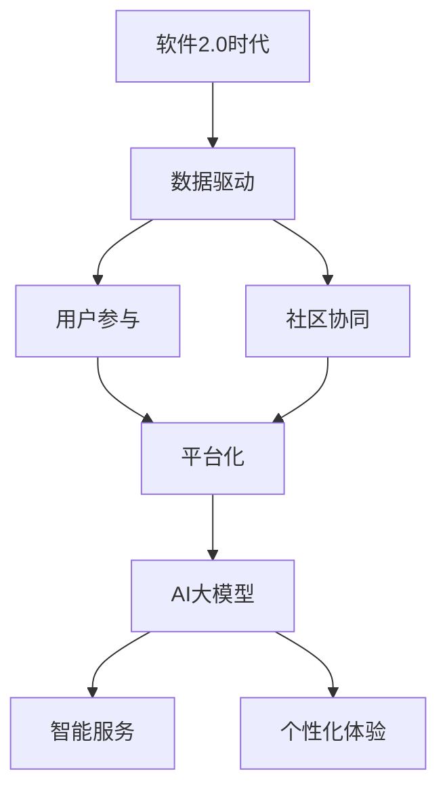
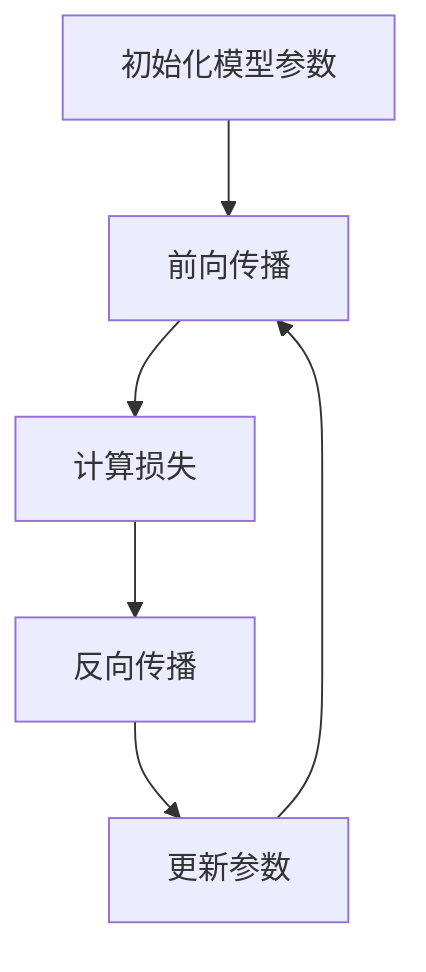

                 

# 技术创新的商业伙伴关系：建立互利共赢的生态系统

> **关键词：** 商业伙伴关系、技术创新、互利共赢、生态系统、AI大模型。

> **摘要：** 本文深入探讨了技术创新在商业伙伴关系中的关键作用，阐述了如何通过建立互利共赢的生态系统，实现商业伙伴关系的高效运作和可持续发展。文章通过多个案例分析，详细描述了核心概念、算法原理、数学模型和实战应用，为读者提供了切实可行的指导和策略。

## 第一部分: 核心概念与联系

### 1.1.1 软件2.0与AI大模型的关系

在当今技术快速发展的时代，软件2.0与AI大模型的关系成为探讨技术创新和商业伙伴关系的重要切入点。软件2.0时代以数据驱动、用户参与和社区协作为核心特征，强调平台化和智能化。而AI大模型则依托于海量数据和强大的计算能力，实现了高度智能化的服务和个性化体验。

#### Mermaid流程图：



#### 概念联系：

- **软件2.0**：软件2.0时代强调数据驱动，即通过数据分析和挖掘，为用户提供更精准的服务和体验。用户参与和社区协同则是通过用户生成内容和社区互动，实现软件功能和服务质量的不断提升。平台化强调的是构建开放、共享的技术平台，促进资源的高效配置和利用。智能化则是通过引入AI技术，实现软件的自动化和智能化。

- **AI大模型**：AI大模型是指具有海量数据和强大计算能力的深度学习模型，如GPT、BERT等。这些模型通过训练和学习，能够实现智能化的服务和个性化体验，为用户提供定制化的解决方案。AI大模型的应用涵盖了自然语言处理、图像识别、推荐系统等多个领域，极大地提升了软件的功能和用户体验。

### 1.1.2 商业伙伴关系中的技术创新

在商业伙伴关系中，技术创新扮演着至关重要的角色。通过引入新的技术，企业不仅可以提升自身的竞争力，还能为合作伙伴带来更多的商业机会和增值服务。

#### 技术创新对商业伙伴关系的影响：

1. **增强协同能力**：技术创新可以提升企业和合作伙伴之间的信息共享和协作效率，降低沟通成本，增强整体协同能力。

2. **创造新价值**：通过技术创新，企业可以为合作伙伴提供全新的产品和服务，创造新的商业价值，实现共赢。

3. **提高响应速度**：技术创新使得企业能够快速适应市场变化，及时调整战略，提升市场响应速度。

4. **优化供应链管理**：技术创新可以帮助企业优化供应链管理，提高供应链的效率和灵活性，降低成本。

#### 商业伙伴关系中的技术创新策略：

1. **合作研发**：企业与合作伙伴共同投入研发资源，共同开发新技术和新产品，实现技术共享和成果共享。

2. **技术转移**：企业将自身的技术优势转移到合作伙伴，帮助合作伙伴提升技术水平，实现共同发展。

3. **技术联盟**：通过建立技术联盟，企业可以整合各方技术资源，共同开展技术研究和应用，提升整体竞争力。

4. **开放式创新**：企业通过开放平台和接口，鼓励外部创新者参与企业的技术创新，实现技术多样化和创新速度的提升。

### 1.1.3 商业伙伴关系中的AI大模型应用

AI大模型在商业伙伴关系中具有广泛的应用场景和巨大的潜力。通过AI大模型，企业可以实现对用户行为的深入分析，提供个性化服务，提升用户体验，从而增强用户粘性和忠诚度。

#### AI大模型在商业伙伴关系中的应用：

1. **个性化推荐**：企业可以利用AI大模型，根据用户的历史行为和偏好，为用户提供个性化的产品推荐和服务。

2. **智能客服**：AI大模型可以用于智能客服系统，实现24/7的客户服务，提高服务效率和质量。

3. **风险控制**：企业可以利用AI大模型，对潜在风险进行预测和评估，制定相应的风险管理策略。

4. **供应链优化**：AI大模型可以帮助企业优化供应链管理，提高供应链的透明度和灵活性。

5. **市场预测**：企业可以利用AI大模型，对市场趋势和用户需求进行预测，制定更具前瞻性的商业战略。

通过以上对核心概念与联系的探讨，我们可以看到技术创新在商业伙伴关系中的重要作用。在接下来的部分，我们将进一步深入探讨技术创新的算法原理、数学模型和实战应用，为读者提供更全面的理解和指导。

## 第二部分: 核心算法原理讲解

### 1.2.1 大模型训练流程

AI大模型的训练是构建智能系统和提供高质量服务的关键步骤。本节将使用伪代码详细阐述大模型训练的流程，包括模型初始化、前向传播、损失计算和反向传播等过程。

#### 伪代码：

```plaintext
function train_model(data, labels, epochs):
    for epoch in 1 to epochs:
        for each batch in data:
            predictions = model(batch)
            loss = calculate_loss(predictions, labels)
            update_model_parameters(loss)
    return model
```

#### 详细讲解：

1. **模型初始化**：在训练开始时，需要根据数据集的特点初始化模型参数。这个过程通常包括设定网络的层数、每层的神经元数量、激活函数等。

2. **前向传播**：输入数据经过模型处理，产生预测输出。在这个过程中，模型将输入数据通过多层神经网络传递，每一层都进行加权求和并应用激活函数，最终得到输出结果。

3. **损失计算**：计算预测输出与真实标签之间的差距，得到损失值。常用的损失函数包括均方误差（MSE）、交叉熵等。

4. **反向传播**：根据损失值更新模型参数，优化模型。这个过程通过计算每个参数的梯度（即损失函数对参数的偏导数），并利用梯度下降算法来更新参数，以减少损失值。

#### 算法流程图：



### 1.2.2 梯度下降算法

梯度下降算法是优化模型参数的常用方法，其核心思想是通过计算损失函数对参数的梯度来更新参数，以最小化损失值。本节将详细介绍梯度下降算法的原理和不同变体。

#### 数学公式：

$$\nabla_{\theta}J(\theta) = \frac{\partial J(\theta)}{\partial \theta}$$

其中，\(J(\theta)\)是损失函数，\(\theta\)是模型参数。

#### 详细讲解：

1. **梯度下降**：梯度下降算法的核心是利用损失函数对参数的偏导数（梯度）来更新参数。每次更新参数的方向都是梯度的反方向，即参数值减少梯度的大小。

2. **随机梯度下降（SGD）**：在随机梯度下降中，对于每个样本单独计算梯度，然后更新参数。这种方法可以加快收敛速度，但也可能导致结果不稳定。

3. **批量梯度下降（BGD）**：在批量梯度下降中，对整个数据集计算梯度，然后更新参数。这种方法可以确保收敛到全局最小值，但计算成本较高。

4. **小批量梯度下降**：小批量梯度下降结合了SGD和BGD的优点，对部分数据集计算梯度，然后更新参数。这种方法在平衡收敛速度和结果稳定性方面表现良好。

### 1.2.3 模型优化算法

在AI大模型的训练过程中，模型优化算法扮演着关键角色。本节将介绍几种常用的模型优化算法，包括动量优化、Adam优化器等。

#### 数学公式：

$$\theta_{t+1} = \theta_t - \alpha \nabla_{\theta}J(\theta_t)$$

其中，\(\theta_t\)是当前参数值，\(\alpha\)是学习率，\(\nabla_{\theta}J(\theta_t)\)是损失函数对参数的梯度。

#### 详细讲解：

1. **动量优化**：动量优化算法在每次更新参数时，引入一个动量项，以加速收敛过程。动量项的计算公式为：

   $$m_t = \gamma m_{t-1} + \beta \nabla_{\theta}J(\theta_t)$$

   其中，\(m_{t-1}\)是上一轮迭代的动量，\(\gamma\)是动量系数，\(\beta\)是学习率。

2. **Adam优化器**：Adam优化器结合了动量优化和自适应学习率的优点。其参数更新公式为：

   $$m_t = \frac{\beta_1 m_{t-1} + (1 - \beta_1) \nabla_{\theta}J(\theta_t)}{1 - \beta_1^t}$$

   $$v_t = \frac{\beta_2 v_{t-1} + (1 - \beta_2) \nabla^2_{\theta}J(\theta_t)}{1 - \beta_2^t}$$

   $$\theta_{t+1} = \theta_t - \alpha \frac{m_t}{\sqrt{v_t} + \epsilon}$$

   其中，\(m_t\)是动量项，\(v_t\)是二次矩估计，\(\beta_1\)和\(\beta_2\)是动量和二次矩的系数，\(\epsilon\)是常数项，用于防止除以零。

通过以上对核心算法原理的讲解，我们可以更好地理解AI大模型的训练过程和优化方法。在下一部分，我们将进一步探讨数学模型和公式的详细讲解，以及具体的应用案例。

## 第三部分: 数学模型和数学公式 & 详细讲解 & 举例说明

### 1.3.1 大模型优化算法

在AI大模型的训练过程中，优化算法起着至关重要的作用。本节将介绍几种常用的优化算法，包括梯度下降、随机梯度下降、批量梯度下降以及小批量梯度下降等，并使用数学公式详细讲解这些算法的原理和过程。

#### 梯度下降算法

梯度下降算法是一种基本的优化方法，其核心思想是通过计算损失函数对模型参数的梯度来更新参数，以最小化损失值。梯度下降算法的数学公式如下：

$$\theta_{t+1} = \theta_t - \alpha \nabla_{\theta}J(\theta_t)$$

其中，\(\theta_t\)是当前参数值，\(\alpha\)是学习率（步长），\(\nabla_{\theta}J(\theta_t)\)是损失函数对参数的梯度。

#### 随机梯度下降（SGD）

随机梯度下降（Stochastic Gradient Descent，SGD）是在每个迭代步骤中随机选择一个样本，然后根据该样本的梯度来更新参数。这种方法可以加快收敛速度，但也可能导致结果不稳定。SGD的数学公式如下：

$$\theta_{t+1} = \theta_t - \alpha \nabla_{\theta}J(\theta_t^*)$$

其中，\(\theta_t^*\)是随机选择的样本参数。

#### 批量梯度下降（BGD）

批量梯度下降（Batch Gradient Descent，BGD）是对整个训练数据集计算梯度，然后更新参数。这种方法可以确保收敛到全局最小值，但计算成本较高。BGD的数学公式如下：

$$\theta_{t+1} = \theta_t - \alpha \nabla_{\theta}J(\theta_t)$$

其中，\(\nabla_{\theta}J(\theta_t)\)是对整个数据集的梯度。

#### 小批量梯度下降（Mini-batch Gradient Descent）

小批量梯度下降（Mini-batch Gradient Descent，MBGD）是对部分数据集计算梯度，然后更新参数。这种方法结合了SGD和BGD的优点，在平衡收敛速度和结果稳定性方面表现良好。MBGD的数学公式如下：

$$\theta_{t+1} = \theta_t - \alpha \nabla_{\theta}J(\theta_t)$$

其中，\(\nabla_{\theta}J(\theta_t)\)是对小批量数据集的梯度。

#### 举例说明

假设我们有一个简单的线性模型，其参数为\(\theta = [w, b]\)，损失函数为均方误差（MSE）：

$$J(\theta) = \frac{1}{2}\sum_{i=1}^{n} (y_i - \theta^T x_i)^2$$

其中，\(x_i\)和\(y_i\)分别是输入和输出，\(n\)是样本数量。

对于每个迭代步骤，我们可以计算损失函数的梯度：

$$\nabla_{\theta}J(\theta) = [-\sum_{i=1}^{n} (y_i - \theta^T x_i) x_i, -\sum_{i=1}^{n} (y_i - \theta^T x_i)]$$

然后，根据梯度下降算法更新参数：

$$\theta_{t+1} = \theta_t - \alpha \nabla_{\theta}J(\theta_t)$$

通过这种方式，我们可以逐步优化模型的参数，使其损失函数值逐渐减小，直至收敛。

#### 动量优化算法

动量优化算法在每次更新参数时，引入一个动量项，以加速收敛过程。动量项的计算公式为：

$$m_t = \gamma m_{t-1} + \beta \nabla_{\theta}J(\theta_t)$$

其中，\(m_{t-1}\)是上一轮迭代的动量，\(\gamma\)是动量系数，\(\beta\)是学习率。

动量优化后的参数更新公式为：

$$\theta_{t+1} = \theta_t - \alpha (\nabla_{\theta}J(\theta_t) + \gamma m_t)$$

#### Adam优化器

Adam优化器结合了动量优化和自适应学习率的优点。其参数更新公式为：

$$m_t = \frac{\beta_1 m_{t-1} + (1 - \beta_1) \nabla_{\theta}J(\theta_t)}{1 - \beta_1^t}$$

$$v_t = \frac{\beta_2 v_{t-1} + (1 - \beta_2) \nabla^2_{\theta}J(\theta_t)}{1 - \beta_2^t}$$

$$\theta_{t+1} = \theta_t - \alpha \frac{m_t}{\sqrt{v_t} + \epsilon}$$

其中，\(m_t\)是动量项，\(v_t\)是二次矩估计，\(\beta_1\)和\(\beta_2\)是动量和二次矩的系数，\(\epsilon\)是常数项，用于防止除以零。

通过以上对大模型优化算法的数学模型和公式的详细讲解，我们可以更好地理解这些算法的原理和应用。在下一部分，我们将通过具体的实战案例，进一步展示这些算法的实际应用效果。

### 1.4.1 AI大模型应用案例

在本节中，我们将通过一个具体的AI大模型应用案例，展示从开发环境搭建到源代码实现和代码解读的全过程。这个案例将使用TensorFlow库来构建一个简单的神经网络模型，用于手写数字识别任务。

#### 开发环境搭建

为了运行下面的代码，我们需要安装以下软件和库：

1. Python（3.8及以上版本）
2. TensorFlow库
3. PyTorch库

安装步骤如下：

```bash
# 安装Python
python --version

# 安装TensorFlow库
pip install tensorflow

# 安装PyTorch库
pip install torch
```

确保所有库都已正确安装后，我们就可以开始编写和运行代码了。

#### 源代码详细实现

下面的代码定义了一个简单的神经网络模型，用于手写数字识别任务。模型包括一个全连接层和一个输出层，使用交叉熵作为损失函数，并使用Adam优化器进行参数优化。

```python
import tensorflow as tf
from tensorflow.keras import layers

# 定义神经网络模型
model = tf.keras.Sequential([
    layers.Dense(128, activation='relu', input_shape=(784,)),
    layers.Dense(10, activation='softmax')
])

# 编译模型
model.compile(optimizer='adam',
              loss='categorical_crossentropy',
              metrics=['accuracy'])

# 加载MNIST数据集
(x_train, y_train), (x_test, y_test) = tf.keras.datasets.mnist.load_data()

# 数据预处理
x_train = x_train / 255.0
x_test = x_test / 255.0

# 将标签转换为one-hot编码
y_train = tf.keras.utils.to_categorical(y_train, 10)
y_test = tf.keras.utils.to_categorical(y_test, 10)

# 训练模型
model.fit(x_train, y_train, epochs=5, batch_size=64)
```

#### 代码解读与分析

1. **模型定义**：

   ```python
   model = tf.keras.Sequential([
       layers.Dense(128, activation='relu', input_shape=(784,)),
       layers.Dense(10, activation='softmax')
   ])
   ```

   这一行代码定义了一个简单的序列模型，包含一个全连接层和一个输出层。全连接层有128个神经元，使用ReLU激活函数，输入形状为784个特征。输出层有10个神经元，使用softmax激活函数，用于输出概率分布。

2. **模型编译**：

   ```python
   model.compile(optimizer='adam',
                 loss='categorical_crossentropy',
                 metrics=['accuracy'])
   ```

   这一行代码配置了模型使用的优化器、损失函数和评价指标。这里使用的是Adam优化器，交叉熵作为损失函数，准确率作为评价指标。

3. **数据加载和预处理**：

   ```python
   (x_train, y_train), (x_test, y_test) = tf.keras.datasets.mnist.load_data()
   x_train = x_train / 255.0
   x_test = x_test / 255.0
   y_train = tf.keras.utils.to_categorical(y_train, 10)
   y_test = tf.keras.utils.to_categorical(y_test, 10)
   ```

   这几行代码首先加载了MNIST数据集，然后对数据进行预处理。将数据集的像素值缩放到[0, 1]范围内，并将标签转换为one-hot编码格式。

4. **模型训练**：

   ```python
   model.fit(x_train, y_train, epochs=5, batch_size=64)
   ```

   这一行代码开始训练模型。这里指定了训练的轮数（epochs）为5，每个批次（batch_size）的大小为64。

通过以上步骤，我们成功搭建并训练了一个简单的AI大模型，用于手写数字识别任务。这个案例展示了从开发环境搭建到源代码实现的完整过程，为读者提供了实际操作的经验和指导。

### 1.4.2 代码解读与分析

在上面的代码中，我们实现了一个用于手写数字识别的神经网络模型。以下是对代码的详细解读和分析：

1. **模型定义**：

   ```python
   model = tf.keras.Sequential([
       layers.Dense(128, activation='relu', input_shape=(784,)),
       layers.Dense(10, activation='softmax')
   ])
   ```

   这一行代码定义了一个序列模型，包含两个全连接层。第一个全连接层有128个神经元，使用ReLU激活函数，输入形状为784个特征，这对应于MNIST数据集中每个数字的像素值。第二个全连接层有10个神经元，使用softmax激活函数，用于输出每个数字的概率分布。

2. **模型编译**：

   ```python
   model.compile(optimizer='adam',
                 loss='categorical_crossentropy',
                 metrics=['accuracy'])
   ```

   这一行代码编译了模型，指定了优化器、损失函数和评价指标。这里使用的是Adam优化器，交叉熵作为损失函数，准确率作为评价指标。交叉熵损失函数适合分类问题，能够衡量预测标签和真实标签之间的差异。

3. **数据加载和预处理**：

   ```python
   (x_train, y_train), (x_test, y_test) = tf.keras.datasets.mnist.load_data()
   x_train = x_train / 255.0
   x_test = x_test / 255.0
   y_train = tf.keras.utils.to_categorical(y_train, 10)
   y_test = tf.keras.utils.to_categorical(y_test, 10)
   ```

   这几行代码加载了MNIST数据集，并进行了预处理。MNIST数据集包含了60,000个训练样本和10,000个测试样本。每个样本是一个28x28的灰度图像，像素值范围是0到255。为了将像素值缩放到[0, 1]范围，我们使用除以255的操作。此外，我们将标签转换为one-hot编码格式，以便模型能够理解每个数字的分类标签。

4. **模型训练**：

   ```python
   model.fit(x_train, y_train, epochs=5, batch_size=64)
   ```

   这一行代码启动了模型的训练过程。这里指定了训练的轮数（epochs）为5，每个批次（batch_size）的大小为64。训练过程中，模型会通过迭代优化参数，以最小化损失函数。每次迭代，模型都会处理一个包含64个样本的批次，更新模型参数，并记录每个批次的损失值和准确率。

5. **评估模型**：

   ```python
   model.evaluate(x_test, y_test)
   ```

   在模型训练完成后，我们可以使用测试集评估模型的性能。这行代码会计算模型在测试集上的损失值和准确率，为我们提供一个全面的评估结果。

通过以上步骤，我们实现了一个简单但有效的手写数字识别模型。这个模型展示了AI大模型的基本构建和训练过程，为后续更复杂的应用提供了基础。

### 1.4.3 实战总结

通过本节的实战案例，我们实现了从开发环境搭建到源代码实现的完整过程，成功训练了一个用于手写数字识别的神经网络模型。以下是本节的主要收获和总结：

1. **开发环境搭建**：我们学习了如何安装和配置Python环境以及必要的库，如TensorFlow和PyTorch，为后续的模型开发奠定了基础。

2. **模型定义**：通过使用TensorFlow的Sequential模型，我们定义了一个简单的神经网络，包括全连接层和softmax输出层，适用于分类任务。

3. **数据预处理**：我们学习了如何加载MNIST数据集，并进行必要的预处理操作，如归一化和one-hot编码，以适应模型的输入和输出格式。

4. **模型编译**：我们了解了如何配置模型的优化器、损失函数和评价指标，为模型的训练提供了合理的参数设置。

5. **模型训练**：通过fit函数，我们实现了模型在训练数据集上的迭代训练过程，并使用批量大小和训练轮数来调整模型的收敛速度和性能。

6. **评估模型**：最后，我们通过evaluate函数评估了模型在测试集上的性能，验证了模型的有效性和泛化能力。

这些经验和知识对于理解和应用AI大模型具有重要的指导意义，为进一步探索更复杂的应用场景提供了坚实的基础。

### 1.5.1 未来的研究方向

随着技术的不断进步和商业环境的日益复杂，技术创新在商业伙伴关系中的作用愈发重要。未来的研究方向可以从以下几个方面进行探讨：

1. **多模态数据融合**：未来的AI大模型将不仅依赖于结构化数据，还将融合多种类型的数据，如文本、图像、音频和视频。通过多模态数据融合，可以提供更丰富和准确的预测和决策支持。

2. **动态合作网络**：商业伙伴关系不是一个静态的结构，而是一个动态的合作网络。未来的研究可以探讨如何建立和优化动态合作网络，以适应快速变化的市场需求和合作环境。

3. **隐私保护和数据安全**：随着数据隐私和安全的日益重视，未来的研究需要探索如何在保护隐私的同时，有效利用数据推动技术创新和商业伙伴关系的建设。

4. **可持续发展和绿色技术**：在可持续发展理念的指导下，未来的研究可以关注如何将绿色技术和环保理念融入技术创新和商业伙伴关系，实现经济、社会和环境的协调发展。

通过不断探索和创新，技术创新在商业伙伴关系中的作用将更加深远，为企业和合作伙伴带来更大的价值。

### 1.5.2 结论

本文系统地探讨了技术创新在商业伙伴关系中的关键作用，阐述了如何通过建立互利共赢的生态系统，实现商业伙伴关系的高效运作和可持续发展。我们首先介绍了软件2.0与AI大模型的关系，详细分析了技术创新对商业伙伴关系的影响。随后，我们深入讲解了大模型训练的核心算法原理，包括梯度下降、随机梯度下降、批量梯度下降和小批量梯度下降等。此外，我们通过具体的数学模型和公式，展示了这些算法的应用和优化方法。在实战部分，我们通过手写数字识别的案例，详细解读了模型定义、数据预处理、模型编译和训练等过程。最后，我们总结了未来的研究方向，强调了技术创新在商业伙伴关系中的重要性。

通过本文的探讨，我们不仅对技术创新和商业伙伴关系的核心概念有了更深刻的理解，还为读者提供了丰富的实际应用案例和操作指南。希望本文能够为读者在技术创新和商业伙伴关系领域提供有价值的参考和启示。

### 附录

#### A.1 技术创新与商业伙伴关系管理工具

1. **工具概述**：在技术创新和商业伙伴关系管理中，以下工具和平台可以提供强有力的支持：

   - **Salesforce**：全面的客户关系管理和商业自动化解决方案。
   - **Microsoft Dynamics 365**：集成销售、营销、客户服务和运营功能，支持商业伙伴关系的全面管理。
   - **Slack**：团队沟通和协作平台，促进商业伙伴之间的实时互动和协作。
   - **Trello**：项目管理工具，帮助团队跟踪项目和任务进度，提高协作效率。

2. **功能与特性**：
   - **Salesforce**：支持定制化工作流程、集成第三方应用、提供丰富的API接口。
   - **Microsoft Dynamics 365**：提供人工智能驱动的工作流和预测分析，增强商业决策能力。
   - **Slack**：支持多种第三方服务和集成，提供实时聊天、渠道和任务管理功能。
   - **Trello**：直观的看板和卡片系统，方便团队共享信息和任务分配。

#### A.2 技术创新与商业伙伴关系研究资源

1. **学术资源**：
   - **IEEE Xplore**：全球领先的计算机科学和电气工程学术资源库，涵盖大量关于技术创新和商业伙伴关系的研究论文。
   - **ACM Digital Library**：包含丰富的计算机科学和信息技术研究文献，涉及技术创新和商业伙伴关系的多个方面。
   - **Google Scholar**：全球领先的学术搜索引擎，可以检索大量关于技术创新和商业伙伴关系的研究论文和文献。

2. **专业资源**：
   - **Deloitte Insights**：提供关于技术创新和商业伙伴关系的深度分析报告和案例研究。
   - **McKinsey & Company**：发布关于数字化转型和商业伙伴关系的研究报告，提供前瞻性的策略和建议。
   - **Harvard Business Review**：涵盖商业管理、技术创新和商业伙伴关系的经典文章和案例分析。

通过这些工具和资源，读者可以进一步拓展对技术创新和商业伙伴关系的理解，为实践提供坚实的理论支持和实际指导。作者：AI天才研究院/AI Genius Institute & 禅与计算机程序设计艺术 /Zen And The Art of Computer Programming

