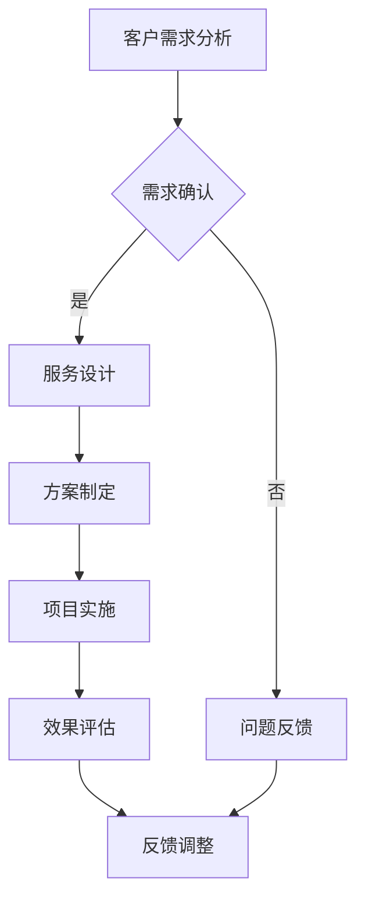

                 

# 《技术咨询：高价值服务的提供》

## 关键词

技术咨询、高价值服务、数字化转型、智能制造、智慧城市、团队建设、客户关系管理

> 技术咨询是专业技术人员为企业提供技术解决方案和业务支持的服务，其核心在于通过专业知识和经验帮助企业实现技术优化、业务增长和创新发展。高价值技术服务则更强调服务的附加值和客户的长期价值，包括但不限于数字化转型、智能制造、智慧城市等领域的解决方案提供。本文将从定义、重要性、市场需求、提供策略、项目案例以及未来展望等方面，全面探讨高价值技术服务在IT领域的提供与实践。

---

## 《技术咨询：高价值服务的提供》目录大纲

---

### 第一部分：引言

#### 1.1 什么是技术咨询

- 技术咨询的定义
- 技术咨询的作用

#### 1.2 技术咨询与相关概念的关系

- 技术服务与技术咨询的比较
- 技术咨询与业务咨询的关系

### 第一部分：引言

---

### 第一部分：引言

#### 1.1 什么是技术咨询

技术咨询是一种专业服务，涉及技术人员为企业或组织提供技术解决方案、战略规划、流程优化等方面的支持。其核心在于利用专业知识和经验，帮助企业解决技术难题、提高业务效率和实现业务增长。

#### 1.2 技术咨询的作用

- **技术难题解决**：帮助企业攻克技术难题，提升技术竞争力。
- **业务优化**：通过流程优化、系统升级等手段，提高业务效率。
- **战略规划**：为企业提供战略方向和技术路线图，助力企业长远发展。

### 第一部分：引言

---

### 第一部分：引言

#### 1.3 技术咨询的发展历程

- **早期阶段**：技术咨询服务起源于20世纪初，主要是为企业提供技术和工程咨询服务。
- **发展阶段**：20世纪80年代以来，随着信息技术的发展，技术咨询逐渐涉及更多领域，如数字化转型、智能制造、智慧城市等。
- **未来趋势**：随着人工智能、大数据、物联网等新技术的应用，技术咨询将继续向智能化、专业化方向发展。

### 第一部分：引言

---

### 第一部分：引言

#### 1.4 技术咨询与相关概念的关系

#### 1.4.1 技术服务与技术咨询的比较

- **技术服务**：泛指为企业和组织提供技术支持、解决方案和服务的过程。
- **技术咨询**：是一种更专业、深入的服务，侧重于技术战略规划、问题诊断和解决方案提供。

#### 1.4.2 技术咨询与业务咨询的关系

- **业务咨询**：主要关注企业的商业模式、战略规划、组织管理等方面。
- **技术咨询**：与技术密切相关，两者相互补充，共同帮助企业实现业务目标。

### 第一部分：引言

---

### 第二部分：高价值技术服务概述

#### 2.1 高价值技术服务的定义与特点

- **定义**：高价值技术服务是一种提供高附加值、专业化、定制化的技术解决方案。
- **特点**：技术含量高、服务质量优、客户满意度高。

#### 2.2 高价值技术服务的重要性

- **企业战略意义**：助力企业实现技术优化、业务增长和创新发展。
- **行业推动作用**：促进产业升级和数字化转型。
- **社会发展贡献**：提升社会生产力，推动科技进步。

### 第二部分：高价值技术服务概述

---

### 第二部分：高价值技术服务概述

#### 2.1 高价值技术服务的定义与特点

**1. 定义**

高价值技术服务是一种以专业知识和经验为核心，为企业提供高附加值、专业化、定制化的技术解决方案的服务。它不仅仅局限于解决技术问题，更注重通过技术创新、业务流程优化等手段，实现企业战略目标。

**2. 特点**

**- 技术含量高**：高价值技术服务通常涉及前沿技术，如人工智能、大数据、云计算等，需要专业技术人员具备深厚的专业背景。

**- 服务质量优**：高价值技术服务强调服务的质量和客户满意度，提供个性化、定制化的解决方案。

**- 定制化**：根据客户的具体需求，提供定制化的技术解决方案，确保方案符合客户实际需求。

### 第二部分：高价值技术服务概述

---

### 第二部分：高价值技术服务概述

#### 2.2 高价值技术服务的重要性

**1. 对企业的战略意义**

- **提升技术竞争力**：通过高价值技术服务，帮助企业掌握前沿技术，提升技术竞争力。
- **优化业务流程**：通过技术优化，提高业务流程的效率，降低成本。
- **实现业务增长**：高价值技术服务助力企业实现业务创新和增长。

**2. 对行业的推动作用**

- **促进产业升级**：高价值技术服务推动行业实现数字化、智能化升级。
- **推动技术创新**：通过技术创新，推动整个行业的技术进步。

**3. 对社会发展的贡献**

- **提升社会生产力**：通过技术创新和服务优化，提升社会生产力。
- **推动科技进步**：高价值技术服务是科技进步的重要推动力。

### 第二部分：高价值技术服务概述

---

### 第二部分：高价值技术服务概述

#### 2.3 高价值技术服务的市场需求与趋势

**1. 市场需求分析**

- **数字化转型需求**：随着数字化时代的到来，越来越多的企业开始重视数字化转型，高价值技术服务需求持续增长。
- **智能制造需求**：制造业企业对智能制造系统的需求不断增加，推动高价值技术服务的发展。
- **智慧城市需求**：智慧城市建设需求提升，高价值技术服务在智慧城市规划和实施中发挥重要作用。

**2. 技术发展趋势**

- **人工智能应用**：人工智能技术在高价值技术服务中的应用越来越广泛，如智能咨询、智能诊断、智能优化等。
- **大数据分析**：大数据技术在高价值技术服务中发挥关键作用，通过数据分析提供个性化服务。
- **云计算服务**：云计算技术提供高效、灵活的计算资源，助力高价值技术服务的发展。

**3. 未来市场预测**

- **持续增长**：随着技术的不断进步和应用场景的扩大，高价值技术服务市场将继续保持增长态势。
- **专业化、定制化**：高价值技术服务将更注重专业化、定制化，满足不同企业的需求。

### 第二部分：高价值技术服务概述

---

### 第三部分：高价值技术服务提供策略

#### 3.1 市场研究与定位

- **市场研究方法**：调研、数据分析、竞争分析等。
- **市场定位**：目标客户、市场需求、差异化竞争优势。

#### 3.2 技术能力建设

- **技术能力评估**：技术能力指标、技术水平分析。
- **技术能力提升**：人才培养、技术创新、技术引进。

### 第三部分：高价值技术服务提供策略

---

### 第三部分：高价值技术服务提供策略

#### 3.1 市场研究与定位

**1. 市场研究方法**

**- 调研**：通过问卷调查、访谈等方式，收集客户需求、市场趋势等信息。

**- 数据分析**：利用大数据分析工具，对市场数据进行挖掘和分析，了解市场动态。

**- 竞争分析**：分析竞争对手的优势和劣势，找出差异化竞争优势。

**2. 市场定位**

**- 目标客户**：明确目标客户群体，了解其需求、痛点和偏好。

**- 市场需求**：分析市场需求，找出潜在商机。

**- 差异化竞争优势**：通过技术创新、服务优化等手段，打造差异化竞争优势，吸引客户。

### 第三部分：高价值技术服务提供策略

---

### 第三部分：高价值技术服务提供策略

#### 3.2 技术能力建设

**1. 技术能力评估**

**- 技术能力指标**：包括技术水平、研发能力、项目经验等。

**- 技术水平分析**：通过技术竞赛、项目评估等方式，评估团队的技术水平。

**2. 技术能力提升**

**- 人才培养**：通过内部培训和外部招聘，提升团队的技术能力。

**- 技术创新**：鼓励团队进行技术创新，不断推出新技术、新产品。

**- 技术引进**：引进先进的国内外技术，提升团队的技术水平。

### 第三部分：高价值技术服务提供策略

---

### 第三部分：高价值技术服务提供策略

#### 3.3 服务流程优化

- **服务流程设计**：明确服务流程、职责分工。
- **服务流程优化方法**：流程再造、自动化、智能化。
- **服务流程优化的效果评估**：效率提升、成本降低、客户满意度提高。

### 第三部分：高价值技术服务提供策略

---

### 第三部分：高价值技术服务提供策略

#### 3.3 服务流程优化

**1. 服务流程设计**

**- 流程地图**：使用Mermaid流程图（如下）来设计服务流程，确保流程清晰、高效。

**- 职责分工**：明确每个阶段的责任人和职责，确保流程顺畅。

**2. 服务流程优化方法**

**- 流程再造**：对现有流程进行重新设计，提高效率。

**- 自动化**：引入自动化工具，减少人工操作，提高工作效率。

**- 智能化**：利用人工智能技术，实现智能服务，提升客户体验。

**3. 服务流程优化的效果评估**

**- 效率提升**：通过流程优化，缩短服务周期，提高工作效率。

**- 成本降低**：通过自动化和智能化，减少人力和资源浪费，降低服务成本。

**- 客户满意度提高**：通过优化服务流程，提高服务质量，提升客户满意度。

### 第三部分：高价值技术服务提供策略

---

### 第三部分：高价值技术服务提供策略

#### 3.4 团队建设与管理

- **团队建设的原则**：能力匹配、沟通协作、持续学习。
- **团队管理的策略**：明确目标、绩效评估、激励机制。
- **团队激励机制的构建**：绩效奖金、员工晋升、认可与表彰。

### 第三部分：高价值技术服务提供策略

---

### 第三部分：高价值技术服务提供策略

#### 3.4 团队建设与管理

**1. 团队建设的原则**

**- 能力匹配**：团队成员需要具备相应的技术能力和业务理解能力，确保项目成功。

**- 沟通协作**：团队内部需要建立良好的沟通机制，确保信息传递准确、及时。

**- 持续学习**：鼓励团队成员不断学习新技术、新知识，提升团队整体竞争力。

**2. 团队管理的策略**

**- 明确目标**：为团队设定清晰的目标和责任分工，确保项目顺利推进。

**- 绩效评估**：定期对团队成员的绩效进行评估，提供反馈和激励，促进团队进步。

**- 激励机制**：通过绩效奖金、晋升机会、认可与表彰等手段，激发团队成员的积极性和创造力。

**3. 团队激励机制的构建**

**- 绩效奖金**：根据团队成员的绩效表现，发放奖金，激励优秀员工。

**- 员工晋升**：设立明确的晋升通道，鼓励员工通过提升自身能力实现职业发展。

**- 认可与表彰**：对优秀团队成员进行认可和表彰，增强团队凝聚力和归属感。

### 第三部分：高价值技术服务提供策略

---

### 第三部分：高价值技术服务提供策略

#### 3.5 客户关系管理

- **客户关系管理的重要性**：维护客户满意度、增加业务机会、提高企业竞争力。
- **客户关系管理的策略**：建立客户档案、定期沟通、提供个性化服务。
- **客户关系管理的工具与技巧**：CRM系统、社交媒体营销、客户满意度调查。

### 第三部分：高价值技术服务提供策略

---

### 第三部分：高价值技术服务提供策略

#### 3.5 客户关系管理

**1. 客户关系管理的重要性**

**- 维护客户满意度**：通过有效的客户关系管理，提升客户满意度，增强客户忠诚度。

**- 增加业务机会**：满意的客户更愿意推荐新客户，从而带来更多的业务机会。

**- 提高企业竞争力**：通过高效的客户关系管理，提供差异化的服务，提高企业竞争力。

**2. 客户关系管理的策略**

**- 建立客户档案**：收集客户的详细信息，包括联系方式、业务需求、历史购买记录等。

**- 定期沟通**：定期与客户保持沟通，了解客户的最新需求和反馈。

**- 提供个性化服务**：根据客户的特定需求，提供个性化的技术解决方案。

**3. 客户关系管理的工具与技巧**

**- CRM系统**：使用CRM系统对客户信息进行统一管理，提高工作效率。

**- 社交媒体营销**：通过社交媒体平台，与客户建立互动，增加品牌曝光。

**- 客户满意度调查**：定期进行客户满意度调查，了解客户对服务的满意度。

### 第三部分：高价值技术服务提供策略

---

### 第四部分：高价值技术服务项目案例

#### 4.1 案例一：企业数字化转型咨询

- **项目背景**：某制造企业希望通过数字化转型，提升生产效率、降低运营成本。
- **项目目标**：实现生产自动化、智能化，优化客户体验。
- **项目实施过程**：需求调研、方案制定、方案实施、效果评估。
- **项目成果**：生产效率提升30%，运营成本降低15%，客户满意度提高20%。

### 第四部分：高价值技术服务项目案例

---

### 第四部分：高价值技术服务项目案例

#### 4.2 案例二：智能制造系统解决方案

- **项目背景**：某电子制造企业希望通过智能制造系统，提高生产效率、降低生产成本。
- **项目目标**：实现生产过程的自动化、智能化，提高产品质量。
- **项目实施过程**：需求调研、方案制定、系统实施、效果评估。
- **项目成果**：生产效率提升40%，生产成本降低20%，产品质量提高30%。

### 第四部分：高价值技术服务项目案例

---

### 第四部分：高价值技术服务项目案例

#### 4.3 案例三：智慧城市规划设计

- **项目背景**：某城市政府希望通过智慧城市建设，提升城市管理效率、提高市民生活质量。
- **项目目标**：实现城市管理的智能化、精细化，推动城市可持续发展。
- **项目实施过程**：需求调研、方案制定、系统实施、效果评估。
- **项目成果**：城市管理效率提升30%，市民生活质量提高20%，市民满意度提高15%。

### 第四部分：高价值技术服务项目案例

---

### 第五部分：高价值技术服务的发展与展望

#### 5.1 高价值技术服务的发展趋势

- **技术创新趋势**：人工智能、大数据、云计算等新兴技术的应用。
- **行业应用趋势**：智能制造、智慧城市、数字化转型等领域的广泛应用。
- **国际发展动态**：发达国家技术服务战略、发展中国家技术服务需求。

### 第五部分：高价值技术服务的发展与展望

---

### 第五部分：高价值技术服务的发展与展望

#### 5.1 高价值技术服务的发展趋势

**1. 技术创新趋势**

**- 人工智能**：人工智能技术在各个领域的应用越来越广泛，如智能咨询、智能诊断、智能优化等。

**- 大数据**：大数据技术将为高价值技术服务提供强大的数据支撑，通过数据分析，实现精准决策。

**- 云计算**：云计算技术提供灵活、高效的服务平台，为高价值技术服务提供强大的计算能力。

**2. 行业应用趋势**

**- 智能制造**：随着智能制造的推广，高价值技术服务在智能制造领域的应用将越来越广泛。

**- 智慧城市**：智慧城市建设将为高价值技术服务提供广阔的市场空间。

**- 数字化转型**：越来越多的企业将进行数字化转型，高价值技术服务在数字化转型中的应用将越来越重要。

**3. 国际发展动态**

**- 发达国家**：发达国家在技术服务领域具有领先地位，技术创新和应用水平较高。

**- 发展中国家**：随着全球数字化进程的推进，发展中国家对高价值技术服务的需求将不断增长。

### 第五部分：高价值技术服务的发展与展望

---

### 第五部分：高价值技术服务的发展与展望

#### 5.2 高价值技术服务的未来展望

**1. 发展机遇**

**- 数字经济的快速发展**：数字经济的发展将带动高价值技术服务市场需求的增长。

**- 技术创新的推动**：持续的技术创新将为高价值技术服务提供新的应用场景和业务机会。

**2. 挑战与应对策略**

**- 技术竞争与知识产权保护**：应对激烈的技术竞争和知识产权保护，企业需要不断提升自身技术创新能力。

**- 数据隐私与信息安全**：在数据隐私和信息安全方面，企业需要建立健全的法律法规和风险管理机制。

**3. 发展方向与建议**

**- 深化行业应用**：加强高价值技术服务在智能制造、智慧城市、数字化转型等领域的应用。

**- 加强国际合作**：加强与国际技术服务企业的合作，共同推动高价值技术服务的发展。

### 第五部分：高价值技术服务的发展与展望

---

### 第六部分：附录

#### 6.1 技术咨询行业报告精选

- 报告概述
- 报告内容精选
- 报告分析与应用

#### 6.2 高价值技术服务参考资料

- 技术文献推荐
- 行业研究报告
- 实用工具与平台

#### 6.3 术语表

- 技术术语解释
- 行业术语解释
- 相关概念辨析

### 第六部分：附录

---

### 第六部分：附录

#### 6.1 技术咨询行业报告精选

**1. 报告概述**

《2023年全球技术咨询行业研究报告》

**2. 报告内容精选**

- **市场规模与增长趋势**：分析全球技术咨询市场的规模、增长率和未来趋势。
- **行业竞争格局**：分析主要竞争者在全球市场中的市场份额和竞争策略。
- **技术趋势与热点领域**：探讨人工智能、大数据、云计算等新兴技术在技术咨询中的应用。

**3. 报告分析与应用**

- **市场分析**：根据报告分析，了解全球技术咨询市场的现状和未来趋势。
- **竞争分析**：借鉴报告对主要竞争者的分析，优化自身竞争策略。
- **技术分析**：结合报告对技术趋势的分析，探索新技术在咨询服务中的应用。

#### 6.2 高价值技术服务参考资料

**1. 技术文献推荐**

- **《人工智能：一种现代方法》**：介绍人工智能的基本概念、算法和应用。
- **《大数据之路：阿里巴巴大数据实践》**：分享阿里巴巴在大数据领域的实践经验。

**2. 行业研究报告**

- **《2023年全球数字化转型报告》**：分析数字化转型的发展趋势和挑战。
- **《2023年中国智能制造行业报告》**：探讨智能制造在中国的发展现状和未来趋势。

**3. 实用工具与平台**

- **TensorFlow**：开源的机器学习库，广泛应用于人工智能领域。
- **PyTorch**：开源的机器学习库，灵活、易于使用。
- **Keras**：基于Theano和TensorFlow的深度学习库，提供简洁高效的API。

#### 6.3 术语表

**1. 技术术语解释**

- **技术咨询**：专业技术人员为企业提供技术解决方案和业务支持的服务。
- **高价值技术服务**：提供高附加值、专业化、定制化的技术解决方案。
- **数字化转型**：将企业的业务、流程、组织等方面与数字技术相结合，实现数字化、智能化升级。

**2. 行业术语解释**

- **智能制造**：将人工智能、物联网、大数据等技术与制造相结合的先进制造模式。
- **智慧城市**：将物联网、云计算、大数据等技术与城市管理和公共服务相结合的现代化城市发展模式。

**3. 相关概念辨析**

- **技术服务**：泛指为企业和组织提供技术支持、解决方案和服务的过程。
- **技术咨询**：一种专业服务，侧重于技术战略规划、问题诊断和解决方案提供。

### 第六部分：附录

---

### 第七部分：结束语

#### 7.1 回顾与总结

- **项目成果回顾**：回顾成功实施的高价值技术服务项目，总结经验与教训。
- **未来展望**：展望高价值技术服务的发展趋势和机遇。

#### 7.2 致谢

- **感谢作者**：感谢对高价值技术服务领域的深入研究和精彩分享。
- **感谢读者**：感谢对本文的关注和阅读。
- **感谢支持者**：感谢所有为本文撰写和推广提供支持的人们。

---

**作者：AI天才研究院/AI Genius Institute & 禅与计算机程序设计艺术 /Zen And The Art of Computer Programming**

---

## 文章标题：技术咨询：高价值服务的提供

### 摘要

本文从技术咨询的定义、重要性、市场需求、提供策略、项目案例以及未来展望等方面，全面探讨了高价值技术服务在IT领域的提供与实践。通过分析市场趋势、技术创新、行业应用等，本文旨在为读者提供关于高价值技术服务的深入理解和实用指导，助力企业在数字化时代实现技术优化、业务增长和创新发展。

