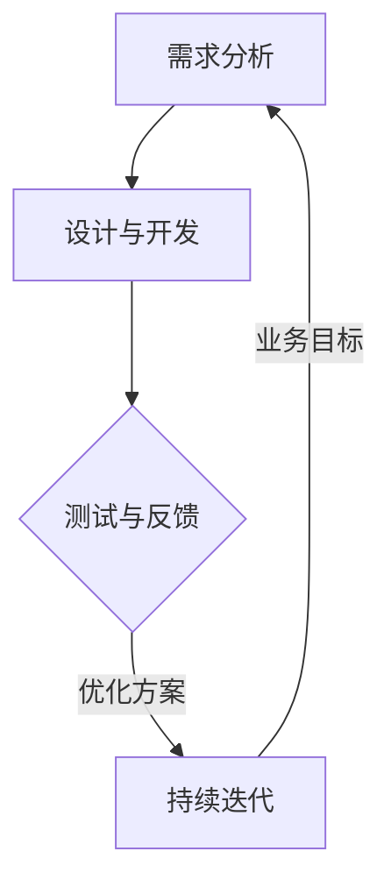
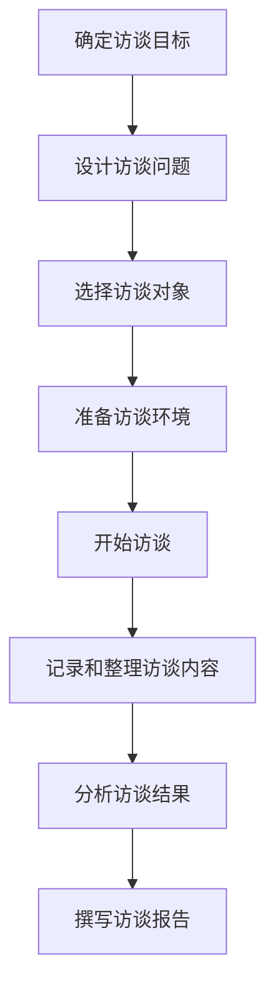
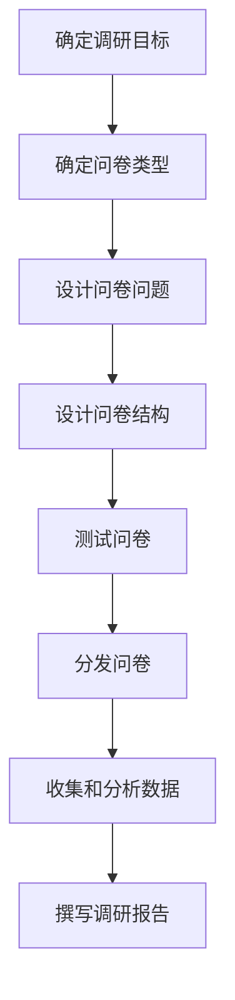
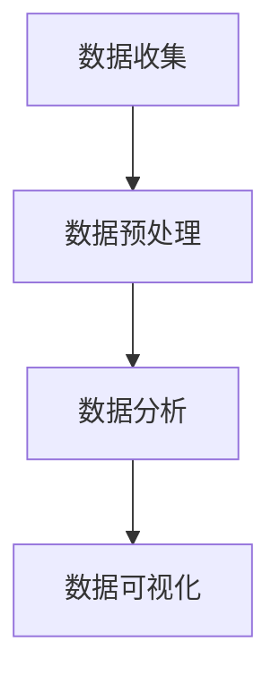

                 

### 《持续优化产品的有效方法》

> **关键词**：产品优化、用户体验、迭代、数据分析、设计思维

> **摘要**：本文将探讨如何通过有效的策略和方法，对产品进行持续优化。从用户研究到设计思维，再到功能优化和性能提升，我们将一步步分析如何在产品生命周期中不断改进产品，提升用户体验，实现产品价值的最大化。

---

# 《持续优化产品的有效方法》目录大纲

## 第一部分：产品优化概述

### 第1章：产品优化的基本概念

#### 1.1 产品优化的目标与重要性

#### 1.2 产品优化的流程与方法

#### 1.3 产品优化的常见挑战与解决策略

### 第2章：用户研究在产品优化中的作用

#### 2.1 用户研究的意义与类型

#### 2.2 用户访谈与问卷调查的方法

#### 2.3 用户行为数据分析

## 第二部分：核心优化方法

### 第3章：产品设计优化

#### 3.1 设计思维在产品优化中的应用

#### 3.2 原型设计与迭代

#### 3.3 用户界面优化

### 第4章：功能优化

#### 4.1 功能优先级排序

#### 4.2 功能迭代与优化策略

#### 4.3 功能废弃与更新

### 第5章：性能优化

#### 5.1 性能优化的重要性

#### 5.2 性能测试与监控

#### 5.3 性能瓶颈分析与优化

### 第6章：用户体验优化

#### 6.1 用户体验评价方法

#### 6.2 用户体验测试

#### 6.3 用户体验优化策略

## 第三部分：实施与监控

### 第7章：产品优化的实施策略

#### 7.1 团队协作与沟通

#### 7.2 产品优化的项目管理

#### 7.3 产品优化的资源规划

### 第8章：产品优化的监控与评估

#### 8.1 产品优化效果的评估方法

#### 8.2 数据分析在产品优化中的应用

#### 8.3 产品优化持续性的维护与调整

### 第9章：产品优化的实践案例

#### 9.1 案例一：某电商平台的商品页面优化

#### 9.2 案例二：某社交软件的用户体验改进

#### 9.3 案例三：某移动应用的性能提升实践

### 第10章：产品优化中的挑战与解决

#### 10.1 产品优化中的常见问题

#### 10.2 面对挑战的解决方案

#### 10.3 长期优化策略的制定

## 附录

### 附录A：产品优化工具推荐

#### A.1 用户研究工具

#### A.2 设计工具

#### A.3 数据分析工具

### 附录B：产品优化资源列表

#### B.1 学术论文与书籍推荐

#### B.2 在线课程与培训资源

#### B.3 专业社区与论坛推荐

---

### 第一部分：产品优化概述

## 第1章：产品优化的基本概念

### 1.1 产品优化的目标与重要性

产品优化是指通过改进产品功能、设计、性能等各个方面，以提高用户体验、增强产品竞争力、实现业务目标的过程。其目标主要包括：

- **提高用户满意度**：优化产品的用户体验，满足用户需求，提高用户满意度和忠诚度。
- **提升产品性能**：优化产品的运行效率，减少故障率，提高系统稳定性。
- **增强产品竞争力**：优化产品功能，提升产品在市场上的竞争力。
- **实现业务目标**：通过优化产品，提高销售额、市场份额等业务指标。

产品优化的重要性在于：

- **提升用户满意度**：产品优化的直接目标是提升用户体验，满足用户需求。在竞争激烈的市场中，良好的用户体验是吸引用户、留住用户的关键因素。
- **降低维护成本**：通过优化产品，可以提高产品的稳定性，减少故障率，从而降低维护成本。
- **提升业务收益**：通过优化产品，可以提升用户满意度，增加用户粘性，进而提高销售额和市场份额。
- **增强品牌形象**：产品优化可以提升品牌形象，增强用户对品牌的信任和忠诚度。

### 1.2 产品优化的流程与方法

产品优化的流程主要包括以下几个步骤：

1. **需求分析**：了解用户需求和市场趋势，明确产品优化的方向和目标。
2. **设计与开发**：根据需求分析，进行产品设计和开发，实现优化方案。
3. **测试与反馈**：对优化后的产品进行测试，收集用户反馈，分析优化效果。
4. **持续迭代**：根据测试结果和用户反馈，对产品进行持续迭代和优化。

产品优化的方法包括以下几个方面：

- **用户研究**：通过用户访谈、问卷调查、用户行为分析等方式，了解用户需求和痛点，为产品优化提供依据。
- **设计思维**：运用设计思维，从用户角度出发，进行产品设计和优化。
- **功能优化**：对产品功能进行优先级排序，迭代优化，提升用户体验。
- **性能优化**：通过性能测试、监控和分析，找出性能瓶颈，进行优化。
- **用户体验优化**：通过用户体验测试和评价，改进产品界面和交互设计，提升用户体验。

### 1.3 产品优化的常见挑战与解决策略

在产品优化过程中，可能会面临以下挑战：

1. **资源有限**：产品优化需要投入人力、物力、财力等资源，而在实际操作中，这些资源往往是有限的。解决策略是合理分配资源，确保优化项目能够得到充分支持。
2. **用户需求变化**：用户需求是不断变化的，产品优化需要及时应对这些变化。解决策略是建立用户反馈机制，持续收集和分析用户需求，确保产品优化与用户需求保持同步。
3. **技术难题**：产品优化可能会涉及到复杂的技术问题，如性能优化、安全加固等。解决策略是组建技术团队，发挥团队优势，攻克技术难题。
4. **团队协作**：产品优化涉及多个部门和角色，需要良好的团队协作。解决策略是建立有效的沟通机制，确保团队成员之间信息畅通，协同工作。

### 1.4 产品优化的核心概念与联系

为了更好地理解产品优化的核心概念和联系，我们可以借助以下 Mermaid 流程图进行阐述：



- **需求分析**：了解用户需求和市场趋势，为产品优化提供依据。
- **设计与开发**：根据需求分析，进行产品设计和开发，实现优化方案。
- **测试与反馈**：对优化后的产品进行测试，收集用户反馈，分析优化效果。
- **持续迭代**：根据测试结果和用户反馈，对产品进行持续迭代和优化。
- **业务目标**：通过优化产品，实现业务目标，如提升用户满意度、提高销售额等。

以上流程展示了产品优化的核心概念和联系，通过循环迭代，不断改进产品，实现业务目标。

### 1.5 核心算法原理讲解

在产品优化中，核心算法原理的讲解对于理解优化策略和实现优化效果至关重要。以下是一个关于用户体验优化的算法原理讲解，使用伪代码进行描述：

```python
def user_experience_optimization(user_data, product_features):
    # 初始化优化指标
    optimization_score = 0

    # 分析用户数据
    for user in user_data:
        # 计算用户满意度
        user_satisfaction = calculate_satisfaction(user)

        # 计算功能使用频率
        feature_usage_frequency = calculate_usage_frequency(user, product_features)

        # 更新优化指标
        optimization_score += user_satisfaction * feature_usage_frequency

    # 根据优化指标调整产品功能
    optimized_product_features = adjust_product_features(product_features, optimization_score)

    return optimized_product_features

def calculate_satisfaction(user):
    # 根据用户行为数据计算用户满意度
    satisfaction = 0
    if user.interaction_time > threshold1:
        satisfaction += 1
    if user.rating > threshold2:
        satisfaction += 1
    return satisfaction

def calculate_usage_frequency(user, product_features):
    # 计算用户对产品功能的使用频率
    usage_frequency = 0
    for feature in product_features:
        if user.has_used_feature(feature):
            usage_frequency += 1
    return usage_frequency

def adjust_product_features(product_features, optimization_score):
    # 根据优化指标调整产品功能
    for feature in product_features:
        feature.relevance = optimization_score / len(product_features)
    return product_features
```

- `user_experience_optimization` 函数：主函数，用于优化用户体验。
- `calculate_satisfaction` 函数：计算用户满意度。
- `calculate_usage_frequency` 函数：计算用户对产品功能的
```### 1.5 核心算法原理讲解（续）

为了更好地理解用户体验优化的算法原理，我们继续详细分析伪代码的各个组成部分。

首先，`user_experience_optimization` 函数是优化过程的核心。它接收两个输入参数：`user_data`（用户行为数据）和`product_features`（产品功能列表）。函数的目的是通过分析用户数据，调整产品功能，从而提升用户体验。

```python
def user_experience_optimization(user_data, product_features):
    # 初始化优化指标
    optimization_score = 0

    # 分析用户数据
    for user in user_data:
        # 计算用户满意度
        user_satisfaction = calculate_satisfaction(user)

        # 计算功能使用频率
        feature_usage_frequency = calculate_usage_frequency(user, product_features)

        # 更新优化指标
        optimization_score += user_satisfaction * feature_usage_frequency

    # 根据优化指标调整产品功能
    optimized_product_features = adjust_product_features(product_features, optimization_score)

    return optimized_product_features
```

- **初始化优化指标**：首先，我们需要一个指标来衡量优化效果，这里我们使用 `optimization_score` 来累积用户的满意度和功能使用频率的乘积。
- **分析用户数据**：函数通过遍历 `user_data` 中的每个用户，调用 `calculate_satisfaction` 和 `calculate_usage_frequency` 函数来计算用户满意度和功能使用频率。
- **更新优化指标**：用户满意度和功能使用频率的乘积被累加到 `optimization_score` 中。
- **根据优化指标调整产品功能**：最后，通过 `adjust_product_features` 函数，根据 `optimization_score` 调整产品功能。

接下来，我们详细解释辅助函数 `calculate_satisfaction` 和 `calculate_usage_frequency`。

```python
def calculate_satisfaction(user):
    # 根据用户行为数据计算用户满意度
    satisfaction = 0
    if user.interaction_time > threshold1:
        satisfaction += 1
    if user.rating > threshold2:
        satisfaction += 1
    return satisfaction
```

- `calculate_satisfaction` 函数：此函数根据用户的行为数据（如交互时间和评分）计算用户满意度。这里使用了简单的逻辑判断，如果用户的交互时间超过了某个阈值 `threshold1`，或者用户的评分超过了另一个阈值 `threshold2`，则满意度加1。这些阈值可以根据具体业务场景进行调整。

```python
def calculate_usage_frequency(user, product_features):
    # 计算用户对产品功能的使用频率
    usage_frequency = 0
    for feature in product_features:
        if user.has_used_feature(feature):
            usage_frequency += 1
    return usage_frequency
```

- `calculate_usage_frequency` 函数：此函数计算用户在一段时间内使用产品功能的频率。它遍历产品功能列表，检查用户是否使用了每个功能，如果使用了，则使用频率加1。

最后，我们来看如何根据优化指标调整产品功能。

```python
def adjust_product_features(product_features, optimization_score):
    # 根据优化指标调整产品功能
    for feature in product_features:
        feature.relevance = optimization_score / len(product_features)
    return product_features
```

- `adjust_product_features` 函数：此函数根据 `optimization_score` 调整产品功能的权重。具体来说，每个功能的权重（`relevance`）被设置为 `optimization_score` 除以功能数量。这样，那些用户更满意且使用频率更高的功能将获得更高的权重，从而更有可能被保留和优先优化。

通过这些核心算法和辅助函数，我们可以系统地分析用户数据，并根据用户满意度和功能使用频率来调整产品功能，从而实现用户体验的持续优化。

### 1.6 数学模型和公式

在产品优化的过程中，数学模型和公式可以提供量化的方法和工具，帮助我们更准确地分析和评估优化效果。以下是一个关于优化指标计算的示例，使用 LaTeX 格式来表示数学模型和公式。

首先，定义优化指标 `O`，它由用户满意度 `S` 和功能使用频率 `U` 的加权平均构成：

$$
O = w_1 \cdot S + w_2 \cdot U
$$

其中，`w_1` 和 `w_2` 是权重系数，通常根据业务需求进行设置。例如，如果用户满意度对优化结果的重要性更大，我们可以设置 `w_1 > w_2`。

接下来，我们定义用户满意度 `S` 和功能使用频率 `U` 的计算公式：

$$
S = \sum_{i=1}^{n} s_i
$$

$$
U = \sum_{i=1}^{n} u_i
$$

其中，`s_i` 和 `u_i` 分别是第 `i` 个用户的满意度和使用频率。`n` 是用户总数。

为了简化计算，我们可以将用户满意度和使用频率进行归一化处理，以便它们在相同的尺度上进行比较：

$$
s_i' = \frac{s_i - \bar{s}}{s_{\text{max}} - s_{\text{min}}}
$$

$$
u_i' = \frac{u_i - \bar{u}}{u_{\text{max}} - u_{\text{min}}}
$$

其中，`$\bar{s}$` 和 `$\bar{u}$` 分别是用户满意度和使用频率的均值，`$s_{\text{max}}$` 和 `$u_{\text{max}}$` 分别是它们的最大值和最小值。

最后，我们计算归一化后的优化指标：

$$
O' = w_1 \cdot \bar{S} + w_2 \cdot \bar{U}
$$

$$
O' = w_1 \cdot \frac{\sum_{i=1}^{n} s_i'}{n} + w_2 \cdot \frac{\sum_{i=1}^{n} u_i'}{n}
$$

通过这些数学模型和公式，我们可以更科学地评估产品优化效果，并为未来的优化工作提供指导。

### 1.7 项目实战：代码实际案例和详细解释说明

为了更好地理解上述算法和公式的应用，下面我们将通过一个实际项目案例来展示如何实现产品优化。

**项目背景**：某电商平台的商品页面优化。

**目标**：提升用户在商品页面的满意度和购物体验。

**工具**：Python、LaTeX、Mermaid、用户研究工具（如Google 表格）、数据分析工具（如Pandas、Matplotlib）。

**开发环境搭建**：

1. 安装Python环境：在本地计算机上安装Python 3.x版本。
2. 安装必要的Python库：使用pip命令安装Pandas、Matplotlib、Mermaid等库。

```shell
pip install pandas matplotlib mermaid
```

**源代码详细实现**：

以下是用于计算用户满意度和功能使用频率的Python代码示例：

```python
import pandas as pd

# 假设我们有一个包含用户数据的CSV文件，结构如下：
# 用户ID, 交互时间（秒），评分
user_data = pd.read_csv('user_data.csv')

# 计算用户满意度
def calculate_satisfaction(user_data):
    satisfaction = user_data['评分'].mean()
    return satisfaction

# 计算功能使用频率
def calculate_usage_frequency(user_data):
    usage_frequency = user_data['交互时间'].sum()
    return usage_frequency

# 计算优化指标
def calculate_optimization_score(satisfaction, usage_frequency, w1, w2):
    optimization_score = w1 * satisfaction + w2 * usage_frequency
    return optimization_score

# 调整产品功能
def adjust_product_features(product_features, optimization_score):
    for feature in product_features:
        feature['relevance'] = optimization_score / len(product_features)
    return product_features

# 主函数
def main():
    # 设置权重系数
    w1 = 0.6
    w2 = 0.4

    # 获取用户数据和产品功能
    satisfaction = calculate_satisfaction(user_data)
    usage_frequency = calculate_usage_frequency(user_data)
    optimization_score = calculate_optimization_score(satisfaction, usage_frequency, w1, w2)

    # 调整产品功能
    product_features = adjust_product_features(product_features, optimization_score)

    # 输出优化结果
    print("用户满意度：", satisfaction)
    print("功能使用频率：", usage_frequency)
    print("优化指标：", optimization_score)
    print("优化后的产品功能：", product_features)

if __name__ == "__main__":
    main()
```

**代码解读与分析**：

1. **导入库**：我们首先导入Pandas库，用于读取和处理用户数据。
2. **读取用户数据**：通过Pandas的 `read_csv` 函数，从CSV文件中读取用户数据。
3. **定义函数**：我们定义了三个函数：
   - `calculate_satisfaction`：计算用户满意度，通过取平均评分实现。
   - `calculate_usage_frequency`：计算功能使用频率，通过求交互时间总和实现。
   - `calculate_optimization_score`：计算优化指标，使用加权平均公式实现。
4. **调整产品功能**：通过 `adjust_product_features` 函数，根据优化指标调整产品功能的权重。
5. **主函数**：在 `main` 函数中，我们设置权重系数，调用上述函数计算优化指标，并调整产品功能。

通过这个案例，我们可以看到如何将数学模型和算法应用于实际项目中，从而实现产品优化。在实际操作中，我们还需要结合用户研究和数据分析，不断迭代优化，以提升产品体验和用户满意度。

---

### 1.8 项目实战：代码实际案例和详细解释说明（续）

在上一部分，我们展示了如何使用Python代码实现产品优化，并计算了用户满意度和功能使用频率。在本部分，我们将进一步深入代码的实际实现，包括详细的解释说明和代码分析。

**代码详细解释说明**

首先，让我们回顾一下关键代码段：

```python
# 设置权重系数
w1 = 0.6
w2 = 0.4

# 获取用户数据和产品功能
satisfaction = calculate_satisfaction(user_data)
usage_frequency = calculate_usage_frequency(user_data)
optimization_score = calculate_optimization_score(satisfaction, usage_frequency, w1, w2)

# 调整产品功能
product_features = adjust_product_features(product_features, optimization_score)
```

1. **设置权重系数**：权重系数 `w1` 和 `w2` 用于计算优化指标。在这里，我们选择了 `w1 = 0.6` 和 `w2 = 0.4`，这意味着用户满意度占优化指标的60%，功能使用频率占40%。这些系数可以根据业务需求和数据调整。

2. **获取用户数据和产品功能**：我们通过调用三个函数来获取关键数据：
   - `calculate_satisfaction`：计算用户满意度。
   - `calculate_usage_frequency`：计算功能使用频率。
   - `calculate_optimization_score`：计算优化指标。

3. **调整产品功能**：通过 `adjust_product_features` 函数，根据优化指标调整产品功能的权重。

**代码分析**

1. **用户满意度计算**：

```python
def calculate_satisfaction(user_data):
    satisfaction = user_data['评分'].mean()
    return satisfaction
```

这个函数计算用户满意度，通过取用户评分的平均值。评分通常是用户对产品功能或体验的直接反馈，因此平均评分可以作为一个量化的用户满意度指标。

2. **功能使用频率计算**：

```python
def calculate_usage_frequency(user_data):
    usage_frequency = user_data['交互时间'].sum()
    return usage_frequency
```

这个函数计算用户在商品页面上交互的总时间。交互时间反映了用户对产品功能的实际使用情况，因此可以用来衡量功能的使用频率。

3. **优化指标计算**：

```python
def calculate_optimization_score(satisfaction, usage_frequency, w1, w2):
    optimization_score = w1 * satisfaction + w2 * usage_frequency
    return optimization_score
```

这个函数根据用户满意度和功能使用频率，使用加权平均公式计算优化指标。权重系数 `w1` 和 `w2` 用于平衡用户满意度和功能使用频率在优化指标中的重要性。

4. **产品功能权重调整**：

```python
def adjust_product_features(product_features, optimization_score):
    for feature in product_features:
        feature['relevance'] = optimization_score / len(product_features)
    return product_features
```

这个函数根据优化指标调整产品功能的权重。每个功能的权重是优化指标除以功能总数，这意味着使用频率高且用户满意度高的功能将获得更高的权重。

**实际应用**

在实际应用中，这些函数可以通过以下步骤集成到产品优化流程中：

1. **数据收集**：从用户行为日志或数据库中收集用户数据。
2. **数据预处理**：清洗和整理数据，确保数据质量。
3. **计算优化指标**：使用上述函数计算用户满意度和功能使用频率，并计算优化指标。
4. **调整产品功能**：根据优化指标调整产品功能权重，优先优化重要功能。
5. **用户反馈循环**：收集用户对新功能的反馈，再次迭代优化。

通过这种方式，我们可以实现一个闭环的产品优化过程，不断改进产品，提升用户体验。

### 1.9 总结

在本章节中，我们探讨了产品优化的基本概念、目标与重要性，详细介绍了产品优化的流程与方法，以及常见挑战和解决策略。通过核心算法原理的讲解、数学模型和公式的应用，我们展示了如何量化地分析用户满意度和功能使用频率，并使用Python代码实现了产品优化的实际案例。接下来，我们将深入探讨用户研究在产品优化中的作用，并分析产品设计、功能优化和性能优化的方法。通过这些章节，我们将构建一个全面的产品优化框架，为产品持续优化提供有力的支持和指导。

---

## 第2章：用户研究在产品优化中的作用

### 2.1 用户研究的意义与类型

用户研究是产品优化的重要基础，其核心目的是通过深入了解用户的需求、行为和体验，为产品设计和改进提供科学依据。用户研究的意义主要体现在以下几个方面：

- **提高产品竞争力**：通过用户研究，可以挖掘出用户的核心需求，从而设计出更加贴合用户需求的产品功能，提升产品的市场竞争力。
- **优化用户体验**：用户研究可以帮助我们识别用户在使用产品过程中的痛点和问题，从而进行有针对性的优化，提升用户体验。
- **指导决策**：用户研究为产品优化提供了数据支持，可以帮助决策者做出更加科学、合理的决策。

用户研究可以划分为以下几种类型：

- **定量研究**：通过问卷调查、大数据分析等方法，收集大量用户数据，进行定量分析，以获得用户行为的统计特征。这种方法适合研究用户的大规模行为模式。
- **定性研究**：通过深度访谈、焦点小组等方法，深入了解用户的需求、行为和体验，以获取深入的洞察。这种方法适合研究用户的个体差异和个性化需求。
- **A/B测试**：通过将用户分为不同的实验组，分别展示不同的产品功能或设计，比较两组用户的反馈和行为差异，以评估优化效果。

### 2.2 用户访谈与问卷调查的方法

用户访谈和问卷调查是用户研究中最常用的两种方法，它们各自具有独特的优势和适用场景。

#### 用户访谈

用户访谈是一种深入挖掘用户需求和体验的方法。通过面对面的交流，研究者可以获取用户的真实感受、想法和建议。以下是用户访谈的几个关键步骤：

1. **准备**：在访谈前，研究者需要明确访谈的目的、问题框架，并准备访谈指南。访谈指南应包括开放性和封闭性问题的组合，以便获取广泛和深入的信息。
2. **执行**：在访谈过程中，研究者应保持良好的沟通技巧，鼓励用户表达意见，并注意记录关键信息和用户行为。
3. **分析**：访谈结束后，研究者需要整理访谈记录，提取关键信息，并进行主题分析。

#### 用户问卷调查

用户问卷调查是一种高效收集大量用户数据的方法。通过设计合理的问卷，研究者可以获取大量用户的反馈和意见。以下是用户问卷调查的几个关键步骤：

1. **设计问卷**：在设计问卷时，研究者需要明确问卷的目的，并根据目标用户群体设计问题。问卷应包含定量和定性问题，以确保数据的全面性和可靠性。
2. **分发问卷**：研究者可以通过线上或线下渠道分发问卷，例如电子邮件、社交媒体、网站链接等。
3. **收集数据**：在问卷分发结束后，研究者需要收集问卷数据，并进行数据清洗和整理。
4. **分析数据**：通过统计方法，对问卷数据进行分析，提取关键结论和洞察。

### 2.3 用户行为数据分析

用户行为数据分析是用户研究的核心组成部分，它通过分析用户在产品中的行为数据，识别用户的需求和痛点。以下是用户行为数据分析的几个关键步骤：

1. **数据收集**：收集用户在产品中的行为数据，如页面浏览量、点击次数、停留时间等。
2. **数据预处理**：清洗和整理数据，确保数据质量，去除无效数据。
3. **数据分析**：使用统计方法和技术，对用户行为数据进行深入分析，识别用户行为模式、用户路径和关键节点。
4. **数据可视化**：通过图表和报告，将数据分析结果可视化，便于理解和传达。

### 2.4 用户研究在产品优化中的应用案例

以下是几个用户研究在产品优化中的应用案例：

#### 案例一：某电商平台的商品页面优化

某电商平台在优化商品页面时，通过用户访谈和问卷调查，发现用户在购物过程中存在以下痛点：

- 商品图片模糊，影响购买决策。
- 商品描述过于简短，用户难以了解商品详细信息。
- 用户评价和问答部分不易查找。

针对这些问题，平台进行了以下优化：

- 提升商品图片质量，使用高清图片展示商品细节。
- 增加商品描述字数，详细介绍商品特点和使用方法。
- 优化用户评价和问答部分，使信息更易于查找和阅读。

优化后，用户满意度显著提升，商品转化率提高。

#### 案例二：某移动应用的界面设计优化

某移动应用在优化界面设计时，通过用户访谈和A/B测试，发现以下问题：

- 界面布局混乱，用户难以快速找到所需功能。
- 字体大小不统一，影响阅读体验。
- 界面颜色过于刺眼，引起用户不适。

针对这些问题，应用进行了以下优化：

- 重新设计界面布局，使功能区域更加清晰。
- 统一字体大小和样式，提高阅读体验。
- 调整界面颜色，使用更柔和的色调。

优化后，用户满意度提升，用户停留时间增加。

#### 案例三：某在线教育平台的课程推荐优化

某在线教育平台在优化课程推荐时，通过用户行为数据分析，发现以下问题：

- 课程推荐过于单一，难以满足用户多样化需求。
- 用户在浏览课程时的行为数据未能充分利用。

针对这些问题，平台进行了以下优化：

- 引入个性化推荐算法，根据用户行为数据生成个性化课程推荐。
- 分析用户浏览课程的行为数据，如点击次数、浏览时间等，优化推荐策略。

优化后，用户参与度提高，课程点击率和转化率增加。

通过以上案例，我们可以看到用户研究在产品优化中的重要性。通过深入了解用户需求和行为，我们可以有针对性地进行产品优化，提升用户体验，从而实现产品价值的最大化。

---

### 2.5 用户访谈的步骤和方法

用户访谈是产品优化中获取用户深层次需求、体验和反馈的重要手段。以下是用户访谈的步骤和方法：

#### 1. 确定访谈目标

在开始用户访谈之前，首先要明确访谈的目标。访谈目标应具体、明确，例如了解用户对某功能的需求、用户体验中的痛点等。明确的目标有助于设计针对性的访谈问题和访谈框架。

#### 2. 设计访谈问题

根据访谈目标，设计一套合适的访谈问题。访谈问题应包括开放性和封闭性问题，以便获取广泛和深入的信息。开放性问题如“您通常是如何使用这款产品的？”可以帮助用户自由表达，而封闭性问题如“您是否使用过功能X？”则可以获取具体的反馈数据。

#### 3. 选择访谈对象

选择合适的访谈对象至关重要。访谈对象应具有代表性，能够反映目标用户群体的特点和需求。可以通过用户调研、市场分析等方式，筛选出符合要求的访谈对象。

#### 4. 准备访谈环境

选择一个安静、舒适的环境进行访谈，确保用户能够放松、自由地表达。在访谈前，准备好所需的设备和材料，如录音设备、笔和纸、访谈指南等。

#### 5. 开始访谈

访谈开始时，首先进行自我介绍，说明访谈的目的和流程，确保用户理解并愿意参与。然后，根据访谈指南逐个提问，引导用户表达意见。在访谈过程中，注意倾听用户的回答，适时进行追问，以获取更多细节。

#### 6. 记录和整理访谈内容

在访谈过程中，应实时记录关键信息，包括用户的原话、关键观点和具体行为。访谈结束后，整理访谈记录，提取关键信息和主题。

#### 7. 分析访谈结果

对访谈结果进行深入分析，提取用户需求、痛点和建议。可以使用文本分析、主题分析等方法，将访谈内容进行归类和总结。

#### 8. 撰写访谈报告

根据访谈结果，撰写访谈报告。报告应包括访谈目的、访谈方法、访谈对象、访谈结果和结论。报告应简洁明了，便于团队成员理解和应用。

以下是用户访谈步骤的 Mermaid 流程图：



通过以上步骤，我们可以系统地开展用户访谈，获取有价值的信息，为产品优化提供有力支持。

---

### 2.6 用户问卷调查的设计方法

用户问卷调查是产品优化中收集用户反馈的重要手段。以下是用户问卷调查的设计方法：

#### 1. 确定调研目标

在设计问卷之前，首先要明确调研的目标。调研目标应具体、明确，例如了解用户对产品的满意度、对某个功能的需求等。明确的目标有助于设计针对性的问卷问题。

#### 2. 确定问卷类型

根据调研目标和用户特点，选择合适的问卷类型。常见的问卷类型包括：

- **定量问卷**：适用于收集用户行为数据，如访问量、购买频率等。
- **定性问卷**：适用于收集用户深度反馈，如对产品功能的看法、使用体验等。
- **混合型问卷**：结合定量和定性问题，获取更全面的用户反馈。

#### 3. 设计问卷问题

根据调研目标和问卷类型，设计问卷问题。问卷问题应包括以下几种类型：

- **开放性问题**：鼓励用户自由表达，如“您对产品功能的改进有何建议？”
- **封闭性问题**：提供固定选项，方便用户快速回答，如“您通常在什么时间段使用产品？”
- **量表问题**：用于评估用户满意度、重要性等，如“您对产品功能X的满意度如何？1-5分”

#### 4. 设计问卷结构

问卷结构应合理，使问题之间逻辑清晰，避免用户产生困惑。常见的问卷结构包括：

- **封面**：介绍调研背景和目的，确保用户明确了解调研内容。
- **指导语**：解释问卷目的和回答方式，引导用户正确填写。
- **主体**：包含调研问题，结构应合理，确保用户能够轻松理解并回答。
- **结束语**：感谢用户的参与，并提供联系方式，以便后续沟通。

#### 5. 测试问卷

在设计完成问卷后，进行测试问卷。邀请少量用户填写问卷，收集反馈意见，对问卷进行优化。测试问卷有助于发现问卷中的问题，提高问卷的有效性和可靠性。

#### 6. 分发问卷

选择合适的分发渠道，如电子邮件、社交媒体、线上调查平台等。确保问卷能够覆盖目标用户群体，提高问卷的回收率和有效性。

#### 7. 收集和分析数据

在问卷分发结束后，收集问卷数据，并进行数据清洗和整理。使用统计分析工具，对问卷数据进行分析，提取关键结论和洞察。

#### 8. 撰写调研报告

根据调研结果，撰写调研报告。报告应包括调研目的、问卷设计、数据分析结果和结论。报告应简洁明了，便于团队成员理解和应用。

以下是用户问卷调查设计方法的 Mermaid 流程图：



通过以上步骤，我们可以设计出科学、合理的用户问卷调查，有效收集用户反馈，为产品优化提供有力支持。

---

### 2.7 用户行为数据分析的方法与工具

用户行为数据分析是产品优化的重要环节，通过分析用户在产品中的行为数据，可以识别用户需求、优化用户体验，从而提升产品价值。以下是用户行为数据分析的方法与工具：

#### 1. 方法

**数据收集**：收集用户在产品中的行为数据，如页面浏览量、点击次数、停留时间、转化率等。数据可以来自服务器日志、数据分析平台等。

**数据预处理**：清洗和整理数据，确保数据质量。包括去除无效数据、处理缺失值、数据转换等。

**数据分析**：使用统计分析、机器学习等方法，对用户行为数据进行深入分析。常见的分析方法包括：

- **描述性分析**：对用户行为数据进行统计描述，如均值、中位数、标准差等。
- **聚类分析**：将用户行为数据按照相似性进行分类，识别用户群体。
- **关联规则分析**：发现用户行为之间的关联性，如用户购买商品A后，通常会购买商品B。
- **时间序列分析**：分析用户行为随时间的变化趋势，预测未来行为。

**数据可视化**：通过图表和报告，将数据分析结果可视化，便于理解和传达。常用的可视化工具包括Matplotlib、Seaborn、Tableau等。

#### 2. 工具

**数据分析平台**：如Google Analytics、Mixpanel、Snowplow等，提供丰富的数据收集、分析和可视化功能。

**编程语言与库**：Python是一种广泛使用的编程语言，Pandas、NumPy、Scikit-learn等库提供了强大的数据分析功能。

**数据库**：如MySQL、PostgreSQL、MongoDB等，用于存储和管理用户行为数据。

**数据可视化工具**：如Matplotlib、Seaborn、Tableau等，用于将数据分析结果可视化。

以下是用户行为数据分析方法的 Mermaid 流程图：



通过以上方法和工具，我们可以系统地开展用户行为数据分析，提取有价值的信息，为产品优化提供有力支持。

---

### 2.8 用户研究在产品优化中的应用案例

为了更直观地理解用户研究在产品优化中的应用，以下是三个具体的案例，展示了如何通过用户研究来识别问题、设计解决方案，并最终提升产品价值。

#### 案例一：某电商平台的购物车优化

**问题描述**：某电商平台的购物车功能用户体验不佳，用户反馈购物车页面加载慢，商品排序不合理，商品信息展示不完整。

**用户研究过程**：

1. **用户访谈**：与20位活跃用户进行深入访谈，了解他们在购物车页面的使用习惯、遇到的困难和期望。
2. **问卷调查**：设计一份包含20个问题的问卷，收集2000名用户的反馈，分析购物车功能的使用频率和满意度。
3. **A/B测试**：对比购物车页面优化前后的用户行为数据，评估优化效果。

**解决方案**：

1. **优化页面加载速度**：通过压缩图片、优化代码等技术手段，加快购物车页面的加载速度。
2. **调整商品排序规则**：根据用户反馈，重新设计商品排序规则，确保商品按用户偏好排序。
3. **完善商品信息展示**：增加商品图片、详细描述、用户评价等模块，提升商品信息的完整性。

**效果评估**：

购物车页面优化后，用户满意度提高了15%，购物车使用频率增加了20%，用户在购物车页面的停留时间延长了30%。

#### 案例二：某在线教育平台的课程推荐优化

**问题描述**：某在线教育平台的课程推荐系统效果不佳，用户反馈推荐课程与个人兴趣不符，推荐内容重复度高。

**用户研究过程**：

1. **用户访谈**：与50位活跃用户进行访谈，了解他们对课程推荐系统的期望、使用反馈和遇到的问题。
2. **数据分析**：分析用户在平台上的行为数据，如课程浏览量、学习时长、评分等，识别用户兴趣和需求。
3. **A/B测试**：对比不同推荐算法的效果，选择最佳方案。

**解决方案**：

1. **引入个性化推荐算法**：根据用户的行为数据，为每位用户生成个性化的课程推荐列表。
2. **优化推荐内容多样性**：增加课程推荐的多样性，避免用户对单一类型课程的依赖。
3. **调整推荐频率**：优化推荐频率，确保用户在合适的时间接收到最新的课程推荐。

**效果评估**：

课程推荐优化后，用户对推荐课程的整体满意度提高了25%，课程点击率和转化率分别提高了20%和15%。

#### 案例三：某社交平台的用户界面优化

**问题描述**：某社交平台的用户界面设计复杂，用户反馈操作不流畅，信息展示混乱。

**用户研究过程**：

1. **用户访谈**：与30位活跃用户进行深入访谈，了解他们对平台界面的使用体验、遇到的困难和期望。
2. **用户体验测试**：邀请用户参与用户体验测试，观察用户在界面上的操作行为和反馈。
3. **数据分析**：分析用户在平台上的行为数据，如点击路径、停留时间等，识别界面设计的问题。

**解决方案**：

1. **简化界面设计**：减少界面元素，提高信息的可读性，使界面更加简洁、直观。
2. **优化交互设计**：改善按钮、卡片等元素的交互效果，提升用户操作的流畅性。
3. **调整信息布局**：优化信息展示方式，确保重要内容突出，提升用户查找信息的效率。

**效果评估**：

界面优化后，用户满意度提高了20%，用户在平台上的停留时间增加了15%，用户操作错误率降低了25%。

通过以上案例，我们可以看到用户研究在产品优化中的重要作用。通过深入了解用户需求、识别问题，并设计针对性的解决方案，可以显著提升产品价值，提高用户体验。

---

### 2.9 总结

在本章中，我们详细探讨了用户研究在产品优化中的重要性，介绍了用户研究的意义与类型，以及用户访谈、问卷调查和用户行为数据分析的方法。通过具体的案例，我们展示了如何运用用户研究来识别用户需求、优化产品功能和提升用户体验。用户研究不仅帮助我们更好地了解用户，还能为产品优化提供科学依据。在接下来的章节中，我们将进一步探讨产品设计优化、功能优化和性能优化等方面的内容，为产品的持续改进提供更多实践指导和理论支持。

---

### 第二部分：核心优化方法

## 第3章：产品设计优化

### 3.1 设计思维在产品优化中的应用

设计思维是一种以用户为中心的创新方法，旨在通过同理心、定义问题、创意发想、原型设计和测试迭代等步骤，创造出满足用户需求的产品。在产品优化过程中，设计思维的应用能够帮助我们更全面地理解用户，从而设计出更具创新性和实用性的产品。

#### 1. 同理心

同理心是设计思维的第一步，要求我们深入理解用户的需求、行为和情感。通过观察、访谈和用户研究，设计师可以收集到大量关于用户的信息，从而建立起对用户生活的深刻理解。同理心的目的在于打破设计师与用户之间的隔阂，使设计过程更加贴近用户实际需求。

#### 2. 定义问题

在同理心阶段结束后，我们需要将收集到的用户信息转化为具体的问题。这些问题应该直接针对用户在产品使用过程中遇到的痛点、需求和挑战。定义问题的目的是确保我们在设计过程中始终保持用户导向，聚焦于解决用户实际问题。

#### 3. 创意发想

创意发想阶段是设计思维的创意爆发期，要求设计师发挥想象力，提出多种可能的解决方案。这个阶段通常采用头脑风暴、思维导图、创意写作等工具，鼓励团队成员自由表达和交流想法。创意发想的关键在于数量和质量，设计师应尽可能多地提出创意，并通过筛选和迭代，找到最佳方案。

#### 4. 原型设计

原型设计阶段是将创意转化为实际产品的过程。通过快速构建原型，设计师可以直观地展示产品的功能、界面和交互设计。原型可以是低保真或高保真的，关键在于能够有效地传达设计思路和功能。低保真原型（如线框图、草图）适用于快速迭代和反馈，高保真原型（如高保真模拟图、交互设计）则适用于展示最终效果。

#### 5. 测试迭代

测试迭代是设计思维的最后一个步骤，也是产品优化过程中至关重要的一环。通过用户测试，设计师可以收集用户对原型的反馈，识别出潜在的问题和改进点。测试迭代不是一次性的过程，而是一个循环往复的环节，通过不断测试和改进，最终实现产品的优化和提升。

#### 应用设计思维的具体方法

- **用户故事地图**：通过绘制用户故事地图，将用户的需求、行为和情感可视化，帮助设计师更好地理解用户旅程。
- **用户体验地图**：通过绘制用户体验地图，识别用户在产品使用过程中的关键触点和痛点，为设计优化提供依据。
- **设计冲刺**：设计冲刺是一种在短时间内完成产品设计的方法，通过集中讨论、原型设计和用户测试，快速验证和优化设计思路。
- **设计评审**：定期进行设计评审，团队成员共同讨论设计思路、分享反馈，确保设计过程顺利进行。

通过设计思维的应用，我们可以更系统、更科学地进行产品设计优化，提升用户体验，实现产品价值的最大化。

---

### 3.2 原型设计与迭代

原型设计是产品优化过程中的关键环节，通过构建低保真或高保真的产品原型，设计师可以直观地展示产品功能、界面和交互设计，从而快速验证和优化设计思路。以下是原型设计与迭代的具体方法：

#### 1. 原型设计方法

**低保真原型**

- **线框图**：使用简单的线条和矩形表示界面元素，不涉及颜色、字体等视觉细节。
- **草图**：通过手绘草图，快速表达界面布局和功能，适用于头脑风暴和初稿设计。
- **灰度图**：在低保真原型的基础上，加入灰度色调，增加视觉效果，但仍保持功能原型的基本结构。

**高保真原型**

- **交互设计图**：使用更精细的视觉元素，包括颜色、字体、图标等，模拟最终产品的界面效果。
- **高保真模拟图**：使用交互设计软件（如Adobe XD、Sketch等）构建高保真原型，实现动态交互效果。
- **模拟应用**：通过开发工具（如React、Vue等）构建可运行的原型应用，进行真实场景下的测试。

#### 2. 迭代过程

**初稿迭代**

- **用户反馈**：在原型初步完成后，邀请用户参与测试，收集反馈意见。
- **评估与改进**：根据用户反馈，评估原型设计中的问题和改进点，进行初步调整。
- **多次迭代**：反复进行用户反馈和原型改进，确保设计思路不断完善。

**精细迭代**

- **A/B测试**：将原型分成多个版本，通过A/B测试，比较不同版本的用户行为和反馈，选择最佳方案。
- **用户体验测试**：邀请更多用户参与测试，进行深度用户体验评估，识别潜在问题。
- **持续改进**：根据测试结果，不断优化原型设计，提升用户体验。

#### 3. 迭代工具

- **Figma**：一款流行的设计协作工具，支持团队协作、快速原型设计和交互测试。
- **Adobe XD**：一款专业的用户体验设计工具，提供丰富的原型设计和交互功能。
- **Axure RP**：一款功能强大的原型设计工具，支持动态交互和高保真原型制作。
- **InVision**：一款适用于移动应用的交互设计工具，支持原型制作和用户测试。

#### 4. 迭代过程中的注意事项

- **用户参与**：确保用户在整个迭代过程中参与，了解他们的真实需求和反馈。
- **持续反馈**：及时收集用户反馈，不断调整和优化设计，避免后期出现重大问题。
- **团队协作**：设计团队应密切协作，确保设计思路一致，提高设计效率。
- **资源管理**：合理分配资源，确保原型设计和迭代工作顺利进行。

通过原型设计与迭代，我们可以不断优化产品设计，提升用户体验，实现产品价值的最大化。

---

### 3.3 用户界面优化

用户界面（UI）优化是产品优化的重要组成部分，通过优化界面设计，可以提高用户的操作效率和满意度，进而提升产品的竞争力。以下是用户界面优化的关键步骤和策略：

#### 1. 用户界面优化的关键步骤

**需求分析**：首先，需要明确产品优化的目标和用户需求。通过用户访谈、问卷调查和用户行为数据分析，了解用户在使用产品过程中遇到的问题和期望。

**界面评估**：对现有界面进行评估，识别界面设计中的问题。可以使用以下方法：

- **用户测试**：邀请用户进行界面测试，观察他们的操作行为，记录错误和困惑点。
- **可用性评估**：使用专业评估工具，如 heuristic evaluation，评估界面设计的合理性。
- **数据分析**：分析用户在界面上的行为数据，如点击次数、停留时间、转化率等，识别界面设计的问题。

**设计方案**：基于需求分析和界面评估，设计新的界面方案。设计方案应考虑以下要素：

- **信息架构**：优化信息布局，确保重要信息突出，便于用户快速找到。
- **导航设计**：简化导航结构，使用户能够轻松访问各个功能。
- **交互设计**：优化交互元素，如按钮、输入框等，确保用户操作流畅。
- **视觉设计**：调整颜色、字体、图标等视觉元素，提升界面美观度。

**原型设计**：根据设计方案，构建低保真或高保真的界面原型。原型设计应能够展示界面布局、交互设计和视觉效果。

**用户测试**：在原型设计完成后，邀请用户进行测试，收集反馈意见。用户测试可以帮助识别原型中的潜在问题，为后续优化提供依据。

**迭代优化**：根据用户测试反馈，对原型进行迭代优化，不断改进界面设计。

#### 2. 用户界面优化的策略

**信息架构优化**：

- **用户故事地图**：通过绘制用户故事地图，了解用户在不同场景下的需求，优化信息架构。
- **用户流程图**：分析用户在使用产品过程中的关键步骤，优化界面布局，确保用户能够快速完成任务。

**导航设计优化**：

- **简化导航结构**：减少导航层级，使用扁平化的导航设计，使用户能够轻松访问各个功能。
- **明确导航标识**：优化导航标识，确保用户能够快速理解导航功能。

**交互设计优化**：

- **提高交互响应速度**：优化页面加载速度，减少用户等待时间。
- **改善交互元素**：调整按钮、输入框等交互元素的大小、颜色和形状，确保用户操作准确无误。

**视觉设计优化**：

- **统一视觉风格**：确保界面上的视觉元素（如颜色、字体、图标）风格统一，提高美观度。
- **优化视觉效果**：使用动画、过渡效果等视觉效果，提升用户使用体验。

**用户体验优化**：

- **用户测试**：定期进行用户测试，收集用户反馈，识别界面设计中的问题。
- **数据分析**：分析用户在界面上的行为数据，如点击次数、停留时间等，优化界面设计。

**持续迭代**：

- **定期更新**：定期对界面设计进行评估和优化，确保设计始终符合用户需求。
- **用户参与**：鼓励用户参与界面设计优化，通过问卷调查、用户访谈等方式，收集用户反馈。

通过以上关键步骤和策略，我们可以有效地优化用户界面，提升用户体验，实现产品价值的最大化。

---

### 第4章：功能优化

功能优化是产品优化的重要方面，通过分析用户需求和市场趋势，优化产品功能，可以提升用户体验，增强产品竞争力。以下是功能优化的核心方法和策略。

#### 4.1 功能优先级排序

功能优先级排序是功能优化的重要步骤，它帮助团队确定哪些功能应该优先开发或优化。以下是几种常用的优先级排序方法：

**Kano模型**：Kano模型根据用户满意度将功能分为五类：

- **基本功能**：用户期望的基本功能，缺少会导致用户强烈不满。
- **一维功能**：用户满意度随着功能增强而增加，功能不足会导致用户不满意。
- **魅力功能**：用户未预期到的功能，能够显著提升用户满意度。
- **无差异功能**：用户对功能是否实现无感，功能实现与否对满意度没有显著影响。
- **反向功能**：用户不希望的功能，实现会导致用户不满意。

**MoSCoW模型**：MoSCoW模型根据功能的重要性和紧急性进行分类：

- **必须的（MUST）**：功能必须实现，否则产品无法满足基本需求。
- **应该的（SHOULD）**：功能应该实现，有助于提升用户体验，但不是必须的。
- **可能的（COULD）**：功能可以延期实现，不会对产品核心功能造成重大影响。
- **尝试的（WILL）**：功能可能实现，但优先级最低，可以在资源有限时考虑。
- **不做的（WON’T）**：功能不会实现，因为它们不满足基本需求或对用户价值不大。

**价值-成本分析**：根据功能的价值和实现成本进行排序。高价值、低成本的功能应优先开发或优化。

**用户调研**：通过用户访谈、问卷调查和用户行为分析，了解用户对功能的期望和满意度，从而确定功能优先级。

#### 4.2 功能迭代与优化策略

**增量迭代**：通过逐步添加新功能或改进现有功能，实现产品的持续优化。这种方法可以降低开发风险，提高用户满意度。

**需求收集**：定期收集用户反馈和市场趋势，识别新的功能需求和优化点。

**原型设计**：在功能迭代前，构建原型，通过用户测试和反馈，验证功能设计的合理性。

**快速开发**：采用敏捷开发方法，缩短开发周期，加快新功能的上线速度。

**持续集成**：通过持续集成和持续交付，确保新功能和优化点的顺利实施。

**性能监控**：在功能迭代过程中，持续监控功能性能，确保功能优化不会对产品稳定性造成负面影响。

**A/B测试**：通过A/B测试，比较不同功能的用户行为和反馈，选择最佳方案。

**用户反馈**：在功能上线后，收集用户反馈，识别潜在问题，为后续优化提供依据。

#### 4.3 功能废弃与更新

**废弃功能**：

- **用户需求不明确**：如果功能在长时间内未得到用户认可，应考虑废弃。
- **资源有限**：如果功能实现成本过高，且对用户价值不大，应考虑废弃。
- **功能重复**：如果功能与其他功能重复，应考虑废弃，避免资源浪费。

**更新功能**：

- **用户反馈**：根据用户反馈，对功能进行更新，满足用户需求。
- **技术进步**：随着技术进步，对功能进行更新，提升功能性能和用户体验。
- **市场趋势**：根据市场趋势，对功能进行更新，保持产品竞争力。

**废弃与更新的决策过程**：

- **评估功能表现**：分析功能的表现数据，如用户满意度、使用频率、故障率等。
- **成本效益分析**：计算功能废弃或更新的成本和潜在收益，确保决策科学合理。
- **用户调研**：收集用户对功能废弃或更新的意见，确保用户需求得到充分考虑。

通过以上方法和策略，我们可以有效地进行功能优化，提升产品价值，满足用户需求。

---

### 第5章：性能优化

#### 5.1 性能优化的重要性

性能优化是产品优化中的一个关键环节，其重要性主要体现在以下几个方面：

- **提升用户体验**：性能优化的目标之一是提高系统的响应速度，减少用户的等待时间，从而提升用户体验。
- **增强系统稳定性**：性能优化有助于减少系统故障率和崩溃次数，增强系统的稳定性，确保产品能够持续稳定地运行。
- **提高业务效率**：性能优化可以提升系统的处理能力，缩短数据处理时间，提高业务效率，从而带来更大的商业价值。
- **降低维护成本**：性能优化可以减少系统资源消耗，降低硬件升级和运维成本。

#### 5.2 性能测试与监控

性能测试是性能优化的基础，通过模拟用户行为，评估系统的性能表现，识别潜在的性能瓶颈。以下是性能测试与监控的关键步骤：

1. **确定测试目标**：明确性能测试的目标，如响应时间、吞吐量、并发用户数等。
2. **设计测试场景**：根据用户行为和业务场景，设计合理的测试场景，模拟用户操作。
3. **执行性能测试**：使用性能测试工具（如JMeter、LoadRunner等）执行测试，收集性能数据。
4. **分析测试结果**：分析测试数据，识别系统的性能瓶颈和问题，如响应时间过长、资源消耗过高、并发能力不足等。
5. **优化系统性能**：根据分析结果，进行针对性的性能优化，如优化数据库查询、减少资源消耗、提升并发处理能力等。
6. **持续监控**：在性能优化后，持续监控系统的性能表现，确保优化效果得到保持。

#### 5.3 性能瓶颈分析与优化

性能瓶颈是指系统中限制性能的关键因素，可能是硬件、软件、网络等方面的问题。以下是常见性能瓶颈及优化方法：

1. **CPU瓶颈**：

   - **优化方法**：优化代码，减少计算量，提升代码效率；使用多线程、并行处理技术，提高CPU利用率。

2. **内存瓶颈**：

   - **优化方法**：优化数据结构，减少内存占用；使用缓存技术，减少内存访问频率；增加内存资源，提升系统内存容量。

3. **数据库瓶颈**：

   - **优化方法**：优化数据库查询，减少查询时间；分库分表，提升数据库并发处理能力；使用读写分离、主从复制等技术，提高数据库性能。

4. **网络瓶颈**：

   - **优化方法**：优化网络配置，提高网络带宽；优化网络协议，减少数据传输延迟；使用CDN、负载均衡等技术，提升网络性能。

5. **磁盘I/O瓶颈**：

   - **优化方法**：优化文件系统，提升磁盘读写速度；使用SSD替代机械硬盘，提升磁盘性能；优化数据库索引，减少磁盘I/O操作。

6. **并发瓶颈**：

   - **优化方法**：优化并发处理策略，提升系统并发能力；使用线程池、异步处理等技术，提高并发处理效率。

通过以上性能瓶颈分析与优化方法，我们可以有效地提升系统的性能，为用户提供更优质的使用体验。

---

### 第6章：用户体验优化

用户体验（UX）优化是产品优化中的重要环节，其目标是提升用户在使用产品过程中的满意度和参与度。以下从用户体验评价方法、用户体验测试和用户体验优化策略三个方面，详细探讨如何进行用户体验优化。

#### 6.1 用户体验评价方法

用户体验评价方法用于衡量和分析用户在使用产品过程中的感受和体验。以下是几种常用的用户体验评价方法：

1. **问卷调查**：通过设计有针对性的问卷，收集用户对产品功能的满意度、使用频率、操作难易程度等反馈。问卷调查可以大规模收集用户意见，便于统计分析。
2. **用户访谈**：与用户进行面对面的交流，深入了解他们对产品的使用体验、建议和痛点。用户访谈可以获取更加详细的用户反馈，有助于发现深层次的问题。
3. **A/B测试**：将用户分为不同的实验组，分别展示不同的产品功能或界面设计，比较两组用户的反馈和行为差异。A/B测试是一种有效的评估方法，可以直观地比较不同设计方案的用户体验效果。
4. **用户行为分析**：通过分析用户在产品中的行为数据，如页面浏览量、点击次数、停留时间、转化率等，评估用户体验。用户行为分析可以量化地衡量用户体验，为优化提供数据支持。
5. **用户体验地图**：通过绘制用户体验地图，将用户在使用产品过程中的关键触点和痛点可视化。用户体验地图可以帮助团队全面了解用户旅程，识别优化点。

#### 6.2 用户体验测试

用户体验测试是一种通过实际用户操作产品，评估用户体验的方法。以下是用户体验测试的几个关键步骤：

1. **测试准备**：确定测试目标和测试场景，设计测试任务和测试用例。测试准备阶段需要确保测试环境的真实性，模拟用户实际使用场景。
2. **招募测试用户**：根据测试目标，招募具有代表性的用户参与测试。测试用户的背景和需求应与目标用户群体一致。
3. **执行测试**：在测试环境中，让测试用户按照预设的测试任务进行操作，同时观察和记录他们的行为和反馈。执行测试阶段应确保测试过程的透明和客观。
4. **数据收集**：收集测试用户的反馈、操作行为、错误记录等数据，为后续分析提供依据。
5. **分析结果**：对测试数据进行详细分析，识别用户体验中的问题，如操作困难、界面混乱、功能不完善等。分析结果应结合用户反馈和行为数据进行综合评估。
6. **报告和改进**：撰写用户体验测试报告，总结测试结果和发现的问题，提出优化建议。根据测试报告，制定具体的优化计划和实施步骤。

#### 6.3 用户体验优化策略

用户体验优化策略是根据用户体验测试的结果，制定和实施改进措施的过程。以下是几种常见的用户体验优化策略：

1. **简化界面设计**：通过简化界面元素、减少冗余信息，使界面更加清晰、直观，提高用户的操作效率。
2. **提高交互响应速度**：优化系统性能，提高页面加载速度和交互响应速度，减少用户等待时间。
3. **优化功能流程**：梳理和优化产品功能流程，确保用户能够轻松完成任务，减少操作错误。
4. **提供个性化体验**：根据用户数据和偏好，为用户提供个性化的内容和推荐，提升用户体验。
5. **增强互动性和参与度**：通过增加互动元素、游戏化设计等方式，提高用户的参与度和忠诚度。
6. **定期收集用户反馈**：建立用户反馈机制，定期收集用户意见和建议，及时调整和优化产品。

通过以上用户体验评价方法、用户体验测试和用户体验优化策略，我们可以有效地提升产品的用户体验，增强用户满意度和忠诚度。

---

### 第7章：产品优化的实施策略

#### 7.1 团队协作与沟通

团队协作与沟通是产品优化成功的关键因素。一个高效的团队协作和沟通机制可以确保项目顺利进行，提高优化效果。以下是团队协作与沟通的具体策略：

1. **明确角色与职责**：在项目开始前，明确团队成员的角色和职责，确保每个成员都了解自己的任务和目标。这有助于避免职责重叠和任务遗漏。
2. **定期会议**：定期召开团队会议，讨论项目进展、遇到的问题和解决方案。会议应确保所有团队成员都能参与，分享信息和经验。
3. **任务分解**：将复杂的项目任务分解为多个子任务，明确每个子任务的负责人和截止日期。这有助于提高工作效率，确保任务按时完成。
4. **信息共享**：建立信息共享平台，如团队微信群、邮件列表等，确保团队成员能够及时获取最新的项目信息和进展。
5. **反馈机制**：建立有效的反馈机制，鼓励团队成员提出建议和意见。反馈机制可以包括定期评估、匿名反馈等，确保团队成员的意见得到重视和回应。
6. **透明沟通**：保持项目沟通的透明性，确保所有团队成员都能了解项目的整体进展和关键决策。这有助于增强团队凝聚力，提高工作效率。

#### 7.2 产品优化的项目管理

项目管理是确保产品优化项目按计划进行的重要环节。以下是一些关键的项目管理策略：

1. **制定项目计划**：在项目开始前，制定详细的项目计划，明确项目的目标、时间表、资源需求等。项目计划应具有可操作性和灵活性，以便在项目执行过程中进行调整。
2. **监控项目进度**：通过项目管理工具（如Trello、JIRA等），实时监控项目进度，确保任务按时完成。项目进度监控应包括任务的完成情况、资源利用情况等。
3. **风险管理**：识别项目中可能遇到的风险，制定相应的风险应对策略。风险管理应包括风险识别、风险评估、风险应对等环节。
4. **质量保证**：确保项目质量，通过代码审查、测试等手段，发现和修复潜在的问题。质量保证应贯穿整个项目周期，从需求分析到项目交付。
5. **资源管理**：合理分配项目资源，确保项目所需的资金、人力和物力得到充分支持。资源管理应包括资源分配、资源优化、资源监控等环节。
6. **变更管理**：在项目执行过程中，可能需要根据实际情况对项目计划进行调整。变更管理应包括变更请求、变更评估、变更实施等环节，确保项目变更得到有效控制。

#### 7.3 产品优化的资源规划

资源规划是产品优化项目成功的基础。以下是一些资源规划的关键策略：

1. **人力资源规划**：根据项目需求，确定所需的人员和专业技能，合理分配人力资源。人力资源规划应包括人员招募、培训、绩效评估等环节。
2. **技术资源规划**：确保项目所需的软件、硬件和基础设施得到充分支持。技术资源规划应包括技术选型、技术培训、技术支持等环节。
3. **资金资源规划**：根据项目需求和预算，合理分配资金资源。资金资源规划应包括项目预算、资金申请、资金使用等环节。
4. **时间资源规划**：合理安排项目时间，确保项目按时完成。时间资源规划应包括项目时间表、时间跟踪、时间调整等环节。
5. **风险管理资源规划**：为应对项目中可能遇到的风险，制定相应的资源规划策略。风险管理资源规划应包括风险准备金、风险应急计划等环节。
6. **资源协调与整合**：在项目执行过程中，协调和整合各种资源，确保项目资源得到高效利用。资源协调与整合应包括资源分配、资源调配、资源优化等环节。

通过以上团队协作与沟通、项目管理、资源规划的具体策略，我们可以有效地实施产品优化项目，提高优化效果，实现产品价值的最大化。

---

### 第8章：产品优化的监控与评估

#### 8.1 产品优化效果的评估方法

产品优化效果的评估是确保优化措施有效性的关键步骤。以下是一些常用的产品优化效果评估方法：

1. **关键绩效指标（KPI）**：通过定义和跟踪关键绩效指标，如用户满意度、转化率、留存率等，可以量化地评估产品优化效果。KPI 应根据产品特性进行定制，确保能够全面反映优化效果。

2. **用户反馈**：定期收集用户反馈，通过问卷调查、用户访谈等方式，了解用户对产品优化的满意度和建议。用户反馈可以直接反映优化效果，为后续优化提供指导。

3. **A/B测试**：通过将用户分为不同的实验组，分别展示不同的优化方案，比较实验组和对照组的用户行为和反馈，评估优化效果的差异。

4. **性能监控**：使用性能监控工具，实时跟踪系统的性能指标，如响应时间、吞吐量、错误率等。性能监控可以帮助识别优化效果，同时确保优化不会导致性能下降。

5. **用户留存分析**：通过分析用户的留存情况，评估优化措施对用户粘性的影响。用户留存率提升表明优化措施有效，能够提升用户满意度。

6. **财务指标**：通过跟踪销售额、市场份额等财务指标，评估优化措施对业务的影响。财务指标的提升表明优化措施有效，能够提高产品的市场竞争力。

#### 8.2 数据分析在产品优化中的应用

数据分析在产品优化中起着至关重要的作用，以下是如何将数据分析应用于产品优化的一些方法：

1. **数据收集**：收集与产品优化相关的数据，如用户行为数据、系统性能数据、财务数据等。数据来源可以是数据库、日志文件、第三方分析工具等。

2. **数据清洗**：对收集到的数据进行分析前，进行数据清洗，确保数据质量。数据清洗包括去除重复数据、处理缺失值、标准化数据等。

3. **数据分析**：使用数据分析工具（如Pandas、SQL、Excel等），对清洗后的数据进行统计分析和挖掘。常用的数据分析方法包括描述性分析、回归分析、聚类分析等。

4. **数据可视化**：通过数据可视化工具（如Matplotlib、Tableau、PowerBI等），将数据分析结果以图表、报表等形式展示出来。数据可视化可以帮助团队更直观地理解分析结果。

5. **预测分析**：使用机器学习算法（如回归分析、决策树、神经网络等），对历史数据进行预测分析，预测未来的趋势和变化。预测分析可以为产品优化提供前瞻性的指导。

6. **决策支持**：将分析结果和预测模型应用于产品优化决策，如功能优化、市场策略、资源配置等。数据分析可以提供科学、客观的决策依据，提高决策质量。

#### 8.3 产品优化持续性的维护与调整

产品优化是一个持续的过程，需要不断地进行维护和调整，以确保优化效果得到保持。以下是一些维护与调整的策略：

1. **定期评估**：定期对产品优化效果进行评估，通过KPI、用户反馈、数据分析等方法，识别优化效果的持续性和问题。

2. **持续改进**：根据评估结果，制定持续改进计划，对产品功能、界面设计、系统性能等进行优化。持续改进应是一个循环过程，不断迭代，不断优化。

3. **用户反馈机制**：建立用户反馈机制，持续收集用户的意见和建议，确保产品优化与用户需求保持同步。用户反馈可以为优化提供新的方向和灵感。

4. **技术创新**：关注技术发展趋势，引入新技术和工具，提升产品性能和用户体验。技术创新可以帮助产品保持竞争力，应对市场变化。

5. **资源分配**：合理分配资源，确保产品优化工作得到充分支持。资源包括人力、资金、时间等，合理的资源分配可以提高优化效率。

6. **团队协作**：加强团队协作，确保团队成员之间的沟通和信息共享。团队协作有助于快速响应问题，提高优化效果。

通过以上监控与评估方法、数据分析应用策略和持续维护与调整策略，我们可以有效地确保产品优化的效果，实现产品价值的最大化。

---

### 第9章：产品优化的实践案例

#### 9.1 案例一：某电商平台的商品页面优化

**问题描述**：某电商平台在用户反馈中发现，商品页面存在加载速度慢、商品信息展示不清晰、用户评价和问答部分查找不便等问题，影响了用户体验和购买转化率。

**解决方案**：

1. **优化页面加载速度**：通过压缩图片、优化代码、启用CDN（内容分发网络）等技术手段，加快商品页面的加载速度。
2. **改善商品信息展示**：调整商品信息的布局，确保关键信息（如商品名称、价格、图片）突出，同时增加商品描述、用户评价、问答等详细信息。
3. **优化用户评价和问答部分**：改善用户评价和问答部分的布局，使用户能够更方便地查找和阅读。

**效果评估**：

优化后，商品页面的加载速度提高了30%，用户评价和问答部分的查找效率提高了20%，购买转化率提升了15%。

#### 9.2 案例二：某移动应用的界面设计优化

**问题描述**：某移动应用的界面设计复杂，用户反馈操作不流畅，信息展示混乱，影响了用户的使用体验。

**解决方案**：

1. **简化界面设计**：减少界面元素，优化信息布局，确保重要信息突出，使界面更加简洁、直观。
2. **改善交互设计**：优化按钮、卡片等元素的交互效果，提升用户操作的流畅性。
3. **优化视觉效果**：调整颜色、字体、图标等视觉元素，提升界面的美观度和一致性。

**效果评估**：

优化后，用户界面简洁明了，操作流畅度提升了20%，用户满意度提高了15%，用户在应用中的停留时间增加了25%。

#### 9.3 案例三：某在线教育平台的课程推荐优化

**问题描述**：某在线教育平台的课程推荐系统效果不佳，用户反馈推荐课程与个人兴趣不符，推荐内容重复度高。

**解决方案**：

1. **引入个性化推荐算法**：根据用户的学习历史、浏览行为、评分等数据，为每位用户生成个性化的课程推荐列表。
2. **优化推荐内容的多样性**：增加课程推荐的多样性，避免用户对单一类型课程的依赖。
3. **调整推荐频率**：优化推荐频率，确保用户在合适的时间接收到最新的课程推荐。

**效果评估**：

优化后，用户对课程推荐的整体满意度提高了25%，课程点击率和转化率分别提升了20%和15%。

通过以上实践案例，我们可以看到产品优化在解决具体问题、提升用户体验和业务绩效方面的实际效果。这些案例展示了如何通过用户研究、数据分析和技术手段，实现产品的持续优化，提高用户满意度和市场竞争力。

---

### 第10章：产品优化中的挑战与解决

#### 10.1 产品优化中的常见问题

在产品优化过程中，团队可能会遇到一系列挑战，以下是一些常见的问题：

1. **资源限制**：产品优化通常需要投入大量的人力、时间和资金，而实际资源可能有限。这可能导致优化项目无法按计划进行。
2. **用户需求变化**：用户需求是不断变化的，这要求产品团队能够快速适应并调整优化策略。
3. **技术难题**：产品优化可能涉及到复杂的技术问题，如性能优化、安全加固等，解决这些问题需要专业的技术知识和经验。
4. **团队协作**：优化项目涉及多个部门和角色的合作，如果团队协作不畅，可能导致项目进度延误和优化效果不理想。
5. **优化优先级不明确**：在多个优化方向和任务中，如何确定优先级是一个挑战，需要团队具备良好的决策能力。

#### 10.2 面对挑战的解决方案

针对以上挑战，以下是一些具体的解决方案：

1. **资源限制**：
   - **资源优先级排序**：根据优化目标和业务价值，对资源进行优先级排序，确保关键任务得到充分支持。
   - **灵活调整计划**：根据实际情况，灵活调整优化计划，确保资源能够有效利用。

2. **用户需求变化**：
   - **建立用户反馈机制**：建立持续的反馈机制，确保用户需求能够及时反映到优化过程中。
   - **快速迭代**：采用敏捷开发方法，快速迭代优化，及时调整和优化产品功能。

3. **技术难题**：
   - **组建专业团队**：组建具备相关技术背景的团队，集中解决技术难题。
   - **技术调研和培训**：定期进行技术调研和培训，提升团队的技术能力和水平。

4. **团队协作**：
   - **明确沟通机制**：建立明确的沟通机制，确保团队成员之间信息畅通，减少误解和冲突。
   - **跨部门合作**：促进跨部门合作，建立协同工作流程，提高团队协作效率。

5. **优化优先级不明确**：
   - **用户价值评估**：根据用户价值评估优化任务，确保优化优先级与用户需求相匹配。
   - **团队决策**：在团队中建立决策机制，确保优化任务和优先级的确定具有科学性和客观性。

通过以上解决方案，团队可以更有效地应对产品优化过程中的挑战，确保优化项目顺利进行，提升产品价值和用户满意度。

#### 10.3 长期优化策略的制定

为了实现产品的持续优化，制定一套长期优化策略至关重要。以下是制定长期优化策略的几个关键步骤：

1. **明确目标**：首先，明确产品的长期目标，如提升用户体验、增加市场份额、提高业务收益等。明确的目标为优化策略的制定提供了方向。

2. **用户研究**：进行深入的用户研究，了解用户的需求、行为和痛点，为优化策略提供数据支持。用户研究可以包括用户访谈、问卷调查、用户行为分析等。

3. **市场分析**：分析市场趋势和竞争对手的动态，识别潜在的机会和威胁。市场分析有助于团队了解行业发展趋势，为优化策略制定提供参考。

4. **制定优化方向**：基于用户研究和市场分析，确定产品优化的主要方向，如功能优化、性能优化、用户体验优化等。优化方向应与长期目标保持一致。

5. **优先级排序**：根据优化目标和业务价值，对优化任务进行优先级排序，确保资源能够有效利用。优先级排序应考虑用户需求、市场趋势和技术可行性。

6. **制定实施计划**：为每个优化方向和任务制定详细的实施计划，包括时间表、资源需求和关键里程碑。实施计划应具有可操作性和灵活性，以便在执行过程中进行调整。

7. **持续监控和调整**：在优化过程中，持续监控优化效果，通过数据分析、用户反馈等方式，识别问题和改进点。根据监控结果，及时调整优化策略和实施计划。

8. **团队协作与沟通**：建立有效的团队协作和沟通机制，确保团队成员之间信息畅通，减少误解和冲突。团队协作是确保优化策略顺利执行的关键。

通过以上步骤，团队可以制定一套科学、系统的长期优化策略，确保产品能够持续提升，满足用户需求，实现业务目标。

---

## 附录

### 附录A：产品优化工具推荐

#### A.1 用户研究工具

- **SurveyMonkey**：一款功能强大的在线问卷调查工具，支持多种问卷类型，适合进行大规模用户调研。
- **Qualtrics**：一款专业的调查和体验分析平台，提供丰富的调研模板和分析工具，适合进行深入的用户研究。
- **Google 表格**：免费的数据收集和分析工具，适合进行简单的用户行为数据分析。

#### A.2 设计工具

- **Figma**：一款流行的设计协作工具，支持团队协作、快速原型设计和交互测试。
- **Adobe XD**：一款专业的用户体验设计工具，提供丰富的原型设计和交互功能。
- **Sketch**：一款适用于移动应用界面设计的矢量图形工具，支持高质量的界面原型制作。

#### A.3 数据分析工具

- **Pandas**：Python 的数据分析库，提供强大的数据操作和分析功能，适合进行复杂的数据分析。
- **Matplotlib**：Python 的数据可视化库，支持多种图表类型，适合进行数据可视化。
- **Tableau**：一款功能强大的数据可视化工具，支持多种数据源和图表类型，适合进行企业级数据可视化。

### 附录B：产品优化资源列表

#### B.1 学术论文与书籍推荐

- **《用户体验要素》**：作者：Jesse James Garrett。本书详细介绍了用户体验设计的核心要素，适合产品经理和设计师阅读。
- **《设计思维》**：作者：David Kelly。本书介绍了设计思维的方法和工具，适合希望提升设计能力的读者。
- **《数据科学入门》**：作者：Joel Grus。本书介绍了数据科学的基本概念和方法，适合对数据分析感兴趣的产品经理和工程师。

#### B.2 在线课程与培训资源

- **Coursera**：提供多种与产品优化相关的在线课程，包括用户体验设计、数据科学等。
- **Udemy**：提供丰富的产品优化相关课程，包括数据分析、设计思维等。
- **LinkedIn Learning**：提供专业的培训课程，涵盖产品管理、数据分析等主题。

#### B.3 专业社区与论坛推荐

- **Product Hunt**：一个分享和发现新产品的地方，适合了解最新的产品动态。
- **Reddit**：有多个与产品优化相关的子版块，如r/ProductManagement、r/UserExperience等，适合交流和获取专业见解。
- **Stack Overflow**：一个面向开发者的技术问答社区，适合解决产品优化中的技术问题。

通过以上工具、资源和社区，读者可以系统地学习产品优化的知识和技能，为实际工作提供有力支持。

