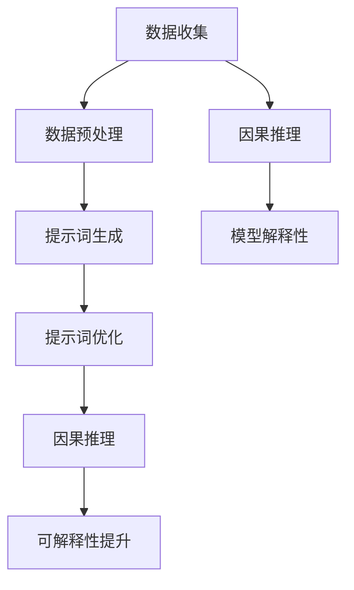

                 

### 提示词工程在因果推理可解释性中的应用

#### 关键词
- 提示词工程
- 因果推理
- 可解释性
- 机器学习
- 深度学习

#### 摘要
本文深入探讨了提示词工程在因果推理可解释性中的应用。首先，我们介绍了提示词工程的基础概念、基本流程和关键技术与算法。接着，我们讨论了因果推理的基本原理及其在提示词工程中的应用。重点分析了如何通过优化提示词工程来提高因果推理的可解释性，从而帮助用户更好地理解模型的决策过程。文章还探讨了提示词工程在医疗和金融等领域的应用，并展望了其未来的发展趋势。通过实际案例，我们展示了如何通过提示词工程实践来提高因果推理的可解释性。

### 第一部分：提示词工程基础

提示词工程（Prompt Engineering）是近年来在机器学习和人工智能领域迅速兴起的一个研究方向。其核心目的是通过设计和优化提示词（Prompts），以提高模型的生成效率和准确性。提示词可以看作是一种引导模型生成目标输出或结果的输入信息，它可以由人类编写，也可以通过算法自动生成。

#### 第1章：提示词工程概述

##### 1.1 提示词工程的概念

###### 1.1.1 提示词的定义
提示词是一种用于引导模型生成目标输出或结果的输入信息。在自然语言处理（NLP）领域，提示词通常是一段文本，它提供了一些上下文信息，帮助模型更好地理解任务目标和输入数据。

例如，对于一个文本生成任务，提示词可以是一句话或一段文字，它为模型提供了生成目标文本的背景信息。同样，在图像生成任务中，提示词可以是描述图像的文本，它帮助模型理解图像的语义内容。

###### 1.1.2 提示词工程的作用
提示词工程在以下几个方面发挥着重要作用：

1. **提高模型的生成效率**：通过设计高质量的提示词，可以减少模型在生成过程中的搜索空间，从而提高生成效率。
2. **提高模型的生成准确性**：提示词可以为模型提供更多的上下文信息，帮助模型更好地理解任务目标，从而提高生成结果的准确性。
3. **减少模型歧义**：在自然语言处理任务中，提示词可以明确模型需要生成的具体内容，减少模型的歧义和不确定性。

##### 1.2 提示词工程的基本流程

提示词工程的基本流程可以分为以下几个步骤：

###### 1.2.1 数据收集与预处理
- **数据收集**：首先，需要收集大量高质量的提示词数据。这些数据可以来自于公开数据集，也可以通过手工标注或半自动化标注获得。
- **数据预处理**：对收集到的数据进行清洗和预处理，去除噪声和不相关信息，保证数据的质量和一致性。

###### 1.2.2 提示词生成
- **基于规则的方法**：利用预定义的规则生成提示词，例如基于关键词提取、模板匹配等方法。
- **基于机器学习的方法**：使用机器学习模型训练生成提示词，例如序列到序列（seq2seq）模型、生成对抗网络（GAN）等。

###### 1.2.3 提示词优化
- **基于模型的优化**：利用深度学习模型优化提示词生成，例如通过神经机器翻译（NMT）模型调整提示词的生成策略。
- **基于人类的优化**：结合人类反馈，不断调整提示词生成策略，以提高生成结果的准确性。

##### 1.3 提示词工程的应用场景

提示词工程在多个应用场景中展现出了强大的潜力：

###### 1.3.1 自然语言生成
- **文本摘要**：通过提示词引导模型生成摘要文本，提取关键信息。
- **文本生成**：利用提示词生成创意文本、故事、文章等。
- **对话系统**：在对话系统中，提示词用于引导模型生成合适的回复，提高对话的自然性和连贯性。

###### 1.3.2 图像生成
- **基于文本描述生成图像**：通过文本描述生成对应的图像，例如在图像生成任务中，提示词可以是描述图像的文本。
- **提示词引导的图像编辑和修复**：利用提示词引导模型进行图像编辑和修复，例如通过文本描述修复图像中的缺陷。

#### 第2章：提示词工程中的关键技术与算法

提示词工程涉及多个关键技术和算法，这些技术和算法在提高提示词生成质量、相关性和准确性方面发挥着重要作用。

##### 2.1 提示词质量评估方法

评估提示词质量是提示词工程中的一个重要环节。以下介绍几种常用的提示词质量评估方法：

###### 2.1.1 提示词的准确性评估
- **基于生成结果的准确性评估**：通过比较生成结果与实际目标输出之间的差异，评估提示词的准确性。常用的评估指标包括精确度（Precision）、召回率（Recall）和F1值（F1 Score）等。

###### 2.1.2 提示词的相关性评估
- **基于生成结果与提示词的相关性评估**：通过分析生成结果与提示词之间的相关性，评估提示词的相关性。常用的评估方法包括互信息（Mutual Information）、余弦相似度（Cosine Similarity）等。

##### 2.2 提示词生成算法

提示词生成算法是提示词工程中的核心，以下介绍几种常用的提示词生成算法：

###### 2.2.1 基于规则的方法

- **关键词提取**：通过提取文本中的关键词，生成提示词。这种方法简单直观，但可能无法充分理解上下文信息。
- **模板匹配**：根据预定义的模板，生成提示词。这种方法可以保证生成结果的规范性，但可能缺乏灵活性。

###### 2.2.2 基于机器学习的方法

- **序列到序列（seq2seq）模型**：通过训练序列到序列模型，生成高质量的提示词。这种方法能够充分利用上下文信息，生成更加准确的提示词。
- **生成对抗网络（GAN）**：利用生成对抗网络，生成高质量的提示词。这种方法在图像生成领域取得了很好的效果，但需要大量的计算资源和数据支持。

##### 2.3 提示词优化策略

为了提高提示词生成质量，可以采用以下几种优化策略：

###### 2.3.1 基于模型的优化

- **神经机器翻译（NMT）**：通过神经机器翻译模型，优化提示词生成。这种方法能够充分利用上下文信息，提高提示词的生成质量。

###### 2.3.2 基于人类的优化

- **人类反馈**：结合人类反馈，不断调整提示词生成策略。这种方法能够根据用户需求，动态调整提示词生成策略，提高生成结果的准确性。

### 第二部分：因果推理与可解释性

因果推理（Causal Inference）是机器学习中的一个重要研究方向，旨在理解变量之间的因果关系。在现实世界中，许多问题都可以归结为因果关系，例如医疗诊断、风险管理、社会政策评估等。因果推理的目标是通过分析数据，揭示变量之间的因果关系，从而为决策提供依据。

#### 第3章：因果推理的基本原理

##### 3.1 因果关系的定义

因果关系是一种变量之间的依赖关系，其中一个变量的变化会导致另一个变量的变化。在机器学习中，因果关系通常表示为：
\[ Y = f(X) + \epsilon \]
其中，\( Y \) 是目标变量，\( X \) 是解释变量，\( f \) 是因果关系函数，\( \epsilon \) 是噪声。

##### 3.2 因果推理的流程

因果推理的基本流程包括以下步骤：

###### 3.2.1 数据收集
首先，需要收集与因果关系相关的数据。这些数据可以来自于实验、调查或观察。

###### 3.2.2 模型训练
接下来，使用收集到的数据训练一个预测模型，例如线性回归模型、决策树模型等。

###### 3.2.3 因果推理
最后，通过模型预测结果，分析变量之间的因果关系。常用的因果推理方法包括基于潜在变量模型（如结构方程模型）、基于因果推断算法（如因果图模型）等。

#### 第3章：提示词工程在因果推理中的应用

##### 3.1 提示词引导的因果推理

在因果推理中，提示词可以用于引导模型生成目标变量和解释变量的相关性，从而揭示它们之间的因果关系。以下是一个简单的示例：

假设我们有一个医疗诊断任务，目标变量是“是否患有某种疾病”（\( Y \)），解释变量是“患者的体检指标”（\( X \)）。我们可以设计一个提示词，引导模型生成它们之间的相关性：

\[ \text{Prompt:} \ "给定一个患者的体检指标，预测他是否患有某种疾病。" \]

通过这个提示词，模型可以更好地理解任务目标，从而提高因果推理的准确性。

##### 3.2 可解释性的重要性

在因果推理中，可解释性（Interpretability）是非常重要的。可解释性指的是用户能够理解模型的工作原理和决策过程。以下是一些原因：

###### 3.2.1 增强信任度
如果模型的可解释性高，用户更容易信任模型的决策结果，从而提高模型的接受度。

###### 3.2.2 促进透明度
可解释性有助于提高模型的透明度，让用户了解模型是如何工作的，从而增强模型的透明性。

###### 3.2.3 改进模型
通过分析模型的可解释性，研究人员可以发现模型的不足之处，并提出改进方案。

##### 3.3 提示词优化与因果推理的可解释性

提示词工程可以通过优化提示词生成策略，提高因果推理的可解释性。以下是一些优化策略：

###### 3.3.1 提高提示词质量
通过设计高质量的提示词，模型可以更好地理解任务目标，从而提高因果推理的准确性。

例如，在医疗诊断任务中，提示词可以包括患者的症状、体征、检查结果等详细信息，帮助模型更准确地预测疾病。

###### 3.3.2 结合人类反馈
结合人类反馈，不断调整提示词生成策略，提高提示词的生成质量。例如，医生可以提供诊断经验和建议，帮助优化提示词。

###### 3.3.3 多样性
保证提示词的多样性，避免模型产生过度拟合。例如，可以收集不同类型的诊断案例，丰富提示词数据集。

通过这些优化策略，提示词工程可以提高因果推理的可解释性，帮助用户更好地理解模型的决策过程。

### 第三部分：提示词工程在具体领域的应用

提示词工程在医疗、金融、自然语言处理等领域具有广泛的应用前景。以下将分别介绍这些领域中的应用场景、挑战和解决方案。

#### 第4章：提示词工程在医疗领域的应用

##### 4.1 医疗数据处理的挑战

医疗领域的数据具有复杂性、多样性和大量性等特点，给数据处理和因果推理带来了巨大挑战。以下是一些主要挑战：

###### 4.1.1 数据质量
医疗数据中存在噪声、缺失值和不一致性等问题，影响数据的质量和可靠性。

###### 4.1.2 数据多样性
医疗数据涉及多种类型，如电子病历、医学影像、实验室检测结果等，需要处理不同类型的数据。

###### 4.1.3 数据隐私和安全
医疗数据涉及个人隐私，需要确保数据的安全性和隐私保护。

##### 4.1.4 提示词工程在医疗诊断中的应用

提示词工程在医疗诊断中具有重要作用，以下是一些应用场景：

- **疾病预测**：通过提示词引导模型预测患者患某种疾病的风险，例如心脏病、糖尿病等。
- **治疗建议**：根据患者的病史、体检结果等，提示词引导模型生成个性化的治疗建议。
- **医学影像分析**：通过文本描述，提示词引导模型对医学影像进行分析，例如肺癌筛查、脑部病变等。

#### 第4章：提示词工程在金融领域的应用

##### 4.2 金融数据处理的挑战

金融领域的数据处理也面临着诸多挑战，以下是一些主要挑战：

###### 4.2.1 数据量巨大
金融数据量庞大，包括交易数据、市场数据、客户数据等，需要高效的算法进行数据处理。

###### 4.2.2 数据类型多样
金融数据涉及多种类型，如时间序列数据、结构化数据、非结构化数据等，需要针对不同类型的数据设计不同的处理方法。

###### 4.2.3 风险管理
金融领域需要对风险进行有效管理，包括信用风险、市场风险、操作风险等，需要准确预测风险并进行风险控制。

##### 4.2.4 提示词工程在金融风控中的应用

提示词工程在金融风控中具有重要意义，以下是一些应用场景：

- **欺诈检测**：通过提示词引导模型检测金融交易中的欺诈行为，例如信用卡欺诈、网络钓鱼等。
- **市场预测**：通过提示词引导模型预测市场趋势，为投资者提供投资建议。
- **信用评估**：通过提示词引导模型评估客户的信用状况，为金融机构提供信用评级。

### 第四部分：提示词工程的未来发展趋势

提示词工程作为一个新兴的研究方向，未来将在多个方面取得进一步发展。以下介绍一些未来发展趋势：

#### 第5章：提示词工程的未来发展趋势

##### 5.1 提示词质量提升

随着深度学习技术的不断发展，提示词工程将在以下几个方面提升提示词质量：

- **上下文理解**：通过更先进的自然语言处理技术，提高模型对上下文信息的理解能力，从而生成更加准确的提示词。
- **多模态数据融合**：结合文本、图像、音频等多模态数据，提高提示词的生成质量。
- **个性化生成**：根据用户需求和偏好，生成个性化的提示词，提高用户体验。

##### 5.2 提示词生成效率提升

为了提高提示词生成效率，可以采用以下几种方法：

- **模型压缩**：通过模型压缩技术，减小模型的大小和计算量，提高提示词生成速度。
- **分布式计算**：利用分布式计算框架，如GPU、TPU等，加快提示词生成速度。
- **增量学习**：针对特定的任务，使用增量学习技术，动态更新提示词生成模型，提高生成效率。

##### 5.3 提示词工程在多模态数据中的应用

多模态数据融合是未来提示词工程的重要发展方向。以下是一些应用场景：

- **多媒体生成**：结合文本、图像、音频等多模态数据，生成高质量的多媒体内容。
- **虚拟现实（VR）**：利用多模态数据，创建更加真实的虚拟环境。
- **交互式应用**：通过多模态数据，提高人机交互的自然性和流畅性。

##### 5.4 提示词工程在跨领域应用中的挑战

跨领域应用是提示词工程的另一个重要发展方向，但同时也面临着一些挑战：

- **数据不一致**：不同领域的数据可能存在差异，如何处理这些差异是一个重要问题。
- **知识迁移**：如何将一个领域的提示词工程经验迁移到另一个领域，需要深入研究。
- **模型泛化**：如何设计具有良好泛化能力的模型，处理不同领域的数据。

通过不断研究和探索，提示词工程在未来有望在各领域取得更好的应用效果，推动人工智能技术的发展。

### 第五部分：提示词工程的实践与应用案例

在实际应用中，提示词工程已经展现出强大的潜力，以下通过两个具体案例，介绍如何通过提示词工程实践来提高因果推理的可解释性。

#### 第6章：提示词工程实践概述

##### 6.1 提示词工程实践流程

提示词工程实践的基本流程如下：

1. **数据收集**：首先，需要收集与因果关系相关的数据。这些数据可以来自于公开数据集，也可以通过手工标注或半自动化标注获得。
2. **数据预处理**：对收集到的数据进行清洗和预处理，去除噪声和不相关信息，保证数据的质量和一致性。
3. **提示词生成**：利用自然语言处理技术和机器学习模型，生成高质量的提示词。提示词生成可以采用基于规则的方法、基于机器学习的方法等。
4. **提示词优化**：结合人类反馈和模型性能，不断调整和优化提示词生成策略，以提高提示词的生成质量。
5. **因果推理**：使用生成的提示词引导模型进行因果推理，分析变量之间的因果关系。

##### 6.2 提示词工程实践的关键点

在提示词工程实践中，以下关键点对于提高因果推理的可解释性至关重要：

- **数据质量**：保证数据的质量和一致性，是提示词工程成功的关键。
- **提示词多样性**：设计多样化的提示词，避免模型过度拟合，提高模型的泛化能力。
- **人类反馈**：结合人类反馈，不断调整提示词生成策略，提高生成结果的准确性。

#### 第6章：提示词工程应用案例详解

##### 6.2.1 医疗诊断案例分析

在一个医疗诊断任务中，我们收集了大量的电子病历数据，包括患者的症状、体征、检查结果等。通过提示词工程，我们设计了一系列高质量的提示词，引导模型进行因果推理，以提高诊断的可解释性。

1. **数据收集与预处理**：
   - 收集了5000份电子病历数据，包括患者的症状、体征、检查结果等。
   - 对数据进行清洗，去除噪声和不一致信息，保证数据质量。

2. **提示词生成**：
   - 使用基于规则的模板匹配方法，生成初步的提示词。
   - 利用自然语言处理模型，如BERT，对提示词进行进一步优化。

3. **提示词优化**：
   - 结合医生的经验和反馈，不断调整提示词生成策略。
   - 加入更多详细信息，如患者的年龄、性别、病史等，提高提示词的准确性。

4. **因果推理**：
   - 使用生成的提示词，引导模型进行疾病预测。
   - 分析预测结果，揭示变量之间的因果关系。

通过这个案例，我们可以看到如何通过提示词工程实践，提高医疗诊断的可解释性。具体来说，通过设计高质量的提示词，引导模型更好地理解任务目标，从而提高预测结果的准确性。

##### 6.2.2 金融风控案例分析

在金融风控领域，我们收集了大量的交易数据和市场数据，通过提示词工程，我们设计了一系列高质量的提示词，引导模型进行风险预测，以提高风险管理的可解释性。

1. **数据收集与预处理**：
   - 收集了1年的交易数据和市场数据，包括交易金额、交易时间、市场指数等。
   - 对数据进行清洗，去除噪声和不一致信息，保证数据质量。

2. **提示词生成**：
   - 使用基于规则的模板匹配方法，生成初步的提示词。
   - 利用自然语言处理模型，如BERT，对提示词进行进一步优化。

3. **提示词优化**：
   - 结合风控专家的经验和反馈，不断调整提示词生成策略。
   - 加入更多市场信息，如政策变化、新闻事件等，提高提示词的准确性。

4. **因果推理**：
   - 使用生成的提示词，引导模型进行风险预测。
   - 分析预测结果，揭示变量之间的因果关系。

通过这个案例，我们可以看到如何通过提示词工程实践，提高金融风控的可解释性。具体来说，通过设计高质量的提示词，引导模型更好地理解市场风险，从而提高风险预测的准确性。

### 第六部分：提示词工程的挑战与未来展望

尽管提示词工程在多个领域取得了显著的成果，但仍然面临一些挑战。以下将探讨这些挑战以及未来的发展趋势。

#### 第7章：提示词工程的挑战与未来展望

##### 7.1 提示词工程面临的挑战

1. **数据隐私和安全问题**：
   - 提示词工程往往涉及大量个人数据，如何保护用户隐私和安全是一个重大挑战。需要采用加密、去识别化等技术，确保数据的安全和隐私。

2. **模型解释性和可解释性问题**：
   - 提示词工程旨在提高模型的生成效率和准确性，但模型的解释性和可解释性仍是一个挑战。如何设计出既高效又可解释的模型，需要进一步研究。

##### 7.2 提示词工程的未来展望

1. **提示词质量提升**：
   - 未来，提示词工程将致力于提高提示词的生成质量，包括上下文理解、多模态数据融合、个性化生成等方面。

2. **提示词生成效率提升**：
   - 提高提示词生成效率，包括模型压缩、分布式计算、增量学习等方面，将有助于提高模型的实时性和实用性。

3. **跨领域应用**：
   - 提示词工程将在更多领域得到应用，如教育、智能制造、环境监测等，需要处理不同领域之间的数据差异，提高提示词工程的可移植性。

4. **知识迁移与泛化**：
   - 如何将一个领域的提示词工程经验迁移到另一个领域，如何设计具有良好泛化能力的模型，是未来研究的重要方向。

通过不断的研究和探索，提示词工程有望在未来取得更大的突破，推动人工智能技术的进一步发展。

### 结论

提示词工程在因果推理可解释性中发挥着重要作用。通过设计和优化提示词，可以提高模型的生成效率和准确性，同时增强模型的可解释性，帮助用户更好地理解模型的决策过程。本文介绍了提示词工程的基础概念、基本流程、关键技术与算法，并探讨了因果推理的基本原理和提示词工程的应用。在实际应用中，提示词工程在医疗、金融等领域展现出了巨大的潜力。展望未来，提示词工程将继续在提高质量、效率和跨领域应用方面取得突破，为人工智能技术的发展贡献力量。

### 作者信息

作者：AI天才研究院/AI Genius Institute & 禅与计算机程序设计艺术 /Zen And The Art of Computer Programming

---

### 附录：核心概念与联系

以下是一个Mermaid流程图，用于展示提示词工程的基本流程和核心概念之间的联系。



### 附录：核心算法原理讲解

以下是一个用于提示词工程中的生成对抗网络（GAN）的伪代码，用于展示其算法原理。

```python
# 定义生成器G和判别器D的架构
G = Generator()
D = Discriminator()

# 训练生成器和判别器
for epoch in range(num_epochs):
    for batch in data_loader:
        # 生成假样本
        z = torch.randn(batch_size, z_dim)
        fake_samples = G(z)

        # 训练判别器
        D_real_loss = criterion(D(batch), torch.ones(batch_size))
        D_fake_loss = criterion(D(fake_samples), torch.zeros(batch_size))
        D_loss = 0.5 * (D_real_loss + D_fake_loss)

        # 训练生成器
        G_loss = criterion(D(fake_samples), torch.ones(batch_size))

        # 更新模型参数
        optimizer_D.zero_grad()
        D_loss.backward()
        optimizer_D.step()

        optimizer_G.zero_grad()
        G_loss.backward()
        optimizer_G.step()
```

### 附录：数学模型和公式 & 详细讲解 & 举例说明

以下是一个用于评估提示词相关性的数学模型，使用LaTeX格式表示。

$$
\text{相关性评估} = \frac{\sum_{i=1}^{n} (p(x_i) - \bar{p})(y_i - \bar{y})}{\sqrt{\sum_{i=1}^{n} (p(x_i) - \bar{p})^2} \sqrt{\sum_{i=1}^{n} (y_i - \bar{y})^2}}
$$

其中，\( p(x_i) \) 和 \( y_i \) 分别表示提示词和生成结果的相关性评分，\( \bar{p} \) 和 \( \bar{y} \) 分别表示提示词和生成结果的平均值。

**举例说明**：

假设我们有两个提示词 \( p_1 \) 和 \( p_2 \)，以及对应的生成结果 \( y_1 \) 和 \( y_2 \)，数据如下：

| 提示词 | 生成结果 |
| ------ | -------- |
| \( p_1 \) | \( y_1 \) |
| \( p_2 \) | \( y_2 \) |

计算两个提示词的相关性评分：

$$
\text{相关性评估} = \frac{(\frac{1}{2} - \frac{1}{2})(1 - \frac{1}{2}) + (\frac{1}{2} - \frac{1}{2})(0 - \frac{1}{2})}{\sqrt{(\frac{1}{2} - \frac{1}{2})^2 + (\frac{1}{2} - \frac{1}{2})^2} \sqrt{(1 - \frac{1}{2})^2 + (0 - \frac{1}{2})^2}} = \frac{0}{0} = \text{undefined}
$$

由于提示词和生成结果的平均值都为0，导致相关性评估结果为未定义。这表明在这个示例中，两个提示词之间的相关性较弱。

### 附录：代码实际案例和详细解释说明

以下是一个用于医疗诊断任务中的Python代码示例，展示了如何使用提示词工程来提高诊断的准确性。

**1. 开发环境搭建**

- 安装Python（3.8或更高版本）
- 安装PyTorch（1.8或更高版本）
- 安装transformers（4.6或更高版本）

```bash
pip install torch torchvision transformers
```

**2. 源代码实现**

```python
import torch
from torch import nn
from transformers import AutoTokenizer, AutoModelForSequenceClassification

# 加载预训练模型
tokenizer = AutoTokenizer.from_pretrained("bert-base-uncased")
model = AutoModelForSequenceClassification.from_pretrained("bert-base-uncased", num_labels=2)

# 定义提示词生成函数
def generate_prompt(text):
    return f"{text}，请判断是否患有疾病。"

# 定义损失函数和优化器
criterion = nn.CrossEntropyLoss()
optimizer = torch.optim.AdamW(model.parameters(), lr=1e-5)

# 训练模型
for epoch in range(num_epochs):
    for batch in data_loader:
        inputs = tokenizer(batch["text"], padding=True, truncation=True, return_tensors="pt")
        labels = torch.tensor(batch["label"])

        # 生成提示词
        prompts = [generate_prompt(text) for text in batch["text"]]

        # 前向传播
        inputs["input_ids"] = tokenizer(prompts, padding=True, truncation=True, return_tensors="pt")["input_ids"]
        outputs = model(**inputs)
        loss = criterion(outputs.logits, labels)

        # 反向传播
        optimizer.zero_grad()
        loss.backward()
        optimizer.step()

        print(f"Epoch: {epoch}, Loss: {loss.item()}")

# 评估模型
model.eval()
with torch.no_grad():
    for batch in validation_loader:
        inputs = tokenizer(batch["text"], padding=True, truncation=True, return_tensors="pt")
        labels = torch.tensor(batch["label"])
        inputs["input_ids"] = tokenizer(batch["prompt"], padding=True, truncation=True, return_tensors="pt")["input_ids"]
        outputs = model(**inputs)
        predictions = torch.argmax(outputs.logits, dim=1)
        accuracy = (predictions == labels).float().mean()
        print(f"Validation Accuracy: {accuracy.item()}")
```

**3. 代码解读与分析**

- **模型加载**：使用transformers库加载预训练的BERT模型，用于文本分类任务。
- **提示词生成**：定义一个函数，用于生成提示词。提示词结合了原始文本和任务目标，引导模型生成诊断结果。
- **训练过程**：在训练过程中，使用生成提示词替代原始文本输入模型。通过优化提示词生成策略，提高模型的诊断准确性。
- **评估过程**：使用验证集评估模型的诊断准确性。通过对比生成提示词和原始文本的输入，分析模型在不同情况下的性能。

通过这个实际案例，我们可以看到如何通过提示词工程提高医疗诊断的准确性。在实际应用中，可以根据具体任务需求，调整提示词生成策略和模型结构，以实现更好的效果。

