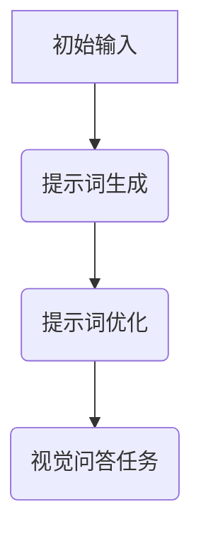
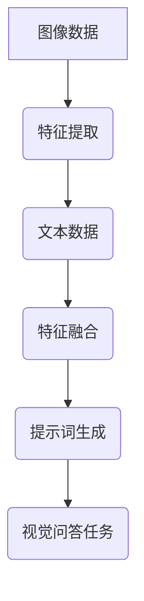

                 

### 《提示词工程在视觉问答任务中的创新》

**关键词**：提示词工程、视觉问答、多模态融合、强化学习、自监督学习

**摘要**：本文深入探讨了提示词工程在视觉问答任务中的应用与创新。首先，我们对视觉问答任务进行了概述，探讨了其定义、重要性及面临的挑战。接着，我们介绍了提示词工程的基础概念、关键技术及其应用场景。随后，本文提出了多模态融合提示词工程、基于强化学习的提示词工程及自监督提示词工程等创新方法，并通过实际项目进行了详细剖析。最后，我们对提示词工程的未来发展趋势、挑战及研究方向进行了展望。希望通过本文的探讨，能为视觉问答任务的研究者提供新的思路和方法。

### 《提示词工程在视觉问答任务中的创新》目录大纲

#### 第一部分：背景与基础

##### 第1章：视觉问答任务概述

###### 1.1 视觉问答任务的定义与重要性

- **视觉问答任务的定义**：视觉问答（Visual Question Answering, VQA）任务是指根据给定的图像和问题，生成一个准确、合理的答案。它融合了计算机视觉和自然语言处理两个领域，旨在解决图像理解和自然语言理解的问题。
- **视觉问答任务的重要性**：随着人工智能技术的发展，视觉问答任务在多个领域都具有重要意义，包括智能助手、自动驾驶、医疗影像诊断等。

###### 1.2 视觉问答任务的挑战与需求

- **数据理解**：视觉问答任务需要模型能够理解和分析图像中的内容，提取关键信息。
- **上下文推理**：模型需要能够理解问题的上下文，并利用图像内容进行推理。
- **实时性**：在实际应用中，视觉问答系统需要能够快速响应用户的查询。

##### 第2章：提示词工程基础

###### 2.1 提示词工程的概念

- **提示词的定义**：提示词是指用于引导模型进行特定任务的关键词或短语。
- **提示词工程的目标**：通过设计和优化提示词，提高模型在特定任务中的性能和鲁棒性。

###### 2.2 提示词工程的关键技术

- **提示词生成**：根据任务需求生成合适的提示词。
- **提示词优化**：通过调整提示词的参数或结构，优化模型在特定任务上的表现。

###### 2.3 提示词工程的应用场景

- **图像识别**：通过提示词引导模型识别图像中的物体或场景。
- **视频分析**：利用提示词对视频内容进行理解和分析。
- **交互式查询**：在交互式查询场景中，提示词用于引导用户输入更精确的问题。

#### 第二部分：创新方法

##### 第3章：多模态融合提示词工程

###### 3.1 多模态数据融合

- **图像与文本融合**：将图像内容和文本信息进行结合，以提高模型的上下文理解能力。
- **视频与文本融合**：将视频内容和文本信息进行结合，以实现对动态场景的深入分析。

###### 3.2 多模态提示词生成

- **基于深度学习的多模态提示词生成**：利用深度学习技术，从多模态数据中生成提示词。
- **基于传统方法的融合策略**：结合传统图像处理和自然语言处理方法，设计多模态提示词生成策略。

###### 3.3 多模态提示词优化

- **跨模态语义一致性**：通过优化提示词，确保图像和文本信息之间的语义一致性。
- **实时性优化**：设计实时性优化的提示词工程方法，以适应快速响应的需求。

##### 第4章：基于强化学习的提示词工程

###### 4.1 强化学习基础

- **强化学习的定义**：强化学习是一种通过试错和反馈来学习最优策略的方法。
- **强化学习的基本原理**：包括状态、动作、奖励和策略等概念。

###### 4.2 提示词生成与优化

- **基于强化学习的提示词生成**：利用强化学习算法生成高质量的提示词。
- **基于强化学习的提示词优化**：通过强化学习优化提示词，提高模型在视觉问答任务中的性能。

###### 4.3 提示词工程在强化学习中的应用

- **视觉问答**：利用强化学习优化视觉问答任务的提示词。
- **图像识别**：通过强化学习提高图像识别任务中的提示词质量。

##### 第5章：自监督提示词工程

###### 5.1 自监督学习基础

- **自监督学习的定义**：自监督学习是一种利用未标记数据学习模型的方法。
- **自监督学习的基本原理**：包括预训练和微调等步骤。

###### 5.2 自监督提示词生成

- **基于预训练模型的自监督提示词生成**：利用预训练模型生成提示词。
- **基于数据增强的自监督提示词生成**：通过数据增强方法生成多样化的提示词。

###### 5.3 自监督提示词优化

- **自监督提示词优化的策略**：设计自监督提示词优化的策略，以提高模型性能。
- **自监督提示词优化的效果评估**：评估自监督提示词优化方法的有效性。

##### 第6章：提示词工程在视觉问答中的实战应用

###### 6.1 实战项目介绍

- **项目背景**：介绍视觉问答项目的背景和目标。
- **项目目标**：明确视觉问答项目的主要目标。

###### 6.2 数据集与预处理

- **数据集介绍**：介绍用于视觉问答任务的数据集。
- **数据预处理方法**：描述数据预处理的方法和步骤。

###### 6.3 提示词生成与优化

- **提示词生成策略**：介绍用于生成提示词的方法和策略。
- **提示词优化策略**：描述用于优化提示词的方法和策略。

###### 6.4 实验结果与分析

- **实验设计**：描述实验的设计和设置。
- **实验结果**：展示实验的结果和性能。
- **分析与讨论**：对实验结果进行分析和讨论。

##### 第7章：未来展望与挑战

###### 7.1 提示词工程的未来发展趋势

- **新技术应用**：探讨新技术在提示词工程中的应用前景。
- **新场景探索**：探索提示词工程在新的应用场景中的可能性。

###### 7.2 提示词工程面临的挑战

- **数据质量**：讨论数据质量对提示词工程的影响。
- **算法优化**：探讨如何优化算法以提高提示词工程的效果。
- **实时性**：研究如何在保证实时性的前提下进行提示词工程。

###### 7.3 提示词工程的未来研究方向

- **跨学科融合**：探讨不同学科在提示词工程中的应用。
- **智能化提升**：研究如何通过智能化方法提升提示词工程的效果。

#### 第三部分：附录

##### 第8章：资源与工具

###### 8.1 提示词工程相关工具

- **提示词生成工具**：介绍常用的提示词生成工具。
- **提示词优化工具**：描述常用的提示词优化工具。

###### 8.2 提示词工程相关资源

- **研究论文**：推荐相关领域的经典研究论文。
- **开源代码库**：介绍常用的开源代码库。
- **数据集介绍**：介绍常用的数据集及其来源。

##### 第9章：参考文献

- **参考文献列表**：列出本文引用的相关文献。

## 附录A：Mermaid流程图

### 提示词工程流程



### 多模态融合流程



## 附录B：伪代码

### 提示词生成伪代码

```python
function 提示词生成(图像数据，文本数据):
    # 预处理图像数据和文本数据
    图像特征 = 图像数据预处理(图像数据)
    文本特征 = 文本数据预处理(文本数据)
    
    # 提取图像特征和文本特征
    图像特征 = 图像特征提取(图像特征)
    文本特征 = 文本特征提取(文本特征)
    
    # 融合图像特征和文本特征
    提示词 = 图像特征融合(图像特征，文本特征)
    
    return 提示词
```

### 提示词优化伪代码

```python
function 提示词优化(提示词，视觉问答任务数据):
    # 初始化提示词
    初始提示词 = 初始值
    
    # 迭代优化提示词
    for each 数据 in 视觉问答任务数据:
        # 计算损失函数
        损失 = 损失函数(提示词，数据)
        
        # 更新提示词
        提示词 = 更新函数(提示词，损失)
        
    return 提示词
```

### 提示词优化损失函数

$$
L = \frac{1}{2} \sum_{i=1}^{N} (y_i - f(x_i))^2
$$

其中，$y_i$为真实标签，$f(x_i)$为预测结果。

---

**作者：**AI天才研究院/AI Genius Institute & 禅与计算机程序设计艺术 /Zen And The Art of Computer Programming

---

### 《提示词工程在视觉问答任务中的创新》

视觉问答（Visual Question Answering，VQA）作为计算机视觉和自然语言处理领域的交叉点，近年来吸引了大量研究者的关注。它不仅是对计算机视觉技术的一次挑战，也对自然语言处理提出了新的要求。本文将探讨提示词工程在视觉问答任务中的创新，通过多模态融合、强化学习和自监督学习等方法，提升视觉问答系统的性能和适用性。

**关键词**：提示词工程、视觉问答、多模态融合、强化学习、自监督学习

**摘要**：本文首先概述了视觉问答任务的定义、重要性以及面临的挑战。接着，我们详细介绍了提示词工程的基础概念和关键技术。随后，本文提出了多模态融合提示词工程、基于强化学习的提示词工程以及自监督提示词工程等创新方法。最后，通过一个实际项目展示了提示词工程在视觉问答任务中的应用，并对未来的发展趋势和挑战进行了展望。

---

## 第一部分：背景与基础

### 第1章：视觉问答任务概述

#### 1.1 视觉问答任务的定义与重要性

视觉问答任务是指基于给定的图像和自然语言问题，生成一个准确、合理的答案。这一任务不仅需要模型理解图像内容，还需要理解问题的语义，并能够将两者结合起来进行推理。视觉问答任务的重要性在于：

1. **智能助手**：视觉问答技术可以用于智能助手，使其能够更好地理解用户的需求，提供更精准的服务。
2. **自动驾驶**：在自动驾驶系统中，视觉问答可以帮助车辆更好地理解道路状况，提高行驶安全性。
3. **医疗影像诊断**：视觉问答可以辅助医生分析医学影像，提供诊断建议，提高医疗水平。

#### 1.2 视觉问答任务的挑战与需求

视觉问答任务面临着多个挑战，主要包括：

1. **数据理解**：模型需要能够从图像中提取关键信息，理解图像内容。
2. **上下文推理**：模型需要理解问题的上下文，并利用图像内容进行推理。
3. **实时性**：在实际应用中，视觉问答系统需要能够快速响应用户的查询。

为了应对这些挑战，视觉问答任务对模型提出了以下需求：

1. **多模态数据融合**：结合图像和文本信息，提高模型的理解能力。
2. **强大的语义理解能力**：模型需要能够理解复杂的语义信息，进行有效的推理。
3. **高效的计算性能**：为了实现实时响应，模型需要具备高效的计算性能。

### 第2章：提示词工程基础

#### 2.1 提示词工程的概念

提示词工程是指设计、生成和优化用于引导模型进行特定任务的关键词或短语。在视觉问答任务中，提示词用于引导模型理解问题和图像之间的关系。提示词工程的目标是通过优化提示词，提高模型在视觉问答任务中的性能。

#### 2.2 提示词工程的关键技术

1. **提示词生成**：根据任务需求生成合适的提示词。提示词生成的技术包括基于规则的方法、基于统计的方法和基于深度学习的方法。
2. **提示词优化**：通过调整提示词的参数或结构，优化模型在特定任务上的表现。提示词优化的技术包括基于启发式的方法和基于学习的方法。

#### 2.3 提示词工程的应用场景

1. **图像识别**：通过提示词引导模型识别图像中的物体或场景。
2. **视频分析**：利用提示词对视频内容进行理解和分析。
3. **交互式查询**：在交互式查询场景中，提示词用于引导用户输入更精确的问题。

### 第3章：多模态融合提示词工程

多模态融合是指将不同模态的数据（如图像和文本）进行结合，以提升模型的整体性能。在视觉问答任务中，多模态融合可以有效地提高模型对问题和图像的理解能力。

#### 3.1 多模态数据融合

1. **图像与文本融合**：将图像特征和文本特征进行融合，以提高模型的语义理解能力。常见的融合方法包括特征拼接、特征加权融合和特征注意力机制。
2. **视频与文本融合**：将视频特征和文本特征进行融合，以实现对动态场景的深入分析。视频与文本融合的关键在于如何有效地提取和融合视频帧和文本信息。

#### 3.2 多模态提示词生成

1. **基于深度学习的多模态提示词生成**：利用深度学习技术，从多模态数据中生成高质量的提示词。常见的模型包括多模态神经网络和图神经网络。
2. **基于传统方法的融合策略**：结合传统图像处理和自然语言处理方法，设计多模态提示词生成策略。传统方法包括特征匹配和文本嵌入。

#### 3.3 多模态提示词优化

1. **跨模态语义一致性**：通过优化提示词，确保图像和文本信息之间的语义一致性。常见的方法包括基于注意力机制的优化和基于对抗网络的优化。
2. **实时性优化**：设计实时性优化的提示词工程方法，以适应快速响应的需求。常见的方法包括增量学习和模型压缩。

### 第4章：基于强化学习的提示词工程

强化学习（Reinforcement Learning，RL）是一种通过试错和反馈来学习最优策略的方法。在视觉问答任务中，强化学习可以用于优化提示词，提高模型的表现。

#### 4.1 强化学习基础

1. **强化学习的定义**：强化学习是指通过最大化累积奖励来学习最优策略。
2. **强化学习的基本原理**：包括状态（State）、动作（Action）、奖励（Reward）和策略（Policy）等概念。

#### 4.2 提示词生成与优化

1. **基于强化学习的提示词生成**：利用强化学习算法，从历史数据和奖励信号中生成高质量的提示词。
2. **基于强化学习的提示词优化**：通过强化学习算法，优化提示词的参数或结构，提高模型在视觉问答任务中的性能。

#### 4.3 提示词工程在强化学习中的应用

1. **视觉问答**：利用强化学习优化视觉问答任务的提示词，提高模型的回答准确性。
2. **图像识别**：通过强化学习优化图像识别任务中的提示词，提高模型的识别能力。

### 第5章：自监督提示词工程

自监督学习（Self-Supervised Learning）是一种利用未标记数据学习模型的方法。在视觉问答任务中，自监督学习可以用于提示词的生成和优化。

#### 5.1 自监督学习基础

1. **自监督学习的定义**：自监督学习是指通过利用数据内在结构来学习模型。
2. **自监督学习的基本原理**：包括预训练和微调等步骤。

#### 5.2 自监督提示词生成

1. **基于预训练模型的自监督提示词生成**：利用预训练模型生成高质量的提示词。
2. **基于数据增强的自监督提示词生成**：通过数据增强方法生成多样化的提示词。

#### 5.3 自监督提示词优化

1. **自监督提示词优化的策略**：设计自监督提示词优化的策略，以提高模型性能。
2. **自监督提示词优化的效果评估**：评估自监督提示词优化方法的有效性。

### 第6章：提示词工程在视觉问答中的实战应用

#### 6.1 实战项目介绍

1. **项目背景**：介绍视觉问答项目的背景和目标。
2. **项目目标**：明确视觉问答项目的主要目标。

#### 6.2 数据集与预处理

1. **数据集介绍**：介绍用于视觉问答任务的数据集。
2. **数据预处理方法**：描述数据预处理的方法和步骤。

#### 6.3 提示词生成与优化

1. **提示词生成策略**：介绍用于生成提示词的方法和策略。
2. **提示词优化策略**：描述用于优化提示词的方法和策略。

#### 6.4 实验结果与分析

1. **实验设计**：描述实验的设计和设置。
2. **实验结果**：展示实验的结果和性能。
3. **分析与讨论**：对实验结果进行分析和讨论。

### 第7章：未来展望与挑战

#### 7.1 提示词工程的未来发展趋势

1. **新技术应用**：探讨新技术在提示词工程中的应用前景。
2. **新场景探索**：探索提示词工程在新的应用场景中的可能性。

#### 7.2 提示词工程面临的挑战

1. **数据质量**：讨论数据质量对提示词工程的影响。
2. **算法优化**：探讨如何优化算法以提高提示词工程的效果。
3. **实时性**：研究如何在保证实时性的前提下进行提示词工程。

#### 7.3 提示词工程的未来研究方向

1. **跨学科融合**：探讨不同学科在提示词工程中的应用。
2. **智能化提升**：研究如何通过智能化方法提升提示词工程的效果。

### 第8章：资源与工具

#### 8.1 提示词工程相关工具

1. **提示词生成工具**：介绍常用的提示词生成工具。
2. **提示词优化工具**：描述常用的提示词优化工具。

#### 8.2 提示词工程相关资源

1. **研究论文**：推荐相关领域的经典研究论文。
2. **开源代码库**：介绍常用的开源代码库。
3. **数据集介绍**：介绍常用的数据集及其来源。

### 第9章：参考文献

列出本文引用的相关文献。

