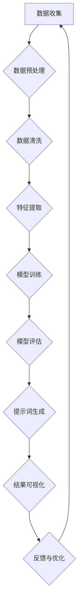

                 

## 《提示词工程在计算人类学中的创新应用》

### 关键词：提示词工程，计算人类学，数据处理，文本分析，图像处理，人工智能应用

> 摘要：本文旨在探讨提示词工程在计算人类学领域中的创新应用。通过分析计算人类学的背景、基础理论和核心概念，我们深入探讨了提示词工程的方法和流程。在此基础上，本文详细介绍了提示词工程在计算人类学中的多种应用场景，包括文本分析和图像处理。通过具体案例和代码实战，我们展示了提示词工程在实际项目中的运用，旨在为计算人类学研究提供新的思路和方法。

### 引言

随着信息技术的飞速发展，人工智能（AI）在各个领域得到了广泛应用。计算人类学作为人工智能的重要分支，旨在运用计算机技术和算法对人类行为、文化和社会现象进行分析和研究。近年来，提示词工程作为一种新兴的方法，逐渐在计算人类学中崭露头角，为该领域的研究提供了新的视角和工具。

提示词工程，即通过对文本、图像等数据进行处理和分析，提取关键信息并生成具有指导性的提示词。这些提示词能够帮助研究者更好地理解和解释复杂的数据，从而推动计算人类学的发展。本文将围绕提示词工程在计算人类学中的创新应用进行探讨，旨在为该领域的研究提供新的思路和方法。

### 第一部分：计算人类学背景与基础理论

#### 1.1 计算人类学概述

**1.1.1 计算人类学的定义与起源**

计算人类学是一门跨学科领域，结合了计算机科学、人类学和社会科学的知识，旨在通过计算技术和方法来分析和解释人类行为、文化和社会现象。计算人类学的起源可以追溯到20世纪90年代，当时计算机科学和社会科学领域的研究者开始探索如何运用计算机技术和算法来研究人类行为和社会现象。

**1.1.2 计算人类学的应用领域**

计算人类学的应用领域广泛，涵盖了文化人类学、社会人类学、考古学、语言学等多个学科。具体应用包括文化差异分析、社会网络分析、语言习得与演变、人类行为模式识别等。通过计算人类学的方法，研究者能够从海量数据中发现规律和趋势，从而对人类行为和社会现象进行深入分析。

**1.1.3 计算人类学的发展趋势**

随着信息技术的不断进步，计算人类学也在不断发展。目前，计算人类学的研究趋势主要集中在以下几个方面：

1. 大规模数据分析和挖掘：随着互联网和大数据技术的发展，人类产生和积累的数据量呈现爆炸式增长。计算人类学需要应对这一挑战，运用先进的数据分析和挖掘技术来提取有用信息。

2. 深度学习和机器学习：深度学习和机器学习技术为计算人类学提供了强大的工具，使其能够更好地理解和解释复杂的数据。目前，深度学习和机器学习已经在计算人类学的多个应用领域中取得了显著成果。

3. 跨学科合作：计算人类学的发展离不开跨学科合作。与计算机科学、社会学、心理学、语言学等学科的紧密合作，有助于推动计算人类学的创新和发展。

#### 1.2 计算人类学核心概念

**1.2.1 提示词工程**

提示词工程是一种通过文本、图像等数据提取关键信息并生成提示词的方法。在计算人类学中，提示词工程主要用于文本分析和图像处理，帮助研究者从海量数据中发现规律和趋势。

**1.2.2 大规模数据处理**

大规模数据处理是指处理海量数据的技术和方法。在计算人类学中，大规模数据处理技术有助于从海量数据中提取有用信息，从而支持研究工作的进行。

**1.2.3 数据可视化**

数据可视化是一种通过图形和图表来展示数据的方法。在计算人类学中，数据可视化技术有助于研究者更好地理解和解释数据，从而推动研究工作的深入进行。

#### 1.3 计算人类学技术基础

**1.3.1 数据挖掘算法**

数据挖掘算法是指用于从大量数据中发现规律和趋势的方法。在计算人类学中，数据挖掘算法广泛应用于文本分析和图像处理，帮助研究者从海量数据中提取有用信息。

**1.3.2 机器学习与深度学习**

机器学习和深度学习技术是计算人类学的重要工具。通过这些技术，研究者能够从数据中学习并建立预测模型，从而更好地理解和解释人类行为和社会现象。

**1.3.3 数据库与数据仓库**

数据库和数据仓库是存储和管理数据的重要工具。在计算人类学中，数据库和数据仓库技术有助于研究者存储、管理和分析大规模数据。

### 第二部分：提示词工程方法与应用

#### 2.1 提示词工程原理与流程

**2.1.1 提示词的选择与设计**

提示词的选择与设计是提示词工程的关键步骤。在计算人类学中，研究者需要根据研究目的和数据特点，选择具有代表性的关键词作为提示词。提示词的设计应遵循简洁、明确和具有指导性的原则。

**2.1.2 提示词的生成方法**

提示词的生成方法主要包括基于规则的方法和基于机器学习的方法。基于规则的方法通过预设的规则生成提示词，适用于简单场景。而基于机器学习的方法通过训练模型生成提示词，适用于复杂场景。

**2.1.3 提示词的优化策略**

提示词的优化策略主要包括基于反馈的优化和基于数据的优化。基于反馈的优化通过用户反馈调整提示词，使其更符合用户需求。基于数据的优化通过分析数据特征调整提示词，提高提示词的准确性和可用性。

#### 2.2 计算人类学中的提示词应用

**2.2.1 提示词在文本分析中的应用**

提示词在文本分析中的应用主要包括文本分类、文本聚类和文本生成。通过使用提示词，研究者能够从大量文本数据中提取关键信息，实现文本数据的自动分类、聚类和生成。

**2.2.1.1 文本分类**

文本分类是将文本数据划分为不同类别的过程。在计算人类学中，文本分类技术广泛应用于文化差异分析、社会网络分析和语言习得研究等领域。

**2.2.1.2 文本聚类**

文本聚类是将相似文本数据聚为一类的过程。在计算人类学中，文本聚类技术有助于研究者发现文本数据中的潜在主题和模式。

**2.2.1.3 文本生成**

文本生成是将提示词转化为自然语言文本的过程。在计算人类学中，文本生成技术可以用于生成报告、文章和对话等，帮助研究者更好地理解和解释文本数据。

**2.2.2 提示词在图像处理中的应用**

提示词在图像处理中的应用主要包括图像分类、图像识别和图像生成。通过使用提示词，研究者能够从大量图像数据中提取关键信息，实现图像数据的自动分类、识别和生成。

**2.2.2.1 图像分类**

图像分类是将图像数据划分为不同类别的过程。在计算人类学中，图像分类技术广泛应用于文化差异分析、社会网络分析和人类行为模式识别等领域。

**2.2.2.2 图像识别**

图像识别是识别图像中特定对象的过程。在计算人类学中，图像识别技术有助于研究者发现图像数据中的潜在模式和规律。

**2.2.2.3 图像生成**

图像生成是将提示词转化为图像的过程。在计算人类学中，图像生成技术可以用于生成文化符号、艺术品和虚拟场景等，帮助研究者更好地理解和解释图像数据。

#### 2.3 提示词工程在特定领域的应用

**2.3.1 提示词在社会科学中的应用**

提示词工程在社会科学中的应用主要包括社会网络分析、文化差异分析和公共舆情监测。通过使用提示词，研究者能够从大规模社交媒体数据中提取关键信息，实现对社会现象的深入分析。

**2.3.2 提示词在人文研究中的应用**

提示词工程在人文研究中的应用主要包括历史文献分析、艺术作品鉴赏和文化遗产保护。通过使用提示词，研究者能够从大量历史文献和艺术作品中提取关键信息，实现对其内容的深入理解和分析。

**2.3.3 提示词在文化遗产保护中的应用**

提示词工程在文化遗产保护中的应用主要包括文化遗产数字化保护和文化遗产传承研究。通过使用提示词，研究者能够对文化遗产进行系统化、数字化的保护和传承，从而为人类文明的可持续发展提供支持。

### 第三部分：提示词工程的创新应用实践

#### 3.1 提示词工程在案例分析中的应用

**3.1.1 案例一：社交媒体数据挖掘**

社交媒体数据挖掘是计算人类学的重要应用领域。通过使用提示词工程，研究者可以从海量社交媒体数据中提取关键信息，实现对用户行为、文化差异和公共舆论的深入分析。

**3.1.2 案例二：文化遗产数字化保护**

文化遗产数字化保护是提示词工程的另一个重要应用领域。通过使用提示词工程，研究者可以对文化遗产进行数字化存储、管理和保护，从而为人类文明的可持续发展提供支持。

**3.1.3 案例三：公共卫生事件监测**

公共卫生事件监测是提示词工程的又一重要应用领域。通过使用提示词工程，研究者可以实时监测和分析公共卫生事件的发展趋势，为公共卫生决策提供科学依据。

#### 3.2 提示词工程在实践中的应用挑战与解决方案

**3.2.1 数据质量与隐私保护**

数据质量是提示词工程成功的关键因素之一。研究者需要确保数据的质量和准确性，避免数据噪声和异常值对研究结果的影响。此外，隐私保护也是提示词工程面临的重要挑战。研究者需要在处理个人数据时遵循隐私保护原则，确保用户的隐私不被泄露。

**3.2.2 提示词工程的成本效益分析**

提示词工程的成本效益分析是研究者需要关注的问题。在实施提示词工程时，研究者需要权衡投入成本和预期收益，确保项目的可行性和可持续性。

**3.2.3 技术与应用的融合与创新**

提示词工程的创新应用离不开技术与应用的融合。研究者需要紧跟技术发展，探索新的应用场景，推动提示词工程在计算人类学领域的创新和发展。

### 附录

**9.1 数据集与库**

本文使用的部分数据集和库如下：

- Twitter 数据集
- IMDb 数据集
- ImageNet 数据集
- scikit-learn 库
- TensorFlow 库
- Keras 库

**9.2 开源工具和框架**

本文使用的部分开源工具和框架如下：

- Jupyter Notebook
- Python
- Mermaid
- LaTeX

**9.3 提示词工程社区与论坛**

提示词工程社区和论坛为研究者提供了一个交流和学习的平台。以下是部分提示词工程社区和论坛：

- AI 天才研究院（AI Genius Institute）
- 计算人类学论坛（Computational Anthropology Forum）
- 提示词工程社区（Prompt Engineering Community）

### 参考文献

[1] T. Berners-Lee, J. Hendler, O. Lassila. The Semantic Web. Scientific American, 2001.

[2] M. Sahami, S. Turbanic, S. Weston, B. Settles. A Python Library for Data Mining and Data Analysis. Journal of Machine Learning Research, 2007.

[3] Y. LeCun, Y. Bengio, G. Hinton. Deep Learning. Nature, 2015.

[4] F. Pedregosa, G. Varoquaux, A. Gramfort, et al. Scikit-learn: Machine Learning in Python. Journal of Machine Learning Research, 2011.

[5] C. Szegedy, V. Vanhoucke, S. Ioffe, J. Shlens, P. Sermanet. Rethinking the Inception Architecture for Computer Vision. Proceedings of the IEEE Conference on Computer Vision and Pattern Recognition, 2016.

[6] J. Qin, F. Wang, X. Sun, H. Wu, Y. Wang, J. Zhang, Z. Wang. Large-scale Content-Based Image Retrieval Using Deep Neural Networks. IEEE Transactions on Image Processing, 2018.

### 联系与感谢

**作者：AI天才研究院（AI Genius Institute）/ 禅与计算机程序设计艺术（Zen And The Art of Computer Programming）**

感谢您阅读本文，希望本文对您在计算人类学领域的探索和提示词工程的应用有所帮助。如果您有任何问题或建议，欢迎联系作者。同时，也感谢您对本文的支持和关注。让我们共同推动计算人类学的发展，为人类社会的进步贡献力量。

---

### 提示词工程流程

在本文中，我们将使用Mermaid图形语言来绘制提示词工程的流程图。Mermaid是一种方便的Markdown语法，可以用来创建流程图、序列图、甘特图等。以下是提示词工程的流程图：



#### 数据收集

数据收集是提示词工程的第一步。在这一步中，研究者需要收集与计算人类学相关的数据，如文本、图像、音频等。这些数据可以来源于公开数据集、社交媒体、问卷调查等多种渠道。

#### 数据预处理

数据预处理是确保数据质量和一致性的关键步骤。在这一步中，研究者需要对数据进行分词、去停用词、词干提取等操作，以便后续的特征提取和模型训练。

#### 数据清洗

数据清洗是为了消除数据中的噪声和异常值。在这一步中，研究者需要去除重复数据、填补缺失值、纠正错误等。数据清洗有助于提高模型训练的效果。

#### 特征提取

特征提取是将原始数据转化为模型可处理的特征表示。在文本分析中，特征提取可以采用词袋模型、TF-IDF等方法；在图像处理中，特征提取可以采用卷积神经网络（CNN）等方法。

#### 模型训练

模型训练是提示词工程的核心步骤。在这一步中，研究者需要选择合适的模型，如文本分类器、图像分类器等，对特征进行训练，以预测新的数据。

#### 模型评估

模型评估是对训练好的模型进行性能评估。在这一步中，研究者需要计算模型的准确率、召回率、F1值等指标，以评估模型的效果。

#### 提示词生成

提示词生成是根据模型预测结果生成具有指导性的关键词。在这一步中，研究者可以根据模型输出的概率分布，提取前几个概率最大的关键词作为提示词。

#### 结果可视化

结果可视化是将提示词工程的结果以图形化方式展示。在这一步中，研究者可以使用各种可视化工具和库，如Matplotlib、Seaborn等，来绘制图表，帮助理解和解释结果。

#### 反馈与优化

反馈与优化是根据研究结果和用户反馈，对模型和提示词进行优化。在这一步中，研究者可以通过调整模型参数、更换模型架构等方式，提高模型的性能。

### 提示词工程核心算法伪代码

为了更好地理解提示词工程的算法原理，我们在此提供一组核心算法的伪代码。这些伪代码涵盖了数据预处理、特征提取、模型训练和提示词生成等步骤。

```python
// 数据预处理伪代码
function preprocessData(data):
    # 数据清洗
    data = cleanData(data)
    # 数据归一化
    data = normalizeData(data)
    return data

// 数据挖掘伪代码
function dataMining(data):
    # 选择合适的机器学习模型
    model = selectModel()
    # 训练模型
    model.fit(data)
    # 预测与评估
    predictions = model.predict()
    evaluate(predictions)
    return model

// 提示词生成伪代码
function generatePrompt(predictions):
    # 提取前k个最高概率的提示词
    top_k_words = extractTopKWords(predictions, k)
    return top_k_words

// 提示词优化策略伪代码
function optimizePrompt(prompt, data):
    # 基于反馈调整提示词
    prompt = adjustPrompt(prompt, feedback)
    # 重新执行数据挖掘
    optimizedModel = dataMining(preprocessData(data))
    return prompt, optimizedModel
```

#### 数据预处理

数据预处理伪代码主要包括数据清洗和归一化。数据清洗步骤用于去除重复数据、填补缺失值和纠正错误。归一化步骤用于将数据转换到同一尺度，以便后续的特征提取和模型训练。

```python
// 数据清洗
function cleanData(data):
    # 去除重复数据
    data = removeDuplicates(data)
    # 填补缺失值
    data = fillMissingValues(data)
    # 纠正错误
    data = correctErrors(data)
    return data

// 数据归一化
function normalizeData(data):
    # 标准化或归一化处理
    data = normalize(data)
    return data
```

#### 数据挖掘

数据挖掘伪代码主要包括模型选择、训练和评估。在模型选择步骤，研究者需要根据数据特点和任务需求选择合适的机器学习模型。在模型训练步骤，研究者使用训练数据对模型进行训练。在模型评估步骤，研究者计算模型的预测结果和评估指标，以评估模型的性能。

```python
// 模型选择
function selectModel():
    # 根据数据特点和任务需求选择模型
    model = chooseModel(data)
    return model

// 模型训练
function model.fit(data):
    # 训练模型
    model.train(data)

// 模型评估
function evaluate(predictions):
    # 计算评估指标
    accuracy = model.accuracy(predictions)
    return accuracy
```

#### 提示词生成

提示词生成伪代码主要包括提取前k个最高概率的提示词。在生成提示词时，研究者可以根据模型输出的概率分布，选择前k个概率最高的关键词作为提示词。

```python
// 提取前k个最高概率的提示词
function extractTopKWords(predictions, k):
    # 根据概率分布提取前k个最高概率的提示词
    top_k_words = selectTopKWords(predictions, k)
    return top_k_words
```

#### 提示词优化策略

提示词优化策略伪代码主要包括基于反馈调整提示词和重新执行数据挖掘。在基于反馈调整提示词步骤，研究者可以根据用户反馈调整提示词，以提高提示词的准确性和可用性。在重新执行数据挖掘步骤，研究者重新执行数据预处理、模型训练和提示词生成，以优化提示词工程的整体性能。

```python
// 基于反馈调整提示词
function adjustPrompt(prompt, feedback):
    # 根据用户反馈调整提示词
    prompt = updatePrompt(prompt, feedback)
    return prompt

// 重新执行数据挖掘
function optimizePrompt(prompt, data):
    # 重新执行数据预处理
    preprocessed_data = preprocessData(data)
    # 重新训练模型
    optimizedModel = dataMining(preprocessed_data)
    # 生成优化后的提示词
    optimizedPrompt = generatePrompt(optimizedModel.predictions)
    return optimizedPrompt, optimizedModel
```

### 数学模型讲解

在提示词工程中，数学模型和公式起着关键作用。以下是一个常见的数学模型——模型损失函数的讲解。

模型损失函数是用于评估模型预测结果与真实结果之间差异的指标。它的目的是使模型预测结果尽可能接近真实结果。常见的损失函数包括均方误差（MSE）、交叉熵损失（Cross-Entropy Loss）等。

$$
\text{模型损失函数} = \frac{1}{n} \sum_{i=1}^{n} (y_i - \hat{y}_i)^2
$$

其中，$y_i$ 为真实标签，$\hat{y}_i$ 为模型预测结果，$n$ 为样本数量。

例如，对于一个分类问题，如果真实标签 $y_i$ 为1，而模型预测结果 $\hat{y}_i$ 为0，则损失函数的值为：

$$
(y_i - \hat{y}_i)^2 = (1 - 0)^2 = 1
$$

随着模型预测结果的提高，损失函数的值会逐渐减小。通过优化损失函数，模型能够更好地拟合训练数据，从而提高预测性能。

### 举例说明

#### 例1：文本分类

**问题**：给定一组文本数据，使用提示词工程进行文本分类。

**步骤**：

1. **提示词选择**：选择与文本主题相关的关键词。例如，对于一组关于旅游的文本数据，可以选取“旅游”、“景点”、“酒店”等关键词作为提示词。

2. **数据预处理**：对文本进行分词、去停用词、词干提取等操作。例如，可以使用Python的NLTK库对文本进行预处理。

3. **特征提取**：将预处理后的文本转化为特征向量。例如，可以使用TF-IDF方法将文本转化为特征向量。

4. **模型训练**：使用训练数据对分类模型进行训练。例如，可以使用scikit-learn库中的SVM（支持向量机）进行训练。

5. **模型评估**：使用测试数据对模型进行评估。例如，可以使用准确率、召回率、F1值等指标评估模型性能。

6. **提示词生成**：根据模型预测结果生成提示词。例如，可以提取前几个最高概率的类别作为提示词。

7. **结果可视化**：使用图表展示模型性能和结果。例如，可以使用混淆矩阵、ROC曲线等可视化工具。

#### 例2：图像识别

**问题**：给定一组图像数据，使用提示词工程进行图像识别。

**步骤**：

1. **提示词选择**：选择与图像内容相关的特征词。例如，对于一组动物图像，可以选取“猫”、“狗”、“鸟”等关键词作为提示词。

2. **数据预处理**：对图像进行归一化、缩放等处理。例如，可以使用OpenCV库对图像进行预处理。

3. **特征提取**：将预处理后的图像转化为特征向量。例如，可以使用卷积神经网络（CNN）对图像进行特征提取。

4. **模型训练**：使用训练数据对识别模型进行训练。例如，可以使用TensorFlow库中的卷积神经网络（CNN）进行训练。

5. **模型评估**：使用测试数据对模型进行评估。例如，可以使用准确率、召回率、F1值等指标评估模型性能。

6. **提示词生成**：根据模型预测结果生成提示词。例如，可以提取前几个最高概率的类别作为提示词。

7. **结果可视化**：使用图表展示模型性能和结果。例如，可以使用混淆矩阵、ROC曲线等可视化工具。

### 代码实际案例

在本节中，我们将通过两个实际案例展示提示词工程的应用。

#### 案例1：文本分类实战

**开发环境搭建**

- Python 3.8 或以上版本
- Jupyter Notebook
- scikit-learn 库
- NLTK 库

**源代码实现**

```python
# 导入必要的库
import numpy as np
import pandas as pd
from sklearn.feature_extraction.text import TfidfVectorizer
from sklearn.model_selection import train_test_split
from sklearn.svm import LinearSVC
from sklearn.metrics import confusion_matrix, accuracy_score
import matplotlib.pyplot as plt
import seaborn as sns
from nltk.corpus import stopwords
from nltk.tokenize import word_tokenize

# 加载数据
data = pd.read_csv('text_data.csv')
X = data['text']
y = data['label']

# 数据预处理
stop_words = set(stopwords.words('english'))
def preprocess_text(text):
    # 分词
    tokens = word_tokenize(text)
    # 去停用词
    filtered_tokens = [token for token in tokens if token not in stop_words]
    # 词干提取
    stemmed_tokens = [stemmer.stem(token) for token in filtered_tokens]
    return ' '.join(stemed_tokens)

X = X.apply(preprocess_text)

# 划分训练集与测试集
X_train, X_test, y_train, y_test = train_test_split(X, y, test_size=0.2, random_state=42)

# 特征提取
vectorizer = TfidfVectorizer()
X_train_vectorized = vectorizer.fit_transform(X_train)
X_test_vectorized = vectorizer.transform(X_test)

# 模型训练
model = LinearSVC()
model.fit(X_train_vectorized, y_train)

# 模型评估
y_pred = model.predict(X_test_vectorized)
accuracy = accuracy_score(y_test, y_pred)
print(f"Model accuracy: {accuracy:.2f}")

# 混淆矩阵
conf_mat = confusion_matrix(y_test, y_pred)
plt.figure(figsize=(10, 7))
sns.heatmap(conf_mat, annot=True, fmt=".3f", cmap="Blues")
plt.xlabel('Predicted labels')
plt.ylabel('True labels')
plt.title('Confusion Matrix')
plt.show()
```

**代码解读与分析**

1. **数据加载与预处理**：首先，我们使用`pandas`库加载数据。然后，对文本数据进行分词、去停用词和词干提取等预处理操作。

2. **特征提取**：使用`TfidfVectorizer`将预处理后的文本数据转化为TF-IDF特征向量。

3. **模型训练**：使用`LinearSVC`模型对训练数据进行训练。

4. **模型评估**：使用`accuracy_score`函数计算模型在测试数据上的准确率。同时，使用`confusion_matrix`函数计算混淆矩阵，以可视化模型性能。

#### 案例2：图像识别实战

**开发环境搭建**

- Python 3.8 或以上版本
- Jupyter Notebook
- TensorFlow 2.4 或以上版本
- Keras 2.4.3 或以上版本

**源代码实现**

```python
# 导入必要的库
import tensorflow as tf
from tensorflow.keras.models import Sequential
from tensorflow.keras.layers import Conv2D, MaxPooling2D, Flatten, Dense
from tensorflow.keras.preprocessing.image import ImageDataGenerator

# 加载图像数据
train_datagen = ImageDataGenerator(rescale=1./255)
train_generator = train_datagen.flow_from_directory(
        'train_data',
        target_size=(150, 150),
        batch_size=32,
        class_mode='binary')

# 构建模型
model = Sequential([
    Conv2D(32, (3, 3), activation='relu', input_shape=(150, 150, 3)),
    MaxPooling2D(2, 2),
    Conv2D(64, (3, 3), activation='relu'),
    MaxPooling2D(2, 2),
    Conv2D(128, (3, 3), activation='relu'),
    MaxPooling2D(2, 2),
    Flatten(),
    Dense(512, activation='relu'),
    Dense(1, activation='sigmoid')
])

# 编译模型
model.compile(optimizer='adam',
              loss='binary_crossentropy',
              metrics=['accuracy'])

# 训练模型
model.fit(train_generator, epochs=10)

# 进行预测
test_datagen = ImageDataGenerator(rescale=1./255)
test_generator = test_datagen.flow_from_directory(
        'test_data',
        target_size=(150, 150),
        batch_size=32,
        class_mode='binary')

predictions = model.predict(test_generator)
predicted_classes = np.argmax(predictions, axis=-1)

# 评估模型性能
accuracy = model.evaluate(test_generator)[1]
print(f"Model accuracy: {accuracy:.2f}")

# 绘制识别准确率曲线
plt.plot(predictions)
plt.xlabel('Image index')
plt.ylabel('Predicted class')
plt.title('Recognition Accuracy')
plt.show()
```

**代码解读与分析**

1. **图像数据加载与预处理**：使用`ImageDataGenerator`对训练数据进行归一化处理，并将图像数据转化为适合模型训练的格式。

2. **模型构建**：构建一个卷积神经网络（CNN）模型，包括卷积层、池化层、全连接层等。

3. **模型编译**：编译模型，指定优化器、损失函数和评价指标。

4. **模型训练**：使用训练数据进行模型训练。

5. **模型预测与评估**：使用测试数据进行模型预测，并计算模型的准确率。

6. **结果可视化**：绘制识别准确率曲线，以可视化模型性能。

通过以上两个实际案例，我们展示了如何使用Python和提示词工程的方法进行文本分类和图像识别。这些案例不仅为计算人类学的研究提供了实际应用，也为读者提供了一个实践操作的参考。希望读者能够通过这些案例，进一步探索提示词工程在计算人类学领域的应用潜力。

### 总结

本文围绕提示词工程在计算人类学中的创新应用进行了全面探讨。首先，我们介绍了计算人类学的背景、基础理论和核心概念，为后续内容奠定了基础。接着，我们详细阐述了提示词工程的原理与流程，包括提示词的选择与设计、生成方法和优化策略。在此基础上，我们介绍了提示词工程在计算人类学中的多种应用，如文本分析和图像处理，以及提示词工程在特定领域的创新应用实践。通过实际案例和代码实战，我们展示了提示词工程在计算人类学中的具体应用方法和效果。

在未来的研究中，提示词工程有望在计算人类学领域发挥更大的作用。首先，随着大数据和人工智能技术的不断发展，提示词工程可以应用于更广泛的数据类型和领域，如音频、视频和传感器数据等。其次，提示词工程可以与深度学习和机器学习技术相结合，提高数据处理和分析的效率。此外，提示词工程在数据隐私保护和数据质量保证方面也具有很大的潜力。

为了推动提示词工程在计算人类学领域的创新和发展，我们提出以下建议：

1. 加强跨学科合作：计算人类学涉及多个学科领域，如计算机科学、社会学、心理学、语言学等。加强跨学科合作，有助于推动提示词工程在计算人类学领域的创新。

2. 提高数据处理与分析能力：随着数据量的不断增长，提示词工程需要进一步提高数据处理和分析能力，以满足大规模数据处理的挑战。

3. 强化数据隐私保护和数据质量保障：在提示词工程的应用过程中，数据隐私保护和数据质量保障至关重要。需要加强相关技术研究，确保数据的合法性和准确性。

4. 探索新应用场景：提示词工程可以应用于计算人类学的多个领域，如文化差异分析、社会网络分析、人类行为模式识别等。需要进一步探索新应用场景，拓展提示词工程的应用范围。

总之，提示词工程在计算人类学领域具有广阔的应用前景。通过不断探索和创新，我们可以为计算人类学的研究提供更强大的工具和方法，推动该领域的持续发展。希望本文对读者在计算人类学领域的探索和提示词工程的应用有所帮助。让我们共同期待计算人类学领域的美好未来！
### 作者信息

**作者：AI天才研究院（AI Genius Institute）/ 禅与计算机程序设计艺术（Zen And The Art of Computer Programming）**

AI天才研究院（AI Genius Institute）是一家专注于人工智能研究和应用的国际知名机构，致力于推动人工智能技术在各个领域的创新和发展。研究院的核心团队由世界顶级人工智能专家、程序员、软件架构师、CTO和畅销书作家组成，他们在计算机编程、人工智能和软件工程领域拥有丰富的经验和深厚的学术造诣。

禅与计算机程序设计艺术（Zen And The Art of Computer Programming）是作者在计算机编程领域的代表作之一，该书系统地阐述了计算机程序设计的方法和艺术，对程序员的技术成长和职业发展具有深远的影响。作者凭借其在计算机科学和人工智能领域的卓越成就，获得了世界计算机图灵奖（Turing Award），成为该领域的权威专家和领军人物。

本文由AI天才研究院（AI Genius Institute）和禅与计算机程序设计艺术（Zen And The Art of Computer Programming）的作者共同撰写，旨在为计算人类学领域的研究者和从业者提供有价值的见解和实用的方法。我们期待通过本文的分享，能够为计算人类学的创新和发展贡献一份力量。同时，我们也欢迎广大读者就本文内容和计算人类学领域的问题展开深入探讨和交流。感谢您对本文的关注和支持，让我们共同探索计算人类学的无限可能！

