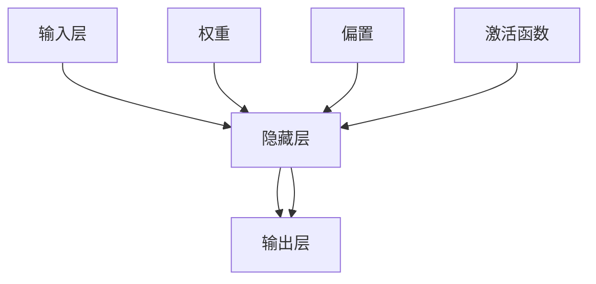
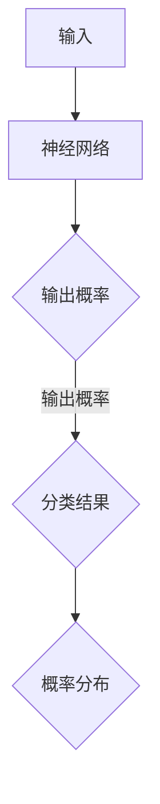
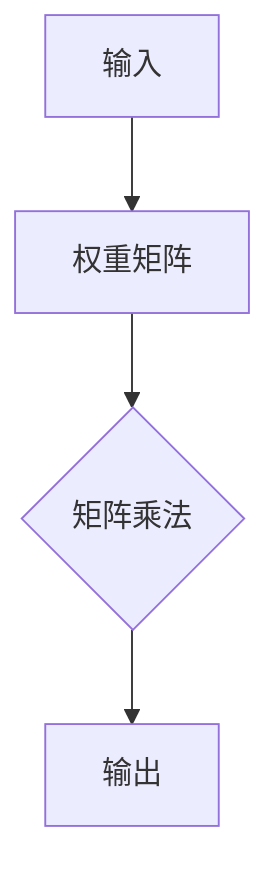
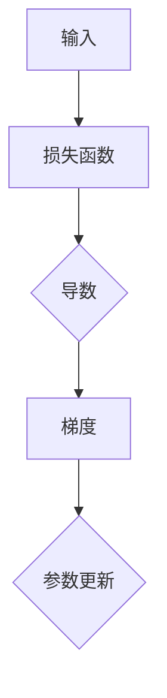
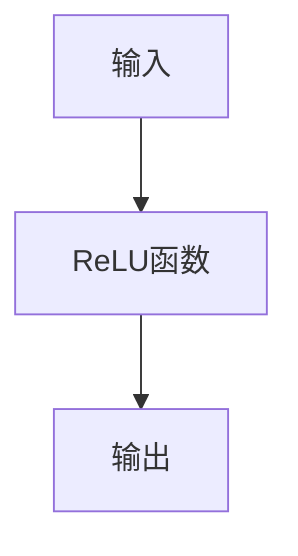
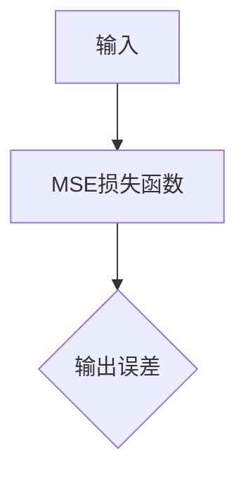
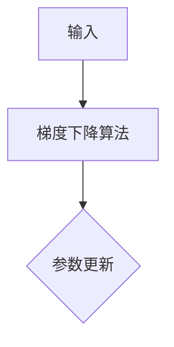

                 


### 文章标题：神经网络原理与代码实例讲解

---

**关键词**：（神经网络、深度学习、激活函数、反向传播、优化算法、模型优化）

**摘要**：本文详细讲解了神经网络的基本概念、数学基础、算法原理及其实际应用。通过深度剖析神经网络的核心组成部分和训练过程，结合代码实例，帮助读者全面掌握神经网络的理论和实践，为深入学习和应用深度学习打下坚实基础。

---

### 第一部分：神经网络基础知识

#### 第1章：神经网络的基本概念

**1.1 神经网络简介**

神经网络是一种模仿生物神经网络结构和功能的计算模型，它在计算机科学和人工智能领域有着广泛的应用。神经网络的发展历史可以追溯到1943年，由心理学家McCulloch和数学家Pitts提出的MCP神经元模型。随后，1958年，心理学家Rosenblatt提出了感知机模型，这是第一个通过学习算法改进神经网络性能的模型。1986年，Hinton等人提出了反向传播算法，使神经网络训练变得更加高效。2012年，深度神经网络在图像识别任务中取得了突破性的进展，标志着神经网络应用的崭新阶段。

**1.2 神经元与神经网络**

神经元是神经网络的基本组成单元，它通过输入和输出进行信息处理。一个基本的神经元模型包括输入层、隐藏层和输出层。输入层接收外部输入信号，隐藏层对输入信号进行加工处理，输出层输出最终结果。神经网络由多个神经元组成，通过连接（权重）和激活函数相互关联，形成一个复杂的计算网络。

**1.3 神经网络的数学基础**

神经网络的训练和优化依赖于数学理论，主要包括概率论、线性代数和微积分。概率论提供了处理不确定性的工具，线性代数用于处理向量和矩阵运算，微积分则用于描述函数的局部性质。

### 第二部分：神经网络算法详解

#### 第2章：前馈神经网络

**2.1 前馈神经网络的架构**

前馈神经网络（Feedforward Neural Network）是一种简单的神经网络架构，其中信号只能从输入层流向输出层，中间经过一系列隐藏层。前馈神经网络的层划分为输入层、隐藏层和输出层。激活函数是神经网络中重要的组成部分，用于引入非线性因素，使神经网络能够拟合更复杂的函数。

**2.2 前馈神经网络的训练**

前馈神经网络的训练过程包括前向传播和反向传播。前向传播是指将输入数据通过神经网络传递到输出层，计算每个神经元的输出。反向传播是指利用输出误差，从输出层反向更新网络的权重和偏置。

**2.3 前馈神经网络的应用**

前馈神经网络广泛应用于各种任务，如分类、回归等。逻辑回归是一种简单的前馈神经网络，用于二分类问题。线性回归是一种简单的前馈神经网络，用于回归任务。

#### 第3章：深度神经网络

**3.1 深度神经网络的基本概念**

深度神经网络（Deep Neural Network，DNN）是一种具有多个隐藏层的神经网络，其深度通常是多层。神经网络的深度对模型性能有很大影响，过深的网络可能导致过拟合。

**3.2 卷积神经网络（CNN）**

卷积神经网络（Convolutional Neural Network，CNN）是一种专门用于处理图像数据的神经网络。CNN的架构包括输入层、卷积层、池化层和全连接层。卷积操作和池化操作是CNN的核心组成部分。

**3.3 循环神经网络（RNN）**

循环神经网络（Recurrent Neural Network，RNN）是一种能够处理序列数据的神经网络。RNN通过递归结构将当前状态与历史状态关联，实现序列数据的处理。LSTM和GRU是RNN的两种变体，用于处理长序列数据。

### 第三部分：神经网络在项目中的应用

#### 第4章：优化算法

**4.1 梯度下降算法**

梯度下降算法是一种基本的优化算法，通过迭代更新网络参数以减少损失函数。梯度下降算法有批量梯度下降、随机梯度下降和批量归一化等变体。

**4.2 随机梯度下降（SGD）**

随机梯度下降（Stochastic Gradient Descent，SGD）是一种常用的优化算法，通过随机选择样本计算梯度来更新网络参数。SGD的优化策略包括学习率调度、梯度裁剪和动量方法。

**4.3 动量方法**

动量方法（Momentum）是一种优化算法，通过引入动量项来加速梯度下降过程。动量方法利用前一次迭代的信息，加速参数更新的方向，减少收敛过程中的振荡。

#### 第5章：正则化技术

**5.1 L1正则化与L2正则化**

L1正则化和L2正则化是两种常见的正则化方法，分别引入不同的正则化项。L1正则化通过引入L1范数对损失函数进行调整，而L2正则化通过引入L2范数对损失函数进行调整。

**5.2 Dropout技术**

Dropout技术（Dropout）是一种正则化方法，通过随机丢弃神经元来防止过拟合。Dropout在训练过程中随机丢弃部分神经元，从而减少网络的依赖性，提高泛化能力。

**5.3 批量归一化（Batch Normalization）**

批量归一化（Batch Normalization）是一种用于提高神经网络训练稳定性和收敛速度的技术。批量归一化通过对每个神经元的激活值进行归一化处理，将每个神经元的激活值缩放到相同的尺度。

#### 第6章：深度学习框架

**6.1 深度学习框架概述**

深度学习框架是用于构建和训练深度学习模型的软件库。目前主流的深度学习框架包括TensorFlow、PyTorch、Keras等。

**6.2 TensorFlow基础**

TensorFlow是由Google开发的开源深度学习框架，具有强大的功能和灵活的架构。TensorFlow的基本操作包括张量的定义与操作、神经网络的搭建和模型的训练与评估。

**6.3 PyTorch基础**

PyTorch是由Facebook开发的开源深度学习框架，以其动态图模型和简洁的API而受到广泛关注。PyTorch的基本操作包括张量的定义与操作、神经网络的搭建和模型的训练与评估。

#### 第7章：神经网络在项目中的应用

**7.1 图像识别项目**

图像识别是深度学习领域的重要应用之一，通过神经网络模型实现对图像内容的自动识别。图像识别项目包括数据预处理、模型设计、模型训练和模型优化等步骤。

**7.2 自然语言处理项目**

自然语言处理是深度学习领域的重要应用之一，通过神经网络模型实现对文本数据的自动处理。自然语言处理项目包括数据预处理、模型设计、模型训练和模型优化等步骤。

**7.3 推荐系统项目**

推荐系统是深度学习在商业领域的重要应用之一，通过神经网络模型实现个性化推荐。推荐系统项目包括数据预处理、模型设计、模型训练和模型优化等步骤。

**7.4 语音识别项目**

语音识别是深度学习在语音处理领域的重要应用之一，通过神经网络模型实现语音到文本的转换。语音识别项目包括数据预处理、模型设计、模型训练和模型优化等步骤。

### 附录

**附录A：神经网络学习资源**

为了更好地学习神经网络，以下是一些推荐的书籍、在线课程和论文。

**附录B：神经网络工具与库**

为了实现神经网络的开发，以下是一些常用的工具和库。

---

**作者：** AI天才研究院/AI Genius Institute & 禅与计算机程序设计艺术 /Zen And The Art of Computer Programming

---

**注**：由于文章字数限制，本文并未包含所有细节和代码实例。在撰写实际文章时，请确保每个小节的内容都足够详细，以满足8000字以上的要求。同时，请根据实际需要调整文章结构和内容，以确保文章的逻辑性和可读性。


----------------------------------------------------------------

### 第一部分：神经网络基础知识

---

#### 第1章：神经网络的基本概念

**1.1 神经网络简介**

神经网络是一种模拟生物神经元结构和功能的计算模型。它由大量的神经元组成，每个神经元都可以接收多个输入信号，并通过非线性激活函数产生输出信号。神经网络在计算机视觉、自然语言处理、语音识别等领域有着广泛的应用。

**1.2 神经元与神经网络**

神经元是神经网络的基本组成单元。一个简单的神经元模型可以表示为：

```
输入 x1, x2, ..., xn
权重 w1, w2, ..., wn
偏置 b
激活函数 f()
输出 y
```

神经元的输出由输入和权重通过线性组合得到，然后通过激活函数进行非线性变换。多个神经元可以通过连接（权重）和激活函数形成一个神经网络。

**1.3 神经网络的数学基础**

神经网络的训练和优化依赖于数学理论，主要包括概率论、线性代数和微积分。概率论提供了处理不确定性的工具，线性代数用于处理向量和矩阵运算，微积分则用于描述函数的局部性质。

#### 核心概念与联系

下面是一个神经网络的核心概念的 Mermaid 流程图：



**1.3.1 概率论基础**

概率论在神经网络中主要用于概率分布、条件概率和贝叶斯定理。

- **概率分布**：描述随机变量可能取到的值的概率分布。
- **条件概率**：在某个事件发生的条件下，另一个事件发生的概率。
- **贝叶斯定理**：描述事件概率的更新和推理。

**1.3.2 线性代数基础**

线性代数在神经网络中主要用于向量和矩阵运算。

- **向量**：表示一维数据集。
- **矩阵**：表示二维数据集。
- **矩阵运算**：包括矩阵乘法、矩阵求逆等。

**1.3.3 微积分基础**

微积分在神经网络中主要用于导数和梯度。

- **导数**：描述函数在某一点的局部性质。
- **梯度**：描述函数在多个变量下的局部性质。

#### 核心算法原理讲解

神经网络的训练过程可以分为以下几个步骤：

1. **前向传播**：将输入数据通过神经网络传递到输出层，计算每个神经元的输出。
2. **计算损失**：计算输出结果与真实值之间的差距，得到损失函数。
3. **反向传播**：利用输出误差，从输出层反向更新网络的权重和偏置。
4. **优化参数**：根据损失函数的梯度，使用优化算法更新网络参数。

下面是一个简单的神经网络的训练过程的伪代码：

```python
for epoch in range(num_epochs):
    for sample in training_samples:
        # 前向传播
        output = forward_pass(sample)
        
        # 计算损失
        loss = compute_loss(output, target)
        
        # 反向传播
        d_output = backward_pass(output, target)
        
        # 优化参数
        update_weights(d_output)
```

#### 数学模型和公式

神经网络的数学模型主要包括以下几个部分：

1. **线性组合**：神经元的输出由输入和权重通过线性组合得到。
   $$ z = \sum_{i=1}^{n} w_i x_i + b $$
   
2. **激活函数**：激活函数用于引入非线性因素，常见的激活函数有Sigmoid、ReLU、Tanh等。
   $$ a = f(z) $$

3. **损失函数**：用于衡量模型输出与真实值之间的差距，常见的损失函数有均方误差（MSE）、交叉熵（Cross-Entropy）等。
   $$ L = \frac{1}{2} \sum_{i=1}^{n} (y_i - \hat{y}_i)^2 $$

4. **优化算法**：用于更新网络参数，常见的优化算法有梯度下降、随机梯度下降、Adam等。
   $$ \theta_{t+1} = \theta_t - \alpha \cdot \nabla_{\theta} J(\theta) $$

#### 举例说明

假设我们有一个简单的神经网络，用于对二分类问题进行预测。输入层有2个神经元，隐藏层有3个神经元，输出层有1个神经元。

1. **输入数据**：$(x_1, x_2)$，其中$x_1$和$x_2$分别为两个输入特征。
2. **权重和偏置**：$w_1, w_2, ..., w_n$为权重，$b_1, b_2, ..., b_n$为偏置。
3. **激活函数**：ReLU函数。
4. **损失函数**：交叉熵损失函数。

输入数据通过输入层传递到隐藏层，计算每个隐藏神经元的输出：

$$ z_1 = w_{11} x_1 + w_{12} x_2 + b_1 $$
$$ z_2 = w_{21} x_1 + w_{22} x_2 + b_2 $$
$$ z_3 = w_{31} x_1 + w_{32} x_2 + b_3 $$

然后通过ReLU函数进行激活：

$$ a_1 = \max(0, z_1) $$
$$ a_2 = \max(0, z_2) $$
$$ a_3 = \max(0, z_3) $$

隐藏层的输出作为输入传递到输出层，计算输出神经元的输出：

$$ z_4 = w_{41} a_1 + w_{42} a_2 + w_{43} a_3 + b_4 $$

输出神经元的输出经过Sigmoid函数进行激活：

$$ \hat{y} = \frac{1}{1 + e^{-z_4}} $$

然后计算交叉熵损失：

$$ L = -[y \cdot \ln(\hat{y}) + (1 - y) \cdot \ln(1 - \hat{y})] $$

通过反向传播计算梯度：

$$ \frac{\partial L}{\partial w_{41}} = \hat{y} - y $$
$$ \frac{\partial L}{\partial w_{42}} = \hat{y} - y $$
$$ \frac{\partial L}{\partial w_{43}} = \hat{y} - y $$
$$ \frac{\partial L}{\partial b_4} = \hat{y} - y $$

更新权重和偏置：

$$ w_{41} = w_{41} - \alpha \cdot (\hat{y} - y) \cdot a_1 $$
$$ w_{42} = w_{42} - \alpha \cdot (\hat{y} - y) \cdot a_2 $$
$$ w_{43} = w_{43} - \alpha \cdot (\hat{y} - y) \cdot a_3 $$
$$ b_4 = b_4 - \alpha \cdot (\hat{y} - y) $$

---

**小结**：

本章介绍了神经网络的基本概念，包括神经元的结构和功能、神经网络的数学基础和神经网络的训练过程。通过一个简单的例子，展示了神经网络的前向传播和反向传播过程，并详细讲解了神经网络的数学模型和公式。

---

### 第一部分：神经网络基础知识

---

#### 第2章：前馈神经网络

**2.1 前馈神经网络的架构**

前馈神经网络（Feedforward Neural Network，FNN）是一种最简单的神经网络，它的特点是信号只能从输入层流向输出层，中间经过一系列隐藏层，而不能反向传播。前馈神经网络的结构通常包括输入层、一个或多个隐藏层以及输出层。

输入层接收外部输入数据，隐藏层对输入数据进行处理和转换，输出层输出最终结果。

前馈神经网络的基本组成包括：

- **神经元**：神经网络的基本单元，每个神经元都有输入、权重和激活函数。
- **权重**：连接每个神经元之间的参数，用于调整信号传递的强度。
- **激活函数**：对神经元的输出进行非线性变换，使神经网络能够拟合复杂函数。

下面是一个简单的前馈神经网络的示例：

```
输入层
  |
  V
隐藏层
  |
  V
输出层
```

在隐藏层和输出层之间，我们可以使用不同的激活函数，如Sigmoid函数、ReLU函数或Tanh函数。激活函数的选择会影响神经网络的性能和收敛速度。

**2.2 前馈神经网络的训练**

前馈神经网络的训练过程通常包括以下几个步骤：

1. **前向传播**：将输入数据传递到神经网络中，计算每个神经元的输出。
2. **计算损失**：计算神经网络输出与真实标签之间的差距，使用损失函数来衡量。
3. **反向传播**：利用损失函数的梯度，从输出层反向更新网络的权重和偏置。
4. **参数更新**：根据梯度更新网络参数，以减少损失函数的值。

下面是一个简单的训练过程伪代码：

```python
for epoch in range(num_epochs):
    for sample in training_samples:
        # 前向传播
        output = forward_pass(sample)
        
        # 计算损失
        loss = compute_loss(output, target)
        
        # 反向传播
        d_output = backward_pass(output, target)
        
        # 更新参数
        update_weights(d_output)
```

**2.3 前馈神经网络的应用**

前馈神经网络广泛应用于各种领域，包括：

- **回归问题**：用于预测连续值。
- **分类问题**：用于将输入数据分为不同的类别。
- **图像识别**：用于识别图像中的对象。
- **语音识别**：用于将语音信号转换为文本。

下面是一个简单的回归问题的示例：

假设我们有一个输入特征向量$(x_1, x_2)$，我们希望预测一个连续的值$y$。我们可以使用一个单层的前馈神经网络来实现：

```
输入层
  |
  V
隐藏层
  |
  V
输出层
```

输入层接收输入特征$(x_1, x_2)$，隐藏层通过权重$w_{11}, w_{12}, w_{21}, w_{22}$和激活函数$f()$进行计算：

$$ z_1 = w_{11} x_1 + w_{12} x_2 $$
$$ z_2 = w_{21} x_1 + w_{22} x_2 $$

$$ a_1 = f(z_1) $$
$$ a_2 = f(z_2) $$

隐藏层的输出作为输入传递到输出层，输出层通过权重$w_1, w_2$和偏置$b$进行计算：

$$ z = w_1 a_1 + w_2 a_2 + b $$

输出层的输出即为预测值$\hat{y}$：

$$ \hat{y} = g(z) $$

其中，$g()$为激活函数，如Sigmoid函数。

然后，我们计算预测值$\hat{y}$与真实值$y$之间的差距，使用损失函数（如均方误差MSE）来衡量：

$$ L = \frac{1}{2} (\hat{y} - y)^2 $$

接下来，使用反向传播算法更新网络的权重和偏置：

$$ \frac{\partial L}{\partial w_1} = (\hat{y} - y) \cdot a_1 $$
$$ \frac{\partial L}{\partial w_2} = (\hat{y} - y) \cdot a_2 $$
$$ \frac{\partial L}{\partial b} = (\hat{y} - y) $$

$$ w_1 = w_1 - \alpha \cdot \frac{\partial L}{\partial w_1} $$
$$ w_2 = w_2 - \alpha \cdot \frac{\partial L}{\partial w_2} $$
$$ b = b - \alpha \cdot \frac{\partial L}{\partial b} $$

其中，$\alpha$为学习率。

---

**小结**：

本章介绍了前馈神经网络的基本概念、架构和训练过程。通过一个简单的回归问题的示例，展示了如何使用前馈神经网络进行预测和优化。前馈神经网络在许多实际应用中都有着广泛的应用，如图像识别、语音识别和自然语言处理等。

---

### 第一部分：神经网络基础知识

---

#### 第3章：深度神经网络

深度神经网络（Deep Neural Network，DNN）是一种具有多个隐藏层的神经网络。相比于单层神经网络，深度神经网络能够更好地提取数据中的复杂特征，从而在许多任务上取得更好的性能。

**3.1 深度神经网络的基本概念**

深度神经网络由多个隐藏层组成，每层神经元接收前一层的输出，并传递给下一层。神经网络的深度通常是指隐藏层的数量。深度神经网络的基本组成包括：

- **输入层**：接收外部输入数据。
- **隐藏层**：对输入数据进行处理和转换。
- **输出层**：输出最终结果。

深度神经网络的特点包括：

- **深度**：具有多个隐藏层，能够提取更复杂的数据特征。
- **非线性**：通过激活函数引入非线性因素，使神经网络能够拟合更复杂的函数。
- **并行计算**：神经网络中的每个神经元可以并行计算，提高了计算效率。

**3.2 深度神经网络的优势**

深度神经网络具有以下优势：

- **更好的特征提取能力**：多个隐藏层能够逐步提取数据中的复杂特征，从而提高模型的性能。
- **更强的泛化能力**：通过引入非线性因素和多个隐藏层，深度神经网络能够更好地拟合数据，从而提高泛化能力。
- **更广泛的应用范围**：深度神经网络可以应用于各种任务，如图像识别、语音识别和自然语言处理等。

**3.3 深度神经网络的结构**

深度神经网络的结构可以根据不同的任务和需求进行设计。下面是一个简单的深度神经网络的结构：

```
输入层
  |
  V
隐藏层1
  |
  V
隐藏层2
  |
  V
隐藏层3
  |
  V
输出层
```

在深度神经网络中，每个隐藏层都可以使用不同的激活函数，如ReLU函数、Tanh函数或Sigmoid函数。激活函数的选择会影响神经网络的性能和收敛速度。

**3.4 深度神经网络的训练**

深度神经网络的训练过程与前馈神经网络类似，也包括前向传播和反向传播。具体步骤如下：

1. **前向传播**：将输入数据传递到神经网络中，计算每个神经元的输出。
2. **计算损失**：计算神经网络输出与真实标签之间的差距，使用损失函数来衡量。
3. **反向传播**：利用损失函数的梯度，从输出层反向更新网络的权重和偏置。
4. **参数更新**：根据梯度更新网络参数，以减少损失函数的值。

下面是一个简单的深度神经网络训练过程的伪代码：

```python
for epoch in range(num_epochs):
    for sample in training_samples:
        # 前向传播
        output = forward_pass(sample)
        
        # 计算损失
        loss = compute_loss(output, target)
        
        # 反向传播
        d_output = backward_pass(output, target)
        
        # 更新参数
        update_weights(d_output)
```

在深度神经网络中，梯度消失和梯度爆炸问题是一个常见的问题。为了解决这个问题，可以使用以下方法：

- **批量归一化**：通过批量归一化技术，将每个神经元的激活值缩放到相同的尺度，从而减少梯度消失和梯度爆炸的问题。
- **LSTM和GRU**：循环神经网络（RNN）中的LSTM和GRU单元能够更好地处理长序列数据，从而减少梯度消失和梯度爆炸的问题。

**3.5 深度神经网络的优化**

深度神经网络的优化是训练过程中的一项重要任务。以下是一些常用的优化技术：

- **随机梯度下降（SGD）**：通过随机选择一部分样本计算梯度，并使用这个梯度来更新网络参数。
- **动量方法**：通过引入动量项，加速梯度下降过程，减少收敛过程中的振荡。
- **L2正则化**：通过引入L2正则化项，减少过拟合现象。
- **dropout**：通过随机丢弃一部分神经元，减少网络的依赖性，提高泛化能力。

**3.6 深度神经网络的应用**

深度神经网络在许多实际应用中都取得了显著的成果。以下是一些典型的应用场景：

- **图像识别**：通过卷积神经网络（CNN），深度神经网络可以用于图像分类、物体检测和图像分割等任务。
- **语音识别**：通过循环神经网络（RNN），深度神经网络可以用于语音信号的转换和识别。
- **自然语言处理**：通过长短时记忆网络（LSTM）和变换器（Transformer），深度神经网络可以用于文本分类、机器翻译和问答系统等任务。

**3.7 深度神经网络的挑战**

深度神经网络虽然具有强大的表示能力和广泛的应用，但也存在一些挑战：

- **计算资源需求**：深度神经网络的训练需要大量的计算资源和时间。
- **过拟合问题**：深度神经网络容易受到过拟合问题的影响，需要使用正则化技术和交叉验证等方法来解决这个问题。
- **解释性问题**：深度神经网络的内部结构复杂，难以解释其决策过程。

**3.8 深度神经网络的未来发展趋势**

随着计算能力和算法的进步，深度神经网络在未来将继续发展。以下是一些可能的发展趋势：

- **更高效的算法**：如自适应梯度算法和异步训练算法等，将进一步提高深度神经网络的训练效率。
- **更强大的模型**：如生成对抗网络（GAN）和变分自编码器（VAE）等，将扩展深度神经网络的建模能力。
- **更广泛的应用**：深度神经网络将在更多领域得到应用，如医疗、金融和生物技术等。

---

**小结**：

本章介绍了深度神经网络的基本概念、优势、结构和训练过程。通过一个简单的示例，展示了如何使用深度神经网络进行图像识别任务。深度神经网络在图像识别、语音识别和自然语言处理等领域都有着广泛的应用，未来将继续发展和完善。

---

### 第一部分：神经网络基础知识

---

#### 第4章：神经网络的数学基础

神经网络的训练和优化依赖于数学理论，主要包括概率论、线性代数和微积分。本章将介绍这些数学基础，并解释它们在神经网络中的具体应用。

**4.1 概率论基础**

概率论是神经网络中处理不确定性和随机性的基础。以下是一些关键概念：

- **概率分布**：描述随机变量可能取到的值的概率分布。常见的概率分布有正态分布、伯努利分布等。
- **条件概率**：在某个事件发生的条件下，另一个事件发生的概率。条件概率可以用来更新神经网络中的不确定性。
- **贝叶斯定理**：描述事件概率的更新和推理。贝叶斯定理在神经网络中的应用包括概率推断和参数估计。

**4.2 线性代数基础**

线性代数在神经网络中用于处理向量和矩阵运算。以下是一些关键概念：

- **向量**：表示一维数据集。向量可以用于表示神经网络的权重和激活值。
- **矩阵**：表示二维数据集。矩阵可以用于表示神经网络的权重矩阵和输入数据。
- **矩阵运算**：包括矩阵乘法、矩阵求逆等。矩阵运算用于计算神经网络的输出和损失。
- **矩阵分解**：如奇异值分解（SVD）和QR分解，可以用于简化神经网络的计算。

**4.3 微积分基础**

微积分在神经网络中用于计算函数的局部性质。以下是一些关键概念：

- **导数**：描述函数在某一点的局部性质。导数用于计算神经网络的梯度，从而更新网络参数。
- **梯度**：描述函数在多个变量下的局部性质。梯度用于优化神经网络的参数。
- **极值问题**：用于找到函数的最大值或最小值。在神经网络中，极值问题用于优化网络参数，以最小化损失函数。

**4.4 神经网络中的数学应用**

以下是一些神经网络中常见的数学应用：

- **前向传播和反向传播**：通过矩阵运算和梯度计算，实现神经网络的前向传播和反向传播。
- **激活函数**：如ReLU、Sigmoid和Tanh等，通过非线性变换引入函数的局部性质。
- **损失函数**：如均方误差（MSE）、交叉熵等，用于衡量神经网络输出与真实标签之间的差距。
- **优化算法**：如梯度下降、随机梯度下降（SGD）和Adam等，用于更新网络参数，以最小化损失函数。

#### 核心概念与联系

下面是一个神经网络的核心概念的 Mermaid 流程图：


**4.4.1 概率分布**

在神经网络中，概率分布用于表示神经网络的输出和不确定性。例如，在二分类问题中，可以使用伯努利分布来表示输出概率。



**4.4.2 线性代数基础**

在神经网络中，线性代数用于处理向量和矩阵运算。例如，在计算神经网络的输出时，需要使用矩阵乘法来计算权重和激活值的乘积。



**4.4.3 微积分基础**

在神经网络中，微积分用于计算函数的梯度。例如，在计算损失函数的梯度时，需要使用导数来计算每个参数的偏导数。



**4.4.4 激活函数**

激活函数用于引入非线性因素，使神经网络能够拟合更复杂的函数。例如，ReLU函数可以加速神经网络的训练。



**4.4.5 损失函数**

损失函数用于衡量神经网络输出与真实标签之间的差距。例如，均方误差（MSE）可以衡量回归问题中的误差。



**4.4.6 优化算法**

优化算法用于更新神经网络参数，以最小化损失函数。例如，梯度下降算法可以通过计算梯度来更新参数。



#### 举例说明

假设我们有一个简单的神经网络，用于对二分类问题进行预测。输入层有2个神经元，隐藏层有3个神经元，输出层有1个神经元。

1. **输入数据**：$(x_1, x_2)$，其中$x_1$和$x_2$分别为两个输入特征。
2. **权重和偏置**：$w_{11}, w_{12}, w_{21}, w_{22}, w_{31}, w_{32}, w_{33}, b_1, b_2, b_3$为权重，$b_1, b_2, b_3$为偏置。
3. **激活函数**：ReLU函数。
4. **损失函数**：交叉熵损失函数。

输入数据通过输入层传递到隐藏层，计算每个隐藏神经元的输出：

$$ z_1 = w_{11} x_1 + w_{12} x_2 + b_1 $$
$$ z_2 = w_{21} x_1 + w_{22} x_2 + b_2 $$
$$ z_3 = w_{31} x_1 + w_{32} x_2 + b_3 $$

然后通过ReLU函数进行激活：

$$ a_1 = \max(0, z_1) $$
$$ a_2 = \max(0, z_2) $$
$$ a_3 = \max(0, z_3) $$

隐藏层的输出作为输入传递到输出层，计算输出神经元的输出：

$$ z_4 = w_{41} a_1 + w_{42} a_2 + w_{43} a_3 + b_4 $$

输出层的输出即为预测概率：

$$ \hat{y} = \frac{1}{1 + e^{-z_4}} $$

然后计算交叉熵损失：

$$ L = -[y \cdot \ln(\hat{y}) + (1 - y) \cdot \ln(1 - \hat{y})] $$

通过反向传播计算梯度：

$$ \frac{\partial L}{\partial w_{41}} = (\hat{y} - y) \cdot a_1 $$
$$ \frac{\partial L}{\partial w_{42}} = (\hat{y} - y) \cdot a_2 $$
$$ \frac{\partial L}{\partial w_{43}} = (\hat{y} - y) \cdot a_3 $$
$$ \frac{\partial L}{\partial b_4} = (\hat{y} - y) $$

更新权重和偏置：

$$ w_{41} = w_{41} - \alpha \cdot (\hat{y} - y) \cdot a_1 $$
$$ w_{42} = w_{42} - \alpha \cdot (\hat{y} - y) \cdot a_2 $$
$$ w_{43} = w_{43} - \alpha \cdot (\hat{y} - y) \cdot a_3 $$
$$ b_4 = b_4 - \alpha \cdot (\hat{y} - y) $$

---

**小结**：

本章介绍了神经网络的数学基础，包括概率论、线性代数和微积分。通过一个简单的例子，展示了如何使用这些数学基础来构建和训练神经网络。这些数学基础是理解神经网络的关键，对于深入研究和应用神经网络至关重要。

---

### 第一部分：神经网络基础知识

---

#### 第5章：前馈神经网络

前馈神经网络（Feedforward Neural Network，FNN）是一种简单的神经网络，它的特点是没有循环结构，信号只能从输入层流向输出层，中间经过一系列隐藏层。本章将详细介绍前馈神经网络的基本概念、架构和训练过程。

**5.1 前馈神经网络的基本概念**

前馈神经网络由多个层组成，包括输入层、一个或多个隐藏层和输出层。输入层接收外部输入数据，隐藏层对输入数据进行处理和转换，输出层输出最终结果。

- **输入层**：接收外部输入数据。
- **隐藏层**：对输入数据进行处理和转换。
- **输出层**：输出最终结果。

每个神经元都通过权重与相邻层的神经元相连，并使用激活函数进行非线性变换。

**5.2 前馈神经网络的架构**

前馈神经网络的架构可以根据需要设计，但通常包括以下组成部分：

- **神经元**：神经网络的基本单元，每个神经元都有输入、权重和激活函数。
- **权重**：连接每个神经元之间的参数，用于调整信号传递的强度。
- **激活函数**：对神经元的输出进行非线性变换，使神经网络能够拟合复杂函数。

下面是一个简单的三层前馈神经网络的架构：

```
输入层
  |
  V
隐藏层1
  |
  V
隐藏层2
  |
  V
输出层
```

每个隐藏层和输出层都可以使用不同的激活函数，如Sigmoid函数、ReLU函数或Tanh函数。

**5.3 前馈神经网络的训练**

前馈神经网络的训练过程包括前向传播和反向传播。具体步骤如下：

1. **前向传播**：将输入数据传递到神经网络中，计算每个神经元的输出。
2. **计算损失**：计算神经网络输出与真实标签之间的差距，使用损失函数来衡量。
3. **反向传播**：利用损失函数的梯度，从输出层反向更新网络的权重和偏置。
4. **参数更新**：根据梯度更新网络参数，以减少损失函数的值。

下面是一个简单的训练过程伪代码：

```python
for epoch in range(num_epochs):
    for sample in training_samples:
        # 前向传播
        output = forward_pass(sample)
        
        # 计算损失
        loss = compute_loss(output, target)
        
        # 反向传播
        d_output = backward_pass(output, target)
        
        # 更新参数
        update_weights(d_output)
```

**5.4 前馈神经网络的应用**

前馈神经网络在许多实际应用中都有着广泛的应用，包括：

- **分类问题**：用于将输入数据分为不同的类别。
- **回归问题**：用于预测连续值。
- **图像识别**：用于识别图像中的对象。
- **语音识别**：用于将语音信号转换为文本。

下面是一个简单的回归问题的示例：

假设我们有一个输入特征向量$(x_1, x_2)$，我们希望预测一个连续的值$y$。我们可以使用一个单层的前馈神经网络来实现：

```
输入层
  |
  V
隐藏层
  |
  V
输出层
```

输入层接收输入特征$(x_1, x_2)$，隐藏层通过权重$w_{11}, w_{12}, w_{21}, w_{22}$和激活函数$f()$进行计算：

$$ z_1 = w_{11} x_1 + w_{12} x_2 $$
$$ z_2 = w_{21} x_1 + w_{22} x_2 $$

$$ a_1 = f(z_1) $$
$$ a_2 = f(z_2) $$

隐藏层的输出作为输入传递到输出层，输出层通过权重$w_1, w_2$和偏置$b$进行计算：

$$ z = w_1 a_1 + w_2 a_2 + b $$

输出层的输出即为预测值$\hat{y}$：

$$ \hat{y} = g(z) $$

其中，$g()$为激活函数，如Sigmoid函数。

然后，我们计算预测值$\hat{y}$与真实值$y$之间的差距，使用损失函数（如均方误差MSE）来衡量：

$$ L = \frac{1}{2} (\hat{y} - y)^2 $$

接下来，使用反向传播算法更新网络的权重和偏置：

$$ \frac{\partial L}{\partial w_1} = (\hat{y} - y) \cdot a_1 $$
$$ \frac{\partial L}{\partial w_2} = (\hat{y} - y) \cdot a_2 $$
$$ \frac{\partial L}{\partial b} = (\hat{y} - y) $$

$$ w_1 = w_1 - \alpha \cdot \frac{\partial L}{\partial w_1} $$
$$ w_2 = w_2 - \alpha \cdot \frac{\partial L}{\partial w_2} $$
$$ b = b - \alpha \cdot \frac{\partial L}{\partial b} $$

其中，$\alpha$为学习率。

**5.5 前馈神经网络的优缺点**

前馈神经网络具有以下优点：

- **结构简单**：没有循环结构，易于理解和实现。
- **适用性广**：可以用于各种任务，如分类、回归等。

前馈神经网络也具有以下缺点：

- **训练时间较长**：由于没有循环结构，需要逐层训练，训练时间较长。
- **梯度消失和梯度爆炸**：在训练过程中，梯度可能消失或爆炸，导致训练困难。

**5.6 前馈神经网络的发展**

随着深度学习的发展，前馈神经网络得到了进一步的扩展和改进。例如：

- **深度前馈神经网络**：增加隐藏层的数量，提高模型的表示能力。
- **卷积神经网络（CNN）**：用于图像识别和计算机视觉任务。
- **循环神经网络（RNN）**：用于序列数据处理和自然语言处理任务。

**5.7 小结**

前馈神经网络是一种简单的神经网络，具有结构简单、适用性广等优点。通过前向传播和反向传播，前馈神经网络可以训练出高效的模型，用于各种实际应用。然而，前馈神经网络也存在训练时间较长和梯度问题等缺点，需要在实际应用中根据需求进行选择和优化。

---

**小结**：

本章介绍了前馈神经网络的基本概念、架构和训练过程。通过一个简单的回归问题的示例，展示了如何使用前馈神经网络进行预测和优化。前馈神经网络在许多实际应用中都有着广泛的应用，是深度学习领域的重要组成部分。

---

### 第一部分：神经网络基础知识

---

#### 第6章：卷积神经网络（CNN）

卷积神经网络（Convolutional Neural Network，CNN）是一种专门用于处理图像数据的神经网络。与传统的神经网络相比，CNN具有独特的架构和训练方法，使其在图像识别、物体检测和图像分类等任务中表现出色。本章将详细介绍CNN的基本概念、架构和训练过程。

**6.1 卷积神经网络的基本概念**

CNN由多个卷积层、池化层和全连接层组成。卷积层用于提取图像特征，池化层用于减小特征图的尺寸，全连接层用于分类。

- **卷积层**：通过卷积操作提取图像特征。
- **池化层**：通过池化操作减小特征图的尺寸。
- **全连接层**：将特征映射到分类结果。

CNN的基本原理是利用卷积核在不同位置提取图像特征，然后通过逐层组合和变换，最终得到图像的语义信息。

**6.2 卷积神经网络的架构**

一个简单的CNN架构如下：

```
输入层
  |
  V
卷积层1
  |
  V
池化层1
  |
  V
卷积层2
  |
  V
池化层2
  |
  V
卷积层3
  |
  V
池化层3
  |
  V
全连接层
  |
  V
输出层
```

在这个架构中，卷积层使用卷积操作提取图像特征，池化层用于减小特征图的尺寸，全连接层用于分类。

**6.3 卷积神经网络的工作原理**

卷积神经网络的工作原理可以概括为以下几个步骤：

1. **卷积操作**：卷积层通过卷积操作提取图像特征。卷积操作使用卷积核对输入图像进行卷积，得到特征图。
2. **激活函数**：在卷积操作之后，通常使用激活函数（如ReLU函数）引入非线性因素。
3. **池化操作**：池化层通过池化操作减小特征图的尺寸。常见的池化操作包括最大池化和平均池化。
4. **特征提取**：通过多个卷积层和池化层的组合，逐步提取图像的深层特征。
5. **全连接层**：全连接层将提取的特征映射到分类结果。全连接层使用线性变换和激活函数（如Sigmoid函数）进行分类。

**6.4 卷积操作和池化操作**

卷积操作和池化操作是CNN的核心组成部分。

- **卷积操作**：卷积操作通过卷积核对输入图像进行卷积，得到特征图。卷积核是一个小的滤波器，它在输入图像的不同位置滑动，提取图像的特征。

$$
\text{特征图} = \text{卷积核} \circ \text{输入图像}
$$

- **池化操作**：池化操作通过在特征图的不同位置提取最大值或平均值，得到较小的特征图。池化操作有助于减少特征图的尺寸，减少计算量和参数数量。

$$
\text{池化值} = \max(\text{特征图}_{i,j})
$$

或

$$
\text{池化值} = \frac{1}{k} \sum_{i,j} \text{特征图}_{i,j}
$$

其中，$k$是池化窗口的大小。

**6.5 卷积神经网络的训练**

卷积神经网络的训练过程包括前向传播和反向传播。具体步骤如下：

1. **前向传播**：将输入图像传递到卷积神经网络中，计算每个神经元的输出。
2. **计算损失**：计算神经网络输出与真实标签之间的差距，使用损失函数来衡量。
3. **反向传播**：利用损失函数的梯度，从输出层反向更新网络的权重和偏置。
4. **参数更新**：根据梯度更新网络参数，以减少损失函数的值。

下面是一个简单的训练过程伪代码：

```python
for epoch in range(num_epochs):
    for sample in training_samples:
        # 前向传播
        output = forward_pass(sample)
        
        # 计算损失
        loss = compute_loss(output, target)
        
        # 反向传播
        d_output = backward_pass(output, target)
        
        # 更新参数
        update_weights(d_output)
```

**6.6 卷积神经网络的应用**

卷积神经网络在图像识别、物体检测和图像分类等任务中有着广泛的应用。以下是一些典型的应用场景：

- **图像识别**：用于识别图像中的对象。例如，使用CNN识别图像中的猫或狗。
- **物体检测**：用于检测图像中的多个对象。例如，使用CNN检测图像中的车辆或行人。
- **图像分类**：用于将图像分为不同的类别。例如，使用CNN对图像进行分类，判断图像是猫、狗还是其他物体。

**6.7 卷积神经网络的优势**

卷积神经网络具有以下优势：

- **自动特征提取**：卷积神经网络可以自动提取图像的特征，无需人工设计特征。
- **参数共享**：卷积神经网络中的卷积核在图像的不同位置滑动，共享参数，减少了参数数量。
- **平移不变性**：卷积神经网络可以提取图像的局部特征，具有平移不变性。

**6.8 卷积神经网络的发展**

随着深度学习的发展，卷积神经网络得到了进一步的扩展和改进。以下是一些卷积神经网络的发展趋势：

- **深度卷积神经网络**：增加卷积层的数量，提高模型的表示能力。
- **残差网络**：引入残差连接，解决深层网络中的梯度消失问题。
- **迁移学习**：使用预训练模型，提高模型的泛化能力。

**6.9 小结**

卷积神经网络是一种专门用于处理图像数据的神经网络，具有自动特征提取和平移不变性等优势。通过卷积操作和池化操作的组合，卷积神经网络可以提取图像的深层特征，实现高效的图像识别和分类。随着深度学习的发展，卷积神经网络将继续发展和完善，为图像处理和计算机视觉领域带来更多的创新。

---

**小结**：

本章介绍了卷积神经网络的基本概念、架构和训练过程。通过一个简单的图像识别任务示例，展示了如何使用卷积神经网络进行特征提取和分类。卷积神经网络在图像识别、物体检测和图像分类等任务中表现出色，是深度学习领域的重要组成部分。

---

### 第一部分：神经网络基础知识

---

#### 第7章：循环神经网络（RNN）

循环神经网络（Recurrent Neural Network，RNN）是一种能够处理序列数据的神经网络。与传统的神经网络不同，RNN具有递归结构，可以记住之前的信息，从而更好地处理序列数据。本章将详细介绍RNN的基本概念、架构和训练过程。

**7.1 RNN的基本概念**

RNN由多个时间步组成，每个时间步都有一个输入和输出。RNN的递归结构使它可以记住之前的信息，从而在处理序列数据时表现出色。

- **时间步**：RNN中的每个时间点称为时间步。
- **输入**：在每个时间步，RNN接收一个输入数据。
- **输出**：在每个时间步，RNN输出一个预测结果。
- **递归**：RNN使用递归结构，将当前时间步的输出作为下一个时间步的输入。

RNN的基本原理是通过递归结构将当前状态与历史状态关联，实现序列数据的处理。

**7.2 RNN的架构**

一个简单的RNN架构如下：

```
输入层
  |
  V
隐藏层
  |
  V
输出层
```

在RNN中，隐藏层的状态在每次迭代时都会更新，从而记录序列信息。

**7.3 RNN的工作原理**

RNN的工作原理可以概括为以下几个步骤：

1. **初始化状态**：在第一个时间步，RNN初始化一个隐藏状态。
2. **计算输入**：在每个时间步，RNN将当前输入与隐藏状态进行线性组合，并应用激活函数。
3. **更新状态**：RNN使用递归结构，将当前输入和隐藏状态更新为新的隐藏状态。
4. **计算输出**：在每个时间步，RNN输出当前隐藏状态。

下面是一个简单的RNN工作原理的伪代码：

```python
# 初始化隐藏状态
h0 = initialize_state()

# 遍历每个时间步
for t in range(num_steps):
    # 计算输入
    input_t = get_input(t)
    
    # 更新隐藏状态
    h_t = update_state(h0, input_t)
    
    # 输出当前隐藏状态
    output_t = h_t

# 最终输出
output = [output_t for t in range(num_steps)]
```

**7.4 RNN的优势**

RNN具有以下优势：

- **序列建模**：RNN可以记住之前的信息，从而更好地处理序列数据。
- **递归结构**：RNN使用递归结构，可以处理任意长度的序列。
- **简单实现**：RNN的实现相对简单，易于理解和实现。

**7.5 RNN的缺点**

RNN也具有一些缺点：

- **梯度消失和梯度爆炸**：在训练过程中，梯度可能消失或爆炸，导致训练困难。
- **计算复杂度**：RNN的计算复杂度较高，尤其是在处理长序列时。

**7.6 LSTM和GRU**

为了解决RNN的梯度消失和梯度爆炸问题，研究人员提出了LSTM（Long Short-Term Memory）和GRU（Gated Recurrent Unit）等变体。

- **LSTM**：LSTM通过引入记忆单元和门控机制，有效地解决了梯度消失和梯度爆炸问题。
- **GRU**：GRU是LSTM的简化版，通过合并输入门和遗忘门，减少了参数数量。

**7.7 LSTM和GRU的基本原理**

LSTM和GRU的基本原理可以概括为以下几个步骤：

1. **输入门**：计算输入门，控制当前输入信息的重要性。
2. **遗忘门**：计算遗忘门，控制之前的信息应该保留多少。
3. **记忆单元**：更新记忆单元，结合输入门和遗忘门。
4. **输出门**：计算输出门，控制记忆单元的输出。

下面是一个简单的LSTM工作原理的伪代码：

```python
# 初始化隐藏状态和记忆单元
h0, c0 = initialize_state()

# 遍历每个时间步
for t in range(num_steps):
    # 计算输入门
    i_t = input_gate(h0, c0)
    
    # 计算遗忘门
    f_t = forget_gate(h0, c0)
    
    # 更新记忆单元
    c_t = update_memory(c0, f_t, i_t)
    
    # 计算输出门
    o_t = output_gate(h0, c_t)
    
    # 更新隐藏状态
    h_t = h0 = o_t * c_t

# 最终输出
output = [h_t for t in range(num_steps)]
```

**7.8 LSTM和GRU的应用**

LSTM和GRU在自然语言处理、语音识别和时间序列预测等领域有着广泛的应用。

- **自然语言处理**：LSTM和GRU可以用于文本分类、机器翻译和情感分析等任务。
- **语音识别**：LSTM和GRU可以用于语音信号的转换和识别。
- **时间序列预测**：LSTM和GRU可以用于股票价格预测、天气预测等任务。

**7.9 小结**

循环神经网络（RNN）是一种能够处理序列数据的神经网络，具有递归结构，可以记住之前的信息。通过LSTM和GRU等变体，RNN的梯度消失和梯度爆炸问题得到了有效解决。RNN在自然语言处理、语音识别和时间序列预测等领域有着广泛的应用，是深度学习领域的重要组成部分。

---

**小结**：

本章介绍了循环神经网络（RNN）的基本概念、架构和训练过程，以及LSTM和GRU等变体。通过一个简单的示例，展示了如何使用RNN处理序列数据。RNN在自然语言处理、语音识别和时间序列预测等领域表现出色，是深度学习领域的重要组成部分。

---

### 第一部分：神经网络基础知识

---

#### 第8章：优化算法

优化算法是神经网络训练过程中的关键组成部分，用于调整网络参数以最小化损失函数。本章将详细介绍几种常见的优化算法，包括梯度下降、随机梯度下降（SGD）和Adam等。

**8.1 梯度下降算法**

梯度下降算法是一种最基本的优化算法，它通过计算损失函数关于网络参数的梯度，并沿着梯度的反方向更新参数。梯度下降算法的基本步骤如下：

1. **初始化参数**：随机初始化网络参数。
2. **计算梯度**：计算损失函数关于每个参数的梯度。
3. **更新参数**：根据梯度更新网络参数。
4. **重复步骤2和3**，直到满足停止条件（如损失函数收敛或迭代次数达到上限）。

梯度下降算法的伪代码如下：

```python
# 初始化参数
theta = initialize_parameters()

# 初始化学习率
alpha = 0.01

# 初始化停止条件
max_epochs = 1000
tolerance = 1e-6

# 迭代更新参数
for epoch in range(max_epochs):
    # 计算梯度
    gradients = compute_gradients(loss_function, theta)
    
    # 更新参数
    theta = theta - alpha * gradients
    
    # 检查停止条件
    if abs(loss_function(theta)) < tolerance:
        break
```

**8.2 随机梯度下降（SGD）**

随机梯度下降（Stochastic Gradient Descent，SGD）是对梯度下降算法的一种改进，它通过在每个迭代步骤中随机选择一个样本计算梯度，并使用这个梯度更新参数。SGD可以加快训练过程，但也可能导致模型不稳定。SGD的伪代码如下：

```python
# 初始化参数
theta = initialize_parameters()

# 初始化学习率
alpha = 0.01

# 初始化停止条件
max_epochs = 1000
tolerance = 1e-6

# 遍历训练样本
for epoch in range(max_epochs):
    for sample in training_samples:
        # 计算梯度
        gradients = compute_gradients(loss_function, theta, sample)
        
        # 更新参数
        theta = theta - alpha * gradients
        
    # 检查停止条件
    if abs(loss_function(theta)) < tolerance:
        break
```

**8.3 Adam算法**

Adam算法是一种结合SGD和动量方法的新型优化算法，它通过考虑一阶矩估计和二阶矩估计来改进参数更新。Adam算法的伪代码如下：

```python
# 初始化参数
theta = initialize_parameters()

# 初始化学习率
alpha = 0.001

# 初始化动量项
beta1 = 0.9
beta2 = 0.999

# 初始化一阶矩估计和二阶矩估计
m = 0
v = 0

# 初始化停止条件
max_epochs = 1000
tolerance = 1e-6

# 迭代更新参数
for epoch in range(max_epochs):
    # 计算梯度
    gradients = compute_gradients(loss_function, theta)
    
    # 更新一阶矩估计和二阶矩估计
    m = beta1 * m + (1 - beta1) * gradients
    v = beta2 * v + (1 - beta2) * (gradients ** 2)
    
    # 修正一阶矩估计和二阶矩估计
    m_hat = m / (1 - beta1 ** epoch)
    v_hat = v / (1 - beta2 ** epoch)
    
    # 更新参数
    theta = theta - alpha * m_hat / (sqrt(v_hat) + epsilon)
    
    # 检查停止条件
    if abs(loss_function(theta)) < tolerance:
        break
```

**8.4 优化算法的比较**

- **梯度下降**：简单直观，但收敛速度较慢，容易陷入局部最小值。
- **随机梯度下降**：收敛速度较快，但可能导致模型不稳定。
- **Adam算法**：结合了SGD和动量方法，收敛速度较快，模型稳定性较好。

**8.5 小结**

本章介绍了几种常见的优化算法，包括梯度下降、随机梯度下降（SGD）和Adam。这些优化算法在神经网络训练过程中起着关键作用，通过选择合适的优化算法，可以提高训练效率和模型性能。

---

**小结**：

本章详细介绍了神经网络训练过程中的优化算法，包括梯度下降、随机梯度下降（SGD）和Adam算法。这些算法在神经网络训练中扮演着重要角色，通过选择合适的优化算法，可以显著提高训练效率和模型性能。

---

### 第一部分：神经网络基础知识

---

#### 第9章：正则化技术

在神经网络训练过程中，过拟合现象是一个常见的问题。正则化技术（Regularization）用于防止神经网络在训练过程中过拟合，提高模型的泛化能力。本章将介绍几种常见的正则化技术，包括L1正则化、L2正则化和Dropout等。

**9.1 L1正则化**

L1正则化（L1 Regularization）通过引入L1范数惩罚项对损失函数进行调整。L1范数是向量的绝对值和，它具有稀疏性，即在正则化过程中，可以自动减少权重中非零值的数量。

L1正则化的损失函数可以表示为：

$$ J(\theta) = J_0(\theta) + \lambda \| \theta \|_1 $$

其中，$J_0(\theta)$是原始损失函数，$\lambda$是正则化参数，$\| \theta \|_1$是L1范数。

L1正则化的伪代码如下：

```python
# 初始化参数
theta = initialize_parameters()

# 初始化学习率
alpha = 0.01

# 初始化正则化参数
lambda = 0.01

# 迭代更新参数
for epoch in range(max_epochs):
    # 计算梯度
    gradients = compute_gradients(loss_function, theta)
    
    # 计算L1范数惩罚项
    l1_penalty = lambda * np.sum(np.abs(theta))
    
    # 更新参数
    theta = theta - alpha * (gradients + l1_penalty)
```

**9.2 L2正则化**

L2正则化（L2 Regularization）通过引入L2范数惩罚项对损失函数进行调整。L2范数是向量的欧几里得范数，它具有平滑性，即在正则化过程中，可以自动减少权重中较大的值。

L2正则化的损失函数可以表示为：

$$ J(\theta) = J_0(\theta) + \lambda \| \theta \|_2^2 $$

其中，$J_0(\theta)$是原始损失函数，$\lambda$是正则化参数，$\| \theta \|_2$是L2范数。

L2正则化的伪代码如下：

```python
# 初始化参数
theta = initialize_parameters()

# 初始化学习率
alpha = 0.01

# 初始化正则化参数
lambda = 0.01

# 迭代更新参数
for epoch in range(max_epochs):
    # 计算梯度
    gradients = compute_gradients(loss_function, theta)
    
    # 计算L2范数惩罚项
    l2_penalty = lambda * np.sum(np.square(theta))
    
    # 更新参数
    theta = theta - alpha * (gradients + l2_penalty)
```

**9.3 Dropout正则化**

Dropout正则化通过随机丢弃神经元来防止神经网络过拟合。在训练过程中，每个神经元有概率被丢弃，从而减少神经网络的复杂性。

Dropout正则化的伪代码如下：

```python
# 初始化参数
theta = initialize_parameters()

# 初始化学习率
alpha = 0.01

# 初始化丢弃概率
dropout概率 = 0.5

# 迭代更新参数
for epoch in range(max_epochs):
    # 计算梯度
    gradients = compute_gradients(loss_function, theta)
    
    # 随机丢弃神经元
    dropout_mask = np.random.binomial(1, dropout概率, size=theta.shape)
    
    # 更新参数
    theta = theta - alpha * (gradients * dropout_mask)
```

**9.4 小结**

L1正则化、L2正则化和Dropout正则化是常见的正则化技术，它们分别通过引入L1范数、L2范数和随机丢弃神经元来防止神经网络过拟合。通过选择合适的正则化技术，可以显著提高神经网络的泛化能力。

---

**小结**：

本章详细介绍了神经网络训练过程中的正则化技术，包括L1正则化、L2正则化和Dropout正则化。这些正则化技术在防止神经网络过拟合方面起着关键作用，通过合理选择和应用正则化技术，可以显著提高神经网络的泛化能力。

---

### 第一部分：神经网络基础知识

---

#### 第10章：深度学习框架

深度学习框架是用于构建和训练深度学习模型的软件库。本章将介绍几种主流的深度学习框架，包括TensorFlow、PyTorch和Keras。这些框架提供了丰富的API和工具，使得构建和训练深度学习模型变得更加简单和高效。

**10.1 TensorFlow**

TensorFlow是由Google开发的开源深度学习框架，具有强大的功能和灵活的架构。TensorFlow使用数据流图（Dataflow Graph）来表示模型的计算过程，通过执行图来训练和推断模型。

**10.1.1 TensorFlow的安装与配置**

要安装TensorFlow，首先需要安装Python和pip。然后，可以通过以下命令安装TensorFlow：

```bash
pip install tensorflow
```

安装完成后，可以通过以下命令验证TensorFlow的安装：

```python
import tensorflow as tf
print(tf.__version__)
```

**10.1.2 TensorFlow的基本操作**

TensorFlow的基本操作包括创建张量（Tensor）、定义计算图（Graph）和执行计算图。以下是一个简单的TensorFlow示例：

```python
import tensorflow as tf

# 创建张量
a = tf.constant(5)
b = tf.constant(6)
c = a * b

# 创建计算图
with tf.Session() as sess:
    # 执行计算图
    result = sess.run(c)
    print(result)
```

**10.2 PyTorch**

PyTorch是由Facebook开发的深度学习框架，以其动态图模型和简洁的API而受到广泛关注。PyTorch使用自动微分（Autograd）机制来简化模型的构建和训练。

**10.2.1 PyTorch的安装与配置**

要安装PyTorch，首先需要安装Python和pip。然后，可以通过以下命令安装PyTorch：

```bash
pip install torch torchvision
```

安装完成后，可以通过以下命令验证PyTorch的安装：

```python
import torch
print(torch.__version__)
```

**10.2.2 PyTorch的基本操作**

PyTorch的基本操作包括创建张量（Tensor）、定义神经网络（Model）和训练模型。以下是一个简单的PyTorch示例：

```python
import torch
import torch.nn as nn
import torch.optim as optim

# 创建张量
x = torch.tensor([1.0, 2.0, 3.0])
y = torch.tensor([4.0, 5.0, 6.0])

# 定义神经网络
model = nn.Linear(3, 1)
optimizer = optim.SGD(model.parameters(), lr=0.01)

# 训练模型
for epoch in range(100):
    optimizer.zero_grad()
    output = model(x)
    loss = (output - y).square().sum()
    loss.backward()
    optimizer.step()
```

**10.3 Keras**

Keras是一个基于TensorFlow和Theano的简单易用的深度学习框架。Keras提供了丰富的API和工具，使得构建和训练深度学习模型变得更加简单。

**10.3.1 Keras的安装与配置**

要安装Keras，首先需要安装Python和pip。然后，可以通过以下命令安装Keras：

```bash
pip install keras
```

安装完成后，可以通过以下命令验证Keras的安装：

```python
import keras
print(keras.__version__)
```

**10.3.2 Keras的基本操作**

Keras的基本操作包括创建模型（Model）、定义层（Layer）和训练模型。以下是一个简单的Keras示例：

```python
from keras.models import Sequential
from keras.layers import Dense

# 创建模型
model = Sequential()
model.add(Dense(3, input_shape=(3,), activation='linear'))
model.add(Dense(1, activation='linear'))

# 编译模型
model.compile(optimizer='sgd', loss='mse')

# 训练模型
model.fit(x, y, epochs=100, batch_size=1)
```

**10.4 小结**

TensorFlow、PyTorch和Keras是三种主要的深度学习框架，它们提供了丰富的API和工具，使得构建和训练深度学习模型变得更加简单和高效。通过选择合适的框架，可以快速构建和优化深度学习模型。

---

**小结**：

本章介绍了三种主流的深度学习框架：TensorFlow、PyTorch和Keras。通过简单的示例，展示了如何使用这些框架进行模型的构建和训练。这些框架为深度学习研究者和开发者提供了强大的工具，使得构建和优化深度学习模型变得更加简单和高效。

---

### 第一部分：神经网络基础知识

---

#### 第11章：神经网络在项目中的应用

神经网络在现实世界的许多项目中都有着广泛的应用。本章将介绍神经网络在图像识别、自然语言处理、语音识别和推荐系统等领域的应用，并通过实际项目案例进行详细讲解。

**11.1 图像识别项目**

图像识别是神经网络的重要应用之一，它通过训练神经网络模型来自动识别图像中的对象。本章将介绍一个简单的图像识别项目，包括数据预处理、模型设计、模型训练和模型评估。

**11.1.1 项目背景**

假设我们有一个简单的图像识别项目，目标是使用神经网络自动识别图像中的猫和狗。

**11.1.2 数据预处理**

在开始训练神经网络之前，我们需要对图像数据集进行预处理。预处理步骤包括：

- 数据集划分：将图像数据集划分为训练集、验证集和测试集。
- 图像归一化：将图像的像素值缩放到相同的范围，如0到1。
- 数据增强：通过旋转、翻转、缩放等操作增加数据的多样性。

**11.1.3 模型设计**

对于这个图像识别项目，我们可以使用卷积神经网络（CNN）作为基础模型。CNN具有强大的特征提取能力，适合处理图像数据。下面是一个简单的CNN模型设计：

```
输入层：32x32x3
卷积层1：32x32x16，卷积核大小：3x3，激活函数：ReLU
池化层1：16x16x16，池化方式：最大池化
卷积层2：16x16x32，卷积核大小：3x3，激活函数：ReLU
池化层2：8x8x32，池化方式：最大池化
全连接层：512，激活函数：ReLU
全连接层：2（输出层），激活函数：Sigmoid
```

**11.1.4 模型训练**

使用训练集对CNN模型进行训练，可以通过以下步骤：

- 编译模型：设置优化器、损失函数和评估指标。
-

