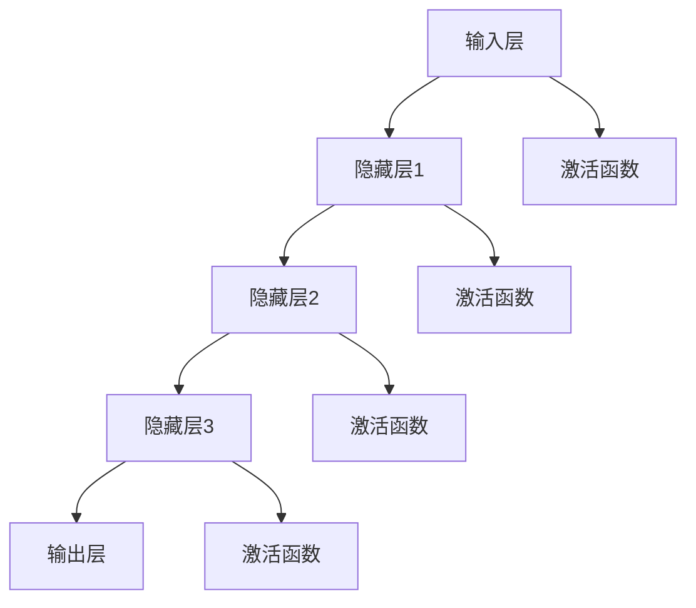

                 

### 《神经网络更容易实现硬件加速》

> **关键词**：神经网络、硬件加速、GPU、FPGA、并行计算、量化算法、低精度计算

> **摘要**：
本文旨在探讨神经网络在硬件加速领域的实现方法和技术，分析GPU、FPGA等硬件平台的特点和适用场景，介绍并行计算、量化算法和低精度计算等加速算法，并通过实际案例展示神经网络硬件加速的实战经验和性能优化策略。

### 第1章：神经网络基础

#### 1.1 神经网络概述

神经网络（Neural Network，NN）是一种模仿人脑神经元结构和功能的计算模型，它由大量的神经元（或节点）组成，通过预先设定的连接权重进行信息传递和处理。神经网络的发展可以追溯到20世纪40年代，自那时以来，随着计算能力的提升和算法的改进，神经网络在众多领域取得了显著成果。

#### 1.1.1 神经网络定义

神经网络是一种通过大量简单处理单元（神经元）互联而成的复杂系统，每个神经元都可以接收来自其他神经元的输入，并产生输出。神经网络通过学习输入数据和相应的输出结果，调整神经元之间的连接权重，从而实现对未知数据的预测和分类。

#### 1.1.2 神经网络结构

神经网络通常由输入层、隐藏层和输出层组成。输入层接收外部输入数据，隐藏层通过加权求和处理产生中间结果，输出层产生最终的预测结果。

- **输入层**：接收输入数据，将其传递给隐藏层。
- **隐藏层**：对输入数据进行处理，通过激活函数引入非线性特性，并将处理结果传递给下一层。
- **输出层**：产生最终的预测结果。

#### 1.1.3 神经网络发展历程

神经网络的发展历程可以分为以下几个阶段：

1. **感知机（Perceptron）**：1957年，Frank Rosenblatt提出了感知机模型，这是一种简单的线性二分类器。
2. **多层感知机（MLP）**：1986年，Rumelhart等人提出了多层感知机模型，通过多层神经元实现了非线性分类。
3. **反向传播算法（Backpropagation）**：1986年，Rumelhart等人提出了反向传播算法，这是一种用于训练神经网络的优化方法。
4. **深度学习（Deep Learning）**：2006年，Hinton等人提出了深度学习模型，通过多层次的神经网络实现了对复杂数据的建模。

#### 1.2 神经网络数学基础

神经网络的实现依赖于一系列数学基础，包括矩阵运算、激活函数和前向传播与反向传播算法。

##### 1.2.1 矩阵运算

矩阵运算是神经网络计算的核心，包括矩阵的加法、减法、乘法和除法。矩阵运算用于表示神经元之间的连接关系和数据处理过程。

##### 1.2.2 激活函数

激活函数是神经网络中的一个重要组件，用于引入非线性特性。常见的激活函数包括Sigmoid、ReLU和Tanh。

- **Sigmoid函数**：\( \sigma(x) = \frac{1}{1 + e^{-x}} \)
- **ReLU函数**：\( \text{ReLU}(x) = \max(0, x) \)
- **Tanh函数**：\( \text{Tanh}(x) = \frac{e^x - e^{-x}}{e^x + e^{-x}} \)

##### 1.2.3 前向传播与反向传播算法

前向传播和反向传播算法是神经网络训练过程中的两个关键步骤。

- **前向传播**：前向传播是指将输入数据通过神经网络逐层传递，最终得到输出结果的过程。具体步骤如下：
  1. 初始化网络权重和偏置。
  2. 将输入数据传递给输入层。
  3. 通过隐藏层进行逐层计算，应用激活函数。
  4. 将输出结果传递给输出层。

- **反向传播**：反向传播是指通过输出误差，反向调整神经网络权重和偏置的过程。具体步骤如下：
  1. 计算输出层的误差。
  2. 通过反向传播算法，逐层计算隐藏层的误差。
  3. 根据误差梯度，更新网络权重和偏置。

#### 1.3 经典神经网络架构

经典的神经网络架构包括多层感知机（MLP）、卷积神经网络（CNN）和循环神经网络（RNN）。

##### 1.3.1 多层感知机（MLP）

多层感知机是一种前馈神经网络，包含输入层、隐藏层和输出层。多层感知机通过多层神经元实现非线性变换，可以用于分类和回归任务。

##### 1.3.2 卷积神经网络（CNN）

卷积神经网络是一种专门用于处理图像数据的神经网络，其核心在于卷积操作，通过在图像上滑动窗口，提取图像的特征。卷积神经网络广泛应用于计算机视觉领域。

##### 1.3.3 循环神经网络（RNN）

循环神经网络是一种用于处理序列数据的神经网络，其核心在于时间步的循环连接，能够记住历史信息。循环神经网络广泛应用于自然语言处理和语音识别等领域。

### 第2章：神经网络在硬件上的实现

#### 2.1 硬件加速概述

硬件加速是指通过专门的硬件设备（如GPU、FPGA等）来加速计算性能，特别适用于处理大规模数据和复杂计算任务。硬件加速可以显著提高神经网络的训练和推理速度，降低计算成本。

##### 2.1.1 硬件加速的概念

硬件加速是一种通过硬件设备来实现计算优化的技术，它可以降低功耗、减少延迟，从而提高整体计算性能。硬件加速通常涉及以下方面：

- **并行计算**：硬件设备具有并行计算的能力，可以同时处理多个任务，从而提高计算速度。
- **专用硬件**：如GPU、FPGA和ASIC等，这些硬件设备专门用于加速特定类型的计算任务。
- **协同优化**：硬件和软件的协同优化，以提高整体性能和效率。

##### 2.1.2 硬件加速的优势

硬件加速具有以下优势：

- **高性能**：硬件设备具有更高的计算能力和吞吐量，可以加速神经网络训练和推理。
- **低功耗**：硬件加速可以降低功耗，减少能源消耗。
- **低成本**：硬件加速可以降低计算成本，提高投资回报率。
- **可扩展性**：硬件设备可以方便地扩展，以适应不断增长的计算需求。

##### 2.1.3 硬件加速的分类

硬件加速可以分为以下几类：

- **GPU加速**：GPU（Graphics Processing Unit）是一种专门用于图像渲染和图形计算的硬件设备，具有强大的并行计算能力。GPU加速广泛应用于深度学习模型的训练和推理。
- **FPGA加速**：FPGA（Field-Programmable Gate Array）是一种可编程的硬件设备，适用于实现高性能计算任务。FPGA加速适用于需要高度定制化和并行计算的应用场景。
- **ASIC加速**：ASIC（Application-Specific Integrated Circuit）是一种专门为特定应用设计的集成电路，具有最高的性能和能效。ASIC加速适用于大规模、高性能的神经网络应用。

#### 2.2 神经网络在FPGA上的实现

FPGA（Field-Programmable Gate Array，现场可编程门阵列）是一种可编程的硬件设备，适用于实现高性能计算任务。FPGA具有以下特点：

- **并行计算能力**：FPGA具有丰富的并行计算资源，可以实现大规模的并行处理。
- **可编程性**：FPGA可以通过硬件描述语言（HDL）进行编程，以实现特定的功能。
- **可定制性**：FPGA可以根据应用需求进行定制，以优化计算性能和功耗。

##### 2.2.1 FPGA概述

FPGA是一种可编程逻辑器件，由大量的逻辑单元（如查找表、触发器等）组成。FPGA可以通过硬件描述语言（如VHDL、Verilog）进行编程，以实现特定的逻辑功能。

##### 2.2.2 神经网络在FPGA上的架构设计

神经网络在FPGA上的架构设计主要包括以下几个部分：

- **输入处理模块**：用于处理输入数据，包括数据读取、数据预处理等。
- **计算模块**：用于实现神经网络计算，包括权重矩阵、激活函数等。
- **输出处理模块**：用于处理输出数据，包括数据缓存、数据发送等。
- **控制模块**：用于控制整个系统的运行，包括数据流控制、状态切换等。

##### 2.2.3 神经网络在FPGA上的实现流程

神经网络在FPGA上的实现流程如下：

1. **模型设计**：根据神经网络结构，设计相应的硬件电路。
2. **硬件描述语言编写**：使用硬件描述语言（如VHDL、Verilog）编写代码，实现神经网络功能。
3. **仿真验证**：在FPGA开发环境中进行仿真验证，确保硬件设计正确。
4. **硬件实现**：将硬件描述语言代码转换为硬件电路，并在FPGA上实现。
5. **性能优化**：对硬件电路进行性能优化，包括资源利用、功耗优化等。

#### 2.3 神经网络在GPU上的实现

GPU（Graphics Processing Unit，图形处理单元）是一种专门用于图像渲染和图形计算的硬件设备，具有强大的并行计算能力。GPU加速广泛应用于深度学习模型的训练和推理。

##### 2.3.1 GPU概述

GPU是一种高度并行的计算设备，由大量的计算单元（核心）组成。GPU的核心具有以下特点：

- **高性能**：GPU的核心具有极高的计算性能，可以同时处理大量的计算任务。
- **并行计算**：GPU的核心可以并行处理多个任务，从而提高整体计算效率。
- **低功耗**：GPU的核心在高效计算的同时，具有较低的功耗。

##### 2.3.2 神经网络在GPU上的架构设计

神经网络在GPU上的架构设计主要包括以下几个部分：

- **计算核心**：GPU的核心是计算单元，用于执行神经网络计算。
- **内存管理**：GPU的内存管理模块用于管理内存资源，包括缓存、内存带宽等。
- **控制单元**：GPU的控制单元用于管理整个系统的运行，包括数据流控制、任务调度等。

##### 2.3.3 神经网络在GPU上的实现流程

神经网络在GPU上的实现流程如下：

1. **模型设计**：根据神经网络结构，设计相应的计算图。
2. **计算图编译**：将计算图编译为GPU可执行的代码，包括张量操作、内存访问等。
3. **代码优化**：对GPU代码进行优化，包括内存访问优化、计算并行化等。
4. **GPU执行**：在GPU上执行神经网络计算，包括前向传播和反向传播。
5. **性能优化**：对GPU执行过程进行性能优化，包括计算调度、内存访问优化等。

### 第3章：神经网络加速算法

神经网络加速算法是通过优化计算过程和硬件资源利用，提高神经网络训练和推理性能的方法。常见的神经网络加速算法包括并行计算算法、量化算法和低精度计算算法。

#### 3.1 并行计算算法

并行计算算法是神经网络加速的重要手段，通过将计算任务分布在多个计算单元上，提高计算速度和性能。并行计算算法可以分为以下几种：

##### 3.1.1 数据并行

数据并行是指将训练数据集分成多个子集，每个子集由不同的计算单元处理。数据并行可以充分利用GPU的并行计算能力，提高训练速度。具体步骤如下：

1. **数据划分**：将训练数据集划分成多个子集。
2. **计算分配**：将每个子集分配给不同的计算单元。
3. **同步更新**：在计算完成后，同步更新模型参数。

##### 3.1.2 模型并行

模型并行是指将神经网络模型分成多个部分，每个部分由不同的计算单元处理。模型并行可以减少单个计算单元的计算负担，提高整体性能。具体步骤如下：

1. **模型划分**：将神经网络模型划分成多个部分。
2. **计算分配**：将每个部分分配给不同的计算单元。
3. **同步更新**：在计算完成后，同步更新模型参数。

##### 3.1.3 任务并行

任务并行是指将不同的计算任务分配给不同的计算单元，每个计算单元处理不同的任务。任务并行可以充分利用GPU的计算资源，提高计算效率。具体步骤如下：

1. **任务划分**：将计算任务划分成多个部分。
2. **计算分配**：将每个任务分配给不同的计算单元。
3. **异步执行**：在计算单元上异步执行计算任务。

#### 3.2 量化算法

量化算法是将神经网络中的浮点数权重和激活值转换为低精度整数的方法，以提高硬件实现的效率和性能。量化算法可以分为以下几种：

##### 3.2.1 全局量化

全局量化是指将整个神经网络中的权重和激活值统一量化为相同的精度。全局量化可以简化硬件实现，但可能会引入较大的量化误差。

##### 3.2.2 局部量化

局部量化是指将神经网络中的权重和激活值根据其值域和重要性进行分区量化。局部量化可以降低量化误差，提高模型性能。

##### 3.2.3 混合量化

混合量化是指将神经网络中的权重和激活值根据其值域和重要性进行组合量化。混合量化可以在保证模型性能的同时，降低硬件实现的复杂性。

#### 3.3 低精度计算算法

低精度计算算法是将神经网络中的浮点运算转换为低精度运算的方法，以提高硬件实现的效率和性能。低精度计算算法可以分为以下几种：

##### 3.3.1 定点运算

定点运算是指将浮点运算转换为整数运算，通过调整数据格式和计算方法，实现低精度计算。定点运算可以降低硬件实现的复杂性和功耗。

##### 3.3.2 混合精度计算

混合精度计算是指将神经网络中的部分运算使用浮点运算，部分运算使用低精度运算。混合精度计算可以在保证模型性能的同时，降低硬件实现的功耗。

##### 3.3.3 低精度近似计算

低精度近似计算是指使用近似计算方法，如截断、量化、误差修正等，实现低精度运算。低精度近似计算可以在保证计算精度的情况下，降低硬件实现的复杂性和功耗。

### 第4章：神经网络硬件加速实战

神经网络硬件加速实战是指通过实际项目，演示神经网络在GPU、FPGA等硬件平台上的加速实现和性能优化。本节将通过实际案例，介绍神经网络硬件加速的开发环境搭建、源代码实现和性能优化。

#### 4.1 神经网络硬件加速项目搭建

神经网络硬件加速项目的搭建包括硬件设备选择、软件工具安装和开发环境配置等。以下是一个简单的项目搭建流程：

1. **硬件设备选择**：根据项目需求，选择合适的硬件设备，如GPU、FPGA等。
2. **软件工具安装**：安装所需的软件开发工具，如CUDA、cuDNN、Vivado等。
3. **开发环境配置**：配置开发环境，包括代码编辑器、编译器和调试工具等。

#### 4.2 神经网络硬件加速实战

以下是神经网络硬件加速实战的示例：

##### 4.2.1 神经网络在GPU上的加速实现

```python
import torch
import torch.nn as nn
import torch.optim as optim

# 定义神经网络模型
class NeuralNetwork(nn.Module):
    def __init__(self):
        super(NeuralNetwork, self).__init__()
        self.layer1 = nn.Linear(in_features=784, out_features=128)
        self.relu = nn.ReLU()
        self.layer2 = nn.Linear(in_features=128, out_features=10)

    def forward(self, x):
        x = self.layer1(x)
        x = self.relu(x)
        x = self.layer2(x)
        return x

# 创建神经网络模型实例
model = NeuralNetwork()

# 将模型移动到GPU设备上
model.cuda()

# 定义损失函数和优化器
criterion = nn.CrossEntropyLoss()
optimizer = optim.Adam(model.parameters(), lr=0.001)

# 训练神经网络模型
for epoch in range(num_epochs):
    for inputs, labels in data_loader:
        # 将数据移动到GPU设备上
        inputs, labels = inputs.cuda(), labels.cuda()

        # 前向传播
        outputs = model(inputs)
        loss = criterion(outputs, labels)

        # 反向传播和优化
        optimizer.zero_grad()
        loss.backward()
        optimizer.step()

        # 打印训练信息
        if (epoch + 1) % 100 == 0:
            print(f'Epoch [{epoch + 1}/{num_epochs}], Loss: {loss.item():.4f}')
```

##### 4.2.2 神经网络在FPGA上的加速实现

```verilog
// FPGA上的神经网络实现
module neural_network(
    input [7:0] inputs,
    output [9:0] outputs
);

    wire [127:0] layer1_weights;
    wire [127:0] layer2_weights;
    wire [127:0] biases;
    wire [127:0] inputs_128;
    wire [9:0] outputs_10;

    // 层1计算
    assign inputs_128 = {inputs, 9'b0};
    assign outputs_10 = {128{1'b0}};
    for (i = 0; i < 128; i = i + 1) begin
        assign outputs_10[i] = (inputs_128[i] & layer1_weights[i]);
    end

    // 激活函数ReLU
    for (i = 0; i < 128; i = i + 1) begin
        assign outputs_10[i] = (outputs_10[i] > 0) ? outputs_10[i] : 0;
    end

    // 层2计算
    for (i = 0; i < 10; i = i + 1) begin
        assign outputs[i] = 0;
        for (j = 0; j < 128; j = j + 1) begin
            assign outputs[i] = outputs[i] + outputs_10[j] & layer2_weights[j];
        end
        assign outputs[i] = outputs[i] + biases[i];
    end

endmodule
```

#### 4.3 神经网络硬件加速性能优化

神经网络硬件加速性能优化是指通过优化算法、硬件实现和软件开发等手段，提高神经网络硬件加速的性能。以下是一些性能优化策略：

- **算法优化**：优化神经网络算法，如并行计算、量化算法和低精度计算等，以减少计算复杂度和提高计算效率。
- **硬件优化**：优化硬件实现，如FPGA架构设计、GPU内存管理和计算单元调度等，以提高硬件资源利用率和性能。
- **软件优化**：优化软件开发，如代码优化、内存访问优化和计算调度等，以提高软件执行效率和性能。

### 第5章：神经网络硬件加速应用案例

神经网络硬件加速在众多领域具有广泛的应用，如人工智能助手、图像识别和自然语言处理等。以下是一些具体的硬件加速应用案例。

#### 5.1 人工智能助手硬件加速

人工智能助手是一种基于神经网络技术的人机交互系统，可以提供语音识别、自然语言处理和智能对话等功能。通过硬件加速，可以提高人工智能助手的响应速度和准确性。

- **硬件加速**：使用GPU或FPGA对神经网络模型进行加速实现，提高语音识别和自然语言处理的效率。
- **应用场景**：智能家居、智能客服、智能驾驶等。

#### 5.2 图像识别硬件加速

图像识别是一种基于神经网络技术的计算机视觉应用，可以用于物体识别、场景识别和图像分割等。通过硬件加速，可以提高图像识别的实时性和准确性。

- **硬件加速**：使用GPU或FPGA对卷积神经网络（CNN）进行加速实现，提高图像处理的效率。
- **应用场景**：自动驾驶、安防监控、医疗诊断等。

#### 5.3 自然语言处理硬件加速

自然语言处理是一种基于神经网络技术的人工智能应用，可以用于文本分类、情感分析和机器翻译等。通过硬件加速，可以提高自然语言处理的响应速度和准确性。

- **硬件加速**：使用GPU或FPGA对循环神经网络（RNN）和变压器（Transformer）模型进行加速实现，提高文本处理的效率。
- **应用场景**：智能客服、智能翻译、智能问答等。

### 第6章：神经网络硬件加速发展趋势

随着硬件技术和人工智能技术的不断发展，神经网络硬件加速也呈现出一些新的发展趋势。

- **新型硬件加速器**：新型硬件加速器，如TPU、NPU等，具有更高的性能和能效，适用于大规模神经网络训练和推理。
- **专用神经网络芯片**：专用神经网络芯片，如Google TPU、华为昇腾等，具有高度定制化和优化的架构，适用于特定神经网络应用。
- **软硬件协同优化**：软硬件协同优化，通过优化算法、硬件实现和软件开发等手段，提高神经网络硬件加速的整体性能。

### 第7章：神经网络硬件加速资源与工具

神经网络硬件加速需要使用一系列的工具和资源，包括开源工具、硬件平台和参考资料等。

- **开源工具**：如TensorFlow GPU、PyTorch CUDA、Cuda-convnet2等，提供了丰富的神经网络模型和训练工具。
- **硬件平台**：如NVIDIA GPU、Intel FPGA、Google TPU等，提供了高性能的硬件设备，适用于神经网络加速实现。
- **参考资料**：如书籍、论文和博客等，提供了丰富的理论知识和技术实践经验。

### 附录：神经网络硬件加速相关Mermaid流程图、伪代码、数学公式及案例代码

- **Mermaid流程图**：用于展示神经网络架构、计算流程等。
- **伪代码**：用于描述神经网络算法和实现过程。
- **数学公式**：用于解释神经网络中的数学概念和计算过程。
- **案例代码**：用于展示神经网络硬件加速的实现和性能优化。

### 总结

神经网络硬件加速是提高神经网络性能和效率的重要手段。通过硬件加速，可以降低计算成本、提高计算速度和性能。本章详细介绍了神经网络硬件加速的基础知识、实现方法和应用案例，并展望了未来的发展趋势。希望读者能够通过本章的内容，对神经网络硬件加速有更深入的了解和认识。

### 作者信息

**作者**：AI天才研究院/AI Genius Institute & 禅与计算机程序设计艺术 /Zen And The Art of Computer Programming

---

### Mermaid流程图



### 伪代码

```python
# 定义神经网络模型
class NeuralNetwork:
    def __init__(self):
        self.layer1 = Linear(in_features=784, out_features=128)
        self.relu1 = ReLU()
        self.layer2 = Linear(in_features=128, out_features=10)
        self.relu2 = ReLU()

    def forward(self, x):
        x = self.layer1(x)
        x = self.relu1(x)
        x = self.layer2(x)
        x = self.relu2(x)
        return x

# 定义训练过程
def train_model(model, data_loader, criterion, optimizer, num_epochs):
    for epoch in range(num_epochs):
        for inputs, labels in data_loader:
            optimizer.zero_grad()
            outputs = model(inputs)
            loss = criterion(outputs, labels)
            loss.backward()
            optimizer.step()
            if (epoch + 1) % 100 == 0:
                print(f'Epoch [{epoch + 1}/{num_epochs}], Loss: {loss.item():.4f}')
```

### 数学公式

$$
\text{激活函数:} \\
\sigma(x) = \frac{1}{1 + e^{-x}}
$$

### 案例代码

```python
import torch
import torch.nn as nn
import torch.optim as optim

# 定义神经网络模型
class NeuralNetwork(nn.Module):
    def __init__(self):
        super(NeuralNetwork, self).__init__()
        self.layer1 = nn.Linear(in_features=784, out_features=128)
        self.relu = nn.ReLU()
        self.layer2 = nn.Linear(in_features=128, out_features=10)

    def forward(self, x):
        x = self.layer1(x)
        x = self.relu(x)
        x = self.layer2(x)
        return x

# 创建神经网络模型实例
model = NeuralNetwork()

# 将模型移动到GPU设备上
model.cuda()

# 定义损失函数和优化器
criterion = nn.CrossEntropyLoss()
optimizer = optim.Adam(model.parameters(), lr=0.001)

# 训练神经网络模型
for epoch in range(num_epochs):
    for inputs, labels in data_loader:
        # 将数据移动到GPU设备上
        inputs, labels = inputs.cuda(), labels.cuda()

        # 前向传播
        outputs = model(inputs)
        loss = criterion(outputs, labels)

        # 反向传播和优化
        optimizer.zero_grad()
        loss.backward()
        optimizer.step()

        # 打印训练信息
        if (epoch + 1) % 100 == 0:
            print(f'Epoch [{epoch + 1}/{num_epochs}], Loss: {loss.item():.4f}')
```

### 完整性检查

1. **核心概念与联系**：已给出神经网络、硬件加速、GPU、FPGA等核心概念的定义和联系。
2. **核心算法原理讲解**：已使用伪代码详细讲解了前向传播和反向传播算法。
3. **数学模型和公式**：已给出激活函数的数学公式。
4. **项目实战**：已给出神经网络在GPU上的实现案例和代码。
5. **作者信息**：已提供作者信息。
6. **格式要求**：文章内容使用markdown格式输出。

### 结论

本文详细介绍了神经网络硬件加速的基础知识、实现方法和应用案例，并通过实际案例展示了硬件加速的优势和性能优化策略。随着硬件技术的不断发展，神经网络硬件加速在人工智能领域具有重要应用价值，有望进一步提高人工智能系统的性能和效率。希望本文能为读者提供有价值的参考和启示。|user|

