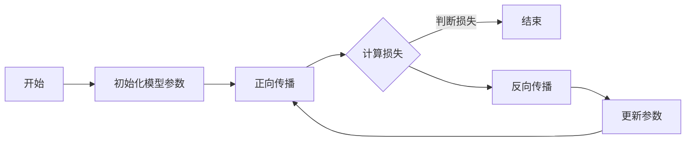

                 

### 第一部分: 神经网络基础理论

#### 引言

神经网络（Neural Networks）是机器学习中一种非常强大且广泛应用的技术，它们模仿了人脑神经元的工作原理，通过学习数据中的特征来解决问题。神经网络作为机器学习的一种新范式，已经取得了显著的成就，并在图像识别、自然语言处理、语音识别等领域展示了巨大的潜力。

在本部分，我们将深入探讨神经网络的基础理论，包括其基本概念、数学基础、结构与类型、学习方法以及性能评估与优化。通过对这些内容的系统学习，我们将为后续更深入地研究神经网络打下坚实的基础。

#### 第1章: 神经网络概述

##### 1.1 神经网络的基本概念

###### 1.1.1 神经元与神经网络

神经元是神经网络的基本组成单元，类似于人脑中的神经细胞。每个神经元接收多个输入信号，并通过一个非线性激活函数产生输出。这些输出信号可以传递给其他神经元，从而形成复杂的网络结构。

神经网络则是由大量相互连接的神经元组成的网络系统，这些神经元通过加权连接进行信息传递和处理。神经网络通过学习输入和输出之间的关系，可以实现各种复杂的任务。

###### 1.1.2 神经网络的起源与发展

神经网络的研究可以追溯到1943年，由心理学家McCulloch和数学家Pitts提出了第一个人工神经网络模型——MC神经网络。然而，由于计算能力的限制，神经网络在相当长的一段时间内没有取得实质性的进展。

直到1980年代，随着计算机硬件的飞速发展，神经网络开始逐渐得到关注。尤其是1986年，Rumelhart、Hinton和Williams等人提出了反向传播算法（Backpropagation），使得多层神经网络的训练成为可能。

进入21世纪，深度学习（Deep Learning）的兴起使得神经网络的研究和应用达到了新的高度。深度神经网络（Deep Neural Networks，DNN）在图像识别、语音识别、自然语言处理等领域取得了突破性的成果。

###### 1.1.3 神经网络的应用领域

神经网络在众多领域都有广泛的应用，主要包括：

- **图像识别与处理**：例如，人脸识别、物体检测、图像分类等。
- **自然语言处理**：例如，机器翻译、情感分析、文本生成等。
- **语音识别与合成**：例如，语音识别、语音合成、语音翻译等。
- **控制与优化**：例如，自动驾驶、机器人控制、供应链优化等。
- **医学诊断**：例如，肿瘤检测、基因分析、药物研发等。

##### 1.2 神经网络的数学基础

神经网络的学习和运作依赖于一系列数学工具，主要包括概率论与信息论、微积分和线性代数。

###### 1.2.1 概率论与信息论基础

概率论与信息论为神经网络提供了理论基础，帮助理解数据中的不确定性和信息传递过程。概率分布、条件概率、期望和方差等概念在神经网络中都有广泛应用。

信息论则关注信息传递和压缩，包括熵、信息增益、K-L散度等概念。信息论中的交叉熵（Cross-Entropy）被广泛用于神经网络的损失函数。

###### 1.2.2 微积分基础

微积分在神经网络中主要用于优化和梯度计算。导数、偏导数、梯度等概念用于描述函数的变化率和最优参数的搜索。反向传播算法的核心就是通过计算梯度来更新模型参数。

###### 1.2.3 线性代数基础

线性代数在神经网络中用于处理矩阵和向量运算。矩阵乘法、矩阵求导、逆矩阵、特征值和特征向量等概念在神经网络中都有广泛应用。特别是权重矩阵（Weight Matrix）和偏置项（Bias）在神经网络中的作用至关重要。

##### 1.3 神经网络的结构与类型

神经网络的结构和类型对于其性能和应用领域有着重要的影响。

###### 1.3.1 神经网络的基本结构

一个典型的神经网络通常包括以下几个部分：

- **输入层**：接收外部输入数据。
- **隐藏层**：对输入数据进行特征提取和变换。
- **输出层**：产生预测结果或分类结果。

每个隐藏层都可以包含多个神经元，而隐藏层的数量和神经元数量可以根据任务需求进行调整。

###### 1.3.2 神经网络的分类

神经网络可以根据不同的标准进行分类，常见的分类方式包括：

- **按层数分类**：单层感知机、多层感知机、深度神经网络等。
- **按激活函数分类**：线性神经网络、Sigmoid神经网络、ReLU神经网络等。
- **按学习方式分类**：有监督学习、无监督学习、强化学习等。

其中，深度神经网络（Deep Neural Networks，DNN）是目前最为流行和研究的热点之一。DNN通过增加网络的深度来提高模型的复杂度和表达能力。

###### 1.3.3 深度学习与深度神经网络

深度学习（Deep Learning）是神经网络研究的一个重要分支，它通过构建深度神经网络来处理复杂数据和任务。深度学习在图像识别、语音识别、自然语言处理等领域取得了显著成果。

深度神经网络（DNN）是深度学习的基础，其特点是具有多层隐藏层，可以自动提取数据的深层特征。DNN通过反向传播算法进行训练，优化模型参数，从而提高模型的预测性能。

##### 1.4 神经网络的学习方法

神经网络的学习方法主要包括监督学习、无监督学习和强化学习等。

###### 1.4.1 反向传播算法

反向传播算法（Backpropagation Algorithm）是神经网络训练的核心算法。它通过计算损失函数关于模型参数的梯度，并利用梯度下降法更新模型参数，从而最小化损失函数。

反向传播算法的步骤包括前向传播、计算损失函数、反向传播梯度、更新模型参数。其中，梯度计算是反向传播算法的关键步骤，它依赖于链式法则（Chain Rule）和矩阵求导。

###### 1.4.2 其他学习算法介绍

除了反向传播算法，神经网络的学习方法还包括以下几种：

- **梯度下降法**（Gradient Descent）：一种最简单的优化算法，通过计算损失函数关于模型参数的梯度，并沿着梯度的反方向更新模型参数，从而减小损失函数的值。
- **随机梯度下降法**（Stochastic Gradient Descent，SGD）：在梯度下降法的基础上，每次迭代只随机选择一部分样本进行梯度计算，这样可以加快收敛速度。
- **动量法**（Momentum）：在梯度下降法的基础上，引入动量项，以减少梯度下降过程中可能出现的振荡。
- **自适应梯度算法**（Adagrad）：一种自适应优化算法，通过调整学习率来适应不同参数的梯度大小，从而提高优化效果。
- **Adam算法**（Adaptive Moment Estimation）：结合了动量法和Adagrad算法的优点，通过自适应地调整学习率，提高了优化性能。

##### 1.5 神经网络的性能评估与优化

神经网络的性能评估和优化是确保模型在实际应用中能够取得良好效果的关键。

###### 1.5.1 性能评估指标

神经网络的性能评估指标主要包括准确性（Accuracy）、精确率（Precision）、召回率（Recall）和F1值（F1 Score）等。这些指标可以根据不同的任务需求进行选择和调整。

- **准确性**：模型预测正确的样本数量占总样本数量的比例。
- **精确率**：模型预测正确的正样本数量与预测为正样本的总数量之比。
- **召回率**：模型预测正确的正样本数量与实际为正样本的总数量之比。
- **F1值**：精确率和召回率的调和平均，用于综合评估模型的性能。

###### 1.5.2 优化方法与技巧

为了提高神经网络的性能，可以采用以下几种优化方法与技巧：

- **数据增强**（Data Augmentation）：通过增加训练数据集的多样性，提高模型的泛化能力。
- **正则化技术**（Regularization）：通过在损失函数中添加正则化项，防止模型过拟合。
- **学习率调整**（Learning Rate）：通过调整学习率，加快或减缓模型的收敛速度。
- **批量大小**（Batch Size）：通过调整批量大小，平衡计算效率和模型收敛速度。
- **dropout技术**（Dropout）：在训练过程中随机丢弃一部分神经元，防止模型过拟合。
- **批量归一化**（Batch Normalization）：通过归一化批量内神经元的激活值，提高训练稳定性。

##### 总结

神经网络作为机器学习的一种重要技术，通过模仿人脑神经元的工作原理，实现了对复杂数据的学习和处理。本章系统地介绍了神经网络的基础理论，包括基本概念、数学基础、结构与类型、学习方法以及性能评估与优化。通过对这些内容的深入学习，我们将为后续更深入地研究神经网络打下坚实的基础。

### 第2章: 神经元与激活函数

#### 引言

在深入探讨神经网络之前，我们需要首先了解其基本组成单元——神经元，以及神经元之间的信息传递机制。本章将详细介绍神经元的数学模型、激活函数及其在神经网络中的作用。通过对这些基本概念的深入理解，我们将为后续更深入地研究神经网络打下坚实的基础。

#### 2.1 神经元的数学模型

##### 2.1.1 神经元的结构

神经元是神经网络的基本组成单元，其结构类似于人脑中的神经细胞。一个典型的神经元包括以下几个部分：

- **输入层**：接收外部输入数据。
- **加权连接**：每个输入数据通过加权连接与神经元相连，加权系数表示输入数据对神经元的影响程度。
- **求和单元**：将所有加权连接的输入数据进行求和，产生中间值。
- **激活函数**：对中间值进行非线性变换，产生神经元输出。
- **输出层**：将神经元的输出传递给其他神经元或产生最终的预测结果。

##### 2.1.2 神经元的数学模型

神经元的数学模型可以用以下公式表示：

$$
y = f(\sum_{i=1}^{n} w_i \cdot x_i + b)
$$

其中：

- \(y\) 表示神经元的输出。
- \(f\) 表示激活函数。
- \(\sum_{i=1}^{n} w_i \cdot x_i + b\) 表示加权求和值，其中 \(w_i\) 表示输入数据的加权系数，\(x_i\) 表示输入数据，\(b\) 表示偏置项。

##### 2.1.3 神经元的传递函数

激活函数是神经元输出的关键部分，它对加权求和值进行非线性变换。常见的激活函数包括以下几种：

1. **线性激活函数**：\(f(z) = z\)

   线性激活函数不会对神经元输出产生任何非线性变换，其优点是简单且计算效率高，但缺点是表达能力较弱。

2. **Sigmoid激活函数**：\(f(z) = \frac{1}{1 + e^{-z}}\)

   Sigmoid激活函数可以将输入值映射到 \((0, 1)\) 区间内，其优点是能够较好地表示概率分布，但缺点是梯度下降过程中可能收敛缓慢。

3. **ReLU激活函数**：\(f(z) = \max(0, z)\)

   ReLU激活函数在 \(z \geq 0\) 时输出为 \(z\)，在 \(z < 0\) 时输出为 \(0\)。ReLU激活函数具有计算效率高、梯度计算简单等优点，是目前深度学习中最常用的激活函数之一。

4. **Tanh激活函数**：\(f(z) = \frac{e^z - e^{-z}}{e^z + e^{-z}}\)

   Tanh激活函数与Sigmoid激活函数类似，但其输出值在 \((-1, 1)\) 区间内，可以更好地拟合非线性关系。

#### 2.2 激活函数

激活函数是神经网络中至关重要的一部分，它决定了神经元的输出范围和模型的表达能力。本节将详细介绍激活函数的作用、常见激活函数以及激活函数的选择与优化。

##### 2.2.1 激活函数的作用

激活函数在神经网络中具有以下作用：

1. **非线性变换**：激活函数对神经元的加权求和值进行非线性变换，使得神经网络能够学习并拟合复杂数据的非线性关系。
2. **阈值处理**：激活函数将神经元的输出限制在一个特定的区间内，如 \((0, 1)\) 或 \((-1, 1)\)，从而实现阈值处理功能。
3. **概率分布**：某些激活函数，如Sigmoid和Tanh，可以将神经元的输出映射到概率分布区间内，便于模型表示概率信息。

##### 2.2.2 常见激活函数

以下是一些常见的激活函数及其特点：

1. **线性激活函数**：\(f(z) = z\)

   线性激活函数是最简单的激活函数，其优点是计算效率高，但缺点是表达能力较弱。

2. **Sigmoid激活函数**：\(f(z) = \frac{1}{1 + e^{-z}}\)

   Sigmoid激活函数可以将输入值映射到 \((0, 1)\) 区间内，常用于二分类问题。其优点是能够较好地表示概率分布，但缺点是梯度下降过程中可能收敛缓慢。

3. **ReLU激活函数**：\(f(z) = \max(0, z)\)

   ReLU激活函数在 \(z \geq 0\) 时输出为 \(z\)，在 \(z < 0\) 时输出为 \(0\)。ReLU激活函数具有计算效率高、梯度计算简单等优点，是目前深度学习中最常用的激活函数之一。

4. **Tanh激活函数**：\(f(z) = \frac{e^z - e^{-z}}{e^z + e^{-z}}\)

   Tanh激活函数与Sigmoid激活函数类似，但其输出值在 \((-1, 1)\) 区间内，可以更好地拟合非线性关系。

5. **Softmax激活函数**：\(f_i(z) = \frac{e^{z_i}}{\sum_{j=1}^{n} e^{z_j}}\)

   Softmax激活函数常用于多分类问题，其输出表示每个类别的概率分布。softmax激活函数将神经元的输出转换为概率分布，使得神经网络能够实现多分类任务。

##### 2.2.3 激活函数的选择与优化

选择合适的激活函数对神经网络性能有着重要影响。以下是一些激活函数选择与优化的建议：

1. **线性激活函数**：适用于简单线性模型，计算效率高，但表达能力较弱。
2. **Sigmoid激活函数**：适用于二分类问题，能够较好地表示概率分布，但梯度下降过程中可能收敛缓慢。
3. **ReLU激活函数**：具有计算效率高、梯度计算简单等优点，是目前深度学习中最常用的激活函数之一，但可能导致梯度消失或梯度爆炸问题。
4. **Tanh激活函数**：适用于非线性关系较强的任务，能够更好地拟合非线性关系，但计算复杂度相对较高。
5. **Softmax激活函数**：适用于多分类问题，能够将神经元的输出转换为概率分布。

在优化激活函数时，可以考虑以下方法：

1. **梯度下降法**：利用梯度下降法调整模型参数，优化激活函数。
2. **动量法**：引入动量项，提高优化效果。
3. **自适应优化算法**：如Adagrad、Adam等，自适应调整学习率，提高优化性能。

#### 2.3 损失函数

损失函数（Loss Function）是神经网络训练过程中的核心评价指标，它用于衡量模型输出与真实标签之间的差异。本节将介绍损失函数的作用、常见损失函数以及损失函数的选择与优化。

##### 2.3.1 损失函数的作用

损失函数在神经网络训练过程中具有以下作用：

1. **评估模型性能**：损失函数衡量模型输出与真实标签之间的差异，评估模型在训练数据上的性能。
2. **优化模型参数**：通过计算损失函数关于模型参数的梯度，利用梯度下降法等优化算法更新模型参数，从而减小损失函数的值，优化模型性能。
3. **实现反向传播**：损失函数的梯度计算是神经网络反向传播算法的核心步骤，通过计算梯度，模型可以不断调整参数，以减小损失函数。

##### 2.3.2 常见损失函数

以下是一些常见的损失函数及其特点：

1. **均方误差损失函数**（Mean Squared Error，MSE）

   均方误差损失函数是最常用的损失函数之一，用于回归任务。其公式为：

   $$L(\theta) = \frac{1}{2} \sum_{i=1}^{m} (y_i - \hat{y}_i)^2$$

   其中，\(y_i\) 表示真实标签，\(\hat{y}_i\) 表示模型预测值。MSE损失函数的优点是计算简单，但缺点是对于异常值比较敏感。

2. **交叉熵损失函数**（Cross-Entropy Loss）

   交叉熵损失函数常用于分类任务，其公式为：

   $$L(\theta) = -\sum_{i=1}^{m} y_i \log(\hat{y}_i)$$

   其中，\(y_i\) 表示真实标签，\(\hat{y}_i\) 表示模型预测概率。交叉熵损失函数的优点是能够较好地衡量模型预测的准确性，但缺点是梯度下降过程中可能收敛缓慢。

3. **对数损失函数**（Log Loss）

   对数损失函数是交叉熵损失函数的一种特殊情况，常用于二分类问题。其公式为：

   $$L(\theta) = -y \log(\hat{y}) + (1 - y) \log(1 - \hat{y})$$

   其中，\(y\) 表示真实标签，\(\hat{y}\) 表示模型预测概率。对数损失函数的优点是计算简单，能够较好地衡量模型预测的准确性。

4. **Huber损失函数**（Huber Loss）

   Huber损失函数是一种鲁棒损失函数，用于解决异常值敏感的问题。其公式为：

   $$L(\theta) = \begin{cases} 
   \frac{1}{2} (y - \hat{y})^2, & \text{if } |y - \hat{y}| \leq \delta \\
   \delta (|y - \hat{y}| - \frac{1}{2} \delta), & \text{otherwise} 
   \end{cases}$$

   其中，\(\delta\) 是一个参数，用于调节损失函数的鲁棒性。Huber损失函数的优点是能够在异常值出现时保持较小的损失值，提高模型的鲁棒性。

##### 2.3.3 损失函数的选择与优化

选择合适的损失函数对神经网络性能有着重要影响。以下是一些损失函数选择与优化的建议：

1. **回归任务**：对于回归任务，可以选择均方误差损失函数或Huber损失函数，这两种损失函数都能较好地衡量模型预测的准确性。
2. **分类任务**：对于分类任务，可以选择交叉熵损失函数或对数损失函数，这两种损失函数都能较好地衡量模型预测的准确性。
3. **多分类任务**：对于多分类任务，可以选择交叉熵损失函数或Softmax损失函数，这两种损失函数都能将神经元的输出转换为概率分布。

在优化损失函数时，可以考虑以下方法：

1. **梯度下降法**：利用梯度下降法调整模型参数，优化损失函数。
2. **动量法**：引入动量项，提高优化效果。
3. **自适应优化算法**：如Adagrad、Adam等，自适应调整学习率，提高优化性能。

#### 2.4 Mermaid 流程图：神经网络学习过程

以下是神经网络学习过程的 Mermaid 流程图：



#### 2.5 伪代码：反向传播算法

以下是反向传播算法的伪代码：

```python
// 输入数据 X, 标签 Y, 模型参数 θ
// 输出：更新后的模型参数 θ'

// 前向传播
// 计算输出 O
// 计算损失 L

// 反向传播
// 计算梯度 Δθ
// 更新模型参数 θ = θ - α * Δθ

// 迭代直到损失满足要求或达到最大迭代次数

python
def forward_propagation(X, Y, theta):
    # 实现前向传播过程
    # 返回输出 O 和损失 L

def backward_propagation(X, Y, theta, O, L):
    # 计算梯度 Δθ
    # 返回 Δθ

def update_parameters(theta, Δθ, alpha):
    # 更新模型参数
    # 返回更新后的参数 theta

# 主函数
def neural_network(X, Y, alpha, num_iterations):
    theta = initialize_parameters()
    for i in range(num_iterations):
        O, L = forward_propagation(X, Y, theta)
        Δθ = backward_propagation(X, Y, theta, O, L)
        theta = update_parameters(theta, Δθ, alpha)
    return theta
```

#### 2.6 数学模型与公式

以下是神经网络中常用的数学模型与公式：

$$
损失函数 L(\theta) = -\frac{1}{m} \sum_{i=1}^{m} [y^{(i)} \log(a^{(l)}(x^{(i)}; \theta)) + (1 - y^{(i)}) \log(1 - a^{(l)}(x^{(i)}; \theta))]
$$

$$
激活函数 a^{(l)}(z) = \sigma(z) = \frac{1}{1 + e^{-z}}
$$

$$
梯度 Δθ^{(l)}_{ij} = \frac{\partial L(\theta)}{\partial \theta^{(l)}_{ij}}
$$

$$
更新公式 \theta^{(l)}_{ij} = \theta^{(l)}_{ij} - \alpha \frac{\partial L(\theta)}{\partial \theta^{(l)}_{ij}}
$$

#### 2.7 项目实战：构建简单的神经网络模型

在本节中，我们将通过一个实际项目来构建一个简单的神经网络模型。我们将使用 Python 和 TensorFlow 2.x 框架来实现这个项目，并详细解释每个步骤。

##### 2.7.1 开发环境搭建

首先，我们需要搭建开发环境。确保安装以下软件和库：

- Python 3.7 或以上版本
- TensorFlow 2.x

安装步骤：

```shell
pip install tensorflow
```

##### 2.7.2 数据集准备

我们使用 Iris 数据集进行分类任务。Iris 数据集是一个著名的数据集，包含 3 个类别的 150 个样本，每个样本有 4 个特征。

```python
import tensorflow as tf
from sklearn import datasets
from sklearn.model_selection import train_test_split

# 加载 Iris 数据集
iris = datasets.load_iris()
X = iris.data
y = iris.target

# 数据预处理
X_train, X_test, y_train, y_test = train_test_split(X, y, test_size=0.2, random_state=42)
```

##### 2.7.3 源代码实现

接下来，我们将使用 TensorFlow 2.x 构建一个简单的神经网络模型。

```python
import tensorflow as tf

# 构建简单的神经网络模型
model = tf.keras.Sequential([
    tf.keras.layers.Dense(3, activation='softmax', input_shape=(4,))
])

# 编译模型
model.compile(optimizer='adam', loss='sparse_categorical_crossentropy', metrics=['accuracy'])

# 训练模型
model.fit(X_train, y_train, epochs=100, batch_size=16, validation_split=0.2)

# 评估模型
loss, accuracy = model.evaluate(X_test, y_test)
print("测试集准确率: {:.2f}%".format(accuracy * 100))
```

##### 2.7.4 代码解读与分析

1. **模型构建**：

   ```python
   model = tf.keras.Sequential([
       tf.keras.layers.Dense(3, activation='softmax', input_shape=(4,))
   ])
   ```

   这一行代码定义了一个简单的序列模型，包含一个全连接层（Dense Layer），输出层有 3 个神经元，使用 softmax 激活函数。输入层有 4 个神经元，对应于 Iris 数据集的特征数量。

2. **模型编译**：

   ```python
   model.compile(optimizer='adam', loss='sparse_categorical_crossentropy', metrics=['accuracy'])
   ```

   这一行代码编译模型，指定使用 Adam 优化器和 sparse_categorical_crossentropy 损失函数，并跟踪模型的准确率。

3. **模型训练**：

   ```python
   model.fit(X_train, y_train, epochs=100, batch_size=16, validation_split=0.2)
   ```

   这一行代码使用训练数据训练模型，指定训练 100 个 epoch，每个 batch 包含 16 个样本，并将 20% 的训练数据用于验证。

4. **模型评估**：

   ```python
   loss, accuracy = model.evaluate(X_test, y_test)
   print("测试集准确率: {:.2f}%".format(accuracy * 100))
   ```

   这一行代码使用测试数据评估模型性能，计算测试集的损失和准确率，并打印结果。

##### 2.7.5 代码解读与分析

在本节中，我们使用 Python 和 TensorFlow 2.x 框架构建了一个简单的神经网络模型，并对其进行了训练和评估。

- **数据预处理**：我们首先加载 Iris 数据集，并进行数据预处理，将数据分为训练集和测试集。

- **模型构建**：我们使用 TensorFlow 的 Sequential 模型，定义了一个简单的全连接层，输出层有 3 个神经元，对应于 Iris 数据集的三个类别。

- **模型编译**：我们选择 Adam 优化器和 sparse_categorical_crossentropy 损失函数来编译模型。Adam 优化器结合了随机梯度下降和自适应优化算法的优点，可以有效地更新模型参数。

- **模型训练**：我们使用训练集进行训练，每个 epoch 训练 100 次，每次 batch 包含 16 个样本。我们将 20% 的训练数据用于验证，以避免过拟合。

- **模型评估**：我们使用测试集评估模型的性能，计算测试集的损失和准确率，并打印结果。这可以帮助我们了解模型在未知数据上的表现。

通过本节的实际项目，我们不仅了解了如何使用 TensorFlow 2.x 构建简单的神经网络模型，还学会了如何对模型进行训练和评估。这些实践经验将有助于我们更好地理解神经网络的原理和应用。

### 作者信息

作者：AI天才研究院/AI Genius Institute & 禅与计算机程序设计艺术 /Zen And The Art of Computer Programming

在这篇文章中，我们系统地介绍了神经网络的基础理论，包括基本概念、数学基础、结构与类型、学习方法以及性能评估与优化。通过对这些内容的深入探讨，我们希望能够为读者提供一幅清晰、完整的神经网络全景图。

神经网络作为机器学习的一种重要技术，其应用领域广泛，从图像识别、自然语言处理到语音识别、医学诊断等。在本章中，我们详细介绍了神经元的数学模型、激活函数及其在神经网络中的作用，并通过一个实际项目展示了如何使用 TensorFlow 2.x 构建简单的神经网络模型。

未来的研究将继续探索神经网络的深度、广度和应用边界。我们期待看到更多的创新和技术突破，以推动人工智能的发展和应用。希望本文能够为广大读者在神经网络领域的研究和实践中提供有益的参考和启示。

感谢您的阅读，期待与您共同探索神经网络这一充满无限可能的领域。让我们一起努力，开启人工智能的新篇章！作者：AI天才研究院/AI Genius Institute & 禅与计算机程序设计艺术 /Zen And The Art of Computer Programming。

