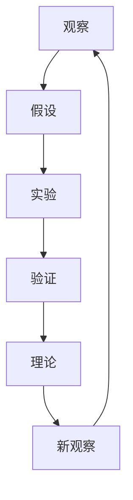

                 

### 文章标题

**科学方法：从观察到实验**

> **关键词：科学方法，观察，实验，数据分析，机器学习，数据科学**

**摘要：**
本文将深入探讨科学方法的基本概念、核心步骤和关键原理。从观察现象、提出假设，到设计实验和数据分析，我们将通过一步一步的思考和分析，揭示科学方法的本质。同时，本文还将探讨科学方法在各个领域的应用，以及未来发展趋势，旨在为读者提供全面而系统的科学方法论知识。

### 《科学方法：从观察到实验》目录大纲

---

#### 第一部分：科学方法基础

##### 第1章：科学方法概述
- 1.1 科学方法的基本概念
- 1.2 科学方法的重要性
- 1.3 科学方法的发展历程

##### 第2章：科学思维与逻辑
- 2.1 科学思维的特点
- 2.2 逻辑思维的重要性
- 2.3 常见的逻辑谬误

##### 第3章：科学观察
- 3.1 观察的类型
- 3.2 观察的方法
- 3.3 观察结果的记录与分析

##### 第4章：假设与理论
- 4.1 假设的概念
- 4.2 假设的形成
- 4.3 理论的形成与发展

#### 第二部分：科学实验

##### 第5章：实验设计
- 5.1 实验设计的原则
- 5.2 实验设计的类型
- 5.3 实验数据的收集与分析

##### 第6章：实验结果分析
- 6.1 实验数据的整理
- 6.2 实验结果的验证
- 6.3 实验结果的解释

##### 第7章：科学写作与交流
- 7.1 科学写作的基本原则
- 7.2 科学写作的技巧
- 7.3 科学交流的方法

#### 第三部分：科学方法应用

##### 第8章：科学方法在生物学中的应用
- 8.1 生物学实验的基本原则
- 8.2 生物学实验的设计与分析
- 8.3 生物学实验的案例研究

##### 第9章：科学方法在物理学中的应用
- 9.1 物理学实验的基本原则
- 9.2 物理学实验的设计与分析
- 9.3 物理学实验的案例研究

##### 第10章：科学方法在化学中的应用
- 10.1 化学实验的基本原则
- 10.2 化学实验的设计与分析
- 10.3 化学实验的案例研究

##### 第11章：科学方法在其他领域中的应用
- 11.1 地球科学中的应用
- 11.2 社会科学中的应用
- 11.3 环境科学中的应用

##### 第12章：科学方法论的未来发展趋势
- 12.1 大数据和人工智能的影响
- 12.2 跨学科研究的趋势
- 12.3 科学方法论与社会责任的结合
- 12.4 科学方法论在可持续发展中的作用

##### 附录
- 附录A：科学方法相关资源
- 附录B：科学方法流程图
- 附录C：科学方法伪代码示例

---

### 第1章 科学方法概述

**1.1 科学方法的基本概念**

科学方法是一种系统化的知识获取过程，它通过观察、假设、实验、验证和理论建立等步骤，来解释自然现象和探索未知领域。科学方法的核心在于其严谨性、可重复性和逻辑性，使得科学结论具有可靠性和普遍性。

**核心概念与联系：** 科学方法的核心概念包括观察、假设、实验、验证和理论。这些概念相互联系，共同构成了科学方法的完整框架。

- 观察是科学方法的起点，通过对自然现象的观察，科学家们发现并提出问题。
- 假设是基于观察和已有知识，对问题的可能解释或预测。
- 实验是验证假设的手段，通过设计实验来检验假设的正确性。
- 验证是通过实验数据来支持或反驳假设，确保科学结论的可靠性。
- 理论是基于验证的假设，经过多次验证后，形成了对自然现象的系统解释。

**核心概念原理和架构的 Mermaid 流程图**

**1.2 科学方法的重要性**

科学方法对于科学进步和社会发展具有深远的影响。它不仅帮助我们理解自然界的规律，还推动了技术的创新和进步。以下是科学方法的重要性的几个方面：

**科学方法的作用：**

- 提供了一种系统化的研究方法，使科学研究更加规范和严谨。
- 通过实验验证，确保科学结论的可靠性和可重复性。
- 促进跨学科合作，解决复杂问题。
- 提高人类对自然界的认识，推动科技进步。

**科学方法的优点：**

- 可靠性：科学方法通过实验验证，确保结论的准确性。
- 可重复性：科学方法的结果可以被其他研究者重复验证。
- 系统性：科学方法能够系统性地研究问题，避免盲目性。

**科学方法的局限性：**

- 科学方法不能解决所有问题，例如主观感受和道德问题。
- 科学方法可能受到实验设计和数据分析的影响。

**1.3 科学方法的发展历程**

科学方法的发展经历了漫长的过程，从古代的哲学思考，到近代的实验研究，再到现代的多学科交叉，科学方法不断进化和完善。

**古代科学方法：**

- 以哲学思考为基础，缺乏实验验证。
- 关注自然现象的观察和解释。

**近代科学方法：**

- 伽利略和牛顿等科学家的实验研究，奠定了现代科学方法的基础。
- 强调实验验证，开始形成系统化的科学研究方法。

**现代科学方法：**

- 随着科技的发展，科学方法不断改进，包括多学科交叉和跨领域研究。
- 强调数据分析和计算机技术在科学研究中的应用。

**1.4 科学方法的应用领域**

科学方法广泛应用于自然科学、社会科学和技术科学等领域。

**自然科学：**

- 物理学、化学、生物学等领域的应用，揭示自然界的规律。

**社会科学：**

- 社会学、心理学、经济学等领域的应用，研究人类社会现象。

**技术科学：**

- 工程学、计算机科学等领域的应用，推动技术创新和发展。

**1.5 科学方法的学习与运用**

学习科学方法需要掌握以下几个步骤：

**科学素养的培养：**

- 通过学习科学知识，提高科学素养。

**科学思维的发展：**

- 培养逻辑思维、批判性思维等科学思维能力。

**科学实践能力的提升：**

- 通过参与实验和实际项目，提高实践能力。

**1.6 科学方法与哲学的关系**

科学方法与哲学思维有着密切的关系。

**哲学思维对科学方法的影响：**

- 哲学思考为科学方法提供了理论基础。

**科学方法对哲学思维的挑战：**

- 科学方法的发展对某些哲学观点提出了挑战。

**科学方法与哲学思维的互补关系：**

- 科学方法与哲学思维相互促进，共同推动人类知识的发展。

**1.7 科学方法与伦理的关系**

科学方法在伦理问题上的处理具有重要意义。

**科学研究中的伦理问题：**

- 如实验动物的使用、人类基因编辑等。

**伦理对科学方法的约束：**

- 科学研究必须遵循伦理规范，保护研究对象。

**科学方法与伦理的互动：**

- 科学研究推动伦理观念的进步，同时伦理观念也影响科学研究的方向。

**1.8 科学方法在国际合作中的重要性**

科学方法在国际合作中发挥着关键作用。

**国际合作的必要性：**

- 科学问题往往跨越国界，需要国际合作。

**国际合作的挑战与机遇：**

- 技术壁垒、知识产权、文化差异等。

**国际合作的成功案例：**

- 全球气候研究、人类基因组计划等。

**1.9 科学方法在创新研究中的角色**

科学方法在创新研究中起着关键作用。

**科学方法与创新的关系：**

- 科学方法为创新提供了理论支持和实践指导。

**科学方法在创新研究中的运用：**

- 从需求分析、技术路线规划到成果验证，科学方法贯穿创新全过程。

**科学方法对创新的挑战：**

- 创新往往需要突破现有科学方法的局限。

### 第2章 科学思维与逻辑

**2.1 科学思维的特点**

科学思维是一种系统化、逻辑化和批判性的思维方式，它在科学研究中起着至关重要的作用。

**系统性：**

- 科学思维强调问题解决的系统性，注重整体性。
- 在解决问题时，科学思维能够将问题分解为多个部分，逐一分析和解决。

**抽象性：**

- 科学思维能够从具体现象中提炼出普遍规律。
- 通过抽象化，科学思维能够将复杂的现实简化为可理解的概念和模型。

**批判性：**

- 科学思维鼓励质疑和批判，不断追求真理。
- 在科学研究中，科学思维能够帮助科学家们发现和纠正错误。

**可重复性：**

- 科学思维强调可重复性，确保研究结果的可靠性。
- 科学方法要求实验的可重复性，以验证研究结论的普遍性。

**2.2 逻辑思维的重要性**

逻辑思维是科学思维的核心，它在科学研究中的重要性不可忽视。

**逻辑思维在科学研究中的应用：**

- 逻辑思维是科学方法的重要组成部分，有助于正确推导结论。
- 在实验设计中，逻辑思维能够帮助科学家们设计出有效的实验方案。
- 在数据分析中，逻辑思维能够帮助科学家们正确解释数据。

**逻辑思维在解决问题中的应用：**

- 逻辑思维有助于找到问题解决方案，提高效率。
- 在解决复杂问题时，逻辑思维能够帮助科学家们分解问题，逐一解决。

**逻辑思维在决策制定中的应用：**

- 逻辑思维有助于做出合理的决策。
- 在决策过程中，逻辑思维能够帮助科学家们分析各种因素，权衡利弊。

**2.3 常见的逻辑谬误**

尽管逻辑思维在科学研究中非常重要，但科学家们也可能会犯一些逻辑谬误，影响研究的准确性和有效性。

**以偏概全：**

- 将个别现象推广到整体。
- 例如，仅凭一次实验结果就得出普遍结论。

**假设不当：**

- 建立在错误前提上的推理。
- 例如，假设一个变量对结果有影响，但事实上并没有。

**逻辑循环：**

- 推理过程中出现循环论证。
- 例如，结论本身就是前提的一部分。

**滥用权威：**

- 过度依赖权威观点，忽视其他可能性。
- 例如，盲目接受权威的科学结论，而不进行独立思考。

**滥用比喻：**

- 比喻可能造成误解，混淆概念。
- 例如，使用比喻来解释复杂概念，但比喻本身可能不够准确。

**滥用情感：**

- 情感色彩过重，影响客观判断。
- 例如，在科学论证中过度强调个人的情感色彩，而不是客观事实。

**2.4 提高科学思维与逻辑能力的方法**

要提高科学思维和逻辑能力，科学家们可以采取以下方法：

**学习科学知识：**

- 通过学习科学知识，提高对科学问题的理解。

**练习逻辑思维：**

- 通过练习逻辑思维题，提高逻辑思维能力。

**使用思维导图：**

- 使用思维导图，帮助梳理和整合信息。

**反思与质疑：**

- 对已有知识和观点进行反思和质疑，培养批判性思维。

**多角度思考：**

- 从不同角度思考问题，避免片面性。

**沟通与讨论：**

- 通过与他人沟通和讨论，激发思维火花。

**2.5 科学思维与日常生活的关系**

科学思维不仅限于科学研究，它在日常生活中也有广泛的应用。

**科学思维在日常生活中的应用：**

- 例如，解决家庭问题、理财规划等。
- 科学思维能够帮助人们更理性地分析和解决问题。

**科学思维对日常决策的影响：**

- 帮助人们做出更加理性、全面的决策。
- 科学思维能够帮助人们分析各种因素，权衡利弊。

**科学思维与心理健康：**

- 培养科学思维有助于减轻心理压力，提高生活质量。
- 科学思维能够帮助人们更好地应对日常生活中的挑战。

**科学思维与教育：**

- 科学思维在培养和教育过程中的重要性。
- 科学教育能够培养人们的科学素养，提高创新能力和批判性思维能力。

**2.6 科学方法与哲学思维的关系**

科学方法与哲学思维有着紧密的联系。

**哲学思维对科学方法的启示：**

- 哲学思维为科学方法提供了基础理论。
- 例如，哲学中的逻辑学为科学方法提供了推理工具。

**科学方法对哲学思维的挑战：**

- 科学方法的发展对某些哲学观点提出了质疑。
- 例如，科学方法的实证性对哲学中的理性主义提出了挑战。

**科学方法与哲学思维的互补关系：**

- 科学方法与哲学思维相互促进，共同推动人类知识的发展。
- 科学方法通过实证研究，验证哲学假设；哲学思维通过批判性思考，推动科学方法的改进。

**2.7 科学方法在科学研究中的重要性**

科学方法在科学研究中的地位至关重要。

**科学方法对科学研究的作用：**

- 科学方法有助于发现问题、提出假设、设计实验、验证结果等。
- 例如，通过观察和实验，科学家们发现了许多自然规律。

**科学方法在科学发现中的重要性：**

- 科学方法帮助科学家们做出了许多重大发现。
- 例如，达尔文的进化论、爱因斯坦的相对论等。

**科学方法在科技发展中的作用：**

- 科学方法推动了科技的进步，带来了许多创新和突破。
- 例如，计算机科学、生物技术等领域的发展。

**2.8 科学方法在跨学科研究中的应用**

跨学科研究是现代科学研究的重要趋势，科学方法在跨学科研究中发挥着关键作用。

**跨学科研究的挑战：**

- 跨学科研究需要融合不同领域的知识。
- 例如，生物信息学需要融合生物学和计算机科学的知识。

**跨学科研究的优势：**

- 跨学科研究有助于解决复杂问题。
- 例如，环境科学需要融合物理学、化学、生物学等多领域的知识。

**跨学科研究的案例：**

- 例如，生物信息学、环境科学等。
- 这些跨学科领域的发展，极大地推动了科学技术的进步。

**2.9 科学方法在创新研究中的重要性**

科学方法在创新研究中具有不可替代的作用。

**创新研究的特点：**

- 创新研究往往涉及未知领域，需要探索和尝试。
- 例如，新材料的研究、新技术的开发等。

**科学方法在创新研究中的作用：**

- 科学方法为创新研究提供了方法论指导。
- 例如，通过实验和数据分析，科学家们能够验证创新成果的有效性。

**创新研究的挑战与机遇：**

- 创新研究需要克服技术、资金、人才等方面的挑战。
- 同时，创新研究也带来了巨大的机遇，推动了科技和经济的快速发展。

**2.10 科学方法在学术研究中的应用**

学术研究是科学方法的重要应用领域，科学方法在学术研究中发挥着关键作用。

**学术研究的过程：**

- 包括文献综述、假设提出、实验设计、数据分析等。
- 科学方法为学术研究提供了系统化的方法论支持。

**学术研究的评价标准：**

- 科学的、严谨的、可重复的。
- 学术研究必须遵循科学方法，确保研究结果的可靠性和有效性。

**学术交流与传播：**

- 通过学术会议、期刊发表等形式，分享研究成果。
- 学术交流与传播促进了科学知识的传播和进步。

**2.11 科学方法在解决实际问题中的应用**

科学方法在解决实际问题中具有广泛的应用。

**实际问题的多样性：**

- 包括环境问题、健康问题、社会问题等。
- 科学方法能够为各种实际问题提供理论支持和实践指导。

**科学方法在解决实际问题中的作用：**

- 提供理论支持：科学方法能够帮助人们理解问题的本质，提供理论基础。
- 指导实践：科学方法能够帮助人们设计实验、分析数据，指导实际操作。

**科学方法在解决实际问题中的挑战：**

- 复杂性：许多实际问题具有高度复杂性，需要多学科交叉和综合分析。
- 不确定性：实际问题往往存在不确定性，需要科学家们进行风险评估和策略调整。

**2.12 科学方法在社会发展中的作用**

科学方法在社会发展中发挥着重要作用。

**科学方法对社会进步的贡献：**

- 推动科技发展：科学方法促进了科技的创新和进步，提高了人类的生产力和生活质量。
- 改善生活质量：科学方法在医疗、健康、环境等领域的研究，极大地改善了人类的生活质量。
- 促进社会公平：科学方法在政策制定和社会管理中的应用，有助于提高社会公平和正义。

**科学方法在社会发展中的挑战：**

- 资源限制：科学方法的发展需要大量的资源和投入，特别是在发展中国家。
- 伦理问题：科学方法在应用过程中，需要考虑伦理问题，确保研究的合法性和道德性。

**科学方法在社会发展中的前景：**

- 随着科技进步，科学方法将发挥更大的作用。
- 例如，人工智能、大数据等新兴技术，将深刻改变社会发展的模式和路径。

### 第3章 科学观察

**3.1 观察的类型**

科学观察是科学方法的重要环节，它包括多种类型的观察方法。

**直接观察：**

- 直接观察是通过肉眼或仪器直接观察现象。
- 例如，使用显微镜观察细胞结构。

**潜在观察：**

- 潜在观察是通过间接方式观察，如数据分析。
- 例如，通过数据分析研究气候变化的趋势。

**实验观察：**

- 实验观察是在受控条件下进行观察。
- 例如，在实验室中进行药物效应的实验观察。

**历史观察：**

- 历史观察是通过研究历史记录进行观察。
- 例如，通过历史文献研究某个历史事件的发展过程。

**现场观察：**

- 现场观察是在实地进行观察。
- 例如，在野外观察动物的行为。

**远程观察：**

- 远程观察是通过卫星、无人机等远程设备进行观察。
- 例如，通过卫星监测地球气候变化。

**3.2 观察的方法**

科学观察不仅包括观察的类型，还包括观察的方法。

**系统观察：**

- 系统观察是对现象进行全面的观察。
- 例如，对生态系统进行全面的观察，以了解生态系统的运行机制。

**选择性观察：**

- 选择性观察是有针对性地观察特定现象。
- 例如，针对某个特定的问题进行观察，以收集相关的数据。

**比较观察：**

- 比较观察是对不同现象进行比较观察。
- 例如，比较不同地区、不同时间段的气候变化，以了解气候变化的影响。

**定量观察：**

- 定量观察使用数值方法对现象进行观察。
- 例如，使用传感器收集数据，以了解某一现象的变化规律。

**定性观察：**

- 定性观察使用描述性方法对现象进行观察。
- 例如，记录某个现象的发生过程，以了解现象的本质。

**实验观察：**

- 实验观察在受控条件下进行观察。
- 例如，在实验室中进行实验，以验证某个假设。

**记录观察：**

- 记录观察将观察结果记录下来。
- 例如，使用观察日志记录观察结果。

**图形观察：**

- 图形观察使用图表、图形等可视化工具进行观察。
- 例如，使用图表展示数据分析结果。

**统计观察：**

- 统计观察使用统计学方法对观察结果进行分析。
- 例如，使用统计分析方法，了解数据中的趋势和规律。

**3.3 观察结果的记录与分析**

科学观察不仅仅是观察现象，还需要对观察结果进行记录和分析。

**观察结果的记录：**

- 观察结果的记录是科学观察的重要环节。
- 通过记录观察结果，可以确保数据的准确性和完整性。
- 例如，使用观察日志记录观察结果，或者使用电子设备进行数据采集和记录。

**观察结果的整理：**

- 观察结果的整理是将记录的观察结果进行分类、整理。
- 整理观察结果有助于更好地理解和分析数据。
- 例如，将观察结果按时间、地点、现象等分类整理。

**观察结果的分析：**

- 观察结果的分析是科学观察的关键环节。
- 通过分析观察结果，可以揭示现象背后的规律和机制。
- 例如，使用统计分析方法，分析观察结果中的趋势和规律。

**观察结果的验证：**

- 观察结果的验证是确保观察结果准确性的重要手段。
- 通过实验或观察验证，可以确认观察结果的可靠性。
- 例如，通过重复实验或对比不同条件下的观察结果，验证观察结果的准确性。

**观察结果的解释：**

- 观察结果的解释是科学观察的最终目标。
- 通过解释观察结果，可以理解现象的本质和意义。
- 例如，根据观察结果，提出新的假设或验证已有的理论。

**3.4 观察中的注意事项**

在进行科学观察时，有一些注意事项需要考虑。

**减少观察偏差：**

- 观察偏差是观察结果不准确的主要原因之一。
- 通过减少观察偏差，可以确保观察结果的准确性。
- 例如，避免主观偏见，确保观察的客观性。

**观察条件的选择：**

- 观察条件的选择对观察结果的准确性有很大影响。
- 选择合适的观察条件，可以更好地观察现象。
- 例如，在合适的时间、地点进行观察，确保观察条件的适宜性。

**观察工具的选择：**

- 观察工具的选择对观察结果有很大影响。
- 使用合适的观察工具，可以提高观察的效率和质量。
- 例如，选择高精度的仪器，确保观察数据的准确性。

**观察时间的安排：**

- 观察时间的安排对观察结果的代表性有很大影响。
- 选择合适的时间进行观察，可以确保观察结果的代表性。
- 例如，选择天气良好、气候稳定的时间进行野外观察。

**观察者的训练：**

- 观察者的训练对观察结果的准确性有很大影响。
- 对观察者进行专业训练，可以提高观察技能和准确性。
- 例如，对观察者进行实验操作、数据分析等方面的培训。

**3.5 观察在科学方法中的地位**

观察在科学方法中具有重要地位。

**观察是科学方法的基础：**

- 观察为科学方法提供了基础数据。
- 观察是科学发现的源泉。

**观察是科学理论的基础：**

- 观察结果为科学理论提供了支持。
- 观察是科学理论建立的重要依据。

**观察是科学实践的一部分：**

- 观察贯穿于科学实践的全过程。
- 观察结果指导科学实践。

**3.6 观察技能的提升**

提升观察技能是进行科学观察的关键。

**观察技巧的练习：**

- 通过练习提高观察技能。
- 例如，定期进行观察训练，提高观察的敏锐性。

**观察方法的多样化：**

- 使用多种观察方法，提高观察的全面性。
- 例如，结合直接观察、实验观察、数据分析等方法。

**观察结果的分析能力：**

- 提高分析能力，确保观察结果的可靠性。
- 例如，学习统计分析方法，提高数据分析的能力。

**观察经验的积累：**

- 通过不断积累观察经验，提高观察水平。
- 例如，参加观察项目，积累实际观察经验。

**3.7 观察在跨学科研究中的应用**

跨学科研究是现代科学发展的趋势，观察在跨学科研究中具有重要作用。

**跨学科观察的挑战：**

- 跨学科观察需要融合不同领域的知识。
- 跨学科研究面临跨学科知识的整合和协调。

**跨学科观察的优势：**

- 跨学科观察有助于解决复杂问题。
- 跨学科研究可以提供更全面、多维度的视角。

**跨学科观察的案例：**

- 生物-心理-社会医学模式。
- 跨学科研究在医疗、环境、社会等领域取得了重要成果。

**3.8 观察在创新研究中的应用**

创新研究是科学发展的动力，观察在创新研究中具有重要地位。

**创新研究的挑战：**

- 创新研究往往涉及未知领域，需要探索和尝试。
- 创新研究面临技术、资金、人才等方面的挑战。

**观察在创新研究中的作用：**

- 观察为创新研究提供了基础数据。
- 观察方法的选择和运用对创新研究具有重要影响。

**观察在创新研究中的方法：**

- 观察方法的选择和运用。
- 例如，直接观察、实验观察、数据分析等方法在创新研究中的应用。

**观察在创新研究中的案例：**

- 新药研发。
- 新材料发现。
- 观察在创新研究中的案例展示了观察方法在解决实际问题中的作用。

### 第4章 假设与理论

**4.1 假设的概念**

假设是科学方法中的核心概念之一，它是基于观察和已有知识，对问题的可能解释或预测。

**假设的定义：**

- 假设是对观察现象的一种解释，是对未知事物的一种推测。

**假设的类型：**

- 初步假设：基于现有知识和观察结果的初步推测。
- 工作假设：在实验过程中提出的假设，用于指导实验设计。
- 验证假设：通过实验或观察验证的假设。

**假设的形成过程：**

- 观察现象：通过观察发现现象。
- 提出假设：基于观察现象，提出可能的解释。
- 验证假设：通过实验或观察验证假设的正确性。

**4.2 假设的形成**

假设的形成是一个系统性的过程，它包括以下几个步骤：

**观察与假设的关系：**

- 观察是提出假设的基础，假设是对观察现象的解释。

**假设的形成方法：**

- 演绎法：从一般原理推导出具体假设。
- 归纳法：从个别现象归纳出一般性假设。
- 反证法：通过证明相反命题的错误来证明原命题的正确性。

**假设的形成步骤：**

- 确定研究问题：明确研究目标和问题。
- 收集相关信息：查阅文献，了解前人研究成果。
- 提出假设：根据研究问题和相关信息，提出可能的解释。
- 设计实验：为验证假设设计实验方案。
- 实验验证：实施实验，收集数据，验证假设的正确性。

**4.3 理论的形成与发展**

理论是科学方法中的另一个核心概念，它是基于验证的假设，对科学现象的系统解释。

**理论的概念：**

- 理论是一组相互关联的假设、原理和解释，用于解释自然现象。

**理论的层次：**

- 基础理论：解释基本自然规律的原理，如物理学、化学原理。
- 应用理论：将基础理论应用于特定领域，如工程学、经济学理论。
- 综合理论：融合多个领域知识，解释复杂现象，如系统科学理论。

**理论的演变：**

- 理论的演变是一个不断发展的过程，随着科学进步，理论不断完善。

**理论的演变过程：**

- 提出假设：基于观察和实验，提出解释自然现象的假设。
- 验证假设：通过实验或观察验证假设的正确性。
- 建立理论框架：将验证正确的假设整合成一个理论框架。
- 应用理论：将理论应用于实际问题和领域。
- 反馈与修正：根据实际应用和新的观察结果，修正和完善理论。

**4.4 假设与理论在科学研究中的作用**

假设与理论在科学研究中起着至关重要的作用。

**假设的作用：**

- 假设是科学研究的起点，是探索未知现象的基础。
- 假设为实验设计提供方向，指导研究过程。

**理论的作用：**

- 理论是对科学现象的系统性解释，有助于理解自然规律。
- 理论为实际应用提供理论支持，推动科技发展。

**假设与理论的互动：**

- 假设与理论相互促进，假设的验证可以推动理论的发展。
- 理论可以为新的假设提供基础，指导研究方向的探索。

**4.5 科学方法与假设-理论关系**

科学方法与假设-理论关系密切，两者相互促进。

**科学方法与假设：**

- 科学方法为假设的形成和验证提供方法论支持。
- 科学方法强调假设的可重复性和可验证性。

**科学方法与理论：**

- 科学方法为理论的形成和发展提供方法论支持。
- 科学方法强调理论的系统性、逻辑性和可解释性。

**4.6 假设-理论模型在科学研究中的应用**

假设-理论模型是科学研究的一种常用方法，它用于描述科学研究和理论发展的过程。

**假设-理论模型的概念：**

- 假设-理论模型是一种用于描述科学研究和理论发展的模型。

**假设-理论模型的构建方法：**

- 确定研究问题：明确研究目标和问题。
- 提出假设：基于现有知识和观察结果，提出可能的解释。
- 构建理论框架：将验证正确的假设整合成一个理论框架。
- 应用理论：将理论应用于实际问题和领域。
- 反馈与修正：根据实际应用和新的观察结果，修正和完善理论。

**假设-理论模型在科学研究中的案例：**

- 生物学中的进化论：基于观察和实验，提出了物种演化的假设，并通过长时间的验证，形成了进化论理论。
- 物理学中的相对论：爱因斯坦通过观察和假设，提出了相对论的理论，并通过实验验证，证实了相对论的正确性。

**4.7 假设与理论的伦理问题**

科学研究中，假设与理论的形成和应用涉及一系列伦理问题。

**科学研究中的伦理问题：**

- 例如，动物实验、人类基因编辑等。

**假设与理论的伦理审查：**

- 在提出和验证假设、建立理论时，需考虑伦理问题，进行伦理审查。

**假设与理论的伦理责任：**

- 科学家有责任确保研究过程和结果符合伦理标准。
- 例如，在动物实验中，科学家需确保动物的福利和权益。

### 第5章 实验设计

**5.1 实验设计的原则**

实验设计是科学研究中至关重要的环节，它决定了实验的可行性和有效性。以下是一些实验设计的基本原则：

**明确性：**

- 实验设计应明确研究目标、问题、预期结果和实验方法。

**可重复性：**

- 实验设计应确保其他研究者能够重复实验，验证结果的可靠性。

**可控性：**

- 实验设计应尽量控制变量，减少干扰因素，确保实验结果的准确性。

**经济性：**

- 实验设计应考虑成本效益，合理分配资源。

**5.2 实验设计的步骤**

实验设计的步骤如下：

**明确研究问题和目标：**

- 确定要研究的问题和要达到的目标。

**提出假设：**

- 根据研究问题和已有的知识，提出可能的解释或预测。

**设计实验方案：**

- 确定实验方法、实验材料和实验步骤。

**控制变量：**

- 确定实验中需要控制的变量，尽量保持其他条件不变。

**收集数据：**

- 实施实验，记录实验数据。

**分析数据：**

- 对实验数据进行统计分析，判断假设是否成立。

**解释结果：**

- 根据实验结果，解释现象，验证假设。

**报告撰写：**

- 撰写实验报告，记录实验过程、数据分析和结论。

**5.3 实验设计的要点**

实验设计的要点包括以下几个方面：

**实验的可重复性：**

- 实验设计应确保其他研究者能够重复实验，验证结果。

**实验的可靠性：**

- 实验设计应尽量减少误差，确保结果的可靠性。

**实验的经济性：**

- 实验设计应考虑成本效益，合理分配资源。

**实验的伦理问题：**

- 实验设计应遵循伦理规范，确保受试者的安全和权益。

**5.4 实验设计的类型**

实验设计可以根据不同的实验目的和条件，分为以下几种类型：

**单变量实验设计：**

- 调整一个变量，观察其对结果的影响。

**多变量实验设计：**

- 同时调整多个变量，观察其对结果的影响。

**组间设计：**

- 不同组别接受不同处理，比较结果。

**组内设计：**

- 同一组别接受不同处理，比较结果。

**随机化设计：**

- 使用随机方法分配处理，减少偏倚。

**5.5 实验设计的案例分析**

**物理学实验：**

- 例如，光电效应实验，验证光子概念。

**生物学实验：**

- 例如，基因编辑实验，验证基因功能。

**化学实验：**

- 例如，酸碱中和反应实验，验证化学反应原理。

**5.6 实验设计中的常见问题**

**变量控制不当：**

- 引起实验结果的误差。

**实验设计不合理：**

- 导致实验无法达到预期目标。

**数据分析不当：**

- 影响实验结果的解释。

### 第6章 实验数据分析

**6.1 数据分析的基本概念**

数据分析是科学研究中不可或缺的一部分，它涉及对实验数据的收集、整理、分析和解释。以下是一些数据分析的基本概念：

**数据的类型：**

- **定量数据**：可以量化的数据，如数值、百分比等。
- **定性数据**：描述性的数据，如文字、分类等。

**数据分析的定义：**

- 数据分析是使用统计方法和其他工具来解释、理解和总结数据的过程。

**数据分析的目的：**

- **揭示数据中的规律和趋势**。
- **验证假设或理论**。
- **提高决策的准确性**。

**6.2 数据分析的方法**

数据分析的方法多种多样，以下是一些常用的方法：

**描述性统计分析：**

- 描述数据的基本特征，如均值、中位数、方差等。

**推断性统计分析：**

- 通过样本数据来推断总体特征，如假设检验、置信区间等。

**相关性分析：**

- 研究两个变量之间的关系，如皮尔逊相关系数、斯皮尔曼相关系数等。

**回归分析：**

- 研究变量之间的因果关系，如线性回归、多项式回归等。

**聚类分析：**

- 将数据分成若干类别，如K-均值聚类、层次聚类等。

**主成分分析：**

- 简化数据维度，提取最重要的特征，如特征值、特征向量等。

**机器学习：**

- 使用算法自动从数据中学习模式，如决策树、支持向量机等。

**6.3 数据分析工具**

以下是一些常用的数据分析工具：

**SPSS：**

- 一款常用的统计分析软件，适用于各种统计分析方法。

**R语言：**

- 一款开源的统计分析语言，适用于复杂数据分析和统计模型。

**Python：**

- 一种通用编程语言，广泛应用于数据分析和机器学习。

**Tableau：**

- 一款数据可视化工具，用于将数据分析结果以图形形式展示。

**6.4 实验数据分析的步骤**

实验数据分析的步骤通常包括以下几部分：

**数据收集：**

- 收集实验数据，确保数据质量。

**数据清洗：**

- 去除无效数据、处理缺失值、纠正数据错误。

**数据探索：**

- 使用描述性统计方法了解数据的基本特征。

**数据分析：**

- 根据研究目标和假设，选择合适的统计分析方法。

**结果解释：**

- 根据数据分析结果，合理解释实验结果，验证假设。

**报告撰写：**

- 撰写实验报告，包括数据分析方法和结果。

**6.5 实验数据分析的注意事项**

在进行实验数据分析时，需要注意以下事项：

**数据质量：**

- 确保数据真实、准确、完整。

**选择合适的方法：**

- 根据研究问题和数据类型，选择合适的统计分析方法。

**结果解释：**

- 根据数据分析结果，合理解释实验结果，避免错误解释。

**实验设计：**

- 实验设计应合理，避免数据偏差。

**数据可视化：**

- 使用图表、图形等工具，清晰展示数据分析结果。

### 第7章 数据可视化

**7.1 数据可视化的概念**

数据可视化是将数据以图形或图像的形式展示，使数据更容易理解和分析。它是一种强有力的工具，能够帮助人们从大量数据中发现规律和趋势。

**7.2 数据可视化的工具**

以下是一些常用的数据可视化工具：

**Tableau：**

- Tableau 是一款流行的数据可视化工具，支持多种数据源，提供丰富的图表类型和交互功能。

**Power BI：**

- Power BI 是微软推出的数据可视化工具，与 Excel 紧密集成，提供强大的数据分析和可视化功能。

**Matplotlib：**

- Matplotlib 是 Python 的一个数据可视化库，适用于生成各种 2D 图表。

**D3.js：**

- D3.js 是一款基于 JavaScript 的动态数据可视化库，适用于生成交互式和动态的图表。

**ggplot2：**

- ggplot2 是 R 语言的一个数据可视化包，提供精美的 2D 图表。

**7.3 数据可视化的重要性**

数据可视化的重要性体现在以下几个方面：

**提高数据理解：**

- 数据可视化能够将复杂的数据以直观的方式展示，帮助人们更好地理解数据。

**改善沟通效果：**

- 数据可视化是传达数据信息的重要手段，能够提高数据沟通的效率。

**支持决策制定：**

- 数据可视化有助于发现数据中的规律和趋势，为决策提供支持。

**提高问题解决能力：**

- 数据可视化能够揭示数据中的问题，帮助人们更好地解决问题。

**7.4 数据可视化的基本原则**

进行数据可视化时，应遵循以下基本原则：

**清晰性：**

- 数据可视化应使数据尽可能清晰，避免过多的装饰和无关信息。

**简洁性：**

- 数据可视化应尽量简洁，避免冗余和复杂。

**易用性：**

- 数据可视化工具应易于使用，使数据分析师和数据消费者都能轻松操作。

**可交互性：**

- 数据可视化应具备交互性，使数据消费者能够自定义展示和分析。

**7.5 数据可视化在科学研究中的应用**

数据可视化在科学研究中的应用非常广泛，以下是一些具体的应用场景：

**描述数据：**

- 使用图表展示数据的基本特征，如分布、趋势等。

**比较数据：**

- 使用图表比较不同数据集或不同变量之间的关系。

**发现数据中的规律：**

- 通过可视化分析，发现数据中的隐藏规律和趋势。

**支持科学研究：**

- 数据可视化在实验设计、数据分析、理论构建等科学研究环节中发挥重要作用。

**7.6 数据可视化在实际应用中的案例**

数据可视化在实际应用中的案例非常丰富，以下是一些具体的案例：

**市场营销：**

- 使用数据可视化分析消费者行为和市场趋势。

**金融分析：**

- 使用数据可视化监控市场动态和财务指标。

**医疗保健：**

- 使用数据可视化分析疾病趋势和患者数据。

**环境保护：**

- 使用数据可视化监测环境变化和污染水平。

### 第8章 数据分析与机器学习

**8.1 数据分析的概念**

数据分析是指使用统计方法和计算机技术从数据中提取有价值信息的过程。它包括数据清洗、数据探索、数据分析、数据可视化和预测性分析等多个方面。

**数据分析的目的：**

- 揭示数据中的规律和趋势。
- 支持决策制定。
- 提高业务效率和准确性。

**数据分析的类型：**

- 描述性分析：描述数据的基本特征，如分布、趋势等。
- 探索性分析：发现数据中的潜在规律和趋势。
- 预测性分析：根据历史数据预测未来趋势。
- 决策支持分析：为决策者提供数据支持和建议。

**8.2 机器学习的概念**

机器学习是人工智能的一个分支，通过训练模型，使计算机能够从数据中学习并做出预测或决策。它主要包括监督学习、无监督学习和强化学习等类型。

**机器学习的目的：**

- 自动化数据分析和预测。
- 提高数据处理的效率和准确性。
- 解决复杂的问题和挑战。

**机器学习的主要类型：**

- 监督学习：有标记的训练数据，模型用于预测未知数据。
- 无监督学习：没有标记的训练数据，模型用于发现数据中的规律。
- 强化学习：通过试错和反馈，模型在动态环境中学习最优策略。

**8.3 数据分析与机器学习的关系**

数据分析与机器学习密切相关，它们相互补充，共同推动数据科学的发展。

**数据分析在机器学习中的作用：**

- 数据清洗和预处理：确保数据的质量和一致性。
- 特征提取：从原始数据中提取有用的特征。
- 模型评估：评估模型的性能和准确性。

**机器学习在数据分析中的应用：**

- 预测性分析：使用机器学习模型预测未来的趋势和结果。
- 异常检测：识别数据中的异常值和异常模式。
- 分群分析：将数据分成不同的类别或群体。

**8.4 数据分析在科学研究中的应用**

数据分析在科学研究中的应用非常广泛，以下是一些具体的应用场景：

**描述性分析：**

- 描述数据的基本特征，如分布、趋势等，为实验设计和理论构建提供依据。

**探索性分析：**

- 发现数据中的潜在规律和趋势，为新假设和理论提供支持。

**预测性分析：**

- 根据历史数据预测未来趋势，为科学研究提供方向。

**决策支持分析：**

- 为决策者提供数据支持和建议，支持科学研究和管理。

**8.5 机器学习在科学研究中的应用**

机器学习在科学研究中的应用也越来越广泛，以下是一些具体的应用场景：

**监督学习：**

- 用于预测和分析科学研究中的变量关系，如基因表达数据分析。

**无监督学习：**

- 用于发现科学研究中的新规律和模式，如聚类分析、降维分析。

**强化学习：**

- 用于优化科学研究的实验设计和管理策略，如实验自动化。

**8.6 数据分析与机器学习的挑战**

数据分析与机器学习在应用过程中面临一些挑战：

**数据质量：**

- 数据质量对分析结果至关重要，需要确保数据的真实性、准确性和完整性。

**数据隐私：**

- 在数据分析和机器学习过程中，需要保护数据隐私，遵守相关法规。

**模型解释性：**

- 高级模型如深度学习可能缺乏解释性，需要研究如何解释和信任模型。

**数据可解释性：**

- 数据分析和机器学习结果需要以可理解的方式呈现，便于决策者和公众理解。

**资源需求：**

- 数据分析和机器学习可能需要大量计算资源和时间，需要优化算法和硬件。

### 第9章 数据科学

**9.1 数据科学的定义**

数据科学是应用统计、机器学习和数据处理方法来从数据中提取知识和洞察力的领域。它涵盖了数据清洗、数据探索、数据分析、数据可视化和预测性分析等多个方面。

**9.2 数据科学的应用领域**

数据科学在多个领域有着广泛的应用，以下是一些典型的应用领域：

**金融领域：**

- 风险管理、投资策略、市场预测等。

**医疗保健：**

- 疾病预测、药物研发、患者监测等。

**零售电商：**

- 库存管理、需求预测、个性化推荐等。

**物流与供应链：**

- 优化物流路径、库存管理、供应链预测等。

**市场营销：**

- 广告投放、客户行为分析、市场趋势预测等。

**社会科学：**

- 调查数据分析、政策评估、社会趋势研究等。

**9.3 数据科学的核心技术**

数据科学的核心技术包括以下几个方面：

**数据处理：**

- 数据清洗、数据集成、数据转换等。

**数据存储：**

- 数据库、数据仓库、NoSQL数据库等。

**数据分析：**

- 描述性分析、探索性分析、预测性分析等。

**机器学习：**

- 监督学习、无监督学习、强化学习等。

**数据可视化：**

- 各种图表和可视化工具，如 Matplotlib、Tableau 等。

**9.4 数据科学的挑战**

数据科学在应用过程中面临一些挑战：

**数据质量：**

- 数据质量对分析结果至关重要，需要确保数据的真实性、准确性和完整性。

**数据隐私：**

- 在数据分析和机器学习过程中，需要保护数据隐私，遵守相关法规。

**模型解释性：**

- 高级模型如深度学习可能缺乏解释性，需要研究如何解释和信任模型。

**数据可解释性：**

- 数据分析和机器学习结果需要以可理解的方式呈现，便于决策者和公众理解。

**资源需求：**

- 数据分析和机器学习可能需要大量计算资源和时间，需要优化算法和硬件。

**9.5 数据科学的发展趋势**

数据科学的发展趋势主要包括以下几个方面：

**大数据和人工智能：**

- 数据种类和数量的增加，需要更多高级数据处理和机器学习技术。

**跨学科融合：**

- 数据科学与其他学科（如生物信息学、社会科学等）的融合，解决更复杂的问题。

**智能决策支持系统：**

- 发展智能决策支持系统，利用数据分析为决策提供更全面的依据。

### 第10章 科学方法论

**10.1 科学方法论的定义**

科学方法论是研究科学研究方法的理论体系，它包括科学方法的原理、步骤、原则和应用。科学方法论的核心在于如何通过系统的、逻辑的、可重复的方式，从观察中提取知识。

**10.2 科学方法论的发展**

科学方法论的发展历程可以分为几个阶段：

**古代科学方法：**

- 古代科学方法主要以哲学思考为基础，缺乏实验验证。
- 古代科学家如亚里士多德通过观察和逻辑推理来解释自然现象。

**近代科学方法：**

- 近代科学方法的奠基者是伽利略和牛顿，他们通过实验验证和数学模型来解释自然现象。
- 近代科学方法强调实证和逻辑推理，使得科学研究更加规范和严谨。

**现代科学方法：**

- 现代科学方法随着科技的发展而不断进化，包括多学科交叉和跨领域研究。
- 现代科学方法强调数据分析和计算机技术在科学研究中的应用。

**10.3 科学方法论的基本原则**

科学方法论的基本原则包括：

**客观性：**

- 科学家应保持客观态度，避免主观偏见。

**可重复性：**

- 科学研究应可重复，确保结果的一致性。

**可验证性：**

- 科学理论应经得起验证和质疑。

**系统性：**

- 科学研究应具有系统性，全面考虑问题。

**10.4 科学方法论的基本步骤**

科学方法论的基本步骤包括：

**提出问题：**

- 明确研究目标和问题。

**收集数据：**

- 通过观察、实验等方法收集数据。

**分析数据：**

- 使用统计方法和计算机技术分析数据。

**提出假设：**

- 根据数据分析结果，提出可能的解释或预测。

**实验验证：**

- 设计实验验证假设的正确性。

**结果解释：**

- 根据实验结果，解释现象，验证假设。

**报告撰写：**

- 撰写研究报告，记录研究过程和结果。

**10.5 科学方法论在科学研究中的应用**

科学方法论在各个科学研究领域中都有着广泛的应用：

**自然科学：**

- 如物理学、化学、生物学等领域，科学方法论是研究的基石。

**社会科学：**

- 如社会学、心理学、经济学等领域，科学方法论帮助解释社会现象。

**技术科学：**

- 如工程学、计算机科学等领域，科学方法论指导技术开发。

**10.6 科学方法论与哲学的关系**

科学方法论与哲学思维有着密切的关系：

**哲学思维对科学方法的影响：**

- 哲学思考为科学方法提供了理论基础，如逻辑、认识论等。

**科学方法对哲学思维的挑战：**

- 科学方法的发展对某些哲学观点提出了质疑，如实证主义、逻辑实证主义等。

**科学方法与哲学思维的互补关系：**

- 科学方法与哲学思维相互促进，共同推动人类知识的发展。

**10.7 科学方法论在教育中的作用**

科学方法论在教育中起着至关重要的作用：

**科学素养的培养：**

- 通过学习科学方法，提高学生的科学素养。

**创新思维的培养：**

- 科学方法论教育有助于培养学生的创新思维。

**实践能力的提升：**

- 科学方法论教育有助于提高学生的实践能力。

**10.8 科学方法论在创新

