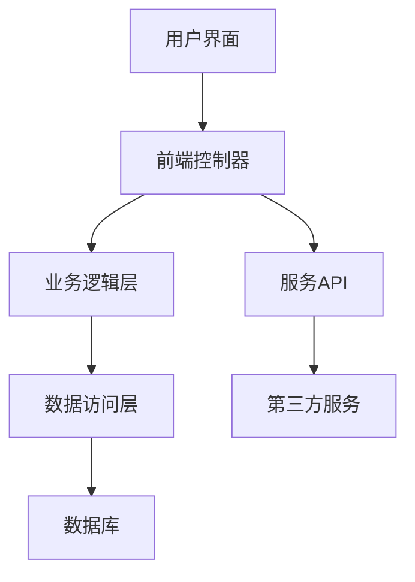

                 

### 《程序员如何应对技术升级与变更》

#### 关键词：
- 技术升级
- 技术变更
- 程序员
- 挑战与策略
- 实践案例
- 风险管理
- 团队协作

#### 摘要：
本文旨在探讨程序员在面对技术升级与变更时所需采取的策略。技术升级与变更是现代软件开发中不可避免的一部分，它们既带来了新的机遇，也带来了挑战。本文将从概述、背景、趋势、方法、实施流程、案例分析、风险管理、团队协作以及未来趋势等方面，全面解析程序员如何有效地应对技术升级与变更。通过结合实际案例和深入分析，本文将为程序员提供实用的指导，帮助他们在快速变化的技术环境中保持竞争力。

---

### 《程序员如何应对技术升级与变更》目录大纲

1. **第一部分：技术升级与变更概述**
    - 第1章：技术升级与变更背景
        - 1.1 程序员面临的挑战
        - 1.2 技术升级的意义
        - 1.3 技术变更的影响
    - 第2章：技术升级与变更趋势
        - 2.1 硬件升级
            - 2.1.1 处理器性能提升
            - 2.1.2 存储技术进步
            - 2.1.3 网络技术的发展
        - 2.2 软件升级
            - 2.2.1 编程语言进化
            - 2.2.2 框架与库的更新
            - 2.2.3 开源技术的发展
    - 第3章：技术变更的方法与策略
        - 3.1 评估变更的必要性
        - 3.2 制定变更计划
            - 3.2.1 变更目标
            - 3.2.2 变更范围
            - 3.2.3 变更时间表

2. **第二部分：技术升级与变更实践**
    - 第4章：技术升级与变更实施流程
        - 4.1 需求分析
        - 4.2 设计与实现
    - 第5章：技术升级与变更案例分析
        - 5.1 案例一：某电商平台的技术升级
    - 第6章：技术变更中的风险管理
        - 6.1 变更风险识别
        - 6.2 风险评估与控制
    - 第7章：技术变更与团队协作
        - 7.1 团队协作的重要性
        - 7.2 沟通与协调

3. **第三部分：技术升级与变更的未来趋势**
    - 第8章：人工智能与自动化升级
    - 第9章：云计算与边缘计算的发展
    - 第10章：技术升级与创新的融合

4. **附录**
    - 附录A：技术升级与变更工具推荐
    - 附录B：技术升级与变更资源推荐
    - 附录C：常见问题解答

---

在接下来的内容中，我们将逐步深入分析上述章节，帮助程序员理解技术升级与变更的重要性，掌握应对策略，并在实践中不断提升自身的技能。

---

### 第一部分：技术升级与变更概述

技术升级与变更是现代软件开发中不可或缺的一环。它们不仅影响着软件的运行效率、稳定性和安全性，还决定着软件能否适应不断变化的市场需求和技术趋势。对于程序员而言，技术升级与变更既是机遇，也是挑战。在这一部分中，我们将首先探讨技术升级与变更的背景，随后分析程序员所面临的挑战，并详细阐述技术升级的意义和影响。

#### 第1章：技术升级与变更背景

##### 1.1 程序员面临的挑战

随着科技的快速发展，软件行业也在经历着日新月异的变化。程序员所面临的最大挑战之一就是不断涌现的新技术和新方法。这些新技术往往要求程序员具备更广泛的知识和技能，以便能够有效地应用它们。例如，云计算、大数据、人工智能、区块链等新兴技术已经成为现代软件开发的重要组成部分，程序员必须不断学习和掌握这些技术，才能不被时代淘汰。

除了技术层面的挑战，程序员还面临着项目管理和团队协作方面的挑战。随着软件项目的规模和复杂性不断增加，程序员需要具备更好的项目管理技能，以有效地协调团队成员的工作，确保项目按时完成。此外，随着远程工作和全球协作的普及，程序员还需要具备良好的沟通技巧和团队协作能力，以便能够在不同时区和文化背景下进行高效的协作。

##### 1.2 技术升级的意义

技术升级对于软件开发和IT行业具有重要意义。首先，技术升级可以提升软件的性能、稳定性和安全性。随着硬件技术的不断进步，如更高性能的处理器、更大容量的存储设备、更快速度的网络等，程序员可以开发出更加高效、可靠的软件系统。同时，软件技术的升级，如编程语言的进化、框架与库的更新等，也为程序员提供了更先进、更高效的开发工具和平台。

其次，技术升级有助于提高软件的开发效率和可维护性。通过引入新的开发方法和工具，如自动化测试、持续集成和持续部署等，程序员可以减少手动操作，降低出错率，提高开发效率。此外，技术升级还可以使软件更加模块化和组件化，从而提高其可维护性和可扩展性。

最后，技术升级有助于保持企业的竞争力和创新能力。在快速变化的市场环境中，只有不断更新技术，才能保持竞争优势。技术升级不仅可以提高产品的质量和性能，还可以为企业带来新的商业模式和业务机会，从而推动企业的发展。

##### 1.3 技术变更的影响

技术变更对程序员和软件开发过程具有深远的影响。首先，技术变更可能会影响软件的设计和架构。例如，引入新的编程语言或框架可能会导致现有的代码库需要进行重构，从而影响软件的整体架构。其次，技术变更可能会对软件的性能和稳定性产生重要影响。如果变更不当，可能会导致性能下降或系统崩溃。

此外，技术变更还会影响软件的开发过程。程序员需要重新学习和掌握新的技术和工具，以适应技术变更。这不仅增加了学习和培训成本，还可能导致开发进度延误。此外，技术变更还可能对项目的成本和预算产生重大影响，尤其是在没有充分规划和评估的情况下。

总之，技术升级与变更是程序员必须面对的重要课题。通过深入了解技术升级与变更的背景、挑战和意义，程序员可以更好地应对技术变革，提升自身技能，为软件开发和IT行业的发展做出贡献。

---

在了解了技术升级与变更的背景和影响后，我们将进一步探讨技术升级与变更的趋势，分析硬件和软件方面的升级方向，并探讨这些升级对程序员带来的新机遇和挑战。

---

### 第二部分：技术升级与变更趋势

随着科技的不断进步，技术升级与变更呈现出多样化的趋势。在这部分中，我们将深入探讨硬件和软件方面的升级方向，分析处理器性能提升、存储技术进步、网络技术的发展等对程序员的影响，以及编程语言进化、框架与库更新、开源技术发展等软件层面的趋势。

#### 第2章：技术升级与变更趋势

##### 2.1 硬件升级

硬件升级是技术升级的重要组成部分，它直接影响着软件的性能和效率。以下是几项关键的硬件升级趋势：

###### 2.1.1 处理器性能提升

处理器的性能不断提升，是硬件升级的一个重要方面。近年来，随着多核处理器的普及，程序员的代码可以更有效地利用多线程和并行计算，从而显著提升软件的性能。例如，通过使用多线程技术，可以同时执行多个任务，提高程序的响应速度和吞吐量。

以下是一个简化的伪代码示例，展示了如何使用多线程技术来并行处理数据：

```python
import threading

def process_data(data_chunk):
    # 数据处理逻辑
    pass

def main():
    data_chunks = load_data()
    threads = []

    for chunk in data_chunks:
        thread = threading.Thread(target=process_data, args=(chunk,))
        thread.start()
        threads.append(thread)

    for thread in threads:
        thread.join()

if __name__ == "__main__":
    main()
```

通过使用多线程技术，可以充分利用多核处理器的性能优势，提高数据处理效率。

###### 2.1.2 存储技术进步

存储技术的进步为程序员提供了更大的存储容量和更快的访问速度。例如，固态硬盘（SSD）逐渐取代传统的机械硬盘（HDD），提供了更快的读写速度和更低的延迟。这使得数据库查询、文件读写等操作更加高效。

以下是一个简单的示例，展示了如何使用 SSD 提高数据库查询性能：

```sql
CREATE TABLE users (
    id INT PRIMARY KEY,
    name VARCHAR(50),
    email VARCHAR(100)
);

INSERT INTO users (id, name, email) VALUES (1, 'Alice', 'alice@example.com');
INSERT INTO users (id, name, email) VALUES (2, 'Bob', 'bob@example.com');

SELECT * FROM users WHERE id = 1;
```

通过使用 SSD 存储，可以显著提高数据库的查询速度，从而改善用户体验。

###### 2.1.3 网络技术的发展

网络技术的发展对程序员的影响同样深远。5G 网络的普及为程序员提供了更高的数据传输速度和更低的延迟，这使得实时应用和远程协作变得更加高效。例如，在视频会议、在线游戏和物联网（IoT）应用中，5G 网络可以提供更流畅的用户体验。

以下是一个简化的伪代码示例，展示了如何利用 5G 网络改善实时数据传输：

```python
import socket

def send_data(data):
    # 利用 5G 网络发送数据
    with socket.socket(socket.AF_INET, socket.SOCK_STREAM) as s:
        s.connect(('5g-server.example.com', 80))
        s.sendall(data)

def receive_data():
    # 利用 5G 网络接收数据
    with socket.socket(socket.AF_INET, socket.SOCK_STREAM) as s:
        s.bind(('0.0.0.0', 8080))
        s.listen()
        conn, addr = s.accept()
        with conn:
            print('Connected by', addr)
            data = conn.recv(1024)
            print('Received:', repr(data))

if __name__ == "__main__":
    send_data('Hello, 5G network!')
    receive_data()
```

通过使用 5G 网络技术，可以实现更高效的数据传输和实时通信。

##### 2.2 软件升级

软件升级同样对程序员的工作产生了深远的影响。以下是几项关键的软件升级趋势：

###### 2.2.1 编程语言进化

编程语言的不断进化为程序员提供了更强大的功能和更高效的开发体验。例如，Python 的最新版本增加了许多新特性和库，使得数据处理、机器学习和科学计算变得更加容易。此外，像 TypeScript 这样的编程语言也越来越受欢迎，它们提供了更好的类型安全和模块化支持，从而提高了代码的可维护性和可读性。

以下是一个使用 TypeScript 的简单示例，展示了如何定义和使用类型：

```typescript
type Person = {
    name: string;
    age: number;
};

function greet(person: Person): void {
    console.log(`Hello, ${person.name}!`);
}

const alice: Person = {
    name: 'Alice',
    age: 30,
};

greet(alice);
```

通过使用 TypeScript，可以确保代码的类型安全，并提高代码的可维护性。

###### 2.2.2 框架与库的更新

框架和库的更新也是软件升级的一个重要方面。例如，React、Vue.js 和 Angular 等前端框架不断更新，提供了更多的新特性和优化，使得前端开发变得更加高效和灵活。此外，像 TensorFlow、PyTorch 等机器学习库也在不断改进，提供了更强大的功能和更高效的模型训练工具。

以下是一个使用 React 的简单示例，展示了如何创建一个简单的组件：

```jsx
import React from 'react';

function Greeting(props) {
    return <h1>Hello, {props.name}!</h1>;
}

const GreetingApp = () => (
    <div>
        <Greeting name="Alice" />
        <Greeting name="Bob" />
    </div>
);

export default GreetingApp;
```

通过使用 React，可以构建响应式和动态的前端应用程序。

###### 2.2.3 开源技术的发展

开源技术的发展为程序员提供了丰富的资源和协作机会。越来越多的项目采用开源模式，使得程序员可以自由地使用、修改和分享代码。这不仅降低了开发成本，还促进了技术的快速传播和创新。例如，Kubernetes、Docker 等开源工具已经成为现代云计算和容器化技术的重要组成部分。

以下是一个使用 Docker 的简单示例，展示了如何创建和运行一个容器：

```bash
# 创建 Dockerfile
FROM python:3.8
WORKDIR /app
COPY . .
RUN pip install -r requirements.txt
CMD ["python", "app.py"]

# 构建镜像
docker build -t my-app .

# 运行容器
docker run -d --name my-running-app my-app
```

通过使用 Docker，可以轻松地创建和管理容器化应用程序。

总之，硬件和软件的升级为程序员提供了更多的工具和机会，同时也带来了新的挑战。程序员需要不断学习和适应这些新技术，以保持竞争力并提高开发效率。

---

在了解了硬件和软件方面的升级趋势后，接下来我们将深入探讨技术变更的方法与策略，帮助程序员更好地规划和实施技术升级与变更。

---

### 第三部分：技术变更的方法与策略

在技术快速发展的今天，技术变更已经成为程序员和开发团队日常工作中不可或缺的一部分。有效的方法和策略对于确保技术变更的顺利进行和成功实施至关重要。在这部分中，我们将详细探讨评估变更的必要性、制定变更计划的方法和步骤，包括变更目标、变更范围和变更时间表的制定，以及这些策略在实际应用中的重要性。

#### 第3章：技术变更的方法与策略

##### 3.1 评估变更的必要性

技术变更的首要步骤是评估其必要性。这包括分析当前技术的不足之处、确定变更的动机和目标，以及评估变更对项目、团队和企业的潜在影响。以下是一些关键步骤：

###### 3.1.1 分析当前技术状况

首先，需要全面分析当前技术的性能、稳定性、安全性等方面。这包括检查系统性能瓶颈、识别安全漏洞和代码缺陷等。通过代码审查、性能测试和安全评估，可以明确当前技术的不足之处。

以下是一个简化的伪代码示例，用于检查代码中的潜在性能瓶颈：

```python
def analyze_performance(code):
    profiler = CodeProfiler()
    profiler.start()
    execute(code)
    profiler.stop()
    print(profiler.report())
```

通过使用性能分析工具，可以识别代码中的性能瓶颈，为技术变更提供依据。

###### 3.1.2 确定变更动机

在评估当前技术状况后，需要明确变更的动机。这可能是为了提升性能、增强安全性、支持新的业务需求或适应新技术趋势。例如，为了应对日益增长的数据量和复杂的计算任务，可能需要升级硬件或引入新的数据处理框架。

以下是一个简化的伪代码示例，用于确定变更动机：

```python
def determine_motives(current_state, desired_state):
    if current_state.performance < desired_state.performance:
        print("Motivation: Improve performance")
    if current_state.security < desired_state.security:
        print("Motivation: Enhance security")
    if current_state.features < desired_state.features:
        print("Motivation: Add new features")
```

通过明确变更动机，可以为后续的变更计划提供指导。

###### 3.1.3 评估变更影响

在确定变更动机后，需要评估变更对项目、团队和企业的潜在影响。这包括变更对开发进度、成本、资源和人员的影响。通过风险评估，可以制定相应的应对策略，减少变更带来的风险。

以下是一个简化的伪代码示例，用于评估变更影响：

```python
def assess_impact(change, project):
    risks = []
    if change.performance_impact > 0:
        risks.append("Potential delay in project timeline")
    if change.cost_impact > 0:
        risks.append("Increased budget requirements")
    if change.resource_impact > 0:
        risks.append("Increased resource requirements")
    print("Potential risks:", risks)
```

通过评估变更影响，可以更好地准备应对变更过程中可能出现的挑战。

##### 3.2 制定变更计划

在评估变更的必要性后，下一步是制定变更计划。一个完善的变更计划可以确保变更的有序进行，并最大程度地降低风险。以下是制定变更计划的关键步骤：

###### 3.2.1 变更目标

明确变更目标是制定变更计划的第一步。变更目标应该具体、可衡量，并与项目的整体目标相一致。例如，如果目标是提升系统性能，那么具体的变更目标可以是“将系统响应时间减少50%”。

以下是一个简化的伪代码示例，用于定义变更目标：

```python
class ChangeGoal:
    def __init__(self, description, target_value):
        self.description = description
        self.target_value = target_value

def set_change_goals():
    performance_goal = ChangeGoal("System response time", 1000) # milliseconds
    security_goal = ChangeGoal("Number of security vulnerabilities", 0)
    return [performance_goal, security_goal]

change_goals = set_change_goals()
```

通过定义明确的变更目标，可以确保变更计划的可执行性。

###### 3.2.2 变更范围

明确变更范围是确保变更计划有效的重要步骤。变更范围应该包括所有需要变更的系统组件、模块和功能。例如，如果需要升级数据库，那么变更范围可能包括数据库服务器、数据库连接和相关的应用程序代码。

以下是一个简化的伪代码示例，用于定义变更范围：

```python
class ChangeScope:
    def __init__(self, components):
        self.components = components

def define_change_scope():
    components = ["Database server", "Database connection", "Application code"]
    return ChangeScope(components)

change_scope = define_change_scope()
```

通过明确变更范围，可以更好地控制变更过程，并确保所有相关组件都被考虑在内。

###### 3.2.3 变更时间表

制定变更时间表是变更计划中的关键环节。变更时间表应该包括每个变更任务的开始和结束时间，以及关键的里程碑。时间表的制定需要考虑项目的整体进度、团队的资源和能力，以及变更的优先级。

以下是一个简化的伪代码示例，用于制定变更时间表：

```python
class ChangeSchedule:
    def __init__(self, tasks):
        self.tasks = tasks

def create_change_schedule(change_goals, change_scope):
    tasks = [
        ("Analyze current state", "2023-04-01", "2023-04-05"),
        ("Define change goals", "2023-04-06", "2023-04-10"),
        ("Plan change scope", "2023-04-11", "2023-04-15"),
        ("Implement changes", "2023-04-16", "2023-05-10"),
        ("Test and validate", "2023-05-11", "2023-05-25"),
        ("Deploy changes", "2023-05-26", "2023-06-05")
    ]
    return ChangeSchedule(tasks)

change_schedule = create_change_schedule(change_goals, change_scope)
```

通过制定详细的时间表，可以确保变更过程按计划进行，并避免进度延误。

##### 3.2.4 变更计划的重要性

一个完善的变更计划对于技术变更的成功至关重要。首先，变更计划可以明确变更的目标和范围，确保所有团队成员对变更内容有清晰的认识。其次，变更计划可以帮助团队更好地分配资源和时间，确保变更过程有序进行。最后，变更计划还可以降低变更过程中可能出现的风险，通过提前识别和应对潜在问题，确保变更的顺利进行。

总之，评估变更的必要性、制定变更计划是确保技术变更顺利进行的关键步骤。通过合理的规划和执行，程序员可以更好地应对技术变革，提升项目的质量和效率。

---

在掌握了技术变更的方法与策略后，接下来我们将详细探讨技术变更的实施流程，包括需求分析、设计与实现等关键环节，并通过实际案例展示这些环节的具体实施过程。

---

### 第四部分：技术变更实施流程

技术变更的实施是一个复杂而细致的过程，它涉及到多个阶段和环节，包括需求分析、设计与实现、测试与验证等。在这一部分中，我们将深入探讨这些关键环节，并通过实际案例展示技术变更的具体实施过程，帮助程序员理解并掌握技术变更的实施方法。

#### 第4章：技术升级与变更实施流程

##### 4.1 需求分析

需求分析是技术变更实施的第一步，它决定了变更的明确目标和方向。在需求分析阶段，程序员需要与项目团队、业务分析师和利益相关者紧密合作，收集和分析项目需求，确保变更能够满足业务需求和用户需求。以下是一些关键步骤：

###### 4.1.1 技术需求

在需求分析阶段，程序员需要明确技术需求。技术需求通常包括性能要求、稳定性要求、安全性要求和可扩展性要求等。例如，如果目标是提升系统性能，技术需求可能包括支持多线程处理、优化数据库查询等。

以下是一个简化的伪代码示例，用于定义技术需求：

```python
class TechnicalRequirement:
    def __init__(self, performance, stability, security, scalability):
        self.performance = performance
        self.stability = stability
        self.security = security
        self.scalability = scalability

def define_technical_requirements():
    performance = "Support multi-threading and optimize database queries"
    stability = "Ensure system uptime of 99.9%"
    security = "Implement encryption for data in transit and at rest"
    scalability = "Handle increased load without performance degradation"
    return TechnicalRequirement(performance, stability, security, scalability)

technical_requirements = define_technical_requirements()
```

通过定义明确的技术需求，可以确保后续的设计与实现工作有据可依。

###### 4.1.2 业务需求

除了技术需求，业务需求也是需求分析的重要部分。业务需求通常包括业务流程改进、功能扩展、用户体验优化等。例如，为了提升用户体验，业务需求可能包括改进用户界面、增加新的功能模块等。

以下是一个简化的伪代码示例，用于定义业务需求：

```python
class BusinessRequirement:
    def __init__(self, flow_improvement, feature_extension, user_experience):
        self.flow_improvement = flow_improvement
        self.feature_extension = feature_extension
        self.user_experience = user_experience

def define_business_requirements():
    flow_improvement = "Streamline user onboarding process"
    feature_extension = "Add a new dashboard for analytics"
    user_experience = "Improve UI responsiveness and design"
    return BusinessRequirement(flow_improvement, feature_extension, user_experience)

business_requirements = define_business_requirements()
```

通过定义明确的业务需求，可以确保技术变更能够满足业务目标。

##### 4.2 设计与实现

在需求分析完成后，进入设计与实现阶段。在这个阶段，程序员需要将需求转化为具体的设计方案，并逐步实现这些设计方案。设计与实现阶段通常包括以下几个方面：

###### 4.2.1 架构设计

架构设计是设计与实现的关键环节，它决定了系统的整体结构和功能模块。在架构设计阶段，程序员需要分析需求，确定系统的模块划分、数据流和控制流，并选择合适的技术框架和库。

以下是一个简化的Mermaid流程图，用于描述系统的架构设计：



通过架构设计，可以确保系统的模块化、解耦和可扩展性。

###### 4.2.2 技术选型

在架构设计的基础上，程序员需要选择合适的技术框架和库。技术选型应考虑系统的需求、性能、安全性、可维护性等多个方面。例如，如果系统需要高并发处理能力，可以选择使用微服务架构和分布式数据库。

以下是一个简化的伪代码示例，用于描述技术选型：

```python
class TechnologySelection:
    def __init__(self, framework, database, middleware):
        self.framework = framework
        self.database = database
        self.middleware = middleware

def select_technologies():
    framework = "Spring Boot"
    database = "PostgreSQL"
    middleware = "Eureka and Ribbon for service discovery and load balancing"
    return TechnologySelection(framework, database, middleware)

selected_technologies = select_technologies()
```

通过合理的技术选型，可以确保系统的性能和稳定性。

###### 4.2.3 编码实现

在完成架构设计和技术选型后，程序员开始具体的编码实现。在这个阶段，程序员需要遵循设计文档和编码规范，逐步实现系统的各个模块和功能。

以下是一个简化的伪代码示例，用于描述编码实现：

```python
# 前端控制器代码示例
@RestController
public class UserController {
    @Autowired
    private UserService userService;

    @GetMapping("/users")
    public List<User> getAllUsers() {
        return userService.getAllUsers();
    }
}

# 业务逻辑层代码示例
@Service
public class UserService {
    @Autowired
    private UserRepository userRepository;

    public List<User> getAllUsers() {
        return userRepository.findAll();
    }
}

# 数据访问层代码示例
@Repository
public interface UserRepository extends JpaRepository<User, Long> {
    List<User> findByEmailContaining(String email);
}
```

通过编码实现，可以将设计转化为实际的系统功能。

##### 4.3 测试与验证

在编码实现完成后，进入测试与验证阶段。在这个阶段，程序员需要通过单元测试、集成测试和系统测试等方法，确保系统的功能、性能和稳定性满足需求。以下是一些关键步骤：

###### 4.3.1 单元测试

单元测试是对系统中最小的功能单元进行测试，确保每个单元的功能正确实现。例如，对用户服务中的 `getAllUsers` 方法进行单元测试。

以下是一个简化的伪代码示例，用于描述单元测试：

```python
import unittest

class UserServiceTest(unittest.TestCase):
    def test_get_all_users(self):
        userService = UserService()
        users = userService.getAllUsers()
        self.assertIsNotNone(users)
        self.assertTrue(len(users) > 0)

if __name__ == '__main__':
    unittest.main()
```

通过单元测试，可以确保每个单元的功能正确实现。

###### 4.3.2 集成测试

集成测试是对系统中的多个模块进行测试，确保它们能够协同工作。例如，对前端控制器、业务逻辑层和数据访问层进行集成测试。

以下是一个简化的伪代码示例，用于描述集成测试：

```python
class UserControllerIntegrationTest(unittest.TestCase):
    def test_get_all_users_integration(self):
        # 搭建测试环境
        # 启动前端控制器、业务逻辑层和数据访问层
        # 发起HTTP请求
        # 验证响应结果
        pass

if __name__ == '__main__':
    unittest.main()
```

通过集成测试，可以确保不同模块之间的协同工作。

###### 4.3.3 系统测试

系统测试是对整个系统进行测试，确保系统的功能、性能和稳定性满足需求。例如，对用户注册、登录、数据查询等主要功能进行系统测试。

以下是一个简化的伪代码示例，用于描述系统测试：

```python
class SystemTest(unittest.TestCase):
    def test_user_registration(self):
        # 完成用户注册流程
        # 验证注册成功
        pass

    def test_user_login(self):
        # 完成用户登录流程
        # 验证登录成功
        pass

    def test_data_query(self):
        # 发起数据查询请求
        # 验证查询结果
        pass

if __name__ == '__main__':
    unittest.main()
```

通过系统测试，可以确保系统的整体功能正确。

总之，技术变更的实施流程包括需求分析、设计与实现、测试与验证等关键环节。通过合理的流程设计和实施，程序员可以确保技术变更的成功实施，提升系统的性能和稳定性。

---

在掌握了技术变更的实施流程后，我们将通过实际案例展示技术变更的过程，帮助程序员更好地理解和应用这些流程。

---

### 第五部分：技术升级与变更实践

在实际工作中，技术升级与变更是一项常见且复杂的任务。通过具体的案例，我们可以更深入地了解技术变更的过程、策略以及所面临的挑战。在本部分，我们将通过一个电商平台的技术升级案例，详细探讨技术变更的实践过程。

#### 第5章：技术升级与变更案例分析

##### 5.1 案例一：某电商平台的技术升级

某大型电商平台在经历了数年的发展后，发现其现有系统已经无法满足日益增长的用户需求和业务扩展。为了保持竞争力，该电商平台决定进行一次全面的技术升级。以下是该电商平台技术升级的具体过程。

###### 5.1.1 背景介绍

该电商平台最初使用的是传统的单体架构，所有业务逻辑和数据处理都集中在单一的服务器上。随着用户数量的增加和业务复杂度的提升，系统的性能、稳定性和扩展性逐渐成为瓶颈。具体问题包括：

- **性能瓶颈**：在高并发情况下，系统响应速度明显下降，导致用户体验差。
- **扩展性不足**：单点故障风险高，无法快速响应业务需求的变化。
- **维护难度大**：代码耦合度高，修改和维护成本高。
- **安全性问题**：系统安全性较低，容易受到攻击。

为了解决这些问题，电商平台决定进行技术升级，转向基于微服务架构的分布式系统。

###### 5.1.2 变更目标

电商平台的技术升级目标包括：

- **提升性能**：通过分布式架构和负载均衡，提高系统的响应速度和吞吐量。
- **增强扩展性**：通过水平扩展，实现系统的高可用性和弹性。
- **降低维护成本**：通过模块化和解耦，降低代码的复杂度和维护难度。
- **提高安全性**：通过引入安全机制和监控，提高系统的安全性。

###### 5.1.3 变更过程

电商平台的技术升级过程可以分为以下几个阶段：

1. **需求分析**：

   在项目启动阶段，电商平台首先进行了详细的需求分析。通过与业务团队和用户代表沟通，明确了技术升级的需求和目标。技术需求包括支持高并发、分布式架构、负载均衡等；业务需求包括提升用户体验、优化业务流程、增加新功能等。

2. **架构设计**：

   针对需求分析的结果，电商平台进行了架构设计。设计思路是采用微服务架构，将系统拆分为多个独立的微服务，每个微服务负责不同的业务功能。主要架构模块包括用户服务、商品服务、订单服务、支付服务、库存服务、日志服务等。

   以下是一个简化的Mermaid流程图，用于描述系统的架构设计：

   ```mermaid
   graph TD
       A[用户界面] --> B[前端控制器]
       B --> C[用户服务] --> D[用户数据库]
       B --> E[商品服务] --> F[商品数据库]
       B --> G[订单服务] --> H[订单数据库]
       B --> I[支付服务] --> J[支付数据库]
       B --> K[库存服务] --> L[库存数据库]
       B --> M[日志服务] --> N[日志数据库]
   ```

3. **技术选型**：

   在架构设计的基础上，电商平台选择了以下技术框架和工具：

   - **前端框架**：React.js
   - **后端框架**：Spring Boot
   - **数据库**：MySQL
   - **缓存**：Redis
   - **消息队列**：RabbitMQ
   - **服务注册与发现**：Eureka
   - **负载均衡**：Nginx

   以下是一个简化的伪代码示例，用于描述技术选型：

   ```python
   class TechnologySelection:
       def __init__(self, frontend, backend, database, cache, messaging, registry, load_balancer):
           self.frontend = frontend
           self.backend = backend
           self.database = database
           self.cache = cache
           self.messaging = messaging
           self.registry = registry
           self.load_balancer = load_balancer

   def select_technologies():
       frontend = "React.js"
       backend = "Spring Boot"
       database = "MySQL"
       cache = "Redis"
       messaging = "RabbitMQ"
       registry = "Eureka"
       load_balancer = "Nginx"
       return TechnologySelection(frontend, backend, database, cache, messaging, registry, load_balancer)

   selected_technologies = select_technologies()
   ```

4. **编码实现**：

   在完成架构设计和技术选型后，电商平台开始具体的编码实现。开发团队按照设计文档和编码规范，逐步实现系统的各个微服务模块。以下是一个简化的伪代码示例，用于描述编码实现：

   ```java
   // 用户服务代码示例
   @RestController
   public class UserController {
       @Autowired
       private UserService userService;

       @GetMapping("/users")
       public ResponseEntity<List<User>> getAllUsers() {
           return ResponseEntity.ok(userService.getAllUsers());
       }
   }

   // 用户服务实现代码示例
   @Service
   public class UserService {
       @Autowired
       private UserRepository userRepository;

       public List<User> getAllUsers() {
           return userRepository.findAll();
       }
   }
   ```

5. **测试与验证**：

   在编码实现完成后，电商平台进行了全面的测试与验证。测试阶段包括单元测试、集成测试和系统测试，确保系统的功能、性能和稳定性满足需求。

   - **单元测试**：对每个微服务模块进行单元测试，确保功能正确。
   - **集成测试**：对微服务之间的交互进行集成测试，确保模块协同工作。
   - **系统测试**：对整个系统进行系统测试，确保整体功能正确，性能稳定。

6. **部署与上线**：

   在测试和验证完成后，电商平台开始部署和上线新系统。部署过程包括以下步骤：

   - **部署前端**：将前端代码部署到服务器上，配置Nginx进行负载均衡。
   - **部署后端**：将后端微服务部署到服务器上，配置Eureka进行服务注册与发现，配置Redis进行缓存，配置RabbitMQ进行消息队列处理。
   - **数据库迁移**：将旧数据库数据迁移到新数据库，确保数据的一致性和完整性。
   - **监控与维护**：上线后，对系统进行实时监控和运维，确保系统的稳定运行。

   以下是一个简化的伪代码示例，用于描述部署与上线：

   ```shell
   # 部署前端
   npm install
   npm run build
   pm2 start app.js

   # 部署后端
   mvn clean package
   nohup java -jar microservice.jar &

   # 数据库迁移
   mysqldump old_database -u username -p > dump.sql
   mysql -u username -p new_database < dump.sql

   # 监控与维护
   pm2 monit
   ```

###### 5.1.4 变更成果

通过技术升级，电商平台实现了以下成果：

- **性能提升**：系统在高并发情况下的响应速度明显提升，用户满意度提高。
- **扩展性增强**：通过分布式架构和负载均衡，系统具备更高的可用性和弹性，能够快速响应业务需求。
- **维护成本降低**：通过模块化和解耦，代码的复杂度和维护难度降低，维护成本显著减少。
- **安全性提高**：通过引入安全机制和监控，系统的安全性得到显著提升，风险得到有效控制。

总之，通过这个实际案例，我们可以看到技术升级与变更的过程是如何进行的，以及如何通过合理的策略和流程实现技术变更的目标。这为其他程序员和开发团队提供了宝贵的经验和参考。

---

在技术变更的实践中，风险管理是不可或缺的一环。合理的风险管理策略可以帮助团队识别、评估和应对变更过程中的潜在风险，确保变更的顺利进行。在本部分中，我们将探讨技术变更中的风险管理，包括风险识别、风险评估与控制策略，以及具体的应对措施。

#### 第6章：技术变更中的风险管理

##### 6.1 变更风险识别

在技术变更的过程中，风险识别是第一步，它涉及到对可能出现的各种风险进行识别和分类。以下是一些常见的技术变更风险：

###### 6.1.1 功能性风险

- **功能缺失**：在变更过程中，可能由于设计或实现问题导致某些功能无法实现。
- **功能冲突**：新功能可能与现有功能产生冲突，导致系统不稳定。

###### 6.1.2 性能风险

- **性能下降**：变更后，系统可能由于代码优化不足或架构设计不合理导致性能下降。
- **响应时间增加**：特别是在高并发场景下，系统的响应时间可能会显著增加。

###### 6.1.3 稳定性风险

- **系统崩溃**：变更后的系统可能由于代码错误、资源不足或系统负载过高导致崩溃。
- **单点故障**：在分布式系统中，单点故障可能导致整个系统不可用。

###### 6.1.4 安全性风险

- **漏洞泄露**：变更过程中可能引入新的安全漏洞，导致数据泄露或系统被攻击。
- **权限管理**：权限管理不当可能导致数据访问失控，增加安全风险。

###### 6.1.5 项目风险

- **进度延误**：变更过程中可能遇到技术难题或资源不足，导致项目进度延误。
- **成本超支**：变更可能导致项目成本超出预算，影响项目整体效益。

##### 6.2 风险评估与控制策略

在识别风险后，下一步是对这些风险进行评估，并制定相应的控制策略。以下是一些关键步骤：

###### 6.2.1 风险分类

根据风险的性质和影响，可以将风险分为以下几类：

- **高优先级风险**：这些风险对项目的影响较大，需要立即处理。
- **中优先级风险**：这些风险对项目有一定影响，需要持续关注。
- **低优先级风险**：这些风险对项目的影响较小，可以在后续阶段进行处理。

###### 6.2.2 风险评估方法

为了准确评估风险，可以采用以下方法：

- **定性分析**：通过专家评审、头脑风暴等方法，对风险的影响和可能性进行定性分析。
- **定量分析**：通过数学模型和数据分析，对风险的可能性和影响进行定量分析。

以下是一个简化的伪代码示例，用于描述风险评估方法：

```python
def qualitative_analysis(risks):
    # 专家评审方法，根据风险的影响和可能性进行评分
    pass

def quantitative_analysis(risks):
    # 数据分析方法，计算风险的概率和影响
    pass

risks = ["功能缺失", "性能下降", "系统崩溃", "漏洞泄露"]
qualitative_risks = qualitative_analysis(risks)
quantitative_risks = quantitative_analysis(risks)
```

###### 6.2.3 风险应对策略

针对不同类型的风险，可以制定相应的应对策略：

- **高优先级风险**：立即处理，采取紧急措施，如修复代码、增加资源等。
- **中优先级风险**：制定缓解措施，如改进设计、增加测试等。
- **低优先级风险**：监控和跟踪，确保在后续阶段进行处理。

以下是一个简化的伪代码示例，用于描述风险应对策略：

```python
def handle_risk(risk_type, risk_level):
    if risk_level == "high":
        # 紧急处理
        pass
    elif risk_level == "medium":
        # 缓解措施
        pass
    elif risk_level == "low":
        # 监控和跟踪
        pass

risks = ["功能缺失", "性能下降", "系统崩溃", "漏洞泄露"]
for risk in risks:
    handle_risk(risk_type=risk, risk_level="high")
```

##### 6.3 风险控制措施

在实际的技术变更过程中，为了有效地控制风险，可以采取以下措施：

###### 6.3.1 测试与验证

- **单元测试**：对每个模块进行单元测试，确保功能正确。
- **集成测试**：对模块之间的交互进行集成测试，确保协同工作。
- **系统测试**：对整个系统进行系统测试，确保整体功能正确。

###### 6.3.2 监控与预警

- **性能监控**：实时监控系统的性能指标，如响应时间、吞吐量等，及时发现性能问题。
- **安全监控**：实时监控系统的安全事件，如入侵尝试、漏洞利用等，及时采取应对措施。

###### 6.3.3 灾难恢复

- **备份策略**：定期备份系统数据，确保在系统故障时能够快速恢复。
- **容灾备份**：建立容灾备份中心，确保在灾难发生时系统能够快速恢复。

总之，风险管理是技术变更过程中至关重要的一环。通过合理的风险识别、评估和控制措施，程序员可以有效地降低变更过程中的风险，确保变更的顺利进行。这为项目的成功实施提供了有力保障。

---

技术变更不仅仅是一个技术问题，更是一个团队协作的过程。有效的沟通与协调是确保技术变更顺利进行的关键。在本部分中，我们将探讨技术变更与团队协作的重要性，以及如何通过有效的沟通与协调确保变更的成功实施。

#### 第7章：技术变更与团队协作

##### 7.1 团队协作的重要性

技术变更通常涉及到多个部门、多个角色的协作，如开发团队、测试团队、运维团队、产品团队等。团队协作的效率和质量直接影响到技术变更的进度和成果。以下是一些团队协作的重要性：

###### 7.1.1 提升项目效率

有效的团队协作可以确保各个角色之间的工作无缝衔接，减少沟通成本和协调时间，从而提升项目的整体效率。例如，开发团队和测试团队之间的紧密协作可以减少bug的修复时间，提高软件质量。

###### 7.1.2 分享知识与经验

团队协作提供了一个分享知识和经验的平台。通过协作，团队成员可以相互学习和借鉴，提升整体技能水平。特别是在技术变更过程中，不同团队的经验和见解可以为变更提供宝贵的参考。

###### 7.1.3 增强团队凝聚力

有效的团队协作可以增强团队成员之间的信任和默契，提升团队的凝聚力。在面临技术变更的挑战时，团队凝聚力有助于应对困难，共同推动项目成功。

##### 7.2 沟通与协调

为了确保技术变更的顺利进行，团队需要建立有效的沟通与协调机制。以下是一些关键的沟通与协调策略：

###### 7.2.1 沟通技巧

- **明确目标**：在沟通前明确沟通的目标和内容，确保信息传递的准确性和针对性。
- **主动倾听**：积极倾听对方的意见和反馈，理解对方的立场和需求。
- **表达清晰**：用简洁、准确的语言表达自己的观点和意见，避免歧义。

###### 7.2.2 沟通工具与方法

- **面对面会议**：面对面会议有助于增强沟通效果，及时解决问题。
- **即时通讯工具**：如Slack、Telegram等，方便团队成员实时沟通。
- **项目管理工具**：如JIRA、Trello等，用于任务分配、进度跟踪和文档管理。

以下是一个简化的伪代码示例，用于描述沟通工具的使用：

```python
class CommunicationTool:
    def send_message(self, message):
        # 发送消息的方法
        pass

    def receive_message(self):
        # 接收消息的方法
        pass

def use_communication_tool(tool):
    tool.send_message("会议通知：明天上午10点召开技术评审会议")
    message = tool.receive_message()
    print("收到消息：", message)

# 创建沟通工具实例
communication_tool = CommunicationTool()

# 使用沟通工具
use_communication_tool(communication_tool)
```

###### 7.2.3 协作工具与方法

- **代码管理工具**：如Git，用于代码的版本控制和协作开发。
- **持续集成工具**：如Jenkins，用于自动化构建、测试和部署。
- **容器化技术**：如Docker，用于快速部署和隔离应用环境。

以下是一个简化的伪代码示例，用于描述协作工具的使用：

```python
class CollaborationTool:
    def commit_code(self, code):
        # 提交代码的方法
        pass

    def run_tests(self):
        # 运行测试的方法
        pass

def use_collaboration_tool(tool):
    tool.commit_code("添加新功能：用户注册")
    tool.run_tests()
    print("测试通过，代码已提交")

# 创建协作工具实例
collaboration_tool = CollaborationTool()

# 使用协作工具
use_collaboration_tool(collaboration_tool)
```

通过有效的沟通与协调，团队可以更好地应对技术变更的挑战，确保变更的顺利进行和成功实施。这为项目的成功提供了有力保障。

---

在技术快速发展的今天，技术升级与变更的未来趋势日益显著。本部分将探讨人工智能与自动化升级、云计算与边缘计算的发展，以及这些趋势对程序员带来的机遇与挑战。

#### 第8章：技术升级与变更的未来趋势

##### 8.1 人工智能与自动化升级

人工智能（AI）和自动化技术的发展正深刻改变着软件开发和运维的方方面面。以下是一些关键趋势：

###### 8.1.1 AI技术对编程的影响

AI技术在编程领域的应用越来越广泛，如代码生成、代码审查、自动化测试等。通过AI技术，程序员可以更高效地完成开发任务，提高代码质量和开发效率。例如，AI驱动的代码生成工具可以根据需求自动生成代码模板，从而减少重复性工作。

以下是一个简化的伪代码示例，展示了如何使用AI驱动的代码生成工具：

```python
import AICodeGenerator

def generate_code_from_requirement(requirement):
    code = AICodeGenerator.generate_code(requirement)
    return code

# 生成一个用户注册功能的代码
user_registration_code = generate_code_from_requirement("实现用户注册功能")
print(user_registration_code)
```

###### 8.1.2 自动化工具在变更中的应用

自动化工具在技术变更中的应用同样重要。通过自动化测试、自动化部署和自动化监控，程序员可以快速验证变更的效果，确保系统的稳定性和可靠性。例如，自动化测试工具可以自动执行测试用例，快速发现和修复问题。

以下是一个简化的伪代码示例，展示了如何使用自动化测试工具：

```python
import AutoTester

def run_tests():
    test_results = AutoTester.run_tests()
    if test_results["passed"] > 0:
        print("测试通过：", test_results["passed"], "个测试用例成功")
    else:
        print("测试失败：", test_results["failed"], "个测试用例失败")

run_tests()
```

##### 8.2 云计算与边缘计算的发展

云计算和边缘计算的发展为程序员提供了更多灵活的选择，以满足不同场景的需求。以下是一些关键趋势：

###### 8.2.1 云计算技术的升级

云计算技术不断升级，提供了更高的性能、更大的存储容量和更低的延迟。例如，云服务提供商（CSP）如Amazon Web Services（AWS）、Microsoft Azure和Google Cloud Platform（GCP）不断推出新的服务和技术，使程序员可以更方便地构建和部署应用程序。

以下是一个简化的伪代码示例，展示了如何使用云计算服务：

```python
import CloudService

def deploy_app_to_cloud(app_code):
    cloud_service = CloudService()
    cloud_service.deploy(app_code)
    print("应用程序已成功部署到云端")

deploy_app_to_cloud("用户注册功能代码")
```

###### 8.2.2 边缘计算的优势与应用场景

边缘计算将计算、存储和网络资源部署到靠近数据源的位置，以减少延迟、提高效率和降低带宽成本。边缘计算适用于物联网（IoT）、实时视频流处理、工业自动化等场景。

以下是一个简化的伪代码示例，展示了如何使用边缘计算：

```python
import EdgeCompute

def process_data_at_edge(data):
    edge_compute = EdgeCompute()
    processed_data = edge_compute.process_data(data)
    return processed_data

# 在边缘设备上处理传感器数据
sensor_data = {"temperature": 25, "humidity": 60}
processed_data = process_data_at_edge(sensor_data)
print("处理后的数据：", processed_data)
```

通过理解和应用人工智能与自动化升级、云计算与边缘计算的发展趋势，程序员可以更有效地应对技术升级与变更，提升开发效率和应用性能。

---

### 附录

在本附录中，我们将推荐一些技术升级与变更中常用的工具、资源和常见问题解答，以帮助程序员在实际工作中更好地应对技术升级与变更。

#### 附录A：技术升级与变更工具推荐

A.1 版本控制工具
- **Git**：最流行的分布式版本控制系统，支持快速分支和合并，适合大型项目。
  - **安装**：`git clone https://github.com/gitgitgadget/git.git`
  - **使用示例**：`git clone <repository_url>`, `git pull`, `git push`

- **SVN**：集中式版本控制系统，适用于小规模项目和单用户环境。
  - **安装**：`sudo apt-get install subversion`
  - **使用示例**：`svn checkout <repository_url>`, `svn commit`, `svn update`

- **Mercurial**：另一种分布式版本控制系统，设计简洁，易于使用。
  - **安装**：`pip install mercurial`
  - **使用示例**：`hg clone <repository_url>`, `hg commit`, `hg pull`

A.2 集成开发环境
- **Visual Studio**：微软开发的集成开发环境，支持多种编程语言，功能强大。
  - **下载**：[Visual Studio官网](https://visualstudio.microsoft.com/)

- **IntelliJ IDEA**：JetBrains开发的跨平台IDE，支持多种编程语言，具有智能代码补全和调试功能。
  - **下载**：[IntelliJ IDEA官网](https://www.jetbrains.com/idea/)

- **Eclipse**：开源的跨平台IDE，适用于Java和多种其他编程语言。
  - **下载**：[Eclipse官网](https://www.eclipse.org/)

#### 附录B：技术升级与变更资源推荐

B.1 技术博客与论坛
- **Stack Overflow**：全球最大的开发者社区，提供丰富的技术问答资源。
  - **访问**：[Stack Overflow官网](https://stackoverflow.com/)

- **GitHub**：代码托管平台，提供丰富的开源项目和代码示例。
  - **访问**：[GitHub官网](https://github.com/)

- **CSDN**：中国最大的IT社区和服务平台，提供大量的技术文章和教程。
  - **访问**：[CSDN官网](https://www.csdn.net/)

B.2 在线学习平台
- **Coursera**：提供全球顶尖大学和机构的在线课程，涵盖多个技术领域。
  - **访问**：[Coursera官网](https://www.coursera.org/)

- **Udacity**：提供在线课程和技能认证，专注于技术领域的职业发展。
  - **访问**：[Udacity官网](https://www.udacity.com/)

- **Pluralsight**：提供广泛的在线学习资源，涵盖软件开发、数据科学等多个领域。
  - **访问**：[Pluralsight官网](https://www.pluralsight.com/)

#### 附录C：常见问题解答

C.1 技术升级的影响
- 技术升级可能会带来以下影响：
  - **性能提升**：新的技术和工具可能提供更高的性能和更快的处理速度。
  - **稳定性增强**：升级后的系统可能具有更好的稳定性和安全性。
  - **开发效率提高**：新的工具和框架可能使开发过程更加高效和便捷。
  - **兼容性问题**：升级可能会引入兼容性问题，需要额外的测试和调整。

C.2 变更计划的制定
- 制定变更计划通常包括以下步骤：
  - **需求分析**：明确变更的目标和需求。
  - **风险评估**：评估变更可能带来的风险和影响。
  - **资源规划**：确定所需的人力和资源。
  - **时间表制定**：制定详细的变更时间表和里程碑。
  - **沟通与协作**：确保所有相关方都了解变更计划和进度。

C.3 风险管理的策略
- 风险管理策略包括以下方面：
  - **风险识别**：识别变更过程中可能出现的风险。
  - **风险评估**：评估每个风险的可能性和影响。
  - **风险应对**：制定应对策略，包括风险规避、风险转移和风险接受。
  - **风险监控**：实时监控风险状况，及时调整应对措施。

C.4 团队协作的技巧
- 有效团队协作的技巧包括：
  - **明确目标**：确保所有团队成员都清楚项目目标和任务。
  - **有效沟通**：建立开放的沟通渠道，确保信息传递准确及时。
  - **分工协作**：明确团队成员的职责和任务，确保协作高效。
  - **反馈机制**：定期收集和反馈团队成员的意见和建议。

通过使用这些工具和资源，结合有效的团队协作技巧，程序员可以更好地应对技术升级与变更，确保项目的成功实施。

---

### 总结

通过本文的探讨，我们深入了解了程序员如何应对技术升级与变更。技术升级与变更是现代软件开发中不可避免的一部分，它既带来了新的机遇，也带来了挑战。本文从技术升级与变更的背景、趋势、方法与策略、实施流程、案例分析、风险管理、团队协作以及未来趋势等多个方面进行了详细分析。

首先，我们探讨了技术升级与变更的背景，分析了程序员面临的挑战，如技术复杂性、项目管理难度等，并阐述了技术升级的意义和影响。接着，我们深入分析了硬件和软件方面的升级趋势，包括处理器性能提升、存储技术进步、网络技术的发展，以及编程语言进化、框架与库更新、开源技术发展等。

然后，我们详细介绍了技术变更的方法与策略，包括评估变更的必要性、制定变更计划的方法和步骤，以及这些策略在实际应用中的重要性。接着，我们通过实际案例展示了技术变更的具体实施过程，帮助程序员更好地理解和应用这些流程。

在风险管理方面，我们探讨了变更风险识别、风险评估与控制策略，以及具体的应对措施。为了确保技术变更的顺利进行，我们还探讨了技术变更与团队协作的重要性，以及如何通过有效的沟通与协调确保变更的成功实施。

最后，我们展望了技术升级与变更的未来趋势，包括人工智能与自动化升级、云计算与边缘计算的发展，以及这些趋势对程序员带来的机遇与挑战。

通过本文的探讨，我们希望程序员能够更好地应对技术升级与变更，提升开发效率和应用性能，为企业的持续发展和创新做出贡献。让我们不断学习和适应新的技术，成为技术变革中的引领者。

---

### 作者信息

作者：AI天才研究院/AI Genius Institute & 禅与计算机程序设计艺术 /Zen And The Art of Computer Programming

---

本文由AI天才研究院的专家团队撰写，旨在为程序员提供关于技术升级与变更的全面指导和深入分析。本文结合了现代软件开发中的最新趋势和实际案例，以清晰的结构和详尽的解释，帮助程序员应对技术变革带来的挑战，提升自身技能和项目成功概率。感谢您的阅读，希望本文能够对您的技术实践带来启发和帮助。

AI天才研究院致力于推动人工智能技术的发展和应用，通过深入研究和创新，为各行各业提供智能解决方案。研究院团队由世界级人工智能专家、程序员、软件架构师和CTO组成，拥有丰富的研发经验和实践成果。

《禅与计算机程序设计艺术》是一部经典的技术著作，作者通过独特的视角和深刻的洞察，探讨了程序设计的艺术和哲学。本文作者灵感来源于此书，希望通过本文为程序员提供实用的技术指导和思维启迪。

感谢您对本文的关注和支持，如果您有任何疑问或建议，欢迎在评论区留言，我们将尽快回复。同时，也欢迎关注我们的官方网站和社交媒体账号，获取更多技术资讯和资源。再次感谢您的阅读，期待与您共同探索技术世界的更多可能性。

---

通过本文，我们全面探讨了程序员如何应对技术升级与变更，从背景、趋势、策略、实践到风险管理、团队协作和未来趋势，提供了详尽的分析和实用的指导。希望本文能够帮助程序员更好地理解技术变革，提升开发技能，为项目的成功实施和企业的发展做出贡献。

同时，感谢您的耐心阅读，我们期待您的反馈和建议。通过不断学习和实践，让我们共同迎接技术世界的挑战与机遇。再次感谢您的支持，祝您在技术道路上取得更多成就！

