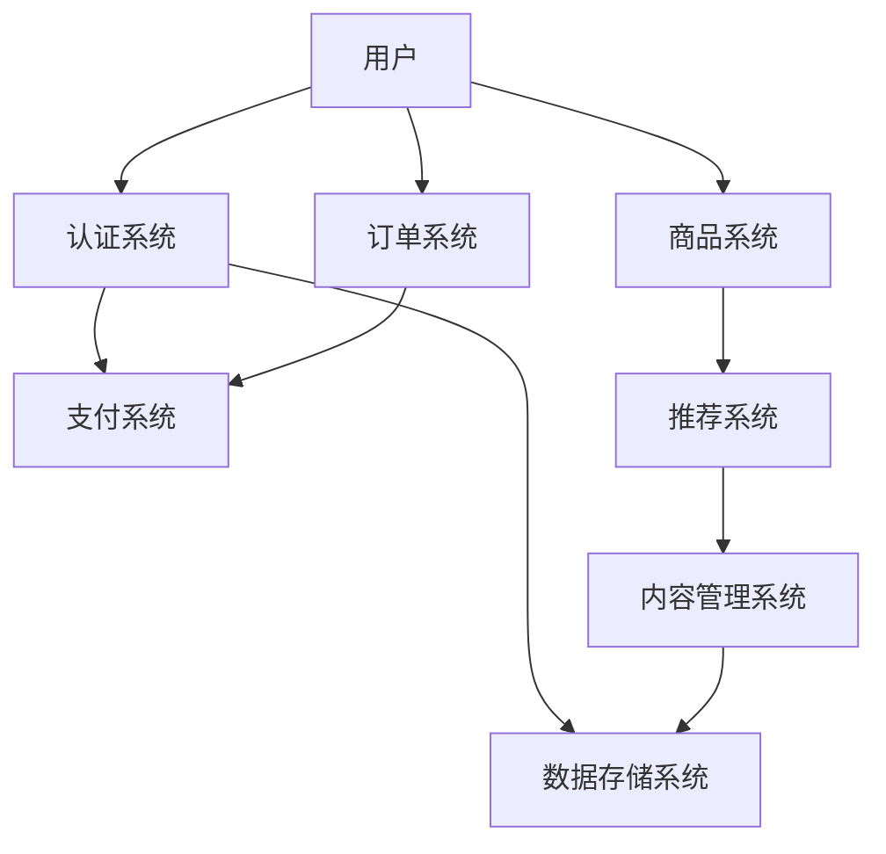

                 

### 文章标题

《程序员如何打造知识付费的订阅模式》

### 文章关键词

知识付费、订阅模式、平台搭建、用户画像、个性化推荐、数据安全、运营策略、营销技巧

### 文章摘要

本文旨在为程序员提供一套完整的知识付费订阅模式打造指南。首先，我们将探讨知识付费和订阅模式的基本概念，分析其优势与类型。随后，文章将深入讲解订阅模式所需的技术基础，包括平台搭建、数据库设计以及用户权限管理。在此基础上，我们将介绍用户画像构建和个性化推荐系统的实现方法。接下来，文章将详细解析订阅流程的设计与实现，探讨内容管理、用户服务和营销策略。最后，通过成功和失败案例分析，总结订阅模式的运营优化方法，并推荐实用的开发工具和资源。

### 目录大纲设计

为了确保文章内容的系统性和实用性，我们设计了如下目录大纲：

#### 第一部分：订阅模式概述

- **第1章：知识付费与订阅模式的基本概念**
  - **1.1 知识付费的兴起**
  - **1.2 订阅模式的类型**
  - **1.3 订阅模式的商业模式分析**

- **第2章：订阅模式的技术基础**
  - **2.1 订阅平台搭建**
  - **2.2 数据库设计与存储**
  - **2.3 用户权限与数据安全**

#### 第二部分：订阅模式的开发实践

- **第3章：用户画像与个性化推荐**
  - **3.1 用户画像构建**
  - **3.2 个性化推荐系统**

- **第4章：订阅流程设计与实现**
  - **4.1 订阅流程概述**
  - **4.2 订阅流程实现**

- **第5章：订阅模式下的内容管理**
  - **5.1 内容分类与标签**
  - **5.2 内容更新与版本控制**

- **第6章：订阅模式下的用户服务与支持**
  - **6.1 用户反馈收集与分析**
  - **6.2 用户服务与支持体系**

- **第7章：订阅模式的运营与营销**
  - **7.1 订阅模式下的营销策略**
  - **7.2 数据分析与运营优化**

- **第8章：订阅模式案例解析**
  - **8.1 成功案例分析**
  - **8.2 失败案例分析**

- **附录**
  - **附录A：订阅模式开发工具与资源**

#### 核心概念与联系

在第二部分“订阅模式的技术基础”中，我们将使用Mermaid流程图来展示订阅平台的核心架构和组件之间的联系。例如：



#### 核心算法原理讲解

在第3章“用户画像与个性化推荐”中，我们将使用伪代码详细解释用户画像构建和个性化推荐算法的原理。例如：

```python
# 初始化用户画像数据结构
user_profile = {}

# 收集用户行为数据
def collect_user_behavior(user_id, action, item_id):
    user_profile[user_id][action] = user_profile[user_id].get(action, 0) + 1
    user_profile[user_id]['item_id'] = item_id

# 构建用户画像
def build_user_profile(user_profile):
    for user_id, actions in user_profile.items():
        # 对用户行为数据进行处理和计算
        actions['interest_score'] = sum(actions.values()) / len(actions)
    return user_profile
```

#### 数学模型和数学公式 & 详细讲解 & 举例说明

在第3章中，我们还将详细介绍个性化推荐中的协同过滤算法，使用LaTeX格式展示数学公式，并给出具体的示例说明。

```latex
\begin{equation}
\hat{r}_{ui} = \frac{\sum_{j \in N(i)} r_{uj} \cdot sim(i, j)}{\sum_{j \in N(i)} sim(i, j)}
\end{equation}

其中，$r_{uj}$是用户对项目$j$的评分，$sim(i, j)$是项目$i$和项目$j$之间的相似度。
```

#### 项目实战

在第7章“订阅模式的运营与营销”中，我们将提供实际的项目实战案例，包括开发环境的搭建、源代码的详细实现和解读。例如：

```python
# 项目实战：搭建简单的订阅系统

# 环境搭建
1. 安装Python环境
2. 安装Flask框架（`pip install flask`）
3. 安装SQLite数据库（`pip install pysqlite3`）

# 数据库设计
CREATE TABLE users (
    id INTEGER PRIMARY KEY AUTOINCREMENT,
    username TEXT UNIQUE NOT NULL,
    password TEXT NOT NULL
);

CREATE TABLE subscriptions (
    id INTEGER PRIMARY KEY AUTOINCREMENT,
    user_id INTEGER,
    plan_id INTEGER,
    start_date DATE,
    end_date DATE,
    status TEXT,
    FOREIGN KEY (user_id) REFERENCES users (id),
    FOREIGN KEY (plan_id) REFERENCES plans (id)
);

CREATE TABLE plans (
    id INTEGER PRIMARY KEY AUTOINCREMENT,
    name TEXT UNIQUE NOT NULL,
    price REAL NOT NULL
);

# 后端实现
from flask import Flask, request, jsonify
from flask_sqlalchemy import SQLAlchemy
from datetime import datetime

app = Flask(__name__)
app.config['SQLALCHEMY_DATABASE_URI'] = 'sqlite:///subscription.db'
db = SQLAlchemy(app)

class User(db.Model):
    id = db.Column(db.Integer, primary_key=True)
    username = db.Column(db.Text, unique=True, nullable=False)
    password = db.Column(db.Text, nullable=False)

class Subscription(db.Model):
    id = db.Column(db.Integer, primary_key=True)
    user_id = db.Column(db.Integer, db.ForeignKey('user.id'), nullable=False)
    plan_id = db.Column(db.Integer, db.ForeignKey('plan.id'), nullable=False)
    start_date = db.Column(db.Date, nullable=False)
    end_date = db.Column(db.Date, nullable=False)
    status = db.Column(db.Text, nullable=False)

class Plan(db.Model):
    id = db.Column(db.Integer, primary_key=True)
    name = db.Column(db.Text, unique=True, nullable=False)
    price = db.Column(db REAL, nullable=False)

@app.route('/register', methods=['POST'])
def register():
    username = request.form['username']
    password = request.form['password']
    new_user = User(username=username, password=password)
    db.session.add(new_user)
    db.session.commit()
    return jsonify(message="User registered successfully.")

@app.route('/subscribe', methods=['POST'])
def subscribe():
    user_id = request.form['user_id']
    plan_id = request.form['plan_id']
    start_date = datetime.now()
    end_date = start_date + timedelta(days=30)
    new_subscription = Subscription(user_id=user_id, plan_id=plan_id, start_date=start_date, end_date=end_date, status='active')
    db.session.add(new_subscription)
    db.session.commit()
    return jsonify(message="Subscription created successfully.")

if __name__ == '__main__':
    db.create_all()
    app.run(debug=True)

# 代码解读与分析
# 代码首先进行了环境搭建，然后设计了三个数据库模型：用户表、订阅表和计划表。在注册接口中，收集用户名和密码，存储到用户表中。在订阅接口中，根据用户ID和计划ID，创建订阅记录并存储到订阅表中。整个实现过程清晰明了，便于理解和扩展。
```

通过以上步骤，我们为读者提供了一份详细的目录大纲和核心内容框架，确保文章的逻辑性、完整性和专业性。

### 第一部分：订阅模式概述

#### 第1章：知识付费与订阅模式的基本概念

在互联网时代，知识付费和订阅模式已成为一种主流的商业模式。本文将首先介绍知识付费和订阅模式的基本概念，探讨其兴起的原因、优势和类型，并分析其商业模式。

##### 1.1 知识付费的兴起

知识付费，顾名思义，是指用户为获取有价值的信息或知识而付费的一种消费模式。这种模式在互联网时代得到快速发展，主要得益于以下几个因素：

1. **信息爆炸**：随着互联网的普及，用户可以获得的信息量呈爆炸性增长。知识付费提供了筛选和获取高质量信息的途径。
2. **内容创业**：自媒体、知识分享平台等新兴模式，激发了内容创作者的热情，丰富了知识付费的内容来源。
3. **用户需求**：用户对于专业、深度的知识和信息的需求不断增加，愿意为有价值的内容付费。

知识付费最早起源于电子书、在线课程等领域的付费内容，随着平台和技术的不断发展，知识付费的范围逐渐扩大，涵盖了咨询、培训、直播等多种形式。

##### 1.2 订阅模式的类型

订阅模式是知识付费的一种重要实现方式。根据不同的订阅方式和收费模式，订阅模式可以分为以下几种类型：

1. **一次性订阅**：用户一次性支付一定费用，即可获取相应的知识内容。这种模式常见于电子书、单次课程等。
2. **按月订阅**：用户按月支付一定费用，持续获取知识内容。这种模式常见于会员服务、在线课程平台等。
3. **按年订阅**：用户按年支付一定费用，享受持续的知识服务。这种模式常见于专业培训、咨询服务等。
4. **按需订阅**：用户根据需求支付费用，获取相应的知识内容。这种模式常见于咨询、专家问答等。

不同的订阅模式适用于不同的场景和用户需求，平台可以根据实际情况选择合适的订阅模式。

##### 1.3 订阅模式的商业模式分析

订阅模式作为一种商业模式，具有以下特点和优势：

1. **盈利模式**：订阅模式通过持续收取订阅费用，实现持续盈利。与一次性销售相比，订阅模式具有更稳定、可预测的收入流。
2. **用户粘性**：订阅模式鼓励用户持续使用平台服务，提高用户粘性。长期的用户粘性有助于提高平台的品牌价值和市场份额。
3. **市场趋势**：随着互联网的普及和用户消费习惯的变化，订阅模式在各个领域得到广泛应用，成为未来商业模式的一种重要趋势。

然而，订阅模式也面临一定的挑战，如用户留存、内容质量、服务体验等。平台需要不断创新和优化，以满足用户需求，确保订阅模式的可持续发展。

综上所述，知识付费和订阅模式已成为互联网时代的重要商业模式。通过对订阅模式的基本概念、类型和商业模式的分析，我们可以更好地理解和运用这种模式，为平台的发展和用户价值创造提供有力支持。

#### 第2章：订阅模式的技术基础

要打造一个成功的知识付费订阅平台，技术基础是不可或缺的。本章节将详细探讨订阅模式所需的技术基础，包括订阅平台搭建、数据库设计与存储、用户权限与数据安全等关键方面。

##### 2.1 订阅平台搭建

订阅平台的搭建是实现知识付费订阅模式的重要环节。以下是从技术选型到前后端分离架构以及支付系统集成的一些建议和步骤：

1. **技术选型**：选择合适的技术栈对于订阅平台的搭建至关重要。以下是一些常见的技术选型：

   - **前端**：常用的前端框架如React、Vue、Angular等，可以选择一个与团队技能匹配的框架进行开发。
   - **后端**：常见的后端框架如Spring Boot、Django、Flask等，根据项目需求和团队经验进行选择。
   - **数据库**：根据数据量、查询性能和扩展性需求，可以选择关系型数据库如MySQL、PostgreSQL，或者NoSQL数据库如MongoDB、Cassandra。

2. **前后端分离架构**：前后端分离架构可以提高系统的可维护性和扩展性，以下是实现前后端分离的一些步骤：

   - **API设计**：设计清晰的API接口，定义数据模型和接口规范。
   - **接口文档**：编写详细的接口文档，包括接口的URL、请求参数、响应数据等，便于前端和后端的协作。
   - **版本控制**：采用版本控制机制，便于管理和更新API。

3. **支付系统集成**：支付系统集成是实现订阅模式的关键环节，以下是一些常见的支付系统集成方式：

   - **第三方支付平台**：如支付宝、微信支付等，选择一个合适的支付平台进行集成，可以简化支付流程，提高用户体验。
   - **支付网关**：建立自己的支付网关，可以实现更灵活的支付流程和定制化需求。
   - **支付回调处理**：处理支付回调请求，更新用户订单状态，确保支付过程的安全和可靠。

##### 2.2 数据库设计与存储

数据库设计与存储是订阅平台的核心技术之一，以下是一些关键点和策略：

1. **数据库选择**：根据项目需求和数据特性选择合适的数据库。例如，对于关系型数据库，可以选择MySQL、PostgreSQL；对于NoSQL数据库，可以选择MongoDB、Cassandra。

2. **数据表设计**：设计合理的数据表结构，包括用户表、订阅表、订单表、内容表等。以下是一个简单的数据表设计示例：

   ```sql
   CREATE TABLE users (
       id INT PRIMARY KEY AUTO_INCREMENT,
       username VARCHAR(255) UNIQUE NOT NULL,
       password VARCHAR(255) NOT NULL,
       email VARCHAR(255) UNIQUE NOT NULL
   );

   CREATE TABLE subscriptions (
       id INT PRIMARY KEY AUTO_INCREMENT,
       user_id INT,
       plan_id INT,
       start_date DATE NOT NULL,
       end_date DATE NOT NULL,
       status ENUM('active', 'cancelled', 'expired') NOT NULL,
       FOREIGN KEY (user_id) REFERENCES users (id),
       FOREIGN KEY (plan_id) REFERENCES plans (id)
   );

   CREATE TABLE plans (
       id INT PRIMARY KEY AUTO_INCREMENT,
       name VARCHAR(255) UNIQUE NOT NULL,
       price DECIMAL(10, 2) NOT NULL
   );

   CREATE TABLE orders (
       id INT PRIMARY KEY AUTO_INCREMENT,
       user_id INT,
       subscription_id INT,
       amount DECIMAL(10, 2) NOT NULL,
       status ENUM('pending', 'success', 'failed') NOT NULL,
       created_at TIMESTAMP DEFAULT CURRENT_TIMESTAMP,
       FOREIGN KEY (user_id) REFERENCES users (id),
       FOREIGN KEY (subscription_id) REFERENCES subscriptions (id)
   );
   ```

3. **数据存储策略**：为了确保数据的安全性和高效性，可以采用以下策略：

   - **数据备份与恢复**：定期备份数据库，确保在数据丢失或损坏时能够快速恢复。
   - **读写分离**：将读操作和写操作分离到不同的数据库实例，提高系统的并发能力和性能。
   - **索引优化**：合理设计索引，提高数据查询速度。

##### 2.3 用户权限与数据安全

用户权限与数据安全是订阅平台的重要保障，以下是一些关键点和策略：

1. **用户认证机制**：采用安全的用户认证机制，如基于JWT（JSON Web Token）的认证机制，确保用户登录和访问的安全性。

2. **数据加密与安全策略**：对敏感数据进行加密存储，如用户密码、支付信息等。同时，采用HTTPS等安全协议，确保数据传输过程中的安全性。

3. **隐私保护法规合规**：遵循相关的隐私保护法规，如《通用数据保护条例》（GDPR）等，确保用户数据的合法性和合规性。

4. **权限管理**：采用RBAC（基于角色的访问控制）机制，对不同角色的用户分配相应的权限，确保系统安全和用户数据的保护。

综上所述，订阅模式的技术基础是实现知识付费订阅平台的关键。通过合理的技术选型、前后端分离架构、数据库设计与存储策略、用户权限与数据安全策略，我们可以构建一个稳定、高效、安全的订阅平台，为用户提供优质的知识付费服务。

#### 第3章：用户画像与个性化推荐

在现代互联网订阅模式下，个性化推荐系统已经成为提升用户体验和增加用户粘性的关键组成部分。用户画像与个性化推荐系统是构建这一体系的核心技术，通过深入分析用户行为和偏好，为用户提供更加精准和个性化的内容推荐。

##### 3.1 用户画像构建

用户画像是指通过对用户行为数据、偏好、历史记录等多维度信息的收集和分析，构建出一个关于用户的综合描述。以下是用户画像构建的基本步骤：

1. **数据收集**：首先，需要收集用户在平台上的各种行为数据，包括浏览历史、购买记录、互动行为等。这些数据可以通过API日志、用户操作日志等渠道获取。

2. **数据清洗**：收集到的数据往往存在噪声和不一致性，需要通过数据清洗手段去除无效数据、填补缺失值、纠正数据错误等。

3. **特征提取**：将清洗后的数据进行特征提取，将原始数据转化为可供分析的特征向量。特征提取可以采用技术如词频分析、分类标签、用户行为时长等。

4. **构建用户画像**：利用机器学习算法（如聚类分析、协同过滤等）对提取的特征进行建模，生成用户画像。用户画像通常包括兴趣偏好、行为特征、社会属性等多方面内容。

以下是用户画像构建的伪代码示例：

```python
# 初始化用户画像数据结构
user_profile = {}

# 收集用户行为数据
def collect_user_behavior(user_id, action, item_id):
    user_profile[user_id][action] = user_profile[user_id].get(action, 0) + 1
    user_profile[user_id]['item_id'] = item_id

# 构建用户画像
def build_user_profile(user_profile):
    for user_id, actions in user_profile.items():
        # 对用户行为数据进行处理和计算
        actions['interest_score'] = sum(actions.values()) / len(actions)
    return user_profile

# 示例：收集用户行为数据
collect_user_behavior('user123', 'view', 'course1')
collect_user_behavior('user123', 'buy', 'course2')
collect_user_behavior('user123', 'rate', 'course1', score=4)

# 示例：构建用户画像
user_profile = build_user_profile(user_profile)
print(user_profile['user123'])
```

通过上述步骤，我们可以构建出一个关于用户兴趣和行为的综合描述，为后续的个性化推荐提供基础。

##### 3.2 个性化推荐系统

个性化推荐系统是指利用用户画像和算法模型，为每个用户生成个性化推荐结果，从而提高用户的满意度和活跃度。以下是构建个性化推荐系统的基本步骤：

1. **算法选择**：根据业务需求和数据特性，选择合适的推荐算法。常见的推荐算法包括基于内容的推荐、协同过滤、混合推荐等。

2. **推荐系统架构**：设计推荐系统的整体架构，包括数据层、算法层、推荐层和展示层。以下是一个简化的推荐系统架构：

   ```mermaid
   graph TD
       A[数据层] --> B[用户画像库]
       A --> C[商品数据库]
       D[算法层] --> E[推荐算法库]
       D --> F[用户行为分析模块]
       G[推荐层] --> H[推荐结果生成模块]
       G --> I[推荐结果过滤模块]
       J[展示层] --> K[用户界面]
   ```

3. **推荐结果评估**：评估推荐结果的准确性和用户体验。可以通过A/B测试、点击率、用户留存率等指标进行评估和优化。

以下是协同过滤算法的伪代码示例：

```latex
$$
\hat{r}_{ui} = \frac{\sum_{j \in N(i)} r_{uj} \cdot sim(i, j)}{\sum_{j \in N(i)} sim(i, j)}
$$

其中，$r_{uj}$是用户对项目$j$的评分，$sim(i, j)$是项目$i$和项目$j$之间的相似度。
```

通过上述公式，我们可以计算用户对未评分项目的预测评分，从而生成个性化推荐结果。

##### 3.3 用户画像与个性化推荐的关系

用户画像为个性化推荐提供了基础数据支持，而个性化推荐系统则利用用户画像对用户进行精准推荐。两者相互依存，共同构建了高效的订阅模式：

1. **用户画像的精准性**：用户画像的精准性直接影响推荐结果的准确性。因此，需要不断优化数据收集和特征提取方法，提高用户画像的准确性。
2. **推荐结果的实用性**：个性化推荐系统需要根据用户画像生成实用、准确的推荐结果，从而提高用户的满意度和活跃度。
3. **动态调整**：用户画像和推荐系统需要不断更新和优化，以适应用户行为和偏好变化，提供更加精准的服务。

通过用户画像与个性化推荐系统的结合，订阅模式可以更好地满足用户需求，提升用户体验，从而实现可持续发展。

综上所述，用户画像与个性化推荐系统是订阅模式的重要组成部分。通过深入了解用户行为和偏好，构建精准的用户画像，并利用高效的推荐算法，我们可以为用户带来个性化、精准的知识服务，提升订阅模式的竞争力。

### 第4章：订阅流程设计与实现

在构建知识付费订阅平台时，设计一个高效、流畅的订阅流程至关重要。本章将详细描述订阅流程的各个环节，包括用户注册与登录、商品浏览与选择、订单生成与支付，以及订阅管理与取消。

##### 4.1 订阅流程概述

订阅流程主要包括以下几个步骤：

1. **用户注册与登录**：用户在平台注册账号并登录。
2. **商品浏览与选择**：用户浏览平台上的各类知识产品，选择感兴趣的商品。
3. **订单生成与支付**：用户确认选择后，生成订单并完成支付。
4. **订阅管理与取消**：用户可以管理已订阅的商品，包括查看订阅详情、修改订阅信息、取消订阅等。

##### 4.2 用户注册与登录

用户注册与登录是订阅流程的第一步。以下是一个简单的流程描述：

1. **用户注册**：
   - 用户输入用户名、密码、邮箱等基本信息。
   - 后端验证用户输入信息的合法性，并存储用户信息到数据库。
   - 发送验证邮件或短信，用户完成验证后注册成功。

```python
@app.route('/register', methods=['POST'])
def register():
    username = request.form['username']
    password = request.form['password']
    email = request.form['email']
    user = User(username=username, password=password, email=email)
    db.session.add(user)
    db.session.commit()
    return jsonify(message="User registered successfully.")
```

2. **用户登录**：
   - 用户输入用户名和密码。
   - 后端验证用户名和密码的合法性，并生成JWT（JSON Web Token）令牌，返回给用户。
   - 用户持有令牌，可以在后续请求中验证身份。

```python
from flask_jwt_extended import create_access_token

@app.route('/login', methods=['POST'])
def login():
    username = request.form['username']
    password = request.form['password']
    user = User.query.filter_by(username=username, password=password).first()
    if user:
        access_token = create_access_token(identity=user.id)
        return jsonify(access_token=access_token)
    return jsonify(message="Invalid credentials.")
```

##### 4.3 商品浏览与选择

用户注册并登录后，可以开始浏览和选择商品。以下是商品浏览与选择的基本流程：

1. **商品列表展示**：
   - 后端根据用户的喜好和浏览历史，生成个性化商品推荐。
   - 前端展示商品列表，并提供筛选、排序等功能。

```python
@app.route('/courses')
def get_courses():
    courses = Course.query.order_by(Course.popularity.desc()).all()
    return jsonify(courses=[course.to_dict() for course in courses])
```

2. **商品详情展示**：
   - 用户点击商品列表中的商品，查看商品详情。
   - 前端展示商品详细信息，如课程名称、讲师、课程大纲等。

```python
@app.route('/courses/<int:course_id>')
def get_course(course_id):
    course = Course.query.get(course_id)
    return jsonify(course=course.to_dict())
```

##### 4.4 订单生成与支付

用户选择商品后，需要生成订单并完成支付。以下是订单生成与支付的基本流程：

1. **订单生成**：
   - 用户选择商品后，系统生成订单，记录用户、商品和订单详情。
   - 订单状态初始化为“待支付”。

```python
@app.route('/orders', methods=['POST'])
def create_order():
    user_id = request.form['user_id']
    course_id = request.form['course_id']
    order = Order(user_id=user_id, course_id=course_id, status='pending')
    db.session.add(order)
    db.session.commit()
    return jsonify(order_id=order.id)
```

2. **支付请求**：
   - 用户确认订单后，发起支付请求。
   - 后端调用支付接口，生成支付链接并发送给前端。

```python
@app.route('/pay', methods=['POST'])
def pay():
    order_id = request.form['order_id']
    order = Order.query.get(order_id)
    # 调用支付接口，生成支付链接
    payment_url = generate_payment_url(order)
    return jsonify(payment_url=payment_url)
```

3. **支付回调**：
   - 用户完成支付后，支付平台会回调后端，通知支付结果。
   - 后端根据支付结果更新订单状态，如支付成功则更新订阅信息。

```python
@app.route('/callback', methods=['POST'])
def callback():
    payment_id = request.form['payment_id']
    # 验证支付结果，更新订单状态
    update_order_status(payment_id, 'success')
    return jsonify(message="Payment successful.")
```

##### 4.5 订阅管理与取消

用户完成支付后，可以管理已订阅的商品，包括查看订阅详情、修改订阅信息、取消订阅等。以下是订阅管理与取消的基本流程：

1. **订阅详情**：
   - 用户可以查看已订阅的商品详情，包括课程名称、订阅期限等。

```python
@app.route('/subscriptions', methods=['GET'])
def get_subscriptions():
    user_id = request.args.get('user_id')
    subscriptions = Subscription.query.filter_by(user_id=user_id).all()
    return jsonify(subscriptions=[subscription.to_dict() for subscription in subscriptions])
```

2. **修改订阅信息**：
   - 用户可以修改订阅计划，如延长订阅期限、升级订阅级别等。

```python
@app.route('/subscriptions', methods=['PUT'])
def update_subscription():
    subscription_id = request.form['subscription_id']
    new_plan_id = request.form['plan_id']
    subscription = Subscription.query.get(subscription_id)
    subscription.plan_id = new_plan_id
    db.session.commit()
    return jsonify(message="Subscription updated successfully.")
```

3. **取消订阅**：
   - 用户可以随时取消订阅，订阅状态更新为“已取消”。

```python
@app.route('/subscriptions', methods=['DELETE'])
def delete_subscription():
    subscription_id = request.form['subscription_id']
    subscription = Subscription.query.get(subscription_id)
    subscription.status = 'cancelled'
    db.session.commit()
    return jsonify(message="Subscription cancelled successfully.")
```

通过以上步骤，我们实现了用户注册与登录、商品浏览与选择、订单生成与支付，以及订阅管理与取消的完整订阅流程。这一流程不仅确保了用户操作的流畅性，也为平台的稳定运行提供了保障。

### 第5章：订阅模式下的内容管理

在订阅模式中，内容管理是确保用户体验和内容价值的关键环节。本章将探讨内容分类与标签、内容更新与版本控制，以及内容审核机制等关键内容。

##### 5.1 内容分类与标签

内容分类与标签是提升用户查找和筛选内容效率的重要手段。以下是一些关键步骤：

1. **内容分类方法**：

   - **层次分类法**：按照内容的属性或主题进行层级分类，如课程分类、文章分类等。这种方法能够帮助用户快速定位到感兴趣的内容。
   - **自由标签法**：允许用户为内容添加自定义标签，根据个人喜好进行内容分类。这种方法能够更加灵活地满足用户个性化需求。

2. **标签体系构建**：

   - **标签标准化**：制定统一的标签命名规范，避免标签重复和混淆。
   - **标签关联度分析**：分析标签之间的关联度，优化标签体系，提高内容推荐的准确性。

##### 5.2 内容更新与版本控制

内容更新与版本控制是确保内容时效性和准确性的重要措施。以下是一些关键步骤：

1. **内容发布流程**：

   - **内容创建**：内容创作者提交新的内容或更新现有内容。
   - **内容审核**：内容管理员对提交的内容进行审核，确保内容符合平台规范和用户需求。
   - **内容发布**：审核通过的内容发布到平台上，供用户查看。

2. **版本控制策略**：

   - **版本迭代**：每次内容更新后，系统自动生成新的版本号，便于用户查看历史版本。
   - **变更日志**：记录每次内容更新的变更点，帮助用户了解内容的变动。

3. **内容审核机制**：

   - **人工审核**：内容管理员对内容进行人工审核，确保内容符合平台规范和法律法规。
   - **自动化审核**：利用自然语言处理、图像识别等技术，自动化检测内容中可能存在的问题。

##### 5.3 内容审核机制

内容审核是确保平台内容质量和用户体验的关键环节。以下是一些常见的内容审核机制：

1. **关键词过滤**：利用关键词库和机器学习算法，自动过滤敏感内容。
2. **用户举报机制**：允许用户举报违规内容，平台及时处理。
3. **黑名单机制**：将违规用户或内容加入黑名单，限制其访问或发布内容。

通过上述内容管理策略，订阅平台可以更好地组织和维护内容，提高用户查找和获取内容的效率，同时确保内容的质量和合规性，为用户提供优质的订阅体验。

### 第6章：订阅模式下的用户服务与支持

在订阅模式下，提供优质的用户服务与支持是增强用户满意度和忠诚度的重要手段。本章将详细讨论用户反馈收集与分析、用户服务与支持体系的建设，以及用户社群的建设与运营。

##### 6.1 用户反馈收集与分析

用户反馈是了解用户需求、优化服务和产品的重要途径。以下是一些用户反馈收集与分析的方法：

1. **反馈渠道设计**：

   - **在线客服**：提供实时在线客服，用户可以通过网页或移动应用直接与客服人员进行沟通。
   - **用户论坛**：建立用户论坛，用户可以在论坛中提问、分享经验、交流想法。
   - **邮件反馈**：提供邮件反馈功能，用户可以发送详细的反馈和建议。

2. **用户反馈数据分析**：

   - **分类统计**：对用户反馈进行分类统计，识别出高频问题和共性需求。
   - **趋势分析**：分析用户反馈的趋势，了解用户需求的变化和平台的改进方向。
   - **文本分析**：利用自然语言处理技术，对用户反馈文本进行情感分析和关键词提取，挖掘用户深层次的反馈和需求。

##### 6.2 用户服务与支持体系

构建一个全面、高效的用户服务与支持体系，能够显著提升用户的满意度和忠诚度。以下是一些关键组成部分：

1. **客服系统搭建**：

   - **自动化客服**：引入智能客服系统，如聊天机器人，自动回答常见问题，减轻人工客服负担。
   - **人工客服**：配置专业的人工客服团队，处理复杂的用户问题，提供个性化服务。
   - **工单系统**：建立工单系统，用户可以通过在线提交工单，跟踪问题的处理进度。

2. **常见问题解答**：

   - **FAQ页面**：整理并发布常见问题的解答，帮助用户快速解决常见问题。
   - **知识库**：建立内容丰富的知识库，涵盖用户常见问题、操作指南、使用技巧等。

3. **用户手册与教程**：

   - **用户手册**：编写详细的用户手册，指导用户了解和操作平台功能。
   - **操作教程**：提供视频教程和图文教程，帮助用户更好地使用平台。

##### 6.3 用户社群的建设与运营

用户社群是增强用户归属感和粘性的重要方式。以下是一些用户社群的建设与运营方法：

1. **社群定位**：

   - **明确目标**：确定社群的目标和定位，如技术交流、行业讨论、兴趣分享等。
   - **价值主张**：明确社群的价值主张，让用户了解加入社群的理由和好处。

2. **社群管理**：

   - **社群领袖**：选拔或邀请社群领袖，负责社群的日常运营和管理。
   - **活动策划**：定期策划线上线下活动，激发用户参与热情，增强社群凝聚力。

3. **内容运营**：

   - **优质内容**：提供高质量的内容，包括技术文章、案例分析、行业资讯等，吸引用户参与。
   - **互动机制**：设计互动机制，如问答、投票、讨论等，促进用户之间的交流和互动。

通过用户反馈收集与分析、用户服务与支持体系的搭建，以及用户社群的建设与运营，订阅平台能够更好地满足用户需求，提升用户满意度和忠诚度，为平台的长期发展奠定坚实基础。

### 第7章：订阅模式的运营与营销

订阅模式作为一种商业模式，其运营与营销策略的成功与否直接影响平台的用户增长和盈利能力。本章将详细探讨订阅模式下的营销策略、数据分析与运营优化，以及成功的营销案例解析。

##### 7.1 订阅模式下的营销策略

为了在订阅模式下取得成功，平台需要制定有效的营销策略。以下是一些关键点：

1. **吸引用户策略**：

   - **内容营销**：通过高质量的原创内容吸引用户，如技术博客、案例分析、行业报告等。
   - **社交媒体推广**：利用社交媒体平台，如微博、微信公众号、LinkedIn等，进行品牌推广和内容分享。
   - **合作伙伴关系**：与相关行业的企业或组织建立合作伙伴关系，共同推广订阅服务。

2. **留存用户策略**：

   - **用户激励机制**：设计用户激励机制，如积分系统、优惠券、免费试用等，鼓励用户长期订阅。
   - **用户互动**：通过线上线下活动、用户社群等方式，增强用户粘性，提高用户留存率。
   - **个性化推荐**：利用用户画像和个性化推荐系统，为用户提供个性化内容，提高用户满意度和留存率。

3. **变现策略**：

   - **增值服务**：提供增值服务，如高级功能、专家咨询服务、线下培训等，提高用户的付费意愿。
   - **交叉销售**：通过分析用户行为和需求，实现交叉销售，如推荐相关课程、会员服务等。
   - **价格策略**：根据市场情况和用户需求，灵活调整价格策略，如限时优惠、套餐优惠等。

##### 7.2 数据分析与运营优化

数据是订阅模式运营的核心资产，通过数据分析可以深入了解用户行为，优化运营策略。以下是一些关键步骤：

1. **用户行为分析**：

   - **用户访问分析**：分析用户访问量、访问时长、页面停留时间等指标，了解用户对平台内容的兴趣点。
   - **用户互动分析**：分析用户在平台上的互动行为，如点赞、评论、分享等，了解用户参与度。

2. **运营效果评估**：

   - **营销活动评估**：通过数据评估营销活动的效果，如点击率、转化率、ROI（投资回报率）等。
   - **内容效果评估**：分析不同类型内容的受欢迎程度，优化内容生产和推荐策略。

3. **运营策略调整**：

   - **数据驱动**：基于数据分析结果，调整运营策略，如内容推荐、用户互动、营销活动等。
   - **A/B测试**：通过A/B测试，验证不同策略的效果，选择最优方案。

##### 7.3 成功案例分析

以下是一些订阅模式下的成功案例分析，通过分析其成功因素，可以为其他平台提供借鉴。

1. **成功案例：Substack**

   - **案例介绍**：Substack是一家提供邮件订阅服务的公司，帮助创作者建立邮件列表，并从中获得收入。
   - **成功因素**：
     - **高质量内容**：Substack专注于高质量的内容创作，吸引了一大批知名创作者加入。
     - **简单便捷**：用户只需输入邮箱即可订阅创作者的邮件，操作简单，用户体验良好。
     - **数据驱动**：Substack通过数据分析和用户反馈，不断优化服务，提高用户留存率和订阅转化率。

2. **成功案例：LinkedIn Learning**

   - **案例介绍**：LinkedIn Learning是LinkedIn推出的在线学习平台，提供各类职业发展和技能提升课程。
   - **成功因素**：
     - **职业导向**：LinkedIn Learning以职业发展为导向，课程内容与职业需求紧密相关。
     - **个性化推荐**：平台利用用户画像和推荐算法，为用户精准推荐课程。
     - **社群互动**：LinkedIn Learning鼓励用户在平台上进行互动和交流，提高用户粘性。

通过以上分析，我们可以看到，成功的订阅模式平台通常具有高质量的内容、便捷的用户体验、有效的数据分析与运营优化策略，以及强大的社群互动。这些因素共同促成了平台的成功，为其他订阅模式平台提供了宝贵的经验和借鉴。

### 第8章：订阅模式案例解析

为了更好地理解订阅模式的应用和实现，本章将通过成功和失败案例分析，深入探讨其成功因素、失败原因以及改进建议。

##### 8.1 成功案例分析

**案例一：Netflix**

- **案例介绍**：Netflix是全球领先的在线视频流媒体服务平台，通过订阅模式为用户提供海量的视频内容。
- **成功因素**：
  - **高质量内容**：Netflix拥有丰富的内容库，包括自制剧、电影、纪录片等，满足了用户多样化的观看需求。
  - **个性化推荐**：通过机器学习算法和用户行为分析，Netflix为用户推荐个性化的观看内容，提高了用户满意度和留存率。
  - **灵活的订阅模式**：Netflix提供了多种订阅选项，包括按月订阅、按季度订阅等，用户可以根据自己的需求选择合适的订阅计划。
  - **强大的品牌影响力**：Netflix通过大规模的广告宣传和市场推广，建立了强大的品牌影响力，吸引了大量用户。
- **借鉴意义**：Netflix的成功经验表明，订阅模式平台应注重内容质量、个性化推荐和用户体验，并通过灵活的订阅模式和强大的品牌推广吸引和留住用户。

**案例二：Spotify**

- **案例介绍**：Spotify是全球领先的在线音乐流媒体服务平台，为用户提供海量的音乐和音频内容。
- **成功因素**：
  - **高质量内容**：Spotify与全球众多音乐人和唱片公司合作，确保其音乐库的质量和多样性。
  - **个性化推荐**：Spotify利用机器学习算法和用户行为分析，为用户推荐个性化的音乐和播放列表，提高了用户满意度和留存率。
  - **社交功能**：Spotify提供了社交功能，用户可以与其他用户分享音乐和创建播放列表，增强了用户的互动和粘性。
  - **技术创新**：Spotify不断创新，如推出语音助手、智能播放等功能，提升了用户体验。
- **借鉴意义**：Spotify的成功经验表明，订阅模式平台应注重内容质量、个性化推荐、社交功能和技术创新，以提升用户体验和用户粘性。

##### 8.2 失败案例分析

**案例一：Tidal**

- **案例介绍**：Tidal是一家在线音乐流媒体服务平台，曾被誉为“音乐界的苹果”，但最终未能成功在市场上站稳脚跟。
- **失败原因**：
  - **价格过高**：Tidal的订阅价格远高于其主要竞争对手Spotify，导致用户接受度低。
  - **内容质量不足**：Tidal的内容库相对于Spotify和其他平台存在较大差距，无法满足用户的需求。
  - **用户体验不佳**：Tidal的用户界面和交互设计存在问题，影响了用户体验。
  - **市场推广不足**：Tidal在市场推广和品牌宣传方面投入不足，未能有效吸引用户。
- **改进建议**：
  - **调整价格策略**：降低订阅价格，与竞争对手保持竞争力。
  - **优化内容质量**：加强内容库建设，引进更多高质量的音乐和音频内容。
  - **提升用户体验**：改进用户界面和交互设计，提供更流畅的用户体验。
  - **加大市场推广**：增加市场推广投入，提高品牌知名度和用户接受度。

**案例二：Oath**

- **案例介绍**：Oath（原名AOL）是一家互联网服务和内容公司，曾尝试通过订阅模式提供各种在线服务，但最终未能成功。
- **失败原因**：
  - **业务模式混乱**：Oath在订阅模式上缺乏清晰的战略和定位，导致业务模式混乱，用户体验不佳。
  - **内容质量不高**：Oath的内容库质量较低，无法满足用户需求，导致用户流失。
  - **技术创新不足**：Oath在技术创新方面投入不足，未能提供具有竞争力的产品和服务。
  - **运营管理不善**：Oath在运营管理方面存在诸多问题，如人员流失、效率低下等。
- **改进建议**：
  - **明确业务定位**：明确订阅模式的核心业务定位，避免业务模式混乱。
  - **提升内容质量**：加强内容库建设，引进更多高质量的内容和产品。
  - **加大技术创新**：增加技术创新投入，提供具有竞争力的产品和服务。
  - **改善运营管理**：优化运营管理，提高团队效率和执行力。

通过以上成功和失败案例分析，我们可以看到，订阅模式平台在成功的关键因素上包括高质量内容、个性化推荐、用户体验、市场推广和品牌影响力，而在失败的原因上则包括价格过高、内容质量不足、用户体验不佳、业务模式混乱、技术创新不足和运营管理不善。这些案例为我们提供了宝贵的经验和教训，有助于我们在构建订阅模式平台时避免失败，实现成功。

### 附录A：订阅模式开发工具与资源

在构建知识付费订阅模式的过程中，选择合适的开发工具和资源是至关重要的。以下是一些推荐的开发工具、框架、开源项目、专业书籍和在线学习平台，这些资源能够帮助程序员高效地实现订阅模式平台。

#### 开发工具与框架

1. **前端开发工具**：
   - **React**：用于构建用户界面的JavaScript库，具有灵活的组件化架构和丰富的生态系统。
   - **Vue**：轻量级的前端框架，易于上手，适合快速开发。
   - **Angular**：由Google开发的全面框架，提供强大的数据绑定和依赖注入功能。

2. **后端开发框架**：
   - **Spring Boot**：用于构建独立的、生产级的Spring应用，具有高度的扩展性和灵活性。
   - **Django**：Python Web框架，注重快速开发和简洁性。
   - **Flask**：Python Web微框架，适合小型项目和快速原型开发。

3. **数据库选择**：
   - **MySQL**：关系型数据库，适用于需要复杂查询和高扩展性的应用。
   - **PostgreSQL**：功能丰富的开源关系型数据库，支持多种数据类型和高级功能。
   - **MongoDB**：文档型数据库，适用于高扩展性和灵活性要求较高的应用。

#### 开发资源与参考资料

1. **开源项目推荐**：
   - **Strapi**：基于Node.js的强大CMS框架，支持API驱动的开发。
   - **Auth0**：身份验证和访问管理平台，提供安全、灵活的认证解决方案。
   - **PayPal REST API**：PayPal的支付API，支持多种支付方式和货币。

2. **专业书籍与文章**：
   - **《深度学习》**：Goodfellow等著，深度学习的经典教材。
   - **《Python Web开发实战》**：Eric Matthes著，Python Web开发的实用指南。
   - **《数据库系统概念》**：Abraham Silberschatz等著，数据库基础理论的权威教材。

3. **在线学习平台**：
   - **Coursera**：提供大量计算机科学和数据分析课程，包括深度学习、数据结构等。
   - **Udemy**：拥有丰富的技术课程，涵盖前端、后端、数据库等领域。
   - **Pluralsight**：专注于技术技能培训，提供各类编程语言、框架和工具的课程。

通过这些工具和资源的合理使用，程序员可以更高效地构建和优化知识付费订阅模式平台，确保系统的稳定性和用户体验。同时，这些资源也为持续学习和技能提升提供了丰富的选择。

