                 

### 第一部分：核心概念与联系

在《程序员如何打造高转化率的知识付费课程》的第一部分，我们将介绍知识付费课程设计的基础概念，以及这些概念之间的关系。

#### 核心概念与联系

知识付费课程的核心概念包括用户需求分析、课程内容设计、营销策略和用户反馈。以下是这些概念之间的Mermaid流程图：

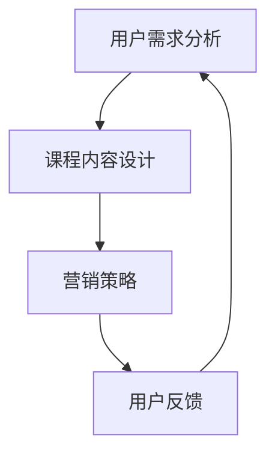

1. **用户需求分析（A）**：了解目标用户的需求是设计知识付费课程的第一步。这包括对用户的研究、调查和访谈，以确定他们的痛点和兴趣点。

2. **课程内容设计（B）**：基于用户需求，设计能够满足用户需求的内容。课程内容应具有实用性、吸引力和连续性，以保持用户的兴趣。

3. **营销策略（C）**：一旦课程内容确定，就需要制定营销策略来吸引潜在用户。这包括内容营销、社交媒体推广、电子邮件营销等。

4. **用户反馈（D）**：用户的反馈对于课程迭代和改进至关重要。通过收集和分析用户反馈，可以不断优化课程内容，提高用户满意度。

#### 知识付费课程设计的架构

以下是知识付费课程设计的架构，使用Mermaid流程图表示：

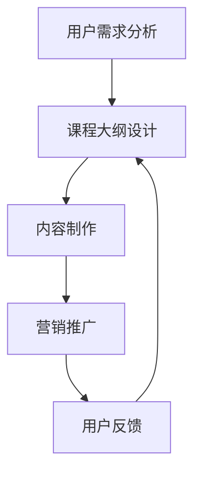

1. **课程大纲设计（B）**：制定详细的课程大纲，确定每个章节的主题、目标和教学内容。

2. **内容制作（C）**：根据课程大纲，制作教学视频、文档、测试题等教学内容。

3. **营销推广（D）**：推广课程，吸引潜在用户。

4. **用户反馈（E）**：收集用户反馈，用于课程迭代。

#### 核心算法原理讲解

知识付费课程设计过程中，用户数据分析是一个关键环节。以下是用户数据分析的基本算法原理，使用伪代码进行阐述：

```python
# 用户数据分析伪代码

# 1. 数据收集
data = collect_user_data()

# 2. 数据清洗
cleaned_data = clean_data(data)

# 3. 用户特征提取
user_features = extract_features(cleaned_data)

# 4. 建立用户画像
user_profiles = build_user_profiles(user_features)

# 5. 用户行为分析
user_behavior = analyze_user_behavior(user_profiles)

# 6. 用户需求预测
predicted_needs = predict_user_needs(user_behavior)

# 7. 优化课程内容
course_content = optimize_course_content(predicted_needs)
```

#### 数学模型和数学公式

在用户需求预测中，可以使用线性回归模型。以下是线性回归的数学模型和公式：

$$
y = \beta_0 + \beta_1x_1 + \beta_2x_2 + ... + \beta_nx_n
$$

其中，$y$ 是目标变量，$x_1, x_2, ..., x_n$ 是特征变量，$\beta_0, \beta_1, \beta_2, ..., \beta_n$ 是模型的参数。

#### 项目实战

以下是一个简单的项目实战示例，用于用户需求分析：

1. **开发环境搭建**：使用Python的Pandas库进行数据分析和处理。

2. **源代码实现**：以下是一个简单的用户数据分析的代码示例。

```python
import pandas as pd

# 加载数据
data = pd.read_csv('user_data.csv')

# 数据清洗
cleaned_data = data.dropna()

# 用户特征提取
user_features = cleaned_data[['age', 'gender', 'income', 'course_completed']]

# 建立用户画像
user_profiles = user_features.groupby(['age', 'gender', 'income']).mean()

# 用户行为分析
user_behavior = user_profiles[['course_completed']]

# 用户需求预测
predicted_needs = user_behavior['course_completed'].mean()

# 优化课程内容
print(f"Predicted needs: {predicted_needs}")
```

3. **代码解读与分析**：此代码首先加载用户数据，然后进行数据清洗，提取用户特征并建立用户画像。接着，分析用户行为，并使用平均值作为用户需求预测。最后，根据预测结果优化课程内容。

#### 总结

第一部分介绍了知识付费课程设计的基础概念和架构，并提供了用户数据分析的算法原理和项目实战示例。这些内容为后续章节的深入讲解奠定了基础。在接下来的章节中，我们将详细讨论课程内容设计、营销策略和用户反馈等关键环节。

### 第二部分：课程内容设计

#### 核心概念与联系

在《程序员如何打造高转化率的知识付费课程》的第二部分，我们将深入探讨课程内容设计的相关核心概念，以及这些概念之间的联系。

##### 核心概念

1. **课程目标**：明确课程要达成的目标，如技能提升、知识拓展等。
2. **内容结构**：设计合理的课程结构，包括章节、模块、知识点等。
3. **教学方法**：选择合适的教学方法，如讲授、讨论、实践等。
4. **内容呈现**：如何有效地呈现课程内容，包括视觉、听觉、互动等元素。
5. **评估与反馈**：设置评估机制，收集用户反馈，以持续优化课程内容。

##### 核心概念之间的联系

以下是课程内容设计的关键概念之间的Mermaid流程图：

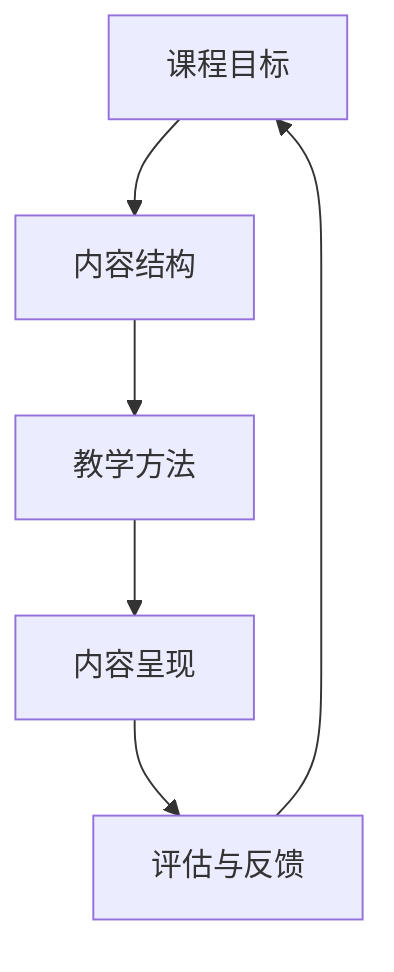

1. **课程目标（A）**：确定课程目标，明确课程的学习目的和预期成果。

2. **内容结构（B）**：基于课程目标，设计课程内容结构，确保每个知识点都与目标相关。

3. **教学方法（C）**：选择适合的教学方法，以最大化学生的学习效果。

4. **内容呈现（D）**：如何将课程内容以最吸引人的方式呈现给用户。

5. **评估与反馈（E）**：通过评估与反馈，了解学生的学习情况，不断优化课程内容。

#### 课程内容设计的架构

以下是课程内容设计的架构，使用Mermaid流程图表示：

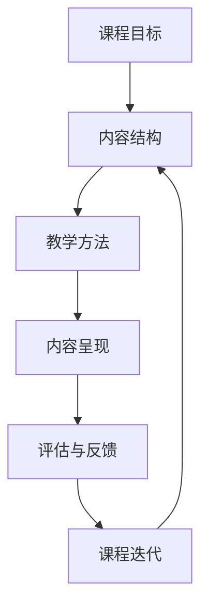

1. **课程目标（A）**：明确课程目标。

2. **内容结构（B）**：设计课程结构。

3. **教学方法（C）**：选择教学方法。

4. **内容呈现（D）**：呈现课程内容。

5. **评估与反馈（E）**：评估学习效果。

6. **课程迭代（F）**：根据评估与反馈，迭代优化课程。

#### 核心算法原理讲解

在课程内容设计过程中，内容优化是一个关键环节。以下是内容优化的一些核心算法原理，使用伪代码进行阐述：

```python
# 内容优化伪代码

# 1. 数据收集
course_data = collect_course_data()

# 2. 数据清洗
cleaned_data = clean_data(course_data)

# 3. 内容分析
content_analysis = analyze_content(cleaned_data)

# 4. 用户反馈分析
user_feedback = analyze_user_feedback()

# 5. 内容调整
adjusted_content = adjust_content(content_analysis, user_feedback)

# 6. 评估效果
evaluation_results = evaluate_content(adjusted_content)

# 7. 迭代优化
optimized_content = iterate_optimize(evaluation_results)
```

#### 数学模型和数学公式

在内容优化中，可以使用聚类分析来识别课程内容的相似性。以下是聚类分析的数学模型和公式：

$$
\text{距离函数} = \sum_{i=1}^{n} (\text{课程内容}_i - \text{课程目标})^2
$$

其中，$n$ 是课程内容数量，$\text{课程内容}_i$ 是第 $i$ 项课程内容，$\text{课程目标}$ 是预期要达到的目标。

#### 项目实战

以下是一个简单的项目实战示例，用于内容优化：

1. **开发环境搭建**：使用Python的Scikit-learn库进行聚类分析。

2. **源代码实现**：以下是一个简单的聚类分析代码示例。

```python
from sklearn.cluster import KMeans
import pandas as pd

# 加载数据
data = pd.read_csv('course_data.csv')

# 数据清洗
cleaned_data = data.dropna()

# 内容分析
kmeans = KMeans(n_clusters=3)
clusters = kmeans.fit_predict(cleaned_data)

# 用户反馈分析
user_feedback = pd.read_csv('user_feedback.csv')
adjusted_data = user_feedback['feedback'].map({0: '负面', 1: '中性', 2: '正面'})

# 内容调整
adjusted_clusters = adjusted_data[clusters == 0].value_counts()

# 评估效果
evaluation_results = adjusted_clusters.mean()

# 迭代优化
print(f"Adjusted clusters: {adjusted_clusters}")
print(f"Evaluation results: {evaluation_results}")
```

3. **代码解读与分析**：此代码首先加载课程数据，使用KMeans算法进行聚类分析。然后，分析用户反馈，调整课程内容。最后，评估调整后的内容效果。

#### 总结

第二部分介绍了课程内容设计的相关核心概念和架构，并提供了内容优化算法原理和项目实战示例。这些内容为设计高转化率的知识付费课程奠定了基础。在接下来的章节中，我们将探讨营销策略和用户反馈等重要环节。

### 第三部分：营销策略

#### 核心概念与联系

在《程序员如何打造高转化率的知识付费课程》的第三部分，我们将深入探讨营销策略的相关核心概念，以及这些概念之间的联系。

##### 核心概念

1. **目标受众**：确定课程的目标受众，了解他们的需求和偏好。
2. **定位**：为课程设定独特的定位，使其在市场中脱颖而出。
3. **内容营销**：通过优质内容吸引潜在用户，建立品牌影响力。
4. **渠道选择**：选择合适的营销渠道，如社交媒体、电子邮件、广告等。
5. **定价策略**：制定合理的定价策略，确保课程的高转化率。

##### 核心概念之间的联系

以下是营销策略的关键概念之间的Mermaid流程图：

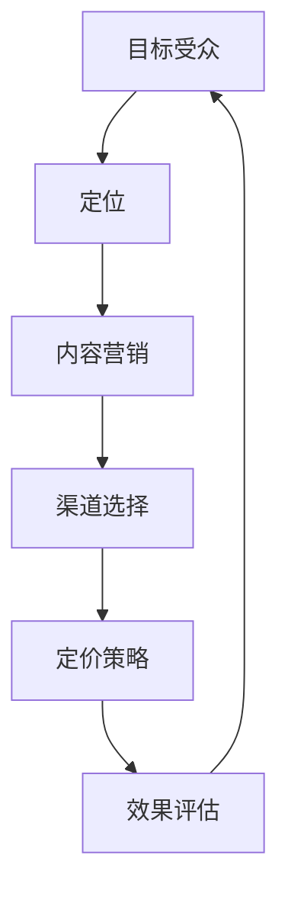

1. **目标受众（A）**：明确课程的目标受众，了解他们的需求和偏好。

2. **定位（B）**：基于目标受众，为课程设定独特的定位。

3. **内容营销（C）**：通过优质内容吸引潜在用户，建立品牌影响力。

4. **渠道选择（D）**：选择合适的营销渠道，扩大课程的影响力。

5. **定价策略（E）**：制定合理的定价策略，确保课程的高转化率。

6. **效果评估（F）**：通过数据分析和用户反馈，评估营销策略的效果。

#### 营销策略的架构

以下是营销策略的架构，使用Mermaid流程图表示：

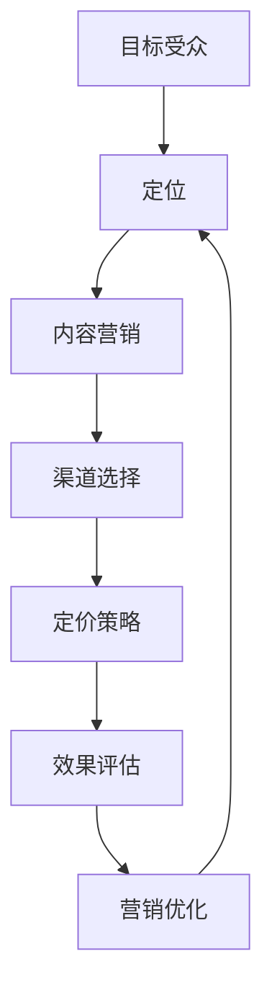

1. **目标受众（A）**：确定目标受众。

2. **定位（B）**：设定课程定位。

3. **内容营销（C）**：制定内容营销策略。

4. **渠道选择（D）**：选择营销渠道。

5. **定价策略（E）**：制定定价策略。

6. **效果评估（F）**：评估营销效果。

7. **营销优化（G）**：根据评估结果优化营销策略。

#### 核心算法原理讲解

在营销策略中，用户行为分析是一个关键环节。以下是用户行为分析的一些核心算法原理，使用伪代码进行阐述：

```python
# 用户行为分析伪代码

# 1. 数据收集
user_data = collect_user_data()

# 2. 数据清洗
cleaned_data = clean_data(user_data)

# 3. 行为特征提取
user_behavior = extract_behavior_features(cleaned_data)

# 4. 用户分群
user_clusters = cluster_users(user_behavior)

# 5. 行为预测
predicted_behavior = predict_user_behavior(user_clusters)

# 6. 营销策略调整
marketing_strategy = adjust_marketing_strategy(predicted_behavior)
```

#### 数学模型和数学公式

在用户行为预测中，可以使用逻辑回归模型。以下是逻辑回归的数学模型和公式：

$$
\text{概率} = \frac{1}{1 + \exp(-\beta_0 - \beta_1x_1 - \beta_2x_2 - ... - \beta_nx_n)}
$$

其中，$\beta_0, \beta_1, \beta_2, ..., \beta_n$ 是模型的参数，$x_1, x_2, ..., x_n$ 是特征变量。

#### 项目实战

以下是一个简单的项目实战示例，用于用户行为分析：

1. **开发环境搭建**：使用Python的Scikit-learn库进行用户行为分析。

2. **源代码实现**：以下是一个简单的用户行为分析代码示例。

```python
from sklearn.linear_model import LogisticRegression
import pandas as pd

# 加载数据
data = pd.read_csv('user_data.csv')

# 数据清洗
cleaned_data = data.dropna()

# 行为特征提取
X = cleaned_data[['age', 'income', 'course_completed']]
y = cleaned_data['purchased']

# 用户分群
model = LogisticRegression()
model.fit(X, y)

# 行为预测
predictions = model.predict(X)

# 营销策略调整
print(f"Predicted behavior: {predictions}")
```

3. **代码解读与分析**：此代码首先加载用户数据，提取行为特征。然后，使用逻辑回归模型进行训练，并预测用户行为。最后，根据预测结果调整营销策略。

#### 总结

第三部分介绍了营销策略的相关核心概念和架构，并提供了用户行为分析算法原理和项目实战示例。这些内容为制定高转化率的知识付费课程营销策略奠定了基础。在接下来的章节中，我们将探讨用户反馈的重要性以及如何利用反馈进行课程迭代。

### 第四部分：用户反馈

#### 核心概念与联系

在《程序员如何打造高转化率的知识付费课程》的第四部分，我们将深入探讨用户反馈的相关核心概念，以及这些概念之间的联系。

##### 核心概念

1. **用户满意度**：衡量用户对课程的满意程度。
2. **课程评价**：收集用户对课程的评价，包括内容质量、教学方式等。
3. **反馈机制**：建立有效的反馈机制，确保用户能够方便地提出反馈。
4. **用户行为**：分析用户在课程学习过程中的行为，了解他们的需求和偏好。
5. **课程迭代**：根据用户反馈和用户行为，不断优化课程内容和结构。

##### 核心概念之间的联系

以下是用户反馈的关键概念之间的Mermaid流程图：

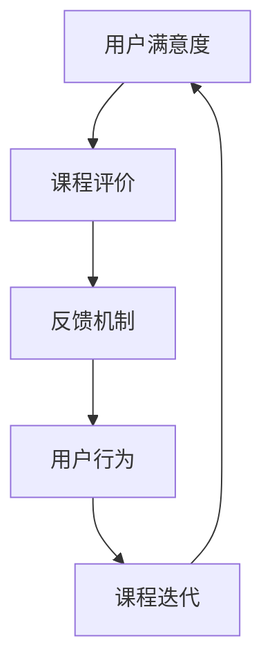

1. **用户满意度（A）**：了解用户对课程的满意程度，这是衡量课程质量的重要指标。

2. **课程评价（B）**：收集用户对课程的评价，包括内容质量、教学方式等，以便了解课程的优点和不足。

3. **反馈机制（C）**：建立有效的反馈机制，让用户能够方便地提出反馈，从而不断改进课程。

4. **用户行为（D）**：分析用户在课程学习过程中的行为，了解他们的需求和偏好，以优化课程内容和结构。

5. **课程迭代（E）**：根据用户反馈和用户行为，不断优化课程内容和结构，提高用户满意度。

#### 用户反馈的架构

以下是用户反馈的架构，使用Mermaid流程图表示：

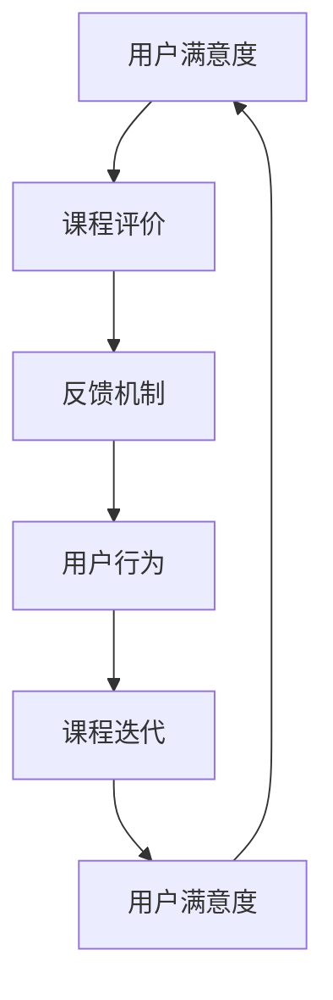

1. **用户满意度（A）**：了解用户对课程的满意程度。

2. **课程评价（B）**：收集用户对课程的评价。

3. **反馈机制（C）**：建立反馈机制。

4. **用户行为（D）**：分析用户行为。

5. **课程迭代（E）**：根据反馈和用户行为优化课程。

6. **用户满意度（F）**：再次衡量用户满意度，以验证迭代效果。

#### 核心算法原理讲解

在用户反馈分析中，文本分析是一个关键环节。以下是文本分析的一些核心算法原理，使用伪代码进行阐述：

```python
# 文本分析伪代码

# 1. 数据收集
feedback_data = collect_feedback_data()

# 2. 数据清洗
cleaned_data = clean_data(feedback_data)

# 3. 特征提取
text_features = extract_text_features(cleaned_data)

# 4. 情感分析
sentiment_analysis = analyze_sentiment(text_features)

# 5. 关键词提取
key_words = extract_key_words(text_features)

# 6. 主题模型
topic_modeling = build_topic_model(key_words)

# 7. 反馈评估
feedback_evaluation = evaluate_feedback(topic_modeling)
```

#### 数学模型和数学公式

在情感分析中，可以使用词袋模型（Bag of Words, BoW）和朴素贝叶斯（Naive Bayes）算法。以下是朴素贝叶斯算法的数学模型和公式：

$$
P(\text{情感} = c | \text{词语集合} = \text{w}) = \frac{P(\text{词语集合} = \text{w} | \text{情感} = c)P(\text{情感} = c)}{P(\text{词语集合} = \text{w})}
$$

其中，$c$ 表示情感类别，$w$ 表示词语集合，$P(\cdot)$ 表示概率。

#### 项目实战

以下是一个简单的项目实战示例，用于文本分析：

1. **开发环境搭建**：使用Python的NLTK库进行文本分析。

2. **源代码实现**：以下是一个简单的文本分析代码示例。

```python
import nltk
from nltk.corpus import stopwords
from nltk.tokenize import word_tokenize
from nltk.stem import WordNetLemmatizer
from sklearn.feature_extraction.text import CountVectorizer
from sklearn.naive_bayes import MultinomialNB

# 加载停用词库
stop_words = set(stopwords.words('english'))

# 加载文本数据
feedback_data = pd.read_csv('feedback_data.csv')

# 数据清洗
cleaned_data = feedback_data['feedback'].apply(lambda x: ' '.join([word for word in word_tokenize(x) if word not in stop_words]))

# 特征提取
vectorizer = CountVectorizer()
X = vectorizer.fit_transform(cleaned_data)

# 情感分析
model = MultinomialNB()
model.fit(X, feedback_data['sentiment'])

# 预测
predictions = model.predict(X)

# 关键词提取
feature_names = vectorizer.get_feature_names_out()
top_keywords = [feature_names[i] for i in np.argsort(model.coef_[0])[-10:]]

# 输出结果
print(f"Predicted sentiment: {predictions}")
print(f"Top keywords: {top_keywords}")
```

3. **代码解读与分析**：此代码首先加载用户反馈数据，然后进行数据清洗，提取特征。接着，使用朴素贝叶斯算法进行情感分析，并提取关键词。最后，输出预测结果和关键词。

#### 总结

第四部分介绍了用户反馈的相关核心概念和架构，并提供了文本分析算法原理和项目实战示例。这些内容为收集、分析和利用用户反馈提供了理论基础和实践指导。在接下来的章节中，我们将探讨如何将用户反馈应用于课程迭代，以进一步提高课程质量。

### 第五部分：课程迭代

#### 核心概念与联系

在《程序员如何打造高转化率的知识付费课程》的第五部分，我们将深入探讨课程迭代的相关核心概念，以及这些概念之间的联系。

##### 核心概念

1. **课程改进**：基于用户反馈和数据分析，对课程进行持续改进。
2. **内容更新**：定期更新课程内容，确保其与行业动态和技术发展保持一致。
3. **课程优化**：通过数据分析和用户反馈，优化课程结构、教学方法和内容呈现。
4. **用户参与**：鼓励用户参与课程改进，提高他们的满意度和忠诚度。
5. **课程评估**：定期评估课程效果，确保其达到预期的学习目标。

##### 核心概念之间的联系

以下是课程迭代的关键概念之间的Mermaid流程图：

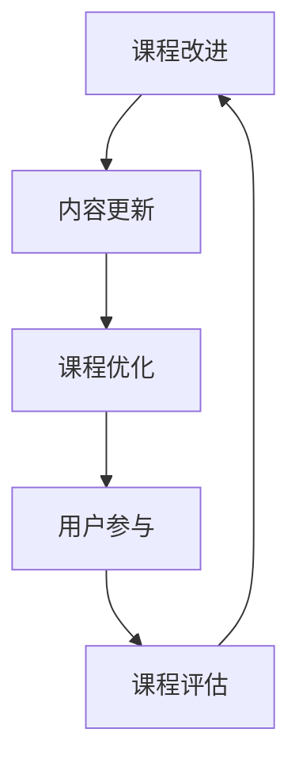

1. **课程改进（A）**：基于用户反馈和数据分析，对课程进行持续改进。

2. **内容更新（B）**：定期更新课程内容，确保其与行业动态和技术发展保持一致。

3. **课程优化（C）**：通过数据分析和用户反馈，优化课程结构、教学方法和内容呈现。

4. **用户参与（D）**：鼓励用户参与课程改进，提高他们的满意度和忠诚度。

5. **课程评估（E）**：定期评估课程效果，确保其达到预期的学习目标。

#### 课程迭代流程

以下是课程迭代的基本流程，使用Mermaid流程图表示：

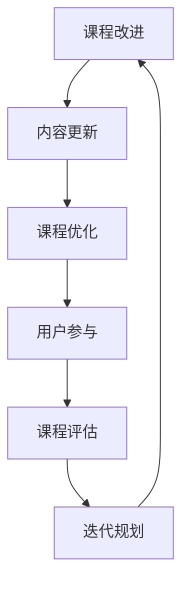

1. **课程改进（A）**：基于用户反馈和数据分析，识别课程改进点。

2. **内容更新（B）**：更新课程内容，引入新的技术和行业动态。

3. **课程优化（C）**：优化课程结构、教学方法和内容呈现，以提高学习效果。

4. **用户参与（D）**：鼓励用户参与课程改进，通过反馈和建议提高课程质量。

5. **课程评估（E）**：定期评估课程效果，确保其达到预期的学习目标。

6. **迭代规划（F）**：制定下一次课程迭代的计划，确保课程持续改进。

#### 核心算法原理讲解

在课程迭代中，数据分析是一个关键环节。以下是数据分析的一些核心算法原理，使用伪代码进行阐述：

```python
# 数据分析伪代码

# 1. 数据收集
data = collect_data()

# 2. 数据清洗
cleaned_data = clean_data(data)

# 3. 数据预处理
preprocessed_data = preprocess_data(cleaned_data)

# 4. 特征提取
features = extract_features(preprocessed_data)

# 5. 数据可视化
visualize_data(features)

# 6. 模型训练
model = train_model(features)

# 7. 模型评估
evaluate_model(model)

# 8. 结果分析
analyze_results(model)
```

#### 数学模型和数学公式

在数据分析中，可以使用回归分析来预测用户行为。以下是回归分析的数学模型和公式：

$$
y = \beta_0 + \beta_1x_1 + \beta_2x_2 + ... + \beta_nx_n
$$

其中，$y$ 是预测的目标变量，$x_1, x_2, ..., x_n$ 是特征变量，$\beta_0, \beta_1, \beta_2, ..., \beta_n$ 是回归模型的参数。

#### 项目实战

以下是一个简单的项目实战示例，用于课程迭代：

1. **开发环境搭建**：使用Python的Pandas库进行数据分析。

2. **源代码实现**：以下是一个简单的数据分析代码示例。

```python
import pandas as pd
from sklearn.linear_model import LinearRegression
from sklearn.model_selection import train_test_split

# 加载数据
data = pd.read_csv('course_data.csv')

# 数据预处理
X = data[['user_age', 'user_income', 'course_time']]
y = data['course_completion']

# 模型训练
X_train, X_test, y_train, y_test = train_test_split(X, y, test_size=0.2, random_state=42)
model = LinearRegression()
model.fit(X_train, y_train)

# 模型评估
y_pred = model.predict(X_test)
print(f"Model accuracy: {model.score(X_test, y_test)}")

# 结果分析
print(f"Predicted completions: {y_pred}")
```

3. **代码解读与分析**：此代码首先加载课程数据，然后进行数据预处理。接着，使用线性回归模型进行训练和评估。最后，输出预测结果。

#### 总结

第五部分介绍了课程迭代的相关核心概念和流程，并提供了数据分析算法原理和项目实战示例。这些内容为课程持续改进提供了理论基础和实践指导。在接下来的章节中，我们将探讨如何将用户反馈应用于课程迭代，以进一步提高课程质量。

### 第六部分：案例分析

#### 核心概念与联系

在《程序员如何打造高转化率的知识付费课程》的第六部分，我们将深入探讨案例分析的相关核心概念，以及这些概念之间的联系。

##### 核心概念

1. **案例选择**：选择具有代表性的成功或失败案例进行分析。
2. **案例研究**：对案例进行深入研究，了解其背景、实施过程和结果。
3. **经验总结**：总结案例中的经验教训，提炼出可借鉴的规律和方法。
4. **借鉴应用**：将案例中的成功经验应用于实际课程设计，以提高转化率。
5. **效果评估**：评估案例分析对课程设计的实际影响，确保其有效性。

##### 核心概念之间的联系

以下是案例分析的关键概念之间的Mermaid流程图：

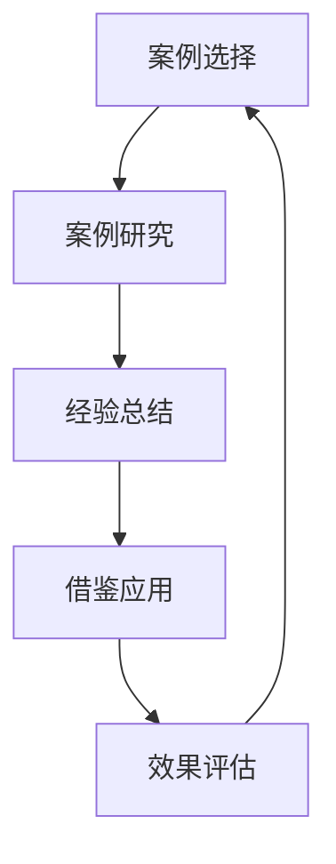

1. **案例选择（A）**：选择具有代表性的成功或失败案例。

2. **案例研究（B）**：对案例进行深入研究。

3. **经验总结（C）**：总结案例中的经验教训。

4. **借鉴应用（D）**：将成功经验应用于实际课程设计。

5. **效果评估（E）**：评估案例分析对课程设计的影响。

#### 案例分析流程

以下是案例分析的基本流程，使用Mermaid流程图表示：

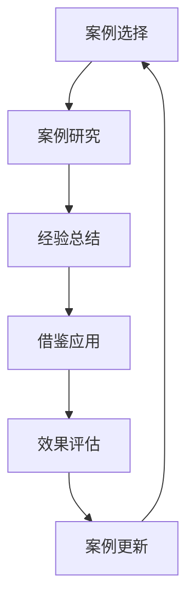

1. **案例选择（A）**：选择具有代表性的成功或失败案例。

2. **案例研究（B）**：对案例进行深入研究。

3. **经验总结（C）**：总结案例中的经验教训。

4. **借鉴应用（D）**：将成功经验应用于实际课程设计。

5. **效果评估（E）**：评估案例分析对课程设计的影响。

6. **案例更新（F）**：根据效果评估结果，更新案例内容。

#### 核心算法原理讲解

在案例分析中，数据挖掘是一个关键环节。以下是数据挖掘的一些核心算法原理，使用伪代码进行阐述：

```python
# 数据挖掘伪代码

# 1. 数据收集
data = collect_data()

# 2. 数据清洗
cleaned_data = clean_data(data)

# 3. 特征提取
features = extract_features(cleaned_data)

# 4. 数据预处理
preprocessed_data = preprocess_data(features)

# 5. 模型选择
model = select_model(preprocessed_data)

# 6. 模型训练
trained_model = train_model(preprocessed_data, model)

# 7. 模型评估
evaluate_model(trained_model)

# 8. 结果分析
analyze_results(trained_model)
```

#### 数学模型和数学公式

在数据挖掘中，可以使用聚类分析来识别用户行为模式。以下是聚类分析的数学模型和公式：

$$
\text{距离函数} = \sum_{i=1}^{n} (\text{用户行为}_i - \text{聚类中心})^2
$$

其中，$n$ 是用户行为数量，$\text{用户行为}_i$ 是第 $i$ 个用户行为，$\text{聚类中心}$ 是聚类结果的中心点。

#### 项目实战

以下是一个简单的项目实战示例，用于案例分析：

1. **开发环境搭建**：使用Python的Scikit-learn库进行数据挖掘。

2. **源代码实现**：以下是一个简单的数据挖掘代码示例。

```python
from sklearn.cluster import KMeans
from sklearn.metrics import silhouette_score
import pandas as pd

# 加载数据
data = pd.read_csv('user_data.csv')

# 数据预处理
X = data[['age', 'income', 'course_time']]

# KMeans聚类
kmeans = KMeans(n_clusters=3)
clusters = kmeans.fit_predict(X)

# 聚类评估
silhouette = silhouette_score(X, clusters)
print(f"Silhouette score: {silhouette}")

# 聚类结果
print(f"Clusters: {clusters}")
```

3. **代码解读与分析**：此代码首先加载用户数据，然后使用KMeans算法进行聚类分析，并评估聚类效果。最后，输出聚类结果。

#### 总结

第六部分介绍了案例分析的相关核心概念和流程，并提供了数据挖掘算法原理和项目实战示例。这些内容为案例分析提供了理论基础和实践指导。在接下来的章节中，我们将探讨如何将案例分析应用于实际课程设计，以提高知识付费课程的转化率。

### 第七部分：课程管理

#### 核心概念与联系

在《程序员如何打造高转化率的知识付费课程》的第七部分，我们将深入探讨课程管理的相关核心概念，以及这些概念之间的联系。

##### 核心概念

1. **课程规划**：制定详细的课程计划，包括课程内容、时间安排和资源分配。
2. **课程执行**：按照课程计划实施课程，确保课程按计划进行。
3. **课程监控**：监控课程进度和质量，及时发现和解决问题。
4. **课程优化**：根据监控结果，对课程进行优化和调整，提高课程效果。
5. **课程评估**：评估课程的整体效果，为后续课程改进提供依据。

##### 核心概念之间的联系

以下是课程管理的关键概念之间的Mermaid流程图：

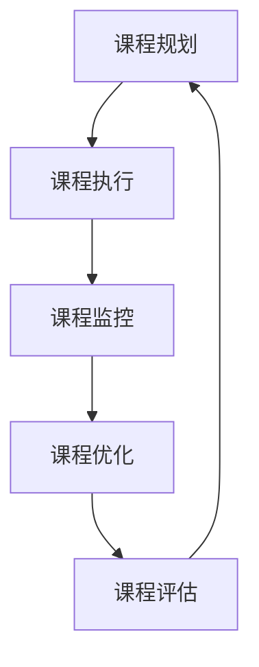

1. **课程规划（A）**：制定详细的课程计划。

2. **课程执行（B）**：实施课程计划。

3. **课程监控（C）**：监控课程进度和质量。

4. **课程优化（D）**：根据监控结果，对课程进行优化和调整。

5. **课程评估（E）**：评估课程效果。

#### 课程管理流程

以下是课程管理的基本流程，使用Mermaid流程图表示：

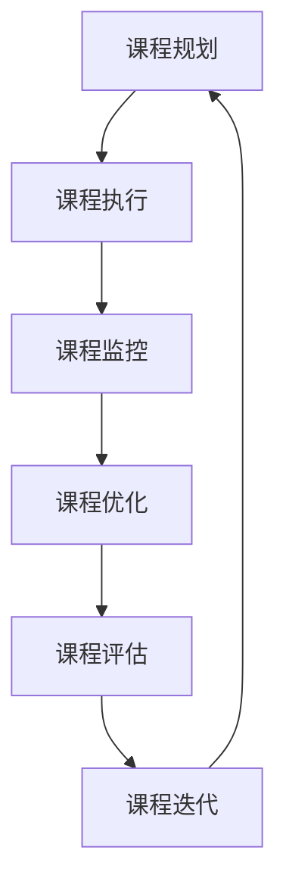

1. **课程规划（A）**：制定详细的课程计划。

2. **课程执行（B）**：实施课程计划。

3. **课程监控（C）**：监控课程进度和质量。

4. **课程优化（D）**：根据监控结果，对课程进行优化和调整。

5. **课程评估（E）**：评估课程效果。

6. **课程迭代（F）**：根据评估结果，迭代优化课程。

#### 核心算法原理讲解

在课程管理中，进度监控是一个关键环节。以下是进度监控的一些核心算法原理，使用伪代码进行阐述：

```python
# 进度监控伪代码

# 1. 数据收集
progress_data = collect_progress_data()

# 2. 数据清洗
cleaned_data = clean_data(progress_data)

# 3. 进度分析
progress_analysis = analyze_progress(cleaned_data)

# 4. 异常检测
anomalies = detect_anomalies(progress_analysis)

# 5. 问题预警
warn_issues(anomalies)
```

#### 数学模型和数学公式

在进度监控中，可以使用时间序列分析来预测课程进度。以下是时间序列分析的数学模型和公式：

$$
y_t = \beta_0 + \beta_1t + \beta_2\Delta t + \epsilon_t
$$

其中，$y_t$ 是第 $t$ 期的进度值，$t$ 是时间，$\Delta t$ 是时间间隔，$\beta_0, \beta_1, \beta_2$ 是模型的参数，$\epsilon_t$ 是误差项。

#### 项目实战

以下是一个简单的项目实战示例，用于进度监控：

1. **开发环境搭建**：使用Python的Pandas库进行进度监控。

2. **源代码实现**：以下是一个简单的进度监控代码示例。

```python
import pandas as pd
from statsmodels.tsa.arima_model import ARIMA

# 加载数据
data = pd.read_csv('progress_data.csv')

# 数据预处理
X = data['progress']

# 时间序列分析
model = ARIMA(X, order=(1, 1, 1))
model_fit = model.fit()

# 预测
predictions = model_fit.forecast(steps=5)

# 异常检测
anomalies = [x for x in predictions if x < 0]

# 输出结果
print(f"Predicted progress: {predictions}")
print(f"Anomalies: {anomalies}")
```

3. **代码解读与分析**：此代码首先加载进度数据，然后使用ARIMA模型进行时间序列分析，并预测未来进度值。最后，检测并输出异常值。

#### 总结

第七部分介绍了课程管理的相关核心概念和流程，并提供了进度监控算法原理和项目实战示例。这些内容为课程管理的有效实施提供了理论基础和实践指导。在接下来的章节中，我们将探讨如何利用技术工具和平台进行课程管理，以提高知识付费课程的转化率。

### 第八部分：技术工具和平台

#### 核心概念与联系

在《程序员如何打造高转化率的知识付费课程》的第八部分，我们将深入探讨技术工具和平台的相关核心概念，以及这些概念之间的联系。

##### 核心概念

1. **在线学习平台**：提供课程发布、内容管理、用户交互等功能的在线学习平台。
2. **内容管理系统**：用于创建、编辑、管理和发布课程内容的系统。
3. **用户管理系统**：管理用户账户、权限和互动的系统。

##### 核心概念之间的联系

以下是技术工具和平台的关键概念之间的Mermaid流程图：

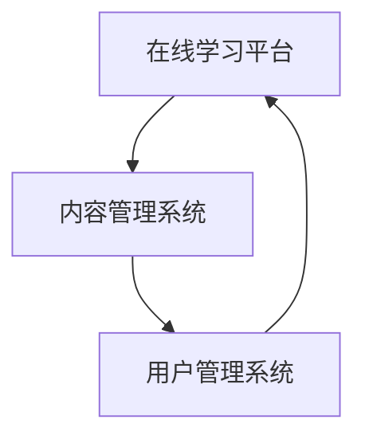

1. **在线学习平台（A）**：提供课程发布和用户互动功能，是用户学习和交流的核心平台。

2. **内容管理系统（B）**：负责课程内容的创建、编辑和发布，是课程内容管理的核心系统。

3. **用户管理系统（C）**：负责用户账户管理、权限控制和用户互动，是确保用户良好体验的核心系统。

#### 在线学习平台

在线学习平台是知识付费课程的核心工具，它提供了课程发布、内容管理、用户交互等关键功能。以下是在线学习平台的主要功能模块：

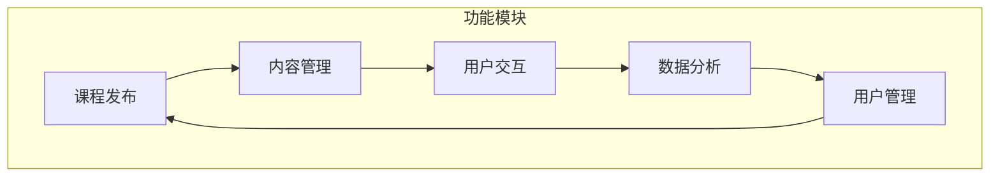

- **课程发布**：发布课程，设置课程价格和推广信息。
- **内容管理**：上传课程视频、文档、测试题等，管理课程内容。
- **用户交互**：提供用户讨论区、问答功能，促进用户互动。
- **数据分析**：分析用户学习行为，提供数据支持。
- **用户管理**：管理用户账户，控制用户权限。

#### 内容管理系统

内容管理系统（CMS）是用于创建、编辑、管理和发布课程内容的系统。以下是内容管理系统的主要功能模块：

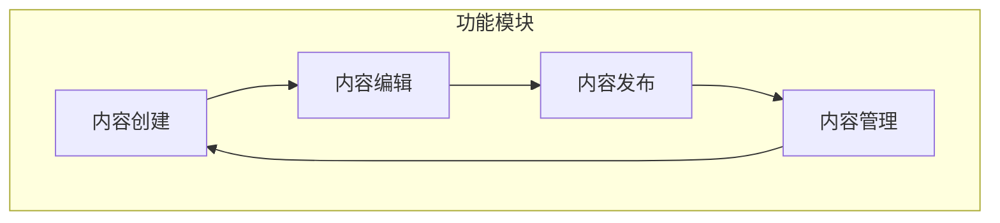

- **内容创建**：创建课程内容，如视频、文档、测试题等。
- **内容编辑**：编辑课程内容，确保内容准确和完整。
- **内容发布**：发布课程内容，供用户学习。
- **内容管理**：管理课程内容，确保内容最新和可用。

#### 用户管理系统

用户管理系统是用于管理用户账户、权限和互动的系统。以下是用户管理系统的主要功能模块：

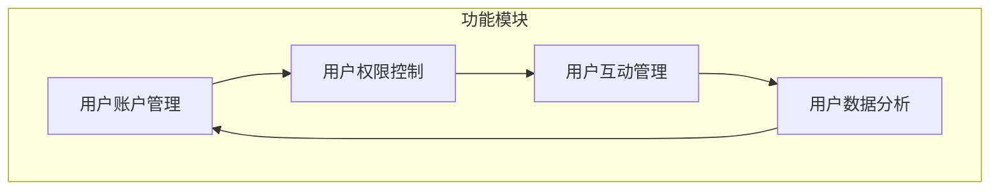

- **用户账户管理**：创建、修改和删除用户账户。
- **用户权限控制**：设置用户访问权限，确保数据安全。
- **用户互动管理**：管理用户互动，如讨论区、问答等。
- **用户数据分析**：分析用户行为，提供数据支持。

#### 总结

第八部分介绍了在线学习平台、内容管理系统和用户管理系统这三个核心概念，以及它们之间的联系。在线学习平台是知识付费课程的核心工具，内容管理系统负责课程内容的创建和管理，用户管理系统负责用户账户和互动的管理。这些技术工具和平台为知识付费课程的设计、实施和优化提供了强有力的支持。在接下来的章节中，我们将探讨如何利用这些工具和平台进行实际操作，以提高课程转化率。

### 实战案例：使用在线学习平台构建高转化率课程

在本文的最后部分，我们将通过一个具体的实战案例，展示如何使用在线学习平台构建高转化率的知识付费课程。以下是一个基于某在线学习平台（如Udemy）的实战案例：

#### 案例背景

某在线学习平台上的知名程序员决定构建一门关于“现代Web开发技术”的知识付费课程，课程的目标受众是希望提升前端和后端开发技能的程序员。课程的内容将涵盖最新的Web开发技术，如React、Vue、Angular、Node.js等。

#### 第一步：课程规划

1. **课程目标**：确定课程目标，如教会用户如何使用React进行前端开发、使用Node.js构建后端服务、实现全栈应用等。
2. **课程大纲**：制定详细的课程大纲，包括课程模块、章节、知识点等。例如：

   - 模块1：前端技术基础
     - 章节1.1：HTML与CSS
     - 章节1.2：JavaScript基础
     - 章节1.3：前端框架介绍

   - 模块2：React深入应用
     - 章节2.1：React基本概念
     - 章节2.2：React组件与状态管理
     - 章节2.3：React路由与Redux

   - 模块3：后端技术基础
     - 章节3.1：Node.js基础
     - 章节3.2：Express框架
     - 章节3.3：数据库与REST API

   - 模块4：全栈应用开发
     - 章节4.1：全栈应用架构
     - 章节4.2：前后端交互
     - 章节4.3：项目实战

3. **课程资源**：准备课程所需的资源，如教学视频、示例代码、测试题、项目文档等。

#### 第二步：课程内容设计

1. **内容呈现方式**：选择合适的呈现方式，如视频讲解、文本教程、代码演示等。根据不同的知识点，灵活运用多种呈现方式。
2. **内容模块化**：将课程内容拆分为多个模块和章节，确保每个模块和章节都有明确的学习目标和教学重点。
3. **内容迭代**：根据用户反馈和行业动态，不断更新和优化课程内容，确保课程内容始终保持最新。

#### 第三步：营销策略制定

1. **目标受众**：确定目标受众，如希望提升Web开发技能的程序员、对新兴Web技术感兴趣的开发者等。
2. **定位**：为课程设定独特的定位，如“全面掌握现代Web开发技术，从React到Node.js”。
3. **内容营销**：制作高质量的课程内容，通过博客文章、视频预告、社交媒体分享等方式进行推广。
4. **渠道选择**：选择合适的营销渠道，如Udemy官方平台、

