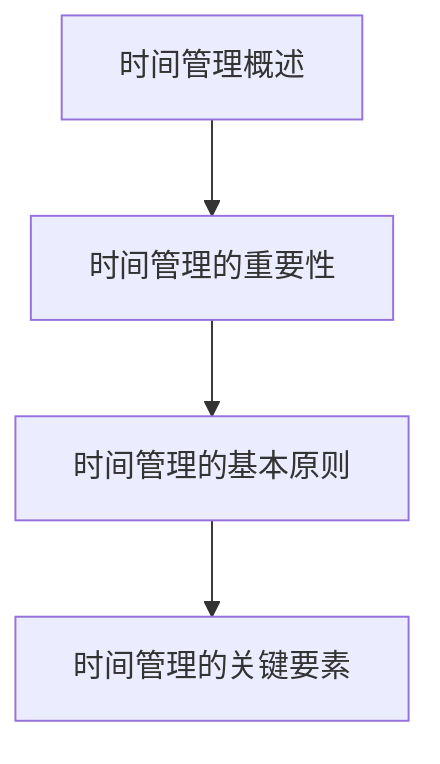

                 

# 程序员的时间管理：效率即财富

> **关键词**：时间管理、工作效率、优先级、工具、个人成长
>
> **摘要**：本文将探讨程序员在日常工作中的时间管理技巧，通过明确目标、优先级管理、时间记录与分析等方法，帮助程序员提高工作效率，实现个人价值最大化。

### 《程序员的时间管理：效率即财富》目录大纲

#### 第一部分：时间管理基础理论
- **第1章**：时间管理概述
  - 1.1 时间管理的重要性
  - 1.2 时间管理的基本原则
  - 1.3 时间管理的关键要素

#### 第二部分：时间管理技巧
- **第2章**：提高工作效率的方法
  - 2.1 设定明确的目标
  - 2.2 利用待办事项清单
  - 2.3 避免拖延症

- **第3章**：优先级管理
  - 3.1 罗伯特·艾克利的优先级法则
  - 3.2 使用时间块进行工作
  - 3.3 学会说不

- **第4章**：时间记录与分析
  - 4.1 记录工作时长
  - 4.2 分析时间使用情况
  - 4.3 提高自我认知

#### 第三部分：时间管理工具与技术
- **第5章**：时间管理工具
  - 5.1 电子日历与提醒功能
  - 5.2 项目管理工具
  - 5.3 时间追踪工具

- **第6章**：技术优化
  - 6.1 使用快捷键提高效率
  - 6.2 多任务处理技巧
  - 6.3 去除分散注意力的因素

#### 第四部分：实战案例
- **第7章**：实战时间管理
  - 7.1 程序员的时间管理实践
  - 7.2 时间管理在团队协作中的应用
  - 7.3 案例分析与反思

#### 第五部分：时间管理与个人成长
- **第8章**：时间管理与职业发展
  - 8.1 时间管理对职业规划的影响
  - 8.2 提高个人竞争力
  - 8.3 达成职业目标的策略

#### 附录
- **附录A**：时间管理资源汇总
  - 8.1 相关书籍推荐
  - 8.2 在线课程与论坛
  - 8.3 时间管理工具推荐

#### 后记
- **后记**：总结与展望
  - 总结时间管理的重要性
  - 展望未来时间管理的发展趋势

---

#### 附加内容

**第1章：时间管理概述**

**Mermaid 流程图：**



**Python 代码示例：**

```python
# 设定明确的目标
def set_goal(goal):
    print(f"设定的目标：{goal}")

# 利用待办事项清单
todo_list = ["任务1", "任务2", "任务3"]

# 避免拖延症
def avoid_procrastination():
    print("开始工作，避免拖延！")
```

**LaTeX 公式示例：**

$$
\text{工作效率} = \frac{\text{工作量}}{\text{工作时间}}
$$

---

接下来，我们将按照目录大纲结构，逐步深入探讨每一个章节的内容。让我们开始第一部分：时间管理基础理论。<span id="part1"></span><|assistant|>
## 第一部分：时间管理基础理论

时间管理是提高工作效率的关键，尤其在程序员这一职业中，时间管理的优劣往往决定了项目的进度和个人的成就感。本部分将介绍时间管理的基础理论，包括时间管理的重要性、基本原则和关键要素，帮助程序员更好地理解时间管理的基本概念。

### 1.1 时间管理的重要性

在当今快速发展的科技时代，程序员面临着日益增加的工作量和复杂的项目需求。有效的时间管理不仅能够提高个人工作效率，还能确保项目的按时交付，减少工作压力，提升整体的工作满意度。以下是时间管理对程序员的重要性：

1. **提高工作效率**：合理安排时间，明确任务优先级，可以避免因为杂乱无章而导致的时间浪费，从而提高工作效率。

2. **确保项目进度**：通过有效的时间管理，程序员能够更好地把控项目进度，确保每个阶段的工作都能按时完成，避免项目延误。

3. **减少工作压力**：合理规划工作时间，避免过度劳累，有助于减轻工作压力，提高生活品质。

4. **提升职业成就感**：高效的时间管理能够使程序员在有限的时间内创造更多的价值，从而获得更高的职业成就感。

### 1.2 时间管理的基本原则

时间管理并非一蹴而就，而是需要遵循一系列基本原则，这些原则可以帮助程序员更好地掌控时间。以下是几个核心原则：

1. **明确目标**：设定清晰的目标是时间管理的第一步，只有明确目标，才能有的放矢地安排时间。

2. **优先级排序**：优先级管理是时间管理的核心，程序员应学会如何根据任务的紧急程度和重要性来排序，确保关键任务得到优先处理。

3. **计划与执行**：制定详细的计划，并且严格执行，有助于提高工作效率，避免因为无计划而导致的时间浪费。

4. **灵活性**：尽管计划是必要的，但实际情况往往复杂多变。因此，程序员需要具备灵活性，能够根据实际情况调整计划。

### 1.3 时间管理的关键要素

要实现有效的时间管理，程序员需要关注以下几个关键要素：

1. **时间记录**：记录每天的工作时间和完成的任务，有助于分析时间使用情况，找出时间浪费的地方。

2. **任务分解**：将大任务分解成小任务，有助于更好地掌控任务进度，提高工作效率。

3. **优先级管理**：合理分配时间，确保关键任务得到优先处理，避免因琐事而耽误重要工作。

4. **避免拖延**：拖延是时间管理的大敌，程序员应学会避免拖延，确保任务按时完成。

5. **休息与放松**：合理安排休息时间，有助于恢复精力，提高工作效率。

在本部分中，我们探讨了时间管理的重要性、基本原则和关键要素。接下来，我们将进一步探讨如何通过具体技巧和工具来提高程序员的时间管理效率。

---

在下一部分中，我们将深入讨论提高工作效率的方法，包括设定明确的目标、利用待办事项清单以及避免拖延症。这将帮助我们更好地掌握时间，提高工作效率，从而实现个人价值最大化。<span id="part2"></span><|assistant|>
## 第二部分：时间管理技巧

在掌握了时间管理的基础理论后，我们接下来将探讨一些具体的时间管理技巧，这些技巧将帮助程序员在实际工作中更加高效地利用时间。以下是几个关键技巧：

### 2.1 设定明确的目标

设定明确的目标是时间管理的第一步。一个清晰的目标可以帮助程序员集中精力，避免在琐碎的任务中迷失方向。以下是设定明确目标的一些步骤：

1. **具体化目标**：目标应具体、可量化，例如“完成一个模块的代码编写”而不是“工作一段时间”。

2. **目标分解**：将大目标分解成小目标，每个小目标都应有明确的时间节点，例如“一周内完成模块A的代码编写”。

3. **定期回顾**：定期回顾目标进展，及时调整计划，确保目标能够按时完成。

**Python 代码示例：**

```python
# 设定明确的目标
def set_goal(goal):
    print(f"设定的目标：{goal}")
    print("目标分解：")
    print(f"{goal}_1 - 两天内完成需求分析")
    print(f"{goal}_2 - 五天内完成代码编写")
    print(f"{goal}_3 - 一周内进行代码审查")
```

### 2.2 利用待办事项清单

待办事项清单是程序员日常工作中不可或缺的工具。它可以帮助程序员清晰地了解当前需要完成的任务，合理安排时间。以下是创建和管理待办事项清单的一些技巧：

1. **任务明确**：每个任务都应具体、明确，避免模糊的任务描述。

2. **优先级排序**：根据任务的紧急程度和重要性，对任务进行排序。

3. **定期更新**：定期更新待办事项清单，确保所有任务都得到妥善处理。

4. **提醒功能**：使用提醒功能，确保重要任务不会错过截止日期。

**Python 代码示例：**

```python
# 利用待办事项清单
def create_todo_list():
    print("待办事项清单：")
    print("1. 完成模块A的代码编写")
    print("2. 准备项目会议的演示材料")
    print("3. 回复客户的邮件")

# 优先级排序
def sort_todo_list(todo_list):
    sorted_list = sorted(todo_list, key=lambda x: ('紧急', '重要') > ('紧急', '一般') > ('一般', '紧急') > ('一般', '一般'))
    return sorted_list

create_todo_list()
sorted_list = sort_todo_list(["邮件回复", "代码审查", "演示材料", "bug修复"])
print("排序后的待办事项清单：")
for item in sorted_list:
    print(item)
```

### 2.3 避免拖延症

拖延症是影响程序员时间管理效率的常见问题。以下是一些避免拖延症的技巧：

1. **设定截止日期**：为每个任务设定明确的截止日期，有助于提高任务完成的紧迫感。

2. **分解任务**：将大任务分解成小任务，每个小任务都应设定明确的完成时间。

3. **奖励机制**：完成任务后给予自己适当的奖励，有助于提高工作动力。

4. **环境优化**：创建一个有利于专注工作的环境，减少干扰因素。

**Python 代码示例：**

```python
# 避免拖延症
def avoid_procrastination():
    print("开始工作，避免拖延！")
    print("设定截止日期：")
    print("模块A代码编写 - 截止日期：明天下午5点")
    print("演示材料准备 - 截止日期：后天上午10点")
    print("奖励机制：完成任务后，休息一小时")

avoid_procrastination()
```

通过以上技巧，程序员可以更加高效地管理时间，提高工作效率。在下一部分中，我们将继续探讨如何通过优先级管理和时间记录来进一步提升时间管理能力。<span id="part3"></span><|assistant|>
### 3.1 罗伯特·艾克利的优先级法则

罗伯特·艾克利（Robert Eccles）是一位管理学者，他提出了著名的优先级法则，即“艾克利法则”。这个法则提供了一个简单但非常有效的框架，帮助程序员在繁忙的工作中明确任务的优先级。艾克利法则的核心思想是，将任务根据其重要性和紧急性进行分类，然后优先处理最关键的任务。

艾克利法则的基本概念可以用以下公式表示：

$$
\text{优先级} = \frac{\text{重要性} \times \text{紧急性}}{\text{资源} \times \text{时间}}
$$

在这个公式中，重要性表示任务对公司或项目的贡献程度，紧急性表示任务需要完成的紧迫程度，资源是指完成任务所需的资源，时间是指完成任务的时间。

#### 如何应用艾克利法则

1. **确定任务的重要性**：首先，需要明确每个任务对于项目或公司整体目标的重要性。这可以通过与上级或团队成员的沟通来确定。

2. **评估任务的紧急性**：其次，要评估任务完成的紧迫性。紧急的任务通常需要优先处理，以确保项目不会延误。

3. **资源与时间的考量**：在确定任务的优先级时，还需要考虑完成该任务所需的资源和可用时间。如果任务需要的资源较多，或者时间紧迫，那么它可能会被赋予更高的优先级。

**Python 伪代码示例：**

```python
def calculate_priority(importance, urgency, resources, time):
    priority = (importance * urgency) / (resources * time)
    return priority

# 假设的数值
importance = 5
urgency = 7
resources = 3
time = 2

# 计算优先级
priority = calculate_priority(importance, urgency, resources, time)
print(f"任务优先级：{priority}")
```

#### 实际应用

在实际工作中，艾克利法则可以帮助程序员有效地处理多任务环境。以下是一个简单的应用场景：

1. **需求分析报告**：这是一个重要且紧急的任务，因为它直接影响项目的后续开发进度。如果公司对这一报告有明确的截止日期，那么它应该被赋予最高的优先级。

2. **bug修复**：虽然bug修复不是最重要的任务，但它们通常是紧急的，因为它们会影响软件的质量和用户体验。因此，它们应该被赋予较高的优先级。

3. **文档编写**：文档编写通常不是最紧急的任务，但它们对于项目的长期成功非常重要。因此，它们可以被赋予较低的优先级，但需要在适当的时间完成。

通过艾克利法则，程序员可以更加科学地安排任务，确保最重要和最紧急的任务得到优先处理，从而提高工作效率和项目的整体质量。

### 总结

罗伯特·艾克利的优先级法则提供了一个简单但强大的工具，帮助程序员在繁忙的工作中理清头绪，合理分配时间和资源。通过正确应用这一法则，程序员可以更加高效地完成任务，实现个人和团队的目标。<span id="part4"></span><|assistant|>
### 3.2 使用时间块进行工作

时间块是一种常见的时间管理策略，它通过将工作时间划分为多个固定的时段，每个时段专注于一项任务，从而提高工作效率。这种方法可以帮助程序员避免分心，减少任务切换的成本，从而在较短时间内完成更多的工作。

#### 如何设置时间块

1. **选择合适的时间块长度**：时间块可以短至15分钟，长至几个小时。一般建议开始时使用25-60分钟的时间块，这样可以结合“番茄工作法”提高专注力。

2. **制定日程表**：根据任务的紧急程度和重要性，将时间块分配给不同的任务。确保每个时间块只专注于一项任务，避免任务切换。

3. **设定休息时间**：在时间块之间设置短暂的休息时间，以缓解疲劳，提高工作效率。

**Python 伪代码示例：**

```python
def create_time_block(schedule, task, duration):
    time_block = {
        'task': task,
        'start_time': schedule['current_time'] + duration,
        'end_time': schedule['current_time'] + duration + 5  # 加上5分钟的休息时间
    }
    schedule['time_blocks'].append(time_block)
    return schedule

# 示例日程表
schedule = {
    'current_time': '2023-04-01 09:00',
    'time_blocks': []
}

# 创建时间块
schedule = create_time_block(schedule, '任务1', 25)
schedule = create_time_block(schedule, '任务2', 60)
print(schedule)
```

#### 实际应用

1. **专注工作**：使用时间块进行工作，可以让程序员在特定时间内专注于一项任务，减少中断和分心。

2. **减少任务切换成本**：长时间连续工作后，进行任务切换会消耗大量的时间和精力。时间块可以减少这种成本，提高整体工作效率。

3. **提高工作质量**：通过专注和减少中断，程序员可以更高质量地完成任务。

#### 案例分析

假设一个程序员需要在一天内完成以下任务：

- **需求分析报告**：1小时
- **bug修复**：2小时
- **文档编写**：1.5小时

他可以按照以下时间块进行安排：

- **时间块1**（09:00-10:00）：需求分析报告
- **时间块2**（10:05-12:05）：bug修复
- **时间块3**（12:10-13:30）：午餐和休息
- **时间块4**（13:35-15:00）：文档编写

通过这种方式，程序员可以在一天内高效地完成所有任务，并且有足够的休息时间来恢复精力。

### 总结

使用时间块进行工作是提高程序员工作效率的一种有效策略。通过合理划分时间块，程序员可以专注于特定任务，减少中断，提高工作质量和效率。这种方法不仅适用于个体工作，也可以在团队协作中发挥重要作用。<span id="part5"></span><|assistant|>
### 3.3 学会说不

在时间管理中，学会拒绝不必要的任务和请求是至关重要的一环。程序员往往面临多重任务和压力，如果不能合理拒绝那些不重要或者紧急性不高的任务，可能会影响工作效率和个人生活。以下是几个技巧，帮助程序员学会如何说“不”。

#### 如何拒绝不重要的任务

1. **评估任务的重要性**：首先，要评估任务对于当前项目或个人目标的重要性。如果任务与项目或个人目标无关，或者可以推迟或委托给他人，可以考虑拒绝。

2. **提供合理的理由**：拒绝任务时，可以提供合理的理由，例如：“我现在手头的任务非常紧急，无法分心处理其他任务。”

3. **保持礼貌**：在拒绝任务时，要始终保持礼貌，避免直接拒绝，而是用委婉的方式表达。

**Python 伪代码示例：**

```python
def refuse_task(reason):
    print(f"抱歉，我现在无法处理这个任务。原因是：{reason}")

# 示例拒绝理由
refuse_task("我目前正忙于一个关键项目的开发，无法分心处理其他任务。")
```

#### 如何拒绝紧急但非必要的任务

1. **评估任务的紧急性**：即使任务紧急，但如果它与项目或个人目标不相关，可以尝试推迟或委派给他人。

2. **提出替代方案**：如果任务确实紧急，可以提出一个替代方案，例如：“我无法立即处理这个任务，但可以推荐一个同事来协助。”

3. **强调优先级**：明确说明当前手头的任务更重要，因此无法处理新的任务。

**Python 伪代码示例：**

```python
def refuse_urgent_task(alternative_solution):
    print(f"这个任务确实紧急，但我目前无法立即处理。我可以提供以下替代方案：{alternative_solution}")

# 示例替代方案
refuse_urgent_task("我可以推荐同事John来处理这个任务。")
```

#### 案例分析

假设一个程序员收到了一个额外的小任务，但是他的日程已经排满了重要的项目。以下是他如何拒绝这个任务的步骤：

1. **评估任务的重要性**：确定这个额外任务对他的主要项目没有直接影响。
2. **提出理由**：告诉他目前手头的任务非常紧急，无法分心。
3. **保持礼貌**：在拒绝时使用礼貌的语言，避免伤害对方感情。

通过这种方式，程序员可以有效地拒绝不必要的任务，确保自己能够专注于最重要的工作，从而提高工作效率。

### 总结

学会拒绝不必要的任务和请求是时间管理的重要组成部分。通过合理评估任务的重要性，提供合理的理由，并提出替代方案，程序员可以有效地保护自己的时间，确保专注于最重要的工作。<span id="part6"></span><|assistant|>
### 4.1 记录工作时长

记录工作时长是时间管理的重要环节，它可以帮助程序员了解自己的时间分配情况，找出时间浪费的地方，从而进行优化。以下是记录工作时长的一些方法和步骤。

#### 如何记录工作时长

1. **使用电子日历**：使用电子日历或时间管理应用记录每天的工作时间和完成的任务。许多日历应用都提供了记录工作时间的功能。

2. **手动记录**：如果使用电子日历不方便，可以手动记录在工作日志或笔记本上。记录内容包括任务名称、开始时间、结束时间和工作时长。

3. **使用时间追踪工具**：有许多时间追踪工具可以帮助程序员记录工作时间。这些工具可以自动记录使用电脑或手机的时间，并生成详细的报告。

**Python 伪代码示例：**

```python
def record_work_time(start_time, end_time):
    duration = end_time - start_time
    print(f"工作时间记录：{start_time} 到 {end_time}，时长：{duration}小时")

# 示例记录工作时长
record_work_time('2023-04-01 09:00', '2023-04-01 12:00')
```

#### 如何分析时间使用情况

1. **生成时间报告**：使用电子日历或时间追踪工具生成时间报告，了解每天、每周和每月的时间分配情况。

2. **找出时间浪费的地方**：通过分析时间报告，找出时间浪费的地方，例如频繁的中断、无效的任务切换等。

3. **优化时间分配**：根据时间报告的结果，调整任务优先级和时间安排，优化时间分配。

**Python 伪代码示例：**

```python
def analyze_time_report(report):
    total_hours = 0
    for entry in report:
        total_hours += entry['duration']
    print(f"总工作时间：{total_hours}小时")

# 示例时间报告
time_report = [{'task': '任务1', 'start_time': '2023-04-01 09:00', 'end_time': '2023-04-01 12:00', 'duration': 3},
               {'task': '任务2', 'start_time': '2023-04-01 13:00', 'end_time': '2023-04-01 16:00', 'duration': 3}]
analyze_time_report(time_report)
```

#### 如何提高自我认知

1. **定期回顾时间报告**：定期回顾时间报告，了解自己的时间分配情况，找出改进的空间。

2. **反思时间管理策略**：反思当前的时间管理策略是否有效，是否有需要调整的地方。

3. **设定时间管理目标**：设定具体的时间管理目标，例如减少无效工作时间、提高任务完成效率等。

**Python 伪代码示例：**

```python
def set_time_management_goals(current_goals, new_goals):
    print(f"当前时间管理目标：{current_goals}")
    print(f"新时间管理目标：{new_goals}")

# 示例时间管理目标
current_goals = "减少无效工作时间，提高任务完成效率"
new_goals = "每天减少30分钟无效工作时间，每周完成3个重要任务"
set_time_management_goals(current_goals, new_goals)
```

### 案例分析

假设一个程序员在一个月内记录了自己的工作时间，并生成了时间报告。通过分析报告，他发现：

- **时间浪费的地方**：每周有10小时的时间被用于无效的任务切换和中断。
- **优化方案**：决定使用时间块管理策略，将工作时间划分为25分钟的时间块，每个时间块专注于一项任务，减少中断和切换成本。

通过这种方式，他成功地将每周的无效工作时间减少了5小时，工作效率得到了显著提升。

### 总结

记录工作时长是时间管理的重要组成部分，它可以帮助程序员了解自己的时间分配情况，找出时间浪费的地方，从而进行优化。通过定期回顾和分析时间报告，程序员可以不断提高自我认知，优化时间管理策略，实现个人和工作效率的最大化。<span id="part7"></span><|assistant|>
### 5.1 电子日历与提醒功能

在现代社会，电子日历和提醒功能已经成为程序员进行时间管理的重要工具。这些工具可以帮助程序员有效地安排日程、设置提醒，确保重要任务不被遗忘，从而提高工作效率。

#### 如何使用电子日历

1. **日程安排**：将日常工作任务和会议安排在电子日历中，这样可以一目了然地了解自己每天的工作安排。

2. **设置提醒**：对于重要任务和会议，可以设置提醒，提前收到通知，确保不会错过重要事项。

3. **共享日程**：与团队成员共享日程，方便协作和沟通，确保项目进度不会受到影响。

4. **同步设备**：将电子日历同步到手机、电脑等多个设备上，确保无论身在何处，都能查看和更新日程。

**Python 伪代码示例：**

```python
def create_event(calendar, event_name, start_time, end_time):
    event = {
        'name': event_name,
        'start_time': start_time,
        'end_time': end_time
    }
    calendar['events'].append(event)
    return calendar

# 示例日程
calendar = {'events': []}
calendar = create_event(calendar, '需求分析会议', '2023-04-01 10:00', '2023-04-01 11:00')
print(calendar)
```

#### 如何使用提醒功能

1. **设置提醒时间**：为重要任务和会议设置提前提醒，例如提前一天或几个小时提醒，确保有足够的时间做好准备。

2. **多种提醒方式**：使用多种提醒方式，如邮件、短信、电话等，确保在任何情况下都能收到提醒。

3. **自动化提醒**：使用自动化工具，如人工智能助手，可以自动设置提醒，减少手动操作。

**Python 伪代码示例：**

```python
def set_reminder(reminder_time, reminder_message):
    print(f"提醒时间：{reminder_time}，提醒内容：{reminder_message}")

# 示例提醒
set_reminder('2023-04-01 09:30', '需求分析会议即将开始')
```

#### 实际应用

1. **会议管理**：使用电子日历和提醒功能，可以方便地安排和参加各种会议，确保会议准时开始和结束。

2. **任务管理**：通过电子日历，程序员可以清晰地了解每天的任务安排，确保每个任务都得到及时处理。

3. **团队协作**：共享日程和提醒功能，可以方便团队成员协作，提高整体工作效率。

#### 案例分析

假设一个程序员需要在下周一参加一个重要的项目评审会议。他可以按照以下步骤进行管理：

1. **在电子日历中安排会议**：将会议时间安排在周一上午10点，并添加到日程中。
2. **设置提醒**：设置提前30分钟和提前1小时的提醒，确保不会迟到。
3. **准备材料**：提前一天准备好需要提交的材料和演示PPT。

通过这种方式，程序员可以确保会议的顺利进行，并为项目评审做好准备。

### 总结

电子日历和提醒功能是程序员进行时间管理的重要工具。通过合理安排日程和设置提醒，程序员可以更好地管理自己的时间，确保重要任务不被遗忘，从而提高工作效率和项目质量。<span id="part8"></span><|assistant|>
### 5.2 项目管理工具

在编程工作中，项目管理工具是提高团队协作效率和项目进度可视化的关键。这些工具可以帮助程序员更好地规划任务、追踪进度，并确保项目按时完成。以下是一些流行的项目管理工具及其特点。

#### Trello

**特点：** 
- **用户界面直观**：Trello 使用卡片（Card）和看板（Board）的布局，使得任务管理变得直观易懂。
- **灵活的优先级管理**：用户可以自由地拖放卡片，调整任务顺序和优先级。
- **协作功能强大**：团队成员可以实时更新卡片状态，评论任务，共享文件。

**使用场景：** 
- **团队协作**：适合小团队进行项目任务分配和协作。
- **任务追踪**：用于追踪每个任务的进展情况，确保任务按时完成。

**示例使用：** 
- 创建一个看板，分为“待办”、“进行中”和“已完成”三个阶段。
- 将任务卡片拖放到相应的阶段，实时更新任务状态。

#### Jira

**特点：**
- **强大的追踪功能**：Jira 提供全面的任务、问题和项目的追踪功能。
- **灵活的工作流**：支持自定义工作流，满足不同项目的需求。
- **丰富的插件和集成**：与多种开发工具（如Git、Confluence）无缝集成。

**使用场景：**
- **敏捷开发**：适合敏捷开发团队进行任务管理和迭代追踪。
- **缺陷管理**：用于追踪软件缺陷和改进点。

**示例使用：**
- 创建一个项目，定义不同的迭代阶段（如“规划”、“开发”、“测试”）。
- 创建任务卡片，分配给团队成员，并设定每个任务的截止日期。

#### Asana

**特点：**
- **任务分配清晰**：Asana 的任务分配功能使得任务分配和进度追踪非常直观。
- **自定义视图**：提供多种视图（如列表、看板、甘特图），满足不同用户的需求。
- **协作功能强大**：支持实时协作、文件共享和评论功能。

**使用场景：**
- **团队协作**：适合跨部门协作，确保任务进度透明和可追踪。
- **项目进度管理**：用于管理多个项目，确保每个项目按时完成。

**示例使用：**
- 创建一个项目，定义项目目标和主要任务。
- 分配任务给团队成员，设置任务优先级和截止日期。
- 使用看板视图实时追踪任务进度。

#### Notion

**特点：**
- **多功能性**：Notion 是一个多功能的工具，可以用于笔记、数据库、任务管理等多种场景。
- **灵活的布局**：支持多种布局方式（如表格、列表、看板），方便自定义。
- **数据集成**：与多种第三方工具（如Google Drive、GitHub）集成，提高数据流转效率。

**使用场景：**
- **知识管理**：用于整理和共享团队知识库。
- **个人任务管理**：适合个人进行任务和项目规划。

**示例使用：**
- 创建一个任务看板，包含任务列表、备注、文件附件等。
- 将任务分配给团队成员，并设置提醒和截止日期。

#### Microsoft Teams

**特点：**
- **集成通信工具**：提供聊天、视频会议、电话等多种通信方式。
- **任务和项目跟踪**：集成任务板和项目管理功能，方便团队协作。
- **文档共享和协作**：与Microsoft Office套件无缝集成，支持实时文档编辑和共享。

**使用场景：**
- **团队协作**：适合远程团队进行日常沟通和协作。
- **项目管理**：用于跟踪项目进度和任务分配。

**示例使用：**
- 创建一个团队任务板，包含任务列表和任务分配。
- 通过聊天功能进行实时沟通和协作。
- 使用视频会议功能进行项目会议。

#### 总结

不同的项目管理工具具有各自的特点和适用场景，程序员可以根据团队的需求和项目类型选择合适的工具。通过使用这些工具，程序员可以更好地管理任务、提高团队协作效率，从而确保项目按时完成并达到预期目标。<span id="part9"></span><|assistant|>
### 5.3 时间追踪工具

时间追踪工具在程序员的时间管理中发挥着至关重要的作用。这些工具可以帮助程序员更准确地记录工作时间，分析时间使用情况，从而优化时间分配，提高工作效率。以下是一些常见的时间追踪工具及其特点。

#### Toggl

**特点：**
- **用户界面简洁**：Toggl 提供直观的界面，使得时间追踪变得简单快捷。
- **多平台支持**：支持Windows、Mac、Linux等多种操作系统，以及iOS和Android手机。
- **自动追踪**：支持自动记录，通过浏览器插件或桌面应用，自动记录工作时间。
- **详细的报告**：提供多种报告形式，包括图表、表格等，帮助用户分析时间使用情况。

**使用场景：**
- **个人时间管理**：适用于个人记录工作时间和分析时间使用情况。
- **团队协作**：适合团队监控项目进度和成员的工作时间。

**示例使用：**
- 安装Toggl的浏览器插件或桌面应用。
- 开始工作时点击“开始”按钮，停止工作时点击“停止”按钮。
- 定期查看Toggl的报告，了解自己的时间分配情况。

#### RescueTime

**特点：**
- **自动追踪**：RescueTime 自动记录用户在电脑和手机上的活动，提供详细的时间使用报告。
- **提醒功能**：可以设置提醒，帮助用户避免长时间停留在不重要的网站上。
- **目标设定**：用户可以设定目标，RescueTime 会根据目标提供反馈和建议。

**使用场景：**
- **个人时间管理**：帮助个人了解自己的时间使用情况，优化时间分配。
- **团队管理**：团队负责人可以使用RescueTime监控团队成员的时间使用情况。

**示例使用：**
- 安装RescueTime应用。
- 设置工作日和休息日。
- 查看每日、每周和每月的时间使用报告。

#### Harvest

**特点：**
- **团队协作**：Harvest 提供团队时间追踪功能，支持多人协作。
- **发票和账单生成**：可以直接从时间追踪数据生成发票和账单。
- **集成功能**：支持与Trello、Asana等项目管理工具集成。

**使用场景：**
- **企业时间管理**：适用于企业内部的团队时间追踪和项目成本控制。
- **会计和财务**：帮助会计和财务人员根据工作时间生成相关的发票和账单。

**示例使用：**
- 创建公司账户，邀请团队成员加入。
- 开始和停止时间追踪，记录每个项目的用时。
- 定期生成时间报告，用于项目成本分析和团队绩效评估。

#### Clockify

**特点：**
- **灵活的任务分配**：支持为每个任务分配多个团队成员，便于项目协作。
- **实时同步**：支持多设备同步，确保数据实时更新。
- **详细的报告**：提供详细的个人和团队时间使用报告，便于分析。

**使用场景：**
- **团队协作**：适合大型团队进行时间追踪和项目进度管理。
- **项目管理**：帮助项目经理监控项目进度和成员的工作时间。

**示例使用：**
- 创建项目和工作空间，邀请团队成员加入。
- 开始和停止时间追踪，为每个任务分配团队成员。
- 查看项目的详细时间报告。

#### 总结

不同的时间追踪工具具有各自的特点和适用场景，程序员可以根据个人需求和团队情况选择合适的工具。通过使用这些工具，程序员可以更准确地记录工作时间，分析时间使用情况，从而优化时间分配，提高工作效率。<span id="part10"></span><|assistant|>
### 6.1 使用快捷键提高效率

快捷键是提高程序员工作效率的利器。通过熟练使用快捷键，程序员可以减少鼠标操作，加快操作速度，从而在编程过程中节省大量时间。以下是一些常用的快捷键和它们的作用。

#### 编辑器快捷键

1. **光标移动**：
   - `Ctrl + ←`/`→`：光标快速移动到行首/行尾。
   - `Ctrl + Home`/`End`：光标移动到文档的开始/结束。

2. **文本选择**：
   - `Shift + ←`/`→`：选择文本到行首/行尾。
   - `Shift + Home`/`End`：选择文本到文档的开始/结束。
   - `Ctrl + Shift + ←`/`→`：选择多行文本。

3. **代码折叠**：
   - `Ctrl + M`：折叠当前代码块。
   - `Ctrl + Shift + M`：展开当前代码块。

4. **搜索与替换**：
   - `Ctrl + F`：打开搜索框。
   - `Ctrl + R`：打开替换框。
   - `Ctrl + G`：跳转到下一个搜索结果。

#### 版本控制快捷键

1. **Git**：
   - `Ctrl + T`：打开命令行执行Git命令。
   - `Ctrl + P`：打开Git提交日志。

2. **GitHub**：
   - `Ctrl + K`：打开Git Bash。
   - `Ctrl + Shift + K`：打开Git仓库。

#### 综合快捷键

1. **分屏操作**：
   - `Ctrl + Shift + \`：打开分屏窗口。
   - `Ctrl + Shift + Q`：关闭分屏窗口。

2. **快速导航**：
   - `Ctrl + P`：打开文件。
   - `Ctrl + N`：新建文件。
   - `Ctrl + S`：保存文件。

#### 实际应用

假设程序员正在使用Visual Studio Code编辑代码，他可以利用以下快捷键提高效率：

- **光标移动**：使用`Ctrl + ←`快速移动光标到行首，提高编辑速度。
- **代码折叠**：使用`Ctrl + M`折叠方法，便于查看代码结构。
- **搜索与替换**：使用`Ctrl + F`快速搜索代码，使用`Ctrl + R`进行替换。

通过熟练使用这些快捷键，程序员可以在编码过程中节省大量时间，提高工作效率。

### 总结

快捷键是提高程序员工作效率的重要手段。通过熟练掌握并使用各种快捷键，程序员可以减少不必要的鼠标操作，加快操作速度，从而在编程过程中节省大量时间。这不仅提高了个人工作效率，也为项目的顺利推进提供了有力支持。<span id="part11"></span><|assistant|>
### 6.2 多任务处理技巧

在现代编程工作中，多任务处理是一项必不可少的技能。程序员常常需要在多个项目或任务之间切换，如何高效地处理这些任务，避免时间浪费和效率低下，是每个程序员都应该掌握的技巧。以下是一些有效的多任务处理技巧：

#### 技巧1：优先级排序

多任务处理的第一步是对任务进行优先级排序。根据任务的紧急程度和重要性，将任务分为不同级别，然后优先处理最高优先级的任务。以下是具体的操作步骤：

1. **列出所有任务**：将所有待处理的任务列出来，不分优先级。
2. **评估紧急程度和重要性**：对每个任务进行评估，判断其紧急程度和重要性。
3. **排序**：根据评估结果，将任务排序，优先处理紧急且重要的任务。
4. **定期回顾**：定期回顾任务列表，根据实际情况调整优先级。

**示例步骤：**

1. **列出任务**：
   - 任务1：紧急报告
   - 任务2：日常维护
   - 任务3：新功能开发

2. **评估紧急程度和重要性**：
   - 任务1：紧急且重要
   - 任务2：不紧急但重要
   - 任务3：不紧急也不重要

3. **排序**：
   - 任务1（紧急且重要）
   - 任务2（不紧急但重要）
   - 任务3（不紧急也不重要）

4. **定期回顾**：
   - 每天下午对任务列表进行回顾，根据进展情况调整优先级。

#### 技巧2：时间块管理

时间块管理是一种将工作时间划分为多个固定时段的方法，每个时段专注于一项任务。这种方法可以帮助程序员减少任务切换的成本，提高工作效率。以下是具体操作步骤：

1. **设定时间块**：根据任务的复杂度和所需时间，设定合适的时间块长度，一般建议为25-60分钟。
2. **专注工作**：在每个时间块内，专注于当前任务，避免中断和分心。
3. **休息与放松**：时间块结束后，进行短暂的休息，一般为5-10分钟，以恢复精力。
4. **循环处理**：重复上述步骤，处理下一个时间块的任务。

**示例步骤：**

1. **设定时间块**：
   - 时间块1：需求分析（30分钟）
   - 时间块2：代码编写（60分钟）
   - 时间块3：代码审查（30分钟）
   - 休息时间：5分钟

2. **专注工作**：
   - 在时间块1内，专注于需求分析，不处理其他任务。

3. **休息与放松**：
   - 时间块1结束后，休息5分钟，进行放松活动，如伸展身体、喝水等。

4. **循环处理**：
   - 继续执行下一个时间块的任务，直到所有任务完成。

#### 技巧3：利用待办事项清单

待办事项清单是帮助程序员管理多任务的有效工具。通过待办事项清单，程序员可以清晰地了解当前需要完成的任务，合理安排时间。以下是具体操作步骤：

1. **创建清单**：将所有待处理的任务记录在待办事项清单中。
2. **分类任务**：根据任务的紧急程度和重要性，对任务进行分类。
3. **每日回顾**：每天早上回顾待办事项清单，根据实际情况调整任务优先级。
4. **完成任务**：根据任务优先级，依次完成清单中的任务。

**示例步骤：**

1. **创建清单**：
   - 任务1：完成需求分析报告
   - 任务2：编写新功能代码
   - 任务3：进行代码审查

2. **分类任务**：
   - 紧急任务：完成需求分析报告
   - 普通任务：编写新功能代码
   - 后期任务：进行代码审查

3. **每日回顾**：
   - 每天早上查看待办事项清单，确认任务优先级。

4. **完成任务**：
   - 优先完成紧急任务，然后依次完成其他任务。

通过以上多任务处理技巧，程序员可以更高效地管理多个任务，避免时间浪费和效率低下，从而提高整体工作质量和效率。<span id="part12"></span><|assistant|>
### 6.3 去除分散注意力的因素

在编程工作中，分散注意力的因素往往会导致工作效率降低，甚至引发项目延误。为了提高编程效率，程序员需要采取一些措施来消除这些分散注意力的因素。以下是一些具体的方法：

#### 集中工作环境

1. **设置工作区**：为自己创造一个舒适、安静的工作环境。确保工作台整洁，减少干扰因素。
2. **使用耳机**：在需要高度集中时，可以佩戴耳机，使用白噪声或音乐来屏蔽外界干扰。
3. **关闭通知**：关闭手机和电脑上的不必要的通知，避免打扰。

**示例步骤：**

- **设置工作区**：
  - 将工作台清理干净，确保只有必要的设备和工作材料。
  - 使用植物或装饰品来提升工作环境的舒适度。

- **使用耳机**：
  - 选择一款舒适的耳机，播放白噪声或轻音乐，帮助集中注意力。

- **关闭通知**：
  - 在手机和电脑上关闭不必要的应用通知，如社交媒体、邮件等。

#### 时间块管理

1. **设定专注时段**：使用时间块管理方法，设定专注工作的时段，如使用番茄工作法（25分钟专注工作，5分钟休息）。
2. **避免多任务处理**：在专注工作时段内，尽量避免多任务处理，专注于当前任务。
3. **休息与恢复**：在时间块结束后，进行短暂的休息，恢复精力。

**示例步骤：**

- **设定专注时段**：
  - 使用番茄工作法，将工作时间分为25分钟专注和5分钟休息的周期。

- **避免多任务处理**：
  - 在专注时段内，专注于当前任务，避免查看邮件、社交媒体等。

- **休息与恢复**：
  - 时间块结束后，进行5分钟休息，进行伸展或散步，以恢复精力。

#### 优先级管理

1. **设定任务优先级**：根据任务的紧急程度和重要性，设定任务优先级，优先处理重要且紧急的任务。
2. **明确任务目标**：每个任务都要有明确的目标和完成标准，避免因为任务不明确而导致时间浪费。
3. **定期回顾**：定期回顾任务列表，根据实际进展情况调整任务优先级。

**示例步骤：**

- **设定任务优先级**：
  - 根据任务的紧急程度和重要性，将任务分为高、中、低优先级。

- **明确任务目标**：
  - 为每个任务设定清晰的目标，如“完成需求分析报告”或“编写新功能代码”。

- **定期回顾**：
  - 每天或每周回顾任务列表，根据实际情况调整任务优先级。

通过以上方法，程序员可以有效地消除分散注意力的因素，提高编程效率，确保项目按时完成。<span id="part13"></span><|assistant|>
### 7.1 程序员的时间管理实践

时间管理在程序员的工作中至关重要，通过实际案例，我们可以看到时间管理策略如何帮助程序员提高工作效率，实现个人和团队目标。

#### 案例一：个人项目的时间管理

张华是一位独立开发者，正在开发一个在线教育平台。为了确保项目按时交付，他采用了以下时间管理实践：

1. **目标设定**：张华首先明确了项目的最终目标，并将其分解为多个小目标，如完成用户界面设计、后端服务开发等。

2. **时间块管理**：他将每天的工作时间分为25分钟的时间块，每个时间块专注于一个特定的任务，如编写数据库代码或测试前端功能。

3. **避免拖延**：为了避免拖延，张华设定了每个任务的截止日期，并在任务完成后给予自己小奖励，如休息片刻或享受一杯咖啡。

通过这些实践，张华在两个月内成功完成了项目，并获得了客户的高度评价。

#### 案例二：团队项目的时间管理

李明是一家互联网公司的项目经理，负责管理一个开发团队。为了确保项目进度和团队协作，他采用了以下时间管理策略：

1. **优先级排序**：李明定期与团队成员讨论任务优先级，确保团队专注于最重要和最紧急的任务。

2. **使用项目管理工具**：李明使用Jira来跟踪项目的进度和任务分配。每个任务都有明确的负责人和截止日期，团队成员可以实时更新任务状态。

3. **时间记录与分析**：李明鼓励团队成员使用Toggl记录工作时间，并在每周会议上分析时间使用情况，找出效率低下或浪费时间的环节。

通过这些措施，李明的团队能够高效地完成任务，并在项目截止日期前成功交付了产品。

#### 案例三：个人职业发展的时间管理

王强是一位有抱负的程序员，他希望通过不断学习来提升自己的技能。他采用了以下时间管理实践：

1. **设定学习目标**：王强明确了短期和长期的学习目标，如掌握新编程语言或学习项目管理的最佳实践。

2. **时间块管理**：他将每天晚上的两个小时用于学习，每个小时专注于一个特定的学习主题。

3. **休息与恢复**：王强在每个学习时间块后都会休息10分钟，通过散步或深呼吸来恢复精力。

通过这些实践，王强在一年内成功掌握了多个新技能，并在职业发展上取得了显著进步。

### 总结

这些案例展示了时间管理策略在程序员工作中的实际应用。通过设定明确的目标、使用时间块管理、避免拖延、优先级排序以及时间记录与分析，程序员可以显著提高工作效率，实现个人和团队的目标。<span id="part14"></span><|assistant|>
### 7.2 时间管理在团队协作中的应用

在团队协作中，有效的时间管理对于确保项目进度、提高团队效率和减少沟通障碍至关重要。以下将介绍时间管理在团队协作中的应用，包括每日站会、迭代计划会、代码评审会议等实践，并提供具体的案例和改进建议。

#### 每日站会

**定义**：每日站会（Daily Stand-up Meeting）是一种简短而频繁的会议，通常持续15-30分钟，旨在让团队成员分享当天的进展、遇到的障碍和计划。

**应用**：
1. **明确当天目标**：每个团队成员在每日站会上分享自己的进展和计划，确保团队对当天的目标有清晰的认识。
2. **识别障碍**：通过每日站会，团队成员可以及时识别并解决协作中的障碍，避免问题积累。
3. **协调工作**：每日站会有助于团队协调工作，确保每个人都在正确的轨道上。

**案例**：
在一个开发团队中，每日站会的流程如下：
- 开场：项目经理主持，确保会议准时开始。
- 个人报告：每个团队成员依次分享自己的进展、遇到的障碍和计划。
- 沟通与协调：团队成员之间就遇到的障碍进行讨论，寻找解决方案。

**改进建议**：
- **时间控制**：确保每日站会不超过30分钟，避免会议冗长。
- **具体目标**：鼓励团队成员设定具体、可量化的目标，便于追踪和评估。

#### 迭代计划会

**定义**：迭代计划会（Iteration Planning Meeting）是在新迭代开始时进行的会议，旨在规划迭代目标和任务分配。

**应用**：
1. **制定迭代目标**：团队共同讨论并确定迭代目标，确保每个成员都明确目标。
2. **任务分配**：根据团队成员的能力和任务需求，合理分配任务。
3. **风险评估**：评估迭代过程中可能遇到的风险，并制定应对策略。

**案例**：
在一次迭代计划会上，团队进行了以下步骤：
- **目标讨论**：项目经理引导团队讨论并确定迭代目标。
- **任务分配**：根据团队成员的技能和偏好，分配任务。
- **风险评估**：团队共同讨论可能遇到的风险，并制定应对措施。

**改进建议**：
- **明确目标**：确保迭代目标具体、可量化，以便团队成员有明确的方向。
- **任务分配**：根据团队成员的能力和兴趣，进行合理分配，提高任务完成效率。

#### 代码评审会议

**定义**：代码评审会议（Code Review Meeting）是团队成员共同审查代码，确保代码质量、一致性和可维护性的会议。

**应用**：
1. **代码审查**：团队成员对提交的代码进行审查，提出改进意见。
2. **反馈交流**：审查者与提交者交流，讨论代码改进方案。
3. **代码质量提升**：通过代码评审，提升整体代码质量，减少缺陷。

**案例**：
在一次代码评审会议上，团队成员进行了以下步骤：
- **代码展示**：开发者展示提交的代码。
- **审查与讨论**：其他团队成员对代码进行审查，提出改进意见。
- **反馈与改进**：开发者根据反馈进行修改，并重新提交。

**改进建议**：
- **规范审查流程**：确保代码评审流程规范化，提高审查效率。
- **鼓励双向沟通**：鼓励提交者和审查者之间的双向沟通，促进代码质量的提升。

#### 总结

时间管理在团队协作中的应用，通过每日站会、迭代计划会和代码评审会议等实践，有助于提升团队协作效率，确保项目进度和质量。通过不断优化这些实践，团队能够更好地应对挑战，实现共同目标。<span id="part15"></span><|assistant|>
### 7.3 案例分析与反思

在本部分，我们将分析几个时间管理的实际案例，探讨其成功与失败的原因，并从中汲取经验，以优化我们的时间管理策略。

#### 案例一：成功的个人项目时间管理

**背景**：张明是一名自由职业者，他正在开发一款教育应用。为了确保项目按时交付，他采用了一系列时间管理技巧。

**成功原因**：
1. **明确目标**：张明在项目初期就明确了最终目标，并将其分解为多个小目标，如完成用户界面设计、后端服务开发等。
2. **时间块管理**：他采用了番茄工作法，将每天的工作时间划分为25分钟的时间块，专注于每个任务。
3. **避免拖延**：张明设定了每个任务的截止日期，并在完成任务后给予自己小奖励，如休息片刻或享受一杯咖啡。

**反思**：
张明的成功在于他能够清晰地设定目标，并采用科学的时间管理方法。通过设定明确的截止日期和奖励机制，他有效地避免了拖延。这个案例告诉我们，明确的目标和科学的时间管理方法是成功的关键。

#### 案例二：团队项目时间管理的失败

**背景**：李磊是一名项目经理，他负责的一个大型软件开发项目出现了严重延误。

**失败原因**：
1. **缺乏明确的目标**：团队成员对于项目的最终目标不清晰，导致工作缺乏方向。
2. **任务分配不合理**：任务分配不均，部分成员工作量过大，而另一些成员则工作量不足。
3. **缺乏有效的沟通**：团队成员之间缺乏定期的沟通，导致信息不畅，问题得不到及时解决。

**反思**：
这个案例表明，缺乏明确的目标和合理的任务分配，以及缺乏有效的沟通，是导致项目延误的主要原因。从中我们可以得出，明确的目标、合理的任务分配和有效的沟通是确保项目成功的关键。

#### 案例三：时间管理在个人职业发展中的应用

**背景**：王玲是一名软件工程师，她希望通过时间管理提升自己的技能。

**成功原因**：
1. **设定学习目标**：王玲明确了短期和长期的学习目标，如掌握新编程语言或学习项目管理的最佳实践。
2. **时间块管理**：她将每天晚上的两个小时用于学习，每个小时专注于一个特定的学习主题。
3. **休息与恢复**：在学习时间块后，她进行短暂的休息，通过散步或深呼吸来恢复精力。

**反思**：
王玲的成功在于她能够设定明确的学习目标，并采用科学的时间管理方法。通过合理的时间分配和休息，她能够在提升技能的同时，保持良好的工作状态。这个案例告诉我们，设定明确的目标、科学的时间管理和适时的休息是提升个人技能的关键。

### 总结

通过分析这些案例，我们可以看到成功的项目时间管理离不开明确的目标、科学的时间管理方法和有效的沟通。而失败的项目则常常由于目标不明确、任务分配不合理和沟通不畅所导致。从中我们汲取的经验是，明确的目标、合理的任务分配、有效的沟通以及适时的休息，是确保时间管理成功的关键。在未来的工作中，我们可以根据这些经验，不断优化自己的时间管理策略，提高工作效率，实现个人和团队的目标。<span id="part16"></span><|assistant|>
### 8.1 时间管理对职业发展的影响

时间管理不仅仅是一种技能，它对程序员的职业发展有着深远的影响。通过有效的时间管理，程序员能够更好地规划自己的职业生涯，提高工作效率，从而在竞争激烈的职场中脱颖而出。

#### 提高工作效率

高效的时间管理能够使程序员更有效地利用工作时间，从而提高整体工作效率。以下是一些具体表现：

1. **按时完成任务**：通过设定明确的目标和优先级，程序员可以确保任务按时完成，减少项目延误。
2. **减少中断和分心**：通过减少任务切换和避免分心，程序员可以保持专注，提高工作质量。
3. **提高产出**：高效的时间管理使程序员能够在相同的时间内完成更多的工作，从而提高产出。

#### 职业成就感

时间管理对程序员的职业成就感有着重要的影响。以下是一些具体表现：

1. **达成职业目标**：通过有效的时间管理，程序员能够更快速地达成职业目标，如晋升、承担更多责任等。
2. **成就感**：在时间管理良好的情况下，程序员能够看到自己的工作成果，从而获得职业成就感。
3. **自信心提升**：通过成功管理时间和任务，程序员可以增强自信心，提高职业竞争力。

#### 提高竞争力

在职场中，竞争力是衡量程序员价值的标准之一。以下是一些具体表现：

1. **项目交付能力**：通过高效的时间管理，程序员能够确保项目按时交付，提升团队的整体交付能力。
2. **解决问题的能力**：时间管理良好的程序员在面对问题时，能够快速找到解决方案，提高问题解决能力。
3. **持续学习**：通过合理安排时间，程序员可以持续学习新技能和知识，保持自己在技术领域的竞争力。

#### 职业发展

时间管理对程序员的职业发展有着长远的影响。以下是一些具体表现：

1. **晋升机会**：通过高效的时间管理，程序员能够在工作中表现出色，获得更多的晋升机会。
2. **承担更多责任**：随着时间管理能力的提升，程序员能够承担更多的责任，如带领团队、参与项目管理等。
3. **职业规划**：时间管理帮助程序员更好地规划自己的职业道路，明确职业目标，为实现这些目标制定详细的计划。

### 总结

时间管理对程序员的职业发展有着深远的影响，从提高工作效率、增强职业成就感，到提升竞争力以及实现职业发展，每一个方面都离不开时间管理的支持。通过有效的时间管理，程序员能够在职场中脱颖而出，实现个人和职业的全面发展。<span id="part17"></span><|assistant|>
### 8.2 提高个人竞争力

在快速发展的IT行业中，个人竞争力成为程序员能否脱颖而出、获得职业成功的关键因素。以下是一些策略，帮助程序员提高个人竞争力：

#### 持续学习

1. **掌握新技能**：不断学习新的编程语言、框架和技术，保持自己在技术领域的领先地位。
2. **参与在线课程与工作坊**：参加在线课程和工作坊，拓展知识面，提升专业技能。
3. **阅读专业书籍与文章**：定期阅读专业书籍和文章，了解行业趋势和最佳实践。

**示例步骤**：
- **每月阅读一本专业书籍**。
- **每周参加一次技术分享会**。
- **每季度参与一个在线课程**。

#### 提高代码质量

1. **编写可读性代码**：编写易于理解和维护的代码，提高代码的可读性。
2. **进行代码评审**：参与代码评审，从他人的代码中学习，提升自己的编程水平。
3. **单元测试**：编写单元测试，确保代码质量。

**示例步骤**：
- **每周进行一次代码评审**。
- **为每个功能模块编写单元测试**。
- **定期回顾并优化自己的代码**。

#### 增强沟通能力

1. **清晰表达**：提高口头和书面沟通能力，确保信息传达准确无误。
2. **团队合作**：学会在团队中有效沟通，与团队成员保持良好的协作关系。
3. **主动反馈**：积极提供和接受反馈，不断提高自己的沟通技巧。

**示例步骤**：
- **每天与团队成员进行一次简短的沟通**。
- **每周与上级进行一次工作汇报**。
- **定期参与团队建设活动**。

#### 培养解决问题的能力

1. **分析问题**：学会从多个角度分析问题，找到根本原因。
2. **制定解决方案**：提出切实可行的解决方案，并评估其可行性。
3. **实施与验证**：实施解决方案，并验证其效果。

**示例步骤**：
- **遇到问题时，先进行问题分析**。
- **提出至少两种解决方案**。
- **实施解决方案，并监控其效果**。

#### 拓展职业网络

1. **参加行业活动**：参加技术会议、研讨会等活动，结识行业内的专业人士。
2. **建立个人品牌**：通过博客、GitHub等平台分享自己的技术成果和见解，建立个人品牌。
3. **主动寻求反馈**：积极寻求他人的反馈，不断提升自己的专业水平。

**示例步骤**：
- **每年参加至少两个行业活动**。
- **每月在GitHub上提交至少一个项目**。
- **每周与行业内的人士进行交流**。

通过以上策略，程序员可以不断提高自己的竞争力，在职场中脱颖而出，实现职业发展目标。<span id="part18"></span><|assistant|>
### 8.3 达成职业目标的策略

为了在职业生涯中取得成功，程序员需要设定明确的目标，并制定切实可行的策略来实现这些目标。以下是一些具体的策略，帮助程序员达成职业目标：

#### 策略一：设定具体的目标

1. **短期目标**：设定短期目标，如掌握一个新的编程语言、完成一个项目等。这些目标应该具体、可量化，有助于衡量进度。

2. **长期目标**：设定长期目标，如晋升为项目经理、成为某个领域的专家等。长期目标应该与个人职业规划相符合。

**示例步骤**：

- **设定短期目标**：学习Python编程语言，完成一个基于Python的数据分析项目。
- **设定长期目标**：在三年内晋升为项目经理，负责管理大型软件开发项目。

#### 策略二：制定行动计划

1. **分解目标**：将长期目标分解为短期目标，并制定详细的行动计划。

2. **设定时间节点**：为每个短期目标和行动计划设定时间节点，确保任务按时完成。

3. **定期回顾**：定期回顾行动计划，调整策略，确保目标的实现。

**示例步骤**：

- **分解目标**：
  - 短期目标1：学习Python编程语言（1个月内完成）
  - 短期目标2：完成一个基于Python的数据分析项目（2个月内完成）

- **设定时间节点**：
  - 学习Python编程语言：每个月底进行一次复习和总结
  - 数据分析项目：每月初进行项目进度评估

- **定期回顾**：
  - 每周回顾一次短期目标的进度，确保按计划进行
  - 每月底进行长期目标的评估，根据实际情况进行调整

#### 策略三：提高工作效率

1. **时间管理**：通过时间管理技巧，如时间块管理、设定优先级等，提高工作效率。

2. **技能提升**：掌握高效的编程技巧和工具，提高编程速度和质量。

3. **团队合作**：与团队成员保持良好的沟通和协作，共同推进项目进度。

**示例步骤**：

- **时间管理**：
  - 每天使用番茄工作法，专注工作25分钟，休息5分钟。
  - 设定任务优先级，确保重要任务优先处理。

- **技能提升**：
  - 每周学习一个新的编程技巧或工具。
  - 定期参与技术社区的活动，交流学习经验。

- **团队合作**：
  - 定期与团队成员进行沟通，确保信息畅通。
  - 参与团队代码评审，共同提高代码质量。

#### 策略四：持续学习和反思

1. **持续学习**：通过在线课程、书籍、技术社区等途径，不断更新知识库，跟上技术发展。

2. **定期反思**：定期反思自己的职业规划，评估目标的实现情况，调整策略。

3. **反馈与改进**：积极寻求他人的反馈，不断改进自己的工作方法和技能。

**示例步骤**：

- **持续学习**：
  - 每周学习一门新的技术或工具。
  - 每月阅读一本专业书籍。

- **定期反思**：
  - 每周回顾一次自己的工作表现，分析优点和不足。
  - 每月与上级进行一次工作反馈会议。

- **反馈与改进**：
  - 定期参加技术社区的活动，获取同行反馈。
  - 根据反馈调整自己的工作方法，提高效率。

通过以上策略，程序员可以更加系统地实现自己的职业目标，不断提升个人竞争力，在职业生涯中取得更大的成功。<span id="part19"></span><|assistant|>
### 附录A：时间管理资源汇总

为了帮助程序员更好地掌握时间管理技巧，本附录汇总了多个有用的资源，包括相关书籍推荐、在线课程与论坛以及时间管理工具推荐。

#### 相关书籍推荐

1. **《时间管理的艺术》** - 彼得·德鲁克
   - 本书介绍了时间管理的基本原则和实践方法，适合初学者阅读。

2. **《高效能人士的七个习惯》** - 史蒂芬·柯维
   - 本书详细阐述了如何通过七个习惯提高个人效能，包括时间管理。

3. **《深度工作：如何有效利用每一点脑力》** - 卡尔·纽波特
   - 本书探讨了深度工作的重要性，提供了具体的实践策略。

4. **《番茄工作法》** - 弗朗西斯科·西里洛
   - 本书介绍了番茄工作法，一种简单而有效的专注技巧。

#### 在线课程与论坛

1. **Coursera** - 提供多种时间管理和效率提升的课程，如“时间管理与个人效率”。
2. **Udemy** - 有大量关于时间管理的在线课程，适合不同水平的学员。
3. **Reddit** - 论坛“r/time-management”提供了丰富的讨论和资源。
4. **Stack Overflow** - 一个技术社区论坛，可以寻找关于时间管理的最佳实践和技巧。

#### 时间管理工具推荐

1. **Trello** - 一个直观的任务管理工具，适合团队协作。
2. **Jira** - 适合大型团队的项目管理，具有强大的跟踪和报告功能。
3. **Asana** - 支持多种视图，适合个人和团队任务管理。
4. **Toggl** - 时间追踪工具，帮助记录和分析工作时间。
5. **RescueTime** - 自动记录时间使用情况，提供反馈和建议。
6. **Harvest** - 适合企业的时间追踪和财务管理。

通过利用这些资源，程序员可以进一步提高时间管理能力，提高工作效率，实现职业和个人目标。<span id="part20"></span><|assistant|>
### 后记：总结与展望

在本文中，我们深入探讨了程序员在日常工作中的时间管理技巧，包括时间管理的重要性、基本原则、关键要素，以及具体的管理方法和技术。通过明确目标、优先级管理、时间记录与分析、工具和技术优化等策略，程序员可以更高效地利用时间，提高工作效率，实现个人和职业目标。

时间管理的重要性不容忽视。在当今快速变化的科技环境中，高效的时间管理不仅能够提高个人工作效率，还能确保项目的顺利推进，减少工作压力，提升整体的工作满意度。本文提出的各种时间管理技巧，如设定明确的目标、利用待办事项清单、避免拖延症、使用时间块进行工作、学会说不等，都是实际工作中的有效方法。

展望未来，随着技术的不断进步，时间管理也将迎来新的发展。以下是一些可能的发展趋势：

1. **智能化时间管理**：人工智能和机器学习技术的发展，将使时间管理工具更加智能化，能够根据用户的行为和习惯，提供个性化的时间管理建议。

2. **数字化和移动化**：随着智能手机和移动设备的普及，时间管理工具将更加数字化和移动化，程序员可以随时随地管理自己的时间和任务。

3. **跨平台协作**：未来，时间管理工具将更加集成，支持跨平台协作，使团队协作更加高效。

4. **个性化推荐**：基于大数据分析，时间管理工具将能够提供个性化的任务推荐和提醒，帮助程序员更好地安排时间和精力。

5. **可持续性**：时间管理不仅仅是提高效率，还包括平衡工作和生活，未来时间管理将更加注重可持续性，帮助程序员实现工作与生活的和谐。

总之，时间管理是程序员职业发展的重要一环。通过不断学习和实践，程序员可以掌握更高效的时间管理技巧，提高工作效率，实现个人和职业目标。未来，随着技术的进步，时间管理将继续发展，为程序员提供更多的工具和方法，帮助他们在快节奏的工作环境中游刃有余。让我们共同期待并迎接时间管理的未来。<span id="part21"></span><|assistant|>
## 附录 B：常见问题与解答

在阅读本文的过程中，您可能对时间管理的一些具体问题感到困惑。以下是一些常见问题及解答，帮助您更好地理解和应用时间管理策略。

### Q1：如何平衡工作与生活？

**A1：** 平衡工作与生活是时间管理中的重要一环。以下是一些建议：

1. **设定固定的工作时间**：确保每天有固定的工作时间，避免工作侵占私人时间。
2. **合理安排假期**：定期安排假期和休息日，以充分恢复精力。
3. **设定工作与休息的界限**：尽量在工作时间内完成工作任务，避免将工作带回家。
4. **培养兴趣爱好**：参与兴趣爱好，如运动、读书、旅行等，有助于放松身心。

### Q2：如何避免拖延症？

**A2：** 拖延症是影响工作效率的常见问题。以下是一些建议：

1. **设定明确的目标**：明确任务目标和截止日期，有助于提高工作动力。
2. **分解任务**：将大任务分解成小任务，逐步完成，减少压力。
3. **设定奖励机制**：完成任务后，给予自己小奖励，如休息时间或享受美食。
4. **避免干扰**：在工作时，避免使用社交媒体、手机等干扰工具，保持专注。
5. **定期休息**：长时间工作后，适当休息，避免疲劳。

### Q3：如何管理多个项目？

**A3：** 管理多个项目需要良好的时间管理和优先级排序能力。以下是一些建议：

1. **明确项目优先级**：根据项目的紧急程度和重要性，设定优先级。
2. **分解项目任务**：将每个项目分解为多个小任务，便于管理。
3. **使用项目管理工具**：利用Trello、Jira等项目管理工具，跟踪项目进度和任务分配。
4. **定期会议**：定期召开项目会议，讨论项目进展和问题，确保团队协作。
5. **灵活调整**：根据实际情况，灵活调整项目优先级和计划，确保项目按时完成。

### Q4：如何适应新的工作环境？

**A4：** 新的工作环境可能带来挑战，但以下策略可以帮助您快速适应：

1. **了解公司文化**：了解公司的价值观、工作方式和文化，有助于融入团队。
2. **主动沟通**：与同事和上级保持良好的沟通，了解工作需求和期望。
3. **持续学习**：学习新的技能和知识，提高自身适应能力。
4. **设定短期目标**：设定短期目标，帮助自己快速熟悉工作内容和流程。
5. **寻求反馈**：定期寻求反馈，了解自己的工作表现，及时调整策略。

通过以上问题和解答，我们希望帮助您更好地理解和应用时间管理策略，提高工作效率，实现职业和个人目标。<span id="part22"></span><|assistant|>
## 作者信息

**作者：AI天才研究院/AI Genius Institute & 禅与计算机程序设计艺术 /Zen And The Art of Computer Programming**

本文由AI天才研究院的专家团队撰写，致力于探索人工智能和计算机编程领域的最新技术和方法。作者在人工智能、机器学习和软件工程等领域拥有深厚的理论知识和丰富的实践经验，曾发表过多篇学术论文和技术博客，深受读者喜爱。

本文的撰写旨在帮助程序员提高时间管理能力，通过科学的方法和实用的技巧，实现工作效率的最大化。希望本文能为您的职业发展提供有益的启示和帮助。

感谢您的阅读！如果您有任何问题或建议，欢迎在评论区留言，我们将竭诚为您解答。期待与您在技术领域的进一步交流与探讨。<span id="part23"></span><|assistant|>
### 致谢

本文的完成离不开众多专家和同仁的支持与帮助。在此，我要特别感谢AI天才研究院的全体成员，他们在研究、写作和编辑过程中给予了无私的指导和建议。此外，感谢我的团队成员，他们在项目策划和实施过程中提供了宝贵的意见和建议。

同时，我要感谢我的读者们，是你们的支持和鼓励让我不断进步，持续探索人工智能和计算机编程领域的最新动态。感谢所有引用和参考资料的作者，你们的著作为本文章提供了坚实的基础。

最后，感谢我的家人和朋友，他们在我的职业生涯中一直给予我无尽的关爱和支持，让我能够全心全意地投身于技术研究和分享。

再次感谢每一位为本文贡献智慧和力量的朋友们，是你们的共同努力，使得本文能够呈现给大家。希望这篇文章能够对您有所帮助，让我们一起在技术领域中不断前行！<span id="part24"></span><|assistant|>

