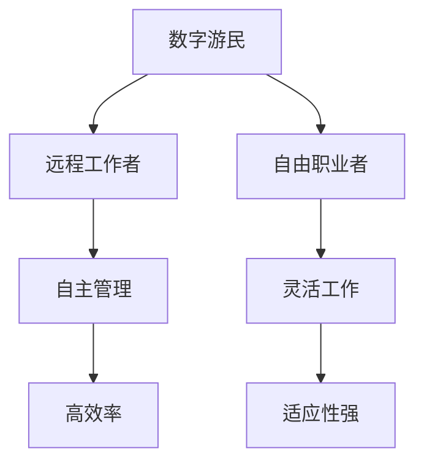

                 

### 《程序员的远程工作：环游世界的数字游民生活》

> **关键词**：远程工作、数字游民、程序员、数字生活、职业发展、时间管理、团队协作、财务规划、生活方式、国际视野

> **摘要**：
本文将深入探讨程序员的远程工作模式，尤其是数字游民生活方式。我们将从了解远程工作的兴起与挑战、成为一名数字游民、远程工作实践、长期规划、挑战与应对以及数字游民的可持续生活和未来趋势等多个方面进行探讨。文章旨在为有志于成为远程工作者的程序员提供全面的指导和建议。

### 第一部分：了解远程工作和数字游民生活

#### 第1章：远程工作的兴起与挑战

##### 1.1 远程工作的定义与类型

远程工作，顾名思义，是指不依赖于传统办公室环境，通过互联网和其他通信工具进行工作的一种工作模式。随着信息技术和互联网的快速发展，远程工作逐渐成为现代职场的一种重要形式。远程工作类型主要包括以下几种：

- **远程全职工作**：员工在固定的时间内远程完成工作任务，通常通过公司提供的远程工作设备和工具。
- **远程兼职工作**：员工在非固定的时间内远程完成特定的工作任务，如自由职业者、远程顾问等。
- **远程轮岗工作**：员工在一段时间内，交替在远程和办公室之间工作。
- **临时远程工作**：因特殊原因（如疫情、灾害等）而采取的临时远程工作模式。

##### 1.2 数字游民：生活与工作的双重自由

数字游民（Digital Nomad）是指在互联网的帮助下，将工作与旅行相结合，实现生活和工作自由的人群。数字游民的生活方式具有以下特点：

- **自由安排工作与生活**：数字游民可以根据自己的兴趣和时间，自由选择工作内容和工作地点。
- **灵活的工作时间**：数字游民无需受限于传统工作时间，可以根据自己的生物钟和工作效率来安排工作。
- **低成本的生活方式**：数字游民通常选择生活成本较低的城市或国家，以降低生活费用。

##### 1.3 远程工作的优点与挑战

远程工作具有许多优点，但也面临一些挑战。以下是远程工作的一些主要优点和挑战：

#### 第二部分：成为一名数字游民

#### 第2章：成为一名数字游民

##### 2.1 成为数字游民的条件与准备

成为数字游民需要具备一定的条件和做好充分的准备。以下是成为一名数字游民所需的一些条件和准备：

- **技术技能**：作为程序员，你需要具备扎实的技术技能，如编程语言、软件开发框架和工具等。
- **远程工作能力**：你需要适应远程工作环境，掌握远程协作工具和技能，提高工作效率。
- **自我管理能力**：数字游民需要具备良好的自我管理能力，包括时间管理、任务规划和目标设定。
- **适应性强**：数字游民需要具备较强的适应能力，以应对不同的工作环境和生活方式。

##### 2.2 确定职业方向：程序员的远程工作机会

作为程序员，你可以选择多种远程工作机会。以下是一些适合程序员的远程工作方向：

- **软件开发工程师**：参与软件项目的开发、测试和部署。
- **技术顾问**：为其他公司或团队提供技术支持和咨询服务。
- **远程教育**：通过在线平台教授编程语言和软件开发技能。
- **自由职业者**：在自由职业平台上承接项目，如Upwork、Freelancer等。

##### 2.3 技能提升与职业发展

为了在远程工作中取得成功，你需要不断提升自己的技能和职业发展。以下是一些提升技能和职业发展的建议：

- **持续学习**：跟随最新的技术趋势和行业动态，学习新的编程语言和框架。
- **参与开源项目**：参与开源项目，提高实际开发能力和团队协作能力。
- **获得认证**：通过考取专业认证，提高自己的职业竞争力。
- **建立个人品牌**：通过博客、社交媒体等渠道，分享自己的经验和知识，建立个人品牌。

### 第二部分：远程工作实践

#### 第3章：远程工作环境搭建

##### 3.1 远程办公设备的选择

选择合适的远程办公设备是远程工作成功的关键。以下是一些选择远程办公设备的建议：

- **笔记本电脑**：选择性能稳定、便携性好的笔记本电脑。
- **网络设备**：确保拥有稳定的网络连接，可以使用无线网络或移动网络。
- **办公软件**：选择适合远程工作的办公软件，如Microsoft Office、Google Workspace等。
- **办公家具**：为提高工作效率，选择舒适的办公椅、书桌等家具。

##### 3.2 工作效率提升技巧

在远程工作中，提高工作效率是关键。以下是一些提升工作效率的技巧：

- **时间管理**：使用番茄工作法、GTD（Getting Things Done）等时间管理方法，合理安排工作时间。
- **任务管理**：使用Trello、Asana等任务管理工具，跟踪任务进度和优先级。
- **沟通协作**：使用Slack、Zoom等沟通协作工具，与团队成员保持有效沟通。
- **避免干扰**：设定工作区域，避免家庭或其他干扰，提高专注力。

##### 3.3 时间管理策略

时间管理是远程工作中的一项重要技能。以下是一些时间管理策略：

- **制定日程表**：提前制定每天的工作计划，明确任务和时间安排。
- **优先级排序**：将任务按照重要性和紧急性进行排序，先完成重要且紧急的任务。
- **休息与锻炼**：合理安排休息时间和锻炼时间，保持身心健康。
- **自我监督**：使用时间跟踪工具，如RescueTime，监控自己的时间使用情况，调整工作习惯。

### 第三部分：远程工作实践

#### 第4章：远程团队协作

##### 4.1 远程协作工具与平台

远程团队协作需要依赖各种协作工具和平台。以下是一些常用的远程协作工具和平台：

- **项目管理工具**：如Jira、Trello、Asana等，用于跟踪项目进度和任务分配。
- **沟通工具**：如Slack、Microsoft Teams、Zoom等，用于实时沟通和会议。
- **文档共享工具**：如Google Drive、Dropbox、OneDrive等，用于共享文档和文件。
- **代码管理工具**：如Git、GitHub、GitLab等，用于版本控制和代码协作。

##### 4.2 远程团队沟通技巧

在远程团队中，有效沟通是确保团队协作顺利进行的关键。以下是一些远程团队沟通技巧：

- **明确沟通目标**：在沟通前明确目标，确保沟通内容具有针对性。
- **保持定期沟通**：定期召开团队会议，分享进展、讨论问题和规划下一步行动。
- **使用多种沟通方式**：结合文字、语音、视频等多种沟通方式，确保信息传递清晰。
- **尊重文化差异**：了解并尊重不同团队成员的文化背景，避免文化冲突。

##### 4.3 跨文化沟通与协作

随着远程团队越来越国际化，跨文化沟通与协作变得尤为重要。以下是一些跨文化沟通与协作的建议：

- **尊重文化差异**：了解并尊重不同文化的工作习惯、沟通方式和价值观。
- **保持开放心态**：对不同的观点和意见持开放态度，积极寻求共识。
- **明确沟通规则**：制定并遵循团队内部的沟通规则，确保沟通效率。
- **利用多元资源**：利用多元的文化资源，如跨文化培训、文化指南等，提高跨文化沟通能力。

### 第四部分：远程工作的法律与税务问题

#### 第5章：远程工作的法律与税务问题

##### 5.1 不同国家远程工作的法律框架

远程工作在全球范围内越来越普及，但不同国家对远程工作的法律框架存在差异。以下是一些主要国家对远程工作的法律框架：

- **美国**：美国没有特定的远程工作法律，但各州可能有相关法规，如工资支付和劳动保护。
- **欧洲**：欧洲国家普遍支持远程工作，如德国、荷兰等，但需遵守工作时间、休息时间和工资保障等法规。
- **亚洲**：亚洲国家如日本、韩国等，对远程工作有较为严格的规定，如工作时间、加班工资等。

##### 5.2 税务问题及解决方案

远程工作涉及税务问题，需要遵守所在国家和居住国家的税务规定。以下是一些税务问题及解决方案：

- **税务居民身份**：确定个人的税务居民身份，根据所在国家税法缴纳个人所得税。
- **税籍迁移**：如需迁移税籍，提前了解目的国家的税法，办理相关手续。
- **税籍豁免**：了解并申请税籍豁免，减少税务负担。
- **税收优惠**：关注所在国家和居住国家的税收优惠政策，合理规划税务安排。

### 第五部分：数字游民的生活方式

#### 第6章：数字游民的生活方式

##### 6.1 健康管理

健康管理是数字游民生活中不可忽视的重要方面。以下是一些健康管理建议：

- **保持规律作息**：合理安排工作时间，保证充足的睡眠。
- **饮食健康**：保持健康的饮食习惯，多吃蔬菜、水果和坚果。
- **适量运动**：定期进行运动，如跑步、游泳、瑜伽等，提高身体素质。
- **心理健康**：关注心理健康，定期进行心理辅导，保持良好的心态。

##### 6.2 旅行规划

旅行是数字游民生活中的一大亮点。以下是一些旅行规划建议：

- **选择目的地**：根据兴趣和预算，选择合适的旅行目的地。
- **制定行程**：提前制定旅行行程，包括景点、住宿和餐饮等。
- **安全第一**：注意旅行安全，了解目的地的文化和风俗。
- **灵活调整**：根据实际情况，灵活调整旅行计划。

##### 6.3 社交与个人发展

社交与个人发展是数字游民生活中不可或缺的一部分。以下是一些建议：

- **建立人脉**：参加线上线下的技术会议、研讨会等活动，结识同行和行业专家。
- **学习新技能**：利用在线课程、书籍等资源，不断学习新技能，提升个人竞争力。
- **参与社区**：加入数字游民社区，分享经验和资源，帮助他人成长。
- **保持开放心态**：对待新事物和新观点持开放心态，积极拓展视野。

### 第六部分：数字游民的长期规划

#### 第7章：财务规划与管理

##### 7.1 收入来源与理财策略

财务规划是数字游民长期规划中至关重要的一环。以下是一些收入来源和理财策略：

- **多元化收入来源**：通过远程工作、自由职业、投资等方式实现收入多元化。
- **理财策略**：合理规划投资组合，包括股票、基金、债券等，降低风险，实现稳健增值。
- **储蓄习惯**：养成定期储蓄的习惯，建立紧急备用金，应对突发情况。
- **财务规划工具**：使用财务规划工具，如预算管理软件、投资模拟器等，帮助进行财务规划。

##### 7.2 财务自由之路

财务自由是数字游民追求的目标之一。以下是一些实现财务自由的建议：

- **提高收入**：通过提升技能、增加工作经验和拓展业务等方式提高收入。
- **控制开支**：合理规划开支，避免不必要的消费，降低生活成本。
- **投资理财**：通过投资理财，实现资产增值，增加被动收入。
- **持续学习**：关注财经知识，不断提升自己的投资理财能力。

### 第七部分：职业发展与国际视野

#### 第8章：职业发展与国际视野

##### 8.1 远程工作的职业成长路径

远程工作者可以遵循以下职业成长路径：

- **初级阶段**：积累工作经验，提升技术技能，适应远程工作环境。
- **中级阶段**：担任项目负责人或技术主管，带领团队完成项目。
- **高级阶段**：成为行业专家或技术顾问，为其他公司或团队提供专业指导。

##### 8.2 国际职场的机会与挑战

在国际职场中，远程工作者面临以下机会与挑战：

- **机会**：
  - 获得更高的薪资和福利待遇。
  - 拓展国际视野，了解全球市场动态。
  - 结识来自不同国家的同事，建立国际人脉。
- **挑战**：
  - 跨文化沟通与协作。
  - 适应不同的工作方式和习惯。
  - 需要具备更强的自我管理和自律能力。

### 第八部分：家庭与工作平衡

#### 第9章：家庭与工作平衡

##### 9.1 照顾孩子与工作

作为数字游民，照顾孩子与工作之间的平衡是一项挑战。以下是一些建议：

- **灵活安排工作时间**：根据孩子的作息时间，灵活调整工作时间，确保陪伴孩子的同时，完成工作任务。
- **远程教育**：利用在线教育资源，辅导孩子的学习，提高学习效果。
- **家庭协作**：与家人共同分担家务和照顾孩子的责任，确保家庭和工作之间的平衡。

##### 9.2 照顾老人与工作

在照顾老人的同时，确保工作不受影响，需要以下策略：

- **制定详细计划**：提前规划好每天的工作任务和照顾老人的时间，确保两者兼顾。
- **寻求家庭支持**：与家人沟通，寻求他们的理解和支持，共同分担照顾老人的责任。
- **利用社会资源**：利用社区养老资源，如日间照料中心、养老院等，减轻家庭负担。

### 第九部分：数字游民的挑战与应对

#### 第10章：解决远程工作的挑战

##### 10.1 隔离与孤独感的应对

远程工作可能导致隔离和孤独感。以下是一些应对策略：

- **建立社交网络**：通过社交媒体、线上社区等渠道，结识志同道合的朋友，分享经验和心得。
- **定期聚会**：与远程工作伙伴或朋友定期线上聚会，保持社交互动。
- **参加线下活动**：参加线上或线下的社交活动，拓宽人际圈子。
- **培养兴趣爱好**：培养兴趣爱好，如运动、阅读、绘画等，丰富自己的生活。

##### 10.2 远程工作的压力管理

远程工作可能带来压力。以下是一些压力管理策略：

- **时间管理**：合理安排工作时间，避免过度工作，确保充足的休息和娱乐时间。
- **情绪调节**：学会情绪调节技巧，如深呼吸、冥想、瑜伽等，缓解压力。
- **寻求支持**：与家人、朋友或专业人士沟通，寻求他们的支持和建议。
- **积极心态**：保持积极的心态，看待工作中的困难和挑战，寻找解决问题的方法。

##### 10.3 持续学习与适应变化

在远程工作中，持续学习和适应变化是关键。以下是一些建议：

- **定期学习**：利用线上课程、研讨会等资源，定期学习新技能和知识。
- **适应变化**：保持开放的心态，适应工作环境和工作内容的变化。
- **自我评估**：定期进行自我评估，了解自己的优势和不足，制定相应的改进计划。
- **保持创新**：鼓励创新思维，积极探索新的工作方法和工具，提高工作效率。

### 第十部分：数字游民的可持续生活

#### 第11章：数字游民的可持续生活

##### 11.1 环保意识的远程工作

在远程工作中，数字游民可以采取以下措施，提高环保意识：

- **节能减排**：使用节能设备，减少能源消耗。
- **绿色出行**：选择公共交通或共享出行，减少碳排放。
- **垃圾分类**：了解并遵守当地的垃圾分类规定，积极参与垃圾分类。

##### 11.2 社区参与与网络建设

数字游民可以通过以下方式参与社区和网络建设：

- **志愿服务**：参与社区志愿服务活动，为社区发展贡献力量。
- **线上社区**：加入线上社区，分享经验和资源，帮助他人成长。
- **组织活动**：组织线上或线下的活动，促进数字游民之间的交流和合作。

##### 11.3 可持续生活方式

数字游民可以采取以下措施，实现可持续生活方式：

- **节约资源**：合理使用水资源、电能等资源，减少浪费。
- **绿色消费**：选择环保产品，减少对环境的负面影响。
- **环保教育**：关注环保知识，提高环保意识，影响身边的人。

### 第十一部分：数字游民的可持续生活

#### 第12章：数字游民的可持续生活

##### 12.1 数字游民趋势分析

随着互联网和信息技术的发展，数字游民生活方式越来越受到关注。以下是对数字游民趋势的分析：

- **技术进步**：5G、人工智能、物联网等技术的发展，为数字游民提供了更好的工作环境和生活体验。
- **全球合作**：全球化进程加速，跨国远程工作项目增多，数字游民有机会参与到国际项目中。
- **政策支持**：越来越多国家和地区出台政策，支持远程工作和数字游民生活方式。
- **可持续发展**：数字游民越来越关注环保、社会责任和可持续发展，倡导绿色生活和环保意识。

##### 12.2 未来工作模式探索

未来，远程工作和数字游民生活方式将进一步发展，以下是对未来工作模式的探索：

- **混合办公**：远程工作与办公室工作的结合，实现灵活的工作模式。
- **终身学习**：持续学习将成为数字游民必备的能力，适应不断变化的工作需求。
- **技能多元化**：数字游民需要掌握多种技能，提高自己的职业竞争力。
- **虚拟现实**：虚拟现实技术的应用，将使远程工作环境更加逼真，提升工作效率。

### 附录

#### 附录A：远程工作与数字游民资源列表

以下是远程工作与数字游民常用的在线工具、社区和书籍资源：

- **在线工具和平台**：
  - 项目管理：Trello、Asana、Jira
  - 沟通协作：Slack、Microsoft Teams、Zoom
  - 文档共享：Google Drive、Dropbox、OneDrive
  - 代码管理：GitHub、GitLab、Bitbucket

- **数字游民社区与论坛**：
  - NomadList
  - Remote.co
  - Digital Nomads Forum

- **相关书籍与资料推荐**：
  - 《远程工作的艺术》（The Art of Working from Home）- Tom Huckerby
  - 《数字游民：重塑工作与生活的全球时代》（Digital Nomad: Living and Working Around the World）- Andy Hargreaves
  - 《远程工作：如何成为一名成功的远程工作者》（Remote Work: How to Work from Home and Make a Living）- Jason Fried

### 结语

远程工作和数字游民生活方式为程序员提供了前所未有的机遇和挑战。通过合理规划和管理，数字游民可以享受到工作与生活的双重自由，实现个人价值和职业发展的双赢。希望本文能为有志于成为数字游民的程序员提供有益的指导和建议，助力你们在远程工作和数字游民生活中取得成功。

### 作者信息

- **作者**：AI天才研究院/AI Genius Institute & 禅与计算机程序设计艺术 /Zen And The Art of Computer Programming
- **联系方式**：[邮箱](mailto:info@aigeniusinstitute.com) & [社交媒体](https://www.linkedin.com/in/ai-genius-institute/)

---

### 核心概念与联系

### 数字游民

**Mermaid 流程图：**



### 核心算法原理讲解

### 时间管理策略

**伪代码：**

```python
def time_management_strategy():
    # 初始化每日工作时间和休息时间
    work_hours = 8
    break_time = 1

    # 计算工作时间与休息时间配比
    total_hours = work_hours + (break_time * 3)

    # 制定每日工作计划
    daily_plan = {
        "morning": ["9:00 - 12:00", "1:00 - 4:00"],
        "evening": ["6:00 - 9:00"]
    }

    # 执行时间管理策略
    for time_block in daily_plan.values():
        for hour in time_block:
            if hour == "break":
                print("休息时间")
            else:
                print("工作时间：", hour)
```

**详细讲解：**

该时间管理策略的核心是合理规划每日的工作和休息时间，以提高工作效率和生活质量。首先，定义每日的工作时间和休息时间，通常建议每天工作8小时，包括三个1小时的休息时间。计算总时间，然后根据工作时间制定每日的工作计划。

在执行时间管理策略时，根据每日工作计划，逐个执行每个时间段的工作或休息。如果时间段是工作时间，则打印“工作时间：XX:XX”；如果是休息时间，则打印“休息时间”。

**数学模型和数学公式**

### 财务规划模型

**公式：** \[
\text{月度储蓄} = \frac{\text{月度收入} - (\text{固定开支} + \text{变动开支})}{2}
\]

**详细讲解：**

该公式描述了如何计算月度储蓄。月度收入代表个人的总收入，固定开支包括房租、生活费等必需开销，变动开支包括娱乐、购物等可变开销。储蓄的计算方法是将月度收入减去固定和变动开支后的余额，并按月度进行分配，以确保长期的财务稳定。

**举例说明：**

假设某人的月度收入为10,000元，固定开支为3,000元，变动开支为1,500元。根据上述公式，月度储蓄为：

\[
\text{月度储蓄} = \frac{10,000 - (3,000 + 1,500)}{2} = \frac{5,500}{2} = 2,750 \text{元}
\]

**项目实战**

### 远程协作工具配置案例

#### 开发环境搭建

1. **安装Visual Studio Code (VSCode) 编辑器**

   - 访问 [VSCode官网](https://code.visualstudio.com/) 下载并安装。

2. **安装必要的扩展插件**

   - 安装 "Git", "Python", "JavaScript" 等常用扩展。

3. **配置远程SSH连接**

   - 生成SSH密钥：`ssh-keygen -t rsa -b 4096`
   - 将公钥添加到GitHub、GitLab等平台的SSH密钥设置中。

#### 源代码实现

**示例：使用Git进行版本控制**

```python
# 示例：使用Git进行版本控制
import subprocess

def commit_and_push(code, message):
    # 提交代码到本地仓库
    subprocess.run(["git", "add", "."])
    subprocess.run(["git", "commit", "-m", message])
    
    # 推送代码到远程仓库
    subprocess.run(["git", "push"])

# 执行示例
commit_and_push(code=code_example, message="Update: Fixed bug in function X")
```

**代码解读与分析**

该代码示例展示了如何使用Python调用Git命令进行版本控制。首先，使用 `git add .` 将所有更改添加到暂存区。然后，使用 `git commit -m` 提交更改，并附上修改说明。最后，使用 `git push` 将本地仓库的更改推送到远程仓库。

这种方法确保了代码的可追溯性和团队协作的便捷性。开发者可以在本地进行代码编写和调试，并通过Git与团队成员共享代码库，从而提高工作效率和团队协作效果。

