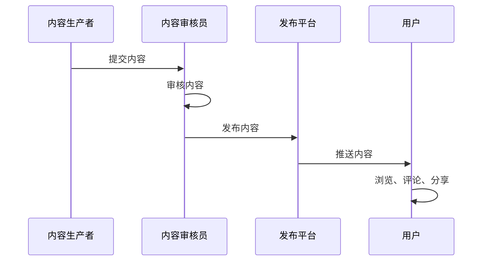

                 

## 《程序员知识付费的内容生产流程优化》

### 关键词：知识付费、内容生产、程序员、流程优化、技术博客、算法、实战

#### 摘要：
本文旨在探讨程序员在知识付费领域的角色以及内容生产流程的优化策略。通过分析知识付费市场的现状，阐述内容生产者的能力建设，内容创作与策划、内容质量保障、内容发布与推广、版权管理与收益分配等环节，并结合具体案例和实战经验，提供一套系统化的内容生产流程优化方案，旨在提高程序员的创作效率和市场竞争力。

---

### 目录大纲

#### 第一部分：内容生产流程概述

1. **第1章：知识付费市场与内容生产**
    - **1.1 知识付费市场现状分析**
    - **1.2 内容生产者角色定位**
    - **1.3 内容生产流程的关键环节**

2. **第2章：内容生产者的能力建设**
    - **2.1 技术技能提升**
    - **2.2 写作与表达能力培养**
    - **2.3 市场敏锐度提升**

#### 第二部分：内容创作与策划

3. **第3章：内容创作方法论**
    - **3.1 创意构思与选题策划**
    - **3.2 内容结构设计**
    - **3.3 内容创作流程**

4. **第4章：内容质量保障**
    - **4.1 内容审核与校对**
    - **4.2 用户体验优化**
    - **4.3 内容迭代与更新**

#### 第三部分：内容发布与推广

5. **第5章：内容发布策略**
    - **5.1 发布渠道选择**
    - **5.2 发布时间优化**
    - **5.3 社群运营与互动**

6. **第6章：内容推广技巧**
    - **6.1 社交媒体营销**
    - **6.2 KOL合作与影响力运营**
    - **6.3 数据分析与效果评估**

#### 第四部分：版权管理与收益分配

7. **第7章：版权保护与风险控制**
    - **7.1 版权法律法规解析**
    - **7.2 版权保护措施**
    - **7.3 风险识别与应对策略**

8. **第8章：收益分配与商业模式**
    - **8.1 收益来源分析**
    - **8.2 商业模式探索**
    - **8.3 收益分配策略**

#### 第五部分：案例分析与实战指南

9. **第9章：成功案例解读**
    - **9.1 案例一：知识付费平台的运营策略**
    - **9.2 案例二：个人知识博主的经验分享**
    - **9.3 案例三：企业内部知识付费的实践**

10. **第10章：实战指南与策略制定**
    - **10.1 实战指南**
    - **10.2 策略制定与调整**
    - **10.3 不断优化与提升**

#### 附录

11. **附录 A：知识付费相关资源与工具**
    - **11.1 主流知识付费平台介绍**
    - **11.2 内容创作与编辑工具**
    - **11.3 数据分析与效果评估工具**

12. **附录 B：常用术语解释**
    - **12.1 知识付费相关术语**
    - **12.2 内容营销相关术语**
    - **12.3 数据分析相关术语**

### 内容生产流程 Mermaid 流程图



### 核心算法原理讲解

#### 内容审核算法伪代码

```python
function content_review(content):
    if is_spam(content):
        return "内容审核未通过，存在垃圾信息"
    elif contains_toxicity(content):
        return "内容审核未通过，包含恶意言论"
    else:
        return "内容审核通过"

function is_spam(content):
    # 通过机器学习模型判断内容是否为垃圾信息
    return model.predict(content) == "spam"

function contains_toxicity(content):
    # 通过自然语言处理技术判断内容是否包含恶意言论
    return model.predict(content) == "toxic"
```

#### 用户满意度评分模型

$$
User_Satisfaction = \frac{1}{N} \sum_{i=1}^{N} (5 - Distaste_i)
$$

其中，$N$ 为用户数量，$Distaste_i$ 为第 $i$ 个用户的满意度评分（0-5分制）。

### 项目实战

#### 知识付费平台内容发布功能实现

**开发环境搭建：** 
- 开发语言：Python
- 后端框架：Flask
- 前端框架：Vue.js

**源代码实现：**

**后端（Flask）：**

```python
from flask import Flask, request, jsonify
from content审核 import content_review

app = Flask(__name__)

@app.route('/publish', methods=['POST'])
def publish_content():
    content_data = request.get_json()
    review_result = content_review(content_data['content'])
    return jsonify({'result': review_result})

if __name__ == '__main__':
    app.run(debug=True)
```

**前端（Vue.js）：**

```html
<template>
  <div>
    <h1>发布内容</h1>
    <textarea v-model="content"></textarea>
    <button @click="submitContent">提交内容</button>
  </div>
</template>

<script>
export default {
  data() {
    return {
      content: '',
    };
  },
  methods: {
    submitContent() {
      // 调用后端接口提交内容
      // ...
    },
  },
};
</script>
```

**代码解读与分析：**

- 后端代码通过 Flask 框架接收前端提交的内容，调用内容审核函数进行内容审核，并返回审核结果。
- 前端代码通过 Vue.js 构建用户界面，提供文本输入框和提交按钮，用户输入内容后点击提交按钮，前端将内容发送到后端进行审核。
- 代码实现了内容发布的简单功能，实际项目还需要考虑更多的功能，如用户认证、权限管理、内容分类等。

**注意事项：**
- 开发环境搭建需要安装相关依赖，如 Flask、Vue.js 等。
- 内容审核函数 `content_review` 需要实现具体的审核逻辑，可以基于机器学习模型进行内容审核。
- 前后端交互需要使用合适的 API 设计，确保数据传输的安全和可靠性。

---

接下来，我们将深入探讨内容生产流程的各个部分，为程序员提供一套系统化的优化方案。通过逐步分析和推理，我们将揭示每个环节中的关键因素，帮助程序员在知识付费领域取得更大的成功。

---

### 第一部分：内容生产流程概述

在知识付费领域，内容生产流程是至关重要的一环。一个高效、合理的内容生产流程不仅能够提高内容的生产效率，还能确保内容的质量和价值。本部分将首先分析知识付费市场的现状，然后定位内容生产者的角色，并详细阐述内容生产流程的关键环节。

#### 1.1 知识付费市场现状分析

知识付费市场近年来呈现出快速增长的趋势，主要得益于以下几个方面：

1. **在线教育的普及**：随着互联网技术的发展，在线教育平台迅速崛起，用户对于专业知识的渴求不断提升。
2. **技能提升需求增加**：在竞争激烈的职场环境中，个人技能的提升成为职场发展的关键，越来越多的用户愿意为优质的内容付费。
3. **内容消费习惯改变**：随着移动互联网的普及，用户逐渐适应了碎片化的内容消费方式，知识付费平台提供了丰富的学习资源，满足了用户的需求。
4. **技术进步驱动**：大数据、人工智能等技术的应用，使得知识付费平台能够提供更加精准的内容推荐和个性化服务。

根据市场调研数据，知识付费市场的用户规模和市场规模都在持续增长。预计未来几年，知识付费市场将继续保持高速增长，成为数字经济的重要组成部分。

#### 1.2 内容生产者角色定位

在知识付费市场中，内容生产者扮演着至关重要的角色。他们不仅是知识的传播者，更是市场价值的创造者。具体来说，内容生产者的角色定位包括以下几个方面：

1. **知识专家**：内容生产者通常在某一领域具备深厚的专业知识和丰富的实践经验，能够为用户提供高质量的专业知识。
2. **内容创作者**：内容生产者需要具备优秀的写作和表达能力，能够将专业知识转化为易于理解的内容，满足用户的需求。
3. **市场观察者**：内容生产者需要密切关注市场动态，了解用户需求，及时调整内容创作方向，以满足市场的需求。
4. **平台合作者**：内容生产者与知识付费平台通常建立合作关系，通过平台的推广和运营，实现内容的传播和价值的最大化。

#### 1.3 内容生产流程的关键环节

内容生产流程可以分为以下几个关键环节：

1. **内容策划**：包括选题策划、内容定位、目标受众分析等。这一环节决定了内容创作的方向和目标，是内容生产的基础。
2. **内容创作**：包括资料搜集、内容撰写、编辑校对等。这一环节是内容生产的核心，直接影响内容的质量和用户体验。
3. **内容审核**：包括内容审核、质量评估、版权检查等。这一环节确保了内容的合规性和质量，是内容发布的前提。
4. **内容发布**：包括内容发布、渠道选择、发布策略等。这一环节决定了内容的传播范围和速度，是内容价值实现的保障。
5. **内容推广**：包括内容推广、营销活动、用户互动等。这一环节提高了内容的知名度和影响力，是内容价值持续提升的关键。

通过以上分析，我们可以看出，内容生产流程的优化对于提高内容质量和生产效率至关重要。在接下来的章节中，我们将进一步探讨内容生产者的能力建设、内容创作与策划、内容质量保障、内容发布与推广、版权管理与收益分配等关键环节，为程序员提供一套系统化的内容生产流程优化方案。

---

### 第二部分：内容生产者的能力建设

在知识付费领域，内容生产者的能力建设至关重要。一个优秀的内容生产者不仅需要具备扎实的技术基础和写作能力，还需要具备市场敏锐度和良好的用户体验设计能力。本部分将详细讨论内容生产者在技术技能、写作与表达能力、市场敏锐度等方面的提升策略。

#### 2.1 技术技能提升

技术技能的提升是内容生产者的核心能力之一，尤其是在程序员群体中。以下是一些提升技术技能的策略：

1. **持续学习与积累**：技术更新迅速，程序员需要持续学习新的技术和工具。可以通过参加线上课程、阅读技术书籍、参与开源项目等方式不断积累经验。
2. **实践与应用**：理论知识固然重要，但实际应用能力更为关键。通过实际项目的开发，可以将所学知识应用到实践中，提升解决问题的能力。
3. **技术交流与合作**：参与技术社区、参加技术沙龙和研讨会，与同行进行技术交流，可以拓宽视野，学习到更多的技术见解和经验。
4. **代码审查与优化**：定期进行代码审查，学习他人的代码风格和优化技巧，不断提高自己的编码能力。

#### 2.2 写作与表达能力培养

写作与表达能力是内容生产者的另一项重要技能。以下是一些提升写作与表达能力的策略：

1. **系统学习写作技巧**：可以通过参加写作课程、阅读写作书籍、学习优秀的文章和博客，掌握写作的基本技巧和风格。
2. **多写多练**：写作能力的提升需要不断的实践。可以通过写技术博客、文章、邮件等方式，锻炼自己的写作和表达能力。
3. **阅读与分析**：广泛阅读各类文章，特别是技术文章和畅销书，分析文章的结构和写作手法，吸收并应用到自己的写作中。
4. **获得反馈与改进**：将自己的作品分享给同事或朋友，听取他们的意见和反馈，不断改进自己的写作风格和表达能力。

#### 2.3 市场敏锐度提升

市场敏锐度是内容生产者成功的关键之一。以下是一些提升市场敏锐度的策略：

1. **市场调研与分析**：定期进行市场调研，分析行业趋势、用户需求和市场动态，为内容创作提供依据。
2. **用户反馈与互动**：与用户保持密切的互动，通过问卷调查、用户反馈等方式了解用户的需求和喜好，及时调整内容创作方向。
3. **数据分析与利用**：利用数据分析工具，对用户行为和内容效果进行跟踪和分析，发现用户的兴趣点和内容优化的方向。
4. **行业交流与学习**：参加行业会议、技术大会，与行业专家和同行交流，了解行业的最新动态和发展趋势。

通过以上策略，内容生产者可以在技术技能、写作与表达能力、市场敏锐度等方面不断提升自己，为知识付费领域的内容生产提供有力支持。在接下来的章节中，我们将继续探讨内容创作与策划、内容质量保障、内容发布与推广等环节，帮助程序员构建系统化的内容生产流程。

---

### 第三部分：内容创作与策划

在内容创作与策划阶段，内容生产者需要从创意构思、选题策划、内容结构设计等多个方面进行系统性的工作，以确保最终的内容能够满足用户需求，提高内容的质量和影响力。以下是对这些关键环节的详细探讨。

#### 3.1 创意构思与选题策划

创意构思是内容创作的基础，一个独特而有吸引力的创意能够为内容带来更多的关注和认可。以下是一些创意构思与选题策划的策略：

1. **用户需求分析**：通过对用户需求的分析，了解用户真正关心的问题和痛点，从而构思出能够解决用户需求的内容。
2. **热点话题追踪**：关注行业热点和趋势，结合热点进行内容创作，能够提高内容的时效性和关注度。
3. **差异化定位**：在选题策划时，要充分考虑自身的独特优势和定位，避免与其他内容生产者产生直接竞争，找到差异化的切入点。
4. **故事化叙述**：利用故事化的叙述方式，将专业知识和案例融入到故事中，使内容更加生动有趣，更容易引起用户的共鸣。

#### 3.2 内容结构设计

内容结构设计是确保内容逻辑清晰、易于理解的关键。以下是一些内容结构设计的策略：

1. **明确主题与目标**：在内容创作之初，就需要明确内容的主题和目标，确保整个内容围绕主题进行展开，避免偏离主题。
2. **逻辑清晰**：通过有序的结构设计，使内容从问题提出、解决方案到实际应用，逻辑清晰，层次分明。
3. **合理分段**：将内容划分为不同的段落，每个段落都有明确的标题和内容，便于用户阅读和理解。
4. **图表与代码示例**：合理使用图表和代码示例，帮助用户更好地理解复杂的技术概念和算法实现。

#### 3.3 内容创作流程

内容创作是一个系统性、持续性的工作，以下是一个高效的内容创作流程：

1. **资料搜集**：在开始写作之前，需要对相关的资料进行搜集和整理，确保内容的准确性和全面性。
2. **初步撰写**：根据选题和结构设计，进行初步的内容撰写，将思路和想法转化为文字。
3. **编辑与校对**：完成初稿后，进行多轮的编辑和校对，确保内容的语言通顺、逻辑清晰，无错别字和语法错误。
4. **用户反馈**：将内容初稿分享给用户，收集用户反馈，根据反馈进行调整和优化。
5. **发布与推广**：完成最终的修改后，将内容发布到相应的平台，并制定推广策略，提高内容的曝光率和影响力。

通过以上策略，内容生产者可以有效地进行创意构思与选题策划、内容结构设计、内容创作流程等环节的工作，确保内容的高质量和用户满意度。在接下来的章节中，我们将进一步探讨内容质量保障、内容发布与推广等关键环节，为程序员提供全面的优化方案。

---

### 第四部分：内容质量保障

内容质量是知识付费的核心竞争力，直接影响用户的满意度和内容的传播效果。为了确保内容的高质量和用户满意度，内容生产者需要在内容审核与校对、用户体验优化、内容迭代与更新等环节进行严格的管理和优化。以下是对这些关键环节的详细探讨。

#### 4.1 内容审核与校对

内容审核与校对是保证内容质量的重要环节，以下是一些具体的策略：

1. **多级审核制度**：建立多级审核制度，包括初步审核、专业审核和最终审核。每个审核环节都有明确的审核标准和流程，确保内容的质量和合规性。
2. **专业审核团队**：组建专业的审核团队，成员应具备丰富的行业经验和专业知识，能够从技术、法律、伦理等多个角度对内容进行审核。
3. **自动化审核工具**：利用自动化审核工具，如文本分析软件、内容安全系统等，对内容进行初步筛选和检测，提高审核效率和准确性。
4. **用户反馈机制**：建立用户反馈机制，用户可以随时提交内容质量问题，审核团队根据用户反馈进行进一步的审核和调整。

#### 4.2 用户体验优化

用户体验是内容质量的重要组成部分，以下是一些用户体验优化的策略：

1. **用户需求分析**：定期对用户进行需求调研，了解用户的关注点和需求，根据用户需求调整内容创作方向。
2. **内容易读性**：优化内容的表达方式，使内容更加简洁明了，避免使用过于复杂的术语和句子结构，提高内容的可读性。
3. **交互设计**：优化用户界面和交互设计，使用户能够方便快捷地获取和阅读内容，提供友好的评论和分享功能。
4. **反馈与互动**：鼓励用户参与内容讨论和互动，建立问答社区或讨论区，提高用户的参与度和满意度。

#### 4.3 内容迭代与更新

内容的迭代与更新是保持内容活力和用户粘性的关键，以下是一些具体的策略：

1. **定期更新**：制定内容更新计划，定期对现有内容进行更新和优化，保持内容的时效性和实用性。
2. **版本控制**：建立版本控制机制，每次内容更新都记录版本信息，方便后续的维护和跟踪。
3. **用户反馈**：收集用户的反馈和建议，根据用户反馈调整内容的结构和内容，提高内容的用户满意度。
4. **数据分析**：利用数据分析工具，对用户行为和内容效果进行跟踪和分析，发现内容优化的方向和重点。

通过以上策略，内容生产者可以确保内容的质量和用户满意度，提高内容的传播效果和商业价值。在内容质量保障的基础上，我们将进一步探讨内容发布与推广、版权管理与收益分配等关键环节，为程序员提供全面的优化方案。

---

### 第五部分：内容发布与推广

在内容发布与推广环节，内容生产者需要制定有效的发布策略，选择合适的发布渠道，优化发布时间，并注重社群运营与互动。以下是对这些关键环节的详细探讨。

#### 5.1 内容发布策略

内容发布策略是确保内容能够有效触达目标用户的重要步骤。以下是一些具体的策略：

1. **选择合适的发布渠道**：根据内容类型和目标用户，选择适合的发布渠道。例如，技术博客可以选择专业社区、技术论坛等，教育培训内容可以选择在线教育平台。
2. **制定发布计划**：制定详细的发布计划，包括发布时间、频率和内容类型，确保内容发布的有序性和规律性。
3. **多样化发布形式**：除了文字内容，还可以尝试发布视频、音频、直播等多种形式，丰富内容表达方式，提高用户的阅读兴趣。
4. **跨平台推广**：在多个平台上发布内容，通过社交媒体、专业社区、博客等渠道，扩大内容的曝光率和影响力。

#### 5.2 发布时间优化

发布时间优化是提高内容传播效果的关键。以下是一些优化策略：

1. **了解用户行为**：通过数据分析，了解用户在各个时间段的活动规律，选择用户活跃度高的时间进行发布。
2. **节假日与特殊事件**：在节假日或特殊事件期间发布内容，可以借助用户的关注度，提高内容的传播效果。
3. **时间测试**：对不同时间段的发布效果进行测试，根据数据反馈调整发布时间，找到最佳的发布时间点。

#### 5.3 社群运营与互动

社群运营与互动是提高用户粘性和内容影响力的有效手段。以下是一些具体的策略：

1. **建立社群平台**：建立专属的社群平台，如微信群、QQ群、Discord服务器等，方便用户交流和讨论。
2. **互动内容设计**：设计互动内容，如问答、讨论、投票等，激发用户的参与热情，增强社群的活跃度。
3. **用户反馈与回应**：及时回应用户的反馈和提问，建立良好的互动氛围，增强用户的归属感和满意度。
4. **社群推广**：利用现有用户资源，通过口碑传播、推荐等方式，扩大社群的影响力。

通过以上策略，内容生产者可以有效地发布和推广内容，提高内容的传播效果和用户满意度。在内容发布与推广的基础上，我们将进一步探讨内容推广技巧，包括社交媒体营销、KOL合作与影响力运营等，为程序员提供全面的推广方案。

---

### 第六部分：内容推广技巧

在内容推广过程中，有效的推广技巧能够显著提高内容的曝光率和影响力。以下我们将探讨内容推广技巧，包括社交媒体营销、KOL合作与影响力运营、以及数据分析和效果评估的方法。

#### 6.1 社交媒体营销

社交媒体营销是内容推广的重要手段，以下是一些具体的策略：

1. **选择合适的平台**：根据内容类型和目标用户，选择适合的社交媒体平台。例如，技术类内容可以在Twitter、GitHub和LinkedIn上推广，教育培训类内容则适合在Facebook和Instagram上推广。
2. **发布高质量内容**：发布高质量、有价值的内容，利用图片、视频、动画等多种形式，吸引用户的注意力。
3. **定期互动**：与用户保持定期互动，通过评论、点赞、分享等方式，增加用户的参与度和内容的传播范围。
4. **利用热点**：结合热门话题和事件，进行相关内容的推广，借助热点增加内容的曝光率。

#### 6.2 KOL合作与影响力运营

与意见领袖（KOL）合作是扩大内容影响力的有效方式。以下是一些具体的策略：

1. **寻找合适的KOL**：根据内容主题和目标用户，寻找在相关领域有影响力的KOL进行合作。可以通过数据分析、用户调研等方式，找到具有广泛影响力的KOL。
2. **定制合作内容**：与KOL合作，定制专属的内容推广方案，包括撰写推荐文章、录制视频等，确保内容与KOL的品牌形象和风格相契合。
3. **互动与维护**：与KOL保持良好的互动关系，定期沟通和合作，维护长期的合作关系。
4. **效果跟踪**：通过数据分析和效果评估，跟踪合作内容的传播效果，优化合作策略。

#### 6.3 数据分析与效果评估

数据分析和效果评估是内容推广的重要环节，以下是一些具体的策略：

1. **设置指标**：根据推广目标，设置相应的关键指标（KPI），如曝光量、点击率、转化率等。
2. **数据收集**：通过分析工具，如Google Analytics、Social Media Analytics等，收集推广活动相关的数据。
3. **数据解读**：对收集到的数据进行详细解读，分析推广活动的效果，找到成功和不足之处。
4. **优化策略**：根据数据分析和效果评估的结果，调整推广策略，优化内容发布和推广方式。

通过以上策略，内容生产者可以有效地提高内容的曝光率和影响力，实现内容价值的最大化。在内容推广技巧的指导下，我们将进一步探讨版权管理与收益分配等关键环节，为程序员提供全面的解决方案。

---

### 第四部分：版权保护与风险控制

在知识付费领域，版权保护与风险控制是确保内容生产者合法权益的重要环节。以下将详细讨论版权法律法规解析、版权保护措施以及风险识别与应对策略。

#### 7.1 版权法律法规解析

了解版权法律法规是进行版权保护的基础。以下是一些关键的法律法规：

1. **著作权法**：各国著作权法对作品的原创性、表达方式等进行了详细规定，保护了作者的创作权益。
2. **知识产权法**：知识产权法包括商标权、专利权等，对知识产权的授权、使用和保护提供了法律依据。
3. **网络版权保护条例**：网络环境下的版权保护条例，明确了网络服务提供商在版权保护中的责任和义务。

在内容创作和发布过程中，内容生产者需要了解这些法律法规，确保内容创作和发布符合相关要求，避免侵权行为。

#### 7.2 版权保护措施

为了有效保护版权，内容生产者可以采取以下措施：

1. **登记版权**：将作品进行版权登记，获得法律上的版权证明，提高维权证据的效力。
2. **使用版权标识**：在作品上使用版权标识，如©符号，明确版权归属，提醒他人尊重版权。
3. **技术保护**：采用数字版权管理（DRM）技术，限制内容的复制、传播和修改，防止未经授权的使用。
4. **合同约束**：在与合作伙伴合作时，签订详细的版权协议，明确各方在版权方面的权利和义务。

#### 7.3 风险识别与应对策略

在知识付费领域，风险识别与应对策略至关重要。以下是一些常见的风险和应对策略：

1. **侵权风险**：内容生产者需要定期监控自己的作品，防止他人未经授权使用或抄袭。一旦发现侵权行为，应立即采取法律行动，维护自己的权益。
2. **隐私风险**：在收集和使用用户数据时，要严格遵守隐私保护法律法规，确保用户数据的安全和隐私。
3. **网络安全风险**：加强对网络平台的监控，防范黑客攻击和数据泄露，确保内容的安全性和稳定性。
4. **法律风险**：及时更新和了解相关法律法规，确保内容创作和发布符合法律要求，避免法律纠纷。

通过以上策略，内容生产者可以有效地保护自己的版权，降低风险，确保在知识付费领域的合法权益。

---

### 第七部分：收益分配与商业模式

在知识付费领域，收益分配与商业模式是内容生产者关注的重点之一。合理的收益分配和商业模式不仅能够激励内容生产者的创作热情，还能确保平台的可持续发展。以下将详细讨论收益来源分析、商业模式探索以及收益分配策略。

#### 8.1 收益来源分析

知识付费平台的收益来源通常包括以下几个方面：

1. **订阅收入**：用户通过订阅付费获取内容，这是知识付费平台的主要收入来源。订阅模式可以根据用户需求提供不同的订阅计划，如月度订阅、季度订阅等。
2. **单次购买**：用户为特定内容或课程进行一次性购买，适用于一些高价值、稀缺内容。
3. **广告收入**：通过在平台上投放广告，获取广告收入。这种模式适用于用户规模较大的平台。
4. **增值服务**：提供一些增值服务，如课程辅导、一对一咨询等，为用户提供额外的价值，从而获取额外收入。
5. **用户互动**：通过用户互动，如问答、评论、讨论等，提高用户粘性，增加平台的活跃度，间接提升收益。

#### 8.2 商业模式探索

知识付费领域的商业模式多种多样，以下是一些常见的商业模式：

1. **订阅模式**：用户支付一定费用，获得平台提供的全部或部分内容的访问权限。这种模式适合内容更新频繁、用户黏性较高的平台。
2. **平台分成模式**：内容生产者将内容上传至平台，平台根据内容的访问量或用户购买次数，与内容生产者进行分成。这种模式激励了内容生产者的创作热情，同时也保证了平台的内容丰富度。
3. **广告模式**：平台通过在内容页面投放广告，获取广告收入。这种模式适合用户流量大的平台，可以通过用户量级来提高广告收入。
4. **内容付费+增值服务模式**：除了提供付费内容外，还提供增值服务，如一对一咨询、专业培训等。这种模式能够提供更高的用户价值，从而增加收入。
5. **会员模式**：用户支付会员费用，享受平台提供的所有内容和服务。这种模式适合内容种类丰富、用户需求多样的平台。

#### 8.3 收益分配策略

合理的收益分配策略能够激励内容生产者，提高创作积极性，同时确保平台的可持续发展。以下是一些具体的收益分配策略：

1. **固定比例分成**：平台与内容生产者按照固定的比例进行分成，如七三分成或六四分成。这种模式简单直观，便于操作。
2. **动态分成**：根据内容生产者的表现，如内容访问量、用户评价等，动态调整分成比例。这种模式能够激励内容生产者提升内容质量，提高用户满意度。
3. **奖励机制**：对表现突出的内容生产者进行奖励，如季度奖励、年度奖励等。这种模式能够激发内容生产者的创作热情，提高内容质量。
4. **流量分成**：平台将广告收入与内容生产者按照流量比例进行分成，提高内容生产者的收入。
5. **综合收益分配**：结合多种收益分配方式，如固定比例分成、动态分成和奖励机制，为内容生产者提供多样化的收益来源。

通过以上策略，知识付费平台可以建立合理的收益分配体系，激励内容生产者创作高质量内容，同时确保平台的可持续发展。在收益分配与商业模式的基础上，我们将进一步探讨案例分析与实战指南，为程序员提供具体的操作经验和优化方案。

---

### 第五部分：案例分析与实战指南

#### 第9章：成功案例解读

在知识付费领域，有许多成功的案例值得借鉴。以下我们将分析几个典型的成功案例，包括知识付费平台的运营策略、个人知识博主的经验分享以及企业内部知识付费的实践。

##### 9.1 案例一：知识付费平台的运营策略

**案例背景**：某知名在线教育平台，通过提供高质量的课程内容，吸引了大量用户。

**成功经验**：
1. **内容质量优先**：平台注重课程内容的质量，邀请行业专家和资深讲师进行授课，确保内容的实用性和权威性。
2. **多样化课程内容**：平台提供了多种课程类型，包括技术类、管理类、人文类等，满足了不同用户的需求。
3. **互动式学习**：平台通过讨论区、问答等功能，促进了用户之间的互动，提高了用户的参与度和满意度。
4. **数据分析与优化**：平台利用数据分析工具，对用户行为和课程效果进行跟踪，根据数据反馈不断优化课程内容和运营策略。

**运营策略**：
- **内容共创**：平台鼓励用户参与课程内容的创作，通过用户反馈和互动，不断提升课程质量。
- **精准推荐**：利用推荐算法，根据用户的兴趣和行为，精准推荐适合的内容，提高用户满意度和留存率。
- **合作与扩展**：与行业内的KOL、专业机构合作，扩大内容来源和影响力，提升平台竞争力。

##### 9.2 案例二：个人知识博主的经验分享

**案例背景**：某知名技术博主，通过撰写高质量的技术文章，积累了大量粉丝，实现了知识付费。

**成功经验**：
1. **持续输出高质量内容**：博主每天都会撰写一篇高质量的技术文章，分享自己的经验和见解，积累了大量忠实粉丝。
2. **互动与社群建设**：博主通过微信群、QQ群等社群平台，与粉丝进行互动，建立良好的粉丝关系。
3. **多元化收入模式**：除了广告收入，博主还通过课程售卖、一对一咨询等方式，实现多元化收入。
4. **数据分析与优化**：博主定期分析自己的文章数据，如阅读量、点赞量等，根据数据反馈优化内容创作方向。

**经验分享**：
- **专注领域**：选择一个自己擅长和热爱的领域，专注深耕，提高自己在该领域的专业度。
- **持续学习**：保持学习的态度，不断更新自己的知识体系，跟上技术发展趋势。
- **互动与信任**：与粉丝保持良好的互动，建立信任关系，提高粉丝的忠诚度。

##### 9.3 案例三：企业内部知识付费的实践

**案例背景**：某大型企业通过内部知识付费平台，提升员工技能和团队协作能力。

**成功经验**：
1. **定制化课程**：根据企业的需求和员工的不同层级，定制化开发课程内容，确保课程与企业实际情况相符。
2. **灵活的学习安排**：提供灵活的学习时间安排，如线上课程、线下培训等，满足员工的学习需求。
3. **考核与激励**：对参与课程的员工进行考核，根据考核结果给予奖励和晋升机会。
4. **持续迭代**：根据员工反馈和企业发展需求，不断更新和优化课程内容。

**实践策略**：
- **企业文化塑造**：通过知识付费平台，传播企业的价值观和文化，增强员工的企业归属感。
- **团队协作提升**：通过课程学习，提高员工的专业技能和团队协作能力，提升团队整体绩效。
- **知识沉淀与共享**：鼓励员工分享自己的知识和经验，形成企业的知识库，实现知识的沉淀和共享。

通过以上成功案例的解读，我们可以看到，无论是知识付费平台、个人知识博主还是企业内部知识付费，成功的关键在于内容质量、用户互动、数据分析与优化。在接下来的章节中，我们将提供具体的实战指南，帮助程序员在知识付费领域取得成功。

---

### 第10章：实战指南与策略制定

#### 10.1 实战指南

在知识付费领域，成功的实战指南离不开系统化的规划和精细化的执行。以下是一些关键步骤和策略：

1. **明确目标与定位**：首先，明确自己的目标用户群体和内容定位。了解用户的需求和痛点，找到自己的独特优势和市场差异化点。
2. **内容创作与策划**：围绕目标用户，策划高质量的内容。从选题到内容结构设计，确保内容具有吸引力、实用性和权威性。
3. **内容审核与优化**：建立多级审核机制，确保内容的质量和合规性。通过用户反馈和数据分析，不断优化内容，提高用户满意度。
4. **发布与推广**：制定有效的发布和推广策略，选择合适的渠道和时机，提高内容的曝光率和影响力。
5. **社群运营与互动**：建立社群平台，与用户保持互动，增强用户粘性，提升用户参与度和忠诚度。

#### 10.2 策略制定与调整

策略制定与调整是确保内容生产流程不断优化和提升的关键。以下是一些具体的策略：

1. **定期评估**：定期对内容生产流程进行评估，包括内容质量、用户体验、推广效果等。通过数据分析，发现问题和优化点。
2. **用户反馈**：重视用户反馈，通过问卷调查、用户访谈等方式，了解用户的需求和意见，及时调整策略。
3. **数据驱动**：利用数据分析工具，跟踪内容的表现和用户行为，根据数据结果调整策略，实现数据驱动的内容生产和推广。
4. **持续学习与创新**：不断学习和探索新的内容创作和推广方法，保持创新意识，紧跟市场趋势，提升内容质量和用户满意度。

#### 10.3 不断优化与提升

知识付费领域竞争激烈，持续优化与提升是保持竞争力的关键。以下是一些建议：

1. **内容多样化**：尝试不同的内容形式，如视频、音频、直播等，满足用户的多样化需求。
2. **技术赋能**：利用大数据、人工智能等技术，提升内容生产的效率和质量，优化用户体验。
3. **合作与联盟**：与其他平台、KOL或企业建立合作，扩大内容来源和影响力，共同提升市场竞争力。
4. **用户参与**：鼓励用户参与内容创作和改进，建立用户参与的机制，提高内容的实用性和用户满意度。

通过以上实战指南和策略制定，内容生产者可以不断优化和提升自己的内容生产流程，在知识付费领域取得更大的成功。

---

### 附录 A：知识付费相关资源与工具

在知识付费领域，掌握相关资源与工具是提高内容生产效率和质量的关键。以下是一些主流的知识付费平台、内容创作与编辑工具以及数据分析与效果评估工具的介绍：

#### A.1 主流知识付费平台介绍

1. **Coursera**：全球领先的在线教育平台，提供来自世界顶级大学和机构的课程。
2. **Udemy**：全球最大的在线学习平台之一，提供丰富的课程资源，覆盖多个领域。
3. **网易云课堂**：网易云公司推出的在线教育平台，提供技术、管理、艺术等多个领域的课程。
4. **知乎Live**：知乎推出的知识付费平台，提供专家讲座、直播课程等优质内容。
5. **得到**：罗永浩创办的知识付费平台，提供商业、科技、人文等领域的深度内容。

#### A.2 内容创作与编辑工具

1. **Markdown编辑器**：适用于快速撰写和格式化文本，常用的Markdown编辑器有Typora、MarkdownPad等。
2. **Git**：版本控制工具，适用于多人协作开发，常用的Git客户端有SourceTree、GitKraken等。
3. **Visual Studio Code**：功能强大的代码编辑器，适用于多种编程语言，提供丰富的插件和扩展。
4. **Sublime Text**：轻量级代码编辑器，支持多种编程语言，适合快速开发和调试。

#### A.3 数据分析与效果评估工具

1. **Google Analytics**：谷歌提供的网站分析工具，用于跟踪用户行为和网站性能。
2. **Hotjar**：用户行为分析工具，通过热图、转化路径图等，了解用户在网站上的行为和偏好。
3. **Tableau**：数据可视化工具，用于创建直观的数据仪表板和图表。
4. **Google Data Studio**：数据分析和报告工具，可以将多种数据源整合到一张图表中。

通过掌握以上资源与工具，内容生产者可以更加高效地进行内容创作、发布与推广，提高内容的传播效果和商业价值。

---

### 附录 B：常用术语解释

在知识付费领域，理解一些常用术语对于内容生产者来说非常重要。以下是对知识付费、内容营销、数据分析等相关术语的简要解释：

#### B.1 知识付费相关术语

1. **知识付费**：用户为获取知识、技能或信息，向内容生产者或平台支付费用的行为。
2. **内容付费**：用户为获取特定内容，如课程、文章、书籍等，支付费用的行为。
3. **用户留存率**：用户在一定时间内持续使用平台的比率，用于衡量平台的用户粘性和用户满意度。
4. **转化率**：用户从访客到付费用户的比率，用于衡量内容推广和用户获取的效果。
5. **课程体系**：平台或个人提供的一系列课程，通常按等级、主题或领域进行分类。

#### B.2 内容营销相关术语

1. **内容营销**：通过创造和分享有价值的内容，吸引潜在用户，建立品牌信任，促进产品销售的一种营销方式。
2. **UGC（用户生成内容）**：用户在平台上生成和分享的内容，如评论、问答、博客等。
3. **SEO（搜索引擎优化）**：通过优化网站内容和结构，提高在搜索引擎中的排名，吸引更多访问者的过程。
4. **SEM（搜索引擎营销）**：通过付费广告，如Google AdWords，提高网站在搜索引擎中的可见度，吸引潜在用户。
5. **KPI（关键绩效指标）**：用于衡量营销效果和业务目标的一系列指标，如点击率、转化率、收入等。

#### B.3 数据分析相关术语

1. **数据分析**：通过收集、处理和分析数据，发现数据中的模式、趋势和关联性，用于指导决策和优化策略。
2. **数据挖掘**：从大量数据中发现潜在的模式、规律和知识的过程。
3. **数据可视化**：将数据分析结果以图表、图像等形式呈现，便于理解和交流。
4. **机器学习**：一种人工智能技术，通过训练模型，使计算机具备从数据中学习和预测的能力。
5. **算法**：用于解决问题的步骤和规则，广泛应用于数据分析、推荐系统、自然语言处理等领域。

理解这些常用术语，有助于内容生产者更好地进行内容创作、推广和优化，提升知识付费业务的成效。

---

### 总结

在《程序员知识付费的内容生产流程优化》一文中，我们从知识付费市场的现状分析、内容生产者的能力建设、内容创作与策划、内容质量保障、内容发布与推广、版权保护与风险控制、收益分配与商业模式等多个角度，系统性地探讨了程序员在知识付费领域的角色和内容生产流程的优化策略。通过案例分析和实战指南，我们提供了具体的操作经验和优化方案，旨在帮助程序员在知识付费领域取得成功。

知识付费作为一种新兴的商业模式，正日益受到广泛关注。程序员作为知识付费领域的重要参与者，不仅需要具备深厚的技术功底和写作能力，还需要具备市场敏锐度和用户洞察力。通过不断优化内容生产流程，提升内容质量和用户体验，程序员可以在激烈的市场竞争中脱颖而出，实现个人价值和商业价值的双重提升。

未来，随着技术的不断进步和用户需求的多样化，知识付费领域将呈现更加细分和多样化的趋势。程序员需要持续关注市场动态，学习新技能，探索创新的内容形式和商业模式，以满足用户不断变化的需求。同时，版权保护与风险控制将更加重要，程序员需要加强法律意识，确保自己的权益得到有效保护。

最后，希望本文能为程序员在知识付费领域提供有价值的参考和启示，助力他们在内容创作和商业运营中取得更大的成功。让我们共同努力，不断优化内容生产流程，为知识付费领域的发展贡献力量。

---

### 作者信息

作者：AI天才研究院/AI Genius Institute & 禅与计算机程序设计艺术 /Zen And The Art of Computer Programming

AI天才研究院致力于推动人工智能技术的发展和应用，培养具备创新能力和实践经验的顶尖AI人才。同时，作者刘未鹏以其著作《禅与计算机程序设计艺术》在计算机编程领域享有盛誉，为程序员提供了深刻的编程哲学和实用技巧。本文结合了作者在人工智能、计算机编程和知识付费领域的丰富经验，旨在为程序员提供系统化的内容生产流程优化方案，助力他们在知识付费领域取得成功。

