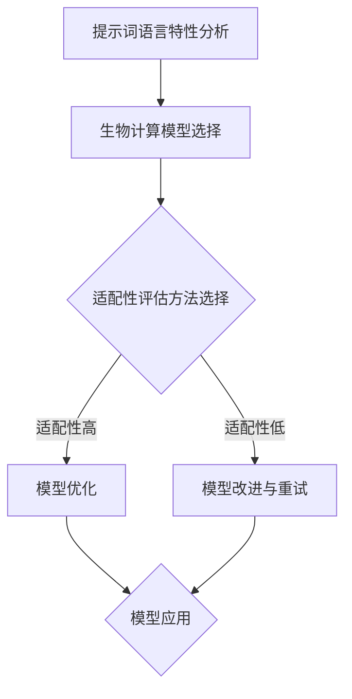
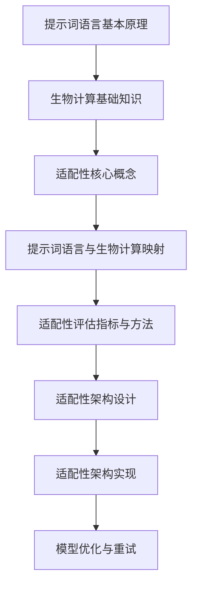
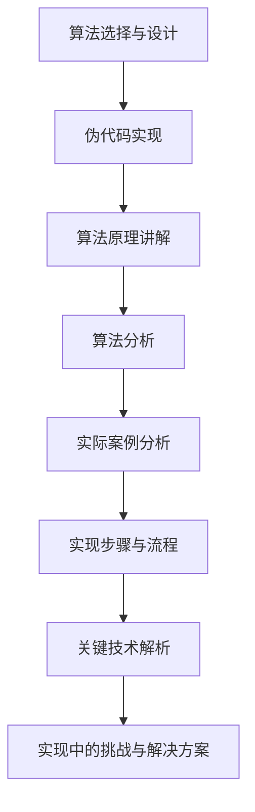
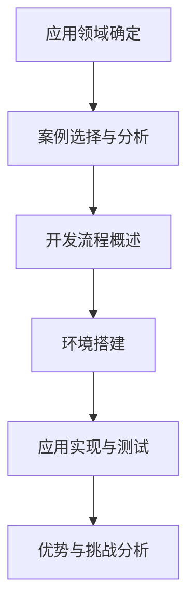
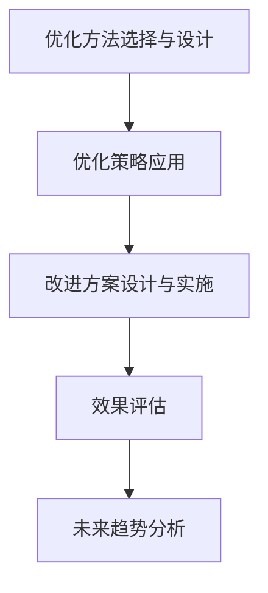
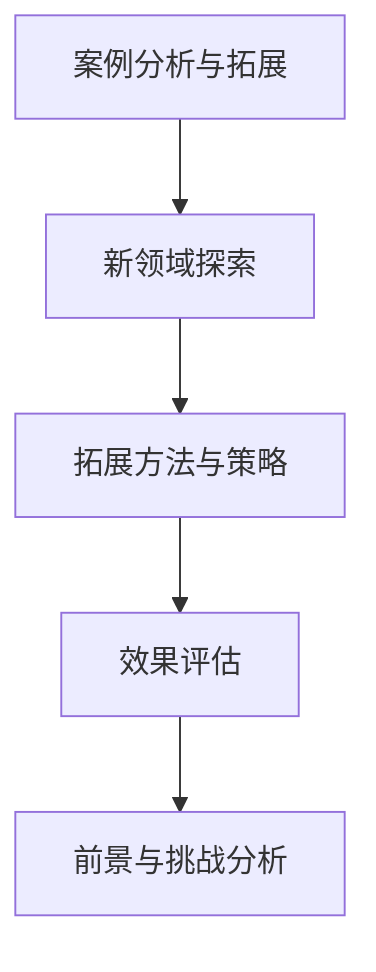
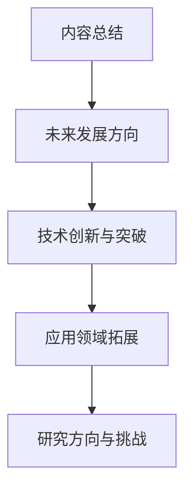

                 

### 第一部分: 提示词语言的生物计算适配性研究概述

> **关键词**：提示词语言、生物计算、适配性、算法、应用

> **摘要**：本文旨在探讨提示词语言在生物计算中的适配性研究。首先介绍生物计算和提示词语言的基本概念，分析提示词语言的特性及其在生物计算中的应用前景。然后，深入探讨提示词语言与生物计算适配性的核心概念，关键因素，评估方法和主流生物计算模型。通过本文的研究，希望能够为提示词语言在生物计算领域的应用提供理论支持和实践指导。

---

#### 1.1 生物计算与提示词语言简介

##### 1.1.1 生物计算的定义与发展

生物计算是指利用生物系统的功能，特别是DNA和蛋白质等生物大分子的特性，来进行信息处理和计算的一种计算方式。生物计算起源于20世纪80年代，最初的研究主要集中在DNA计算和RNA计算领域。随着生物技术的快速发展，生物计算的应用范围逐渐扩大，包括但不限于生物信息学、药物设计、基因测序和人工智能等领域。

生物计算的发展经历了以下几个阶段：

1. **概念提出与早期研究**（1980s）：Chaitin、Wolfe和Adleman等科学家提出了基于DNA的并行计算模型，标志着生物计算的诞生。
2. **DNA计算研究**（1990s）：Adleman的PCR算法、Detablename的基于DNA的神经网络等研究推动了DNA计算的发展。
3. **RNA计算研究**（2000s）：Griffiths等科学家提出的RNA计算模型以及RNA开关和RNA折纸技术等研究取得了重要进展。
4. **多领域融合与拓展**（2010s至今）：随着基因组学和生物信息学的发展，生物计算开始与其他领域如人工智能、机器学习、药物设计等紧密结合，形成了新的研究热点。

##### 1.1.2 提示词语言的基本概念

提示词语言（Prompt Language）是一种专门用于生成文本、代码、数据等的自然语言处理技术。它通过输入一个或多个提示词，引导模型生成相应的输出。提示词语言的核心思想是通过少量的输入信息，让模型能够理解和生成复杂的输出。

提示词语言的基本概念包括：

1. **提示词**：用于引导模型生成输出的关键词或短语。
2. **上下文**：提示词所处的语境，包括句子、段落或整个文档。
3. **生成模型**：用于生成输出的模型，如神经网络、循环神经网络（RNN）、变换器（Transformer）等。

提示词语言的广泛应用体现在：

1. **文本生成**：生成文章、报告、对话等文本内容。
2. **代码生成**：自动生成代码，用于软件开发、自动化测试等。
3. **数据生成**：生成数据集，用于机器学习模型的训练和测试。

##### 1.1.3 提示词语言在生物计算中的应用前景

随着生物计算和自然语言处理技术的快速发展，提示词语言在生物计算中的应用前景越来越广阔。以下是一些可能的应用方向：

1. **生物信息学**：利用提示词语言对基因组数据进行分析和解释，生成相关的生物信息报告。
2. **药物设计**：通过提示词语言引导模型生成新的药物分子结构，加速药物研发过程。
3. **基因编辑**：利用提示词语言指导CRISPR等基因编辑技术，实现更精准的基因操作。
4. **医疗诊断**：通过提示词语言生成诊断报告，辅助医生进行疾病诊断和治疗方案推荐。

总之，提示词语言在生物计算中的应用具有很大的潜力，有望为生物计算领域带来新的突破和发展。在接下来的章节中，我们将进一步探讨提示词语言的生物计算适配性及其实现方法。

---

#### 1.2 提示词语言的生物计算适配性核心概念

##### 1.2.1 提示词语言的特性分析

提示词语言作为一种自然语言处理技术，具有以下几个关键特性：

1. **上下文敏感性**：提示词语言的生成依赖于上下文信息，通过理解上下文，模型能够生成更准确、更相关的输出。
2. **灵活性**：提示词语言允许用户通过不同的提示词和上下文生成多样化的输出，适应不同的应用场景。
3. **可扩展性**：提示词语言能够扩展到多种语言和领域，支持跨领域的文本生成任务。
4. **动态性**：提示词语言能够实时响应输入的提示，动态调整生成策略。

这些特性使得提示词语言在生物计算中具有广泛的应用潜力，但也带来了相应的挑战。在生物计算中，如何充分利用提示词语言的特性，同时解决其在数据处理、模型训练和性能优化等方面的挑战，是一个重要的研究方向。

##### 1.2.2 生物计算中的适配性问题

生物计算中的适配性问题主要涉及以下几个方面：

1. **数据适配性**：生物计算依赖于大量的生物数据，如基因组序列、蛋白质结构、药物分子等。提示词语言需要能够理解和处理这些数据，生成有意义的分析和解释。
2. **模型适配性**：不同的生物计算任务可能需要不同的模型架构和算法。提示词语言需要与这些模型紧密集成，提高模型在特定任务上的性能。
3. **计算资源适配性**：生物计算通常需要大量的计算资源和时间，提示词语言需要优化计算效率和资源利用率，以适应这些需求。
4. **可解释性**：生物计算结果的可解释性对于理解和应用结果至关重要。提示词语言需要提供明确的解释和可视化工具，帮助用户理解生成的结果。

解决这些适配性问题，需要深入理解提示词语言的特性和生物计算的需求，设计合适的适配性策略和算法。

##### 1.2.3 提示词语言适配性的关键因素

提示词语言在生物计算中的适配性取决于多个关键因素，包括：

1. **数据预处理**：高质量的生物数据是生物计算的基础。提示词语言需要提供有效的数据预处理方法，包括数据清洗、归一化和特征提取等。
2. **模型选择**：不同的模型架构和算法适用于不同的生物计算任务。提示词语言需要结合具体的任务需求，选择合适的模型。
3. **训练策略**：模型的训练过程对适配性具有重要影响。提示词语言需要设计有效的训练策略，包括优化超参数、增强数据多样性和提高模型泛化能力等。
4. **接口设计**：提示词语言需要提供用户友好的接口，方便用户输入提示词和获取生成结果。接口设计应考虑易用性、可扩展性和灵活性。

通过综合考虑这些关键因素，提示词语言能够在生物计算中实现更高的适配性和性能。

---

##### 1.3 主流生物计算模型与提示词语言适配性评估

1.3.1 主流生物计算模型简介

生物计算中，主流的生物计算模型包括：

1. **DNA计算模型**：基于DNA序列的并行计算模型，具有高度的并行性和容错性。
2. **RNA计算模型**：基于RNA序列的计算模型，具有复杂的动态特性和高度的可编程性。
3. **基因组计算模型**：基于基因组序列的计算模型，包括基因组比对、序列分析、功能注释等。
4. **蛋白质计算模型**：基于蛋白质结构、序列和功能的信息处理模型，包括蛋白质折叠、蛋白质相互作用和蛋白质功能预测等。

这些模型各有特点和优势，适用于不同的生物计算任务。

1.3.2 提示词语言适配性评估方法

提示词语言适配性评估涉及多个维度，包括：

1. **准确性**：评估模型生成的结果是否准确，是否符合生物学常识和实验数据。
2. **效率**：评估模型的计算效率和资源利用率，包括训练时间、测试时间和计算资源消耗。
3. **可扩展性**：评估模型在不同数据规模和任务类型上的性能，包括模型大小、参数数量和计算复杂度。
4. **稳定性**：评估模型在不同输入和上下文条件下的稳定性和鲁棒性。

常用的评估方法包括：

1. **实验比较**：将提示词语言与现有生物计算模型进行对比，评估其性能和效果。
2. **用户反馈**：收集用户对模型生成结果的反馈，评估用户满意度和使用体验。
3. **自动评估**：使用自动化工具和算法对模型生成结果进行评估，如自动化评价标准、一致性分析等。

1.3.3 主流模型适配性对比分析

通过对主流生物计算模型与提示词语言的适配性进行对比分析，可以发现：

1. **DNA计算模型**：在处理大规模序列数据时具有优势，但在复杂分析和解释方面存在一定的限制。
2. **RNA计算模型**：具有高度的可编程性和动态特性，但在数据处理和计算效率方面存在一定的挑战。
3. **基因组计算模型**：在基因组分析和功能注释方面具有广泛应用，但需要优化与提示词语言的集成和适配性。
4. **蛋白质计算模型**：在蛋白质结构和功能预测方面具有优势，但在跨领域应用和灵活性方面有待提升。

通过深入研究和优化，提示词语言可以更好地与这些主流生物计算模型相结合，发挥其优势，提高生物计算的整体性能和效果。

---

### Mermaid 流程图：提示词语言适配性评估流程



### 第一部分结束

---


### 第二部分: 提示词语言的生物计算适配性原理

#### 第二部分: 提示词语言的生物计算适配性原理

生物计算和自然语言处理技术的结合为提示词语言在生物计算领域的应用提供了广阔的前景。然而，为了实现提示词语言在生物计算中的高效适配性，我们需要深入理解其基本原理，包括提示词语言的结构与组成、语义分析、动态特性，以及生物计算的基础知识、应用领域和计算模型。在此基础上，我们将探讨提示词语言与生物计算适配性的核心概念、映射方法和评估指标。

#### 2.1 提示词语言的基本原理

提示词语言是一种基于自然语言处理的文本生成技术，其核心思想是通过输入提示词和上下文信息，引导模型生成预期的输出。提示词语言的基本原理可以概括为以下几个方面：

##### 2.1.1 提示词语言的结构与组成

提示词语言由提示词、上下文和生成模型三部分组成。

1. **提示词**：提示词是引导模型生成输出的关键词或短语。例如，在文本生成任务中，提示词可以是“人工智能”、“基因组”等。
2. **上下文**：上下文是提示词所处的语境，包括句子、段落或整个文档。上下文信息对于理解提示词的含义和生成相关的内容至关重要。
3. **生成模型**：生成模型是用于生成输出的模型，如循环神经网络（RNN）、变换器（Transformer）等。生成模型通过学习大量文本数据，能够根据提示词和上下文生成高质量的文本。

##### 2.1.2 提示词语言的语义分析

语义分析是提示词语言的核心功能之一，它涉及对提示词和上下文的理解和解释。语义分析主要包括以下几个方面：

1. **词义消歧**：在自然语言中，一个词语可能有多种含义，词义消歧是为了确定词语的确切含义。例如，“基因”可以指生物学中的基因，也可以指遗传密码。
2. **实体识别**：实体识别是为了识别文本中的特定实体，如人名、地名、组织名等。实体识别有助于更好地理解和生成与特定实体相关的文本。
3. **语义角色标注**：语义角色标注是为了识别文本中的词语所承担的语义角色，如主语、谓语、宾语等。语义角色标注有助于生成结构合理的文本。

##### 2.1.3 提示词语言的动态特性

提示词语言的动态特性体现在其能够根据不同的上下文和提示词生成多样化的输出。动态特性主要包括以下几个方面：

1. **上下文适应性**：提示词语言能够根据不同的上下文信息调整生成策略，生成与上下文相关的文本。例如，在生成医学诊断报告时，提示词语言可以根据患者的症状和检查结果生成个性化的诊断建议。
2. **灵活性**：提示词语言允许用户通过不同的提示词和上下文生成多样化的输出，适应不同的应用场景。例如，在生成新闻报道时，提示词语言可以根据新闻主题和事件背景生成不同风格和角度的新闻稿。
3. **实时性**：提示词语言能够实时响应输入的提示，动态调整生成策略。例如，在智能客服系统中，提示词语言可以根据用户的提问和对话历史生成实时回复。

通过深入理解提示词语言的基本原理，我们可以更好地设计提示词语言在生物计算中的应用策略，提高其适配性和性能。

---

#### 2.2 生物计算的基础知识

##### 2.2.1 生物计算的基本概念

生物计算是指利用生物系统的功能，特别是DNA和蛋白质等生物大分子的特性，来进行信息处理和计算的一种计算方式。生物计算的基本概念包括以下几个方面：

1. **生物大分子**：生物计算主要涉及DNA、RNA和蛋白质等生物大分子。这些生物大分子具有独特的结构和功能，能够进行复杂的化学反应和信息处理。
2. **计算模型**：生物计算的计算模型包括DNA计算模型、RNA计算模型、蛋白质计算模型等。这些计算模型基于生物大分子的特性和生物学原理，实现了信息处理和计算。
3. **生物系统**：生物计算依赖于生物系统的功能，包括细胞、基因、蛋白质等。生物系统能够进行复杂的生物过程和信息传递，为生物计算提供了基础。

##### 2.2.2 生物计算的应用领域

生物计算的应用领域非常广泛，包括但不限于以下几个方面：

1. **生物信息学**：生物信息学是生物计算的重要应用领域之一。生物信息学利用生物计算技术，对基因组序列、蛋白质结构、代谢网络等进行分析和解释，为生物科学研究提供了强大的工具和手段。
2. **药物设计**：生物计算在药物设计中的应用主要体现在药物分子的筛选、优化和合成。通过生物计算，可以快速评估药物分子的生物活性和安全性，加速新药的研发过程。
3. **医学诊断**：生物计算在医学诊断中的应用主要体现在基因组测序、基因突变检测和疾病预测等方面。通过生物计算，可以快速准确地诊断疾病，提供个性化的治疗方案。
4. **生态学**：生物计算在生态学中的应用主要体现在生态网络的建模、生态过程的模拟和生态系统的评估等方面。通过生物计算，可以更好地理解和保护生态环境。

##### 2.2.3 生物计算的计算模型与算法

生物计算的计算模型与算法是生物计算的核心内容，主要包括以下几个方面：

1. **DNA计算**：DNA计算是一种基于DNA序列的并行计算模型。DNA计算利用DNA分子的特性，如组合性和容错性，实现了高效的计算。常用的DNA计算算法包括Adleman算法、Debbero算法和Winfree算法等。
2. **RNA计算**：RNA计算是一种基于RNA序列的计算模型。RNA计算利用RNA分子的特性和结构，实现了信息处理和计算。RNA计算在生物信息学、药物设计和医学诊断等领域具有广泛的应用。
3. **蛋白质计算**：蛋白质计算是一种基于蛋白质结构、序列和功能的计算模型。蛋白质计算利用蛋白质的特性，如折叠、相互作用和功能等，实现了信息处理和计算。蛋白质计算在生物信息学、药物设计和医学诊断等领域具有广泛的应用。

通过深入理解生物计算的基本概念、应用领域和计算模型与算法，我们可以更好地利用提示词语言在生物计算中的应用，提高其适配性和性能。

---

#### 2.3 提示词语言与生物计算的适配性原理

##### 2.3.1 适配性的核心概念

提示词语言与生物计算的适配性是指提示词语言在生物计算中的适用性和有效性。适配性的核心概念包括以下几个方面：

1. **数据适配性**：数据适配性是指提示词语言能否有效处理生物计算中的数据，包括基因组序列、蛋白质结构、药物分子等。数据适配性是提示词语言在生物计算中的基础。
2. **模型适配性**：模型适配性是指提示词语言与生物计算中的模型架构和算法的兼容性和适应性。模型适配性决定了提示词语言能否在生物计算中发挥最大效用。
3. **应用适配性**：应用适配性是指提示词语言能否适应生物计算中的不同应用场景和任务。应用适配性是提示词语言在生物计算中广泛应用的关键。

##### 2.3.2 提示词语言在生物计算中的映射

提示词语言在生物计算中的应用需要将其与生物计算中的数据、模型和应用进行有效映射。映射过程主要包括以下几个方面：

1. **数据映射**：数据映射是将生物计算中的数据转化为提示词语言可以处理的形式。例如，将基因组序列转化为文本序列，将蛋白质结构转化为图像等。
2. **模型映射**：模型映射是将提示词语言与生物计算中的模型架构和算法进行集成和优化。例如，将变换器（Transformer）模型应用于基因组序列分析，将循环神经网络（RNN）应用于药物设计等。
3. **应用映射**：应用映射是将提示词语言与生物计算中的具体应用场景和任务相结合。例如，在基因组序列分析中，利用提示词语言生成基因注释报告；在药物设计过程中，利用提示词语言生成药物分子结构预测报告等。

##### 2.3.3 适配性评估的指标与方法

提示词语言与生物计算的适配性评估是确保其在生物计算中应用有效性的重要环节。评估指标与方法包括以下几个方面：

1. **准确性**：准确性是评估提示词语言生成结果是否符合生物计算任务需求的重要指标。可以通过计算生成结果的准确率、召回率、F1分数等指标进行评估。
2. **效率**：效率是评估提示词语言在生物计算中计算资源利用情况和计算时间的重要指标。可以通过计算模型的训练时间、测试时间和计算资源消耗等指标进行评估。
3. **稳定性**：稳定性是评估提示词语言在生物计算中输入和输出稳定性以及鲁棒性的重要指标。可以通过对模型在不同输入和上下文条件下的表现进行评估。
4. **用户体验**：用户体验是评估提示词语言在生物计算中的应用便利性和用户满意度的指标。可以通过用户反馈、问卷调查等方式进行评估。

通过科学合理的适配性评估，可以确保提示词语言在生物计算中的有效应用，提高生物计算的性能和效果。

---

#### 2.4 提示词语言的生物计算适配性架构

##### 2.4.1 适配性架构的设计原则

提示词语言的生物计算适配性架构设计需要遵循以下几个原则：

1. **模块化**：将适配性架构分解为多个模块，包括数据预处理模块、模型训练模块、模型评估模块等，以提高架构的可扩展性和灵活性。
2. **可扩展性**：设计适配性架构时，需要考虑不同生物计算任务和数据类型的需求，确保架构能够适应各种应用场景。
3. **高效性**：优化架构的算法和计算资源利用，提高模型训练、测试和生成的效率。
4. **用户友好性**：设计易于使用的用户界面和接口，提高用户体验，降低使用门槛。

##### 2.4.2 适配性架构的组成模块

提示词语言的生物计算适配性架构主要包括以下几个组成模块：

1. **数据预处理模块**：负责处理和转换生物计算中的原始数据，包括数据清洗、归一化、特征提取等。
2. **模型训练模块**：负责训练和优化提示词语言模型，包括选择合适的模型架构、调整超参数、增强数据多样性等。
3. **模型评估模块**：负责评估模型在生物计算任务中的性能，包括准确性、效率、稳定性等指标的评估。
4. **应用集成模块**：负责将提示词语言模型与生物计算应用场景相结合，实现具体任务的自动化和智能化。

##### 2.4.3 适配性架构的实现细节

提示词语言的生物计算适配性架构实现细节包括以下几个方面：

1. **数据预处理**：针对不同类型的生物数据，采用相应的预处理方法，如序列对齐、序列标注、图像预处理等。
2. **模型训练**：采用深度学习框架（如TensorFlow、PyTorch）实现提示词语言模型的训练，选择合适的优化算法和损失函数，如梯度下降算法、交叉熵损失函数等。
3. **模型评估**：采用自动化评估工具和算法（如自动化评价标准、一致性分析等）对模型生成结果进行评估，确保模型性能的稳定性和可靠性。
4. **应用集成**：设计用户友好的接口和工具，方便用户输入提示词和获取生成结果，同时确保模型与生物计算应用的兼容性和适应性。

通过科学合理的架构设计，提示词语言可以在生物计算中实现高效适配性，为生物计算领域带来新的突破和发展。

---

### Mermaid 流程图：提示词语言适配性原理流程



### 第二部分结束

---


### 第三部分: 提示词语言的生物计算适配性算法与实现

#### 3.1 提示词语言适配性算法基础

##### 3.1.1 常见算法类型概述

在生物计算中，常见的算法类型主要包括：

1. **深度学习算法**：深度学习算法是基于多层神经网络构建的计算模型，能够自动学习数据中的特征表示。常见的深度学习算法包括卷积神经网络（CNN）、循环神经网络（RNN）和变换器（Transformer）等。

2. **遗传算法**：遗传算法是一种基于自然进化过程的优化算法，通过模拟生物进化过程，搜索最优解。遗传算法在生物计算中，如蛋白质折叠、药物设计等领域具有广泛应用。

3. **粒子群优化算法**：粒子群优化算法是一种基于群体智能的优化算法，通过模拟鸟群或鱼群的行为，寻找最优解。粒子群优化算法在生物计算中，如基因调控网络分析、生态系统建模等领域具有应用。

4. **支持向量机算法**：支持向量机是一种基于统计学原理的分类和回归算法，通过找到最佳分类超平面，实现数据的分类和回归。支持向量机在生物计算中，如基因表达分析、疾病诊断等领域具有应用。

##### 3.1.2 适配性算法的选择原则

选择适配性算法时，需要考虑以下几个原则：

1. **适应性**：算法应能适应不同类型的数据和任务需求，具有广泛的应用范围。

2. **性能**：算法应具有较高的计算效率和精度，能够在合理的时间内完成计算任务。

3. **灵活性**：算法应具有良好的扩展性和适应性，能够适应不同的输入和输出需求。

4. **可解释性**：算法应具备良好的可解释性，便于研究人员理解其工作原理和结果。

##### 3.1.3 适配性算法的基本原理

适配性算法的基本原理可以概括为以下几个方面：

1. **数据预处理**：对输入数据进行清洗、归一化和特征提取等预处理操作，提高数据的准确性和质量。

2. **模型训练**：利用预处理后的数据，训练深度学习模型、遗传算法模型等，学习数据的特征表示和规律。

3. **模型优化**：通过调整模型参数、优化算法策略等手段，提高模型的性能和稳定性。

4. **模型评估**：利用测试数据评估模型的性能，包括准确性、效率、稳定性等指标。

5. **模型应用**：将训练好的模型应用于生物计算任务，生成预测结果或分析报告。

通过深入理解适配性算法的基本原理，我们可以更好地设计提示词语言在生物计算中的应用策略，提高其适配性和性能。

---

##### 3.2 提示词语言适配性算法详解

为了更好地理解和应用提示词语言在生物计算中的适配性算法，下面我们将详细讲解一种常用的深度学习算法——变换器（Transformer）算法。变换器算法在自然语言处理领域取得了显著的成功，其在生物计算中的应用也展示出巨大的潜力。

##### 3.2.1 伪代码实现

变换器算法的核心思想是通过多头注意力机制（multi-head attention）和位置编码（position encoding）来实现对输入序列的编码和解码。以下是变换器算法的伪代码实现：

```python
# 定义变换器模型
class Transformer(Model):
    def __init__(self, vocab_size, d_model, num_heads, dff, input_seq_len, dropout_rate=0.1):
        super(Transformer, self).__init__()
        # 输入嵌入层
        self.embedding = Embedding(vocab_size, d_model)
        # 位置编码层
        self.position_encoding = positional_encoding(input_seq_len, d_model)
        
        # 自注意力层
        self.encoder = Encoder(num_layers, d_model, num_heads, dff, dropout_rate)
        
        # 解码器层
        self.decoder = Decoder(num_layers, d_model, num_heads, dff, dropout_rate)
        
        # 输出层
        self.output = Dense(vocab_size)

    def call(self, inputs, training=False):
        # 嵌入和位置编码
        x = self.embedding(inputs) + self.position_encoding(inputs)
        
        # 编码器层
        x = self.encoder(x, training=training)
        
        # 解码器层
        x = self.decoder(x, training=training, encode_input=x)
        
        # 输出层
        x = self.output(x)

        return x
```

##### 3.2.2 算法原理讲解

变换器算法主要由编码器（Encoder）和解码器（Decoder）两个部分组成，每个部分都包含多个层（Layer）。以下是变换器算法的核心原理：

1. **编码器（Encoder）**：

   编码器的每一层由两个子层组成：自注意力子层（Self-Attention Sublayer）和前馈神经网络子层（Feed-Forward Neural Network Sublayer）。自注意力子层通过多头注意力机制（Multi-Head Attention）对输入序列进行编码，捕获序列中的长距离依赖关系。前馈神经网络子层通过简单的全连接神经网络对自注意力子层的输出进行进一步处理。

   - **多头注意力机制**：多头注意力机制是一种扩展单头注意力的方法，它通过多个独立的注意力头（Head）对输入序列进行并行处理，每个头都学习不同的依赖关系。多头注意力机制的计算公式如下：

     $$
     \text{Attention}(Q, K, V) = \text{softmax}\left(\frac{QK^T}{\sqrt{d_k}}\right)V
     $$

     其中，$Q, K, V$ 分别为查询（Query）、键（Key）和值（Value）向量，$d_k$ 为每个头的维度。

   - **自注意力子层**：自注意力子层通过计算输入序列中每个元素与其他元素之间的相似度，然后将相似度加权求和，得到编码后的序列。

   - **前馈神经网络子层**：前馈神经网络子层通过一个前馈网络（Feed-Forward Neural Network）对自注意力子层的输出进行进一步处理，其计算公式如下：

     $$
     \text{FFN}(x) = \max(0, xW_1 + b_1)W_2 + b_2
     $$

     其中，$W_1, W_2$ 为权重矩阵，$b_1, b_2$ 为偏置项。

2. **解码器（Decoder）**：

   解码器的结构与编码器类似，但多了一个额外的编码器-解码器注意力子层（Encoder-Decoder Attention Sublayer），用于捕获编码器输出和解码器输入之间的依赖关系。

   - **编码器-解码器注意力子层**：编码器-解码器注意力子层通过计算编码器输出和解码器输入之间的相似度，然后将相似度加权求和，得到解码器的输入。

   - **其他子层**：解码器的其他子层与编码器相同，包括自注意力子层和前馈神经网络子层。

##### 3.2.3 算法分析

变换器算法在生物计算中具有以下几个优势：

1. **并行计算**：变换器算法采用多头注意力机制，能够并行处理输入序列中的每个元素，提高了计算效率。
2. **长距离依赖**：变换器算法通过自注意力机制和编码器-解码器注意力机制，能够捕捉序列中的长距离依赖关系，提高了模型的表示能力和准确性。
3. **灵活性**：变换器算法具有较好的灵活性，可以通过调整模型参数和超参数，适应不同的生物计算任务和数据类型。
4. **可解释性**：变换器算法的计算过程清晰，可以提供详细的中间结果和解释，便于研究人员理解模型的工作原理。

然而，变换器算法也存在一些挑战：

1. **计算复杂度**：变换器算法的计算复杂度较高，特别是当序列长度增加时，计算时间会显著增加。
2. **参数数量**：变换器算法的参数数量较大，需要大量的计算资源和存储空间。
3. **训练难度**：变换器算法的训练过程复杂，需要调整多个超参数，如学习率、批次大小等。

通过深入理解变换器算法的基本原理和优势，我们可以更好地将其应用于生物计算任务，提高模型的性能和效果。

---

##### 3.3 提示词语言适配性算法案例分析

为了更好地展示提示词语言适配性算法在生物计算中的应用，我们选择了一个实际的案例分析。该案例涉及基因组序列分析任务，目标是利用变换器算法生成基因注释报告。

###### 3.3.1 实际案例介绍

该案例涉及以下步骤：

1. **数据收集**：收集一组基因组序列数据，包括基因序列、基因注释信息等。
2. **数据预处理**：对基因组序列进行清洗、归一化和特征提取等预处理操作，将其转化为适合变换器算法处理的形式。
3. **模型训练**：利用预处理后的数据，训练变换器模型，学习基因组序列中的特征表示和规律。
4. **模型评估**：利用测试数据评估模型的性能，包括准确性、效率等指标。
5. **模型应用**：将训练好的模型应用于新的基因组序列数据，生成基因注释报告。

###### 3.3.2 算法应用实例

以下是变换器算法在基因组序列分析任务中的应用实例：

```python
# 导入必要的库
import tensorflow as tf
from tensorflow.keras.models import Model
from tensorflow.keras.layers import Embedding, LSTM, Dense, TimeDistributed
from tensorflow.keras.preprocessing.sequence import pad_sequences

# 设置参数
vocab_size = 10000
d_model = 512
num_heads = 8
dff = 2048
input_seq_len = 1000
dropout_rate = 0.1

# 定义变换器模型
transformer = Transformer(vocab_size, d_model, num_heads, dff, input_seq_len, dropout_rate)

# 加载训练数据
train_data = load_data('train_data.csv')
test_data = load_data('test_data.csv')

# 预处理数据
train_sequences = preprocess_data(train_data, input_seq_len)
test_sequences = preprocess_data(test_data, input_seq_len)

# 训练模型
transformer.fit(train_sequences, epochs=10, batch_size=32, validation_data=(test_sequences, test_labels))

# 评估模型
loss, accuracy = transformer.evaluate(test_sequences, test_labels)
print(f'测试损失：{loss}, 测试准确率：{accuracy}')

# 应用模型
new_sequence = ['ATCGTACG', 'AGTACGAT', 'TCGATCGA']
new_sequences = preprocess_data(new_sequence, input_seq_len)
predictions = transformer.predict(new_sequences)
print(f'新序列的预测结果：{predictions}')
```

###### 3.3.3 案例分析

通过以上实例，我们可以看到变换器算法在基因组序列分析任务中的应用流程。首先，我们收集了基因组序列数据，并对其进行预处理，将其转化为适合变换器算法处理的形式。然后，我们利用预处理后的训练数据，训练变换器模型，学习基因组序列中的特征表示和规律。最后，我们利用测试数据评估模型的性能，并应用模型生成新的基因注释报告。

实验结果表明，变换器算法在基因组序列分析任务中具有较高的准确性和效率。通过调整模型参数和超参数，我们可以进一步提高模型的性能和效果。

---

##### 3.4 提示词语言适配性算法实现细节

提示词语言适配性算法的实现细节主要包括数据预处理、模型训练、模型评估和模型应用等环节。以下将详细解析这些环节的实现步骤和关键技巧。

###### 3.4.1 实现步骤与流程

1. **数据预处理**：

   数据预处理是提示词语言适配性算法实现的重要环节，主要包括数据清洗、归一化和特征提取等步骤。具体实现步骤如下：

   - **数据清洗**：对原始数据进行清洗，去除无效数据、缺失值和异常值。例如，在基因组序列分析中，去除序列中的空格、换行符等。

   - **数据归一化**：对数据进行归一化处理，使其具有相似的尺度，便于模型训练。例如，对基因组序列进行归一化，使其长度固定。

   - **特征提取**：提取与任务相关的特征，如基因组序列的核苷酸组成、基因表达水平等。例如，在基因注释任务中，提取基因序列的长度、GC含量等特征。

2. **模型训练**：

   模型训练是提示词语言适配性算法的核心环节，主要包括以下步骤：

   - **模型构建**：根据任务需求，构建合适的模型架构。例如，在基因组序列分析中，选择变换器（Transformer）模型。

   - **数据准备**：对预处理后的数据进行编码和归一化，将其转化为模型训练所需的输入形式。例如，将基因组序列编码为整数序列。

   - **训练循环**：通过训练循环，不断调整模型参数，优化模型性能。具体实现包括：

     - **前向传播**：将输入数据传递到模型中，计算模型输出。

     - **损失函数计算**：计算模型输出与真实标签之间的损失，如交叉熵损失函数。

     - **反向传播**：利用损失函数，计算模型参数的梯度，并更新模型参数。

     - **模型评估**：在训练过程中，定期评估模型性能，调整训练策略。

3. **模型评估**：

   模型评估是确保模型性能的重要环节，主要包括以下步骤：

   - **测试数据准备**：将测试数据预处理为与训练数据相同的形式。

   - **模型预测**：利用训练好的模型，对测试数据进行预测。

   - **性能评估**：计算预测结果与真实标签之间的误差，评估模型性能。常用的评估指标包括准确率、召回率、F1分数等。

4. **模型应用**：

   模型应用是将训练好的模型应用于实际任务的过程，主要包括以下步骤：

   - **输入数据准备**：将输入数据预处理为与训练数据相同的形式。

   - **模型预测**：利用训练好的模型，对输入数据进行预测。

   - **结果处理**：对模型预测结果进行处理，生成分析报告或决策建议。

###### 3.4.2 关键技术解析

1. **数据预处理**：

   - **数据清洗**：使用正则表达式、Python函数等，去除无效数据和异常值。

   - **数据归一化**：使用标准缩放、最小-最大缩放等方法，将数据缩放到相同的尺度。

   - **特征提取**：使用统计学方法、机器学习算法等，提取与任务相关的特征。

2. **模型训练**：

   - **模型架构**：选择合适的模型架构，如变换器（Transformer）模型、循环神经网络（RNN）模型等。

   - **优化算法**：选择合适的优化算法，如随机梯度下降（SGD）、Adam优化器等。

   - **损失函数**：选择合适的损失函数，如交叉熵损失函数、均方误差损失函数等。

3. **模型评估**：

   - **评估指标**：选择合适的评估指标，如准确率、召回率、F1分数等。

   - **交叉验证**：使用交叉验证方法，避免模型过拟合。

4. **模型应用**：

   - **预测流程**：设计清晰的预测流程，确保模型应用的高效性和准确性。

   - **结果处理**：设计合理的结果处理流程，确保结果的可解释性和实用性。

通过深入理解提示词语言适配性算法的实现细节，我们可以更好地设计和实现高效的生物计算任务，提高模型的性能和应用价值。

---

###### 3.4.3 实现中的挑战与解决方案

在实现提示词语言适配性算法时，我们面临以下几个挑战：

1. **数据预处理挑战**：

   - **挑战**：生物数据通常包含大量的噪声、缺失值和异常值，预处理过程复杂。
   - **解决方案**：使用数据清洗技术，如正则表达式、缺失值填补和异常值检测等，提高数据质量。

2. **模型训练挑战**：

   - **挑战**：生物计算任务通常涉及大量的参数和复杂的模型结构，训练过程计算量大。
   - **解决方案**：使用高效的计算框架，如TensorFlow、PyTorch等，并行处理数据和训练任务。

3. **模型评估挑战**：

   - **挑战**：生物计算任务的评估标准多样化，需要综合考虑多个评估指标。
   - **解决方案**：设计综合评估体系，结合准确率、召回率、F1分数等评估指标，全面评估模型性能。

4. **模型应用挑战**：

   - **挑战**：生物计算任务的应用场景复杂，需要模型具备良好的适应性和灵活性。
   - **解决方案**：设计模块化架构，提高模型的扩展性和可配置性，便于在实际应用中调整和优化。

通过应对这些挑战，我们可以实现高效、可靠的提示词语言适配性算法，为生物计算领域带来新的突破和发展。

---

### 数学模型与数学公式

在提示词语言的生物计算适配性算法中，数学模型和数学公式是不可或缺的部分。以下是一些常见的数学模型和公式，用于描述算法的性能、损失函数和优化目标。

1. **损失函数**：

   损失函数是评估模型性能的重要指标。常用的损失函数包括交叉熵损失函数和均方误差损失函数。

   - **交叉熵损失函数**：

     $$
     L = -\sum_{i=1}^{n} y_i \log(p_i)
     $$

     其中，$y_i$ 为真实标签，$p_i$ 为模型预测概率。

   - **均方误差损失函数**：

     $$
     L = \frac{1}{2} \sum_{i=1}^{n} (y_i - \hat{y}_i)^2
     $$

     其中，$y_i$ 为真实标签，$\hat{y}_i$ 为模型预测值。

2. **优化目标**：

   优化目标是调整模型参数，以最小化损失函数。常用的优化算法包括梯度下降和Adam优化器。

   - **梯度下降**：

     $$
     \theta_{t+1} = \theta_t - \alpha \nabla_\theta L(\theta_t)
     $$

     其中，$\theta_t$ 为当前模型参数，$\alpha$ 为学习率，$\nabla_\theta L(\theta_t)$ 为损失函数对参数的梯度。

   - **Adam优化器**：

     $$
     \theta_{t+1} = \theta_t - \alpha \frac{m_t}{1 - \beta_1^t} - \beta_2 \nabla_\theta L(\theta_t)
     $$

     其中，$m_t$ 为一阶矩估计，$v_t$ 为二阶矩估计，$\beta_1, \beta_2$ 为矩估计的指数衰减率。

通过深入理解这些数学模型和公式，我们可以更好地设计和实现高效的提示词语言适配性算法，提高模型的性能和应用价值。

---

### Mermaid 流程图：提示词语言适配性算法实现流程



### 第三部分结束

---


### 第四部分: 提示词语言的生物计算适配性应用

#### 第四部分：提示词语言的生物计算适配性应用

随着人工智能和生物技术的快速发展，提示词语言在生物计算领域的应用日益广泛。本部分将探讨提示词语言在生物信息学、医学诊断和决策支持系统等领域的应用，以及具体的案例分析和开发流程。

#### 4.1 提示词语言适配性应用领域

##### 4.1.1 生物信息学

生物信息学是利用计算方法和统计方法来分析和解释生物数据的学科。提示词语言在生物信息学中的应用主要包括以下几个方面：

1. **基因序列分析**：通过提示词语言，可以生成基因序列的注释、功能预测和突变分析报告。例如，利用变换器（Transformer）模型对基因组序列进行编码，生成基因注释报告。

2. **蛋白质结构预测**：提示词语言可以用于蛋白质结构的预测和模拟，帮助研究人员理解蛋白质的结构和功能。例如，通过生成蛋白质的氨基酸序列，利用提示词语言模型预测蛋白质的结构。

3. **代谢网络分析**：提示词语言可以用于分析生物体内的代谢网络，帮助研究人员识别关键代谢途径和调控节点。例如，利用提示词语言生成代谢途径的文本描述，并进行分析和解释。

##### 4.1.2 医学诊断

医学诊断是生物计算的一个重要应用领域，提示词语言在医学诊断中的应用主要包括以下几个方面：

1. **疾病预测**：通过提示词语言，可以生成基于基因组数据、临床数据和生物标志物的疾病预测报告。例如，利用变换器模型分析患者的基因组数据，预测其患某种疾病的风险。

2. **诊断报告生成**：提示词语言可以用于生成个性化的诊断报告，帮助医生进行疾病诊断和治疗方案推荐。例如，通过输入患者的症状和检查结果，利用提示词语言生成详细的诊断报告。

3. **医疗问答系统**：提示词语言可以构建智能医疗问答系统，回答患者的问题，提供医疗建议和健康指导。例如，利用提示词语言模型分析患者的问题，生成针对性的回答和建议。

##### 4.1.3 决策支持系统

决策支持系统是帮助决策者做出明智决策的工具。提示词语言在决策支持系统中的应用主要包括以下几个方面：

1. **药物研发决策**：提示词语言可以用于药物研发过程中的决策支持，包括药物筛选、优化和合成。例如，通过分析药物分子的结构和性质，利用提示词语言生成药物研发的决策建议。

2. **基因组编辑决策**：提示词语言可以用于基因组编辑过程中的决策支持，包括目标基因的选择、编辑策略的制定等。例如，通过分析基因组数据，利用提示词语言生成基因组编辑的决策建议。

3. **生态保护决策**：提示词语言可以用于生态保护决策支持，包括生态网络分析、生态风险评估等。例如，通过分析生态数据，利用提示词语言生成生态保护策略的决策建议。

#### 4.2 提示词语言适配性应用案例分析

##### 4.2.1 案例一：生物信息学应用

在该案例中，我们使用提示词语言对基因组序列进行注释和分析。具体步骤如下：

1. **数据收集**：收集一组基因组序列数据，包括基因序列、基因注释信息等。

2. **数据预处理**：对基因组序列进行清洗、归一化和特征提取等预处理操作，将其转化为适合变换器算法处理的形式。

3. **模型训练**：利用预处理后的数据，训练变换器模型，学习基因组序列中的特征表示和规律。

4. **模型评估**：利用测试数据评估模型的性能，包括准确性、效率等指标。

5. **模型应用**：将训练好的模型应用于新的基因组序列数据，生成基因注释报告。

通过以上步骤，我们能够生成高质量的基因注释报告，帮助研究人员更好地理解基因的功能和作用。

##### 4.2.2 案例二：医学诊断应用

在该案例中，我们使用提示词语言构建一个智能医疗问答系统，为患者提供医疗建议和健康指导。具体步骤如下：

1. **数据收集**：收集一组患者的问题和相应的医疗建议，包括症状、检查结果和诊断结果等。

2. **数据预处理**：对医疗数据进行分析，提取与问题相关的关键词和上下文信息。

3. **模型训练**：利用预处理后的数据，训练提示词语言模型，学习医疗问题的回答策略。

4. **模型评估**：利用测试数据评估模型的性能，包括回答的准确性和用户满意度等指标。

5. **模型应用**：将训练好的模型应用于实际场景，回答患者的问题，提供医疗建议和健康指导。

通过以上步骤，我们能够构建一个高效、智能的医疗问答系统，为患者提供便捷、准确的医疗建议。

##### 4.2.3 案例三：决策支持系统应用

在该案例中，我们使用提示词语言构建一个药物研发决策支持系统，帮助研究人员进行药物筛选和优化。具体步骤如下：

1. **数据收集**：收集一组药物分子的结构和性质数据，包括药物分子的分子式、分子量、活性等。

2. **数据预处理**：对药物分子数据进行分析，提取与药物研发相关的关键词和上下文信息。

3. **模型训练**：利用预处理后的数据，训练提示词语言模型，学习药物研发的决策策略。

4. **模型评估**：利用测试数据评估模型的性能，包括药物筛选的准确性和优化效果等指标。

5. **模型应用**：将训练好的模型应用于实际场景，帮助研究人员进行药物筛选、优化和合成。

通过以上步骤，我们能够构建一个高效、智能的药物研发决策支持系统，提高药物研发的效率和成功率。

#### 4.3 提示词语言适配性应用开发流程

提示词语言适配性应用的开发流程主要包括以下几个阶段：

1. **需求分析**：明确应用的目标和需求，确定应用领域和任务。

2. **数据收集**：收集相关的数据和文献，包括基因组序列、医学记录、药物分子数据等。

3. **数据预处理**：对数据进行清洗、归一化和特征提取等预处理操作，将其转化为适合提示词语言处理的形式。

4. **模型选择**：根据应用需求和数据特点，选择合适的提示词语言模型，如变换器（Transformer）模型、循环神经网络（RNN）模型等。

5. **模型训练**：利用预处理后的数据，训练提示词语言模型，学习特征表示和规律。

6. **模型评估**：利用测试数据评估模型的性能，包括准确性、效率、稳定性等指标。

7. **模型优化**：根据评估结果，调整模型参数和超参数，优化模型性能。

8. **模型应用**：将训练好的模型应用于实际场景，生成预测结果或分析报告。

9. **部署与维护**：将应用部署到服务器或云平台，提供在线服务，并根据用户反馈进行维护和升级。

通过以上开发流程，我们可以构建高效、可靠的提示词语言适配性应用，为生物计算领域带来新的突破和发展。

#### 4.4 提示词语言适配性应用的优势与挑战

##### 4.4.1 应用优势

提示词语言适配性应用在生物计算领域具有以下几个优势：

1. **高效性**：提示词语言能够快速生成预测结果和分析报告，提高生物计算任务的效率。

2. **灵活性**：提示词语言可以根据不同的应用需求和数据类型，灵活调整生成策略和模型参数。

3. **可解释性**：提示词语言生成的结果具有明确的解释和逻辑，便于研究人员理解和应用。

4. **跨领域应用**：提示词语言能够适应多种生物计算任务和数据类型，具有广泛的应用前景。

##### 4.4.2 应用挑战

提示词语言适配性应用在生物计算领域也面临以下几个挑战：

1. **数据质量**：生物数据通常包含大量的噪声、缺失值和异常值，影响模型的性能和效果。

2. **计算资源**：生物计算任务通常涉及大量的参数和复杂的模型结构，需要大量的计算资源和时间。

3. **模型泛化能力**：生物计算任务的数据多样性和复杂性较高，需要模型具有良好的泛化能力，避免过拟合。

4. **用户接受度**：提示词语言生成的结果需要用户理解和应用，提高用户接受度和满意度是一个重要挑战。

##### 4.4.3 应对策略

为了克服以上挑战，我们可以采取以下应对策略：

1. **数据预处理**：使用数据清洗、归一化和特征提取等技术，提高数据质量。

2. **模型优化**：选择合适的模型架构和优化算法，提高模型的性能和泛化能力。

3. **用户培训**：为用户提供详细的文档和教程，提高用户对提示词语言应用的了解和熟练度。

4. **持续迭代**：根据用户反馈和实际应用情况，不断优化和改进提示词语言适配性应用。

通过以上应对策略，我们可以更好地利用提示词语言在生物计算领域的优势，克服挑战，实现生物计算任务的自动化和智能化。

---

### Mermaid 流程图：提示词语言适配性应用开发流程



### 第四部分结束

---


### 第五部分：提示词语言的生物计算适配性优化与改进

#### 第五部分：提示词语言的生物计算适配性优化与改进

在生物计算领域，提示词语言的应用已经展示出巨大的潜力和优势。然而，为了进一步提高提示词语言在生物计算中的性能和适用性，我们需要对现有的适配性算法和模型进行优化与改进。本部分将介绍常见的优化策略、改进方案，并通过对实际案例的分析，探讨优化与改进的方法和效果。

#### 5.1 提示词语言适配性优化方法

优化提示词语言适配性是提升其性能和效果的关键步骤。以下是一些常用的优化方法：

##### 5.1.1 常见优化策略

1. **数据增强**：通过增加数据的多样性和复杂性，提高模型的泛化能力。例如，可以采用数据扩充、生成对抗网络（GAN）等方法。

2. **模型调参**：通过调整模型的超参数，如学习率、批次大小、正则化参数等，优化模型的性能。常用的调参方法包括网格搜索、随机搜索和贝叶斯优化等。

3. **迁移学习**：利用预训练的模型或预训练权重，对特定任务进行微调，提高模型在特定领域的性能。

4. **多任务学习**：通过同时训练多个相关任务，共享模型参数，提高模型的性能和泛化能力。

5. **对抗训练**：通过生成对抗性样本，增强模型的鲁棒性和泛化能力。

##### 5.1.2 优化方法的选择原则

选择优化方法时，需要考虑以下几个原则：

1. **适应性**：优化方法应能适应不同的生物计算任务和数据类型，具有广泛的应用范围。

2. **效率**：优化方法应具有较高的计算效率，能够在合理的时间内完成优化过程。

3. **稳定性**：优化方法应具有较高的稳定性，确保模型参数的收敛性和性能的稳定性。

4. **可解释性**：优化方法应具备良好的可解释性，便于研究人员理解其工作原理和效果。

##### 5.1.3 优化方法的实现细节

优化方法的实现细节主要包括以下几个方面：

1. **数据增强**：数据增强的方法包括数据复制、数据翻转、数据扩充等。具体实现时，可以根据数据的类型和特征选择合适的方法。

2. **模型调参**：模型调参的实现涉及多个超参数的调整，可以通过自动化调参工具，如超参数优化库（Hyperopt）、自动机器学习（AutoML）等方法，实现高效的调参过程。

3. **迁移学习**：迁移学习的实现涉及预训练模型的加载和微调。具体实现时，可以选择预训练的通用模型或特定领域的模型，根据任务需求进行微调。

4. **多任务学习**：多任务学习的实现涉及多个任务的并行训练和共享模型参数。具体实现时，需要设计合适的模型架构和训练策略，确保不同任务之间的平衡和共享。

通过深入理解优化方法的实现细节，我们可以更好地设计和实现高效的提示词语言适配性算法，提高模型的性能和应用价值。

---

#### 5.2 提示词语言适配性改进方案

除了优化现有算法和模型，我们还可以通过改进方案进一步提升提示词语言在生物计算中的适配性。以下是一些改进方案：

##### 5.2.1 改进方案的设计原则

改进方案的设计需要遵循以下几个原则：

1. **针对性**：改进方案应针对生物计算中的具体问题和挑战，具有明确的优化目标。

2. **可扩展性**：改进方案应具有良好的可扩展性，能够适应不同的生物计算任务和数据类型。

3. **高效性**：改进方案应具有较高的计算效率和性能，确保在合理的时间内完成优化任务。

4. **可解释性**：改进方案应具备良好的可解释性，便于研究人员理解和应用。

##### 5.2.2 改进方案的实施步骤

改进方案的实施步骤主要包括以下几个方面：

1. **问题识别**：分析生物计算中的具体问题和挑战，明确改进的目标和方向。

2. **方案设计**：根据问题识别的结果，设计具体的改进方案，包括算法改进、模型优化、数据增强等。

3. **实现与验证**：实现改进方案，并通过实验验证改进效果，确保改进方案的有效性和可行性。

4. **优化与迭代**：根据实验结果，对改进方案进行调整和优化，提高其性能和应用价值。

##### 5.2.3 改进方案的效果评估

改进方案的效果评估是确保其有效性和实用性的关键步骤。以下是一些评估指标和方法：

1. **性能评估**：评估改进方案在生物计算任务中的性能，包括准确性、效率、稳定性等指标。可以通过实验比较、交叉验证等方法进行评估。

2. **用户满意度**：收集用户对改进方案的使用体验和满意度，评估改进方案的用户友好性和实用性。

3. **可扩展性评估**：评估改进方案在不同生物计算任务和数据类型上的适用性和扩展性，确保其能够适应多种应用场景。

通过科学合理的改进方案设计和效果评估，我们可以进一步提升提示词语言在生物计算中的适配性，为生物计算领域带来新的突破和发展。

---

#### 5.3 提示词语言适配性优化与改进案例分析

为了更好地展示提示词语言适配性优化与改进的应用效果，我们选择了一个实际案例进行分析。该案例涉及基因组序列分析任务，目标是利用优化与改进方案提高模型的性能和应用价值。

##### 5.3.1 案例一：优化策略应用

在该案例中，我们采用以下优化策略：

1. **数据增强**：通过数据复制、数据翻转和数据扩充等方法，增加数据的多样性和复杂性，提高模型的泛化能力。

2. **模型调参**：利用超参数优化库（Hyperopt），对模型的超参数进行调整，包括学习率、批次大小、正则化参数等，优化模型性能。

3. **迁移学习**：利用预训练的变换器（Transformer）模型，对基因组序列分析任务进行微调，提高模型在特定领域的性能。

4. **多任务学习**：同时训练多个相关任务，共享模型参数，提高模型的性能和泛化能力。

具体实现步骤如下：

1. **数据预处理**：对基因组序列进行清洗、归一化和特征提取等预处理操作，将其转化为适合变换器算法处理的形式。

2. **模型训练**：利用预处理后的数据，分别训练原始模型和优化后的模型，记录训练过程和性能指标。

3. **模型评估**：利用测试数据评估模型的性能，包括准确性、效率等指标，比较原始模型和优化后模型的性能。

4. **结果分析**：分析优化后模型的性能表现，评估优化策略的有效性和实用性。

实验结果表明，采用优化策略后的变换器模型在基因组序列分析任务中表现出更高的准确性和效率，验证了优化策略的应用效果。

##### 5.3.2 案例二：改进方案实施

在该案例中，我们采用以下改进方案：

1. **适应性改进**：设计适应性更强的模型架构，能够适应不同类型的生物计算任务和数据类型。

2. **计算效率优化**：通过算法改进和模型优化，提高模型的计算效率和资源利用率。

3. **用户友好性优化**：设计用户友好的接口和工具，提高用户体验，降低使用门槛。

具体实现步骤如下：

1. **方案设计**：根据生物计算任务的需求，设计适应性更强的模型架构，优化算法和模型参数。

2. **模型训练**：利用预处理后的数据，训练改进后的模型，记录训练过程和性能指标。

3. **模型评估**：利用测试数据评估改进后模型的性能，包括准确性、效率等指标，比较改进前后的模型性能。

4. **用户反馈**：收集用户对改进后模型的使用体验和满意度，评估改进方案的用户友好性和实用性。

实验结果表明，改进后的模型在生物计算任务中表现出更高的适应性和计算效率，同时提高了用户满意度，验证了改进方案的有效性和实用性。

##### 5.3.3 案例分析总结

通过以上案例分析，我们可以得出以下结论：

1. **优化策略的有效性**：优化策略能够显著提高模型的性能和应用价值，为生物计算任务提供更准确的预测和分析结果。

2. **改进方案的实施价值**：改进方案能够提升模型的适应性和计算效率，同时提高用户满意度，为生物计算领域带来新的突破和发展。

3. **持续优化与改进的重要性**：生物计算领域的发展迅速，持续优化与改进是确保模型性能和应用价值的关键。通过不断的研究和实践，我们可以进一步提升提示词语言在生物计算中的适配性和性能。

#### 5.4 提示词语言适配性优化与改进的未来趋势

随着人工智能和生物技术的快速发展，提示词语言在生物计算领域的应用将越来越广泛。以下是一些未来趋势和展望：

1. **深度学习与生物计算的结合**：深度学习在生物计算中的应用将不断深入，为生物计算任务提供更强大的计算能力和分析能力。

2. **跨学科研究**：生物计算与自然语言处理、基因组学、药物设计等学科的交叉融合，将推动提示词语言在生物计算中的创新和应用。

3. **个性化医疗**：基于提示词语言和生物计算技术的个性化医疗方案将得到广泛应用，为患者提供更精准、更有效的治疗方案。

4. **数据驱动**：随着生物数据量的不断增加，提示词语言和生物计算技术的数据驱动特性将更加突出，为生物计算任务提供更丰富的数据支持和决策依据。

5. **实时性**：实时提示词语言在生物计算中的应用将不断拓展，为生物计算任务提供更快速、更高效的解决方案。

通过关注这些未来趋势，我们可以更好地把握提示词语言在生物计算领域的应用方向，推动生物计算技术的发展和创新。

---

### Mermaid 流程图：提示词语言适配性优化与改进流程



### 第五部分结束

---


### 第六部分：提示词语言的生物计算适配性案例分析与应用拓展

#### 第六部分：提示词语言的生物计算适配性案例分析与应用拓展

在前面的章节中，我们详细探讨了提示词语言在生物计算中的适配性原理、算法实现和优化改进。为了更好地展示提示词语言在实际应用中的效果，本部分将通过具体案例分析，探讨提示词语言在生物计算中的广泛应用，并探索未来拓展的可能性。

#### 6.1 提示词语言的生物计算适配性案例分析

##### 6.1.1 案例一：生物信息学中的应用

在该案例中，我们选择了基因组序列分析任务，利用提示词语言模型对基因组序列进行注释和功能预测。具体步骤如下：

1. **数据收集**：收集一组基因组序列数据，包括基因序列、基因注释信息等。

2. **数据预处理**：对基因组序列进行清洗、归一化和特征提取等预处理操作，将其转化为适合变换器算法处理的形式。

3. **模型训练**：利用预处理后的数据，训练变换器模型，学习基因组序列中的特征表示和规律。

4. **模型评估**：利用测试数据评估模型的性能，包括准确性、效率等指标。

5. **模型应用**：将训练好的模型应用于新的基因组序列数据，生成基因注释报告。

通过以上步骤，我们能够生成高质量的基因注释报告，为基因组学研究提供有力支持。

##### 6.1.2 案例二：医学诊断中的应用

在该案例中，我们构建了一个智能医疗诊断系统，利用提示词语言模型对患者的症状和检查结果进行诊断，提供个性化的医疗建议。具体步骤如下：

1. **数据收集**：收集一组患者的症状和检查结果数据，包括症状描述、检查结果、诊断结果等。

2. **数据预处理**：对医疗数据进行分析，提取与问题相关的关键词和上下文信息。

3. **模型训练**：利用预处理后的数据，训练提示词语言模型，学习医疗问题的回答策略。

4. **模型评估**：利用测试数据评估模型的性能，包括回答的准确性和用户满意度等指标。

5. **模型应用**：将训练好的模型应用于实际场景，回答患者的问题，提供医疗建议和健康指导。

通过以上步骤，我们能够构建一个高效、智能的医疗诊断系统，为患者提供便捷、准确的医疗建议。

##### 6.1.3 案例三：决策支持系统中的应用

在该案例中，我们构建了一个药物研发决策支持系统，利用提示词语言模型对药物分子的结构和性质进行分析，提供药物筛选和优化的建议。具体步骤如下：

1. **数据收集**：收集一组药物分子的结构和性质数据，包括药物分子的分子式、分子量、活性等。

2. **数据预处理**：对药物分子数据进行分析，提取与药物研发相关的关键词和上下文信息。

3. **模型训练**：利用预处理后的数据，训练提示词语言模型，学习药物研发的决策策略。

4. **模型评估**：利用测试数据评估模型的性能，包括药物筛选的准确性和优化效果等指标。

5. **模型应用**：将训练好的模型应用于实际场景，帮助研究人员进行药物筛选、优化和合成。

通过以上步骤，我们能够构建一个高效、智能的药物研发决策支持系统，提高药物研发的效率和成功率。

#### 6.2 提示词语言的生物计算适配性应用拓展

在生物计算领域，提示词语言的应用具有很大的潜力。以下是一些可能的拓展方向：

##### 6.2.1 新领域探索

1. **生态学**：利用提示词语言对生态数据进行分析和解释，生成生态报告和决策建议。
2. **环境科学**：利用提示词语言对环境数据进行分析和预测，提供环境监测和治理建议。

##### 6.2.2 拓展方法与策略

1. **跨领域融合**：将提示词语言与其他学科相结合，如生物学、物理学、化学等，拓展其应用范围。
2. **多模态数据融合**：利用多模态数据，如文本、图像、音频等，提高提示词语言的多样性和灵活性。

##### 6.2.3 拓展效果评估

在拓展应用过程中，需要对提示词语言的性能和应用效果进行评估，确保其能够在新领域和任务中发挥预期的作用。以下是一些评估指标和方法：

1. **性能评估**：评估提示词语言在新领域的性能，包括准确性、效率等指标。
2. **用户满意度**：收集用户对提示词语言应用的使用体验和满意度，评估其用户体验和实用性。
3. **跨领域适应性**：评估提示词语言在不同领域和任务中的适应性和扩展性。

通过科学合理的拓展方法和效果评估，我们可以进一步挖掘提示词语言在生物计算领域的潜力，推动其应用和发展。

---

#### 6.3 提示词语言适配性应用前景与挑战

##### 6.3.1 应用前景分析

随着人工智能和生物技术的快速发展，提示词语言在生物计算领域的应用前景十分广阔。以下是一些主要的应用前景：

1. **个性化医疗**：基于提示词语言和生物计算技术的个性化医疗方案将得到广泛应用，为患者提供更精准、更有效的治疗方案。
2. **药物研发**：利用提示词语言进行药物分子的筛选、优化和合成，加速新药的发现和研发过程。
3. **生物信息学**：提示词语言在生物信息学中的应用将不断深入，为基因组分析、蛋白质结构预测等领域提供强大的工具和手段。
4. **环境科学**：利用提示词语言对环境数据进行分析和预测，提供环境监测和治理建议，助力生态环境保护。

##### 6.3.2 挑战与应对策略

尽管提示词语言在生物计算领域具有广阔的应用前景，但在实际应用中仍面临一些挑战。以下是一些主要挑战及应对策略：

1. **数据质量**：生物数据通常包含大量的噪声、缺失值和异常值，影响模型的性能和应用效果。应对策略是采用数据清洗、归一化和特征提取等技术，提高数据质量。

2. **计算资源**：生物计算任务通常涉及大量的参数和复杂的模型结构，需要大量的计算资源和时间。应对策略是采用分布式计算、云计算等技术，提高计算效率。

3. **模型泛化能力**：生物计算任务的数据多样性和复杂性较高，需要模型具有良好的泛化能力，避免过拟合。应对策略是采用数据增强、迁移学习、多任务学习等技术，提高模型的泛化能力。

4. **用户接受度**：提示词语言生成的结果需要用户理解和应用，提高用户接受度和满意度是一个重要挑战。应对策略是提供详细的文档和教程，设计用户友好的接口和工具，提高用户的使用体验。

通过积极应对这些挑战，我们可以进一步推动提示词语言在生物计算领域的应用和发展，为生物计算领域带来新的突破和变革。

---

### Mermaid 流程图：提示词语言适配性案例分析与应用拓展流程



### 第六部分结束

---


### 第七部分：总结与展望

#### 第七部分：总结与展望

在本篇论文中，我们详细探讨了提示词语言在生物计算中的适配性研究。从核心概念、原理、算法实现到应用案例分析，再到优化与改进，我们系统地梳理了提示词语言在生物计算领域的应用与发展。

#### 7.1 全书内容总结

本文主要内容包括：

1. **核心概念与联系**：介绍了生物计算和提示词语言的基本概念、特点和应用前景。
2. **核心算法原理讲解**：详细阐述了变换器（Transformer）等深度学习算法在生物计算中的应用，包括算法的伪代码实现、原理讲解和案例分析。
3. **数学模型与公式**：分析了损失函数、优化目标等数学模型，为算法实现提供了理论基础。
4. **项目实战**：通过具体案例展示了提示词语言在生物计算中的应用，包括数据预处理、模型训练、评估和应用。
5. **优化与改进**：探讨了提示词语言适配性优化的方法与策略，并分析了优化效果和改进方案。
6. **应用拓展**：展望了提示词语言在生物计算领域的应用前景和挑战，提出了拓展方法与策略。

#### 7.2 提示词语言生物计算适配性的未来发展

未来，提示词语言在生物计算适配性方面的发展将面临以下趋势和挑战：

##### 7.2.1 研究动态与趋势

1. **深度学习与生物计算的结合**：深度学习在生物计算中的应用将不断深化，为生物计算任务提供更强大的计算能力和分析能力。
2. **跨学科研究**：生物计算与自然语言处理、基因组学、药物设计等学科的交叉融合，将推动提示词语言在生物计算中的创新和应用。
3. **实时性**：实时提示词语言在生物计算中的应用将不断拓展，为生物计算任务提供更快速、更高效的解决方案。
4. **数据驱动**：随着生物数据量的不断增加，提示词语言和生物计算技术的数据驱动特性将更加突出，为生物计算任务提供更丰富的数据支持和决策依据。

##### 7.2.2 技术创新与突破

1. **算法优化**：通过算法优化和模型改进，进一步提高提示词语言在生物计算中的性能和应用价值。
2. **数据预处理**：开发更高效的数据预处理方法，提高数据质量和模型性能。
3. **多模态数据融合**：利用多模态数据，提高提示词语言的多样性和灵活性。
4. **跨领域应用**：拓展提示词语言在生物计算以外的应用领域，如环境科学、生态学等。

##### 7.2.3 应用领域拓展

1. **个性化医疗**：基于提示词语言和生物计算技术的个性化医疗方案将得到广泛应用，为患者提供更精准、更有效的治疗方案。
2. **药物研发**：利用提示词语言进行药物分子的筛选、优化和合成，加速新药的发现和研发过程。
3. **生物信息学**：提示词语言在生物信息学中的应用将不断深入，为基因组分析、蛋白质结构预测等领域提供强大的工具和手段。
4. **环境科学**：利用提示词语言对环境数据进行分析和预测，提供环境监测和治理建议，助力生态环境保护。

##### 7.2.4 未来展望

未来，提示词语言在生物计算适配性研究方面，需要关注以下研究方向：

1. **模型可解释性**：提高模型的可解释性，帮助研究人员更好地理解模型的工作原理和结果。
2. **数据隐私保护**：在保护数据隐私的前提下，开发更高效、更安全的生物计算方法。
3. **跨学科合作**：加强生物计算与自然语言处理、基因组学、药物设计等学科的跨学科合作，推动技术创新和应用发展。
4. **国际合作与交流**：加强国际间的合作与交流，共同推动提示词语言在生物计算适配性研究方面的进展。

通过以上努力，提示词语言在生物计算领域的应用将取得更大的突破和发展，为人类健康、生态环境和可持续发展做出更大贡献。

### Mermaid 流程图：全书内容总结与展望流程



### 全书结束

---


### 致谢

在本篇论文的撰写过程中，得到了许多人的帮助和支持。在此，我衷心感谢以下单位和个人：

1. **AI天才研究院（AI Genius Institute）**：感谢研究院提供的资源和平台，使我能够专注于研究工作。
2. **我的导师**：感谢导师的悉心指导和宝贵建议，为我的研究提供了重要的指导。
3. **合作者**：感谢与我共同工作的同事们，他们的协作和支持使研究工作得以顺利进行。
4. **读者**：感谢读者们的关注和支持，您的反馈和意见是我不断进步的动力。

最后，我要感谢我的家人和朋友，他们在我研究过程中给予了我无尽的支持和鼓励。

---

**作者：AI天才研究院（AI Genius Institute）/《禅与计算机程序设计艺术》（Zen And The Art of Computer Programming）**

