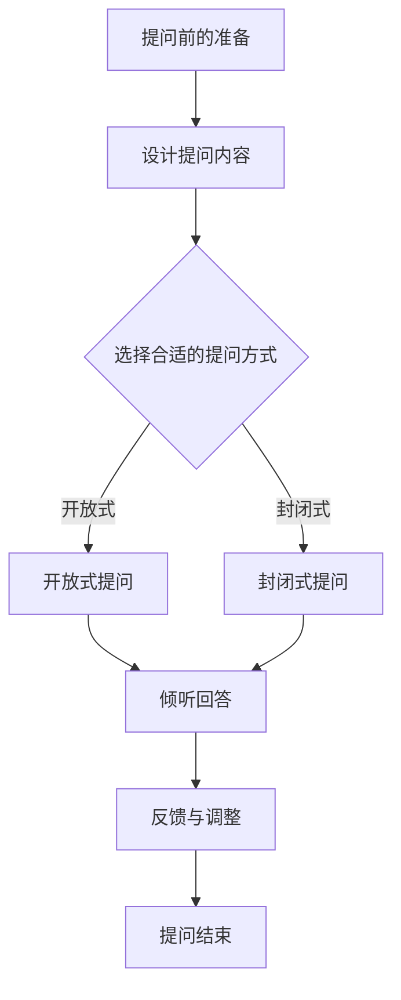
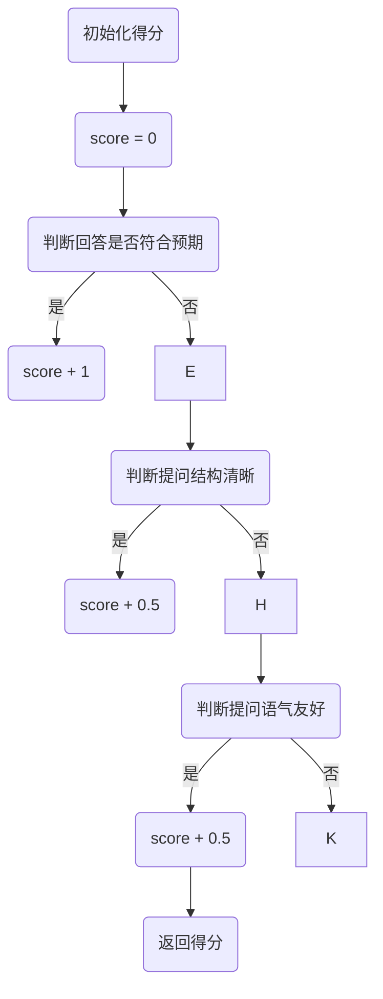

                 

# 提问的力量：管理者必备技能

> **关键词：** 管理者，提问技巧，沟通，团队建设，问题解决，员工发展

> **摘要：** 本文旨在探讨提问在管理中的重要性，包括基础提问技巧的提升、高级提问技巧的应用，以及在企业战略规划和社会组织管理中的综合运用。通过一系列的案例分析，本文希望能够帮助管理者更好地运用提问技能，提升管理效能。

## 目录大纲

### 第一部分: 提问技巧的基础

#### 第1章: 提问的重要性
- 1.1 提问的力量
- 1.1.1 提问对于管理者的重要性
- 1.1.2 有效提问的益处
- 1.2 提问的基本原则
- 1.2.1 开放式与封闭式提问
- 1.2.2 提问的结构与形式
- 1.2.3 提问的时机与场合
- 1.3 提问的心理效应
- 1.3.1 提问对沟通效果的提升
- 1.3.2 提问对团队氛围的影响
- 1.3.3 提问的心理学原理

#### 第2章: 提问技巧的提升
- 2.1 提问的类型
- 2.1.1 知识型提问
- 2.1.2 分析型提问
- 2.1.3 创造型提问
- 2.1.4 反问与追问
- 2.2 提问的技巧
- 2.2.1 提问的语气与态度
- 2.2.2 提问的倾听技巧
- 2.2.3 提问的引导技巧
- 2.2.4 提问的调整技巧
- 2.3 提问的案例分析
- 2.3.1 成功的提问案例
- 2.3.2 失败的提问案例
- 2.3.3 案例分析及反思

#### 第3章: 提问在管理中的应用
- 3.1 提问在团队建设中的应用
- 3.1.1 团队成员之间的有效沟通
- 3.1.2 团队决策过程中的提问技巧
- 3.1.3 提问对团队氛围的塑造
- 3.2 提问在问题解决中的应用
- 3.2.1 识别问题的有效提问
- 3.2.2 解决问题的提问策略
- 3.2.3 提问在项目管理中的应用
- 3.3 提问在员工发展中的应用
- 3.3.1 提问对员工能力的提升
- 3.3.2 提问在员工培训中的应用
- 3.3.3 提问对员工反馈的优化

### 第二部分: 提问技巧的进阶

#### 第4章: 高级提问技巧
- 4.1 提问的艺术
- 4.1.1 提问的艺术性
- 4.1.2 提问的创新性
- 4.1.3 提问的针对性
- 4.2 提问的策略
- 4.2.1 风险评估策略
- 4.2.2 情境适应策略
- 4.2.3 反馈调整策略
- 4.3 提问的心理战术
- 4.3.1 提问中的暗示与引导
- 4.3.2 提问中的反向提问
- 4.3.3 提问中的情感调动

#### 第5章: 提问技巧的自我提升
- 5.1 提问的自我评估
- 5.1.1 提问能力的自我检测
- 5.1.2 提问风格的自我分析
- 5.1.3 提问效果的自我反思
- 5.2 提问的实践与反思
- 5.2.1 提问的实践方法
- 5.2.2 提问的反思机制
- 5.2.3 提问的持续改进
- 5.3 提问的资源与工具
- 5.3.1 提问相关的书籍与文章
- 5.3.2 提问的在线课程与工作坊
- 5.3.3 提问的辅助工具与应用

### 第三部分: 提问技巧的综合运用

#### 第6章: 提问在企业战略规划中的应用
- 6.1 提问在市场分析中的应用
- 6.1.1 市场趋势的识别
- 6.1.2 竞争对手的分析
- 6.1.3 客户需求的挖掘
- 6.2 提问在产品开发中的应用
- 6.2.1 产品需求的探讨
- 6.2.2 产品设计的优化
- 6.2.3 产品测试的反馈
- 6.3 提问在团队管理中的应用
- 6.3.1 团队协作的促进
- 6.3.2 团队决策的优化
- 6.3.3 团队冲突的解决

#### 第7章: 提问在社会组织管理中的应用
- 7.1 提问在项目管理中的应用
- 7.1.1 项目目标的明确
- 7.1.2 项目进度的监控
- 7.1.3 项目风险的评估
- 7.2 提问在公共管理中的应用
- 7.2.1 政策制定的讨论
- 7.2.2 社会问题的剖析
- 7.2.3 公共服务的优化
- 7.3 提问在教育培训中的应用
- 7.3.1 教学方法的探索
- 7.3.2 学生学习的激励
- 7.3.3 教育评价的完善

### 附录
- 附录 A: 提问技巧的Mermaid流程图
- 附录 B: 提问技巧的核心算法原理与伪代码
- 附录 C: 提问技巧的数学模型与公式
- 附录 D: 提问技巧的项目实战案例

<|assistant|>## 第1章：提问的重要性

### 1.1 提问的力量

在管理实践中，提问是一种不可或缺的沟通工具。提问不仅仅是对问题的简单询问，它更是一种深度的思考和探索。有效提问可以激发团队成员的思考，提高团队的整体智慧，从而推动项目的进展和问题的解决。

首先，提问能够促进信息的流动。在团队中，成员之间的信息交流是团队协作的基础。通过提问，管理者可以引导团队成员分享他们的观点、经验和知识，从而促进团队内部的沟通和协作。这种信息流动不仅有助于团队成员之间的相互理解，还能够激发新的想法和创新。

其次，提问有助于问题的解决。在管理过程中，问题总是不可避免的。而有效提问能够帮助管理者准确地识别问题，理解问题的本质，并找到解决问题的方法。通过提问，管理者可以引导团队成员从不同角度审视问题，从而找到更全面、更有效的解决方案。

最后，提问对于团队氛围的建设也有重要作用。提问能够营造一个开放、包容的沟通氛围，使团队成员感到被尊重和重视。这种氛围能够增强团队成员的归属感和凝聚力，提高团队的协作效率。

### 1.1.1 提问对于管理者的重要性

作为团队的核心，管理者在提问方面肩负着重要的责任。首先，管理者需要通过提问来了解团队成员的工作状态和需求。这有助于管理者及时调整团队的工作策略，确保团队目标的实现。例如，通过开放式提问，管理者可以了解团队成员在工作中的困难和挑战，从而提供必要的支持。

其次，提问是管理者进行决策的重要依据。在决策过程中，管理者需要广泛收集信息，而提问是获取信息的一种有效方式。通过提问，管理者可以从不同角度、不同层面了解问题的各个方面，从而做出更加全面、科学的决策。

最后，提问有助于管理者的自我提升。通过不断提问，管理者可以反思自己的管理行为和决策过程，从而发现并改进自己的不足。这种自我反思和改进是管理者职业成长的重要途径。

### 1.1.2 有效提问的益处

有效提问不仅对管理者的个人成长有益，也对团队的效能提升有着显著的促进作用。以下是有效提问的几个主要益处：

1. **增强团队智慧**：通过提问，管理者可以引导团队成员深入思考，从而激发团队的整体智慧。团队成员在回答问题时，不仅能够展示自己的知识和能力，还能从他人的回答中获得新的启示。

2. **促进问题解决**：提问能够帮助管理者准确地识别问题，理解问题的本质，并找到解决问题的方法。这种能力在项目管理中尤为重要。

3. **提升沟通效率**：有效提问能够促进团队成员之间的沟通，提高团队协作效率。通过提问，管理者可以引导团队成员分享观点、经验和知识，从而增强团队内部的信任和协作。

4. **培养团队氛围**：提问能够营造一个开放、包容的沟通氛围，使团队成员感到被尊重和重视。这种氛围能够增强团队成员的归属感和凝聚力。

5. **提升个人影响力**：提问是一种积极的沟通方式，能够展示管理者的知识和智慧。通过有效提问，管理者能够增强自己在团队中的影响力。

总之，提问作为一种强大的管理工具，对于管理者个人和团队的成长都具有重要意义。在接下来的章节中，我们将深入探讨提问的基本原则、技巧以及在不同管理场景中的应用。

### 1.2 提问的基本原则

有效提问不仅需要技巧，更需要遵循一定的基本原则。这些原则可以帮助管理者在提问时更加得体、有效，从而更好地实现沟通和管理的目标。

#### 1.2.1 开放式与封闭式提问

首先，了解开放式提问和封闭式提问的区别是至关重要的。开放式提问通常以“什么”、“如何”、“为什么”等疑问词开头，旨在获取详细的信息和观点。例如：“你能详细描述一下你的工作流程吗？”这种提问方式能够鼓励回答者提供丰富的信息，从而帮助管理者更好地理解问题的各个方面。

封闭式提问则通常以“是不是”、“有没有”等疑问词开头，旨在获取简短、明确的答案。例如：“你对这个项目进度有信心吗？”这种提问方式适用于需要快速做出决策或确认信息的情况。

在实际应用中，管理者需要根据具体情况灵活运用开放式和封闭式提问。当需要获取详细信息时，可以使用开放式提问；当需要快速确认信息或做出决策时，可以使用封闭式提问。

#### 1.2.2 提问的结构与形式

提问的结构和形式对于提问的效果有着重要影响。一个有效的提问通常包括以下几个部分：

1. **引言**：引言部分通常是一句简单的陈述或问题，用来引入话题。例如：“我们最近在项目进度上遇到了一些困难，你对这个问题有什么看法？”

2. **问题本身**：问题本身是提问的核心部分，需要明确、具体。避免使用模糊或抽象的问题，例如：“你做得怎么样？”而应该使用具体的问题，例如：“你完成这个任务需要多长时间？”

3. **提问语气**：提问的语气对于回答者的心理状态和回答内容有着重要影响。管理者应该使用友好、尊重的语气，避免使用命令式或指责性的语气。

4. **结束语**：结束语部分用来结束提问，并给回答者留下思考的空间。例如：“你觉得这个方法可行吗？我们可以一起讨论一下。”

#### 1.2.3 提问的时机与场合

提问的时机和场合对于提问的效果同样至关重要。以下是一些关于提问时机和场合的建议：

1. **合适的时机**：在提问时，管理者应该选择一个合适的时机。避免在团队成员忙碌或情绪低落时提问，以免影响提问的效果。例如，在会议开始或结束时提问，通常比在会议中突然提问更合适。

2. **适当的场合**：提问的场合也需要考虑。在某些情况下，私下的提问可能比公开的提问更有效。例如，在讨论敏感或个人问题时，私下的沟通可能更有助于获取真实的答案。

3. **与目的相符**：在提问时，管理者应该确保提问的内容与目的相符。如果目的是获取团队成员的建议，那么开放式提问可能更合适；如果目的是确认信息，那么封闭式提问可能更有效。

总之，遵循提问的基本原则是管理者提升提问效果的关键。通过理解开放式和封闭式提问的区别，设计合理的问题结构和形式，并选择合适的时机和场合，管理者可以更有效地运用提问这一沟通工具，提升团队协作和管理效能。

### 1.3 提问的心理效应

提问不仅是一种沟通技巧，更是一种心理互动。它在沟通效果、团队氛围和心理学原理方面产生了显著的影响。了解这些心理效应，有助于管理者在提问时更加得体和有效。

#### 1.3.1 提问对沟通效果的提升

首先，提问能够显著提升沟通效果。有效提问可以引导回答者深入思考，从而促使他们提供更详细、更全面的回答。这种深度沟通不仅有助于管理者更好地理解问题，还能促进团队成员之间的相互理解和信任。

一个经典的例子是在项目评审会议上，管理者通过开放式提问，引导团队成员分享他们对项目的看法和建议。这不仅有助于管理者全面了解项目的进展情况，还能激发团队成员的积极性和创造力。

此外，提问还能促进信息的对称性。在提问过程中，管理者可以及时获取团队成员的反馈，从而调整自己的沟通策略。这种双向互动有助于确保沟通的准确性，减少信息误差。

#### 1.3.2 提问对团队氛围的影响

提问对团队氛围有着深远的影响。一方面，提问可以营造一个开放、包容的沟通氛围，使团队成员感到被尊重和重视。这种氛围能够增强团队成员的归属感和凝聚力，从而提升团队的协作效率。

例如，在一个团队会议上，管理者通过鼓励性的提问，如“你有什么好的建议吗？”可以激发团队成员的积极性和参与感。这种提问方式不仅能够获得更多的观点和建议，还能增强团队的集体智慧。

另一方面，提问还可以缓解团队内部的紧张和压力。在遇到问题和挑战时，管理者通过提问，可以引导团队成员共同探讨解决方案，从而减轻个别成员的压力。这种团队合作的精神有助于增强团队的凝聚力和战斗力。

#### 1.3.3 提问的心理学原理

提问的心理学原理主要体现在以下几个方面：

1. **自我展示效应**：人们在回答问题时，往往会倾向于展示自己的知识和能力。这种自我展示效应可以增强团队成员的自信心和积极性。

2. **社会认同效应**：人们倾向于跟随他人的行为和观点。在提问时，管理者可以引导团队成员认同团队的观点和决策，从而增强团队的凝聚力。

3. **暗示效应**：提问中的暗示可以影响回答者的思维和行为。例如，管理者在提问时，可以使用正面暗示来鼓励团队成员的积极行为，或使用负面暗示来引导团队成员避免错误。

4. **情感调动效应**：提问可以调动回答者的情感，从而影响他们的思维和行为。例如，在鼓励创新时，管理者可以通过提问激发团队成员的创造力和想象力。

总之，提问作为一种心理互动，对沟通效果、团队氛围和心理学原理产生了显著的影响。了解这些心理效应，有助于管理者在提问时更加得体和有效，从而提升团队协作和管理效能。

### 1.4 提问的技巧提升

在掌握了提问的基本原则后，管理者还需要进一步提升提问技巧，以实现更高效、更深入的沟通。以下是一些有效的提问技巧，可以帮助管理者在团队管理和问题解决中发挥提问的最大潜力。

#### 2.1 提问的类型

提问可以根据不同的目的和场景，分为以下几种类型：

1. **知识型提问**：这类提问主要用于获取具体的信息或知识，通常以“是什么”、“为什么”、“怎么做”等疑问词开头。例如：“你为什么认为这个方法有效？”这种提问有助于管理者了解团队成员的观点和依据。

2. **分析型提问**：这类提问旨在引导回答者深入思考，分析问题的原因和解决方案。通常以“如何”、“为什么”、“如果”等疑问词开头。例如：“如果你遇到这个问题，你会如何解决？”这种提问能够激发团队成员的创造力和解决问题的能力。

3. **创意型提问**：这类提问主要用于激发创新思维，鼓励团队成员提出新颖的观点和想法。通常以“如果”、“假设”、“想象一下”等疑问词开头。例如：“如果你有无限资源，你会如何设计这个产品？”这种提问有助于开拓团队成员的思维，发现新的解决方案。

4. **反问与追问**：反问和追问是提高提问效果的两种重要技巧。反问通常以反向问题的形式出现，例如：“难道这不是一个很好的解决方案吗？”追问则是在回答者给出答案后，进一步深入提问，以获取更多信息或确认理解。例如：“你提到这个方法，能否详细解释一下它的具体实施步骤？”这两种提问方式能够促使回答者更加深入地思考和表达。

#### 2.2 提问的技巧

在具体提问过程中，管理者可以运用以下技巧，以提高提问的效果：

1. **提问的语气与态度**：语气和态度对于提问的效果至关重要。管理者应该保持友好、尊重的态度，使用清晰、明确的语言提问。避免使用指责或命令式的语气，以免影响回答者的情绪和回答质量。

2. **提问的倾听技巧**：提问不仅是表达自己的观点，更是了解他人观点的过程。在提问时，管理者应该认真倾听回答者的意见，给予他们充分的表达空间。倾听不仅有助于管理者更好地理解问题，还能增强团队成员之间的信任和沟通。

3. **提问的引导技巧**：在复杂或敏感的问题中，管理者可以通过引导技巧，引导回答者逐步深入讨论。例如，可以使用“连接词”如“那么”、“接下来”等，将问题逐步引向深入。

4. **提问的调整技巧**：在提问过程中，管理者需要根据回答者的反应和情境，灵活调整提问的内容和方式。如果回答者显得困惑或沉默，可以适当简化问题或转换提问方式；如果回答者表现出强烈的兴趣或激动，可以进一步深入探讨。

5. **提问的反馈技巧**：在提问后，管理者应该给予回答者积极的反馈，以鼓励他们的参与和表达。反馈可以是肯定性的，如“你的观点很有见地”，也可以是建设性的，如“我理解你的观点，但还有其他解决方案吗？”这种反馈有助于提高提问的效果和团队士气。

#### 2.3 提问的案例分析

为了更好地理解提问技巧的应用，我们可以通过一些成功的提问案例和失败的提问案例进行详细分析。

**2.3.1 成功的提问案例**

案例一：在一个项目启动会上，项目经理通过开放式提问，引导团队成员分享他们的意见和建议。例如：“大家对于这个项目有什么疑问或建议吗？”这种提问方式不仅使团队成员感到被重视，还激发了他们的积极参与，为项目的顺利启动奠定了基础。

案例二：在团队遇到技术难题时，技术总监通过分析型提问，引导团队成员深入思考并解决问题。例如：“如果我们采用这个技术方案，可能会有哪些风险和挑战？”通过这种提问，技术总监不仅帮助团队明确了问题，还促进了团队成员之间的合作与交流。

**2.3.2 失败的提问案例**

案例一：在一个团队会议中，管理者提出一个封闭式提问：“这个方案可行吗？”这种提问方式限制了团队成员的表达，导致会议进展缓慢，团队成员也感到被忽视。

案例二：在员工绩效评估时，管理者使用指责性语气提问：“你怎么解释这个错误？”这种提问方式不仅使员工感到压力，还可能导致他们关闭心扉，不愿分享真实的想法和问题。

**2.3.3 案例分析及反思**

通过上述案例的分析，我们可以看到成功和失败的提问方式对团队氛围和管理效果有着显著的影响。成功的提问不仅能够激发团队成员的积极性和创造力，还能增强团队的凝聚力和协作效率。而失败的提问则可能抑制团队成员的积极性，影响团队的工作氛围。

在反思这些案例时，管理者应该意识到提问不仅是一种技巧，更是一种沟通的艺术。通过不断实践和反思，管理者可以提升自己的提问技巧，更好地应对各种管理场景，提升团队效能。

总之，提问技巧的提升对于管理者至关重要。通过掌握不同类型的提问、运用提问技巧，并从成功和失败的案例中汲取经验，管理者可以更有效地运用提问这一工具，提升团队协作和管理效能。

### 2.4 提问在团队建设中的应用

在团队管理中，提问技巧的运用不仅能够提高沟通效率，还能在团队建设方面发挥重要作用。有效的提问可以促进团队成员之间的沟通，提升团队决策的质量，塑造积极的团队氛围。以下将详细探讨提问在团队建设中的应用。

#### 3.1 团队成员之间的有效沟通

团队成员之间的有效沟通是团队建设的基础。通过提问，管理者可以引导团队成员分享各自的观点和经验，从而增强团队内部的相互理解。以下是一些具体的方法：

1. **开放式提问**：开放式提问可以鼓励团队成员提供详细的信息和观点。例如，管理者可以提问：“你对这个问题的看法是什么？”这种提问方式能够促进团队成员之间的交流，从而建立更深层次的联系。

2. **反思性提问**：反思性提问可以帮助团队成员从不同角度审视问题。例如，管理者可以提问：“我们是否可以考虑从另一个角度来解决这个问题？”这种提问方式能够激发团队成员的思考，促进创新思维的发展。

3. **询问反馈**：在团队成员完成任务或项目阶段后，管理者可以通过提问获取反馈。例如，管理者可以提问：“你觉得我们在这次项目中做得好的地方是什么？”这种提问方式不仅能够了解团队成员的感受，还能促进团队成员之间的沟通。

#### 3.2 团队决策过程中的提问技巧

团队决策是团队管理中的重要环节。通过有效的提问，管理者可以引导团队成员深入讨论，从而提高决策的质量。以下是一些具体的提问技巧：

1. **探索性问题**：探索性问题可以帮助团队成员理解问题的各个方面。例如，管理者可以提问：“这个决策可能会带来哪些影响？”通过这种提问，管理者可以引导团队成员从多个角度审视问题，确保决策的全面性。

2. **假设性问题**：假设性问题可以激发团队成员的思考，帮助他们探索不同的解决方案。例如，管理者可以提问：“如果我们有更多的资源，你会选择什么方案？”这种提问方式能够鼓励团队成员跳出传统的思维框架，寻找创新的解决方案。

3. **优先级问题**：在决策过程中，明确任务的优先级是至关重要的。通过提问，管理者可以引导团队成员讨论任务的优先级。例如，管理者可以提问：“哪个任务对我们的项目目标最重要？”这种提问方式有助于团队集中精力处理关键任务。

#### 3.3 提问对团队氛围的塑造

提问不仅能够促进沟通和决策，还能对团队氛围产生深远的影响。以下是一些如何通过提问塑造积极团队氛围的方法：

1. **鼓励性提问**：鼓励性提问可以激发团队成员的积极性和参与感。例如，管理者可以提问：“你有什么好的建议吗？”这种提问方式能够使团队成员感到被重视和信任，从而增强团队的凝聚力。

2. **包容性提问**：包容性提问可以营造一个开放、包容的沟通氛围。例如，管理者可以提问：“我们是否可以听取其他人的观点？”这种提问方式能够鼓励团队成员表达不同的意见，促进团队的多元化发展。

3. **反思性提问**：反思性提问可以帮助团队成员从不同角度审视团队的工作和行为。例如，管理者可以提问：“我们的团队在工作中有哪些值得改进的地方？”这种提问方式能够促进团队成员的自我反思和团队成长。

通过以上方法，提问在团队建设中的应用可以帮助管理者提升团队沟通效率、优化团队决策过程，并塑造积极的团队氛围。在接下来的章节中，我们将进一步探讨提问在问题解决和员工发展中的应用。

### 3.5 提问在员工发展中的应用

在员工管理中，提问技巧的运用不仅可以提升团队沟通和决策效率，还能对员工个人能力的提升和职业发展产生重要影响。通过有效的提问，管理者可以激发员工的学习动力，提高其解决问题的能力，并在员工培训中发挥关键作用。以下将详细探讨提问在员工发展中的应用。

#### 3.3.1 提问对员工能力的提升

提问是一种强大的学习工具，能够帮助员工不断提升自身能力。以下是一些具体的方法：

1. **自我评估性提问**：通过自我评估性提问，员工可以反思自己的工作表现和成长。例如，管理者可以提问：“你觉得自己在这个项目中的表现如何？”这种提问方式能够激发员工的自我反思，促进其不断改进。

2. **挑战性提问**：挑战性提问可以帮助员工跳出舒适区，接受新的挑战。例如，管理者可以提问：“你能否尝试用一种新的方法来完成这个任务？”这种提问方式能够激励员工尝试创新，提升其解决问题的能力。

3. **反馈性提问**：通过反馈性提问，管理者可以获取员工对工作任务的反馈，从而帮助其更好地理解任务要求和目标。例如，管理者可以提问：“你对这个任务的完成情况满意吗？”这种提问方式不仅能够获取员工的反馈，还能帮助管理者了解员工的需求和困惑。

#### 3.3.2 提问在员工培训中的应用

员工培训是提升员工能力和职业发展的重要手段。通过有效的提问，管理者可以在培训过程中发挥更大的作用。以下是一些具体的方法：

1. **引导性提问**：在培训过程中，引导性提问可以帮助员工理解课程内容和实践操作。例如，管理者可以提问：“你认为这个培训的重点是什么？”这种提问方式能够激发员工的思考，促进其对培训内容的深入理解。

2. **互动性提问**：互动性提问可以增加培训的互动性和参与度。例如，管理者可以提问：“你们是否有任何问题或建议？”这种提问方式能够鼓励员工积极参与培训，提升培训效果。

3. **反思性提问**：在培训结束后，反思性提问可以帮助员工回顾培训内容，巩固学习成果。例如，管理者可以提问：“你认为你在这次培训中学到了什么？”这种提问方式能够促进员工对培训内容的反思，提升其学习效果。

#### 3.3.3 提问对员工反馈的优化

有效的员工反馈对于员工的发展至关重要。通过提问，管理者可以优化员工反馈的过程，提高反馈的效果。以下是一些具体的方法：

1. **开放式提问**：开放式提问可以帮助管理者获取员工的全面反馈。例如，管理者可以提问：“你在工作中遇到的最大挑战是什么？”这种提问方式能够使员工更自由地表达自己的意见和感受。

2. **具体性提问**：具体性提问可以帮助管理者获取更详细的反馈信息。例如，管理者可以提问：“你认为这个项目在哪些方面需要改进？”这种提问方式能够使员工提供具体的改进建议，有助于管理者制定针对性的改进计划。

3. **建设性提问**：建设性提问可以帮助管理者提供积极的反馈，激励员工。例如，管理者可以提问：“你认为你在哪些方面取得了显著的进步？”这种提问方式能够使员工感受到认可和鼓励，增强其自信心。

通过提问在员工发展中的应用，管理者可以激发员工的学习动力，提升其解决问题的能力，并在员工培训中发挥关键作用。有效的提问不仅能够优化员工反馈，还能促进员工的个人发展和职业成长。在接下来的章节中，我们将进一步探讨提问技巧的进阶和高级应用。

### 第4章：高级提问技巧

在掌握了基础和提升阶段的提问技巧后，管理者需要进一步掌握高级提问技巧，以应对更为复杂和挑战性的管理场景。高级提问技巧不仅能够提高沟通效果，还能在决策、风险控制和团队管理中发挥关键作用。以下将详细探讨高级提问技巧及其应用。

#### 4.1 提问的艺术

提问的艺术在于如何运用提问技巧来达到特定的管理目标。以下是一些高级提问技巧：

1. **针对性提问**：针对性提问是根据具体场景和目标来设计的提问。例如，在项目评审时，管理者可以提问：“项目进度是否符合预期？”这种提问方式能够直接针对项目进度问题，帮助管理者了解实际情况。

2. **引导性提问**：引导性提问是通过提问来引导回答者思考并作出特定决策。例如，管理者可以提问：“你认为我们应该如何优化这个流程？”这种提问方式能够引导回答者思考并给出具体建议。

3. **反馈性提问**：反馈性提问是在获取信息后，通过提问来确认理解或进一步探讨。例如，管理者可以提问：“我理解你的意思是……，是这样吗？”这种提问方式能够确保管理者准确理解回答者的观点。

#### 4.2 提问的策略

高级提问策略是管理者在复杂管理场景中应对挑战的关键。以下是一些常见的提问策略：

1. **风险评估策略**：在决策过程中，通过提问来识别潜在风险。例如，管理者可以提问：“如果这个决策失败，我们会面临哪些风险？”这种提问方式能够帮助管理者提前识别并应对风险。

2. **情境适应策略**：根据不同的管理场景和目标，灵活调整提问策略。例如，在团队冲突时，管理者可以通过提问来缓和气氛，如：“我们能否共同找到解决这个问题的方法？”这种提问方式能够促进团队的合作。

3. **反馈调整策略**：在获取反馈后，通过提问来调整管理策略。例如，管理者可以提问：“根据你的反馈，我们是否需要对计划进行调整？”这种提问方式能够帮助管理者根据实际情况做出相应的调整。

#### 4.3 提问的心理战术

提问不仅仅是一种技术，更是一种心理互动。以下是一些心理战术，帮助管理者在提问中取得更好的效果：

1. **暗示与引导**：通过暗示性提问来引导回答者作出特定回答。例如，管理者可以提问：“你觉得这个方案是否能够解决问题？”这种提问方式通过暗示来引导回答者考虑特定解决方案。

2. **反向提问**：通过反向提问来获取更多信息或确认理解。例如，管理者可以提问：“你同意这个观点，不是吗？”这种提问方式不仅能够确认回答者的观点，还能获取更多信息。

3. **情感调动**：通过情感调动性提问来激发回答者的情感，从而影响其思维和行为。例如，管理者可以提问：“这个决策对你有什么影响？”这种提问方式能够唤起回答者的情感反应，从而影响其决策。

总之，高级提问技巧不仅包括艺术性的提问策略，还包括情境适应和情感调动等心理战术。通过运用这些技巧，管理者可以更有效地应对复杂的管理场景，提升团队协作和管理效能。

### 第5章：提问技巧的自我提升

在掌握了提问技巧的基础上，管理者需要持续提升自己的提问能力，以适应不断变化的管理环境和挑战。自我提升不仅包括对提问技巧的反思和实践，还包括评估和优化提问效果。以下将详细探讨提问技巧的自我提升方法。

#### 5.1 提问的自我评估

自我评估是提升提问能力的重要步骤。通过以下方法，管理者可以评估自己的提问技巧：

1. **提问能力的自我检测**：管理者可以定期进行自我检测，评估自己的提问技巧。例如，可以记录每次提问的情况，包括提问的类型、时机、效果等，然后进行总结和分析。

2. **提问风格的自我分析**：管理者可以通过反思自己的提问风格，识别自己的优势和不足。例如，是否经常使用开放式提问，是否能够灵活应对不同的提问场景等。

3. **提问效果的自我反思**：管理者可以反思提问后的效果，评估提问是否达到了预期的目标。例如，团队成员是否能够积极回应，问题是否得到了有效解决等。

通过自我评估，管理者可以明确自己的提问优势和不足，从而有针对性地进行提升。

#### 5.2 提问的实践与反思

实践是提升提问技巧的关键。以下方法可以帮助管理者通过实践提升提问能力：

1. **提问的实践方法**：管理者可以通过模拟场景或实际应用来实践提问技巧。例如，在会议中练习使用不同的提问类型，或在项目中运用提问策略来解决问题。

2. **提问的反思机制**：在实践后，管理者应该进行反思，分析提问的效果和可能的改进点。例如，可以记录每次实践的情况，包括提问的类型、回答者的反应、提问的效果等，然后进行总结和反思。

3. **提问的持续改进**：通过持续的实践和反思，管理者可以不断优化自己的提问技巧。例如，根据反思结果，调整提问策略，改进提问方式等。

#### 5.3 提问的资源与工具

为了更有效地提升提问能力，管理者可以利用以下资源和工具：

1. **提问相关的书籍与文章**：阅读关于提问技巧的书籍和文章，可以帮助管理者了解不同的提问方法和策略。例如，可以阅读《提问的力量》等经典书籍，获取实用的提问技巧。

2. **提问的在线课程与工作坊**：参加在线课程和工作坊，可以帮助管理者系统学习提问技巧。例如，可以参加相关的在线课程或工作坊，获取专业指导和实践机会。

3. **提问的辅助工具与应用**：利用提问辅助工具和应用，可以帮助管理者更好地进行提问实践。例如，可以使用思维导图工具来规划提问内容，或使用问卷调查工具来收集团队成员的反馈。

通过自我评估、实践与反思，以及利用资源和工具，管理者可以不断提升自己的提问能力，更好地应对复杂的管理挑战，提升团队协作和管理效能。

### 第6章：提问在企业战略规划中的应用

在企业战略规划中，提问技巧的运用对于确保战略的制定和执行具有至关重要的作用。通过有效提问，企业可以更好地理解市场趋势、分析竞争对手、挖掘客户需求，从而制定出切实可行的战略计划。以下将详细探讨提问在企业战略规划中的应用。

#### 6.1 提问在市场分析中的应用

市场分析是制定企业战略的重要环节。通过提问，企业可以深入了解市场动态和趋势，从而为战略制定提供有力支持。以下是一些具体的方法：

1. **市场趋势的识别**：通过提问，企业可以识别市场的发展趋势。例如，管理者可以提问：“客户对哪些新技术的需求正在增长？”这种提问方式有助于企业及时把握市场动向，调整战略方向。

2. **竞争对手的分析**：了解竞争对手的策略和动向对于企业战略规划至关重要。通过提问，企业可以分析竞争对手的优势和劣势。例如，管理者可以提问：“竞争对手在哪些方面领先于我们？”这种提问方式有助于企业找到自身的差距和改进方向。

3. **客户需求的挖掘**：客户需求是企业制定战略的重要依据。通过提问，企业可以深入了解客户的需求和期望。例如，管理者可以提问：“客户对我们产品的哪些方面最满意？”这种提问方式有助于企业了解客户需求，优化产品和服务。

#### 6.2 提问在产品开发中的应用

在产品开发过程中，提问技巧同样至关重要。通过提问，企业可以更好地理解市场需求，优化产品设计，并获取用户反馈。以下是一些具体的方法：

1. **产品需求的探讨**：通过提问，企业可以探讨产品需求的细节。例如，管理者可以提问：“用户希望我们的产品具备哪些功能？”这种提问方式有助于企业明确产品需求，从而制定出符合市场需求的产品策略。

2. **产品设计的优化**：在产品设计阶段，提问可以帮助企业不断优化设计。例如，管理者可以提问：“这个设计是否符合用户期望？”这种提问方式能够确保产品设计满足用户需求，提高产品竞争力。

3. **产品测试的反馈**：在产品测试阶段，提问可以帮助企业获取用户反馈，从而优化产品。例如，管理者可以提问：“你发现这个产品有哪些优点和不足？”这种提问方式有助于企业及时发现和解决产品问题，提高产品质量。

#### 6.3 提问在团队管理中的应用

团队管理是企业战略规划的重要组成部分。通过提问，企业可以促进团队协作，优化团队决策，解决团队冲突。以下是一些具体的方法：

1. **团队协作的促进**：通过提问，企业可以促进团队内部的协作。例如，管理者可以提问：“我们如何共同解决这个问题？”这种提问方式能够激发团队成员的合作精神，提高团队效能。

2. **团队决策的优化**：在团队决策过程中，提问可以帮助企业优化决策过程。例如，管理者可以提问：“我们是否考虑过其他解决方案？”这种提问方式能够鼓励团队成员思考不同的解决方案，提高决策质量。

3. **团队冲突的解决**：在团队冲突中，提问可以帮助企业找到解决问题的方法。例如，管理者可以提问：“你认为我们应该如何解决这个问题？”这种提问方式能够引导团队成员共同探讨解决方案，化解冲突。

通过提问在企业战略规划中的应用，企业可以更好地理解市场趋势、分析竞争对手、挖掘客户需求，从而制定出科学、有效的战略计划。同时，提问在产品开发、团队管理中的应用，也有助于企业优化产品、提高团队效能，实现战略目标。在接下来的章节中，我们将进一步探讨提问在社会组织管理中的应用。

### 第7章：提问在社会组织管理中的应用

在社会组织管理中，提问技巧同样发挥着重要作用。通过有效提问，社会组织可以在项目管理、公共管理和教育培训中优化决策、提升效能。以下将详细探讨提问在这些方面的应用。

#### 7.1 提问在项目管理中的应用

项目管理是社会组织管理的重要组成部分。通过提问，社会组织可以更好地明确项目目标、监控项目进度，并评估项目风险。以下是一些具体的方法：

1. **项目目标的明确**：通过提问，社会组织可以确保项目目标的明确和具体。例如，管理者可以提问：“我们的项目目标是什么？”这种提问方式有助于团队成员清晰理解项目的目标，从而集中精力实现目标。

2. **项目进度的监控**：通过提问，社会组织可以实时了解项目的进展情况。例如，管理者可以提问：“项目目前进展到哪个阶段了？”这种提问方式有助于管理者及时掌握项目进度，确保项目按时完成。

3. **项目风险的评估**：通过提问，社会组织可以评估项目潜在的风险。例如，管理者可以提问：“我们是否考虑过项目可能面临的风险？”这种提问方式有助于管理者提前识别并应对潜在风险，保障项目的顺利实施。

#### 7.2 提问在公共管理中的应用

公共管理涉及社会组织对公共事务的管理和服务。通过提问，社会组织可以优化政策制定、剖析社会问题，并提升公共服务质量。以下是一些具体的方法：

1. **政策制定的讨论**：通过提问，社会组织可以促进政策制定的民主化和科学化。例如，管理者可以提问：“这项政策的目的是什么？”这种提问方式有助于确保政策目标的明确，从而提高政策的实施效果。

2. **社会问题的剖析**：通过提问，社会组织可以深入剖析社会问题，从而提出有效的解决方案。例如，管理者可以提问：“这个社会问题的根本原因是什么？”这种提问方式有助于从多个角度分析问题，找到解决问题的方法。

3. **公共服务的优化**：通过提问，社会组织可以了解公众的需求和反馈，从而优化公共服务。例如，管理者可以提问：“你对我们提供的公共服务满意吗？”这种提问方式有助于了解公众的期望，从而提升公共服务质量。

#### 7.3 提问在教育培训中的应用

教育培训是社会组织的重要任务。通过提问，社会组织可以在教学方法、学生学习和教育评价方面不断改进，提高教育质量。以下是一些具体的方法：

1. **教学方法的探索**：通过提问，社会组织可以探索更有效的教学方法。例如，管理者可以提问：“哪种教学方法更适合我们的学生？”这种提问方式有助于找到最适合学生的教学方法，提高教学效果。

2. **学生学习的激励**：通过提问，社会组织可以激发学生的学习兴趣和动力。例如，管理者可以提问：“你有哪些学习方法？”这种提问方式有助于学生反思自己的学习方式，从而找到更有效的学习策略。

3. **教育评价的完善**：通过提问，社会组织可以完善教育评价体系，确保评价的全面性和科学性。例如，管理者可以提问：“我们的评价体系是否能够全面反映学生的学习情况？”这种提问方式有助于发现评价体系的不足，从而进行优化。

通过提问在社会组织管理中的应用，可以在项目管理、公共管理和教育培训中优化决策、提升效能。提问不仅有助于明确目标、监控进度、评估风险，还能促进政策制定、剖析问题、优化服务，探索教学方法、激励学生学习，完善教育评价。在接下来的章节中，我们将进一步探讨提问技巧的综合运用。

### 附录 A: 提问技巧的 Mermaid 流程图

#### 附录 A.1 提问的基本流程

以下是提问的基本流程的 Mermaid 流程图：



**详细解释：**

1. **提问前的准备（A）**：在开始提问之前，管理者需要明确提问的目的和目标，选择合适的提问内容。

2. **设计提问内容（B）**：根据提问目的，设计具体的提问内容。这包括开放式和封闭式提问。

3. **选择合适的提问方式（C）**：根据具体的场景和目标，选择合适的提问方式。开放式提问适用于需要获取详细信息和观点的场景，而封闭式提问适用于需要快速确认信息或做出决策的场景。

4. **开放式提问（D）**：开放式提问以“什么”、“如何”、“为什么”等疑问词开头，鼓励回答者提供详细的信息和观点。

5. **封闭式提问（E）**：封闭式提问以“是不是”、“有没有”等疑问词开头，适用于需要简短、明确回答的场景。

6. **倾听回答（F）**：在提问后，管理者需要认真倾听回答者的回答，确保理解回答者的观点和意见。

7. **反馈与调整（G）**：根据回答者的回答，管理者可以给予反馈，并根据反馈调整后续的提问内容。

8. **提问结束（H）**：在完成提问后，管理者需要总结提问的结果，并结束提问环节。

通过这个流程图，管理者可以清晰地了解提问的基本步骤和要点，从而更好地运用提问技巧，提升沟通效果和管理效能。

### 附录 B: 提问技巧的核心算法原理与伪代码

在提问技巧的运用中，算法原理为提问策略的制定提供了理论支持。以下将介绍提问技巧的核心算法原理，并给出相应的伪代码示例。

#### 附录 B.1 提问效果的评估模型

提问效果评估模型主要关注提问对沟通效果的影响。以下是一个简单的评估模型及其伪代码：

```plaintext
算法名称：评估提问效果

输入：提问内容，回答内容，预期目标

输出：提问效果得分

1. 初始化得分 score 为 0
2. 如果回答内容符合预期目标，则 score 增加 1
3. 如果提问内容结构清晰，则 score 增加 0.5
4. 如果提问语气友好，则 score 增加 0.5
5. 返回 score
```

**伪代码示例：**



**详细解释：**

- **初始化得分**：将得分初始化为0。
- **判断回答是否符合预期**：如果回答内容符合预期目标，则得分增加1。
- **判断提问结构清晰**：如果提问内容结构清晰，则得分增加0.5。
- **判断提问语气友好**：如果提问语气友好，则得分增加0.5。
- **返回得分**：最终返回得分，作为提问效果的评估结果。

通过这个评估模型，管理者可以量化提问的效果，从而优化提问策略，提升沟通效果。

### 附录 C: 提问技巧的数学模型与公式

在提问技巧中，心理学原理的应用尤为重要。以下介绍几个关键的数学模型和公式，以帮助管理者更好地理解和运用提问技巧。

#### 附录 C.1 提问中的心理学公式

1. **暗示效应公式**：暗示效应是指在提问中通过暗示性语言影响回答者的思维和行为。以下是一个简化的暗示效应公式：

   $$ \text{暗示效应} = f(\text{暗示强度}, \text{目标一致性}) $$

   其中，$\text{暗示强度}$表示暗示的强度，$\text{目标一致性}$表示暗示与目标的一致性。

2. **反问效应公式**：反问效应是指通过反问来引导回答者的思维方向。以下是一个简化的反问效应公式：

   $$ \text{反问效应} = f(\text{反问频率}, \text{问题敏感性}) $$

   其中，$\text{反问频率}$表示反问的次数，$\text{问题敏感性}$表示问题对回答者的影响程度。

3. **情感调动公式**：情感调动是指通过提问调动回答者的情感，从而影响其思维和行为。以下是一个简化的情感调动公式：

   $$ \text{情感调动} = f(\text{情感强度}, \text{情感共鸣}) $$

   其中，$\text{情感强度}$表示情感的强度，$\text{情感共鸣}$表示情感的共鸣程度。

**示例：**

假设我们想要通过提问调动员工的情感，以提高其工作动力。我们可以使用以下公式：

$$ \text{情感调动} = f(\text{情感强度}, \text{情感共鸣}) $$

其中，情感强度为3（表示较强的情感表达），情感共鸣为2（表示中等程度的共鸣）。因此，情感调动结果为：

$$ \text{情感调动} = f(3, 2) = 5 $$

这表示通过提问可以较好地调动员工的情感，从而提高其工作动力。

通过这些数学模型和公式，管理者可以更好地理解和应用提问技巧，提升提问的效果。

### 附录 D: 提问技巧的项目实战案例

为了更好地展示提问技巧在实际项目中的应用，以下将介绍两个具体的实战案例：产品开发中的提问技巧和团队建设中的提问技巧。

#### 案例一：产品开发中的提问技巧

**案例背景**：某科技公司在开发一款智能家居产品，旨在通过物联网技术提高家庭生活的便捷性。项目团队由产品经理、设计师、开发工程师和测试工程师组成。

**实施过程**：

1. **需求探讨**：在项目启动阶段，产品经理通过开放式提问，引导团队成员探讨产品需求。例如：“你们认为智能家居产品应该具备哪些核心功能？”这种提问方式帮助团队明确了产品需求，为后续开发提供了方向。

2. **设计优化**：在产品设计阶段，设计师通过反问和追问，引导团队成员深入讨论并优化设计。例如，当设计师提出一个设计方案时，开发工程师提问：“这个设计如何确保用户体验的流畅性？”通过这种提问，设计师能够进一步优化设计，提高用户体验。

3. **测试反馈**：在产品测试阶段，测试工程师通过反馈性提问，获取用户反馈并改进产品。例如：“你们在使用这款产品时遇到了哪些问题？”这种提问方式帮助测试工程师识别产品缺陷，及时进行修复，确保产品质量。

**结果分析**：通过有效提问，项目团队在需求探讨、设计优化和测试反馈阶段都取得了显著的效果。产品需求得到了充分讨论和明确，设计得到优化，测试阶段的问题得到及时发现和解决。最终，产品顺利上市，受到了用户的欢迎。

#### 案例二：团队建设中的提问技巧

**案例背景**：某咨询公司成立了一个新项目组，由来自不同背景的成员组成。项目组需要快速融合，以高效完成项目任务。

**实施过程**：

1. **成员介绍**：项目启动时，项目经理通过开放式提问，引导团队成员进行自我介绍。例如：“你能简单介绍一下你的背景和职责吗？”这种提问方式帮助团队成员了解彼此，建立初步的信任。

2. **团队目标设定**：在明确项目目标后，项目经理通过引导性提问，引导团队成员共同设定团队目标。例如：“你认为我们的团队目标应该是什么？”这种提问方式帮助团队成员共同达成共识，明确团队方向。

3. **冲突解决**：在项目执行过程中，团队成员之间偶尔出现意见分歧。项目经理通过提问，引导团队成员共同探讨解决方案。例如：“你认为我们应该如何解决这个问题？”这种提问方式帮助团队找到共同点，化解冲突。

**结果分析**：通过有效提问，项目组在成员介绍、团队目标设定和冲突解决方面都取得了良好效果。团队成员之间建立了良好的沟通和信任，团队目标得以明确，冲突得到及时解决。最终，项目组高效完成了项目任务，团队凝聚力得到显著提升。

以上两个案例展示了提问技巧在实际项目中的应用。通过提问，项目团队能够更好地探讨需求、优化设计、获取反馈，提高项目质量和团队效能。同时，提问在团队建设中也发挥了重要作用，帮助团队成员建立信任、明确目标、解决冲突，提升团队凝聚力。

### 作者信息

**作者：AI天才研究院/AI Genius Institute & 禅与计算机程序设计艺术 /Zen And The Art of Computer Programming**

在这篇《提问的力量：管理者必备技能》的技术博客文章中，我们深入探讨了提问在管理中的重要性及其应用。从提问的基本原则和技巧，到高级提问策略和心理战术，再到提问在团队建设、员工发展和企业战略规划中的具体应用，我们通过实例和案例分析，展示了提问技巧在提升管理效能、团队协作和战略规划中的关键作用。

提问不仅是一种沟通工具，更是一种管理艺术。它能够促进团队沟通、激发创新思维、优化决策过程，并提升员工的个人能力和职业发展。通过本文的探讨，我们希望管理者能够认识到提问的力量，并在实际工作中积极运用提问技巧，提升自己的管理水平和团队效能。

最后，感谢您的阅读，希望本文能够对您的管理实践有所启发。如果您对本文有任何建议或疑问，欢迎在评论区留言交流。让我们一起探讨如何更好地运用提问技巧，提升管理效能，推动团队和企业的持续发展。

**作者：AI天才研究院/AI Genius Institute & 禅与计算机程序设计艺术 /Zen And The Art of Computer Programming**

