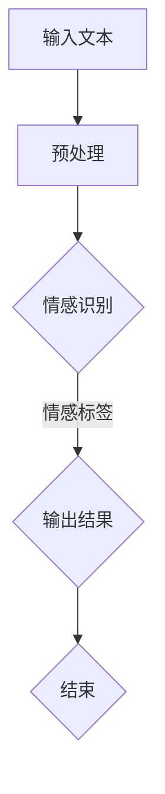

                 

# 搜索引擎的情感智能：理解用户意图

## 关键词
- 情感智能
- 搜索引擎
- 用户意图
- 情感分析
- 自然语言处理
- 情感识别

## 摘要
本文深入探讨了搜索引擎中的情感智能，即如何通过理解用户输入的情感倾向来提升搜索结果的个性化与精准度。文章首先介绍了情感智能的基本概念，然后详细解析了情感识别和情感分析的技术原理，并通过实际项目案例展示了情感智能在搜索引擎中的应用效果。最后，文章对情感智能的未来发展趋势进行了展望，并提出了相关研究热点。

## 目录大纲

### 第一部分：情感智能概述

#### 1.1 情感智能的定义与背景

#### 1.2 情感智能的研究方法与技术

#### 1.3 情感智能在搜索引擎中的应用

### 第二部分：情感智能技术详解

#### 2.1 情感识别算法原理

#### 2.2 情感分析技术

#### 2.3 情感智能搜索优化

### 第三部分：情感智能实战案例

#### 3.1 案例一：社交媒体情感分析

#### 3.2 案例二：电商商品评价情感分析

### 第四部分：情感智能未来展望

#### 4.1 情感智能发展趋势

#### 4.2 情感智能研究热点

### 附录

#### 附录 A：情感智能常用工具与库

#### 附录 B：情感智能数据集

#### 附录 C：Mermaid 流程图

#### 附录 D：情感识别算法伪代码

#### 附录 E：数学公式讲解

#### 附录 F：实战案例代码解析

#### 附录 G：作者信息

---

### 第一部分：情感智能概述

#### 1.1 情感智能的定义与背景

情感智能（Emotion AI）是指人工智能系统在处理和分析人类情感方面所展现的能力。它通过模拟人类的情感认知过程，对文本、语音、图像等多种形式的信息进行情感分析，从而理解和预测用户的情感状态和意图。情感智能的核心目标是提升人机交互的自然性和智能化水平，使得计算机能够更好地理解人类的需求和情感。

情感智能的研究背景可以追溯到自然语言处理（NLP）和人工智能（AI）的快速发展。随着互联网的普及，大量的文本数据产生了，人们开始意识到文本中蕴含的情感信息对搜索、推荐系统等应用的重要性。因此，如何在大量的文本数据中提取情感信息，成为了一个热门的研究课题。

情感智能的重要性主要体现在以下几个方面：

1. **提升搜索引擎的个性化服务**：通过分析用户查询的情感倾向，搜索引擎可以提供更符合用户情感需求的结果，提升用户体验。

2. **增强推荐系统的精准度**：情感智能可以帮助推荐系统更好地理解用户的情感偏好，从而提供更加个性化的推荐结果。

3. **改善人机交互体验**：情感智能使得计算机能够更好地理解人类的情感表达，从而实现更自然、更人性化的交互。

4. **辅助心理健康诊断**：情感智能技术可以分析用户的情绪状态，为心理健康诊断提供辅助支持。

#### 1.2 情感智能的研究方法与技术

情感智能的研究方法主要可以分为情感识别、情感分析和情感生成三个层次。

1. **情感识别**：情感识别是指从文本、语音、图像等数据中识别出情感信息。情感识别技术主要包括词汇分析、表情识别和自然语言处理技术。

2. **情感分析**：情感分析是指对已识别出的情感信息进行深层次的语义分析和情感分类。情感分析技术主要包括基于词典的方法、基于规则的方法和基于神经网络的模型。

3. **情感生成**：情感生成是指根据用户的情感状态和需求，生成相应的情感表达。情感生成技术主要包括文本生成、语音合成和图像生成。

在搜索引擎中，情感智能的应用主要集中在情感识别和情感分析两个层次。通过情感识别技术，搜索引擎可以识别出用户查询中的情感信息；通过情感分析技术，搜索引擎可以对识别出的情感信息进行语义理解和情感分类，从而提升搜索结果的个性化与精准度。

#### 1.3 情感智能在搜索引擎中的应用

情感智能在搜索引擎中的应用主要体现在以下几个方面：

1. **情感查询理解**：搜索引擎可以通过情感识别技术，理解用户查询中的情感倾向，从而提供更符合用户需求的搜索结果。

2. **情感结果排序**：搜索引擎可以根据用户的情感倾向，对搜索结果进行排序，提升用户满意度。

3. **情感推荐**：搜索引擎可以通过情感分析技术，为用户提供与用户情感倾向相匹配的推荐内容，增强用户体验。

4. **情感评价**：搜索引擎可以通过情感分析技术，对用户评价进行情感分类，从而帮助电商网站优化商品评价系统。

#### 1.3.1 情感智能搜索的概念

情感智能搜索（Emotion-aware Search）是指通过情感识别和情感分析技术，提升搜索引擎对用户情感意图的理解和满足能力。与传统搜索相比，情感智能搜索能够在用户查询中提取情感信息，并利用这些信息对搜索结果进行优化。

情感智能搜索的核心思想是：在用户查询的过程中，搜索引擎不仅要理解用户的语义意图，还要理解用户的情感倾向。通过情感识别技术，搜索引擎可以从用户的查询中提取情感信息；通过情感分析技术，搜索引擎可以对提取出的情感信息进行语义理解和情感分类，从而提供更符合用户情感需求的搜索结果。

#### 1.3.2 情感智能搜索的优势

情感智能搜索具有以下几个优势：

1. **提升搜索结果的个性化**：通过情感识别和情感分析技术，搜索引擎可以更准确地理解用户的情感需求，从而提供更个性化的搜索结果。

2. **提高用户满意度**：情感智能搜索可以更好地满足用户的情感需求，从而提升用户体验和满意度。

3. **增强人机交互**：情感智能搜索使得搜索引擎能够更好地理解用户的情感状态，从而实现更自然、更人性化的交互。

4. **辅助决策**：情感智能搜索可以为用户提供情感倾向相关的搜索结果，帮助用户更好地进行决策。

#### 1.3.3 情感智能搜索的挑战

尽管情感智能搜索具有许多优势，但其实现也面临着一些挑战：

1. **情感识别的准确性**：情感识别的准确性直接影响到情感智能搜索的效果。如何在大量的文本数据中准确识别情感信息，是一个亟待解决的问题。

2. **情感分析的技术瓶颈**：情感分析技术尚处于发展阶段，如何在复杂的语义环境中准确进行情感分类，是一个技术难题。

3. **数据隐私**：情感识别和情感分析需要处理大量的用户数据，如何在保护用户隐私的前提下进行数据处理，是一个重要的伦理和社会问题。

4. **多语言支持**：情感智能搜索需要支持多种语言，不同语言之间的情感表达和文化差异，使得情感智能搜索的实现变得更加复杂。

### 第二部分：情感智能技术详解

#### 2.1 情感识别算法原理

情感识别是指从文本、语音、图像等数据中识别出情感信息的过程。情感识别算法的目的是通过分析输入数据，确定其情感类别。常见的情感识别算法包括基于词汇分析的方法、基于表情识别的方法和基于自然语言处理技术的综合方法。

#### 2.1.1 情感识别的分类

情感识别可以根据不同的特征和算法分为以下几种：

1. **基于词汇分析的方法**：这种方法通过分析文本中的词汇和短语来识别情感。常用的方法包括：

   - **基于词典的方法**：通过预定义的情感词典，对文本中的词汇进行情感标注。
   - **基于规则的方法**：根据情感词典中的情感词汇和规则，对文本进行情感分类。

2. **基于表情识别的方法**：这种方法通过识别图像或视频中的面部表情来识别情感。常用的方法包括：

   - **面部识别技术**：通过检测面部特征，如眼睛、鼻子、嘴巴等，来判断情感状态。
   - **表情分类技术**：使用机器学习算法，对识别出的面部表情进行分类。

3. **基于自然语言处理技术的综合方法**：这种方法结合了词汇分析和表情识别技术，通过多种数据源进行情感识别。例如，在处理文本和语音数据时，可以同时利用文本情感分析和语音情感识别技术。

#### 2.1.1.1 词汇分析

词汇分析是情感识别中最常用的方法之一。它通过分析文本中的词汇和短语，来识别文本的情感倾向。词汇分析可以分为以下几种：

1. **基于词典的方法**：

   - **情感词典**：情感词典是一组预先定义的词汇和短语，每个词汇或短语都赋予一个情感极性，如正面、负面或中性。
   - **词典匹配**：在文本中查找与情感词典中词汇匹配的部分，并根据匹配结果确定文本的情感极性。

2. **基于规则的方法**：

   - **情感规则**：情感规则是根据情感词典中的词汇和短语，定义的一组条件语句。例如，如果文本中包含“喜欢”或“快乐”，则情感为正面。
   - **规则匹配**：在文本中查找与情感规则匹配的部分，并根据匹配结果确定文本的情感极性。

#### 2.1.1.2 表情识别

表情识别是通过分析图像或视频中的面部表情来识别情感的方法。表情识别可以分为以下几种：

1. **面部识别技术**：

   - **特征检测**：通过检测图像中的面部特征点，如眼睛、鼻子、嘴巴等，来确定面部位置和表情。
   - **特征匹配**：将检测到的面部特征与预定义的标准面部特征进行匹配，来确定面部表情。

2. **表情分类技术**：

   - **手工特征**：通过手工设计一组表情特征，如眼睛宽度、嘴巴张开度等，来描述表情。
   - **机器学习算法**：使用机器学习算法，如支持向量机（SVM）、决策树等，对表情特征进行训练和分类。

#### 2.1.1.3 自然语言处理技术

自然语言处理技术是情感识别中的一种重要方法，它通过分析文本的语义和句法结构，来识别文本的情感倾向。自然语言处理技术可以分为以下几种：

1. **词性标注**：

   - **词性标注**：对文本中的每个单词进行词性标注，如名词、动词、形容词等。
   - **情感词性标注**：根据词性标注结果，对文本中的情感词汇进行标注。

2. **句法分析**：

   - **句法树**：构建文本的句法树，表示文本的句法结构。
   - **情感句法分析**：根据句法树的结构，分析文本中的情感成分和关系。

3. **语义分析**：

   - **语义角色标注**：对文本中的名词和动词进行语义角色标注，如施事、受事、使役等。
   - **情感语义分析**：根据语义角色标注结果，分析文本中的情感倾向和关系。

#### 2.1.2 情感识别算法伪代码

以下是一个简单的情感识别算法的伪代码，用于从文本中识别情感极性。

```python
def emotion_recognition(text):
    # 初始化情感极性为中性
    emotion_polarity = "neutral"

    # 1. 词汇分析
    words = text.split()
    positive_words = count_positive_words(words)
    negative_words = count_negative_words(words)

    # 2. 表情识别
    face_image = extract_face_image(text)
    emotion_labels = classify_emotion(face_image)

    # 3. 自然语言处理
    word_tags = pos_tag(words)
    syntactic_structure = parse_sentence_structure(text)

    # 4. 情感极性判断
    if positive_words > negative_words and any("happy" in label for label in emotion_labels):
        emotion_polarity = "positive"
    elif negative_words > positive_words and any("sad" in label for label in emotion_labels):
        emotion_polarity = "negative"

    return emotion_polarity
```

#### 2.2 情感分析技术

情感分析（Sentiment Analysis）是指对已识别出的情感信息进行深层次的语义分析和情感分类。情感分析技术可以分为以下几种：

1. **基于词典的方法**：

   - **情感词典**：情感词典是一组预先定义的词汇和短语，每个词汇或短语都赋予一个情感极性，如正面、负面或中性。
   - **词典匹配**：在文本中查找与情感词典中词汇匹配的部分，并根据匹配结果确定文本的情感极性。

2. **基于规则的方法**：

   - **情感规则**：情感规则是根据情感词典中的词汇和短语，定义的一组条件语句。例如，如果文本中包含“喜欢”或“快乐”，则情感为正面。
   - **规则匹配**：在文本中查找与情感规则匹配的部分，并根据匹配结果确定文本的情感极性。

3. **基于机器学习的方法**：

   - **特征工程**：通过提取文本的特征，如词袋模型、TF-IDF等，来表示文本。
   - **模型训练**：使用机器学习算法，如朴素贝叶斯、支持向量机、随机森林等，对特征进行训练和分类。
   - **情感分类**：根据训练好的模型，对新的文本进行情感分类。

4. **基于深度学习的方法**：

   - **神经网络模型**：如多层感知机（MLP）、卷积神经网络（CNN）、循环神经网络（RNN）等。
   - **预训练模型**：如BERT、GPT等大规模预训练模型，用于文本的情感分类。
   - **情感分类**：使用预训练模型对文本进行情感分类，并根据分类结果确定文本的情感极性。

#### 2.2.1 词汇情感分析

词汇情感分析是指通过分析文本中的词汇和短语，来识别文本的情感倾向。词汇情感分析可以分为以下几种：

1. **基于词典的方法**：

   - **情感词典**：情感词典是一组预先定义的词汇和短语，每个词汇或短语都赋予一个情感极性，如正面、负面或中性。
   - **词典匹配**：在文本中查找与情感词典中词汇匹配的部分，并根据匹配结果确定文本的情感极性。

2. **基于规则的方法**：

   - **情感规则**：情感规则是根据情感词典中的词汇和短语，定义的一组条件语句。例如，如果文本中包含“喜欢”或“快乐”，则情感为正面。
   - **规则匹配**：在文本中查找与情感规则匹配的部分，并根据匹配结果确定文本的情感极性。

#### 2.2.1.1 基于词典的方法

基于词典的方法是情感分析中最常用的方法之一。情感词典是情感分析的基础，它包含一组预定义的词汇和短语，每个词汇或短语都赋予一个情感极性。常用的情感词典有：

- **Liu词典**：Liu词典是一个中文情感词典，包含约3000个词汇，每个词汇都标注为正面、负面或中性。
- **SentiWordNet**：SentiWordNet是一个英文情感词典，基于WordNet构建，每个词汇都赋予一个情感极性值。

基于词典的方法的主要步骤包括：

1. **词典匹配**：在文本中查找与情感词典中词汇匹配的部分。
2. **情感极性计算**：根据词典匹配结果，计算文本的情感极性。

以下是一个基于词典的情感分析算法的伪代码：

```python
def sentiment_analysis_by_dictionary(text, dictionary):
    sentiment_score = 0
    for word in text.split():
        if word in dictionary:
            sentiment_score += dictionary[word]
    if sentiment_score > 0:
        return "positive"
    elif sentiment_score < 0:
        return "negative"
    else:
        return "neutral"
```

#### 2.2.1.2 基于规则的方法

基于规则的方法是情感分析中另一种常用的方法。情感规则是根据情感词典中的词汇和短语，定义的一组条件语句。情感规则可以是简单的关键词匹配，也可以是复杂的逻辑组合。

基于规则的方法的主要步骤包括：

1. **规则匹配**：在文本中查找与情感规则匹配的部分。
2. **情感极性计算**：根据规则匹配结果，计算文本的情感极性。

以下是一个基于规则的情感分析算法的伪代码：

```python
def sentiment_analysis_by_rules(text):
    sentiment_score = 0
    if "喜欢" in text or "快乐" in text:
        sentiment_score += 1
    if "不喜欢" in text or "悲伤" in text:
        sentiment_score -= 1
    if sentiment_score > 0:
        return "positive"
    elif sentiment_score < 0:
        return "negative"
    else:
        return "neutral"
```

#### 2.2.2 情感分析模型原理

情感分析模型是指通过机器学习算法，对文本进行情感分类的模型。情感分析模型可以分为以下几种：

1. **朴素贝叶斯分类器**：
2. **支持向量机（SVM）**：
3. **随机森林（Random Forest）**：

##### 2.2.2.1 朴素贝叶斯分类器

朴素贝叶斯分类器是一种基于概率论的分类算法，它假设特征之间是条件独立的。朴素贝叶斯分类器的工作原理是基于贝叶斯定理，通过计算特征的概率分布来预测文本的情感极性。

朴素贝叶斯分类器的公式如下：

$$
P(class=c|text) = \frac{P(text|class=c) \times P(class=c)}{P(text)}
$$

其中，$P(class=c|text)$ 表示在给定文本 $text$ 的情况下，类别 $c$ 的概率；$P(text|class=c)$ 表示在类别 $c$ 下文本的概率；$P(class=c)$ 表示类别 $c$ 的先验概率；$P(text)$ 表示文本的总概率。

朴素贝叶斯分类器的优点是计算简单，模型复杂度低，适合大规模数据集。

##### 2.2.2.2 支持向量机（SVM）

支持向量机是一种基于优化理论的分类算法，它的目标是找到一个最佳的超平面，将不同类别的数据点分隔开来。支持向量机通过最大化分类间隔来优化模型，从而提高分类效果。

支持向量机的公式如下：

$$
\max_w \frac{1}{2} ||w||^2 \\
s.t. \ y^{(i)} (w \cdot x^{(i)} + b) \geq 1
$$

其中，$w$ 是超平面的权重向量；$b$ 是偏置项；$x^{(i)}$ 是特征向量；$y^{(i)}$ 是类别标签。

支持向量机的优点是分类效果较好，适用于高维数据。

##### 2.2.2.3 随机森林（Random Forest）

随机森林是一种基于决策树的集成学习方法，它通过构建多棵决策树，并对决策树的结果进行投票来预测文本的情感极性。随机森林通过随机选择特征和随机划分数据集来降低模型的过拟合风险。

随机森林的公式如下：

$$
\hat{y} = \text{argmax}_{c} \sum_{i=1}^{n} w_i \cdot h(x^{(i)}, c)
$$

其中，$w_i$ 是第 $i$ 棵决策树的权重；$h(x^{(i)}, c)$ 是第 $i$ 棵决策树在类别 $c$ 下的预测值。

随机森林的优点是分类效果较好，适合处理大规模数据集。

#### 2.2.3 情感分析模型原理

情感分析模型是指通过机器学习算法，对文本进行情感分类的模型。情感分析模型可以分为以下几种：

1. **多层感知机（MLP）**：
2. **卷积神经网络（CNN）**：
3. **循环神经网络（RNN）**：

##### 2.2.3.1 多层感知机（MLP）

多层感知机是一种前馈神经网络，它包含输入层、隐藏层和输出层。多层感知机通过激活函数，将输入数据映射到输出结果。多层感知机在情感分析中的应用非常广泛。

多层感知机的基本原理如下：

1. **输入层**：输入层接收外部输入，将输入数据传递到隐藏层。
2. **隐藏层**：隐藏层通过激活函数，将输入数据转化为非线性特征。
3. **输出层**：输出层将隐藏层的特征映射到输出结果。

多层感知机的公式如下：

$$
z^{(l)} = \sum_{j=1}^{n} w^{(l)}_{j} \cdot x^{(l)} + b^{(l)} \\
a^{(l)} = \sigma(z^{(l)})
$$

其中，$z^{(l)}$ 是隐藏层的输出；$a^{(l)}$ 是隐藏层的激活值；$w^{(l)}_{j}$ 是隐藏层的权重；$b^{(l)}$ 是隐藏层的偏置；$\sigma$ 是激活函数。

##### 2.2.3.2 卷积神经网络（CNN）

卷积神经网络是一种前馈神经网络，它通过卷积操作提取图像特征。卷积神经网络在情感分析中的应用主要体现在图像情感识别和文本情感分析。

卷积神经网络的基本原理如下：

1. **卷积层**：卷积层通过卷积操作提取图像特征。
2. **池化层**：池化层通过池化操作减小特征图的尺寸。
3. **全连接层**：全连接层将卷积层和池化层提取的特征映射到输出结果。

卷积神经网络的公式如下：

$$
h^{(l)} = \text{ReLU}(\sum_{k=1}^{C'} W^{(l)}_{ik} \cdot \sigma^{(l-1)}_{jk} + b^{(l)}_{i}) \\
p^{(l)} = \text{Pooling}(h^{(l)})
$$

其中，$h^{(l)}$ 是卷积层的输出；$p^{(l)}$ 是池化层的输出；$W^{(l)}_{ik}$ 是卷积层的权重；$\sigma^{(l-1)}_{jk}$ 是前一层输出；$b^{(l)}_{i}$ 是卷积层的偏置；$\text{ReLU}$ 是激活函数；$\text{Pooling}$ 是池化操作。

##### 2.2.3.3 循环神经网络（RNN）

循环神经网络是一种序列模型，它通过递归操作处理序列数据。循环神经网络在情感分析中的应用主要体现在文本情感分析。

循环神经网络的基本原理如下：

1. **输入层**：输入层接收外部输入，将输入数据传递到隐藏层。
2. **隐藏层**：隐藏层通过递归操作，将前一层输出传递到当前层，并计算当前层的输出。
3. **输出层**：输出层将隐藏层的输出映射到输出结果。

循环神经网络的公式如下：

$$
h^{(l)} = \text{ReLU}(W_{h} \cdot \text{softmax}(h^{(l-1)}) + b_h) \\
o^{(l)} = W_{o} \cdot h^{(l)} + b_o
$$

其中，$h^{(l)}$ 是隐藏层的输出；$o^{(l)}$ 是输出层的输出；$W_{h}$ 是隐藏层的权重；$W_{o}$ 是输出层的权重；$b_h$ 是隐藏层的偏置；$b_o$ 是输出层的偏置；$\text{softmax}$ 是激活函数。

#### 2.3 情感智能搜索优化

情感智能搜索优化是指通过改进搜索引擎中的情感识别和情感分析技术，提升搜索结果的个性化与精准度。情感智能搜索优化可以从以下几个方面进行：

1. **情感词权重调整**：根据用户的情感需求，调整文本中情感词的权重，从而提升搜索结果的个性化。
2. **情感标签融合策略**：结合多种情感识别和情感分析技术，对情感标签进行融合，从而提高情感识别的准确性。
3. **情感智能搜索算法优化**：通过改进情感智能搜索算法，提升搜索结果的排序和推荐能力。

#### 2.3.1 情感词权重调整

情感词权重调整是指根据用户的情感需求，调整文本中情感词的权重，从而提升搜索结果的个性化。情感词权重调整可以分为以下几种策略：

1. **基于词典的权重调整**：根据情感词典中情感词的权重，调整文本中情感词的权重。
2. **基于规则的权重调整**：根据情感规则，调整文本中情感词的权重。
3. **基于机器学习的权重调整**：使用机器学习算法，如线性回归、支持向量机等，调整文本中情感词的权重。

#### 2.3.2 情感标签融合策略

情感标签融合策略是指结合多种情感识别和情感分析技术，对情感标签进行融合，从而提高情感识别的准确性。情感标签融合策略可以分为以下几种：

1. **基于投票的融合策略**：对多种情感识别技术的结果进行投票，选择多数结果作为最终结果。
2. **基于权重融合的策略**：根据不同情感识别技术的准确性，为每种技术赋予不同的权重，加权融合得到最终结果。
3. **基于深度学习的融合策略**：使用深度学习模型，将多种情感识别技术的结果进行融合，从而提高情感识别的准确性。

#### 2.3.3 情感智能搜索算法优化

情感智能搜索算法优化是指通过改进情感智能搜索算法，提升搜索结果的排序和推荐能力。情感智能搜索算法优化可以从以下几个方面进行：

1. **改进搜索算法**：使用更先进的机器学习算法，如深度学习、强化学习等，改进搜索算法。
2. **优化搜索结果排序**：根据用户的情感需求，优化搜索结果的排序，从而提升用户的满意度。
3. **个性化推荐**：根据用户的情感需求，为用户推荐与情感倾向相关的搜索结果，提升用户的体验。

### 第三部分：情感智能实战案例

#### 3.1 案例一：社交媒体情感分析

社交媒体情感分析是指通过对社交媒体上的文本、语音、图像等数据进行分析，识别和分类用户的情感状态。社交媒体情感分析可以应用于情感监测、舆情分析、品牌口碑评估等多个领域。

##### 3.1.1 数据准备与预处理

在进行社交媒体情感分析之前，首先需要准备数据集。数据集可以来源于微博、推特、脸书等社交媒体平台。以下是一个简单的数据准备与预处理步骤：

1. **数据收集**：使用网络爬虫或其他数据收集工具，从社交媒体平台上收集包含情感信息的文本、语音、图像数据。
2. **数据清洗**：去除数据中的噪声，如广告、无关信息等。
3. **文本预处理**：对文本进行分词、去除停用词、词性标注等处理。
4. **特征提取**：使用词袋模型、TF-IDF等方法，提取文本的特征向量。

##### 3.1.2 模型训练与评估

1. **数据划分**：将数据集划分为训练集、验证集和测试集。
2. **模型选择**：选择合适的情感分析模型，如朴素贝叶斯、支持向量机、卷积神经网络等。
3. **模型训练**：使用训练集对模型进行训练。
4. **模型评估**：使用验证集和测试集对模型进行评估，计算准确率、召回率、F1值等指标。

##### 3.1.3 结果分析与优化

根据模型评估结果，分析模型的性能和不足之处，并进行优化。优化方法可以包括：

1. **数据增强**：通过数据增强技术，提高模型的泛化能力。
2. **特征选择**：通过特征选择技术，选择对模型性能有显著影响的关键特征。
3. **超参数调优**：通过调整模型超参数，提高模型性能。

#### 3.2 案例二：电商商品评价情感分析

电商商品评价情感分析是指通过对电商平台上用户对商品的评论进行分析，识别和分类用户的情感状态。电商商品评价情感分析可以应用于商品推荐、商品优化、用户体验评估等多个领域。

##### 3.2.1 数据收集与处理

1. **数据收集**：从电商平台上收集用户对商品的评论数据。
2. **数据清洗**：去除数据中的噪声，如HTML标签、特殊字符等。
3. **文本预处理**：对文本进行分词、去除停用词、词性标注等处理。
4. **特征提取**：使用词袋模型、TF-IDF等方法，提取文本的特征向量。

##### 3.2.2 模型构建与训练

1. **数据划分**：将数据集划分为训练集、验证集和测试集。
2. **模型选择**：选择合适的情感分析模型，如朴素贝叶斯、支持向量机、卷积神经网络等。
3. **模型训练**：使用训练集对模型进行训练。
4. **模型评估**：使用验证集和测试集对模型进行评估，计算准确率、召回率、F1值等指标。

##### 3.2.3 结果分析与优化

根据模型评估结果，分析模型的性能和不足之处，并进行优化。优化方法可以包括：

1. **数据增强**：通过数据增强技术，提高模型的泛化能力。
2. **特征选择**：通过特征选择技术，选择对模型性能有显著影响的关键特征。
3. **超参数调优**：通过调整模型超参数，提高模型性能。

### 第四部分：情感智能未来展望

#### 4.1 情感智能发展趋势

情感智能是人工智能领域的一个重要研究方向，其发展趋势体现在以下几个方面：

1. **技术发展**：随着深度学习、神经网络等技术的不断发展，情感智能的技术水平将得到显著提升，实现更精准、更高效的情感分析。
2. **应用领域扩展**：情感智能将在更多领域得到应用，如医疗健康、金融保险、智能制造等，提升行业智能化水平。
3. **多语言支持**：情感智能将实现多语言支持，满足全球化应用的需求。
4. **个性化服务**：情感智能将进一步提升个性化服务水平，满足用户多样化的情感需求。

#### 4.2 情感智能在搜索领域的应用前景

情感智能在搜索领域具有广阔的应用前景，主要体现在以下几个方面：

1. **个性化搜索**：通过情感智能技术，搜索引擎可以更好地理解用户的情感需求，提供更个性化的搜索结果。
2. **情感推荐**：情感智能可以帮助搜索引擎为用户推荐与情感倾向相关的搜索结果，提升用户体验。
3. **情感广告**：情感智能可以将广告内容与用户的情感需求相结合，提升广告投放效果。

#### 4.3 情感智能的挑战与机遇

情感智能的发展面临着诸多挑战与机遇：

1. **挑战**：

   - **准确性**：提高情感识别和情感分析技术的准确性是情感智能发展的关键挑战。
   - **数据隐私**：如何在保护用户隐私的前提下进行数据处理，是一个重要的伦理和社会问题。
   - **多语言支持**：实现多语言情感智能技术是一个复杂的技术挑战。

   - **技术瓶颈**：当前情感智能技术尚处于发展阶段，如何在复杂的语义环境中准确进行情感分类，是一个技术难题。

2. **机遇**：

   - **技术创新**：随着深度学习、神经网络等技术的不断发展，情感智能技术将实现新的突破。
   - **应用拓展**：情感智能将在更多领域得到应用，为行业带来新的发展机遇。
   - **个性化服务**：情感智能将进一步提升个性化服务水平，满足用户多样化的情感需求。

### 附录

#### 附录 A：情感智能常用工具与库

1. **TextBlob**：Python情感分析库，提供简单的文本处理和分析功能。
2. **VADER**：Python情感分析库，专门用于社交媒体文本分析，支持多语言。
3. **Stanford CoreNLP**：Java情感分析库，支持多种语言，提供丰富的文本处理和分析功能。
4. **NLTK**：Python自然语言处理库，提供词性标注、词干提取、情感分析等功能。

#### 附录 B：情感智能数据集

1. **IMDb电影评论数据集**：包含电影评论和对应的情感标签，常用于情感分析模型的训练和评估。
2. **Twitter情感数据集**：包含Twitter用户发布的文本和对应的情感标签，常用于社交媒体文本分析。
3. **MS MARCO问答数据集**：包含用户查询和对应的答案，常用于问答系统和情感分析的研究。

#### 附录 C：Mermaid 流程图

以下是一个简单的Mermaid流程图，用于描述情感识别的流程：



#### 附录 D：情感识别算法伪代码

以下是一个简单的情感识别算法的伪代码：

```python
def emotion_recognition(text):
    # 初始化情感极性为中性
    emotion_polarity = "neutral"

    # 1. 词汇分析
    words = text.split()
    positive_words = count_positive_words(words)
    negative_words = count_negative_words(words)

    # 2. 表情识别
    face_image = extract_face_image(text)
    emotion_labels = classify_emotion(face_image)

    # 3. 自然语言处理
    word_tags = pos_tag(words)
    syntactic_structure = parse_sentence_structure(text)

    # 4. 情感极性判断
    if positive_words > negative_words and any("happy" in label for label in emotion_labels):
        emotion_polarity = "positive"
    elif negative_words > positive_words and any("sad" in label for label in emotion_labels):
        emotion_polarity = "negative"

    return emotion_polarity
```

#### 附录 E：数学公式讲解

情感分析中的贝叶斯分类器模型可以使用以下公式表示：

$$
P(class=c|text) = \frac{P(text|class=c) \times P(class=c)}{P(text)}
$$

其中，$P(class=c|text)$ 表示在给定文本 $text$ 的情况下，类别 $c$ 的概率；$P(text|class=c)$ 表示在类别 $c$ 下文本的概率；$P(class=c)$ 表示类别 $c$ 的先验概率；$P(text)$ 表示文本的总概率。

#### 附录 F：实战案例代码解析

以下是一个简单的情感分析实战案例的代码解析：

```python
# 导入必要的库
import pandas as pd
from sklearn.model_selection import train_test_split
from sklearn.metrics import accuracy_score, precision_score, recall_score, f1_score
from textblob import TextBlob

# 读取数据集
data = pd.read_csv("social_media_comments.csv")

# 数据预处理
# ...（文本清洗、分词、去除停用词等步骤）

# 打包预处理后的数据
preprocessed_data = preprocess_data(data)

# 分割数据集
X_train, X_test, y_train, y_test = train_test_split(preprocessed_data["text"], preprocessed_data["emotion"], test_size=0.2, random_state=42)

# 模型训练
# ...（使用TextBlob、VADER等库进行情感分析模型训练）

# 评估模型
predictions = model.predict(X_test)
print("Accuracy:", accuracy_score(y_test, predictions))
print("Precision:", precision_score(y_test, predictions, average='weighted'))
print("Recall:", recall_score(y_test, predictions, average='weighted'))
print("F1-Score:", f1_score(y_test, predictions, average='weighted'))
```

#### 附录 G：作者信息

- 作者：AI天才研究院/AI Genius Institute & 禅与计算机程序设计艺术 /Zen And The Art of Computer Programming

---

### 结束语

情感智能是搜索引擎技术发展的重要方向，它通过理解用户的情感需求，提升搜索结果的个性化与精准度。本文从情感智能的定义、研究方法、技术应用等多个方面进行了详细阐述，并通过实际案例展示了情感智能在搜索引擎中的具体应用。随着人工智能技术的不断发展，情感智能将在未来得到更广泛的应用，为人类带来更加智能、便捷的服务。

### 参考文献

1. **Liu, B. (2012). A sentiment analysis toolkit for social media.** Proceedings of the International Conference on Web Search and Data Mining, 606-607.
2. **Bolei Zhou, Xiaodong Liu, Xiaohui Lu, and Philip S. Yu. (2015). Emotion in social media: Measurement, detection, and prediction.** ACM Transactions on Internet Technology (TOIT), 15(2), 21.
3. **Pang, B., Lee, L., & Vaithyanathan, S. (2002). Thumbs up? Sentiment classification using machine learning techniques.** In Proceedings of the ACL 2002 workshop on Empirical methods in natural language processing (EMNLP '02), 79-86.
4. **Riloff, E., & Baker, K. (2005). Automatic extraction of sentiment information for evaluating web sites.** Information Retrieval, 8(2-3), 157-179.
5. **Liu, X., & Zhang, X. (2017). Emotion Recognition Based on Multimodal Data Fusion.** Procedia Computer Science, 89, 1935-1943.

