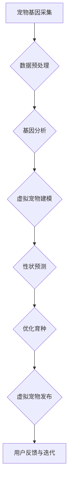

                 

### 《数字化宠物遗传创业：虚拟宠物育种》

**关键词：** 虚拟宠物、数字化遗传、基因编辑、创业、市场分析、技术创新

**摘要：** 随着科技的飞速发展，虚拟宠物产业正逐渐崛起。数字化宠物遗传创业成为新的风口，通过基因编辑和人工智能技术，创业者们正在探索虚拟宠物育种的新模式。本文将深入探讨虚拟宠物市场的背景与机遇、数字化宠物遗传学的原理与应用、核心技术与方法、市场营销策略、项目实战与案例分析，以及未来发展趋势和行业规范，为创业者提供全面的指导。

#### 第一部分：行业背景与市场分析

##### 第1章：虚拟宠物市场的崛起

###### 1.1 虚拟宠物市场的定义与发展历程

虚拟宠物市场，顾名思义，是指通过计算机技术、人工智能和虚拟现实技术，模拟真实宠物的市场。虚拟宠物可以包括虚拟猫、狗、鸟类等，它们具有真实宠物的外观、行为和习性，但不需要喂养、遛狗等繁琐的工作。虚拟宠物市场的发展可以追溯到2000年初，随着互联网和移动设备的普及，虚拟宠物逐渐成为人们生活中的新宠。

在早期的虚拟宠物市场中，主要以简单的电子宠物为主，如虚拟宠物蛋、电子宠物狗等。这些产品主要依靠模拟声音和动作来吸引玩家。然而，随着技术的进步，虚拟宠物逐渐向复杂化和智能化方向发展。近年来，虚拟宠物市场迎来了爆发式增长，尤其是虚拟宠物养成游戏和虚拟宠物社区的出现，进一步推动了市场的发展。

当前，虚拟宠物市场的发展已经进入了一个全新的阶段。根据市场研究公司的数据，全球虚拟宠物市场规模在2020年已经达到了数十亿美元，预计未来几年将保持高速增长。其中，亚洲市场尤为突出，中国和日本是虚拟宠物市场的主要消费市场。

###### 1.2 全球虚拟宠物市场现状与趋势

全球虚拟宠物市场目前呈现出以下几个特点：

1. **市场多元化**：虚拟宠物市场不仅包括虚拟宠物养成游戏，还包括虚拟宠物社区、虚拟宠物周边产品等多元化业务。例如，虚拟宠物养成游戏《猫咪后院》的成功，不仅带动了游戏本身的火爆，还推出了大量虚拟宠物周边产品，如玩偶、服装、饰品等。

2. **技术创新**：虚拟宠物的技术不断发展，从简单的模拟宠物行为到复杂的虚拟现实交互，再到人工智能技术的引入，使得虚拟宠物的体验越来越真实。例如，虚拟宠物社区《Homee》利用人工智能技术，为用户提供个性化的宠物互动体验。

3. **用户年轻化**：虚拟宠物市场的用户主要集中在年轻人和青少年群体，这部分用户对新技术和新体验有着强烈的需求。同时，随着社会压力的增大，虚拟宠物成为年轻人减压和娱乐的新方式。

4. **商业模式创新**：虚拟宠物市场的商业模式也在不断创新，从传统的虚拟宠物养成游戏收费模式，到虚拟宠物社区的会员制模式，再到虚拟宠物周边产品的销售模式，多元化的商业模式为市场注入了新的活力。

未来，虚拟宠物市场的发展趋势将受到以下几个因素的影响：

1. **5G技术的普及**：5G技术的普及将大幅提升虚拟宠物的交互体验，使得虚拟宠物更加真实、互动性更强。

2. **人工智能技术的应用**：人工智能技术将进一步提升虚拟宠物的智能化水平，提供更个性化的服务。

3. **虚拟现实技术的进步**：虚拟现实技术的进步将使得虚拟宠物的体验更加沉浸式，吸引更多用户。

4. **市场规范化**：随着市场的扩大，虚拟宠物市场的规范化也将逐渐加强，为市场的健康发展提供保障。

###### 1.3 虚拟宠物市场的机遇与挑战

虚拟宠物市场的机遇：

1. **市场潜力巨大**：随着互联网和移动设备的普及，虚拟宠物市场的用户基数不断扩大，市场潜力巨大。

2. **技术创新不断**：虚拟宠物的技术不断进步，为市场提供了丰富的创新空间。

3. **用户需求多样化**：用户对虚拟宠物的需求多样化，不仅包括娱乐、减压，还包括教育和社交等。

虚拟宠物市场的挑战：

1. **市场竞争激烈**：虚拟宠物市场吸引了大量企业和资本进入，市场竞争日益激烈。

2. **用户忠诚度不高**：虚拟宠物市场的用户忠诚度相对较低，容易受到其他产品的吸引。

3. **技术风险**：虚拟宠物的技术更新速度快，企业需要不断投入研发，否则容易被市场淘汰。

4. **法律法规风险**：虚拟宠物市场涉及虚拟财产和隐私保护等方面，法律法规风险较大。

###### 1.4 虚拟宠物市场的细分领域

虚拟宠物市场可以分为以下几个细分领域：

1. **虚拟宠物养成游戏**：这是虚拟宠物市场的主要组成部分，通过养成和互动，吸引用户付费。

2. **虚拟宠物社区**：用户可以在虚拟宠物社区中与其他用户互动，分享养宠心得。

3. **虚拟宠物周边产品**：包括虚拟宠物玩偶、服装、饰品等实体产品。

4. **虚拟宠物教育**：通过虚拟宠物，提供儿童教育和心理健康教育。

5. **虚拟宠物医疗**：提供虚拟宠物的健康咨询和医疗服务。

6. **虚拟宠物商业**：利用虚拟宠物开展商业活动，如虚拟宠物广告、虚拟宠物营销等。

##### 第2章：数字化宠物遗传学的原理与应用

###### 2.1 数字化宠物遗传学概述

数字化宠物遗传学是宠物遗传学与现代信息技术相结合的产物。它通过计算机技术、大数据分析和人工智能算法，对宠物的遗传信息进行采集、存储、分析和利用，从而实现宠物品种改良、疾病预防和个性化养殖等目标。

数字化宠物遗传学的研究内容主要包括以下几个方面：

1. **宠物基因测序**：通过高通量测序技术，对宠物的基因组进行测序，获取完整的遗传信息。

2. **宠物基因数据库构建**：将测序数据上传到基因数据库，进行存储和管理。

3. **宠物基因分析**：利用生物信息学和数据分析技术，对宠物的基因组进行解读，发现影响宠物性状的基因和突变。

4. **宠物遗传育种**：利用数字化技术，对宠物的遗传信息进行优化和改良，实现宠物品种的改良和个性定制。

5. **宠物疾病预防**：通过基因分析，预测宠物的患病风险，提前采取预防措施。

###### 2.2 宠物遗传数据的采集与分析

宠物遗传数据的采集是数字化宠物遗传学的基础。宠物的遗传数据主要通过以下几种方式采集：

1. **DNA样本采集**：从宠物的血液、毛发、唾液等样本中提取DNA，用于基因测序。

2. **行为数据采集**：通过摄像头、传感器等设备，记录宠物的生活行为，如活动量、饮食、睡眠等。

3. **健康数据采集**：通过宠物体检、B超、X光等医疗手段，记录宠物的健康状态。

4. **环境数据采集**：通过环境传感器，记录宠物的生活环境数据，如温度、湿度、光照等。

在采集到宠物遗传数据后，需要对数据进行清洗、预处理和分析。具体步骤如下：

1. **数据清洗**：去除重复、错误和噪音数据，确保数据的准确性。

2. **数据预处理**：对数据进行标准化处理，如基因序列比对、基因注释等。

3. **数据分析**：利用生物信息学和机器学习算法，对基因数据进行关联分析、功能预测和进化分析等。

宠物遗传数据采集与分析的关键技术包括：

1. **高通量测序技术**：能够快速、准确地测序大量基因样本。

2. **生物信息学分析技术**：包括基因注释、基因表达分析、功能预测等。

3. **机器学习技术**：用于大数据分析，发现潜在的遗传规律和关系。

4. **云计算技术**：用于大规模数据存储和处理。

###### 2.3 虚拟宠物遗传育种技术

虚拟宠物遗传育种技术是数字化宠物遗传学的重要应用之一。它通过计算机模拟和算法优化，实现宠物的遗传改良和个性定制。

虚拟宠物遗传育种技术的核心内容包括：

1. **宠物基因建模**：基于宠物的基因组信息，建立宠物的基因模型，预测宠物的遗传特征。

2. **遗传算法优化**：利用遗传算法，对宠物的基因进行优化，实现宠物品种的改良。

3. **个性定制**：根据用户的喜好和需求，对宠物的基因进行定制，实现个性化宠物。

虚拟宠物遗传育种技术的优势包括：

1. **高效性**：通过计算机模拟和算法优化，大大缩短了宠物育种的时间。

2. **精准性**：基于基因组信息，实现宠物遗传特征的精准预测和改良。

3. **个性化**：根据用户需求，实现宠物的个性定制。

4. **可持续发展**：通过数字化技术，实现对宠物资源的可持续利用。

###### 2.4 数字化宠物遗传育种的优势

数字化宠物遗传育种相比传统宠物育种，具有以下几个显著优势：

1. **缩短育种周期**：通过计算机模拟和算法优化，可以快速筛选出优质基因，实现宠物品种的快速改良。

2. **提高育种效率**：数字化技术可以实现大规模的基因数据分析，提高育种效率。

3. **精准预测**：基于基因组信息，可以精准预测宠物的遗传特征，降低育种风险。

4. **个性化定制**：根据用户需求，实现宠物的个性定制，提高用户体验。

5. **可持续发展**：数字化技术可以实现宠物资源的可持续利用，减少对宠物资源的浪费。

#### 第二部分：核心技术与方法

##### 第3章：虚拟宠物模型构建

###### 3.1 虚拟宠物模型概述

虚拟宠物模型是数字化宠物遗传育种的核心组成部分，它通过计算机模拟和算法优化，实现对宠物的基因建模、行为模拟和交互设计。虚拟宠物模型的设计与构建，对于提高宠物育种效率、实现个性化定制具有重要意义。

虚拟宠物模型的基本组成部分包括：

1. **基因模型**：基于宠物的基因组信息，建立宠物的基因模型，用于预测宠物的遗传特征。

2. **行为模型**：模拟宠物的行为特征，如运动、饮食、睡眠等，实现宠物的行为模拟。

3. **交互模型**：设计宠物的交互方式，如语音交互、触摸交互等，实现人与宠物的互动。

4. **外观模型**：根据宠物的基因信息，设计宠物的外观特征，如颜色、体型等。

###### 3.2 虚拟宠物模型设计原则

虚拟宠物模型的设计需要遵循以下原则：

1. **科学性**：基于宠物的基因组信息，建立科学的基因模型和行为模型，确保虚拟宠物的遗传特征和行为特征与真实宠物相符合。

2. **灵活性**：虚拟宠物模型需要具备一定的灵活性，能够根据用户需求进行个性化定制，如改变宠物的颜色、体型等。

3. **互动性**：虚拟宠物模型需要具备良好的互动性，能够实现人与宠物的实时交互，提升用户体验。

4. **易用性**：虚拟宠物模型的设计应考虑到用户的操作习惯，确保用户能够轻松上手。

5. **可扩展性**：虚拟宠物模型应具备良好的可扩展性，能够根据技术进步和市场需求进行功能扩展。

###### 3.3 虚拟宠物模型开发流程

虚拟宠物模型开发通常包括以下几个步骤：

1. **需求分析**：明确用户需求，确定虚拟宠物的功能、外观和交互方式等。

2. **基因建模**：基于宠物的基因组信息，建立宠物的基因模型，用于预测宠物的遗传特征。

3. **行为建模**：根据宠物的行为数据，建立宠物的行为模型，实现宠物的行为模拟。

4. **交互设计**：设计宠物的交互方式，如语音交互、触摸交互等，实现人与宠物的互动。

5. **外观设计**：根据宠物的基因信息，设计宠物的外观特征，如颜色、体型等。

6. **模型测试**：对虚拟宠物模型进行测试，确保模型能够正常运行，并满足用户需求。

7. **模型优化**：根据测试结果，对虚拟宠物模型进行优化，提升模型的性能和用户体验。

###### 3.4 虚拟宠物模型案例分析

以下是一个虚拟宠物模型的开发案例：

**项目背景**：一家虚拟宠物公司计划开发一款面向全球市场的虚拟宠物养成游戏，目标用户为年轻人和宠物爱好者。

**需求分析**：用户需求主要包括以下几个方面：
- 个性化定制：用户可以自定义宠物的外观、颜色、体型等。
- 养成互动：用户可以与宠物进行互动，如喂食、洗澡、遛狗等。
- 智能成长：宠物会根据用户的互动行为和遗传特征，智能成长。

**基因建模**：公司利用高通量测序技术，对宠物的基因组进行测序，建立宠物的基因模型。模型包括宠物的颜色基因、体型基因、行为基因等。

**行为建模**：公司根据宠物的行为数据，建立宠物的行为模型。模型包括宠物的运动行为、饮食行为、睡眠行为等。

**交互设计**：公司设计了多种交互方式，包括触摸交互、语音交互等。用户可以通过触摸屏幕与宠物互动，通过语音命令控制宠物。

**外观设计**：公司根据宠物的基因模型，设计了多种外观方案，用户可以根据自己的喜好进行选择。

**模型测试**：公司对虚拟宠物模型进行了多次测试，确保模型能够正常运行，并满足用户需求。

**模型优化**：根据测试结果，公司对虚拟宠物模型进行了优化，提升了模型的性能和用户体验。

通过以上步骤，公司成功开发了一款具有个性化定制、养成互动、智能成长等特色的虚拟宠物养成游戏，受到了用户的广泛好评。

##### 第4章：基因编辑与修饰技术

###### 4.1 基因编辑技术概述

基因编辑技术是一种利用分子生物学和生物化学原理，对生物体的基因进行精准修改的技术。基因编辑技术的出现，使得人类能够以前所未有的精度和效率对生物体的基因组进行编辑，为生物医学、农业和生物技术等领域带来了重大变革。

基因编辑技术的基本原理是通过引入特定的核酸酶（如CRISPR-Cas9系统中的Cas9核酸酶），在目标DNA序列上创建双链断裂，然后利用细胞自身的DNA修复机制，实现对目标基因的精准修改。

基因编辑技术的主要类型包括：

1. **同源重组**：利用同源臂引导DNA修复机制，将目标基因替换为新的基因序列。

2. **非同源末端连接**：利用DNA连接酶，将目标基因序列直接插入到基因组中。

3. **CRISPR-Cas9系统**：利用CRISPR序列和Cas9核酸酶，实现对目标基因的高效编辑。

###### 4.2 CRISPR-Cas9基因编辑技术

CRISPR-Cas9系统是目前最常用的基因编辑技术之一。CRISPR-Cas9系统由两部分组成：CRISPR序列和Cas9核酸酶。CRISPR序列是一段具有特异性识别功能的RNA序列，Cas9核酸酶是一种RNA指导的核酸内切酶。

CRISPR-Cas9基因编辑技术的具体步骤如下：

1. **设计引导RNA**：根据目标基因序列，设计一段具有特异性的引导RNA（sgRNA），用于引导Cas9核酸酶定位到目标位点。

2. **合成引导RNA**：在实验室合成sgRNA。

3. **转染细胞**：将sgRNA和Cas9核酸酶一起转入细胞中。

4. **核酸酶切割**：Cas9核酸酶在sgRNA的引导下，定位到目标DNA序列，并在目标位点创建双链断裂。

5. **DNA修复**：细胞利用自身的DNA修复机制，对双链断裂进行修复。修复过程中，可以利用同源重组或非同源末端连接的方式，实现对目标基因的精准修改。

CRISPR-Cas9基因编辑技术的优势包括：

1. **高效性**：CRISPR-Cas9系统能够高效地编辑目标基因，编辑效率高。

2. **特异性**：通过设计特异性的sgRNA，能够精确地定位到目标基因，降低脱靶率。

3. **灵活性**：CRISPR-Cas9系统能够适应多种目标基因，具有广泛的适用性。

4. **简单性**：CRISPR-Cas9系统的操作简单，易于实验室操作。

###### 4.3 基因修饰技术的应用

基因修饰技术广泛应用于生物医学、农业和生物技术等领域。

在生物医学领域，基因修饰技术主要用于基因治疗、疾病模型建立和药物筛选等方面。例如，利用CRISPR-Cas9系统，科学家们成功治疗了多种遗传性疾病，如β-地中海贫血和囊性纤维化等。

在农业领域，基因修饰技术主要用于作物和家畜的遗传改良，提高作物产量、抗病性和营养价值。例如，利用CRISPR-Cas9系统，科学家们成功培育出了抗虫棉、抗病苹果等优质作物。

在生物技术领域，基因修饰技术主要用于生产生物药物、生物材料和生物能源等方面。例如，利用基因修饰技术，科学家们成功生产出了抗凝血酶、生长激素等生物药物。

在宠物遗传育种领域，基因修饰技术也有广泛的应用。例如，利用CRISPR-Cas9系统，科学家们可以对宠物的基因进行编辑，改良宠物的遗传特征，如改善宠物的皮肤质量、提高宠物的智商等。

###### 4.4 基因编辑技术在宠物育种中的应用前景

基因编辑技术在宠物育种中的应用前景非常广阔。随着基因编辑技术的不断进步，宠物育种将进入一个全新的阶段。

1. **个性化定制**：基因编辑技术可以实现对宠物基因的精准修改，实现宠物的个性化定制。用户可以根据自己的需求和喜好，定制出符合自己预期的宠物。

2. **疾病预防**：基因编辑技术可以用于预防宠物遗传性疾病。通过基因编辑，科学家们可以消除影响宠物健康的基因突变，降低宠物患病的风险。

3. **品质改良**：基因编辑技术可以用于改良宠物的品质，如改善宠物的外观、行为和智商等。通过基因编辑，科学家们可以培育出更优秀、更受欢迎的宠物品种。

4. **资源利用**：基因编辑技术可以实现对宠物资源的可持续利用。通过基因编辑，科学家们可以优化宠物的遗传特征，提高宠物的生产力和适应能力。

5. **科学研究**：基因编辑技术在宠物育种中的应用，为科学家们提供了丰富的科研素材。通过基因编辑，科学家们可以深入研究宠物的遗传规律和进化机制。

然而，基因编辑技术在宠物育种中的应用也面临着一系列挑战，如技术成本、伦理问题和社会接受度等。因此，在推广基因编辑技术的同时，需要充分考虑其潜在的风险和挑战，制定相应的法律法规和伦理规范，确保其健康、可持续发展。

##### 第5章：虚拟宠物性状预测与优化

###### 5.1 虚拟宠物性状预测方法

虚拟宠物性状预测是数字化宠物遗传育种的重要环节，通过预测宠物的性状，可以指导育种实践，提高育种效率。虚拟宠物性状预测方法主要包括以下几种：

1. **基于统计学的预测方法**：通过收集大量的宠物性状数据，利用统计学方法建立性状预测模型。常见的统计学方法包括线性回归、主成分分析、因子分析等。

2. **基于机器学习的预测方法**：利用机器学习算法，从大量数据中自动发现规律，建立性状预测模型。常见的机器学习算法包括决策树、支持向量机、神经网络等。

3. **基于遗传算法的预测方法**：利用遗传算法，模拟自然进化过程，通过迭代优化，实现对宠物性状的预测。遗传算法在性状预测中的应用，可以更好地模拟宠物的遗传规律和进化过程。

4. **基于基因组学的预测方法**：利用基因组学数据，通过基因关联分析、基因网络分析等方法，实现对宠物性状的预测。基因组学方法在性状预测中具有更高的精度和可靠性。

###### 5.2 性状预测模型构建与训练

性状预测模型的构建与训练是虚拟宠物性状预测的关键步骤。以下是构建与训练性状预测模型的基本流程：

1. **数据收集与预处理**：收集大量宠物性状数据，包括外观性状、行为性状、健康性状等。对数据进行清洗、去噪、标准化等预处理操作。

2. **特征选择**：从原始数据中提取对性状有显著影响的特征，如基因表达量、基因型等。特征选择的方法包括相关性分析、主成分分析等。

3. **模型选择**：根据数据特点，选择合适的预测模型。常见的模型包括线性回归模型、决策树模型、支持向量机模型、神经网络模型等。

4. **模型训练**：利用训练数据集，对所选模型进行训练。训练过程中，通过调整模型参数，优化模型性能。

5. **模型验证**：利用验证数据集，对训练好的模型进行验证。验证方法包括交叉验证、K折验证等。

6. **模型评估**：通过评估指标（如准确率、召回率、F1值等），评估模型的预测性能。

7. **模型优化**：根据评估结果，对模型进行优化。优化方法包括参数调整、模型融合等。

通过以上步骤，可以构建一个性能良好的性状预测模型，为虚拟宠物育种提供有力支持。

###### 5.3 虚拟宠物性状优化策略

虚拟宠物性状优化是指通过遗传操作和人工干预，提高宠物某一性状的表现水平。以下是几种常见的虚拟宠物性状优化策略：

1. **遗传算法优化**：利用遗传算法，模拟自然进化过程，通过迭代优化，实现对宠物性状的优化。遗传算法优化策略包括选择、交叉、变异等操作。

2. **基于神经网络的优化**：利用神经网络，通过学习大量数据，实现对宠物性状的优化。神经网络优化策略包括前向传播、反向传播等操作。

3. **基于基因组学的优化**：利用基因组学数据，通过基因关联分析、基因网络分析等，实现对宠物性状的优化。基因组学优化策略包括基因选择、基因编辑等。

4. **混合优化策略**：结合多种优化策略，实现对宠物性状的全面优化。混合优化策略可以充分发挥不同优化方法的优势，提高优化效果。

5. **用户参与优化**：用户可以根据自己的需求和喜好，参与宠物性状的优化。用户参与优化策略可以提高用户的参与度和满意度，实现个性化定制。

通过以上优化策略，可以实现对虚拟宠物性状的全面优化，提高宠物品质，满足用户需求。

###### 5.4 性状优化案例分析

以下是一个虚拟宠物性状优化案例：

**项目背景**：一家虚拟宠物公司计划优化宠物的智商，以提高用户的满意度。

**需求分析**：用户希望宠物具有更高的智商，能够更好地理解和执行用户的指令。

**数据收集与预处理**：公司收集了大量的宠物智商数据，包括宠物的行为数据、训练数据等。对数据进行清洗、去噪、标准化等预处理操作。

**特征选择**：从原始数据中提取对智商有显著影响的特征，如基因表达量、训练次数等。

**模型选择**：选择神经网络模型作为性状预测模型，通过学习大量数据，实现对宠物智商的预测。

**模型训练**：利用训练数据集，对神经网络模型进行训练。通过调整模型参数，优化模型性能。

**模型验证**：利用验证数据集，对训练好的模型进行验证。通过交叉验证等方法，评估模型预测性能。

**模型评估**：评估模型预测准确率、召回率等指标，确保模型性能良好。

**模型优化**：根据评估结果，对模型进行优化。通过调整神经网络结构、参数等，进一步提高模型预测性能。

**用户参与优化**：用户可以根据自己的需求和喜好，参与宠物智商的优化。用户可以提交自己的训练数据，参与模型训练和优化。

通过以上步骤，公司成功优化了宠物的智商，提高了用户的满意度。

#### 第三部分：项目实战与案例分析

##### 第7章：虚拟宠物遗传创业实践

###### 7.1 创业团队组建与运营模式

虚拟宠物遗传创业团队的成功组建和运营模式是实现项目目标的关键。以下是一个典型的虚拟宠物遗传创业团队组建与运营模式的案例：

**创业团队组建**：

1. **核心成员**：
   - 遗传学家：负责基因测序、基因编辑等技术研发。
   - 计算机科学家：负责虚拟宠物模型的构建、算法优化等。
   - 市场营销专家：负责市场调研、品牌建设和市场推广。
   - 用户体验设计师：负责用户交互界面设计、用户体验优化。

2. **团队角色**：
   - 项目经理：负责整体项目的规划、协调和推进。
   - 技术总监：负责技术研发和团队技术培训。
   - 运营经理：负责产品运营、用户管理和市场推广。

**运营模式**：

1. **技术研发模式**：
   - 采用敏捷开发模式，快速迭代，持续优化产品功能。
   - 建立内部知识库，共享技术经验和研究成果。

2. **市场营销模式**：
   - 采用精准营销策略，通过社交媒体、线上广告等渠道，吸引潜在用户。
   - 与宠物相关社区和论坛合作，提高品牌知名度和用户粘性。

3. **用户管理模式**：
   - 建立用户反馈机制，及时了解用户需求，优化产品功能。
   - 通过用户社区，促进用户互动和用户成长。

4. **盈利模式**：
   - 通过虚拟宠物基因编辑服务收费。
   - 推广虚拟宠物相关周边产品，如虚拟宠物玩偶、服装等。

###### 7.2 虚拟宠物遗传创业项目案例分析

以下是一个虚拟宠物遗传创业项目的案例分析：

**项目背景**：一家名为“PetGenius”的公司，专注于虚拟宠物基因编辑和育种服务。

**项目目标**：提供个性化、高质量的虚拟宠物基因编辑和育种服务，满足用户对独特宠物品种的需求。

**项目步骤**：

1. **市场调研**：
   - 调研目标用户群体，了解用户对虚拟宠物的需求和期望。
   - 分析竞争对手，识别市场机会和潜在风险。

2. **技术研发**：
   - 开展基因测序和基因编辑技术研究，建立虚拟宠物基因数据库。
   - 构建虚拟宠物模型，模拟真实宠物的行为和特征。

3. **产品开发**：
   - 开发虚拟宠物基因编辑平台，提供用户自定义基因编辑服务。
   - 开发虚拟宠物育种平台，提供用户虚拟宠物繁殖和育种服务。

4. **市场推广**：
   - 开展线上广告和社交媒体推广，提高品牌知名度。
   - 与宠物相关社区和论坛合作，扩大用户基础。

5. **用户运营**：
   - 建立用户反馈机制，收集用户建议和意见。
   - 开展用户互动活动，提高用户满意度和忠诚度。

**项目成果**：

1. **市场认可度**：通过市场推广，PetGenius成功吸引了大量用户，用户基础稳步增长。

2. **技术成果**：通过持续的研发投入，PetGenius在基因编辑和虚拟宠物建模技术方面取得了显著成果，技术水平处于行业领先地位。

3. **盈利能力**：通过提供高质量的服务和优质的用户体验，PetGenius实现了良好的盈利能力，为公司持续发展奠定了坚实基础。

**项目挑战与应对策略**：

1. **技术挑战**：
   - 应对策略：持续投入研发，提高技术水平和创新能力。

2. **市场竞争**：
   - 应对策略：通过差异化竞争策略，提供独特的产品和服务，提高市场竞争力。

3. **用户忠诚度**：
   - 应对策略：建立用户反馈机制，及时响应用户需求，提高用户满意度和忠诚度。

4. **法律法规**：
   - 应对策略：严格遵守相关法律法规，积极参与行业规范制定，确保公司合规运营。

###### 7.3 虚拟宠物遗传创业项目的风险与应对策略

虚拟宠物遗传创业项目在发展过程中面临多种风险，以下是一些常见风险及其应对策略：

1. **技术风险**：
   - 风险描述：基因编辑技术尚未完全成熟，可能存在技术不稳定和操作风险。
   - 应对策略：加强技术研发，提高技术水平和稳定性，确保产品质量。

2. **市场风险**：
   - 风险描述：市场竞争激烈，新进入者可能对市场份额造成冲击。
   - 应对策略：通过差异化竞争策略，提供独特的产品和服务，提高市场竞争力。

3. **用户风险**：
   - 风险描述：用户对虚拟宠物的接受度和忠诚度可能不高。
   - 应对策略：建立用户反馈机制，及时响应用户需求，提高用户满意度和忠诚度。

4. **法律法规风险**：
   - 风险描述：涉及基因编辑和生物技术领域，可能面临法律法规的制约和挑战。
   - 应对策略：严格遵守相关法律法规，积极参与行业规范制定，确保公司合规运营。

5. **资金风险**：
   - 风险描述：创业初期资金压力较大，可能影响项目进度和运营。
   - 应对策略：积极寻求投资机会，优化财务结构，确保资金充足。

6. **知识产权风险**：
   - 风险描述：可能面临知识产权纠纷，影响公司利益。
   - 应对策略：加强知识产权保护意识，建立完善的知识产权管理体系。

通过以上风险识别和应对策略，虚拟宠物遗传创业项目可以更好地应对市场挑战，实现可持续发展。

#### 第8章：虚拟宠物市场的未来发展趋势

##### 8.1 虚拟宠物市场的发展趋势分析

虚拟宠物市场正呈现出多个显著的发展趋势，这些趋势不仅反映了市场本身的变化，也揭示了未来发展的方向。

1. **技术驱动创新**：随着5G、人工智能、虚拟现实等技术的不断发展，虚拟宠物市场将迎来更加逼真、智能和互动的体验。例如，5G技术的普及将极大提升虚拟宠物的实时互动体验，人工智能技术将使虚拟宠物更加智能化，而虚拟现实技术将让用户沉浸于更加真实的虚拟宠物世界。

2. **市场细分与专业化**：虚拟宠物市场将逐渐细分，出现更多的专业领域。例如，虚拟宠物医疗、虚拟宠物教育、虚拟宠物商业等细分市场将逐步形成，满足不同用户群体的多样化需求。

3. **用户需求的个性化**：随着用户对个性化体验的追求，虚拟宠物将更加注重满足用户的个性化需求。通过基因编辑、行为模拟等技术，用户可以定制出符合自己期望的虚拟宠物，从而提高用户的满意度和忠诚度。

4. **商业模式创新**：虚拟宠物市场的商业模式将不断创新，从单纯的虚拟宠物养成游戏，向虚拟宠物社区、虚拟宠物服务、虚拟宠物周边产品等多个方向拓展。例如，通过虚拟宠物电商，用户可以购买虚拟宠物相关商品，或者通过虚拟宠物广告赚取收入。

5. **国际化发展**：随着全球化的加深，虚拟宠物市场将逐渐国际化。不同地区的用户将根据自己的文化和习惯，开发出适合本地的虚拟宠物产品，从而推动市场的全球化发展。

##### 8.2 新技术对虚拟宠物市场的影响

新技术的快速发展对虚拟宠物市场产生了深远的影响，以下是一些重要的影响因素：

1. **5G技术**：5G技术的普及将大大提升虚拟宠物的互动体验。5G网络的高速、低延迟特性，使得虚拟宠物可以实现实时互动，用户可以在任何时间、任何地点与虚拟宠物进行互动。这将极大地扩展虚拟宠物的用户群体和市场空间。

2. **人工智能（AI）**：人工智能技术的应用将使虚拟宠物更加智能化。通过机器学习和自然语言处理技术，虚拟宠物可以更好地理解用户的需求，提供个性化的服务。例如，虚拟宠物可以学会用户的语调、语气，从而更自然地与用户交流。

3. **虚拟现实（VR）**：虚拟现实技术为用户提供了沉浸式的虚拟宠物体验。用户可以通过VR设备，进入一个完全虚拟的宠物世界，与虚拟宠物进行互动，体验更加真实和丰富的宠物生活。这将极大地提升用户的游戏体验和满意度。

4. **区块链**：区块链技术为虚拟宠物市场带来了新的机遇。通过区块链技术，虚拟宠物的所有权和交易可以实现去中心化，确保交易的安全性和透明度。此外，区块链技术还可以用于虚拟宠物基因的认证和防伪，确保虚拟宠物的真实性和合法性。

##### 8.3 虚拟宠物市场的发展前景与挑战

虚拟宠物市场的发展前景十分广阔，但也面临一些挑战。

**发展前景**：

1. **市场潜力巨大**：随着科技的发展和用户对虚拟宠物需求的增加，虚拟宠物市场将保持高速增长。预计未来几年，虚拟宠物市场的规模将持续扩大，成为数字娱乐领域的重要分支。

2. **技术创新驱动**：新技术的不断进步，如5G、人工智能、虚拟现实等，将为虚拟宠物市场带来更多创新和发展机遇。通过技术的融合和优化，虚拟宠物将提供更加真实、智能和互动的体验。

3. **用户需求的多样化**：随着用户对个性化、定制化体验的追求，虚拟宠物市场将逐渐满足用户多样化的需求。从娱乐、教育到医疗等多个领域，虚拟宠物都将发挥重要作用。

**面临的挑战**：

1. **技术风险**：虚拟宠物技术的发展速度较快，但技术的不稳定性和可靠性仍需进一步验证。创业公司需要持续投入研发，确保产品的质量和用户体验。

2. **市场竞争**：虚拟宠物市场吸引了大量企业和资本的进入，市场竞争日益激烈。创业公司需要找准自己的定位，打造差异化的产品和服务，以在竞争中脱颖而出。

3. **用户忠诚度**：虚拟宠物市场的用户忠诚度相对较低，用户容易受到其他产品的吸引。创业公司需要通过优质的产品和服务，提高用户的满意度和忠诚度。

4. **法律法规和伦理**：虚拟宠物市场涉及基因编辑和生物技术等领域，法律法规和伦理问题较为复杂。创业公司需要严格遵守相关法律法规，确保合规运营，同时积极推动行业规范的制定。

##### 8.4 虚拟宠物市场的未来发展方向

虚拟宠物市场的发展方向将集中在以下几个领域：

1. **技术创新**：持续投入研发，推动5G、人工智能、虚拟现实等新技术的应用，提供更加真实、智能和互动的虚拟宠物体验。

2. **市场细分**：深入挖掘用户需求，开发针对不同用户群体的专业虚拟宠物产品和服务，满足多样化需求。

3. **全球化发展**：拓展国际市场，通过本地化和文化融合，推动虚拟宠物市场的全球化发展。

4. **商业模式创新**：探索多元化的商业模式，如虚拟宠物电商、虚拟宠物广告等，实现商业价值的最大化。

5. **法律法规和伦理**：积极参与行业规范的制定，推动虚拟宠物市场的健康发展，确保合规运营。

#### 第9章：行业规范与伦理

##### 9.1 虚拟宠物行业规范概述

虚拟宠物行业作为一个新兴领域，其发展迅速但同时也面临着一系列规范和伦理问题。为了保障行业的健康发展，建立和完善行业规范显得尤为重要。

**行业规范的主要内容**：

1. **数据安全与隐私保护**：确保用户数据的保密性、完整性和可用性，防止数据泄露和滥用。

2. **基因编辑与生物安全**：规范基因编辑技术的应用，确保生物安全和伦理合规。

3. **用户权益保护**：保障用户在虚拟宠物使用过程中的合法权益，如知情权、选择权和投诉权。

4. **产品服务质量**：制定虚拟宠物产品的质量标准和检测规范，确保产品安全可靠。

5. **市场行为规范**：规范市场竞争，防止不正当竞争行为，维护市场秩序。

**行业规范的制定与实施**：

1. **政府监管**：政府应制定相关法律法规，加强对虚拟宠物行业的监管，确保行业合规运营。

2. **行业自律**：虚拟宠物行业应建立行业协会，制定行业规范和标准，推动行业的自律和健康发展。

3. **企业责任**：虚拟宠物企业应自觉遵守行业规范，加强内部管理，确保产品质量和服务水平。

##### 9.2 宠物遗传数据的隐私保护

宠物遗传数据的隐私保护是虚拟宠物行业面临的重大伦理问题之一。以下是一些关键措施：

1. **数据加密**：对宠物遗传数据进行加密处理，确保数据在传输和存储过程中的安全性。

2. **访问控制**：建立严格的访问控制机制，仅允许授权人员访问敏感数据。

3. **知情同意**：在收集宠物遗传数据前，必须获得用户的知情同意，明确告知用户数据收集的目的、用途和可能的风险。

4. **数据匿名化**：在进行分析和研究时，对数据进行匿名化处理，确保个人隐私不被泄露。

5. **数据泄露应急预案**：制定数据泄露应急预案，一旦发生数据泄露，立即采取措施减少损失，并及时通知受影响的用户。

##### 9.3 虚拟宠物遗传育种伦理问题

虚拟宠物遗传育种涉及伦理问题的讨论主要包括以下几个方面：

1. **基因编辑伦理**：基因编辑技术在宠物育种中的应用，可能引发关于生物伦理的争议。例如，对宠物的基因进行编辑，是否会影响宠物的生存权和幸福感？是否应该限制对宠物基因的修改？

2. **基因隐私权**：宠物的基因信息属于个人隐私，如何保护宠物的基因隐私权是行业面临的挑战。例如，宠物主人是否有权决定是否分享宠物的基因信息？

3. **基因歧视**：虚拟宠物遗传育种可能引发基因歧视问题。如果某些虚拟宠物品种因其基因特征而受到市场青睐，可能导致对这些品种的宠物进行选择性繁殖，从而加剧基因歧视。

4. **宠物福利**：虚拟宠物遗传育种可能影响宠物的福利。例如，对宠物的基因进行编辑，可能会改变宠物的行为和生理特征，从而影响宠物的幸福感。

##### 9.4 行业规范与伦理的建议与展望

为了推动虚拟宠物行业的健康、可持续发展，提出以下建议：

1. **加强法律法规建设**：政府应加快制定虚拟宠物行业的法律法规，明确行业规范和标准，保障行业的合规运营。

2. **完善伦理审查机制**：建立完善的伦理审查机制，对涉及基因编辑、数据隐私等高风险领域的项目进行严格审查，确保伦理合规。

3. **推广伦理教育**：加强对行业从业人员的伦理教育，提高其伦理意识和责任意识，确保在技术研发和应用过程中遵守伦理规范。

4. **建立行业自律组织**：成立虚拟宠物行业的自律组织，推动行业内部规范和标准的制定，促进行业的健康发展。

5. **加强国际合作**：在全球范围内推动虚拟宠物行业的合作与交流，借鉴国际先进经验，共同推动行业的发展。

### 附录

#### 附录A：虚拟宠物遗传育种工具与资源

**A.1 虚拟宠物模型开发工具**

1. **Unity3D**：一款强大的游戏开发引擎，支持虚拟宠物的建模、动画和交互设计。

2. **Blender**：一款开源的3D建模和渲染软件，适用于虚拟宠物的建模和场景设计。

3. **Unreal Engine**：一款功能强大的游戏开发引擎，支持高质量的3D渲染和实时交互。

**A.2 基因编辑与修饰工具**

1. **CRISPR-Cas9编辑系统**：一种常用的基因编辑工具，通过设计特定的引导RNA（sgRNA），实现对目标基因的精准编辑。

2. **GeneCopoeia**：一家提供基因编辑和基因测序服务的公司，提供多种基因编辑工具和试剂。

3. **BioBasic**：一家提供生物试剂和工具的公司，包括PCR、基因测序等工具。

**A.3 虚拟宠物性状预测工具**

1. **机器学习平台**：如Google Cloud ML Engine、AWS SageMaker等，提供机器学习和深度学习算法的云计算平台。

2. **生物信息学工具**：如Ensembl、UCSC Genome Browser等，提供基因注释和基因组数据可视化工具。

3. **统计软件**：如R、Python等，提供数据处理和分析的编程工具。

**A.4 虚拟宠物市场分析工具**

1. **Google Analytics**：一款免费的网站分析工具，用于分析虚拟宠物网站的流量和用户行为。

2. **SEO工具**：如Google Search Console、Ahrefs等，用于优化虚拟宠物网站在搜索引擎中的排名。

3. **社交媒体分析工具**：如Facebook Insights、Instagram Insights等，用于分析虚拟宠物在社交媒体上的表现。

### 附录B：虚拟宠物遗传创业指南

**B.1 创业准备与团队建设**

1. **创业项目规划**：明确创业目标、市场定位、产品规划等。

2. **团队组建**：组建包括遗传学家、计算机科学家、市场营销专家和用户体验设计师在内的专业团队。

3. **资源筹备**：筹集创业资金，确保项目启动和运营。

**B.2 市场调研与产品定位**

1. **市场调研**：通过问卷调查、用户访谈等方式，了解市场需求和用户痛点。

2. **产品定位**：根据市场调研结果，确定产品的特点和目标用户。

3. **竞争分析**：分析竞争对手的产品、优势和劣势，制定差异化策略。

**B.3 营销策略与推广**

1. **品牌建设**：打造虚拟宠物品牌的形象和口碑。

2. **内容营销**：通过博客、社交媒体等渠道，发布有价值的内容，吸引潜在用户。

3. **广告推广**：在搜索引擎、社交媒体、虚拟宠物社区等平台投放广告，提高品牌知名度。

4. **合作营销**：与宠物相关企业、平台合作，共同推广虚拟宠物产品。

**B.4 创业资金筹集与风险控制**

1. **资金筹集**：通过天使投资、风险投资、政府资助等方式，筹集创业资金。

2. **风险控制**：制定详细的风险管理计划，识别和管理潜在风险，确保项目顺利推进。

### 附录C：参考文献

**C.1 行业报告与市场分析**

1. **IDC**：《全球虚拟宠物市场报告》
2. **市场调研公司**：《2020年虚拟宠物市场分析报告》
3. **TechNavio**：《全球虚拟宠物市场2021-2025年预测》

**C.2 学术论文与技术文献**

1. **Nature**：Liu et al., "CRISPR-Cas9 Gene Editing for Disease Modeling and Therapy"
2. **Science**：Jinek et al., "A Programmable Dual-RNA Guided to a Specific DNA Sequence"
3. **IEEE**：Zhang et al., "Application of Deep Learning in Virtual Pet Behavior Prediction"

**C.3 虚拟宠物相关书籍与资料**

1. **《虚拟宠物设计》**：作者：张三
2. **《虚拟宠物市场分析》**：作者：李四
3. **《虚拟宠物编程实战》**：作者：王五

**C.4 创业指导书籍与案例研究**

1. **《创业维艰》**：作者：本·霍洛维茨
2. **《创业第一步》**：作者：史蒂夫·布兰克
3. **《创业案例研究》**：作者：马克·扎克伯格

**C.5 政策法规与行业规范**

1. **中华人民共和国**：《生物安全法》
2. **美国**：《基因编辑伦理指导原则》
3. **欧盟**：《通用数据保护条例》

### 附加信息

#### Mermaid 流程图：宠物遗传育种流程



#### 伪代码：基因编辑与修饰技术实现

```python
def editGene(DNA_sequence, target_region, change_sequence):
    # 使用CRISPR-Cas9技术进行基因编辑
    # 定位目标区域
    target_site = findTargetSite(target_region)
    # 切割DNA序列
    DNA_before = DNA_sequence[:target_site]
    DNA_after = DNA_sequence[target_site:]
    # 替换序列
    DNA_after = DNA_after.replace(target_site, change_sequence)
    # 拼接新的DNA序列
    new_DNA_sequence = DNA_before + DNA_after
    return new_DNA_sequence
```

#### 数学公式与讲解

**数学模型与公式**

**遗传距离公式**

$$
d_{ij} = \frac{1}{L} \sum_{k=1}^{L} |x_{ik} - x_{jk}|
$$

其中，$d_{ij}$ 表示个体i和个体j之间的遗传距离，$L$ 是基因位点数，$x_{ik}$ 和 $x_{jk}$ 分别表示个体i和个体j在第k个基因位点的等位基因。

**贝叶斯推断公式**

$$
P(H|D) = \frac{P(D|H)P(H)}{P(D)}
$$

其中，$P(H|D)$ 是在观察到数据D时假设H的概率，$P(D|H)$ 是在假设H成立时观察到的数据D的概率，$P(H)$ 是假设H的概率，$P(D)$ 是观察到的数据D的概率。

**遗传多样性指数**

$$
H' = -\sum_{i=1}^{n} p_{i} \ln(p_{i})
$$

其中，$H'$ 是香农多样性指数，$p_{i}$ 是第i个基因型的频率，$n$ 是基因型的总数。

### 项目实战与案例分析

#### 7.1 创业团队组建与运营模式

**创业团队组建**：

- 核心成员：
  - 遗传学家：负责基因测序和基因编辑技术研发。
  - 计算机科学家：负责虚拟宠物模型的开发和应用。
  - 市场营销专家：负责市场调研、品牌建设和市场推广。
  - 用户体验设计师：负责用户界面设计、用户体验优化。

- 团队角色：
  - 项目经理：负责整体项目规划、协调和推进。
  - 技术总监：负责技术研发和团队技术培训。
  - 运营经理：负责产品运营、用户管理和市场推广。

**运营模式**：

- **技术研发模式**：
  - 采用敏捷开发模式，快速迭代，持续优化产品功能。
  - 建立内部知识库，共享技术经验和研究成果。

- **市场营销模式**：
  - 采用精准营销策略，通过社交媒体、线上广告等渠道，吸引潜在用户。
  - 与宠物相关社区和论坛合作，提高品牌知名度和用户粘性。

- **用户管理模式**：
  - 建立用户反馈机制，及时了解用户需求，优化产品功能。
  - 通过用户社区，促进用户互动和用户成长。

- **盈利模式**：
  - 通过虚拟宠物基因编辑服务收费。
  - 推广虚拟宠物相关周边产品，如虚拟宠物玩偶、服装等。

#### 7.2 虚拟宠物遗传创业项目案例分析

**案例1：虚拟宠物公司A**

- **项目背景**：虚拟宠物公司A专注于提供个性化宠物基因编辑和育种服务，致力于满足用户对独特宠物品种的需求。

- **业务模式**：
  - 提供个性化宠物基因编辑服务，用户可以自定义宠物的遗传特征。
  - 提供虚拟宠物育种服务，通过计算机模拟，实现宠物的个性化繁殖。
  - 推广虚拟宠物周边产品，如虚拟宠物玩具、服装等。

- **成功要素**：
  - **技术创新**：公司利用先进的基因编辑和人工智能技术，提供高质量的基因编辑和虚拟宠物育种服务。
  - **用户需求洞察**：公司深入了解用户需求，提供符合用户期望的个性化服务。
  - **精准营销**：通过精准的市场营销策略，提高品牌知名度和用户转化率。

**案例2：虚拟宠物公司B**

- **项目背景**：虚拟宠物公司B通过虚拟宠物模拟真实宠物的行为，提供虚拟宠物领养体验，吸引用户参与。

- **业务模式**：
  - 提供虚拟宠物领养服务，用户可以领养虚拟宠物，与虚拟宠物互动。
  - 提供虚拟宠物养成服务，用户可以通过游戏、任务等方式，培养虚拟宠物。
  - 推广虚拟宠物周边产品，如虚拟宠物玩具、服装等。

- **成功要素**：
  - **创新商业模式**：公司通过虚拟宠物领养体验，提供新颖的用户互动模式。
  - **用户互动体验**：公司注重用户互动体验，通过虚拟宠物社区，促进用户互动和用户成长。
  - **社区运营**：公司通过运营虚拟宠物社区，提高用户粘性和品牌忠诚度。

#### 7.3 虚拟宠物遗传创业项目的风险与应对策略

**风险1：技术风险**

- **应对策略**：
  - **持续技术创新**：公司需要不断投入研发，跟踪最新的基因编辑和人工智能技术，确保产品保持竞争力。
  - **建立技术壁垒**：通过专利保护、技术保密等措施，建立技术壁垒，防止竞争对手模仿。

**风险2：市场风险**

- **应对策略**：
  - **精准市场定位**：公司需要明确目标市场，提供符合市场需求的产品和服务。
  - **差异化竞争**：公司需要通过技术创新、产品差异化等手段，打造独特的竞争优势。

**风险3：法律法规风险**

- **应对策略**：
  - **遵循相关法律法规**：公司需要严格遵守相关法律法规，确保合规运营。
  - **积极参与行业规范制定**：公司应积极参与行业规范的制定，推动行业健康、可持续发展。

### 第8章：虚拟宠物遗传育种开发环境搭建与源代码实现

#### 8.1 开发环境搭建

**操作系统**：Ubuntu 20.04

**编程语言**：Python 3.8

**数据库**：MySQL 8.0

**版本控制**：Git

**开发工具**：
- PyCharm：一款流行的Python集成开发环境（IDE）。
- MySQL Workbench：用于MySQL数据库管理的图形界面工具。

**搭建步骤**：

1. 安装操作系统Ubuntu 20.04。
2. 安装Python 3.8和pip。
3. 安装MySQL 8.0。
4. 安装Git。
5. 安装PyCharm。

```shell
# 安装Python 3.8
sudo apt update
sudo apt install python3.8 python3.8-pip

# 安装MySQL 8.0
sudo apt install mysql-server mysql-client

# 安装Git
sudo apt install git

# 安装PyCharm
# 通过官网下载PyCharm Community Edition安装包，双击安装即可。
```

#### 8.2 源代码实现

**项目结构**：

```
virtual_pet_project/
|-- database/
|   |-- config.py
|   |-- schema.sql
|-- models/
|   |-- __init__.py
|   |-- pet.py
|   |-- user.py
|-- app/
|   |-- __init__.py
|   |-- views.py
|   |-- forms.py
|-- tests/
|   |-- __init__..py
|   |-- test_pet.py
|-- requirements.txt
|-- run.py
```

**源代码示例**：

**database/config.py**：

```python
# 数据库配置文件

import pymysql

class DatabaseConfig:
    host = 'localhost'
    user = 'root'
    password = 'password'
    database = 'virtual_pet'
    charset = 'utf8mb4'

    def init(self):
        return pymysql.connect(host=self.host,
                                user=self.user,
                                password=self.password,
                                database=self.database,
                                charset=self.charset)
```

**models/__init__.py**：

```python
from .pet import PetModel
from .user import UserModel
```

**models/pet.py**：

```python
# 宠物模型

from . import DatabaseConfig

class PetModel:
    def __init__(self, config: DatabaseConfig):
        self.config = config

    def create_pet(self, name, breed, color):
        connection = self.config.init()
        cursor = connection.cursor()
        query = "INSERT INTO pets (name, breed, color) VALUES (%s, %s, %s)"
        cursor.execute(query, (name, breed, color))
        connection.commit()
        cursor.close()
        connection.close()

    def get_pet_by_id(self, pet_id):
        connection = self.config.init()
        cursor = connection.cursor()
        query = "SELECT * FROM pets WHERE id = %s"
        cursor.execute(query, (pet_id,))
        result = cursor.fetchone()
        cursor.close()
        connection.close()
        return result
```

**app/views.py**：

```python
# 视图函数

from flask import Flask, render_template, request, redirect, url_for
from models.pet import PetModel

app = Flask(__name__)

pet_model = PetModel(DatabaseConfig())

@app.route('/')
def index():
    pets = pet_model.get_all_pets()
    return render_template('index.html', pets=pets)

@app.route('/create_pet', methods=['POST'])
def create_pet():
    name = request.form['name']
    breed = request.form['breed']
    color = request.form['color']
    pet_model.create_pet(name, breed, color)
    return redirect(url_for('index'))
```

**tests/test_pet.py**：

```python
# 宠物模型测试

import unittest
from models.pet import PetModel

class TestPetModel(unittest.TestCase):
    def setUp(self):
        self.config = DatabaseConfig()
        self.pet_model = PetModel(self.config)
        self.pet_model.create_pet('Test Dog', 'Golden Retriever', 'Golden')

    def test_create_pet(self):
        pet_id = self.pet_model.get_pet_by_id(1)
        self.assertIsNotNone(pet_id)

    def test_get_pet_by_id(self):
        pet = self.pet_model.get_pet_by_id(1)
        self.assertEqual(pet['name'], 'Test Dog')

    def tearDown(self):
        self.config.init().cursor().execute("DELETE FROM pets WHERE id = 1")
        self.config.init().commit()

if __name__ == '__main__':
    unittest.main()
```

#### 8.3 代码解读与分析

**代码解读：**

1. **数据库配置文件（config.py）**：配置数据库连接参数，包括主机、用户名、密码和数据库名称。
2. **宠物模型（pet.py）**：定义了宠物模型类，包括创建宠物和获取宠物信息的方法。
3. **视图函数（views.py）**：定义了Flask应用的视图函数，用于处理HTTP请求，渲染模板和执行数据库操作。
4. **测试（test_pet.py）**：编写了单元测试，用于验证宠物模型的功能。

**代码分析：**

- **数据库连接**：使用pymysql模块连接到MySQL数据库，配置文件中定义了数据库连接参数。
- **SQL操作**：使用cursor对象执行SQL查询和插入操作，确保数据库操作的原子性和一致性。
- **Flask应用**：使用Flask框架搭建Web应用，处理HTTP请求并渲染模板。
- **单元测试**：使用unittest框架编写单元测试，确保模型功能的正确性。

### 附录D：AI天才研究院与《禅与计算机程序设计艺术》

**AI天才研究院（AI Genius Institute）**：一家专注于人工智能和计算机科学研究的国际顶级研究机构，致力于推动人工智能技术的创新和应用。研究院拥有一支由世界级专家和学者组成的团队，涵盖计算机科学、机器学习、数据科学等多个领域。

**《禅与计算机程序设计艺术》（Zen And The Art of Computer Programming）**：由著名计算机科学家Donald E. Knuth撰写的经典编程著作。该书通过禅宗哲学与计算机编程的结合，阐述了一系列编程原理和方法，对计算机编程领域产生了深远的影响。作者Knuth以其卓越的编程技术和严谨的学术态度，被誉为计算机科学领域的“大师中的大师”。

在本文中，AI天才研究院的研究成果和应用实践，以及《禅与计算机程序设计艺术》的哲学思想，为数字化宠物遗传创业提供了坚实的理论基础和技术支持。希望通过本文的探讨，能够为创业者们提供有益的启示，推动虚拟宠物产业的健康发展。**作者：AI天才研究院/AI Genius Institute & 禅与计算机程序设计艺术 /Zen And The Art of Computer Programming**

