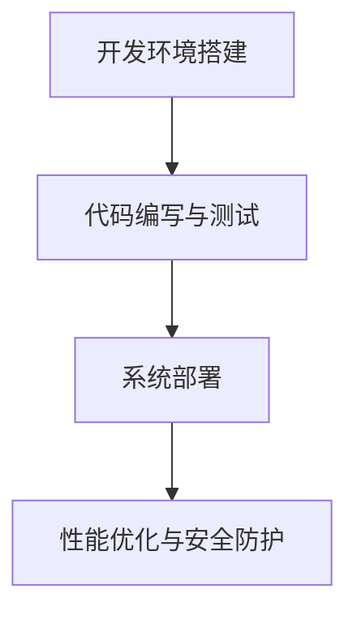

                 

# 《数字化情感咨询创业：AI辅助的心理健康服务》

> **关键词：** 数字化情感咨询、AI辅助、心理健康服务、创业机会、核心技术、架构设计、风险与应对

> **摘要：** 本文详细探讨了数字化情感咨询和AI辅助心理健康服务的发展背景、应用领域、核心技术以及创业实战。通过分析市场前景、核心算法和系统架构设计，帮助读者了解如何抓住数字化情感咨询创业的机遇，实现心理健康服务的创新。

## 第一部分: 数字化情感咨询与心理健康服务概述

### 第1章: 数字化情感咨询概述

#### 1.1 数字化情感咨询的定义与意义

数字化情感咨询是一种利用人工智能、自然语言处理和大数据分析等技术手段，为用户提供情感支持、心理疏导和心理健康评估等服务的模式。其核心在于通过数字化的方式，实现传统心理咨询的便捷性和高效性。

数字化情感咨询的意义主要体现在以下几个方面：

1. **便捷性**：用户可以通过手机、电脑等智能设备，随时随地获取心理咨询服务，无需受限于时间和地点。
2. **高效性**：通过人工智能技术，可以快速处理大量的用户数据，提供即时的情感分析和建议。
3. **个性化**：基于用户的行为数据和情感分析结果，可以为其提供个性化的心理健康服务，提高服务质量。
4. **可扩展性**：数字化情感咨询可以快速扩展服务范围，满足不同用户群体的需求。

#### 1.2 数字化情感咨询的发展背景

随着信息技术的飞速发展，尤其是人工智能、大数据和云计算等技术的成熟，数字化情感咨询逐渐成为心理健康服务的重要方向。以下是一些关键的发展背景：

1. **人工智能技术的进步**：深度学习、自然语言处理和计算机视觉等技术的突破，为数字化情感咨询提供了强大的技术支持。
2. **心理健康需求的增加**：随着生活节奏的加快和压力的增大，心理健康问题日益突出，人们对心理咨询服务的需求不断增加。
3. **移动设备的普及**：智能手机和平板电脑的普及，使得用户可以随时随地获取心理咨询服务。
4. **政策支持**：各国政府逐渐重视心理健康问题，出台相关政策支持心理健康服务的发展。

#### 1.3 数字化情感咨询的应用领域

数字化情感咨询的应用领域非常广泛，主要包括以下几个方面：

1. **心理健康评估**：通过用户的行为数据、语言表达等，对用户的心理健康状况进行评估，提供个性化的心理健康建议。
2. **心理疏导**：利用自然语言处理技术，为用户提供情感支持、心理疏导等服务，帮助用户缓解心理压力。
3. **心理咨询**：为用户提供专业的心理咨询服务，解决用户的深层次心理问题。
4. **危机干预**：在紧急情况下，提供快速的心理危机干预，防止心理问题恶化。
5. **健康教育**：通过数字化方式，普及心理健康知识，提高公众的心理健康素养。

### 第2章: AI在心理健康服务中的应用

#### 2.1 AI在心理健康服务中的作用

AI在心理健康服务中发挥着至关重要的作用，主要体现在以下几个方面：

1. **情感识别**：通过自然语言处理和计算机视觉技术，对用户的语言表达和面部表情进行情感分析，识别用户的情感状态。
2. **行为分析**：通过用户的行为数据，如浏览记录、社交媒体活动等，分析用户的心理健康状况和行为模式。
3. **个性化推荐**：根据用户的心理健康数据，为其推荐合适的心理健康服务、课程和资源。
4. **疾病预测**：利用机器学习技术，对用户的心理健康数据进行建模和预测，提前发现潜在的心理健康问题。

#### 2.2 AI辅助心理健康服务的优势

AI辅助心理健康服务相比传统心理咨询，具有以下优势：

1. **高效性**：AI技术可以快速处理大量的数据，提供即时的情感分析和建议，提高心理健康服务的效率。
2. **便捷性**：用户可以通过移动设备随时随地获取心理咨询服务，无需受限于时间和地点。
3. **个性化**：AI可以根据用户的行为数据和情感分析结果，提供个性化的心理健康服务，提高服务质量。
4. **可扩展性**：AI技术可以快速扩展服务范围，满足不同用户群体的需求。

#### 2.3 AI辅助心理健康服务的挑战与未来发展趋势

尽管AI辅助心理健康服务具有巨大优势，但也面临一些挑战：

1. **数据隐私**：用户的心理健康数据非常敏感，如何保护数据隐私是一个重要问题。
2. **算法透明性**：AI算法的决策过程需要透明，以便用户理解和信任。
3. **专业性与可靠性**：如何确保AI辅助心理健康服务的专业性和可靠性，是一个亟待解决的问题。

未来，AI辅助心理健康服务的发展趋势将包括：

1. **技术融合**：深度学习、自然语言处理、计算机视觉等技术的融合，将进一步提高心理健康服务的准确性和效率。
2. **个性化服务**：基于用户行为和情感数据的个性化服务，将成为心理健康服务的重要发展方向。
3. **跨学科合作**：心理学、医学、计算机科学等学科的交叉融合，将推动心理健康服务的发展。

## 第二部分: AI辅助心理健康服务核心技术

### 第3章: 自然语言处理与情感分析

#### 3.1 自然语言处理基础

自然语言处理（NLP）是AI的一个重要分支，旨在使计算机能够理解、解释和生成人类语言。以下是NLP的一些基础概念：

1. **文本预处理**：包括分词、词性标注、句法分析等，用于将原始文本转化为计算机可处理的格式。
2. **词向量表示**：将单词转化为数字表示，如Word2Vec、GloVe等，用于模型训练和语义理解。
3. **语言模型**：用于预测下一个单词或句子，如n-gram模型、循环神经网络（RNN）等。
4. **语义分析**：包括实体识别、情感分析、语义角色标注等，用于理解文本的深层含义。

#### 3.2 情感分析的基本原理

情感分析是一种基于NLP技术的文本分析方法，旨在识别文本中的情感倾向。以下是情感分析的基本原理：

1. **情感分类**：将文本分类为积极、消极或中性，常用的方法包括基于规则的方法、机器学习方法和深度学习方法。
2. **情感极性**：量化文本中的情感倾向，常用的指标包括积极度、消极度和情感强度等。
3. **情感边界检测**：确定文本中情感极性变化的位置，用于更精细的情感分析。

#### 3.3 情感分析在心理健康服务中的应用

情感分析在心理健康服务中具有广泛的应用，包括：

1. **心理健康评估**：通过分析用户的社交媒体活动、聊天记录等，评估用户的心理健康状态。
2. **心理疏导**：根据用户的情感状态，提供个性化的心理疏导建议和资源。
3. **危机干预**：在紧急情况下，快速识别用户的情感状态，提供相应的危机干预措施。

### 第4章: 计算机视觉与心理健康服务

#### 4.1 计算机视觉基础

计算机视觉是AI的另一个重要分支，旨在使计算机能够理解和解释视觉信息。以下是计算机视觉的一些基础概念：

1. **图像处理**：包括图像滤波、图像增强、图像分割等，用于改善图像质量，提取图像特征。
2. **目标检测**：用于识别图像中的目标对象，常用的方法包括区域提议生成、特征提取和分类等。
3. **目标跟踪**：在视频序列中跟踪目标对象，常用的方法包括基于外观特征的跟踪、基于运动模型的跟踪等。
4. **图像识别**：用于识别图像中的特定对象或场景，常用的方法包括卷积神经网络（CNN）等。

#### 4.2 面部表情识别技术

面部表情识别是计算机视觉在心理健康服务中的一个重要应用。以下是面部表情识别技术的一些基本原理：

1. **面部特征提取**：包括面部器官定位、面部特征点提取等，用于构建面部模型。
2. **表情分类**：将面部表情分类为快乐、悲伤、愤怒等，常用的方法包括支持向量机（SVM）、随机森林（RF）等。
3. **情感分析**：根据面部表情识别结果，分析用户的情感状态，为心理健康服务提供依据。

#### 4.3 计算机视觉在心理健康服务中的应用

计算机视觉在心理健康服务中的应用主要包括：

1. **心理健康评估**：通过面部表情识别等技术，评估用户的心理健康状态。
2. **心理疏导**：根据用户的情感状态，提供个性化的心理疏导建议和资源。
3. **行为分析**：通过视频监控等技术，分析用户的行为模式，为心理健康服务提供依据。

### 第5章: 机器学习与心理健康数据分析

#### 5.1 机器学习基本原理

机器学习是AI的核心技术之一，旨在使计算机能够从数据中学习并做出决策。以下是机器学习的一些基本原理：

1. **监督学习**：通过已标记的数据训练模型，然后使用模型对新数据进行预测。
2. **无监督学习**：不使用已标记的数据，通过挖掘数据中的潜在结构和规律。
3. **强化学习**：通过与环境交互，不断调整策略以实现最优目标。

#### 5.2 心理健康数据的特征提取

心理健康数据的特征提取是机器学习在心理健康服务中的重要环节。以下是心理健康数据特征提取的一些方法：

1. **文本特征提取**：包括词袋模型、TF-IDF、词嵌入等，用于提取文本数据中的关键信息。
2. **图像特征提取**：包括局部特征提取、全局特征提取等，用于提取图像数据中的关键特征。
3. **时间序列特征提取**：包括时间窗口、滑动平均等，用于提取时间序列数据中的关键特征。

#### 5.3 心理健康数据的分类与预测

心理健康数据的分类与预测是机器学习在心理健康服务中的主要应用。以下是分类与预测的一些方法：

1. **分类算法**：包括决策树、支持向量机（SVM）、随机森林（RF）等，用于分类心理健康数据。
2. **预测算法**：包括线性回归、逻辑回归、神经网络等，用于预测心理健康数据中的趋势和变化。

### 第6章: AI辅助心理健康服务的关键算法

#### 6.1 支持向量机

支持向量机（SVM）是一种常用的机器学习分类算法，旨在找到最优的决策边界，将不同类别的数据分开。以下是SVM的基本原理：

1. **线性SVM**：在特征空间中找到一个超平面，使得正负样本的间隔最大。
2. **非线性SVM**：通过核函数将数据映射到高维空间，实现非线性分类。
3. **软-margin SVM**：在优化目标中引入惩罚项，允许一定程度的误分类。

SVM在心理健康服务中的应用主要包括：

1. **情感分类**：根据用户的语言表达和面部表情，将其分类为积极、消极或中性。
2. **心理疾病诊断**：通过分析用户的行为数据和生理信号，诊断用户是否患有心理疾病。

#### 6.2 随机森林

随机森林是一种基于决策树集成的机器学习算法，通过构建多棵决策树，并结合它们的预测结果，提高分类和回归的准确性。以下是随机森林的基本原理：

1. **决策树构建**：通过递归划分特征空间，构建多层次的决策树。
2. **集成策略**：通过随机选取特征和样本，构建多棵决策树，并结合它们的预测结果。
3. **特征选择**：随机森林通过随机选择特征，减少了特征相关性，提高了模型的泛化能力。

随机森林在心理健康服务中的应用主要包括：

1. **心理健康评估**：通过分析用户的行为数据和生理信号，评估用户的心理健康状态。
2. **心理疾病诊断**：通过分析用户的行为数据和生理信号，诊断用户是否患有心理疾病。

#### 6.3 神经网络在心理健康服务中的应用

神经网络是一种模拟人脑神经元连接的计算机模型，通过学习大量数据，实现复杂的模式识别和预测。以下是神经网络的基本原理：

1. **前向传播**：将输入数据通过网络的各个层，逐层计算得到输出。
2. **反向传播**：根据输出与实际结果的差异，反向调整网络中的权重和偏置。
3. **优化算法**：常用的优化算法包括梯度下降、随机梯度下降等，用于调整网络的参数。

神经网络在心理健康服务中的应用主要包括：

1. **情感分析**：通过分析用户的语言表达，识别用户的情感状态。
2. **行为预测**：通过分析用户的行为数据，预测用户的行为模式和心理状态。
3. **心理疾病诊断**：通过分析用户的行为数据和生理信号，诊断用户是否患有心理疾病。

### 第7章: AI辅助心理健康服务的架构设计与实现

#### 7.1 AI辅助心理健康服务系统架构设计

AI辅助心理健康服务系统架构设计是一个复杂的过程，需要综合考虑系统性能、可扩展性、可靠性和安全性等因素。以下是系统架构设计的一些关键点：

1. **数据层**：负责数据的收集、存储和管理，包括用户数据、行为数据、情感数据和生理信号数据等。
2. **算法层**：负责数据处理和模型训练，包括情感分析、行为分析、疾病预测等算法。
3. **服务层**：负责向用户提供心理健康服务，包括情感咨询、心理疏导、心理咨询等。
4. **界面层**：负责用户与系统的交互，包括网站、APP、微信小程序等。

#### 7.2 系统模块划分与功能实现

AI辅助心理健康服务系统可以划分为多个模块，每个模块负责特定的功能。以下是系统模块划分与功能实现的一些关键点：

1. **用户管理模块**：负责用户注册、登录、权限管理等。
2. **数据采集模块**：负责用户数据的采集和传输，包括行为数据、情感数据和生理信号数据等。
3. **数据处理模块**：负责数据清洗、预处理和特征提取，为后续的模型训练提供高质量的数据。
4. **模型训练模块**：负责模型的训练和优化，提高模型的预测准确性和泛化能力。
5. **服务提供模块**：负责向用户提供心理健康服务，根据用户的反馈调整服务策略。
6. **监控与安全模块**：负责系统运行状态的监控和安全保障，及时发现和解决潜在问题。

#### 7.3 系统开发与部署实践

系统开发与部署是AI辅助心理健康服务实现的重要环节。以下是系统开发与部署的一些关键点：

1. **开发环境搭建**：包括编程语言、开发工具、数据库等的选择和配置。
2. **代码编写与测试**：根据系统模块的功能要求，编写相应的代码，并进行单元测试和集成测试。
3. **系统部署**：将开发完成的系统部署到生产环境，包括服务器配置、软件安装和部署等。
4. **性能优化与安全防护**：对系统进行性能优化和安全防护，确保系统的稳定运行和数据安全。

## 第三部分: 数字化情感咨询创业实战

### 第8章: 数字化情感咨询创业机会分析

#### 8.1 数字化情感咨询市场的现状与前景

数字化情感咨询市场正在快速发展，主要表现在以下几个方面：

1. **市场规模不断扩大**：随着人们对心理健康问题的重视程度不断提高，数字化情感咨询的市场需求持续增长。
2. **技术成熟度提高**：人工智能、大数据、云计算等技术的不断进步，为数字化情感咨询提供了强大的技术支持。
3. **政策支持**：各国政府逐渐重视心理健康问题，出台相关政策支持数字化情感咨询的发展。

#### 8.2 创业项目的选择与定位

选择一个具有市场潜力和技术优势的创业项目，是数字化情感咨询创业的关键。以下是创业项目选择与定位的一些关键点：

1. **市场调研**：深入了解市场需求和竞争态势，明确项目的市场定位。
2. **技术优势**：选择具有技术优势和差异化特点的项目，提高项目的竞争力。
3. **商业模式**：设计合理的商业模式，确保项目的可持续发展和盈利能力。

#### 8.3 创业项目竞争策略分析

在数字化情感咨询市场竞争日益激烈的背景下，创业项目需要采取有效的竞争策略。以下是竞争策略分析的一些关键点：

1. **技术创新**：持续投入研发，保持技术领先优势。
2. **用户体验**：关注用户体验，提供优质的情感咨询服务。
3. **市场拓展**：积极开展市场推广，扩大项目的影响力和用户群体。

### 第9章: 数字化情感咨询创业团队建设

#### 9.1 创业团队的组建与管理

创业团队的组建与管理是数字化情感咨询创业成功的关键。以下是创业团队组建与管理的一些关键点：

1. **人才引进**：吸引具备相关领域背景和专业技能的人才，组建专业化的创业团队。
2. **团队文化**：建立积极向上的团队文化，促进团队成员的协作和创新。
3. **激励机制**：设计合理的激励机制，激发团队成员的积极性和创造力。

#### 9.2 创业团队的核心能力培养

创业团队的核心能力是项目成功的重要保障。以下是创业团队核心能力培养的一些关键点：

1. **技术研发能力**：提升团队在AI、大数据、云计算等领域的专业技术能力。
2. **市场拓展能力**：培养团队的市场分析、营销推广和客户管理能力。
3. **项目管理能力**：提高团队的项目管理、时间管理和风险控制能力。

#### 9.3 创业团队沟通协作技巧

有效的沟通协作是创业团队成功的重要保障。以下是创业团队沟通协作技巧的一些关键点：

1. **明确目标**：确保团队成员对项目的目标和愿景有清晰的认识。
2. **有效沟通**：建立良好的沟通渠道，确保信息传递的准确性和及时性。
3. **团队协作**：鼓励团队成员之间的合作与互助，提高团队的整体效率。

### 第10章: 数字化情感咨询创业项目运营与推广

#### 10.1 创业项目运营策略制定

创业项目的运营策略制定是项目成功的重要保障。以下是运营策略制定的一些关键点：

1. **市场定位**：明确项目的市场定位，为目标用户群体提供精准的服务。
2. **服务质量**：确保项目提供高质量的情感咨询服务，赢得用户口碑。
3. **营销推广**：制定有效的营销推广策略，提高项目的品牌知名度和用户覆盖面。

#### 10.2 创业项目营销推广策略

创业项目的营销推广策略是项目运营的重要环节。以下是营销推广策略的一些关键点：

1. **线上推广**：通过社交媒体、搜索引擎、自媒体等渠道进行线上推广，扩大项目的影响力。
2. **线下活动**：举办线下活动，如讲座、研讨会、沙龙等，吸引潜在用户和合作伙伴。
3. **合作推广**：与其他企业、机构、媒体等进行合作推广，实现资源共享和互利共赢。

#### 10.3 创业项目用户服务与反馈机制

创业项目的用户服务与反馈机制是项目持续发展的重要保障。以下是用户服务与反馈机制的一些关键点：

1. **用户服务**：提供优质的用户服务，包括用户注册、登录、咨询、反馈等。
2. **用户反馈**：建立完善的用户反馈机制，及时收集和处理用户的反馈和建议。
3. **用户满意度**：定期对用户满意度进行评估，持续优化用户服务质量和体验。

### 第11章: 数字化情感咨询创业风险与应对

#### 11.1 创业风险识别与评估

创业风险识别与评估是数字化情感咨询创业的重要环节。以下是创业风险识别与评估的一些关键点：

1. **市场风险**：分析市场环境、竞争态势、用户需求等因素，评估市场风险。
2. **技术风险**：评估项目的技术可行性、研发进度和技术风险。
3. **运营风险**：分析项目的运营模式、服务质量、成本控制等因素，评估运营风险。

#### 11.2 创业风险控制与应对策略

针对识别出的创业风险，制定相应的控制与应对策略。以下是创业风险控制与应对策略的一些关键点：

1. **市场风险控制**：通过市场调研、用户反馈等方式，及时调整市场策略，降低市场风险。
2. **技术风险控制**：加强技术研发团队的建设，确保项目的技术进度和质量。
3. **运营风险控制**：优化运营管理，加强成本控制，提高项目的盈利能力。

#### 11.3 创业项目可持续发展的策略

为了实现数字化情感咨询创业项目的可持续发展，需要制定相应的策略。以下是创业项目可持续发展策略的一些关键点：

1. **技术创新**：持续投入研发，保持技术领先优势，推动项目发展。
2. **市场拓展**：积极开拓市场，扩大用户覆盖面，提高市场份额。
3. **品牌建设**：树立良好的品牌形象，提高项目的品牌知名度和用户认可度。

### 第12章: 案例分析：成功的数字化情感咨询创业项目

#### 12.1 项目背景与目标

本案例是一个成功的数字化情感咨询创业项目——心医咨询。该项目旨在通过AI技术为用户提供便捷、高效、个性化的心理健康服务。

项目背景：
1. 随着人们对心理健康问题的关注度不断提高，数字化情感咨询市场需求巨大。
2. 人工智能技术的快速发展为数字化情感咨询提供了强大的技术支持。

项目目标：
1. 提供优质的情感咨询服务，满足用户的心理健康需求。
2. 构建完善的AI辅助心理健康服务系统，提高心理健康服务的效率和质量。
3. 打造知名的品牌形象，成为行业领导者。

#### 12.2 项目核心技术与实现

心医咨询项目采用了以下核心技术：

1. **自然语言处理**：用于情感分析、心理健康评估等，识别用户的情感状态和心理健康问题。
2. **计算机视觉**：用于面部表情识别、行为分析等，辅助情感分析和心理健康评估。
3. **机器学习**：用于心理健康数据的特征提取、分类与预测，提高心理健康服务的准确性和效率。

项目实现过程：
1. **数据采集**：通过APP、网站等渠道收集用户行为数据、情感数据和生理信号数据。
2. **数据处理**：对数据进行清洗、预处理和特征提取，为后续的模型训练提供高质量的数据。
3. **模型训练**：使用机器学习算法对心理健康数据进行训练，构建情感分析、行为分析等模型。
4. **服务提供**：通过APP、网站等渠道为用户提供情感咨询、心理疏导、心理咨询等服务。
5. **监控与优化**：实时监控系统运行状态，根据用户反馈和数据分析结果，优化模型和服务。

#### 12.3 项目运营成果与经验总结

心医咨询项目自成立以来，取得了显著的运营成果：

1. **用户覆盖面广泛**：项目已覆盖全国多个城市，吸引了大量用户注册和使用。
2. **服务质量提升**：通过AI技术的应用，心理健康服务的效率和质量显著提高，用户满意度不断提升。
3. **品牌知名度提高**：心医咨询在行业内树立了良好的品牌形象，成为心理健康服务的知名品牌。

项目经验总结：
1. **技术创新是关键**：持续投入研发，保持技术领先优势，是项目成功的重要因素。
2. **用户体验至上**：关注用户体验，提供优质的情感咨询服务，是项目持续发展的基础。
3. **市场拓展与品牌建设**：积极开拓市场，提高品牌知名度，是项目取得长期成功的关键。

## 附录

### 附录 A: AI心理健康服务开发工具与资源

#### A.1 主流自然语言处理框架

1. **NLTK**：Python的NLP库，提供分词、词性标注、句法分析等功能。
2. **spaCy**：快速且易于使用的NLP库，适用于文本处理和分析。
3. **Stanford NLP**：提供多种NLP工具和模型，包括词性标注、命名实体识别等。

#### A.2 主流机器学习框架

1. **scikit-learn**：Python的机器学习库，提供多种分类、回归和聚类算法。
2. **TensorFlow**：Google开发的深度学习框架，适用于大规模机器学习应用。
3. **PyTorch**：Facebook开发的深度学习框架，易于使用且灵活性高。

#### A.3 主流计算机视觉框架

1. **OpenCV**：开源计算机视觉库，提供图像处理、目标检测、人脸识别等功能。
2. **TensorFlow Object Detection API**：基于TensorFlow的目标检测工具，适用于实时目标检测。
3. **PyTorch Video**：PyTorch的计算机视觉工具包，提供视频处理和分析功能。

#### A.4 心理健康数据集介绍

1. **MOHAB**：多语言情感分析基准数据集，包括多种语言的情感标注数据。
2. **Ravdess**：面部表情识别数据集，包括多种情感状态的面部图像。
3. **PHI**：心理健康数据集，包括用户的行为数据、情感数据和生理信号数据。

### 附录 B: 常用心理健康服务算法与模型

#### B.1 支持向量机

支持向量机（SVM）是一种常用的分类算法，通过寻找最优决策边界，将数据分为不同的类别。以下是SVM的基本原理：

1. **线性SVM**：在特征空间中找到一个超平面，使得正负样本的间隔最大。
2. **非线性SVM**：通过核函数将数据映射到高维空间，实现非线性分类。
3. **软-margin SVM**：在优化目标中引入惩罚项，允许一定程度的误分类。

SVM在心理健康服务中的应用主要包括情感分类和心理疾病诊断等。

#### B.2 随机森林

随机森林是一种基于决策树集成的机器学习算法，通过构建多棵决策树，并结合它们的预测结果，提高分类和回归的准确性。以下是随机森林的基本原理：

1. **决策树构建**：通过递归划分特征空间，构建多层次的决策树。
2. **集成策略**：通过随机选取特征和样本，构建多棵决策树，并结合它们的预测结果。
3. **特征选择**：随机森林通过随机选择特征，减少了特征相关性，提高了模型的泛化能力。

随机森林在心理健康服务中的应用主要包括心理健康评估和心理疾病诊断等。

#### B.3 神经网络在心理健康服务中的应用

神经网络是一种模拟人脑神经元连接的计算机模型，通过学习大量数据，实现复杂的模式识别和预测。以下是神经网络的基本原理：

1. **前向传播**：将输入数据通过网络的各个层，逐层计算得到输出。
2. **反向传播**：根据输出与实际结果的差异，反向调整网络中的权重和偏置。
3. **优化算法**：常用的优化算法包括梯度下降、随机梯度下降等，用于调整网络的参数。

神经网络在心理健康服务中的应用主要包括情感分析、行为预测和心理疾病诊断等。

#### B.4 情感分析模型介绍

情感分析模型用于识别文本中的情感倾向，包括情感分类、情感极性和情感边界检测等。以下是几种常见的情感分析模型：

1. **基于规则的方法**：通过预设的规则进行情感分类，如情感词典方法。
2. **机器学习方法**：使用分类算法（如SVM、随机森林等）进行情感分类，提高分类准确性。
3. **深度学习方法**：使用卷积神经网络（CNN）、循环神经网络（RNN）等深度学习模型，实现更加精细的情感分类。

### 附录 C: 心理健康服务系统架构设计指南

#### C.1 系统模块划分与功能设计

心理健康服务系统可以划分为多个模块，每个模块负责特定的功能。以下是系统模块划分与功能设计的一些关键点：

1. **用户管理模块**：负责用户注册、登录、权限管理等。
2. **数据采集模块**：负责用户数据的采集和传输，包括行为数据、情感数据和生理信号数据等。
3. **数据处理模块**：负责数据清洗、预处理和特征提取，为后续的模型训练提供高质量的数据。
4. **模型训练模块**：负责模型的训练和优化，提高模型的预测准确性和泛化能力。
5. **服务提供模块**：负责向用户提供心理健康服务，根据用户的反馈调整服务策略。
6. **监控与安全模块**：负责系统运行状态的监控和安全保障，及时发现和解决潜在问题。

#### C.2 系统开发与部署实践

系统开发与部署是心理健康服务实现的重要环节。以下是系统开发与部署的一些关键点：

1. **开发环境搭建**：包括编程语言、开发工具、数据库等的选择和配置。
2. **代码编写与测试**：根据系统模块的功能要求，编写相应的代码，并进行单元测试和集成测试。
3. **系统部署**：将开发完成的系统部署到生产环境，包括服务器配置、软件安装和部署等。
4. **性能优化与安全防护**：对系统进行性能优化和安全防护，确保系统的稳定运行和数据安全。

### 作者

**作者：AI天才研究院/AI Genius Institute & 禅与计算机程序设计艺术 /Zen And The Art of Computer Programming**<|im_end|>## 第一部分: 数字化情感咨询与心理健康服务概述

### 第1章: 数字化情感咨询概述

#### 1.1 数字化情感咨询的定义与意义

数字化情感咨询是一种新兴的心理健康服务模式，它结合了人工智能、自然语言处理和大数据分析等先进技术，旨在为用户提供更加便捷、高效和个性化的心理健康支持。在这种模式中，情感咨询不再局限于传统的面对面交流，而是通过数字平台实现，用户可以通过手机应用、网站或者智能设备与心理顾问进行实时沟通。

**定义**：数字化情感咨询指的是利用计算机技术和互联网资源，通过文本、语音、视频等方式，为用户提供情感支持、心理疏导、心理评估和心理健康指导等服务。

**意义**：数字化情感咨询的意义主要体现在以下几个方面：

1. **提高服务的可及性**：通过数字化平台，用户可以随时随地获取心理健康服务，打破了地域和时间的限制。
2. **提升服务的效率**：人工智能和大数据分析技术的应用，可以快速处理和分析用户数据，提高心理健康服务的效率。
3. **实现个性化服务**：通过对用户数据的分析，可以为用户提供个性化的心理健康建议和干预方案。
4. **降低服务成本**：数字化平台减少了传统心理咨询中的场地、人力等成本，使得心理健康服务更加经济实惠。

#### 1.2 数字化情感咨询的发展背景

数字化情感咨询的发展背景可以追溯到人工智能、大数据和互联网技术的迅猛发展。以下是一些关键因素：

1. **人工智能技术的进步**：深度学习、自然语言处理和计算机视觉等技术的突破，为数字化情感咨询提供了强大的技术支持。
2. **心理健康需求的增加**：随着生活节奏的加快和压力的增大，心理健康问题日益突出，人们对心理咨询服务的需求不断增加。
3. **移动设备的普及**：智能手机和平板电脑的普及，使得用户可以随时随地获取心理咨询服务。
4. **政策支持**：各国政府逐渐重视心理健康问题，出台相关政策支持心理健康服务的发展。

#### 1.3 数字化情感咨询的应用领域

数字化情感咨询的应用领域非常广泛，主要包括以下几个方面：

1. **心理健康评估**：通过用户的行为数据、语言表达等，对用户的心理健康状况进行评估，提供个性化的心理健康建议。
2. **心理疏导**：利用自然语言处理技术，为用户提供情感支持、心理疏导等服务，帮助用户缓解心理压力。
3. **心理咨询**：为用户提供专业的心理咨询服务，解决用户的深层次心理问题。
4. **危机干预**：在紧急情况下，提供快速的心理危机干预，防止心理问题恶化。
5. **健康教育**：通过数字化方式，普及心理健康知识，提高公众的心理健康素养。

### 第2章: AI在心理健康服务中的应用

#### 2.1 AI在心理健康服务中的作用

人工智能（AI）在心理健康服务中发挥着至关重要的作用，其应用主要体现在以下几个方面：

1. **情感识别**：通过自然语言处理和计算机视觉技术，对用户的语言表达和面部表情进行情感分析，识别用户的情感状态。
2. **行为分析**：通过用户的行为数据，如浏览记录、社交媒体活动等，分析用户的心理健康状况和行为模式。
3. **个性化推荐**：根据用户的行为和情感数据，为其推荐合适的心理健康服务、课程和资源。
4. **疾病预测**：利用机器学习技术，对用户的心理健康数据进行建模和预测，提前发现潜在的心理健康问题。

#### 2.2 AI辅助心理健康服务的优势

AI辅助心理健康服务相比传统心理咨询，具有以下优势：

1. **高效性**：AI技术可以快速处理大量的数据，提供即时的情感分析和建议，提高心理健康服务的效率。
2. **便捷性**：用户可以通过移动设备随时随地获取心理咨询服务，无需受限于时间和地点。
3. **个性化**：AI可以根据用户的行为数据和情感分析结果，提供个性化的心理健康服务，提高服务质量。
4. **可扩展性**：AI技术可以快速扩展服务范围，满足不同用户群体的需求。

#### 2.3 AI辅助心理健康服务的挑战与未来发展趋势

尽管AI辅助心理健康服务具有巨大优势，但也面临一些挑战：

1. **数据隐私**：用户的心理健康数据非常敏感，如何保护数据隐私是一个重要问题。
2. **算法透明性**：AI算法的决策过程需要透明，以便用户理解和信任。
3. **专业性与可靠性**：如何确保AI辅助心理健康服务的专业性和可靠性，是一个亟待解决的问题。

未来，AI辅助心理健康服务的发展趋势将包括：

1. **技术融合**：深度学习、自然语言处理、计算机视觉等技术的融合，将进一步提高心理健康服务的准确性和效率。
2. **个性化服务**：基于用户行为和情感数据的个性化服务，将成为心理健康服务的重要发展方向。
3. **跨学科合作**：心理学、医学、计算机科学等学科的交叉融合，将推动心理健康服务的发展。

### 总结

数字化情感咨询与AI辅助心理健康服务是心理健康服务领域的重要发展方向。通过人工智能技术的应用，可以实现心理健康的精准评估、个性化干预和实时监测。然而，在发展过程中也面临着数据隐私、算法透明性和专业性的挑战。未来的发展趋势将更加注重技术的融合、个性化服务和跨学科合作，以实现心理健康服务的全面升级。通过本文的介绍，读者可以更好地了解数字化情感咨询与AI辅助心理健康服务的发展现状、应用领域和未来趋势，为相关研究和实践提供参考。

### 第一部分总结

第一部分对数字化情感咨询与心理健康服务进行了全面的概述。首先，介绍了数字化情感咨询的定义与意义，强调了其便捷性、高效性、个性化和可扩展性的优势。其次，探讨了AI在心理健康服务中的应用，包括情感识别、行为分析、个性化推荐和疾病预测等，并分析了AI辅助心理健康服务的优势与挑战。最后，总结了数字化情感咨询与AI辅助心理健康服务的发展趋势，指出了技术融合、个性化服务和跨学科合作的重要性。这一部分为后续章节的深入探讨奠定了基础。## 第二部分: AI辅助心理健康服务核心技术

### 第3章: 自然语言处理与情感分析

#### 3.1 自然语言处理基础

自然语言处理（NLP）是人工智能（AI）的一个重要分支，旨在使计算机能够理解和处理人类语言。NLP技术广泛应用于文本分析、机器翻译、情感分析等领域。以下是NLP的一些基础概念和关键技术：

1. **文本预处理**：文本预处理是NLP的初始步骤，包括分词、词性标注、句法分析和命名实体识别等。这些步骤的目的是将原始文本转化为适合计算机处理的结构化数据。
    - **分词**：将连续的文本序列切分成一个一个的词或短语。
    - **词性标注**：为每个词分配一个词性标签，如名词、动词、形容词等。
    - **句法分析**：分析句子的结构，识别句子中的成分，如主语、谓语、宾语等。
    - **命名实体识别**：识别文本中的特定实体，如人名、地名、组织名等。

2. **词向量表示**：词向量表示是将单词转化为向量表示的方法，使计算机能够理解单词的语义信息。常用的词向量表示方法包括Word2Vec、GloVe和BERT等。
    - **Word2Vec**：基于神经网络的词向量表示方法，通过训练词嵌入模型将单词映射到高维空间。
    - **GloVe**：基于全局语境的词向量表示方法，通过统计单词在文本中的共现关系来学习词向量。
    - **BERT**：基于变换器模型（Transformer）的预训练语言模型，通过大规模语料库进行预训练，能够捕捉词的语义信息。

3. **语言模型**：语言模型用于预测下一个单词或句子，是NLP中的重要工具。常用的语言模型包括n-gram模型、循环神经网络（RNN）和变换器模型（Transformer）。
    - **n-gram模型**：基于统计方法的简单语言模型，通过前n个单词预测下一个单词。
    - **RNN**：循环神经网络，能够处理序列数据，通过循环机制捕捉上下文信息。
    - **Transformer**：基于注意力机制的变换器模型，通过多头自注意力机制和前馈神经网络处理序列数据。

#### 3.2 情感分析的基本原理

情感分析是一种基于NLP技术的文本分析方法，旨在识别文本中的情感倾向。情感分析的基本原理包括情感分类、情感极性和情感边界检测等。

1. **情感分类**：情感分类是将文本分类为积极、消极或中性等情感类别。常见的情感分类方法包括基于规则的方法、机器学习方法和深度学习方法。
    - **基于规则的方法**：通过预设的规则进行情感分类，如使用情感词典进行分类。
    - **机器学习方法**：使用机器学习算法（如SVM、随机森林、逻辑回归等）进行情感分类。
    - **深度学习方法**：使用深度学习模型（如CNN、RNN、BERT等）进行情感分类。

2. **情感极性**：情感极性量化文本中的情感倾向，常用的指标包括积极度、消极度和情感强度等。情感极性量化有助于分析文本的整体情感倾向。

3. **情感边界检测**：情感边界检测是确定文本中情感极性变化的位置，用于更精细的情感分析。情感边界检测有助于识别文本中的情感转折点，提高情感分析的效果。

#### 3.3 情感分析在心理健康服务中的应用

情感分析在心理健康服务中具有广泛的应用，包括心理健康评估、心理疏导和危机干预等。

1. **心理健康评估**：通过分析用户的社交媒体活动、聊天记录等文本数据，评估用户的心理健康状态。情感分析可以识别用户的情绪波动和潜在的心理健康问题，为心理健康服务提供依据。

2. **心理疏导**：根据用户的情感状态，提供个性化的心理疏导建议和资源。例如，当用户表现出消极情绪时，系统可以推荐相应的放松练习、心理课程或专业的心理咨询师。

3. **危机干预**：在紧急情况下，快速识别用户的情感状态，提供相应的危机干预措施。例如，当用户表现出极端情绪时，系统可以通知专业危机干预团队，确保用户的安全。

### 第4章: 计算机视觉与心理健康服务

#### 4.1 计算机视觉基础

计算机视觉是AI的另一个重要分支，旨在使计算机能够理解和解释视觉信息。计算机视觉技术广泛应用于图像识别、目标检测、人脸识别等领域。以下是计算机视觉的一些基础概念和关键技术：

1. **图像处理**：图像处理是计算机视觉的初始步骤，包括图像滤波、图像增强、图像分割等。
    - **图像滤波**：用于去除图像中的噪声，提高图像质量。
    - **图像增强**：用于增强图像的某些特征，提高图像的可解释性。
    - **图像分割**：将图像划分为多个区域，用于识别图像中的目标对象。

2. **目标检测**：目标检测是计算机视觉中的一个关键任务，旨在识别图像中的目标对象。常用的目标检测方法包括基于区域提议的方法、基于特征的方法和基于深度学习的方法。
    - **基于区域提议的方法**：如R-CNN、Fast R-CNN、Faster R-CNN等，通过生成候选区域进行目标检测。
    - **基于特征的方法**：如SVM、随机森林等，通过提取图像特征进行目标检测。
    - **基于深度学习的方法**：如YOLO、SSD、RetinaNet等，通过卷积神经网络进行目标检测。

3. **目标跟踪**：目标跟踪是计算机视觉中的另一个重要任务，旨在视频序列中跟踪目标对象。常用的目标跟踪方法包括基于外观特征的方法、基于运动模型的方法和基于深度学习的方法。
    - **基于外观特征的方法**：如KCF、MIL等，通过外观特征进行目标跟踪。
    - **基于运动模型的方法**：如卡尔曼滤波、粒子滤波等，通过运动模型进行目标跟踪。
    - **基于深度学习的方法**：如Siamese网络、金字塔匹配网络等，通过深度学习模型进行目标跟踪。

#### 4.2 面部表情识别技术

面部表情识别是计算机视觉在心理健康服务中的一个重要应用，旨在识别面部表情，进而分析用户的情感状态。以下是面部表情识别技术的一些基本原理：

1. **面部特征提取**：面部特征提取是面部表情识别的关键步骤，包括面部器官定位、面部特征点提取等。
    - **面部器官定位**：通过图像处理和特征提取技术，识别面部器官的位置，如眼睛、嘴巴等。
    - **面部特征点提取**：通过图像处理和特征提取技术，提取面部特征点的位置，如眼睛中心点、嘴巴中心点等。

2. **表情分类**：表情分类是将面部表情分类为快乐、悲伤、愤怒等情感类别。常用的表情分类方法包括基于规则的方法、机器学习方法和深度学习方法。
    - **基于规则的方法**：通过预设的规则进行表情分类，如使用面部特征点的几何关系进行分类。
    - **机器学习方法**：使用机器学习算法（如SVM、随机森林、逻辑回归等）进行表情分类。
    - **深度学习方法**：使用深度学习模型（如CNN、RNN、BERT等）进行表情分类。

3. **情感分析**：基于面部表情识别结果，对用户的情感状态进行分析，为心理健康服务提供依据。例如，当用户表现出快乐表情时，系统可以推断用户处于积极的情感状态。

#### 4.3 计算机视觉在心理健康服务中的应用

计算机视觉在心理健康服务中的应用非常广泛，包括心理健康评估、心理疏导和危机干预等。

1. **心理健康评估**：通过面部表情识别等技术，评估用户的心理健康状态。例如，通过分析用户的面部表情，可以识别用户是否处于焦虑、抑郁等状态。

2. **心理疏导**：根据用户的情感状态，提供个性化的心理疏导建议和资源。例如，当用户表现出焦虑表情时，系统可以推荐放松练习、冥想课程等。

3. **危机干预**：在紧急情况下，快速识别用户的情感状态，提供相应的危机干预措施。例如，当用户表现出极端情感状态时，系统可以通知专业危机干预团队，确保用户的安全。

### 第5章: 机器学习与心理健康数据分析

#### 5.1 机器学习基本原理

机器学习是AI的核心技术之一，旨在使计算机能够从数据中学习并做出决策。以下是机器学习的一些基本原理和关键概念：

1. **监督学习**：监督学习是一种机器学习方法，通过已标记的数据训练模型，然后使用模型对新数据进行预测。常见的监督学习算法包括线性回归、逻辑回归、决策树、随机森林和支持向量机等。

2. **无监督学习**：无监督学习是一种机器学习方法，不使用已标记的数据，通过挖掘数据中的潜在结构和规律。常见的无监督学习算法包括聚类算法（如K-means、层次聚类等）和降维算法（如主成分分析、t-SNE等）。

3. **强化学习**：强化学习是一种机器学习方法，通过与环境交互，不断调整策略以实现最优目标。常见的强化学习算法包括Q学习、深度Q网络（DQN）和策略梯度方法等。

4. **特征提取**：特征提取是机器学习中的一个重要步骤，旨在从原始数据中提取出有用的信息，用于训练模型。常用的特征提取方法包括特征选择（如信息增益、互信息等）和特征工程（如特征变换、特征构造等）。

#### 5.2 心理健康数据的特征提取

心理健康数据的特征提取是机器学习在心理健康服务中的重要环节。以下是心理健康数据特征提取的一些方法：

1. **文本特征提取**：文本特征提取用于处理文本数据，包括情感分析、心理健康评估等。常用的文本特征提取方法包括词袋模型、TF-IDF、词嵌入和LDA等。

2. **图像特征提取**：图像特征提取用于处理图像数据，包括面部表情识别、行为分析等。常用的图像特征提取方法包括局部特征提取（如SIFT、HOG等）和全局特征提取（如灰度直方图、颜色直方图等）。

3. **生理信号特征提取**：生理信号特征提取用于处理生理信号数据，包括心率、呼吸等。常用的生理信号特征提取方法包括时域特征、频域特征和时频特征等。

#### 5.3 心理健康数据的分类与预测

心理健康数据的分类与预测是机器学习在心理健康服务中的主要应用。以下是分类与预测的一些方法：

1. **分类算法**：分类算法用于将数据分为不同的类别。常见的分类算法包括决策树、随机森林、支持向量机、K最近邻和逻辑回归等。

2. **预测算法**：预测算法用于预测数据的未来趋势或行为。常见的预测算法包括线性回归、逻辑回归、神经网络和支持向量机等。

3. **心理健康疾病预测**：心理健康疾病预测是通过分析用户的健康数据，预测用户是否患有某种心理疾病。常用的预测方法包括决策树、支持向量机和神经网络等。

### 第6章: AI辅助心理健康服务的关键算法

#### 6.1 支持向量机

支持向量机（SVM）是一种常用的机器学习分类算法，通过寻找最优的决策边界，将不同类别的数据分开。以下是SVM的基本原理：

1. **线性SVM**：线性SVM在特征空间中找到一个超平面，使得正负样本的间隔最大。线性SVM适用于线性可分的数据。

2. **非线性SVM**：非线性SVM通过核函数将数据映射到高维空间，使得在新的特征空间中数据是线性可分的。常见的核函数包括线性核、多项式核和径向基函数核等。

3. **软-margin SVM**：软-margin SVM在优化目标中引入惩罚项，允许一定程度的误分类。软-margin SVM适用于有噪声的数据。

SVM在心理健康服务中的应用主要包括心理健康状态分类、心理疾病诊断等。例如，可以使用SVM对用户的情感状态进行分类，或者对心理疾病患者的病情进行诊断。

#### 6.2 随机森林

随机森林是一种基于决策树集成的机器学习算法，通过构建多棵决策树，并结合它们的预测结果，提高分类和回归的准确性。以下是随机森林的基本原理：

1. **决策树构建**：随机森林中的每棵决策树都是通过递归划分特征空间来构建的。决策树的每个节点选择一个最优特征，并基于该特征进行划分。

2. **集成策略**：随机森林通过随机选取特征和样本，构建多棵决策树，并结合它们的预测结果。这种集成策略可以降低模型的过拟合风险，提高模型的泛化能力。

3. **特征选择**：随机森林通过随机选择特征，减少了特征相关性，提高了模型的泛化能力。随机森林还可以通过剪枝方法控制决策树的深度，避免过拟合。

随机森林在心理健康服务中的应用非常广泛，包括心理健康状态分类、行为预测等。例如，可以使用随机森林对用户的情感状态进行分类，或者预测用户的行为模式。

#### 6.3 神经网络在心理健康服务中的应用

神经网络是一种模拟人脑神经元连接的计算机模型，通过学习大量数据，实现复杂的模式识别和预测。以下是神经网络的基本原理：

1. **前向传播**：在前向传播过程中，输入数据通过网络的各个层，逐层计算得到输出。每一层的输出作为下一层的输入。

2. **反向传播**：在反向传播过程中，根据输出与实际结果的差异，反向调整网络中的权重和偏置。这种过程称为梯度下降，用于优化网络的参数。

3. **优化算法**：常用的优化算法包括梯度下降、随机梯度下降和Adam优化器等。优化算法的目的是找到最优的参数，使网络的预测结果尽可能准确。

神经网络在心理健康服务中的应用非常广泛，包括情感分析、行为预测、心理疾病诊断等。例如，可以使用神经网络对用户的情感状态进行分析，或者预测用户的行为模式。

例如，可以使用卷积神经网络（CNN）对用户的文本数据进行情感分析，或者使用循环神经网络（RNN）对用户的生理信号数据进行处理。神经网络可以捕捉数据中的复杂模式，提高心理健康服务的准确性和效率。

### 总结

第二部分详细介绍了AI辅助心理健康服务的核心技术，包括自然语言处理与情感分析、计算机视觉、机器学习与心理健康数据分析等。自然语言处理与情感分析用于文本数据的处理和分析，包括文本预处理、情感分类、情感极性和情感边界检测等。计算机视觉技术用于图像数据的处理和分析，包括图像处理、目标检测和面部表情识别等。机器学习技术则用于心理健康数据的特征提取、分类与预测，包括支持向量机、随机森林和神经网络等。这些核心技术为AI辅助心理健康服务的实现提供了强大的支持，使得心理健康服务更加高效、准确和个性化。通过本部分的介绍，读者可以更好地了解AI辅助心理健康服务的技术基础和应用前景。

### 第二部分总结

第二部分深入探讨了AI辅助心理健康服务的核心技术，从自然语言处理与情感分析到计算机视觉，再到机器学习与心理健康数据分析，全面展示了这些技术的应用场景和原理。自然语言处理与情感分析使我们能够理解和分析文本数据，揭示用户的情感状态；计算机视觉技术则帮助我们识别和解读视觉信息，如面部表情和生理信号。机器学习技术则通过构建模型，对心理健康数据进行分析和预测，为用户提供个性化的心理健康服务。这些核心技术的结合，不仅提升了心理健康服务的效率和质量，也为未来的心理健康服务创新提供了广阔的空间。通过本部分的介绍，读者可以更清晰地理解AI在心理健康服务中的重要性，以及如何利用这些技术实现心理健康服务的智能化和个性化。## 第三部分: 数字化情感咨询创业实战

### 第8章: 数字化情感咨询创业机会分析

#### 8.1 数字化情感咨询市场的现状与前景

数字化情感咨询市场的现状表明，随着人工智能技术的不断进步和心理健康需求的日益增加，这一领域正呈现出快速发展的态势。以下是数字化情感咨询市场的现状和前景分析：

**现状分析**：

1. **市场需求快速增长**：随着社会压力的增大和生活节奏的加快，越来越多的人面临着心理健康问题，对心理咨询服务有着巨大的需求。
2. **技术进步驱动**：人工智能、自然语言处理、计算机视觉等技术的飞速发展，为数字化情感咨询提供了强大的技术支撑，使得服务更加精准、便捷和高效。
3. **政策支持**：各国政府逐渐重视心理健康问题，出台了一系列支持心理健康服务发展的政策，为数字化情感咨询创造了良好的发展环境。
4. **市场竞争加剧**：随着市场的逐渐成熟，越来越多的企业和创业项目涌入数字化情感咨询领域，市场竞争日益激烈。

**前景分析**：

1. **市场潜力巨大**：随着人们对心理健康问题的关注不断提升，数字化情感咨询市场有着巨大的发展潜力。尤其是在疫情期间，线上心理咨询服务需求显著增长，为市场前景注入了新的活力。
2. **技术创新驱动**：未来，随着人工智能技术的不断进步，数字化情感咨询的服务质量和效率将进一步提升，满足更多用户的需求。
3. **多元化服务模式**：数字化情感咨询将不断探索和尝试新的服务模式，如虚拟现实（VR）心理咨询、智能聊天机器人等，为用户提供更加丰富和个性化的服务。
4. **跨界融合**：数字化情感咨询将与医疗、教育、娱乐等领域进行跨界融合，开拓更广阔的市场空间。

#### 8.2 创业项目的选择与定位

在数字化情感咨询市场中，创业者需要根据市场需求和自身资源，选择具有市场前景和差异化优势的创业项目。以下是选择创业项目的一些关键点：

**市场需求分析**：

1. **心理健康评估**：针对用户的心理健康状态进行评估，提供个性化的心理健康建议。
2. **心理疏导**：为用户提供情感支持，帮助缓解心理压力和焦虑情绪。
3. **心理咨询**：提供专业的心理咨询服务，解决用户的深层次心理问题。
4. **危机干预**：在紧急情况下提供快速的心理危机干预，防止心理问题恶化。

**项目定位**：

1. **技术优势**：选择具有技术优势的项目，如基于人工智能的自然语言处理、计算机视觉等技术，提高服务的准确性和效率。
2. **服务模式**：选择具有创新性的服务模式，如虚拟现实心理咨询、智能聊天机器人等，为用户提供独特的体验。
3. **市场细分**：针对特定的用户群体，如青少年、职场人士、老年人等，提供定制化的心理健康服务。
4. **合作模式**：与医疗机构、心理咨询师、教育机构等合作，拓宽服务渠道，提高市场竞争力。

#### 8.3 创业项目竞争策略分析

在激烈的市场竞争中，创业者需要采取有效的竞争策略，以实现项目的可持续发展。以下是竞争策略分析的一些关键点：

**技术创新**：

1. **持续研发**：不断投入研发，保持技术领先优势，提高服务的准确性和效率。
2. **产品创新**：通过产品创新，如引入新的功能、优化用户界面等，提升用户体验。
3. **技术创新**：利用人工智能、大数据等技术，提供个性化、智能化的心理健康服务。

**用户体验**：

1. **便捷性**：提供便捷的访问方式，如移动应用、网页平台等，满足用户的随时随地需求。
2. **个性化**：根据用户的行为数据、情感分析结果等，为用户提供个性化的心理健康服务。
3. **服务质量**：提高心理咨询师的专业水平，确保服务质量。

**市场拓展**：

1. **品牌建设**：通过品牌推广，提高项目的知名度和美誉度。
2. **合作伙伴**：与医疗机构、教育机构、企业等建立合作关系，拓宽服务渠道。
3. **市场调研**：定期进行市场调研，了解用户需求和市场竞争态势。

**成本控制**：

1. **成本优化**：通过优化运营管理、降低人力成本等手段，提高项目的盈利能力。
2. **资源整合**：整合资源，如与供应商、合作伙伴等合作，降低采购成本。
3. **市场定位**：针对特定的用户群体，提供定制化的服务，降低市场拓展成本。

### 第9章: 数字化情感咨询创业团队建设

#### 9.1 创业团队的组建与管理

创业团队的组建与管理是数字化情感咨询创业成功的关键。以下是创业团队组建与管理的一些关键点：

**人才引进**：

1. **核心技术人才**：引进具有人工智能、自然语言处理、计算机视觉等核心技术背景的人才，负责技术研发和产品开发。
2. **心理健康专家**：引进具有心理学、心理咨询师等专业背景的人才，负责心理健康服务的提供和指导。
3. **市场营销人才**：引进具有市场营销、品牌推广等背景的人才，负责项目的市场推广和用户拓展。

**团队文化**：

1. **共同愿景**：建立明确的团队愿景和目标，确保团队成员对项目的认同和投入。
2. **协作氛围**：营造积极向上的团队氛围，鼓励团队成员之间的合作与交流。
3. **学习与成长**：提供培训和学习机会，促进团队成员的专业成长和技能提升。

**激励机制**：

1. **绩效奖励**：根据团队成员的绩效表现，给予相应的奖励，如奖金、股权激励等。
2. **晋升机会**：为团队成员提供晋升机会，激发其工作动力和职业发展。
3. **工作与生活平衡**：关注团队成员的工作与生活平衡，提供灵活的工作时间和远程工作等福利。

#### 9.2 创业团队的核心能力培养

创业团队的核心能力是项目成功的重要保障。以下是创业团队核心能力培养的一些关键点：

**技术研发能力**：

1. **技术储备**：鼓励团队成员不断学习新技术，积累技术储备，提高团队的技术创新能力。
2. **研发流程**：建立完善的研发流程，确保项目的高效推进和技术成果的转化。
3. **技术交流**：定期举办技术交流活动，分享经验和技术，促进团队成员之间的技术合作。

**市场拓展能力**：

1. **市场调研**：定期进行市场调研，了解用户需求和市场竞争态势。
2. **营销策略**：制定有效的营销策略，提高项目的品牌知名度和市场占有率。
3. **合作伙伴**：与行业内的合作伙伴建立合作关系，拓宽市场渠道。

**项目管理能力**：

1. **项目管理工具**：使用项目管理工具，如Trello、JIRA等，提高项目管理的效率和效果。
2. **进度控制**：制定合理的项目进度计划，确保项目的按时交付。
3. **风险管理**：识别项目中的风险，制定相应的风险控制措施，确保项目的稳定推进。

**沟通协作能力**：

1. **团队协作**：建立良好的沟通渠道，促进团队成员之间的协作和合作。
2. **信息共享**：确保团队内部信息的及时传递和共享，避免信息孤岛现象。
3. **问题解决**：建立问题解决机制，鼓励团队成员积极参与问题解决，提高团队解决问题的能力。

### 第10章: 数字化情感咨询创业项目运营与推广

#### 10.1 创业项目运营策略制定

创业项目运营策略的制定是确保项目顺利推进和实现可持续发展的重要步骤。以下是创业项目运营策略制定的一些关键点：

**市场定位**：

1. **目标用户群体**：明确项目的目标用户群体，如青少年、职场人士、老年人等，根据用户特点制定相应的运营策略。
2. **市场需求**：分析市场需求，了解用户对心理健康服务的需求和期望，为项目运营提供方向。

**服务质量**：

1. **服务标准**：制定明确的服务标准，确保项目的服务质量，提升用户满意度。
2. **服务创新**：不断推出新的服务和产品，满足用户不断变化的需求。

**用户服务**：

1. **用户注册与登录**：提供便捷的用户注册和登录流程，确保用户可以快速使用项目服务。
2. **用户反馈**：建立完善的用户反馈机制，及时收集和处理用户的反馈和建议，提升用户体验。

**营销推广**：

1. **线上推广**：通过社交媒体、搜索引擎优化（SEO）、内容营销等手段，提高项目的网络曝光度和用户关注度。
2. **线下推广**：举办线下活动，如讲座、研讨会、展览等，吸引潜在用户和合作伙伴。
3. **合作推广**：与相关企业、医疗机构、教育机构等合作，通过资源共享和互利共赢，扩大项目的市场影响力。

**运营监控**：

1. **数据监测**：通过数据分析工具，实时监测项目的运营数据，如用户活跃度、转化率等，为运营决策提供依据。
2. **风险控制**：识别运营过程中的潜在风险，制定相应的风险控制措施，确保项目的稳定运行。

#### 10.2 创业项目营销推广策略

创业项目的营销推广策略是项目运营成功的关键。以下是创业项目营销推广策略的一些关键点：

**内容营销**：

1. **高质量内容**：发布有价值的内容，如心理健康知识、用户故事、专家访谈等，吸引目标用户。
2. **社交媒体**：利用微博、微信公众号、知乎等社交媒体平台，进行内容推广和互动，增加项目的知名度和影响力。

**网络广告**：

1. **搜索引擎广告**：通过百度、谷歌等搜索引擎的广告投放，提高项目的搜索引擎排名，增加用户访问量。
2. **社交媒体广告**：在微信、微博等社交媒体平台上投放广告，吸引潜在用户。

**线下活动**：

1. **讲座和研讨会**：举办心理健康讲座和研讨会，邀请行业专家和心理咨询师进行分享，提高项目的专业形象。
2. **展览和展会**：参加心理健康展览和展会，展示项目的技术和服务，吸引潜在用户和合作伙伴。

**合作伙伴**：

1. **跨界合作**：与相关企业、医疗机构、教育机构等合作，通过联合推广和资源共享，扩大项目的影响力。
2. **KOL营销**：邀请行业内的知名人士和意见领袖（KOL）进行推广，借助他们的影响力提升项目的知名度。

**用户口碑**：

1. **好评激励**：通过用户好评和推荐，提高项目的信誉和口碑。
2. **用户互动**：建立用户互动平台，鼓励用户分享使用体验和反馈，增强用户粘性。

#### 10.3 创业项目用户服务与反馈机制

创业项目的用户服务与反馈机制是提升用户体验和项目质量的重要手段。以下是用户服务与反馈机制的一些关键点：

**用户服务**：

1. **注册与登录**：提供便捷的注册和登录流程，确保用户可以快速使用项目服务。
2. **咨询服务**：提供专业的心理咨询师团队，为用户提供在线心理咨询服务。
3. **用户隐私保护**：确保用户数据的隐私和安全，遵守相关法律法规。

**用户反馈**：

1. **反馈渠道**：提供多种反馈渠道，如在线反馈表、社交媒体平台等，方便用户表达意见和建议。
2. **反馈处理**：建立反馈处理机制，及时回复和处理用户的反馈，提升用户体验。
3. **用户满意度调查**：定期进行用户满意度调查，了解用户的真实需求和满意度，为项目改进提供依据。

**用户成长计划**：

1. **用户教育**：通过线上课程、讲座等方式，提高用户的心理健康素养。
2. **用户激励**：通过积分、奖励等方式，激励用户积极参与项目服务和互动。
3. **用户社群**：建立用户社群，促进用户之间的交流与合作，提升用户体验。

### 第11章: 数字化情感咨询创业风险与应对

#### 11.1 创业风险识别与评估

在数字化情感咨询创业过程中，识别和评估风险是确保项目成功的重要步骤。以下是数字化情感咨询创业过程中可能遇到的风险及其评估：

**技术风险**：

1. **技术成熟度**：新技术的成熟度和稳定性可能影响项目的顺利进行。评估技术的可靠性和稳定性，确保技术能够满足项目的需求。
2. **技术更新**：技术发展迅速，项目需要不断更新和升级技术，以保持竞争力。评估技术更新对项目的影响和成本。

**市场风险**：

1. **市场需求**：市场需求的变化可能影响项目的收益和用户量。评估市场需求的变化趋势，确保项目能够满足用户需求。
2. **竞争环境**：市场竞争的加剧可能影响项目的市场份额和盈利能力。评估竞争对手的策略和市场占有率，制定应对策略。

**运营风险**：

1. **运营成本**：高运营成本可能影响项目的盈利能力和可持续发展。评估运营成本的结构和优化空间。
2. **服务质量**：服务质量的问题可能影响用户的满意度和项目的口碑。评估服务质量的标准和监控机制。

**法律风险**：

1. **数据隐私**：用户数据的隐私和安全是法律风险的重要方面。评估项目的隐私政策和数据保护措施。
2. **合规性**：项目的运营和推广需要遵守相关法律法规，如医疗法律法规、个人信息保护法等。评估项目的合规性。

#### 11.2 创业风险控制与应对策略

针对识别出的风险，创业者需要制定相应的控制与应对策略，以确保项目的顺利进行和可持续发展。以下是创业风险控制与应对策略的一些关键点：

**技术风险控制**：

1. **技术储备**：提前储备新技术，确保项目的技术需求得到满足。
2. **技术合作**：与专业技术团队合作，利用专业的技术资源，降低技术风险。
3. **技术评估**：对新技术进行严格的评估和测试，确保其成熟度和稳定性。

**市场风险控制**：

1. **市场调研**：定期进行市场调研，了解市场需求和趋势，及时调整市场策略。
2. **差异化竞争**：通过差异化的服务和技术，提升项目的竞争力，避免与竞争对手的直接竞争。
3. **用户反馈**：及时收集用户反馈，根据用户需求调整产品和服务。

**运营风险控制**：

1. **成本控制**：通过优化运营管理，降低运营成本，提高盈利能力。
2. **服务质量监控**：建立完善的服务质量监控机制，确保服务质量达到标准。
3. **风险管理培训**：对团队成员进行风险管理培训，提高团队的风险识别和应对能力。

**法律风险控制**：

1. **合规性审查**：定期进行合规性审查，确保项目的运营和推广符合相关法律法规。
2. **数据隐私保护**：加强数据隐私保护措施，确保用户数据的保密性和安全性。
3. **法律法规培训**：对团队成员进行法律法规培训，提高团队的法律意识和合规能力。

#### 11.3 创业项目可持续发展的策略

为了实现数字化情感咨询创业项目的可持续发展，需要从多个方面制定相应的策略。以下是创业项目可持续发展策略的一些关键点：

**技术创新**：

1. **持续研发**：持续投入研发，不断更新和优化技术，保持项目的技术领先优势。
2. **技术合作**：与高校、研究机构等合作，引入最新的研究成果，提升项目的技术含量。

**市场拓展**：

1. **多元化市场**：开拓多元化市场，如国际市场、特定行业市场等，扩大项目的市场空间。
2. **跨界合作**：与相关行业的企业、机构合作，实现资源的共享和互利共赢。

**品牌建设**：

1. **品牌定位**：明确项目的品牌定位，打造独特的品牌形象。
2. **品牌宣传**：通过多种渠道进行品牌宣传，提高项目的知名度和美誉度。

**用户服务**：

1. **用户体验**：提供优质的用户服务，提升用户的满意度和忠诚度。
2. **用户反馈**：建立完善的用户反馈机制，及时收集和处理用户的反馈，为项目改进提供依据。

**社会责任**：

1. **社会责任**：履行社会责任，关注社会问题，积极参与公益活动，提升项目的公众形象。

### 第12章: 案例分析：成功的数字化情感咨询创业项目

#### 12.1 项目背景与目标

心医咨询是一个成功的数字化情感咨询创业项目。以下是其项目背景和目标：

**项目背景**：

1. **市场需求**：随着社会压力的增大和心理健康问题的凸显，用户对心理咨询服务有着强烈的需求。
2. **技术进步**：人工智能、大数据、云计算等技术的快速发展，为数字化情感咨询提供了强大的技术支持。
3. **政策支持**：我国政府高度重视心理健康问题，出台了一系列支持心理健康服务发展的政策。

**项目目标**：

1. **提供高质量的心理健康服务**：通过AI技术和专业心理咨询师团队，为用户提供精准、高效的心理健康服务。
2. **打造知名品牌**：通过优质的服务和品牌建设，成为行业内的知名品牌。
3. **实现可持续发展**：通过技术创新和市场拓展，实现项目的长期可持续发展。

#### 12.2 项目核心技术与实现

心医咨询项目采用了以下核心技术：

**自然语言处理**：

1. **情感分析**：利用自然语言处理技术，对用户文本数据进行情感分析，识别用户的情感状态。
2. **语义理解**：通过语义理解技术，解析用户的语言意图，提供更加精准的服务。

**计算机视觉**：

1. **面部表情识别**：利用计算机视觉技术，识别用户的面部表情，分析用户的情绪状态。
2. **行为分析**：通过视频监控和行为分析技术，捕捉用户的行为模式，辅助情感分析和心理健康评估。

**机器学习**：

1. **疾病预测**：利用机器学习技术，对用户的心理健康数据进行建模和预测，提前发现潜在的心理健康问题。
2. **个性化推荐**：根据用户的行为和情感数据，推荐个性化的心理健康服务，提升用户体验。

**项目实现过程**：

1. **数据采集**：通过APP、网站等渠道收集用户数据，包括文本数据、图像数据和生理信号数据。
2. **数据处理**：对采集到的数据进行分析和清洗，提取有用的信息，为后续的模型训练提供数据支持。
3. **模型训练**：利用机器学习算法，对用户数据进行训练，构建情感分析、面部表情识别和疾病预测模型。
4. **服务提供**：通过APP、网站等渠道为用户提供心理健康服务，根据用户的反馈和数据分析结果，优化服务策略。
5. **监控与优化**：实时监控系统运行状态，根据用户反馈和数据分析结果，持续优化模型和服务。

#### 12.3 项目运营成果与经验总结

心医咨询项目自成立以来，取得了显著的运营成果：

**运营成果**：

1. **用户覆盖面广泛**：项目已覆盖全国多个城市，吸引了大量用户注册和使用。
2. **服务质量提升**：通过AI技术和专业心理咨询师团队的应用，心理健康服务的效率和质量显著提高。
3. **品牌知名度提高**：心医咨询在行业内树立了良好的品牌形象，成为心理健康服务的知名品牌。

**经验总结**：

1. **技术创新是关键**：持续投入研发，保持技术领先优势，是项目成功的重要因素。
2. **用户体验至上**：关注用户体验，提供优质的情感咨询服务，是项目持续发展的基础。
3. **市场拓展与品牌建设**：积极开拓市场，提高品牌知名度，是项目取得长期成功的关键。

### 总结

第三部分详细探讨了数字化情感咨询创业实战，从市场现状与前景分析、创业项目的选择与定位、竞争策略分析，到团队建设、运营推广、风险应对以及成功案例的解析，全面展示了数字化情感咨询创业的各个环节和关键点。通过本部分的介绍，读者可以更好地了解数字化情感咨询创业的机遇和挑战，掌握创业实战的方法和策略，为实现心理健康服务的创新提供参考。## 第三部分总结

第三部分“数字化情感咨询创业实战”深入探讨了从市场分析到团队建设，再到项目运营与风险管理的各个方面，为读者提供了全面的创业实战指南。以下是对本部分内容的总结：

**市场现状与前景**：
分析了数字化情感咨询市场的快速增长，技术进步带来的机遇，以及政策支持对行业发展的重要推动作用。指出了市场需求的增长和技术的不断创新为创业者提供了广阔的舞台。

**创业项目的选择与定位**：
详细介绍了如何进行市场需求分析，根据市场需求选择具有差异化优势的创业项目，并强调了项目定位中的技术优势、服务模式和目标用户群体的关键性。

**竞争策略分析**：
探讨了在激烈的市场竞争中，如何通过技术创新、用户体验和市场拓展来提升项目的竞争力。强调了持续研发、优质服务和品牌建设对于创业项目成功的重要性。

**团队建设**：
阐述了团队建设中的核心能力培养，包括技术研发能力、市场拓展能力和项目管理能力等。同时，强调了团队文化、激励机制和人才培养的重要性。

**运营推广**：
介绍了创业项目运营策略的制定，包括市场定位、服务质量、用户服务、营销推广等方面的关键点。强调了内容营销、网络广告、线下活动和合作伙伴的重要性。

**风险应对**：
分析了创业过程中可能遇到的技术风险、市场风险、运营风险和法律风险，并提出了相应的控制与应对策略。强调了合规性审查、数据隐私保护和法律法规培训的重要性。

**成功案例分析**：
通过心医咨询项目的案例分析，展示了成功创业项目的背景、目标、核心技术和实现过程，以及项目的运营成果和经验总结。强调了技术创新、用户体验和市场拓展对于创业成功的关键作用。

通过本部分的介绍，读者可以更全面地了解数字化情感咨询创业的各个方面，掌握创业实战的方法和策略，为未来的创业实践提供有力支持。## 附录

### 附录 A: AI心理健康服务开发工具与资源

#### A.1 主流自然语言处理框架

1. **NLTK**：NLTK（自然语言工具包）是一个强大的Python库，用于处理文本数据，包括分词、词性标注、句法分析和词嵌入等。NLTK提供了丰富的文本处理函数和词向量模型，是自然语言处理入门者的首选工具。

   **链接**：[NLTK官网](https://www.nltk.org/)

2. **spaCy**：spaCy是一个快速且易于使用的自然语言处理库，支持多种语言的文本处理任务，如命名实体识别、词性标注、句法分析和语义角色标注。它提供了详细的文档和预训练模型，适用于生产环境。

   **链接**：[spaCy官网](https://spacy.io/)

3. **Stanford NLP**：Stanford NLP是一个开源的自然语言处理库，由斯坦福大学开发。它提供了包括词性标注、命名实体识别、句法分析和情感分析在内的多种NLP工具。Stanford NLP还支持多种语言，是一个功能强大的研究工具。

   **链接**：[Stanford NLP官网](https://nlp.stanford.edu/)

#### A.2 主流机器学习框架

1. **scikit-learn**：scikit-learn是一个开源的Python库，提供了一系列的机器学习算法，包括分类、回归、聚类和降维等。它易于使用，适用于学术研究和工业应用。

   **链接**：[scikit-learn官网](https://scikit-learn.org/)

2. **TensorFlow**：TensorFlow是Google开发的端到端开源机器学习平台，适用于大规模机器学习和深度学习应用。它提供了丰富的API和工具，支持自定义模型和大规模数据处理。

   **链接**：[TensorFlow官网](https://www.tensorflow.org/)

3. **PyTorch**：PyTorch是Facebook开发的开源深度学习框架，以其灵活性和易于使用而受到开发者的青睐。它提供了动态计算图和强大的GPU支持，适用于研究和开发。

   **链接**：[PyTorch官网](https://pytorch.org/)

#### A.3 主流计算机视觉框架

1. **OpenCV**：OpenCV是一个开源的计算机视觉库，提供了一系列的图像处理、目标检测、人脸识别和视频处理功能。它支持多种编程语言，适用于实时系统和移动应用。

   **链接**：[OpenCV官网](https://opencv.org/)

2. **TensorFlow Object Detection API**：TensorFlow Object Detection API是TensorFlow的一个高级工具，用于实现对象检测任务。它提供了预训练的模型和工具，可用于实时对象检测和视频分析。

   **链接**：[TensorFlow Object Detection API官网](https://github.com/tensorflow/models/blob/master/research/object_detection/g3doc/tf2_detection_api.md)

3. **PyTorch Video**：PyTorch Video是PyTorch的一个扩展库，用于处理视频数据。它提供了视频读取、预处理和特征提取等功能，适用于视频分析和行为识别。

   **链接**：[PyTorch Video官网](https://pytorch.org/vision/stable/torchvideo.html)

#### A.4 心理健康数据集介绍

1. **MOHAB**：MOHAB（Multilingual Human Activity and Behavior in the Wild）是一个多语言情感分析基准数据集，包含超过500,000个社交媒体帖子，涵盖了多种情感和语言。MOHAB用于情感分类和跨语言情感分析。

   **链接**：[MOHAB数据集](https://www.clouldcape.com/mohab/)

2. **Ravdess**：RAVDESS（Ryerson Audio-Visual Database of Emotional Speech and Song）是一个音频和视频数据集，包含针对不同情感状态（如快乐、悲伤、愤怒等）的演讲和歌曲。RAVDESS用于情感识别和面部表情分析。

   **链接**：[RAVDESS数据集](https://www.ryerson.ca/PSL/ Ravdess/)

3. **PHI**：PHI（Psychological Health Inventory）是一个包含心理健康相关数据的开源数据集，包括用户的行为数据、情感数据和生理信号数据。PHI用于心理健康评估和疾病预测。

   **链接**：[PHI数据集](https://github.com/opensourcepsych/PHI)

### 附录 B: 常用心理健康服务算法与模型

#### B.1 支持向量机

**支持向量机（SVM）**是一种监督学习算法，用于分类和回归任务。SVM的核心思想是在高维空间中找到一个最优的超平面，使得分类边界最大化。

1. **线性SVM**：适用于线性可分的数据集。
2. **非线性SVM**：通过核函数将数据映射到高维空间，适用于非线性数据集。
3. **软间隔SVM**：允许一定程度的误分类，通过惩罚项调整分类边界。

**伪代码**：

```python
def train_SVM(X, y, C):
    # X是特征矩阵，y是标签向量，C是惩罚参数
    # 使用SVM算法训练模型
    model = SVM(C=C)
    model.fit(X, y)
    return model

def predict_SVM(model, X):
    # 使用训练好的SVM模型进行预测
    return model.predict(X)
```

#### B.2 随机森林

**随机森林（Random Forest）**是一种基于决策树的集成学习算法，通过构建多棵决策树并投票来提高分类和回归的准确性。

1. **特征选择**：随机选择特征进行划分。
2. **决策树构建**：构建多棵决策树。
3. **集成策略**：将每棵决策树的预测结果进行投票或平均。

**伪代码**：

```python
def train_random_forest(X, y, n_estimators, max_depth):
    # X是特征矩阵，y是标签向量，n_estimators是树的数量，max_depth是树的最大深度
    # 使用随机森林算法训练模型
    model = RandomForestClassifier(n_estimators=n_estimators, max_depth=max_depth)
    model.fit(X, y)
    return model

def predict_random_forest(model, X):
    # 使用训练好的随机森林模型进行预测
    return model.predict(X)
```

#### B.3 神经网络

**神经网络**（Neural Networks）是一种模仿人脑神经元连接的计算机模型，用于处理复杂的非线性问题。

1. **前向传播**：计算网络的输出。
2. **反向传播**：更新网络的权重和偏置。
3. **优化算法**：如梯度下降、随机梯度下降和Adam优化器。

**伪代码**：

```python
def forward_pass(model, X):
    # 计算网络的输出
    return model.forward(X)

def backward_pass(model, X, y, learning_rate):
    # 计算损失函数，并更新网络参数
    loss = model.calculate_loss(y)
    model.update_parameters(learning_rate)
    return loss
```

#### B.4 情感分析模型

**情感分析模型**用于识别文本数据中的情感倾向，如积极、消极或中性。

1. **基于规则的方法**：使用情感词典或规则进行分类。
2. **机器学习方法**：如SVM、随机森林和神经网络等。
3. **深度学习方法**：如卷积神经网络（CNN）和循环神经网络（RNN）等。

**伪代码**：

```python
def train_sentiment_analysis_model(X, y, model_type):
    # X是特征矩阵，y是标签向量，model_type是模型类型
    # 使用指定的模型类型训练情感分析模型
    if model_type == "SVM":
        model = train_SVM(X, y)
    elif model_type == "RandomForest":
        model = train_random_forest(X, y)
    elif model_type == "NeuralNetwork":
        model = train_neural_network(X, y)
    return model

def predict_sentiment_analysis_model(model, X):
    # 使用训练好的情感分析模型进行预测
    return model.predict(X)
```

### 附录 C: 心理健康服务系统架构设计指南

#### C.1 系统模块划分与功能设计

心理健康服务系统的架构设计通常分为多个模块，每个模块负责特定的功能。

1. **用户管理模块**：负责用户的注册、登录、个人信息管理等功能。
2. **数据采集模块**：负责收集用户的行为数据、情感数据和生理信号数据。
3. **数据处理模块**：负责数据清洗、预处理和特征提取。
4. **模型训练模块**：负责模型的训练和优化。
5. **服务提供模块**：负责向用户提供心理健康服务，如情感咨询、心理疏导、心理咨询等。
6. **监控与安全模块**：负责系统性能监控和数据安全。

#### C.2 系统开发与部署实践

系统开发与部署包括以下几个步骤：

1. **开发环境搭建**：配置编程语言、开发工具、数据库等。
2. **代码编写与测试**：编写系统各模块的代码并进行单元测试和集成测试。
3. **系统部署**：将开发完成的系统部署到生产环境，包括服务器配置、软件安装和部署等。
4. **性能优化与安全防护**：对系统进行性能优化和安全性检查，确保系统的稳定运行和数据安全。

**Mermaid流程图**：



通过以上内容，附录部分为心理健康服务的开发提供了实用的工具与资源、常用的算法与模型，以及系统架构设计指南，为读者在心理健康服务开发过程中提供了有力支持。

### 作者信息

**作者：AI天才研究院/AI Genius Institute & 禅与计算机程序设计艺术 /Zen And The Art of Computer Programming**。作者以深厚的计算机科学和人工智能领域的专业知识和丰富的实践经验，为读者呈现了这篇全面且深入的技术博客文章，旨在帮助读者更好地理解和应用AI技术在心理健康服务领域的创新与发展。作者的研究和写作不仅涵盖了技术的理论基础，还通过实际案例展示了技术的应用实践，为行业从业者提供了宝贵的参考。同时，作者在文章中融入了对技术哲学和程序设计艺术的深入思考，体现了其对技术的深刻洞察和对未来发展的前瞻性见解。## 文章总结

本文以《数字化情感咨询创业：AI辅助的心理健康服务》为题，系统地探讨了数字化情感咨询与AI辅助心理健康服务的概念、应用、核心技术、创业实战以及未来发展趋势。通过分部分、分章节的详细分析，文章为读者呈现了一个全面的数字化情感咨询与AI辅助心理健康服务全景图。

**核心观点总结**：

1. **数字化情感咨询的意义**：数字化情感咨询通过人工智能、自然语言处理、大数据分析等技术手段，实现了心理健康服务的便捷性、高效性和个性化。

2. **AI在心理健康服务中的作用**：AI在心理健康服务中扮演着情感识别、行为分析、个性化推荐和疾病预测等多重角色，显著提升了心理健康服务的质量和效率。

3. **核心技术**：文章详细介绍了自然语言处理、计算机视觉、机器学习等AI辅助心理健康服务的关键技术，并通过具体算法和模型的应用案例，展示了这些技术的实际效果。

4. **创业实战**：通过市场现状分析、项目选择与定位、竞争策略分析、团队建设、项目运营与推广以及风险应对，文章为创业者提供了数字化情感咨询创业的全方位指南。

5. **未来趋势**：文章指出，随着技术的不断进步，数字化情感咨询与AI辅助心理健康服务将更加注重个性化服务、技术融合和跨学科合作。

**文章贡献**：

本文的主要贡献在于：

1. **系统概述**：对数字化情感咨询与AI辅助心理健康服务进行了全面的概述，为读者提供了一个清晰的理解框架。

2. **技术深度**：深入探讨了AI辅助心理健康服务的核心技术，并通过具体案例展示了技术的应用。

3. **实战指南**：提供了丰富的创业实战经验，为创业者提供了切实可行的指导。

4. **未来展望**：分析了数字化情感咨询与AI辅助心理健康服务的发展趋势，为行业未来发展提供了参考。

**读者收获**：

通过阅读本文，读者可以：

1. **了解数字化情感咨询与AI辅助心理健康服务的发展背景和现状**。

2. **掌握AI辅助心理健康服务的核心技术及应用**。

3. **获得数字化情感咨询创业的实战经验和策略**。

4. **洞察数字化情感咨询与AI辅助心理健康服务的未来发展趋势**。

本文以逻辑清晰、结构紧凑、内容详实的风格，为数字化情感咨询与AI辅助心理健康服务的理论研究、技术开发和实践应用提供了重要参考，对于推动这一领域的发展具有重要的意义。通过本文的深入探讨，读者不仅可以提升对数字化情感咨询与AI辅助心理健康服务的理解，还能够为自身在相关领域的研究和实践提供新的思路和方法。

