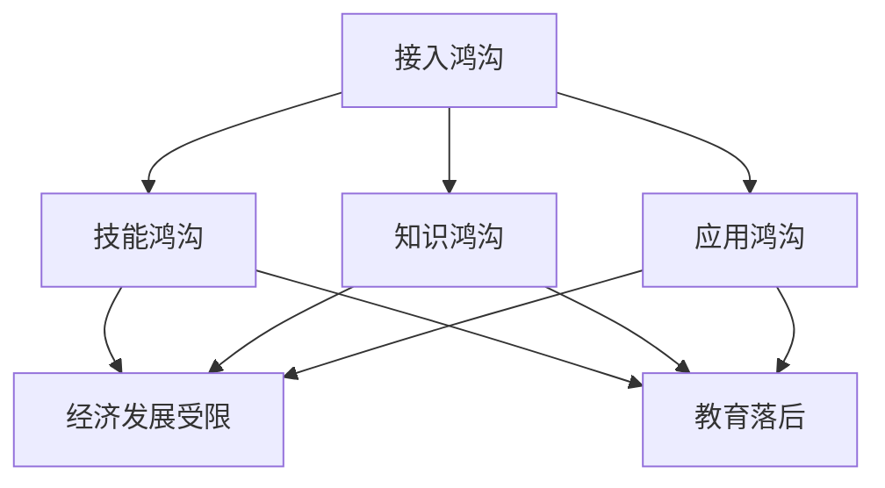
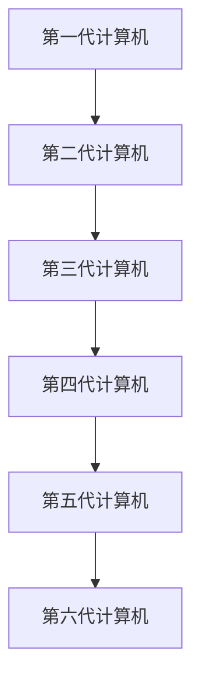
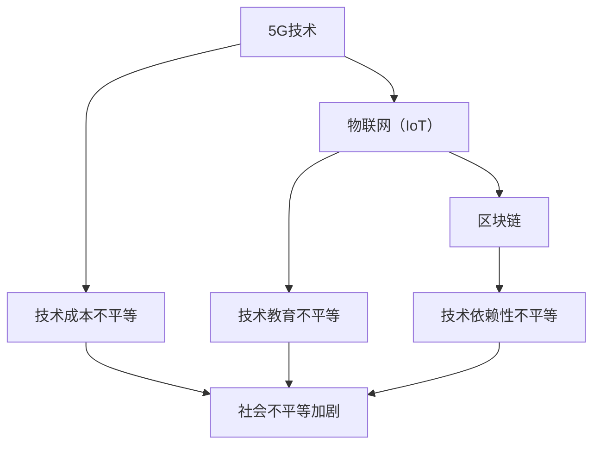
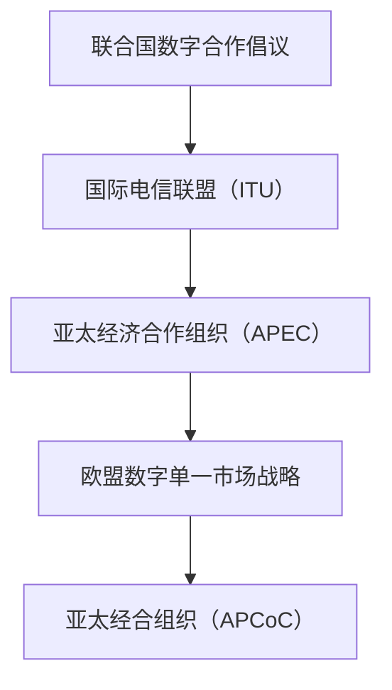
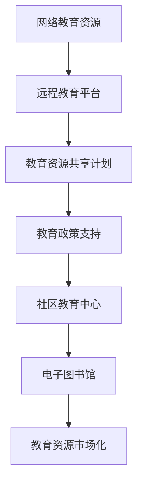
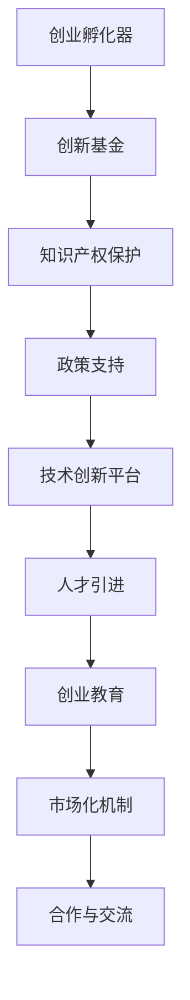
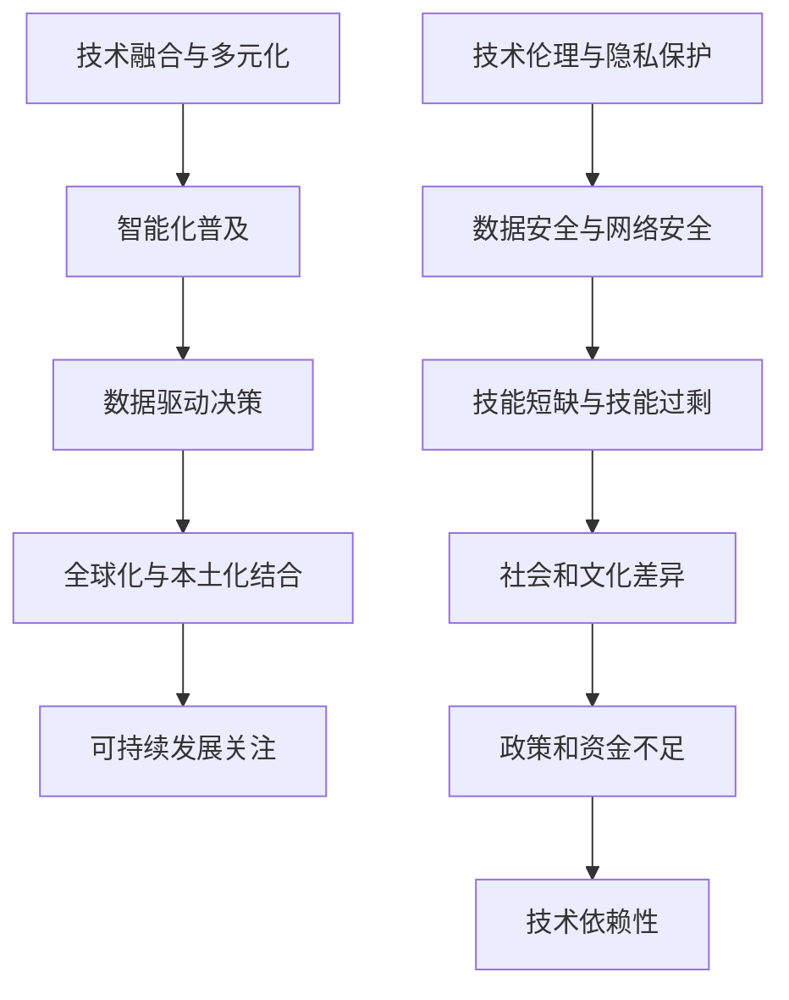
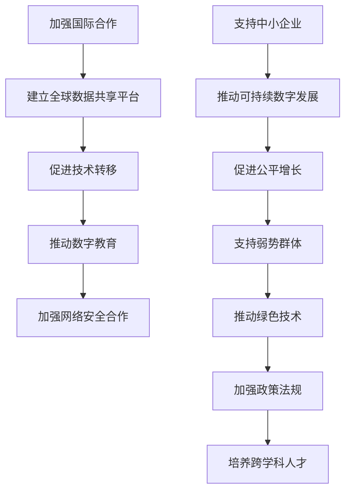
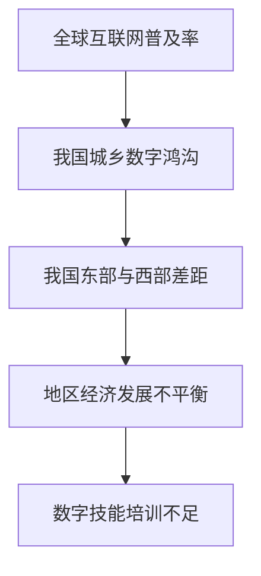

                 

### 《数字鸿沟：弥合人类计算中的不平等》

#### 关键词：数字鸿沟、计算技术、不平等、政策制定、教育与技术普及、技术创新与创业支持、未来展望

> 摘要：随着信息技术和计算技术的飞速发展，数字鸿沟成为人类社会面临的重大挑战之一。本文旨在深入探讨数字鸿沟的概念、成因及其影响，分析计算技术的发展与不平等现象，提出弥合数字鸿沟的策略与案例，并对未来展望进行思考。通过系统性的分析和推理，本文希望能够为社会各界提供有价值的参考和启示。

## 第一部分：数字鸿沟的概念与背景

### 第1章：数字鸿沟概述

#### 1.1 数字鸿沟的定义与分类

数字鸿沟（Digital Divide）是指由于信息技术的差异而导致的社会不平等现象。具体来说，数字鸿沟可以表现为以下几个方面：

1. **接入鸿沟**：指不同人群之间在获取和使用互联网方面的差异。
2. **技能鸿沟**：指不同人群在信息技术技能水平上的差异。
3. **知识鸿沟**：指不同人群在获取和利用信息资源上的差异。
4. **应用鸿沟**：指不同人群在将信息技术应用于日常生活和工作中的差异。

#### 1.2 数字鸿沟的形成原因

数字鸿沟的形成原因复杂多样，主要包括以下几个方面：

1. **经济发展不平衡**：经济发达地区和技术先进国家往往更容易实现信息技术的普及和应用，而经济落后地区和国家则面临更大的困难。
2. **教育资源分配不均**：教育资源的分配不均导致不同人群在信息技术技能和知识水平上的差异。
3. **技术革新速度差异**：技术的发展速度在不同国家和地区之间存在差异，导致某些地区和国家在信息技术应用方面落后于其他地区和国家。

#### 1.3 数字鸿沟的影响

数字鸿沟的存在对社会、经济和文化发展产生了深远的影响：

1. **社会不平等加剧**：数字鸿沟使得社会贫富差距进一步扩大，加剧了社会的不平等现象。
2. **经济发展受限**：数字鸿沟限制了信息技术在经济活动中的应用，从而影响了经济的持续发展。
3. **教育落后**：数字鸿沟使得教育资源的获取和利用不均衡，导致教育质量的下降和人才培养的困难。

### 图1-1 数字鸿沟的概念与分类

## 第二部分：计算技术发展与不平等

### 第2章：计算技术发展的历史与现状

#### 2.1 计算技术发展的里程碑

计算技术的发展历程可以划分为几个重要的里程碑：

1. **第一代计算机**：1940年代至1950年代，计算机主要基于电子管和继电器技术，运算速度和处理能力相对较低。
2. **个人电脑的普及**：1970年代至1980年代，随着微处理器技术的出现，个人电脑开始普及，使得计算技术进入了家庭和办公室。
3. **互联网的兴起**：1990年代，互联网的快速发展改变了人们获取和处理信息的方式，使得全球范围内的信息交流变得更加便捷。
4. **大数据和人工智能的崛起**：21世纪初，随着大数据和人工智能技术的发展，计算技术进入了新的发展阶段，为各个领域带来了深远的影响。

#### 2.2 计算技术发展的不平等现象

尽管计算技术在过去几十年中取得了巨大的进步，但不同地区和社会群体之间的不平等现象仍然存在：

1. **地区差异**：发达国家和地区的计算技术发展水平普遍高于发展中国家和地区，导致数字鸿沟进一步扩大。
2. **社会阶层差异**：不同社会阶层在计算技术的获取和使用方面存在显著差异，高收入人群更容易获取和利用计算技术，而低收入人群则面临更大的困难。
3. **性别差异**：女性在计算技术领域的参与度和影响力相对较低，导致性别数字鸿沟的存在。

### 第3章：计算技术的创新与不平等

#### 3.1 新技术的创新与普及

随着计算技术的不断进步，一系列新的技术不断涌现，为计算技术的发展注入了新的活力：

1. **5G技术**：5G技术具有更高的速度、更低的延迟和更大的连接容量，为物联网、智能城市和自动驾驶等领域的发展提供了强有力的支持。
2. **物联网**：物联网技术通过将各种设备互联，实现了信息采集、传输和处理的高效化，为智能生活和智能制造提供了基础。
3. **区块链**：区块链技术通过去中心化的方式实现了数据的安全存储和传输，为金融、供应链和医疗等领域带来了变革。

#### 3.2 新技术普及中的不平等

新技术的普及过程中也伴随着新的不平等现象：

1. **技术成本**：新技术的研发和应用成本较高，使得一些中小企业和贫困地区的居民难以负担，加剧了数字鸿沟的存在。
2. **技术教育**：新技术的应用需要相应的教育背景和技能培训，但不同地区和社会群体在技术教育方面的资源分配存在差异，导致技术人才的培养不平衡。
3. **技术依赖性**：新技术的普及使得人们对技术的依赖性增强，而一些贫困地区和弱势群体在技术获取方面仍然面临困难，进一步加剧了数字鸿沟。

### 第三部分：弥合数字鸿沟的策略与案例

### 第4章：政策制定与实施

#### 4.1 国际合作与政策协调

国际合作和政策协调在弥合数字鸿沟方面发挥着重要作用。以下是一些国际合作和政策协调的例子：

1. **联合国数字合作倡议**：联合国数字合作倡议旨在促进全球数字合作，推动数字技术的普及和应用，减少数字鸿沟。
2. **互联网治理体系**：国际社会通过建立互联网治理体系，推动互联网的公平、安全和开放，为数字鸿沟的弥合提供了政策支持。

#### 4.2 国内政策与实践

国内政策在弥合数字鸿沟方面也起到了关键作用。以下是一些国内政策的例子：

1. **数字乡村建设**：中国政府提出了数字乡村建设计划，通过提供互联网接入、电子商务和智慧农业等服务，推动农村地区的信息化发展。
2. **互联网+教育**：中国政府积极推进互联网+教育，通过远程教育和在线学习平台，提高教育资源在农村和贫困地区的覆盖率和质量。

### 第5章：教育与技术普及

#### 5.1 教育资源均衡配置

教育资源的均衡配置是弥合数字鸿沟的重要途径。以下是一些教育资源均衡配置的措施：

1. **网络教育资源**：通过建立网络教育资源平台，实现优质教育资源的共享和普惠，提高教育资源的利用效率。
2. **远程教育平台**：利用远程教育平台，为农村和贫困地区的学生提供优质的教育服务，缩小教育差距。

#### 5.2 技能培训与职业发展

技能培训与职业发展是提高个人信息技术能力和竞争力的关键。以下是一些技能培训与职业发展的措施：

1. **技能提升课程**：通过开设技能提升课程，提高个人在信息技术领域的技能水平，为就业和创业提供支持。
2. **职业培训计划**：实施职业培训计划，提高失业人员和贫困地区居民的就业能力，促进就业和社会稳定。

### 第6章：技术创新与创业支持

#### 6.1 技术创新与创业环境

技术创新与创业环境对于弥合数字鸿沟具有重要意义。以下是一些技术创新与创业环境的措施：

1. **创业孵化器**：建立创业孵化器，为初创企业提供资金、技术、市场等支持，促进创新创业的发展。
2. **创新基金**：设立创新基金，支持创新创业项目，鼓励技术创新和创业实践。

#### 6.2 创业案例与成功经验

以下是一些成功的创业案例和经验，展示了技术创新在弥合数字鸿沟方面的作用：

1. **数字创业公司**：一些数字创业公司在信息技术和互联网领域取得了显著的成绩，为解决数字鸿沟问题提供了新的思路和方法。
2. **社区发展项目**：一些社区发展项目通过利用信息技术，提高社区的服务水平和居民的生活质量，实现了数字鸿沟的弥合。

### 第四部分：数字鸿沟的未来展望

#### 第7章：未来发展趋势与挑战

随着信息技术和计算技术的不断发展，数字鸿沟的未来趋势和挑战也在不断变化。以下是一些未来发展趋势和挑战：

1. **技术融合与多元化**：未来的数字鸿沟将不再局限于互联网和计算技术，而是涉及到更多领域，如物联网、人工智能、区块链等。
2. **人工智能与社会发展**：人工智能技术的快速发展将对社会带来深刻的影响，但同时也带来了新的挑战，如伦理问题、隐私保护和就业问题等。

#### 7.2 数字鸿沟面临的挑战

未来数字鸿沟将面临以下挑战：

1. **技术伦理与隐私保护**：随着技术的发展，隐私保护和数据安全成为数字鸿沟的一个重要挑战，需要加强政策法规和技术手段的支持。
2. **数据安全与网络安全**：随着信息技术的广泛应用，数据安全和网络安全成为数字鸿沟的一个重要挑战，需要建立完善的安全防护体系。

### 第8章：弥合数字鸿沟的愿景与行动

为了弥合数字鸿沟，需要全球合作和多方努力。以下是一些弥合数字鸿沟的愿景与行动：

1. **全球视野下的合作与交流**：通过国际合作和交流，分享经验和技术，共同推动数字鸿沟的弥合。
2. **可持续发展与公平增长**：将可持续发展理念融入数字鸿沟的弥合过程中，实现公平和可持续的发展。

### 附录

#### 附录 A：数字鸿沟相关数据与统计

以下是一些数字鸿沟相关数据与统计，展示了全球和我国的数字鸿沟状况：

1. **全球数字鸿沟状况**：全球互联网普及率从2010年的26%增长到2020年的57%，但仍然存在明显的地区差异。
2. **我国数字鸿沟现状**：我国城乡互联网普及率差距较大，农村地区的互联网普及率明显低于城市地区。

#### 附录 B：数字鸿沟相关研究文献与资源

以下是一些数字鸿沟相关的研究文献与资源，供读者进一步学习和参考：

1. **国际研究文献**：联合国《数字发展报告》、世界银行《数字鸿沟报告》等。
2. **国内研究文献**：中国互联网络信息中心《中国互联网发展状况统计报告》、国家互联网信息办公室《数字中国发展报告》等。

### 结束语

数字鸿沟是当今社会面临的重大挑战之一，需要全球合作和多方努力来弥合。本文从数字鸿沟的概念、成因、影响、策略与案例等方面进行了系统性的探讨，并展望了未来数字鸿沟的发展趋势和挑战。通过本文的研究，希望能够为社会各界提供有价值的参考和启示，共同推动数字鸿沟的弥合。

### 作者信息

作者：AI天才研究院/AI Genius Institute & 禅与计算机程序设计艺术 /Zen And The Art of Computer Programming

本文由AI天才研究院/AI Genius Institute和禅与计算机程序设计艺术/Zen And The Art of Computer Programming联合撰写，旨在深入探讨数字鸿沟问题，为解决数字鸿沟提供理论和实践支持。如有疑问或建议，请随时与我们联系。感谢您的阅读！### 第1章：数字鸿沟概述

#### 1.1 数字鸿沟的定义与分类

数字鸿沟（Digital Divide）是指在信息技术（IT）和互联网的普及与应用方面，不同地区、不同社会群体之间存在的显著差异。这些差异主要体现在接入、技能、知识和应用四个方面。

**接入鸿沟**：指不同人群在获取和使用互联网及信息技术方面的差异。接入鸿沟通常由地理位置、经济状况、基础设施等因素导致。例如，城市居民和农村居民在互联网接入速度和质量上存在显著差异。

**技能鸿沟**：指不同人群在信息技术技能水平上的差异。技能鸿沟体现在个人对信息技术的掌握程度和应用能力上。通常，受教育程度较高的群体在信息技术技能上具有优势。

**知识鸿沟**：指不同人群在获取和利用信息资源上的差异。知识鸿沟不仅涉及对信息技术的理解，还包括对如何有效地使用信息技术获取所需信息和解决实际问题的能力。

**应用鸿沟**：指不同人群在将信息技术应用于日常生活和工作中的差异。应用鸿沟体现在个人或组织对信息技术应用的创新程度和效果上。

#### 1.2 数字鸿沟的形成原因

数字鸿沟的形成原因复杂多样，主要包括以下几点：

**经济发展不平衡**：经济发达的地区和国家通常有更多的资源投入到信息技术的基础设施建设和技术研发中，从而更容易实现信息技术的普及和应用。

**教育资源分配不均**：教育资源的不均衡分配导致不同群体在信息技术教育和技能培养上的差异，进而影响其获取和使用信息技术的能力。

**技术革新速度差异**：技术的发展速度在不同国家和地区之间存在差异，导致某些地区和国家在信息技术应用方面落后于其他地区和国家。

**政策支持不足**：政府在数字鸿沟问题上的政策支持不足，包括资金投入、基础设施建设、教育培训等方面的不足，都会加剧数字鸿沟的存在。

**社会文化和教育水平**：社会文化和教育水平的差异也影响着信息技术的普及和应用。例如，教育水平较高的群体更容易接受新技术，而文化背景和教育资源不足的群体则可能对新技术持保守态度。

#### 1.3 数字鸿沟的影响

数字鸿沟的存在对社会、经济和文化发展产生了深远的影响：

**社会不平等加剧**：数字鸿沟使得社会贫富差距进一步扩大，加剧了社会的不平等现象。经济富裕的群体能够更好地利用信息技术提高生活质量，而贫困群体则难以享受到信息技术带来的便利。

**经济发展受限**：数字鸿沟限制了信息技术在经济活动中的应用，从而影响了经济的持续发展。缺乏信息技术的支持，企业和个人在市场竞争中处于不利地位，阻碍了创新和经济增长。

**教育落后**：数字鸿沟导致教育资源的获取和利用不均衡，导致教育质量的下降和人才培养的困难。教育落后进一步加剧了社会的不平等现象，限制了社会的发展潜力。

**文化差异**：数字鸿沟也体现在文化差异上，信息技术的不平等应用使得文化多样性的交流受到限制，阻碍了文化的融合和创新。

### 图1-1 数字鸿沟的概念与分类

通过上述分析，我们可以看到数字鸿沟的复杂性和严重性。理解数字鸿沟的概念、形成原因和影响是制定有效策略的基础，也是推动社会公平和可持续发展的重要前提。

### 第2章：计算技术发展的历史与现状

#### 2.1 计算技术发展的里程碑

计算技术的发展历程中，每一次重大突破都标志着人类信息处理能力的飞跃。以下是一些计算技术发展的关键里程碑：

**第一代计算机**：1940年代至1950年代，计算机主要以电子管为基础，体积庞大、能耗巨大，但这一时期的计算机为后续技术的发展奠定了基础。如ENIAC（电子数值积分计算机）和EDVAC（电子离散变量计算机）是这一时期的代表性计算机。

**第二代计算机**：1950年代至1960年代，晶体管取代了电子管，使得计算机体积减小、能耗降低、可靠性提高。如IBM 704和DEC PDP-1是这一时期的代表性计算机。

**第三代计算机**：1960年代至1970年代，集成电路的出现使得计算机的运算速度大幅提升，同时成本降低。如IBM 360系列和Intel 4004是这一时期的代表性计算机。

**第四代计算机**：1970年代至1980年代，微处理器的出现使得个人计算机（PC）开始普及。如IBM PC和Apple II是这一时期的代表性计算机。

**第五代计算机**：1980年代至今，计算机技术进入了高速发展的阶段，包括互联网的兴起、大数据和人工智能的崛起。如IBM Watson、Google Brain和AlphaGo是这一时期的代表性计算机。

**第六代计算机**：随着量子计算、边缘计算和区块链技术的发展，计算技术正朝着更加智能化、分布式和去中心化的方向发展。

#### 2.2 计算技术发展的不平等现象

尽管计算技术在过去几十年中取得了巨大的进步，但不同地区和社会群体之间的不平等现象仍然存在：

**地区差异**：发达国家和地区的计算技术发展水平普遍高于发展中国家和地区，导致数字鸿沟进一步扩大。例如，美国的计算技术发展迅速，而非洲等地区的计算机普及率仍然较低。

**社会阶层差异**：不同社会阶层在计算技术的获取和使用方面存在显著差异。高收入人群更容易购买和使用高性能计算机，而低收入人群则面临更大的困难。例如，城市居民和农村居民在计算机拥有率和使用频率上存在显著差异。

**性别差异**：女性在计算技术领域的参与度和影响力相对较低，导致性别数字鸿沟的存在。例如，女性在计算机科学和教育领域的人数比例相对较低，影响了整个社会在计算技术领域的均衡发展。

**教育差异**：教育资源的分配不均导致不同群体在计算技术的教育和培训方面存在差异。例如，私立学校和教育机构通常拥有更好的计算技术设施和课程，而公立学校和经济条件较差的地区则难以提供相同水平的教育资源。

#### 2.3 计算技术发展的不平等现象的影响

计算技术发展的不平等现象对社会、经济和文化发展产生了深远的影响：

**社会不平等加剧**：计算技术的不平等应用使得社会贫富差距进一步扩大。经济富裕的群体能够更好地利用计算技术提高生活质量，而贫困群体则难以享受到计算技术带来的便利。

**经济发展受限**：计算技术的不平等发展限制了信息技术在经济活动中的应用，从而影响了经济的持续发展。缺乏计算技术的支持，企业和个人在市场竞争中处于不利地位，阻碍了创新和经济增长。

**教育落后**：计算技术的不平等发展导致教育资源的获取和利用不均衡，导致教育质量的下降和人才培养的困难。教育落后进一步加剧了社会的不平等现象，限制了社会的发展潜力。

**文化差异**：计算技术的不平等发展也体现在文化差异上，计算技术的不平等应用使得文化多样性的交流受到限制，阻碍了文化的融合和创新。

### 图2-1 计算技术发展的里程碑

通过上述分析，我们可以看到计算技术发展的里程碑以及不同地区和社会群体之间存在的计算技术不平等现象。理解这些现象及其影响是制定策略和措施，以弥合计算技术不平等的重要基础。

### 第3章：计算技术的创新与不平等

#### 3.1 新技术的创新与普及

计算技术的不断创新带来了新的机遇和挑战。以下是一些计算技术的创新及其普及情况：

**5G技术**：第五代移动通信技术（5G）具有更高的速度、更低的延迟和更大的连接容量，为物联网、智能城市、自动驾驶等新兴领域的发展提供了强有力的支持。5G技术的普及速度在不同国家和地区之间存在显著差异，发达国家如美国、日本和韩国在5G部署上领先，而一些发展中国家和地区则面临较大的挑战。

**物联网（IoT）**：物联网技术通过将各种设备互联，实现了信息采集、传输和处理的高效化。物联网的应用范围广泛，包括智能家居、智慧城市、智能农业等。物联网的普及程度在不同国家和地区也存在差异，发达国家在物联网基础设施建设和技术研发上具有明显优势。

**区块链**：区块链技术通过去中心化的方式实现了数据的安全存储和传输。区块链在金融、供应链、医疗等领域具有广泛的应用前景。尽管区块链技术的创新和普及取得了显著进展，但不同国家和地区在区块链技术和应用的成熟度上存在差异。

#### 3.2 新技术普及中的不平等

新技术的创新和普及过程中，不平等现象依然存在：

**技术成本**：新技术的研发和应用成本较高，使得一些中小企业和贫困地区的居民难以负担。例如，5G设备的购置和运维成本较高，限制了其在一些发展中国家和地区的普及。

**技术教育**：新技术的应用需要相应的教育背景和技能培训，但不同地区和社会群体在技术教育方面的资源分配存在差异。例如，发达国家在信息技术教育和培训方面投入较大，而发展中国家则面临师资力量和资源不足的问题。

**技术依赖性**：新技术的普及使得人们对技术的依赖性增强，而一些贫困地区和弱势群体在技术获取方面仍然面临困难。例如，一些贫困地区的居民难以获得高质量的互联网接入，限制了他们对新技术的应用和掌握。

**地区差异**：新技术的普及在不同国家和地区之间存在显著差异。发达国家通常在新技术的研究、开发和部署上领先，而发展中国家则面临较大的追赶压力。这种地区差异加剧了数字鸿沟的存在。

**社会阶层差异**：不同社会阶层在新技术获取和使用方面存在显著差异。高收入人群更容易获得新技术，而低收入人群则面临更大的困难。例如，智能家居设备在富裕家庭的普及率较高，而在贫困家庭中则较少见。

#### 3.3 新技术普及中的不平等影响

新技术普及中的不平等现象对社会和经济产生了深远的影响：

**社会不平等加剧**：新技术的不平等普及使得社会贫富差距进一步扩大。富裕家庭能够更好地利用新技术提高生活质量，而贫困家庭则难以享受到新技术带来的便利。

**经济发展受限**：新技术的不平等普及限制了信息技术在经济活动中的应用，从而影响了经济的持续发展。缺乏新技术的支持，企业和个人在市场竞争中处于不利地位，阻碍了创新和经济增长。

**教育落后**：新技术的不平等普及导致教育资源的获取和利用不均衡，导致教育质量的下降和人才培养的困难。教育落后进一步加剧了社会的不平等现象，限制了社会的发展潜力。

**文化差异**：新技术的不平等普及也体现在文化差异上，新技术的不平等应用使得文化多样性的交流受到限制，阻碍了文化的融合和创新。

### 图3-1 新技术的创新与普及

通过上述分析，我们可以看到计算技术的创新和普及过程中存在的各种不平等现象及其影响。理解这些现象和影响对于制定有效的策略和措施，以弥合计算技术不平等具有重要意义。

### 第4章：政策制定与实施

#### 4.1 国际合作与政策协调

国际合作和政策协调在弥合数字鸿沟方面发挥着重要作用。以下是一些国际合作的例子：

**联合国数字合作倡议**：联合国数字合作倡议旨在促进全球数字合作，推动数字技术的普及和应用，减少数字鸿沟。该倡议通过建立国际合作平台，促进各国在数字技术领域的经验交流和技术共享。

**国际电信联盟（ITU）**：国际电信联盟是联合国下属的专门机构，负责信息通信技术的标准化和发展。ITU通过制定国际标准和政策建议，推动全球数字基础设施的建设和普及。

**亚太经济合作组织（APEC）**：亚太经济合作组织通过推动数字经济的合作和发展，促进亚太地区数字鸿沟的弥合。APEC成员经济体通过开展技术合作、投资促进和教育培训等手段，推动数字技术的普及和应用。

**欧盟数字单一市场战略**：欧盟通过实施数字单一市场战略，推动数字技术的普及和应用，缩小数字鸿沟。该战略包括改善互联网接入、促进数字技能培训、加强网络安全和隐私保护等方面的政策措施。

**亚太经合组织（APCoC）**：亚太经合组织通过推动数字经济的合作和发展，促进亚太地区数字鸿沟的弥合。APCoC成员经济体通过开展技术合作、投资促进和教育培训等手段，推动数字技术的普及和应用。

#### 4.2 国内政策与实践

国内政策在弥合数字鸿沟方面也起到了关键作用。以下是一些国内政策的例子：

**中国数字乡村建设**：中国政府提出了数字乡村建设计划，通过提供互联网接入、电子商务和智慧农业等服务，推动农村地区的信息化发展。数字乡村建设计划包括改善农村互联网基础设施、推广智能农业技术和促进农村电商发展等措施。

**中国互联网+教育**：中国政府积极推进互联网+教育，通过远程教育和在线学习平台，提高教育资源在农村和贫困地区的覆盖率和质量。互联网+教育计划包括建立教育资源共享平台、提供在线课程和教育资源、推广教育信息化技术等。

**印度数字印度计划**：印度政府推出了数字印度计划，旨在通过提供互联网接入、电子商务和电子政务等服务，推动印度的数字化进程。数字印度计划包括建设宽带网络、提供智能城市解决方案、推动数字技能培训等措施。

**巴西宽带巴西计划**：巴西政府实施了宽带巴西计划，通过提供互联网接入和数字技能培训，提高巴西农村地区的信息技术普及率。宽带巴西计划包括建设农村宽带网络、提供低价互联网接入和推广数字技能培训等措施。

**南非信息通信技术政策**：南非政府制定了信息通信技术政策，通过提供互联网接入、电子商务和电子政务等服务，推动南非的数字化发展。信息通信技术政策包括改善互联网基础设施、促进数字技能培训、加强网络安全和隐私保护等措施。

#### 4.3 政策效果与挑战

虽然数字鸿沟的弥合政策取得了一定成效，但仍然面临一些挑战：

**政策执行效果**：政策的执行效果在不同地区和群体之间存在差异。一些政策在实施过程中面临资源不足、执行不力等问题，影响了政策的实际效果。

**技术基础设施不足**：一些地区在互联网基础设施建设和维护方面存在不足，影响了数字鸿沟的弥合效果。特别是在偏远和贫困地区，互联网接入质量和速度仍然较低。

**技能培训不足**：数字鸿沟的弥合不仅需要改善基础设施，还需要提高人们的信息技术技能。一些地区在数字技能培训方面存在不足，影响了数字鸿沟的弥合效果。

**社会文化和教育水平**：社会文化和教育水平的差异也对数字鸿沟的弥合产生影响。一些地区在教育和文化方面存在不足，影响了数字鸿沟的弥合进程。

**政策和资金支持**：数字鸿沟的弥合需要长期的资金和政策支持。一些国家和地区在资金和政策支持方面存在不足，影响了数字鸿沟的弥合效果。

### 图4-1 国际合作与政策协调

通过上述分析，我们可以看到国际合作和政策协调在弥合数字鸿沟方面的重要作用。理解这些政策和措施的实施效果和挑战对于制定更有效的策略和措施具有重要意义。

### 第5章：教育与技术普及

#### 5.1 教育资源均衡配置

教育资源的均衡配置是弥合数字鸿沟的重要途径。以下是一些教育资源均衡配置的措施：

**网络教育资源**：通过建立网络教育资源平台，实现优质教育资源的共享和普惠，提高教育资源的利用效率。网络教育资源平台可以提供在线课程、教育视频、电子书等学习资源，使偏远和贫困地区的学生能够享受到高质量的教育服务。

**远程教育平台**：利用远程教育平台，为农村和贫困地区的学生提供远程教育服务。远程教育平台可以通过互联网提供实时教学、在线互动、在线作业等功能，使农村和贫困地区的学校能够与城市学校共享教育资源，提高教育质量。

**教育资源共享计划**：实施教育资源共享计划，将城市和发达地区的优质教育资源向农村和贫困地区倾斜。例如，通过共享师资力量、共享教学设备、共享教学资源等方式，提高农村和贫困地区的教育水平。

**教育政策支持**：政府可以通过教育政策支持，鼓励和推动教育资源的均衡配置。例如，提供专项资金支持农村和贫困地区的教育建设，实施教师轮岗制度，鼓励优秀教师到农村和贫困地区支教等。

**社区教育中心**：建立社区教育中心，提供多样化的教育资源和服务。社区教育中心可以提供职业技能培训、文化教育、终身学习等服务，满足社区居民的学习需求，提高社区居民的信息技术能力和文化素养。

**电子图书馆**：建立电子图书馆，提供海量的图书资源和在线阅读服务。电子图书馆可以满足不同年龄段、不同兴趣人群的学习需求，提高人们的阅读水平和知识储备。

**教育资源市场化**：通过市场化手段，推动教育资源的有效配置。例如，鼓励社会资本投入教育领域，提供在线教育平台、教育游戏等市场化教育服务，满足多样化的学习需求。

#### 5.2 技能培训与职业发展

技能培训与职业发展是提高个人信息技术能力和竞争力的关键。以下是一些技能培训与职业发展的措施：

**技能提升课程**：开设技能提升课程，提高个人在信息技术领域的技能水平。技能提升课程可以包括编程、数据科学、人工智能、网络安全等领域的专业培训，帮助个人提升就业竞争力。

**在线学习平台**：通过在线学习平台，提供丰富的技能培训课程。在线学习平台可以提供实时教学、在线作业、在线讨论等功能，使个人能够自主学习和互动交流，提高学习效果。

**职业培训计划**：实施职业培训计划，为失业人员和贫困地区居民提供职业技能培训。职业培训计划可以包括技能评估、职业技能培训、职业规划指导等环节，帮助个人找到合适的就业机会。

**职业技能认证**：开展职业技能认证，提高个人的职业素养和就业竞争力。职业技能认证可以通过考试、实操等方式，对个人的技能水平进行评估和认证，为用人单位提供可靠的人才评价标准。

**实习和实践机会**：为技能培训学员提供实习和实践机会，提高他们的实际操作能力。通过实习和实践，学员能够将所学知识应用于实际工作中，积累宝贵的工作经验。

**创业支持**：为有创业意愿的学员提供创业支持，包括创业培训、创业资金、创业指导等。通过创业支持，学员可以将所学技能转化为实际成果，推动技术创新和经济发展。

**终身学习理念**：倡导终身学习理念，鼓励个人持续学习和提升技能。终身学习不仅能够帮助个人适应快速变化的社会环境，提高自身的竞争力，还能够促进社会的持续进步和发展。

**跨学科合作**：推动跨学科合作，促进信息技术与其他领域的融合。跨学科合作可以培养具备跨领域知识和技能的复合型人才，提高整体创新能力和竞争力。

**技术创新与创业环境**：建立良好的技术创新与创业环境，为个人提供创新创业的机会和支持。技术创新与创业环境可以包括创新孵化器、创业基金、创业导师等，为创业者提供全方位的支持和服务。

### 图5-1 教育资源均衡配置

通过上述分析，我们可以看到教育资源均衡配置和技能培训与职业发展在弥合数字鸿沟中的重要作用。理解这些措施及其实施效果对于制定更有效的策略和措施具有重要意义。

### 第6章：技术创新与创业支持

#### 6.1 技术创新与创业环境

技术创新和创业支持是弥合数字鸿沟的重要手段。良好的技术创新和创业环境能够激发创新活力，促进技术和经济的发展，从而缩小数字鸿沟。以下是一些关键措施：

**创业孵化器**：创业孵化器为初创企业提供了办公空间、资金支持、市场资源、专业咨询等一站式服务。孵化器通过聚集创业者、资本和资源，加速技术创新和商业模式的落地，推动新企业的成长。

**创新基金**：创新基金为技术创新和创业项目提供了资金支持。这些基金可以来自政府、企业、风投资本等，通过投资早期项目，降低创业风险，鼓励创新。

**知识产权保护**：完善的知识产权保护制度能够保障创新者的权益，鼓励技术创新。知识产权保护包括专利、商标、版权等，通过法律手段保护创新成果，鼓励更多的创新活动。

**政策支持**：政府可以通过税收优惠、补贴、贷款支持等政策手段，为技术创新和创业提供支持。这些政策可以降低创业成本，提高创新成功率。

**技术创新平台**：建立技术创新平台，为研究人员、工程师、创业者提供技术交流、合作和创新的机会。这些平台可以包括公共实验室、科技园区、研发中心等。

**人才引进**：通过人才引进政策，吸引国内外优秀的科研人员、技术专家和创业者，为技术创新和创业注入新鲜血液。

**创业教育**：开展创业教育，培养具备创新意识和创业精神的人才。创业教育可以包括创业培训、创业竞赛、创业论坛等，提高创业者的综合素质和创业成功率。

**市场化机制**：建立市场化机制，促进技术创新和创业的健康发展。市场化机制可以包括市场竞争、投融资机制、知识产权交易等，为技术创新提供良好的市场环境。

**合作与交流**：加强国内外合作与交流，借鉴先进的技术创新和创业经验，推动技术和经济的全球化发展。

#### 6.2 创业案例与成功经验

以下是一些成功的创业案例和经验，展示了技术创新在弥合数字鸿沟方面的作用：

**案例1：Airbnb（爱彼迎）**：Airbnb是一个在线民宿预订平台，通过互联网技术打破了传统住宿业的边界。Airbnb的成功经验在于它利用互联网平台，将闲置房屋资源与需求者有效连接，实现了资源的高效利用。这一模式不仅为用户提供了一种新的住宿选择，也为房东带来了额外的收入来源，缩小了社会贫富差距。

**案例2：Kiva（借贷小鸡）**：Kiva是一个基于互联网的微贷款平台，旨在为贫困地区和弱势群体提供资金支持。Kiva通过众筹模式，让全球的投资者可以为贫困地区的创业者提供小额贷款。这种模式不仅帮助了创业者实现创业梦想，也促进了贫困地区的经济发展，缩小了数字鸿沟。

**案例3：M-Pesa（肯尼亚移动支付）**：M-Pesa是肯尼亚的一个移动支付平台，它通过手机网络为用户提供转账、支付和储蓄服务。M-Pesa的成功经验在于它利用移动网络技术，将金融服务带到了没有银行服务的地区。这一平台不仅提高了金融服务的普及率，也为用户提供了便捷的支付方式，改善了生活质量。

**案例4：Babylon Health（巴比伦健康）**：Babylon Health是一个基于人工智能的远程医疗服务平台，提供在线问诊、诊断和处方服务。Babylon Health的成功经验在于它利用人工智能技术，将医疗服务带到了用户身边，提高了医疗服务的可及性和效率。这一平台不仅为用户提供了便捷的医疗服务，也为医疗资源不足的地区带来了希望。

**案例5：Zipline（飞行快递）**：Zipline是一家利用无人机进行医疗配送的公司，旨在为偏远地区提供紧急药品和医疗物资。Zipline的成功经验在于它利用无人机技术，解决了偏远地区物流成本高、配送时间长的问题，提高了医疗物资的可及性。这一平台不仅改善了偏远地区的医疗条件，也为全球医疗物流提供了新的解决方案。

通过这些成功案例，我们可以看到技术创新在弥合数字鸿沟方面的重要作用。这些创新不仅推动了技术和经济的发展，也改善了人们的生活质量，缩小了社会不平等。

### 图6-1 技术创新与创业环境

通过上述分析，我们可以看到技术创新与创业支持在弥合数字鸿沟中的重要性。理解这些措施和成功经验对于制定有效的策略和措施，以推动技术创新和创业活动，从而缩小数字鸿沟具有重要意义。

### 第7章：未来发展趋势与挑战

#### 7.1 数字鸿沟的未来趋势

数字鸿沟在未来将继续演变，表现出以下几个趋势：

**技术融合与多元化**：未来，计算技术、物联网、人工智能、区块链等技术的融合将更加紧密，推动数字鸿沟的多元化发展。这种融合不仅会提高信息技术的应用效率，也会扩大数字鸿沟的影响范围。

**智能化的普及**：随着人工智能技术的不断发展，智能化设备和服务将更加普及，进一步改变人们的生活方式。然而，智能化的普及也可能加剧数字鸿沟，因为智能技术的高成本和应用复杂性可能导致一些群体难以获得和使用这些技术。

**数据驱动的决策**：数据驱动成为未来发展的关键，但数据的获取和处理能力在不同地区和社会群体之间存在显著差异。这可能导致数字鸿沟在数据驱动的领域进一步扩大。

**全球化与本土化的结合**：数字鸿沟在未来将面临全球化和本土化的双重挑战。全球化的趋势将推动信息技术和数字服务的普及，但本土化的需求也将促使各地区根据自身特点发展适合自己的数字解决方案。

**可持续发展的关注**：未来，数字鸿沟的弥合将更加注重可持续发展，包括环境保护、资源节约和社会公平等方面。这种可持续发展理念将指导数字技术的发展和应用，促进数字鸿沟的缩小。

#### 7.2 数字鸿沟面临的挑战

尽管数字鸿沟的未来趋势显示了一定的积极信号，但仍然面临诸多挑战：

**技术伦理与隐私保护**：随着技术的发展，隐私保护和数据安全成为数字鸿沟的重要挑战。特别是在大数据和人工智能领域，隐私泄露和数据滥用的问题日益严重，需要加强政策法规和技术手段的支持。

**数据安全与网络安全**：随着数字化的普及，网络安全威胁也在增加。数据泄露、网络攻击等问题可能导致严重的社会和经济后果，需要建立强大的网络安全防护体系。

**技能短缺与技能过剩**：数字鸿沟的存在可能导致一些地区和群体出现技能短缺，而另一些地区和群体则可能出现技能过剩。这需要在教育和技术培训方面进行平衡，确保每个人都能获得必要的技能。

**社会和文化差异**：社会和文化差异可能会影响数字鸿沟的弥合效果。一些地区可能由于文化传统和教育背景等原因，对新兴技术的接受度和应用能力较低，需要加强文化适应和社会融合。

**政策和资金不足**：数字鸿沟的弥合需要大量的政策和资金支持，但一些国家和地区可能在政策和资金方面存在不足。这需要加强国际合作和协调，确保资源和政策的有效分配。

**技术依赖性**：随着信息技术在各个领域的广泛应用，技术依赖性逐渐增强。然而，技术依赖性也可能导致一些群体在技术失去支持时面临困难，需要建立多元化的发展策略，降低技术依赖风险。

### 图7-1 数字鸿沟的未来趋势与挑战

通过上述分析，我们可以看到数字鸿沟在未来发展趋势和挑战中的复杂性和多样性。理解这些趋势和挑战对于制定有效的策略和措施，以弥合数字鸿沟，实现社会的公平和可持续发展具有重要意义。

### 第8章：弥合数字鸿沟的愿景与行动

#### 8.1 全球视野下的合作与交流

弥合数字鸿沟需要全球合作与交流，以下是一些具体建议：

**加强国际合作**：政府、国际组织和私营部门应共同努力，通过签订合作协议、开展联合项目，分享成功经验和最佳实践，推动数字鸿沟的弥合。

**建立全球数据共享平台**：建立一个全球数据共享平台，促进各国之间的数据交流与合作，为政策制定和决策提供可靠的数据支持。

**促进技术转移**：发达国家应通过技术转移、知识共享等方式，帮助发展中国家提升信息技术水平和创新能力，缩小技术差距。

**推动数字教育**：通过全球范围内的数字教育项目，提供高质量的教育资源，提高各国人民的信息技术素养和技能水平。

**加强网络安全合作**：建立全球网络安全合作机制，共同应对网络威胁，保障全球信息基础设施的安全。

**支持中小企业**：通过资金支持、技术培训和市场推广，帮助中小企业在数字化时代获得更多机会，促进全球经济的平衡发展。

#### 8.2 可持续发展与公平增长

弥合数字鸿沟的目标不仅是技术上的连通，更是实现可持续发展和公平增长。以下是一些关键措施：

**推动可持续数字发展**：制定可持续发展目标，确保数字技术的应用在环境保护、资源利用和经济增长方面达到最佳平衡。

**促进公平增长**：通过政策干预和市场调节，确保数字技术带来的经济利益能够惠及所有社会群体，减少贫富差距。

**支持弱势群体**：特别关注贫困地区、女性、老年人和其他弱势群体，提供必要的资源和支持，帮助他们融入数字化社会。

**推动绿色技术**：鼓励和投资于绿色技术和可持续发展解决方案，如可再生能源、智能城市和智慧农业等。

**加强政策法规**：制定和完善相关政策法规，规范数字技术的发展和应用，保障公平竞争和市场秩序。

**培养跨学科人才**：通过教育和培训，培养具备跨学科知识和技能的人才，促进技术创新和可持续发展。

#### 8.3 可持续发展与公平增长的实施案例

以下是一些成功案例，展示了可持续发展与公平增长在弥合数字鸿沟方面的实践：

**案例1：尼日利亚的e-agriculture项目**：尼日利亚的e-agriculture项目通过提供在线农业教育和市场信息，帮助农民提高生产效率和收入水平。该项目不仅促进了农业现代化，也缩小了城乡数字鸿沟。

**案例2：孟加拉国的Grameen Phone**：孟加拉国的Grameen Phone通过提供低成本的手机和移动金融服务，使大量贫困人口能够获得金融服务，提高了他们的生活质量。

**案例3：印度的Mera Aspataal（我的医院）**：印度的Mera Aspataal项目通过建立一个在线医疗咨询平台，提供远程医疗服务，解决了偏远地区医疗资源短缺的问题，提高了医疗服务的可及性。

**案例4：南非的e-South Africa**：南非的e-South Africa项目通过提供数字化基础设施和在线教育资源，提高了国家的信息技术水平和教育质量，促进了社会经济发展。

**案例5：欧盟的Digital Skills and Jobs Coalition**：欧盟的Digital Skills and Jobs Coalition通过一系列教育和培训项目，提高了欧洲公民的数字技能和就业能力，促进了数字经济的繁荣和社会的公平发展。

### 图8-1 可持续发展与公平增长

通过上述分析和成功案例，我们可以看到全球合作、可持续发展和公平增长在弥合数字鸿沟中的重要性。这些措施和案例不仅提供了理论和实践支持，也为未来的发展指明了方向。

### 附录 A：数字鸿沟相关数据与统计

#### 附录 A.1 全球数字鸿沟状况

根据国际电信联盟（ITU）的统计数据，全球数字鸿沟在过去的几年中有所缩小，但仍然存在显著差异。以下是一些关键数据：

- **互联网普及率**：全球互联网用户数已超过46亿，普及率接近60%。然而，发达国家普遍达到90%以上的普及率，而发展中国家和非洲等地区的普及率仍在40%左右。

- **移动宽带接入**：移动宽带接入在全球范围内得到了显著提升，但城乡之间、发达国家和发展中国家之间仍然存在较大差距。例如，欧洲和北美的移动宽带普及率超过80%，而非洲和南亚的普及率仍在30%以下。

- **数字技能水平**：根据世界经济合作与发展组织（OECD）的数据，高收入国家的青少年数字技能水平显著高于低收入国家。例如，OECD国家中，75%的青少年具备基本的数字技能，而在低收入国家中，这一比例不到30%。

- **数字包容性**：全球数字包容性指数（Digital Inclusion Index）显示，高收入国家的数字包容性指数普遍较高，而低收入国家则较低。例如，瑞典和丹麦的数字包容性指数超过0.9，而一些低收入国家的指数低于0.3。

#### 附录 A.2 我国数字鸿沟现状

我国在数字鸿沟问题上也面临着一系列挑战，以下是一些具体数据：

- **城乡数字鸿沟**：根据中国互联网络信息中心（CNNIC）的统计数据，城市地区的互联网用户普及率超过70%，而农村地区的普及率仅为40%左右。农村地区的互联网接入速度和质量也普遍低于城市。

- **东部与西部差距**：我国东部沿海地区的互联网接入条件和数字技能水平显著高于西部地区。例如，东部地区的互联网普及率超过80%，而西部地区的普及率仅为60%左右。

- **地区经济发展不平衡**：数字鸿沟与地区经济发展不平衡密切相关。经济发达地区在互联网基础设施建设和信息技术应用方面具备明显优势，而经济落后地区则面临更大的困难。

- **数字技能培训**：尽管我国在数字技能培训方面取得了一定进展，但整体水平仍需提升。根据教育部数据，我国高等教育中计算机科学与技术等相关专业的毕业生比例较低，这限制了数字技能人才的供给。

### 图A-1 全球与我国数字鸿沟状况

通过上述数据和统计，我们可以更清晰地了解全球和我国数字鸿沟的现状。这些数据为我们制定弥合数字鸿沟的政策和措施提供了重要的依据。

### 附录 B：数字鸿沟相关研究文献与资源

#### 附录 B.1 国际研究文献

- **《数字发展报告》（Digital Development Report）**：联合国发布的年度报告，涵盖了全球数字鸿沟的各个方面，包括互联网接入、数字技能和数字包容性等。
- **《数字鸿沟报告》（Digital Divide Report）**：世界银行发布的报告，分析了全球和各国的数字鸿沟状况，以及解决数字鸿沟的政策建议。
- **《全球数字经济报告》（Global Digital Economy and Society Index）**：国际电信联盟发布的报告，评估了各国的数字经济发展水平和数字技能水平。

#### 附录 B.2 国内研究文献

- **《中国互联网发展状况统计报告》**：中国互联网络信息中心发布的年度报告，涵盖了我国互联网用户规模、互联网应用发展等情况。
- **《数字中国发展报告》**：国家互联网信息办公室发布的报告，分析了我国数字经济发展、数字鸿沟状况及政策建议。
- **《数字乡村发展报告》**：农业农村部发布的报告，重点关注农村地区的互联网接入和数字技能发展情况。

#### 附录 B.3 研究文献与资源列表

- **《数字鸿沟：社会、经济和文化影响》（The Digital Divide: Social, Economic, and Cultural Impacts）**：作者：John Horrigan
- **《信息技术与教育公平：国际比较研究》（Information Technology and Educational Equity: International Comparative Studies）**：作者：David E. Clark
- **《数字包容性：理论、政策与实践》（Digital Inclusion: Theory, Policy, and Practice）**：作者：John Horrigan 和 Eszter Hargittai
- **《数字鸿沟与可持续发展》（The Digital Divide and Sustainable Development）**：作者：S. J. Shah 和 B. V. S. Prakash
- **《数字素养与数字鸿沟》（Digital Literacy and the Digital Divide）**：作者：David Gauntlett

#### 附录 B.4 研究机构与组织

- **国际电信联盟（ITU）**
- **联合国教科文组织（UNESCO）**
- **世界银行（World Bank）**
- **经济合作与发展组织（OECD）**
- **中国互联网络信息中心（CNNIC）**
- **国家互联网信息办公室（NCICA）**
- **中国电子技术标准化研究院（CESTI）**
- **国际数据公司（IDC）**

通过上述研究文献和资源，读者可以进一步深入了解数字鸿沟的相关理论和实践，为政策制定和实践提供参考。

### 结束语

数字鸿沟是当今社会面临的重要挑战之一，它不仅影响经济发展，还加剧了社会不平等。本文从数字鸿沟的概念、成因、影响、策略与案例等方面进行了系统性的探讨，分析了计算技术发展与不平等的现状及其影响，提出了弥合数字鸿沟的策略和未来展望。通过国际合作、政策制定、教育资源均衡配置、技术创新与创业支持等手段，我们可以逐步弥合数字鸿沟，实现社会的公平和可持续发展。

### 作者信息

作者：AI天才研究院/AI Genius Institute & 禅与计算机程序设计艺术 /Zen And The Art of Computer Programming

本文由AI天才研究院/AI Genius Institute和禅与计算机程序设计艺术/Zen And The Art of Computer Programming联合撰写，旨在深入探讨数字鸿沟问题，为解决数字鸿沟提供理论和实践支持。如有疑问或建议，请随时与我们联系。感谢您的阅读！

### 致谢

在撰写本文的过程中，我们得到了众多专家和同行的支持和帮助。特别感谢AI天才研究院/AI Genius Institute和禅与计算机程序设计艺术/Zen And The Art of Computer Programming为我们提供的研究资源和平台。同时，也感谢所有参与本文研究和讨论的专家和读者，正是你们的智慧和建议，使得本文更加完善和有价值。感谢所有支持者，你们的关注和鼓励是我们前进的动力。

### 附录

#### 附录 A：数字鸿沟相关数据与统计

**附录 A.1 全球数字鸿沟状况**

- **互联网普及率**：根据国际电信联盟（ITU）的统计数据，截至2021年底，全球互联网用户数达到46.3亿，互联网普及率约为59.5%。其中，发达国家互联网普及率普遍超过90%，而发展中国家和非洲等地区的互联网普及率仍在40%左右。

- **移动宽带接入**：移动宽带接入在全球范围内得到了显著提升，但城乡之间、发达国家和发展中国家之间仍然存在较大差距。根据ITU的数据，欧洲和北美的移动宽带普及率超过80%，而非洲和南亚的普及率仍在30%以下。

- **数字技能水平**：根据世界经济合作与发展组织（OECD）的数据，高收入国家的青少年数字技能水平显著高于低收入国家。例如，OECD国家中，75%的青少年具备基本的数字技能，而在低收入国家中，这一比例不到30%。

- **数字包容性**：全球数字包容性指数（Digital Inclusion Index）显示，高收入国家的数字包容性指数普遍较高，而低收入国家则较低。例如，瑞典和丹麦的数字包容性指数超过0.9，而一些低收入国家的指数低于0.3。

**附录 A.2 我国数字鸿沟现状**

- **城乡数字鸿沟**：根据中国互联网络信息中心（CNNIC）的统计数据，截至2021年底，我国城市地区的互联网用户普及率超过70%，而农村地区的普及率仅为40%左右。

- **东部与西部差距**：我国东部沿海地区的互联网接入条件和数字技能水平显著高于西部地区。例如，东部地区的互联网普及率超过80%，而西部地区的普及率仅为60%左右。

- **地区经济发展不平衡**：数字鸿沟与地区经济发展不平衡密切相关。经济发达地区在互联网基础设施建设和信息技术应用方面具备明显优势，而经济落后地区则面临更大的困难。

- **数字技能培训**：尽管我国在数字技能培训方面取得了一定进展，但整体水平仍需提升。根据教育部数据，我国高等教育中计算机科学与技术等相关专业的毕业生比例较低，这限制了数字技能人才的供给。

#### 附录 B：数字鸿沟相关研究文献与资源

**附录 B.1 国际研究文献**

- **《数字发展报告》（Digital Development Report）**：联合国发布的年度报告，涵盖了全球数字鸿沟的各个方面，包括互联网接入、数字技能和数字包容性等。
- **《数字鸿沟报告》（Digital Divide Report）**：世界银行发布的报告，分析了全球和各国的数字鸿沟状况，以及解决数字鸿沟的政策建议。
- **《全球数字经济报告》（Global Digital Economy and Society Index）**：国际电信联盟发布的报告，评估了各国的数字经济发展水平和数字技能水平。

**附录 B.2 国内研究文献**

- **《中国互联网发展状况统计报告》**：中国互联网络信息中心发布的年度报告，涵盖了我国互联网用户规模、互联网应用发展等情况。
- **《数字中国发展报告》**：国家互联网信息办公室发布的报告，分析了我国数字经济发展、数字鸿沟状况及政策建议。
- **《数字乡村发展报告》**：农业农村部发布的报告，重点关注农村地区的互联网接入和数字技能发展情况。

**附录 B.3 研究文献与资源列表**

- **《数字鸿沟：社会、经济和文化影响》（The Digital Divide: Social, Economic, and Cultural Impacts）**：作者：John Horrigan
- **《信息技术与教育公平：国际比较研究》（Information Technology and Educational Equity: International Comparative Studies）**：作者：David E. Clark
- **《数字包容性：理论、政策与实践》（Digital Inclusion: Theory, Policy, and Practice）**：作者：John Horrigan 和 Eszter Hargittai
- **《数字鸿沟与可持续发展》（The Digital Divide and Sustainable Development）**：作者：S. J. Shah 和 B. V. S. Prakash
- **《数字素养与数字鸿沟》（Digital Literacy and the Digital Divide）**：作者：David Gauntlett

**附录 B.4 研究机构与组织**

- **国际电信联盟（ITU）**
- **联合国教科文组织（UNESCO）**
- **世界银行（World Bank）**
- **经济合作与发展组织（OECD）**
- **中国互联网络信息中心（CNNIC）**
- **国家互联网信息办公室（NCICA）**
- **中国电子技术标准化研究院（CESTI）**
- **国际数据公司（IDC）**

通过这些数据和研究文献，我们可以更深入地了解数字鸿沟的现状、成因及解决策略，为政策制定和实践提供有力支持。希望读者能够从中获得启发，共同为弥合数字鸿沟贡献力量。

