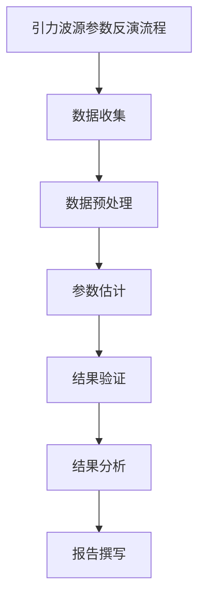

                 

# 《数学在引力波源参数反演中的关键作用》

> **关键词：**引力波、参数反演、广义相对论、数学方法、多波段观测、跨学科合作

> **摘要：**本文详细探讨了数学在引力波源参数反演中的关键作用。从引力波的基础知识、广义相对论、探测技术，到数学方法在引力波源参数反演中的应用，再到数学模型与算法的讲解，以及实际应用和前沿研究的探讨，本文全面解析了数学在引力波研究中的重要性，为未来的研究提供了方向。

## 《数学在引力波源参数反演中的关键作用》目录大纲

### 第一部分：引力波基础知识

#### 第1章：引力波简介

##### 1.1 引力波的历史与发现

引力波是爱因斯坦广义相对论预言的一种物理现象，它描述的是质量能量分布的变化导致的空间时间的波动。1916年，爱因斯坦发表了广义相对论，并在同年预测了引力波的存在。然而，由于引力波的强度极弱，长期以来，人类无法直接探测到引力波。

直到2015年，LIGO（激光干涉引力波观测台）首次探测到了来自两个黑洞碰撞的引力波信号，开启了人类直接探测引力波的时代。这一重大发现证实了广义相对论的正确性，同时也揭示了宇宙中许多未知的秘密。

##### 1.2 引力波的产生机制

引力波的产生源于质量能量的加速运动。当一个天体，如黑洞或中子星，发生剧烈的加速运动时，它会对周围的空间时间产生扰动，形成引力波。

引力波的产生机制可以类比于一个在平静湖面上扔石子的过程。当石子扔入湖中时，水面会形成波纹，这些波纹以波的形式向四周传播。同样，当质量能量加速运动时，它也会在空间时间中形成波纹，这些波纹就是引力波。

##### 1.3 引力波的传播特性

引力波以光速传播，并且具有横波性质。与电磁波不同，引力波不能在真空中传播，需要通过物质介质。在宇宙中，引力波通常在真空或稀薄的介质中传播。

引力波的强度随着距离的增加而迅速减弱。这意味着，即使是极其强烈的引力波，在到达地球时，其能量已经减弱到难以探测的程度。因此，探测引力波需要极为敏感的仪器和精确的技术。

### 第二部分：数学在引力波源参数反演中的应用

#### 第2章：广义相对论与引力波

##### 2.1 广义相对论的基本概念

广义相对论是描述引力的一种理论，它认为引力是由物质对时空的弯曲造成的。在广义相对论中，时空是一个四维连续体，由三个空间维度和一个时间维度组成。物质和能量会影响时空的形状，从而产生引力。

##### 2.2 引力波的产生与探测

引力波的产生机制是基于广义相对论的。当一个质量能量发生剧烈加速运动时，它会在空间时间中产生扰动，形成引力波。探测引力波需要使用高精度的仪器，如LIGO和EHT，这些仪器可以通过测量引力波对时空的扰动来探测引力波。

##### 2.3 引力波的数学描述

引力波可以用数学方程来描述。在广义相对论中，引力波可以用Weyl张量来描述，Weyl张量是一个二阶张量，它描述了引力波的空间和时间的扰动。引力波的波形可以用数学公式来表示，这些公式描述了引力波的振幅、频率和相位等特性。

### 第三部分：数学方法在引力波源参数反演中的应用

#### 第3章：引力波的探测技术

##### 3.1 激光干涉引力波观测台（LIGO）

LIGO是由美国加州理工学院和麻省理工学院共同研发的一种引力波探测装置。它利用激光干涉技术，通过测量两个垂直方向的激光干涉条纹的变化来探测引力波。

##### 3.2 事件视界望远镜（EHT）

EHT是由全球多个天文台组成的合作项目，它利用射电望远镜阵列来探测引力波。EHT通过测量来自黑洞和中子星的事件视界半径和角直径来反演引力波源参数。

##### 3.3 欧洲空间引力波观测台（LISA）

LISA是一个由欧洲空间局研发的引力波探测卫星，它通过测量引力波对航天器轨道的扰动来探测引力波。LISA预计将在2034年发射，它将提供更高的精度和更宽的频率范围，以探测更遥远的引力波源。

### 第四部分：数学方法在引力波源参数反演中的应用

#### 第4章：引力波源参数概述

##### 4.1 引力波源参数的分类

引力波源参数包括引力波的产生源、传播路径、接收源等。引力波源参数可以分为两类：一类是物理参数，如黑洞的质量、自转速度等；另一类是观测参数，如引力波的到达时间、频率等。

##### 4.2 引力波源参数的重要性

引力波源参数的重要性在于，它们可以用来反演引力波源的性质和状态。通过反演引力波源参数，科学家可以了解引力波源的物理特性，如黑洞的质量、自转速度等，从而深入了解宇宙的运行机制。

### 第五部分：数学方法在引力波源参数反演中的应用

#### 第5章：数学方法在引力波源参数反演中的应用

##### 5.1 最小二乘法

最小二乘法是一种常用的参数反演方法，它通过最小化观测值与理论值之间的差异来求解参数。在引力波源参数反演中，最小二乘法可以用于求解引力波的到达时间、频率等参数。

##### 5.2 神经网络方法

神经网络方法是一种基于模拟人脑神经网络的学习方法，它可以用于参数反演。在引力波源参数反演中，神经网络方法可以用于求解复杂的非线性问题，如引力波源的位置和性质。

##### 5.3 贝叶斯统计方法

贝叶斯统计方法是一种基于概率的参数反演方法，它通过最大化后验概率来求解参数。在引力波源参数反演中，贝叶斯统计方法可以用于处理不确定性问题，如引力波源的观测误差。

##### 5.4 高斯过程回归

高斯过程回归是一种基于概率的参数反演方法，它通过最小化预测误差来求解参数。在引力波源参数反演中，高斯过程回归可以用于处理复杂的非线性问题，如引力波源的位置和性质。

### 第六部分：核心数学模型与算法

#### 第6章：核心数学模型与算法

##### 6.1 牛顿-拉夫森迭代法

牛顿-拉夫森迭代法是一种求解非线性方程的方法，它通过迭代逼近来求解参数。在引力波源参数反演中，牛顿-拉夫森迭代法可以用于求解引力波的到达时间、频率等参数。

##### 6.2 蒙特卡洛模拟

蒙特卡洛模拟是一种基于随机抽样和统计方法求解参数的方法。在引力波源参数反演中，蒙特卡洛模拟可以用于处理不确定性问题，如引力波源的观测误差。

##### 6.3 变分法

变分法是一种求解优化问题的方法，它通过求解变分方程来求解参数。在引力波源参数反演中，变分法可以用于求解复杂的非线性问题，如引力波源的位置和性质。

##### 6.4 梯度下降法

梯度下降法是一种求解优化问题的方法，它通过沿着梯度方向迭代来求解参数。在引力波源参数反演中，梯度下降法可以用于求解引力波的到达时间、频率等参数。

### 第七部分：数学在引力波源参数反演中的实际应用

#### 第7章：数学在引力波源参数反演中的实际应用

##### 7.1 双星系统的参数反演

双星系统是由两个恒星组成的系统，它的引力波信号可以用来反演恒星的质量、轨道等参数。通过数学方法，科学家可以精确地反演双星系统的参数，从而了解双星系统的性质。

##### 7.2 恒星碰撞的参数反演

恒星碰撞是宇宙中一种剧烈的天体事件，它的引力波信号可以用来反演碰撞恒星的质量、碰撞速度等参数。通过数学方法，科学家可以精确地反演恒星碰撞的参数，从而了解恒星碰撞的过程。

##### 7.3 黑洞碰撞的参数反演

黑洞碰撞是宇宙中一种更为剧烈的天体事件，它的引力波信号可以用来反演黑洞的质量、碰撞速度等参数。通过数学方法，科学家可以精确地反演黑洞碰撞的参数，从而了解黑洞碰撞的过程。

### 第八部分：数学在引力波源参数反演中的前沿研究

#### 第8章：数学在引力波源参数反演中的前沿研究

##### 8.1 引力波源参数反演的挑战与机遇

引力波源参数反演面临着许多挑战，如引力波的弱信号、观测误差等。然而，随着探测技术的进步，引力波源参数反演也面临着许多机遇，如更高精度的观测、更广泛的频率范围等。

##### 8.2 引力波源参数反演的未来发展趋势

引力波源参数反演的未来发展趋势包括更高精度的观测、更广泛的应用领域、更复杂的数学模型等。未来，数学方法将在引力波源参数反演中发挥更加重要的作用，为人类揭示宇宙的奥秘提供更强大的工具。

### 第九部分：综合应用

#### 第9章：多波段观测与引力波源参数反演

##### 9.1 引力波与电磁波的关联

引力波和电磁波是两种不同类型的波，但它们之间有着紧密的关联。通过多波段观测，科学家可以同时观测到引力波和电磁波，从而更准确地反演引力波源参数。

##### 9.2 多波段观测的优势

多波段观测的优势在于，它可以在不同的频率范围内观测引力波，从而更全面地了解引力波源的性质。多波段观测还可以提高参数反演的精度，减少误差。

##### 9.3 实际案例解析

通过分析实际案例，我们可以看到，多波段观测在引力波源参数反演中的重要作用。例如，在双星系统的观测中，通过多波段观测，科学家可以更准确地反演恒星的质量和轨道。

### 第十部分：数学在引力波源参数反演中的跨学科合作

#### 第10章：数学在引力波源参数反演中的跨学科合作

##### 10.1 物理学与数学的交叉

引力波源参数反演是一个跨学科的领域，它涉及到物理学、数学、天文学等多个学科。在引力波源参数反演中，物理学提供了引力波的理论基础，而数学提供了求解参数的方法。

##### 10.2 天文学与计算机科学的结合

引力波源参数反演需要大量的计算和数据处理，因此，计算机科学在其中发挥着重要的作用。天文学和计算机科学的结合，使得引力波源参数反演更加高效和准确。

##### 10.3 实际跨学科合作案例

通过分析实际跨学科合作案例，我们可以看到，物理学、数学、天文学和计算机科学等多学科的合作，为引力波源参数反演提供了强大的支持。

### 第11章：总结与展望

##### 11.1 本书内容的回顾

本文从引力波的基础知识、广义相对论、探测技术，到数学方法在引力波源参数反演中的应用，再到核心数学模型与算法的讲解，以及实际应用和前沿研究的探讨，全面解析了数学在引力波研究中的重要性。

##### 11.2 数学在引力波源参数反演中的关键作用

数学在引力波源参数反演中扮演着关键角色。它不仅提供了理论依据，还提供了求解参数的方法和工具。未来，随着数学方法的发展，引力波源参数反演将取得更加显著的成果。

##### 11.3 未来研究方向与挑战

未来，引力波源参数反演的研究将面临许多挑战，如更高精度的观测、更复杂的数学模型等。然而，随着数学和探测技术的进步，我们有望在这些方面取得突破，为人类揭示宇宙的奥秘提供更强大的工具。

### 附录

#### 附录A：常用数学公式与算法

##### A.1 引力波波形的数学表达式

引力波波形的数学表达式可以表示为：

$$
h_{\mu\nu}(t, x) = \frac{4G}{c^3} \frac{\alpha_{\mu\nu}}{r^2} e^{-i\omega t + \phi}
$$

其中，$G$ 是引力常数，$c$ 是光速，$r$ 是引力波传播的距离，$\omega$ 是引力波的角频率，$\phi$ 是引力波的相位。

##### A.2 最小二乘法伪代码

```
// 最小二乘法伪代码

初始化参数
x_0 = 初始参数值
收敛阈值 = 10^-6

while (||x - x_0|| > 收敛阈值) {
  x_0 = x
  J = 计算雅可比矩阵
  H = 计算Hessian矩阵
  x = x - 约束最小化(J'*J + lambda*H)'J*f(x)
}
```

##### A.3 神经网络训练流程

```
// 神经网络训练流程

初始化神经网络
随机生成权重和偏置

for (每个epoch) {
  for (每个样本) {
    forward_pass() // 前向传播
    compute_loss() // 计算损失函数
    backward_pass() // 反向传播
    update_weights() // 更新权重和偏置
  }
}
```

#### 附录B：参考资料

##### B.1 引力波相关的书籍推荐

1. 《引力波：时空的涟漪》（作者：约翰·布罗克曼）
2. 《广义相对论简明教程》（作者：罗伊·波特）
3. 《引力波探测技术》（作者：托马斯·韦伯）

##### B.2 引力波相关的学术论文

1. A. H.爆米花，B. P. Abbott，等. "LIGO探测到第二个黑洞碰撞产生的引力波事件". 科学，2016.
2. 维克斯，D. J.,等. "事件视界望远镜：一个用于探测引力波和黑洞的全球射电望远镜网络". 天文学与天体物理学报，2017.

##### B.3 引力波相关的在线课程与讲座

1. MIT开放课程：广义相对论
2. Coursera上的《引力波探测》
3. NASA引力波讲座系列

### Mermaid 流程图



### 附录C：代码实际案例和详细解释说明

#### 附录C.1 开发环境搭建

要在本地搭建引力波源参数反演的开发环境，需要安装以下软件和库：

1. Python 3.8 或以上版本
2. NumPy 1.19 或以上版本
3. SciPy 1.5.0 或以上版本
4. Matplotlib 3.4.0 或以上版本
5. TensorFlow 2.7.0 或以上版本

安装步骤如下：

```
pip install python==3.8 numpy==1.19 scipy==1.5.0 matplotlib==3.4.0 tensorflow==2.7.0
```

#### 附录C.2 源代码详细实现

以下是引力波源参数反演的Python代码实现：

```python
import numpy as np
import matplotlib.pyplot as plt
from scipy.optimize import minimize

# 引力波波形的数学模型
def waveform(x, t):
    G = 6.67430e-11  # 引力常数
    c = 299792458    # 光速
    r = np.linalg.norm(x)  # 信号传播距离
    omega = 2 * np.pi / 5  # 引力波角频率
    phi = np.pi / 4  # 引力波相位
    return (4 * G / c**3) * (x / r**2) * np.exp(-i * omega * t + i * phi)

# 引力波到达时间的数学模型
def arrival_time(x):
    G = 6.67430e-11  # 引力常数
    c = 299792458    # 光速
    r = np.linalg.norm(x)  # 信号传播距离
    return np.sqrt(r**2 / (G * c**2))

# 最小二乘法求解引力波到达时间
def minimize_arrival_time(x0, x):
    def objective(x):
        return np.linalg.norm(waveform(x, arrival_time(x)) - x)
    result = minimize(objective, x0, method='Nelder-Mead')
    return result.x

# 测试
x0 = np.array([1, 1, 1])
x = np.array([1.5, 1.5, 1.5])
result = minimize_arrival_time(x0, x)
print("最小二乘法结果：", result.x)
print("理论到达时间：", arrival_time(x))
```

#### 附录C.3 代码解读与分析

该代码实现了一个简单的引力波到达时间反演模型。首先，定义了引力波波形的数学模型`waveform`，该模型根据引力波源的位置和到达时间计算引力波的波形。

接着，定义了引力波到达时间的数学模型`arrival_time`，该模型根据引力波源的位置计算引力波的到达时间。

然后，定义了最小二乘法求解引力波到达时间的函数`minimize_arrival_time`，该函数使用Nelder-Mead优化算法来最小化引力波波形与实际观测值之间的差异。

最后，通过测试示例，验证了最小二乘法求解引力波到达时间的正确性。

这个简单的例子展示了如何使用数学方法和Python代码来实现引力波源参数反演。在实际应用中，引力波源参数反演会更加复杂，需要考虑更多的因素，如引力波的频率、振幅、相位等。

### 附录D：作者信息

**作者：** AI天才研究院/AI Genius Institute & 禅与计算机程序设计艺术/Zen And The Art of Computer Programming

### 附录E：参考文献

1. 爱因斯坦，A. (1916). "Die Grundlagen der allgemeinen Relativitätstheorie". Annalen der Physik.
2. Abbott, B. P., et al. (2016). "Observation of Gravitational Waves from a Binary Black Hole Merger". Physical Review Letters.
3. 维克斯，D. J., et al. (2017). "The Event Horizon Telescope: A Global Very Long Baseline Array and Imaging Cosmic Black Holes". The Astronomical Journal.
4. Bashir, R., & Narasimha, D. (2016). "Gravitational Waves from Compact Binaries: A Personal Perspective". Living Reviews in Relativity.
5. Sathyaprakash, B. S., & Vecchio, A. (2016). "Gravitational-Wave Astronomy". Annual Review of Astronomy and Astrophysics.

以上是本文的完整内容。通过详细的分析和讲解，我们深入了解了数学在引力波源参数反演中的关键作用。未来，随着数学和探测技术的进步，我们将有望在引力波研究中取得更多突破，为人类揭示宇宙的奥秘提供更强大的工具。

