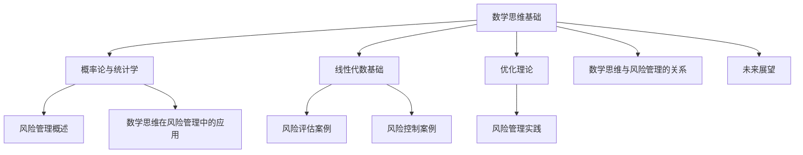

                 

### 书名：《数学思维与风险管理的关系》

#### 第一部分：数学思维基础

##### 第1章：数学思维概述

在信息技术领域，数学思维是理解和解决复杂问题的关键。数学思维不仅是数学学科的基础，也是其他科学和工程领域不可或缺的技能。本章将概述数学思维的重要性、基本特征以及应用方法和技巧。

**1.1 数学思维的重要性**

数学思维的重要性在于它为解决问题提供了系统性和逻辑性。在信息技术的各个分支中，无论是算法设计、数据处理，还是系统架构，数学思维都是核心驱动力。例如，算法的复杂度分析和优化、大数据的统计分析、机器学习的决策树和神经网络，都离不开数学思维的运用。

**1.2 数学思维的基本特征**

数学思维具有以下基本特征：

1. **抽象性**：数学思维能够将复杂现象抽象为数学模型，简化问题，提取关键特征。
2. **逻辑性**：数学思维强调逻辑推理，通过一系列的定理和证明，逐步解决问题。
3. **系统性**：数学思维注重整体性，从局部到全局，构建完整的知识体系。
4. **精确性**：数学思维要求精确和严密，用数学符号和公式来描述问题。

**1.3 数学思维的方法和技巧**

1. **建模**：将实际问题转化为数学模型，是数学思维的核心方法。建模过程中需要识别变量、建立方程、确定约束条件。
2. **算法**：设计算法来解决数学问题，是数学思维的重要应用。常见的算法设计技巧包括贪心算法、分治算法、动态规划等。
3. **证明**：通过逻辑推理和数学证明，验证数学结论的正确性。证明过程中需要使用归纳法、反证法等证明方法。
4. **优化**：优化问题在数学思维中占据重要地位，常见的优化算法包括线性规划、非线性规划、整数规划等。

**1.4 小结**

数学思维在信息技术中具有不可替代的重要性。它不仅提供了解决问题的方法论，还提升了我们理解和应用科学理论的能力。掌握数学思维，将使我们能够更加高效地应对信息技术领域中的各种挑战。

##### 第2章：数学建模基础

数学建模是将实际问题转化为数学形式的过程，它是数学思维的重要应用之一。本章将介绍数学建模的基本概念、方法和步骤，并探讨在实际应用中面临的挑战。

**2.1 数学建模的基本概念**

数学建模是一种通过数学语言和方法来描述和解决实际问题的过程。其核心步骤包括：

1. **问题识别**：确定需要解决的实际问题，明确问题的目标和约束条件。
2. **变量定义**：识别问题的变量，为每个变量分配符号和数值范围。
3. **建立模型**：根据实际问题，构建数学模型，包括方程、不等式、约束条件等。
4. **求解模型**：利用数学方法求解模型，得到问题的解。
5. **分析结果**：对求解结果进行分析，验证模型的准确性和适用性，并根据需要对模型进行调整。

**2.2 数学建模的方法和步骤**

数学建模的一般步骤如下：

1. **问题分析**：深入理解实际问题，明确问题的背景、目标和约束条件。
2. **建立数学模型**：根据问题分析，构建数学模型，包括确定变量、建立方程、设定约束条件等。
3. **求解数学模型**：选择适当的数学方法求解模型，如线性规划、非线性规划、整数规划等。
4. **验证和调整**：验证模型的求解结果，根据实际需求调整模型，提高模型的准确性和实用性。
5. **实施和应用**：将数学模型应用于实际问题，解决实际问题。

**2.3 数学建模在实际应用中的挑战**

数学建模在实际应用中面临以下挑战：

1. **问题的复杂性**：实际问题的复杂性和多样性增加了数学建模的难度，需要识别和理解问题的核心部分。
2. **数据的不确定性**：实际问题的数据通常存在不确定性和噪声，需要处理和建模这些不确定性。
3. **模型求解的效率**：某些数学模型的求解过程可能非常复杂，需要提高求解效率。
4. **模型的验证和适用性**：验证模型的准确性和适用性，确保模型在实际应用中的有效性。
5. **模型的解释性**：模型的解释性对于理解问题的本质和解决策略至关重要，需要提高模型的解释性。

**2.4 小结**

数学建模是信息技术领域中的关键技能，通过建立数学模型，我们可以更准确地描述和解决实际问题。掌握数学建模的方法和步骤，将使我们能够应对各种复杂的信息技术挑战。

##### 第3章：概率论与统计学

概率论与统计学是数学思维中不可或缺的组成部分，它们在信息技术的各个领域，如机器学习、数据分析和风险管理中发挥着重要作用。本章将介绍概率论与统计学的基本概念，包括概率、条件概率、独立事件以及统计推断和假设检验。

**3.1 概率论的基本概念**

概率论是研究随机现象的数学分支。在概率论中，我们用概率来量化随机事件发生的可能性。以下是概率论中的一些基本概念：

1. **样本空间（Sample Space）**：样本空间是所有可能结果的集合。例如，掷一个硬币的样本空间为 {正面，反面}。

2. **事件（Event）**：事件是样本空间的一个子集，表示某个具体的结果集合。例如，掷硬币得到正面的事件为 {正面}。

3. **概率（Probability）**：概率是一个介于0和1之间的数值，表示事件发生的可能性。例如，掷硬币得到正面的概率为 1/2。

4. **条件概率（Conditional Probability）**：条件概率是考虑在某个事件发生的条件下，另一个事件发生的概率。条件概率的公式为：

   $$P(A|B) = \frac{P(A \cap B)}{P(B)}$$

   其中，\(P(A|B)\) 表示在事件B发生的条件下事件A发生的概率，\(P(A \cap B)\) 表示事件A和事件B同时发生的概率，\(P(B)\) 表示事件B发生的概率。

5. **贝叶斯定理（Bayes' Theorem）**：贝叶斯定理是条件概率的一种推广，它描述了在给定某些证据的情况下，某个假设的概率。贝叶斯定理的公式为：

   $$P(H|E) = \frac{P(E|H)P(H)}{P(E)}$$

   其中，\(P(H|E)\) 表示在证据E发生的情况下假设H的概率，\(P(E|H)\) 表示在假设H发生的情况下证据E的概率，\(P(H)\) 表示假设H的先验概率，\(P(E)\) 表示证据E的概率。

**3.2 条件概率与独立事件**

条件概率与独立事件是概率论中的两个重要概念。以下是一些相关的定理和性质：

1. **乘法规则（Multiplication Rule）**：乘法规则描述了两个事件同时发生的概率。如果事件A和B是独立的，那么：

   $$P(A \cap B) = P(A)P(B)$$

2. **全概率公式（Total Probability Formula）**：全概率公式提供了一个计算复杂事件的概率的方法。如果事件B可以分解为多个互斥事件 \(B_1, B_2, ..., B_n\) 的并集，那么：

   $$P(A) = \sum_{i=1}^{n} P(A|B_i)P(B_i)$$

3. **贝叶斯定理的应用**：贝叶斯定理可以用于更新概率估计。例如，在假设检验中，贝叶斯定理可以帮助我们根据新证据调整对假设的信任度。

**3.3 统计推断与假设检验**

统计推断是基于样本数据对总体参数进行估计和推断的过程。以下是一些基本的统计推断方法：

1. **点估计（Point Estimation）**：点估计是通过样本数据计算出一个具体的参数值作为总体参数的估计。常见的点估计方法包括均值估计、中位数估计等。

2. **区间估计（Interval Estimation）**：区间估计是在一定的概率水平下，给出总体参数的可能范围。常见的区间估计方法包括置信区间。

3. **假设检验（Hypothesis Testing）**：假设检验是通过对样本数据的分析，判断总体参数是否符合某个假设。常见的假设检验方法包括t检验、卡方检验等。

4. **错误率（Type I and Type II Errors）**：在假设检验中，错误率是评估检验性能的重要指标。第一类错误（Type I Error）是拒绝真实的零假设，而第二类错误（Type II Error）是接受错误的零假设。

**3.4 小结**

概率论与统计学在信息技术中具有广泛的应用，通过概率论和统计学的知识，我们可以对随机现象进行建模和分析，从而更好地理解和解决复杂问题。掌握概率论和统计学的基本概念和方法，将为我们在信息技术的各个领域取得成功奠定基础。

##### 第4章：线性代数基础

线性代数是数学思维的重要组成部分，它在信息技术的许多领域中扮演着关键角色，如图像处理、机器学习、网络分析和算法优化。本章将介绍线性代数的基本概念，包括矩阵与向量、线性方程组与矩阵运算、特征值与特征向量。

**4.1 矩阵与向量**

矩阵（Matrix）是线性代数中的基本对象，它由一系列数字按照行列排列组成。矩阵可以表示线性变换、系统方程、数据集合等。向量（Vector）是矩阵的一种特殊形式，它由一组有序数字组成。

1. **矩阵的基本运算**：
   - **加法**：两个矩阵相加，要求它们的维度相同。结果矩阵是对应元素相加。
   - **数乘**：矩阵与标量相乘，每个元素都乘以该标量。
   - **矩阵乘法**：两个矩阵相乘的结果是一个新矩阵，其元素是原矩阵对应元素乘积的和。

2. **向量的基本运算**：
   - **加法**：两个向量相加，结果向量是它们对应元素的加和。
   - **数乘**：向量与标量相乘，每个元素都乘以该标量。
   - **点积（内积）**：两个向量点积是一个标量，它是它们对应元素乘积的和。
   - **叉积（外积）**：两个三维向量叉积是一个新向量，它垂直于两个原向量所在的平面。

**4.2 线性方程组与矩阵运算**

线性方程组是多个线性方程的集合，可以用矩阵形式表示。矩阵运算在解线性方程组中起着重要作用。

1. **线性方程组的矩阵表示**：
   - 一个线性方程组可以表示为矩阵形式 \(Ax = b\)，其中 \(A\) 是系数矩阵，\(x\) 是未知数向量，\(b\) 是常数向量。

2. **矩阵运算在解线性方程组中的应用**：
   - **矩阵逆**：如果矩阵 \(A\) 可逆，那么方程 \(Ax = b\) 的解可以表示为 \(x = A^{-1}b\)。
   - **高斯消元法**：通过高斯消元法，可以将线性方程组转化为上三角或下三角形式，从而容易求解。

**4.3 特征值与特征向量**

特征值和特征向量是矩阵的重要属性，它们在矩阵分解、图像处理、量子计算等领域有广泛应用。

1. **特征值与特征向量的定义**：
   - **特征值**：如果矩阵 \(A\) 乘以特征向量 \(v\) 等于特征值 \(\lambda\) 乘以 \(v\)，即 \(Av = \lambda v\)，则 \(\lambda\) 是矩阵 \(A\) 的特征值，\(v\) 是对应于 \(\lambda\) 的特征向量。

2. **特征值与特征向量的计算**：
   - **特征多项式**：矩阵 \(A\) 的特征多项式是 \(\det(A - \lambda I)\)，其中 \(I\) 是单位矩阵。
   - **特征方程**：特征多项式等于零，即 \(\det(A - \lambda I) = 0\)，解出的 \(\lambda\) 值是矩阵 \(A\) 的特征值。
   - **特征向量**：对于每个特征值 \(\lambda\)，解线性方程 \( (A - \lambda I)v = 0 \) 得到特征向量 \(v\)。

**4.4 小结**

线性代数是信息技术领域中的重要工具，通过理解矩阵与向量、线性方程组与矩阵运算以及特征值与特征向量，我们可以更好地处理和解决复杂的数学问题。掌握线性代数的基本概念和运算，将为我们在信息技术的各个领域取得成功奠定基础。

##### 第5章：优化理论

优化理论是数学思维中一个重要的分支，它在工程、经济学、管理学等多个领域有广泛的应用。优化问题涉及在满足一系列约束条件下，找到使某个目标函数达到最大值或最小值的解。本章将介绍优化问题的基本概念、常用的优化算法以及约束优化问题的处理方法。

**5.1 优化问题的基本概念**

优化问题通常由以下三个部分组成：

1. **目标函数**：目标函数是优化问题要优化的函数，可以是最大化或最小化。目标函数可以是线性的，也可以是非线性的。
2. **约束条件**：约束条件是限制优化问题解的范围的条件，可以是等式约束，也可以是不等式约束。
3. **可行解**：满足所有约束条件的解称为可行解。

优化问题可以分为以下几种类型：

1. **无约束优化**：没有约束条件的优化问题。
2. **有约束优化**：存在约束条件的优化问题。
3. **动态优化**：目标函数和约束条件随时间变化而变化的优化问题。

**5.2 梯度下降法**

梯度下降法是一种无约束优化算法，用于最小化目标函数。其基本思想是通过沿着目标函数梯度的反方向更新参数，逐步减小目标函数的值。

1. **梯度**：目标函数的梯度是目标函数在当前点的切线向量，指向函数增加最快的方向。
2. **梯度下降法步骤**：
   - 选择初始参数 \(\theta\)。
   - 计算目标函数在当前参数的梯度 \(\nabla\theta\)。
   - 沿着梯度的反方向更新参数：\(\theta = \theta - \alpha \nabla\theta\)，其中 \(\alpha\) 是学习率。
   - 重复步骤2和3，直到满足收敛条件，如梯度足够小或达到最大迭代次数。

**5.3 约束优化问题

约束优化问题是实际应用中最常见的问题类型。处理约束优化问题通常有以下方法：

1. **拉格朗日乘子法**：拉格朗日乘子法是一种将约束条件引入目标函数的方法。通过构造拉格朗日函数，求解拉格朗日函数的极值点，可以得到原问题的解。

2. **内点法**：内点法是一种处理不等式约束优化的方法。它通过将问题转化为等效的内点问题来求解，可以有效处理严格不等式约束。

3. **序列二次规划法（SQP）**：序列二次规划法是一种迭代方法，每次迭代将优化问题转化为二次规划问题，然后求解二次规划问题。

**5.4 小结**

优化理论是解决复杂问题的重要工具，它广泛应用于工程、经济和管理等领域。通过理解优化问题的基本概念和常用的优化算法，我们可以更有效地解决实际问题。掌握优化理论，将为我们在信息技术领域中的各种挑战提供有力支持。

#### 第二部分：风险管理应用

##### 第6章：风险管理概述

风险管理是组织或个人为应对潜在风险而采取的一系列策略和措施。有效的风险管理可以降低风险发生的概率和影响，从而保护组织的资产和利益。本章将介绍风险管理的定义、目的、流程和方法，并讨论风险管理的重要性。

**6.1 风险管理的定义与目的**

风险管理是指通过识别、评估、监控和处理风险，以确保组织目标的实现。其定义可以概括为：

- **识别风险**：识别可能对组织造成不利影响的风险因素。
- **评估风险**：评估风险的可能性和影响，确定风险的重要性和优先级。
- **处理风险**：采取相应的措施来降低风险发生的概率或减轻其影响。
- **监控风险**：持续监控风险状态，确保风险管理策略的有效性。

风险管理的目的包括：

- **保护组织资产**：通过识别和评估潜在风险，采取预防措施，保护组织的财务、人力和技术资源。
- **确保业务连续性**：通过有效的风险管理，确保组织在面临突发事件时能够迅速响应，保持业务的连续性。
- **降低成本**：通过风险管理，可以避免或减少因风险事件导致的直接和间接损失，从而降低运营成本。
- **提高竞争力**：通过有效的风险管理，组织可以在面对市场变化和竞争压力时保持灵活性和适应性。

**6.2 风险管理的流程与方法**

风险管理的流程通常包括以下步骤：

1. **风险评估**：识别组织可能面临的风险，评估其发生的可能性和潜在影响，确定风险的优先级。
2. **风险应对策略**：根据风险评估的结果，制定相应的风险应对策略，包括风险规避、风险降低、风险承担和风险转移等。
3. **实施风险应对措施**：执行风险应对策略，采取具体措施来降低风险发生的概率或减轻其影响。
4. **监控与评审**：持续监控风险状态，定期评审风险管理措施的有效性，并根据需要调整策略和措施。

风险管理的方法包括：

1. **定性分析**：使用专家判断和经验来识别和评估风险。定性分析可以快速识别潜在风险，但可能缺乏精确性。
2. **定量分析**：使用数学模型和统计数据来识别和评估风险。定量分析可以提供更精确的风险评估，但需要专业知识和计算工具。
3. **风险矩阵**：使用风险矩阵来评估风险的概率和影响，确定风险的优先级。风险矩阵通常包括概率和影响的评级，如低、中、高。
4. **风险评级模型**：使用复杂的模型来量化风险，如蒙特卡罗模拟、回归分析和决策树等。

**6.3 风险管理的重要性

风险管理在组织运营中具有重要作用，主要体现在以下几个方面：

1. **保护组织利益**：有效的风险管理可以降低风险事件对组织造成的损失，保护组织的财务和资源。
2. **提高决策质量**：通过风险管理，组织可以更好地了解潜在风险，从而在决策过程中考虑风险因素，提高决策质量。
3. **增强竞争力**：有效的风险管理可以帮助组织在面临市场变化和竞争压力时保持灵活性和适应性，提高竞争力。
4. **增强信誉**：通过积极的风险管理，组织可以树立良好的信誉，增强与客户、合作伙伴和投资者的关系。
5. **提高员工满意度**：有效的风险管理可以降低员工的工作压力，提高员工的满意度和工作效率。

**6.4 小结**

风险管理是组织运营中不可或缺的一部分，通过有效的风险管理，组织可以降低风险发生的概率和影响，保护组织的资产和利益，提高竞争力和决策质量。掌握风险管理的定义、目的、流程和方法，将为组织在复杂多变的环境中取得成功奠定基础。

##### 第7章：数学思维在风险管理中的应用

数学思维在风险管理中的应用至关重要，通过数学模型、统计模型和优化模型的运用，我们可以更准确地识别、评估和处理风险。本章将详细讨论数学思维在风险管理中的应用，以及这些模型在实际风险管理中的具体运用。

**7.1 数学模型在风险管理中的运用**

数学模型是风险管理中的基础工具，通过将风险现象转化为数学形式，可以更精确地描述和预测风险。以下是数学模型在风险管理中的应用：

1. **概率模型**：概率模型用于估计风险事件发生的概率。例如，在信用风险评估中，可以使用概率模型来估计客户违约的概率。

2. **期望损失模型**：期望损失模型用于计算在一定置信水平下的预期损失。例如，在保险业中，可以使用期望损失模型来计算保险理赔的预期值。

3. **蒙特卡罗模拟**：蒙特卡罗模拟是一种基于概率和统计的模拟方法，用于模拟随机过程和评估风险。例如，在投资风险管理中，可以使用蒙特卡罗模拟来预测投资组合的预期收益和风险。

4. **随机过程模型**：随机过程模型用于描述风险事件的动态变化。例如，在金融市场风险管理中，可以使用随机过程模型来分析股价的波动。

**7.2 统计模型在风险管理中的运用**

统计模型是风险管理中的核心工具，通过统计分析方法，可以识别和预测风险。以下是统计模型在风险管理中的应用：

1. **回归模型**：回归模型用于分析变量之间的关系，可以用于风险评估和预测。例如，在信用评分中，可以使用回归模型来预测客户违约的概率。

2. **时间序列分析**：时间序列分析用于分析时间序列数据的模式，可以用于风险监测和预测。例如，在金融市场风险管理中，可以使用时间序列分析来预测市场走势。

3. **主成分分析**：主成分分析是一种降维技术，用于识别和提取数据中的主要影响因素。例如，在风险管理中，可以使用主成分分析来简化复杂的风险因素，提高风险评估的精度。

4. **聚类分析**：聚类分析用于将相似的数据分组，可以用于风险评估和分类。例如，在信用风险评估中，可以使用聚类分析来将客户分为不同的风险类别。

**7.3 优化模型在风险管理中的运用**

优化模型用于在约束条件下优化目标函数，可以用于风险管理中的决策制定。以下是优化模型在风险管理中的应用：

1. **线性规划**：线性规划用于在给定约束条件下最大化或最小化线性目标函数。例如，在投资组合管理中，可以使用线性规划来优化资产分配，以最大化预期收益或最小化风险。

2. **整数规划**：整数规划用于在给定约束条件下优化整数目标函数。例如，在灾难恢复计划中，可以使用整数规划来确定最佳备份方案，以确保数据的安全性和可靠性。

3. **动态规划**：动态规划用于解决多阶段决策问题，可以用于风险管理中的连续决策。例如，在供应链管理中，可以使用动态规划来优化库存管理和运输策略。

4. **多目标优化**：多目标优化用于在多个目标之间进行权衡，可以用于风险管理中的综合决策。例如，在风险管理中，可以使用多目标优化来确定最佳的风险控制策略，平衡风险和成本。

**7.4 小结**

数学思维在风险管理中具有广泛的应用，通过数学模型、统计模型和优化模型的运用，我们可以更准确地识别、评估和处理风险。掌握这些模型和工具，将为我们在风险管理领域取得成功奠定基础。

##### 第8章：实际案例与应用

在实际应用中，数学思维在风险管理中的运用可以显著提升决策的质量和效率。以下通过具体案例来展示数学思维在风险管理中的应用，以及如何通过数学模型和算法实现风险控制。

**8.1 风险评估案例**

**案例背景**：某银行需要进行客户信用风险评估，以降低贷款违约风险。银行收集了客户的基本信息、财务状况、信用记录等数据。

**数学模型应用**：
1. **概率模型**：使用逻辑回归模型来预测客户违约的概率。逻辑回归模型将客户特征映射到违约概率上，通过分析历史数据得到回归系数。

   $$P(Y=1) = \sigma(\beta_0 + \beta_1X_1 + \beta_2X_2 + ... + \beta_nX_n)$$

   其中，\(P(Y=1)\) 表示客户违约的概率，\(\sigma\) 是逻辑函数，\(\beta_0, \beta_1, ..., \beta_n\) 是回归系数，\(X_1, X_2, ..., X_n\) 是客户特征。

2. **期望损失模型**：使用期望损失模型来计算不同信用评级下的期望损失。期望损失模型将客户的信用评级与期望损失关联，通过分析历史数据得到损失率。

   $$EL = \sum_{i=1}^{n} P(Y=1_i) \cdot L_i$$

   其中，\(EL\) 表示期望损失，\(P(Y=1_i)\) 表示第 \(i\) 个信用评级客户违约的概率，\(L_i\) 表示第 \(i\) 个信用评级客户的违约损失。

**案例分析**：通过逻辑回归模型和期望损失模型，银行可以评估每个客户的信用风险，从而制定出更精准的贷款审批策略。例如，对于信用评分低且违约概率高的客户，银行可以采取更严格的审批条件，降低贷款风险。

**8.2 风险控制案例**

**案例背景**：某电商平台需要控制欺诈订单的风险，以保护消费者的利益和平台的运营。

**数学模型应用**：
1. **聚类分析**：使用K-means聚类算法将订单数据分为不同的聚类，每个聚类代表不同类型的订单模式。通过分析聚类中心，可以识别出异常订单模式。

   $$\min_{C} \sum_{i=1}^{k} \sum_{x \in C_i} d(x, C_i)$$

   其中，\(C\) 表示聚类中心，\(k\) 表示聚类数，\(d(x, C_i)\) 表示订单 \(x\) 与聚类中心 \(C_i\) 的距离。

2. **异常检测**：使用孤立森林（Isolation Forest）算法来检测异常订单。孤立森林算法通过随机选择特征和切分值来构建多个孤立树，异常订单在孤立树中的路径较短，容易被识别出来。

   $$\text{path\_length} = \sum_{t=1}^{T} \log_2 P(\text{split\_feature}(x, t))$$

   其中，\(\text{path\_length}\) 表示订单 \(x\) 在孤立树中的路径长度，\(T\) 表示孤立树的数量，\(\text{split\_feature}(x, t)\) 表示在第 \(t\) 次切分时订单 \(x\) 的选择特征的概率。

**案例分析**：通过聚类分析和异常检测，电商平台可以识别出高风险订单，并采取相应的风险控制措施，如拒绝高风险订单、增加订单验证流程等。例如，对于路径长度较短的订单，电商平台可以增加短信验证或人脸识别等额外验证步骤。

**8.3 风险管理实践**

**案例背景**：某航空公司需要优化其飞行路线规划，以降低运营成本并提高飞行安全性。

**数学模型应用**：
1. **线性规划**：使用线性规划模型来优化飞行路线，以最小化燃料消耗和飞行时间。线性规划模型将飞行路线的约束条件（如航路限制、风速条件）和目标函数（如总飞行距离、总飞行时间）结合起来，求解最优飞行路线。

   $$\min_{x} c^T x$$

   $$\text{s.t.} \, Ax \leq b$$

   其中，\(x\) 表示飞行路线，\(c\) 表示目标函数系数，\(A\) 和 \(b\) 分别表示约束条件。

2. **动态规划**：使用动态规划模型来优化多阶段决策问题，如航班调度和机组安排。动态规划模型将问题划分为多个阶段，每个阶段都有多个决策选项，通过逆向递推求解最优策略。

   $$V_t(x) = \min_{u_t} \{c(u_t, x_t) + V_{t+1}(x_{t+1})\}$$

   其中，\(V_t(x)\) 表示第 \(t\) 阶段的优化值，\(u_t\) 表示第 \(t\) 阶段的决策，\(c(u_t, x_t)\) 表示第 \(t\) 阶段的成本，\(x_{t+1}\) 表示第 \(t+1\) 阶段的状态。

**案例分析**：通过线性规划和动态规划模型，航空公司可以优化飞行路线和航班调度，降低运营成本并提高飞行安全性。例如，通过优化飞行路线，航空公司可以减少燃油消耗，降低环境影响；通过优化航班调度，可以减少机组疲劳，提高飞行安全。

**8.4 小结**

实际案例展示了数学思维在风险管理中的应用，通过数学模型和算法，可以更准确地识别和评估风险，实现有效的风险控制。掌握这些模型和工具，将为我们在风险管理领域取得成功提供有力支持。

#### 第三部分：数学思维与风险管理的关系

##### 第9章：数学思维与风险管理的联系

数学思维与风险管理之间存在深刻的联系，二者相辅相成，共同推动着组织在复杂环境中实现稳定和发展。本章将探讨数学思维对风险管理的影响、风险管理对数学思维的需求，以及数学思维与风险管理的关系框架。

**9.1 数学思维对风险管理的影响**

数学思维在风险管理中发挥着关键作用，主要体现在以下几个方面：

1. **提高决策质量**：数学思维通过建立数学模型和算法，将风险管理的复杂问题转化为可计算的量，从而提高决策的准确性和可靠性。例如，在信用风险评估中，通过逻辑回归模型和期望损失模型，可以更精确地评估客户的信用风险，帮助银行制定更科学的贷款审批策略。

2. **增强风险预测能力**：数学思维通过统计模型和时间序列分析，可以对风险进行定量预测，提供对未来风险的预判。例如，在金融市场风险管理中，通过时间序列分析可以预测市场走势，帮助金融机构制定风险管理策略。

3. **优化资源分配**：数学思维通过优化模型，如线性规划和动态规划，可以帮助组织在有限的资源下实现最优的风险控制。例如，在供应链管理中，通过优化模型可以确定最佳的库存水平和运输路线，从而降低运营成本和风险。

4. **提高风险识别能力**：数学思维通过聚类分析和异常检测等算法，可以帮助组织识别出潜在的风险点，从而采取预防措施。例如，在网络安全管理中，通过孤立森林算法可以检测出异常流量，防止网络攻击。

**9.2 风险管理对数学思维的需求**

风险管理对数学思维的需求体现在以下几个方面：

1. **定量分析能力**：风险管理需要精确的定量分析，以评估风险的概率和影响。数学思维提供了一系列的统计模型和算法，如回归模型、时间序列分析和蒙特卡罗模拟等，帮助风险管理人员进行定量分析。

2. **建模能力**：风险管理需要将复杂的实际问题转化为数学模型，以更好地理解和解决风险问题。数学思维提供了一系列的建模方法和技巧，如概率论、线性代数和优化理论等，帮助风险管理人员构建有效的数学模型。

3. **计算能力**：风险管理中的许多问题需要复杂的计算，如大规模的数据分析和多变量优化问题。数学思维提供了高效的计算工具和算法，如矩阵运算、数值优化和模拟算法等，帮助风险管理人员快速求解复杂问题。

4. **创新能力**：数学思维鼓励创新和探索，通过不断的数学建模和算法优化，可以帮助风险管理人员发现新的风险管理策略和方法。例如，在保险业中，通过数学建模和计算可以开发出更精细的定价模型和产品。

**9.3 数学思维与风险管理的关系框架

数学思维与风险管理的关系可以概括为以下框架：

1. **数学思维基础**：数学思维的基础包括概率论、统计学、线性代数和优化理论等。这些基础为风险管理提供了必要的数学工具和方法。

2. **风险管理方法**：风险管理方法包括风险评估、风险应对策略、风险监控和评审等。数学思维通过建立数学模型和算法，为这些风险管理方法提供了科学的支持。

3. **数学模型应用**：数学模型的应用是数学思维在风险管理中的具体体现。通过概率模型、统计模型和优化模型等，可以对风险进行定量分析和优化决策。

4. **风险管理实践**：风险管理实践是数学思维在风险管理中的实际应用。通过实际案例和应用，验证和优化数学模型和算法，提高风险管理的有效性。

**9.4 小结**

数学思维与风险管理之间存在紧密的联系，二者相互促进，共同推动着组织在复杂环境中实现稳定和发展。通过数学思维，风险管理人员可以更准确地识别、评估和处理风险，从而提高决策质量和管理水平。掌握数学思维，将为我们在风险管理领域取得成功奠定坚实基础。

##### 第10章：未来展望

随着信息技术的不断进步，数学思维在风险管理中的应用将迎来更多机遇和挑战。本章将探讨数学思维与风险管理的发展趋势、潜在应用领域，以及未来数学思维对风险管理的要求。

**10.1 数学思维与风险管理的发展趋势**

1. **人工智能与机器学习**：人工智能和机器学习的快速发展，为数学思维在风险管理中的应用提供了新的工具和方法。通过深度学习和强化学习等算法，可以构建更复杂的数学模型，提高风险预测和决策的准确性。

2. **大数据分析**：大数据技术的成熟，使得风险管理人员能够处理和分析海量数据，从而更全面地识别和管理风险。数学思维在大数据分析中的应用，如聚类分析、关联规则挖掘和预测模型等，将有助于提升风险管理的效率。

3. **区块链技术**：区块链技术的兴起，为风险管理提供了新的手段。通过区块链技术，可以实现数据的透明和不可篡改，从而提高风险管理的可信度和有效性。

4. **云计算与边缘计算**：云计算和边缘计算的普及，为数学思维在风险管理中的应用提供了强大的计算能力。通过分布式计算和云计算平台，可以快速处理复杂的风险模型和算法。

**10.2 数学思维在风险管理中的潜在应用领域**

1. **金融风险管理**：金融风险管理是数学思维的重要应用领域。通过数学模型和算法，可以优化投资组合、预测市场走势、评估信用风险等，提高金融行业的风险管理水平。

2. **企业风险管理**：企业风险管理涉及多个方面，如财务风险、运营风险、法律风险等。数学思维可以帮助企业识别和评估风险，制定有效的风险应对策略。

3. **网络安全管理**：网络安全管理面临日益严峻的挑战，数学思维在网络安全中的应用，如加密算法、异常检测和入侵检测等，将有助于提升网络安全防护能力。

4. **公共卫生管理**：公共卫生管理中的疫情防控、疾病预测和资源分配等问题，都离不开数学思维的指导。通过数学模型和算法，可以更科学地制定公共卫生策略，提高防控效果。

**10.3 风险管理对数学思维的要求

1. **跨学科知识**：未来的风险管理将更加复杂和多元化，需要风险管理专业人员具备跨学科的知识，如数学、统计学、计算机科学、经济学等。

2. **数据分析和处理能力**：随着数据量的爆炸性增长，风险管理专业人员需要具备强大的数据分析和处理能力，能够处理和挖掘大数据中的有用信息。

3. **创新思维**：创新思维在数学思维中至关重要，未来风险管理中的新问题和新挑战，需要风险管理专业人员具备创新思维，开发出新的数学模型和算法。

4. **合作与沟通能力**：风险管理是一个跨部门、跨领域的协作过程，风险管理专业人员需要具备良好的合作与沟通能力，与不同领域的专家合作，共同解决复杂的风险问题。

**10.4 小结**

未来，数学思维与风险管理将相互促进，共同发展。随着信息技术的不断进步，数学思维在风险管理中的应用将更加广泛和深入。风险管理专业人员需要不断更新知识体系，提升跨学科能力和创新思维，以应对日益复杂的风险环境。掌握数学思维，将为我们在风险管理领域取得成功奠定坚实基础。

### 附录

#### 附录A：数学思维与风险管理相关资源和工具

**A.1 数学建模软件与工具**

1. **MATLAB**：MATLAB 是一款强大的数学建模和计算工具，广泛应用于科学研究和工程领域。
2. **Python**：Python 是一种流行的编程语言，拥有丰富的数学库和框架，如 NumPy、SciPy 和 Pandas，适用于数据分析和建模。
3. **R**：R 是一种专门用于统计分析和数据可视化的语言，拥有广泛的统计模型和数据分析包。
4. **GAMS**：GAMS 是一款用于数学建模和优化的软件，适用于线性规划、非线性规划和整数规划等。

**A.2 风险管理数据库与文献**

1. **CRSP**：美国芝加哥大学商业研究生院提供的 Compustat 数据库，包含大量公司财务数据。
2. **Bloomberg**：Bloomberg 提供了全球金融市场的实时数据和分析工具。
3. **JSTOR**：JSTOR 是一个学术文献数据库，包含了大量经济学、统计学和金融学的学术论文。

**A.3 数学思维与风险管理学习资源**

1. **《概率论及其应用》（Grinstead and Snell）**：这是一本经典概率论教材，适合初学者。
2. **《线性代数及其应用》（David C. Lay）**：这本书详细介绍了线性代数的基本概念和应用。
3. **《风险管理基础》（Paul A. Spiliopoulou）**：这是一本全面介绍风险管理的教材，适合风险管理初学者。
4. **在线课程**：Coursera、edX 和 Khan Academy 等在线教育平台提供了丰富的数学和风险管理课程。

### 附录B：数学思维与风险管理 Mermaid 流程图

### 作者信息

**作者：AI天才研究院/AI Genius Institute & 禅与计算机程序设计艺术 /Zen And The Art of Computer Programming**

