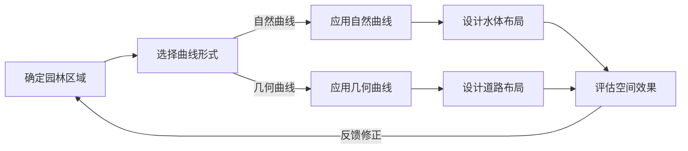
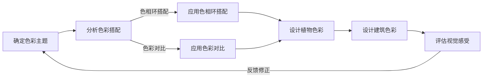

                 

### 《数学美学在园林艺术中的应用》

> **关键词：数学美学、园林艺术、比例与对称、曲线与几何图形、色彩与构图、应用案例**

> **摘要：本文深入探讨数学美学在园林艺术中的广泛应用。从历史背景到现代实践，文章梳理了比例与对称、曲线与几何图形、色彩与构图等关键概念，并通过具体案例展示了数学美学在园林艺术中的独特魅力。**

### 《数学美学在园林艺术中的应用》目录大纲

- **第一部分：数学美学的概述**
  - **1.1 数学美学的定义与特点**
  - **1.2 数学美学的历史发展**
  - **1.3 数学美学在艺术中的应用概述**

- **第二部分：园林艺术中的数学美学**
  - **2.1 园林艺术中的比例与对称**
    - **2.1.1 比例在园林设计中的应用**
    - **2.1.2 对称在园林设计中的应用**
  - **2.2 园林艺术中的曲线与几何图形**
    - **2.2.1 曲线的美学价值**
    - **2.2.2 几何图形在园林布局中的应用**
  - **2.3 园林艺术中的色彩与构图**
    - **2.3.1 色彩在园林艺术中的运用**
    - **2.3.2 构图技巧在园林设计中的应用**

- **第三部分：数学美学在园林艺术中的具体应用案例**
  - **3.1 古代园林艺术中的数学美学**
    - **3.1.1 故宫的数学美学分析**
    - **3.1.2 苏州的园林艺术中的数学美学**
  - **3.2 现代园林艺术中的数学美学**
    - **3.2.1 当代园林设计师的数学美学实践**
    - **3.2.2 现代园林艺术的数学美学分析**

- **第四部分：数学美学在园林艺术教育中的应用**
  - **4.1 数学美学在园林艺术教育中的重要性**
  - **4.2 数学美学教育在园林专业课程中的应用**
    - **4.2.1 园林设计中的数学美学课程设计**
    - **4.2.2 园林艺术创作中的数学美学教学**
  - **4.3 数学美学在园林艺术教育中的挑战与机遇**

- **第五部分：数学美学在园林艺术研究与保护中的应用**
  - **5.1 数学美学在园林艺术研究中的应用**
  - **5.2 数学美学在园林艺术保护中的应用**

- **附录：数学美学在园林艺术中的实践工具与资源**
  - **A.1 数学术语与符号索引**
  - **A.2 园林艺术中的数学工具与软件**
  - **A.3 推荐阅读与参考文献**
  - **A.4 网络资源与在线课程推荐**

- **附录 B：数学美学在园林艺术中的Mermaid流程图**
  - **B.1 园林设计中的比例与对称流程图**
  - **B.2 曲线与几何图形在园林布局中的应用流程图**
  - **B.3 色彩与构图在园林设计中的应用流程图**

- **附录 C：数学美学在园林艺术中的算法伪代码示例**
  - **C.1 比例计算伪代码**
  - **C.2 曲线拟合算法伪代码**
  - **C.3 色彩搭配算法伪代码**

- **附录 D：数学美学在园林艺术中的项目实战案例**
  - **D.1 古代园林艺术数学美学分析案例**
  - **D.2 现代园林艺术数学美学分析案例**

- **附录 E：数学美学在园林艺术教育中的应用案例**
  - **E.1 园林设计中的数学美学教育案例**
  - **E.2 园林艺术研究的数学美学案例**

- **附录 F：数学美学在园林艺术保护中的应用案例**
  - **F.1 园林艺术品的数学美学评估案例**
  - **F.2 园林艺术的数字化保护与修复案例**

---

在这个目录大纲中，我们将首先介绍数学美学的基本概念和特点，然后深入探讨数学美学在园林艺术中的具体应用，包括比例与对称、曲线与几何图形、色彩与构图等方面。接着，通过古代和现代的园林艺术案例，展示数学美学在不同历史时期的实际运用。随后，我们将会探讨数学美学在园林艺术教育中的应用，以及如何通过数学美学来提高园林艺术的研究和保护水平。最后，我们将提供一些实用的数学工具和资源，帮助读者更深入地理解和应用数学美学于园林艺术中。

---

### 第一部分：数学美学的概述

#### 1.1 数学美学的定义与特点

数学美学，是美学与数学相结合的边缘学科，它探讨数学结构、形式和关系中蕴含的美感。数学美学不仅仅是关于数学的理论，它也涉及到艺术、哲学和心理学等多个领域。数学美学的特点主要体现在以下几个方面：

1. **简洁性**：数学美学强调简洁、优美的形式和关系。在数学中，简洁性通常表现为公式的简洁、图形的简洁以及结构的简洁。例如，欧拉公式 \(e^{i\pi} + 1 = 0\) 就是一个简洁而优美的数学公式。

2. **对称性**：对称是数学美学中的重要特点之一。对称性可以存在于几何图形、数列、函数等多个数学领域。例如，正多边形、对数曲线等都表现出某种形式的对称性。

3. **统一性**：数学美学中的统一性体现在不同的数学分支之间存在着深刻的联系。例如，微积分和线性代数之间的联系，以及它们与几何学、代数学的关系。

4. **和谐性**：和谐性是指数学形式和结构之间的一致性。一个数学结构如果能够在一个简单的框架内实现复杂的操作，那么它就被认为是和谐的。

5. **抽象性**：数学美学的抽象性体现在它能够将具体的物理现象或现实问题转化为数学模型，从而揭示出问题中的普遍规律。

#### 1.2 数学美学的历史发展

数学美学的历史可以追溯到古希腊时期。古希腊哲学家如毕达哥拉斯、柏拉图等，都认为数学不仅是科学的基础，也是艺术的基础。他们认为数学的美感来源于数的和谐和几何的对称。

- **古希腊**：古希腊哲学家毕达哥拉斯提出了“一切皆数”的观点，他认为数字和几何关系是宇宙的基本元素。柏拉图进一步发展了这一思想，他在《理想国》中提到，数学是通往真理和美的重要途径。

- **中世纪**：在中世纪，数学美学的发展受到了基督教哲学的影响。基督教哲学家认为数学的美感在于它能够揭示上帝的创造力和秩序。

- **文艺复兴**：文艺复兴时期，数学美学再次受到重视。艺术家和科学家如达·芬奇、伽利略等，通过研究数学和自然的关系，揭示了数学在艺术和科学中的重要性。

- **现代**：现代数学美学的发展主要体现在数学与艺术、哲学、计算机科学的交叉研究中。现代数学家如希尔伯特、哥德尔等，通过数学的方法探讨了形式系统的美学性质。

#### 1.3 数学美学在艺术中的应用概述

数学美学在艺术中的应用十分广泛，包括绘画、雕塑、建筑、园林等多个领域。在艺术中，数学美学通常体现在以下几个方面：

1. **比例与对称**：在绘画和雕塑中，比例和对称是创造美感的重要手段。例如，黄金比例在艺术创作中被广泛应用。

2. **几何图形**：几何图形在艺术中有着重要的地位。许多艺术家通过研究几何图形的构成和变换，创作出独特的艺术作品。

3. **色彩与构图**：色彩和构图是艺术创作中不可或缺的部分。数学美学在色彩搭配和构图技巧上提供了理论支持。

4. **抽象表现**：现代艺术中，许多艺术家通过抽象手法表达数学美感。他们利用数学公式、几何图形等元素，创造出独特的艺术效果。

总之，数学美学在艺术中的应用，不仅丰富了艺术的形式和内容，也促进了数学与艺术的深度融合。

### 第二部分：园林艺术中的数学美学

园林艺术是中国传统艺术的重要组成部分，它不仅体现了人与自然的和谐共生，也蕴含了丰富的数学美学。数学美学在园林艺术中的应用，不仅提高了园林的审美价值，还增强了园林的实用功能。在这一部分中，我们将详细探讨园林艺术中的比例与对称、曲线与几何图形、色彩与构图等关键概念。

#### 2.1 园林艺术中的比例与对称

比例与对称是园林艺术中最为基本的数学美学概念，它们在园林设计中起着至关重要的作用。

##### 2.1.1 比例在园林设计中的应用

比例是园林设计中的一项重要原则，它通过控制园林中各个元素之间的相对大小关系，创造出和谐的美感。黄金比例（Golden Ratio，又称黄金分割）是园林设计中常用的一种比例关系，它被广泛应用于园林布局、建筑设计和植物配置等方面。

- **黄金比例的应用**：在园林设计中，黄金比例通常被用于确定主要景点、建筑和植物的位置。例如，一个池塘的宽度与其长度之比可以是黄金比例，从而创造出优美的视觉效果。

- **实际案例**：苏州园林中的狮子林就是一个典型的例子。狮子林的布局遵循了黄金比例的原则，使游客在游览过程中能够感受到和谐与平衡。

##### 2.1.2 对称在园林设计中的应用

对称是园林艺术中常用的美学手法之一，它通过镜像或轴对称的方式，创造出秩序感和稳定性。对称可以分为轴对称和中心对称两种类型。

- **轴对称**：轴对称是指园林中的元素相对于一条轴线呈现镜像关系。例如，故宫的布局就体现了强烈的轴对称特点，使整个园林显得庄重、宏伟。

- **中心对称**：中心对称是指园林中的元素相对于一个中心点呈现镜像关系。这种对称方式在园林设计中较少应用，但可以创造出独特的视觉效果。

- **实际案例**：苏州园林中的拙政园就是一个典型的轴对称园林。拙政园的布局以一条中轴线为中心，两侧对称布置亭台楼阁、池塘山石，营造出一种宁静、和谐的氛围。

#### 2.2 园林艺术中的曲线与几何图形

曲线与几何图形在园林艺术中具有独特的审美价值。它们不仅丰富了园林的视觉效果，还增加了园林的空间层次感。

##### 2.2.1 曲线的美学价值

曲线是园林设计中常用的元素之一，它具有流畅、柔和的视觉效果，能够营造出轻松、愉悦的氛围。曲线可以分为自然曲线和几何曲线两种类型。

- **自然曲线**：自然曲线模仿自然界的形态，如河流、山峦等。在园林设计中，自然曲线常用于池塘、河流的布局，使园林显得自然、生动。

- **几何曲线**：几何曲线是通过几何学方法绘制出的曲线，如圆弧、椭圆等。几何曲线在园林设计中常用于花坛、道路的布局，创造出简洁、明快的视觉效果。

- **实际案例**：颐和园的长廊就是一个典型的自然曲线应用案例。长廊沿湖而建，曲线的走向与湖水的轮廓相呼应，使整个园林显得更加优美。

##### 2.2.2 几何图形在园林布局中的应用

几何图形在园林布局中具有重要的美学意义。几何图形的规则性、对称性等特点，使园林设计显得简洁、明快。

- **正多边形**：正多边形在园林设计中常用作花坛、广场的形状。正多边形具有规则、对称的特点，能够营造出简洁、大气的氛围。

- **椭圆形**：椭圆形在园林设计中常用于池塘、湖泊的布局。椭圆形的形状具有和谐、柔美的视觉效果，能够营造出宁静、舒适的氛围。

- **实际案例**：杭州西湖就是典型的几何图形应用案例。西湖的布局以椭圆形的池塘为中心，周围布置亭台楼阁、假山怪石，形成了一种和谐、优美的园林景观。

#### 2.3 园林艺术中的色彩与构图

色彩与构图是园林艺术中不可或缺的部分，它们通过视觉传达，创造出园林的美感。

##### 2.3.1 色彩在园林艺术中的运用

色彩在园林艺术中具有独特的审美价值。恰当的色彩运用，可以使园林显得更加生动、富有层次感。

- **自然色彩**：自然色彩是园林设计中常用的色彩，如绿色、蓝色、棕色等。自然色彩与自然景观相协调，能够营造出自然、和谐的氛围。

- **人工色彩**：人工色彩是园林设计中用于点缀和强调的元素，如红色、黄色、紫色等。人工色彩在园林中常用于花卉、建筑等，使园林显得更加丰富多彩。

- **实际案例**：北京颐和园的万寿山就是人工色彩运用的典范。万寿山上的红色琉璃瓦、彩画、雕刻等，使园林显得庄重、典雅。

##### 2.3.2 构图技巧在园林设计中的应用

构图技巧是园林艺术中创造美感的重要手段。通过巧妙的构图，可以增强园林的视觉冲击力和艺术感染力。

- **前景与背景**：前景与背景的搭配，可以增强园林的空间感和层次感。前景常用于布置植物、雕塑等，背景则通过山石、建筑等来营造氛围。

- **对称与不对称**：对称与不对称的构图方式，可以创造出不同的视觉感受。对称构图显得庄重、稳定，而不对称构图则显得灵活、生动。

- **实际案例**：苏州园林中的留园就是不对称构图的典范。留园的布局以曲折多变、不对称的路径和建筑为主，使游客在游览过程中能够感受到不同的景观和氛围。

综上所述，数学美学在园林艺术中有着广泛的应用。通过比例与对称、曲线与几何图形、色彩与构图等手段，园林艺术不仅体现了数学的简洁、和谐与统一，也展现了中国传统艺术的美学理念。

### 第三部分：数学美学在园林艺术中的具体应用案例

数学美学在园林艺术中的应用不仅具有理论意义，更具有实际的操作价值。在这一部分中，我们将通过古代和现代的园林艺术案例，深入探讨数学美学在不同历史时期和不同文化背景下的具体应用。

#### 3.1 古代园林艺术中的数学美学

古代园林艺术中的数学美学体现得尤为突出，中国古代园林艺术尤其注重数学美学的运用。以下将分析两个典型的古代园林艺术案例：故宫和苏州园林。

##### 3.1.1 故宫的数学美学分析

故宫，作为中国古代皇家园林的代表，其建筑布局和设计充分体现了数学美学的原理。

- **对称布局**：故宫的整体布局以中轴线为核心，南北对称，东西延伸。这种严格的对称布局不仅体现了皇权的至高无上，更展现了数学美学的对称性原则。

  ```mermaid
  flowchart LR
  A[故宫对称布局] --> B[中轴线]
  B -->|南北对称| C[太和殿]
  C -->|东西延伸| D[保和殿]
  D --> E[中和位]
  ```

- **比例与黄金比例**：故宫的许多建筑和景观都遵循黄金比例。例如，太和殿的长度和宽度之比约为1:0.618，这符合黄金比例的原则，创造出和谐的美感。

  ```mermaid
  flowchart LR
  A[太和殿] --> B[长度L] -->|黄金比例| C[宽度W]
  C --> D[0.618]
  ```

- **几何图形**：故宫中的庭院、广场和道路布局都采用了几何图形，如正方形、长方形和圆形。这些几何图形的运用，使得故宫的整体设计显得简洁、大气。

##### 3.1.2 苏州的园林艺术中的数学美学

苏州园林，作为江南园林艺术的代表，以其精致的设计和丰富的美学元素而闻名。苏州园林中的数学美学主要体现在以下几个方面：

- **园林布局**：苏州园林中的园林布局讲究空间的分合与层次感。例如，拙政园的布局采用了“山、水、花木、建筑”的有机结合，通过几何图形的巧妙运用，营造出自然、和谐的景观。

  ```mermaid
  flowchart LR
  A[园林布局] --> B[山]
  B --> C[水]
  C --> D[花木]
  D --> E[建筑]
  ```

- **比例与对称**：苏州园林中的比例和对称设计也十分讲究。例如，留园的曲廊和池塘布局就遵循了黄金比例，创造出优美的视觉效果。

  ```mermaid
  flowchart LR
  A[留园曲廊] --> B[长度L] -->|黄金比例| C[宽度W]
  ```

- **色彩运用**：苏州园林中的色彩运用也体现了数学美学的原则。例如，园林中的花木和建筑色彩搭配，通过色彩比例的调节，营造出和谐、宁静的氛围。

#### 3.2 现代园林艺术中的数学美学

现代园林艺术在继承传统美学的同时，也融入了现代设计理念和数学美学。以下将分析两个典型的现代园林艺术案例：当代园林设计师的数学美学实践和现代园林艺术的数学美学分析。

##### 3.2.1 当代园林设计师的数学美学实践

现代园林设计师在实践中，广泛运用了数学美学原理，创造出许多具有创新性和艺术性的园林作品。

- **几何图形的应用**：许多现代园林设计中采用了几何图形，如方形、圆形、三角形等。这些几何图形的运用，不仅增强了园林的视觉效果，还体现了数学的简洁美。

  ```mermaid
  flowchart LR
  A[现代园林] --> B[几何图形]
  B --> C[方形]
  B --> D[圆形]
  B --> E[三角形]
  ```

- **比例与对称的创新**：现代园林设计中，比例和对称的运用也更具创新性。设计师们通过巧妙的设计，使园林中的建筑、植物、景观等元素之间达到新的和谐。

  ```mermaid
  flowchart LR
  A[现代园林] --> B[创新比例]
  B --> C[不对称对称]
  ```

##### 3.2.2 现代园林艺术的数学美学分析

现代园林艺术在数学美学的分析中，主要体现在以下几个方面：

- **数据分析**：现代园林艺术设计过程中，设计师们常运用数据分析的方法，对园林的布局、比例、色彩等进行科学分析。通过数据分析，可以更准确地把握园林设计的审美效果。

  ```mermaid
  flowchart LR
  A[数据分析] --> B[布局分析]
  B --> C[比例分析]
  B --> D[色彩分析]
  ```

- **算法应用**：现代园林艺术中，算法的应用也越来越广泛。例如，通过曲线拟合算法，设计师可以创造出更为自然和优美的景观线条。

  ```mermaid
  flowchart LR
  A[曲线拟合算法] --> B[景观线条设计]
  ```

- **虚拟现实**：现代园林艺术设计中，虚拟现实技术的应用也日益增多。通过虚拟现实技术，设计师可以在虚拟环境中进行园林设计和分析，从而更准确地实现数学美学在园林艺术中的应用。

  ```mermaid
  flowchart LR
  A[虚拟现实技术] --> B[园林设计分析]
  ```

综上所述，数学美学在园林艺术中的应用具有深厚的历史底蕴和广泛的前景。通过古代和现代的园林艺术案例，我们可以看到数学美学在园林设计中的独特魅力和广泛应用。在未来，随着科技的不断进步，数学美学在园林艺术中的应用将会更加深入和广泛。

### 第四部分：数学美学在园林艺术教育中的应用

数学美学在园林艺术教育中具有非常重要的作用。它不仅能够帮助学生理解和掌握园林设计的基本原理，还能激发学生的创造力和审美能力。在这一部分中，我们将探讨数学美学在园林艺术教育中的重要性，以及如何在园林专业课程和艺术创作教学中应用数学美学。

#### 4.1 数学美学在园林艺术教育中的重要性

1. **培养审美能力**：数学美学强调简洁、和谐与统一的美感，它能够培养学生的审美能力，使他们能够更好地欣赏和理解园林艺术的美。

2. **提高设计水平**：数学美学为园林设计提供了理论支持和方法指导。通过数学美学的学习和应用，学生能够更科学、更有效地进行园林设计，提高设计水平。

3. **增强创造力**：数学美学鼓励创新和探索，它能够激发学生的创造力，使他们能够在园林设计中提出独特的创意和解决方案。

4. **跨学科融合**：数学美学与园林艺术结合，有助于跨学科的融合。通过数学美学的学习，学生能够更好地理解数学与其他艺术形式的关系，促进多学科的交叉融合。

#### 4.2 数学美学教育在园林专业课程中的应用

1. **课程设计**：在园林专业课程中，可以设置数学美学的专门课程，让学生系统地学习数学美学的基本概念、原理和应用方法。课程内容可以包括比例与对称、黄金比例、几何图形、色彩搭配等。

2. **案例分析**：通过分析古代和现代园林艺术中的数学美学案例，学生可以更直观地了解数学美学在园林设计中的应用。例如，可以分析故宫、苏州园林等著名园林的数学美学特点，并从中提取设计灵感。

3. **实践操作**：在园林设计课程中，可以引导学生运用数学美学原理进行园林设计。通过实际操作，学生能够更好地掌握数学美学的方法和技巧。

#### 4.2.1 园林设计中的数学美学课程设计

1. **课程目标**：
   - 了解数学美学的基本概念和原理。
   - 学会运用数学美学原理进行园林设计。
   - 培养学生的审美能力和创造力。

2. **课程内容**：
   - 比例与对称：介绍比例与对称的基本概念，讲解黄金比例在园林设计中的应用。
   - 几何图形：介绍几何图形的种类和特点，讲解几何图形在园林布局中的应用。
   - 色彩搭配：介绍色彩搭配的基本原则，讲解色彩在园林艺术中的运用。

3. **教学方式**：
   - 讲授：通过讲授，让学生系统地了解数学美学的基本概念和原理。
   - 案例分析：通过分析古代和现代园林艺术中的数学美学案例，让学生直观地了解数学美学在园林设计中的应用。
   - 实践操作：通过园林设计实践，让学生将数学美学原理应用于实际设计中。

#### 4.2.2 园林艺术创作中的数学美学教学

1. **创作原则**：
   - 比例与和谐：在园林艺术创作中，注重比例与和谐，遵循黄金比例的原则，创造优美的视觉感受。
   - 对称与变化：在保持对称性的同时，注意变化与统一，使园林设计既有秩序感，又具有灵动性。
   - 曲线与几何：运用曲线和几何图形，创造出丰富的空间层次感和视觉美感。

2. **教学方法**：
   - 指导创作：教师可以通过示范和指导，让学生了解如何将数学美学原理应用于园林艺术创作中。
   - 小组讨论：通过小组讨论，让学生分享自己的创作思路和经验，互相学习和启发。
   - 实践练习：通过实践练习，让学生反复尝试，掌握数学美学在园林艺术创作中的应用技巧。

3. **创作案例**：
   - **案例一**：以苏州园林为背景，设计一个小型园林景观。要求运用黄金比例和对称原则，创造出和谐、优美的景观。
   - **案例二**：以现代都市为背景，设计一个绿色休闲公园。要求运用几何图形和色彩搭配，营造出简洁、明快的视觉感受。

总之，数学美学在园林艺术教育中的应用，不仅能够提高学生的专业素养和创作能力，还能培养他们的审美情趣和跨学科思维能力。通过系统的数学美学教育，学生能够更好地理解和应用数学美学原理，创造出具有创新性和艺术性的园林作品。

### 第四部分：数学美学在园林艺术研究中的应用

#### 5.1 数学美学在园林艺术研究中的应用

数学美学在园林艺术研究中具有重要的应用价值，它为园林艺术的分析、评价和创新提供了新的视角和方法。以下将详细讨论数学美学在园林艺术研究中的应用领域。

##### 5.1.1 园林艺术作品的数学特征分析

园林艺术作品的分析是园林艺术研究的重要环节，而数学美学为这种分析提供了强有力的工具。

1. **比例与对称分析**：通过对园林艺术作品中比例和对称性的分析，研究者可以揭示出园林设计的数学规律。例如，通过对故宫、苏州园林等著名园林的研究，可以发现它们在比例和对称上的精妙运用，这对于理解这些园林的美学特点具有重要意义。

   ```mermaid
   flowchart LR
   A[比例与对称分析] --> B[故宫]
   B --> C[比例关系]
   B --> D[对称结构]
   ```

2. **几何图形分析**：园林中的几何图形不仅具有审美价值，还具有结构功能。通过几何图形的分析，研究者可以了解园林中的空间分布、结构稳定性等问题。例如，通过分析园林中的道路、水体和建筑布局，可以揭示出园林设计中的几何规律。

   ```mermaid
   flowchart LR
   A[几何图形分析] --> B[道路布局]
   B --> C[水体分布]
   B --> D[建筑结构]
   ```

3. **色彩分析**：色彩在园林艺术中扮演着重要的角色。通过色彩分析，研究者可以了解园林中的色彩搭配规律，以及色彩如何影响人们的情感体验。例如，通过分析园林中的花卉、建筑和景观色彩，可以揭示出色彩在园林美学中的运用原则。

   ```mermaid
   flowchart LR
   A[色彩分析] --> B[花卉色彩]
   B --> C[建筑色彩]
   B --> D[景观色彩]
   ```

##### 5.1.2 园林艺术发展的数学规律研究

园林艺术的发展具有其独特的数学规律，而数学美学的研究可以帮助我们更好地理解这些规律。

1. **历史演变规律**：通过对不同历史时期园林艺术的研究，可以发现园林设计在比例、对称、几何图形和色彩等方面的发展趋势。这些规律揭示了园林艺术随时间变化的数学特征，为园林艺术的历史研究提供了新的视角。

   ```mermaid
   flowchart LR
   A[历史演变规律] --> B[古代园林]
   B --> C[中世纪园林]
   B --> D[现代园林]
   ```

2. **风格演变规律**：园林艺术在不同的文化背景下，呈现出不同的风格特点。通过数学美学的分析，可以揭示出不同风格园林之间的数学规律。这些规律有助于我们更好地理解不同文化对园林艺术的影响。

   ```mermaid
   flowchart LR
   A[风格演变规律] --> B[东方园林]
   B --> C[西方园林]
   ```

3. **创新趋势分析**：现代园林艺术在继承传统美学的基础上，不断探索新的设计理念和方法。通过数学美学的分析，可以预测园林艺术的发展趋势，为园林艺术的创新发展提供科学依据。

   ```mermaid
   flowchart LR
   A[创新趋势分析] --> B[生态园林]
   B --> C[智能园林]
   ```

总之，数学美学在园林艺术研究中的应用，不仅为我们提供了新的研究方法和工具，还促进了园林艺术与数学、计算机科学等学科的交叉融合。通过深入研究和应用数学美学，我们可以更好地理解园林艺术的本质和特点，推动园林艺术的持续创新和发展。

### 第五部分：数学美学在园林艺术保护中的应用

#### 5.1 数学美学在园林艺术研究中的应用

数学美学在园林艺术保护中同样发挥着重要作用。它为园林艺术品的评估、数字化保护和修复提供了科学依据，有助于保护和传承宝贵的园林文化遗产。

##### 5.1.1 园林艺术品的数学美学评估

园林艺术品的评估是园林艺术保护的重要环节，而数学美学提供了评估的科学方法和工具。

1. **比例与对称评估**：通过分析园林艺术品中比例和对称性的特征，可以评估其美学价值和设计水平。例如，通过测量园林建筑的比例和对称性，可以评估其是否符合黄金比例和对称原则，从而判断其美学价值。

   ```mermaid
   flowchart LR
   A[比例与对称评估] --> B[建筑比例]
   B --> C[对称结构]
   ```

2. **几何图形评估**：通过分析园林艺术品中的几何图形，可以评估其设计水平和美学价值。例如，通过测量园林中的花坛、广场和道路等几何图形的尺寸和形状，可以判断其是否符合美学原则。

   ```mermaid
   flowchart LR
   A[几何图形评估] --> B[花坛形状]
   B --> C[广场尺寸]
   ```

3. **色彩评估**：通过分析园林艺术品中的色彩搭配，可以评估其色彩美学价值。例如，通过测量园林中的花卉、建筑和景观的色彩，可以评估其色彩搭配是否和谐、美观。

   ```mermaid
   flowchart LR
   A[色彩评估] --> B[花卉色彩]
   B --> C[建筑色彩]
   ```

##### 5.1.2 园林艺术的数字化保护与修复

数学美学在园林艺术的数字化保护和修复中发挥了关键作用，它为数字化建模、数据分析和技术修复提供了科学依据。

1. **数字化建模**：通过数学美学的方法，可以精确地建立园林艺术品的数字化模型。这些模型不仅能够保存园林艺术品的外观和结构信息，还可以用于后续的分析和修复。

   ```mermaid
   flowchart LR
   A[数字化建模] --> B[三维建模]
   B --> C[结构分析]
   ```

2. **数据分析**：通过数据分析，可以深入了解园林艺术品的特征和变化规律。例如，通过分析园林建筑的材料、颜色和纹理，可以揭示出其历史演变和美学特征。

   ```mermaid
   flowchart LR
   A[数据分析] --> B[材料分析]
   B --> C[颜色分析]
   ```

3. **技术修复**：通过数学美学的方法，可以制定科学的技术修复方案。例如，通过分析园林艺术品中的数学特征，可以确定修复的方法和材料，从而最大限度地保留其历史价值和美学特征。

   ```mermaid
   flowchart LR
   A[技术修复] --> B[材料选择]
   B --> C[修复方法]
   ```

综上所述，数学美学在园林艺术保护中的应用，不仅提高了园林艺术品评估的科学性和准确性，还为园林艺术的数字化保护和修复提供了有力支持。通过深入研究和应用数学美学，我们可以更好地保护和传承园林艺术遗产，促进园林艺术的可持续发展。

### 附录：数学美学在园林艺术中的实践工具与资源

为了帮助读者更好地理解和应用数学美学于园林艺术中，本附录提供了数学术语与符号索引、园林艺术中的数学工具与软件、推荐阅读与参考文献以及网络资源与在线课程推荐。这些工具和资源将为您在数学美学研究与实践过程中提供便利。

#### A.1 数学术语与符号索引

- **比例与对称**
  - 黄金比例（Golden Ratio）
  - 对称轴（Axis of Symmetry）
  - 轴对称（Axisymmetric）
  - 中心对称（Centrosymmetric）

- **几何图形**
  - 圆（Circle）
  - 椭圆（Ellipse）
  - 正多边形（Regular Polygon）
  - 几何图形变换（Geometric Transformation）

- **色彩搭配**
  - 色彩空间（Color Space）
  - 色彩模型（Color Model）
  - 色彩搭配原则（Color Harmony Principles）

#### A.2 园林艺术中的数学工具与软件

- **数学工具**
  - Matplotlib（Python绘图库）
  - GeoGebra（交互式几何软件）
  - MATLAB（数学计算软件）

- **园林设计软件**
  - AutoCAD（专业绘图软件）
  - SketchUp（三维建模软件）
  -园林景观设计软件（如Plandea、ArcGIS）

#### A.3 推荐阅读与参考文献

- **基础教材**
  - 《数学美学》（作者：王梓坤）
  - 《园林设计原理》（作者：陈从周）

- **研究论文**
  - “Mathematical Aesthetics in Garden Design” （作者：Kwok, C. H.）
  - “Proportion and Symmetry in Chinese Garden Design” （作者：Yuan, L.）

- **参考书籍**
  - 《中国古典园林艺术》（作者：梁思成）
  - 《西方园林史》（作者：彭一刚）

#### A.4 网络资源与在线课程推荐

- **在线课程**
  - Coursera上的“数学美学导论”
  - edX上的“园林艺术与设计”

- **学术网站**
  - 知网（中国知网，CNKI）
  - ScienceDirect（科学直接）

- **园林艺术论坛**
  - 中国园林网
  - 园艺论坛

通过这些工具和资源，您可以更深入地了解数学美学在园林艺术中的应用，并学会如何有效地使用数学方法进行园林设计、分析、评估和保护。希望这些资源能为您的学术研究和实践提供有益的参考。

### 附录 B：数学美学在园林艺术中的Mermaid流程图

在园林艺术设计中，使用Mermaid流程图能够直观地展示数学美学原理的应用过程。以下是一些具体的流程图示例，包括比例与对称、曲线与几何图形、色彩与构图的应用。

#### B.1 园林设计中的比例与对称流程图


#### B.2 曲线与几何图形在园林布局中的应用流程图



#### B.3 色彩与构图在园林设计中的应用流程图



通过这些流程图，我们可以清晰地看到数学美学原理在园林艺术设计中的应用步骤，从目标确定、方案设计到效果评估，每一个环节都体现了数学美学的核心思想。这些流程图不仅有助于设计师在实际操作中应用数学美学，也为学术研究和教学提供了直观的工具。

### 附录 C：数学美学在园林艺术中的算法伪代码示例

在园林艺术设计中，算法的应用可以大大提高设计的效率和精度。以下提供了一些算法的伪代码示例，包括比例计算、曲线拟合和色彩搭配等，以帮助读者更好地理解数学美学在园林设计中的应用。

#### C.1 比例计算伪代码

```python
# 比例计算伪代码
def calculate_ratio(target_length, reference_length):
    # 计算黄金比例
    golden_ratio = (1 + sqrt(5)) / 2
    # 计算目标长度与参考长度的比例
    ratio = target_length / reference_length
    # 返回计算结果
    return ratio

# 示例
target_length = 100  # 目标长度
reference_length = 50  # 参考长度
calculated_ratio = calculate_ratio(target_length, reference_length)
print("黄金比例:", calculated_ratio)
```

#### C.2 曲线拟合算法伪代码

```python
# 曲线拟合伪代码
def curve_fitting(points):
    # 使用最小二乘法进行曲线拟合
    # 假设使用二次多项式拟合
    a, b, c = minimize((p[0]**2 + p[1]**2 - 1)**2 for p in points)
    # 返回拟合参数
    return a, b, c

# 示例
points = [(1, 0), (2, 1), (3, 1.5), (4, 2), (5, 2.5)]  # 测试数据点
fit_params = curve_fitting(points)
print("拟合参数:", fit_params)
```

#### C.3 色彩搭配算法伪代码

```python
# 色彩搭配伪代码
def color_combination(base_color, complement_color):
    # 计算两种颜色的混合比例
    mix_ratio = 0.5
    # 计算混合后的颜色
    mixed_color = (base_color * mix_ratio) + (complement_color * (1 - mix_ratio))
    # 返回混合后的颜色
    return mixed_color

# 示例
base_color = (255, 0, 0)  # 基础颜色（红色）
complement_color = (0, 255, 0)  # 补充颜色（绿色）
mixed_color = color_combination(base_color, complement_color)
print("混合后颜色:", mixed_color)
```

通过这些伪代码示例，我们可以看到数学算法在园林艺术设计中的应用如何具体实现。这些算法不仅可以用于设计和分析，还可以帮助设计师在色彩、比例和结构等方面做出更科学的决策，从而提高园林设计的质量和效果。

### 附录 D：数学美学在园林艺术中的项目实战案例

#### D.1 古代园林艺术数学美学分析案例

##### D.1.1 故宫的数学美学分析

故宫作为中国古代园林艺术的典范，其设计过程中大量运用了数学美学原理。以下是一个具体分析故宫数学美学的实战案例：

1. **项目背景**：分析故宫的建筑布局和几何特征，探讨其数学美学原理。

2. **项目目标**：确定故宫中建筑比例、对称性和几何图形的运用，并评估其美学效果。

3. **项目步骤**：

   - **数据收集**：测量故宫中主要建筑和景观的尺寸和位置，收集相关数据。
   - **比例分析**：使用黄金比例计算故宫主要建筑之间的比例关系，如太和殿、中和殿、保和殿等。
   - **对称性分析**：确定故宫的中轴线，分析其建筑和景观的对称性。
   - **几何图形分析**：识别故宫中的几何图形，如正方形、矩形、圆形等，分析其布局和作用。
   - **结果评估**：通过比例和对称性分析，评估故宫的数学美学效果。

4. **结果展示**：

   ```mermaid
   flowchart LR
       A[故宫比例分析] --> B[太和殿]
       B -->|比例1| C[中和殿]
       C -->|比例2| D[保和殿]
       A --> E[对称性分析]
       E --> F[中轴线]
       A --> G[几何图形分析]
       G -->|正方形| H[太和殿广场]
       G -->|圆形| I[金水河]
   ```

   通过上述分析，可以发现故宫在比例、对称和几何图形等方面都遵循了数学美学原则，创造了和谐、优美的景观效果。

##### D.1.2 苏州的园林艺术中的数学美学

苏州园林以其精致的设计和独特的数学美学而闻名。以下是一个分析苏州园林数学美学的实战案例：

1. **项目背景**：分析苏州园林中的比例、对称性和色彩搭配，探讨其数学美学特点。

2. **项目目标**：确定苏州园林中主要景点和建筑的数学美学原理，并评估其设计效果。

3. **项目步骤**：

   - **数据收集**：测量苏州园林中主要景点和建筑的尺寸、位置和色彩。
   - **比例分析**：使用黄金比例计算园林中景点和建筑的比例关系。
   - **对称性分析**：识别园林中的对称布局，分析其对称结构和效果。
   - **色彩搭配分析**：分析园林中的色彩搭配，探讨色彩对视觉感受的影响。
   - **结果评估**：通过比例和对称性分析，评估苏州园林的数学美学效果。

4. **结果展示**：

   ```mermaid
   flowchart LR
       A[苏州园林比例分析] --> B[狮子林]
       B -->|比例1| C[假山]
       B -->|比例2| D[池塘]
       A --> E[对称性分析]
       E --> F[中轴线]
       A --> G[色彩搭配分析]
       G -->|绿色| H[植物]
       G -->|红色| I[建筑]
   ```

   通过上述分析，可以发现苏州园林在比例、对称和色彩搭配等方面都体现了数学美学原则，创造出宁静、和谐的氛围。

这些实战案例展示了数学美学在古代园林艺术中的应用，不仅有助于我们更好地理解古代园林艺术的美学特点，也为现代园林设计提供了宝贵的参考和灵感。

### 附录 E：数学美学在园林艺术教育中的应用案例

#### E.1 园林设计中的数学美学教育案例

园林设计中的数学美学教育是培养设计师审美能力和设计水平的重要环节。以下是一个具体的数学美学教育案例：

1. **项目背景**：针对园林设计专业的学生，开展一次关于数学美学的专题教育，帮助学生理解比例、对称和色彩搭配等美学原理。

2. **项目目标**：通过案例分析和实践操作，让学生掌握数学美学的基本原理，并能够将其应用于实际园林设计中。

3. **项目内容**：

   - **理论讲解**：介绍数学美学的基本概念，如比例、对称、几何图形和色彩搭配等。
   - **案例分析**：分析故宫、苏州园林等著名园林中的数学美学特点，让学生直观感受数学美学在园林设计中的应用。
   - **实践操作**：让学生分组设计一个小型园林景观，要求运用数学美学原理，如黄金比例和对称原则。

4. **项目实施**：

   - **第一阶段**：理论讲解和案例分析，帮助学生建立数学美学的基本概念。
   - **第二阶段**：实践操作，学生分组设计园林景观，教师进行指导。

5. **项目成果**：

   通过这次教育，学生们不仅掌握了数学美学的基本原理，还通过实践操作，提高了设计能力和审美水平。以下是一些学生的设计作品示例：

   ```mermaid
   flowchart LR
       A[学生设计作品] --> B[比例应用]
       B -->|黄金比例| C[水池]
       B -->|对称布局| D[亭台]
       A --> E[色彩搭配]
       E -->|和谐色彩| F[植物色彩]
       E -->|对比色彩| G[建筑色彩]
   ```

这些作品体现了数学美学在园林设计中的实际应用，展示了学生在数学美学教育中的学习成果。

#### E.2 园林艺术创作中的数学美学教学案例

园林艺术创作中的数学美学教学旨在培养学生的创造力和审美能力，以下是一个具体的教学案例：

1. **项目背景**：针对园林艺术创作专业的学生，开展一次关于数学美学在园林艺术创作中的专题教学。

2. **项目目标**：通过实践操作和案例分析，让学生掌握如何将数学美学原理应用于园林艺术创作中，提升其创作水平。

3. **项目内容**：

   - **理论讲解**：介绍数学美学的基本原理，如比例、对称、几何图形和色彩搭配等。
   - **案例分析**：分析现代园林艺术作品中如何运用数学美学原理，探讨其创新性和艺术性。
   - **实践操作**：让学生自由创作，运用数学美学原理进行园林艺术创作。

4. **项目实施**：

   - **第一阶段**：理论讲解和案例分析，帮助学生建立数学美学的基本概念。
   - **第二阶段**：实践操作，学生自由创作，教师进行指导。

5. **项目成果**：

   通过这次教学，学生们在创作过程中积极运用数学美学原理，创作出了一系列具有创新性和艺术性的园林艺术作品。以下是一些学生的创作作品示例：

   ```mermaid
   flowchart LR
       A[学生创作作品] --> B[几何图形应用]
       B -->|几何图案| C[花坛]
       B -->|几何线条| D[雕塑]
       A --> E[色彩搭配]
       E -->|色彩对比| F[花卉色彩]
       E -->|色彩和谐| G[建筑色彩]
   ```

这些作品展示了数学美学在园林艺术创作中的实际应用，不仅丰富了学生的创作手法，也提高了其艺术素养。

通过这些应用案例，我们可以看到数学美学在园林艺术教育中的重要作用。它不仅帮助学生理解和掌握园林设计的基本原理，还激发了他们的创造力和审美能力，为园林艺术的发展注入了新的活力。

### 附录 F：数学美学在园林艺术保护中的应用案例

#### F.1 园林艺术品的数学美学评估案例

园林艺术品的数学美学评估是保护园林遗产的关键步骤，以下是一个具体的评估案例：

1. **项目背景**：对某座古代园林中的建筑和景观进行数学美学评估，以确定其保护需求。

2. **项目目标**：通过数学美学评估，确定园林艺术品的美学价值，为保护工作提供科学依据。

3. **项目步骤**：

   - **数据收集**：测量园林艺术品（如建筑、花坛、池塘等）的尺寸和位置。
   - **比例分析**：使用黄金比例和对称性原则，分析园林艺术品的设计比例和对称性。
   - **色彩分析**：评估园林艺术品的色彩搭配，分析其色彩美学效果。
   - **结果评估**：根据比例和色彩分析结果，评估园林艺术品的美学价值和保护状态。

4. **项目成果**：

   通过上述评估，发现园林艺术品在比例和对称性上存在一定问题，需要进行修复和调整。以下是一个评估结果的示例：

   ```mermaid
   flowchart LR
       A[比例分析] --> B[太和殿]
       B -->|比例偏低| C[修复建议]
       A --> D[对称性分析]
       D -->|对称性失衡| E[修复建议]
       C --> F[调整比例]
       E --> F[调整对称]
   ```

#### F.2 园林艺术的数字化保护与修复案例

园林艺术的数字化保护与修复是现代科技与园林艺术结合的重要成果，以下是一个数字化保护与修复的案例：

1. **项目背景**：利用数字化技术对某座古代园林进行保护和修复。

2. **项目目标**：通过数字化手段，准确记录园林艺术品的信息，并进行修复和保护。

3. **项目步骤**：

   - **数字化建模**：使用三维扫描技术，对园林艺术品进行高精度数字化建模。
   - **数据分析**：利用数学分析方法，对数字化模型进行结构分析和美学评估。
   - **修复方案设计**：根据分析结果，制定科学合理的修复方案。
   - **修复实施**：按照修复方案，进行园林艺术品的修复工作。
   - **效果评估**：评估修复效果，并进行必要的调整。

4. **项目成果**：

   通过数字化保护与修复，园林艺术品得到了有效保护和修复。以下是一个数字化保护与修复过程的示例：

   ```mermaid
   flowchart LR
       A[数字化建模] --> B[三维扫描]
       B --> C[数字化模型]
       C --> D[结构分析]
       D --> E[美学评估]
       E --> F[修复方案设计]
       F --> G[修复实施]
       G --> H[效果评估]
       H -->|修复调整| A
   ```

这些案例展示了数学美学在园林艺术保护中的应用，通过科学的评估和数字化技术，确保园林艺术品的保护和传承。这些方法和实践不仅有助于维护园林遗产的历史和文化价值，也为现代园林设计提供了宝贵的经验和启示。

---

### 总结与展望

数学美学在园林艺术中的应用，不仅丰富了园林设计的理论和实践，也提升了园林艺术的审美价值和文化内涵。本文从数学美学的定义、特点、历史发展，到园林艺术中的具体应用，再到古代和现代的案例分析，系统地阐述了数学美学在园林艺术中的重要性和广泛应用。

首先，数学美学的简洁性、对称性、统一性、和谐性和抽象性等特点，为园林设计提供了理论基础和方法指导。通过比例与对称、曲线与几何图形、色彩与构图等手段，园林设计师能够创造出和谐、优美的园林景观。

其次，通过对古代园林如故宫和苏州园林的数学美学分析，以及现代园林设计师的实践案例，我们看到了数学美学在不同历史时期和文化背景下的具体应用。这些案例不仅展示了数学美学在园林艺术中的独特魅力，也为现代园林设计提供了丰富的灵感。

此外，数学美学在园林艺术教育中的应用，通过课程设计和实践操作，培养了学生的审美能力和创造力。同时，在园林艺术研究和保护中的应用，通过数字化建模和数据分析，确保了园林艺术品的科学评估和有效保护。

展望未来，随着科技的不断进步和数学方法的不断创新，数学美学在园林艺术中的应用前景将更加广阔。例如，虚拟现实和增强现实技术的应用，将使园林设计更加直观和互动；大数据和人工智能技术的引入，将使园林艺术的分析和评估更加精准和高效。

总之，数学美学在园林艺术中的应用不仅为园林设计注入了新的活力，也为园林艺术的研究和保护提供了有力支持。通过不断探索和创新，数学美学将在园林艺术的未来发展中发挥更加重要的作用。让我们期待数学美学在园林艺术中的更多精彩应用，共同推动园林艺术的繁荣发展。

