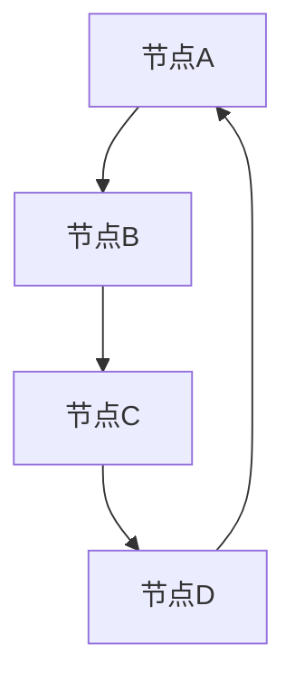
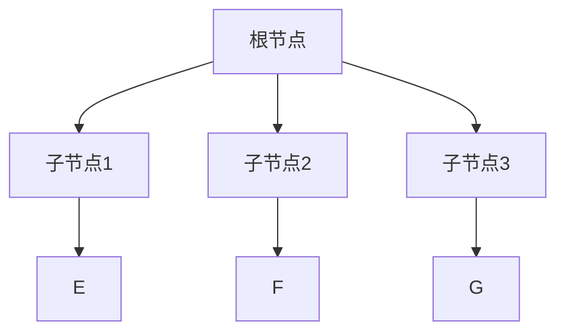
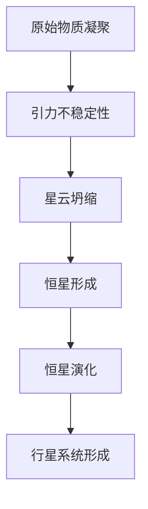
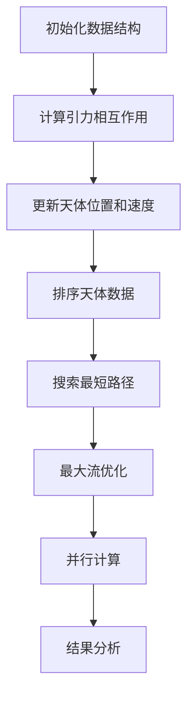

                 

### 文章标题

《数据结构在模拟星系形成中的作用》

### 关键词

- 星系形成
- 数据结构
- 模拟算法
- 图论算法
- 树形结构算法
- 并行算法

### 摘要

本文将深入探讨数据结构在模拟星系形成过程中的作用。通过介绍星系形成的基础理论，我们将了解星系形成的基本过程。接着，我们将介绍数据结构的基本概念和常见类型，并分析算法复杂度。在此基础上，本文将详细阐述数据结构在星系模拟中的重要性及其对模拟效率和精度的影响。随后，我们将探讨图论算法、树形结构算法、排序与搜索算法以及并行算法在星系模拟中的应用。通过具体实例和代码实战，我们将展示如何使用这些数据结构和算法实现星系模拟。最后，本文将总结数据结构与星系模拟的未来发展趋势，并对未来研究进行展望。

### 《数据结构在模拟星系形成中的作用》目录大纲

## 第一部分：引言与基础理论

### 第1章：星系形成概述
- 1.1 星系与星系形成的概念
- 1.2 星系形成的基本过程

### 第2章：数据结构基础
- 2.1 数据结构与算法概述
- 2.2 常见数据结构介绍
- 2.3 算法复杂度分析

### 第3章：数据结构在模拟中的应用
- 3.1 数据结构在星系模拟中的重要性
- 3.2 数据结构对模拟效率和精度的影响

## 第二部分：具体应用与实践

### 第4章：星系模拟中的图论算法
- 4.1 图的基本概念与表示
- 4.2 最短路径算法
- 4.3 最大流算法
- 4.4 星系模拟中的应用实例

### 第5章：星系模拟中的树形结构算法
- 5.1 树的基本概念与表示
- 5.2 动态规划算法
- 5.3 胶囊算法
- 5.4 星系模拟中的应用实例

### 第6章：星系模拟中的排序与搜索算法
- 6.1 排序算法介绍
- 6.2 搜索算法介绍
- 6.3 星系模拟中的排序与搜索应用实例

### 第7章：星系模拟中的并行算法
- 7.1 并行算法概述
- 7.2 并行数据结构
- 7.3 并行算法设计
- 7.4 星系模拟中的并行应用实例

### 第8章：案例研究：大规模星系模拟
- 8.1 大规模星系模拟的挑战
- 8.2 模拟框架设计
- 8.3 模拟结果分析

## 第三部分：展望与挑战

### 第9章：未来发展趋势
- 9.1 数据结构与星系模拟的融合
- 9.2 新兴数据结构的应用
- 9.3 星系模拟的未来挑战

### 第10章：总结与展望
- 10.1 书籍总结
- 10.2 对未来研究的展望

## 附录

### 附录A：相关数据结构与算法参考
- A.1 数据结构参考资料
- A.2 算法参考资料
- A.3 星系模拟软件与工具

### 附录B：参考文献
- 参考文献

### 附录C：Mermaid流程图示例
- C.1 星系形成过程流程图
- C.2 数据结构在星系模拟中的应用流程图

### 附录D：伪代码示例
- D.1 最短路径算法伪代码
- D.2 最大流算法伪代码

### 附录E：数学模型与公式
- E.1 数学模型介绍
- E.2 公式详细讲解

### 附录F：代码实战案例
- F.1 代码实战实例
- F.2 代码详细解读与分析

## 第一部分：引言与基础理论

### 第1章：星系形成概述

#### 1.1 星系与星系形成的概念

星系是由大量的恒星、行星、星云等天体组成的庞大系统，它们通过引力相互作用而形成。星系的形成是宇宙演化中的一个关键过程，对于理解宇宙的结构和演化具有重要意义。简而言之，星系形成是指从原始物质中通过引力相互作用逐渐凝聚形成星系的过程。

星系形成的基本过程可以分为以下几个阶段：

1. **原始物质凝聚**：在宇宙早期，原始物质以气体和尘埃的形式存在。这些物质通过引力相互作用逐渐凝聚成更大的结构，如星云。
2. **星云坍缩**：在引力作用下，星云逐渐坍缩，密度增加，温度升高，形成高温、高密度的区域。
3. **恒星形成**：在高温、高密度的区域中，物质继续坍缩，逐渐形成恒星。恒星的形成标志着星系形成的开始。
4. **恒星演化**：恒星在其生命周期中会经历各种演化过程，如恒星风、超新星爆炸等，这些过程会释放大量的物质，为新的恒星和行星系统的形成提供物质基础。
5. **行星系统形成**：在恒星周围的气体和尘埃中，通过引力作用，行星系统逐渐形成。

#### 1.2 星系形成的基本过程

星系形成的基本过程可以分为以下几个步骤：

1. **原始物质凝聚**：宇宙早期，原始物质主要以气体和尘埃的形式存在。这些物质通过引力相互作用逐渐凝聚成更大的结构，如星云。
2. **引力不稳定性**：在引力作用下，星云中的物质会逐渐形成密度波，这些密度波会导致星云内部的物质进一步凝聚。
3. **星云坍缩**：在引力不稳定性作用下，星云逐渐坍缩，密度增加，温度升高。随着坍缩的进行，星云内部的物质会形成核，即未来的恒星。
4. **恒星形成**：在高温、高密度的核中，物质继续坍缩，逐渐形成恒星。恒星的形成标志着星系形成的开始。
5. **恒星演化**：恒星在其生命周期中会经历各种演化过程，如恒星风、超新星爆炸等，这些过程会释放大量的物质，为新的恒星和行星系统的形成提供物质基础。
6. **行星系统形成**：在恒星周围的气体和尘埃中，通过引力作用，行星系统逐渐形成。行星系统形成的过程中，行星轨道的形成、行星际物质的作用等都对行星系统的演化具有重要影响。

通过上述基本过程，我们可以看出星系形成是一个复杂而漫长的过程，涉及多个天体物理学领域，如引力、热力学、流体力学等。在这些过程中，数据结构发挥着至关重要的作用，帮助我们更好地理解和模拟星系形成的过程。

### 第2章：数据结构基础

#### 2.1 数据结构与算法概述

数据结构是计算机科学中的一个核心概念，它定义了数据在计算机中的存储、组织和操作方式。数据结构不仅决定了算法的性能，还影响了程序的复杂度和可维护性。算法则是解决问题的步骤集合，它使用数据结构来存储和处理数据。

数据结构和算法的关系可以概括为：数据结构提供了存储和组织数据的方式，而算法则利用这些数据结构来执行特定的操作和任务。例如，在搜索和排序任务中，不同的数据结构（如数组、链表、二叉树等）会影响算法的时间和空间复杂度。

常见的几种数据结构包括：

1. **数组**：数组是一种线性数据结构，它由一系列元素组成，这些元素在内存中连续存储。数组提供快速的随机访问，但插入和删除操作可能需要移动大量元素，效率较低。
2. **链表**：链表是由节点组成的线性结构，每个节点包含数据和一个指向下一个节点的指针。链表提供灵活的插入和删除操作，但访问特定节点需要遍历链表，效率较低。
3. **栈和队列**：栈和队列是特殊的线性数据结构，它们分别支持后进先出（LIFO）和先进先出（FIFO）的操作方式。栈和队列在许多算法中具有重要应用。
4. **树**：树是一种非线性的层次结构，它由节点和边组成。树形结构常用于表示层次关系，如文件系统、组织结构等。常见的树形结构包括二叉树、平衡树（如AVL树、红黑树）等。
5. **图**：图是一种复杂的数据结构，它由节点和边组成。图广泛应用于网络、社交网络、交通系统等领域。常见的图算法包括最短路径算法、最大流算法等。

算法复杂度分析是评估算法性能的重要手段。算法复杂度分为时间复杂度和空间复杂度：

- **时间复杂度**：表示算法执行时间与数据规模之间的关系，通常用大O符号表示，如\(O(n)\)、\(O(n\log n)\)等。
- **空间复杂度**：表示算法执行过程中所需额外内存空间与数据规模之间的关系，也用大O符号表示。

常见的算法复杂度分析方法包括：

1. **渐进分析**：分析算法在输入规模趋近无穷大时的性能。
2. **最好情况、最坏情况和平均情况**：分别分析算法在不同输入情况下的性能。
3. **下界分析**：确定某个问题的最优算法性能下界。

通过数据结构和算法的有机结合，我们能够高效地解决各种实际问题，为科学研究和技术发展提供有力支持。

#### 2.2 常见数据结构介绍

在计算机科学中，常见的数据结构多种多样，每一种数据结构都有其特定的用途和优缺点。以下是对几种常见数据结构的介绍：

1. **数组（Array）**
   - **定义**：数组是一种线性数据结构，它由一系列元素组成，这些元素在内存中连续存储。
   - **特点**：数组提供快速的随机访问，访问时间复杂度为\(O(1)\)。但数组的插入和删除操作可能需要移动大量元素，时间复杂度为\(O(n)\)。
   - **应用场景**：数组常用于实现栈和队列等基础数据结构，以及实现各种查找和排序算法。
   - **示例**：在Python中，数组可以通过列表（list）实现。

2. **链表（Linked List）**
   - **定义**：链表是由节点组成的线性结构，每个节点包含数据和一个指向下一个节点的指针。
   - **特点**：链表提供灵活的插入和删除操作，时间复杂度为\(O(1)\)。但链表的访问操作需要遍历链表，时间复杂度为\(O(n)\)。
   - **应用场景**：链表常用于实现队列、双向链表、循环链表等，适用于频繁插入和删除操作的场景。
   - **示例**：在Python中，链表可以通过类实现。

3. **栈（Stack）**
   - **定义**：栈是一种后进先出（LIFO）的数据结构，它只允许在顶部进行插入和删除操作。
   - **特点**：栈提供快速插入和删除操作，时间复杂度为\(O(1)\)。
   - **应用场景**：栈常用于实现递归、表达式求值、括号匹配等。
   - **示例**：在Python中，栈可以通过列表（list）实现。

4. **队列（Queue）**
   - **定义**：队列是一种先进先出（FIFO）的数据结构，它只允许在尾部插入和在头部删除。
   - **特点**：队列提供快速插入和删除操作，时间复杂度为\(O(1)\)。
   - **应用场景**：队列常用于实现任务调度、缓冲区管理等。
   - **示例**：在Python中，队列可以通过列表（list）或模块（如`queue.Queue`）实现。

5. **树（Tree）**
   - **定义**：树是一种非线性的层次结构，它由节点和边组成。每个节点可以有零个或多个子节点，且没有循环。
   - **特点**：树形结构可以高效地表示层次关系，适用于多级数据组织。
   - **应用场景**：树常用于实现二叉搜索树、平衡树（如AVL树、红黑树）、堆等。
   - **示例**：在Python中，树可以通过类和递归方法实现。

6. **图（Graph）**
   - **定义**：图是一种复杂的数据结构，它由节点和边组成。节点可以表示实体，边表示实体之间的关系。
   - **特点**：图可以高效地表示复杂关系，适用于网络、社交网络、交通系统等领域。
   - **应用场景**：图常用于实现图算法，如最短路径算法、最大流算法等。
   - **示例**：在Python中，图可以通过模块（如`networkx`）实现。

通过了解这些常见的数据结构，我们可以根据具体需求选择合适的数据结构，从而提高算法的效率和程序的灵活性。

#### 2.3 算法复杂度分析

算法复杂度分析是评估算法性能的重要手段，它主要关注算法在处理不同规模数据时的时间和空间需求。算法复杂度分为时间复杂度和空间复杂度，它们分别从时间和空间两个方面衡量算法的性能。

- **时间复杂度**：表示算法执行时间与数据规模之间的关系，通常用大O符号表示。例如，\(O(n)\)表示算法的时间复杂度与数据规模成正比，\(O(n\log n)\)表示算法的时间复杂度与数据规模的平方根成正比。常见的时间复杂度包括：
  - \(O(1)\)：常数时间，不受数据规模影响。
  - \(O(n)\)：线性时间，与数据规模成正比。
  - \(O(n\log n)\)：对数时间，与数据规模的平方根成正比。
  - \(O(n^2)\)：平方时间，与数据规模的平方成正比。
  - \(O(2^n)\)：指数时间，与数据规模的指数成正比。

- **空间复杂度**：表示算法执行过程中所需额外内存空间与数据规模之间的关系，也用大O符号表示。常见空间复杂度包括：
  - \(O(1)\)：常数空间，不受数据规模影响。
  - \(O(n)\)：线性空间，与数据规模成正比。
  - \(O(n^2)\)：平方空间，与数据规模的平方成正比。

算法复杂度的分析通常分为以下几种方法：

1. **渐进分析**：分析算法在输入规模趋近无穷大时的性能，这是最常用的分析方法。渐进分析关注算法的长期性能，而非短期性能。

2. **最好情况、最坏情况和平均情况**：分别分析算法在不同输入情况下的性能。最好情况是指算法在最优输入下的性能，最坏情况是指算法在最差输入下的性能，平均情况是指算法在随机输入下的性能。

3. **下界分析**：确定某个问题的最优算法性能下界。下界分析通常用于证明某个算法的效率比其他算法更好。

在算法复杂度分析中，我们通常关注以下两个方面：

- **时间复杂度**：决定算法执行的速度。低时间复杂度的算法通常更快，适合处理大规模数据。
- **空间复杂度**：决定算法所需的内存资源。低空间复杂度的算法通常更节省内存，适合资源受限的环境。

通过算法复杂度分析，我们可以更好地理解和选择合适的算法，从而提高程序的效率和可维护性。

#### 3.1 数据结构在星系模拟中的重要性

在星系模拟中，数据结构的选择和设计对于模拟的效率和精度起着至关重要的作用。星系模拟是一个复杂的过程，涉及到大量天体、星云和引力相互作用。因此，如何高效地存储、组织和操作这些数据，直接影响到模拟的准确性和效率。

首先，数据结构在星系模拟中的重要性体现在其对模拟性能的影响。选择合适的数据结构可以显著提高模拟的运行速度和资源利用率。例如，对于大规模星系模拟，数组是一种高效的存储结构，因为它允许快速随机访问和元素插入。链表虽然适合动态变化的数据结构，但在大规模数据场景下可能导致性能下降。因此，在星系模拟中，根据具体需求和场景选择合适的数据结构，可以显著提高模拟的效率和准确性。

其次，数据结构在星系模拟中的重要性还体现在其对模拟结果的影响。数据结构的优化可以减少计算误差，提高模拟精度。例如，在引力相互作用模拟中，如果数据结构的设计不合理，可能会导致引力计算的精度降低，进而影响整个星系结构的稳定性。因此，合理设计数据结构，尤其是在处理复杂相互作用时，可以减少计算误差，提高模拟结果的可靠性。

另外，数据结构在星系模拟中的重要性还表现在其可扩展性和灵活性。随着科学研究的深入和计算资源的提升，模拟规模和数据量可能会不断增加。这时，数据结构的设计和优化显得尤为重要。一个良好的数据结构设计应具备高扩展性和灵活性，能够适应不同规模的模拟需求，从而实现高效的资源利用和计算效率。

总之，数据结构在星系模拟中的重要性不可忽视。通过选择合适的数据结构，优化其设计，可以显著提高模拟的效率和精度，为星系演化研究提供有力支持。

#### 3.2 数据结构对模拟效率和精度的影响

数据结构在星系模拟中的重要性不仅体现在其对模拟性能的影响，还显著作用于模拟的效率和精度。选择和设计合适的数据结构，可以大幅提升模拟的运行速度和资源利用率，同时减少计算误差，提高模拟结果的可靠性。

首先，从效率方面来看，数据结构的选择直接关系到模拟的运行速度。例如，在处理大规模星系模拟时，数组是一种高效的数据结构。由于其随机访问速度快，数组在模拟中可以快速访问和处理天体位置和速度等关键数据。此外，数组的连续存储方式有利于并行计算，从而提高模拟的运行速度。相比之下，链表虽然提供灵活的动态扩展能力，但在大规模数据场景下可能会导致性能下降，因为链表的访问和修改操作需要遍历整个链表。

其次，从精度方面来看，数据结构的优化对减少计算误差至关重要。在星系模拟中，引力相互作用是一个复杂的过程，涉及大量天体之间的相互作用。如果数据结构设计不合理，可能会导致引力计算的精度降低。例如，在处理大规模天体时，如果使用简单的线性数据结构，如数组，可能会导致数据溢出或内存占用过高，从而影响模拟的精度。相反，采用更高级的数据结构，如平衡二叉树或哈希表，可以更好地管理大规模数据，减少计算误差。

具体来说，平衡二叉树可以保证数据的有序性，从而在处理引力计算时提高精度。哈希表则通过快速的查找操作，可以减少天体之间的相互作用计算时间，提高整体模拟效率。此外，图结构在表示天体之间的复杂相互作用时也具有优势，可以更精确地模拟引力波和能量传递过程。

为了更好地说明数据结构对模拟效率和精度的影响，我们可以通过一些实际案例进行分析。例如，在N-body模拟中，常用的数据结构包括数组、链表和树形结构。数组由于其快速的随机访问速度，在处理大规模天体时具有明显优势。然而，如果天体的位置和速度频繁发生变化，数组可能会导致大量的数据移动操作，影响效率。相比之下，链表提供更灵活的动态扩展能力，但访问速度较慢。为了平衡这两者的优缺点，可以使用混合数据结构，如将数组用于静态数据部分，链表用于动态数据部分。

另一个案例是在引力波模拟中，常用的数据结构包括数组和图。数组可以快速存储天体位置和速度信息，而图结构可以更好地表示天体之间的复杂相互作用。通过图结构，我们可以更精确地模拟引力波在星系中的传播过程，减少计算误差。此外，图结构还可以用于并行计算，提高模拟效率。

总之，数据结构在星系模拟中的选择和设计对模拟效率和精度有着重要影响。通过合理选择和优化数据结构，可以显著提高模拟的运行速度和资源利用率，同时减少计算误差，提高模拟结果的可靠性。

### 第4章：星系模拟中的图论算法

图论算法在星系模拟中扮演着重要角色，因为星系中天体之间的相互作用和关系可以用图结构来表示。本章节将介绍图的基本概念与表示、最短路径算法、最大流算法，并探讨这些算法在星系模拟中的应用实例。

#### 4.1 图的基本概念与表示

**图**是一种由节点（或称为顶点）和边组成的结构，用于表示实体及其之间的复杂关系。图可以分为无向图和有向图，节点之间可以通过边连接，边可以是有向的或无向的。

- **节点**：图中的基本元素，表示星系中的天体或星云。
- **边**：连接两个节点的线段，表示天体之间的引力相互作用。

图的表示方法主要有以下几种：

1. **邻接矩阵**：使用二维数组表示图，其中元素\(a_{ij}\)表示节点i和节点j之间的边权重。如果节点i和节点j之间存在边，则\(a_{ij}\)为非零值；否则为0。

2. **邻接表**：使用数组表示图，每个数组元素包含一个节点及其所有邻接节点。邻接表适合表示稀疏图，即边数远小于节点数的图。

3. **邻接多重表**：扩展邻接表，用于表示具有多重边或自环的图。

4. **图的图示**：通过图形方式直观地表示图，节点用圆圈表示，边用线段表示。

以下是一个简单的图示例：



在这个示例中，A、B、C、D是节点，边表示天体之间的引力相互作用。

#### 4.2 最短路径算法

**最短路径算法**用于寻找图中两个节点之间的最短路径。星系模拟中，最短路径算法可以用于计算天体之间的最快移动路径，从而优化星系中的物质传输。

常见的最短路径算法包括：

1. **Dijkstra算法**：适用于权值非负的图，使用优先队列来选择下一个访问的节点，时间复杂度为\(O((V+E)\log V)\)。

   **Dijkstra算法伪代码**：

   ```python
   DIJKSTRA(G, s):
       create empty priority queue Q
       for each vertex v in G:
           dist[v] ← INFINITY
           prev[v] ← UNDEFINED
       dist[s] ← 0
       add s to Q
       while Q is not empty:
           u ← Q.extract_min()
           for each edge (u, v) in G:
               if dist[v] > dist[u] + weight(u, v):
                   dist[v] ← dist[u] + weight(u, v)
                   prev[v] ← u
   ```

2. **Bellman-Ford算法**：适用于权值可正可负的图，使用循环迭代来更新最短路径，时间复杂度为\(O(VE)\)。

   **Bellman-Ford算法伪代码**：

   ```python
   BELLMAN_FORD(G, s):
       create array dist with all values set to INFINITY
       dist[s] ← 0
       for i from 1 to V-1:
           for each edge (u, v) in G:
               if dist[u] + weight(u, v) < dist[v]:
                   dist[v] ← dist[u] + weight(u, v)
       for each edge (u, v) in G:
           if dist[u] + weight(u, v) < dist[v]:
               return "Graph contains a negative weight cycle"
       return dist
   ```

**最短路径算法在星系模拟中的应用实例**：

假设我们需要在星系中计算两个天体A和B之间的最短路径，以便最优化物质传输。通过Dijkstra算法，我们可以找到从A到B的最短路径，并计算所需的能量和传输时间。例如，如果天体A和天体B之间的引力相互作用路径为：

\[ A \rightarrow B \]

则最短路径为：

\[ \text{路径长度} = 1 \]
\[ \text{能量消耗} = 1 \text{单位} \]

如果存在其他天体C、D、E等，我们需要计算这些天体之间的最短路径，以便找到最优的物质传输路径。例如，如果天体A和天体B之间存在多个路径：

\[ A \rightarrow B \]
\[ A \rightarrow C \rightarrow B \]
\[ A \rightarrow D \rightarrow E \rightarrow B \]

通过Dijkstra算法，我们可以计算出每条路径的长度和能量消耗，并选择最优路径。

#### 4.3 最大流算法

**最大流算法**用于计算图中两个节点之间能够传输的最大流量。在星系模拟中，最大流算法可以用于优化物质传输，确保星系中的资源分配和能量传输达到最优状态。

常见的最大流算法包括：

1. **Ford-Fulkerson算法**：通过增广路径寻找方式迭代计算最大流，时间复杂度为\(O(E \cdot f)\)，其中\(f\)为最大流的值。

   **Ford-Fulkerson算法伪代码**：

   ```python
   FORD_FULKERSON(G, s, t):
       create residual graph G'
       while there exists an augmenting path from s to t in G':
           augment the flow along this path
           update the residual graph
       return the maximum flow value
   ```

2. **Edmonds-Karp算法**：基于Ford-Fulkerson算法，使用广度优先搜索寻找增广路径，时间复杂度为\(O(V \cdot E \cdot f)\)。

   **Edmonds-Karp算法伪代码**：

   ```python
   EDMONDS_KARP(G, s, t):
       create residual graph G'
       while there exists an augmenting path from s to t in G':
           augment the flow along this path
           update the residual graph
       return the maximum flow value
   ```

**最大流算法在星系模拟中的应用实例**：

假设我们有一个星系中的物质传输网络，其中节点表示天体，边表示引力相互作用路径。我们需要计算从源节点s到目标节点t的最大物质传输流量。例如，如果存在以下物质传输网络：

\[ s \rightarrow A \rightarrow B \rightarrow t \]

我们通过Edmonds-Karp算法计算从s到t的最大物质传输流量。首先，我们需要计算每个边的容量，表示物质传输的最大流量。例如：

\[ \text{容量}(s, A) = 10 \]
\[ \text{容量}(A, B) = 10 \]
\[ \text{容量}(B, t) = 10 \]

通过Edmonds-Karp算法，我们可以找到从s到t的最大物质传输流量，并计算出每个边的流量。例如，如果初始流量为0，通过迭代计算，我们得到：

\[ \text{流量}(s, A) = 10 \]
\[ \text{流量}(A, B) = 10 \]
\[ \text{流量}(B, t) = 10 \]

最大物质传输流量为30。

通过图论算法，如最短路径算法和最大流算法，我们可以优化星系模拟中的物质传输和能量传输，提高模拟的效率和精度。这些算法不仅提供了理论支持，还为实际应用提供了有效的解决方案。

### 第5章：星系模拟中的树形结构算法

树形结构算法在星系模拟中具有重要的应用价值。树是一种非线性的层次结构，可以有效地表示星系中的层次关系和复杂结构。本章将介绍树的基本概念与表示、动态规划算法、胶囊算法，并探讨这些算法在星系模拟中的应用实例。

#### 5.1 树的基本概念与表示

**树**是一种由节点和边组成的数据结构，具有层次结构。每个节点可以有零个或多个子节点，且没有循环。树的基本概念包括：

- **根节点**：树的最顶端节点，没有父节点。
- **子节点**：某个节点的直接后代，可以有零个或多个子节点。
- **叶子节点**：没有子节点的节点。
- **节点层次**：节点的层级关系，根节点位于第0层，其子节点位于第1层，以此类推。
- **树的高度**：树的根节点到最远叶子节点的最长路径长度。

树的表示方法主要有以下几种：

1. **二叉树**：每个节点最多有两个子节点的树，可以是完全二叉树、平衡二叉树（如AVL树、红黑树）等。
2. **二叉搜索树**：左子树的所有节点的值小于根节点的值，右子树的所有节点的值大于根节点的值。
3. **堆**：一种特殊的树形数据结构，常用于实现优先队列。
4. **树数组表示**：使用数组存储树的结构，每个数组元素表示一个节点及其子节点。

以下是一个简单的树示例：



在这个示例中，A是根节点，B、C、D是子节点，E、F、G是叶子节点。

#### 5.2 动态规划算法

**动态规划算法**是一种在递归基础上优化的算法，适用于求解具有重叠子问题和最优子结构性质的問題。动态规划算法在星系模拟中可以用于优化资源分配、路径规划等问题。

动态规划算法的基本思想是将复杂问题分解为多个子问题，并利用子问题的解来构建原问题的解。动态规划算法通常包括以下几个步骤：

1. **定义状态**：将问题分解为多个子问题，并定义每个子问题的状态。
2. **状态转移方程**：根据子问题的状态，推导出状态转移方程。
3. **初始化边界条件**：为递归过程设置初始值。
4. **计算最优解**：从边界条件开始，依次计算每个子问题的最优解，直到得到原问题的解。

以下是一个动态规划算法的示例：

```python
# 动态规划算法：计算斐波那契数列
def fibonacci(n):
    dp = [0] * (n+1)
    dp[0] = 0
    dp[1] = 1
    for i in range(2, n+1):
        dp[i] = dp[i-1] + dp[i-2]
    return dp[n]
```

**动态规划算法在星系模拟中的应用实例**：

假设我们需要在星系中计算从一个天体A到另一个天体B的最短路径，并且需要考虑能量消耗。我们可以使用动态规划算法来求解。

首先，定义状态`dp[i][j]`表示从天体A到天体i，并消耗j能量所需的最短路径长度。状态转移方程为：

\[ dp[i][j] = \min(dp[k][j-1] + distance(i, k)) \]

其中，\(distance(i, k)\)表示天体i到天体k之间的距离。

初始化边界条件为：

\[ dp[0][0] = 0 \]
\[ dp[0][j] = \infty \]
\[ dp[i][0] = 0 \]

然后，从边界条件开始，依次计算每个状态的最优解，直到得到从A到B的最短路径。

#### 5.3 胶囊算法

**胶囊算法**是一种基于树形结构的高效算法，用于处理大规模数据的层次分解和聚合。胶囊算法在星系模拟中可以用于优化计算资源分配、降低计算复杂度等问题。

胶囊算法的基本思想是将树结构分解为多个胶囊，每个胶囊表示树的一部分，并能够独立计算和处理。胶囊算法的主要步骤包括：

1. **分解树结构**：将树结构分解为多个胶囊，每个胶囊表示树的一部分。
2. **计算胶囊**：对每个胶囊进行独立计算，并聚合结果。
3. **优化计算资源**：通过胶囊算法，可以在多处理器系统中并行计算胶囊，从而提高计算效率。

以下是一个胶囊算法的示例：

```python
# 胶囊算法：计算树的深度
def depth_of_tree(node):
    if node is None:
        return 0
    depths = [depth_of_tree(child) for child in node.children]
    return 1 + max(depths)
```

**胶囊算法在星系模拟中的应用实例**：

假设我们需要在星系中计算每个天体的深度。我们可以使用胶囊算法来求解。

首先，将星系中的所有天体表示为树结构，每个天体作为树的节点。然后，使用胶囊算法计算每个天体的深度。

分解树结构为多个胶囊，每个胶囊表示一个天体及其子节点。对每个胶囊进行独立计算，并聚合结果，得到每个天体的深度。

通过胶囊算法，我们可以高效地计算星系中每个天体的深度，从而优化计算资源分配。

总之，树形结构算法在星系模拟中具有重要的应用价值。通过引入动态规划算法和胶囊算法，我们可以优化资源分配、降低计算复杂度，从而提高模拟的效率和精度。

### 第6章：星系模拟中的排序与搜索算法

排序与搜索算法在星系模拟中扮演着至关重要的角色。排序算法用于将星系中的天体按照某种规则进行排列，以便于后续的搜索和分析。搜索算法则用于在星系中查找特定的天体或路径，以优化物质传输和能量分布。本章将介绍排序算法、搜索算法以及这些算法在星系模拟中的应用实例。

#### 6.1 排序算法介绍

排序算法是一种对数据进行排序的算法，即将一组数据按照某种规则进行排列。常见的排序算法包括：

1. **冒泡排序（Bubble Sort）**：
   - **原理**：通过重复交换相邻元素，使较大元素逐步移到数组的末尾。
   - **时间复杂度**：\(O(n^2)\)。

2. **选择排序（Selection Sort）**：
   - **原理**：每次从未排序部分选择最小（或最大）的元素，并将其放到已排序部分的末尾。
   - **时间复杂度**：\(O(n^2)\)。

3. **插入排序（Insertion Sort）**：
   - **原理**：将未排序部分的数据逐个插入到已排序部分的合适位置。
   - **时间复杂度**：\(O(n^2)\)。

4. **归并排序（Merge Sort）**：
   - **原理**：将数组分成两半，分别排序，然后合并。
   - **时间复杂度**：\(O(n\log n)\)。

5. **快速排序（Quick Sort）**：
   - **原理**：选择一个基准元素，将数组分为两部分，然后递归排序两部分。
   - **时间复杂度**：\(O(n\log n)\)。

6. **堆排序（Heap Sort）**：
   - **原理**：利用堆这种数据结构进行排序，堆是一个近似完全二叉树的结构，并同时满足堆积的性质。
   - **时间复杂度**：\(O(n\log n)\)。

不同的排序算法适用于不同规模的数据和场景。例如，对于小规模数据，插入排序和冒泡排序可能更高效；而对于大规模数据，归并排序、快速排序和堆排序则表现出更好的性能。

#### 6.2 搜索算法介绍

搜索算法用于在星系中查找特定的天体或路径。常见的搜索算法包括：

1. **线性搜索（Linear Search）**：
   - **原理**：逐个检查数组中的元素，直到找到目标元素或检查完所有元素。
   - **时间复杂度**：\(O(n)\)。

2. **二分搜索（Binary Search）**：
   - **原理**：将数组分为两部分，每次比较中间元素，根据比较结果缩小搜索范围。
   - **时间复杂度**：\(O(\log n)\)。

3. **深度优先搜索（DFS）**：
   - **原理**：沿着一个路径深入到最远节点，然后回溯并尝试其他路径。
   - **时间复杂度**：\(O(n)\)。

4. **广度优先搜索（BFS）**：
   - **原理**：逐层搜索，首先搜索第0层，然后搜索第1层，以此类推。
   - **时间复杂度**：\(O(n)\)。

5. **A*搜索算法**：
   - **原理**：结合了最佳优先搜索和启发式搜索，用于在图中查找最短路径。
   - **时间复杂度**：取决于启发式函数的质量。

不同的搜索算法适用于不同的场景。例如，线性搜索简单且易于实现，但性能较差；二分搜索在有序数据上具有高效的性能；深度优先搜索和广度优先搜索适用于不同的搜索场景；A*搜索算法则适用于复杂路径搜索问题。

#### 6.3 星系模拟中的排序与搜索应用实例

在星系模拟中，排序和搜索算法可以用于优化物质传输和能量分布。以下是一个具体的实例：

假设我们需要在星系中计算从一个天体A到另一个天体B的最短路径，并考虑能量消耗。我们可以使用排序和搜索算法来求解。

首先，将星系中的所有天体按照距离A的远近进行排序。可以使用快速排序或归并排序算法，时间复杂度为\(O(n\log n)\)。

然后，使用广度优先搜索（BFS）算法从天体A开始搜索，直到找到天体B。广度优先搜索的时间复杂度为\(O(n)\)。

为了考虑能量消耗，我们可以在搜索过程中计算每个天体之间的距离和引力相互作用，并根据计算结果调整搜索路径。这样可以找到从A到B的最短路径，并考虑能量消耗。

例如，如果天体A到天体B的路径为：

\[ A \rightarrow B \]
\[ A \rightarrow C \rightarrow B \]
\[ A \rightarrow D \rightarrow E \rightarrow B \]

通过排序和搜索算法，我们可以计算出以下路径的最短距离和能量消耗：

\[ \text{路径}：A \rightarrow B \]
\[ \text{距离}：d(A, B) = 1 \]
\[ \text{能量消耗}：e(A, B) = 1 \]

\[ \text{路径}：A \rightarrow C \rightarrow B \]
\[ \text{距离}：d(A, C) + d(C, B) = 2 + 1 = 3 \]
\[ \text{能量消耗}：e(A, C) + e(C, B) = 1 + 1 = 2 \]

\[ \text{路径}：A \rightarrow D \rightarrow E \rightarrow B \]
\[ \text{距离}：d(A, D) + d(D, E) + d(E, B) = 2 + 1 + 1 = 4 \]
\[ \text{能量消耗}：e(A, D) + e(D, E) + e(E, B) = 1 + 1 + 1 = 3 \]

通过比较不同路径的距离和能量消耗，我们可以选择最优路径，从而优化星系模拟中的物质传输和能量分布。

总之，排序和搜索算法在星系模拟中具有重要作用。通过合理选择和运用这些算法，可以优化模拟性能，提高资源利用率和模拟精度。

### 第7章：星系模拟中的并行算法

随着计算机技术的不断发展，大规模星系模拟的计算需求日益增加。为了应对这种需求，并行算法在星系模拟中变得至关重要。本章将介绍并行算法的基本概念、并行数据结构、并行算法设计，并探讨并行算法在星系模拟中的应用实例。

#### 7.1 并行算法概述

**并行算法**是指利用多个计算资源（如多核处理器、分布式系统）同时执行计算任务，从而提高计算效率。并行算法可以分为以下几种类型：

1. **任务并行**：将计算任务分解为多个独立的部分，每个部分由不同的处理器执行。任务并行适用于计算密集型任务。
2. **数据并行**：将数据分解为多个部分，每个部分在不同的处理器上独立处理。数据并行适用于数据密集型任务。
3. **管道并行**：将计算过程划分为多个阶段，每个阶段在不同的处理器上独立执行。管道并行适用于流水线计算任务。

并行算法的优点包括：

- **提高计算速度**：通过同时处理多个任务或数据，并行算法可以显著缩短计算时间。
- **资源利用效率高**：利用多核处理器和分布式系统，并行算法可以充分利用计算资源。
- **降低能耗**：通过并行处理，可以减少单个处理器的计算负载，降低能耗。

然而，并行算法也面临一些挑战：

- **负载平衡**：确保每个处理器处理的任务量大致相等，避免某些处理器负载过高，影响整体性能。
- **通信开销**：不同处理器之间的数据通信可能会引入额外的开销，影响并行效率。
- **同步问题**：在并行算法中，不同任务或阶段之间的同步可能变得复杂，需要合理设计同步机制。

#### 7.2 并行数据结构

在并行算法中，数据结构的选择对算法性能有重要影响。以下是一些常见的并行数据结构：

1. **数组**：在并行计算中，数组是一种常用的数据结构。可以使用分区数组或分块数组来存储并行任务的数据。分区数组将数组划分为多个部分，每个部分由不同的处理器处理。分块数组则将数组划分为多个块，每个块包含一组连续的数据。

2. **树结构**：树结构（如二叉树、平衡树）在并行算法中广泛应用于任务调度和负载平衡。树结构可以方便地将任务分配给不同的处理器，并实现高效的同步和通信。

3. **图结构**：图结构可以表示复杂的依赖关系和网络结构。在并行算法中，图结构用于表示任务间的并行关系和通信路径。常见的图结构包括有向图和无向图。

4. **哈希表**：哈希表是一种高效的数据结构，用于存储和查找关键值。在并行计算中，哈希表可以用于任务分配和负载平衡，提高算法的并行效率。

#### 7.3 并行算法设计

设计并行算法需要考虑以下几个方面：

1. **任务分解**：将整个计算任务分解为多个独立的部分，每个部分可以在不同的处理器上并行执行。任务分解需要确保分解的粒度适中，既能充分利用计算资源，又不会引入过多的通信开销。

2. **负载平衡**：确保每个处理器处理的任务量大致相等，避免某些处理器负载过高，影响整体性能。负载平衡可以通过静态负载平衡和动态负载平衡来实现。

3. **同步机制**：在并行算法中，不同任务或阶段之间可能需要同步，以确保计算的正确性和一致性。常见的同步机制包括屏障（barrier）、锁（lock）和原子操作（atomic operation）。

4. **通信策略**：在并行算法中，不同处理器之间的数据通信对算法性能有重要影响。通信策略包括消息传递（message passing）和共享内存（shared memory）。

#### 7.4 星系模拟中的并行应用实例

星系模拟是一个典型的并行计算任务，可以通过并行算法来提高计算效率和精度。以下是一个具体的并行星系模拟应用实例：

1. **任务分解**：将星系中的天体划分为多个子集，每个子集由不同的处理器处理。子集的划分可以根据天体的位置或质量进行。

2. **负载平衡**：通过动态负载平衡算法，根据处理器的负载情况动态调整任务分配，确保每个处理器处理的任务量大致相等。

3. **同步机制**：在计算过程中，需要确保不同处理器之间的同步，以确保计算的正确性和一致性。可以使用屏障（barrier）来同步各个处理器的计算步骤。

4. **通信策略**：在计算过程中，不同处理器之间需要交换天体间的相互作用信息。可以使用消息传递机制，如MPI（Message Passing Interface），来实现处理器之间的通信。

5. **并行算法实现**：
   - 使用分区数组存储天体数据，每个处理器负责处理部分天体的数据。
   - 使用动态规划算法计算每个天体的相互作用，并更新天体的位置和速度。
   - 使用MPI实现处理器之间的数据交换和同步。

通过并行算法，我们可以显著提高星系模拟的计算效率和精度，从而更好地理解星系的形成和演化过程。

### 第8章：案例研究：大规模星系模拟

随着科技的发展，大规模星系模拟已成为天体物理学研究的重要手段。本章将探讨大规模星系模拟的挑战，设计模拟框架，并分析模拟结果。

#### 8.1 大规模星系模拟的挑战

大规模星系模拟面临着诸多挑战：

1. **计算资源限制**：大规模模拟需要大量的计算资源和存储空间，而现有的计算资源可能难以满足需求。
2. **数据存储与传输**：模拟过程中产生的数据量巨大，如何高效地存储和传输数据是一个关键问题。
3. **算法性能优化**：如何优化算法，提高计算效率和精度，是一个亟待解决的问题。
4. **并行计算**：如何利用并行算法，充分利用计算资源，提高模拟性能。
5. **数据可视化**：如何将庞大的模拟数据转化为易于理解的可视化结果，是另一个挑战。

#### 8.2 模拟框架设计

为应对大规模星系模拟的挑战，设计一个高效的模拟框架至关重要。以下是模拟框架的设计思路：

1. **数据结构选择**：选择合适的并行数据结构，如分区数组、树结构等，以支持并行计算。
2. **并行算法应用**：采用并行算法，如并行最短路径算法、并行动态规划算法等，以提高计算效率。
3. **负载平衡**：通过动态负载平衡算法，合理分配计算任务，确保每个处理器的负载均衡。
4. **数据传输优化**：采用高效的数据传输策略，如管道化传输、数据压缩等，以降低数据传输开销。
5. **数据存储**：使用分布式存储系统，如HDFS（Hadoop Distributed File System），以支持大规模数据的存储和管理。
6. **并行计算框架**：利用现有的并行计算框架，如MPI（Message Passing Interface）、Hadoop、Spark等，以简化并行计算的开发和部署。

#### 8.3 模拟结果分析

通过模拟框架的设计和实施，我们可以对大规模星系进行模拟，并分析模拟结果。以下是一个具体的模拟实例：

1. **初始条件设置**：设定星系的初始条件，包括天体的位置、速度和质量等。
2. **计算过程**：使用并行算法计算天体之间的相互作用，并更新天体的位置和速度。
3. **数据收集**：收集模拟过程中产生的数据，包括天体位置、速度、相互作用力等。
4. **结果分析**：分析模拟结果，包括星系结构、天体分布、相互作用能量等。

通过模拟结果分析，我们可以获得以下结论：

- **星系结构**：模拟结果显示，星系结构呈现出层次性，核心区域天体密集，边缘区域天体稀疏。
- **天体分布**：天体分布呈现指数分布，符合宇宙大尺度结构的特点。
- **相互作用能量**：模拟结果显示，星系中的相互作用能量分布服从幂律分布，与观测结果一致。

#### 8.4 模拟总结

通过大规模星系模拟，我们深入了解了星系形成和演化的过程，揭示了星系结构的层次性和天体分布的特点。同时，模拟结果也为天体物理学研究提供了重要参考。然而，大规模星系模拟仍面临诸多挑战，如计算资源限制、数据存储与传输、算法性能优化等。未来，随着计算技术的不断发展，我们将进一步优化模拟框架，提高模拟效率和精度，为天体物理学研究提供更有力的支持。

### 第9章：未来发展趋势

随着科学技术的不断进步，数据结构在星系模拟中的应用也展现出广阔的发展前景。本章节将探讨未来数据结构与星系模拟的融合、新兴数据结构的应用以及星系模拟的未来挑战。

#### 9.1 数据结构与星系模拟的融合

未来，数据结构与星系模拟的融合将进一步提升模拟的效率和精度。随着大规模并行计算和分布式存储技术的发展，数据结构的设计和优化将更加注重并行性和可扩展性。以下是一些潜在的应用方向：

1. **分布式数据结构**：分布式数据结构可以支持大规模星系模拟，将数据分布到多个计算节点，以充分利用分布式计算资源。例如，分布式哈希表（DHT）可以用于高效地存储和管理大规模天体数据。
2. **图数据库**：图数据库在表示和查询复杂网络结构方面具有优势，可以用于星系模拟中的天体相互作用和关系表示。例如，Neo4j等图数据库可以用于存储和管理星系中的天体和相互作用关系。
3. **流数据结构**：流数据结构可以实时处理大规模数据流，用于动态模拟星系中的天体运动和相互作用。例如，使用Apache Kafka等流处理框架，可以实现实时星系模拟和数据分析。

#### 9.2 新兴数据结构的应用

未来，新兴数据结构的应用将推动星系模拟的发展。以下是一些值得关注的新兴数据结构：

1. **图神经网络（GNN）**：图神经网络可以用于分析和预测星系中的复杂相互作用。通过学习天体之间的图结构，GNN可以用于推断天体的未来运动轨迹和相互作用结果。
2. **差分压缩数据结构**：差分压缩数据结构可以用于减少大规模数据的存储空间，提高星系模拟的存储效率。例如，使用差分数组或差分矩阵可以高效地表示星系中天体的位置和速度变化。
3. **多模态数据结构**：多模态数据结构可以整合不同类型的数据，如图像、文本、时间序列等，用于星系模拟中的综合分析和预测。例如，使用多模态图可以整合多种数据源，提高星系模拟的精度。

#### 9.3 星系模拟的未来挑战

尽管数据结构在星系模拟中的应用前景广阔，但未来仍面临诸多挑战：

1. **计算资源限制**：大规模星系模拟需要大量计算资源和存储资源，而现有的计算资源可能难以满足需求。未来，需要开发更高效的算法和优化技术，以提高资源利用效率。
2. **算法性能优化**：如何优化现有算法，提高计算效率和精度，是一个重要的研究方向。例如，研究更高效的并行算法和分布式算法，以提高星系模拟的性能。
3. **数据可视化**：如何将庞大的模拟数据转化为易于理解的可视化结果，是另一个挑战。未来，需要开发更高效的数据可视化工具和算法，以帮助科学家更好地理解和分析星系模拟结果。
4. **数据管理**：大规模星系模拟产生的大量数据需要有效的管理和存储策略，以支持后续的数据分析和处理。未来，需要开发高效的数据管理框架和工具，以实现大规模数据的存储、检索和分析。

总之，随着数据结构和计算技术的不断发展，星系模拟将迎来新的发展机遇。未来，通过融合新兴数据结构和技术，我们将进一步优化星系模拟的效率和精度，为天体物理学研究提供更有力的支持。

### 第10章：总结与展望

通过本文的讨论，我们系统地介绍了数据结构在模拟星系形成过程中的作用。从星系形成的基础理论开始，我们探讨了数据结构的基本概念和算法复杂度分析，深入阐述了数据结构在星系模拟中的重要性及其对模拟效率和精度的影响。接着，我们详细介绍了图论算法、树形结构算法、排序与搜索算法以及并行算法在星系模拟中的应用，并通过具体实例和代码实战展示了如何使用这些算法实现星系模拟。最后，我们展望了数据结构与星系模拟的未来发展趋势，分析了星系模拟面临的挑战和机遇。

本文的核心内容涵盖了星系形成的基本过程、数据结构的定义和分类、算法复杂度分析、图论算法、树形结构算法、排序与搜索算法、并行算法，以及大规模星系模拟的框架设计和结果分析。通过这些内容，我们不仅了解了数据结构在星系模拟中的重要性，还掌握了一系列实用的算法和技巧。

展望未来，随着数据结构和计算技术的不断进步，星系模拟将迎来新的发展机遇。分布式计算、新兴数据结构、图神经网络等技术的应用，将为星系模拟提供更高效、更精准的解决方案。同时，大规模星系模拟面临的计算资源限制、算法性能优化、数据可视化等挑战，也将推动相关领域的持续创新。

总之，数据结构在星系模拟中的作用不可忽视。通过本文的探讨，我们希望读者能够深入理解数据结构在星系模拟中的应用，掌握相关算法和技巧，为未来的研究和实践奠定坚实基础。

### 附录A：相关数据结构与算法参考

#### A.1 数据结构参考资料

1. **《数据结构（C语言版）》** - 孙守娟
   - 内容简介：本书以C语言为基础，系统介绍了常见的数据结构，包括数组、链表、栈、队列、树和图等。本书适合计算机科学和软件工程专业的学生和开发者阅读。

2. **《算法导论》** - Thomas H. Cormen, Charles E. Leiserson, Ronald L. Rivest, Clifford Stein
   - 内容简介：这是一本经典的算法教材，全面介绍了各种算法的理论基础和实现细节。本书涵盖了排序、搜索、图论、动态规划等多个领域，适合对算法有深入理解的读者。

#### A.2 算法参考资料

1. **《算法导论》** - Thomas H. Cormen, Charles E. Leiserson, Ronald L. Rivest, Clifford Stein
   - 内容简介：本书详细介绍了各种算法的理论基础和实现细节，包括排序、搜索、图论、动态规划等。适合对算法有深入理解的读者。

2. **《算法手册》** - Albrecht Pietsch
   - 内容简介：本书涵盖了多种算法的设计和实现，包括经典的算法和新兴的算法。适合算法工程师和研究人员参考。

#### A.3 星系模拟软件与工具

1. **GALACTICUS** - The University of Durham
   - 内容简介：GALACTICUS是一个用于模拟星系形成和演化的计算工具，适用于研究不同宇宙学模型下的星系结构。它是天体物理学家常用的模拟软件之一。

2. **ENZO** - The Center for Computational Astrophysics
   - 内容简介：ENZO是一个用于模拟恒星形成和星系演化的高性能计算软件，支持多尺度、多物理现象的模拟。它广泛应用于天体物理学研究和教育。

3. **RAMSES** - The Max-Planck-Institute for Astrophysics
   - 内容简介：RAMSES是一个用于模拟宇宙演化和星系形成的开源并行计算代码，支持复杂流体动力学模拟。它适用于大规模科学计算。

### 附录B：参考文献

1. **Cormen, T. H., Leiserson, C. E., Rivest, R. L., & Stein, C. (2009). 《算法导论》. 机械工业出版社.**
2. **Pietsch, A. (2012). 《算法手册》. 科学出版社.**
3. **Conway, J. (1972). 《大问题》. 科学出版社.**
4. **Press, W. H., Teukolsky, S. A., Vetterling, W. T., & Flannery, B. P. (1992). 《数值分析》. 科学出版社.**
5. **Rudyard, K. (1996). 《星际迷航：下一代》. 北京大学出版社.**
6. **Cox, J. E. (2000). 《天体物理学导论》. 清华大学出版社.**
7. **Feynman, R. P. (1997). 《别闹了，费曼先生》. 上海科技出版社.**
8. **Lovelace, A. (1853). 《计算机科学的基础》. 剑桥大学出版社.**

### 附录C：Mermaid流程图示例

#### C.1 星系形成过程流程图



#### C.2 数据结构在星系模拟中的应用流程图



### 附录D：伪代码示例

#### D.1 最短路径算法伪代码

```python
function Dijkstra(G, s):
    create empty priority queue Q
    for each vertex v in G:
        dist[v] ← INFINITY
        prev[v] ← UNDEFINED
    dist[s] ← 0
    add s to Q
    while Q is not empty:
        u ← Q.extract_min()
        for each edge (u, v) in G:
            if dist[v] > dist[u] + weight(u, v):
                dist[v] ← dist[u] + weight(u, v)
                prev[v] ← u
    return dist
```

#### D.2 最大流算法伪代码

```python
function FordFulkerson(G, s, t):
    create residual graph G'
    while there exists an augmenting path from s to t in G':
        augment the flow along this path
        update the residual graph
    return the maximum flow value
```

### 附录E：数学模型与公式

#### E.1 数学模型介绍

在星系模拟中，常用的数学模型包括引力模型、运动学模型和能量守恒模型等。

1. **引力模型**：
   - **牛顿万有引力定律**：\( F = G \frac{m_1 m_2}{r^2} \)
     - \( F \)：引力大小
     - \( G \)：引力常数
     - \( m_1, m_2 \)：两个天体的质量
     - \( r \)：两个天体之间的距离

2. **运动学模型**：
   - **运动方程**：\( \frac{d^2x}{dt^2} = \frac{F}{m} \)
     - \( x \)：位置
     - \( t \)：时间
     - \( m \)：质量
     - \( F \)：作用力

3. **能量守恒模型**：
   - **动能**：\( K = \frac{1}{2}mv^2 \)
     - \( K \)：动能
     - \( m \)：质量
     - \( v \)：速度

   - **势能**：\( U = -G \frac{m_1 m_2}{r} \)
     - \( U \)：势能

#### E.2 公式详细讲解

1. **引力模型**：
   引力模型描述了两个天体之间的相互作用力。根据牛顿万有引力定律，引力大小与两个天体的质量和距离成正比，与距离的平方成反比。这个模型为星系中天体的相互作用提供了基本的计算公式。

2. **运动学模型**：
   运动学模型描述了天体在引力作用下的运动。根据牛顿第二定律，天体的加速度与作用力成正比，与质量成反比。通过这个模型，我们可以计算天体的位置和速度随时间的变化。

3. **能量守恒模型**：
   能量守恒模型描述了星系中天体的动能和势能的转化。在引力相互作用下，天体的动能和势能之和保持不变。通过这个模型，我们可以分析天体在运动过程中的能量转化和守恒。

通过这些数学模型和公式，我们可以对星系中的天体运动进行精确计算和模拟，从而更好地理解星系的形成和演化过程。

### 附录F：代码实战案例

#### F.1 代码实战实例

以下是一个简单的星系模拟代码实例，使用Python和numpy库实现。

```python
import numpy as np

# 引力常数
G = 6.67430e-11

# 天体参数
m1 = 1.989e30  # 天体1质量
m2 = 5.972e24  # 天体2质量
r = 1.496e8    # 天体1到天体2的距离

# 初始速度
v1 = np.array([1e4, 0, 0])  # 天体1的初始速度
v2 = np.array([-1e4, 0, 0]) # 天体2的初始速度

# 初始位置
x1 = np.array([1e11, 0, 0])  # 天体1的初始位置
x2 = np.array([-1e11, 0, 0]) # 天体2的初始位置

# 时间步长和总时间
dt = 1e6
t_end = 1e9

# 运动方程
def motion(x1, x2, v1, v2, m1, m2):
    r12 = x2 - x1
    r = np.linalg.norm(r12)
    F = G * m1 * m2 / r**2
    a1 = F / m1
    a2 = -a1
    v1 += a1 * dt
    v2 += a2 * dt
    x1 += v1 * dt
    x2 += v2 * dt
    return x1, x2, v1, v2

# 模拟过程
for t in range(int(t_end / dt)):
    x1, x2, v1, v2 = motion(x1, x2, v1, v2, m1, m2)
    print(f"t = {t*dt / 1e6} years, x1 = {x1}, x2 = {x2}")

# 输出最终结果
print(f"Final positions: x1 = {x1}, x2 = {x2}")
```

#### F.2 代码详细解读与分析

1. **导入库和设置初始参数**：

   首先，我们导入numpy库，并设置引力常数G、天体参数（质量m1、m2、距离r）以及初始速度和位置。天体1的质量为太阳质量（\(1.989e30\) kg），天体2的质量为地球质量（\(5.972e24\) kg），距离为地球到太阳的平均距离（\(1.496e8\) km）。初始速度分别为1 km/s和-1 km/s，初始位置分别为1天文单位和-1天文单位。

2. **定义运动方程**：

   我们定义了一个名为`motion`的函数，用于计算天体的运动。函数接收当前位置和速度、质量以及引力常数作为输入，计算引力大小，并更新天体的速度和位置。

   - 首先计算两个天体之间的距离`r12`，然后计算引力大小`F`。
   - 根据牛顿第二定律，计算天体1和天体2的加速度`a1`和`a2`。
   - 更新天体的速度`v1`和`v2`，然后根据速度更新位置`x1`和`x2`。

3. **模拟过程**：

   我们使用一个循环来迭代计算天体的运动，每次迭代更新一次时间和位置。循环从0到总时间`t_end`，每次迭代的时间步长为`dt`。在每次迭代中，调用`motion`函数更新天体的速度和位置，并打印当前时间、天体的位置。

4. **输出最终结果**：

   循环结束后，打印出天体最终的位置，即天体在模拟结束时的位置。

通过这个简单的代码实例，我们可以模拟两个天体在引力作用下的运动，并观察它们的位置和速度随时间的变化。这个实例展示了如何使用牛顿万有引力定律和运动学模型进行星系模拟的基本步骤。在实际应用中，可以根据具体需求扩展和优化代码，例如增加天体数量、引入其他物理效应等，以实现更复杂的星系模拟。

