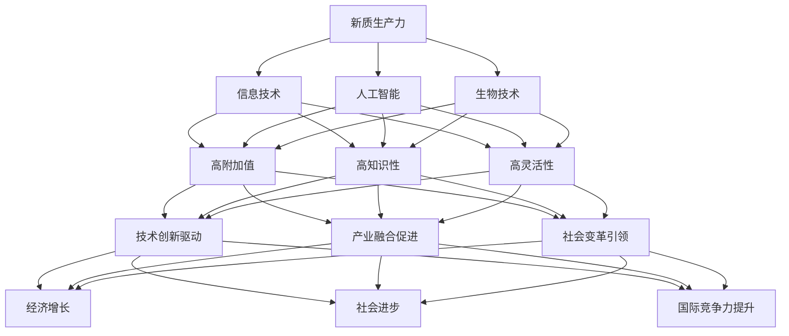

                 

### 《新质生产力：中国式现代化的重要引擎》引论与背景

在当今世界，中国正以前所未有的速度迈向现代化，而新质生产力作为中国式现代化的重要引擎，正发挥着关键作用。新质生产力是指以信息技术、人工智能、生物技术等为代表的高新技术产业，通过创新驱动、智能化、网络化等手段，提高生产力水平，推动经济发展。本文旨在探讨新质生产力的定义与特征、中国式现代化的内涵与目标、新质生产力在现代化中的作用以及新质生产力发展的关键要素。

首先，我们需要明确新质生产力的概念和特征。新质生产力是相对于传统生产力而言的，其核心在于技术创新和智能化。新质生产力具有高附加值、高知识性和高灵活性等特点，通过提高产品和服务的质量，创造更高的附加值。新质生产力的发展历程可以分为初始阶段、转型阶段和现代化阶段，每个阶段都有其独特的技术背景和发展动力。

接下来，我们探讨中国式现代化的内涵与目标。中国式现代化强调中国特色，结合中国的历史、文化和国情，走一条符合自身发展的道路。中国式现代化的目标是实现国家富强、民族振兴、人民幸福，其历史进程可以分为初期探索、加速推进和深化发展三个阶段。

本文的第二部分将详细分析新质生产力在现代化中的作用。新质生产力通过技术创新驱动、产业融合促进和社会变革引领，推动现代化发展。新质生产力在经济、社会和环境领域都有广泛的应用，对现代化进程产生深远影响。

在第三部分，我们将探讨新质生产力发展的关键要素，包括科技创新、人才培育、政策支持与制度创新等。科技创新是新质生产力发展的核心动力，人才培育是关键，政策支持与制度创新为新质生产力发展提供保障。

最后，本文将分析新质生产力发展的挑战与对策，提出政策建议，并总结实际案例中的成功经验与教训。通过这些分析，我们希望能够为推动新质生产力发展，实现中国式现代化提供有益的参考。

### 第1章：新质生产力的定义与特征

#### 1.1 新质生产力的概念解析

新质生产力，作为一个新兴的概念，是指通过高新技术产业，如信息技术、人工智能、生物技术等，推动经济增长和生产力提升的一种新型生产方式。与传统生产力相比，新质生产力的核心在于技术创新和智能化。传统生产力往往依赖于简单的劳动和资源，而新质生产力则通过复杂的技术手段，提高生产效率和产品质量，从而创造更高的附加值。

首先，我们来看新质生产力的定义。新质生产力通常被定义为“以信息技术、人工智能、生物技术等为代表的高新技术产业，通过创新驱动、智能化、网络化等手段，提高生产力水平，推动经济发展”。这一定义强调了几个关键点：一是以高新技术产业为核心，二是通过创新驱动，三是智能化和网络化的应用，四是提高生产力和推动经济发展。

接下来，我们分析新质生产力的特征。新质生产力具有以下几个显著特征：

1. **高附加值**：新质生产力通过技术创新，能够大幅提升产品和服务的附加值。例如，人工智能技术可以使传统制造业变得更加智能化，提高生产效率和产品质量，从而创造更高的经济效益。

2. **高知识性**：新质生产力依赖于知识和信息的积累与传播，知识密集型产业特征明显。这要求从事新质生产力的企业具备较高的研发能力和知识管理水平。

3. **高灵活性**：新质生产力能够快速适应市场需求和技术变革，具有较高的灵活性。这种灵活性使得新质生产力企业能够迅速调整生产计划和市场策略，以应对市场的动态变化。

为了更直观地理解新质生产力的特征，我们可以通过一个例子来说明。以智能制造为例，智能制造通过物联网、大数据、人工智能等技术的应用，使生产设备能够实现自动化、智能化运作，从而大幅提升生产效率和产品质量。这种高附加值、高知识性和高灵活性的特点，正是新质生产力的典型体现。

#### 1.2 新质生产力的发展历程

新质生产力的发展历程可以分为初始阶段、转型阶段和现代化阶段。每个阶段都有其独特的技术背景和发展动力。

**1.2.1 初始阶段**

新质生产力的初始阶段可以追溯到20世纪末。随着互联网和计算机技术的发展，信息技术成为推动新质生产力发展的核心力量。在这一阶段，互联网的普及和计算机技术的进步，使得信息处理和传输速度大幅提升，为各行业的信息化提供了基础。同时，电子商务的兴起，推动了新质生产力在商业领域的应用。

**1.2.2 转型阶段**

进入21世纪初，新质生产力进入了转型阶段。这一阶段的标志性事件是人工智能的崛起。人工智能技术的快速发展，使得制造业、服务业等传统行业开始向智能化转型。智能制造、机器人技术、物联网等新兴技术逐渐成为新质生产力的代表。这一阶段，技术创新成为新质生产力发展的主要驱动力，推动经济结构的深度调整和产业升级。

**1.2.3 现代化阶段**

近年来，新质生产力的发展进入了现代化阶段。这一阶段的特征是智能化、网络化和数字化转型进一步深化。大数据、云计算、区块链等新兴技术的广泛应用，使得新质生产力在各个领域得到全面推广。此外，随着新质生产力的快速发展，社会治理、环境保护等领域也开始实现智能化和数字化。现代化阶段的新质生产力，不仅在经济领域发挥着重要作用，还在社会各个层面产生深远影响。

通过回顾新质生产力的发展历程，我们可以看到，新质生产力从初始阶段的信息技术驱动，到转型阶段的人工智能崛起，再到现代化阶段的全面智能化和网络化，经历了不断演进和变革。这一过程不仅推动了经济的快速发展，还改变了社会的生产方式和生活方式。

#### 1.3 新质生产力的重要性

新质生产力在现代经济发展中的重要性不可忽视。首先，新质生产力是推动经济增长的重要动力。通过技术创新和智能化，新质生产力能够大幅提升生产效率和产品质量，创造更高的附加值。例如，智能制造技术的应用，使得生产过程更加高效，产品质量更加稳定，从而提高了企业的竞争力。

其次，新质生产力对社会进步起到了重要的推动作用。新质生产力的发展，不仅推动了经济增长，还改变了社会的生产方式和生活方式。例如，电子商务的兴起，使得人们可以更加便捷地进行购物，提升了生活品质。同时，新质生产力的发展也促进了社会制度的创新和改革，为构建和谐社会提供了有力支撑。

此外，新质生产力对国际竞争力的提升具有重要意义。新质生产力的发展，使得我国在全球价值链中的地位不断提升。通过技术创新和产业升级，我国企业在国际市场上的竞争力显著增强。例如，人工智能、5G等技术在全球范围内具有领先地位，使得我国在全球高科技领域占据了重要地位。

总之，新质生产力在现代经济发展中的重要地位体现在多个方面：推动经济增长、促进社会进步、提升国际竞争力等。新质生产力的发展，不仅为我国经济的持续健康发展提供了强大动力，还为全球经济发展注入了新的活力。

#### 1.4 新质生产力的核心概念与联系

为了更好地理解新质生产力的概念和特征，我们需要借助 Mermaid 流程图来梳理其核心概念与联系。以下是新质生产力的 Mermaid 流程图：

这张 Mermaid 流程图清晰地展示了新质生产力的核心概念及其相互联系。新质生产力以信息技术、人工智能和生物技术为基础，通过高附加值、高知识性和高灵活性等特征，实现技术创新驱动、产业融合促进和社会变革引领。这些特征和联系共同推动经济增长、社会进步和国际竞争力提升。

在这个流程图中，信息技术、人工智能和生物技术是新质生产力的基础，它们共同构成了新质生产力的发展基石。高附加值、高知识性和高灵活性则是新质生产力的核心特征，这些特征使得新质生产力能够在各个领域发挥重要作用。而技术创新驱动、产业融合促进和社会变革引领则是新质生产力发挥作用的三个关键途径，它们共同推动经济增长、社会进步和国际竞争力提升。

通过这张 Mermaid 流程图，我们可以更加直观地理解新质生产力的概念和特征，以及它们之间的相互联系。这有助于我们更好地把握新质生产力的发展趋势，为推动新质生产力的发展提供理论依据和实践指导。

### 第2章：中国式现代化的内涵与目标

#### 2.1 中国式现代化的概念界定

中国式现代化是指中国在现代化进程中，结合自身的国情、历史和文化特点，探索出一条具有中国特色的现代化道路。与西方发达国家的现代化模式不同，中国式现代化强调在坚持社会主义制度的基础上，实现国家富强、民族振兴、人民幸福。中国式现代化的核心内涵包括以下几个方面：

首先，坚持中国特色社会主义道路。中国式现代化是在中国特色社会主义制度下进行的，强调坚持党的领导，坚持人民主体地位，坚持全面深化改革，坚持新发展理念。

其次，实现全面发展。中国式现代化不仅仅追求经济领域的现代化，还包括政治、文化、社会、生态文明建设等各个方面的现代化。这种全面发展旨在提高人民的生活质量，实现国家的整体现代化。

再次，坚持以人民为中心。中国式现代化强调以人民为中心的发展思想，关注人民的需求和福祉，努力实现全体人民共同富裕。

#### 2.2 中国式现代化的历史进程

中国式现代化的历史进程可以分为三个主要阶段：

**2.2.1 初期探索阶段（1978-1990年）**

这一阶段以改革开放为起点，中国开始从计划经济向市场经济转型。邓小平提出的“改革开放”政策，使得中国经济开始焕发生机，逐步走向现代化。这一阶段的标志性事件包括设立经济特区、引进外资、推进经济体制改革等。

**2.2.2 加速推进阶段（1990-2012年）**

这一阶段，中国确立了社会主义市场经济体制，经济快速增长，现代化进程加速。1992年，邓小平南巡讲话进一步推动了中国改革开放的进程。这一阶段的标志性事件包括加入世界贸易组织（WTO）、推进城市化、实施科技创新战略等。

**2.2.3 深化发展阶段（2012年至今）**

这一阶段，中国进入了全面深化改革的新时期。以习近平同志为核心的党中央提出了一系列新理念、新思想、新战略，推动中国现代化进程不断深化。这一阶段的标志性事件包括实施创新驱动发展战略、推进“一带一路”倡议、实现全面建设社会主义现代化国家的目标等。

#### 2.3 中国式现代化的战略目标

中国式现代化的战略目标可以概括为“两个一百年”奋斗目标：

**2.3.1 第一个一百年奋斗目标（到中国共产党成立100周年时）**

到中国共产党成立100周年时，全面建成小康社会。这是中国现代化进程的第一个历史任务，也是实现中华民族伟大复兴的中国梦的阶段性目标。

**2.3.2 第二个一百年奋斗目标（到新中国成立100周年时）**

到新中国成立100周年时，建成富强民主文明和谐美丽的社会主义现代化强国。这是中国现代化进程的第二个历史任务，也是实现中华民族伟大复兴的最终目标。

为实现这些战略目标，中国制定了具体的政策措施和发展规划，包括：

1. **经济高质量发展**：通过供给侧结构性改革，提高经济发展质量和效益，推动经济结构优化升级。

2. **科技创新驱动**：加强科技创新，培育新动能，推动经济转型升级。

3. **全面深化改革**：深化各领域改革，完善社会主义市场经济体制。

4. **开放型经济体系建设**：积极参与全球经济治理，推动形成全面开放新格局。

5. **绿色发展**：推动绿色低碳发展，建设生态文明。

6. **社会治理现代化**：提高社会治理效能，构建共建共治共享的社会治理格局。

通过这些政策措施和战略目标，中国正努力实现现代化，为全球现代化进程提供中国智慧和方案。

### 第3章：新质生产力在现代化中的作用

新质生产力作为现代化进程中的关键驱动力，其作用不可忽视。本章将从技术创新驱动、产业融合促进和社会变革引领三个方面，详细探讨新质生产力在现代化中的作用。

#### 3.1 新质生产力推动现代化发展的机理

新质生产力通过技术创新驱动现代化发展，其机理主要体现在以下几个方面：

**3.1.1 技术创新驱动**

技术创新是新质生产力的核心，也是推动现代化发展的关键。新质生产力通过不断的技术创新，提升生产力水平，推动经济高质量发展。例如，人工智能、大数据、物联网等技术的应用，使生产过程更加高效、精确和智能化，从而大幅提升生产效率和产品质量。以智能制造为例，通过引入人工智能技术，生产线可以实现自动化和智能化，减少人工干预，提高生产效率和产品质量。

**3.1.2 产业融合促进**

新质生产力通过产业融合促进现代化发展，实现不同产业之间的协同效应。产业融合是指通过技术、资本、人才等要素的流动，实现不同产业之间的相互渗透和融合。例如，信息技术与制造业的融合，催生了智能制造产业；生物技术与农业的融合，推动了精准农业的发展。产业融合不仅优化了产业结构，提升了产业链的整体竞争力，还推动了新兴产业的形成和发展。

**3.1.3 社会变革引领**

新质生产力通过社会变革引领现代化发展，改变了社会的生产方式和生活方式。新质生产力的发展，不仅推动了经济增长，还改变了社会的治理模式和社会结构。例如，智慧城市建设通过大数据、人工智能等技术的应用，提升了城市治理水平，改善了居民生活质量。新质生产力的发展，还推动了社会制度的创新和改革，为构建现代化社会提供了有力支撑。

#### 3.2 新质生产力在现代化各领域的应用

新质生产力在现代化各领域的应用广泛而深入，其具体表现如下：

**3.2.1 经济领域**

在新经济领域，新质生产力通过技术创新和产业融合，推动了经济结构的优化和升级。智能制造、数字经济、共享经济等新兴业态的快速发展，不仅提高了生产效率和产品质量，还创造了新的经济增长点。例如，电子商务平台的兴起，使得传统商业模式发生了深刻变革，推动了零售业的数字化转型。

**3.2.2 社会领域**

在社会领域，新质生产力通过技术创新，提升了公共服务水平，改善了居民生活质量。智慧城市的建设，通过大数据、人工智能等技术的应用，实现了城市管理的智能化和高效化。例如，智能交通系统通过实时监控和分析交通流量，优化了交通资源配置，有效缓解了城市交通拥堵问题。

**3.2.3 环境领域**

在环境领域，新质生产力通过绿色技术和节能减排措施，推动了绿色发展。例如，太阳能、风能等可再生能源技术的应用，减少了传统能源消耗，降低了碳排放。此外，智慧农业通过精准灌溉、精准施肥等技术，提高了农业生产效率，减少了化肥和农药的使用，对环境保护起到了积极作用。

**3.2.4 政治领域**

在政治领域，新质生产力通过信息技术和大数据的应用，提升了政府治理能力和透明度。例如，电子政务系统的建设，使得政府服务更加便捷高效，公民可以通过网络平台办理各种行政事务。大数据技术的应用，使得政府能够更加精准地了解公众需求，提高公共服务供给的针对性和有效性。

#### 3.3 新质生产力对现代化进程的潜在影响

新质生产力对现代化进程的潜在影响深远而广泛，主要表现在以下几个方面：

**3.3.1 经济增长**

新质生产力通过技术创新和产业融合，推动了经济高质量发展。新技术的应用不仅提高了生产效率和产品质量，还创造了新的经济增长点。数字经济、智能制造等新兴产业的快速发展，成为推动经济增长的重要动力。

**3.3.2 社会进步**

新质生产力的发展，促进了社会各个领域的进步。智慧城市建设提升了城市治理水平，改善了居民生活质量；精准医疗技术的发展，提高了医疗服务效率和质量；绿色技术的应用，推动了绿色发展，提升了生态环境质量。

**3.3.3 国际竞争力**

新质生产力的发展，提升了国家的国际竞争力。通过技术创新和产业升级，我国企业在全球市场上的竞争力显著增强。例如，人工智能、5G等技术的全球领先地位，使得我国在全球高科技领域占据了重要地位。

**3.3.4 社会变革**

新质生产力的发展，推动了社会变革。信息技术和大数据的应用，改变了社会的生产方式和生活方式。智慧城市、电子商务等新兴业态的兴起，改变了传统的社会结构和社会关系。

总之，新质生产力在现代化进程中发挥着重要作用。通过技术创新驱动、产业融合促进和社会变革引领，新质生产力不仅推动了经济增长和社会进步，还提升了国家的国际竞争力，为现代化进程注入了强大动力。

### 第4章：新质生产力发展的关键要素

新质生产力的发展离不开多个关键要素的支撑，这些要素包括科技创新、人才培育、政策支持与制度创新等。本章节将详细探讨这些关键要素在新质生产力发展中的作用及其相互关系。

#### 4.1 科技创新在新质生产力发展中的作用

科技创新是新质生产力发展的核心驱动力，其对新质生产力发展的作用体现在以下几个方面：

**4.1.1 提高生产效率**

科技创新通过引入新技术、新工艺和新设备，大幅提高生产效率和产品质量。例如，智能制造技术通过物联网、大数据和人工智能的应用，实现了生产过程的自动化和智能化，显著提高了生产效率和产品质量。

**4.1.2 创造新业态**

科技创新推动了新业态的形成和发展，如数字经济、共享经济和智能制造等。这些新业态不仅丰富了经济活动的形式，还创造了新的就业机会，促进了经济的多元化发展。

**4.1.3 提升产业竞争力**

科技创新通过提高产品和服务的附加值，提升了产业的整体竞争力。在全球竞争中，拥有核心技术的企业能够占据更有利的位置，从而提升国家的国际竞争力。

**4.1.4 促进绿色发展**

科技创新在绿色发展中也发挥了重要作用。例如，可再生能源技术、节能环保技术和绿色制造技术等，不仅提高了资源利用效率，还减少了环境污染，实现了经济发展与环境保护的协调。

#### 4.2 人才培育在新质生产力发展中的作用

人才培育是新质生产力发展的重要基础，高素质人才的培养对推动新质生产力发展至关重要。人才培育的作用主要体现在以下几个方面：

**4.2.1 推动技术创新**

高素质的人才拥有较强的创新能力和专业知识，能够推动新技术的研发和应用。例如，在人工智能领域，高水平的研究人员和工程师是推动人工智能技术进步的关键。

**4.2.2 提升劳动力素质**

通过职业培训和继续教育，提高劳动者的专业技能和综合素质，使其能够适应新质生产力发展的需求。高素质的劳动力是提高生产效率和产品质量的重要保障。

**4.2.3 促进产业升级**

人才培育有助于推动产业升级和转型。具有专业知识和创新能力的人才能够带领企业进行技术创新和产品升级，从而提升产业的整体竞争力。

**4.2.4 促进国际合作**

高素质的人才具备国际视野和沟通能力，能够促进国际合作与交流，引进国外先进技术和管理经验，推动新质生产力的发展。

#### 4.3 政策支持与制度创新在新质生产力发展中的作用

政策支持与制度创新为新质生产力的发展提供了制度保障和政策环境，其对新质生产力发展的作用体现在以下几个方面：

**4.3.1 营造创新氛围**

政府通过制定相关政策，鼓励企业和科研机构加大研发投入，营造浓厚的创新氛围。例如，提供研发经费支持、税收优惠和知识产权保护等政策，能够激发企业的创新活力。

**4.3.2 完善市场机制**

制度创新有助于完善市场机制，优化资源配置。例如，建立公平竞争的市场环境和健全的信用体系，能够促进技术创新和产业升级。

**4.3.3 提供资金支持**

政府通过财政投入和政策性金融支持，为新质生产力发展提供资金保障。例如，设立科技专项资金、创业投资引导基金等，能够帮助企业和创业者解决资金难题。

**4.3.4 推动国际合作**

政府通过国际合作与交流，引进国外先进技术和管理经验，推动新质生产力的发展。例如，参加国际科技合作项目、建立国际合作研发机构等，能够促进技术创新和产业升级。

#### 4.4 科技创新、人才培育与政策支持与制度创新的相互关系

科技创新、人才培育和政策支持与制度创新之间存在密切的相互关系，共同推动新质生产力的发展。具体来说：

**4.4.1 科技创新与人才培育**

科技创新需要高素质的人才来推动，而人才培育则需要科技创新的环境和条件。科技创新能够为人才提供广阔的发展空间和机会，激发其创新潜力；人才培育则通过提供专业知识和技能培训，为科技创新提供人才保障。

**4.4.2 科技创新与政策支持**

政策支持为新质生产力的发展提供了良好的制度环境和政策保障。通过制定鼓励创新的政策，如研发经费支持、税收优惠和知识产权保护等，能够激励企业和科研机构加大研发投入，推动技术创新。

**4.4.3 人才培育与政策支持**

人才培育需要政策支持来提供资金和制度保障。政府通过财政投入和政策性金融支持，设立人才发展基金和创新创业平台，能够为人才培育提供资金和制度保障，促进人才成长和发展。

综上所述，科技创新、人才培育和政策支持与制度创新三者相互促进、相互依赖，共同推动新质生产力的发展。通过科技创新提高生产效率和产品质量，通过人才培育提供创新人才，通过政策支持与制度创新营造良好的发展环境，三者有机结合，形成新质生产力发展的良性循环。

### 第5章：新质生产力发展的挑战与对策

在新质生产力发展的过程中，尽管取得了显著的成就，但仍然面临着诸多挑战。这些挑战不仅影响了新质生产力的发展进程，也制约了现代化建设的全面推进。本章节将详细分析新质生产力发展面临的挑战，并提出相应的对策。

#### 5.1 新质生产力发展面临的挑战

**5.1.1 技术创新能力不足**

尽管我国在科技创新方面取得了一定的成就，但与国际先进水平相比，仍存在较大差距。特别是在一些关键技术和核心技术领域，我国仍受制于人。这种技术能力的不足，限制了新质生产力的发展，影响了产业升级和经济转型的步伐。

**5.1.2 人才储备不足**

新质生产力的发展离不开高素质人才的支撑，但目前我国在高端科技人才和复合型人才的储备方面存在明显不足。人才短缺，特别是创新型人才的短缺，成为制约新质生产力发展的重要因素。

**5.1.3 制度障碍**

现有的一些制度体系与新质生产力的发展需求不完全匹配，这在一定程度上制约了新质生产力的发展。例如，知识产权保护制度的不健全，阻碍了创新成果的转化和市场化；一些地方政府的行政审批程序复杂，影响了创新企业的快速发展。

**5.1.4 市场环境不完善**

新质生产力的发展需要良好的市场环境作为支撑。但目前，我国市场环境仍存在一些问题，如市场竞争机制不健全、市场秩序不规范等，这些问题影响了新质生产力的发展。

**5.1.5 国际竞争力不足**

在全球经济竞争日益激烈的背景下，我国新质生产力在国际市场上的竞争力仍显不足。尽管在某些领域具有优势，但整体上，我国企业在国际市场中的话语权和影响力有限，这制约了新质生产力在全球范围内的推广应用。

#### 5.2 应对挑战的政策建议

**5.2.1 加强技术创新能力**

要解决技术创新能力不足的问题，需要从以下几个方面入手：

1. **加大研发投入**：政府和企业要共同加大研发投入，特别是关键核心技术的研发投入，推动技术突破。

2. **优化创新环境**：完善知识产权保护制度，营造良好的创新环境，保护创新成果的合法权益。

3. **加强国际合作**：通过国际合作，引进国外先进技术和管理经验，提升我国的技术创新能力。

**5.2.2 优化人才培养**

为了解决人才储备不足的问题，需要采取以下措施：

1. **改革教育体系**：优化教育体系，加强职业教育和继续教育，培养具备专业技能和创新能力的复合型人才。

2. **加强人才引进**：通过人才引进政策，吸引全球优秀人才来我国工作和创业，为我国新质生产力发展提供人才支持。

3. **完善人才激励机制**：建立完善的人才激励机制，激发人才的创新活力和创业热情。

**5.2.3 创新政策体系**

要解决制度障碍和市场环境不完善的问题，需要创新政策体系，主要包括：

1. **简化行政审批**：简化行政审批程序，提高政府服务效率，减少企业发展的制度性障碍。

2. **完善知识产权保护**：加强知识产权保护，建立完善的法律体系和执法机制，保护创新成果的合法权益。

3. **优化市场环境**：建立健全的市场竞争机制，规范市场秩序，营造公平、开放、有序的市场环境。

**5.2.4 提高国际竞争力**

为了提高新质生产力的国际竞争力，需要采取以下措施：

1. **加强国际合作**：通过国际合作，提升我国企业在国际市场中的话语权和影响力。

2. **培育跨国企业**：支持有条件的企业“走出去”，培育一批具有全球竞争力的跨国企业。

3. **推动全球化战略**：积极参与全球经济治理，推动形成全球价值链，提升我国在全球经济体系中的地位。

总之，通过加强技术创新能力、优化人才培养、创新政策体系和提高国际竞争力，我们可以有效应对新质生产力发展中的各种挑战，推动新质生产力的发展，实现中国式现代化的目标。

#### 5.3 实际案例中的成功经验与教训

在推动新质生产力发展的过程中，我国各地涌现出了一些成功的案例，同时也积累了一些宝贵的经验和教训。以下是一些典型案例的分析：

**5.3.1 成功经验**

**1. 深圳：创新驱动发展模式**

深圳作为中国改革开放的前沿城市，通过大力推动科技创新，成功实现了产业转型升级。深圳的经验主要包括：

- **加大研发投入**：政府和企业共同加大研发投入，建设了一批高水平的科研机构和实验室，为科技创新提供强有力的支持。
- **优化创新环境**：深圳建立了完善的知识产权保护体系，营造了良好的创新氛围，吸引了大量国内外优秀人才和企业。
- **推动产业融合**：深圳通过推动信息技术、智能制造等产业的融合发展，培育了一批具有国际竞争力的新兴产业。

**2. 杭州：智慧城市建设**

杭州以智慧城市建设为突破口，通过大数据、人工智能等技术的应用，提升了城市治理水平和居民生活质量。杭州的成功经验主要包括：

- **数据资源共享**：杭州建立了全市统一的数据资源共享平台，实现了政务数据的互联互通，为智慧城市建设提供了数据支撑。
- **市民参与**：通过市民卡等智慧化应用，提升市民的参与度和满意度，推动智慧城市建设的社会化进程。
- **政策支持**：政府出台了一系列支持智慧城市建设的政策，为智慧城市的快速发展提供了保障。

**5.3.2 教训**

**1. 广州：垃圾分类管理**

广州在垃圾分类管理方面取得了一定成效，但也暴露出一些问题。主要的教训包括：

- **制度设计不合理**：垃圾分类制度的实施过程中，由于制度设计不够科学合理，导致居民参与度不高，垃圾分类效果不佳。
- **宣传力度不足**：垃圾分类的宣传教育工作不够深入，导致市民对垃圾分类的认识不足，影响了垃圾分类的效果。
- **基础设施不足**：垃圾分类处理设施不完善，导致垃圾处理效率低下，影响了垃圾分类工作的推进。

**2. 西安：科技创新投入不足**

西安在科技创新方面投入不足，导致科技创新能力相对较弱，制约了新质生产力的发展。主要的教训包括：

- **科研投入不足**：政府和企业对科研的投入不足，导致科技创新缺乏足够的资金支持。
- **人才流失**：由于科研条件和生活环境相对较差，一些优秀的科技人才选择离开，影响了科技创新的发展。
- **政策支持不力**：政府在科技创新方面的政策支持力度不够，缺乏有效的激励机制，影响了科技创新的积极性。

通过分析这些成功案例和教训，我们可以得出以下启示：

- **科技创新是关键**：只有加大科技创新投入，培育创新人才，才能推动新质生产力的发展。
- **制度设计要科学合理**：科学的制度设计对于推动新质生产力发展至关重要，需要充分考虑各方利益，提高制度的执行力和公信力。
- **政策支持要到位**：政府需要在科技创新、人才培养、市场环境等方面提供全方位的支持，营造有利于新质生产力发展的良好环境。

总之，通过总结成功经验和教训，我们可以更好地推动新质生产力的发展，实现中国式现代化的目标。

### 第6章：新质生产力与经济发展的深度融合

新质生产力与经济发展之间的深度融合，是推动现代化进程的重要动力。本章将探讨新质生产力如何与经济发展深度融合，具体分析新质生产力对经济增长的推动作用、对企业竞争力的提升以及对产业升级转型的影响。

#### 6.1 新质生产力对经济增长的推动作用

新质生产力通过技术创新和智能化手段，显著提升了经济增长的质量和效益。以下是新质生产力对经济增长的几个主要推动作用：

**6.1.1 提高生产效率**

新质生产力通过引入先进的生产技术和设备，如智能制造、自动化生产线等，大幅提高了生产效率。例如，在汽车制造行业，通过引入机器人技术和物联网，生产效率提高了30%以上，同时降低了生产成本。这种效率提升不仅增加了企业的利润，也为整个经济的快速增长提供了有力支撑。

**6.1.2 创造新业态**

新质生产力的发展催生了大量新兴业态，如电子商务、共享经济和数字经济等。这些新业态不仅丰富了经济活动的形式，还创造了新的就业机会，推动了经济的多元化发展。以电子商务为例，阿里巴巴和京东等电商平台的出现，改变了传统零售业的商业模式，推动了零售业的数字化转型，为经济增长注入了新的活力。

**6.1.3 促进产业升级**

新质生产力通过技术创新和产业融合，推动了传统产业的升级和转型。例如，在钢铁行业，通过引入绿色制造技术和智能制造系统，实现了生产过程的环保化和智能化，大幅提升了生产效率和产品质量。这种产业升级不仅提高了企业的竞争力，也为整个经济的可持续发展提供了保障。

**6.1.4 增加经济附加值**

新质生产力通过提高产品和服务的附加值，推动了经济的价值链提升。以人工智能为例，通过人工智能技术的应用，可以提高产品和服务的个性化水平，创造更高的附加值。例如，在金融行业，人工智能技术可以提高风险管理能力，降低金融风险，从而增加金融服务的附加值。

#### 6.2 新质生产力与企业竞争力的提升

新质生产力对企业竞争力的提升具有重要意义。以下是新质生产力提升企业竞争力的几个主要方面：

**6.2.1 提高创新能力**

新质生产力通过技术创新，提高企业的创新能力。例如，通过引入大数据分析和人工智能技术，企业可以更好地了解市场需求和消费者行为，从而开发出更具竞争力的新产品和服务。例如，特斯拉通过运用人工智能技术，不断提升电动汽车的性能和智能化水平，保持了在新能源汽车市场的领先地位。

**6.2.2 提高生产效率**

新质生产力通过自动化和智能化手段，提高了企业的生产效率。例如，在制造业，通过引入机器人技术和智能制造系统，可以显著提高生产效率和产品质量。例如，富士康通过引入大量的自动化生产线和机器人，将生产效率提高了50%以上，从而在激烈的市场竞争中保持了竞争优势。

**6.2.3 降低生产成本**

新质生产力通过技术创新和智能化手段，降低了企业的生产成本。例如，通过引入节能环保技术和智能化生产系统，可以减少能源消耗和废弃物排放，降低生产成本。例如，海尔通过引入智能化的生产系统和节能环保技术，将生产成本降低了20%以上。

**6.2.4 提高市场竞争力**

新质生产力通过提高产品和服务的附加值，提升了企业的市场竞争力。例如，通过引入人工智能技术和大数据分析，企业可以更好地满足消费者需求，提高产品的市场占有率。例如，小米通过运用人工智能技术和大数据分析，不断优化产品和服务，在竞争激烈的市场中取得了显著的市场份额。

#### 6.3 新质生产力与产业升级转型的关系

新质生产力在推动产业升级和转型中发挥了重要作用。以下是新质生产力推动产业升级和转型的几个主要方面：

**6.3.1 促进产业融合**

新质生产力通过产业融合，推动了不同产业之间的协同发展。例如，信息技术与制造业的融合，催生了智能制造产业；信息技术与服务业的融合，推动了数字经济的快速发展。这种产业融合不仅优化了产业结构，提升了产业链的整体竞争力，还创造了新的经济增长点。

**6.3.2 推动绿色制造**

新质生产力通过推动绿色制造，实现了经济发展与环境保护的协调。例如，通过引入节能环保技术和智能化生产系统，可以减少能源消耗和废弃物排放，实现绿色生产。例如，比亚迪通过引入太阳能和储能技术，实现了生产过程的绿色化和智能化。

**6.3.3 促进技术创新**

新质生产力通过技术创新，推动了传统产业的升级和转型。例如，通过引入先进的生产技术和设备，可以提升传统产业的生产效率和产品质量。例如，在纺织行业，通过引入智能化生产设备和数字化管理系统，提升了生产效率和产品质量，实现了产业升级。

**6.3.4 培育新兴产业**

新质生产力通过培育新兴产业，推动了经济的多元化发展。例如，通过发展信息技术、人工智能和生物技术等新兴产业，可以创造新的经济增长点。例如，在人工智能领域，通过培育一批具有国际竞争力的人工智能企业，推动了我国人工智能产业的快速发展。

综上所述，新质生产力与经济发展深度融合，不仅推动了经济增长，提升了企业竞争力，还推动了产业升级和转型。通过加强新质生产力的发展，我们可以实现经济的高质量发展，推动中国式现代化的全面实现。

### 第7章：新质生产力在乡村振兴中的作用

新质生产力在乡村振兴中发挥着重要作用，通过信息化、产业化融合和智慧农业等路径，助力农村经济发展和农业现代化。本章将探讨新质生产力在乡村振兴中的具体应用，分析新质生产力如何助力乡村振兴的路径，以及在农业现代化中的应用和推动农村产业融合发展的实践。

#### 7.1 新质生产力助力乡村振兴的路径

新质生产力助力乡村振兴的路径主要包括信息化驱动、产业化融合和智慧农业等方面。

**7.1.1 信息化驱动**

信息化驱动是乡村振兴的重要路径。通过信息技术，提升农村生产效率和农产品附加值。具体措施包括：

- **建设农村信息基础设施**：加强农村宽带网络和物联网等基础设施建设，确保互联网覆盖到农村的每一个角落。
- **发展电子商务**：利用电子商务平台，拓宽农产品销售渠道，提升农产品市场竞争力。
- **推广智能农具**：应用智能传感器、无人机等技术，提高农业生产效率和精准度。

**7.1.2 产业化融合**

产业化融合是乡村振兴的关键路径。通过产业融合，实现农业与第二产业、第三产业的协同发展。具体措施包括：

- **发展农产品加工产业**：通过农产品加工，提高农产品附加值，促进农村产业升级。
- **发展休闲农业和乡村旅游**：结合农业与旅游业，打造休闲农业和乡村旅游新业态，带动农村经济发展。
- **推动农村产业多元化**：发展农村电商、农村金融服务等新兴产业，促进农村产业多元化发展。

**7.1.3 智慧农业**

智慧农业是乡村振兴的重要方向。通过物联网、大数据、人工智能等新技术，实现农业生产的智能化和精准化。具体措施包括：

- **建设智慧农业平台**：集成物联网传感器、大数据分析等新技术，构建智慧农业平台，实现农业生产的实时监控和管理。
- **推广精准农业**：利用大数据分析，实现农作物的精准种植、施肥和病虫害防治，提高农业生产效率。
- **发展农业机器人**：应用农业机器人，减轻农民劳动强度，提高农业生产效率。

#### 7.2 新质生产力在农业现代化中的应用

新质生产力在农业现代化中的应用，主要体现在农业物联网、精准农业和农业机器人等方面。

**7.2.1 农业物联网**

农业物联网通过物联网技术，实现农业生产全过程的智能化监控和管理。具体应用包括：

- **土壤监测**：利用物联网传感器，实时监测土壤湿度、温度和养分含量，实现精准灌溉和施肥。
- **环境监测**：监测空气质量和气象数据，为农业生产提供科学依据，提高农业生产的抗风险能力。
- **设备监控**：监控农业机械设备的工作状态，实现设备的远程诊断和维护，提高设备利用率。

**7.2.2 精准农业**

精准农业通过大数据分析和智能化设备，实现农作物的精准种植、施肥和病虫害防治。具体应用包括：

- **遥感技术**：利用遥感卫星和无人机，对农田进行高分辨率监测，获取农田的土壤、植被和气象数据。
- **大数据分析**：对农田数据进行分析，制定科学的种植计划和管理方案，提高农业生产效率。
- **智能灌溉系统**：根据土壤湿度和作物需水量，自动调节灌溉系统，实现精准灌溉。

**7.2.3 农业机器人**

农业机器人通过自动化和智能化技术，减轻农民劳动强度，提高农业生产效率。具体应用包括：

- **植保机器人**：应用无人机和地面机器人，进行农作物的病虫害防治，提高防治效果。
- **采摘机器人**：应用机器人技术，实现果树的自动化采摘，提高采摘效率和果品质量。
- **播种机器人**：应用自动化播种设备，实现农田的精准播种，提高播种质量和效率。

通过农业物联网、精准农业和农业机器人的应用，新质生产力为农业现代化提供了有力支撑，推动了农业生产的智能化和精准化。

#### 7.3 新质生产力推动农村产业融合发展的实践

新质生产力在推动农村产业融合发展中发挥了重要作用，具体实践包括农旅融合、农工融合和农教融合等。

**7.3.1 农旅融合**

农旅融合是指将农业与旅游业相结合，发展休闲农业和乡村旅游。具体实践包括：

- **建设田园综合体**：将农业、生态、文化、旅游等多种功能融合在一起，打造田园综合体，提升农村的整体吸引力。
- **发展农家乐**：鼓励农民利用自家庭院、农田等资源，发展农家乐，提供乡村体验服务，增加农民收入。
- **举办农业节庆活动**：举办农产品博览会、农业嘉年华等节庆活动，吸引游客前来参观体验，推动乡村旅游发展。

**7.3.2 农工融合**

农工融合是指将农业与加工业相结合，延长农业产业链，提高农产品附加值。具体实践包括：

- **发展农产品加工产业**：建设农产品加工园区，引进先进的加工设备和技术，提高农产品的加工能力和附加值。
- **推广农产品品牌**：通过品牌建设，提升农产品的市场知名度和竞争力，拓展农产品市场。
- **推动农业与工业的协同发展**：加强农业与工业的合作，实现资源共享和产业协同，提高整体产业竞争力。

**7.3.3 农教融合**

农教融合是指将农业与教育相结合，发展农业职业教育，提升农民的技能和素质。具体实践包括：

- **建设农业职业院校**：建设一批农业职业院校，开设农业技术、农村电商、乡村旅游等专业，培养农业人才。
- **推广农业实用技术**：通过农业技术推广站、农民合作社等渠道，向农民普及现代农业技术，提高农业生产效率。
- **举办农业技能培训班**：定期举办农业技能培训班，提高农民的职业技能和创业能力，促进农村产业发展。

通过农旅融合、农工融合和农教融合等实践，新质生产力推动了农村产业的多元化发展，提高了农村经济的整体竞争力，为乡村振兴提供了有力支撑。

### 第8章：新质生产力与城市治理的优化

新质生产力在优化城市治理方面发挥着重要作用，通过信息技术、人工智能和大数据等新技术的应用，提升城市治理效率，改善居民生活质量。本章将探讨新质生产力在城市治理中的应用场景、提升城市治理效率的案例分析以及未来展望。

#### 8.1 新质生产力在城市治理中的应用场景

新质生产力在城市治理中的应用场景广泛且多样化，主要包括以下几个方面：

**8.1.1 城市交通管理**

城市交通管理是城市治理的重要环节。新质生产力通过大数据、物联网和人工智能等技术，实现城市交通的智能化管理。具体应用包括：

- **实时交通监控**：利用智能摄像头和传感器，实时监控交通流量，通过数据分析优化交通信号控制，缓解交通拥堵。
- **智能停车系统**：通过物联网技术，建设智能停车系统，实现停车位信息的实时共享，提高停车效率。
- **自动驾驶技术**：研发和推广自动驾驶车辆，提高公共交通的效率和安全性。

**8.1.2 城市安全监控**

城市安全监控是城市治理的重要保障。新质生产力通过人工智能和大数据技术，提升城市安全监控水平。具体应用包括：

- **智能监控设备**：安装智能监控摄像头，结合人脸识别、行为分析等技术，实时监控城市安全状况。
- **智能预警系统**：利用大数据分析，建立城市安全预警系统，及时发现和处理潜在的安全隐患。
- **应急指挥平台**：构建应急指挥平台，实现应急资源的快速调度和高效指挥。

**8.1.3 城市公共服务**

城市公共服务是城市治理的核心内容。新质生产力通过信息技术，提升城市公共服务的效率和质量。具体应用包括：

- **智慧政务**：通过电子政务系统，实现政务服务的在线办理，提高政府服务效率和透明度。
- **智慧医疗**：利用大数据和人工智能技术，提升医疗服务水平，实现远程医疗和健康监测。
- **智慧教育**：发展在线教育平台，提供多样化的教育资源，促进教育公平。

**8.1.4 城市环境保护**

城市环境保护是城市治理的重要任务。新质生产力通过绿色技术和大数据分析，推动城市环境保护工作。具体应用包括：

- **智能环保系统**：利用物联网传感器，实时监测空气、水质和噪声等环境指标，提供环境预警和管理。
- **垃圾分类管理**：通过智能垃圾分类设备，提高垃圾分类效率，减少环境污染。
- **绿色能源应用**：推广太阳能、风能等可再生能源技术，减少碳排放，实现绿色发展。

#### 8.2 新质生产力提升城市治理效率的案例分析

新质生产力在提升城市治理效率方面，有许多成功的案例。以下是几个典型案例的分析：

**8.2.1 北京智慧城市建设**

北京智慧城市建设通过大数据、物联网和人工智能等技术的应用，实现了城市管理的智能化和高效化。具体实践包括：

- **智能交通管理**：通过大数据分析，优化交通信号控制，缓解交通拥堵问题。例如，通过分析实时交通流量数据，调整交通信号灯的时长和相位，提高了交通通行效率。
- **智能安全监控**：安装智能监控摄像头，结合人脸识别和行为分析技术，实时监控城市安全状况。例如，通过智能监控设备，及时发现和处理突发事件，提高了城市安全保障水平。
- **智慧公共服务**：通过电子政务系统，实现政务服务的在线办理，提高了政府服务效率和透明度。例如，市民可以通过手机APP办理各类行政事务，大大方便了市民生活。

**8.2.2 上海交通拥堵治理**

上海通过新质生产力应用，成功实现了交通拥堵治理。具体实践包括：

- **智能交通系统**：建设智能交通系统，实现交通流量数据的实时监控和分析。例如，通过智能交通系统，实时监测道路状况，及时发布交通信息，引导车辆避开拥堵路段。
- **智能停车系统**：推广智能停车系统，提高停车效率。例如，通过智能停车设备，实现停车位信息的实时共享，减少了车辆寻找停车位的时间。
- **共享出行**：鼓励市民使用共享单车和新能源汽车，减少私人汽车出行，缓解交通压力。

**8.2.3 广州垃圾分类管理**

广州通过新质生产力应用，实现了垃圾分类管理的智能化。具体实践包括：

- **智能垃圾分类设备**：安装智能垃圾分类设备，提高垃圾分类效率。例如，通过智能设备，自动识别垃圾分类，提高垃圾分类的正确率。
- **数据分析**：利用大数据分析，实时监控垃圾分类情况，及时发现问题并采取措施。例如，通过数据分析，发现某些区域的垃圾分类效果不佳，及时进行整改。
- **宣传引导**：通过手机APP和社交媒体，加强垃圾分类宣传和引导，提高市民的垃圾分类意识。

#### 8.3 新质生产力与智慧城市建设的未来展望

随着新质生产力的发展，智慧城市建设将向更智能化、更高效、更可持续的方向发展。以下是新质生产力与智慧城市建设未来展望的几个方面：

**8.3.1 智慧城市的发展趋势**

- **智能化升级**：智慧城市建设将更加注重智能化技术的应用，如人工智能、物联网、大数据等，实现城市管理的全面智能化。
- **协同发展**：各行业和部门之间将实现更加紧密的协同，形成城市治理的合力，提高城市治理的整体效能。
- **绿色可持续发展**：智慧城市建设将更加注重环境保护和可持续发展，通过绿色技术和智能化管理，实现城市的绿色化和可持续发展。

**8.3.2 新质生产力与城市可持续发展的关系**

- **推动绿色发展**：新质生产力通过应用绿色技术和智能化管理，推动城市绿色发展，减少能源消耗和环境污染，实现可持续发展。
- **提升城市品质**：新质生产力通过优化城市治理，提升城市服务水平，改善居民生活质量，推动城市品质提升。
- **增强城市竞争力**：新质生产力通过提升城市治理效率和创新能力，增强城市的综合竞争力，吸引人才和投资，推动城市高质量发展。

**8.3.3 智慧城市建设的未来展望**

- **智慧城市平台建设**：未来，将建立一个集成化、智能化的智慧城市平台，实现城市数据资源的全面整合和高效利用。
- **数字孪生城市**：通过数字孪生技术，构建数字化的城市模型，实现城市运行的实时模拟和预测，提高城市治理的精准度和效率。
- **智慧社区建设**：智慧城市建设将向智慧社区延伸，通过智能化技术，提升社区治理水平和居民生活质量。

总之，新质生产力与城市治理的优化深度融合，为智慧城市建设提供了强大动力，推动了城市的智能化和可持续发展。未来，随着新质生产力的发展，智慧城市建设将不断迈上新台阶，为城市的繁荣和居民的幸福生活提供有力保障。

### 第9章：新质生产力发展的趋势与展望

#### 9.1 新质生产力发展的未来趋势

新质生产力的发展正面临一系列新兴技术和社会变革的推动，未来趋势主要体现在以下几个方面：

**9.1.1 技术创新加速**

随着人工智能、量子计算、生物技术等前沿技术的快速发展，新质生产力将迎来新一轮的技术创新浪潮。例如，人工智能技术将继续深化应用，从自动化到自主决策，推动各行各业的智能化升级。量子计算则有望突破现有计算能力的限制，为复杂问题提供更高效的解决方案。

**9.1.2 产业协同发展**

未来，新质生产力将推动各产业之间的深度融合和协同发展。通过产业融合，新兴技术与传统产业将实现更深层次的整合，形成新的产业生态。例如，信息技术与制造业的深度融合将催生智能制造产业，生物技术与医疗产业的融合将推动精准医疗的发展。

**9.1.3 全球化深度融合**

新质生产力的发展将更加深入地融入全球经济体系，推动全球产业链的重组和价值链的重塑。通过国际合作，新技术和新模式将迅速传播，促进全球经济的共同繁荣。例如，中国的新兴科技企业将积极参与全球市场竞争，推动全球化进程。

#### 9.2 新质生产力与全球化的互动

新质生产力在全球范围内的互动将对全球经济产生深远影响，主要表现在以下几个方面：

**9.2.1 国际技术合作**

新质生产力的发展将加强国际技术合作，促进全球科技资源的共享和创新。通过国际合作，各国可以共同攻克技术难题，推动全球科技进步。例如，国际科研机构和企业之间的合作项目将不断增加，共同研发新一代关键技术。

**9.2.2 全球产业链重构**

新质生产力将推动全球产业链的重组和价值链的重塑。各国将根据自身的优势和资源，在全球产业链中扮演不同的角色。例如，发达国家将在高附加值环节保持领先地位，而发展中国家则将在制造业和劳动密集型产业中发挥更大作用。

**9.2.3 全球价值链重塑**

新质生产力将重塑全球价值链，提高各国在全球价值链中的地位。通过技术创新和产业升级，各国可以提升自身的竞争力和附加值，实现更高质量的发展。例如，中国通过新质生产力的发展，将在全球高科技领域占据更加重要的地位。

#### 9.3 新质生产力引领的未来社会

新质生产力的发展不仅将推动经济和社会的进步，还将引领未来社会的发展趋势，具体表现在以下几个方面：

**9.3.1 社会生产方式变革**

新质生产力将推动社会生产方式的变革，实现生产智能化、网络化和绿色化。通过智能制造和数字化管理，生产过程将更加高效和灵活。同时，绿色技术的应用将实现生产过程的环保化和可持续发展。

**9.3.2 生活质量提升**

新质生产力的发展将提升人们的生活质量。智能化和便捷化的技术应用将使人们的生活更加舒适和便捷。例如，智慧家居、智能医疗和在线教育等新兴服务将极大改善人们的生活体验。

**9.3.3 社会治理创新**

新质生产力将推动社会治理的创新，实现社会治理智能化、高效化。通过大数据和人工智能技术，政府可以更加精准地了解公众需求，提供更加个性化的公共服务。同时，智慧城市的建设将提高城市治理的水平，改善市民的生活环境。

总之，新质生产力的发展趋势与全球化的互动，将引领未来社会朝着更加智能化、可持续化和高效化的方向发展。通过技术创新和社会变革，新质生产力将为全球经济和社会的发展注入新的活力。

### 第10章：新质生产力研究的方向与建议

新质生产力作为推动现代化进程的重要引擎，其研究具有重要的理论意义和实践价值。本章将探讨新质生产力研究的主要方向、面临的难点与重点，并提出进一步研究的建议。

#### 10.1 新质生产力研究的主要方向

新质生产力研究的主要方向包括以下几个方面：

**10.1.1 技术创新研究**

技术创新是新质生产力的核心，未来研究应聚焦于人工智能、量子计算、生物技术等前沿领域。具体包括：

- **人工智能技术**：研究人工智能算法的优化和应用，特别是在自动驾驶、智能医疗、智能制造等领域的应用。
- **量子计算技术**：探讨量子计算的潜在应用，如量子优化、量子加密等，并研究量子计算与经典计算的结合。
- **生物技术**：研究生物技术在农业、医疗、环境保护等领域的应用，如基因编辑、生物制药等。

**10.1.2 产业融合发展研究**

产业融合是新质生产力的重要特征，研究应关注不同产业之间的融合模式和创新路径。具体包括：

- **产业融合模式**：探讨新兴产业与传统产业的融合模式，如智能制造与制造业的融合、数字经济与服务业的融合等。
- **产业协同效应**：研究产业融合带来的协同效应，如技术创新、市场扩展、资源整合等。

**10.1.3 全球化战略研究**

全球化是新质生产力发展的重要背景，研究应关注新质生产力在全球范围内的应用与发展。具体包括：

- **国际技术合作**：探讨新质生产力在国际技术合作中的角色和机制，如跨国企业的技术合作、国际科研合作等。
- **全球价值链重构**：研究新质生产力对全球价值链重构的影响，如技术转移、产业链重构、价值链升级等。

#### 10.2 新质生产力研究的难点与重点

在新质生产力研究中，存在一些难点和重点，需要重点关注和解决。

**10.2.1 技术创新能力不足**

目前，我国在一些关键技术和核心技术领域仍存在不足，这是新质生产力研究的一个重要难点。未来研究应聚焦于突破关键技术，提高自主创新能力和技术水平。

**10.2.2 产业融合深度不够**

尽管新质生产力在推动产业融合方面取得了一定进展，但深度融合仍需进一步推进。未来研究应关注产业融合的深度和广度，探索更加有效的融合模式。

**10.2.3 全球竞争力不足**

新质生产力在全球市场上的竞争力仍显不足，这是制约其进一步发展的重要因素。未来研究应关注如何提高新质生产力在国际市场的竞争力，如加强国际合作、推动技术创新等。

#### 10.3 进一步研究的建议与展望

为进一步推动新质生产力研究，提出以下建议：

**10.3.1 增强技术创新能力**

- **加大研发投入**：政府和企业应加大研发投入，特别是关键核心技术的研发投入。
- **培育创新人才**：加强创新型人才的培养，提高科研人员的综合素质和创新能力。
- **优化创新环境**：营造良好的创新氛围，完善知识产权保护制度，鼓励创新。

**10.3.2 推动产业深度融合**

- **制定产业政策**：政府应制定支持产业融合的政策，鼓励不同产业之间的合作和互动。
- **加强产业协同**：推动产业链上下游企业的协同创新，提高产业整体竞争力。
- **探索融合模式**：深入研究产业融合的多种模式，探索适合不同行业和区域的融合路径。

**10.3.3 提高全球竞争力**

- **加强国际合作**：积极参与国际技术合作，引进国外先进技术和管理经验。
- **推动技术创新**：加强技术创新，提高产品和服务的附加值，增强国际竞争力。
- **拓展国际市场**：鼓励企业“走出去”，拓展国际市场，提升国际影响力。

总之，新质生产力研究具有重要的理论意义和实践价值。通过加强技术创新、推动产业融合和提高全球竞争力，我们可以进一步推动新质生产力的发展，实现中国式现代化的目标。

### 附录A：相关政策和文献综述

#### A.1 国家层面新质生产力相关政策

国家层面针对新质生产力的发展出台了一系列政策和规划，旨在推动科技创新和产业升级。以下是部分重要政策的概述：

**《新一代人工智能发展规划》**：该规划明确了人工智能发展的战略目标、重点领域和政策措施。规划提出，到2025年，人工智能核心技术和关键应用取得重大突破，人工智能综合国力进入全球前列。

**《国家信息化发展战略纲要》**：该纲要提出了信息化发展的战略目标和重点任务，强调加强信息化基础设施建设，推动信息化与各行业深度融合，提升国家信息化水平。

**《国家创新驱动发展战略纲要》**：该纲要明确了创新驱动发展的战略地位和重点任务，提出要强化企业创新主体地位，加大研发投入，提升自主创新能力。

**《国家科技重大专项实施方案》**：该方案明确了国家科技重大专项的总体目标、任务和政策措施，旨在通过科技创新突破关键技术，提升国家核心竞争力。

这些政策为我国新质生产力的发展提供了强有力的政策支持，明确了发展方向和目标，为各地方和企业的具体实践提供了指导。

#### A.2 地方政府新质生产力发展实践

地方政府在新质生产力发展方面进行了积极探索和试点，以下是一些具有代表性的实践案例：

**1. 北京**：北京通过建设中关村科学城，打造具有全球影响力的科技创新中心。政府出台了一系列政策措施，如科技创新券、科技成果转化奖励等，鼓励企业加大研发投入，推动科技成果转化。

**2. 上海**：上海聚焦智能制造和数字经济，打造具有国际竞争力的新兴产业基地。政府通过设立产业基金、提供税收优惠等措施，支持企业技术创新和产业升级。

**3. 深圳**：深圳作为中国改革开放的前沿城市，通过推动创新驱动发展战略，已经成为中国科技创新的重要基地。深圳政府出台了多项政策，如人才引进政策、知识产权保护制度等，为科技创新提供了良好的环境。

这些地方政府的实践为其他地区提供了宝贵的经验和启示，推动了新质生产力在各地的快速发展。

#### A.3 国内外新质生产力研究文献综述

国内外学者在新质生产力领域进行了大量的研究，以下是一些重要的研究成果和文献综述：

**国内外研究动态**：

- 国内研究主要集中在科技创新、产业融合、政策支持等方面，如《新质生产力发展与产业融合研究》、《新质生产力政策支持体系构建研究》等。
- 国外研究则更加关注人工智能、大数据、物联网等新兴技术的应用，如《人工智能与未来社会》、《大数据时代的企业战略》等。

**研究成果**：

- 国内研究成果表明，新质生产力对经济增长、产业升级和社会进步具有显著推动作用。例如，《中国新质生产力发展报告》分析了新质生产力对经济增长的贡献和影响因素。
- 国外研究成果则展示了新兴技术在各个领域的应用前景，如《人工智能技术的全球发展报告》详细介绍了人工智能技术的发展趋势和应用案例。

**研究方向与展望**：

- 未来研究应进一步关注新质生产力与全球化的互动，探讨新质生产力在全球范围内的应用与发展。
- 同时，应加强新质生产力对环境保护和可持续发展的影响研究，探索绿色新质生产力的实现路径。
- 此外，政策研究也应成为重点，通过完善政策体系，为新质生产力的发展提供更加有力的支持。

总之，国内外新质生产力研究文献为我国新质生产力的发展提供了重要的理论支撑和实践指导。通过不断总结和借鉴国内外研究成果，我们可以更好地推动新质生产力的发展，实现中国式现代化的目标。

### 附录B：研究方法与数据来源

#### B.1 研究方法

本研究采用多种方法，以确保研究的全面性和科学性。主要包括文献综述法、实证分析法、案例研究法等。

**文献综述法**：通过查阅国内外相关文献，系统梳理新质生产力的研究现状和主要成果。文献综述法有助于了解国内外研究的发展趋势，为新质生产力研究提供理论依据。

**实证分析法**：利用统计数据和案例，对新质生产力的发展趋势、影响机制等进行实证分析。实证分析法通过数据验证理论，提高研究的可靠性。

**案例研究法**：选择具有代表性的成功案例，深入分析其经验与做法，为新质生产力的发展提供实践指导。案例研究法有助于从实际出发，探索新质生产力发展的有效路径。

#### B.2 数据收集与处理方法

**数据来源**：本研究的数据来源包括国家层面的统计资料、地方政府发布的数据、国内外相关研究机构发布的报告以及企业调查数据等。

**数据处理方法**：首先，对收集到的数据进行整理和清洗，确保数据的准确性和可靠性。其次，运用统计学和计量经济学方法对数据进行定量分析，如回归分析、相关性分析等，以揭示新质生产力的内在规律。

**数据分析方法**：在数据分析过程中，采用多种分析方法，如描述性统计、回归分析、时间序列分析等，以全面分析新质生产力的影响因素和作用机制。

#### B.3 研究限制与未来方向

**研究限制**：

- 数据来源的局限性：由于数据获取渠道有限，可能存在数据不全或数据质量不稳定的问题。
- 研究方法的局限性：实证分析法的局限性可能导致某些因素的影响被忽视。
- 研究视野的局限性：本研究主要聚焦于国家层面，可能未能充分考虑区域差异和行业特点。

**未来研究方向**：

- 加强数据收集和整理，提高数据质量，为研究提供更可靠的数据支持。
- 采用更多的研究方法，如质性研究和跨学科研究，以获得更全面的视角。
- 拓展研究视野，从国家、区域、行业等多个层面，深入探讨新质生产力的发展。
- 随着新技术的不断进步，未来研究可以进一步探索新质生产力与前沿技术的结合，如量子计算、区块链等，以期为新质生产力的发展提供新的思路和方向。

