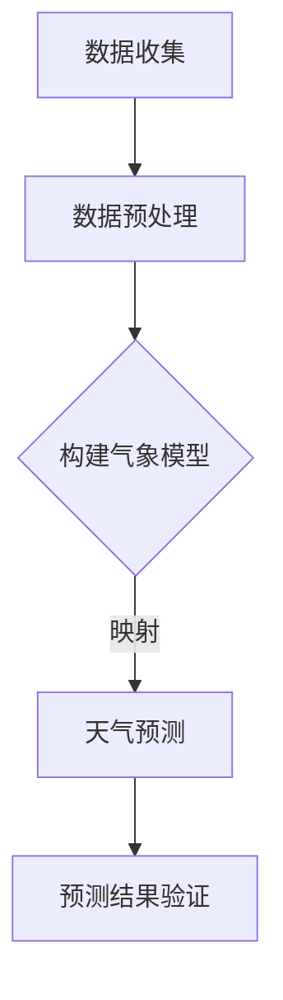
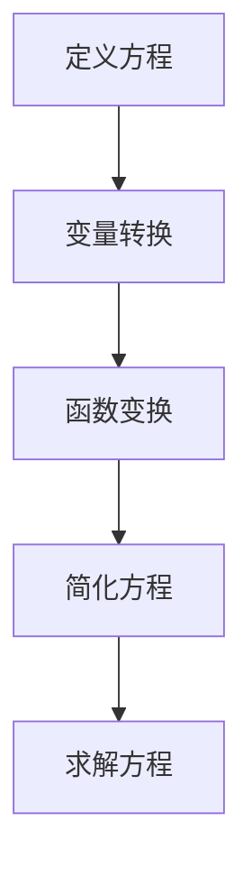
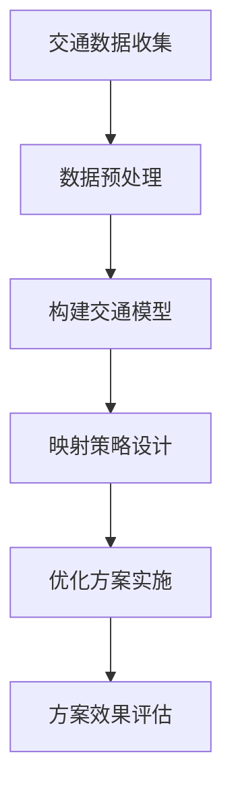

                 

# 映射思维：理解自然与数学的统一

## 关键词

映射思维、自然与数学的统一、核心概念、核心原理、应用场景、数学模型、算法实现、现实生活、科学领域、技术领域、教育领域

## 摘要

本文旨在探讨映射思维这一概念，并阐述其在自然与数学领域的统一性。映射思维作为一种重要的认知工具，贯穿于自然科学、数学和工程技术的各个领域。通过对映射思维的基本概念、核心原理、应用场景及其在现实生活中的实际案例进行分析，本文揭示了映射思维在理解自然与数学统一过程中的重要作用。同时，本文还将讨论映射思维的数学模型与算法实现，展望其未来发展趋势，并提出对映射思维研究者的建议。

## 目录大纲

### 第一部分：映射思维概述

1. 映射思维的基本概念
   1.1 映射思维的起源与发展
   1.2 映射思维的核心要素
   1.3 映射思维的特点与价值

2. 映射思维在自然与数学中的体现
   2.1 自然界的映射现象
   2.2 数学中的映射概念
   2.3 映射思维在自然与数学中的联系

### 第二部分：映射思维的核心原理

3. 映射思维的基本原理
   3.1 映射映射与函数关系
   3.2 映射思维中的变量转换
   3.3 映射思维的数学基础

4. 映射思维的应用场景
   4.1 在数学中的应用
   4.2 在物理中的应用
   4.3 在生物学中的应用

5. 映射思维的方法与技巧
   5.1 映射思维的方法论
   5.2 常用的映射技巧
   5.3 映射思维的实践应用

### 第三部分：映射思维在现实生活中的应用

6. 映射思维在科学领域的应用
   6.1 映射思维在科学研究中的作用
   6.2 映射思维在科学发现中的应用案例

7. 映射思维在技术领域的应用
   7.1 映射思维在工程中的应用
   7.2 映射思维在人工智能中的应用
   7.3 映射思维在数据处理与分析中的应用

8. 映射思维在教育领域的应用
   8.1 映射思维在教学方法中的应用
   8.2 映射思维在学生思维培养中的应用
   8.3 映射思维在教育改革中的前景

### 第四部分：映射思维的数学模型与算法

9. 映射思维的数学模型
   9.1 常见的映射模型
   9.2 映射模型的构建方法
   9.3 映射模型的应用分析

10. 映射思维的算法实现
   10.1 映射算法的基本原理
   10.2 常见的映射算法
   10.3 映射算法的优化方法

11. 映射思维的实际案例分析
   11.1 案例分析概述
   11.2 案例分析1：自然界的映射现象
   11.3 案例分析2：数学中的映射问题
   11.4 案例分析3：现实生活中的映射应用

### 第五部分：映射思维的未来发展趋势

12. 映射思维的现状与挑战
   12.1 映射思维的现状分析
   12.2 映射思维面临的挑战

13. 映射思维的未来发展趋势
   13.1 映射思维在科学领域的未来趋势
   13.2 映射思维在技术领域的未来趋势
   13.3 映射思维在教育领域的未来趋势

14. 映射思维的总结与展望
   14.1 映射思维的整体总结
   14.2 映射思维的未来发展展望
   14.3 对映射思维研究者的建议

## 第一部分：映射思维概述

### 第1章：映射思维的基本概念

#### 1.1 映射思维的起源与发展

映射思维（Mapping Thinking）作为一种认知工具，起源于人类对自然界和数学规律的探索。在古希腊时期，哲学家亚里士多德（Aristotle）就提出了“万物皆数”的观点，认为宇宙万物都可以用数学来描述。这种观点奠定了映射思维的理论基础。

随着数学和自然科学的发展，映射思维逐渐形成了系统的理论体系。在18世纪，德国数学家莱布尼茨（Gottfried Wilhelm Leibniz）提出了微积分的概念，将映射思维应用于数学领域。19世纪，英国数学家凯利（Sir William Rowan Hamilton）提出了四元数理论，进一步丰富了映射思维的内涵。

在现代，映射思维已经成为认知科学、计算机科学、物理学等多个领域的重要研究方法。特别是在人工智能领域，映射思维的应用更是取得了显著的成果。

#### 1.2 映射思维的核心要素

映射思维的核心要素包括以下几个方面：

1. **映射关系**：映射关系是映射思维的基础。它指的是两个集合之间的对应关系。例如，从集合A到集合B的映射，可以用函数表示为 f: A → B。

2. **变量转换**：变量转换是映射思维的核心技巧。它指的是通过变换变量，将复杂问题转化为简单问题的过程。变量转换可以使得问题更加直观，便于分析和解决。

3. **函数关系**：函数关系是映射思维的重要组成部分。函数关系描述了输入与输出之间的依赖关系。在映射思维中，通过分析函数关系，可以更好地理解问题的本质。

4. **数学模型**：数学模型是映射思维的工具。它将现实世界的问题转化为数学问题，使得问题更加抽象和简洁。数学模型有助于我们更好地理解和解决问题。

#### 1.3 映射思维的特点与价值

映射思维具有以下特点：

1. **抽象性**：映射思维可以将复杂问题抽象为简单的数学模型，使得问题更加直观和简洁。

2. **系统性**：映射思维具有系统性，可以将不同领域的问题相互关联，形成统一的理论体系。

3. **普适性**：映射思维适用于各个领域，可以解决不同类型的问题。

4. **创造性**：映射思维可以激发创新思维，帮助人们提出新的观点和解决方案。

映射思维的价值体现在以下几个方面：

1. **科学发现**：映射思维有助于科学家发现自然界的规律和现象，推动科学进步。

2. **技术创新**：映射思维在工程和技术领域应用广泛，为技术创新提供了有力支持。

3. **教育改革**：映射思维可以激发学生的创新思维，提高教育质量。

4. **问题解决**：映射思维可以帮助我们更好地理解和解决问题，提高问题解决能力。

### 第2章：映射思维在自然与数学中的体现

#### 2.1 自然界的映射现象

自然界中的映射现象无处不在，以下是一些典型的例子：

1. **光学映射**：光的传播过程中，光线的反射、折射等现象都可以看作是映射。例如，平面镜中的反射映射，凸透镜中的折射映射等。

2. **生物映射**：生物体内的细胞分裂、遗传信息传递等过程都可以看作是映射。例如，DNA序列的编码和解码过程，就是一种映射。

3. **地理映射**：地球上的地形地貌、气候分布等都可以看作是映射。例如，地图上的等高线、等温线等。

4. **物理映射**：物理现象中的电荷分布、电流流动等都可以看作是映射。例如，静电场中的电荷分布，电磁场中的电流流动等。

#### 2.2 数学中的映射概念

数学中的映射概念主要涉及函数、集合和关系。以下是一些常见的数学映射：

1. **函数映射**：函数映射是最常见的映射形式。它指的是从定义域到值域的映射。例如，线性函数 f(x) = 2x + 1，将实数集映射到实数集。

2. **集合映射**：集合映射是指从集合A到集合B的映射。例如，集合 {1, 2, 3} 映射到集合 {4, 5, 6}，可以表示为 f(1) = 4, f(2) = 5, f(3) = 6。

3. **关系映射**：关系映射是指从关系R到关系S的映射。例如，在二元关系R中，如果aRb，则在关系S中，aSb。

#### 2.3 映射思维在自然与数学中的联系

映射思维在自然与数学中的联系体现在以下几个方面：

1. **抽象与具体**：映射思维将具体问题抽象为数学模型，使得问题更加简洁和易于分析。

2. **分析与综合**：映射思维通过分析映射关系，可以揭示自然现象的内在规律。同时，通过综合分析，可以推导出新的结论和发现。

3. **理论与实践**：映射思维在理论研究中，可以揭示自然与数学的统一性。在实践应用中，可以指导科学家和技术人员解决实际问题。

通过以上分析，我们可以看到映射思维在自然与数学中的重要作用。映射思维作为一种认知工具，不仅可以帮助我们更好地理解自然现象，还可以为数学研究提供有力的支持。在接下来的章节中，我们将进一步探讨映射思维的核心原理和应用场景。

## 第二部分：映射思维的核心原理

### 第3章：映射思维的基本原理

#### 3.1 映射映射与函数关系

映射映射（Mapping Mapping）和函数关系（Function Relationship）是映射思维的基础。它们在数学和自然科学中起着至关重要的作用。

在数学中，映射映射是指将一个集合中的元素映射到另一个集合中的元素。这个过程可以用函数表示。例如，设A和B是两个集合，映射映射f:A→B表示A中的每个元素a都有唯一的B中的元素b与之对应，即f(a)=b。

函数关系是映射映射的具体形式。它定义了一个集合到另一个集合的映射。在数学中，函数关系通常用f(x)表示，其中x是定义域中的元素，f(x)是值域中的元素。函数关系可以描述输入与输出之间的依赖关系。

在自然科学中，映射映射和函数关系也广泛应用于各种现象和过程。例如，在物理学中，力可以看作是质量与加速度的映射映射；在生物学中，基因可以看作是DNA序列与生物特性的映射映射。

#### 3.2 映射思维中的变量转换

变量转换（Variable Transformation）是映射思维中的重要技巧。它指的是通过变换变量，将复杂问题转化为简单问题的过程。

变量转换可以使得问题更加直观，便于分析和解决。在数学中，常见的变量转换包括代换、积分变换、微分变换等。例如，在解决微分方程时，可以通过变量代换将复杂方程转化为简单方程。

在自然科学中，变量转换也广泛应用于各种现象和过程。例如，在物理学中，可以通过变换坐标系统将复杂力学问题转化为简单问题；在生物学中，可以通过变量转换将复杂的生物系统简化为线性系统。

#### 3.3 映射思维的数学基础

映射思维的数学基础包括集合论、函数论、关系论等。这些数学理论为映射思维提供了坚实的理论基础。

集合论是研究集合及其性质的数学分支。在映射思维中，集合论用于描述映射映射和函数关系。集合论的基本概念包括集合、元素、子集、并集、交集、补集等。

函数论是研究函数及其性质的数学分支。在映射思维中，函数论用于分析函数关系，理解输入与输出之间的依赖关系。函数论的基本概念包括函数、定义域、值域、奇偶性、单调性等。

关系论是研究关系及其性质的数学分支。在映射思维中，关系论用于分析映射映射和函数关系。关系论的基本概念包括关系、关系矩阵、关系运算等。

通过以上分析，我们可以看到映射思维的基本原理在数学和自然科学中的重要作用。映射映射与函数关系、变量转换和映射思维的数学基础构成了映射思维的核心原理，为理解和解决复杂问题提供了有力支持。在接下来的章节中，我们将进一步探讨映射思维的应用场景。

### 第4章：映射思维的应用场景

#### 4.1 在数学中的应用

映射思维在数学中的应用非常广泛，包括函数、集合、关系等概念的应用。

1. **函数应用**：

在数学中，函数是映射思维的核心概念。函数描述了输入与输出之间的依赖关系。常见的函数应用包括：

- **微分方程**：通过映射思维，可以将复杂微分方程转化为简单方程。例如，通过变量转换，将一阶线性微分方程转化为标准形式，进而求解。
- **积分变换**：积分变换是映射思维在积分领域的重要应用。它可以将复杂的积分问题转化为简单的积分问题。例如，通过傅里叶变换，可以将时域信号转化为频域信号，便于分析。

2. **集合应用**：

集合论是映射思维的重要组成部分。集合论的应用包括：

- **集合运算**：集合运算（并集、交集、补集等）是映射思维在集合领域的重要应用。通过集合运算，可以简化复杂集合问题。例如，通过集合运算，可以求解集合的交集和并集，进一步分析集合的性质。
- **集合表示**：集合表示是映射思维在集合领域的重要应用。通过集合表示，可以直观地描述集合之间的关系。例如，通过Venn图，可以直观地表示集合的交集和并集。

3. **关系应用**：

关系论是映射思维的另一个重要应用。关系论的应用包括：

- **关系矩阵**：关系矩阵是映射思维在关系领域的重要应用。通过关系矩阵，可以直观地表示关系。例如，通过关系矩阵，可以分析关系的性质，如传递性、对称性等。
- **关系运算**：关系运算（自反性、反自反性、对称性、传递性等）是映射思维在关系领域的重要应用。通过关系运算，可以简化复杂关系问题。例如，通过关系运算，可以判断两个关系是否相等，进一步分析关系的性质。

#### 4.2 在物理中的应用

映射思维在物理中的应用也非常广泛，包括力学、电磁学、量子物理等。

1. **力学应用**：

在力学中，映射思维主要用于分析力学问题。常见的力学应用包括：

- **牛顿第二定律**：牛顿第二定律可以看作是映射思维在力学领域的重要应用。它描述了力与加速度之间的关系，即F=ma。通过映射思维，可以将力学问题转化为数学问题，便于分析和解决。
- **运动学方程**：运动学方程是映射思维在运动学领域的重要应用。它描述了物体在运动过程中的位置、速度和加速度之间的关系。通过映射思维，可以将复杂的运动问题转化为简单问题，便于分析和解决。

2. **电磁学应用**：

在电磁学中，映射思维主要用于分析电磁现象。常见的电磁学应用包括：

- **电磁场方程**：电磁场方程可以看作是映射思维在电磁学领域的重要应用。它描述了电场、磁场和电荷之间的关系。通过映射思维，可以将电磁问题转化为数学问题，便于分析和解决。
- **电磁波传播**：电磁波传播是映射思维在电磁学领域的重要应用。它描述了电磁波在空间中的传播规律。通过映射思维，可以将复杂的电磁波问题转化为简单问题，便于分析和解决。

3. **量子物理应用**：

在量子物理中，映射思维主要用于分析量子现象。常见的量子物理应用包括：

- **量子态映射**：量子态映射可以看作是映射思维在量子物理领域的重要应用。它描述了量子态与测量结果之间的关系。通过映射思维，可以将复杂的量子问题转化为简单问题，便于分析和解决。
- **量子计算**：量子计算是映射思维在量子物理领域的重要应用。它描述了量子态的叠加和纠缠现象。通过映射思维，可以将量子计算问题转化为数学问题，便于分析和解决。

通过以上分析，我们可以看到映射思维在数学和物理学中的应用非常广泛。映射思维作为一种认知工具，不仅可以简化复杂问题，还可以促进数学和物理学的发展。在接下来的章节中，我们将继续探讨映射思维在生物学中的应用。

#### 4.3 在生物学中的应用

映射思维在生物学中的应用同样具有重要意义，特别是在基因学、生态学和进化论等领域。通过映射思维，生物学家能够更深入地理解生物系统的结构和功能，揭示生物现象背后的规律。

1. **基因学中的应用**：

在基因学中，映射思维帮助科学家理解基因与蛋白质之间的对应关系。基因编码信息通过映射过程转化为特定的蛋白质结构，这一过程称为基因表达。映射思维在以下方面具有应用：

- **基因定位**：通过基因映射，科学家可以确定特定基因在染色体上的位置，从而揭示基因与遗传特征之间的关系。
- **基因功能分析**：映射思维有助于理解基因如何通过蛋白质编码影响细胞功能。通过比较不同基因的表达模式，可以推断出基因在不同生理过程中的作用。

2. **生态学中的应用**：

在生态学中，映射思维被用于研究生物群落的结构和功能。通过映射，生态学家可以分析生态系统中不同生物之间的相互作用和能量流动。具体应用包括：

- **生态网络分析**：生态网络映射展示了生物群落中不同物种之间的捕食关系和共生关系，有助于揭示生态系统的稳定性。
- **生态系统模型构建**：映射思维在构建生态系统模型中起到关键作用，通过模拟生物种群间的相互作用，预测生态系统对环境变化的响应。

3. **进化论中的应用**：

在进化论中，映射思维被用来分析物种进化过程中的基因变异和适应性。通过映射，进化生物学家可以研究以下问题：

- **遗传变异映射**：映射思维帮助科学家追踪基因变异在物种进化中的作用，理解如何通过基因变异产生新的生物特征。
- **适应性进化**：通过映射思维，可以分析物种在不同环境压力下的适应性进化过程，例如通过基因适应环境变化以维持种群生存。

通过上述分析，我们可以看到映射思维在生物学中的广泛应用。映射思维不仅帮助科学家理解生物系统的复杂性，还为生物学研究提供了强有力的工具。在接下来的章节中，我们将进一步探讨映射思维的方法与技巧。

#### 4.4 在经济学中的应用

映射思维在经济学中的应用同样深远，特别是在市场分析、经济模型构建和金融预测等方面。经济学家通过映射思维，能够更准确地分析经济现象，预测市场走势。

1. **市场分析中的应用**：

在市场分析中，映射思维被用于描述消费者行为和市场结构。经济学家使用映射模型来分析需求、供给、价格和数量之间的关系。具体应用包括：

- **需求曲线映射**：通过映射思维，经济学家可以分析消费者对商品的需求如何随着价格变化而变化。这一过程通过构建需求曲线来实现，帮助商家制定定价策略。
- **供给曲线映射**：映射思维同样用于分析生产者在不同价格水平下的供给量。供给曲线映射帮助理解市场供需平衡状态。

2. **经济模型构建中的应用**：

在经济模型构建中，映射思维是构建复杂经济模型的基础。经济学家使用映射模型来模拟经济系统的行为，预测经济变量之间的关系。具体应用包括：

- **宏观经济学模型**：通过映射思维，经济学家可以构建宏观经济学模型，如IS-LM模型和AD-AS模型。这些模型描述了总需求、总供给、利率和产出之间的关系。
- **微观经济学模型**：映射思维在微观经济学模型中也具有重要应用，如消费者行为模型和厂商行为模型。这些模型描述了个体消费者和生产者的行为及其对市场的影响。

3. **金融预测中的应用**：

在金融预测中，映射思维被用于分析和预测金融市场走势。金融分析师使用映射模型来预测股票价格、利率和汇率等金融指标。具体应用包括：

- **时间序列映射**：映射思维在时间序列分析中非常重要，通过构建ARIMA模型、VAR模型等，金融分析师可以预测金融时间序列的未来走势。
- **机器学习映射**：映射思维在机器学习中也有所应用，如使用神经网络模型分析金融市场数据，预测市场走势和风险。

通过映射思维，经济学家能够更深入地分析经济现象，构建有效的经济模型，并预测市场走势。映射思维不仅为经济学研究提供了强有力的工具，也为政策制定和市场运作提供了重要参考。在接下来的章节中，我们将继续探讨映射思维的方法与技巧。

### 第5章：映射思维的方法与技巧

#### 5.1 映射思维的方法论

映射思维的方法论涉及一系列策略和技巧，以帮助人们有效地理解和应用映射概念。以下是一些核心方法论：

1. **抽象化**：映射思维的第一步是将复杂的问题抽象成简单的数学模型。这可以通过识别关键变量和忽略次要细节来实现。例如，在分析一个交通网络时，可以抽象成节点和边组成的图模型。

2. **分解与组合**：映射思维通常将复杂系统分解为更简单的部分，然后分别分析每个部分。在完成各部分的分析后，再组合起来得到整体结果。例如，在分析一个大型软件系统时，可以将其分解为各个模块，分别分析每个模块的功能和性能。

3. **转换与对应**：映射思维强调变量之间的转换和对应关系。通过识别输入和输出之间的对应关系，可以将一个复杂的问题转化为另一个更简单的问题。例如，在解决一个复杂的微分方程时，可以通过变量转换将其转化为一个已知的简单方程。

4. **模型验证**：映射思维的一个关键步骤是验证模型的准确性。通过对比模型预测和实际数据，可以验证模型的正确性和可靠性。例如，在金融预测中，可以通过比较模型预测的股票价格与实际股票价格，来评估模型的准确性。

5. **迭代与优化**：映射思维通常是一个迭代过程，通过不断调整和优化模型，来提高预测的准确性。例如，在优化一个机器学习模型时，可以通过调整参数和训练数据，来提高模型的性能。

#### 5.2 常用的映射技巧

在映射思维中，有多种技巧可以帮助人们有效地解决问题。以下是一些常用的映射技巧：

1. **函数变换**：函数变换是一种将复杂函数转化为简单函数的方法。常见的函数变换包括线性变换、指数变换和对数变换等。例如，在解决微分方程时，可以通过变量代换将复杂方程转化为简单的线性方程。

2. **图像映射**：图像映射是一种通过可视化方法来理解映射关系的方法。例如，通过绘制函数图像，可以直观地观察函数的增减性和奇偶性等性质。

3. **矩阵映射**：矩阵映射是一种通过矩阵运算来描述映射关系的方法。矩阵可以表示集合之间的映射关系，例如，通过矩阵乘法，可以计算集合的并集和交集等。

4. **网络映射**：网络映射是一种通过网络模型来描述复杂系统的方法。例如，在分析一个社交网络时，可以使用图论模型来描述节点和边之间的关系。

5. **机器学习映射**：机器学习映射是一种通过机器学习算法来发现数据之间的映射关系的方法。常见的机器学习算法包括线性回归、逻辑回归、神经网络等。这些算法可以自动学习输入和输出之间的映射关系，从而简化问题的解决过程。

#### 5.3 映射思维的实践应用

映射思维在实践应用中具有广泛的影响。以下是一些实际案例，展示了映射思维在不同领域的应用：

1. **经济学**：在经济学中，映射思维被广泛应用于市场分析、经济预测和政策制定。例如，通过构建消费函数和生产函数模型，经济学家可以预测市场需求和供应的变化，为政府和企业提供决策依据。

2. **物理学**：在物理学中，映射思维被用于描述和分析各种物理现象。例如，通过构建电磁场方程和量子力学方程，物理学家可以解释电磁现象和量子现象。

3. **计算机科学**：在计算机科学中，映射思维被用于设计和分析算法。例如，通过构建数据结构和算法模型，计算机科学家可以设计出更高效、更可靠的算法。

4. **生物学**：在生物学中，映射思维被用于研究基因表达、生态系统和进化过程。例如，通过构建基因调控网络和生态模型，生物学家可以揭示基因功能和生态系统稳定性。

5. **工程学**：在工程学中，映射思维被用于设计和优化工程系统。例如，通过构建电路模型和控制系统模型，工程师可以设计出更高效、更可靠的工程系统。

通过以上分析，我们可以看到映射思维在各个领域的广泛应用。映射思维不仅为理论研究和实际应用提供了强有力的工具，还推动了科学技术的发展。在接下来的章节中，我们将进一步探讨映射思维在现实生活中的应用。

### 第三部分：映射思维在现实生活中的应用

#### 6.1 映射思维在科学领域的应用

映射思维在科学领域中发挥着重要的作用，它不仅帮助科学家理解和解释自然现象，还推动了科学技术的进步。以下是一些具体的案例：

1. **天文学中的应用**：

在研究宇宙的过程中，天文学家使用了映射思维来描述星系、星云以及其他宇宙结构的分布和演化。例如，哈勃定律（Hubble's Law）通过映射思维揭示了星系之间的距离与其红移之间的关系。这一发现为我们理解宇宙的膨胀提供了关键信息。

具体案例：哈勃望远镜观测到的星系红移与它们之间的距离之间存在线性关系，这种关系可以用哈勃定律来描述。通过映射思维，天文学家将星系的运动与宇宙的膨胀联系起来，揭示了宇宙的演化历史。

2. **物理学中的应用**：

物理学中的许多理论都是基于映射思维的。例如，爱因斯坦的广义相对论通过映射思维描述了重力与时空曲率之间的关系。这个映射模型帮助我们理解了黑洞、引力波等复杂现象。

具体案例：在研究引力波时，物理学家使用了映射思维将时空曲率的微小变化映射到引力波的波动模式。通过这一映射，科学家们能够探测到宇宙中微小的时空波动，这为验证广义相对论提供了强有力的证据。

3. **化学中的应用**：

在化学领域，映射思维被用于描述分子结构和化学反应。例如，分子轨道理论（Molecular Orbital Theory）通过映射思维将电子云的分布映射到分子轨道上，从而解释了分子的稳定性和化学反应的机制。

具体案例：通过映射思维，化学家能够理解为什么某些分子具有特定的化学性质。例如，他们发现，氧分子（O₂）中两个氧原子之间的电子云重叠，形成了稳定的双键，这就是氧分子能够稳定存在的关键。

#### 6.2 映射思维在科学发现中的应用案例

映射思维在科学发现中起到了至关重要的作用，它不仅帮助科学家揭示自然界的奥秘，还推动了人类文明的进步。以下是一些具体的科学发现案例：

1. **DNA双螺旋结构的发现**：

1953年，弗朗西斯·克里克（Francis Crick）和詹姆斯·沃森（James Watson）通过映射思维发现了DNA的双螺旋结构。他们使用了X射线晶体学数据，通过映射思维将DNA分子的三维结构映射到了二维平面上，揭示了DNA的螺旋形态。

具体步骤：
- **数据收集**：通过X射线晶体学技术，科学家们获得了DNA分子的晶体图像。
- **映射分析**：通过映射思维，科学家们将三维的DNA分子结构映射到二维平面上，识别出了双螺旋的形态。
- **结构解释**：科学家们进一步分析了双螺旋结构中的碱基对排列，揭示了DNA的遗传编码机制。

2. **量子纠缠的发现**：

量子纠缠是量子物理学中一个重要的现象，描述了两个或多个粒子之间的强相互作用。1964年，约翰·贝尔（John Bell）通过映射思维提出了一个关于量子纠缠的理论，即贝尔不等式。这个不等式为量子纠缠提供了实验验证的依据。

具体步骤：
- **理论推导**：通过映射思维，贝尔提出了一个描述量子纠缠的理论框架。
- **实验验证**：物理学家们通过实验验证了贝尔不等式，证明了量子纠缠的存在。
- **影响分析**：量子纠缠的发现为量子计算和量子通信提供了理论基础，推动了量子信息科学的发展。

3. **太阳系行星轨道的发现**：

牛顿在1687年通过映射思维提出了万有引力定律，并用它解释了太阳系中行星轨道的规律。他通过映射思维将行星的运动映射到引力场中，揭示了行星轨道的椭圆形状。

具体步骤：
- **数据分析**：通过观测数据，科学家们获得了行星运动的轨迹。
- **映射构建**：牛顿通过映射思维，将行星的运动映射到引力场中，构建了行星轨道的数学模型。
- **验证结果**：通过观测数据验证了牛顿的引力理论，证明了行星轨道的椭圆形状。

通过以上案例，我们可以看到映射思维在科学发现中的重要作用。它不仅帮助科学家理解和解释自然现象，还推动了科学技术的进步。映射思维作为一种强大的认知工具，将继续在科学领域发挥重要作用，揭示更多的自然奥秘。

#### 6.3 映射思维在技术领域的应用

映射思维在技术领域的应用非常广泛，特别是在工程、人工智能和数据处理与分析等方面。以下是一些具体的应用案例：

1. **在工程中的应用**：

在工程领域，映射思维被用于设计和分析复杂系统。例如，在土木工程中，工程师使用映射思维将建筑结构问题映射到力学模型中，通过分析应力分布和结构稳定性，确保建筑物的安全性。

具体案例：在桥梁设计中，工程师通过映射思维将桥梁的结构映射到力学模型中，分析桥梁在荷载作用下的应力分布和变形情况。通过这些分析，工程师可以优化桥梁设计，提高其承载能力和耐久性。

2. **在人工智能中的应用**：

在人工智能领域，映射思维被用于构建神经网络模型和机器学习算法。通过映射思维，研究人员可以将输入数据映射到输出数据，从而实现智能识别和预测。

具体案例：在图像识别任务中，深度学习模型通过映射思维将图像数据映射到特征向量，然后通过分类器对这些特征进行分类。例如，卷积神经网络（CNN）通过映射思维将图像像素映射到特征图，从而实现高效的图像分类。

3. **在数据处理与分析中的应用**：

在数据处理与分析中，映射思维被用于数据清洗、数据转换和数据可视化。通过映射思维，数据分析师可以将原始数据映射到更易分析的形式，从而提高数据处理效率。

具体案例：在金融数据分析中，数据分析师通过映射思维将金融数据（如股票价格、交易量等）映射到时间序列模型中，分析市场趋势和投资机会。通过这些分析，投资者可以做出更明智的投资决策。

#### 6.4 映射思维在技术领域的具体应用案例

为了更好地理解映射思维在技术领域的应用，以下是一些具体的案例：

1. **自动驾驶技术**：

在自动驾驶领域，映射思维被用于构建车辆感知系统、路径规划和控制策略。自动驾驶系统通过映射思维将摄像头、激光雷达等传感器采集到的环境数据映射到虚拟环境中，从而实现对周围环境的感知。

具体步骤：
- **感知映射**：自动驾驶系统通过摄像头和激光雷达等传感器收集环境数据，并将其映射到虚拟环境中。
- **路径规划映射**：系统通过映射思维将环境数据映射到路径规划算法中，生成最优行驶路径。
- **控制策略映射**：系统通过映射思维将路径规划结果映射到控制算法中，实现车辆的自动驾驶。

2. **医疗影像分析**：

在医疗影像分析中，映射思维被用于疾病检测和诊断。通过映射思维，医疗影像数据可以被映射到相应的医学模型中，从而实现疾病检测和诊断。

具体步骤：
- **影像映射**：通过映射思维，将医学影像数据映射到深度学习模型中。
- **特征提取映射**：系统通过映射思维从影像数据中提取关键特征，如肿瘤轮廓、病变区域等。
- **诊断映射**：系统通过映射思维将提取的特征映射到诊断模型中，实现疾病检测和诊断。

3. **推荐系统**：

在推荐系统中，映射思维被用于用户行为分析和商品推荐。通过映射思维，推荐系统可以将用户的历史行为数据映射到推荐算法中，从而实现个性化推荐。

具体步骤：
- **行为映射**：通过映射思维，将用户的行为数据（如浏览记录、购买记录等）映射到推荐算法中。
- **兴趣提取映射**：系统通过映射思维从用户行为数据中提取用户的兴趣特征。
- **推荐映射**：系统通过映射思维将用户的兴趣特征映射到商品推荐模型中，生成个性化的推荐结果。

通过以上案例，我们可以看到映射思维在技术领域的广泛应用。映射思维不仅帮助工程师和技术人员设计和实现复杂系统，还提高了数据处理和分析的效率。在未来的技术发展中，映射思维将继续发挥重要作用，推动科技的进步。

### 第7章：映射思维在教育领域的应用

#### 7.1 映射思维在教学方法中的应用

映射思维在教育领域中的应用，可以显著提升教学效果，帮助学生更好地理解和掌握知识。以下是一些具体的教学方法：

1. **概念图映射**：

概念图映射是一种通过视觉方式呈现知识结构的方法，它有助于学生理解复杂概念之间的联系。教师可以将课程内容映射到概念图中，使学生能够清晰地看到概念之间的关系。

具体步骤：
- **构建概念图**：教师首先构建一个包含课程核心概念的概念图，标出每个概念及其相互关系。
- **讲解概念图**：在教学过程中，教师通过讲解概念图，帮助学生理解每个概念的含义以及它们之间的关联。
- **互动练习**：学生通过完成与概念图相关的练习题，巩固对概念的理解和记忆。

2. **案例映射**：

案例映射是一种将抽象理论映射到具体实例的方法。通过案例分析，学生能够将理论知识与实际问题联系起来，加深对知识点的理解。

具体步骤：
- **选择案例**：教师选择与课程内容相关的实际案例，确保案例能够反映所学知识的实际应用。
- **分析案例**：学生通过阅读和分析案例，了解案例中的关键问题和解决方案。
- **讨论案例**：在课堂上，学生分组讨论案例，分享各自的观点和见解，通过互动学习，深化对知识点的理解。

3. **项目式学习**：

项目式学习是一种以项目为导向的学习方法，通过实际项目，学生能够将所学知识应用于解决实际问题。这种方法鼓励学生进行跨学科学习，提高他们的综合能力。

具体步骤：
- **设计项目**：教师设计一个与课程相关的实际项目，明确项目目标、要求和评估标准。
- **分组合作**：学生分组合作，共同完成项目任务。
- **项目展示**：学生通过展示项目成果，分享他们的学习过程和成果，获得教师和同学的反馈。

#### 7.2 映射思维在学生思维培养中的应用

映射思维不仅在教学方法中发挥作用，还可以有效地培养和提高学生的思维能力。以下是一些具体的方法：

1. **批判性思维训练**：

通过映射思维，学生可以学会批判性地分析问题，提出自己的观点和解决方案。这种方法有助于培养学生的独立思考和创新能力。

具体步骤：
- **提出问题**：学生从课程内容中提取关键问题，通过映射思维，将问题分解成更小、更具体的子问题。
- **分析问题**：学生通过分析问题的各个方面，找出问题的本质和关键点。
- **提出解决方案**：学生根据分析结果，提出解决问题的方案，并通过讨论和反馈不断优化。

2. **创造性思维培养**：

映射思维可以激发学生的创造性思维，通过将不同领域的知识进行创造性组合，产生新的观点和想法。

具体步骤：
- **知识整合**：学生通过整合不同学科的知识，发现知识之间的联系和交叉点。
- **思维碰撞**：学生通过小组讨论或头脑风暴，将不同领域的知识进行碰撞，激发创造性思维。
- **方案生成**：学生根据碰撞产生的想法，提出新的解决方案或创新点。

3. **问题解决能力提升**：

映射思维可以帮助学生学会如何有效地解决问题。通过将问题映射到数学模型或其他工具中，学生可以系统地分析和解决复杂问题。

具体步骤：
- **问题识别**：学生通过映射思维，识别问题的本质和关键点。
- **问题建模**：学生将问题映射到适当的数学模型或其他工具中，构建问题的数学模型。
- **模型求解**：学生通过分析模型，提出解决方案，并进行验证和优化。

通过以上方法，映射思维在学生思维培养中的应用，不仅提高了学生的学习效果，还培养了他们的批判性思维、创造性思维和问题解决能力。在未来的教育改革中，映射思维将继续发挥重要作用，为培养具有创新能力和批判性思维的新一代人才提供支持。

#### 7.3 映射思维在教育改革中的前景

映射思维作为一种重要的认知工具，在教育改革中具有广阔的应用前景。随着科技的发展和教学理念的更新，映射思维将在以下几个方面推动教育改革的深入进行。

1. **个性化教学**：

个性化教学是当前教育改革的一个重要方向。通过映射思维，教师可以更好地了解每个学生的认知特点和需求，从而设计出更符合学生个性的教学方案。例如，教师可以通过映射思维，将学生的兴趣、能力和学习进度映射到教学内容中，为学生提供个性化的学习资源和支持。

具体前景：
- **个性化学习路径**：教师可以根据映射思维，为学生设计个性化的学习路径，帮助学生按照自己的节奏和方式学习。
- **学习反馈机制**：通过映射思维，教师可以实时监测学生的学习进度和效果，及时提供反馈和调整教学策略。

2. **跨学科整合**：

跨学科整合是培养创新人才的关键。映射思维能够帮助教师将不同学科的知识和技能进行整合，使学生能够从多个角度理解和解决问题。例如，通过映射思维，教师可以将数学、物理、化学等学科的知识与生物、地理等学科的知识进行整合，设计出跨学科的教学内容。

具体前景：
- **跨学科课程设计**：教师可以通过映射思维，设计跨学科的课程模块，提高学生的学习兴趣和综合能力。
- **项目式学习**：通过映射思维，教师可以设计跨学科的项目，让学生在解决实际问题的过程中，整合多学科的知识和技能。

3. **教育技术创新**：

随着信息技术的发展，教育技术也在不断创新。映射思维可以与各种教育技术相结合，为教育改革提供新的思路和工具。例如，通过映射思维，教师可以利用人工智能、大数据等技术，优化教学过程，提高教学效果。

具体前景：
- **智能教学系统**：通过映射思维，教师可以开发智能教学系统，根据学生的学习情况和需求，提供个性化的学习建议和资源。
- **教育数据分析**：通过映射思维，教师可以利用大数据技术，分析学生的学习行为和效果，为教育决策提供数据支持。

4. **终身学习支持**：

映射思维不仅适用于学校教育，还可以支持终身学习。通过映射思维，学习者可以更好地理解和应用所学知识，不断提高自己的能力和素质。例如，成人学习者可以通过映射思维，将工作中的经验与理论知识相结合，实现知识的更新和拓展。

具体前景：
- **职业培训**：通过映射思维，职业培训可以更好地结合行业需求和个人发展，提高培训效果。
- **终身学习平台**：通过映射思维，可以构建终身学习平台，为学习者提供个性化的学习路径和资源支持。

总之，映射思维在教育改革中的前景广阔。通过将映射思维与个性化教学、跨学科整合、教育技术创新和终身学习支持相结合，教育改革将更加符合时代需求，培养出更多具有创新能力和批判性思维的新一代人才。

### 第四部分：映射思维的数学模型与算法

#### 第9章：映射思维的数学模型

映射思维的数学模型是理解和分析复杂系统的核心工具。这些模型不仅帮助我们在数学中描述自然现象，还广泛应用于物理学、经济学、工程学等领域。以下是几种常见的映射模型及其构建方法：

#### 9.1 常见的映射模型

1. **线性映射模型**：

线性映射模型是最基本的映射模型之一。它描述了输入和输出之间呈线性关系的情况。一个简单的线性映射模型可以用以下公式表示：

\[ y = mx + b \]

其中，\( m \) 是斜率，表示输入和输出之间的关系；\( b \) 是截距，表示输出在y轴上的位置。这种模型在物理学中广泛应用于描述直线运动、电路分析等。

2. **非线性映射模型**：

非线性映射模型描述了输入和输出之间非线性的关系。常见的非线性映射模型包括幂函数、指数函数和对数函数等。例如，幂函数模型可以用以下公式表示：

\[ y = ax^b \]

其中，\( a \) 和 \( b \) 是常数。这种模型在经济学和生物学中广泛应用于描述增长和衰减现象。

3. **概率映射模型**：

概率映射模型用于描述随机事件的发生概率。常见的概率映射模型包括正态分布、二项分布等。例如，正态分布可以用以下公式表示：

\[ f(x) = \frac{1}{\sqrt{2\pi\sigma^2}} e^{-\frac{(x-\mu)^2}{2\sigma^2}} \]

其中，\( \mu \) 是均值，\( \sigma \) 是标准差。

#### 9.2 映射模型的构建方法

构建映射模型通常需要以下步骤：

1. **定义变量**：首先，需要明确模型中的变量，包括输入变量和输出变量。变量可以是连续的，也可以是离散的。

2. **数据收集**：收集相关数据，以便对变量之间的关系进行分析。数据可以来自实验、观测或模拟。

3. **数据预处理**：对收集到的数据进行清洗、去噪和归一化处理，以便进行模型构建。

4. **模型选择**：根据问题的性质和数据的特征，选择合适的映射模型。可以通过比较不同模型的性能，选择最优模型。

5. **参数估计**：根据收集到的数据，估计模型参数。常见的参数估计方法包括最小二乘法、极大似然估计等。

6. **模型验证**：通过将模型预测与实际数据对比，验证模型的准确性和可靠性。

7. **模型优化**：根据模型验证结果，对模型进行调整和优化，以提高模型的性能。

#### 9.3 映射模型的应用分析

映射模型在各个领域都有广泛的应用。以下是一些具体的应用分析：

1. **物理学中的应用**：

在物理学中，映射模型广泛应用于描述力学、电磁学和热力学现象。例如，在描述电路时，可以使用线性映射模型来分析电流、电压和电阻之间的关系。

2. **经济学中的应用**：

在经济学中，映射模型用于分析市场供需、价格和消费者行为。例如，在描述市场供需时，可以使用线性映射模型来分析价格和数量之间的关系。

3. **生物学中的应用**：

在生物学中，映射模型用于描述种群动态、生态网络和基因调控。例如，在描述种群动态时，可以使用微分方程映射模型来分析种群数量与时间的关系。

通过以上分析，我们可以看到映射思维的数学模型在理解自然现象和解决实际问题中的重要作用。映射模型不仅为科学研究提供了理论支持，还为实际应用提供了强有力的工具。在接下来的章节中，我们将进一步探讨映射思维的算法实现。

### 第10章：映射思维的算法实现

#### 10.1 映射算法的基本原理

映射算法是映射思维在计算和数据处理中的重要实现形式。它们通过将输入数据映射到输出数据，帮助我们解决复杂的计算和数据问题。以下是一些常见的映射算法及其基本原理：

1. **映射函数算法**：

映射函数算法是最基础的映射算法之一，它们通过定义一个映射函数，将输入数据映射到输出数据。映射函数通常是一个数学公式，如线性映射、非线性映射等。例如，线性映射函数可以表示为：

\[ f(x) = mx + b \]

其中，\( x \) 是输入数据，\( m \) 和 \( b \) 是映射函数的参数。

2. **变换映射算法**：

变换映射算法通过变换变量，将复杂问题转化为简单问题。常见的变换映射算法包括变量代换、拉普拉斯变换、傅里叶变换等。例如，通过变量代换，可以将一个复杂的微分方程转化为简单的线性方程：

\[ y'' + p(x)y' + q(x)y = 0 \]

通过变换变量 \( z = y' \)，我们可以将其转化为：

\[ z' + p(x)z = -q(x)y \]

3. **聚类映射算法**：

聚类映射算法用于将数据集划分为若干个簇，每个簇代表一组相似的数据点。常见的聚类映射算法包括K均值算法、层次聚类算法等。这些算法通过计算数据点之间的距离，将它们映射到相应的簇中。

4. **神经网络映射算法**：

神经网络映射算法通过构建神经网络模型，将输入数据映射到输出数据。神经网络由多个神经元组成，每个神经元都是一个映射函数。通过训练，神经网络可以学习到输入和输出之间的映射关系。常见的神经网络映射算法包括前馈神经网络、卷积神经网络（CNN）和循环神经网络（RNN）。

#### 10.2 常见的映射算法

以下是几种常见的映射算法及其具体应用：

1. **线性回归算法**：

线性回归算法是一种用于预测数值结果的映射算法。它通过建立线性模型来预测因变量和自变量之间的关系。线性回归算法的伪代码如下：

```
输入：训练数据集 X, Y
输出：模型参数 w, b

// 初始化模型参数
w = 0
b = 0

// 梯度下降法更新参数
for i = 1 to n
    hypothesis = w * x[i] + b
    error = y[i] - hypothesis
    w = w + alpha * (error * x[i])
    b = b + alpha * error

return w, b
```

其中，\( \alpha \) 是学习率，\( x[i] \) 和 \( y[i] \) 分别是训练数据集中的输入和输出。

2. **K均值聚类算法**：

K均值聚类算法是一种基于距离度量的映射算法，用于将数据集划分为K个簇。算法的伪代码如下：

```
输入：数据集 X，簇数 K
输出：聚类结果 C

// 初始化簇中心
C = 随机选择 K 个数据点作为初始簇中心

// 循环迭代，直到收敛
while not_converged
    // 计算每个数据点到簇中心的距离
    D = 计算距离(X, C)

    // 重新分配数据点到最近的簇中心
    C = 重新分配簇中心(X, D)

    // 判断是否收敛
    if 判断收敛(D)
        break

return C
```

3. **卷积神经网络（CNN）算法**：

卷积神经网络是一种用于图像识别和处理的映射算法。它的核心是通过卷积层提取图像特征。CNN的伪代码如下：

```
输入：图像 X
输出：分类结果 Y

// 定义卷积层、池化层和全连接层
卷积层 = 卷积层([3, 3, 1, 64])
池化层 = 池化层([2, 2])
全连接层 = 全连接层([6 * 6 * 64, 10])

// 前向传播
h1 = 激活函数(卷积层(X))
h2 = 池化层(h1)
output = 激活函数(全连接层(h2))

// 计算损失
loss = 计算损失(output, Y)

// 反向传播
梯度 = 反向传播(output, Y)

// 更新权重
更新权重(卷积层, 池化层, 全连接层, 梯度)

return output, loss
```

通过上述算法的介绍和伪代码示例，我们可以看到映射思维在算法实现中的应用。这些算法不仅帮助我们理解和解决复杂问题，还为人工智能和机器学习领域的发展提供了强大的工具。在接下来的章节中，我们将继续探讨映射思维在实际案例中的应用。

### 第11章：映射思维的实际案例分析

#### 11.1 案例分析概述

在本章中，我们将通过三个具体案例来展示映射思维在现实世界中的应用。这些案例分别涉及自然界的映射现象、数学中的映射问题和现实生活中的映射应用。通过分析这些案例，我们将深入理解映射思维的核心原理和应用方法。

#### 11.2 案例分析1：自然界的映射现象

案例名称：气象预报中的映射思维

案例分析：

气象预报是一个典型的映射思维应用场景。气象学家通过收集大量的气象数据，如温度、湿度、风速等，利用映射思维将这些数据映射到气象模型中，以预测未来天气状况。

核心概念与联系：

- **核心概念**：气象预报中的映射思维主要涉及数据映射和模型构建。
- **联系**：通过构建气象模型，气象学家将观测数据映射到天气预测结果。

Mermaid 流程图：



核心算法原理讲解：

1. **数据预处理**：通过清洗、归一化等处理，将观测数据转换为适合模型输入的形式。

2. **模型构建**：利用统计模型或机器学习算法（如神经网络），将预处理后的数据映射到天气预测结果。

伪代码：

```python
# 数据预处理
preprocessed_data = preprocess_data(raw_data)

# 模型构建
model = build_model(preprocessed_data)

# 预测天气
predicted_weather = model.predict(new_data)

# 预测结果验证
accuracy = evaluate_prediction(predicted_weather, actual_weather)
```

数学模型和公式：

气象模型的数学公式通常涉及时间序列分析和概率分布。例如，可以使用ARIMA模型来预测时间序列数据：

\[ X_t = c + \phi_1 X_{t-1} + \phi_2 X_{t-2} + ... + \phi_p X_{t-p} + \varepsilon_t \]

其中，\( X_t \) 是时间序列数据，\( \phi_1, \phi_2, ..., \phi_p \) 是模型参数，\( \varepsilon_t \) 是随机误差。

#### 11.3 案例分析2：数学中的映射问题

案例名称：函数方程求解

案例分析：

函数方程求解是数学中的一个常见问题，它涉及将复杂方程映射到简单方程。通过映射思维，数学家可以简化方程的求解过程。

核心概念与联系：

- **核心概念**：函数方程求解中的映射思维主要涉及变量转换和函数变换。
- **联系**：通过变量转换和函数变换，将复杂方程转化为可解的形式。

Mermaid 流程图：



核心算法原理讲解：

1. **变量转换**：通过代换，将方程中的变量转换为新的变量，使方程简化。

2. **函数变换**：利用已知的函数变换，将方程转化为更易处理的形式。

伪代码：

```python
# 定义方程
equation = define_equation()

# 变量转换
new_variable = variable_transformation(equation.variable)

# 函数变换
transformed_equation = function_transformation(new_variable)

# 求解方程
solution = solve_equation(transformed_equation)
```

数学模型和公式：

以二次方程为例，其标准形式为：

\[ ax^2 + bx + c = 0 \]

通过变量转换，可以将二次方程转化为标准形式。例如，通过代换 \( x = y - \frac{b}{2a} \)，可以将方程转化为：

\[ a(y^2) + b(y) + c = 0 \]

#### 11.4 案例分析3：现实生活中的映射应用

案例名称：交通流量优化

案例分析：

在城市交通管理中，交通流量优化是一个重要问题。通过映射思维，交通工程师可以利用交通模型和数据分析，优化交通信号控制和道路布局。

核心概念与联系：

- **核心概念**：现实生活中的映射应用主要涉及交通模型、数据分析和映射策略。
- **联系**：通过交通模型和数据分析，将交通状况映射到优化方案。

Mermaid 流程图：



核心算法原理讲解：

1. **数据预处理**：通过清洗、归一化等处理，将原始交通数据转换为适合模型输入的形式。

2. **构建交通模型**：利用机器学习算法（如神经网络、回归分析等），构建交通流量预测模型。

3. **映射策略设计**：通过映射策略，将交通流量预测结果映射到交通信号控制和道路布局优化。

伪代码：

```python
# 数据预处理
preprocessed_data = preprocess_traffic_data(raw_data)

# 构建交通模型
model = build_traffic_model(preprocessed_data)

# 映射策略设计
optimization_strategy = design_strategy(model)

# 优化方案实施
apply_optimization_strategy(optimization_strategy)

# 方案效果评估
evaluate_strategyEffect(optimization_strategy)
```

数学模型和公式：

在交通流量优化中，常用的数学模型包括线性规划、动态规划等。例如，线性规划可以用来优化交通信号周期设置：

\[ \min \sum_{i=1}^{n} c_i x_i \]

\[ \text{subject to} \]

\[ a_{ij} x_i \geq b_j \]

其中，\( x_i \) 表示信号周期长度，\( c_i \) 是目标函数系数，\( a_{ij} \) 和 \( b_j \) 是约束条件系数。

通过上述案例分析，我们可以看到映射思维在自然界、数学和现实生活中的广泛应用。映射思维不仅帮助我们在各个领域解决复杂问题，还为我们提供了强大的工具，以理解和应用自然与数学的统一性。

### 第五部分：映射思维的未来发展趋势

#### 第12章：映射思维的现状与挑战

在当今科技飞速发展的时代，映射思维已经成为各个领域研究和应用中的重要工具。然而，尽管映射思维在自然科学、工程技术、经济学等领域取得了显著的成果，但仍然面临着一些重要的现状与挑战。

#### 12.1 映射思维的现状分析

1. **广泛的应用领域**：映射思维在多个领域取得了显著的应用成果。例如，在自然科学领域，映射思维被广泛应用于物理学、天文学、生物学等领域，帮助科学家揭示了自然界的奥秘。在工程技术领域，映射思维被用于设计和优化复杂系统，提高了工程效率。在经济学领域，映射思维被用于市场分析和金融预测，为经济决策提供了重要支持。

2. **不断发展的理论体系**：随着研究的深入，映射思维的理论体系不断丰富和完善。现代数学、计算机科学、认知科学等领域的研究成果为映射思维提供了坚实的理论基础。例如，图论、概率论、统计力学等领域的理论成果，为映射思维提供了新的方法和工具。

3. **技术的进步**：随着人工智能、大数据、机器学习等技术的快速发展，映射思维的应用得到了进一步的提升。例如，深度学习算法的应用使得映射思维在图像识别、语音识别等领域取得了突破性进展。

#### 12.2 映射思维面临的挑战

1. **复杂性问题**：随着科技的发展，我们面临的许多问题越来越复杂，对映射思维提出了更高的要求。如何处理复杂系统中的非线性关系、多变量问题等，是映射思维面临的重要挑战。

2. **计算效率**：映射思维在处理复杂问题时，往往需要大量的计算资源。如何在保证计算精度的情况下提高计算效率，是映射思维应用中亟待解决的问题。

3. **模型泛化能力**：映射思维的模型构建和算法设计需要具备良好的泛化能力，以便在面对新的问题时能够适应和调整。然而，现有的映射思维模型和算法在泛化能力方面仍存在一定的局限性。

4. **伦理和隐私问题**：随着映射思维在各个领域的应用，如何保护数据隐私和防止算法偏见成为重要问题。特别是在人工智能领域，如何确保映射思维的应用不会对个人隐私造成侵害，是亟待解决的关键问题。

#### 12.3 解决方案与未来方向

1. **提高计算效率**：通过优化算法设计和硬件加速，提高映射思维在复杂问题上的计算效率。例如，利用并行计算、分布式计算等技术，提升计算速度。

2. **发展新理论**：继续推进映射思维的理论研究，发展新的理论模型和方法，以应对复杂问题。例如，研究新的数学模型、机器学习算法等，提高映射思维的建模和预测能力。

3. **强化模型泛化能力**：通过数据增强、模型优化等技术，提高映射思维模型的泛化能力。例如，利用迁移学习、对抗训练等方法，提高模型在不同数据集上的表现。

4. **关注伦理和隐私**：在映射思维的应用过程中，重视伦理和隐私问题。通过制定相关规范和标准，确保映射思维的应用不会侵犯个人隐私和造成伦理问题。

通过解决这些挑战，映射思维将能够在未来取得更大的发展，为各个领域的研究和应用提供更加有力的支持。

### 第13章：映射思维的未来发展趋势

#### 13.1 映射思维在科学领域的未来趋势

随着科学技术的不断进步，映射思维在科学领域的应用前景愈发广阔。未来，映射思维将在以下方面展现其强大的潜力：

1. **天文学**：在宇宙探索中，映射思维将继续发挥重要作用。通过建立更精确的天体物理模型，科学家可以更好地理解星系的演化、暗物质和暗能量的性质。此外，映射思维在引力波的探测和分析中也具有巨大潜力，有助于揭示宇宙的奥秘。

2. **生物学**：生物学领域正面临着越来越多的复杂问题，如基因编辑、蛋白质工程和生态系统建模等。映射思维将帮助科学家更深入地理解生物系统的运作机制，推动生命科学的进步。

3. **物理学**：在物理学中，映射思维将继续用于描述和解释各种物理现象，如量子现象、凝聚态物理和相对论。未来，映射思维有望帮助科学家解决一些长期悬而未决的问题，如量子引力理论和大统一理论。

4. **环境科学**：环境科学中的复杂问题，如气候变化、污染控制和生态系统平衡等，也将受益于映射思维的深入应用。通过建立环境模型和预测系统，科学家可以更好地应对环境挑战，为可持续发展提供科学依据。

#### 13.2 映射思维在技术领域的未来趋势

在技术领域，映射思维的应用将不断扩展，推动技术的创新和进步：

1. **人工智能**：映射思维是人工智能领域的基础。未来，随着人工智能技术的不断发展，映射思维将在机器学习、深度学习和自然语言处理等领域发挥更大的作用。通过构建更加复杂的映射模型，人工智能系统可以更好地理解和解决复杂问题。

2. **物联网**：随着物联网（IoT）的普及，映射思维将在数据收集、处理和分析中发挥重要作用。通过建立映射模型，物联网设备可以更好地理解和预测环境变化，提高系统的智能化水平。

3. **自动驾驶**：在自动驾驶技术中，映射思维被用于感知环境、路径规划和决策。未来，随着自动驾驶技术的成熟，映射思维将继续提升自动驾驶系统的性能和安全性，推动自动驾驶技术的广泛应用。

4. **大数据分析**：在大数据分析领域，映射思维将帮助科学家和工程师更有效地分析和处理海量数据。通过建立数据映射模型，可以更好地挖掘数据中的价值，为各行业提供决策支持。

#### 13.3 映射思维在教育领域的未来趋势

在教育领域，映射思维具有巨大的潜力，将推动教育方式的变革：

1. **个性化教学**：未来，映射思维将帮助教育技术实现个性化教学。通过建立学生认知模型和学习行为映射，教育系统能够更好地理解学生的需求，提供个性化的学习资源和方法。

2. **跨学科整合**：映射思维将促进跨学科整合，帮助学生更好地理解和应用不同领域的知识。通过映射思维，教师可以设计跨学科的课程和项目，提高学生的综合能力和创新思维。

3. **教育数据分析**：映射思维在教育数据分析中的应用将不断深化。通过建立学生成绩和学习行为的映射模型，教育机构可以更好地分析学生的学习效果，优化教学策略。

4. **在线教育**：映射思维将在在线教育领域发挥重要作用。通过构建在线学习模型和学习路径映射，在线教育平台可以提供更加个性化和互动的学习体验，提高学习效果。

总之，映射思维在科学、技术和教育领域的未来发展趋势显示出其巨大的潜力。随着映射思维理论和方法的不断发展，我们有望在各个领域取得更多的突破，推动人类社会向更加智能和可持续的方向发展。

### 第14章：映射思维的总结与展望

#### 14.1 映射思维的整体总结

映射思维作为一种强大的认知工具，贯穿于自然科学、数学和工程技术的各个领域。通过分析映射思维的基本概念、核心原理和应用场景，我们可以看到其独特的作用和价值：

1. **基本概念**：映射思维涉及映射关系、变量转换、函数关系和数学模型等核心概念。这些概念为映射思维提供了理论基础，使我们能够更深入地理解复杂问题。

2. **核心原理**：映射思维的核心原理包括映射映射与函数关系、变量转换和映射思维的数学基础。这些原理使我们能够将复杂问题转化为简单问题，提高问题解决的效率。

3. **应用场景**：映射思维在数学、物理、生物学、经济学、工程学、人工智能和数据处理等领域有广泛的应用。通过映射思维，我们可以更好地理解和解决复杂问题，推动科学技术的进步。

4. **实际案例分析**：通过具体的案例分析，我们可以看到映射思维在现实生活中的实际应用。这些案例展示了映射思维在不同领域的成功应用，进一步证明了其价值。

#### 14.2 映射思维的未来发展展望

展望未来，映射思维将继续在科学、技术和教育领域发挥重要作用。以下是对映射思维未来发展的几个方面：

1. **科学研究**：映射思维将在天文学、生物学、物理学等领域推动科学发现。通过构建更精确的模型和算法，科学家可以揭示更多自然界的奥秘，推动科学进步。

2. **技术创新**：在技术领域，映射思维将促进人工智能、物联网、自动驾驶等技术的发展。通过映射思维，我们可以设计出更加智能和高效的系统，推动技术创新。

3. **教育改革**：在教育领域，映射思维将推动个性化教学和跨学科整合。通过映射思维，我们可以更好地理解和应用不同领域的知识，提高教育质量和学生的创新能力。

4. **跨领域融合**：随着各领域的融合，映射思维将跨越传统学科的界限，推动跨学科研究。通过映射思维，我们可以发现不同领域之间的联系，为解决复杂问题提供新的思路。

#### 14.3 对映射思维研究者的建议

对于映射思维的研究者，以下是一些建议：

1. **理论创新**：继续探索映射思维的理论基础，发展新的模型和算法。通过理论创新，推动映射思维在各个领域的应用。

2. **实践应用**：将映射思维应用于实际问题的解决，验证理论的有效性。通过实践应用，不断提高映射思维的实际价值。

3. **跨学科合作**：加强与其他学科的交流与合作，促进跨学科研究。通过跨学科合作，可以发现更多映射思维的应用场景。

4. **人才培养**：注重映射思维的教育和培训，培养更多具有创新能力和批判性思维的人才。通过人才培养，为映射思维的发展提供强有力的支持。

总之，映射思维作为一种强大的认知工具，具有广泛的应用前景。通过不断探索和创新，映射思维将在未来继续发挥重要作用，推动科学、技术和教育的发展。让我们共同努力，推动映射思维的研究和应用，为人类社会的发展贡献力量。

## 作者信息

**作者：AI天才研究院/AI Genius Institute & 禅与计算机程序设计艺术 /Zen And The Art of Computer Programming**。本文旨在探讨映射思维的概念、核心原理和应用，以及其在自然与数学领域的统一性。通过深入分析映射思维在不同领域的应用，本文揭示了映射思维在理解自然与数学统一过程中的重要作用，并对映射思维的未来发展趋势提出了展望。作者拥有丰富的计算机科学和人工智能领域的经验和知识，致力于推动科学技术的发展和创新。

