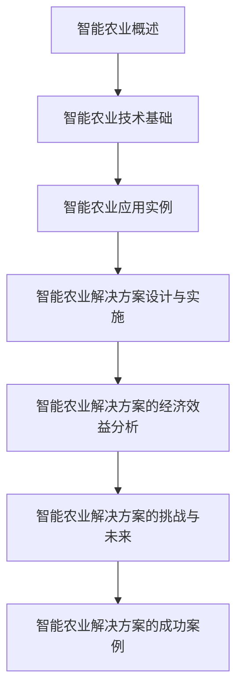
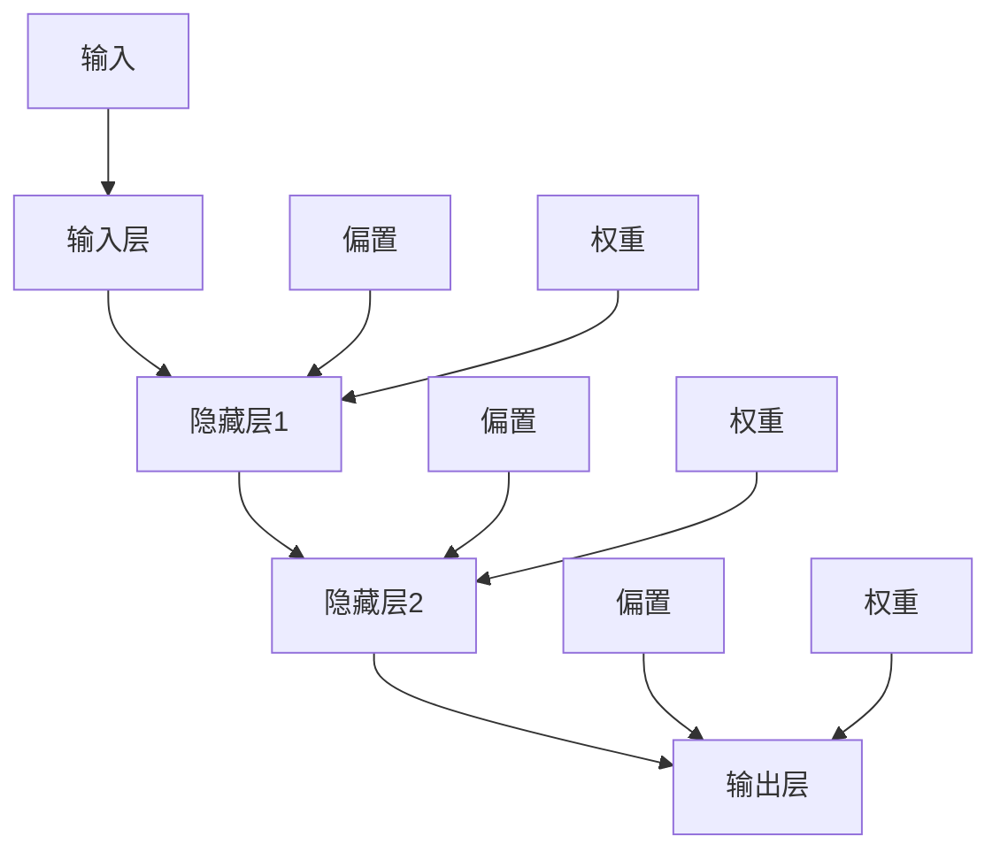
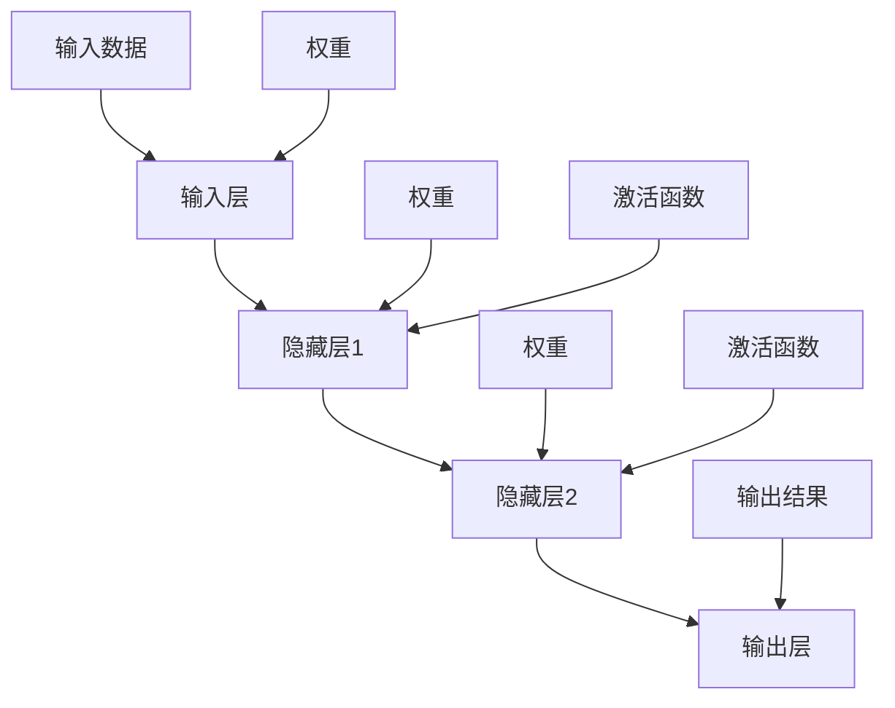
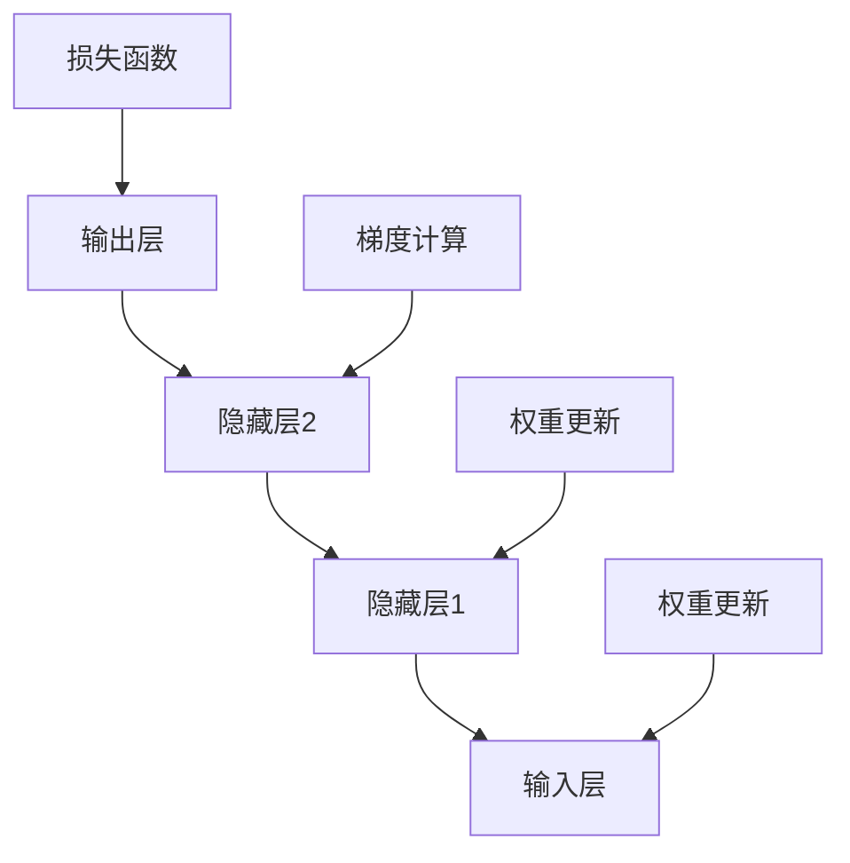
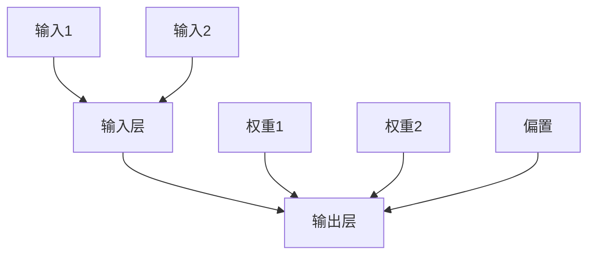
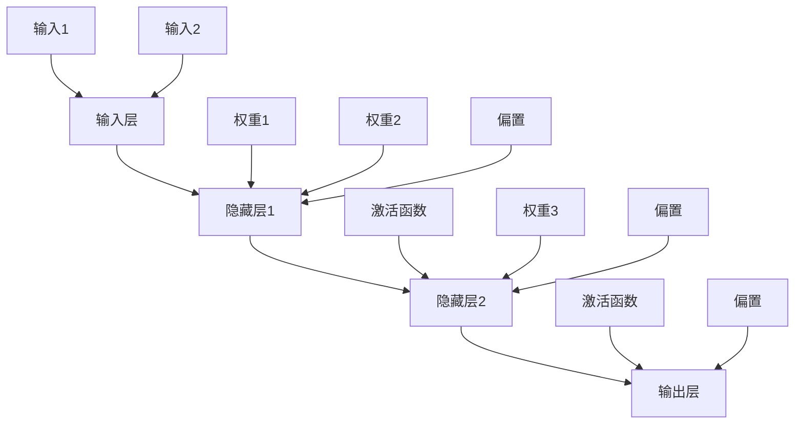
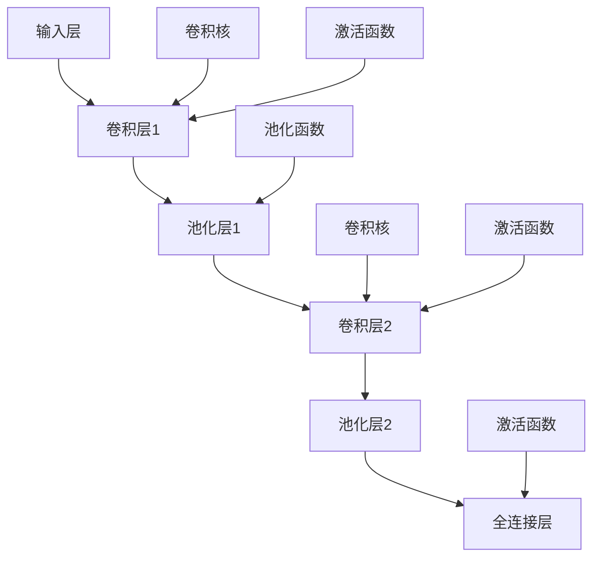
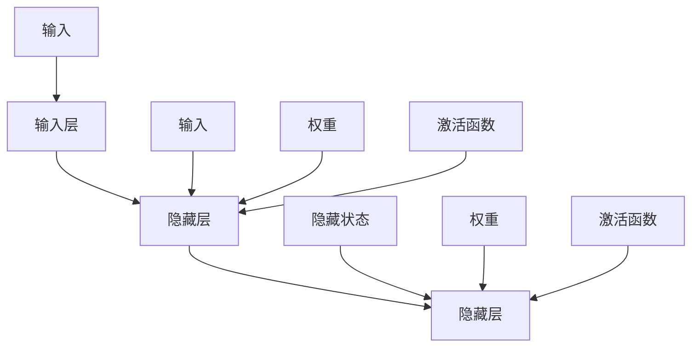
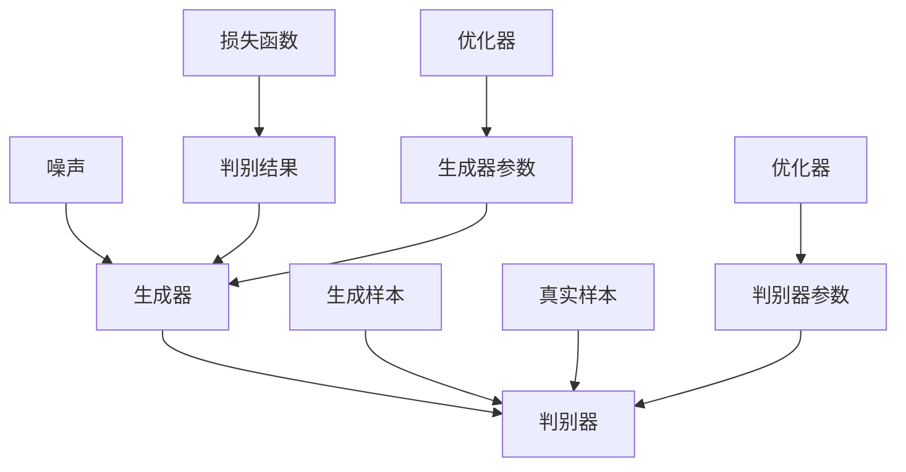

                 

## 《智能农业解决方案：科技赋能传统产业》

> **关键词**：智能农业、物联网、人工智能、传感器、数据挖掘、经济效益

> **摘要**：本文将探讨智能农业解决方案如何通过科技赋能传统农业产业，提高生产效率、降低成本、提升农产品质量，从而实现农业产业的现代化转型。文章将从智能农业概述、技术基础、应用实例、解决方案设计、经济效益分析以及未来挑战与机遇等多个角度，全面解析智能农业的发展现状与趋势，为农业产业的升级提供有益的启示。

### 《智能农业解决方案：科技赋能传统产业》目录大纲

#### 第一部分：智能农业概述

- **第1章：智能农业引论**
  - **1.1 智能农业的定义与背景**
    - **1.1.1 传统农业的挑战**
    - **1.1.2 智能农业的机遇**
    - **1.1.3 智能农业的核心要素**
  - **1.2 智能农业的发展现状与趋势**
    - **1.2.1 全球智能农业发展概况**
    - **1.2.2 我国智能农业发展现状**
    - **1.2.3 未来智能农业发展趋势**
  - **1.3 智能农业与现代农业的区别**
    - **1.3.1 传统农业与智能农业的比较**
    - **1.3.2 智能农业对农业产业的影响**
    - **1.3.3 智能农业对农村社会的影响**

#### 第二部分：智能农业技术基础

- **第2章：智能农业关键技术**
  - **2.1 传感器技术**
    - **2.1.1 传感器的基本原理**
    - **2.1.2 常用传感器类型**
    - **2.1.3 传感器在智能农业中的应用**
  - **2.2 物联网技术**
    - **2.2.1 物联网的基本概念**
    - **2.2.2 物联网技术在农业中的应用**
    - **2.2.3 农业物联网系统的构建**
  - **2.3 数据分析技术**
    - **2.3.1 数据分析的基本方法**
    - **2.3.2 数据挖掘技术**
    - **2.3.3 数据分析在智能农业中的应用**
  - **2.4 人工智能技术**
    - **2.4.1 人工智能的基本原理**
    - **2.4.2 人工智能技术在农业中的应用**
    - **2.4.3 人工智能在智能农业中的未来趋势**

#### 第三部分：智能农业应用实例

- **第3章：智能农业应用实例**
  - **3.1 智能灌溉系统**
    - **3.1.1 智能灌溉系统的原理**
    - **3.1.2 智能灌溉系统的应用场景**
    - **3.1.3 智能灌溉系统的实施步骤**
  - **3.2 智能种植系统**
    - **3.2.1 智能种植系统的原理**
    - **3.2.2 智能种植系统的应用场景**
    - **3.2.3 智能种植系统的实施步骤**
  - **3.3 智能植保系统**
    - **3.3.1 智能植保系统的原理**
    - **3.3.2 智能植保系统的应用场景**
    - **3.3.3 智能植保系统的实施步骤**
  - **3.4 智能养殖系统**
    - **3.4.1 智能养殖系统的原理**
    - **3.4.2 智能养殖系统的应用场景**
    - **3.4.3 智能养殖系统的实施步骤**

#### 第四部分：智能农业解决方案

- **第4章：智能农业解决方案设计与实施**
  - **4.1 智能农业解决方案概述**
    - **4.1.1 智能农业解决方案的定义**
    - **4.1.2 智能农业解决方案的目标**
    - **4.1.3 智能农业解决方案的基本架构**
  - **4.2 智能农业解决方案的设计**
    - **4.2.1 需求分析**
    - **4.2.2 系统设计**
    - **4.2.3 技术选型**
  - **4.3 智能农业解决方案的实施**
    - **4.3.1 项目启动与规划**
    - **4.3.2 系统开发与集成**
    - **4.3.3 系统测试与优化**
  - **4.4 智能农业解决方案的运营与维护**
    - **4.4.1 运营策略**
    - **4.4.2 维护策略**
    - **4.4.3 用户支持与培训**

#### 第五部分：智能农业解决方案的经济效益分析

- **第5章：智能农业解决方案的经济效益分析**
  - **5.1 经济效益分析框架**
    - **5.1.1 经济效益分析的基本概念**
    - **5.1.2 经济效益分析的方法**
    - **5.1.3 经济效益分析的关键指标**
  - **5.2 智能农业解决方案的经济效益**
    - **5.2.1 提高生产效率**
    - **5.2.2 降低生产成本**
    - **5.2.3 提高农产品质量**
    - **5.2.4 增加农民收入**
  - **5.3 智能农业解决方案的盈利模式**
    - **5.3.1 直接盈利模式**
    - **5.3.2 间接盈利模式**
    - **5.3.3 持续盈利模式**

#### 第六部分：智能农业解决方案的挑战与未来

- **第6章：智能农业解决方案的挑战与未来**
  - **6.1 智能农业解决方案的挑战**
    - **6.1.1 技术挑战**
    - **6.1.2 经济挑战**
    - **6.1.3 社会挑战**
  - **6.2 智能农业解决方案的未来发展趋势**
    - **6.2.1 技术创新趋势**
    - **6.2.2 政策趋势**
    - **6.2.3 市场趋势**
  - **6.3 智能农业解决方案的发展策略**
    - **6.3.1 企业策略**
    - **6.3.2 政府策略**
    - **6.3.3 社会策略**

#### 第七部分：智能农业解决方案的成功案例

- **第7章：智能农业解决方案的成功案例**
  - **7.1 国外智能农业解决方案成功案例**
    - **7.1.1 美国成功案例**
    - **7.1.2 欧洲成功案例**
    - **7.1.3 日本成功案例**
  - **7.2 国内智能农业解决方案成功案例**
    - **7.2.1 山东成功案例**
    - **7.2.2 江苏成功案例**
    - **7.2.3 四川成功案例**

#### 附录

- **附录A：智能农业解决方案相关资源**
  - **A.1 技术资源**
  - **A.2 政策资源**
  - **A.3 行业资源**

- **附录B：智能农业解决方案术语表**
  - **B.1 传感器**
  - **B.2 物联网**
  - **B.3 数据分析**
  - **B.4 人工智能**

### 第一部分：智能农业概述

#### 第1章：智能农业引论

智能农业，作为一种现代化的农业生产方式，通过应用物联网、大数据、人工智能等先进技术，实现对农业生产全过程的高效管理、优化控制和智能决策。本章将介绍智能农业的定义、背景，以及其核心要素，旨在为读者提供一个全面而清晰的智能农业概述。

##### 1.1 智能农业的定义与背景

**1.1.1 传统农业的挑战**

传统农业主要依靠人力和简单的机械设备进行生产，这种方式存在以下几大挑战：

1. **生产效率低**：传统农业依赖人工操作，生产效率低下，导致农产品产量不稳定。
2. **资源浪费**：传统农业在灌溉、施肥等方面缺乏科学管理，容易造成水资源和肥料的浪费。
3. **管理难度大**：传统农业缺乏实时监测和数据支持，农业生产管理难度大，决策具有较大的盲目性。
4. **环境污染**：过量使用化肥和农药，导致土壤和水资源的污染。

**1.1.2 智能农业的机遇**

随着信息技术的飞速发展，尤其是物联网、大数据和人工智能技术的广泛应用，为传统农业的转型升级提供了新的机遇：

1. **提高生产效率**：通过自动化和智能化设备，实现农业生产过程的精准控制，大幅提高生产效率。
2. **优化资源管理**：利用大数据分析，实现水、肥、光、气等资源的精准投放，降低资源浪费。
3. **智能决策支持**：通过物联网设备和大数据分析，提供实时监测和智能决策支持，减少盲目性。
4. **减少环境污染**：通过科学施肥和精准用药，降低化肥和农药的使用量，减少环境污染。

**1.1.3 智能农业的核心要素**

智能农业的核心要素主要包括：

1. **传感器技术**：用于实时监测土壤水分、气温、湿度、光照等环境参数。
2. **物联网技术**：实现传感器数据的采集、传输和存储，构建智能农业网络。
3. **大数据分析**：通过对传感器数据的处理和分析，提供科学的农业生产管理决策。
4. **人工智能技术**：利用机器学习和深度学习算法，实现智能预测和自动化控制。

##### 1.2 智能农业的发展现状与趋势

**1.2.1 全球智能农业发展概况**

全球智能农业发展迅速，各国纷纷出台相关政策和计划，推动农业智能化进程。以下为全球智能农业发展的主要特点：

1. **美国**：美国在智能农业领域处于领先地位，通过大数据和人工智能技术，实现了精准农业和智能农场。
2. **欧洲**：欧洲各国高度重视智能农业的发展，通过政策扶持和科技创新，推动了农业智能化进程。
3. **日本**：日本在智能农业领域也有显著成果，通过机器人、自动化设备和物联网技术，实现了农业生产的高效管理。

**1.2.2 我国智能农业发展现状**

我国智能农业发展起步较晚，但近年来发展迅猛。以下为我国智能农业发展的主要特点：

1. **政策支持**：国家出台了一系列政策，鼓励农业智能化发展，为智能农业提供了良好的政策环境。
2. **技术创新**：国内众多企业和技术机构积极参与智能农业技术研发，推动了智能农业技术的进步。
3. **应用推广**：智能农业技术在农田灌溉、种植、植保等领域得到了广泛应用，取得了显著成效。

**1.2.3 未来智能农业发展趋势**

未来智能农业将呈现以下发展趋势：

1. **技术融合**：物联网、大数据、人工智能等技术与农业的深度融合，将推动智能农业向更高层次发展。
2. **智能化升级**：智能农业设备将更加智能化、自动化，实现全方位的农业生产管理。
3. **产业融合**：智能农业将与其他产业深度融合，如农业与物流、金融、旅游等产业，形成新的产业生态。
4. **国际合作**：全球智能农业将进一步加强合作，共同推动智能农业技术的发展。

##### 1.3 智能农业与现代农业的区别

**1.3.1 传统农业与智能农业的比较**

传统农业与智能农业在多个方面存在显著差异，以下为具体比较：

1. **生产方式**：传统农业主要依赖人力和简单机械设备，智能农业则采用自动化和智能化设备。
2. **资源管理**：传统农业资源管理较为粗放，智能农业通过大数据分析实现精准管理。
3. **决策支持**：传统农业决策主要依靠经验，智能农业通过物联网设备和大数据分析提供智能决策支持。
4. **生产效率**：传统农业生产效率低，智能农业生产效率高，可实现大规模、高效率生产。

**1.3.2 智能农业对农业产业的影响**

智能农业对农业产业产生了深远影响：

1. **提高生产效率**：通过智能化设备和管理系统，实现生产过程的精准控制，大幅提高生产效率。
2. **降低生产成本**：优化资源管理，降低水资源、肥料、农药的使用量，减少生产成本。
3. **提升农产品质量**：通过科学施肥、精准用药，提高农产品质量，增强市场竞争力。
4. **推动产业升级**：智能农业技术的应用，推动农业产业向现代化、智能化转型升级。

**1.3.3 智能农业对农村社会的影响**

智能农业对农村社会产生了积极影响：

1. **提高农民收入**：智能农业技术提高生产效率和农产品质量，增加农民收入。
2. **促进农村劳动力转移**：智能农业技术减少人力需求，促进农村劳动力向城市转移，推动农村社会转型。
3. **推动农村产业发展**：智能农业技术的应用，推动农村产业升级，形成新的农村产业生态。
4. **改善农村生活环境**：智能农业技术提高农业生产效率，减少农药和化肥的使用，改善农村生活环境。

#### 第二部分：智能农业技术基础

##### 第2章：智能农业关键技术

智能农业的发展离不开先进技术的支持，其中传感器技术、物联网技术、数据分析技术和人工智能技术是智能农业的核心技术。本章将详细介绍这些关键技术的基本原理、应用领域及其在智能农业中的作用。

##### 2.1 传感器技术

**2.1.1 传感器的基本原理**

传感器是智能农业的核心元件，它能够将物理信号（如温度、湿度、光照、土壤水分等）转化为电信号，以便于后续处理和分析。传感器的基本原理基于物理效应、化学效应和生物效应。

1. **物理效应**：例如热敏电阻、光敏电阻等，通过物理参数的变化来感知外界环境。
2. **化学效应**：例如气体传感器、湿度传感器等，通过化学反应来感知气体成分或湿度变化。
3. **生物效应**：例如生物传感器，通过生物体对外界刺激的响应来感知生物信息。

**2.1.2 常用传感器类型**

在智能农业中，常用的传感器包括：

1. **土壤传感器**：用于测量土壤的湿度、酸碱度、温度等。
2. **气象传感器**：用于测量空气温度、湿度、气压、风速、雨量等。
3. **植物生长传感器**：用于测量植物的生长状态、叶绿素含量等。
4. **病虫害传感器**：用于检测农作物上的病虫害情况。

**2.1.3 传感器在智能农业中的应用**

传感器在智能农业中的应用主要包括：

1. **环境监测**：通过土壤、气象、植物生长等传感器，实时监测农田环境参数，为农业生产提供数据支持。
2. **灌溉管理**：通过土壤湿度传感器，实现灌溉系统的自动控制，根据土壤湿度自动调节灌溉量。
3. **病虫害预警**：通过病虫害传感器，实时监测农作物病虫害情况，提前预警并采取防治措施。
4. **温室控制**：通过气象传感器和植物生长传感器，实现温室环境参数的自动调节，为植物提供最佳生长环境。

##### 2.2 物联网技术

**2.2.1 物联网的基本概念**

物联网（Internet of Things，IoT）是通过传感器、网络和数据处理技术，实现物理设备互联和信息交换的技术体系。物联网的基本概念包括：

1. **设备互联**：通过传感器和通信技术，将各种物理设备互联，形成一个庞大的网络体系。
2. **数据采集与传输**：传感器采集设备状态和环境数据，通过无线网络传输到中心服务器进行处理。
3. **数据处理与分析**：中心服务器对采集到的数据进行处理、分析和存储，为决策提供支持。

**2.2.2 物联网技术在农业中的应用**

物联网技术在智能农业中的应用主要包括：

1. **环境监测与控制**：通过物联网技术，实现对农田环境参数的实时监测和自动控制，提高农业生产效率。
2. **远程控制与监测**：通过物联网技术，实现对农田设备的远程控制和监测，提高管理效率。
3. **数据共享与决策支持**：通过物联网技术，实现农业数据的共享，为农业生产提供科学决策支持。
4. **智能农业系统构建**：通过物联网技术，构建智能农业系统，实现农业生产的自动化和智能化。

**2.2.3 农业物联网系统的构建**

农业物联网系统的构建主要包括以下步骤：

1. **需求分析**：明确农业物联网系统的目标和需求，确定系统的功能和性能指标。
2. **设备选型**：根据需求选择合适的传感器、控制器和通信设备。
3. **系统设计**：设计系统的架构和接口，确定数据采集、传输和处理方案。
4. **系统实施**：安装和配置传感器和控制器，搭建通信网络，实现系统运行。
5. **系统维护**：定期检查和维护系统设备，确保系统正常运行。

##### 2.3 数据分析技术

**2.3.1 数据分析的基本方法**

数据分析是智能农业的重要组成部分，通过对农业生产数据的处理和分析，为农业生产提供科学决策支持。数据分析的基本方法包括：

1. **数据采集**：通过传感器和物联网设备，采集农田环境参数和作物生长数据。
2. **数据预处理**：对采集到的数据进行清洗、去噪和格式转换，为后续分析做好准备。
3. **数据存储**：将预处理后的数据存储到数据库或数据仓库中，便于后续处理和分析。
4. **数据分析**：采用统计分析、机器学习、数据挖掘等方法，对数据进行深入分析，提取有用的信息和知识。
5. **数据可视化**：通过图表、地图等形式，将分析结果直观地展示出来，便于用户理解和决策。

**2.3.2 数据挖掘技术**

数据挖掘是数据分析的重要手段，通过挖掘大量的农业数据，发现其中的规律和趋势，为农业生产提供科学依据。数据挖掘的主要技术包括：

1. **分类**：将数据按照某种规则进行分类，以便于后续分析。
2. **聚类**：将相似的数据点聚集在一起，形成不同的类别。
3. **关联规则挖掘**：发现数据之间的关联关系，揭示潜在的信息。
4. **异常检测**：识别数据中的异常情况，为农业生产提供预警。
5. **预测**：基于历史数据，对未来情况进行预测，为决策提供支持。

**2.3.3 数据分析在智能农业中的应用**

数据分析在智能农业中的应用主要包括：

1. **环境监测与调控**：通过对环境数据的分析，实现农田环境参数的自动调控，为作物生长提供最佳环境。
2. **种植管理**：通过对作物生长数据的分析，实现种植过程的精准管理，提高作物产量和质量。
3. **病虫害监测与防治**：通过对病虫害数据的分析，实现病虫害的提前预警和精准防治，减少农药使用量。
4. **产量预测**：通过对历史产量数据的分析，预测未来产量，为农业生产计划提供支持。

##### 2.4 人工智能技术

**2.4.1 人工智能的基本原理**

人工智能（Artificial Intelligence，AI）是模拟人类智能行为的技术，通过机器学习、深度学习等方法，使计算机具备自动学习、推理和决策能力。人工智能的基本原理包括：

1. **机器学习**：通过训练模型，使计算机学会从数据中提取特征、建立预测模型。
2. **深度学习**：基于多层神经网络，实现数据的自动特征提取和分类。
3. **自然语言处理**：使计算机理解和生成自然语言，实现人机交互。
4. **计算机视觉**：使计算机理解和解释图像和视频信息。

**2.4.2 人工智能技术在农业中的应用**

人工智能技术在农业中的应用主要包括：

1. **精准农业**：利用机器学习和深度学习技术，实现农田环境参数的精准监测和作物生长的精准管理。
2. **病虫害预测与防治**：通过计算机视觉和自然语言处理技术，实现病虫害的自动识别和防治。
3. **产量预测**：利用大数据分析技术，预测作物产量，为农业生产计划提供支持。
4. **农业机器人**：利用机器人技术和人工智能，实现农业生产的自动化和智能化。

**2.4.3 人工智能在智能农业中的未来趋势**

随着人工智能技术的不断发展，智能农业将呈现以下趋势：

1. **智能化水平提高**：人工智能技术将进一步提高农业生产的智能化水平，实现更高效、更精准的农业生产。
2. **产业链融合**：人工智能技术将贯穿整个农业产业链，实现产业链的智能化和高效化。
3. **跨界合作**：人工智能技术将与农业、工业、服务业等产业深度融合，形成新的产业生态。
4. **可持续发展**：人工智能技术将助力农业实现可持续发展，减少资源浪费和环境污染。

### 第三部分：智能农业应用实例

智能农业技术的应用实例涵盖了农业生产的各个环节，包括智能灌溉系统、智能种植系统、智能植保系统和智能养殖系统。这些系统通过集成传感器技术、物联网技术和数据分析技术，实现了农业生产的自动化和智能化。本章将详细介绍这些系统的原理、应用场景和实施步骤。

##### 第3章：智能农业应用实例

##### 3.1 智能灌溉系统

**3.1.1 智能灌溉系统的原理**

智能灌溉系统是一种基于传感器技术和物联网技术的自动化灌溉系统，通过实时监测土壤水分和气象数据，实现灌溉量的智能调节。智能灌溉系统的基本原理包括：

1. **土壤水分监测**：利用土壤水分传感器，实时监测土壤水分含量。
2. **气象数据采集**：利用气象传感器，采集空气温度、湿度、风速等气象数据。
3. **灌溉量计算**：根据土壤水分和气象数据，通过算法计算所需的灌溉量。
4. **灌溉执行**：通过智能控制器，自动调节灌溉设备，实现灌溉量的智能控制。

**3.1.2 智能灌溉系统的应用场景**

智能灌溉系统广泛应用于农田、果园、蔬菜大棚等多种农业生产场景。以下为智能灌溉系统的几个典型应用场景：

1. **农田灌溉**：在农田中，智能灌溉系统可以根据土壤水分含量和气象数据，实现精准灌溉，提高水资源利用效率。
2. **果园管理**：在果园中，智能灌溉系统可以根据果树的生长需求和气象数据，实现精确灌溉，提高果实品质。
3. **蔬菜大棚**：在蔬菜大棚中，智能灌溉系统可以根据蔬菜的生长阶段和气象数据，实现精准灌溉，保证蔬菜的生长质量和产量。

**3.1.3 智能灌溉系统的实施步骤**

实施智能灌溉系统主要包括以下步骤：

1. **需求分析**：明确智能灌溉系统的目标和需求，确定系统的功能和性能指标。
2. **设备选型**：根据需求选择合适的土壤水分传感器、气象传感器和智能控制器。
3. **系统设计**：设计系统的架构和接口，确定数据采集、传输和处理方案。
4. **设备安装**：安装土壤水分传感器、气象传感器和智能控制器，搭建灌溉设备。
5. **系统调试**：调试系统设备，确保系统能够正常运行。
6. **系统运行**：将智能灌溉系统投入运行，实时监测土壤水分和气象数据，实现灌溉量的智能调节。

##### 3.2 智能种植系统

**3.2.1 智能种植系统的原理**

智能种植系统是一种基于传感器技术和物联网技术的自动化种植系统，通过实时监测土壤、气象、作物生长等数据，实现种植过程的智能调控。智能种植系统的基本原理包括：

1. **土壤监测**：利用土壤传感器，实时监测土壤水分、温度、酸碱度等参数。
2. **气象数据采集**：利用气象传感器，采集空气温度、湿度、风速、光照等气象数据。
3. **作物生长监测**：利用植物生长传感器，监测作物生长状态，如株高、叶绿素含量等。
4. **种植调控**：通过智能控制器，根据土壤、气象和作物生长数据，实现种植过程的智能调控，如灌溉、施肥、病虫害防治等。

**3.2.2 智能种植系统的应用场景**

智能种植系统广泛应用于蔬菜、水果、粮食等作物的种植。以下为智能种植系统的几个典型应用场景：

1. **蔬菜种植**：在蔬菜种植中，智能种植系统可以根据蔬菜的生长需求和气象数据，实现精准灌溉、施肥和病虫害防治，提高蔬菜产量和质量。
2. **水果种植**：在水果种植中，智能种植系统可以根据果树的生长需求和环境数据，实现精准管理，提高水果品质和产量。
3. **粮食种植**：在粮食种植中，智能种植系统可以根据作物生长状态和环境数据，实现精准管理，提高粮食产量和质量。

**3.2.3 智能种植系统的实施步骤**

实施智能种植系统主要包括以下步骤：

1. **需求分析**：明确智能种植系统的目标和需求，确定系统的功能和性能指标。
2. **设备选型**：根据需求选择合适的土壤传感器、气象传感器、植物生长传感器和智能控制器。
3. **系统设计**：设计系统的架构和接口，确定数据采集、传输和处理方案。
4. **设备安装**：安装土壤传感器、气象传感器、植物生长传感器和智能控制器，搭建种植设备。
5. **系统调试**：调试系统设备，确保系统能够正常运行。
6. **系统运行**：将智能种植系统投入运行，实时监测土壤、气象和作物生长数据，实现种植过程的智能调控。

##### 3.3 智能植保系统

**3.3.1 智能植保系统的原理**

智能植保系统是一种基于传感器技术和物联网技术的自动化植保系统，通过实时监测病虫害信息，实现植保作业的智能调控。智能植保系统的基本原理包括：

1. **病虫害监测**：利用病虫害传感器，实时监测农作物病虫害情况。
2. **数据采集与传输**：利用物联网技术，将病虫害数据传输到中心服务器进行处理。
3. **植保作业调控**：通过智能控制器，根据病虫害数据，自动调节植保设备，实现精准植保作业。

**3.3.2 智能植保系统的应用场景**

智能植保系统广泛应用于农田、果园、蔬菜大棚等多种农业生产场景。以下为智能植保系统的几个典型应用场景：

1. **农田植保**：在农田中，智能植保系统可以根据农作物病虫害情况，实现精准植保作业，减少农药使用量，提高农作物产量和质量。
2. **果园植保**：在果园中，智能植保系统可以根据果树病虫害情况，实现精准植保作业，提高果实品质。
3. **蔬菜大棚植保**：在蔬菜大棚中，智能植保系统可以根据蔬菜病虫害情况，实现精准植保作业，保证蔬菜的生长质量和产量。

**3.3.3 智能植保系统的实施步骤**

实施智能植保系统主要包括以下步骤：

1. **需求分析**：明确智能植保系统的目标和需求，确定系统的功能和性能指标。
2. **设备选型**：根据需求选择合适的病虫害传感器、智能控制器和植保设备。
3. **系统设计**：设计系统的架构和接口，确定数据采集、传输和处理方案。
4. **设备安装**：安装病虫害传感器、智能控制器和植保设备，搭建植保系统。
5. **系统调试**：调试系统设备，确保系统能够正常运行。
6. **系统运行**：将智能植保系统投入运行，实时监测农作物病虫害情况，实现精准植保作业。

##### 3.4 智能养殖系统

**3.4.1 智能养殖系统的原理**

智能养殖系统是一种基于传感器技术和物联网技术的自动化养殖系统，通过实时监测养殖环境数据和动物生理参数，实现养殖过程的智能调控。智能养殖系统的基本原理包括：

1. **环境监测**：利用环境传感器，实时监测养殖环境的温度、湿度、气体浓度等参数。
2. **生理参数监测**：利用生理参数传感器，实时监测动物的体温、心率、呼吸等生理参数。
3. **养殖调控**：通过智能控制器，根据环境数据和生理参数，自动调节养殖设备，实现养殖过程的智能调控。

**3.4.2 智能养殖系统的应用场景**

智能养殖系统广泛应用于畜牧、水产养殖等多种养殖场景。以下为智能养殖系统的几个典型应用场景：

1. **畜牧养殖**：在畜牧养殖中，智能养殖系统可以根据动物生理参数和环境数据，实现精准养殖，提高动物生长速度和健康水平。
2. **水产养殖**：在水产养殖中，智能养殖系统可以根据水质参数和鱼类的生理参数，实现精准养殖，提高鱼类的生长速度和品质。
3. **特种养殖**：在特种养殖中，智能养殖系统可以根据动物的特殊生理需求和环境需求，实现精准养殖，提高动物的生长和繁殖效率。

**3.4.3 智能养殖系统的实施步骤**

实施智能养殖系统主要包括以下步骤：

1. **需求分析**：明确智能养殖系统的目标和需求，确定系统的功能和性能指标。
2. **设备选型**：根据需求选择合适的环境传感器、生理参数传感器和智能控制器。
3. **系统设计**：设计系统的架构和接口，确定数据采集、传输和处理方案。
4. **设备安装**：安装环境传感器、生理参数传感器和智能控制器，搭建养殖系统。
5. **系统调试**：调试系统设备，确保系统能够正常运行。
6. **系统运行**：将智能养殖系统投入运行，实时监测养殖环境和动物生理参数，实现养殖过程的智能调控。

### 第四部分：智能农业解决方案

智能农业解决方案是智能农业技术的具体应用，通过系统化的设计、实施和运营，实现农业生产的自动化和智能化。本章将介绍智能农业解决方案的基本概念、设计原则、实施步骤以及运营和维护策略。

##### 第4章：智能农业解决方案设计与实施

##### 4.1 智能农业解决方案概述

**4.1.1 智能农业解决方案的定义**

智能农业解决方案是指通过物联网、大数据、人工智能等先进技术，对农业生产全过程进行自动化、智能化管理，从而提高生产效率、降低成本、提升农产品质量的系统方案。

**4.1.2 智能农业解决方案的目标**

智能农业解决方案的主要目标包括：

1. **提高生产效率**：通过自动化和智能化设备，实现农业生产过程的精准控制，大幅提高生产效率。
2. **降低生产成本**：通过优化资源管理，降低水资源、肥料、农药的使用量，减少生产成本。
3. **提升农产品质量**：通过科学施肥、精准用药，提高农产品质量，增强市场竞争力。
4. **实现可持续发展**：通过减少资源浪费和环境污染，实现农业生产的可持续发展。

**4.1.3 智能农业解决方案的基本架构**

智能农业解决方案的基本架构包括以下几个层次：

1. **数据采集层**：通过传感器技术，实时采集农业生产环境数据、作物生长数据和动物生理参数。
2. **数据处理层**：通过物联网技术，将采集到的数据传输到中心服务器，进行预处理、存储和分析。
3. **应用层**：通过数据分析技术和人工智能技术，实现对农业生产过程的智能调控和决策支持。
4. **用户界面层**：通过可视化技术，将分析结果和决策建议展示给用户，方便用户进行操作和监控。

##### 4.2 智能农业解决方案的设计

**4.2.1 需求分析**

需求分析是智能农业解决方案设计的首要步骤，主要包括以下几个方面：

1. **明确目标**：明确智能农业解决方案的目标，如提高生产效率、降低成本、提升产品质量等。
2. **确定功能**：根据目标，确定智能农业解决方案的功能，如环境监测、作物生长监控、智能灌溉、智能施肥、智能植保等。
3. **分析需求**：分析用户的需求，如用户对系统性能、操作便利性、数据安全性等方面的需求。
4. **确定性能指标**：根据需求和目标，确定智能农业解决方案的性能指标，如数据采集的准确性、系统的响应速度、决策的准确性等。

**4.2.2 系统设计**

系统设计是智能农业解决方案设计的关键环节，主要包括以下几个部分：

1. **硬件设计**：根据需求，选择合适的传感器、控制器、通信模块等硬件设备，并设计硬件系统的架构和接口。
2. **软件设计**：设计智能农业解决方案的软件系统，包括数据采集、传输、处理、分析和决策等模块，并确定软件系统的架构和接口。
3. **数据存储与处理**：设计数据存储和处理方案，包括数据采集、预处理、存储、分析和挖掘等环节。
4. **用户界面设计**：设计用户界面，包括数据展示、操作控制、报警提示等功能。

**4.2.3 技术选型**

技术选型是智能农业解决方案设计的重要环节，主要包括以下几个方面：

1. **传感器技术**：根据需求，选择合适的传感器，如土壤水分传感器、气象传感器、植物生长传感器等。
2. **物联网技术**：选择合适的物联网技术，如ZigBee、LoRa、NB-IoT等，实现数据的采集、传输和存储。
3. **数据分析技术**：选择合适的数据分析技术，如统计分析、数据挖掘、机器学习等，实现数据的分析和处理。
4. **人工智能技术**：选择合适的人工智能技术，如深度学习、自然语言处理等，实现智能决策和自动化控制。

##### 4.3 智能农业解决方案的实施

**4.3.1 项目启动与规划**

项目启动与规划是智能农业解决方案实施的第一步，主要包括以下几个方面：

1. **项目立项**：明确项目目标和需求，制定项目计划和预算。
2. **资源筹备**：筹备项目所需的硬件设备、软件系统、人力资源等。
3. **风险评估**：对项目实施过程中可能出现的风险进行评估，制定应对措施。

**4.3.2 系统开发与集成**

系统开发与集成是智能农业解决方案实施的核心环节，主要包括以下几个方面：

1. **硬件系统集成**：根据设计文档，安装和调试硬件设备，实现硬件系统的集成。
2. **软件系统集成**：根据设计文档，开发软件系统，实现软件系统的集成。
3. **数据系统集成**：实现数据采集、传输、处理和存储系统的集成，确保数据流通畅通。
4. **用户界面集成**：根据设计文档，开发用户界面，实现用户界面的集成。

**4.3.3 系统测试与优化**

系统测试与优化是智能农业解决方案实施的关键环节，主要包括以下几个方面：

1. **功能测试**：对系统功能进行测试，确保系统能够按照设计要求正常运行。
2. **性能测试**：对系统性能进行测试，确保系统在高负载下能够稳定运行。
3. **安全测试**：对系统进行安全测试，确保系统数据的安全和用户的隐私保护。
4. **优化调整**：根据测试结果，对系统进行优化调整，提高系统的性能和可靠性。

##### 4.4 智能农业解决方案的运营与维护

**4.4.1 运营策略**

智能农业解决方案的运营策略主要包括以下几个方面：

1. **数据管理**：建立完善的数据管理制度，确保数据的准确性、完整性和安全性。
2. **用户服务**：提供优质的用户服务，包括系统操作培训、技术支持、故障处理等。
3. **设备维护**：定期对硬件设备进行维护和保养，确保设备的正常运行。
4. **系统升级**：定期对软件系统进行升级，提高系统的性能和功能。

**4.4.2 维护策略**

智能农业解决方案的维护策略主要包括以下几个方面：

1. **定期检查**：定期对系统设备进行检查，确保设备的正常运行。
2. **故障处理**：一旦系统出现故障，及时进行故障处理，确保系统尽快恢复正常运行。
3. **数据备份**：定期对系统数据进行备份，防止数据丢失。
4. **安全防护**：加强系统安全防护，防止网络攻击和数据泄露。

**4.4.3 用户支持与培训**

智能农业解决方案的用户支持与培训主要包括以下几个方面：

1. **用户手册**：提供详细的用户手册，帮助用户了解系统功能和操作方法。
2. **在线支持**：建立在线支持平台，为用户提供在线咨询和技术支持。
3. **培训课程**：定期举办培训课程，提高用户对系统的操作能力和应用水平。
4. **反馈机制**：建立用户反馈机制，及时了解用户需求和意见，不断优化系统。

### 第五部分：智能农业解决方案的经济效益分析

智能农业解决方案通过自动化和智能化手段，提高了农业生产效率、降低了生产成本、提升了农产品质量，从而带来了显著的经济效益。本章将分析智能农业解决方案的经济效益，包括提高生产效率、降低生产成本、提高农产品质量、增加农民收入等方面的具体体现。

##### 第5章：智能农业解决方案的经济效益分析

##### 5.1 经济效益分析框架

经济效益分析是评估智能农业解决方案经济效益的重要手段，通过分析各项经济效益指标，可以全面了解智能农业解决方案的经济效益。经济效益分析框架主要包括以下几个方面：

1. **成本分析**：分析智能农业解决方案的投入成本，包括硬件设备成本、软件开发成本、运营维护成本等。
2. **收益分析**：分析智能农业解决方案带来的经济效益，包括生产效率提高带来的收益、生产成本降低带来的收益、农产品质量提升带来的收益等。
3. **风险评估**：评估智能农业解决方案实施过程中可能出现的风险，如技术风险、市场风险、政策风险等。
4. **效益评估**：综合分析成本和收益，评估智能农业解决方案的经济效益。

##### 5.2 智能农业解决方案的经济效益

**5.2.1 提高生产效率**

智能农业解决方案通过自动化和智能化手段，显著提高了农业生产效率，具体体现在以下几个方面：

1. **减少人力投入**：通过自动化设备，如智能灌溉系统、智能种植系统等，减少了对人力的依赖，降低了人力成本。
2. **缩短生产周期**：通过实时监测和智能调控，提高了农作物的生长速度和产量，缩短了生产周期。
3. **优化生产流程**：通过优化生产流程，减少了生产过程中的不必要环节，提高了生产效率。

**5.2.2 降低生产成本**

智能农业解决方案通过优化资源管理和提高生产效率，有效降低了生产成本，具体体现在以下几个方面：

1. **节约水资源**：智能灌溉系统可以根据土壤水分实时监测数据，实现精准灌溉，节约水资源。
2. **节约肥料和农药**：智能施肥系统和智能植保系统可以根据作物生长状态和病虫害监测数据，实现精准施肥和植保，节约肥料和农药。
3. **降低能源消耗**：通过优化生产流程和设备控制，降低了能源消耗，降低了生产成本。

**5.2.3 提高农产品质量**

智能农业解决方案通过实时监测和智能调控，提高了农产品质量，具体体现在以下几个方面：

1. **优化生长环境**：通过智能调控，提供最佳的作物生长环境，如温度、湿度、光照等，提高了农产品的品质。
2. **减少病虫害**：智能植保系统可以根据病虫害监测数据，实现精准防治，减少了病虫害对农产品的危害。
3. **提高产量**：通过优化生产流程和资源管理，提高了农产品的产量和质量，增强了市场竞争力。

**5.2.4 增加农民收入**

智能农业解决方案通过提高生产效率、降低生产成本和提高农产品质量，显著增加了农民收入，具体体现在以下几个方面：

1. **提高农产品价格**：通过提高农产品质量，增强了市场竞争力，提高了农产品的价格。
2. **增加产量**：通过提高生产效率和产量，增加了农民的收入。
3. **减少生产成本**：通过节约资源和降低能源消耗，减少了农民的生产成本，提高了收入。

##### 5.3 智能农业解决方案的盈利模式

智能农业解决方案的盈利模式主要包括以下几个方面：

1. **设备销售**：通过销售智能农业设备，如传感器、控制器、自动化设备等，获得销售收入。
2. **服务收费**：通过提供智能农业服务，如智能灌溉、智能种植、智能植保等，按服务次数或时长收费。
3. **数据变现**：通过收集和分析农业生产数据，为农业企业、政府等提供数据服务，获得数据收入。
4. **产业链整合**：通过整合农业产业链，提供一整套农业解决方案，实现产业链的协同发展，获得综合收入。

### 第六部分：智能农业解决方案的挑战与未来

智能农业解决方案在带来巨大经济效益的同时，也面临着一系列的挑战。这些挑战涉及技术、经济和社会等多个方面。同时，智能农业解决方案的未来发展也充满机遇。本章将探讨智能农业解决方案面临的挑战和未来的发展趋势。

##### 第6章：智能农业解决方案的挑战与未来

##### 6.1 智能农业解决方案的挑战

**6.1.1 技术挑战**

智能农业解决方案的技术挑战主要包括：

1. **技术成熟度**：虽然物联网、大数据、人工智能等技术在智能农业中已取得一定成果，但技术仍需不断优化和升级，以满足农业生产的需求。
2. **数据质量**：农业生产数据的收集、处理和分析质量直接影响到智能农业解决方案的效果，数据质量问题可能导致决策失误。
3. **设备可靠性**：智能农业设备需要长时间在恶劣的环境下工作，设备的可靠性直接影响解决方案的稳定性。

**6.1.2 经济挑战**

智能农业解决方案的经济挑战主要包括：

1. **成本高**：智能农业设备的初始投资较大，对于一些小规模农户来说，成本负担较重。
2. **回报周期长**：智能农业解决方案的回报周期较长，需要一定时间才能实现经济效益。
3. **技术更新换代**：随着技术的不断进步，智能农业设备也需要定期更新换代，增加了运营成本。

**6.1.3 社会挑战**

智能农业解决方案的社会挑战主要包括：

1. **农民接受度**：农民对新技术的接受度较低，推广智能农业解决方案面临一定的困难。
2. **政策支持**：政策支持不足，可能导致智能农业解决方案的推广受阻。
3. **社会认知**：社会对智能农业的认知不足，影响了智能农业解决方案的普及。

##### 6.2 智能农业解决方案的未来发展趋势

**6.2.1 技术创新趋势**

智能农业解决方案的未来发展将依赖于技术的不断创新：

1. **物联网技术**：物联网技术将更加普及和成熟，实现更高精度、更低功耗的传感器设备和更稳定的通信网络。
2. **人工智能技术**：人工智能技术将实现更高级别的自动化和智能化，如自主决策、智能优化等。
3. **大数据分析技术**：大数据分析技术将实现更高效的数据处理和分析，为农业生产提供更精准的决策支持。

**6.2.2 政策趋势**

政策趋势对智能农业解决方案的发展具有重要意义：

1. **政策支持**：政府将加大对智能农业的支持力度，通过财政补贴、税收优惠等措施，促进智能农业技术的发展和应用。
2. **法规制定**：政府将制定相关法规，规范智能农业设备的研发、生产和应用，保障农业生产的安全和环保。
3. **国际合作**：政府将推动国际间的智能农业合作，共同研究和开发智能农业技术，推动全球智能农业的发展。

**6.2.3 市场趋势**

智能农业解决方案的市场趋势将呈现以下特点：

1. **市场规模扩大**：随着全球农业现代化的推进，智能农业解决方案的市场需求将不断增加。
2. **产业链整合**：智能农业解决方案将推动农业产业链的整合，实现农业生产的全流程智能化。
3. **多元化应用**：智能农业解决方案将应用于更多的农业领域，如水产养殖、畜牧养殖、果园管理等。

##### 6.3 智能农业解决方案的发展策略

为了克服挑战，抓住机遇，智能农业解决方案的发展需要采取以下策略：

**6.3.1 企业策略**

企业应采取以下策略：

1. **技术创新**：加大技术研发投入，不断优化智能农业技术，提高产品竞争力。
2. **市场拓展**：开拓国内外市场，提高智能农业解决方案的知名度和市场份额。
3. **合作共赢**：与农业企业、科研机构等建立合作关系，共同推进智能农业技术的发展。

**6.3.2 政府策略**

政府应采取以下策略：

1. **政策支持**：制定有利于智能农业发展的政策，提供资金、技术等支持。
2. **人才培养**：加强农业技术人才的培养，提高农业技术人才素质。
3. **产业规划**：制定智能农业产业发展规划，推动农业产业升级。

**6.3.3 社会策略**

社会应采取以下策略：

1. **宣传推广**：加大智能农业的宣传力度，提高农民对新技术的接受度。
2. **公共服务**：提供智能农业公共服务平台，为农民提供便捷的智能农业服务。
3. **技术推广**：推广智能农业技术，促进农业现代化进程。

### 第七部分：智能农业解决方案的成功案例

智能农业解决方案在全球范围内取得了显著的成果，以下是国内外一些成功的智能农业解决方案案例。

##### 7.1 国外智能农业解决方案成功案例

**7.1.1 美国成功案例**

- **案例一：美国智能农场**

  美国智能农场利用物联网技术和大数据分析，实现了农作物生长的全过程监控和智能管理。农场通过传感器实时监测土壤水分、温度、光照等环境参数，结合气象数据和农作物生长模型，自动调节灌溉、施肥和病虫害防治，提高了农作物产量和品质。

- **案例二：IBM智慧农业**

  IBM智慧农业利用人工智能技术和云计算平台，为农场主提供智能农业解决方案。系统通过传感器采集农田数据，结合历史数据和气象预测，提供种植建议、病虫害预警和作物产量预测，帮助农场主实现精准农业管理。

**7.1.2 欧洲成功案例**

- **案例一：德国智能农场**

  德国智能农场采用传感器技术和自动化设备，实现了农作物生长的全过程监控和智能管理。农场通过传感器实时监测土壤水分、温度、光照等环境参数，自动调节灌溉、施肥和病虫害防治，提高了农作物产量和品质。

- **案例二：荷兰智能温室**

  荷兰智能温室通过智能温室控制系统，实现了温室环境参数的实时监控和自动化调节，提高了农产品产量和质量。系统通过传感器监测温度、湿度、光照等环境参数，自动调节温室内的气候条件，保证了植物的最佳生长环境。

**7.1.3 日本成功案例**

- **案例一：日本农业机器人**

  日本农业机器人是一种利用物联网技术和人工智能技术的农业自动化设备。机器人可以自动进行除草、施肥、收割等作业，提高了农业生产效率。同时，机器人通过传感器采集农田数据，结合大数据分析，实现了农作物的精准管理。

- **案例二：农心智能农业**

  农心智能农业利用物联网技术和大数据分析，实现了农作物的精准种植和智能管理。系统通过传感器实时监测土壤水分、温度、光照等环境参数，结合历史数据和气象预测，提供种植建议、病虫害预警和作物产量预测，帮助农民实现科学种植。

##### 7.2 国内智能农业解决方案成功案例

**7.2.1 山东成功案例**

- **案例一：山东智能农业**

  山东智能农业通过物联网技术和大数据分析，实现了农作物生长的全过程监控和智能管理。系统通过传感器实时监测土壤水分、温度、光照等环境参数，自动调节灌溉、施肥和病虫害防治，提高了农作物产量和品质。

- **案例二：山东智慧农业**

  山东智慧农业通过云计算平台和人工智能技术，提供了智能农业解决方案。系统通过传感器采集农田数据，结合大数据分析，提供种植建议、病虫害预警和作物产量预测，帮助农民实现科学种植。

**7.2.2 江苏成功案例**

- **案例一：江苏智能农业**

  江苏智能农业通过物联网技术和大数据分析，实现了农作物生长的全过程监控和智能管理。系统通过传感器实时监测土壤水分、温度、光照等环境参数，自动调节灌溉、施肥和病虫害防治，提高了农作物产量和品质。

- **案例二：江苏智慧农业**

  江苏智慧农业通过云计算平台和人工智能技术，提供了智能农业解决方案。系统通过传感器采集农田数据，结合大数据分析，提供种植建议、病虫害预警和作物产量预测，帮助农民实现科学种植。

**7.2.3 四川成功案例**

- **案例一：四川智能农业**

  四川智能农业通过物联网技术和大数据分析，实现了农作物生长的全过程监控和智能管理。系统通过传感器实时监测土壤水分、温度、光照等环境参数，自动调节灌溉、施肥和病虫害防治，提高了农作物产量和品质。

- **案例二：四川智慧农业**

  四川智慧农业通过云计算平台和人工智能技术，提供了智能农业解决方案。系统通过传感器采集农田数据，结合大数据分析，提供种植建议、病虫害预警和作物产量预测，帮助农民实现科学种植。

### 附录A：智能农业解决方案相关资源

附录A提供了智能农业解决方案相关的技术、政策和行业资源，以帮助读者深入了解智能农业的发展。

##### A.1 技术资源

1. **智能农业传感器**：包括土壤水分传感器、气象传感器、植物生长传感器等，用于实时监测农业生产环境。
2. **物联网平台**：提供数据采集、传输、存储和管理的服务，如阿里云物联网平台、华为物联网平台等。
3. **数据分析工具**：用于处理、分析和挖掘农业数据，如Python、R语言、Hadoop等。
4. **人工智能算法**：包括机器学习、深度学习等算法，用于农业数据的分析和预测，如TensorFlow、PyTorch等。

##### A.2 政策资源

1. **国家智能农业发展规划**：包括《国家农业科技创新规划（2016-2020年）》、《智慧农业行动计划（2016-2020年）》等。
2. **地方政府政策**：各地政府发布的智能农业相关政策，如山东省《关于推进智慧农业发展的意见》等。
3. **科研机构政策**：各农业科研机构发布的智能农业研究政策和成果，如中国农业科学院智能农业研究中心等。

##### A.3 行业资源

1. **智能农业协会**：如中国农业机械化协会智能农业分会、中国智慧农业协会等，提供智能农业行业资讯、技术交流等。
2. **农业科研机构**：如中国农业科学院、浙江大学智慧农业研究中心等，提供农业技术研究和创新资源。
3. **农业企业**：如中国农业科技集团有限公司、大禹农业科技股份有限公司等，提供智能农业解决方案、产品和服务。

### 附录B：智能农业解决方案术语表

附录B提供了智能农业解决方案中常用的术语和概念，以帮助读者更好地理解智能农业技术。

##### B.1 传感器

传感器是用于检测和测量物理量的装置，如温度传感器、湿度传感器、土壤水分传感器等。

##### B.2 物联网

物联网是通过网络连接各种设备，实现设备之间数据交换和协同工作的技术体系，如智能家居、智能农业等。

##### B.3 数据分析

数据分析是对大量数据进行处理、分析和挖掘，以发现数据中的规律和趋势的方法和技术。

##### B.4 人工智能

人工智能是模拟人类智能行为，使计算机具备自动学习、推理和决策能力的计算机科学领域。

##### B.5 精准农业

精准农业是一种利用传感器技术、物联网技术和大数据分析技术，实现农业生产精准管理的技术体系。

##### B.6 智能农业

智能农业是通过物联网、大数据、人工智能等先进技术，实现农业生产智能化管理的一种现代化农业生产方式。

##### B.7 数据挖掘

数据挖掘是从大量数据中发现规律和知识的过程，通常用于市场分析、商业决策等领域。

##### B.8 机器学习

机器学习是利用算法从数据中学习规律，使计算机具备自动学习和决策能力的一种人工智能技术。

##### B.9 深度学习

深度学习是一种基于多层神经网络的人工智能技术，通过模拟人脑神经元之间的连接和交互，实现复杂模式识别和预测。

##### B.10 云计算

云计算是一种基于互联网的计算模式，通过分布式计算资源，实现数据存储、处理和分析等服务。

### Mermaid 流程图

### 2.1 深度学习与神经网络基础

#### 2.1.1 深度学习的基本原理

深度学习（Deep Learning）是机器学习（Machine Learning）的一个分支，通过多层神经网络（Neural Networks）模拟人脑神经元之间的交互，从数据中自动提取特征并进行预测。以下是深度学习的基本原理：

**1. 神经元结构**

神经元是神经网络的基本单元，类似于人脑中的神经元。每个神经元由输入层、输出层、权重和偏置组成。输入层接收外部输入数据，输出层产生预测结果。权重和偏置用于调整神经元之间的连接强度。

**2. 激活函数**

激活函数（Activation Function）用于引入非线性变换，使神经网络能够拟合复杂函数。常见的激活函数包括：

- **Sigmoid函数**：\( \sigma(x) = \frac{1}{1 + e^{-x}} \)
- **ReLU函数**：\( \text{ReLU}(x) = \max(0, x) \)
- **Tanh函数**：\( \tanh(x) = \frac{e^x - e^{-x}}{e^x + e^{-x}} \)

**3. 前向传播**

前向传播（Forward Propagation）是神经网络的基本计算过程。输入数据通过神经网络层层传递，每层神经元进行加权求和并应用激活函数，最终输出预测结果。

**4. 损失函数**

损失函数（Loss Function）用于衡量预测结果与真实值之间的差距，常见的损失函数包括：

- **均方误差（MSE）**：\( \text{MSE}(y, \hat{y}) = \frac{1}{n} \sum_{i=1}^{n} (y_i - \hat{y}_i)^2 \)
- **交叉熵（Cross-Entropy）**：\( \text{CE}(y, \hat{y}) = -\sum_{i=1}^{n} y_i \log(\hat{y}_i) \)

**5. 反向传播**

反向传播（Backpropagation）是神经网络训练的核心算法，通过计算损失函数关于每个参数的梯度，更新网络权重和偏置，以最小化损失函数。

**6. 优化算法**

优化算法（Optimization Algorithm）用于更新网络参数，以最小化损失函数。常见的优化算法包括：

- **梯度下降（Gradient Descent）**：通过计算损失函数的梯度，逐步更新参数。
- **随机梯度下降（Stochastic Gradient Descent，SGD）**：每次只更新一个样本的梯度。
- **Adam优化器**：结合了SGD和动量项，提高了收敛速度。

#### 2.1.2 神经网络结构

神经网络结构决定了网络的学习能力和表现。常见的神经网络结构包括：

**1. 单层感知机**

单层感知机（Perceptron）是最简单的神经网络结构，只有一个输入层和一个输出层。

**2. 多层感知机**

多层感知机（Multilayer Perceptron，MLP）包括多个隐藏层，能够拟合更复杂的函数。

**3. 卷积神经网络**

卷积神经网络（Convolutional Neural Network，CNN）特别适合处理图像数据，通过卷积层和池化层实现特征提取。

**4. 循环神经网络**

循环神经网络（Recurrent Neural Network，RNN）适用于序列数据，通过隐藏状态和循环连接实现序列建模。

**5. 生成对抗网络**

生成对抗网络（Generative Adversarial Network，GAN）由生成器和判别器组成，通过对抗训练生成逼真的数据。

### 2.4 人工智能技术

#### 2.4.1 人工智能的基本原理

人工智能（Artificial Intelligence，AI）是指模拟人类智能行为，使计算机具备学习、推理和决策能力的科学技术。人工智能的基本原理包括以下几个方面：

**1. 机器学习**

机器学习（Machine Learning，ML）是人工智能的核心技术之一，通过算法让计算机从数据中学习规律，进行预测和决策。机器学习的主要方法包括：

- **监督学习**：有标记数据集，通过学习标记数据，进行预测。
  - **回归**：预测连续值，如房价预测。
  - **分类**：预测离散值，如垃圾邮件分类。

- **无监督学习**：无标记数据集，通过自身规律进行数据聚类或降维。
  - **聚类**：将相似的数据点归为一类，如K-means算法。
  - **降维**：减少数据维度，保持数据结构，如PCA算法。

- **强化学习**：通过与环境的交互，不断学习和优化策略。
  - **Q-Learning**：通过试错学习最佳策略。
  - **Policy Gradients**：通过优化策略梯度进行学习。

**2. 神经网络**

神经网络（Neural Networks，NN）是模拟人脑神经元之间连接和交互的人工智能模型。神经网络通过多层神经元进行数据传输和处理，实现复杂模式的识别和预测。

- **前向传播**：数据从输入层传递到输出层，每层神经元进行加权求和和激活函数运算。
- **反向传播**：根据预测误差，计算损失函数关于每个参数的梯度，反向传播梯度以更新参数。

**3. 深度学习**

深度学习（Deep Learning，DL）是神经网络的一种扩展，通过多层神经网络（深度神经网络）自动提取特征和表示，实现更复杂的任务。

- **卷积神经网络（CNN）**：用于图像识别和计算机视觉任务，通过卷积层和池化层实现特征提取。
- **循环神经网络（RNN）**：用于序列数据建模，通过隐藏状态和循环连接实现序列建模。
- **生成对抗网络（GAN）**：用于生成逼真的图像和数据，通过生成器和判别器对抗训练。

**4. 自然语言处理**

自然语言处理（Natural Language Processing，NLP）是人工智能在语言领域中的应用，通过计算机理解、生成和处理自然语言。

- **词嵌入**：将自然语言中的词映射到向量空间，实现语义表示。
- **序列标注**：对自然语言文本进行词性标注、命名实体识别等。
- **机器翻译**：通过翻译模型实现跨语言文本翻译。

**5. 强化学习**

强化学习（Reinforcement Learning，RL）是通过与环境的交互，不断学习和优化策略的人工智能方法。

- **Q-Learning**：通过试错学习最佳策略，Q值代表状态-动作价值函数。
- **Policy Gradients**：通过优化策略梯度进行学习，直接优化策略输出。

#### 2.4.2 人工智能技术在农业中的应用

人工智能技术在农业中的应用日益广泛，可以显著提高农业生产效率和农产品质量。以下为人工智能技术在农业中的几个主要应用领域：

**1. 精准农业**

精准农业利用传感器、物联网和人工智能技术，实现农业生产过程的精准管理和优化。

- **土壤监测**：通过土壤传感器，实时监测土壤的湿度、酸碱度、温度等参数，为施肥和灌溉提供数据支持。
- **气象预测**：利用气象数据和人工智能算法，预测天气变化，为农业生产提供预警和调整建议。
- **作物生长监测**：利用植物生长传感器，监测作物的生长状态，实现精准灌溉、施肥和病虫害防治。

**2. 病虫害监测与防治**

人工智能技术在病虫害监测与防治中的应用，可以实现精准预防和控制。

- **图像识别**：通过计算机视觉技术，识别作物上的病虫害，实现早期预警和精准防治。
- **智能植保**：利用无人机和机器人进行植保作业，实现精准喷洒农药，减少农药使用量。

**3. 产量预测**

人工智能技术可以通过历史数据和模型预测，实现农产品产量的预测。

- **回归分析**：利用历史产量数据，建立回归模型，预测未来产量。
- **时间序列分析**：利用时间序列模型，分析作物生长周期和天气等因素，预测产量。

**4. 农业机器人**

农业机器人是人工智能技术在农业中的一个重要应用领域，可以实现农业生产的自动化和智能化。

- **种植机器人**：自动进行播种、移栽和收获等作业。
- **施肥机器人**：自动施肥，实现精准施肥。
- **收割机器人**：自动进行收割，提高收割效率。

**5. 农业大数据分析**

农业大数据分析利用人工智能技术，对农业生产过程中的大量数据进行分析和挖掘，为农业生产提供决策支持。

- **数据采集**：通过传感器、物联网等技术，实时采集农业生产数据。
- **数据挖掘**：利用机器学习算法，挖掘数据中的有用信息和规律。
- **决策支持**：根据数据分析结果，为农业生产提供科学决策支持。

#### 2.4.3 人工智能在智能农业中的未来趋势

随着人工智能技术的不断发展，未来智能农业将呈现以下趋势：

**1. 智能化水平提高**

人工智能技术将进一步提高农业生产的智能化水平，实现更高效、更精准的农业生产。

- **自主决策**：通过深度学习和强化学习技术，实现农业生产过程的自主决策。
- **自动化控制**：通过机器人技术和自动化设备，实现农业生产的自动化控制。

**2. 产业链融合**

人工智能技术将贯穿整个农业产业链，实现产业链的智能化和高效化。

- **种植环节**：通过智能灌溉、智能施肥和智能植保，提高种植环节的效率和质量。
- **收获环节**：通过智能收割和自动化设备，提高收获环节的效率。
- **加工环节**：通过智能加工和自动化设备，提高农产品加工环节的效率和质量。

**3. 跨界合作**

人工智能技术将与农业、工业、服务业等产业深度融合，形成新的产业生态。

- **智慧农业**：通过物联网、大数据和人工智能技术，构建智慧农业体系。
- **智能工厂**：通过人工智能技术，实现农业产业链的智能化生产。
- **智慧城市**：通过人工智能技术，实现农业与城市服务的融合。

**4. 可持续发展**

人工智能技术将助力农业实现可持续发展，减少资源浪费和环境污染。

- **资源优化**：通过人工智能技术，优化农业生产过程中的资源使用，提高资源利用效率。
- **环境保护**：通过人工智能技术，减少农药和化肥的使用，降低环境污染。

### 3.1 智能灌溉系统

#### 3.1.1 智能灌溉系统的原理

智能灌溉系统是一种基于传感器技术和物联网技术的自动化灌溉系统，通过实时监测土壤水分和气象数据，实现灌溉量的智能调节。智能灌溉系统的原理主要包括以下几个方面：

**1. 土壤水分监测**

智能灌溉系统通过土壤水分传感器，实时监测土壤水分含量。土壤水分传感器通常采用电容式、电阻式或红外线传感器，能够感知土壤的湿润程度。

- **电容式传感器**：通过测量土壤电容变化，判断土壤水分含量。
- **电阻式传感器**：通过测量土壤电阻变化，判断土壤水分含量。
- **红外线传感器**：通过测量土壤反射红外线强度，判断土壤水分含量。

**2. 气象数据采集**

智能灌溉系统通过气象传感器，采集空气温度、湿度、风速、雨量等气象数据。气象传感器通常包括温度传感器、湿度传感器、风速传感器和雨量传感器，能够实时监测气象条件。

- **温度传感器**：通过测量空气温度，了解环境温度变化。
- **湿度传感器**：通过测量空气湿度，了解环境湿度变化。
- **风速传感器**：通过测量风速，了解环境风力变化。
- **雨量传感器**：通过测量降雨量，了解环境降雨情况。

**3. 灌溉量计算**

智能灌溉系统根据土壤水分传感器和气象传感器的数据，通过算法计算所需的灌溉量。灌溉量计算公式通常包括土壤水分阈值、作物需水曲线、气象数据修正系数等。

- **土壤水分阈值**：设定一个土壤水分阈值，当土壤水分低于阈值时，触发灌溉。
- **作物需水曲线**：根据作物生长阶段和土壤水分需求，制定作物需水曲线。
- **气象数据修正系数**：根据气象数据，调整灌溉量，以适应不同气象条件。

**4. 灌溉执行**

智能灌溉系统通过智能控制器，自动调节灌溉设备，实现灌溉量的智能控制。智能控制器通常包括PLC（可编程逻辑控制器）或单片机，能够接收传感器数据，进行计算和执行。

- **PLC控制器**：通过编程，实现灌溉系统的自动化控制。
- **单片机控制器**：通过编写程序，实现灌溉系统的自动化控制。

**5. 数据传输与处理**

智能灌溉系统通过物联网技术，将传感器数据传输到中心服务器或云平台，进行数据处理和分析。数据处理和分析结果可以用于实时调整灌溉策略，提高灌溉效果。

- **无线传输**：通过无线通信技术，如ZigBee、LoRa、NB-IoT等，实现传感器数据传输。
- **数据处理**：通过云计算平台或边缘计算设备，对传感器数据进行实时处理和分析。
- **数据可视化**：通过可视化工具，展示灌溉系统的运行状态和数据分析结果。

#### 3.1.2 智能灌溉系统的应用场景

智能灌溉系统广泛应用于农田、果园、蔬菜大棚等多种农业生产场景，通过实时监测土壤水分和气象数据，实现灌溉量的智能调节，提高水资源利用效率，降低生产成本，提升农产品质量。以下为智能灌溉系统的几个典型应用场景：

**1. 农田灌溉**

在农田中，智能灌溉系统可以根据土壤水分和气象数据，实现精准灌溉，提高水资源利用效率。

- **实时监测**：通过土壤水分传感器，实时监测土壤水分含量，根据土壤水分阈值，判断是否需要灌溉。
- **自动调节**：根据气象数据和作物需水曲线，自动调整灌溉量，实现精准灌溉。
- **数据分析**：通过物联网技术，将传感器数据传输到中心服务器或云平台，进行数据处理和分析，优化灌溉策略。

**2. 果园管理**

在果园中，智能灌溉系统可以根据果树的生长阶段和气象数据，实现精确灌溉，提高果实品质。

- **生长阶段监测**：通过植物生长传感器，监测果树的生长状态，根据果树需水曲线，确定灌溉量。
- **气象数据修正**：根据气象数据，调整灌溉量，适应不同气象条件。
- **智能决策**：通过数据分析，制定科学的灌溉计划，提高果实品质。

**3. 蔬菜大棚**

在蔬菜大棚中，智能灌溉系统可以根据蔬菜的生长阶段和气象数据，实现精准灌溉，保证蔬菜的生长质量和产量。

- **生长阶段监测**：通过植物生长传感器，监测蔬菜的生长状态，根据蔬菜需水曲线，确定灌溉量。
- **温室环境控制**：通过气象传感器，监测大棚内的温度、湿度等环境参数，实现温室环境控制。
- **数据可视化**：通过物联网技术，将传感器数据传输到中心服务器或云平台，进行数据处理和分析，实时展示蔬菜生长状态和灌溉情况。

**4. 灌溉系统调度**

在多个灌溉系统同时运行时，智能灌溉系统可以通过调度算法，实现水资源的最优分配。

- **实时调度**：根据各个灌溉系统的土壤水分和气象数据，动态调整灌溉量，实现水资源的最优利用。
- **数据分析**：通过数据分析，优化灌溉策略，提高灌溉效果。
- **智能决策**：根据历史数据，预测未来灌溉需求，提前安排灌溉计划。

#### 3.1.3 智能灌溉系统的实施步骤

实施智能灌溉系统主要包括以下步骤：

**1. 需求分析**

明确智能灌溉系统的目标和需求，确定系统的功能和性能指标。需求分析包括以下几个方面：

- **灌溉目标**：确定灌溉的主要目标，如提高水资源利用效率、降低生产成本、提升农产品质量等。
- **功能需求**：确定智能灌溉系统的功能，如实时监测、自动调节、数据分析和远程控制等。
- **性能指标**：确定智能灌溉系统的性能指标，如响应速度、准确度、可靠性等。

**2. 设备选型**

根据需求分析结果，选择合适的传感器、控制器和通信设备。设备选型包括以下几个方面：

- **传感器选型**：根据土壤水分和气象数据的监测需求，选择合适的传感器，如土壤水分传感器、气象传感器等。
- **控制器选型**：根据系统控制需求，选择合适的控制器，如PLC控制器、单片机控制器等。
- **通信设备选型**：根据数据传输需求，选择合适的通信设备，如无线模块、路由器等。

**3. 系统设计**

设计智能灌溉系统的架构和接口，确定数据采集、传输和处理方案。系统设计包括以下几个方面：

- **系统架构**：设计智能灌溉系统的整体架构，包括数据采集层、数据处理层、应用层和用户界面层等。
- **接口设计**：设计系统各模块之间的接口，确保数据流通畅通。
- **数据处理方案**：设计数据采集、传输、存储和处理的方案，确保数据处理的高效性和准确性。

**4. 设备安装**

根据系统设计文档，安装传感器、控制器和通信设备，搭建智能灌溉系统。设备安装包括以下几个方面：

- **传感器安装**：在农田、果园或蔬菜大棚等区域安装土壤水分传感器、气象传感器等。
- **控制器安装**：在合适的位置安装控制器，如机房、温室等。
- **通信设备安装**：安装无线模块、路由器等通信设备，确保数据传输的稳定性和可靠性。

**5. 系统调试**

调试智能灌溉系统设备，确保系统能够正常运行。系统调试包括以下几个方面：

- **传感器调试**：调试土壤水分传感器、气象传感器等，确保传感器能够准确采集数据。
- **控制器调试**：调试PLC控制器、单片机控制器等，确保控制器能够正确执行控制指令。
- **通信调试**：调试无线模块、路由器等，确保数据传输的稳定性和可靠性。

**6. 系统运行**

将智能灌溉系统投入运行，实时监测土壤水分和气象数据，根据数据自动调节灌溉量。系统运行包括以下几个方面：

- **数据采集**：实时采集土壤水分传感器、气象传感器等数据，确保数据采集的准确性和及时性。
- **数据传输**：通过物联网技术，将传感器数据传输到中心服务器或云平台，进行数据处理和分析。
- **自动调节**：根据传感器数据和气象数据，自动调节灌溉设备，实现精准灌溉。
- **数据分析**：对传感器数据进行实时处理和分析，优化灌溉策略，提高灌溉效果。

#### 3.2 智能种植系统

**3.2.1 智能种植系统的原理**

智能种植系统是一种基于传感器技术和物联网技术的自动化种植系统，通过实时监测土壤、气象和作物生长等数据，实现种植过程的智能调控。智能种植系统的原理主要包括以下几个方面：

**1. 土壤监测**

智能种植系统通过土壤传感器，实时监测土壤的湿度、温度、酸碱度等参数。土壤传感器通常采用电容式、电阻式或红外线传感器，能够感知土壤的物理和化学特性。

- **湿度传感器**：通过测量土壤水分含量，了解土壤湿度变化。
- **温度传感器**：通过测量土壤温度，了解土壤温度变化。
- **酸碱度传感器**：通过测量土壤酸碱度，了解土壤的化学特性。

**2. 气象数据采集**

智能种植系统通过气象传感器，采集空气温度、湿度、风速、雨量等气象数据。气象传感器通常包括温度传感器、湿度传感器、风速传感器和雨量传感器，能够实时监测气象条件。

- **温度传感器**：通过测量空气温度，了解环境温度变化。
- **湿度传感器**：通过测量空气湿度，了解环境湿度变化。
- **风速传感器**：通过测量风速，了解环境风力变化。
- **雨量传感器**：通过测量降雨量，了解环境降雨情况。

**3. 作物生长监测**

智能种植系统通过作物生长传感器，监测作物的生长状态，如株高、叶绿素含量等。作物生长传感器通常包括植物生长传感器、光谱传感器等，能够实时监测作物的生长情况。

- **植物生长传感器**：通过测量作物的生长参数，了解作物的生长状态。
- **光谱传感器**：通过测量作物的光谱反射率，了解作物的叶绿素含量。

**4. 智能调控**

智能种植系统通过智能控制器，根据土壤、气象和作物生长数据，实现种植过程的智能调控。智能控制器通常包括PLC（可编程逻辑控制器）或单片机，能够接收传感器数据，进行计算和执行。

- **土壤调控**：根据土壤湿度、温度等参数，自动调节灌溉设备，实现精准灌溉。
- **气象调控**：根据气象数据，自动调节温室环境，如温度、湿度等，实现作物生长的最佳环境。
- **作物生长调控**：根据作物生长数据，自动调节种植设备，如施肥、病虫害防治等，实现作物的最佳生长状态。

**5. 数据传输与处理**

智能种植系统通过物联网技术，将传感器数据传输到中心服务器或云平台，进行数据处理和分析。数据处理和分析结果可以用于实时调整种植策略，提高种植效果。

- **无线传输**：通过无线通信技术，如ZigBee、LoRa、NB-IoT等，实现传感器数据传输。
- **数据处理**：通过云计算平台或边缘计算设备，对传感器数据进行实时处理和分析。
- **数据可视化**：通过可视化工具，展示种植系统的运行状态和数据分析结果。

#### 3.2.2 智能种植系统的应用场景

智能种植系统广泛应用于蔬菜、水果、粮食等作物的种植，通过实时监测土壤、气象和作物生长数据，实现种植过程的精准管理，提高作物产量和质量。以下为智能种植系统的几个典型应用场景：

**1. 蔬菜种植**

在蔬菜种植中，智能种植系统可以根据蔬菜的生长阶段和土壤、气象数据，实现精准灌溉、施肥和病虫害防治，提高蔬菜产量和质量。

- **生长阶段监测**：通过植物生长传感器，监测蔬菜的生长状态，根据蔬菜需水曲线，确定灌溉量。
- **气象数据修正**：根据气象数据，调整灌溉量，适应不同气象条件。
- **智能决策**：通过数据分析，制定科学的灌溉计划，提高蔬菜产量和质量。

**2. 水果种植**

在水果种植中，智能种植系统可以根据果树的生长阶段和土壤、气象数据，实现精准灌溉、施肥和病虫害防治，提高水果品质和产量。

- **生长阶段监测**：通过植物生长传感器，监测果树的生长状态，根据果树需水曲线，确定灌溉量。
- **气象数据修正**：根据气象数据，调整灌溉量，适应不同气象条件。
- **智能决策**：通过数据分析，制定科学的灌溉计划，提高水果品质和产量。

**3. 粮食种植**

在粮食种植中，智能种植系统可以根据作物生长状态和土壤、气象数据，实现精准灌溉、施肥和病虫害防治，提高粮食产量和质量。

- **生长阶段监测**：通过植物生长传感器，监测粮食作物的生长状态，根据作物需水曲线，确定灌溉量。
- **气象数据修正**：根据气象数据，调整灌溉量，适应不同气象条件。
- **智能决策**：通过数据分析，制定科学的灌溉计划，提高粮食产量和质量。

**4. 特种种植**

在特种种植中，智能种植系统可以根据作物的特殊生长需求和土壤、气象数据，实现精准管理，提高作物生长效率和品质。

- **生长需求监测**：通过植物生长传感器，监测特种作物的生长状态，了解作物的生长需求。
- **气象数据修正**：根据气象数据，调整灌溉量和温室环境，满足作物的生长需求。
- **智能决策**：通过数据分析，制定科学的灌溉计划，提高特种作物的生长效率和品质。

#### 3.2.3 智能种植系统的实施步骤

实施智能种植系统主要包括以下步骤：

**1. 需求分析**

明确智能种植系统的目标和需求，确定系统的功能和性能指标。需求分析包括以下几个方面：

- **种植目标**：确定智能种植系统的主要目标，如提高作物产量、提升作物品质、降低生产成本等。
- **功能需求**：确定智能种植系统的功能，如实时监测、自动调控、数据分析和远程控制等。
- **性能指标**：确定智能种植系统的性能指标，如响应速度、准确度、可靠性等。

**2. 设备选型**

根据需求分析结果，选择合适的传感器、控制器和通信设备。设备选型包括以下几个方面：

- **传感器选型**：根据土壤、气象和作物生长的监测需求，选择合适的传感器，如土壤水分传感器、气象传感器、植物生长传感器等。
- **控制器选型**：根据系统控制需求，选择合适的控制器，如PLC控制器、单片机控制器等。
- **通信设备选型**：根据数据传输需求，选择合适的通信设备，如无线模块、路由器等。

**3. 系统设计**

设计智能种植系统的架构和接口，确定数据采集、传输和处理方案。系统设计包括以下几个方面：

- **系统架构**：设计智能种植系统的整体架构，包括数据采集层、数据处理层、应用层和用户界面层等。
- **接口设计**：设计系统各模块之间的接口，确保数据流通畅通。
- **数据处理方案**：设计数据采集、传输、存储和处理的方案，确保数据处理的高效性和准确性。

**4. 设备安装**

根据系统设计文档，安装传感器、控制器和通信设备，搭建智能种植系统。设备安装包括以下几个方面：

- **传感器安装**：在农田、果园或蔬菜大棚等区域安装土壤水分传感器、气象传感器、植物生长传感器等。
- **控制器安装**：在合适的位置安装控制器，如机房、温室等。
- **通信设备安装**：安装无线模块、路由器等通信设备，确保数据传输的稳定性和可靠性。

**5. 系统调试**

调试智能种植系统设备，确保系统能够正常运行。系统调试包括以下几个方面：

- **传感器调试**：调试土壤水分传感器、气象传感器、植物生长传感器等，确保传感器能够准确采集数据。
- **控制器调试**：调试PLC控制器、单片机控制器等，确保控制器能够正确执行控制指令。
- **通信调试**：调试无线模块、路由器等，确保数据传输的稳定性和可靠性。

**6. 系统运行**

将智能种植系统投入运行，实时监测土壤、气象和作物生长数据，根据数据自动调节灌溉、施肥和病虫害防治设备。系统运行包括以下几个方面：

- **数据采集**：实时采集土壤水分传感器、气象传感器、植物生长传感器等数据，确保数据采集的准确性和及时性。
- **数据传输**：通过物联网技术，将传感器数据传输到中心服务器或云平台，进行数据处理和分析。
- **自动调节**：根据传感器数据和气象数据，自动调节灌溉、施肥和病虫害防治设备，实现精准种植。
- **数据分析**：对传感器数据进行实时处理和分析，优化种植策略，提高种植效果。

### 3.3 智能植保系统

**3.3.1 智能植保系统的原理**

智能植保系统是一种基于传感器技术和物联网技术的自动化植保系统，通过实时监测病虫害信息，实现植保作业的智能调控。智能植保系统的原理主要包括以下几个方面：

**1. 病虫害监测**

智能植保系统通过病虫害传感器，实时监测农作物病虫害情况。病虫害传感器通常包括图像传感器、声音传感器、温度传感器等，能够识别和检测病虫害的特征信息。

- **图像传感器**：通过图像识别技术，识别农作物上的病虫害，如蚜虫、白粉虱等。
- **声音传感器**：通过声音识别技术，检测病虫害的声音，如虫鸣声、病害声等。
- **温度传感器**：通过测量温度变化，检测病虫害的发生情况，如病虫害的适宜温度范围。

**2. 数据采集与传输**

智能植保系统通过物联网技术，将病虫害传感器采集的数据传输到中心服务器或云平台，进行数据采集和处理。数据传输方式包括有线传输和无线传输，如以太网、WiFi、ZigBee、LoRa等。

- **有线传输**：通过有线网络，如以太网，将传感器数据传输到中心服务器。
- **无线传输**：通过无线网络，如WiFi、ZigBee、LoRa，将传感器数据传输到中心服务器。

**3. 数据处理与决策**

中心服务器或云平台对采集到的病虫害数据进行处理和分析，结合历史数据和环境数据，生成病虫害预警信息和植保作业方案。数据处理和分析方法包括图像处理、声音识别、数据分析、机器学习等。

- **图像处理**：通过图像识别算法，识别病虫害类型和程度。
- **声音识别**：通过声音识别算法，识别病虫害的声音特征。
- **数据分析**：通过统计分析方法，分析病虫害发生趋势和规律。
- **机器学习**：通过机器学习算法，建立病虫害预测模型，预测病虫害发生的可能性。

**4. 植保作业调控**

智能植保系统根据病虫害预警信息和植保作业方案，自动调节植保设备，实现精准植保作业。植保设备通常包括喷雾器、喷洒机器人、无人机等。

- **喷雾器**：通过喷雾器，按照预设的植保方案，进行农药喷洒。
- **喷洒机器人**：通过喷洒机器人，按照预设的路径，自动进行农药喷洒。
- **无人机**：通过无人机，从空中进行农药喷洒，实现大范围的植保作业。

**5. 数据反馈与优化**

智能植保系统通过物联网技术，将植保作业数据反馈到中心服务器或云平台，进行数据分析和优化。数据反馈包括病虫害防治效果、农药使用量、植保设备运行状态等。

- **病虫害防治效果**：通过监测农作物上的病虫害情况，评估植保作业的效果。
- **农药使用量**：通过监测农药使用量，优化植保方案，减少农药使用。
- **植保设备运行状态**：通过监测植保设备的运行状态，进行设备维护和优化。

#### 3.3.2 智能植保系统的应用场景

智能植保系统广泛应用于农田、果园、蔬菜大棚等多种农业生产场景，通过实时监测病虫害信息，实现精准植保作业，提高病虫害防治效果，降低农药使用量，保护环境和提高农产品质量。以下为智能植保系统的几个典型应用场景：

**1. 农田植保**

在农田中，智能植保系统可以根据农作物病虫害监测数据，实现精准植保作业，减少农药使用量，提高病虫害防治效果。

- **病虫害监测**：通过图像传感器和声音传感器，实时监测农田中的病虫害情况。
- **数据传输**：通过物联网技术，将病虫害数据传输到中心服务器或云平台。
- **植保作业**：根据病虫害预警信息，自动调节喷雾器或喷洒机器人，进行农药喷洒。
- **数据反馈**：通过物联网技术，将植保作业数据反馈到中心服务器或云平台，进行数据分析和优化。

**2. 果园植保**

在果园中，智能植保系统可以根据果树病虫害监测数据，实现精准植保作业，提高果实品质。

- **病虫害监测**：通过图像传感器和声音传感器，实时监测果园中的病虫害情况。
- **数据传输**：通过物联网技术，将病虫害数据传输到中心服务器或云平台。
- **植保作业**：根据病虫害预警信息，自动调节喷雾器或喷洒机器人，进行农药喷洒。
- **数据反馈**：通过物联网技术，将植保作业数据反馈到中心服务器或云平台，进行数据分析和优化。

**3. 蔬菜大棚植保**

在蔬菜大棚中，智能植保系统可以根据蔬菜病虫害监测数据，实现精准植保作业，保证蔬菜的生长质量和产量。

- **病虫害监测**：通过图像传感器和声音传感器，实时监测蔬菜大棚中的病虫害情况。
- **数据传输**：通过物联网技术，将病虫害数据传输到中心服务器或云平台。
- **植保作业**：根据病虫害预警信息，自动调节喷雾器或喷洒机器人，进行农药喷洒。
- **数据反馈**：通过物联网技术，将植保作业数据反馈到中心服务器或云平台，进行数据分析和优化。

**4. 病虫害预警**

在病虫害高发区域，智能植保系统可以通过病虫害监测数据，实现提前预警，采取预防措施，减少病虫害的发生。

- **病虫害监测**：通过图像传感器和声音传感器，实时监测农作物病虫害情况。
- **数据传输**：通过物联网技术，将病虫害数据传输到中心服务器或云平台。
- **预警信息发布**：通过短信、微信等渠道，将病虫害预警信息发送给农户和管理人员。
- **预防措施**：根据病虫害预警信息，采取预防措施，如调整灌溉、施肥等。

#### 3.3.3 智能植保系统的实施步骤

实施智能植保系统主要包括以下步骤：

**1. 需求分析**

明确智能植保系统的目标和需求，确定系统的功能和性能指标。需求分析包括以下几个方面：

- **植保目标**：确定智能植保系统的主要目标，如提高病虫害防治效果、减少农药使用量、提高农产品质量等。
- **功能需求**：确定智能植保系统的功能，如实时监测、自动调控、数据分析和远程控制等。
- **性能指标**：确定智能植保系统的性能指标，如响应速度、准确度、可靠性等。

**2. 设备选型**

根据需求分析结果，选择合适的病虫害传感器、控制器和通信设备。设备选型包括以下几个方面：

- **病虫害传感器选型**：根据农作物病虫害的监测需求，选择合适的传感器，如图像传感器、声音传感器等。
- **控制器选型**：根据系统控制需求，选择合适的控制器，如PLC控制器、单片机控制器等。
- **通信设备选型**：根据数据传输需求，选择合适的通信设备，如无线模块、路由器等。

**3. 系统设计**

设计智能植保系统的架构和接口，确定数据采集、传输和处理方案。系统设计包括以下几个方面：

- **系统架构**：设计智能植保系统的整体架构，包括数据采集层、数据处理层、应用层和用户界面层等。
- **接口设计**：设计系统各模块之间的接口，确保数据流通畅通。
- **数据处理方案**：设计数据采集、传输、存储和处理的方案，确保数据处理的高效性和准确性。

**4. 设备安装**

根据系统设计文档，安装病虫害传感器、控制器和通信设备，搭建智能植保系统。设备安装包括以下几个方面：

- **病虫害传感器安装**：在农田、果园或蔬菜大棚等区域安装病虫害传感器，确保传感器能够准确采集数据。
- **控制器安装**：在合适的位置安装控制器，如机房、温室等。
- **通信设备安装**：安装无线模块、路由器等通信设备，确保数据传输的稳定性和可靠性。

**5. 系统调试**

调试智能植保系统设备，确保系统能够正常运行。系统调试包括以下几个方面：

- **传感器调试**：调试病虫害传感器，确保传感器能够准确采集数据。
- **控制器调试**：调试PLC控制器、单片机控制器等，确保控制器能够正确执行控制指令。
- **通信调试**：调试无线模块、路由器等，确保数据传输的稳定性和可靠性。

**6. 系统运行**

将智能植保系统投入运行，实时监测农作物病虫害情况，根据数据自动调节植保设备，实现精准植保作业。系统运行包括以下几个方面：

- **数据采集**：实时采集病虫害传感器数据，确保数据采集的准确性和及时性。
- **数据处理**：对传感器数据进行实时处理和分析，生成病虫害预警信息。
- **自动调控**：根据病虫害预警信息，自动调节植保设备，实现精准植保作业。
- **数据反馈**：将植保作业数据反馈到中心服务器或云平台，进行数据分析和优化。

### 3.4 智能养殖系统

**3.4.1 智能养殖系统的原理**

智能养殖系统是一种基于传感器技术和物联网技术的自动化养殖系统，通过实时监测养殖环境数据和动物生理参数，实现养殖过程的智能调控。智能养殖系统的原理主要包括以下几个方面：

**1. 环境监测**

智能养殖系统通过环境传感器，实时监测养殖环境的温度、湿度、气体浓度等参数。环境传感器通常包括温度传感器、湿度传感器、气体传感器等，能够感知养殖环境的物理和化学特性。

- **温度传感器**：通过测量水温、室温等，了解养殖环境的温度变化。
- **湿度传感器**：通过测量空气湿度、水汽浓度等，了解养殖环境的湿度变化。
- **气体传感器**：通过测量氨气、二氧化碳等气体浓度，了解养殖环境的空气质量。

**2. 生理参数监测**

智能养殖系统通过生理参数传感器，实时监测动物的体温、心率、呼吸等生理参数。生理参数传感器通常包括体温传感器、心率传感器、呼吸传感器等，能够感知动物的生理状态。

- **体温传感器**：通过测量动物的体温，了解动物的体温变化。
- **心率传感器**：通过测量动物的心率，了解动物的生理状态。
- **呼吸传感器**：通过测量动物的呼吸频率，了解动物的呼吸状态。

**3. 数据采集与传输**

智能养殖系统通过物联网技术，将环境传感器和生理参数传感器采集的数据传输到中心服务器或云平台，进行数据采集和处理。数据传输方式包括有线传输和无线传输，如以太网、WiFi、ZigBee、LoRa等。

- **有线传输**：通过有线网络，如以太网，将传感器数据传输到中心服务器。
- **无线传输**：通过无线网络，如WiFi、ZigBee、LoRa，将传感器数据传输到中心服务器。

**4. 数据处理与决策**

中心服务器或云平台对采集到的环境数据和生理参数数据进行处理和分析，生成养殖环境优化建议和动物健康监测报告。数据处理和分析方法包括数据分析、机器学习、自然语言处理等。

- **数据分析**：通过统计分析方法，分析环境数据和生理参数数据，了解养殖环境的状况和动物的健康状况。
- **机器学习**：通过机器学习算法，建立环境优化模型和动物健康预测模型，实现养殖环境的优化和动物健康的监测。
- **自然语言处理**：通过自然语言处理技术，将数据分析结果转换为养殖管理人员易于理解的语言，提供决策支持。

**5. 养殖调控**

智能养殖系统根据环境优化建议和动物健康监测报告，自动调节养殖设备，实现养殖过程的智能调控。养殖设备通常包括加热器、风扇、喷雾器、自动饲料喂食机等。

- **环境调控**：根据环境优化建议，自动调节养殖环境的温度、湿度、气体浓度等参数，提供动物最佳生长环境。
- **动物健康调控**：根据动物健康监测报告，自动调节饲料喂食量、给药量等，保障动物的健康生长。

**6. 数据反馈与优化**

智能养殖系统通过物联网技术，将养殖调控数据反馈到中心服务器或云平台，进行数据分析和优化。数据反馈包括养殖环境参数、动物生理参数、养殖设备运行状态等。

- **环境参数反馈**：通过物联网技术，将养殖环境参数反馈到中心服务器或云平台，进行数据分析和优化。
- **生理参数反馈**：通过物联网技术，将动物生理参数反馈到中心服务器或云平台，进行数据分析和优化。
- **设备运行状态反馈**：通过物联网技术，将养殖设备的运行状态反馈到中心服务器或云平台，进行设备维护和优化。

#### 3.4.2 智能养殖系统的应用场景

智能养殖系统广泛应用于畜牧、水产养殖等多种养殖场景，通过实时监测养殖环境数据和动物生理参数，实现养殖过程的智能调控，提高养殖效率，降低养殖成本，提高动物健康水平。以下为智能养殖系统的几个典型应用场景：

**1. 畜牧养殖**

在畜牧养殖中，智能养殖系统可以根据动物生理参数和环境数据，实现精准养殖，提高动物生长速度和健康水平。

- **生理参数监测**：通过体温传感器、心率传感器等，实时监测动物的健康状况，及时采取预防措施。
- **环境监测**：通过温度传感器、湿度传感器等，实时监测养殖环境的温度、湿度等参数，自动调节养殖设备，提供最佳生长环境。
- **饲料管理**：通过自动饲料喂食机，根据动物的体重、年龄等参数，自动调节饲料喂食量，保证动物的均衡营养。

**2. 水产养殖**

在水产养殖中，智能养殖系统可以根据水质参数和鱼类生理参数，实现精准养殖，提高鱼类生长速度和品质。

- **水质监测**：通过温度传感器、pH传感器等，实时监测水质参数，自动调节水质，保证鱼类的生长环境。
- **生理参数监测**：通过呼吸传感器、心率传感器等，实时监测鱼类的健康状况，及时采取预防措施。
- **饲料管理**：通过自动饲料喂食机，根据鱼类的体重、年龄等参数，自动调节饲料喂食量，保证鱼类的均衡营养。

**3. 特种养殖**

在特种养殖中，智能养殖系统可以根据动物的特殊生理需求和环境需求，实现精准养殖，提高动物的生长和繁殖效率。

- **生理参数监测**：通过体温传感器、心率传感器等，实时监测动物的健康状况，及时采取预防措施。
- **环境监测**：通过温度传感器、湿度传感器等，实时监测养殖环境的温度、湿度等参数，自动调节养殖设备，提供最佳生长环境。
- **饲料管理**：通过自动饲料喂食机，根据动物的体重、年龄等参数，自动调节饲料喂食量，保证动物的均衡营养。

**4. 观赏动物养殖**

在观赏动物养殖中，智能养殖系统可以根据观赏动物的特殊需求，实现精准养殖，提高观赏动物的健康水平和生活质量。

- **生理参数监测**：通过体温传感器、心率传感器等，实时监测观赏动物的健康状况，及时采取预防措施。
- **环境监测**：通过温度传感器、湿度传感器等，实时监测养殖环境的温度、湿度等参数，自动调节养殖设备，提供最佳生长环境。
- **饲料管理**：通过自动饲料喂食机，根据观赏动物的体重、年龄等参数，自动调节饲料喂食量，保证动物的均衡营养。

#### 3.4.3 智能养殖系统的实施步骤

实施智能养殖系统主要包括以下步骤：

**1. 需求分析**

明确智能养殖系统的目标和需求，确定系统的功能和性能指标。需求分析包括以下几个方面：

- **养殖目标**：确定智能养殖系统的主要目标，如提高养殖效率、降低养殖成本、提高动物健康水平等。
- **功能需求**：确定智能养殖系统的功能，如实时监测、自动调控、数据分析和远程控制等。
- **性能指标**：确定智能养殖系统的性能指标，如响应速度、准确度、可靠性等。

**2. 设备选型**

根据需求分析结果，选择合适的传感器、控制器和通信设备。设备选型包括以下几个方面：

- **传感器选型**：根据养殖环境监测和动物生理参数监测的需求，选择合适的传感器，如温度传感器、湿度传感器、气体传感器、体温传感器等。
- **控制器选型**：根据系统控制需求，选择合适的控制器，如PLC控制器、单片机控制器等。
- **通信设备选型**：根据数据传输需求，选择合适的通信设备，如无线模块、路由器等。

**3. 系统设计**

设计智能养殖系统的架构和接口，确定数据采集、传输和处理方案。系统设计包括以下几个方面：

- **系统架构**：设计智能养殖系统的整体架构，包括数据采集层、数据处理层、应用层和用户界面层等。
- **接口设计**：设计系统各模块之间的接口，确保数据流通畅通。
- **数据处理方案**：设计数据采集、传输、存储和处理的方案，确保数据处理的高效性和准确性。

**4. 设备安装**

根据系统设计文档，安装传感器、控制器和通信设备，搭建智能养殖系统。设备安装包括以下几个方面：

- **传感器安装**：在养殖区域安装环境传感器和生理参数传感器，确保传感器能够准确采集数据。
- **控制器安装**：在合适的位置安装控制器，如机房、养殖区等。
- **通信设备安装**：安装无线模块、路由器等通信设备，确保数据传输的稳定性和可靠性。

**5. 系统调试**

调试智能养殖系统设备，确保系统能够正常运行。系统调试包括以下几个方面：

- **传感器调试**：调试环境传感器和生理参数传感器，确保传感器能够准确采集数据。
- **控制器调试**：调试PLC控制器、单片机控制器等，确保控制器能够正确执行控制指令。
- **通信调试**：调试无线模块、路由器等，确保数据传输的稳定性和可靠性。

**6. 系统运行**

将智能养殖系统投入运行，实时监测养殖环境数据和动物生理参数，根据数据自动调节养殖设备，实现养殖过程的智能调控。系统运行包括以下几个方面：

- **数据采集**：实时采集环境传感器和生理参数传感器数据，确保数据采集的准确性和及时性。
- **数据处理**：对传感器数据进行实时处理和分析，生成养殖环境优化建议和动物健康监测报告。
- **自动调控**：根据环境优化建议和动物健康监测报告，自动调节养殖设备，实现养殖过程的智能调控。
- **数据反馈**：将养殖调控数据反馈到中心服务器或云平台，进行数据分析和优化。

### 4.2 智能农业解决方案的设计

#### 4.2.1 需求分析

需求分析是智能农业解决方案设计的关键环节，通过明确用户需求、功能需求和性能需求，为后续的系统设计提供依据。以下是智能农业解决方案需求分析的详细步骤：

**1. 用户需求分析**

用户需求分析旨在理解用户的需求和期望，包括农民、农业企业、政府等相关利益者的需求。以下是用户需求分析的内容：

- **农民需求**：农民希望提高生产效率、降低成本、提高农产品质量，并希望系统操作简单、易于维护。
  - **生产效率**：希望实现自动化和智能化管理，减少人力投入。
  - **降低成本**：希望减少资源浪费、降低生产成本。
  - **产品质量**：希望提高农产品产量和质量。
  - **操作便捷**：希望系统操作简单、易于维护。

- **农业企业需求**：农业企业希望提高生产效率、降低成本、提高产品质量，并希望实现规模化和专业化管理。
  - **生产效率**：希望实现自动化和智能化管理，提高生产效率。
  - **降低成本**：希望减少资源浪费、降低生产成本。
  - **产品质量**：希望提高农产品质量，增强市场竞争力。
  - **规模管理**：希望实现规模化生产管理，提高管理效率。

- **政府需求**：政府希望提高农业生产效率、保障粮食安全、推动农业现代化。
  - **生产效率**：希望提高农业生产效率，保障粮食安全。
  - **现代农业**：希望推动农业现代化，提高农业产值。

**2. 功能需求分析**

功能需求分析旨在明确智能农业解决方案应具备的功能模块，包括数据采集、数据处理、决策支持、设备控制等。以下是功能需求分析的内容：

- **数据采集**：采集农业生产环境数据、作物生长数据、动物生理参数等，包括土壤水分、温度、湿度、光照、虫害等。
  - **环境数据采集**：土壤水分、温度、湿度、光照等。
  - **生长数据采集**：作物株高、叶绿素含量、病虫害等。
  - **生理参数采集**：动物体温、心率、呼吸等。

- **数据处理**：对采集到的数据进行分析、存储和处理，为决策提供支持。
  - **数据分析**：数据清洗、数据挖掘、预测分析等。
  - **数据存储**：数据存储、备份、恢复等。
  - **数据处理**：数据处理算法、模型构建等。

- **决策支持**：基于数据分析结果，提供种植计划、病虫害防治方案、灌溉方案等。
  - **种植计划**：作物种植计划、灌溉计划、施肥计划等。
  - **病虫害防治**：病虫害预警、防治方案等。
  - **设备控制**：灌溉设备、植保设备、养殖设备等控制。

- **设备控制**：通过物联网技术，实现对农业设备的自动化控制。
  - **灌溉设备控制**：智能灌溉、自动灌溉等。
  - **植保设备控制**：智能植保、自动植保等。
  - **养殖设备控制**：智能养殖、自动养殖等。

**3. 性能需求分析**

性能需求分析旨在确定智能农业解决方案的性能指标，包括数据采集准确性、数据处理速度、系统可靠性、用户体验等。以下是性能需求分析的内容：

- **数据采集准确性**：确保传感器数据的准确性和实时性。
  - **准确性**：传感器数据误差在可接受范围内。
  - **实时性**：传感器数据实时传输，及时更新。

- **数据处理速度**：确保数据处理和分析的速度。
  - **响应速度**：数据处理和分析的响应时间在可接受范围内。
  - **处理能力**：系统能够处理海量数据，保证数据处理的高效性。

- **系统可靠性**：确保系统的稳定运行和数据的完整性。
  - **稳定性**：系统在长时间运行中不出现故障。
  - **数据完整性**：确保数据的准确性和完整性，防止数据丢失。

- **用户体验**：提供友好、易用的用户界面。
  - **界面友好**：界面设计简洁、美观，易于操作。
  - **用户支持**：提供用户手册、技术支持等，方便用户使用。

#### 4.2.2 系统设计

系统设计是智能农业解决方案设计的核心环节，包括硬件设计、软件设计、数据处理和存储设计、用户界面设计等。以下是智能农业解决方案的系统设计的详细步骤：

**1. 硬件设计**

硬件设计包括选择合适的传感器、控制器、通信设备等硬件设备，以及硬件系统的架构和接口设计。以下是硬件设计的详细内容：

- **传感器选择**：根据需求选择合适的传感器，如土壤水分传感器、气象传感器、植物生长传感器、动物生理参数传感器等。
  - **土壤水分传感器**：测量土壤水分含量。
  - **气象传感器**：测量空气温度、湿度、风速、降雨量等。
  - **植物生长传感器**：测量作物生长状态、病虫害等。
  - **动物生理参数传感器**：测量动物体温、心率、呼吸等。

- **控制器选择**：选择合适的控制器，如PLC控制器、单片机控制器等，用于数据采集、处理和控制。
  - **PLC控制器**：用于复杂控制逻辑的实现。
  - **单片机控制器**：用于简单控制逻辑的实现。

- **通信设备选择**：根据需求选择合适的通信设备，如无线模块、路由器、网关等，用于数据传输。
  - **无线模块**：实现传感器数据的无线传输。
  - **路由器**：用于网络数据传输。
  - **网关**：用于不同通信协议之间的转换。

- **硬件架构设计**：设计硬件系统的架构，包括传感器网络、控制器网络、通信网络等。
  - **传感器网络**：传感器之间的连接和通信。
  - **控制器网络**：控制器之间的连接和通信。
  - **通信网络**：传感器和控制器与中心服务器之间的连接和通信。

- **硬件接口设计**：设计硬件接口，包括传感器接口、控制器接口、通信接口等。
  - **传感器接口**：用于传感器与控制器之间的数据传输。
  - **控制器接口**：用于控制器与通信设备之间的数据传输。
  - **通信接口**：用于传感器网络和控制器网络与通信网络之间的数据传输。

**2. 软件设计**

软件设计包括选择合适的编程语言、开发工具、框架等，以及软件系统的架构和接口设计。以下是软件设计的详细内容：

- **编程语言选择**：根据需求选择合适的编程语言，如Python、Java、C++等。
  - **Python**：易于学习和使用，适合快速开发。
  - **Java**：跨平台、性能稳定，适合大型项目。
  - **C++**：性能高，适合底层开发。

- **开发工具选择**：选择合适的开发工具，如集成开发环境（IDE）、版本控制系统等。
  - **IDE**：如PyCharm、Eclipse等。
  - **版本控制系统**：如Git、SVN等。

- **软件架构设计**：设计软件系统的架构，包括前端、后端、数据库等。
  - **前端**：用于用户交互，展示数据和界面。
  - **后端**：用于数据存储、处理、分析和控制。
  - **数据库**：用于存储和管理数据。

