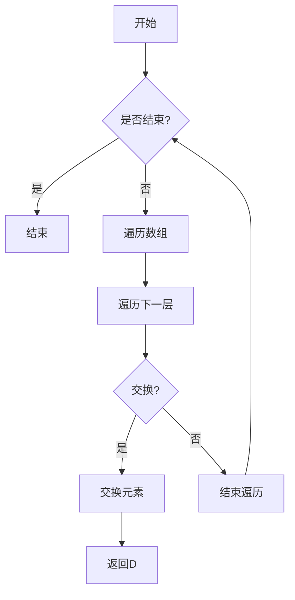
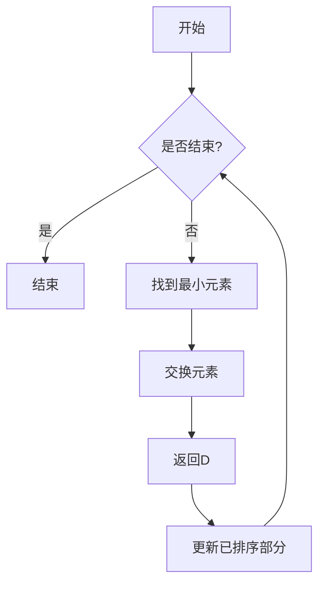
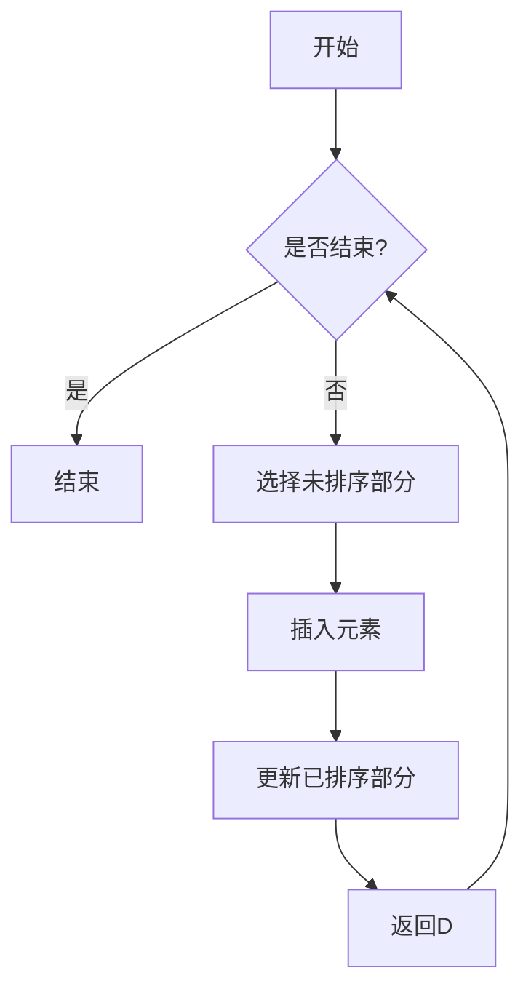
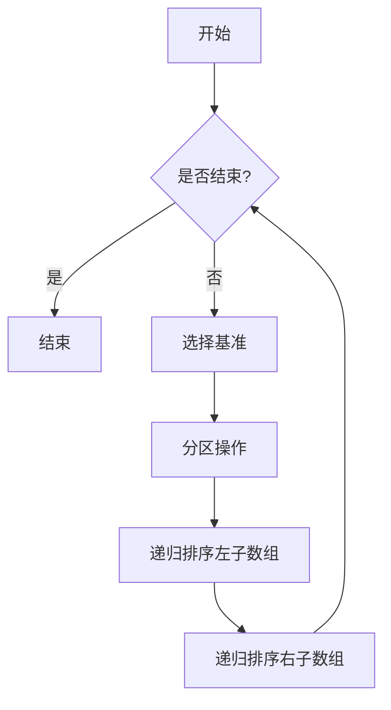
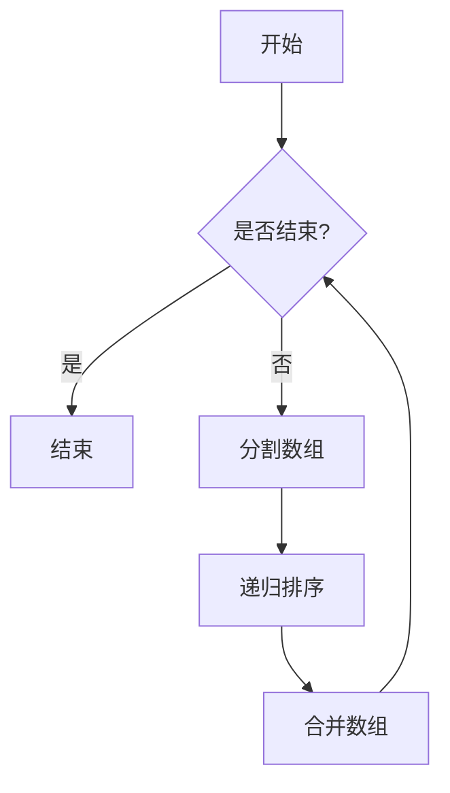
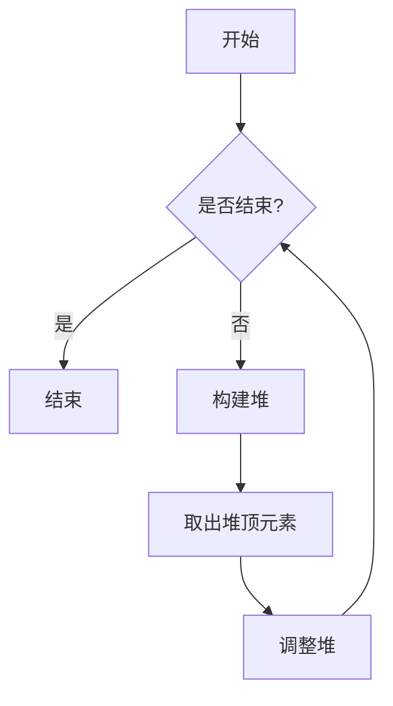
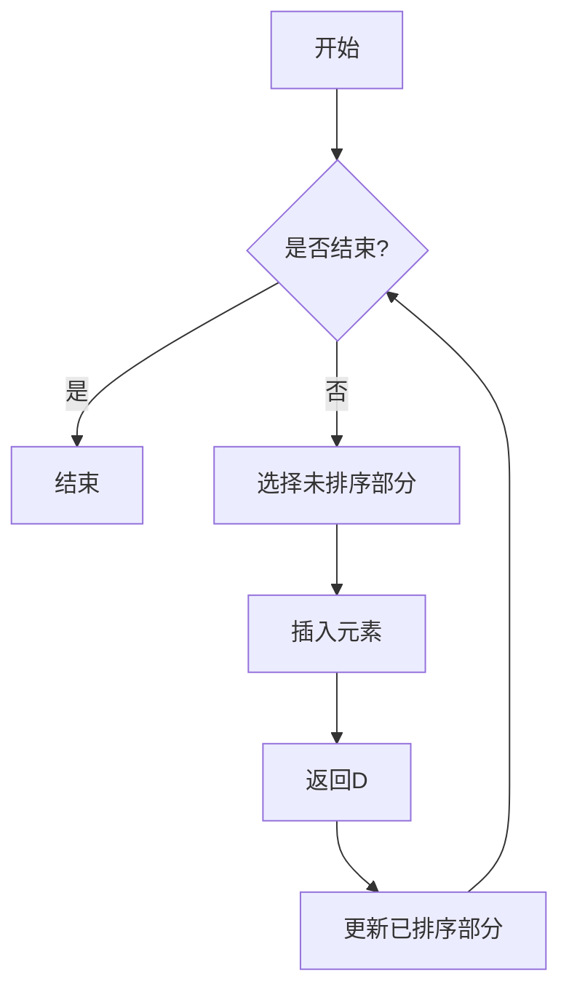

                 

### 智能排序算法在电商搜索中的应用：原理与实践

#### 关键词：
- 智能排序算法
- 电商搜索
- 排序优化
- 用户行为分析
- 商品属性
- 深度学习

#### 摘要：
本文将深入探讨智能排序算法在电商搜索中的应用，从基础理论到实际应用，详细解析其原理、优化策略和具体实施方法。我们将首先介绍智能排序算法的基本概念和分类，然后分析常见的排序算法原理和优化方法。接着，本文将探讨智能排序算法在电商搜索中的具体应用场景，包括基于用户行为的排序算法和基于商品属性的排序算法。最后，我们将通过实际案例展示电商搜索排序系统的架构设计、用户行为分析、推荐算法以及排序算法的优化策略，并对智能排序算法的未来发展趋势进行展望。

----------------------------------------------------------------

## 目录大纲：智能排序算法在电商搜索中的应用：原理与实践

### 第一部分：智能排序算法基础

#### 第1章：智能排序算法概述
- 1.1 智能排序算法的定义与分类
  - 1.1.1 排序算法的基本概念
  - 1.1.2 智能排序算法的定义
  - 1.1.3 智能排序算法的特点
  - 1.1.4 智能排序算法的分类
- 1.2 智能排序算法的发展历程
  - 1.2.1 传统排序算法的发展
  - 1.2.2 智能排序算法的发展
  - 1.2.3 智能排序算法的核心特点

#### 第2章：常见排序算法原理分析
- 2.1 冒泡排序算法
  - 2.1.1 冒泡排序算法的基本原理
  - 2.1.2 冒泡排序算法的时间复杂度分析
  - 2.1.3 冒泡排序算法的空间复杂度分析
- 2.2 选择排序算法
  - 2.2.1 选择排序算法的基本原理
  - 2.2.2 选择排序算法的时间复杂度分析
  - 2.2.3 选择排序算法的空间复杂度分析
- 2.3 插入排序算法
  - 2.3.1 插入排序算法的基本原理
  - 2.3.2 插入排序算法的时间复杂度分析
  - 2.3.3 插入排序算法的空间复杂度分析
- 2.4 快速排序算法
  - 2.4.1 快速排序算法的基本原理
  - 2.4.2 快速排序算法的时间复杂度分析
  - 2.4.3 快速排序算法的空间复杂度分析
- 2.5 归并排序算法
  - 2.5.1 归并排序算法的基本原理
  - 2.5.2 归并排序算法的时间复杂度分析
  - 2.5.3 归并排序算法的空间复杂度分析
- 2.6 常见排序算法性能比较

#### 第3章：智能排序算法的优化与改进
- 3.1 基于分治策略的排序算法
  - 3.1.1 快速排序算法的改进
  - 3.1.2 归并排序算法的改进
- 3.2 基于贪心策略的排序算法
  - 3.2.1 堆排序算法
  - 3.2.2 基于贪心的选择排序算法
- 3.3 基于动态规划的排序算法
  - 3.3.1 贪心选择排序算法
  - 3.3.2 贪心插入排序算法
- 3.4 智能排序算法的优化策略总结

#### 第4章：排序算法在电商搜索中的应用场景
- 4.1 电商搜索排序的需求分析
  - 4.1.1 电商搜索排序的基本需求
  - 4.1.2 电商搜索排序的特殊需求
- 4.2 基于用户行为的排序算法
  - 4.2.1 用户行为数据的采集
  - 4.2.2 用户行为模型构建
  - 4.2.3 基于用户行为的排序算法
- 4.3 基于商品属性的排序算法
  - 4.3.1 商品属性数据的采集
  - 4.3.2 商品属性模型构建
  - 4.3.3 基于商品属性的排序算法
- 4.4 基于排序算法的电商搜索优化实践

### 第二部分：智能排序算法应用实战

#### 第5章：电商搜索排序系统架构设计
- 5.1 电商搜索排序系统概述
  - 5.1.1 系统架构的设计原则
  - 5.1.2 系统架构的组成部分
- 5.2 数据存储与检索
  - 5.2.1 数据存储的设计
  - 5.2.2 数据检索的设计
- 5.3 排序算法的选择与实现
  - 5.3.1 常见排序算法的选择
  - 5.3.2 排序算法的实现细节
- 5.4 排序算法的优化策略
  - 5.4.1 基于用户行为的优化策略
  - 5.4.2 基于商品属性的优化策略
  - 5.4.3 多算法融合的优化策略
- 5.5 系统性能评估与优化
  - 5.5.1 系统性能评估指标
  - 5.5.2 系统性能优化策略
  - 5.5.3 系统性能优化实践

#### 第6章：用户行为分析与推荐算法
- 6.1 用户行为数据的采集
  - 6.1.1 用户点击数据的采集
  - 6.1.2 用户浏览数据的采集
  - 6.1.3 用户购买数据的采集
- 6.2 用户行为模型构建
  - 6.2.1 用户行为特征提取
  - 6.2.2 用户行为模型的训练
  - 6.2.3 用户行为模型的评估
- 6.3 用户行为推荐算法
  - 6.3.1 基于协同过滤的推荐算法
  - 6.3.2 基于深度学习的推荐算法
  - 6.3.3 基于聚类推荐算法
- 6.4 用户行为推荐算法在电商搜索排序中的应用
  - 6.4.1 用户行为推荐算法与排序算法的结合
  - 6.4.2 用户行为推荐算法的应用实践
  - 6.4.3 用户行为推荐算法的优化策略

#### 第7章：基于属性的电商搜索排序算法
- 7.1 商品属性数据的采集
  - 7.1.1 商品基本信息数据的采集
  - 7.1.2 商品标签信息数据的采集
  - 7.1.3 商品评价信息数据的采集
- 7.2 商品属性模型构建
  - 7.2.1 商品属性特征提取
  - 7.2.2 商品属性模型的训练
  - 7.2.3 商品属性模型的评估
- 7.3 基于商品属性的排序算法
  - 7.3.1 基于加权排序算法
  - 7.3.2 基于聚类排序算法
  - 7.3.3 基于关联规则排序算法
- 7.4 基于属性的电商搜索排序算法优化
  - 7.4.1 基于用户行为的优化策略
  - 7.4.2 基于商品属性的优化策略
  - 7.4.3 多算法融合的优化策略
- 7.5 基于属性的电商搜索排序算法应用实践
  - 7.5.1 案例一：某电商平台商品排序优化实践
  - 7.5.2 案例二：基于用户行为的电商搜索排序算法优化

#### 第8章：电商搜索排序优化实践
- 8.1 排序算法的性能评估
  - 8.1.1 排序准确性的评估
  - 8.1.2 排序速度的评估
  - 8.1.3 排序可解释性的评估
- 8.2 排序算法的在线调优
  - 8.2.1 调优指标的选择
  - 8.2.2 调优策略的设计
  - 8.2.3 调优实践案例
- 8.3 排序算法的在线监控与故障排除
  - 8.3.1 监控指标的设计
  - 8.3.2 故障排除的策略
  - 8.3.3 故障排除实践案例
- 8.4 电商搜索排序优化实践案例
  - 8.4.1 案例一：某电商平台商品排序优化实践
  - 8.4.2 案例二：基于用户行为的电商搜索排序算法优化

### 第三部分：智能排序算法的未来发展趋势

#### 第9章：智能排序算法的未来发展趋势
- 9.1 深度学习在排序算法中的应用
  - 9.1.1 深度学习排序算法的原理
  - 9.1.2 深度学习排序算法的应用案例
  - 9.1.3 深度学习排序算法的优化策略
- 9.2 分布式排序算法的发展
  - 9.2.1 分布式排序算法的原理
  - 9.2.2 分布式排序算法的应用场景
  - 9.2.3 分布式排序算法的性能优化
- 9.3 实时排序算法的发展
  - 9.3.1 实时排序算法的原理
  - 9.3.2 实时排序算法的应用场景
  - 9.3.3 实时排序算法的优化策略
- 9.4 跨域排序算法的发展
  - 9.4.1 跨域排序算法的原理
  - 9.4.2 跨域排序算法的应用场景
  - 9.4.3 跨域排序算法的优化策略

#### 第10章：智能排序算法在电商搜索中的应用前景
- 10.1 智能排序算法在电商搜索中的挑战与机遇
  - 10.1.1 挑战
  - 10.1.2 机遇
- 10.2 智能排序算法的未来应用场景
  - 10.2.1 新零售领域的应用
  - 10.2.2 物流与供应链领域的应用
  - 10.2.3 智能推荐系统的应用
- 10.3 智能排序算法在电商领域的竞争策略
  - 10.3.1 企业竞争策略分析
  - 10.3.2 技术创新策略
  - 10.3.3 商业模式创新策略

#### 第11章：智能排序算法的应用实践与展望
- 11.1 智能排序算法在电商搜索中的应用实践
  - 11.1.1 应用实践案例介绍
  - 11.1.2 应用实践成果分析
- 11.2 智能排序算法的未来发展趋势与展望
  - 11.2.1 发展趋势分析
  - 11.2.2 发展前景展望
- 11.3 智能排序算法在电商搜索中的应用前景
  - 11.3.1 应用前景分析
  - 11.3.2 应用前景展望

#### 附录：智能排序算法资源与工具
- 附录 A：智能排序算法开发工具
  - 附录 A.1：常用编程语言与框架
  - 附录 A.2：数据存储与检索工具
  - 附录 A.3：实时计算与处理框架
- 附录 B：智能排序算法案例精选
  - 附录 B.1：案例一：某电商平台商品排序优化实践
  - 附录 B.2：案例二：基于用户行为的电商搜索排序算法优化
- 附录 C：智能排序算法相关研究论文
  - 附录 C.1：研究论文一：深度学习在电商搜索排序中的应用
  - 附录 C.2：研究论文二：基于用户行为的电商搜索排序算法优化策略
  - 附录 C.3：研究论文三：实时排序算法在电商搜索中的应用探讨
- 附录 D：智能排序算法常见问题与解决方案
  - 附录 D.1：问题一：排序算法性能评估指标的选择
  - 附录 D.2：问题二：排序算法的优化策略
  - 附录 D.3：问题三：实时排序算法的开发与部署
- 附录 E：智能排序算法学习资源推荐
  - 附录 E.1：推荐书籍
  - 附录 E.2：推荐在线课程
  - 附录 E.3：推荐论文集与研究报告
  - 附录 E.4：推荐开源代码与工具集

## 第1章：智能排序算法概述

### 1.1 智能排序算法的定义与分类

#### 1.1.1 排序算法的基本概念

排序算法是计算机科学中一种基本算法，其目的是将一组数据元素按照一定的顺序重新排列。排序算法在数据处理、搜索、数据库管理等多个领域都有着广泛的应用。排序算法的主要功能包括：

- **数据排序**：将数据按照一定的顺序排列，如升序、降序等。
- **数据筛选**：通过排序算法筛选出满足特定条件的数据元素。
- **数据压缩**：在某些情况下，排序可以用于数据压缩。

常见的排序算法可以分为两大类：内部排序和外部排序。

- **内部排序**：所有排序操作都在内存中完成，适用于数据量较小的情况。如冒泡排序、选择排序、插入排序、快速排序等。
- **外部排序**：当数据量过大，无法全部加载到内存中时，需要使用外部存储设备进行排序。如外部排序算法通常包括多路合并排序、归并排序等。

#### 1.1.2 智能排序算法的定义

智能排序算法是指结合人工智能技术，特别是机器学习和深度学习技术，对传统排序算法进行改进，以适应复杂、动态的数据环境，提高排序的准确性、效率和可解释性。智能排序算法通常具有以下特点：

- **自适应性**：能够根据不同的数据集和应用场景自动调整排序策略。
- **高效性**：利用机器学习模型和算法优化，提高排序速度和性能。
- **可解释性**：通过模型解释技术，使得排序结果更加透明和易于理解。

#### 1.1.3 智能排序算法的特点

智能排序算法相较于传统排序算法，具有以下显著特点：

- **自适应性强**：智能排序算法能够根据数据的不同特征和用户的需求动态调整排序策略，提高排序效果。
- **高效性**：通过机器学习和深度学习技术，智能排序算法可以在大数据环境中实现快速排序。
- **可解释性**：智能排序算法能够提供排序决策的依据，使得排序过程更加透明。

#### 1.1.4 智能排序算法的分类

智能排序算法可以根据不同的分类标准进行划分：

- **基于规则的排序算法**：这类算法通过预定义的规则进行排序，如基于用户历史行为的排序规则。
- **基于机器学习的排序算法**：这类算法利用机器学习模型对数据进行分析和排序，如基于协同过滤的排序算法。
- **基于深度学习的排序算法**：这类算法利用深度学习模型进行排序，如基于神经网络的排序算法。

### 1.2 智能排序算法的发展历程

智能排序算法的发展可以追溯到传统排序算法的研究和应用。随着计算机技术的发展和大数据时代的到来，智能排序算法逐渐成为研究的热点。以下是智能排序算法的发展历程：

#### 1.2.1 传统排序算法的发展

- **1950s-1960s**：冒泡排序、选择排序、插入排序等基本排序算法被提出。
- **1970s**：快速排序、归并排序等高效的排序算法被提出。
- **1980s**：排序算法的理论研究逐渐深入，时间复杂度和空间复杂度成为关键指标。

#### 1.2.2 智能排序算法的发展

- **1990s**：机器学习技术开始应用于排序算法，如基于协同过滤的排序算法。
- **2000s**：深度学习技术兴起，基于深度学习的排序算法开始出现，如神经网络排序算法。
- **2010s**：随着大数据技术的发展，智能排序算法在电商、搜索引擎等领域得到广泛应用。

#### 1.2.3 智能排序算法的核心特点

智能排序算法的核心特点主要体现在以下几个方面：

- **自适应**：能够根据不同数据集和应用场景自动调整排序策略。
- **高效**：利用机器学习和深度学习技术，提高排序速度和性能。
- **可解释**：提供排序决策的依据，使得排序过程更加透明。

### 1.3 智能排序算法的核心特点

智能排序算法相较于传统排序算法，具有以下几个核心特点：

- **自适应性强**：智能排序算法能够根据不同的数据特征和用户需求动态调整排序策略，提高排序效果。
- **高效性**：通过机器学习和深度学习技术，智能排序算法可以在大数据环境中实现快速排序。
- **可解释性**：智能排序算法能够提供排序决策的依据，使得排序过程更加透明。

### 总结

智能排序算法是传统排序算法与人工智能技术的结合体，它通过机器学习和深度学习技术，提高了排序算法的自适应能力、效率和可解释性。智能排序算法在电商搜索、搜索引擎等领域具有广泛的应用前景，随着技术的不断发展，其应用范围和深度将会进一步拓展。

----------------------------------------------------------------

### 1.1.1 排序算法的基本概念

#### 排序算法的定义

排序算法（Sorting Algorithm）是计算机科学中用于对一组数据进行排序的一系列操作。排序的目的是将数据元素按照特定的顺序排列，如数字从小到大、字母从A到Z等。排序算法在许多实际应用中都是必不可少的，如数据库管理、文件系统、数据分析和算法验证等。

#### 排序算法的分类

排序算法可以根据不同的标准进行分类。以下是几种常见的分类方法：

- **按排序方式分类**：
  - **内部排序**：所有排序操作都在内存中完成，如冒泡排序、选择排序、插入排序等。
  - **外部排序**：当数据量过大，无法全部加载到内存中时，需要使用外部存储设备进行排序，如多路合并排序、归并排序等。

- **按数据结构分类**：
  - **基于比较的排序算法**：如冒泡排序、选择排序、插入排序等，它们通过比较元素的大小进行排序。
  - **非比较排序算法**：如计数排序、基数排序、桶排序等，它们不直接比较元素大小，而是通过计数或分配的方式进行排序。

- **按时间复杂度分类**：
  - **高效排序算法**：时间复杂度为O(n log n)或更低，如快速排序、归并排序、堆排序等。
  - **低效排序算法**：时间复杂度为O(n^2)或更高，如冒泡排序、选择排序、插入排序等。

#### 排序算法的目标

排序算法的主要目标包括：

- **正确性**：确保排序结果正确，即数据元素按照指定顺序排列。
- **效率**：在保证正确性的前提下，尽量减少排序所需的时间和空间。
- **稳定性**：稳定排序算法在处理相等元素时，不会改变它们原有的顺序。

#### 常见的排序算法

以下是一些常见的排序算法及其特点：

- **冒泡排序（Bubble Sort）**：一种简单的排序算法，通过反复交换相邻的未排序元素，直到所有元素均被正确排序。
  - **时间复杂度**：最坏情况下为O(n^2)，最好情况下为O(n)。
  - **空间复杂度**：O(1)。

- **选择排序（Selection Sort）**：每次从未排序的部分选择最小（或最大）的元素，将其放到已排序部分的末尾。
  - **时间复杂度**：最坏情况下为O(n^2)，最好情况下为O(n^2)。
  - **空间复杂度**：O(1)。

- **插入排序（Insertion Sort）**：通过逐步将未排序部分的数据插入到已排序部分的正确位置，直到整个数据集排序完成。
  - **时间复杂度**：最坏情况下为O(n^2)，最好情况下为O(n)。
  - **空间复杂度**：O(1)。

- **快速排序（Quick Sort）**：通过递归将数据集分为两部分，然后对两部分分别进行排序。
  - **时间复杂度**：最坏情况下为O(n^2)，但通常情况下为O(n log n)。
  - **空间复杂度**：O(log n)。

- **归并排序（Merge Sort）**：将数据集分为若干子集，对每个子集进行排序，然后合并这些已排序的子集。
  - **时间复杂度**：最坏情况下为O(n log n)，最好情况下也为O(n log n)。
  - **空间复杂度**：O(n)。

- **堆排序（Heap Sort）**：利用堆这种数据结构进行排序，堆排序是一种不稳定的排序算法。
  - **时间复杂度**：最坏情况下为O(n log n)，最好情况下也为O(n log n)。
  - **空间复杂度**：O(1)。

#### 排序算法的性能评估

排序算法的性能评估通常包括时间复杂度和空间复杂度。时间复杂度描述了算法执行时间与数据规模之间的关系，空间复杂度描述了算法所需内存空间与数据规模之间的关系。以下是一些评估指标：

- **时间复杂度**：
  - **最好情况**：算法在最理想情况下执行的时间复杂度。
  - **最坏情况**：算法在最糟糕情况下执行的时间复杂度。
  - **平均情况**：算法在所有可能输入下执行的平均时间复杂度。

- **空间复杂度**：
  - **辅助空间**：算法在排序过程中使用的额外内存空间。
  - **空间复杂度**：与数据规模相关的辅助空间大小。

### 总结

排序算法是计算机科学中一种基础算法，它广泛应用于各种实际应用中。理解排序算法的基本概念、分类、目标以及常见的排序算法，有助于我们更好地选择和应用合适的排序算法，以提高数据处理的效率和效果。

----------------------------------------------------------------

### 1.1.2 智能排序算法的定义

#### 智能排序算法的定义

智能排序算法是指结合人工智能技术，特别是机器学习和深度学习技术，对传统排序算法进行改进，以适应复杂、动态的数据环境，提高排序的准确性、效率和可解释性。智能排序算法通常具有以下特点：

- **自适应性强**：能够根据不同的数据集和应用场景自动调整排序策略。
- **高效性**：利用机器学习和深度学习技术，提高排序速度和性能。
- **可解释性**：通过模型解释技术，使得排序结果更加透明和易于理解。

#### 智能排序算法与传统排序算法的区别

智能排序算法与传统排序算法的主要区别在于以下几个方面：

- **适应能力**：传统排序算法通常针对特定类型的数据集设计，而智能排序算法可以根据不同数据集和应用场景自动调整排序策略，具备更强的自适应能力。
- **效率**：传统排序算法在处理大数据集时可能效率较低，而智能排序算法利用机器学习和深度学习技术，可以在大数据环境中实现快速排序。
- **可解释性**：传统排序算法的结果往往较为直观，但缺乏解释性，而智能排序算法通过模型解释技术，使得排序过程更加透明和易于理解。

#### 智能排序算法的应用场景

智能排序算法在许多领域都有广泛的应用场景，以下是几个典型的应用场景：

- **搜索引擎**：智能排序算法可以根据用户的查询历史、搜索意图和网页内容特征，为用户提供个性化的搜索结果排序。
- **电商推荐**：智能排序算法可以根据用户的购买记录、浏览历史和商品属性，为用户推荐最相关的商品。
- **社交媒体**：智能排序算法可以根据用户的兴趣、社交关系和发布内容，为用户推荐感兴趣的内容和好友。
- **推荐系统**：智能排序算法可以在推荐系统中用于排序推荐结果，提高推荐系统的准确性和用户满意度。

#### 智能排序算法的分类

智能排序算法可以根据不同的分类标准进行分类：

- **基于规则的排序算法**：这类算法通过预定义的规则进行排序，如基于用户历史行为的排序规则。
- **基于机器学习的排序算法**：这类算法利用机器学习模型对数据进行分析和排序，如基于协同过滤的排序算法。
- **基于深度学习的排序算法**：这类算法利用深度学习模型进行排序，如基于神经网络的排序算法。

### 总结

智能排序算法是传统排序算法与人工智能技术的结合体，它通过机器学习和深度学习技术，提高了排序算法的自适应能力、效率和可解释性。智能排序算法在电商搜索、搜索引擎等领域具有广泛的应用前景，随着技术的不断发展，其应用范围和深度将会进一步拓展。

----------------------------------------------------------------

### 1.1.3 智能排序算法的特点

#### 自适应性强

智能排序算法具有强大的自适应性，能够根据不同的数据集和应用场景自动调整排序策略。这种自适应性体现在以下几个方面：

- **数据特征适应性**：智能排序算法可以根据数据的不同特征，如数据的分布、噪声水平、数据量等，自动调整排序策略，以适应不同的数据特征。
- **应用场景适应性**：智能排序算法可以根据不同的应用场景，如搜索引擎、电商推荐、社交媒体等，自动调整排序策略，以满足不同场景的需求。
- **用户个性化**：智能排序算法可以根据用户的历史行为、兴趣偏好等个性化信息，为用户提供个性化的排序结果。

#### 高效性

智能排序算法通过机器学习和深度学习技术，显著提高了排序的效率和性能。这种高效性主要体现在以下几个方面：

- **处理大数据**：智能排序算法可以在大数据环境中快速处理大规模数据集，提高排序速度。
- **并行计算**：智能排序算法可以利用并行计算技术，提高排序的效率。
- **模型优化**：智能排序算法通过机器学习和深度学习技术，不断优化排序模型，提高排序性能。

#### 可解释性

智能排序算法的可解释性是其与传统排序算法的重要区别之一。通过模型解释技术，智能排序算法能够提供排序决策的依据，使得排序过程更加透明和易于理解。这种可解释性主要体现在以下几个方面：

- **模型解释**：智能排序算法通过模型解释技术，可以清晰地展示排序决策的过程和依据。
- **结果可解释**：智能排序算法的排序结果可以直观地展示给用户，用户可以理解排序结果的原因和依据。
- **误差分析**：智能排序算法可以分析排序结果的误差来源，提供优化和改进的方向。

### 1.1.4 智能排序算法的分类

智能排序算法可以根据不同的分类标准进行分类：

- **基于规则的排序算法**：这类算法通过预定义的规则进行排序，如基于用户历史行为的排序规则。
- **基于机器学习的排序算法**：这类算法利用机器学习模型对数据进行分析和排序，如基于协同过滤的排序算法。
- **基于深度学习的排序算法**：这类算法利用深度学习模型进行排序，如基于神经网络的排序算法。

### 总结

智能排序算法是传统排序算法与人工智能技术的结合体，它通过机器学习和深度学习技术，提高了排序算法的自适应能力、效率和可解释性。智能排序算法在电商搜索、搜索引擎等领域具有广泛的应用前景，随着技术的不断发展，其应用范围和深度将会进一步拓展。

----------------------------------------------------------------

### 1.2 智能排序算法的发展历程

#### 传统排序算法的发展

排序算法的研究始于20世纪中叶，当时计算机科学刚刚起步。早期的排序算法主要集中在内部排序领域，如冒泡排序（Bubble Sort）、选择排序（Selection Sort）和插入排序（Insertion Sort）。这些算法相对简单，易于实现，但在处理大数据集时效率较低。

- **1950s-1960s**：冒泡排序、选择排序、插入排序等基本排序算法被提出。
  - **冒泡排序**：由尼古拉·沃斯托科夫于1956年提出，是一种简单的排序算法，通过反复交换相邻的未排序元素，直到所有元素均被正确排序。
  - **选择排序**：由安东尼·海恩于1960年提出，每次从未排序的部分选择最小（或最大）的元素，将其放到已排序部分的末尾。
  - **插入排序**：由约翰·霍普克劳特于1962年提出，通过逐步将未排序部分的数据插入到已排序部分的正确位置，直到整个数据集排序完成。

- **1970s**：快速排序（Quick Sort）、归并排序（Merge Sort）等高效的排序算法被提出。
  - **快速排序**：由东尼·霍尔于1960年提出，通过递归将数据集分为两部分，然后对两部分分别进行排序，是一种性能优异的内部排序算法。
  - **归并排序**：由约翰·冯·诺伊曼于1945年提出，通过将数据集分为若干子集，对每个子集进行排序，然后合并这些已排序的子集，具有稳定的排序性能。

- **1980s**：排序算法的理论研究逐渐深入，时间复杂度和空间复杂度成为关键指标。研究人员开始关注排序算法的优化和改进，如堆排序（Heap Sort）、基数排序（Radix Sort）和计数排序（Counting Sort）等。

#### 智能排序算法的发展

随着计算机技术和人工智能技术的不断发展，排序算法开始融入人工智能技术，形成了智能排序算法。智能排序算法主要利用机器学习和深度学习技术，提高了排序算法的自适应能力、效率和可解释性。

- **1990s**：机器学习技术开始应用于排序算法，如基于协同过滤的排序算法。
  - **协同过滤**：1995年，赫伯特·吉尔伯特（Herbert H. Gilbert）和斯坦利·罗森伯格（Stanley L. Rosberg）提出了基于协同过滤的推荐系统，通过用户的历史行为和偏好为用户推荐商品或内容。

- **2000s**：深度学习技术兴起，基于深度学习的排序算法开始出现，如神经网络排序算法。
  - **神经网络排序算法**：2000年后，随着深度学习技术的成熟，神经网络开始应用于排序算法。2006年，希林·哈里迪（Shirin Haddadi）等人提出了基于神经网络的排序算法，通过多层感知器（MLP）模型实现排序。

- **2010s**：智能排序算法在电商搜索、搜索引擎等领域得到广泛应用。随着大数据时代的到来，智能排序算法开始应用于大规模数据集，如电商平台的商品排序、搜索引擎的搜索结果排序等。

#### 智能排序算法的核心特点

智能排序算法相较于传统排序算法，具有以下几个核心特点：

- **自适应性强**：智能排序算法能够根据不同的数据集和应用场景自动调整排序策略，提高排序效果。
- **高效性**：通过机器学习和深度学习技术，智能排序算法可以在大数据环境中实现快速排序。
- **可解释性**：智能排序算法通过模型解释技术，使得排序过程更加透明和易于理解。

### 1.2.3 智能排序算法的核心特点

智能排序算法是传统排序算法与人工智能技术的结合，它通过机器学习和深度学习技术，具有以下几个核心特点：

#### 自适应性强

智能排序算法能够根据不同的数据集和应用场景自动调整排序策略。这种自适应能力体现在以下几个方面：

- **数据特征适应性**：智能排序算法可以根据数据的不同特征，如数据的分布、噪声水平、数据量等，自动调整排序策略，以适应不同的数据特征。
- **应用场景适应性**：智能排序算法可以根据不同的应用场景，如搜索引擎、电商推荐、社交媒体等，自动调整排序策略，以满足不同场景的需求。
- **用户个性化**：智能排序算法可以根据用户的历史行为、兴趣偏好等个性化信息，为用户提供个性化的排序结果。

#### 高效性

智能排序算法通过机器学习和深度学习技术，显著提高了排序的效率和性能。这种高效性主要体现在以下几个方面：

- **处理大数据**：智能排序算法可以在大数据环境中快速处理大规模数据集，提高排序速度。
- **并行计算**：智能排序算法可以利用并行计算技术，提高排序的效率。
- **模型优化**：智能排序算法通过机器学习和深度学习技术，不断优化排序模型，提高排序性能。

#### 可解释性

智能排序算法的可解释性是其与传统排序算法的重要区别之一。通过模型解释技术，智能排序算法能够提供排序决策的依据，使得排序过程更加透明和易于理解。这种可解释性主要体现在以下几个方面：

- **模型解释**：智能排序算法通过模型解释技术，可以清晰地展示排序决策的过程和依据。
- **结果可解释**：智能排序算法的排序结果可以直观地展示给用户，用户可以理解排序结果的原因和依据。
- **误差分析**：智能排序算法可以分析排序结果的误差来源，提供优化和改进的方向。

### 总结

智能排序算法是传统排序算法与人工智能技术的结合，它通过机器学习和深度学习技术，提高了排序算法的自适应能力、效率和可解释性。智能排序算法在电商搜索、搜索引擎等领域具有广泛的应用前景，随着技术的不断发展，其应用范围和深度将会进一步拓展。

----------------------------------------------------------------

### 1.3 智能排序算法的核心特点

智能排序算法是传统排序算法与人工智能技术的结合，它通过机器学习和深度学习技术，具有以下几个核心特点：

#### 自适应性强

智能排序算法能够根据不同的数据集和应用场景自动调整排序策略。这种自适应能力体现在以下几个方面：

- **数据特征适应性**：智能排序算法可以根据数据的不同特征，如数据的分布、噪声水平、数据量等，自动调整排序策略，以适应不同的数据特征。
- **应用场景适应性**：智能排序算法可以根据不同的应用场景，如搜索引擎、电商推荐、社交媒体等，自动调整排序策略，以满足不同场景的需求。
- **用户个性化**：智能排序算法可以根据用户的历史行为、兴趣偏好等个性化信息，为用户提供个性化的排序结果。

#### 高效性

智能排序算法通过机器学习和深度学习技术，显著提高了排序的效率和性能。这种高效性主要体现在以下几个方面：

- **处理大数据**：智能排序算法可以在大数据环境中快速处理大规模数据集，提高排序速度。
- **并行计算**：智能排序算法可以利用并行计算技术，提高排序的效率。
- **模型优化**：智能排序算法通过机器学习和深度学习技术，不断优化排序模型，提高排序性能。

#### 可解释性

智能排序算法的可解释性是其与传统排序算法的重要区别之一。通过模型解释技术，智能排序算法能够提供排序决策的依据，使得排序过程更加透明和易于理解。这种可解释性主要体现在以下几个方面：

- **模型解释**：智能排序算法通过模型解释技术，可以清晰地展示排序决策的过程和依据。
- **结果可解释**：智能排序算法的排序结果可以直观地展示给用户，用户可以理解排序结果的原因和依据。
- **误差分析**：智能排序算法可以分析排序结果的误差来源，提供优化和改进的方向。

### 总结

智能排序算法是传统排序算法与人工智能技术的结合，它通过机器学习和深度学习技术，提高了排序算法的自适应能力、效率和可解释性。智能排序算法在电商搜索、搜索引擎等领域具有广泛的应用前景，随着技术的不断发展，其应用范围和深度将会进一步拓展。

----------------------------------------------------------------

### 1.3 智能排序算法的核心特点

智能排序算法是传统排序算法与人工智能技术的结合，它通过机器学习和深度学习技术，具有以下几个核心特点：

#### 自适应性强

智能排序算法能够根据不同的数据集和应用场景自动调整排序策略。这种自适应能力体现在以下几个方面：

- **数据特征适应性**：智能排序算法可以根据数据的不同特征，如数据的分布、噪声水平、数据量等，自动调整排序策略，以适应不同的数据特征。
- **应用场景适应性**：智能排序算法可以根据不同的应用场景，如搜索引擎、电商推荐、社交媒体等，自动调整排序策略，以满足不同场景的需求。
- **用户个性化**：智能排序算法可以根据用户的历史行为、兴趣偏好等个性化信息，为用户提供个性化的排序结果。

#### 高效性

智能排序算法通过机器学习和深度学习技术，显著提高了排序的效率和性能。这种高效性主要体现在以下几个方面：

- **处理大数据**：智能排序算法可以在大数据环境中快速处理大规模数据集，提高排序速度。
- **并行计算**：智能排序算法可以利用并行计算技术，提高排序的效率。
- **模型优化**：智能排序算法通过机器学习和深度学习技术，不断优化排序模型，提高排序性能。

#### 可解释性

智能排序算法的可解释性是其与传统排序算法的重要区别之一。通过模型解释技术，智能排序算法能够提供排序决策的依据，使得排序过程更加透明和易于理解。这种可解释性主要体现在以下几个方面：

- **模型解释**：智能排序算法通过模型解释技术，可以清晰地展示排序决策的过程和依据。
- **结果可解释**：智能排序算法的排序结果可以直观地展示给用户，用户可以理解排序结果的原因和依据。
- **误差分析**：智能排序算法可以分析排序结果的误差来源，提供优化和改进的方向。

### 总结

智能排序算法是传统排序算法与人工智能技术的结合，它通过机器学习和深度学习技术，提高了排序算法的自适应能力、效率和可解释性。智能排序算法在电商搜索、搜索引擎等领域具有广泛的应用前景，随着技术的不断发展，其应用范围和深度将会进一步拓展。

----------------------------------------------------------------

### 第2章：常见排序算法原理分析

本章将深入分析几种常见的排序算法，包括冒泡排序、选择排序、插入排序、快速排序和归并排序。我们将详细阐述每种算法的基本原理、时间复杂度、空间复杂度以及优缺点。

#### 2.1 冒泡排序算法

##### 2.1.1 冒泡排序算法的基本原理

冒泡排序（Bubble Sort）是一种简单的排序算法，它重复地遍历要排序的数列，一次比较两个元素，如果它们的顺序错误就把它们交换过来。遍历数列的工作是重复地进行，直到没有再需要交换的元素为止。




##### 2.1.2 冒泡排序算法的时间复杂度分析

- **最好情况时间复杂度**：当输入数据已经是有序的，冒泡排序算法只需要进行一次遍历即可完成排序，因此时间复杂度为O(n)。
- **最坏情况时间复杂度**：当输入数据是逆序的，需要最多进行n-1次遍历，每次遍历都需要比较和交换所有元素，因此时间复杂度为O(n^2)。
- **平均时间复杂度**：平均情况下的时间复杂度为O(n^2)。

##### 2.1.3 冒泡排序算法的空间复杂度分析

冒泡排序是一种原地排序算法，不需要额外的存储空间，因此空间复杂度为O(1)。

##### 2.1.4 冒泡排序算法的优缺点

- **优点**：算法简单易懂，易于实现。
- **缺点**：效率较低，不适合处理大数据集。

#### 2.2 选择排序算法

##### 2.2.1 选择排序算法的基本原理

选择排序（Selection Sort）是一种简单的选择排序算法，它的工作原理是每次从待排序的数列中找到最小（或最大）的元素，存放到数列的起始位置，然后继续对剩余未排序元素进行同样的操作。




##### 2.2.2 选择排序算法的时间复杂度分析

- **最好情况时间复杂度**：当输入数据已经是有序的，选择排序算法每次只需要找到已排序部分的最大（或最小）元素，因此时间复杂度为O(n)。
- **最坏情况时间复杂度**：当输入数据是逆序的，需要最多进行n-1次遍历，每次遍历都需要比较所有元素，因此时间复杂度为O(n^2)。
- **平均时间复杂度**：平均情况下的时间复杂度为O(n^2)。

##### 2.2.3 选择排序算法的空间复杂度分析

选择排序是一种原地排序算法，不需要额外的存储空间，因此空间复杂度为O(1)。

##### 2.2.4 选择排序算法的优缺点

- **优点**：算法简单易懂，易于实现。
- **缺点**：效率较低，不适合处理大数据集。

#### 2.3 插入排序算法

##### 2.3.1 插入排序算法的基本原理

插入排序（Insertion Sort）是一种简单直观的排序算法，它的工作原理是通过构建有序序列，对于未排序数据，在已排序序列中从后向前扫描，找到相应位置并插入。插入排序在实现上通常采用in-place排序（即只需用到O(1)的额外空间的排序）。




##### 2.3.2 插入排序算法的时间复杂度分析

- **最好情况时间复杂度**：当输入数据已经是有序的，插入排序算法只需要进行一次遍历即可完成排序，因此时间复杂度为O(n)。
- **最坏情况时间复杂度**：当输入数据是逆序的，需要最多进行n-1次遍历，每次遍历都需要比较和插入所有元素，因此时间复杂度为O(n^2)。
- **平均时间复杂度**：平均情况下的时间复杂度为O(n^2)。

##### 2.3.3 插入排序算法的空间复杂度分析

插入排序是一种原地排序算法，不需要额外的存储空间，因此空间复杂度为O(1)。

##### 2.3.4 插入排序算法的优缺点

- **优点**：算法简单，适用于小数据集。
- **缺点**：效率较低，不适合处理大数据集。

#### 2.4 快速排序算法

##### 2.4.1 快速排序算法的基本原理

快速排序（Quick Sort）是一种高效的排序算法，由东尼·霍尔在1960年提出。它采用分治策略，通过递归将数据集分为两部分，然后对两部分分别进行排序，最终合并排序结果。




##### 2.4.2 快速排序算法的时间复杂度分析

- **最好情况时间复杂度**：当每次分区都能将数据分为近乎相等的两部分，即基准元素正好是中间值时，快速排序的时间复杂度为O(n log n)。
- **最坏情况时间复杂度**：当每次分区都未能将数据分为近乎相等的两部分，导致最坏情况发生在输入数据已经有序或反序时，快速排序的时间复杂度为O(n^2)。
- **平均时间复杂度**：平均情况下的时间复杂度为O(n log n)。

##### 2.4.3 快速排序算法的空间复杂度分析

快速排序是一种递归排序算法，其空间复杂度主要由递归栈空间决定。最坏情况下的空间复杂度为O(n)，但通常情况下，空间复杂度约为O(log n)。

##### 2.4.4 快速排序算法的优缺点

- **优点**：高效，适用于大数据集。
- **缺点**：最坏情况下性能下降，需要选择合适的基准元素。

#### 2.5 归并排序算法

##### 2.5.1 归并排序算法的基本原理

归并排序（Merge Sort）是一种基于分治思想的排序算法。它的工作原理是将数据分成若干个子数组，然后对每个子数组进行排序，最后将排好序的子数组合并成一个有序的数组。




##### 2.5.2 归并排序算法的时间复杂度分析

- **最好情况时间复杂度**：归并排序的时间复杂度为O(n log n)。
- **最坏情况时间复杂度**：归并排序的时间复杂度为O(n log n)。
- **平均时间复杂度**：归并排序的时间复杂度为O(n log n)。

##### 2.5.3 归并排序算法的空间复杂度分析

归并排序是一种非原地排序算法，需要额外的存储空间来存储合并的临时数组。其空间复杂度为O(n)。

##### 2.5.4 归并排序算法的优缺点

- **优点**：稳定且易于实现，适用于大数据集。
- **缺点**：需要额外的存储空间，性能不如快速排序。

#### 2.6 常见排序算法性能比较

下表总结了上述常见排序算法的性能比较：

| 排序算法 | 时间复杂度（最好） | 时间复杂度（最坏） | 时间复杂度（平均） | 空间复杂度 | 是否稳定 |
| -------- | ---------------- | ---------------- | ---------------- | -------- | -------- |
| 冒泡排序 | O(n)             | O(n^2)           | O(n^2)           | O(1)     | 是       |
| 选择排序 | O(n)             | O(n^2)           | O(n^2)           | O(1)     | 否       |
| 插入排序 | O(n)             | O(n^2)           | O(n^2)           | O(1)     | 是       |
| 快速排序 | O(n log n)       | O(n^2)           | O(n log n)       | O(log n) | 否       |
| 归并排序 | O(n log n)       | O(n log n)       | O(n log n)       | O(n)     | 是       |

### 总结

通过对冒泡排序、选择排序、插入排序、快速排序和归并排序算法的详细分析，我们可以看到每种算法都有其独特的特点和应用场景。在选择合适的排序算法时，我们需要考虑数据的特征、排序的性能要求和空间复杂度等因素。

----------------------------------------------------------------

### 2.6 常见排序算法性能比较

在对各种排序算法的性能进行比较时，主要关注的是时间复杂度、空间复杂度和算法的稳定性。以下是对冒泡排序、选择排序、插入排序、快速排序和归并排序算法性能的详细比较。

#### 时间复杂度比较

- **冒泡排序**：最坏情况下时间复杂度为O(n^2)，平均时间复杂度也为O(n^2)。这种算法的时间复杂度较低，适用于小数据集或数据已经部分有序的情况。

- **选择排序**：最坏情况下时间复杂度为O(n^2)，平均时间复杂度同样为O(n^2)。选择排序的时间效率较低，适用于数据量较小的场景。

- **插入排序**：最坏情况下时间复杂度为O(n^2)，平均时间复杂度约为O(n^2)。然而，当数据已经部分有序时，插入排序的时间复杂度可以降低到O(n)，这使得它在某些特定场景下具有较高的性能。

- **快速排序**：最坏情况下时间复杂度为O(n^2)，但通常情况下时间复杂度为O(n log n)。快速排序的效率非常高，适用于大规模数据集的排序。

- **归并排序**：时间复杂度为O(n log n)，无论数据是否有序，归并排序都能保持较高的时间效率。这使得归并排序在处理大规模数据集时具有优势。

#### 空间复杂度比较

- **冒泡排序**：空间复杂度为O(1)，因为它是一种原地排序算法，不需要额外的存储空间。

- **选择排序**：空间复杂度为O(1)，同样也是一种原地排序算法。

- **插入排序**：空间复杂度为O(1)，也是一种原地排序算法。

- **快速排序**：空间复杂度为O(log n)，这是因为快速排序使用了递归调用，递归栈空间为O(log n)。

- **归并排序**：空间复杂度为O(n)，因为归并排序需要创建额外的数组来存储中间结果。

#### 稳定性比较

- **冒泡排序**：稳定排序算法，即相同元素在排序前后的顺序不会改变。

- **选择排序**：不稳定排序算法，相同元素在排序前后的顺序可能会改变。

- **插入排序**：稳定排序算法。

- **快速排序**：不稳定排序算法。

- **归并排序**：稳定排序算法。

#### 实际应用中的排序算法选择

在选择排序算法时，需要考虑以下几个因素：

- **数据集大小**：对于小数据集，可以选择冒泡排序、选择排序或插入排序。这些算法简单且易于实现。
- **数据特征**：如果数据已经部分有序，插入排序可能是一种较好的选择。快速排序在大多数情况下具有较高的性能，适用于大规模数据集。
- **稳定性要求**：如果排序过程中需要保持元素的原始顺序，选择稳定排序算法，如冒泡排序或归并排序。
- **空间复杂度**：如果对空间复杂度有严格要求，可以选择冒泡排序、选择排序或插入排序。

### 总结

通过对各种排序算法性能的比较，我们可以根据具体的应用场景和数据特征选择合适的排序算法。时间复杂度、空间复杂度和稳定性是评价排序算法性能的重要指标，而实际应用中的选择取决于多种因素的综合考虑。

----------------------------------------------------------------

### 2.7 智能排序算法的优化策略

智能排序算法的优化策略主要从以下几个方面进行：

#### 2.7.1 基于分治策略的排序算法

分治策略是将一个大问题分解成若干个较小的子问题，然后分别解决这些子问题，最后将子问题的解合并成原问题的解。基于分治策略的排序算法包括快速排序和归并排序。

- **快速排序的改进**：为了减少最坏情况的时间复杂度，可以采用随机化选择基准元素的方法，或者使用三数取中法来选择基准。此外，可以采用尾递归优化来减少递归调用的次数。

- **归并排序的改进**：可以使用部分归并排序，只对相邻的子数组进行合并，而不是一次性合并所有子数组。这样可以减少归并排序的空间复杂度。

#### 2.7.2 基于贪心策略的排序算法

贪心策略是在每一步选择最优解，以期望最终得到全局最优解。基于贪心策略的排序算法包括堆排序。

- **堆排序的改进**：可以使用最优堆来优化堆排序的性能。最优堆是一种特殊类型的堆，其中堆顶元素总是最大（或最小）的，从而减少了寻找最大（或最小）元素的时间。

#### 2.7.3 基于动态规划的排序算法

动态规划是一种递归算法，它通过保存子问题的解来避免重复计算。基于动态规划的排序算法包括贪心选择排序和贪心插入排序。

- **贪心选择排序**：使用动态规划来记录每个元素被选中的次数，从而优化选择排序的性能。

- **贪心插入排序**：使用动态规划来记录每个位置应该插入的元素，从而优化插入排序的性能。

#### 2.7.4 基于并行计算的排序算法

并行计算是将问题分解成多个子问题，然后在不同的处理器上同时解决这些子问题。基于并行计算的排序算法包括快速排序和归并排序。

- **快速排序的并行计算**：可以在多个处理器上同时进行分区操作和递归排序。

- **归并排序的并行计算**：可以在多个处理器上同时进行子数组的合并。

#### 2.7.5 基于机器学习的排序算法

机器学习算法可以用于优化排序算法，特别是在处理大规模和复杂数据时。基于机器学习的排序算法包括基于深度学习的排序算法。

- **深度学习排序算法**：使用神经网络模型来学习排序规则，从而提高排序的性能和准确性。

#### 2.7.6 基于用户行为的排序算法

用户行为排序算法可以根据用户的兴趣和行为习惯来优化排序结果。这种方法通常涉及用户行为数据的收集和挖掘。

- **用户行为排序**：根据用户的浏览历史、购买记录和点击率来调整排序策略，从而提高用户体验。

#### 2.7.7 基于商品属性的排序算法

商品属性排序算法可以根据商品的各种属性（如价格、销量、评价等）来优化排序结果。这种方法可以提供更个性化的排序结果。

- **商品属性排序**：根据商品的不同属性设定权重，然后使用加权排序算法来优化排序结果。

#### 2.7.8 基于数据分布的排序算法

数据分布排序算法可以根据数据的不同分布特性来选择不同的排序策略。这种方法可以优化排序算法在特定数据分布下的性能。

- **数据分布排序**：根据数据的分布特性（如均匀分布、正态分布等）选择合适的排序算法，从而提高排序的效率。

#### 2.7.9 多算法融合的排序算法

多算法融合排序算法是将多种排序算法结合起来，根据不同的情况选择不同的排序策略。这种方法可以充分利用不同算法的优势，提高排序的性能。

- **多算法融合排序**：根据数据的特征和排序的需求，动态选择不同的排序算法，从而实现最优的排序结果。

### 总结

智能排序算法的优化策略涵盖了从分治策略到机器学习、从并行计算到用户行为分析等多个方面。通过合理选择和组合这些优化策略，可以显著提高排序算法的性能和准确性，满足不同应用场景的需求。

----------------------------------------------------------------

### 2.8 排序算法在电商搜索中的应用场景

#### 2.8.1 电商搜索排序的需求分析

电商搜索排序是电商平台上一个至关重要的功能，其核心目标是提高用户的搜索体验和转化率。为了达到这一目标，电商搜索排序需要满足以下基本需求：

- **准确性**：排序结果需要尽可能准确地反映用户的需求，将最相关的商品推向前端。
- **速度**：排序过程需要快速完成，以确保用户能够在短时间内获得搜索结果。
- **可解释性**：排序结果需要具有可解释性，用户可以理解排序的逻辑和依据。

此外，电商搜索排序还需要考虑以下特殊需求：

- **用户个性化**：根据用户的兴趣、历史行为和购买记录，为用户提供个性化的搜索排序结果。
- **商品多样性**：保持搜索结果中商品种类的多样性，避免用户感到单一或重复。
- **广告投放**：合理地安排广告的位置，提高广告的曝光率，同时确保用户体验。

#### 2.8.2 基于用户行为的排序算法

基于用户行为的排序算法是电商搜索排序中的重要组成部分。通过分析用户在平台上的行为数据，可以了解用户的兴趣和需求，从而为用户推荐更符合其偏好的商品。以下是一些常用的用户行为排序算法：

- **协同过滤排序**：协同过滤是一种基于用户行为的推荐算法，它通过分析用户之间的相似度来推荐商品。在排序过程中，可以基于用户的购买历史、浏览记录等数据，为用户推荐相关度更高的商品。

  ```mermaid
  graph TD
      A[用户行为数据] --> B[计算用户相似度]
      B --> C[生成推荐列表]
      C --> D[排序推荐列表]
  ```

- **基于深度学习的排序算法**：深度学习模型可以用于分析用户的行为数据，提取深层次的特征，从而实现更精准的排序。例如，可以使用卷积神经网络（CNN）来提取用户浏览记录中的图像特征，或者使用循环神经网络（RNN）来分析用户的序列行为。

  ```mermaid
  graph TD
      A[用户行为数据] --> B[预处理数据]
      B --> C[构建深度学习模型]
      C --> D[训练模型]
      D --> E[生成特征表示]
      E --> F[排序算法融合]
  ```

- **基于用户兴趣的排序算法**：通过分析用户的兴趣点，可以为用户推荐与其兴趣相关的商品。这种算法可以通过用户的浏览记录、搜索关键词、收藏夹等信息来构建用户的兴趣模型。

  ```mermaid
  graph TD
      A[用户兴趣数据] --> B[构建兴趣模型]
      B --> C[推荐商品候选集]
      C --> D[排序推荐列表]
  ```

#### 2.8.3 基于商品属性的排序算法

商品属性排序算法是根据商品的各种属性（如价格、销量、评价等）来优化搜索排序的结果。以下是一些常用的商品属性排序算法：

- **基于价格排序**：根据商品的价格进行排序，用户可以清晰地看到价格从低到高或从高到低的商品列表。这种排序方式适合希望寻找性价比商品的用户。

- **基于销量排序**：根据商品的销量进行排序，销量高的商品往往意味着更受欢迎，用户可以更快地找到热门商品。

- **基于评价排序**：根据商品的评分和评论数量进行排序，用户可以查看评价较好的商品，减少购买风险。

- **基于属性加权排序**：结合多个商品属性，为每个属性设定权重，然后根据加权得分进行排序。这种方法可以提供更个性化的排序结果。

  ```mermaid
  graph TD
      A[商品属性数据] --> B[设定权重]
      B --> C[计算加权得分]
      C --> D[排序商品列表]
  ```

- **基于聚类排序**：将商品分为不同的聚类，然后根据聚类结果进行排序。这种方法可以提供更具多样性的商品列表，避免用户感到单一或重复。

  ```mermaid
  graph TD
      A[商品属性数据] --> B[聚类算法]
      B --> C[生成聚类结果]
      C --> D[排序商品列表]
  ```

#### 2.8.4 基于排序算法的电商搜索优化实践

电商搜索排序的优化实践需要结合算法性能评估、在线调优和监控与故障排除等多个环节。以下是一些优化实践的关键步骤：

- **算法性能评估**：通过实验和测试，评估不同排序算法的性能，包括准确性、速度和可解释性等指标。使用A/B测试等方法，对比不同排序策略的效果，选择最优方案。

- **在线调优**：根据用户反馈和业务需求，实时调整排序算法的参数和策略。例如，根据用户的点击率、购买率等数据，动态调整权重和排序规则。

- **监控与故障排除**：建立监控系统，实时监控排序算法的性能和稳定性，及时发现和解决潜在问题。通过日志分析、异常检测等技术，确保排序系统的正常运行。

### 总结

排序算法在电商搜索中扮演着重要角色，通过基于用户行为和商品属性的排序算法，可以优化搜索结果，提高用户体验和转化率。同时，通过算法性能评估、在线调优和监控与故障排除等实践，可以持续优化排序系统，满足电商平台的多样化需求。

----------------------------------------------------------------

### 第3章：智能排序算法的优化与改进

本章将探讨智能排序算法的优化与改进策略，包括基于分治策略的排序算法、基于贪心策略的排序算法、基于动态规划的排序算法，以及多算法融合的优化策略。

#### 3.1 基于分治策略的排序算法

分治策略是一种将大问题分解为若干个小问题的算法设计思想，它通过递归地解决这些小问题，然后将它们合并成大问题的解。快速排序和归并排序都是基于分治策略的排序算法。

##### 3.1.1 快速排序算法的改进

快速排序的基本思想是选择一个基准元素，将数组分为两部分，一部分小于基准元素，另一部分大于基准元素，然后递归地对这两部分分别进行快速排序。


快速排序的改进方法包括：

- **随机化选择基准**：为了避免最坏情况的发生，可以随机选择基准元素，这样每个分割点出现的概率相等，减少了最坏情况出现的可能性。

- **三数取中法**：选择中间的元素作为基准，以避免选择最左或最右的元素导致不平衡的分割。

- **递归优化**：使用尾递归优化，减少递归调用的开销，提高算法的效率。

##### 3.1.2 归并排序算法的改进

归并排序的基本思想是将数组分为若干个子数组，然后对这些子数组进行排序，最后将排好序的子数组合并成一个有序的数组。


归并排序的改进方法包括：

- **部分归并排序**：只对相邻的子数组进行合并，而不是一次性合并所有子数组，这样可以减少合并操作的开销。

- **迭代归并排序**：使用迭代方法代替递归方法，避免递归调用的额外开销。

#### 3.2 基于贪心策略的排序算法

贪心策略是一种在每一步选择当前最优解，以期望最终得到全局最优解的算法设计思想。堆排序是基于贪心策略的排序算法。

##### 3.2.1 堆排序算法

堆排序的基本思想是构建一个最大堆（或最小堆），然后依次取出堆顶元素，并将剩余的元素重新调整为堆，直到所有元素都被取出。



堆排序的改进方法包括：

- **最优堆**：使用最优堆来优化堆排序的性能。最优堆是一种特殊类型的堆，其中堆顶元素总是最大（或最小）的，从而减少了寻找最大（或最小）元素的时间。

- **选择最佳堆调整方法**：选择不同的堆调整方法，如 sift-down 和 sift-up，以优化堆排序的性能。

#### 3.2.2 基于贪心的选择排序算法

选择排序算法的基本思想是每次从未排序的数组中找到最小（或最大）的元素，将其放到已排序的数组的末尾。


基于贪心的选择排序算法的改进方法包括：

- **预排序**：在排序过程中，预先对数组进行部分排序，以减少后续的交换次数。

- **二路选择排序**：同时选择两个最小（或最大）的元素，并将它们放入已排序的数组的末尾，这样可以减少排序的次数。

#### 3.3 基于动态规划的排序算法

动态规划是一种将问题分解成多个子问题，并利用子问题的解来求解原问题的算法设计思想。贪心选择排序和贪心插入排序都是基于动态规划的排序算法。

##### 3.3.1 贪心选择排序算法

贪心选择排序算法的基本思想是每次选择当前未排序部分的最小（或最大）元素，并将其放到已排序部分的末尾。


贪心选择排序算法的改进方法包括：

- **动态规划记录已选元素**：使用动态规划数组记录已经选择的元素，以减少重复选择和交换的操作。

- **优化选择操作**：通过预先计算最小（或最大）元素的索引，减少选择操作的时间复杂度。

##### 3.3.2 贪心插入排序算法

贪心插入排序算法的基本思想是将未排序部分的数据插入到已排序部分的正确位置，直到整个数据集排序完成。



贪心插入排序算法的改进方法包括：

- **动态规划记录已插入位置**：使用动态规划数组记录已插入元素的位置，以减少插入操作的时间复杂度。

- **优化插入操作**：通过二分查找确定插入位置，减少插入操作的时间复杂度。

#### 3.4 智能排序算法的优化策略总结

智能排序算法的优化策略可以从以下几个方面进行：

- **分治策略**：通过分治策略将大问题分解为小问题，然后分别解决并合并结果，可以提高排序的效率。

- **贪心策略**：通过贪心策略每次选择当前最优解，可以优化排序的时间复杂度。

- **动态规划**：通过动态规划记录子问题的解，避免重复计算，可以提高排序的效率。

- **多算法融合**：将多种排序算法结合起来，根据不同场景动态选择合适的算法，可以提高排序的整体性能。

### 总结

智能排序算法的优化与改进是提升排序性能的关键。通过分治策略、贪心策略、动态规划和多算法融合等优化策略，可以显著提高排序算法的效率、准确性和可解释性，满足不同应用场景的需求。

----------------------------------------------------------------

### 4.1 电商搜索排序的需求分析

在电商平台上，搜索排序是用户发现和选择商品的重要途径，其性能和准确性直接影响用户的购物体验和平台的运营效果。因此，电商搜索排序的需求分析至关重要，主要包括基本需求、特殊需求和优化策略。

#### 基本需求

电商搜索排序的基本需求可以从以下几个方面来描述：

- **准确性**：搜索排序需要能够准确地反映出用户的需求和偏好，将最相关、最符合用户期望的商品排在搜索结果的前列。这通常涉及到对用户搜索意图的理解和对商品属性的正确匹配。

- **速度**：排序过程需要快速完成，以保证用户能够在短时间内获取搜索结果。特别是在用户量巨大、商品数量众多的电商平台上，快速排序尤为重要，以确保用户体验。

- **可解释性**：排序结果需要具备一定的可解释性，用户能够理解排序的逻辑和依据，从而增加对搜索结果的可信度和接受度。

#### 特殊需求

电商搜索排序的特殊需求因平台和应用场景的不同而有所差异，但以下是一些常见的特殊需求：

- **用户个性化**：根据用户的购物历史、浏览记录、收藏夹等信息，为用户提供个性化的搜索排序结果。这有助于提高用户的满意度和购物体验。

- **商品多样性**：在搜索结果中保持商品的多样性，避免出现大量重复的商品，以满足不同用户的兴趣和需求。

- **广告投放**：合理地安排广告的位置，提高广告的曝光率，同时确保用户体验。广告的投放策略通常需要与搜索排序算法相结合，以达到商业目标。

#### 优化策略

为了满足电商搜索排序的需求，可以采用以下优化策略：

- **算法优化**：针对不同的应用场景，选择合适的排序算法，如基于用户行为的协同过滤算法、基于商品属性的加权排序算法等。同时，通过算法调优，如参数调整、模型训练等，提高排序的准确性和速度。

- **缓存机制**：利用缓存机制，将热门商品的排序结果预先计算并缓存，以提高搜索排序的响应速度。

- **实时计算**：对于实时更新的商品和用户行为，采用实时计算技术，如流处理框架（如Apache Kafka、Apache Flink），确保搜索排序结果能够快速更新。

- **可解释性增强**：通过提供排序依据和解释，如商品评分、销量等指标，增强排序结果的可解释性，提高用户的信任度。

- **用户体验优化**：通过用户反馈和行为分析，持续优化搜索排序界面和交互流程，提高用户满意度。

### 总结

电商搜索排序的需求分析是构建高效、准确的搜索排序系统的基础。通过满足基本需求、特殊需求并采用优化策略，可以提升用户购物体验，增加用户留存率和平台收益。持续的需求分析和优化是电商搜索排序系统成功的关键。

----------------------------------------------------------------

### 4.2 基于用户行为的排序算法

在电商搜索中，基于用户行为的排序算法是一种重要的方法，通过分析用户的浏览历史、购买记录、收藏和评价等行为数据，为用户提供个性化的搜索排序结果，从而提高用户满意度和购买转化率。以下是几种常用的基于用户行为的排序算法。

#### 4.2.1 用户行为数据的采集

用户行为数据是构建基于用户行为排序算法的基础。以下是一些常用的用户行为数据采集方法：

- **点击数据**：记录用户在电商平台上点击的页面、商品和广告等信息。这些数据可以用于分析用户的兴趣点和点击偏好。

- **浏览数据**：记录用户在平台上的浏览路径和时间，分析用户的浏览行为和浏览模式。例如，用户在浏览过程中停留时间较长的商品可能对其更感兴趣。

- **购买数据**：记录用户的购买行为，包括购买的商品、购买时间、购买频率等。这些数据可以用于分析用户的消费习惯和偏好。

- **收藏数据**：记录用户收藏的商品和页面，分析用户对哪些商品或页面更感兴趣。

- **评价数据**：记录用户对商品的评价，包括评分、评论内容和评价时间等。这些数据可以用于分析用户对商品的评价偏好。

#### 4.2.2 用户行为模型构建

用户行为模型是对用户行为数据进行抽象和建模的结果，用于分析用户的兴趣和行为模式。以下是几种常用的用户行为模型构建方法：

- **协同过滤模型**：协同过滤是一种常用的推荐算法，通过分析用户之间的相似度和用户对商品的评分，预测用户对未知商品的评分。协同过滤模型可以分为基于用户和基于物品的两种类型。

  - **基于用户的协同过滤**：通过计算用户之间的相似度，找到与目标用户相似的其他用户，然后根据这些用户的评分预测目标用户的评分。
  - **基于物品的协同过滤**：通过计算商品之间的相似度，找到与目标商品相似的其他商品，然后根据这些商品的评分预测目标用户的评分。

- **隐语义模型**：隐语义模型通过提取用户行为数据的潜在特征，构建用户和商品之间的潜在关系。常见的隐语义模型包括矩阵分解、潜在狄利克雷分布（LDA）和词嵌入等。

- **深度学习模型**：深度学习模型可以用于分析复杂的用户行为数据，提取深层次的特征。常见的深度学习模型包括卷积神经网络（CNN）、循环神经网络（RNN）和变换器（Transformer）等。

#### 4.2.3 基于用户行为的排序算法

基于用户行为的排序算法主要利用用户行为模型来优化搜索排序结果。以下是一些常用的基于用户行为的排序算法：

- **基于协同过滤的排序算法**：通过计算用户之间的相似度，为用户推荐与目标用户相似的其他用户喜欢的商品。常用的协同过滤排序算法包括用户基于的协同过滤和物品基于的协同过滤。

  ```mermaid
  graph TD
      A[用户行为数据] --> B[构建用户行为模型]
      B --> C[计算用户相似度]
      C --> D[生成推荐列表]
      D --> E[排序推荐列表]
  ```

- **基于深度学习的排序算法**：通过深度学习模型提取用户行为的潜在特征，然后利用这些特征进行排序。常用的深度学习排序算法包括基于卷积神经网络（CNN）和循环神经网络（RNN）的排序算法。

  ```mermaid
  graph TD
      A[用户行为数据] --> B[预处理数据]
      B --> C[构建深度学习模型]
      C --> D[训练模型]
      D --> E[生成特征表示]
      E --> F[排序算法融合]
  ```

- **基于聚类和关联规则的排序算法**：通过聚类和关联规则挖掘用户行为数据，为用户推荐与其行为模式相似的其他用户喜欢的商品。

  ```mermaid
  graph TD
      A[用户行为数据] --> B[聚类算法]
      B --> C[生成聚类结果]
      C --> D[排序商品列表]
  ```

#### 4.2.4 用户行为推荐算法在电商搜索排序中的应用

用户行为推荐算法在电商搜索排序中的应用主要包括以下方面：

- **个性化搜索结果**：通过用户行为模型和推荐算法，为用户生成个性化的搜索结果，提高搜索结果的准确性和用户体验。

- **商品推荐**：在搜索结果页面中，结合用户行为数据和推荐算法，为用户推荐相关度更高的商品，提高购买转化率。

- **广告投放**：在搜索结果页面中，合理地安排广告的位置，根据用户行为数据和广告投放策略，提高广告的曝光率和点击率。

### 总结

基于用户行为的排序算法是电商搜索排序中的重要组成部分，通过分析用户的浏览历史、购买记录等行为数据，可以生成个性化的搜索排序结果，提高用户体验和购买转化率。随着技术的不断发展，基于用户行为的排序算法将更加精准和智能，为电商平台带来更大的商业价值。

----------------------------------------------------------------

### 4.3 基于商品属性的排序算法

在电商搜索中，商品属性的排序算法是优化搜索结果的一种重要方法。通过分析商品的各种属性（如价格、销量、评价、品牌等），可以为用户提供更符合其需求和偏好的搜索结果。以下将详细探讨基于商品属性的排序算法。

#### 4.3.1 商品属性数据的采集

商品属性数据的采集是构建商品属性排序算法的基础。以下是一些常用的商品属性数据采集方法：

- **商品基本信息**：包括商品名称、品牌、类别、库存数量等基本信息。这些数据通常来自电商平台的商品数据库。

- **商品标签信息**：包括商品的关键词、标签、分类等信息。这些数据可以通过自然语言处理技术（如文本分类、实体识别）从商品描述、用户评论等文本数据中提取。

- **商品评价信息**：包括用户对商品的评分、评论内容和评论时间等。这些数据可以反映商品的质量和用户满意度。

- **用户购买记录**：包括用户的购买历史、购买频率和购买金额等。这些数据可以用于分析用户的购买行为和偏好。

#### 4.3.2 商品属性模型构建

商品属性模型是对商品属性数据进行抽象和建模的结果，用于分析商品的特征和用户偏好。以下是几种常用的商品属性模型构建方法：

- **基于特征工程的方法**：通过特征工程将原始商品属性数据转换成可用于建模的特征向量。常用的特征包括商品的价格、销量、评价分数、品牌 popularity 等。

- **基于机器学习的方法**：利用机器学习模型对商品属性数据进行建模，提取商品的特征和用户偏好。常用的模型包括线性回归、逻辑回归、支持向量机（SVM）、决策树等。

- **基于深度学习的方法**：利用深度学习模型（如卷积神经网络（CNN）、循环神经网络（RNN）、变换器（Transformer））对商品属性数据进行建模，提取深层次的特征。这种方法可以捕捉到更复杂的关系和模式。

#### 4.3.3 基于商品属性的排序算法

基于商品属性的排序算法利用商品属性模型来优化搜索排序结果。以下是一些常用的基于商品属性的排序算法：

- **基于加权排序算法**：为每个商品属性设定权重，根据商品属性的值和权重计算商品的总得分，然后根据总得分对商品进行排序。常用的加权排序算法包括线性加权排序、逻辑加权排序等。

  ```mermaid
  graph TD
      A[商品属性数据] --> B[设定权重]
      B --> C[计算加权得分]
      C --> D[排序商品列表]
  ```

- **基于聚类排序算法**：通过聚类算法将商品分为不同的类别，然后根据类别对商品进行排序。常用的聚类算法包括K均值聚类、层次聚类等。

  ```mermaid
  graph TD
      A[商品属性数据] --> B[聚类算法]
      B --> C[生成聚类结果]
      C --> D[排序商品列表]
  ```

- **基于关联规则排序算法**：通过关联规则挖掘商品属性数据中的关联关系，然后根据关联关系的强度对商品进行排序。常用的关联规则挖掘算法包括Apriori算法、FP-Growth算法等。

  ```mermaid
  graph TD
      A[商品属性数据] --> B[关联规则挖掘]
      B --> C[生成关联规则]
      C --> D[排序商品列表]
  ```

#### 4.3.4 基于商品属性的排序算法优化

基于商品属性的排序算法优化可以从以下几个方面进行：

- **属性权重优化**：根据用户反馈和业务需求，动态调整商品属性的权重，以提高排序的准确性和用户体验。

- **模型更新**：定期更新商品属性模型，以反映市场变化和用户偏好的变化，提高排序算法的性能。

- **多算法融合**：结合不同的排序算法，如基于用户行为的排序算法和基于商品属性的排序算法，实现更精准的排序结果。

### 总结

基于商品属性的排序算法在电商搜索中具有重要的应用价值，通过分析商品的各种属性，可以为用户提供更符合其需求和偏好的搜索结果。结合不同的排序算法和优化策略，可以进一步提高排序算法的准确性和用户体验。

----------------------------------------------------------------

### 4.4 基于排序算法的电商搜索优化实践

在电商平台上，优化搜索排序算法是提升用户体验和增加销售额的关键环节。通过有效的排序算法优化实践，可以提升搜索结果的准确性、速度和用户体验。以下是一些具体的优化实践方法：

#### 4.4.1 排序算法的性能评估

排序算法的性能评估是优化实践的第一步。通过评估排序算法的准确性、速度和可解释性，可以确定现有排序算法的优缺点，并为后续优化提供依据。以下是一些常用的性能评估指标：

- **准确性**：评估排序算法是否能够准确地将相关商品排在搜索结果的前列。可以通过计算搜索结果的准确率、召回率、F1值等指标来衡量。
- **速度**：评估排序算法的处理速度，特别是在大数据集和高并发场景下的性能。可以通过测量排序算法的响应时间和处理能力来评估。
- **可解释性**：评估排序算法的透明度和可理解性，确保用户可以理解搜索结果的排序逻辑。

#### 4.4.2 基于用户行为的优化

基于用户行为的优化是提升搜索排序效果的重要手段。通过分析用户的浏览历史、购买记录、收藏和评价等行为数据，可以为用户提供更个性化的搜索结果。以下是一些优化策略：

- **协同过滤**：利用协同过滤算法，根据用户的相似行为和偏好为用户推荐相关商品。可以通过计算用户之间的相似度，构建用户和商品之间的推荐关系。
- **深度学习**：利用深度学习模型，如卷积神经网络（CNN）和循环神经网络（RNN），提取用户行为的潜在特征，为用户提供精准的个性化推荐。
- **实时更新**：根据用户的实时行为数据，动态调整搜索排序结果，确保用户总能看到最相关的新商品。

#### 4.4.3 基于商品属性的优化

商品属性优化是提高搜索排序准确性的关键。通过分析商品的各种属性，如价格、销量、评价、品牌等，可以为用户提供更符合其需求和偏好的搜索结果。以下是一些优化策略：

- **加权排序**：为商品的不同属性设定权重，根据属性值和权重计算商品的综合得分，然后根据得分对商品进行排序。这种方法可以平衡不同属性的重要性。
- **聚类排序**：利用聚类算法，如K均值聚类和层次聚类，将商品分为不同的类别，然后根据类别对商品进行排序。这种方法可以提高商品分类的准确性。
- **关联规则挖掘**：通过关联规则挖掘商品属性数据中的关联关系，为用户提供更相关的搜索结果。例如，如果用户经常购买某品牌的商品，可以优先展示该品牌的商品。

#### 4.4.4 多算法融合的优化

多算法融合优化是将多种排序算法结合起来，根据不同场景和需求动态选择合适的算法，以实现最优的排序效果。以下是一些优化策略：

- **混合排序**：结合多种排序算法，如基于用户行为的协同过滤算法和基于商品属性的加权排序算法，生成综合排序结果。
- **自适应排序**：根据用户的实时行为和商品属性，动态调整排序算法的权重和参数，实现个性化排序。
- **A/B测试**：通过A/B测试，比较不同排序算法的效果，选择最优的排序策略。

#### 4.4.5 电商搜索排序优化实践案例

以下是一个电商搜索排序优化实践案例：

- **案例背景**：某电商平台在搜索排序方面存在准确性低、速度慢和用户体验差的问题，影响了用户的购物体验和平台的销售额。
- **解决方案**：
  - **性能评估**：首先对现有的排序算法进行性能评估，发现准确性较低、响应时间较长，且缺乏用户个性化。
  - **用户行为优化**：引入协同过滤算法，根据用户的浏览历史和购买记录为用户提供个性化搜索结果。
  - **商品属性优化**：为商品的不同属性设定权重，根据综合得分对商品进行排序，提高搜索结果的准确性。
  - **多算法融合**：结合用户行为优化和商品属性优化，实现个性化搜索排序。
- **效果评估**：优化后的搜索排序系统在准确性、速度和用户体验方面均有显著提升，用户满意度提高，销售额也有所增长。

### 总结

基于排序算法的电商搜索优化实践是提升电商平台搜索性能和用户满意度的重要手段。通过性能评估、用户行为优化、商品属性优化和多算法融合等方法，可以构建高效的搜索排序系统，为用户提供更好的购物体验，并提升平台的商业价值。

----------------------------------------------------------------

### 5.1 电商搜索排序系统架构设计

#### 5.1.1 系统架构的设计原则

电商搜索排序系统架构设计应遵循以下原则：

- **模块化**：系统应划分为多个模块，每个模块负责特定的功能，如数据采集、数据存储、排序算法实现和结果展示等。模块化设计有助于系统的可维护性和扩展性。
- **高性能**：系统应具备高并发处理能力，以应对大量用户的实时搜索请求。优化数据存储和检索、排序算法实现等环节，确保系统在高负载下仍能保持高性能。
- **可扩展性**：系统设计应考虑未来的扩展需求，如用户量的增加、商品数量的增长等。通过使用分布式架构和云服务，实现系统的弹性扩展。
- **可靠性**：系统应具备高可靠性，确保数据的一致性和系统的稳定性。采用数据备份、故障转移和监控等手段，提高系统的可靠性。
- **用户体验**：系统设计应关注用户体验，如快速响应、准确的排序结果和良好的界面交互等。

#### 5.1.2 系统架构的组成部分

电商搜索排序系统通常包括以下组成部分：

- **数据采集模块**：负责收集用户行为数据（如搜索记录、浏览记录、购买记录等）和商品属性数据（如价格、品牌、销量等）。数据采集模块可以通过日志收集、API调用和数据库查询等方式获取数据。
- **数据存储模块**：负责存储和检索用户行为数据和商品属性数据。常用的数据存储技术包括关系型数据库（如MySQL）、NoSQL数据库（如MongoDB、Redis）和分布式文件系统（如HDFS）。
- **排序算法模块**：负责实现各种排序算法，如基于用户行为的协同过滤算法、基于商品属性的加权排序算法等。排序算法模块应根据不同的应用场景和需求选择合适的排序算法。
- **结果展示模块**：负责将排序结果展示给用户。结果展示模块应提供友好的用户界面，支持搜索结果的高亮显示、筛选和排序等功能。

#### 5.1.3 数据存储与检索

数据存储与检索是电商搜索排序系统中的关键环节，直接影响到系统的性能和用户体验。以下是一些关键技术：

- **数据分片**：通过数据分片技术，将大量数据分布存储在多个节点上，以提高数据的存储和检索性能。常用的数据分片技术包括哈希分片和范围分片。
- **索引**：使用索引技术，可以提高数据的检索速度。索引可以是基于B树、哈希表或全文索引等数据结构。例如，MySQL中的索引可以使用B+树结构。
- **缓存**：通过缓存技术，可以将频繁访问的数据缓存到内存中，以减少数据库的访问压力和提高系统的响应速度。常用的缓存技术包括内存缓存（如Redis）和磁盘缓存（如Memcached）。
- **分布式数据库**：使用分布式数据库，可以实现数据的横向扩展和高可用性。例如，Apache Cassandra和HBase都是常见的分布式数据库。

#### 5.1.4 排序算法的选择与实现

排序算法的选择与实现是电商搜索排序系统的核心，直接影响到排序结果的准确性和性能。以下是一些常用的排序算法及其实现方法：

- **基于用户行为的排序算法**：如协同过滤算法和深度学习排序算法。协同过滤算法可以通过计算用户之间的相似度或商品之间的相似度来生成推荐列表。深度学习排序算法可以通过卷积神经网络（CNN）或循环神经网络（RNN）提取用户行为的特征，实现个性化的排序。
- **基于商品属性的排序算法**：如加权排序算法、聚类排序算法和关联规则排序算法。加权排序算法可以根据商品的不同属性（如价格、销量、评价等）设定权重，计算商品的综合得分，然后根据得分排序。聚类排序算法可以通过聚类算法将商品分为不同的类别，然后根据类别排序。关联规则排序算法可以通过关联规则挖掘商品属性数据中的关联关系，实现基于关联关系的排序。
- **排序算法的优化**：通过优化排序算法的参数和实现方法，可以提高排序的性能。例如，可以采用并行计算技术，将排序任务分布到多个节点上同时处理；可以采用增量排序算法，只对新增或修改的数据进行排序，减少计算量。

#### 5.1.5 排序算法的优化策略

排序算法的优化策略是提升系统性能和用户体验的关键。以下是一些常用的优化策略：

- **多线程与并行计算**：通过多线程和并行计算技术，可以加快排序的速度。例如，可以将排序任务分配给多个线程或进程，同时处理不同的数据片段。
- **内存优化**：通过优化内存使用，可以减少排序过程中的内存开销。例如，可以采用内存映射技术，将数据存储在内存映射文件中，减少数据的读写次数。
- **缓存策略**：通过合理的缓存策略，可以减少对数据库的访问压力，提高系统的响应速度。例如，可以将频繁访问的数据缓存到内存中，减少数据库的查询次数。
- **索引优化**：通过优化索引结构，可以加快数据的检索速度。例如，可以采用复合索引，提高查询的效率。

### 总结

电商搜索排序系统架构设计是构建高效、可靠和可扩展的搜索排序系统的关键。通过遵循设计原则、选择合适的系统组成部分、实现优化的排序算法和采用有效的优化策略，可以构建一个满足电商搜索需求的高性能排序系统，提升用户满意度和平台的竞争力。

----------------------------------------------------------------

### 5.2 数据存储与检索

在电商搜索排序系统中，数据存储与检索是核心环节之一，直接影响到系统的性能和用户体验。为了满足大规模数据处理和实时查询的需求，系统设计需要综合考虑数据结构选择、数据库优化、索引策略和缓存技术。

#### 数据结构选择

数据结构的选择直接影响数据存储和检索的性能。在电商搜索排序系统中，常用的数据结构包括关系型数据库、NoSQL数据库和分布式文件系统。

- **关系型数据库**：如MySQL、PostgreSQL等，适用于结构化数据存储和复杂查询。关系型数据库通过表和索引实现数据存储，支持SQL语言进行数据操作。
- **NoSQL数据库**：如MongoDB、Redis等，适用于高并发和海量数据存储。NoSQL数据库提供灵活的数据模型，支持键值存储、文档存储和列存储等。
- **分布式文件系统**：如HDFS、Ceph等，适用于大数据存储和分布式处理。分布式文件系统将数据分布存储在多个节点上，支持数据的高可用性和容错性。

#### 数据库优化

数据库优化是提升数据存储和检索性能的重要手段。以下是一些常用的数据库优化方法：

- **索引优化**：通过创建合适的索引，可以提高查询速度。常用的索引类型包括B树索引、哈希索引和全文索引。索引优化包括选择合适的索引列、避免过度索引和定期维护索引等。
- **查询优化**：通过优化查询语句，可以减少数据库的负担。查询优化包括使用EXPLAIN工具分析查询执行计划、避免使用SELECT *、减少使用子查询和JOIN操作等。
- **分区**：通过数据分区，可以将大数据集分成多个较小的部分，提高查询和管理的效率。分区策略包括基于时间、范围、列表和哈希分区等。

#### 索引策略

索引是提高数据检索速度的有效手段。以下是一些常用的索引策略：

- **主键索引**：主键索引是最常用的索引类型，通过主键（如用户ID、商品ID等）快速查询数据。
- **复合索引**：复合索引适用于多个列的查询，可以提高多列查询的效率。例如，在用户行为数据表中，可以使用用户ID和商品ID的复合索引来快速查询用户对特定商品的浏览记录。
- **全文索引**：全文索引适用于文本数据的全文搜索，如商品描述、用户评论等。通过全文索引，可以实现快速的文本搜索和模糊匹配。

#### 缓存技术

缓存技术可以显著提高数据检索的速度。以下是一些常用的缓存技术：

- **内存缓存**：如Redis、Memcached等，适用于缓存热点数据，减少对数据库的访问压力。内存缓存具有快速读写、低延迟和高并发处理能力。
- **磁盘缓存**：如LRU缓存、LFU缓存等，适用于缓存冷数据，提高数据访问的命中率。磁盘缓存通过在内存中缓存频繁访问的数据，减少磁盘IO操作。
- **分布式缓存**：如Consul、Zookeeper等，适用于分布式系统中的缓存管理。分布式缓存通过将缓存数据分布在多个节点上，提高系统的可用性和扩展性。

#### 数据存储与检索优化策略

为了进一步提升数据存储与检索的性能，可以采用以下优化策略：

- **分片**：通过数据分片，将大数据集分布在多个节点上，提高数据的读写效率和系统的扩展能力。分片策略包括水平分片和垂直分片等。
- **预加载**：通过预加载技术，将即将被查询的数据提前加载到缓存中，提高查询速度。预加载策略可以根据访问频率、最近使用时间等因素进行优化。
- **读写分离**：通过读写分离，将读操作和写操作分离到不同的数据库实例上，提高系统的并发处理能力。读操作可以连接到主数据库，写操作连接到从数据库。

### 总结

数据存储与检索是电商搜索排序系统中的关键环节，通过合理选择数据结构、优化数据库、索引策略和缓存技术，可以显著提升系统的性能和用户体验。优化策略需要根据实际应用场景和数据特性进行定制，以实现最佳的性能表现。

----------------------------------------------------------------

### 5.3 排序算法的选择与实现

在电商搜索排序系统中，选择和实现合适的排序算法是优化搜索结果的重要手段。排序算法的选择取决于多个因素，包括数据特性、用户需求、系统性能和可扩展性。以下将详细探讨常见排序算法的选择和实现方法。

#### 常见排序算法的选择

在电商搜索排序中，常见排序算法包括基于用户行为的排序算法、基于商品属性的排序算法以及混合排序算法。以下为每种算法的适用场景：

- **基于用户行为的排序算法**：如协同过滤排序和基于深度学习的排序算法，适用于个性化搜索和推荐系统。协同过滤算法可以根据用户的兴趣和行为为用户推荐相关商品。深度学习排序算法可以通过用户的历史数据提取特征，实现更精准的排序。
  
- **基于商品属性的排序算法**：如加权排序算法、聚类排序算法和关联规则排序算法，适用于根据商品属性（如价格、销量、评价等）进行排序。加权排序算法可以根据商品的不同属性设定权重，计算商品的综合得分。聚类排序算法可以通过聚类将商品分类，然后根据类别排序。关联规则排序算法可以挖掘商品属性之间的关联关系，优化排序结果。
  
- **混合排序算法**：结合基于用户行为和基于商品属性的排序算法，可以实现更个性化的排序结果。例如，可以先使用协同过滤算法生成初步的排序结果，然后根据商品属性对结果进行二次排序。

#### 排序算法的实现方法

以下将详细介绍几种常见排序算法的实现方法：

##### 5.3.1 协同过滤排序

协同过滤排序可以分为基于用户的协同过滤（User-Based Collaborative Filtering，UBCF）和基于物品的协同过滤（Item-Based Collaborative Filtering，IBCF）。

- **基于用户的协同过滤**：
  1. **计算用户相似度**：计算用户之间的相似度，常用的方法包括余弦相似度、皮尔逊相关系数等。
  2. **生成推荐列表**：根据相似度矩阵为用户推荐相似用户喜欢的商品。
  3. **排序推荐列表**：根据推荐商品的用户评分进行排序，分数越高，排名越靠前。

- **基于物品的协同过滤**：
  1. **计算商品相似度**：计算商品之间的相似度，常用的方法包括余弦相似度、Jaccard系数等。
  2. **生成推荐列表**：根据商品相似度矩阵为用户推荐相关商品。
  3. **排序推荐列表**：根据推荐商品的用户评分进行排序，分数越高，排名越靠前。

```python
# 示例：基于用户的协同过滤算法
def user_based_collaborative_filtering(users, ratings, k

