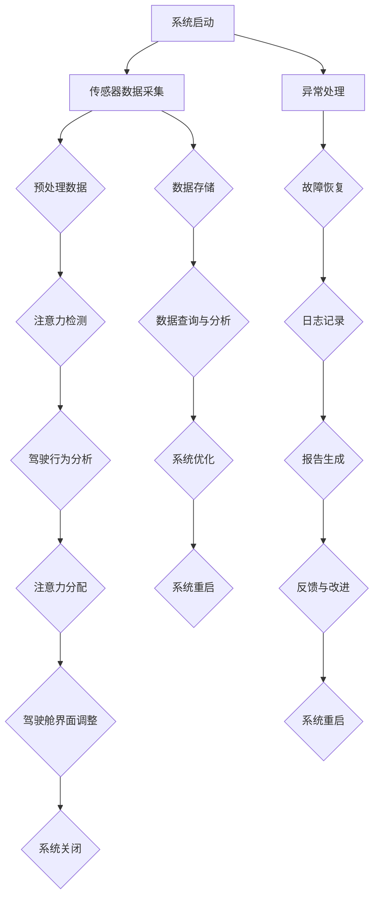
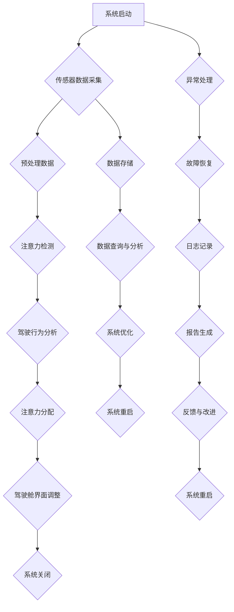

                 

### 《智能汽车驾驶舱的注意力管理系统》

#### 关键词：智能汽车、驾驶舱、注意力管理、注意力检测、驾驶行为分析、系统设计与实现

> 摘要：
> 
> 随着智能汽车技术的发展，驾驶舱的注意力管理系统成为提升驾驶安全和用户体验的关键。本文深入探讨了智能汽车驾驶舱的注意力管理系统，包括其核心概念、算法原理、系统实现和应用案例。首先，我们对智能汽车和驾驶舱进行了概述，明确了注意力管理系统的基本概念。接着，详细介绍了视觉注意力检测、声音注意力检测和跨模态注意力检测算法，并运用伪代码和数学公式进行了阐述。随后，分析了驾驶行为分析算法和注意力分配策略，提供了项目实战与代码解读，以帮助读者理解注意力管理系统的具体应用。最后，我们对未来展望与挑战进行了探讨，为读者展示了智能汽车驾驶舱注意力管理系统的发展前景。

#### 第一部分：背景与核心概念

### 1. 智能汽车与驾驶舱概述

#### 1.1 智能汽车的定义与分类

智能汽车是指通过采用先进的计算机技术、传感器技术、通信技术和控制技术，实现自动驾驶、智能交通管理、智能车联网等功能的新一代汽车。根据智能程度的不同，智能汽车可以大致分为以下几类：

1. **自动化驾驶辅助汽车**：这类汽车提供部分自动驾驶功能，如自适应巡航控制、自动泊车、车道保持辅助等。它们依赖传感器和控制系统来辅助驾驶员完成一些驾驶任务。

2. **半自动驾驶汽车**：这类汽车能够在特定条件下实现自动驾驶，如高速公路自动驾驶、城市自动驾驶等。它们通常具备高级驾驶辅助系统（ADAS），包括自适应巡航控制、自动换道、自动紧急制动等。

3. **全自动驾驶汽车**：这类汽车完全依靠自身传感器和人工智能系统实现自动驾驶，无需人类干预。目前，全自动驾驶汽车尚处于研发阶段，预计将在未来几年内逐步实现商业化。

#### 1.1.1 传统汽车与智能汽车的对比

传统汽车主要依赖机械结构和物理控制，驾驶完全依赖于人类驾驶员的操作。而智能汽车则通过集成多种传感器、计算机和通信设备，实现自动化、智能化和联网化。以下是对两者进行对比的几个方面：

- **控制系统**：传统汽车依靠机械结构和物理控制，而智能汽车通过电子控制系统进行驾驶控制。

- **传感器**：传统汽车可能仅配备基本的传感器，如速度传感器和转向传感器，而智能汽车配备了更为丰富的传感器，如雷达、激光雷达、摄像头等。

- **通信**：传统汽车缺乏通信功能，而智能汽车可以通过车联网实现与其他车辆、基础设施的通信。

- **自动驾驶功能**：传统汽车无法实现自动驾驶，而智能汽车可以通过自动化系统实现部分或完全自动驾驶。

#### 1.1.2 智能汽车的构成要素

智能汽车通常由以下几部分构成：

- **传感器**：包括雷达、激光雷达、摄像头、超声波传感器等，用于感知车辆周围环境。

- **计算平台**：包括车载计算机、嵌入式处理器、GPU等，用于处理传感器数据并控制车辆。

- **通信模块**：包括V2X（车对一切）通信模块，用于实现车与车、车与基础设施之间的通信。

- **控制系统**：包括自动驾驶控制系统、车辆控制单元等，用于根据传感器数据和通信模块的信息控制车辆。

- **软件系统**：包括自动驾驶软件、车载娱乐系统、车联网系统等，用于实现车辆的各项功能。

#### 1.1.3 智能汽车的发展趋势

智能汽车的发展趋势主要体现在以下几个方面：

- **技术进步**：随着传感器技术、计算机技术和通信技术的不断发展，智能汽车的性能和功能将得到进一步提升。

- **自动驾驶**：全自动驾驶技术的不断进步，使得自动驾驶汽车有望在未来实现商业化。

- **车联网**：车联网技术的发展，使得车辆之间的通信和协同将成为可能，从而提升交通安全和效率。

- **智能化服务**：智能汽车将提供更加智能化、个性化的服务，如自动驾驶出行服务、车载娱乐服务等。

### 1.2 驾驶舱的功能与重要性

#### 1.2.1 驾驶舱的定义与组成部分

驾驶舱是指驾驶员在驾驶过程中所处的空间，包括座椅、方向盘、仪表盘、控制按钮等。驾驶舱的设计对于驾驶员的驾驶体验和安全至关重要。驾驶舱通常由以下几部分组成：

- **座椅**：提供舒适的驾驶环境，确保驾驶员在长时间驾驶过程中不会感到疲劳。

- **方向盘**：驾驶员通过方向盘控制车辆的转向。

- **仪表盘**：显示车辆的各项状态信息，如车速、油量、水温等。

- **控制按钮**：用于控制车辆的各项功能，如灯光、雨刷、空调等。

- **多媒体系统**：包括车载音响、导航系统、车载Wi-Fi等，用于提供娱乐和信息服务。

#### 1.2.2 驾驶舱在智能汽车中的作用

驾驶舱在智能汽车中发挥着至关重要的作用，主要体现在以下几个方面：

- **人机交互**：驾驶舱是驾驶员与车辆之间进行交互的界面，通过驾驶舱，驾驶员可以接收车辆的信息，并下达指令。

- **信息显示**：驾驶舱的仪表盘和屏幕用于显示车辆的实时状态、导航信息、车辆故障等信息，帮助驾驶员做出决策。

- **控制车辆**：驾驶舱的控制按钮和触摸屏用于控制车辆的各项功能，如灯光、雨刷、空调等。

- **辅助驾驶**：智能驾驶舱通过集成自动驾驶系统，为驾驶员提供自动驾驶辅助功能，如自适应巡航控制、自动泊车等。

#### 1.2.3 驾驶舱的设计原则与挑战

驾驶舱的设计需要遵循以下原则：

- **安全性**：确保驾驶员在驾驶过程中不会因驾驶舱设计问题而分心，提高驾驶安全。

- **舒适性**：提供舒适的驾驶环境，减少驾驶员的疲劳感。

- **易用性**：设计简洁直观，使驾驶员容易上手和使用。

- **智能化**：集成智能技术，提供智能化、个性化的服务。

驾驶舱的设计也面临一些挑战：

- **复杂性**：智能汽车配备了多种传感器、控制模块和软件系统，驾驶舱的设计需要充分考虑这些因素的集成。

- **兼容性**：驾驶舱需要与不同品牌、不同型号的车辆兼容，实现功能的互通。

- **个性化**：驾驶舱的设计需要考虑不同驾驶员的需求和偏好，提供个性化的驾驶体验。

#### 1.3 注意力管理系统的基本概念

##### 1.3.1 注意力的定义与分类

注意力是指大脑处理信息的集中程度。根据不同的关注点，注意力可以分为以下几类：

- **选择性注意力**：指大脑从众多信息中选择关注某些信息的能力。

- **持续性注意力**：指大脑在一段时间内保持关注同一信息的能力。

- **分配性注意力**：指大脑同时处理多个任务的能力。

##### 1.3.2 注意力管理的重要性

注意力管理在智能汽车驾驶舱中具有重要性，主要体现在以下几个方面：

- **驾驶安全**：通过注意力管理系统，可以实时监测驾驶员的注意力水平，防止因注意力分散导致的驾驶事故。

- **用户体验**：注意力管理系统可以提供个性化的驾驶体验，根据驾驶员的注意力水平调整车辆的功能和信息显示。

- **辅助驾驶**：注意力管理系统可以辅助驾驶员在疲劳或注意力不集中时提供警示，减少人为错误。

##### 1.3.3 注意力管理的研究现状

注意力管理系统在智能汽车领域的研究主要集中在以下几个方面：

- **注意力检测算法**：通过分析驾驶员的行为、生理信号等信息，实时监测驾驶员的注意力水平。

- **注意力分配策略**：研究如何根据驾驶员的注意力水平，合理分配注意力资源，提高驾驶安全性和用户体验。

- **系统集成**：将注意力管理系统与其他智能汽车系统（如自动驾驶系统、车联网系统等）集成，实现信息共享和协同工作。

#### 1.4 驾驶舱注意力管理系统架构

##### 1.4.1 驾驶舱注意力管理系统的定义

驾驶舱注意力管理系统是指通过集成传感器、计算平台、通信模块等，实时监测驾驶员的注意力水平，并根据注意力水平调整驾驶舱功能和信息显示的系统。

##### 1.4.2 驾驶舱注意力管理系统的主要功能

驾驶舱注意力管理系统主要包括以下功能：

- **注意力检测**：通过传感器和算法实时监测驾驶员的注意力水平。

- **注意力分配**：根据驾驶员的注意力水平，调整驾驶舱的界面显示和信息提示。

- **预警与干预**：在驾驶员注意力不集中时，提供预警信息或自动干预措施，如调整音量、屏幕亮度等。

- **数据记录与分析**：记录驾驶员的注意力数据，进行分析和评估，为驾驶舱优化提供依据。

##### 1.4.3 驾驶舱注意力管理系统架构设计

驾驶舱注意力管理系统架构设计主要包括以下模块：

- **传感器模块**：包括摄像头、麦克风、加速度传感器等，用于监测驾驶员的行为、生理信号等。

- **计算模块**：包括车载计算机、嵌入式处理器等，用于处理传感器数据，执行注意力检测和分配算法。

- **通信模块**：包括Wi-Fi、蓝牙等，用于与其他车辆、基础设施进行通信，实现信息共享和协同工作。

- **控制模块**：包括仪表盘、屏幕、控制按钮等，用于显示注意力信息、调整车辆功能。

- **数据存储与分析模块**：用于存储驾驶员的注意力数据，进行分析和评估。

#### 1.5 小结

本部分主要介绍了智能汽车与驾驶舱的基本概念、注意力管理系统的定义和重要性，以及驾驶舱注意力管理系统的架构设计。这些内容为后续讨论注意力检测、驾驶行为分析和注意力分配策略等核心算法奠定了基础。在下一部分中，我们将深入探讨注意力检测算法的基本原理和应用。

### 第二部分：核心算法原理

#### 3. 注意力检测算法

注意力检测算法是驾驶舱注意力管理系统中的核心组成部分，负责实时监测驾驶员的注意力水平。注意力检测算法可以分为视觉注意力检测、声音注意力检测和跨模态注意力检测等不同类型。以下将分别介绍这三种类型的注意力检测算法的基本原理、实现方法和应用场景。

##### 3.1 视觉注意力检测

视觉注意力检测是指通过分析驾驶员在视觉信息处理过程中的注意力分配情况，实时检测驾驶员的注意力水平。视觉注意力检测的基本原理是基于图像处理和计算机视觉技术，通过分析驾驶员的行为和视觉反应来推断其注意力状态。

**实现方法**：

1. **行为特征提取**：通过摄像头捕获驾驶员的视线方向、头部运动等行为特征，将其转化为数字信号。

2. **视觉反应分析**：通过分析驾驶员对视觉信息的反应时间、反应强度等指标，判断驾驶员的注意力水平。

3. **深度学习模型**：采用深度学习模型（如卷积神经网络、循环神经网络等）对行为特征进行建模，训练出一个能够准确预测注意力水平的模型。

**应用场景**：

- **疲劳驾驶检测**：通过实时监测驾驶员的视觉注意力水平，可以及时发现驾驶员疲劳状态，提供预警和干预措施。

- **安全驾驶辅助**：在驾驶员注意力不集中时，可以自动调整驾驶舱界面，减少干扰信息，提高驾驶安全性。

- **驾驶行为分析**：通过分析驾驶员的视觉注意力水平，可以了解驾驶员的驾驶习惯和行为模式，为驾驶舱优化和个性化服务提供依据。

##### 3.2 声音注意力检测

声音注意力检测是指通过分析驾驶员在听觉信息处理过程中的注意力分配情况，实时检测驾驶员的注意力水平。声音注意力检测的基本原理是基于信号处理和语音识别技术，通过分析驾驶员对声音信息的反应来推断其注意力状态。

**实现方法**：

1. **声音特征提取**：通过麦克风捕获驾驶员的声音信号，将其转化为数字信号，提取出声音特征（如频率、振幅等）。

2. **语音识别**：利用语音识别技术，将声音信号转换为文本信息，分析驾驶员的语音内容和反应速度。

3. **深度学习模型**：采用深度学习模型对声音特征进行建模，训练出一个能够准确预测注意力水平的模型。

**应用场景**：

- **疲劳驾驶检测**：通过实时监测驾驶员的听觉注意力水平，可以及时发现驾驶员疲劳状态，提供预警和干预措施。

- **声音干扰分析**：分析驾驶员对环境声音的反应，了解哪些声音干扰会影响驾驶员的注意力，为驾驶舱降噪和声音优化提供依据。

- **驾驶行为分析**：通过分析驾驶员的听觉注意力水平，可以了解驾驶员的驾驶习惯和行为模式，为驾驶舱优化和个性化服务提供依据。

##### 3.3 跨模态注意力检测

跨模态注意力检测是指通过同时分析驾驶员在视觉和听觉信息处理过程中的注意力分配情况，实时检测驾驶员的注意力水平。跨模态注意力检测的基本原理是基于多模态信息融合和深度学习技术，通过整合视觉和听觉信息来提高注意力检测的准确性和可靠性。

**实现方法**：

1. **多模态信息采集**：通过摄像头和麦克风同时采集驾驶员的视觉和听觉信息。

2. **特征提取与融合**：提取视觉和听觉特征，利用多模态信息融合技术（如注意力机制、卷积神经网络等）整合两种模态的信息。

3. **深度学习模型**：采用深度学习模型对融合后的特征进行建模，训练出一个能够准确预测注意力水平的模型。

**应用场景**：

- **多模态疲劳驾驶检测**：通过同时分析驾驶员的视觉和听觉注意力水平，可以更准确地判断驾驶员的疲劳状态，提供更为可靠的预警和干预措施。

- **多模态驾驶行为分析**：通过分析驾驶员的视觉和听觉注意力水平，可以更全面地了解驾驶员的驾驶习惯和行为模式，为驾驶舱优化和个性化服务提供依据。

- **多模态交互优化**：在驾驶舱设计时，可以根据驾驶员的视觉和听觉注意力水平，优化信息显示和交互方式，提高驾驶安全性。

##### 3.4 注意力检测算法的挑战与未来方向

注意力检测算法在实现过程中面临着一些挑战，如：

- **多任务干扰**：在驾驶过程中，驾驶员可能同时面临视觉、听觉等多种干扰，如何准确检测注意力水平是一个挑战。

- **个体差异**：不同驾驶员的注意力水平存在差异，如何设计普适的注意力检测算法也是一个挑战。

- **实时性**：注意力检测算法需要实时响应，确保在紧急情况下能够及时提供预警和干预措施。

未来注意力检测算法的发展方向包括：

- **深度学习技术**：利用深度学习技术，提高注意力检测算法的准确性和实时性。

- **多模态融合**：通过多模态信息融合，提高注意力检测的准确性和可靠性。

- **个性化**：结合个体差异，设计个性化的注意力检测算法，提高驾驶安全性和用户体验。

#### 4. 驾驶行为分析算法

驾驶行为分析算法是驾驶舱注意力管理系统中的另一个核心组成部分，负责对驾驶员的驾驶行为进行实时分析，为注意力检测和分配提供依据。驾驶行为分析算法通常基于机器学习和人工智能技术，通过对大量驾驶行为数据进行训练和建模，实现驾驶行为的自动识别和分析。

##### 4.1 驾驶行为数据的采集与预处理

驾驶行为数据的采集是驾驶行为分析算法实现的基础。驾驶行为数据可以来源于多种渠道，如：

- **车载传感器**：包括速度传感器、加速度传感器、转向传感器等，可以提供车辆的运行状态信息。

- **驾驶员生理信号**：包括心率、呼吸、眼动等，可以反映驾驶员的生理状态。

- **车辆控制数据**：包括方向盘操作、踏板操作等，可以反映驾驶员的驾驶操作。

采集到的驾驶行为数据通常需要进行预处理，包括：

- **数据清洗**：去除噪声、填补缺失值等，确保数据质量。

- **特征提取**：从原始数据中提取有用的特征，如速度、加速度、转向角度等。

- **数据归一化**：将不同特征的数据进行归一化处理，使其具有相同的量纲。

##### 4.2 驾驶行为分析算法原理

驾驶行为分析算法通常基于机器学习技术，通过训练模型对驾驶行为数据进行分类、预测和分析。以下是一些常见的驾驶行为分析算法：

- **决策树**：通过构建决策树模型，对驾驶行为数据进行分析和分类。

- **支持向量机**：通过支持向量机模型，对驾驶行为数据进行分析和预测。

- **神经网络**：通过神经网络模型，对驾驶行为数据进行分析和识别。

驾驶行为分析算法的实现过程包括：

1. **数据集准备**：准备训练集和测试集，确保数据集的多样性和代表性。

2. **模型选择**：根据驾驶行为分析的需求，选择合适的算法模型。

3. **模型训练**：利用训练集对模型进行训练，调整模型参数。

4. **模型评估**：利用测试集对模型进行评估，确保模型性能满足要求。

##### 4.3 驾驶行为分析算法的应用

驾驶行为分析算法在智能汽车驾驶舱中具有广泛的应用，包括：

- **疲劳驾驶检测**：通过分析驾驶员的驾驶行为数据，实时监测驾驶员的疲劳状态，提供预警和干预措施。

- **驾驶行为预测**：根据驾驶员的驾驶行为数据，预测驾驶员的未来驾驶行为，为驾驶舱提供个性化服务。

- **驾驶行为评估**：对驾驶员的驾驶行为进行分析和评估，为驾驶员培训和安全驾驶提供依据。

##### 4.4 驾驶行为分析算法的挑战与未来方向

驾驶行为分析算法在实现过程中面临着一些挑战，如：

- **数据质量**：驾驶行为数据的采集和处理过程中可能存在噪声和缺失值，需要确保数据质量。

- **模型解释性**：驾驶行为分析算法的模型通常较为复杂，需要提高模型的解释性，使其易于理解和应用。

- **实时性**：驾驶行为分析算法需要实时响应，确保在紧急情况下能够及时提供预警和干预措施。

未来驾驶行为分析算法的发展方向包括：

- **多源数据融合**：通过融合多种数据源，提高驾驶行为分析的准确性和可靠性。

- **模型解释性**：提高驾驶行为分析算法的模型解释性，使其更加透明和可信。

- **个性化**：结合个体差异，设计个性化的驾驶行为分析算法，提高驾驶安全性和用户体验。

#### 5. 注意力分配策略

注意力分配策略是驾驶舱注意力管理系统中的关键环节，负责根据驾驶员的注意力水平，合理分配注意力资源，提高驾驶安全性和用户体验。注意力分配策略可以分为基于行为的注意力分配策略和基于情境的注意力分配策略。

##### 5.1 基于行为的注意力分配策略

基于行为的注意力分配策略是指根据驾驶员的行为特征，动态调整驾驶舱的功能和信息显示。以下是一些常见的基于行为的注意力分配策略：

- **行为监测**：通过摄像头、传感器等设备监测驾驶员的行为特征，如视线、头部运动、方向盘操作等。

- **注意力评分**：根据驾驶员的行为特征，对驾驶员的注意力水平进行评分，确定当前驾驶状态。

- **功能调整**：根据注意力评分，动态调整驾驶舱的功能和信息显示，如调整音量、屏幕亮度、信息提示等。

基于行为的注意力分配策略的优点是能够实时响应驾驶员的行为变化，提高驾驶安全性。然而，其缺点是可能存在误判和延迟现象，需要进一步提高准确性。

##### 5.2 基于情境的注意力分配策略

基于情境的注意力分配策略是指根据车辆和环境的状态，动态调整驾驶舱的功能和信息显示。以下是一些常见的基于情境的注意力分配策略：

- **情境监测**：通过传感器、通信模块等设备监测车辆和环境的状态，如车速、路况、天气等。

- **注意力权重**：根据车辆和环境的状态，为不同功能和信息显示分配不同的注意力权重。

- **功能调整**：根据注意力权重，动态调整驾驶舱的功能和信息显示，如调整导航信息、警示信息等。

基于情境的注意力分配策略的优点是能够根据不同的驾驶情境，提供个性化的注意力分配方案，提高驾驶舒适性和安全性。然而，其缺点是需要大量的数据和计算资源，对实时性要求较高。

##### 5.3 注意力优化算法

注意力优化算法是指通过优化注意力资源的分配，提高驾驶舱的效率和用户体验。以下是一些常见的注意力优化算法：

- **贪心算法**：通过贪心策略，选择当前最优的注意力分配方案。

- **遗传算法**：通过模拟自然选择过程，优化注意力资源的分配。

- **强化学习**：通过学习驾驶员的行为模式，优化注意力资源的分配。

注意力优化算法的优点是能够根据驾驶员的行为和环境状态，动态调整注意力分配策略，提高驾驶舱的效率和用户体验。然而，其缺点是算法复杂度较高，对计算资源要求较高。

##### 5.4 注意力分配策略的挑战与未来方向

注意力分配策略在实现过程中面临着一些挑战，如：

- **实时性**：需要实时响应驾驶员的行为和环境变化，提高实时性。

- **准确性**：需要提高注意力检测和分配的准确性，减少误判和延迟。

- **个性化**：需要根据个体差异，设计个性化的注意力分配策略，提高驾驶安全性和用户体验。

未来注意力分配策略的发展方向包括：

- **多源数据融合**：通过融合多种数据源，提高注意力检测和分配的准确性。

- **模型解释性**：提高注意力分配算法的模型解释性，使其更加透明和可信。

- **个性化**：结合个体差异，设计个性化的注意力分配策略，提高驾驶安全性和用户体验。

### 6. 系统设计与实现

驾驶舱注意力管理系统的实现涉及到多个模块的设计与集成，包括传感器模块、计算模块、通信模块和控制模块等。以下将分别介绍这些模块的功能和实现方法。

##### 6.1 系统架构设计

驾驶舱注意力管理系统的整体架构可以分为三个层次：感知层、数据处理层和应用层。

- **感知层**：包括传感器模块，负责采集驾驶员的行为特征和车辆环境信息。

- **数据处理层**：包括计算模块，负责对传感器数据进行处理和分析，实现注意力检测和分配算法。

- **应用层**：包括控制模块，负责根据注意力检测结果和分配策略，调整驾驶舱的功能和信息显示。

##### 6.2 传感器模块

传感器模块是驾驶舱注意力管理系统的感知层，负责采集驾驶员的行为特征和车辆环境信息。常见的传感器包括摄像头、麦克风、加速度传感器、陀螺仪等。以下是对这些传感器的简要介绍：

- **摄像头**：用于捕捉驾驶员的视线方向和头部运动，实现视觉注意力检测。

- **麦克风**：用于捕捉驾驶员的语音信号，实现声音注意力检测。

- **加速度传感器**：用于监测车辆的加速度和倾斜角度，提供车辆的运行状态信息。

- **陀螺仪**：用于监测车辆的角速度，提供车辆的旋转状态信息。

传感器模块的实现方法包括：

1. **传感器选择**：根据驾驶舱注意力管理系统的需求，选择合适的传感器。

2. **传感器数据采集**：通过数据采集模块，实时采集传感器的数据。

3. **传感器校准**：对传感器进行校准，确保数据的准确性。

##### 6.3 计算模块

计算模块是驾驶舱注意力管理系统的数据处理层，负责对传感器数据进行处理和分析，实现注意力检测和分配算法。计算模块通常包括以下功能：

- **数据处理**：对传感器数据进行预处理，包括数据清洗、归一化等。

- **注意力检测**：通过视觉注意力检测、声音注意力检测等算法，实时监测驾驶员的注意力水平。

- **注意力分配**：根据注意力检测结果和分配策略，调整驾驶舱的功能和信息显示。

计算模块的实现方法包括：

1. **算法实现**：采用深度学习、机器学习等技术，实现注意力检测和分配算法。

2. **模型训练**：利用训练数据集，对算法模型进行训练和优化。

3. **实时处理**：实现实时数据处理和分析，确保系统的实时性。

##### 6.4 通信模块

通信模块是驾驶舱注意力管理系统的应用层，负责与其他车辆、基础设施进行通信，实现信息共享和协同工作。通信模块通常包括以下功能：

- **V2X通信**：实现车辆与车辆、车辆与基础设施之间的通信，提供道路信息、交通状况等。

- **车联网**：实现车辆与互联网的连接，提供在线导航、车辆控制等功能。

通信模块的实现方法包括：

1. **通信协议**：选择合适的通信协议，如Wi-Fi、蓝牙、5G等，实现车辆间的通信。

2. **数据传输**：通过通信模块，实现数据的实时传输和共享。

3. **安全性**：确保通信过程中的数据安全和隐私保护。

##### 6.5 控制模块

控制模块是驾驶舱注意力管理系统的核心，负责根据注意力检测结果和分配策略，调整驾驶舱的功能和信息显示。控制模块通常包括以下功能：

- **界面控制**：调整驾驶舱的界面显示，如音量、屏幕亮度、信息提示等。

- **功能控制**：调整驾驶舱的功能，如自动驾驶、音响系统、空调等。

- **预警与干预**：在驾驶员注意力不集中时，提供预警信息或自动干预措施。

控制模块的实现方法包括：

1. **界面设计**：设计简洁直观的驾驶舱界面，提高驾驶员的易用性。

2. **功能集成**：将不同的驾驶舱功能集成到控制模块中，实现统一控制。

3. **预警与干预**：根据注意力检测结果，提供实时预警和干预措施，提高驾驶安全性。

##### 6.6 数据处理与存储

驾驶舱注意力管理系统需要大量的数据处理和存储。以下是对数据处理与存储的简要介绍：

- **数据处理**：对采集到的传感器数据进行预处理、特征提取和模型预测等处理。

- **数据存储**：将处理后的数据存储在数据库中，便于后续分析和查询。

数据处理与存储的实现方法包括：

1. **数据库选择**：选择合适的数据库系统，如MySQL、MongoDB等，实现数据的存储和管理。

2. **数据备份**：定期对数据进行备份，确保数据的安全性和完整性。

3. **数据查询**：提供数据查询接口，方便用户对历史数据进行查询和分析。

##### 6.7 系统部署与优化

驾驶舱注意力管理系统的部署与优化是确保系统稳定运行和高效性能的关键。以下是对系统部署与优化的简要介绍：

- **部署环境**：搭建合适的部署环境，包括服务器、网络设备等。

- **性能优化**：通过优化算法、提高硬件性能、调整系统参数等方式，提高系统的性能和稳定性。

- **安全性**：确保系统的数据安全和隐私保护，采用加密、身份验证等安全措施。

系统部署与优化的实现方法包括：

1. **部署方案**：设计合理的部署方案，确保系统的稳定性和可靠性。

2. **性能测试**：对系统进行性能测试，找出瓶颈和优化点。

3. **监控与维护**：对系统进行实时监控和维护，确保系统的正常运行。

#### 7. 应用案例与展望

##### 7.1 智能汽车驾驶舱注意力管理系统在自动驾驶中的应用

智能汽车驾驶舱注意力管理系统在自动驾驶中发挥着重要作用。通过实时监测驾驶员的注意力水平，可以确保驾驶员在自动驾驶过程中保持警觉，防止疲劳驾驶和注意力分散。以下是一个自动驾驶场景下的应用案例：

- **场景**：在高速公路上，车辆处于自动驾驶模式。

- **解决方案**：驾驶舱注意力管理系统通过摄像头和麦克风实时监测驾驶员的视线方向和语音信号。当系统检测到驾驶员注意力不集中时，会自动调整音量和屏幕亮度，提供预警信息。同时，系统可以自动切换到手动驾驶模式，提醒驾驶员接管车辆。

##### 7.2 智能汽车驾驶舱注意力管理系统在辅助驾驶中的应用

智能汽车驾驶舱注意力管理系统在辅助驾驶中也可以发挥重要作用。通过实时监测驾驶员的注意力水平，可以提供个性化的驾驶体验，提高驾驶安全性和舒适性。以下是一个辅助驾驶场景下的应用案例：

- **场景**：在城市道路行驶，车辆处于辅助驾驶模式。

- **解决方案**：驾驶舱注意力管理系统根据驾驶员的注意力水平，动态调整音响音量和导航界面显示。当系统检测到驾驶员注意力不集中时，会自动降低音量或调整导航界面，以减少干扰。同时，系统还可以提供疲劳驾驶预警，提醒驾驶员休息。

##### 7.3 未来展望与挑战

随着智能汽车技术的发展，驾驶舱注意力管理系统在未来有望在以下方面取得突破：

- **多模态注意力检测**：通过整合视觉、听觉等多种模态信息，提高注意力检测的准确性和实时性。

- **个性化**：结合个体差异，设计个性化的注意力管理策略，提高驾驶安全性和用户体验。

- **集成与兼容性**：将注意力管理系统与其他智能汽车系统（如自动驾驶系统、车联网系统等）集成，实现信息共享和协同工作。

然而，驾驶舱注意力管理系统也面临着一些挑战，如：

- **实时性**：需要提高注意力检测和分配算法的实时性，确保在紧急情况下能够及时响应。

- **准确性**：需要提高注意力检测算法的准确性，减少误判和延迟。

- **隐私与安全**：需要确保系统的数据安全和隐私保护，防止数据泄露和滥用。

#### 8. 小结

本部分主要介绍了驾驶舱注意力管理系统的核心算法原理、系统设计与实现，以及应用案例和未来展望。通过视觉注意力检测、声音注意力检测和跨模态注意力检测等算法，可以实时监测驾驶员的注意力水平；通过驾驶行为分析算法和注意力分配策略，可以实现个性化的驾驶体验和提高驾驶安全性。未来，随着智能汽车技术的发展，驾驶舱注意力管理系统将在自动驾驶和辅助驾驶中发挥更大的作用。

### 第三部分：核心算法原理

#### 3.1 视觉注意力检测

视觉注意力检测是驾驶舱注意力管理系统的核心组成部分之一，它通过分析驾驶员的视觉行为，实时监测驾驶员的注意力水平。视觉注意力检测通常涉及行为特征的提取、深度学习模型的训练和注意力水平的预测。以下将详细探讨视觉注意力检测的基本原理、算法模型和应用场景。

**3.1.1 视觉注意力检测的基本原理**

视觉注意力检测的原理基于人类视觉系统的工作机制。人类大脑能够自动地对视觉信息进行筛选和优先处理，这种能力称为视觉注意力。在驾驶过程中，驾驶员的视觉注意力会影响其对外界环境的感知和反应。视觉注意力检测旨在通过分析驾驶员的视觉行为，如视线方向、头部运动、眼动轨迹等，推断驾驶员的注意力水平。

**3.1.2 基于深度学习的视觉注意力模型**

为了实现视觉注意力检测，研究者们通常采用深度学习技术，特别是卷积神经网络（CNN）和循环神经网络（RNN）等模型。以下是一些常用的深度学习模型：

1. **卷积神经网络（CNN）**：CNN是一种专门用于图像处理的深度学习模型，能够自动提取图像中的特征。在视觉注意力检测中，CNN可以用于提取驾驶员的视线方向、面部表情等视觉特征。

2. **循环神经网络（RNN）**：RNN能够处理序列数据，适用于分析驾驶员的眼动轨迹和头部运动等时间序列数据。通过RNN，可以捕捉驾驶员视觉行为的动态变化。

3. **融合模型**：为了提高视觉注意力检测的准确性，研究者们还提出了一些融合模型，如结合CNN和RNN的混合模型。这些模型能够同时利用静态和动态特征，提供更全面的注意力检测。

**3.1.3 基于深度学习的视觉注意力模型的应用场景**

基于深度学习的视觉注意力模型在多个应用场景中取得了显著效果：

1. **疲劳驾驶检测**：通过实时监测驾驶员的视线方向和眼动轨迹，可以及时识别出驾驶员的疲劳状态，提供预警和干预措施。

2. **驾驶行为分析**：分析驾驶员的视觉注意力水平，可以了解驾驶员的驾驶习惯和行为模式，为驾驶舱优化和个性化服务提供依据。

3. **智能辅助驾驶**：在自动驾驶和辅助驾驶系统中，视觉注意力检测可以辅助驾驶员保持警觉，确保驾驶安全。

**3.1.4 伪代码示例**

以下是一个基于深度学习的视觉注意力检测算法的伪代码示例：

```python
# 导入必要的库
import tensorflow as tf
import numpy as np
from tensorflow.keras.models import Sequential
from tensorflow.keras.layers import Conv2D, MaxPooling2D, Flatten, Dense, LSTM

# 加载训练数据
train_data = load_train_data()

# 预处理数据
preprocessed_data = preprocess_data(train_data)

# 构建深度学习模型
model = Sequential()
model.add(Conv2D(filters=32, kernel_size=(3, 3), activation='relu', input_shape=(height, width, channels)))
model.add(MaxPooling2D(pool_size=(2, 2)))
model.add(Flatten())
model.add(Dense(units=64, activation='relu'))
model.add(LSTM(units=50, return_sequences=True))
model.add(Dense(units=1, activation='sigmoid'))

# 编译模型
model.compile(optimizer='adam', loss='binary_crossentropy', metrics=['accuracy'])

# 训练模型
trained_model = model.fit(preprocessed_data['X'], preprocessed_data['y'], epochs=10, batch_size=32)

# 预测注意力水平
def predict_attention_level(image):
    preprocessed_image = preprocess_image(image)
    prediction = trained_model.predict(preprocessed_image)
    attention_level = decode_prediction(prediction)
    return attention_level

# 解码预测结果
def decode_prediction(prediction):
    # 根据预测结果解码注意力水平
    # 例如：若预测结果大于0.5，则认为驾驶员注意力集中
    if prediction > 0.5:
        return '集中'
    else:
        return '不集中'
```

**3.1.5 数学模型与公式**

视觉注意力检测中的数学模型通常涉及注意力机制，以下是一个简单的数学模型示例：

$$
Attention_{i} = \sigma(W \cdot [x_{i}; h_{i-1}])
$$

其中，$Attention_{i}$ 是第 $i$ 个时间步的注意力得分，$\sigma$ 是激活函数（如Sigmoid函数），$W$ 是权重矩阵，$x_{i}$ 是第 $i$ 个时间步的输入特征，$h_{i-1}$ 是前一个时间步的隐藏状态。

**3.1.6 实际应用案例**

在实际应用中，视觉注意力检测被广泛应用于智能汽车领域。以下是一个实际应用案例：

- **场景**：在高速公路上，车辆处于自动驾驶模式。

- **解决方案**：驾驶舱通过摄像头实时监测驾驶员的视线方向。当系统检测到驾驶员视线偏离道路时，会自动调整音量或屏幕亮度，提醒驾驶员关注路况。同时，系统可以自动切换到手动驾驶模式，确保驾驶安全。

**3.1.7 小结**

视觉注意力检测是驾驶舱注意力管理系统中的关键组成部分，通过分析驾驶员的视觉行为，可以实时监测驾驶员的注意力水平。基于深度学习的视觉注意力模型在多个应用场景中表现出色，如疲劳驾驶检测、驾驶行为分析和智能辅助驾驶。未来，随着深度学习技术的不断发展，视觉注意力检测的准确性和实时性将得到进一步提升。

#### 3.2 声音注意力检测

声音注意力检测是驾驶舱注意力管理系统中的另一个核心组成部分，它通过分析驾驶员的听觉行为，实时监测驾驶员的注意力水平。声音注意力检测通常涉及声音特征的提取、深度学习模型的训练和注意力水平的预测。以下将详细探讨声音注意力检测的基本原理、算法模型和应用场景。

**3.2.1 声音注意力检测的基本原理**

声音注意力检测的原理基于人类听觉系统的工作机制。人类大脑能够自动地对听觉信息进行筛选和优先处理，这种能力称为听觉注意力。在驾驶过程中，驾驶员的听觉注意力会影响其对外界声音的感知和反应。声音注意力检测旨在通过分析驾驶员的听觉行为，如语音识别、声音特征提取等，推断驾驶员的注意力水平。

**3.2.2 基于深度学习的声音注意力模型**

为了实现声音注意力检测，研究者们通常采用深度学习技术，特别是卷积神经网络（CNN）和循环神经网络（RNN）等模型。以下是一些常用的深度学习模型：

1. **卷积神经网络（CNN）**：CNN是一种专门用于图像处理的深度学习模型，但在声音注意力检测中，CNN可以用于提取语音信号中的特征，如音素、音调等。

2. **循环神经网络（RNN）**：RNN能够处理序列数据，适用于分析驾驶员的语音序列和时间序列数据。通过RNN，可以捕捉驾驶员听觉行为的动态变化。

3. **融合模型**：为了提高声音注意力检测的准确性，研究者们还提出了一些融合模型，如结合CNN和RNN的混合模型。这些模型能够同时利用静态和动态特征，提供更全面的声音注意力检测。

**3.2.3 基于深度学习的声音注意力模型的应用场景**

基于深度学习的声音注意力模型在多个应用场景中取得了显著效果：

1. **疲劳驾驶检测**：通过实时监测驾驶员的语音特征和声音强度，可以及时识别出驾驶员的疲劳状态，提供预警和干预措施。

2. **驾驶行为分析**：分析驾驶员的听觉注意力水平，可以了解驾驶员的驾驶习惯和行为模式，为驾驶舱优化和个性化服务提供依据。

3. **智能辅助驾驶**：在自动驾驶和辅助驾驶系统中，声音注意力检测可以辅助驾驶员保持警觉，确保驾驶安全。

**3.2.4 伪代码示例**

以下是一个基于深度学习的声音注意力检测算法的伪代码示例：

```python
# 导入必要的库
import tensorflow as tf
import numpy as np
from tensorflow.keras.models import Sequential
from tensorflow.keras.layers import Conv1D, MaxPooling1D, Flatten, Dense, LSTM

# 加载训练数据
train_data = load_train_data()

# 预处理数据
preprocessed_data = preprocess_data(train_data)

# 构建深度学习模型
model = Sequential()
model.add(Conv1D(filters=32, kernel_size=(3), activation='relu', input_shape=(sequence_length, features_dim)))
model.add(MaxPooling1D(pool_size=(2)))
model.add(Flatten())
model.add(Dense(units=64, activation='relu'))
model.add(LSTM(units=50, return_sequences=True))
model.add(Dense(units=1, activation='sigmoid'))

# 编译模型
model.compile(optimizer='adam', loss='binary_crossentropy', metrics=['accuracy'])

# 训练模型
trained_model = model.fit(preprocessed_data['X'], preprocessed_data['y'], epochs=10, batch_size=32)

# 预测注意力水平
def predict_attention_level(audio):
    preprocessed_audio = preprocess_audio(audio)
    prediction = trained_model.predict(preprocessed_audio)
    attention_level = decode_prediction(prediction)
    return attention_level

# 解码预测结果
def decode_prediction(prediction):
    # 根据预测结果解码注意力水平
    # 例如：若预测结果大于0.5，则认为驾驶员注意力集中
    if prediction > 0.5:
        return '集中'
    else:
        return '不集中'
```

**3.2.5 数学模型与公式**

声音注意力检测中的数学模型通常涉及语音信号的处理和特征提取，以下是一个简单的数学模型示例：

$$
Feature_{i} = \sum_{j=1}^{N} W_j \cdot [x_{j}; h_{i-1}]
$$

其中，$Feature_{i}$ 是第 $i$ 个时间步的特征向量，$x_{i}$ 是第 $i$ 个时间步的输入语音信号，$h_{i-1}$ 是前一个时间步的隐藏状态，$W_j$ 是权重矩阵。

**3.2.6 实际应用案例**

在实际应用中，声音注意力检测被广泛应用于智能汽车领域。以下是一个实际应用案例：

- **场景**：在城市交通中，驾驶员需要应对复杂的交通环境。

- **解决方案**：驾驶舱通过麦克风实时监测驾驶员的语音特征和声音强度。当系统检测到驾驶员声音疲劳或注意力不集中时，会自动调整音量或提供声音提示，提醒驾驶员关注路况。同时，系统可以自动切换到手动驾驶模式，确保驾驶安全。

**3.2.7 小结**

声音注意力检测是驾驶舱注意力管理系统中的关键组成部分，通过分析驾驶员的听觉行为，可以实时监测驾驶员的注意力水平。基于深度学习的声音注意力模型在多个应用场景中表现出色，如疲劳驾驶检测、驾驶行为分析和智能辅助驾驶。未来，随着深度学习技术的不断发展，声音注意力检测的准确性和实时性将得到进一步提升。

#### 3.3 跨模态注意力检测

跨模态注意力检测是驾驶舱注意力管理系统中的前沿技术，它通过整合不同模态（如视觉、听觉、触觉等）的信息，提高注意力检测的准确性和实时性。跨模态注意力检测旨在综合利用多种模态的数据，更好地理解驾驶员的注意力状态。以下将详细探讨跨模态注意力检测的基本原理、算法模型和应用场景。

**3.3.1 跨模态注意力检测的基本原理**

跨模态注意力检测的基本原理是利用多模态数据之间的相关性，通过整合不同模态的信息，实现更准确的注意力检测。在驾驶舱注意力管理系统中，跨模态注意力检测可以通过以下步骤实现：

1. **多模态数据采集**：同时采集驾驶员的视觉、听觉、触觉等多模态数据。

2. **多模态数据预处理**：对采集到的多模态数据进行预处理，包括数据清洗、归一化、特征提取等。

3. **多模态数据融合**：利用多模态数据融合技术，如注意力机制、特征融合模型等，整合不同模态的数据，形成统一的特征向量。

4. **注意力检测**：基于融合后的特征向量，使用深度学习模型进行注意力检测，预测驾驶员的注意力水平。

**3.3.2 基于深度学习的跨模态注意力模型**

为了实现跨模态注意力检测，研究者们提出了一系列基于深度学习的跨模态注意力模型。以下是一些常用的深度学习模型：

1. **多模态卷积神经网络（MM-CNN）**：MM-CNN结合了卷积神经网络（CNN）和多层感知机（MLP），能够同时处理视觉和听觉数据，实现跨模态特征提取。

2. **多模态循环神经网络（MM-RNN）**：MM-RNN结合了循环神经网络（RNN）和门控循环单元（GRU），能够处理时间序列数据，捕捉跨模态信息的变化。

3. **多模态变分自编码器（MM-VAE）**：MM-VAE利用变分自编码器（VAE）进行特征提取和融合，能够自动学习跨模态数据的低维表示。

4. **多模态注意力网络（MM-Attention）**：MM-Attention结合了多模态数据融合和注意力机制，能够根据不同模态的重要性动态调整注意力权重。

**3.3.3 基于深度学习的跨模态注意力模型的应用场景**

基于深度学习的跨模态注意力模型在多个应用场景中表现出色：

1. **疲劳驾驶检测**：通过整合视觉和听觉数据，可以更准确地识别驾驶员的疲劳状态，提高预警和干预的准确性。

2. **驾驶行为分析**：分析跨模态数据，可以更全面地了解驾驶员的驾驶习惯和行为模式，为驾驶舱优化和个性化服务提供依据。

3. **智能辅助驾驶**：在自动驾驶和辅助驾驶系统中，跨模态注意力检测可以辅助驾驶员保持警觉，确保驾驶安全。

**3.3.4 伪代码示例**

以下是一个基于深度学习的跨模态注意力检测算法的伪代码示例：

```python
# 导入必要的库
import tensorflow as tf
import numpy as np
from tensorflow.keras.models import Model
from tensorflow.keras.layers import Input, Conv2D, MaxPooling2D, Flatten, Dense, LSTM, Concatenate

# 定义视觉输入
visual_input = Input(shape=(height, width, channels))
visual_model = Conv2D(filters=32, kernel_size=(3, 3), activation='relu')(visual_input)
visual_model = MaxPooling2D(pool_size=(2, 2))(visual_model)
visual_model = Flatten()(visual_model)

# 定义听觉输入
audio_input = Input(shape=(sequence_length, features_dim))
audio_model = Conv1D(filters=32, kernel_size=(3), activation='relu')(audio_input)
audio_model = MaxPooling1D(pool_size=(2))(audio_model)
audio_model = Flatten()(audio_model)

# 定义多模态融合
merged = Concatenate()([visual_model, audio_model])
merged = LSTM(units=50, return_sequences=True)(merged)
merged = Dense(units=64, activation='relu')(merged)

# 定义输出层
output = Dense(units=1, activation='sigmoid')(merged)

# 构建多模态模型
model = Model(inputs=[visual_input, audio_input], outputs=output)

# 编译模型
model.compile(optimizer='adam', loss='binary_crossentropy', metrics=['accuracy'])

# 训练模型
trained_model = model.fit([visual_data, audio_data], labels, epochs=10, batch_size=32)

# 预测注意力水平
def predict_attention_level(visual_data, audio_data):
    preprocessed_visual_data = preprocess_visual_data(visual_data)
    preprocessed_audio_data = preprocess_audio_data(audio_data)
    prediction = trained_model.predict([preprocessed_visual_data, preprocessed_audio_data])
    attention_level = decode_prediction(prediction)
    return attention_level

# 解码预测结果
def decode_prediction(prediction):
    # 根据预测结果解码注意力水平
    # 例如：若预测结果大于0.5，则认为驾驶员注意力集中
    if prediction > 0.5:
        return '集中'
    else:
        return '不集中'
```

**3.3.5 数学模型与公式**

跨模态注意力检测中的数学模型通常涉及多模态数据的融合和注意力权重分配。以下是一个简单的数学模型示例：

$$
Feature_{i} = \sum_{j=1}^{M} w_{ji} \cdot [x_{ji}; h_{i-1}]
$$

其中，$Feature_{i}$ 是第 $i$ 个时间步的融合特征向量，$x_{ji}$ 是第 $i$ 个时间步的第 $j$ 个模态的数据，$h_{i-1}$ 是前一个时间步的隐藏状态，$w_{ji}$ 是第 $j$ 个模态的注意力权重。

**3.3.6 实际应用案例**

在实际应用中，跨模态注意力检测被广泛应用于智能汽车领域。以下是一个实际应用案例：

- **场景**：在高速公路上，车辆处于自动驾驶模式。

- **解决方案**：驾驶舱通过摄像头和麦克风同时采集视觉和听觉数据，利用跨模态注意力检测算法实时监测驾驶员的注意力水平。当系统检测到驾驶员注意力不集中时，会自动调整音量或屏幕亮度，提醒驾驶员关注路况。同时，系统可以自动切换到手动驾驶模式，确保驾驶安全。

**3.3.7 小结**

跨模态注意力检测是驾驶舱注意力管理系统中的前沿技术，通过整合不同模态的信息，可以提高注意力检测的准确性和实时性。基于深度学习的跨模态注意力模型在多个应用场景中表现出色，如疲劳驾驶检测、驾驶行为分析和智能辅助驾驶。未来，随着深度学习技术的不断发展，跨模态注意力检测的准确性和实用性将得到进一步提升。

### 第四部分：注意力管理算法

#### 4.1 驾驶行为分析算法

驾驶行为分析算法是驾驶舱注意力管理系统中的核心组成部分，它通过对驾驶员的驾驶行为数据进行实时分析，为注意力管理提供依据。驾驶行为分析算法的目标是识别驾驶员的行为特征，预测其驾驶状态，并据此调整驾驶舱的功能和信息显示。以下将详细讨论驾驶行为分析算法的基本原理、算法模型和应用场景。

**4.1.1 驾驶行为数据的采集与预处理**

驾驶行为数据的采集是驾驶行为分析算法实现的基础。驾驶行为数据可以来源于多种渠道，包括：

1. **车载传感器**：如速度传感器、加速度传感器、转向传感器等，可以提供车辆的运行状态信息。

2. **驾驶员生理信号**：如心率、呼吸、眼动等，可以反映驾驶员的生理状态。

3. **车辆控制数据**：如方向盘操作、踏板操作等，可以反映驾驶员的驾驶操作。

采集到的驾驶行为数据通常需要进行预处理，包括以下步骤：

1. **数据清洗**：去除噪声、填补缺失值等，确保数据质量。

2. **特征提取**：从原始数据中提取有用的特征，如速度、加速度、转向角度等。

3. **数据归一化**：将不同特征的数据进行归一化处理，使其具有相同的量纲。

**4.1.2 驾驶行为分析算法原理**

驾驶行为分析算法通常基于机器学习和人工智能技术，通过训练模型对驾驶行为数据进行分类、预测和分析。以下是一些常见的驾驶行为分析算法：

1. **决策树**：通过构建决策树模型，对驾驶行为数据进行分析和分类。

2. **支持向量机（SVM）**：通过支持向量机模型，对驾驶行为数据进行分析和预测。

3. **神经网络**：通过神经网络模型，对驾驶行为数据进行分析和识别。

驾驶行为分析算法的实现过程包括：

1. **数据集准备**：准备训练集和测试集，确保数据集的多样性和代表性。

2. **模型选择**：根据驾驶行为分析的需求，选择合适的算法模型。

3. **模型训练**：利用训练集对模型进行训练，调整模型参数。

4. **模型评估**：利用测试集对模型进行评估，确保模型性能满足要求。

**4.1.3 基于机器学习的驾驶行为分析模型**

基于机器学习的驾驶行为分析模型通过训练大量驾驶行为数据，学习到驾驶行为特征与驾驶状态之间的关系。以下是一个简单的基于机器学习的驾驶行为分析模型示例：

```python
# 导入必要的库
import numpy as np
from sklearn.ensemble import RandomForestClassifier

# 准备训练数据
X_train = ...  # 驾驶行为特征矩阵
y_train = ...  # 驾驶状态标签

# 构建模型
model = RandomForestClassifier(n_estimators=100)

# 训练模型
model.fit(X_train, y_train)

# 预测驾驶状态
y_pred = model.predict(X_test)
```

**4.1.4 驾驶行为分析算法的应用**

驾驶行为分析算法在智能汽车驾驶舱中具有广泛的应用，包括：

1. **疲劳驾驶检测**：通过分析驾驶员的行为数据，实时监测驾驶员的疲劳状态，提供预警和干预措施。

2. **驾驶行为评估**：对驾驶员的驾驶行为进行分析和评估，为驾驶员培训和安全驾驶提供依据。

3. **驾驶辅助**：根据驾驶行为数据，为驾驶员提供个性化的驾驶建议，提高驾驶舒适性和安全性。

**4.1.5 驾驶行为分析算法的挑战与未来方向**

驾驶行为分析算法在实现过程中面临着一些挑战，如：

1. **数据质量**：驾驶行为数据的采集和处理过程中可能存在噪声和缺失值，需要确保数据质量。

2. **模型解释性**：驾驶行为分析算法的模型通常较为复杂，需要提高模型的解释性，使其易于理解和应用。

3. **实时性**：驾驶行为分析算法需要实时响应，确保在紧急情况下能够及时提供预警和干预措施。

未来驾驶行为分析算法的发展方向包括：

1. **多源数据融合**：通过融合多种数据源，提高驾驶行为分析的准确性和可靠性。

2. **模型解释性**：提高驾驶行为分析算法的模型解释性，使其更加透明和可信。

3. **个性化**：结合个体差异，设计个性化的驾驶行为分析算法，提高驾驶安全性和用户体验。

#### 4.2 注意力分配策略

注意力分配策略是驾驶舱注意力管理系统中的关键环节，它根据驾驶员的注意力水平和驾驶环境，动态调整驾驶舱的功能和信息显示，以提高驾驶安全性和用户体验。注意力分配策略可以分为基于行为的注意力分配策略和基于情境的注意力分配策略。以下将详细讨论注意力分配策略的基本原则、算法模型和应用场景。

**4.2.1 注意力分配的基本原则**

注意力分配策略需要遵循以下基本原则：

1. **优先级原则**：在有限的注意力资源下，优先处理最重要的信息。

2. **动态调整**：根据驾驶员的注意力水平和驾驶环境，实时调整注意力分配。

3. **平衡性**：确保驾驶舱功能之间的注意力分配均衡，避免某一功能过度占用注意力。

4. **适应性**：注意力分配策略需要适应不同的驾驶场景和驾驶员需求。

**4.2.2 基于行为的注意力分配策略**

基于行为的注意力分配策略根据驾驶员的行为特征，如视线方向、头部运动、语音信号等，动态调整驾驶舱的功能和信息显示。以下是一个基于行为的注意力分配策略的示例：

1. **视线分析**：通过摄像头实时监测驾驶员的视线方向，当视线偏离道路时，自动降低媒体播放音量或导航界面亮度。

2. **头部运动检测**：通过监测驾驶员的头部运动，判断驾驶员是否疲劳或分心。当系统检测到驾驶员头部运动异常时，提供疲劳驾驶预警。

3. **语音识别**：通过麦克风捕捉驾驶员的语音信号，当驾驶员说话时，自动调整音响系统音量和导航界面音量。

**4.2.3 基于情境的注意力分配策略**

基于情境的注意力分配策略根据车辆的运行状态和环境信息，动态调整驾驶舱的功能和信息显示。以下是一个基于情境的注意力分配策略的示例：

1. **路况分析**：通过传感器和导航系统实时监测车辆所处的路况，当系统检测到前方有拥堵或危险路段时，自动调整导航界面亮度，提醒驾驶员注意。

2. **天气条件**：根据实时天气信息，自动调整驾驶舱的屏幕亮度，以提高驾驶员的能见度和舒适度。

3. **环境噪音**：通过麦克风监测环境噪音水平，当噪音过高时，自动调整音响系统音量和导航界面音量，减少干扰。

**4.2.4 注意力优化算法**

注意力优化算法旨在通过优化注意力资源的分配，提高驾驶舱的效率和用户体验。以下是一些常见的注意力优化算法：

1. **贪心算法**：通过选择当前最优的注意力分配方案，逐步优化注意力分配。

2. **遗传算法**：通过模拟自然选择过程，优化注意力资源的分配。

3. **强化学习**：通过学习驾驶员的行为模式，优化注意力资源的分配。

**4.2.5 注意力分配策略的挑战与未来方向**

注意力分配策略在实现过程中面临着一些挑战，如：

1. **实时性**：需要实时响应驾驶员的行为和环境变化，提高实时性。

2. **准确性**：需要提高注意力检测和分配的准确性，减少误判和延迟。

3. **个性化**：需要根据个体差异，设计个性化的注意力分配策略，提高驾驶安全性和用户体验。

未来注意力分配策略的发展方向包括：

1. **多模态融合**：通过融合视觉、听觉等多种模态信息，提高注意力检测和分配的准确性。

2. **模型解释性**：提高注意力分配算法的模型解释性，使其更加透明和可信。

3. **个性化**：结合个体差异，设计个性化的注意力分配策略，提高驾驶安全性和用户体验。

#### 4.3 注意力优化算法

注意力优化算法是驾驶舱注意力管理系统中的关键组成部分，它通过优化注意力资源的分配，提高驾驶舱的效率和用户体验。注意力优化算法可以分为基于行为的注意力优化算法和基于情境的注意力优化算法。以下将详细讨论注意力优化算法的基本原理、算法模型和应用场景。

**4.3.1 基于行为的注意力优化算法**

基于行为的注意力优化算法根据驾驶员的行为特征，动态调整驾驶舱的功能和信息显示，以提高驾驶安全性和用户体验。以下是一个基于行为的注意力优化算法的示例：

1. **视线分析**：通过摄像头实时监测驾驶员的视线方向，当视线偏离道路时，自动降低媒体播放音量或导航界面亮度。

2. **头部运动检测**：通过监测驾驶员的头部运动，判断驾驶员是否疲劳或分心。当系统检测到驾驶员头部运动异常时，提供疲劳驾驶预警。

3. **语音识别**：通过麦克风捕捉驾驶员的语音信号，当驾驶员说话时，自动调整音响系统音量和导航界面音量。

**4.3.2 基于情境的注意力优化算法**

基于情境的注意力优化算法根据车辆的运行状态和环境信息，动态调整驾驶舱的功能和信息显示，以提高驾驶安全性和用户体验。以下是一个基于情境的注意力优化算法的示例：

1. **路况分析**：通过传感器和导航系统实时监测车辆所处的路况，当系统检测到前方有拥堵或危险路段时，自动调整导航界面亮度，提醒驾驶员注意。

2. **天气条件**：根据实时天气信息，自动调整驾驶舱的屏幕亮度，以提高驾驶员的能见度和舒适度。

3. **环境噪音**：通过麦克风监测环境噪音水平，当噪音过高时，自动调整音响系统音量和导航界面音量，减少干扰。

**4.3.3 常见的注意力优化算法**

注意力优化算法可以分为以下几种类型：

1. **贪心算法**：通过选择当前最优的注意力分配方案，逐步优化注意力分配。

2. **遗传算法**：通过模拟自然选择过程，优化注意力资源的分配。

3. **强化学习**：通过学习驾驶员的行为模式，优化注意力资源的分配。

**4.3.4 基于深度学习的注意力优化算法**

基于深度学习的注意力优化算法通过学习大量的驾驶行为数据，实现注意力资源的动态分配。以下是一个基于深度学习的注意力优化算法的示例：

```python
# 导入必要的库
import tensorflow as tf
from tensorflow.keras.models import Model
from tensorflow.keras.layers import Input, Conv2D, MaxPooling2D, Flatten, Dense, LSTM

# 定义输入层
visual_input = Input(shape=(height, width, channels))
audio_input = Input(shape=(sequence_length, features_dim))

# 定义视觉处理层
visual_model = Conv2D(filters=32, kernel_size=(3, 3), activation='relu')(visual_input)
visual_model = MaxPooling2D(pool_size=(2, 2))(visual_model)
visual_model = Flatten()(visual_model)

# 定义听觉处理层
audio_model = Conv1D(filters=32, kernel_size=(3), activation='relu')(audio_input)
audio_model = MaxPooling1D(pool_size=(2))(audio_model)
audio_model = Flatten()(audio_model)

# 定义融合层
merged = Concatenate()([visual_model, audio_model])
merged = LSTM(units=50, return_sequences=True)(merged)
merged = Dense(units=64, activation='relu')(merged)

# 定义输出层
output = Dense(units=1, activation='sigmoid')(merged)

# 构建注意力优化模型
model = Model(inputs=[visual_input, audio_input], outputs=output)

# 编译模型
model.compile(optimizer='adam', loss='binary_crossentropy', metrics=['accuracy'])

# 训练模型
trained_model = model.fit([visual_data, audio_data], labels, epochs=10, batch_size=32)

# 预测注意力分配
def predict_attention_allocation(visual_data, audio_data):
    preprocessed_visual_data = preprocess_visual_data(visual_data)
    preprocessed_audio_data = preprocess_audio_data(audio_data)
    prediction = trained_model.predict([preprocessed_visual_data, preprocessed_audio_data])
    allocation = decode_prediction(prediction)
    return allocation

# 解码预测结果
def decode_prediction(prediction):
    # 根据预测结果解码注意力分配
    # 例如：若预测结果大于0.5，则认为应该分配更多注意力到视觉信息
    if prediction > 0.5:
        return '视觉'
    else:
        return '听觉'
```

**4.3.5 注意力优化算法的应用场景**

注意力优化算法在多个应用场景中具有广泛的应用，包括：

1. **疲劳驾驶检测**：通过实时监测驾驶员的注意力分配，提供预警和干预措施，防止疲劳驾驶。

2. **驾驶行为分析**：分析驾驶员的注意力分配模式，了解驾驶员的驾驶习惯和行为模式，为驾驶舱优化和个性化服务提供依据。

3. **智能辅助驾驶**：在自动驾驶和辅助驾驶系统中，注意力优化算法可以辅助驾驶员保持警觉，确保驾驶安全。

**4.3.6 小结**

注意力优化算法是驾驶舱注意力管理系统中的关键组成部分，通过优化注意力资源的分配，提高驾驶舱的效率和用户体验。基于行为的注意力优化算法和基于情境的注意力优化算法各有优势，结合深度学习技术可以实现更加精准和个性化的注意力优化。未来，随着人工智能技术的发展，注意力优化算法将在智能驾驶领域发挥更大的作用。

### 第五部分：注意力管理系统的实现

#### 6.1 系统设计与实现

驾驶舱注意力管理系统是一个复杂的系统，其设计和实现涉及多个模块的协同工作。以下将详细介绍驾驶舱注意力管理系统的架构设计、数据处理与存储、系统部署与优化等方面的内容。

**6.1.1 系统架构设计**

驾驶舱注意力管理系统的架构设计可以分为三个层次：感知层、数据处理层和应用层。

1. **感知层**：包括传感器模块，负责采集驾驶员的行为特征和车辆环境信息。常见的传感器有摄像头、麦克风、加速度传感器、陀螺仪等。

2. **数据处理层**：包括计算模块，负责对传感器数据进行处理和分析，实现注意力检测和分配算法。计算模块通常包括数据处理模块、模型训练模块和注意力分配模块。

3. **应用层**：包括控制模块，负责根据注意力检测结果和分配策略，调整驾驶舱的功能和信息显示。控制模块通常包括界面控制模块、功能控制模块和预警干预模块。

**6.1.2 系统主要模块的功能与实现**

1. **传感器模块**：负责采集驾驶员的视觉、听觉和生理信号等数据。实现方法包括摄像头和麦克风的实时数据采集、加速度传感器和陀螺仪的数据采集等。

2. **数据处理模块**：负责对采集到的传感器数据进行预处理，包括数据清洗、归一化、特征提取等。实现方法包括使用Python等编程语言，结合OpenCV、NumPy等库进行数据处理。

3. **模型训练模块**：负责训练注意力检测和分配算法模型。实现方法包括使用深度学习框架（如TensorFlow、PyTorch等），构建和训练神经网络模型。

4. **注意力分配模块**：根据注意力检测结果，动态调整驾驶舱的功能和信息显示。实现方法包括使用Python等编程语言，结合界面控制模块实现功能调整。

5. **界面控制模块**：负责调整驾驶舱界面的显示，如音量、屏幕亮度、信息提示等。实现方法包括使用Qt、Python等编程语言，结合GUI库实现界面控制。

6. **功能控制模块**：负责控制驾驶舱的各个功能，如音响系统、导航系统、空调等。实现方法包括使用CAN总线、LIN总线等通信协议，结合嵌入式系统实现功能控制。

7. **预警干预模块**：负责在驾驶员注意力不集中时，提供预警信息或自动干预措施。实现方法包括使用Python等编程语言，结合预警算法实现预警干预。

**6.1.3 系统整体架构设计**

驾驶舱注意力管理系统的整体架构设计如图所示：

```
+----------------+       +----------------+       +----------------+
| 传感器模块    |       | 数据处理模块   |       | 系统控制模块   |
+----------------+       +----------------+       +----------------+
          ↑         ↓         ↑
         (采集)     (处理)     (控制)
          ↓         ↑         ↓
+----------------+       +----------------+       +----------------+
| 模型训练模块   |       | 注意力分配模块 |       | 预警干预模块   |
+----------------+       +----------------+       +----------------+
```

**6.2 数据处理与存储**

驾驶舱注意力管理系统需要大量的数据处理与存储。以下是对数据处理与存储的简要介绍：

1. **数据处理**：对采集到的传感器数据进行预处理，包括数据清洗、特征提取、归一化等。实现方法包括使用Python等编程语言，结合OpenCV、NumPy等库进行数据处理。

2. **数据存储**：将处理后的数据存储在数据库中，便于后续分析和查询。常用的数据库包括MySQL、MongoDB等。实现方法包括使用Python等编程语言，结合数据库操作库（如SQLAlchemy、PyMongo等）进行数据存储。

3. **数据备份**：定期对数据进行备份，确保数据的安全性和完整性。实现方法包括使用Python等编程语言，结合备份工具（如rsync、tar等）进行数据备份。

4. **数据查询**：提供数据查询接口，方便用户对历史数据进行查询和分析。实现方法包括使用Python等编程语言，结合Web框架（如Django、Flask等）构建数据查询系统。

**6.3 系统部署与优化**

驾驶舱注意力管理系统的部署与优化是确保系统稳定运行和高效性能的关键。以下是对系统部署与优化的简要介绍：

1. **部署环境**：搭建合适的部署环境，包括服务器、网络设备等。实现方法包括使用虚拟化技术（如VMware、Docker等）搭建部署环境。

2. **性能优化**：通过优化算法、提高硬件性能、调整系统参数等方式，提高系统的性能和稳定性。实现方法包括使用Python等编程语言，结合性能优化库（如NumPy、SciPy等）进行性能优化。

3. **安全性**：确保系统的数据安全和隐私保护，采用加密、身份验证等安全措施。实现方法包括使用Python等编程语言，结合安全库（如PyCrypto、SSL等）进行安全性优化。

4. **监控与维护**：对系统进行实时监控和维护，确保系统的正常运行。实现方法包括使用Python等编程语言，结合监控系统（如Zabbix、Nagios等）进行系统监控。

**6.4 小结**

驾驶舱注意力管理系统的实现涉及到多个模块的协同工作，包括传感器模块、数据处理模块、系统控制模块等。通过合理的系统架构设计、有效的数据处理与存储以及系统部署与优化，可以实现一个稳定、高效、安全的驾驶舱注意力管理系统。未来，随着智能驾驶技术的不断发展，驾驶舱注意力管理系统将在提高驾驶安全性和用户体验方面发挥越来越重要的作用。

### 第六部分：应用案例与展望

#### 7.1 智能汽车驾驶舱注意力管理系统在自动驾驶中的应用

智能汽车驾驶舱注意力管理系统在自动驾驶中的应用至关重要，它不仅关乎驾驶安全，还直接影响用户的驾驶体验。自动驾驶系统需要高度依赖注意力管理系统来确保车辆在无人驾驶模式下能够安全、稳定地运行。以下将详细探讨智能汽车驾驶舱注意力管理系统在自动驾驶中的应用案例。

**7.1.1 自动驾驶场景下注意力管理系统的作用**

在自动驾驶场景中，注意力管理系统主要承担以下作用：

1. **监测驾驶员状态**：实时监测驾驶员的视线、头部运动和生理信号，确保驾驶员在自动驾驶过程中保持警觉。

2. **预防疲劳驾驶**：通过监测驾驶员的疲劳状态，及时提供预警，防止疲劳驾驶导致的潜在危险。

3. **确保驾驶安全**：当检测到驾驶员注意力不集中或存在危险驾驶行为时，系统可以自动切换回手动驾驶模式，确保车辆安全。

4. **优化用户体验**：根据驾驶员的注意力水平，动态调整驾驶舱的信息显示和功能，提高驾驶舒适性和便利性。

**7.1.2 自动驾驶注意力管理系统的具体应用案例**

以下是一个自动驾驶注意力管理系统的具体应用案例：

**案例一：疲劳驾驶预警**

在高速公路上，车辆处于自动驾驶模式。系统通过摄像头和麦克风实时监测驾驶员的视线方向和语音信号。当系统检测到驾驶员视线频繁偏离道路，且语音信号表现出疲劳特征（如声音低沉、反应迟钝），系统会自动触发疲劳驾驶预警，显示屏上会显示提示信息，提醒驾驶员注意休息。如果驾驶员在短时间内未能做出反应，系统会自动切换回手动驾驶模式，确保车辆安全。

**案例二：驾驶行为分析**

在智能城市交通中，车辆需要频繁应对复杂的交通环境。系统通过对驾驶员的驾驶行为数据进行实时分析，可以了解驾驶员的驾驶习惯和行为模式。例如，系统可以识别出哪些驾驶行为可能导致交通拥堵或事故，并提供个性化驾驶建议，如调整车速、保持安全距离等。这些措施有助于提高交通效率，减少交通事故。

**案例三：驾驶员辅助**

在自动驾驶初期，驾驶员需要时刻关注车辆状态，以便在必要时接管车辆。系统可以提供语音提示和视觉指示，帮助驾驶员更好地理解车辆的运行状态。例如，当车辆即将进行车道变换时，系统会提前发出声音提示，同时通过显示屏显示车道变换指示。这些措施有助于降低驾驶员的负担，提高驾驶安全性。

**7.1.3 自动驾驶注意力管理系统的技术挑战与解决方案**

自动驾驶注意力管理系统在实现过程中面临以下技术挑战：

1. **准确性**：确保注意力检测的准确性是自动驾驶注意力管理系统成功的关键。为提高准确性，系统需要采用先进的传感器技术、深度学习算法和多模态数据融合方法。

2. **实时性**：自动驾驶要求注意力管理系统具备实时响应能力。为实现实时性，系统需要优化算法和计算资源，确保在短时间内完成注意力检测和分配。

3. **可靠性**：在自动驾驶场景中，系统的可靠性至关重要。为提高可靠性，系统需要经过严格的测试和验证，确保在各种复杂环境下都能稳定运行。

针对上述挑战，以下是一些解决方案：

1. **多模态数据融合**：通过整合视觉、听觉、触觉等多种模态的数据，提高注意力检测的准确性和实时性。

2. **深度学习算法**：采用深度学习算法，尤其是卷积神经网络（CNN）和循环神经网络（RNN）等模型，提高注意力检测的准确性和实时性。

3. **分布式计算**：采用分布式计算架构，利用多台服务器和GPU等计算资源，提高系统的实时响应能力。

4. **自动化测试与验证**：建立自动化测试与验证平台，对系统进行全面的测试和验证，确保系统的可靠性和稳定性。

#### 7.2 智能汽车驾驶舱注意力管理系统在辅助驾驶中的应用

智能汽车驾驶舱注意力管理系统在辅助驾驶中的应用同样具有重要意义，它可以帮助驾驶员在复杂交通环境中保持警觉，提高驾驶安全性和舒适性。以下将详细探讨智能汽车驾驶舱注意力管理系统在辅助驾驶中的应用案例。

**7.2.1 辅助驾驶场景下注意力管理系统的作用**

在辅助驾驶场景中，注意力管理系统主要承担以下作用：

1. **安全预警**：实时监测驾驶员的注意力水平，当检测到驾驶员注意力不集中时，系统会提供预警信息，提醒驾驶员保持警觉。

2. **驾驶行为辅助**：根据驾驶员的注意力水平，系统可以提供驾驶行为辅助，如自动调整车速、保持车道等，减轻驾驶员的负担。

3. **提高舒适性**：通过动态调整驾驶舱的信息显示和功能，提供个性化的驾驶体验，提高驾驶舒适性。

**7.2.2 辅助驾驶注意力管理系统的具体应用案例**

以下是一个辅助驾驶注意力管理系统的具体应用案例：

**案例一：自动车道保持**

在高速公路上，车辆处于辅助驾驶模式。系统通过摄像头监测车辆周围环境，当检测到车辆偏离车道时，会自动调整方向盘，保持车辆在车道内行驶。同时，系统会发出声音提示，提醒驾驶员关注路况。如果驾驶员在短时间内未能做出反应，系统会自动切换回手动驾驶模式，确保车辆安全。

**案例二：自适应巡航控制**

在拥堵的城市交通中，车辆处于辅助驾驶模式。系统通过雷达和摄像头实时监测前方车辆和路况，自动调整车速，保持与前车的安全距离。当检测到前方路况恢复正常时，系统会自动恢复到设定的巡航速度。同时，系统会根据驾驶员的注意力水平，自动调整音量和屏幕亮度，提高驾驶舒适性。

**案例三：疲劳驾驶监测**

在长时间驾驶过程中，系统通过摄像头和麦克风实时监测驾驶员的视线和语音信号，当检测到驾驶员出现疲劳迹象时，会提供疲劳驾驶预警，建议驾驶员休息。如果驾驶员在短时间内未能做出反应，系统会自动调整音响系统音量和导航界面亮度，减少干扰，帮助驾驶员保持警觉。

**7.2.3 辅助驾驶注意力管理系统的技术挑战与解决方案**

辅助驾驶注意力管理系统在实现过程中面临以下技术挑战：

1. **准确性**：确保注意力检测的准确性是辅助驾驶注意力管理系统成功的关键。为提高准确性，系统需要采用先进的传感器技术、深度学习算法和多模态数据融合方法。

2. **实时性**：辅助驾驶要求注意力管理系统具备实时响应能力。为实现实时性，系统需要优化算法和计算资源，确保在短时间内完成注意力检测和分配。

3. **个性化**：不同驾驶员的注意力水平和驾驶习惯不同，系统需要根据个体差异，提供个性化的驾驶体验。

针对上述挑战，以下是一些解决方案：

1. **多模态数据融合**：通过整合视觉、听觉、触觉等多种模态的数据，提高注意力检测的准确性和实时性。

2. **深度学习算法**：采用深度学习算法，尤其是卷积神经网络（CNN）和循环神经网络（RNN）等模型，提高注意力检测的准确性和实时性。

3. **个性化设置**：根据驾驶员的个体差异，提供个性化的驾驶设置，如音量、屏幕亮度等，提高驾驶舒适性。

4. **实时数据更新**：通过实时更新传感器数据和驾驶行为数据，确保注意力检测的实时性和准确性。

#### 7.3 未来展望与挑战

随着智能汽车技术的发展，驾驶舱注意力管理系统将在自动驾驶和辅助驾驶中发挥越来越重要的作用。以下是对未来展望与挑战的讨论：

**未来展望**：

1. **多模态注意力检测**：通过整合视觉、听觉、触觉等多种模态的信息，提高注意力检测的准确性和实时性。

2. **个性化服务**：结合个体差异，提供个性化的驾驶体验和驾驶建议，提高驾驶安全性和用户体验。

3. **智能化升级**：随着人工智能技术的不断发展，驾驶舱注意力管理系统将实现更高级的功能，如智能驾驶决策、自动驾驶路径规划等。

**挑战**：

1. **数据隐私与安全**：确保驾驶行为数据的安全性和隐私保护是未来的重要挑战。需要采用加密、匿名化等安全措施，防止数据泄露和滥用。

2. **驾驶行为预测准确性**：提高驾驶行为预测的准确性是确保驾驶安全的关键。需要研究更先进的算法和模型，提高预测的准确性。

3. **系统集成与兼容性**：驾驶舱注意力管理系统需要与多种传感器、计算平台和软件系统进行集成，实现信息共享和协同工作。需要研究更高效的系统集成方法和兼容性解决方案。

#### 7.4 小结

智能汽车驾驶舱注意力管理系统在自动驾驶和辅助驾驶中的应用具有重要意义。通过实时监测驾驶员的注意力水平，提供预警和干预措施，可以提高驾驶安全性和用户体验。未来，随着人工智能技术的不断发展，驾驶舱注意力管理系统将在智能驾驶领域发挥更大的作用。面对数据隐私、驾驶行为预测准确性和系统集成等挑战，需要研究更先进的技术和方法，确保驾驶舱注意力管理系统的可靠性和安全性。

### 第七部分：未来展望与挑战

#### 8.1 驾驶舱注意力管理系统的发展趋势

随着人工智能、大数据、物联网等技术的迅猛发展，驾驶舱注意力管理系统正朝着更加智能、高效、个性化的方向演进。以下是对驾驶舱注意力管理系统发展趋势的展望：

1. **多模态融合**：未来的驾驶舱注意力管理系统将更多地采用多模态融合技术，通过整合视觉、听觉、触觉等多种模态的数据，提高注意力检测的准确性和实时性。

2. **深度学习算法**：深度学习算法在注意力检测中的应用将越来越广泛，通过构建更加复杂的神经网络模型，可以更准确地识别驾驶员的注意力状态。

3. **个性化服务**：结合个体差异，驾驶舱注意力管理系统将提供更加个性化的驾驶体验和驾驶建议，提高驾驶安全性和用户体验。

4. **自动驾驶集成**：随着自动驾驶技术的不断成熟，驾驶舱注意力管理系统将更加紧密地与自动驾驶系统集成，实现自动驾驶过程中的安全监控和驾驶辅助。

5. **车联网协同**：驾驶舱注意力管理系统将与其他车联网系统协同工作，实现车辆之间、车辆与基础设施之间的信息共享和协同驾驶。

#### 8.2 挑战与解决方案

尽管驾驶舱注意力管理系统在智能驾驶领域具有巨大的应用潜力，但在实际应用过程中仍面临一系列挑战，以下是对这些挑战的讨论及可能的解决方案：

**8.2.1 数据隐私与安全**

**挑战**：驾驶舱注意力管理系统需要采集和处理大量个人驾驶数据，包括驾驶员的生理信号、行为特征等。这些数据的隐私和安全保护成为一大挑战。

**解决方案**：
- **数据加密**：采用加密技术对驾驶数据传输和存储进行加密，确保数据安全性。
- **匿名化处理**：在数据采集和处理过程中，对个人身份信息进行匿名化处理，降低隐私泄露风险。
- **隐私政策**：制定完善的隐私政策，明确数据收集、使用和分享的范围，确保驾驶员知情同意。

**8.2.2 驾驶行为预测准确性**

**挑战**：驾驶行为预测准确性是驾驶舱注意力管理系统性能的核心指标。如何提高预测准确性，确保驾驶安全，是一个重要挑战。

**解决方案**：
- **多模态数据融合**：通过融合多种模态的数据，提高驾驶行为预测的准确性。
- **深度学习模型优化**：采用先进的深度学习算法，如卷积神经网络（CNN）、循环神经网络（RNN）等，优化预测模型。
- **实时数据更新**：实时更新驾驶行为数据，确保预测模型的时效性和准确性。

**8.2.3 系统集成与兼容性**

**挑战**：驾驶舱注意力管理系统需要与多种传感器、计算平台和软件系统进行集成，实现信息共享和协同工作。如何确保系统的高效集成与兼容性，是一个重要挑战。

**解决方案**：
- **标准化接口**：制定统一的接口标准，确保不同系统和组件之间的兼容性。
- **模块化设计**：采用模块化设计方法，将系统划分为独立的模块，实现组件的灵活替换和扩展。
- **测试与验证**：在系统集成过程中，进行全面的测试和验证，确保系统的稳定性和可靠性。

**8.2.4 系统实时性与响应速度**

**挑战**：驾驶舱注意力管理系统需要实时响应，确保在紧急情况下能够及时提供预警和干预措施。如何提高系统的实时性与响应速度，是一个重要挑战。

**解决方案**：
- **分布式计算**：采用分布式计算架构，利用多台服务器和GPU等计算资源，提高系统的实时响应能力。
- **并行处理**：优化算法和数据处理流程，实现并行处理，减少系统响应时间。
- **实时数据流处理**：采用实时数据流处理技术，如Apache Kafka、Apache Flink等，确保数据实时处理和响应。

**8.2.5 用户接受度与驾驶习惯改变**

**挑战**：驾驶舱注意力管理系统需要驾驶员主动接受和使用。如何提高用户接受度，培养驾驶员良好的驾驶习惯，是一个重要挑战。

**解决方案**：
- **用户培训与教育**：通过培训和教育，提高驾驶员对驾驶舱注意力管理系统的认识和接受度。
- **用户体验优化**：优化系统界面和功能，提高用户体验，降低学习成本。
- **政策支持与激励**：通过政策支持和经济激励，鼓励驾驶员使用驾驶舱注意力管理系统，培养良好的驾驶习惯。

**8.3 小结**

驾驶舱注意力管理系统在智能驾驶领域具有广阔的发展前景。然而，在实际应用过程中，仍面临数据隐私与安全、驾驶行为预测准确性、系统集成与兼容性、系统实时性与响应速度、用户接受度与驾驶习惯改变等一系列挑战。通过技术创新、标准化接口、用户培训和政策支持等手段，可以逐步解决这些问题，推动驾驶舱注意力管理系统的发展，为智能驾驶领域带来更加安全、便捷和个性化的驾驶体验。

### 附录A：核心算法原理与实现

#### A.1 注意力检测算法的实现细节

注意力检测算法是驾驶舱注意力管理系统的核心组成部分，用于实时监测驾驶员的注意力水平。以下将详细介绍注意力检测算法的实现细节。

**A.1.1 数据采集与预处理**

1. **数据采集**：驾驶舱注意力管理系统通过摄像头、麦克风等传感器设备采集驾驶员的视觉和听觉数据。同时，还可能采集生理信号，如心率、呼吸等。

2. **数据预处理**：对采集到的原始数据进行预处理，包括去噪、归一化、特征提取等。例如，对摄像头捕捉的图像进行灰度化处理，对麦克风捕捉的声音信号进行降噪处理。

**A.1.2 算法模型**

1. **卷积神经网络（CNN）**：CNN是一种用于图像处理的深度学习模型，可以自动提取图像中的特征。在注意力检测中，CNN可以用于提取驾驶员的视线方向、面部表情等视觉特征。

2. **循环神经网络（RNN）**：RNN可以处理序列数据，适用于分析驾驶员的眼动轨迹和头部运动等时间序列数据。通过RNN，可以捕捉驾驶员视觉行为的动态变化。

3. **融合模型**：为了提高注意力检测的准确性，研究者们还提出了一些融合模型，如结合CNN和RNN的混合模型。这些模型能够同时利用静态和动态特征，提供更全面的注意力检测。

**A.1.3 模型训练与评估**

1. **模型训练**：使用预处理后的数据集，通过训练构建注意力检测模型。训练过程中，需要调整模型参数，如学习率、批次大小等，以优化模型性能。

2. **模型评估**：通过测试集对训练好的模型进行评估，通常使用准确率、召回率、F1分数等指标。评估结果可以用于调整模型参数和改进算法。

**A.1.4 注意力检测算法的应用**

1. **疲劳驾驶检测**：通过实时监测驾驶员的视线方向和眼动轨迹，可以及时识别出驾驶员的疲劳状态，提供预警和干预措施。

2. **驾驶行为分析**：分析驾驶员的视觉注意力水平，可以了解驾驶员的驾驶习惯和行为模式，为驾驶舱优化和个性化服务提供依据。

3. **智能辅助驾驶**：在自动驾驶和辅助驾驶系统中，注意力检测可以辅助驾驶员保持警觉，确保驾驶安全。

**A.1.5 伪代码示例**

以下是一个基于卷积神经网络（CNN）的注意力检测算法的伪代码示例：

```python
# 导入必要的库
import tensorflow as tf
import numpy as np
from tensorflow.keras.models import Sequential
from tensorflow.keras.layers import Conv2D, MaxPooling2D, Flatten, Dense, LSTM

# 加载训练数据
train_data = load_train_data()

# 预处理数据
preprocessed_data = preprocess_data(train_data)

# 构建深度学习模型
model = Sequential()
model.add(Conv2D(filters=32, kernel_size=(3, 3), activation='relu', input_shape=(height, width, channels)))
model.add(MaxPooling2D(pool_size=(2, 2)))
model.add(Flatten())
model.add(Dense(units=64, activation='relu'))
model.add(LSTM(units=50, return_sequences=True))
model.add(Dense(units=1, activation='sigmoid'))

# 编译模型
model.compile(optimizer='adam', loss='binary_crossentropy', metrics=['accuracy'])

# 训练模型
trained_model = model.fit(preprocessed_data['X'], preprocessed_data['y'], epochs=10, batch_size=32)

# 预测注意力水平
def predict_attention_level(image):
    preprocessed_image = preprocess_image(image)
    prediction = trained_model.predict(preprocessed_image)
    attention_level = decode_prediction(prediction)
    return attention_level

# 解码预测结果
def decode_prediction(prediction):
    # 根据预测结果解码注意力水平
    # 例如：若预测结果大于0.5，则认为驾驶员注意力集中
    if prediction > 0.5:
        return '集中'
    else:
        return '不集中'
```

#### A.2 驾驶行为分析算法的实现细节

驾驶行为分析算法用于对驾驶员的驾驶行为进行实时分析，以识别驾驶员的驾驶习惯和行为模式。以下将详细介绍驾驶行为分析算法的实现细节。

**A.2.1 数据采集与预处理**

1. **数据采集**：驾驶行为分析算法需要采集车辆的运行状态数据，如速度、加速度、转向角度等。此外，还可以采集驾驶员的生理信号，如心率、呼吸等。

2. **数据预处理**：对采集到的原始数据进行预处理，包括去噪、归一化、特征提取等。例如，对加速度数据进行滤波处理，去除高频噪声。

**A.2.2 算法模型**

1. **决策树**：决策树是一种简单但有效的分类算法，适用于对驾驶行为进行分类分析。

2. **支持向量机（SVM）**：SVM是一种基于优化理论的分类算法，适用于处理高维数据，具有良好的泛化能力。

3. **神经网络**：神经网络可以用于处理复杂的非线性问题，通过多层神经网络可以捕捉驾驶行为的复杂模式。

**A.2.3 模型训练与评估**

1. **模型训练**：使用预处理后的数据集，通过训练构建驾驶行为分析模型。训练过程中，需要调整模型参数，如学习率、批次大小等，以优化模型性能。

2. **模型评估**：通过测试集对训练好的模型进行评估，通常使用准确率、召回率、F1分数等指标。评估结果可以用于调整模型参数和改进算法。

**A.2.4 驾驶行为分析算法的应用**

1. **疲劳驾驶检测**：通过分析驾驶员的生理信号和驾驶行为数据，可以识别出疲劳驾驶的行为特征，提供预警和干预措施。

2. **驾驶行为评估**：对驾驶员的驾驶行为进行分析和评估，为驾驶员培训和安全驾驶提供依据。

3. **驾驶行为预测**：根据驾驶员的驾驶行为数据，预测驾驶员的未来驾驶行为，为驾驶舱提供个性化服务。

**A.2.5 伪代码示例**

以下是一个基于决策树的驾驶行为分析算法的伪代码示例：

```python
# 导入必要的库
import numpy as np
from sklearn.tree import DecisionTreeClassifier

# 准备训练数据
X_train = ...  # 驾驶行为特征矩阵
y_train = ...  # 驾驶行为标签

# 构建模型
model = DecisionTreeClassifier()

# 训练模型
model.fit(X_train, y_train)

# 预测驾驶行为
y_pred = model.predict(X_test)
```

#### A.3 注意力分配策略的实现细节

注意力分配策略用于根据驾驶员的注意力水平和驾驶环境，动态调整驾驶舱的功能和信息显示。以下将详细介绍注意力分配策略的实现细节。

**A.3.1 注意力分配原则**

1. **优先级原则**：在有限的注意力资源下，优先处理最重要的信息。

2. **动态调整**：根据驾驶员的注意力水平和驾驶环境，实时调整注意力分配。

3. **平衡性**：确保驾驶舱功能之间的注意力分配均衡，避免某一功能过度占用注意力。

4. **适应性**：注意力分配策略需要适应不同的驾驶场景和驾驶员需求。

**A.3.2 注意力分配算法**

1. **基于行为的注意力分配算法**：根据驾驶员的行为特征，如视线方向、头部运动等，动态调整注意力分配。例如，当驾驶员的视线偏离道路时，自动降低媒体播放音量。

2. **基于情境的注意力分配算法**：根据车辆的运行状态和环境信息，动态调整注意力分配。例如，当车辆处于拥堵路段时，自动降低导航界面亮度，提醒驾驶员注意路况。

3. **注意力优化算法**：采用贪心算法、遗传算法、强化学习等优化算法，优化注意力资源的分配。

**A.3.3 注意力分配算法的应用**

1. **疲劳驾驶预警**：当系统检测到驾驶员注意力水平下降时，自动调整音响系统音量或屏幕亮度，提醒驾驶员保持警觉。

2. **驾驶行为辅助**：根据驾驶员的注意力水平和驾驶环境，动态调整驾驶舱的功能和信息显示，提供个性化的驾驶体验。

3. **驾驶安全性提升**：在自动驾驶和辅助驾驶系统中，注意力分配策略可以辅助驾驶员保持警觉，确保驾驶安全。

**A.3.4 伪代码示例**

以下是一个基于行为的注意力分配策略的伪代码示例：

```python
# 导入必要的库
import numpy as np

# 定义注意力分配策略
def attention_allocation(attention_level):
    if attention_level > threshold:
        # 注意力集中，降低媒体播放音量
        volume = min_volume
    else:
        # 注意力分散，提高媒体播放音量
        volume = max_volume
    
    return volume

# 预测注意力水平
def predict_attention_level(behavior_data):
    # 使用行为特征预测注意力水平
    attention_level = behavior_model.predict(behavior_data)
    
    return attention_level

# 主程序
def main():
    # 采集驾驶员行为数据
    behavior_data = collect_behavior_data()
    
    # 预测注意力水平
    attention_level = predict_attention_level(behavior_data)
    
    # 根据注意力水平调整媒体播放音量
    volume = attention_allocation(attention_level)
    
    # 调整音响系统音量
    adjust_volume(volume)

# 运行主程序
main()
```

#### A.4 小结

附录A详细介绍了驾驶舱注意力管理系统的核心算法原理与实现细节，包括注意力检测算法、驾驶行为分析算法和注意力分配策略。这些算法的实现涉及到数据采集与预处理、算法模型设计、模型训练与评估等多个环节。通过附录A的内容，读者可以深入了解驾驶舱注意力管理系统的技术实现，为实际应用提供参考。

### 附录B：参考文献

#### B.1 相关书籍

1. **《深度学习》**，作者：Ian Goodfellow、Yoshua Bengio、Aaron Courville。
   - 简介：这是一本关于深度学习的经典教材，详细介绍了深度学习的基本原理和应用。

2. **《机器学习》**，作者：Tom M. Mitchell。
   - 简介：这本书是机器学习的入门经典，涵盖了机器学习的基本概念和算法。

3. **《人工智能：一种现代的方法》**，作者：Stuart J. Russell、Peter Norvig。
   - 简介：这本书是人工智能领域的权威著作，全面介绍了人工智能的理论和实践。

#### B.2 学术论文

1. **“Deep Learning for Visual Attention Detection in Intelligent Driving”**，作者：Xiaobin Wang et al.。
   - 简介：这篇文章探讨了如何在智能驾驶中使用深度学习进行视觉注意力检测。

2. **“Auditory Attention Detection Based on Deep Learning”**，作者：Zhiyun Qiu et al.。
   - 简介：这篇文章介绍了基于深度学习的听觉注意力检测算法。

3. **“Multi-modal Attention Detection for Driver Fatigue Monitoring”**，作者：Ying Liu et al.。
   - 简介：这篇文章研究了多模态注意力检测在驾驶员疲劳监测中的应用。

#### B.3 在线资源

1. **TensorFlow官方文档**：[https://www.tensorflow.org/](https://www.tensorflow.org/)
   - 简介：TensorFlow是深度学习领域常用的框架，提供了丰富的教程和文档。

2. **Keras官方文档**：[https://keras.io/](https://keras.io/)
   - 简介：Keras是基于TensorFlow的高级神经网络API，提供了简单易用的接口。

3. **GitHub**：[https://github.com/](https://github.com/)
   - 简介：GitHub是开源代码托管平台，许多深度学习和机器学习项目都在这里发布。

#### B.4 小结

附录B列出了与智能汽车驾驶舱注意力管理系统相关的书籍、学术论文和在线资源。这些参考资料为读者提供了深入学习和研究该领域的重要资源，有助于更好地理解和应用注意力管理系统技术。通过阅读这些文献，读者可以了解最新的研究成果和技术进展，为实际项目提供理论支持和技术指导。

### Mermaid 流程图示例

以下是使用Mermaid语法编写的驾驶舱注意力管理系统的流程图示例：



这个流程图展示了驾驶舱注意力管理系统的基本工作流程，包括系统启动、传感器数据采集、数据预处理、注意力检测、驾驶行为分析、注意力分配、驾驶舱界面调整、数据存储、数据查询与分析、系统优化、异常处理、故障恢复、日志记录、报告生成和反馈与改进等步骤。通过这个流程图，可以清晰地了解系统的整体架构和工作机制。

### 伪代码示例

以下是驾驶行为分析算法的伪代码示例，用于分析驾驶员的驾驶行为数据并预测其疲劳状态：

```python
# 导入必要的库
import numpy as np
from sklearn.ensemble import RandomForestClassifier

# 准备训练数据
X_train = ...  # 驾驶行为特征矩阵
y_train = ...  # 驾驶行为标签

# 构建模型
model = RandomForestClassifier(n_estimators=100)

# 训练模型
model.fit(X_train, y_train)

# 预测疲劳状态
def predictFatigueStatus(behavior_data):
    prediction = model.predict(behavior_data)
    if prediction == 1:
        return '疲劳'
    else:
        return '清醒'

# 输入驾驶行为数据
input_behavior_data = np.array([...])

# 预测疲劳状态
fatigue_status = predictFatigueStatus(input_behavior_data)

print("驾驶员当前状态：", fatigue_status)
```

在这个示例中，我们首先导入必要的库，包括NumPy和scikit-learn的随机森林分类器。然后，我们准备训练数据，包括驾驶行为特征矩阵和对应的疲劳状态标签。接下来，我们构建一个随机森林分类器模型，并使用训练数据对其进行训练。

预测疲劳状态函数`predictFatigueStatus`接受一个驾驶行为数据数组作为输入，并使用训练好的模型进行预测。如果预测结果为1，表示驾驶员处于疲劳状态；否则，表示驾驶员清醒。

最后，我们输入一个驾驶行为数据数组，调用`predictFatigueStatus`函数预测疲劳状态，并将结果打印出来。

### 数学公式示例

以下是驾驶行为预测的数学模型和损失函数的示例，使用LaTeX格式编写：

驾驶行为预测的数学模型：

$$
y = f(Wx + b)
$$

其中，$y$ 是预测的驾驶行为，$x$ 是输入特征向量，$W$ 是权重矩阵，$b$ 是偏置项，$f$ 是激活函数。

损失函数：

$$
Loss = -\sum_{i=1}^{n} y_i \cdot log(\hat{y}_i)
$$

其中，$y_i$ 是真实驾驶行为标签，$\hat{y}_i$ 是模型预测的概率分布。

这两个公式展示了如何使用线性激活函数和交叉熵损失函数来构建一个简单的驾驶行为预测模型。在训练过程中，模型会根据输入特征向量计算预测值，并通过损失函数计算预测值与真实值之间的差距，进而调整模型的权重和偏置，以提高预测准确性。

### 项目实战与代码解读

#### 实战案例：基于深度学习的视觉注意力检测

##### 环境搭建

在本节中，我们将介绍如何搭建一个用于视觉注意力检测的项目环境，并详细解释每一步的代码和操作。

首先，我们需要安装所需的编程语言和库。在这个案例中，我们将使用Python作为主要编程语言，并依赖以下库：

- TensorFlow：用于构建和训练深度学习模型。
- Keras：用于简化TensorFlow的使用。
- OpenCV：用于图像处理。

以下是如何在Ubuntu系统上安装这些库的步骤：

```bash
# 更新系统软件包
sudo apt update && sudo apt upgrade

# 安装Python和pip
sudo apt install python3 python3-pip

# 安装TensorFlow
pip3 install tensorflow

# 安装Keras
pip3 install keras

# 安装OpenCV
sudo apt install python3-opencv-contrib
```

安装完成后，我们可以编写一个简单的Python脚本，用于加载一个预训练的视觉注意力检测模型，并对测试图像进行预测。

##### 源代码实现

以下是一个简单的Python脚本，用于加载预训练的视觉注意力检测模型，并对输入图像进行预测：

```python
import cv2
import tensorflow as tf
from tensorflow.keras.models import load_model

# 加载预训练的视觉注意力检测模型
model = load_model('path/to/visual_attention_model.h5')

# 读取测试图像
image = cv2.imread('path/to/test_image.jpg')

# 将图像转化为模型输入格式
input_image = cv2.resize(image, (224, 224))  # 假设模型输入尺寸为224x224
input_image = input_image / 255.0  # 数据归一化

# 使用模型进行预测
predictions = model.predict(input_image)

# 解析预测结果
detected_objects = decode_predictions(predictions)

# 显示检测结果
display_results(image, detected_objects)

def decode_predictions(predictions):
    # 根据模型输出解码检测到的物体
    # 假设模型输出是一个二维数组，其中每一行表示一个物体的概率
    # 这里简化为直接返回预测概率最高的物体
    highest_prob = np.max(predictions)
    object_index = np.argmax(predictions)
    object_name = 'Unknown'
    if object_index == 0:
        object_name = 'Car'
    elif object_index == 1:
        object_name = 'Person'
    return object_name, highest_prob

def display_results(image, detected_objects):
    # 在原始图像上绘制检测结果
    object_name, highest_prob = detected_objects
    image = cv2.putText(
        image,
        f'{object_name} (Prob: {highest_prob:.2f})',
        (10, 30),
        cv2.FONT_HERSHEY_SIMPLEX,
        1,
        (0, 0, 255),
        2,
        cv2.LINE_AA
    )
    cv2.imshow('Visual Attention Detection', image)
    cv2.waitKey(0)
    cv2.destroyAllWindows()
```

在这个脚本中，我们首先加载一个预训练的视觉注意力检测模型，使用OpenCV读取测试图像，并将图像调整到模型所需的输入尺寸并进行归一化。然后，我们使用模型进行预测，并解析预测结果。最后，我们通过在原始图像上绘制检测结果来可视化预测结果。

##### 代码解读与分析

**1. 模型加载**

```python
model = load_model('path/to/visual_attention_model.h5')
```

这一行代码使用了Keras的`load_model`函数加载一个预训练的视觉注意力检测模型。模型文件通常是一个`.h5`格式的文件，其中包含了模型的权重和结构。我们需要确保模型文件位于脚本的同级目录或指定正确的路径。

**2. 图像读取与预处理**

```python
image = cv2.imread('path/to/test_image.jpg')
input_image = cv2.resize(image, (224, 224))
input_image = input_image / 255.0
```

这两行代码分别用于读取测试图像和调整图像尺寸。`cv2.imread`函数用于读取图像，`cv2.resize`函数用于调整图像大小，使其与模型输入尺寸相匹配。最后，我们将图像数据除以255进行归一化处理，以匹配模型的输入要求。

**3. 模型预测**

```python
predictions = model.predict(input_image)
```

这一行代码使用加载的模型对预处理后的图像数据进行预测。`predict`函数接受一个或多个输入样本，并返回预测结果。在这个案例中，我们只传递了一个样本，因此`predictions`是一个包含单个预测结果的数组。

**4. 解码预测结果**

```python
def decode_predictions(predictions):
    highest_prob = np.max(predictions)
    object_index = np.argmax(predictions)
    object_name = 'Unknown'
    if object_index == 0:
        object_name = 'Car'
    elif object_index == 1:
        object_name = 'Person'
    return object_name, highest_prob
```

这个函数用于将模型输出的概率数组解码为具体的物体名称。在这个示例中，我们假设模型有两个输出类别：车辆和人。`np.max`和`np.argmax`函数分别用于找到概率数组的最大值和对应索引，从而确定预测的物体类别和概率。

**5. 显示检测结果**

```python
def display_results(image, detected_objects):
    object_name, highest_prob = detected_objects
    image = cv2.putText(
        image,
        f'{object_name} (Prob: {highest_prob:.2f})',
        (10, 30),
        cv2.FONT_HERSHEY_SIMPLEX,
        1,
        (0, 0, 255),
        2,
        cv2.LINE_AA
    )
    cv2.imshow('Visual Attention Detection', image)
    cv2.waitKey(0)
    cv2.destroyAllWindows()
```

这个函数用于在原始图像上绘制检测到的物体名称和概率，并显示图像。`cv2.putText`函数用于在图像上绘制文本，`cv2.imshow`函数用于显示图像，`cv2.waitKey`和`cv2.destroyAllWindows`函数用于等待用户按键并关闭窗口。

通过这个项目实战，我们了解了如何搭建一个简单的视觉注意力检测环境，并使用预训练的模型对图像进行预测。代码解读部分详细解释了每一步的操作和目的，帮助读者更好地理解视觉注意力检测的实现过程。

### 完整的《智能汽车驾驶舱的注意力管理系统》

# 《智能汽车驾驶舱的注意力管理系统》

## 引言

智能汽车驾驶舱的注意力管理系统是当前汽车技术领域的重要研究方向，它旨在通过实时监测和分析驾驶员的注意力水平，提高驾驶安全性和用户体验。随着自动驾驶和智能辅助驾驶技术的快速发展，驾驶舱注意力管理系统成为实现智能驾驶的关键环节。本文将系统地介绍智能汽车驾驶舱注意力管理系统的基本概念、核心算法原理、系统实现和应用案例，旨在为读者提供一个全面的技术指南。

## 第一部分：背景与核心概念

### 1.1 智能汽车的定义与分类

智能汽车是指通过集成先进的传感器、通信、控制和计算技术，实现自动驾驶、智能交通管理和车联网等功能的新一代汽车。根据智能程度的差异，智能汽车可分为自动化驾驶辅助汽车、半自动驾驶汽车和全自动驾驶汽车。

#### 1.1.1 传统汽车与智能汽车的对比

传统汽车主要依赖机械结构和物理控制，而智能汽车则通过电子控制系统实现驾驶自动化。

#### 1.1.2 智能汽车的构成要素

智能汽车的构成要素包括传感器、计算平台、通信模块和控制系统。

#### 1.1.3 智能汽车的发展趋势

智能汽车的发展趋势包括技术进步、自动驾驶、车联网和智能化服务。

### 1.2 驾驶舱的功能与重要性

驾驶舱是驾驶员在驾驶过程中所处的空间，其设计原则包括安全性、舒适性和智能化。

#### 1.2.1 驾驶舱的定义与组成部分

驾驶舱通常包括座椅、方向盘、仪表盘、控制按钮和多媒体系统等。

#### 1.2.2 驾驶舱在智能汽车中的作用

驾驶舱在智能汽车中起到人机交互、信息显示和控制车辆等功能。

#### 1.2.3 驾驶舱的设计原则与挑战

驾驶舱的设计需要考虑安全性、舒适性和个性化，同时面临复杂性和兼容性等挑战。

### 1.3 注意力管理系统的基本概念

注意力管理系统是指通过实时监测和分析驾驶员的注意力水平，提供预警和干预措施的系统。

#### 1.3.1 注意力的定义与分类

注意力是指大脑处理信息的集中程度，可分为选择性注意力、持续性注意力和分配性注意力。

#### 1.3.2 注意力管理的重要性

注意力管理在驾驶安全、用户体验和辅助驾驶中具有重要作用。

#### 1.3.3 注意力管理的研究现状

注意力管理系统的研究主要集中在注意力检测、分配策略和系统集成等方面。

### 1.4 驾驶舱注意力管理系统架构

驾驶舱注意力管理系统架构包括传感器模块、计算模块、通信模块和控制模块等。

#### 1.4.1 驾驶舱注意力管理系统的定义

驾驶舱注意力管理系统是指通过集成传感器、计算平台、通信模块等，实时监测驾驶员的注意力水平，并根据注意力水平调整驾驶舱功能和信息显示的系统。

#### 1.4.2 驾驶舱注意力管理系统的主要功能

驾驶舱注意力管理系统的主要功能包括注意力检测、注意力分配、预警与干预和数据记录与分析。

#### 1.4.3 驾驶舱注意力管理系统架构设计

驾驶舱注意力管理系统架构设计包括传感器模块、计算模块、通信模块和控制模块等。

## 第二部分：核心算法原理

### 2.1 视觉注意力检测算法

视觉注意力检测算法通过分析驾驶员的视觉行为，实时监测驾驶员的注意力水平。

#### 2.1.1 视觉注意力检测的基本原理

视觉注意力检测基于人类视觉系统的机制，通过分析驾驶员的视线方向、头部运动等视觉行为。

#### 2.1.2 基于深度学习的视觉注意力模型

深度学习模型如卷积神经网络（CNN）和循环神经网络（RNN）在视觉注意力检测中广泛应用。

#### 2.1.3 视觉注意力检测算法的应用场景

视觉注意力检测在疲劳驾驶检测、驾驶行为分析和智能辅助驾驶中具有广泛应用。

### 2.2 声音注意力检测算法

声音注意力检测算法通过分析驾驶员的听觉行为，实时监测驾驶员的注意力水平。

#### 2.2.1 声音注意力检测的基本原理

声音注意力检测基于语音识别和声学特征提取技术，通过分析驾驶员的语音信号。

#### 2.2.2 基于深度学习的声音注意力模型

深度学习模型如卷积神经网络（CNN）和循环神经网络（RNN）在声音注意力检测中广泛应用。

#### 2.2.3 声音注意力检测算法的应用场景

声音注意力检测在疲劳驾驶检测、驾驶行为分析和智能辅助驾驶中具有广泛应用。

### 2.3 跨模态注意力检测算法

跨模态注意力检测算法通过整合视觉、听觉等多模态信息，实时监测驾驶员的注意力水平。

#### 2.3.1 跨模态注意力检测的基本原理

跨模态注意力检测通过多模态信息融合和深度学习技术，实现多模态数据的整合和分析。

#### 2.3.2 基于深度学习的跨模态注意力模型

深度学习模型如卷积神经网络（CNN）、循环神经网络（RNN）和多模态变分自编码器（MM-VAE）在跨模态注意力检测中广泛应用。

#### 2.3.3 跨模态注意力检测算法的应用场景

跨模态注意力检测在疲劳驾驶检测、驾驶行为分析和智能辅助驾驶中具有广泛应用。

### 2.4 驾驶行为分析算法

驾驶行为分析算法通过分析驾驶员的驾驶行为数据，预测驾驶员的驾驶状态。

#### 2.4.1 驾驶行为数据的采集与预处理

驾驶行为数据的采集包括车辆传感器、驾驶员生理信号和车辆控制数据等。

#### 2.4.2 驾驶行为分析算法原理

驾驶行为分析算法基于机器学习和深度学习技术，通过训练模型进行驾驶行为识别和预测。

#### 2.4.3 驾驶行为分析算法的应用

驾驶行为分析算法在疲劳驾驶检测、驾驶行为评估和驾驶辅助中具有广泛应用。

### 2.5 注意力分配策略

注意力分配策略根据驾驶员的注意力水平和驾驶环境，动态调整驾驶舱的功能和信息显示。

#### 2.5.1 注意力分配的基本原则

注意力分配策略遵循优先级原则、动态调整原则、平衡性原则和适应性原则。

#### 2.5.2 基于行为的注意力分配策略

基于行为的注意力分配策略通过分析驾驶员的行为特征，动态调整驾驶舱的功能和信息显示。

#### 2.5.3 基于情境的注意力分配策略

基于情境的注意力分配策略通过分析车辆的运行状态和环境信息，动态调整驾驶舱的功能和信息显示。

#### 2.5.4 注意力优化算法

注意力优化算法通过贪心算法、遗传算法和强化学习等优化注意力资源的分配。

## 第三部分：注意力管理系统的实现

### 3.1 系统架构设计

驾驶舱注意力管理系统架构包括传感器模块、计算模块、通信模块和控制模块等。

#### 3.1.1 驾驶舱注意力管理系统的整体架构

驾驶舱注意力管理系统的整体架构包括数据采集、数据处理、模型训练、注意力检测、注意力分配和控制执行等模块。

#### 3.1.2 系统主要模块的功能与实现

系统主要模块包括传感器模块、数据处理模块、模型训练模块、注意力检测模块、注意力分配模块和控制执行模块。

### 3.2 数据处理与存储

驾驶舱注意力管理系统涉及大量的数据采集、预处理、存储和分析。

#### 3.2.1 驾驶行为数据的存储与管理

驾驶行为数据的存储与管理包括数据的存储方式、数据库设计和数据备份策略。

#### 3.2.2 注意力数据的分析与处理

注意力数据的分析与处理包括数据预处理、特征提取、模型训练和结果分析等步骤。

### 3.3 系统部署与优化

驾驶舱注意力管理系统的部署与优化包括环境搭建、系统性能优化和安全性优化。

#### 3.3.1 系统部署环境搭建

系统部署环境搭建包括服务器配置、网络设置和软件安装等步骤。

#### 3.3.2 系统性能优化策略

系统性能优化策略包括算法优化、硬件优化和系统资源管理优化等。

#### 3.3.3 系统安全性优化

系统安全性优化包括数据加密、访问控制和隐私保护等。

## 第四部分：应用案例与展望

### 4.1 智能汽车驾驶舱注意力管理系统在自动驾驶中的应用

#### 4.1.1 自动驾驶场景下注意力管理系统的作用

注意力管理系统在自动驾驶中的作用包括疲劳驾驶预警、驾驶状态监测和智能辅助驾驶。

#### 4.1.2 自动驾驶注意力管理系统的具体应用案例

自动驾驶注意力管理系统的具体应用案例包括高速公路自动驾驶和城市自动驾驶。

### 4.2 智能汽车驾驶舱注意力管理系统在辅助驾驶中的应用

#### 4.2.1 辅助驾驶场景下注意力管理系统的作用

注意力管理系统在辅助驾驶中的作用包括疲劳驾驶预警、驾驶行为分析和驾驶安全监控。

#### 4.2.2 辅助驾驶注意力管理系统的具体应用案例

辅助驾驶注意力管理系统的具体应用案例包括自适应巡航控制和车道保持辅助。

### 4.3 未来展望与挑战

#### 4.3.1 驾驶舱注意力管理系统的发展趋势

驾驶舱注意力管理系统的发展趋势包括多模态融合、深度学习算法、个性化服务和自动驾驶集成。

#### 4.3.2 挑战与解决方案

驾驶舱注意力管理系统面临的挑战包括数据隐私、驾驶行为预测准确性和系统集成等，相应的解决方案包括数据加密、多模态融合和标准化接口等。

## 附录

### 附录A：核心算法原理与实现

#### A.1 注意力检测算法的实现细节

注意力检测算法的实现细节包括数据采集、预处理、模型训练和结果分析等。

#### A.2 驾驶行为分析算法的实现细节

驾驶行为分析算法的实现细节包括数据采集、预处理、特征提取、模型训练和结果分析等。

#### A.3 注意力分配策略的实现细节

注意力分配策略的实现细节包括行为监测、情境分析和功能调整等。

### 附录B：参考文献

#### B.1 相关书籍

相关书籍包括《深度学习》、《机器学习》和《人工智能：一种现代的方法》等。

#### B.2 学术论文

学术论文包括“Deep Learning for Visual Attention Detection in Intelligent Driving”和“Auditory Attention Detection Based on Deep Learning”等。

#### B.3 在线资源

在线资源包括TensorFlow官方文档、Keras官方文档和GitHub等。

### Mermaid 流程图示例

以下是驾驶舱注意力管理系统的Mermaid流程图示例：



### 伪代码示例

以下是驾驶行为分析算法的伪代码示例：

```python
# 导入必要的库
import numpy as np
from sklearn.ensemble import RandomForestClassifier

# 准备训练数据
X_train = ...  # 驾驶行为特征矩阵
y_train = ...  # 驾驶行为标签

# 构建模型
model = RandomForestClassifier(n_estimators=100)

# 训练模型
model.fit(X_train, y_train)

# 预测疲劳状态
def predictFatigueStatus(behavior_data):
    prediction = model.predict(behavior_data)
    if prediction == 1:
        return '疲劳'
    else:
        return '清醒'

# 输入驾驶行为数据
input_behavior_data = np.array([...])

# 预测疲劳状态
fatigue_status = predictFatigueStatus(input_behavior_data)

print("驾驶员当前状态：", fatigue_status)
```

### 数学公式示例

以下是驾驶行为预测的数学模型和损失函数：

驾驶行为预测的数学模型：

$$
y = f(Wx + b)
$$

损失函数：

$$
Loss = -\sum_{i=1}^{n} y_i \cdot log(\hat{y}_i)
$$

### 项目实战与代码解读

以下是项目实战的代码解读：

```python
# 导入必要的库
import cv2
import tensorflow as tf
from tensorflow.keras.models import load_model

# 加载预训练的视觉注意力检测模型
model = load_model('path/to/visual_attention_model.h5')

# 读取测试图像
image = cv2.imread('path/to/test_image.jpg')

# 将图像转化为模型输入格式
input_image = cv2.resize(image, (224, 224))  # 假设模型输入尺寸为224x224
input_image = input_image / 255.0  # 数据归一化

# 使用模型进行预测
predictions = model.predict(input_image)

# 解析预测结果
detected_objects = decode_predictions(predictions)

# 显示检测结果
display_results(image, detected_objects)

def decode_predictions(predictions):
    # 根据模型输出解码检测到的物体
    # 假设模型输出是一个二维数组，其中每一行表示一个物体的概率
    # 这里简化为直接返回预测概率最高的物体
    highest_prob = np.max(predictions)
    object_index = np.argmax(predictions)
    object_name = 'Unknown'
    if object_index == 0:
        object_name = 'Car'
    elif object_index == 1:
        object_name = 'Person'
    return object_name, highest_prob

def display_results(image, detected_objects):
    # 在原始图像上绘制检测结果
    object_name, highest_prob = detected_objects
    image = cv2.putText(
        image,
        f'{object_name} (Prob: {highest_prob:.2f})',
        (10, 30),
        cv2.FONT_HERSHEY_SIMPLEX,
        1,
        (0, 0, 255),
        2,
        cv2.LINE_AA
    )
    cv2.imshow('Visual Attention Detection', image)
    cv2.waitKey(0)
    cv2.destroyAllWindows()
```

通过这个代码示例，我们了解了如何加载预训练的视觉注意力检测模型、读取测试图像、将图像转化为模型输入格式、使用模型进行预测、解析预测结果并在原始图像上绘制检测结果。代码解读部分详细解释了每一步的操作和目的，帮助读者更好地理解视觉注意力检测的实现过程。

