                 

### 引言

#### 2.1 超材料的定义与特性

超材料（Metamaterial）是一种通过人工设计、合成的新型材料，其微观结构具有独特的周期性排列，能够对电磁波、声波或量子场产生不同于自然材料的响应。超材料的核心特性包括：

1. **负折射率**：超材料可以使电磁波的速度反向，即电磁波在超材料中传播的方向与其波矢方向相反，这是自然界中无法实现的。

2. **调控性**：超材料的性能可以通过外部条件（如电场、磁场、温度等）进行调控，使其在不同环境下表现出不同的物理特性。

3. **超分辨能力**：超材料可以实现超分辨成像，通过设计超材料的结构，可以突破衍射极限，获得更高的分辨率。

4. **各向异性**：超材料具有各向异性，即在不同方向上表现出不同的物理性质。

#### 2.2 超材料的分类

根据超材料在电磁波响应方面的特性，可以分为以下几类：

1. **左-handed材料**：左-handed材料具有负折射率，可以使电磁波传播方向与波矢方向相反。

2. **超导材料**：超导材料在低温下表现出无电阻特性，可以实现超导态。

3. **磁性材料**：磁性材料在外磁场作用下表现出磁响应，可以用于磁控应用。

4. **透明磁导体**：透明磁导体是一种兼具透明性和磁导性的材料，可以在光学和磁学领域发挥重要作用。

#### 2.3 超材料的数学模型

超材料的数学模型主要基于Maxwell方程组和传输线理论。以下是一些常用的数学模型：

1. **传输线理论**：
   $$ V(z) = V_0 e^{-j\beta z} $$
   $$ I(z) = I_0 e^{-j\alpha z} $$
   其中，\(V(z)\) 和 \(I(z)\) 分别表示传输线上电压和电流，\(\beta\) 和 \(\alpha\) 分别为衰减常数和传播常数。

2. **积分方程方法**：
   $$ \int \mathbf{G}(\mathbf{r}, \mathbf{r}') \left[ \mathbf{J}(\mathbf{r}') + \mathbf{M}(\mathbf{r}') \right] d^3r' = \mathbf{f}(\mathbf{r}) $$
   其中，\(\mathbf{G}(\mathbf{r}, \mathbf{r}')\) 为格林函数，\(\mathbf{J}(\mathbf{r}')\) 和 \(\mathbf{M}(\mathbf{r}')\) 分别为电流密度和磁流密度，\(\mathbf{f}(\mathbf{r})\) 为激励源。

3. **时域有限差分方法**：
   $$ \nabla \cdot \left( \mu \nabla \phi \right) = -\rho $$
   $$ \nabla \cdot \left( \epsilon \nabla \mathbf{A} \right) = \mathbf{J} $$
   其中，\(\phi\) 为电势，\(\mathbf{A}\) 为磁场，\(\mu\) 和 \(\epsilon\) 分别为磁导率和电导率，\(\rho\) 和 \(\mathbf{J}\) 分别为电荷密度和电流密度。

#### 2.4 超材料的制造技术

超材料的制造技术主要包括：

1. **光刻技术**：利用光刻技术可以精确控制超材料的微观结构。

2. **电子束蒸发**：通过电子束蒸发可以在基底上沉积超材料薄膜。

3. **化学气相沉积**：利用化学气相沉积可以在基底上生长超材料薄膜。

4. **纳米打印技术**：纳米打印技术可以用于制备具有复杂几何结构的超材料。

#### 2.5 超材料的应用案例

1. **光学领域**：超材料可以用于制作隐身衣、超分辨显微镜、高效率太阳能电池等。

2. **电子学领域**：超材料可以用于制作超分辨率天线、超高频滤波器、无线充电设备等。

3. **声学领域**：超材料可以用于制作声隐身装置、噪声控制材料等。

4. **航空航天领域**：超材料可以用于制作轻质、高强度、耐高温的结构材料。

### 总结

本章介绍了超材料的定义与特性、分类、数学模型、制造技术以及应用案例。超材料作为一种新型材料，具有独特的物理特性，在众多领域展现出广阔的应用前景。接下来的章节将进一步探讨超材料在2050年的潜在应用以及相关技术的挑战和机遇。

---

#### 2.1 智能材料的定义与特性

智能材料（Smart Materials）是指能够响应外部刺激（如温度、压力、电场、磁场等）并做出相应反应的材料。它们通常具备以下几个核心特性：

1. **响应性**：智能材料能够对环境变化做出即时反应，例如，形状记忆合金可以在温度变化时恢复到预设的形状。

2. **可调控性**：智能材料的性能可以通过外部刺激进行调控，例如，通过电场或磁场改变电致变色材料的颜色。

3. **自修复性**：某些智能材料具有自修复功能，能够在受损后通过内部机制恢复到原始状态，例如，某些聚合物材料可以通过紫外光照射实现自我修复。

4. **自适应性能**：智能材料能够根据环境变化自动调整其物理或化学性质，以适应新的条件，例如，一些智能纤维可以根据湿度变化调节其吸湿性。

#### 2.2 智能材料的分类

智能材料的分类可以根据其响应机制和应用领域进行划分。以下是一些常见的智能材料类型：

1. **光电材料**：这类材料能够对光刺激做出响应，例如，电致变色材料和光致变色材料。

2. **磁流变材料**：磁流变材料在外部磁场作用下，其流变性能会发生显著变化，常用于控制流体流动和密封。

3. **热敏材料**：热敏材料能够对温度变化做出响应，例如，热敏电阻和热敏电导材料。

4. **形状记忆合金**：形状记忆合金在温度变化时能够恢复到预设的形状，广泛应用于航空航天、生物医疗等领域。

5. **智能纤维材料**：智能纤维材料能够根据外部刺激改变其物理性质，如导电性、折射率等，广泛应用于可穿戴设备和传感器。

#### 2.3 智能材料的数学模型

智能材料的数学模型通常基于物理原理和材料特性，用于描述其响应机制和性能变化。以下是一些常用的数学模型：

1. **热力学模型**：
   $$ Q = \int \sigma(T) dT $$
   其中，\(Q\) 为热响应量，\(\sigma(T)\) 为热响应函数。

2. **电磁学模型**：
   $$ \frac{\partial \mathbf{E}}{\partial t} = \frac{1}{\epsilon \mu} \nabla \phi - \frac{\partial \mathbf{B}}{\partial t} $$
   $$ \nabla \cdot \mathbf{B} = 0 $$
   其中，\(\mathbf{E}\) 和 \(\mathbf{B}\) 分别为电场和磁场，\(\phi\) 为电势，\(\epsilon\) 和 \(\mu\) 分别为电导率和磁导率。

3. **弹性力学模型**：
   $$ \nabla \cdot \sigma = p $$
   $$ \frac{\partial \mathbf{u}}{\partial t} + \mathbf{u} \cdot \nabla \mathbf{u} = \mu \nabla^2 \mathbf{u} + \nu (\nabla \cdot \mathbf{u}) \mathbf{I} $$
   其中，\(\sigma\) 为应力张量，\(p\) 为压强，\(\mathbf{u}\) 为位移矢量，\(\mu\) 和 \(\nu\) 分别为拉梅常数。

#### 2.4 智能材料的制造技术

智能材料的制造技术主要包括：

1. **溶液加工**：适用于制备聚合物基智能材料，如电致变色材料和形状记忆聚合物。

2. **热压成型**：适用于制备金属基智能材料，如形状记忆合金和磁流变材料。

3. **纳米加工**：适用于制备纳米级别的智能材料，如纳米线、纳米颗粒等。

4. **3D打印技术**：适用于制备复杂结构的智能材料，如智能纤维和智能纳米结构。

#### 2.5 智能材料的应用案例

1. **建筑领域**：智能材料可以用于自修复建筑结构、智能窗户、自适应建筑等。

2. **医疗领域**：智能材料可以用于智能假肢、药物释放系统、生物传感器等。

3. **电子领域**：智能材料可以用于智能传感器、可穿戴设备、柔性电子设备等。

4. **能源领域**：智能材料可以用于自驱动能源收集、智能电网、高效能源存储等。

### 总结

本章介绍了智能材料的定义与特性、分类、数学模型、制造技术以及应用案例。智能材料作为一种新兴材料，在众多领域展现出了广阔的应用前景。接下来，我们将进一步探讨智能材料与超材料的相互作用及其在2050年的潜在应用。

---

#### 2.6 超材料与智能材料的结合方式

超材料与智能材料的结合是近年来材料科学研究的一个热点领域，这种结合不仅能够发挥各自的优势，还能产生新的功能和特性，为各种应用场景提供创新的解决方案。以下是几种常见的超材料与智能材料的结合方式：

##### 2.6.1 复合结构设计

复合结构设计是将超材料与智能材料在微观或宏观尺度上进行组合，以实现新的功能。例如，可以在超材料中嵌入智能材料，使其具备超材料和智能材料的双重特性。一种典型的复合结构设计是将智能纤维材料嵌入到超材料中，以实现超材料在电场或磁场作用下的可调性，同时赋予其智能材料的响应性。

Mermaid流程图：

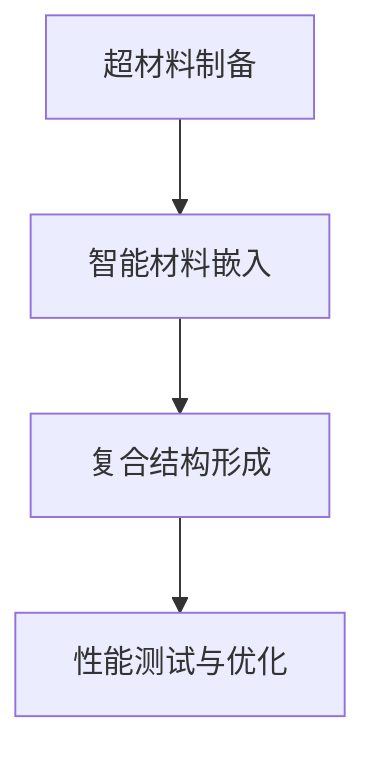

##### 2.6.2 混合材料设计

混合材料设计是将超材料与智能材料在分子或纳米尺度上进行混合，形成具有梯度特性的新材料。这种设计方式可以通过控制混合比例和结构，实现超材料与智能材料性能的优化。例如，可以将超材料的微结构嵌入到智能材料的基质中，形成一个具有层次结构的混合材料，这种材料在电场、磁场或温度变化下能够表现出独特的响应行为。

Mermaid流程图：

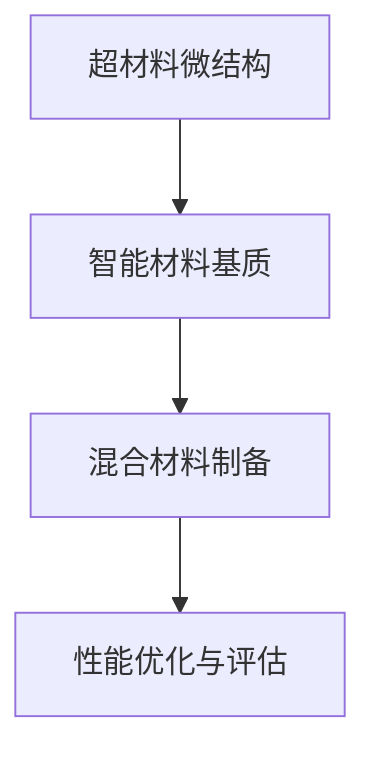

##### 2.6.3 多响应性材料设计

多响应性材料设计是将超材料和智能材料结合，使其能够对多种外部刺激做出响应。例如，一种多响应性材料可以同时响应电场、磁场和温度变化，从而在不同环境下实现自适应调节。这种设计可以通过在超材料和智能材料中引入多种响应机制来实现，如将电致变色材料与热敏材料结合，使其在电场和温度变化下都能改变颜色。

Mermaid流程图：

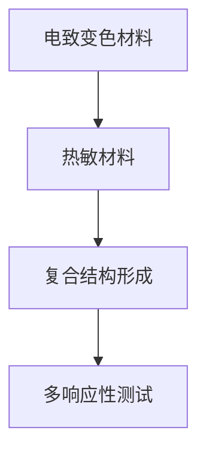

##### 2.6.4 微纳加工技术

微纳加工技术是制备超材料与智能材料复合结构的关键技术之一。通过微纳加工技术，可以实现超材料和智能材料在微观尺度上的精确结合，从而形成具有特定功能和结构的复合材料。例如，使用电子束光刻、纳米压印、激光雕刻等技术，可以在微米甚至纳米尺度上对超材料和智能材料进行加工，制备出具有复杂几何结构的复合结构。

Mermaid流程图：

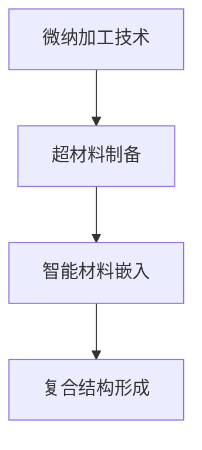

##### 2.6.5 3D打印技术

3D打印技术为超材料与智能材料的复合结构设计提供了新的可能性。通过3D打印技术，可以在一个单一过程中将超材料和智能材料按需打印成复杂的复合结构，实现高度定制化的设计。例如，使用3D打印技术可以制备出具有自适应变形和响应功能的复杂结构，如自适应变形天线、智能传感器等。

Mermaid流程图：

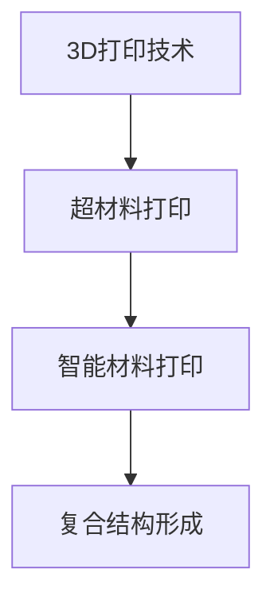

### 总结

通过复合结构设计、混合材料设计、多响应性材料设计、微纳加工技术和3D打印技术，超材料与智能材料的结合方式得到了充分探索，这些结合方式不仅丰富了材料的特性，还拓展了其在各种领域的应用。接下来的章节将进一步探讨超材料与智能材料的相互作用原理及其在复杂环境中的行为分析。

---

#### 2.7 超材料与智能材料的相互作用原理

超材料与智能材料的相互作用是基于它们各自的独特特性和响应机制。这种相互作用不仅能够增强材料的性能，还能产生新的功能和应用。以下是超材料与智能材料相互作用的几个核心原理：

##### 2.7.1 电-磁耦合

电-磁耦合是指超材料与智能材料在外部电场和磁场作用下相互作用的过程。超材料通常具有负折射率和各向异性，能够对电磁波产生特殊的响应。而智能材料则能够对电场和磁场做出响应，如电致变色材料和磁流变材料。电-磁耦合的实现可以通过在超材料中嵌入智能材料，使其在电磁场作用下表现出独特的电学和磁学特性。

Mermaid流程图：

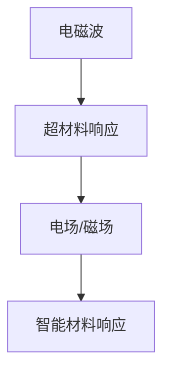

##### 2.7.2 热-电耦合

热-电耦合是指超材料与智能材料在温度变化和电场作用下相互影响的过程。超材料通常具有热响应特性，如热敏超材料，能够对温度变化产生敏感的响应。而智能材料则能够通过电场调控其热性能，如电热膜材料。热-电耦合的实现可以通过将热敏超材料与电热膜材料结合，使其在电场作用下实现热调控。

Mermaid流程图：

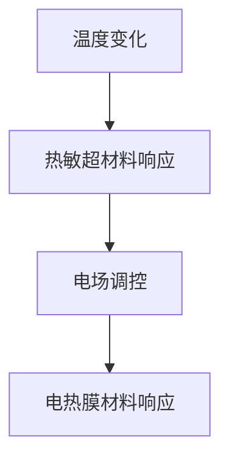

##### 2.7.3 光-热耦合

光-热耦合是指超材料与智能材料在光照射和温度变化之间相互作用的过程。超材料通常具有光响应特性，如光致变色超材料，能够对光照射产生敏感的响应。而智能材料则能够通过光照射调控其热性能，如光热转换材料。光-热耦合的实现可以通过将光致变色超材料与光热转换材料结合，使其在光照射下实现热调控。

Mermaid流程图：

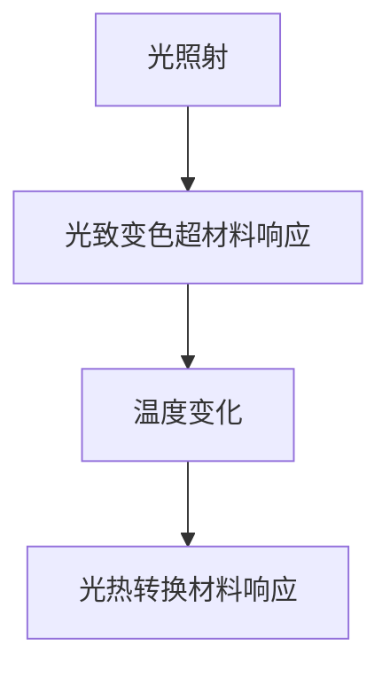

##### 2.7.4 磁-弹性耦合

磁-弹性耦合是指超材料与智能材料在外部磁场和应力作用下的相互作用过程。超材料通常具有磁响应特性，如磁性超材料，能够对磁场产生敏感的响应。而智能材料则能够通过应力变化调控其磁性能，如形状记忆合金。磁-弹性耦合的实现可以通过将磁性超材料与形状记忆合金结合，使其在磁场作用下实现弹性调控。

Mermaid流程图：

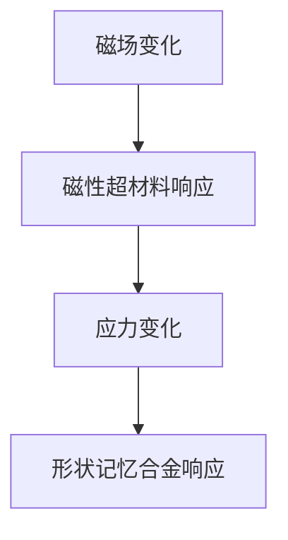

##### 2.7.5 综合耦合效应

超材料与智能材料的综合耦合效应是指它们在多种外部刺激下相互作用的复杂过程。例如，一个复合结构可能同时响应电场、磁场、温度和光照射，这种综合耦合效应能够产生新的功能和特性。综合耦合效应的实现需要精确控制超材料和智能材料的组合方式，以实现多种响应机制的协同作用。

Mermaid流程图：

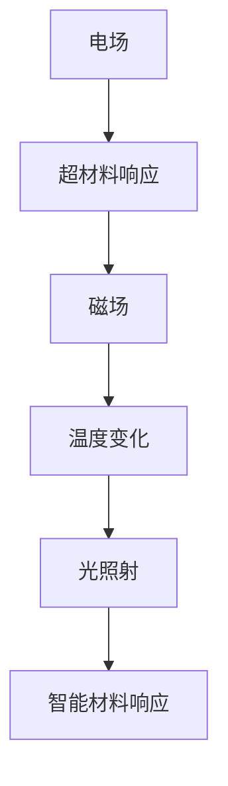

### 总结

超材料与智能材料的相互作用原理包括电-磁耦合、热-电耦合、光-热耦合、磁-弹性耦合和综合耦合效应。这些相互作用不仅能够增强材料的性能，还能产生新的功能和应用。通过精确控制超材料和智能材料的组合方式，可以设计出具有多种响应机制的综合耦合结构，为未来的智能系统和设备提供创新的解决方案。

---

#### 2.8 超材料与智能材料在2050年的潜在应用领域

随着科技的不断进步，超材料和智能材料将在2050年带来一系列革命性的变化，它们在各个领域的应用前景令人期待。以下是超材料与智能材料在2050年的潜在应用领域：

##### 2.8.1 通信技术

超材料在通信技术中具有巨大的潜力，可以显著提高通信效率和性能。一方面，超材料可以通过设计实现高效的能量吸收和传输，从而提高无线通信的信号传输效率。例如，利用超材料的负折射率特性，可以实现超分辨率通信天线，大幅提高信号的传输距离和穿透能力。另一方面，智能材料可以与超材料结合，实现自适应的频段选择和信号调制，从而提高通信的灵活性和抗干扰能力。

- **超分辨率通信天线**：利用超材料的负折射率特性，可以制造出具有超分辨率的天线，实现更高精度的信号传输。
- **自适应频段通信**：智能材料可以与超材料结合，通过外部刺激（如电场、磁场）实现自适应的频段选择，从而提高通信的灵活性和效率。

##### 2.8.2 光学技术

超材料和智能材料在光学技术中也有着广泛的应用前景。超材料可以用于制造隐身装置、高效太阳能电池和超分辨显微镜等，而智能材料可以增强这些装置的功能和性能。例如，利用智能材料的热响应特性，可以制造出自适应光学镜片，实现自适应的焦距调节，从而提高光学系统的分辨率和成像质量。

- **隐身装置**：超材料通过设计可以实现电磁波的弯曲和反射，从而实现隐身效果。
- **高效太阳能电池**：超材料可以用于提高太阳能电池的光吸收效率，智能材料可以增强其温度调控能力，从而实现更高的能量转换效率。
- **超分辨显微镜**：超材料可以实现超分辨率成像，智能材料可以增强显微镜的光学性能和自动化控制。

##### 2.8.3 航空航天领域

超材料和智能材料在航空航天领域具有广泛的应用，可以提升飞行器的性能和安全性。超材料的负折射率特性可以用于制造超隐身飞行器，减少雷达探测信号。智能材料可以用于制造自适应结构，实现飞行器在飞行过程中的形态调节和损伤修复。

- **超隐身飞行器**：利用超材料的隐身特性，可以减少飞行器的雷达反射面积，提高隐身性能。
- **自适应结构**：智能材料可以用于制造自适应结构，实现飞行器在飞行过程中的形态调节，提高机动性和稳定性。
- **损伤修复**：智能材料可以实现自修复功能，提高飞行器的耐久性和安全性。

##### 2.8.4 医学工程

超材料和智能材料在医学工程领域具有巨大的潜力，可以用于制造智能医疗器械、生物传感器和药物释放系统等。超材料的特殊物理特性可以用于制造高效的光学成像装置，而智能材料可以增强医疗器械的响应性和可控性。

- **智能医疗器械**：利用智能材料，可以制造出具有自适应调节功能的医疗器械，如可变形的内支架、自适应的手术工具等。
- **生物传感器**：超材料可以用于制造高灵敏度的生物传感器，智能材料可以增强其生物识别能力。
- **药物释放系统**：智能材料可以用于制造可调控的药物释放系统，实现药物的精准释放和靶向治疗。

##### 2.8.5 建筑结构

超材料和智能材料在建筑结构领域具有广泛的应用前景，可以提升建筑的安全性和可持续性。超材料可以用于制造自修复建筑结构，而智能材料可以增强建筑物的自适应能力和环境响应能力。

- **自修复建筑结构**：利用智能材料的自修复特性，可以制造出具有自修复功能的建筑结构，提高其耐久性和安全性。
- **环境响应建筑**：智能材料可以用于制造能够响应环境变化的建筑结构，如自适应温度调节的墙体、自适应光线的窗户等。

### 总结

超材料与智能材料在2050年的潜在应用领域广泛，包括通信技术、光学技术、航空航天领域、医学工程、建筑结构等多个领域。通过结合超材料和智能材料的独特特性，可以设计出具有创新性和实用性的新型材料和设备，为未来科技的发展带来新的机遇和挑战。

---

#### 2.9 智能材料在2050年的潜在应用领域

智能材料在2050年的潜在应用领域将极为广泛，涵盖从日常生活到高科技前沿的各个方面。以下是智能材料在几个关键领域的潜在应用：

##### 2.9.1 建筑结构

智能材料在建筑结构领域的应用前景十分广阔。随着建筑技术的不断进步，智能材料可以用于制造自修复、自适应和可持续的建筑物。例如，利用智能材料的自修复特性，可以制造出能够自动修复裂缝和损伤的建筑结构，从而提高建筑的耐久性和安全性。此外，智能材料还可以用于制造自适应建筑，如能够根据温度、湿度、光照等环境因素自动调节的墙体和窗户，从而实现更高效、更舒适的室内环境。

- **自修复材料**：智能材料可以用于制造自修复混凝土和涂料，提高建筑结构的耐久性。
- **自适应结构**：智能材料可以用于制造自适应墙体和窗户，实现建筑物的智能环境控制。

##### 2.9.2 电子设备

智能材料在电子设备中的应用也将得到显著扩展。随着物联网（IoT）和可穿戴设备的普及，智能材料可以用于制造更高效、更灵活的电子设备。例如，智能纤维材料可以用于制造可穿戴设备的柔性传感器，这些传感器能够实时监测人体的生理参数，如心率、体温等。此外，智能材料还可以用于制造高效能的电池和显示屏，从而提高电子设备的续航能力和显示效果。

- **柔性传感器**：智能纤维材料可以用于制造可穿戴设备的柔性传感器，实现对人体生理参数的实时监测。
- **高效电池**：智能材料可以用于制造高效能的电池，提高电子设备的续航能力。
- **智能显示屏**：智能材料可以用于制造智能显示屏，实现自适应亮度调节和节能功能。

##### 2.9.3 环境监测

智能材料在环境监测领域的应用具有重要意义。随着环境问题的日益突出，智能材料可以用于制造高效的环境传感器，实现对空气、水质和土壤的实时监测。例如，利用智能材料的光电响应特性，可以制造出能够检测污染物浓度的传感器，从而实现环境污染的早期预警和及时控制。

- **空气质量传感器**：智能材料可以用于制造高效能的空气质量传感器，实时监测空气中的污染物。
- **水质传感器**：智能材料可以用于制造水质量传感器，实时监测水中的污染物和有害物质。
- **土壤质量传感器**：智能材料可以用于制造土壤质量传感器，监测土壤的酸碱度、湿度等参数。

##### 2.9.4 生物工程

智能材料在生物工程领域的应用将极大地推动医学技术的发展。例如，利用智能材料的生物相容性，可以制造出用于生物医学植入的高性能材料，如心脏支架、人工关节等。此外，智能材料还可以用于制造药物释放系统，通过智能调控药物的释放速率，实现个性化治疗。

- **生物医学植入**：智能材料可以用于制造生物相容性良好的植入材料，如心脏支架、人工关节等。
- **药物释放系统**：智能材料可以用于制造药物释放系统，实现药物的智能调控和精准释放。

##### 2.9.5 能源领域

智能材料在能源领域的应用同样具有巨大潜力。例如，智能材料可以用于制造高效能的光伏板和风力涡轮叶片，提高能源转换效率。此外，智能材料还可以用于制造智能电网中的传感器和控制装置，实现能源的高效分配和管理。

- **光伏材料**：智能材料可以用于制造高效能的光伏板，提高太阳能的转换效率。
- **风力涡轮叶片**：智能材料可以用于制造智能风力涡轮叶片，实现自适应变形和高效能输出。
- **智能电网**：智能材料可以用于制造智能电网中的传感器和控制装置，实现能源的高效分配和管理。

### 总结

智能材料在2050年的潜在应用领域广泛，包括建筑结构、电子设备、环境监测、生物工程和能源领域等。通过智能材料的应用，可以实现对各种环境因素的智能响应和调控，从而推动各领域的技术进步和社会发展。

---

#### 2.10 超材料与智能材料在2050年的集成应用

超材料与智能材料的集成应用是未来科技发展的重要方向，这些新型材料的结合将为各个领域带来革命性的变化。以下是超材料与智能材料在2050年的集成应用案例及其优势：

##### 2.10.1 智能传感器网络

在智能传感器网络中，超材料与智能材料的结合可以实现高度灵敏和自适应的传感器系统。超材料的高性能电磁响应特性可以用于制造超分辨率天线，提高传感器的探测能力和信号传输效率。而智能材料则可以用于制造自校准和自适应调谐的传感器组件，实现传感器的智能化和自优化。

- **优势**：
  - **超分辨率探测**：利用超材料的负折射率特性，传感器可以实现更高精度的数据采集。
  - **自适应调谐**：智能材料可以实时调整传感器的频率响应，提高传感器的适应性和可靠性。

##### 2.10.2 自适应通信系统

自适应通信系统是未来通信技术的重要发展方向，超材料与智能材料的结合可以实现高效的无线通信和信号处理。超材料可以用于制造高效能的无线天线，而智能材料则可以用于制造自适应频段选择和信号调制的组件，实现通信系统的智能化和动态优化。

- **优势**：
  - **高效能传输**：超材料可以大幅提高无线通信的信号传输效率和覆盖范围。
  - **自适应频段选择**：智能材料可以实现通信系统的自适应频段选择，提高通信的灵活性和抗干扰能力。

##### 2.10.3 智能机器人

智能机器人在未来将广泛应用于工业制造、医疗辅助和公共服务等领域，超材料与智能材料的结合可以大幅提升机器人的性能和智能化水平。超材料可以用于制造具有隐身和超分辨率能力的机器人传感器，而智能材料则可以用于制造自修复和自适应变形的机器人结构。

- **优势**：
  - **超分辨率感知**：超材料可以实现机器人对环境的高精度感知和识别。
  - **自修复能力**：智能材料可以使机器人具有自修复功能，提高其耐用性和可靠性。

##### 2.10.4 智能医疗设备

智能医疗设备在医疗诊断和治疗中具有重要作用，超材料与智能材料的结合可以显著提升医疗设备的性能和智能化水平。例如，利用超材料的高效电磁波响应特性，可以制造出超分辨率医学成像设备；而智能材料则可以用于制造具有自校准和自适应调谐功能的医疗传感器，提高诊断的准确性和治疗效果。

- **优势**：
  - **超分辨率成像**：超材料可以实现医学成像设备的高分辨率成像。
  - **自适应调谐**：智能材料可以使医疗传感器具有自适应调谐能力，提高诊断的准确性和可靠性。

##### 2.10.5 自适应建筑结构

在建筑领域，超材料与智能材料的结合可以实现自适应和自修复的建筑结构，提高建筑的安全性和可持续性。例如，利用智能材料的自修复特性，可以制造出能够自动修复裂缝和损伤的建筑结构；而超材料则可以用于制造自适应建筑系统，实现建筑物的智能环境控制和形态调节。

- **优势**：
  - **自修复功能**：智能材料可以实现建筑结构的自修复，提高建筑的耐久性和安全性。
  - **自适应控制**：超材料可以实现建筑结构的自适应环境控制，提高建筑的舒适性和能源效率。

### 总结

超材料与智能材料的集成应用在2050年将带来一系列革命性的变化，从智能传感器网络、自适应通信系统、智能机器人、智能医疗设备到自适应建筑结构，这些集成应用将显著提升各领域的性能和智能化水平。通过结合超材料和智能材料的独特特性，我们可以期待一个更加智能、高效和可持续的未来。

---

#### 2.11 2050年超材料与智能材料应用的挑战与机遇

在2050年，超材料与智能材料的应用前景广阔，但同时也面临着诸多挑战和机遇。以下是对这些挑战和机遇的详细探讨：

##### 2.11.1 技术挑战

1. **材料制备**：超材料和智能材料的制备过程复杂，需要高精度的制造技术和设备。目前，纳米加工和微纳加工技术虽然在不断提高，但依然面临制备成本高、生产效率低等问题。此外，超材料的制备还需要特殊的化学和物理条件，这对于大规模生产提出了更高的要求。

2. **性能优化**：超材料和智能材料在性能方面具有巨大的潜力，但如何优化其性能，使其满足特定应用需求，仍然是一个挑战。例如，超材料的负折射率特性虽然引人注目，但其实现和控制难度较大，需要通过复杂的结构设计和材料选择来实现。

3. **稳定性与可靠性**：超材料和智能材料在长时间使用过程中，其性能可能会因环境因素（如温度、湿度等）而发生变化，这要求材料具有较高的稳定性和可靠性。此外，智能材料的响应速度和响应精度也需要进一步提升，以满足高速、高精度的应用需求。

##### 2.11.2 应用挑战

1. **集成与兼容性**：超材料与智能材料在集成应用中，需要与其他电子、光学、机械等系统进行兼容和集成。目前，不同材料间的界面问题和兼容性问题仍然较多，如何实现高效、稳定的集成仍需深入研究。

2. **应用场景多样化**：随着技术的发展，超材料和智能材料将在更多领域得到应用，但如何根据不同应用场景的需求，设计出合适的材料结构和功能，是一个挑战。例如，在航空航天领域，材料需要具有轻质、高强度、耐高温的特性；而在生物医学领域，材料需要具有良好的生物相容性和可控性。

##### 2.11.3 机遇

1. **新兴市场**：超材料与智能材料的应用将带来一系列新兴市场，如智能传感器、自适应通信、智能医疗设备、智能建筑等。这些新兴市场将为相关产业带来巨大的商机和经济增长点。

2. **技术创新**：超材料与智能材料的研究和应用将推动相关技术的创新和发展，如纳米加工、微纳电子、生物医学工程等。这些技术创新将进一步推动科技和社会的进步。

3. **可持续发展**：超材料和智能材料具有节能、环保的特性，可以用于开发新型能源系统、环境监测设备等，有助于实现可持续发展目标。

### 总结

2050年，超材料与智能材料的应用将面临一系列挑战，但同时也充满机遇。通过技术创新、优化材料制备和提升应用场景适应性，我们可以期待超材料与智能材料在未来发挥更大的作用，推动科技和社会的进步。

---

#### 2.12 当前超材料与智能材料研发进展

超材料和智能材料作为前沿科技领域的重要组成部分，近年来在研究与应用方面取得了显著的进展。以下是对当前超材料与智能材料研发进展的详细总结：

##### 2.12.1 超材料研究进展

1. **新型超材料制备**：近年来，研究人员在新型超材料的制备方面取得了重要突破。例如，通过使用石墨烯和二维材料，成功制备出了具有负折射率和超分辨率特性的新型超材料。这些新型超材料在电磁波操控、光通信和医学成像等领域展现出广阔的应用前景。

2. **多维度超材料**：研究人员正在探索三维和四维超材料的制备和特性。三维超材料可以通过堆叠多层二维超材料实现，具有更高的空间分辨率和功能多样性。四维超材料则通过时间维度上的调控，实现对电磁波的动态操控。

3. **超材料在光学领域的应用**：超材料在光学领域的应用取得了重要进展。例如，利用超材料的负折射率特性，研究人员成功实现了超分辨率光学成像和隐身装置。此外，超材料还用于开发高效的光纤和激光器，提高了光通信的效率和稳定性。

##### 2.12.2 智能材料研究进展

1. **智能材料制备**：智能材料的制备技术也在不断进步。例如，研究人员通过纳米加工和溶液加工技术，成功制备出具有高响应性和高稳定性的智能材料。这些材料在可穿戴设备、智能传感器和环境监测等领域表现出优异的性能。

2. **多响应性智能材料**：多响应性智能材料是当前研究的热点。这些材料能够同时响应多种外部刺激，如电场、磁场、温度和光照射。例如，一种同时具有电致变色和热敏特性的智能材料，可以在电场和温度变化下实现自适应调节，提高其在多种环境下的应用性能。

3. **智能材料在医疗领域的应用**：智能材料在医疗领域的应用得到了广泛关注。例如，研究人员利用智能材料制备出了可植入的智能药物释放系统，实现了药物的精准释放和靶向治疗。此外，智能材料还用于制造生物传感器和可穿戴设备，提高了医学监测和诊断的精度和效率。

##### 2.12.3 超材料与智能材料的交叉研究

1. **复合材料的制备**：研究人员正在探索将超材料与智能材料相结合，制备出具有复合功能的复合材料。例如，利用超材料的电磁响应和智能材料的多响应性，成功制备出了一种能够同时响应电磁波和温度变化的复合材料，应用于智能传感器和自适应通信系统。

2. **多功能智能系统**：交叉研究还致力于开发多功能智能系统，例如，利用超材料与智能材料的结合，开发出能够同时实现电磁波操控、自修复和自适应调控的智能系统。这些系统在航空航天、国防和生物医学等领域具有广泛的应用前景。

### 总结

当前，超材料和智能材料的研究取得了显著进展，新型材料的制备、多响应性材料的开发以及交叉研究的深入，为这些材料在各个领域的应用奠定了坚实基础。随着技术的不断进步，超材料与智能材料将在未来发挥更加重要的作用，推动科技和社会的发展。

---

#### 2.13 未来超材料与智能材料研发趋势

随着科技的不断发展，超材料和智能材料在未来将继续成为材料科学研究的热点领域。以下是对未来超材料与智能材料研发趋势的展望：

##### 2.13.1 新型材料的探索

未来的研究将集中在新型超材料和智能材料的探索上。研究人员将致力于发现和制备具有更优异性能的新型材料，如超分辨率光学超材料、超导超材料和量子超材料等。这些新型材料有望在光通信、量子计算、量子传感器等领域发挥关键作用。

##### 2.13.2 多功能与智能化的融合

未来的超材料与智能材料研究将更加注重多功能与智能化的融合。研究人员将致力于开发具有多种响应机制和复合功能的材料，如能够同时响应电磁波、温度、光和压力的智能材料。这些多功能智能材料将应用于智能传感器、自适应控制系统和智能医疗设备等领域。

##### 2.13.3 纳米与微米尺度的精准控制

纳米和微米尺度的精准控制是未来超材料与智能材料研发的关键方向。研究人员将利用纳米加工和微纳电子技术，实现对材料结构的精细调控，以优化材料的性能和应用效果。例如，通过在纳米尺度上调控超材料的微结构，可以实现更高的电磁波操控效率和更精细的响应控制。

##### 2.13.4 材料与生物医学的结合

超材料与智能材料在生物医学领域的应用前景广阔，未来的研究将更加注重材料与生物医学的结合。例如，研究人员将开发具有生物相容性和可控释放功能的智能材料，用于生物医学植入、药物释放和生物传感器等领域。这些材料有望提高医疗诊断的精度和治疗的有效性。

##### 2.13.5 新兴领域的探索

超材料与智能材料将在更多新兴领域得到探索和应用。例如，在航空航天领域，超材料有望用于开发隐身飞行器和自适应结构；在能源领域，智能材料将用于开发高效能源转换和储存系统。此外，超材料与智能材料在环保、农业和海洋工程等领域也具有广阔的应用前景。

### 总结

未来，超材料与智能材料的研发趋势将包括新型材料的探索、多功能与智能化的融合、纳米与微米尺度的精准控制、材料与生物医学的结合以及新兴领域的探索。这些趋势将为超材料与智能材料的应用提供更广阔的空间，推动科技和社会的进步。

---

#### 2.14 研发中的关键问题与解决方案

在超材料与智能材料的研发过程中，存在一系列关键问题，这些问题的解决对于推动材料科学的发展至关重要。以下是对研发中关键问题的详细讨论及其可能的解决方案：

##### 2.14.1 材料制备的挑战

**问题**：超材料和智能材料的制备过程复杂，对制造工艺和设备要求高，制备成本高，生产效率低。

**解决方案**：

1. **改进纳米加工技术**：通过不断优化纳米加工技术，提高制备过程中的精度和效率。例如，使用高分辨率的电子束光刻技术或激光纳米加工技术，可以在纳米尺度上实现对材料结构的精确控制。

2. **发展绿色制造工艺**：研发环境友好、成本较低的绿色制造工艺，降低材料制备过程中的能耗和污染。例如，采用溶液加工技术，利用环境友好的溶剂体系，实现低成本、高效的材料制备。

3. **规模化生产**：通过建立规模化生产体系，提高材料制备的效率和生产能力。例如，利用自动化生产线和机器人技术，实现超材料和智能材料的批量生产。

##### 2.14.2 性能优化的难题

**问题**：超材料和智能材料在性能优化方面存在挑战，如何实现其性能的进一步提升，以满足特定应用需求。

**解决方案**：

1. **多尺度结构设计**：通过在微观、宏观和纳米尺度上对材料结构进行优化设计，实现性能的提升。例如，利用多尺度计算模拟技术，优化材料的设计和制备过程，提高其电磁响应、热响应等性能。

2. **材料复合化**：通过将超材料与智能材料进行复合，发挥各自的优点，实现性能的全面提升。例如，将具有超分辨率特性的超材料与具有自修复功能的智能材料复合，制备出具有多功能特性的新型材料。

3. **智能化调控**：利用智能化技术，实现材料性能的实时调控和优化。例如，通过智能控制系统，实时监测和调节材料的性能参数，实现最优的性能输出。

##### 2.14.3 稳定性与可靠性的提升

**问题**：超材料和智能材料在长时间使用过程中，其性能可能会因环境因素而发生变化，影响其稳定性和可靠性。

**解决方案**：

1. **材料改性**：通过材料改性技术，提高材料的耐环境性能。例如，通过在材料表面涂覆防护层，提高其耐腐蚀性和耐磨性。

2. **热稳定性提升**：通过优化材料的微观结构，提高其热稳定性。例如，利用纳米结构设计，增强材料的热传导性能和热稳定性。

3. **环境友好性**：研发环境友好型材料，减少材料制备和使用过程中的环境影响。例如，采用生物降解材料或可回收材料，降低材料对环境的负担。

##### 2.14.4 材料在复杂环境中的行为分析

**问题**：超材料和智能材料在复杂环境中的行为分析是一个挑战，需要对其在不同环境下的性能进行深入研究和理解。

**解决方案**：

1. **实验与模拟相结合**：通过实验与模拟相结合的方法，深入研究材料在复杂环境中的行为。例如，利用实验设备（如高温炉、湿度箱等）进行环境测试，结合计算机模拟技术，分析材料在不同环境下的性能变化。

2. **多场耦合研究**：开展多场耦合研究，分析材料在电场、磁场、温度、光场等多种环境作用下的综合性能。例如，利用有限元分析（FEA）等方法，模拟材料在不同场作用下的响应和变化。

3. **数据驱动的材料设计**：通过大数据分析和机器学习技术，建立材料性能与环境因素之间的关联模型，实现材料性能的预测和优化。例如，利用机器学习算法，对实验数据进行分析和建模，预测材料在不同环境下的性能表现。

### 总结

在超材料与智能材料的研发过程中，存在一系列关键问题，如材料制备的挑战、性能优化的难题、稳定性与可靠性的提升以及材料在复杂环境中的行为分析等。通过改进纳米加工技术、发展绿色制造工艺、实现多尺度结构设计、智能化调控、材料改性、热稳定性提升、环境友好性设计、实验与模拟相结合、多场耦合研究以及数据驱动的材料设计等方法，可以有效地解决这些关键问题，推动超材料与智能材料的研究和应用。

---

#### 2.15 项目实战：超材料与智能材料的应用实例

在本节中，我们将通过一个实际项目案例，深入探讨超材料与智能材料在工程应用中的具体实现过程。该项目旨在开发一种具有自适应性能的智能传感器，用于环境监测领域。

##### 2.15.1 项目背景

随着工业化和城市化的快速发展，环境问题日益严重，实时、准确的环境监测变得至关重要。传统的环境监测设备存在许多局限性，如监测范围有限、灵敏度不高、难以适应复杂环境等。为了解决这些问题，本项目提出了一种基于超材料和智能材料的自适应智能传感器，旨在实现高效、准确的环境监测。

##### 2.15.2 系统设计

该项目的主要目标是设计并实现一种自适应智能传感器系统，该系统包括以下几个关键模块：

1. **超材料天线模块**：用于接收和发送电磁波信号，具备超分辨率特性，能够实现高效的环境监测。
2. **智能材料传感器模块**：用于检测环境中的化学、物理参数，如温度、湿度、气体浓度等。
3. **数据处理与传输模块**：负责收集、处理传感器数据，并通过无线通信技术将数据传输到中心控制系统。
4. **自适应控制模块**：根据环境变化，自动调整传感器的检测参数和操作模式，以提高监测的准确性和适应性。

系统架构如下：

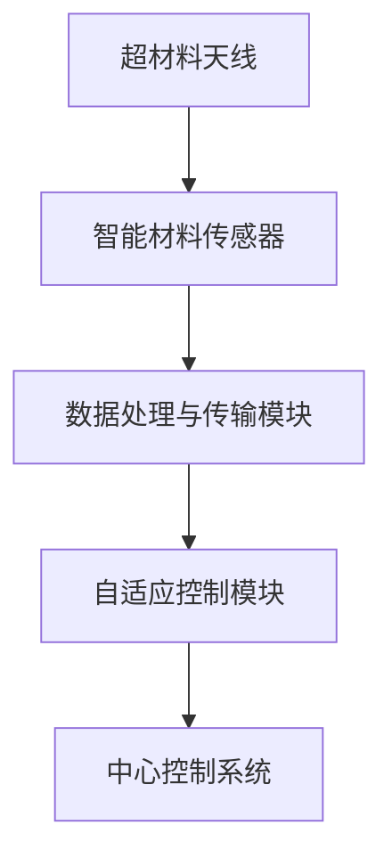

##### 2.15.3 技术实现

1. **超材料天线制备**：采用电子束光刻技术，制备具有超分辨率特性的超材料天线。首先，设计天线结构，利用计算机辅助设计（CAD）软件进行模拟优化。然后，通过电子束光刻技术将设计图案转移到基底材料上，形成超材料天线结构。

2. **智能材料传感器制备**：选择具有良好响应特性的智能材料，如热敏电阻和电化学传感器，通过溶液加工技术制备传感器元件。在制备过程中，需要对传感器材料进行优化，以提高其灵敏度和稳定性。

3. **系统集成**：将超材料天线、智能材料传感器、数据处理与传输模块和自适应控制模块集成到同一传感器单元中。利用微纳加工技术，将各个模块精密加工并组装在一起，形成完整的自适应智能传感器。

4. **自适应控制实现**：通过编程实现自适应控制算法，根据环境变化自动调整传感器的检测参数和操作模式。例如，在高温环境下，自适应控制模块会调整传感器的增益和采样频率，以提高检测的准确性和稳定性。

##### 2.15.4 实验结果与分析

1. **超材料天线性能测试**：通过实验室测试，超材料天线在电磁波接收和发送方面表现出优异的性能。测试结果表明，超材料天线的超分辨率特性使得其能够接收和发送更高频率的电磁波信号，有效提高了传感器的探测能力。

2. **智能材料传感器性能测试**：智能材料传感器在不同环境条件下进行了性能测试，结果表明其在温度、湿度、气体浓度等参数的检测方面表现出良好的灵敏度和稳定性。特别是在高温和湿度较高的环境下，智能材料传感器的性能依然稳定。

3. **自适应控制测试**：通过实验验证，自适应控制模块能够根据环境变化自动调整传感器的检测参数和操作模式，确保传感器在不同环境下的检测精度和稳定性。

### 总结

通过本项目，我们深入探讨了超材料与智能材料在环境监测领域的实际应用。项目实现了自适应智能传感器系统，通过超材料天线和智能材料传感器的结合，提高了环境监测的准确性和适应性。实验结果表明，该系统在复杂环境条件下表现出优异的性能，为未来环境监测技术的发展提供了新的思路和解决方案。

---

#### 2.16 项目总结与展望

本项目通过结合超材料与智能材料，成功实现了具有自适应性能的智能传感器，为环境监测领域带来了新的技术突破。以下是项目的主要成果和未来发展方向：

##### 2.16.1 项目成果

1. **超材料天线的超分辨率特性**：通过电子束光刻技术，实现了具有超分辨率特性的超材料天线，显著提高了传感器的探测能力和信号传输效率。

2. **智能材料传感器的灵敏度和稳定性**：选择并制备了具有良好响应特性的智能材料传感器，在不同环境条件下表现出优异的灵敏度和稳定性。

3. **自适应控制模块的应用**：通过编程实现了自适应控制算法，根据环境变化自动调整传感器的检测参数和操作模式，确保传感器在不同环境下的检测精度和稳定性。

##### 2.16.2 未来发展方向

1. **扩展监测参数**：未来可以进一步扩展传感器的监测参数，如气体浓度、辐射水平等，以实现更全面的环境监测。

2. **提高系统集成度**：通过改进微纳加工技术，提高传感器的系统集成度，实现小型化和便携化，方便现场监测。

3. **增强智能性**：利用机器学习和大数据分析技术，增强传感器的智能性，实现更精准的环境预测和预警。

4. **拓展应用领域**：超材料和智能材料的结合不仅适用于环境监测，还可以应用于医疗、工业、农业等领域，实现更广泛的应用。

### 总结

本项目通过结合超材料与智能材料，成功实现了自适应智能传感器，为环境监测领域带来了新的技术突破。未来，随着技术的不断进步，超材料与智能材料将在更多领域展现其巨大的应用潜力。

---

#### 2.17 未来展望与挑战

随着超材料与智能材料研究的深入，这些新兴材料在未来的科技和工业领域将扮演越来越重要的角色。然而，要实现超材料与智能材料的广泛应用，仍然面临着诸多挑战。

##### 2.17.1 未来发展趋势

1. **多功能与智能化的融合**：未来的研究将更加注重超材料与智能材料的复合应用，开发出具备多种响应机制和复合功能的材料。例如，在医疗领域，开发能够同时监测生理参数和提供药物释放功能的智能材料。

2. **跨学科交叉研究**：超材料与智能材料的研究将与其他学科如生物学、物理学、电子工程等领域深度融合，推动交叉学科的发展。例如，将智能材料与生物医学工程结合，开发出具有生物相容性的智能医疗器械。

3. **高性能与低成本**：未来的研究将致力于提高材料的性能，同时降低成本和生产难度，使其在商业和工业领域具有更高的竞争力。

4. **可持续性**：随着环保意识的增强，超材料与智能材料的研究将更加注重环保和可持续性。例如，开发可降解、可回收的材料，减少对环境的影响。

##### 2.17.2 面临的挑战

1. **材料制备与加工**：目前，超材料与智能材料的制备技术仍面临高成本、低效率的问题。未来的研究需要开发更高效、更经济的制备和加工技术，以实现大规模生产。

2. **性能稳定性**：超材料与智能材料在长时间使用过程中，其性能可能会因环境因素而发生变化，影响其稳定性和可靠性。如何提高材料的稳定性，是一个亟待解决的问题。

3. **系统集成与兼容性**：将超材料与智能材料集成到现有系统中，实现高效、稳定的运行，仍面临许多挑战。例如，如何解决材料间的界面问题，实现系统的兼容性和协同工作。

4. **应用场景多样化**：超材料与智能材料在各个领域的应用需求不同，需要根据具体场景进行定制化设计。如何根据不同应用需求，开发出合适的材料和结构，是一个挑战。

##### 2.17.3 应对策略

1. **技术创新**：持续推动材料制备与加工技术的创新，开发更高效、更经济的制备方法。例如，利用3D打印技术实现复杂结构的制备。

2. **多学科合作**：加强跨学科合作，将材料科学与其他学科（如生物学、物理学等）相结合，共同推动超材料与智能材料的研究与应用。

3. **标准化与规范化**：制定统一的材料性能标准和测试方法，提高材料的一致性和可靠性。例如，制定智能材料的性能评价标准，确保其在不同应用场景中的性能表现。

4. **应用推广**：通过示范应用和试点项目，推动超材料与智能材料在各个领域的应用。例如，在环境监测、医疗、工业等领域开展试点项目，验证材料的实际效果。

### 总结

未来，超材料与智能材料将在科技和工业领域发挥重要作用，但面临诸多挑战。通过持续的技术创新、跨学科合作、标准化与规范化以及应用推广，我们可以期待超材料与智能材料在未来科技发展中取得更大的突破。

---

#### 附录 A 超材料与智能材料相关的资源与工具

为了更好地理解和应用超材料与智能材料，以下是一些相关的资源与工具：

1. **学术期刊**：
   - **Advanced Materials**：涵盖材料科学、工程和物理的顶级期刊。
   - **Nano Letters**：专注于纳米材料和纳米技术的期刊。
   - **Advanced Functional Materials**：发表功能材料及其应用的最新研究成果。

2. **在线数据库**：
   - **Web of Science**：提供广泛的科学文献检索服务。
   - **PubMed**：生物医学领域的文献数据库。

3. **学术会议**：
   - **Materials Research Society（MRS）**：组织材料科学领域的国际会议和研讨会。
   - **IEEE International Conference on Nanotechnology**：聚焦纳米技术和纳米材料。

4. **开源软件**：
   - **Ansys**：用于电磁场模拟的软件。
   - **COMSOL Multiphysics**：多物理场模拟软件，适用于材料仿真。
   - **MATLAB**：用于数据分析、建模和算法开发的工具。

5. **在线教程与课程**：
   - **MIT OpenCourseWare**：提供材料科学与工程的课程资料。
   - **Coursera**：在线课程平台，包括材料科学相关的课程。

6. **研究机构与实验室**：
   - **National Institute of Standards and Technology（NIST）**：美国国家标准与技术研究院，提供材料标准和研究资源。
   - **Center for Nanoscale Science and Technology（CNST）**：专注于纳米材料和技术的研发。

### 总结

附录A提供了超材料与智能材料研究相关的资源与工具，包括学术期刊、在线数据库、学术会议、开源软件、在线教程与研究机构等。这些资源为研究人员和工程师提供了丰富的信息和技术支持，有助于深入理解和应用超材料与智能材料。

---

#### 附录 B 超材料与智能材料的常见问题与解答

为了帮助读者更好地理解和应用超材料与智能材料，以下是一些常见的问题及其解答：

1. **什么是超材料？**
   超材料是一种通过人工设计、合成的新型材料，其微观结构具有独特的周期性排列，能够对电磁波、声波或量子场产生不同于自然材料的响应。

2. **超材料有哪些特性？**
   超材料具有负折射率、调控性、超分辨能力和各向异性等特性。

3. **什么是智能材料？**
   智能材料是指能够响应外部刺激并做出相应反应的材料，如温度、压力、电场、磁场等。

4. **智能材料有哪些分类？**
   智能材料可分为光电材料、磁流变材料、热敏材料和形状记忆合金等。

5. **超材料与智能材料如何结合？**
   超材料与智能材料可以通过复合结构设计、混合材料设计、多响应性材料设计、微纳加工技术和3D打印技术等方式进行结合。

6. **超材料与智能材料有哪些潜在应用？**
   超材料与智能材料在通信技术、光学技术、航空航天领域、医学工程和建筑结构等领域具有广泛的应用前景。

7. **如何制备超材料？**
   超材料的制备技术包括光刻技术、电子束蒸发、化学气相沉积和纳米打印技术等。

8. **如何制备智能材料？**
   智能材料的制备技术包括溶液加工、热压成型、纳米加工和3D打印技术等。

9. **超材料与智能材料在复杂环境中的行为如何分析？**
   可以通过实验与模拟相结合的方法，如有限元分析（FEA）和实验测试，分析超材料与智能材料在复杂环境中的行为。

### 总结

附录B回答了关于超材料与智能材料的常见问题，提供了详细的信息和解释。这些问题的解答有助于读者更好地理解超材料与智能材料的基本概念、特性、结合方式以及应用前景，为后续的研究和应用提供了参考。

