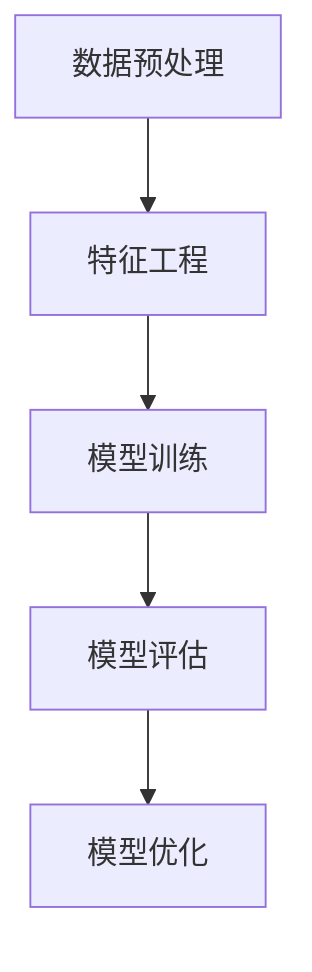

                 

## 文章标题

《机器学习在信用评分模型中的应用研究》

本文旨在深入探讨机器学习在信用评分模型中的应用，解析其在金融领域的价值与挑战。随着大数据和人工智能技术的快速发展，信用评分模型已经成为金融行业的重要组成部分。通过系统化研究，本文将详细介绍信用评分模型的核心概念、数学模型、算法原理及其在现实世界中的实际应用。

### 关键词

- 机器学习
- 信用评分模型
- 数据预处理
- 特征工程
- 模型优化
- 风险管理

### 摘要

本文首先介绍了信用评分模型的基本概念和发展历程，随后深入探讨了机器学习在信用评分模型中的应用。通过具体的数学模型和算法原理讲解，本文详细阐述了决策树、随机森林、支持向量机和神经网络等机器学习算法在信用评分模型中的实现和应用。最后，本文通过实际项目案例，展示了机器学习在信用评分模型中的实际应用效果，并分析了未来的发展趋势和研究方向。

## 引言与背景

信用评分模型在金融领域中起着至关重要的作用，它能够帮助金融机构对客户的信用风险进行评估，从而降低贷款违约率，提高业务效率。传统的信用评分模型主要依赖于统计学方法和逻辑回归等算法，然而随着大数据和人工智能技术的飞速发展，机器学习算法在信用评分模型中的应用逐渐成为研究的热点。

### 1.1 引言

本书旨在探讨机器学习在信用评分模型中的应用，通过对信用评分模型的核心概念、数学模型、算法原理和实际应用进行系统化研究，为金融行业从业人员、研究人员和学生学习信用评分模型提供一本全面、深入的参考资料。本文将依次介绍信用评分模型的发展历程、理论基础、机器学习算法在信用评分模型中的应用，以及未来发展趋势。

### 1.2 信用评分模型概述

信用评分模型是一种通过分析个人或企业的历史信用行为数据，预测其未来信用风险的概率模型。它通常包括数据预处理、特征工程、模型训练和模型评估等步骤。信用评分模型的目标是最大化模型的预测准确性，从而帮助金融机构更好地控制信用风险。

### 1.3 本书结构

本书共分为七个章节。第1章作为引言，介绍了机器学习在信用评分模型中的应用背景和本书的结构。第2章和第3章分别讲解了信用评分模型的核心概念、数学模型和算法原理。第4章和第5章探讨了机器学习算法在信用评分模型中的实际应用，包括数据预处理、特征工程、模型选择和优化。第6章通过实际项目案例，展示了机器学习在信用评分模型中的应用效果，并进行代码解读与分析。第7章对信用评分模型未来的发展趋势和研究方向进行了展望。

## 信用评分模型概述

信用评分模型是金融领域中的一种重要工具，它通过对客户的历史信用行为进行分析，预测客户未来可能出现的信用风险。信用评分模型的发展经历了多个阶段，从早期的传统方法到现代的机器学习方法，不断进化与优化。本节将详细介绍信用评分模型的发展历程、理论基础和应用前景。

### 2.1 信用评分模型的定义与作用

信用评分模型（Credit Scoring Model）是一种用于评估客户信用风险的量化工具，通过对客户的历史信用记录、财务状况、行为特征等多维度数据进行综合分析，生成一个信用评分，从而对客户的信用风险进行评估。信用评分模型通常被金融机构用于贷款审批、信用卡发放、信用额度调整等场景。

信用评分模型的主要作用如下：

1. **风险评估**：通过信用评分模型，金融机构可以量化客户的信用风险，从而在贷款审批过程中做出更准确的风险评估。
2. **决策支持**：信用评分模型为金融机构提供了一种客观、量化的决策支持工具，有助于优化贷款审批流程，提高业务效率。
3. **风险控制**：信用评分模型可以帮助金融机构识别高风险客户，从而采取相应的风险控制措施，降低贷款违约率。

### 2.2 信用评分模型的发展历程

信用评分模型的发展历程可以分为以下几个阶段：

1. **传统方法阶段**：早期信用评分模型主要采用统计方法和逻辑回归等传统方法，通过分析客户的历史数据，建立信用评分模型。
2. **机器学习方法阶段**：随着机器学习技术的快速发展，信用评分模型逐渐引入了诸如决策树、支持向量机、神经网络等机器学习算法，提高了模型的预测准确性。
3. **深度学习方法阶段**：近年来，深度学习技术的引入进一步提升了信用评分模型的性能，通过多层神经网络对数据进行深度学习，模型能够自动提取特征，实现更精准的风险评估。

### 2.3 信用评分模型的理论基础

信用评分模型的理论基础主要包括以下几个方面：

1. **概率论与统计学**：信用评分模型依赖于概率论和统计学原理，通过分析历史数据，建立客户信用评分与信用风险之间的关系。
2. **机器学习理论**：机器学习算法为信用评分模型提供了强大的数据处理和模型训练能力，通过自动学习数据特征，提高模型的预测准确性。
3. **风险管理理论**：信用评分模型是风险管理的重要组成部分，通过对客户信用风险的评估，帮助金融机构实施有效的风险管理策略。

### 2.4 信用评分模型的应用前景

随着大数据和人工智能技术的不断进步，信用评分模型的应用前景十分广阔：

1. **金融行业**：信用评分模型在银行、信用卡公司、保险公司等金融领域的应用越来越广泛，帮助金融机构提高风险控制能力，优化业务流程。
2. **非金融行业**：信用评分模型的应用不仅限于金融行业，还可以应用于租赁、电商、保险等非金融领域，为企业的风险管理提供支持。
3. **新兴领域**：随着区块链、物联网等新兴技术的发展，信用评分模型的应用场景将进一步拓展，为更多领域提供信用风险评估服务。

综上所述，信用评分模型在金融领域具有重要的作用，其发展历程和理论基础为信用评分模型的广泛应用提供了坚实的基础。随着机器学习和人工智能技术的不断发展，信用评分模型将不断进化，为金融机构和企业提供更精准的信用风险评估服务。

### 1.3 本书结构

为了帮助读者系统地理解机器学习在信用评分模型中的应用，本书结构如下：

- **第1章：引言与背景**：介绍机器学习在信用评分模型中的应用背景和本书的主要内容。
- **第2章：信用评分模型概述**：详细讲解信用评分模型的核心概念、发展历程和理论基础。
- **第3章：信用评分模型核心概念与联系**：探讨信用评分模型的数据集介绍、目标函数、架构以及机器学习算法的应用。
- **第4章：数学模型与算法原理**：介绍信用评分模型的数据预处理、特征工程和机器学习算法（决策树、随机森林、支持向量机、神经网络）的原理。
- **第5章：机器学习算法在信用评分模型中的应用**：分析数据预处理、特征工程、模型选择与优化以及模型评估。
- **第6章：信用评分模型项目实战**：通过实际项目案例展示机器学习在信用评分模型中的应用。
- **第7章：信用评分模型未来发展趋势**：展望信用评分模型的未来研究方向和新技术应用。

本书旨在为金融行业从业人员、研究人员和学生提供一本全面、深入的学习参考资料，帮助读者掌握信用评分模型的构建和应用方法。通过本书的学习，读者将能够深入了解信用评分模型的原理和实践，为实际工作中的信用风险评估提供有力支持。

### 第2章: 信用评分模型核心概念与联系

在深入探讨机器学习在信用评分模型中的应用之前，首先需要理解信用评分模型的核心概念及其相互之间的联系。本章将围绕以下几个关键点展开：数据集介绍、信用评分模型的目标函数、模型架构以及机器学习算法在信用评分模型中的应用。通过这些核心概念的详细阐述，读者将能够更好地理解信用评分模型的工作原理及其在金融领域的应用。

#### 2.1 数据集介绍

信用评分模型的数据集通常包含多个维度的数据，这些数据涵盖了客户的基本信息、历史信用记录、财务状况、行为特征等。数据集的质量直接影响信用评分模型的性能，因此数据预处理和清洗是信用评分模型构建的重要步骤。

一个典型的信用评分数据集可能包含以下几类数据：

- **基本信息**：包括客户的年龄、性别、收入、职业等。
- **历史信用记录**：包括客户的信用历史、贷款记录、逾期记录等。
- **财务状况**：包括客户的债务水平、信用额度、财务状况等。
- **行为特征**：包括客户的消费习惯、还款习惯、信用使用频率等。

在构建信用评分模型之前，需要对数据进行预处理，包括数据清洗、缺失值处理、数据标准化等步骤，以确保数据的质量和一致性。

#### 2.2 信用评分模型的目标函数

信用评分模型的目标是预测客户未来可能出现的信用风险，从而帮助金融机构做出更准确的信贷决策。目标函数是信用评分模型的核心，用于衡量模型的预测性能。常见的目标函数包括：

- **二分类问题**：对于二分类问题，常用的目标函数包括交叉熵损失函数（Cross-Entropy Loss）和均方误差损失函数（Mean Squared Error Loss）。交叉熵损失函数通常用于分类问题，其公式为：

  $$
  L(y, \hat{y}) = -\sum_{i=1}^{n} y_i \log \hat{y}_i
  $$

  其中，$y$ 是实际标签，$\hat{y}$ 是模型预测的概率。

- **多分类问题**：对于多分类问题，可以使用softmax回归来处理，其损失函数是交叉熵损失函数的扩展。

  $$
  L(y, \hat{y}) = -\sum_{i=1}^{n} y_i \log \hat{y}_i
  $$

  其中，$y$ 是实际标签，$\hat{y}$ 是模型预测的概率分布。

- **回归问题**：对于回归问题，常用的目标函数是均方误差（Mean Squared Error, MSE），其公式为：

  $$
  L(y, \hat{y}) = \frac{1}{2} \sum_{i=1}^{n} (y_i - \hat{y}_i)^2
  $$

  其中，$y$ 是实际值，$\hat{y}$ 是模型预测的值。

目标函数的选择直接影响模型的优化方向和性能，因此需要根据具体问题选择合适的目标函数。

#### 2.3 信用评分模型的架构

信用评分模型通常包括以下几个关键组成部分：

1. **数据预处理**：数据预处理是信用评分模型构建的基础，包括数据清洗、缺失值处理、数据标准化等步骤。数据预处理的质量直接影响模型的性能。

2. **特征工程**：特征工程是信用评分模型构建的关键环节，通过选择和构造有效特征，可以提高模型的预测性能。常见的特征工程方法包括特征选择、特征变换和特征交叉。

3. **模型训练**：模型训练是信用评分模型构建的核心步骤，通过训练过程，模型可以从历史数据中学习并提取出有用的信息。常见的机器学习算法包括决策树、随机森林、支持向量机、神经网络等。

4. **模型评估**：模型评估是信用评分模型的重要环节，通过评估模型的预测性能，可以判断模型是否适合实际应用。常见的评估指标包括准确率、召回率、F1分数等。

5. **模型优化**：模型优化是提高模型性能的重要手段，通过调整模型参数和优化算法，可以提高模型的预测准确性。常见的模型优化方法包括网格搜索、随机搜索、贝叶斯优化等。

信用评分模型的架构可以表示为以下流程：

```
数据预处理 → 特征工程 → 模型训练 → 模型评估 → 模型优化
```

#### 2.4 机器学习算法在信用评分模型中的应用

随着机器学习技术的发展，多种机器学习算法被引入到信用评分模型中，以提高模型的预测性能和准确性。以下将介绍几种常用的机器学习算法在信用评分模型中的应用。

1. **决策树**：决策树是一种简单且直观的机器学习算法，通过递归划分特征空间来构建树形结构。决策树的优点是易于理解和解释，缺点是容易过拟合。在信用评分模型中，决策树可以用于预测客户的信用风险，其核心思想是根据客户的特征值来划分不同节点，最终得到一个分类结果。

   决策树的伪代码如下：

   ```python
   def DecisionTree(data, labels, features):
       if all(labels == data[labels]):
           return labels.mode()[0]
       else:
           best_feature, best_split = ...
           left_data, left_labels = ...
           right_data, right_labels = ...
           left_tree = DecisionTree(left_data, left_labels, features)
           right_tree = DecisionTree(right_data, right_labels, features)
           return (best_feature, best_split, left_tree, right_tree)
   ```

2. **随机森林**：随机森林是一种基于决策树的集成学习方法，通过构建多棵决策树并对预测结果进行投票来提高预测性能。随机森林的优点是能够处理大量特征和样本，并且具有较好的泛化能力。

   随机森林的伪代码如下：

   ```python
   def RandomForest(data, labels, n_trees):
       trees = []
       for _ in range(n_trees):
           sample_data, sample_labels = ...
           tree = DecisionTree(sample_data, sample_labels, features)
           trees.append(tree)
       return trees
   ```

3. **支持向量机**：支持向量机是一种基于最大间隔分类的模型，通过求解最优超平面来划分特征空间。支持向量机的优点是能够处理高维数据和线性不可分问题，缺点是计算复杂度较高。

   支持向量机的数学原理如下：

   $$
   \text{maximize } \frac{1}{2} \sum_{i=1}^{n} w_i^2
   $$

   其中，$w$ 是权重向量，$n$ 是样本数量。

4. **神经网络**：神经网络是一种基于模拟人脑神经元连接结构的预测模型，通过多层神经元对输入数据进行处理和抽象。神经网络具有强大的非线性拟合能力，可以处理复杂的数据特征。

   神经网络的数学模型如下：

   $$
   \text{Output} = \text{sigmoid}(\text{Weight} \cdot \text{Input} + \text{Bias})
   $$

   其中，$\text{sigmoid}$ 是激活函数，$\text{Weight}$ 和 $\text{Bias}$ 分别是权重和偏置。

通过上述介绍，读者可以了解到信用评分模型的核心概念、目标函数、架构以及机器学习算法的应用。在接下来的章节中，本文将详细讲解信用评分模型的数学模型和算法原理，并通过实际项目案例展示机器学习在信用评分模型中的应用效果。

### 2.4 Mermaid 流程图

为了更直观地展示信用评分模型的流程，我们可以使用 Mermaid 语法绘制一个流程图。以下是一个简单的 Mermaid 流程图示例，展示了信用评分模型的基本步骤：



这段 Mermaid 代码将生成一个流程图，其中包含数据预处理、特征工程、模型训练、模型评估和模型优化五个关键步骤。具体解释如下：

- **A[数据预处理]**：数据预处理是信用评分模型的第一步，包括数据清洗、缺失值处理和数据标准化等操作，目的是确保数据质量。
- **B[特征工程]**：特征工程是模型构建的关键环节，通过选择和构造有效特征，可以提高模型的预测性能。
- **C[模型训练]**：模型训练是信用评分模型的核心步骤，通过训练过程，模型可以从历史数据中学习并提取出有用的信息。
- **D[模型评估]**：模型评估用于评估模型的预测性能，通过评估结果可以判断模型是否适合实际应用。
- **E[模型优化]**：模型优化是提高模型性能的重要手段，通过调整模型参数和优化算法，可以提高模型的预测准确性。

这个 Mermaid 流程图可以帮助读者更好地理解信用评分模型的构建过程，为进一步的学习和应用提供指导。

### 2.5 数据预处理

数据预处理是信用评分模型构建的重要步骤，其质量直接影响模型的性能和预测准确性。在应用机器学习算法之前，需要对数据进行清洗、缺失值处理和数据标准化等预处理操作。以下将详细讲解数据预处理的具体方法。

#### 2.5.1 数据清洗

数据清洗是数据预处理的第一步，目的是去除数据中的噪声和异常值，提高数据质量。常见的清洗方法包括：

1. **去除重复数据**：重复数据会导致模型训练过程中的过拟合，因此需要去除重复的数据记录。
2. **处理缺失值**：缺失值可以采用以下方法处理：
   - 删除缺失值：如果缺失值的数据量较少，可以选择删除这些数据。
   - 填充缺失值：可以使用平均值、中位数、众数等方法填充缺失值，或者使用更复杂的插值方法。
3. **异常值处理**：异常值可能对模型训练产生负面影响，可以通过统计方法（如箱线图）或基于规则的策略（如距离阈值）进行识别和处理。

#### 2.5.2 缺失值处理

缺失值处理是数据预处理的重要环节，常见的方法包括以下几种：

1. **删除缺失值**：如果数据集中缺失值的数据量较少，可以选择删除这些数据，以减少对模型训练的影响。
2. **填充缺失值**：对于缺失值较多的数据，可以使用以下方法进行填充：
   - **平均值填充**：用每个特征的平均值填充缺失值，适用于数值特征。
   - **中位数填充**：用每个特征的中位数填充缺失值，适用于数值特征。
   - **众数填充**：用每个特征的众数填充缺失值，适用于分类特征。
   - **插值法**：使用时间序列插值方法（如线性插值、多项式插值等）填充缺失值。
   - **K-最近邻法**：使用K-最近邻算法预测缺失值，适用于数值特征。

#### 2.5.3 数据标准化

数据标准化是将不同特征的数据转换到同一尺度，以便于模型训练和特征比较。常见的数据标准化方法包括：

1. **Z-Score标准化**：将每个特征的数据值减去均值后除以标准差，使其符合标准正态分布。公式如下：

   $$
   x_{\text{ standardized}} = \frac{x - \mu}{\sigma}
   $$

   其中，$x$ 是原始数据值，$\mu$ 是均值，$\sigma$ 是标准差。

2. **Min-Max标准化**：将每个特征的数据值缩放到[0, 1]范围内。公式如下：

   $$
   x_{\text{ standardized}} = \frac{x - \min(x)}{\max(x) - \min(x)}
   $$

   其中，$x$ 是原始数据值，$\min(x)$ 是数据的最小值，$\max(x)$ 是数据的最大值。

通过数据预处理，可以有效地提高信用评分模型的预测性能和稳定性。在接下来的章节中，我们将继续探讨特征工程和机器学习算法在信用评分模型中的应用。

### 3.1 数据预处理

在构建信用评分模型之前，数据预处理是至关重要的一步。数据预处理的质量直接影响到模型训练的效果和预测准确性。本节将详细介绍数据预处理的方法，包括数据清洗、缺失值处理和数据标准化。

#### 3.1.1 数据清洗

数据清洗是数据预处理的第一步，其目的是去除数据中的噪声和异常值，提高数据质量。以下是一些常见的数据清洗方法：

1. **去除重复数据**：在数据集中可能会存在重复的数据记录，这些重复的数据会影响模型的训练和预测效果。因此，需要使用去重算法删除重复的数据记录。

2. **处理异常值**：数据集中可能存在一些异常值，这些异常值可能会对模型的训练产生不良影响。可以使用统计方法（如箱线图）或基于规则的策略（如距离阈值）来识别和处理异常值。

3. **缺失值处理**：数据集中可能会存在一些缺失值，这些缺失值需要通过适当的方法进行处理。常见的处理方法包括删除缺失值、填充缺失值和插值法。

   - **删除缺失值**：如果缺失值的数据量较少，可以选择删除这些数据记录，以减少对模型训练的影响。
   - **填充缺失值**：如果缺失值的数据量较多，可以选择使用平均值、中位数或众数等方法进行填充。对于分类特征，可以使用最频繁出现的类别进行填充。
   - **插值法**：对于时间序列数据，可以使用线性插值、多项式插值或K-最近邻插值等方法来预测缺失值。

4. **一致性处理**：确保数据的一致性，例如统一不同来源的数据格式、消除数据中的冗余信息等。

#### 3.1.2 缺失值处理

缺失值处理是数据预处理的重要环节，以下是一些常见的缺失值处理方法：

1. **删除缺失值**：如果缺失值的数据量较少，可以选择删除这些数据记录，以减少对模型训练的影响。这种方法适用于缺失值较少且不影响模型训练效果的情况。

2. **填充缺失值**：如果缺失值的数据量较多，可以选择使用以下方法进行填充：

   - **平均值填充**：使用每个特征的平均值填充缺失值，适用于数值特征。
   - **中位数填充**：使用每个特征的中位数填充缺失值，适用于数值特征。
   - **众数填充**：使用每个特征的众数填充缺失值，适用于分类特征。
   - **插值法**：使用插值方法（如线性插值、多项式插值或K-最近邻插值）预测缺失值。

3. **基于模型填充**：使用回归模型或神经网络模型预测缺失值，这种方法需要使用已知的完整数据进行训练。

4. **多重插补法**：生成多个完整的数据集，每个数据集都包含不同的缺失值填充方案，然后使用这些数据集训练模型，并取多个模型的平均预测结果。

#### 3.1.3 数据标准化

数据标准化是将不同特征的数据转换到同一尺度，以便于模型训练和特征比较。以下是一些常见的数据标准化方法：

1. **Z-Score标准化**：将每个特征的数据值减去均值后除以标准差，使其符合标准正态分布。公式如下：

   $$
   x_{\text{ standardized}} = \frac{x - \mu}{\sigma}
   $$

   其中，$x$ 是原始数据值，$\mu$ 是均值，$\sigma$ 是标准差。

2. **Min-Max标准化**：将每个特征的数据值缩放到[0, 1]范围内。公式如下：

   $$
   x_{\text{ standardized}} = \frac{x - \min(x)}{\max(x) - \min(x)}
   $$

   其中，$x$ 是原始数据值，$\min(x)$ 是数据的最小值，$\max(x)$ 是数据的最大值。

3. **Log变换**：对数值特征进行对数变换，使其符合正态分布，减少异常值的影响。

4. **Box-Cox变换**：根据数据特征选择不同的变换方法，使其符合正态分布。

数据预处理是信用评分模型构建的基础，通过数据清洗、缺失值处理和数据标准化，可以有效地提高模型的训练效果和预测准确性。在接下来的章节中，我们将探讨特征工程的方法，以进一步提升模型的性能。

### 3.2 特征工程

特征工程是机器学习模型构建过程中的关键步骤，其目的是通过选择和构造有效特征，提高模型的预测性能。在信用评分模型中，特征工程尤为重要，因为它直接影响模型对客户信用风险的预测准确性。以下是几种常见的特征工程方法：

#### 3.2.1 特征选择

特征选择是指从原始特征集中选择出对模型预测效果有显著贡献的特征，以减少特征维度和提高模型性能。以下是一些常见的特征选择方法：

1. **基于过滤的方法**：这类方法不依赖于模型，通过统计方法直接从原始特征集中筛选出有用的特征。常见的方法包括：
   - **相关性分析**：通过计算特征与目标变量之间的相关性，筛选出高度相关的特征。
   - **卡方检验**：用于检测特征与目标变量之间的独立性，筛选出对分类任务有显著贡献的特征。
   - **信息增益**：根据特征对分类信息的贡献度进行排序，选择信息增益最高的特征。

2. **基于包裹的方法**：这类方法利用机器学习模型进行特征选择，通过训练多个模型并评估特征组合的效果，选择最佳特征组合。常见的方法包括：
   - **递归特征消除（RFE）**：逐步剔除对模型预测贡献最小的特征，直到满足特定条件。
   - **遗传算法**：通过模拟自然选择过程，搜索最优特征组合。

3. **基于构建的方法**：这类方法通过构造新特征来提高模型性能，常见的方法包括：
   - **特征组合**：将原始特征进行组合，生成新的特征。
   - **特征变换**：对原始特征进行变换，如对时间序列数据进行差分变换。

#### 3.2.2 特征变换

特征变换是指对原始特征进行转换，以提高模型的预测性能。以下是一些常见的特征变换方法：

1. **归一化**：将特征值缩放到相同的尺度范围内，如使用Z-Score标准化或Min-Max标准化。

2. **离散化**：将连续特征离散化成类别变量，如将年龄分为“青年”、“中年”和“老年”等。

3. **多项式变换**：对特征进行多项式变换，生成新的特征组合。

4. **主成分分析（PCA）**：通过降维技术，提取主要成分，减少特征维度。

#### 3.2.3 特征交叉

特征交叉是指将原始特征进行组合，生成新的特征，以增加模型的信息量。以下是一些常见的特征交叉方法：

1. **特征拼接**：将不同特征进行拼接，生成新的特征向量。

2. **交叉验证**：通过交叉验证方法，结合不同特征进行模型训练，选择最佳特征组合。

3. **交互特征**：计算两个或多个特征的交互项，生成新的特征。

通过特征工程，我们可以有效地提取和构造出对信用评分模型有价值的特征，从而提高模型的预测性能。在接下来的章节中，我们将详细探讨几种常用的机器学习算法在信用评分模型中的应用，以进一步优化模型。

### 3.3 决策树

决策树是一种简单且直观的机器学习算法，通过递归划分特征空间来构建树形结构。它被广泛应用于分类和回归问题，尤其是在信用评分模型中，能够有效地对客户信用风险进行预测。本节将详细介绍决策树的基本概念、构建过程和常见问题。

#### 3.3.1 决策树的基本概念

决策树是一种树形结构，每个内部节点表示一个特征，每个分支表示该特征的一个取值，每个叶子节点表示一个类标签。决策树通过一系列条件判断，将输入数据分配到不同的叶子节点，从而实现分类或回归预测。

决策树的基本组成部分如下：

- **节点**：决策树中的每个节点代表一个特征或一个类标签。
- **分支**：从内部节点到叶子节点的路径代表特征的取值。
- **叶子节点**：表示最终的预测结果。

决策树的工作原理如下：

1. **初始化**：选择一个特征作为根节点，将其划分为多个子集。
2. **划分**：根据每个子集的特征取值，递归划分数据，直到满足停止条件。
3. **预测**：对于新的输入数据，从根节点开始，按照特征取值路径到达叶子节点，得到预测结果。

#### 3.3.2 决策树的构建过程

构建决策树通常包括以下几个步骤：

1. **选择最佳特征**：在构建决策树时，需要选择一个最佳特征进行划分。常见的准则包括信息增益、基尼指数和混淆矩阵等。

   - **信息增益（Information Gain）**：信息增益是特征对分类信息贡献的度量，其计算公式如下：

     $$
     IG(D, A) = H(D) - \sum_{v \in A} \frac{|D_v|}{|D|} H(D_v)
     $$

     其中，$D$ 是原始数据集，$A$ 是特征集合，$D_v$ 是特征 $v$ 的取值。

   - **基尼指数（Gini Index）**：基尼指数是特征划分后产生的纯度度量，其计算公式如下：

     $$
     GI(D, A) = 1 - \sum_{v \in A} \left( \frac{|D_v|}{|D|} \right)^2
     $$

     其中，$D$ 是原始数据集，$A$ 是特征集合，$D_v$ 是特征 $v$ 的取值。

2. **递归划分**：选择最佳特征后，将该特征划分为多个子集，然后对每个子集递归划分，直到满足停止条件。常见的停止条件包括：
   - **叶子节点数量达到阈值**：当叶子节点数量超过预设阈值时，停止划分。
   - **特征重要性降低**：当继续划分无法提高模型性能时，停止划分。
   - **最大深度限制**：当决策树深度超过预设阈值时，停止划分。

3. **生成决策树**：根据划分结果生成决策树，每个内部节点表示一个特征，每个分支表示该特征的一个取值，每个叶子节点表示一个类标签。

#### 3.3.3 决策树常见问题

1. **过拟合**：决策树容易过拟合，特别是在深度较大时。为了解决这个问题，可以采用以下方法：
   - **剪枝**：通过剪枝方法，移除决策树中不必要的分支，减少模型复杂度。
   - **正则化**：使用正则化方法，对树结构进行约束，防止过拟合。
   - **集成方法**：将多个决策树集成起来，提高模型的泛化能力。

2. **特征选择**：选择最佳特征是决策树构建的关键步骤，选择不当会导致模型性能下降。为了提高特征选择的效果，可以采用以下方法：
   - **交叉验证**：通过交叉验证方法，评估不同特征的划分效果，选择最佳特征。
   - **特征重要性评估**：计算每个特征的重要性，根据重要性选择最佳特征。

3. **可解释性**：决策树具有良好的可解释性，能够清晰地展示决策过程。然而，当决策树过于复杂时，其解释性会降低。为了提高决策树的可解释性，可以采用以下方法：
   - **简化树结构**：通过剪枝方法，简化决策树结构，提高解释性。
   - **可视化**：使用可视化工具，如树形图、决策表等，展示决策树结构。

通过上述介绍，读者可以了解决策树的基本概念、构建过程和常见问题。在接下来的章节中，我们将继续探讨随机森林和支持向量机等其他机器学习算法在信用评分模型中的应用。

### 3.3.1 决策树的定义

决策树（Decision Tree）是一种直观且易于理解的监督学习算法，常用于分类和回归问题。决策树通过一系列条件判断来对数据进行分类或回归预测。其基本定义如下：

决策树是一种树形结构，其中每个内部节点代表一个特征，每个分支代表该特征的一个取值，每个叶子节点代表一个类标签或回归值。决策树通过递归划分特征空间来构建树形结构，每个节点根据特征值的不同分支，将数据划分为多个子集，直到达到停止条件或生成叶子节点。

决策树的核心思想是通过选择最佳特征进行划分，使得每个子集的纯度最高，从而提高预测的准确性。具体来说，决策树在构建过程中，会使用特定的评估准则（如信息增益、基尼指数等）来选择最佳特征，并根据该特征的不同取值将数据划分为不同的子集。

决策树的主要组成部分包括：

- **根节点**：表示整个数据集，用于初始划分。
- **内部节点**：表示一个特征，用于划分数据。
- **分支**：表示特征的取值，用于将数据划分为不同的子集。
- **叶子节点**：表示最终的预测结果，用于输出分类或回归值。

决策树的工作原理如下：

1. **初始化**：选择一个特征作为根节点，将其划分为多个子集。
2. **划分**：对于每个子集，递归地选择最佳特征进行划分，直到满足停止条件。
3. **预测**：对于新的输入数据，从根节点开始，根据特征值依次选择分支，最终到达叶子节点，得到预测结果。

决策树作为一种简单且直观的机器学习算法，在信用评分模型中有广泛应用。通过决策树，可以清晰地展示客户信用评分的决策过程，提高模型的可解释性。此外，决策树具有良好的泛化能力，能够处理各种类型的数据和特征。

### 3.3.1.2 决策树的构建

决策树的构建过程可以分为以下几个步骤：

1. **选择最佳特征**：决策树的构建首先需要选择最佳特征进行划分。选择最佳特征的方法通常包括：

   - **信息增益（Information Gain）**：信息增益衡量的是特征对分类信息贡献的大小。其计算公式如下：

     $$
     IG(D, A) = H(D) - \sum_{v \in A} \frac{|D_v|}{|D|} H(D_v)
     $$

     其中，$D$ 是原始数据集，$A$ 是特征集合，$D_v$ 是特征 $v$ 的取值。

   - **基尼指数（Gini Index）**：基尼指数衡量的是特征划分后产生的纯度。其计算公式如下：

     $$
     GI(D, A) = 1 - \sum_{v \in A} \left( \frac{|D_v|}{|D|} \right)^2
     $$

     其中，$D$ 是原始数据集，$A$ 是特征集合，$D_v$ 是特征 $v$ 的取值。

2. **划分数据**：根据最佳特征的不同取值，将数据划分为多个子集。每个子集将作为新的数据集，继续进行划分。

3. **递归构建子树**：对于每个子集，递归地选择最佳特征进行划分，直到满足停止条件。常见的停止条件包括：

   - **叶子节点数量达到阈值**：当叶子节点数量超过预设阈值时，停止划分。
   - **特征重要性降低**：当继续划分无法提高模型性能时，停止划分。
   - **最大深度限制**：当决策树深度超过预设阈值时，停止划分。

4. **生成叶子节点**：当满足停止条件时，生成叶子节点，并将预测结果（分类标签或回归值）分配给叶子节点。

决策树的构建过程可以用伪代码表示如下：

```python
def DecisionTree(data, labels, features, depth=0, max_depth=None):
    # 停止条件：所有标签相同或达到最大深度
    if all(labels == data[labels]) or (max_depth is not None and depth >= max_depth):
        return labels.mode()[0]

    # 选择最佳特征
    best_feature, best_split = ...

    # 划分数据
    left_data, left_labels = ...
    right_data, right_labels = ...

    # 递归构建子树
    left_tree = DecisionTree(left_data, left_labels, features, depth+1, max_depth)
    right_tree = DecisionTree(right_data, right_labels, features, depth+1, max_depth)

    # 返回决策树
    return (best_feature, best_split, left_tree, right_tree)
```

通过上述步骤，我们可以构建出一个完整的决策树。在接下来的内容中，我们将详细讨论决策树的剪枝方法和优化策略，以提高模型的性能和可解释性。

### 3.3.1.3 决策树的剪枝

决策树的剪枝（Pruning）是决策树模型优化的重要步骤，旨在减少模型的过拟合现象，提高模型的泛化能力。剪枝方法通过移除决策树中的某些分支，简化树结构，从而降低模型的复杂度。以下是一些常见的剪枝方法：

1. **预剪枝（Pre-pruning）**：

   - **设置最大深度**：在决策树构建过程中，设置一个最大深度阈值，当树深度超过阈值时，提前停止树的生成。
   - **特征重要性**：在决策树生成过程中，仅选择重要性较高的特征进行划分，避免使用不重要的特征导致过拟合。
   - **信息增益率（Gain Ratio）**：在划分特征时，除了考虑信息增益外，还考虑特征的重要性。信息增益率计算公式如下：

     $$
     \text{Gain Ratio} = \frac{\text{Gain}(A)}{\text{Split Information}(A)}
     $$

     其中，$\text{Gain}(A)$ 是特征 $A$ 的信息增益，$\text{Split Information}(A)$ 是特征 $A$ 的划分信息。

2. **后剪枝（Post-pruning）**：

   - **叶子节点数量**：在决策树生成完成后，移除包含较少叶子节点的分支，以减少模型的复杂度。
   - **验证集评估**：使用验证集对决策树进行评估，移除导致验证集性能下降的分支。
   - **成本复杂性剪枝（Cost-Complexity Pruning）**：结合模型的预测误差和树结构复杂度，通过计算剪枝前的模型误差和剪枝后的模型误差，确定是否剪枝。

通过剪枝方法，可以有效降低决策树的复杂度，提高模型的泛化能力。在接下来的内容中，我们将进一步讨论决策树在信用评分模型中的实际应用。

### 3.3.2 决策树在信用评分模型中的应用

决策树作为一种简单直观的机器学习算法，在信用评分模型中有着广泛的应用。通过决策树，金融机构能够对客户的信用风险进行有效预测，从而优化贷款审批流程，降低违约风险。以下将详细讨论决策树在信用评分模型中的具体应用，包括数据划分、特征选择、模型构建和评估等步骤。

#### 3.3.2.1 数据划分

在信用评分模型中，数据划分是至关重要的步骤。常见的数据划分方法包括随机划分和分层抽样等。以下是一个简单的数据划分步骤：

1. **数据预处理**：对原始数据进行清洗、缺失值处理和数据标准化等预处理操作，确保数据质量。
2. **随机划分**：将数据集随机划分为训练集、验证集和测试集，通常比例为 70% 的训练集，20% 的验证集和 10% 的测试集。这样可以确保模型在测试集上的性能评估是准确的。
3. **分层抽样**：如果数据集中的类别分布不平衡，可以使用分层抽样方法，确保每个类别在训练集、验证集和测试集中的比例大致相同，从而提高模型的泛化能力。

#### 3.3.2.2 特征选择

特征选择是信用评分模型构建的关键步骤，通过选择对信用风险预测有显著影响的关键特征，可以提高模型的预测准确性。以下是一些常见的特征选择方法：

1. **信息增益（Information Gain）**：信息增益用于评估特征对分类信息的贡献。选择信息增益最高的特征作为划分标准。
2. **基尼指数（Gini Index）**：基尼指数用于衡量特征划分后产生的纯度。选择基尼指数最低的特征作为划分标准。
3. **卡方检验（Chi-Square Test）**：卡方检验用于检测特征与目标变量之间的相关性。选择卡方值最高的特征作为划分标准。
4. **特征重要性评估**：利用模型训练结果，评估每个特征的重要性。选择重要性较高的特征作为划分标准。

#### 3.3.2.3 模型构建

决策树模型构建的具体步骤如下：

1. **选择最佳特征**：根据特征选择方法，选择最佳特征进行划分。
2. **划分数据**：根据最佳特征的不同取值，将数据划分为多个子集。
3. **递归构建子树**：对每个子集递归构建子树，直到满足停止条件（如叶子节点数量达到阈值、特征重要性降低等）。
4. **生成决策树**：将最终构建的决策树表示为一个树形结构。

#### 3.3.2.4 模型评估

模型评估是信用评分模型的重要环节，通过评估模型的预测性能，可以判断模型是否适用于实际应用。以下是一些常见的模型评估方法：

1. **准确率（Accuracy）**：准确率是模型预测正确的样本占总样本的比例。公式如下：

   $$
   \text{Accuracy} = \frac{\text{预测正确}}{\text{总样本}}
   $$

2. **召回率（Recall）**：召回率是模型预测为正类的实际正类样本数与实际正类样本总数的比例。公式如下：

   $$
   \text{Recall} = \frac{\text{预测为正且实际为正}}{\text{实际为正}}
   $$

3. **精确率（Precision）**：精确率是模型预测为正类的实际正类样本数与预测为正类样本总数的比例。公式如下：

   $$
   \text{Precision} = \frac{\text{预测为正且实际为正}}{\text{预测为正}}
   $$

4. **F1分数（F1 Score）**：F1分数是精确率和召回率的加权平均，用于综合评估模型的预测性能。公式如下：

   $$
   \text{F1 Score} = 2 \times \frac{\text{Precision} \times \text{Recall}}{\text{Precision} + \text{Recall}}
   $$

通过以上评估指标，可以对决策树模型的预测性能进行全面的评估。在实际应用中，可以根据具体需求选择合适的评估指标。

#### 3.3.2.5 模型优化

模型优化是提高信用评分模型性能的重要手段，可以通过以下方法进行：

1. **剪枝**：通过剪枝方法，移除决策树中不必要的分支，简化树结构，降低模型复杂度。
2. **特征工程**：通过选择和构造有效特征，提高模型的预测准确性。
3. **集成方法**：将多个决策树集成起来，提高模型的泛化能力和预测性能。

通过以上方法，可以进一步优化决策树模型，提高其在信用评分模型中的应用效果。

总之，决策树在信用评分模型中具有广泛的应用。通过合理的特征选择、模型构建和评估，可以有效地预测客户的信用风险，为金融机构提供有力的决策支持。

### 3.3.3 随机森林

随机森林（Random Forest）是一种基于决策树的集成学习方法，通过构建多棵决策树并对预测结果进行投票来提高预测性能。随机森林在信用评分模型中具有广泛的应用，能够有效处理高维数据和复杂特征，提高模型的预测准确性和稳定性。以下将详细讲解随机森林的基本概念、构建过程和应用步骤。

#### 3.3.3.1 随机森林的基本概念

随机森林是一种集成学习方法，它通过组合多棵决策树，生成一个强分类器或回归器。随机森林的核心思想是利用随机性来减少模型的过拟合现象，提高模型的泛化能力。随机森林的基本概念包括：

1. **决策树**：随机森林的基本组成部分是决策树。决策树是一种基于特征划分数据的树形结构，每个内部节点表示一个特征，每个分支表示该特征的一个取值，每个叶子节点表示一个类标签或回归值。

2. **集成方法**：随机森林通过构建多棵决策树，并将它们的预测结果进行投票或平均，得到最终的预测结果。集成方法能够利用多棵决策树的优点，减少单一决策树的过拟合现象，提高模型的预测性能。

3. **随机性**：随机森林在构建过程中引入了随机性，包括特征选择、样本选择和样本分割等。随机性使得每棵决策树都具有一定的独特性，从而提高模型的多样性和泛化能力。

#### 3.3.3.2 随机森林的构建过程

随机森林的构建过程可以分为以下几个步骤：

1. **选择特征**：在构建随机森林时，需要从所有特征中选择一部分特征进行划分。通常使用随机抽样方法，从特征集合中随机选择一个子集。

2. **构建决策树**：对于每个特征子集，构建一棵决策树。构建决策树的过程与单棵决策树相同，通过递归划分特征空间，生成树形结构。

3. **重复构建**：重复上述步骤，构建多棵决策树，形成随机森林。随机森林中每棵决策树都使用不同的特征子集进行划分，从而增加了模型的多样性和泛化能力。

4. **投票或平均**：对于新的输入数据，将每棵决策树的预测结果进行投票或平均，得到最终的预测结果。通常，随机森林使用多数投票方法进行分类，对于回归问题则使用平均值进行预测。

#### 3.3.3.3 随机森林在信用评分模型中的应用

随机森林在信用评分模型中具有广泛的应用，以下是其应用步骤：

1. **数据预处理**：对原始数据进行清洗、缺失值处理和数据标准化等预处理操作，确保数据质量。

2. **特征选择**：从所有特征中选择一部分特征，构建随机森林模型。可以使用随机抽样方法，从特征集合中随机选择一个子集。

3. **模型训练**：使用训练数据集，构建随机森林模型。随机森林模型通过递归划分特征空间，生成多棵决策树。

4. **模型评估**：使用验证集或测试集，对随机森林模型进行评估。评估指标包括准确率、召回率、精确率和 F1 分数等。

5. **模型优化**：根据评估结果，对模型进行优化。可以调整参数，如决策树的数量、最大深度、特征子集的大小等，以提高模型性能。

6. **预测**：使用优化后的随机森林模型，对新的输入数据进行预测，得到客户的信用评分。

通过以上步骤，可以构建和应用随机森林模型，对客户的信用风险进行有效预测。随机森林具有以下优点：

1. **高预测性能**：随机森林通过集成多棵决策树，提高了模型的预测性能和稳定性。

2. **高可解释性**：随机森林的每个决策树都可以提供预测的解释，从而提高了模型的可解释性。

3. **处理高维数据**：随机森林能够有效处理高维数据和复杂特征，提高了模型的泛化能力。

总之，随机森林是一种强大的机器学习算法，在信用评分模型中具有广泛的应用。通过合理构建和应用随机森林模型，可以实现对客户信用风险的准确预测，为金融机构提供有效的决策支持。

### 3.3.3.1 随机森林的定义

随机森林（Random Forest）是一种集成学习方法，它通过构建多棵决策树并利用它们进行预测，以提高模型的预测性能和稳定性。随机森林的基本思想是，将多个简单的决策树组合在一起，形成一个强大的预测模型。以下是随机森林的定义及其核心概念：

随机森林由多个决策树（称为基学习器）组成，每个基学习器都是基于训练数据随机生成的。在构建随机森林时，通常遵循以下几个关键步骤：

1. **特征子集抽样**：在训练过程中，从所有特征中随机选择一个子集，用于构建单个决策树。特征子集的抽样过程引入了随机性，使得每棵决策树都具有一定的独特性，从而提高了模型的多样性和泛化能力。

2. **样本子集抽样**：除了特征子集抽样外，还可以对训练数据进行随机抽样，生成不同的数据子集。这样可以进一步增加模型的多样性，减少过拟合现象。

3. **决策树构建**：对于每个特征子集或样本子集，构建一棵独立的决策树。决策树的构建过程与传统的决策树相同，包括选择最佳特征、划分数据、递归构建子树等步骤。

4. **集成投票**：将所有决策树的预测结果进行集成，得到最终的预测结果。对于分类问题，通常采用多数投票方法；对于回归问题，则采用平均值方法进行预测。

随机森林的核心概念包括：

- **基学习器**：每棵独立的决策树都是一个基学习器，它们在训练过程中独立构建，但最终一起工作，提供预测结果。
- **集成**：通过将多个基学习器的预测结果进行集成，提高模型的预测性能和稳定性。集成方法能够利用多棵决策树的优点，弥补单一决策树的不足。
- **随机性**：随机森林的随机性主要体现在特征子集抽样和样本子集抽样上。随机性使得每棵决策树都具有一定的独特性，从而提高了模型的多样性和泛化能力。

通过以上步骤和概念，随机森林能够有效地处理高维数据和复杂特征，提高模型的预测性能和稳定性。在信用评分模型中，随机森林作为一种强大的集成学习方法，可以显著提升预测准确性和模型鲁棒性。

### 3.3.3.2 随机森林的构建

随机森林是一种基于决策树的集成学习方法，通过构建多棵独立的决策树并对预测结果进行集成，从而提高模型的预测性能。以下是随机森林构建的具体步骤：

#### 1. 初始化参数

在构建随机森林之前，需要初始化一些关键参数，包括：

- **树的数量（n_estimators）**：随机森林中决策树的数量。通常，树的数量越多，模型的预测性能越好，但也会增加计算成本。
- **最大树深度（max_depth）**：限制每棵决策树的最大深度，以防止过拟合。如果最大深度设置为None，则没有深度限制。
- **特征子集大小（max_features）**：每次构建决策树时，从所有特征中随机选择的特征数量。通常，特征子集大小设置为特征总数的一定比例（如1/3或1/2）。
- **随机种子（random_state）**：用于初始化随机状态，确保结果的可重复性。

以下是一个简单的随机森林构建示例，使用Python的Scikit-learn库：

```python
from sklearn.ensemble import RandomForestClassifier

# 初始化参数
n_estimators = 100
max_depth = None
max_features = 'sqrt'
random_state = 42

# 构建随机森林模型
rf = RandomForestClassifier(n_estimators=n_estimators,
                            max_depth=max_depth,
                            max_features=max_features,
                            random_state=random_state)
```

#### 2. 特征子集抽样

在构建随机森林时，需要对特征进行子集抽样。每次抽样时，从所有特征中随机选择一部分特征，用于构建单个决策树。特征子集抽样通过引入随机性，增加了模型的多样性和泛化能力。以下是一个特征子集抽样的示例：

```python
import numpy as np

# 假设我们有10个特征
n_features = 10
n_samples = 100  # 样本数量

# 随机选择特征子集
feature_indices = np.random.choice(n_features, size=n_features, replace=False)
```

#### 3. 决策树构建

对于每个特征子集，构建一棵独立的决策树。构建决策树的过程与传统的决策树相同，包括选择最佳特征、划分数据、递归构建子树等步骤。以下是构建决策树的示例：

```python
from sklearn.tree import DecisionTreeClassifier

# 构建决策树模型
dt = DecisionTreeClassifier(max_depth=max_depth, random_state=random_state)

# 使用特征子集进行训练
dt.fit(X_train[:, feature_indices], y_train)

# 可视化决策树
from sklearn.tree import plot_tree
plot_tree(dt, feature_names=feature_names[feature_indices], class_names=class_names)
```

#### 4. 集成投票

将所有决策树的预测结果进行集成，得到最终的预测结果。对于分类问题，通常采用多数投票方法；对于回归问题，则采用平均值方法进行预测。以下是集成投票的示例：

```python
# 对测试集进行预测
y_pred = np.mean(rf.predict(X_test[:, feature_indices]), axis=1)

# 计算预测准确率
accuracy = np.mean(y_pred == y_test)
print(f"预测准确率: {accuracy:.2f}")
```

通过以上步骤，可以构建一个随机森林模型。随机森林的优势在于其强大的预测性能和较高的模型鲁棒性，使其在信用评分模型中得到了广泛应用。

### 3.3.3.3 随机森林的优势

随机森林作为一种集成学习方法，在信用评分模型中具有显著的优势。以下是随机森林相对于其他机器学习算法的一些主要优势：

1. **高预测性能**：随机森林通过构建多棵独立的决策树，并对预测结果进行集成，提高了模型的预测准确性和稳定性。在信用评分模型中，随机森林能够处理高维数据和复杂特征，从而实现更准确的信用风险评估。

2. **高可解释性**：与深度学习等复杂模型相比，随机森林具有更好的可解释性。每棵决策树都可以提供详细的预测解释，从而帮助金融机构理解模型的决策过程，提高模型的透明度和可信度。

3. **处理高维数据**：随机森林能够有效处理高维数据，通过特征子集抽样和决策树集成，减少了特征之间的相关性，提高了模型的泛化能力。

4. **模型鲁棒性**：随机森林通过引入随机性，降低了模型的过拟合现象，提高了模型的鲁棒性和稳定性。这使得随机森林在处理不同数据集时，具有较好的泛化能力。

5. **并行计算**：随机森林可以在并行计算环境下高效运行，通过分布式计算，可以显著缩短模型训练时间，提高处理速度。

6. **易于实现**：随机森林的实现相对简单，不需要过多的调参和优化。这使得随机森林在实践应用中具有较高的可操作性。

总之，随机森林在信用评分模型中具有显著的优势，通过高预测性能、高可解释性、处理高维数据和模型鲁棒性等特点，为金融机构提供了有效的信用风险评估工具。

### 3.3.4 支持向量机

支持向量机（Support Vector Machine，SVM）是一种强大的分类和回归算法，通过找到一个最佳的超平面，将不同类别的数据点分开。在信用评分模型中，SVM被广泛用于对客户信用风险进行分类预测。以下是支持向量机的基本原理、数学模型以及实现步骤。

#### 3.3.4.1 支持向量机的原理

支持向量机的核心思想是找到一个最优的超平面，使得数据点在超平面两侧的分布尽量分离。具体来说，SVM通过以下步骤实现：

1. **寻找最优超平面**：在特征空间中寻找一个最优的超平面，使得正类和负类之间的距离最大化。这个超平面将数据分为两个分类区域。

2. **处理边缘点**：边缘点（支持向量）是那些对超平面位置有显著影响的数据点。SVM通过边缘点来调整超平面的位置，从而提高分类的准确性。

3. **求解最优化问题**：通过求解最优化问题，找到最佳的超平面参数，使得分类间隔最大。

#### 3.3.4.2 支持向量机的数学模型

SVM的数学模型可以分为线性SVM和核SVM两种。

1. **线性SVM**：

   对于线性可分的数据集，线性SVM的目标是找到一个最优的超平面，使得分类间隔最大化。其目标函数为：

   $$
   \text{maximize } \frac{1}{2} \| w \|^2
   $$

   约束条件为：

   $$
   y^{(i)} ( \langle w, x^{(i)} \rangle + b ) \geq 1
   $$

   其中，$w$ 是权重向量，$x^{(i)}$ 是特征向量，$b$ 是偏置项，$y^{(i)}$ 是标签（1或-1）。

   通过求解最优化问题，可以得到线性SVM的解。对于线性不可分的数据集，可以使用软 margin SVM。

2. **核SVM**：

   对于线性不可分的数据集，SVM通过引入核函数，将低维特征映射到高维空间，使得数据在新的空间中可分。核函数常用的有线性核、多项式核、径向基函数（RBF）核等。

   核函数的引入使得SVM的计算复杂度大大增加，但其分类效果往往优于线性SVM。核SVM的目标函数和约束条件与线性SVM类似，但使用核函数进行内积运算：

   $$
   K(x^{(i)}, x^{(j)}) = \langle \phi(x^{(i)}), \phi(x^{(j)}) \rangle
   $$

   其中，$K$ 是核函数，$\phi$ 是映射函数。

#### 3.3.4.3 支持向量机的实现步骤

实现支持向量机可以分为以下几个步骤：

1. **数据预处理**：对输入数据进行标准化处理，确保特征在同一尺度范围内。

2. **选择核函数**：根据数据特点选择合适的核函数。对于线性可分的数据，可以选择线性核；对于线性不可分的数据，可以选择多项式核或RBF核。

3. **训练模型**：使用训练数据集训练SVM模型，求解最优化问题，得到最佳超平面参数。

4. **模型评估**：使用验证集或测试集对模型进行评估，计算模型的预测准确率、召回率、精确率等指标。

5. **模型应用**：将训练好的SVM模型应用于新的数据，进行信用风险分类预测。

以下是一个使用Python的Scikit-learn库实现SVM模型的示例：

```python
from sklearn.svm import SVC
from sklearn.model_selection import train_test_split
from sklearn.metrics import accuracy_score

# 加载和预处理数据
X, y = load_data()

# 划分训练集和测试集
X_train, X_test, y_train, y_test = train_test_split(X, y, test_size=0.2, random_state=42)

# 选择核函数和训练模型
svm = SVC(kernel='rbf', C=1.0, gamma='scale')
svm.fit(X_train, y_train)

# 预测和评估模型
y_pred = svm.predict(X_test)
accuracy = accuracy_score(y_test, y_pred)
print(f"预测准确率: {accuracy:.2f}")
```

通过以上步骤，可以使用支持向量机对客户信用风险进行分类预测。SVM在信用评分模型中具有较好的性能和较高的可解释性，是金融领域常用的机器学习算法之一。

### 3.3.5 神经网络

神经网络（Neural Network）是一种模拟人脑神经元连接结构的计算模型，能够通过学习数据自动提取特征，进行复杂模式的识别和预测。在信用评分模型中，神经网络被广泛应用于对客户信用风险的预测。以下是神经网络的基本概念、数学模型和实现步骤。

#### 3.3.5.1 神经网络的基本概念

神经网络由多个层组成，包括输入层、隐藏层和输出层。每层包含多个神经元，神经元之间通过加权连接进行信息传递。神经网络通过学习输入和输出之间的关系，调整神经元之间的权重和偏置，从而实现数据的分类和回归。

1. **神经元**：神经元是神经网络的基本计算单元，它接收输入信号，通过激活函数产生输出信号。一个简单的神经元模型可以表示为：

   $$
   z = \sum_{j=1}^{n} w_{ji} x_j + b_i
   $$

   $$
   a_i = \text{sigmoid}(z)
   $$

   其中，$w_{ji}$ 是连接权重，$x_j$ 是输入值，$b_i$ 是偏置，$\text{sigmoid}$ 是激活函数。

2. **层**：神经网络由多个层组成，包括输入层、隐藏层和输出层。输入层接收外部输入数据，隐藏层进行特征提取和变换，输出层生成最终预测结果。

3. **前向传播**：在前向传播过程中，输入数据从输入层传入神经网络，通过每一层的神经元计算，最终在输出层得到预测结果。前向传播的流程可以表示为：

   - 从输入层开始，计算每个神经元的输入值和输出值。
   - 将输出值传递到下一层，重复上述计算过程，直到输出层。

4. **反向传播**：在反向传播过程中，根据预测结果和实际标签，计算每个神经元的误差，并更新权重和偏置。反向传播的流程可以表示为：

   - 计算输出层的误差。
   - 将误差反向传递到隐藏层，逐层更新权重和偏置。
   - 通过多次迭代，不断调整权重和偏置，减小误差。

5. **激活函数**：激活函数是神经网络中的关键组件，用于引入非线性变换。常见的激活函数包括sigmoid函数、ReLU函数和Tanh函数。

#### 3.3.5.2 神经网络的数学模型

神经网络的数学模型可以表示为：

$$
z^{(l)} = \sum_{j=1}^{n} w^{(l)}_{ji} a^{(l-1)}_j + b^{(l)}_i
$$

$$
a^{(l)}_i = \text{激活函数}(z^{(l)})
$$

其中，$z^{(l)}$ 是第$l$层的输入值，$a^{(l)}_i$ 是第$l$层的输出值，$w^{(l)}_{ji}$ 是从第$l-1$层到第$l$层的权重，$b^{(l)}_i$ 是第$l$层的偏置。

#### 3.3.5.3 神经网络的实现步骤

实现神经网络可以分为以下几个步骤：

1. **数据预处理**：对输入数据进行归一化处理，确保数据在相同的尺度范围内。

2. **初始化网络结构**：定义神经网络的层数、每层的神经元数量以及激活函数。

3. **初始化参数**：随机初始化权重和偏置，确保模型的可训练性。

4. **前向传播**：将输入数据传入神经网络，计算每层的输入值和输出值，直到输出层得到预测结果。

5. **反向传播**：根据预测结果和实际标签，计算每层的误差，并更新权重和偏置。

6. **训练模型**：通过多次迭代训练，不断调整权重和偏置，减小误差，提高模型性能。

7. **模型评估**：使用验证集或测试集对模型进行评估，计算模型的预测准确率、召回率、精确率等指标。

以下是一个简单的神经网络实现示例，使用Python的TensorFlow库：

```python
import tensorflow as tf

# 定义神经网络结构
input_layer = tf.keras.layers.Dense(units=10, activation='relu', input_shape=(10,))
hidden_layer = tf.keras.layers.Dense(units=10, activation='relu')
output_layer = tf.keras.layers.Dense(units=1, activation='sigmoid')

# 创建模型
model = tf.keras.Model(inputs=input_layer, outputs=output_layer)

# 编译模型
model.compile(optimizer='adam', loss='binary_crossentropy', metrics=['accuracy'])

# 训练模型
model.fit(X_train, y_train, epochs=100, batch_size=32, validation_data=(X_val, y_val))

# 评估模型
loss, accuracy = model.evaluate(X_test, y_test)
print(f"测试集准确率: {accuracy:.2f}")
```

通过以上步骤，可以使用神经网络对客户信用风险进行预测。神经网络在信用评分模型中具有强大的非线性拟合能力，能够处理复杂的数据特征，从而实现更准确的预测。

### 3.3.6 决策树、随机森林、支持向量机和神经网络在信用评分模型中的应用比较

在信用评分模型中，决策树、随机森林、支持向量机和神经网络都是常用的机器学习算法，每种算法都有其独特的优势和应用场景。以下是对这四种算法在信用评分模型中的应用进行比较。

#### 1. 决策树

决策树是一种简单直观的树形结构模型，易于理解和解释。其构建过程通过选择最佳特征进行递归划分，生成树形结构。决策树在信用评分模型中的应用优势如下：

- **易于解释**：决策树的结构清晰，每个节点和分支都有明确的解释，方便金融机构理解和应用。
- **快速训练**：决策树的训练时间相对较短，适用于大型数据集。
- **可处理多分类问题**：决策树能够处理多分类问题，通过设置相应的类别标签，实现信用评分的预测。

然而，决策树也存在一些缺点：

- **过拟合风险**：决策树容易过拟合，特别是在深度较大的情况下，模型性能可能下降。
- **可解释性下降**：当决策树过于复杂时，其可解释性会降低，不利于理解模型的决策过程。

#### 2. 随机森林

随机森林是一种基于决策树的集成学习方法，通过构建多棵独立的决策树并对预测结果进行投票，提高了模型的预测性能和稳定性。随机森林在信用评分模型中的应用优势如下：

- **高预测性能**：随机森林通过集成多棵决策树，减少了过拟合现象，提高了模型的预测准确性和稳定性。
- **高可解释性**：虽然随机森林的整体结构不如决策树直观，但每棵决策树都可以提供详细的解释，有助于理解模型的决策过程。
- **处理高维数据**：随机森林能够有效处理高维数据，通过特征子集抽样，提高了模型的泛化能力。

随机森林的缺点包括：

- **计算成本高**：随机森林需要构建多棵决策树，计算成本较高，特别是在树的数量较多时。
- **可解释性下降**：当树的数量较多时，随机森林的可解释性会降低，不利于理解整体模型。

#### 3. 支持向量机

支持向量机是一种基于最大间隔分类的模型，通过找到一个最优的超平面，将不同类别的数据点分开。支持向量机在信用评分模型中的应用优势如下：

- **高预测性能**：支持向量机在处理线性可分的数据时，具有很好的预测性能。
- **高可解释性**：支持向量机的超平面可以直观地表示分类边界，方便理解模型的决策过程。
- **处理非线性问题**：通过引入核函数，支持向量机可以处理非线性问题，适用于复杂的数据特征。

支持向量机的缺点包括：

- **计算成本高**：支持向量机的计算复杂度较高，特别是对于大规模数据集，训练时间较长。
- **对参数敏感**：支持向量机的性能对参数选择（如核函数、惩罚参数等）敏感，需要通过交叉验证等方法进行调参。

#### 4. 神经网络

神经网络是一种基于模拟人脑神经元连接结构的计算模型，能够通过学习自动提取特征，进行复杂模式的识别和预测。神经网络在信用评分模型中的应用优势如下：

- **强大的非线性拟合能力**：神经网络通过多层神经元对输入数据进行处理和抽象，能够处理复杂的数据特征。
- **高预测性能**：神经网络能够自动提取特征，实现高精度的预测。
- **灵活的结构设计**：神经网络可以根据数据集的特点和需求，设计不同的网络结构和层，提高模型的适应性。

神经网络的缺点包括：

- **计算成本高**：神经网络训练时间较长，特别是对于大规模数据集和复杂的网络结构。
- **对数据质量敏感**：神经网络对数据质量要求较高，需要处理噪声和异常值，以提高模型性能。
- **可解释性较低**：神经网络的结构复杂，难以直观地解释模型的决策过程。

综上所述，决策树、随机森林、支持向量机和神经网络在信用评分模型中各有优势和应用场景。金融机构可以根据具体需求和数据特点，选择合适的算法进行信用风险评估。在实际应用中，可以结合多种算法的优势，构建一个综合的信用评分模型，以提高预测性能和模型的鲁棒性。

### 4.1 数据预处理

在应用机器学习算法之前，数据预处理是至关重要的一步。良好的数据预处理可以显著提高模型的预测性能和稳定性，减少噪声和异常值对模型的影响。以下将详细讨论数据预处理的方法，包括数据清洗、缺失值处理和数据标准化等步骤。

#### 4.1.1 数据清洗

数据清洗是数据预处理的第一步，目的是去除数据中的噪声和异常值，提高数据质量。以下是一些常见的数据清洗方法：

1. **去除重复数据**：在数据集中可能会存在重复的数据记录，这些重复的数据会影响模型的训练和预测效果。可以使用去重算法删除重复的数据记录。

2. **处理异常值**：数据集中可能存在一些异常值，这些异常值可能会对模型的训练产生不良影响。可以使用统计方法（如箱线图）或基于规则的策略（如距离阈值）来识别和处理异常值。

3. **缺失值处理**：数据集中可能会存在一些缺失值，这些缺失值需要通过适当的方法进行处理。常见的处理方法包括删除缺失值、填充缺失值和插值法。

   - **删除缺失值**：如果缺失值的数据量较少，可以选择删除这些数据记录，以减少对模型训练的影响。
   - **填充缺失值**：如果缺失值的数据量较多，可以选择使用平均值、中位数或众数等方法进行填充。对于分类特征，可以使用最频繁出现的类别进行填充。
   - **插值法**：对于时间序列数据，可以使用时间序列插值方法（如线性插值、多项式插值等）填充缺失值。
   - **基于模型填充**：使用回归模型或神经网络模型预测缺失值，这种方法需要使用已知的完整数据进行训练。

4. **一致性处理**：确保数据的一致性，例如统一不同来源的数据格式、消除数据中的冗余信息等。

#### 4.1.2 缺失值处理

缺失值处理是数据预处理的重要环节，以下是一些常见的缺失值处理方法：

1. **删除缺失值**：如果缺失值的数据量较少，可以选择删除这些数据记录，以减少对模型训练的影响。这种方法适用于缺失值较少且不影响模型训练效果的情况。

2. **填充缺失值**：如果缺失值的数据量较多，可以选择使用以下方法进行填充：

   - **平均值填充**：使用每个特征的平均值填充缺失值，适用于数值特征。
   - **中位数填充**：使用每个特征的中位数填充缺失值，适用于数值特征。
   - **众数填充**：使用每个特征的众数填充缺失值，适用于分类特征。
   - **插值法**：使用插值方法（如线性插值、多项式插值或K-最近邻插值）预测缺失值。

3. **基于模型填充**：使用回归模型或神经网络模型预测缺失值，这种方法需要使用已知的完整数据进行训练。

4. **多重插补法**：生成多个完整的数据集，每个数据集都包含不同的缺失值填充方案，然后使用这些数据集训练模型，并取多个模型的平均预测结果。

#### 4.1.3 数据标准化

数据标准化是将不同特征的数据转换到同一尺度，以便于模型训练和特征比较。以下是一些常见的数据标准化方法：

1. **Z-Score标准化**：将每个特征的数据值减去均值后除以标准差，使其符合标准正态分布。公式如下：

   $$
   x_{\text{ standardized}} = \frac{x - \mu}{\sigma}
   $$

   其中，$x$ 是原始数据值，$\mu$ 是均值，$\sigma$ 是标准差。

2. **Min-Max标准化**：将每个特征的数据值缩放到[0, 1]范围内。公式如下：

   $$
   x_{\text{ standardized}} = \frac{x - \min(x)}{\max(x) - \min(x)}
   $$

   其中，$x$ 是原始数据值，$\min(x)$ 是数据的最小值，$\max(x)$ 是数据的最大值。

3. **Log变换**：对数值特征进行对数变换，使其符合正态分布，减少异常值的影响。

4. **Box-Cox变换**：根据数据特征选择不同的变换方法，使其符合正态分布。

通过数据预处理，可以有效地提高信用评分模型的预测性能和稳定性。在接下来的章节中，我们将探讨特征工程的方法，以进一步提升模型的性能。

### 4.2 特征工程

特征工程是机器学习模型构建过程中的关键环节，其目的是通过选择和构造有效特征，提高模型的预测性能。在信用评分模型中，特征工程尤为重要，因为它直接影响模型对客户信用风险的预测准确性。以下是几种常见的特征工程方法：

#### 4.2.1 特征选择

特征选择是指从原始特征集中选择出对模型预测效果有显著贡献的特征，以减少特征维度和提高模型性能。以下是一些常见的特征选择方法：

1. **基于过滤的方法**：这类方法不依赖于模型，通过统计方法直接从原始特征集中筛选出有用的特征。常见的方法包括：
   - **相关性分析**：通过计算特征与目标变量之间的相关性，筛选出高度相关的特征。
   - **卡方检验**：用于检测特征与目标变量之间的独立性，筛选出对分类任务有显著贡献的特征。
   - **信息增益**：根据特征对分类信息的贡献度进行排序，选择信息增益最高的特征。

2. **基于包裹的方法**：这类方法利用机器学习模型进行特征选择，通过训练多个模型并评估特征组合的效果，选择最佳特征组合。常见的方法包括：
   - **递归特征消除（RFE）**：逐步剔除对模型预测贡献最小的特征，直到满足特定条件。
   - **遗传算法**：通过模拟自然选择过程，搜索最优特征组合。

3. **基于构建的方法**：这类方法通过构造新特征来提高模型性能，常见的方法包括：
   - **特征组合**：将原始特征进行组合，生成新的特征。
   - **特征变换**：对原始特征进行变换，如对时间序列数据进行差分变换。

#### 4.2.2 特征变换

特征变换是指对原始特征进行转换，以提高模型的预测性能。以下是一些常见的特征变换方法：

1. **归一化**：将特征值缩放到相同的尺度范围内，如使用Z-Score标准化或Min-Max标准化。

2. **离散化**：将连续特征离散化成类别变量，如将年龄分为“青年”、“中年”和“老年”等。

3. **多项式变换**：对特征进行多项式变换，生成新的特征组合。

4. **主成分分析（PCA）**：通过降维技术，提取主要成分，减少特征维度。

#### 4.2.3 特征交叉

特征交叉是指将原始特征进行组合，生成新的特征，以增加模型的信息量。以下是一些常见的特征交叉方法：

1. **特征拼接**：将不同特征进行拼接，生成新的特征向量。

2. **交叉验证**：通过交叉验证方法，结合不同特征进行模型训练，选择最佳特征组合。

3. **交互特征**：计算两个或多个特征的交互项，生成新的特征。

通过特征工程，我们可以有效地提取和构造出对信用评分模型有价值的特征，从而提高模型的预测性能。在接下来的章节中，我们将详细探讨几种常用的机器学习算法在信用评分模型中的应用，以进一步优化模型。

### 4.3 模型选择与优化

在信用评分模型中，选择合适的机器学习算法并进行模型优化是提高预测性能和稳定性的关键步骤。以下将详细讨论模型选择和优化的方法，包括算法选择、参数调整和交叉验证等。

#### 4.3.1 算法选择

在选择机器学习算法时，需要考虑数据的特点和应用场景。以下是一些常见的机器学习算法及其适用场景：

1. **决策树**：适合处理小型数据集和分类问题，模型解释性较好。
2. **随机森林**：适合处理大型数据集和分类问题，具有较好的泛化能力。
3. **支持向量机**：适合处理线性可分或非线性可分的数据集，特别适用于高维数据。
4. **神经网络**：适合处理复杂的数据特征和非线性关系，能够实现高精度的预测。
5. **逻辑回归**：适合处理二分类问题，模型解释性较好。

根据具体的数据集和应用场景，可以选择合适的算法进行模型训练。在实际应用中，通常结合多种算法的优势，构建一个综合的信用评分模型。

#### 4.3.2 参数调整

机器学习算法的参数设置对模型性能有重要影响。以下是一些常见算法的参数调整方法：

1. **决策树**：
   - **最大深度**：限制决策树的最大深度，防止过拟合。
   - **最小样本叶节点**：设置最小样本叶节点数量，防止产生过多的叶子节点。
   - **特征重要性**：根据特征重要性调整特征权重，提高模型性能。

2. **随机森林**：
   - **树的数量**：增加树的数量，提高模型的泛化能力。
   - **最大特征数量**：限制每次划分时使用的特征数量，防止过拟合。
   - **随机种子**：设置随机种子，确保模型可重复性。

3. **支持向量机**：
   - **惩罚参数（C）**：调整惩罚参数，平衡模型的复杂度和泛化能力。
   - **核函数**：选择合适的核函数，处理非线性问题。
   - **gamma参数**：调整gamma参数，影响核函数的形态。

4. **神经网络**：
   - **学习率**：调整学习率，控制模型训练的收敛速度。
   - **隐藏层神经元数量**：根据数据集大小和复杂度调整隐藏层神经元数量。
   - **激活函数**：选择合适的激活函数，提高模型的非线性拟合能力。

#### 4.3.3 交叉验证

交叉验证是一种常用的模型评估方法，通过将数据集划分为多个子集，对模型进行多次训练和评估，以减少评估结果的偏差。以下是一些常见的交叉验证方法：

1. **K折交叉验证**：将数据集划分为K个子集，每次使用其中一个子集作为验证集，其他子集作为训练集，重复K次，最终取平均值作为模型的评估结果。

2. **留一法交叉验证**：每次使用一个样本作为验证集，其余样本作为训练集，重复多次，取平均值作为模型的评估结果。

3. **时间序列交叉验证**：根据时间序列的特点，将数据集按照时间顺序划分为训练集和验证集，确保验证集的数据在训练集之后。

通过交叉验证，可以更准确地评估模型的性能，并选择最优的模型参数。在实际应用中，结合模型选择、参数调整和交叉验证，可以构建一个高效、稳定的信用评分模型，为金融机构提供可靠的信用风险评估。

### 4.4 模型评估

在构建信用评分模型的过程中，模型评估是一个关键环节。通过评估模型的预测性能，可以判断模型是否适用于实际应用，并为进一步优化模型提供指导。以下将详细介绍模型评估的方法、指标和注意事项。

#### 4.4.1 评估方法

模型评估的主要目的是评估模型的预测准确性和鲁棒性。以下是一些常见的评估方法：

1. **交叉验证**：交叉验证是一种常用的评估方法，通过将数据集划分为多个子集，对模型进行多次训练和评估。常见的交叉验证方法包括K折交叉验证和留一法交叉验证。交叉验证能够减少评估结果的偏差，提高模型的评估准确性。

2. **混淆矩阵**：混淆矩阵是评估分类模型性能的重要工具。通过混淆矩阵，可以直观地了解模型对各类别的预测结果，包括正确预测的样本数量、误判的样本数量等。

3. **ROC曲线和AUC**：ROC曲线（Receiver Operating Characteristic Curve）是评估二分类模型性能的重要工具。ROC曲线通过绘制不同阈值下的真阳性率（True Positive Rate，TPR）和假阳性率（False Positive Rate，FPR）来展示模型性能。AUC（Area Under Curve）是ROC曲线下的面积，用于衡量模型的分类能力。AUC值越高，模型的分类性能越好。

4. **准确率**：准确率（Accuracy）是评估分类模型最常用的指标，表示模型预测正确的样本数量占总样本数量的比例。准确率计算公式如下：

   $$
   \text{Accuracy} = \frac{\text{预测正确}}{\text{总样本}}
   $$

5. **召回率**：召回率（Recall）是评估分类模型的重要指标，表示模型预测为正类的实际正类样本数与实际正类样本总数的比例。召回率计算公式如下：

   $$
   \text{Recall} = \frac{\text{预测为正且实际为正}}{\text{实际为正}}
   $$

6. **精确率**：精确率（Precision）是评估分类模型的重要指标，表示模型预测为正类的实际正类样本数与预测为正类样本总数的比例。精确率计算公式如下：

   $$
   \text{Precision} = \frac{\text{预测为正且实际为正}}{\text{预测为正}}
   $$

7. **F1分数**：F1分数（F1 Score）是精确率和召回率的加权平均，用于综合评估模型的分类性能。F1分数计算公式如下：

   $$
   \text{F1 Score} = 2 \times \frac{\text{Precision} \times \text{Recall}}{\text{Precision} + \text{Recall}}
   $$

#### 4.4.2 评估指标

在模型评估过程中，选择合适的评估指标至关重要。以下是一些常见的评估指标及其适用场景：

1. **准确率**：准确率适用于评估分类模型的总体性能，但在类别不平衡的数据集中，准确率可能无法准确反映模型的性能。

2. **召回率**：召回率适用于评估分类模型对正类样本的识别能力，特别适用于正类样本相对较少的场景。

3. **精确率**：精确率适用于评估分类模型对正类样本的识别能力，特别适用于正类样本相对较多的场景。

4. **F1分数**：F1分数综合考虑了精确率和召回率，适用于评估分类模型的综合性能。

5. **ROC曲线和AUC**：ROC曲线和AUC适用于评估分类模型的分类能力，特别是当类别不平衡时，AUC值能够更准确地反映模型的性能。

#### 4.4.3 注意事项

在模型评估过程中，需要注意以下几点：

1. **数据集划分**：在评估模型时，需要确保数据集的划分是随机且合理的。通常，可以使用K折交叉验证方法，将数据集划分为多个子集，对每个子集进行训练和评估。

2. **评估指标选择**：根据应用场景和数据集特点，选择合适的评估指标。例如，在类别不平衡的数据集中，召回率、精确率和F1分数可能更适用于评估模型的性能。

3. **模型优化**：在模型评估过程中，可以结合评估结果对模型进行优化。例如，通过调整模型参数、特征工程等方法，提高模型的预测性能。

4. **结果可重复性**：确保模型的评估结果是可重复的，避免因为随机性导致评估结果的偏差。

通过上述方法，可以有效地评估信用评分模型的预测性能，为进一步优化模型提供指导。在信用评分模型的应用过程中，持续进行模型评估和优化，是确保模型稳定性和准确性的关键。

### 第5章：信用评分模型项目实战

在本章中，我们将通过一个真实的信用评分模型项目，详细讲解项目背景、数据预处理、特征工程、模型选择与优化、模型评估和代码解读与分析。这个项目将帮助我们更好地理解机器学习在信用评分模型中的应用，并为实际项目提供实践指导。

#### 5.1 项目背景

本项目旨在构建一个信用评分模型，用于预测客户的信用风险。该项目由一家金融机构发起，目的是通过精确的信用评分，优化贷款审批流程，降低不良贷款率。项目涉及的数据集包含多个维度的信息，如客户基本信息、信用历史、财务状况和行为特征等。

#### 5.2 数据预处理

在构建信用评分模型之前，需要对数据进行预处理。数据预处理的主要步骤包括数据清洗、缺失值处理和数据标准化。以下是对每个步骤的详细解释：

1. **数据清洗**：首先，我们需要检查数据集中是否存在重复记录、异常值和错误数据。通过使用去重和异常值检测方法，可以确保数据的一致性和准确性。

2. **缺失值处理**：对于缺失值，可以采用以下方法进行处理：
   - **删除缺失值**：如果缺失值的数据量较少，可以选择删除这些记录。
   - **填充缺失值**：如果缺失值的数据量较多，可以使用平均值、中位数或众数等方法进行填充。对于分类特征，可以使用最频繁出现的类别进行填充。

3. **数据标准化**：为了确保不同特征在同一尺度范围内，我们需要对数据进行标准化处理。常用的方法包括Z-Score标准化和Min-Max标准化。

以下是Python代码示例：

```python
import pandas as pd
from sklearn.preprocessing import StandardScaler

# 加载数据集
data = pd.read_csv('credit_data.csv')

# 数据清洗
data.drop_duplicates(inplace=True)
data.drop(['unnecessary_column'], axis=1, inplace=True)

# 缺失值处理
data.fillna(data.mean(), inplace=True)

# 数据标准化
scaler = StandardScaler()
data_scaled = scaler.fit_transform(data)
```

#### 5.3 特征工程

特征工程是信用评分模型构建的关键步骤，其目的是通过选择和构造有效特征，提高模型的预测性能。以下是一些常用的特征工程方法：

1. **特征选择**：通过计算特征与目标变量之间的相关性，选择对模型预测有显著贡献的特征。可以使用信息增益、卡方检验等方法进行特征选择。

2. **特征变换**：对数值特征进行归一化或离散化处理，以便于模型训练和特征比较。对分类特征，可以计算类别之间的互信息，选择具有高互信息的特征。

3. **特征组合**：将原始特征进行组合，生成新的特征。例如，可以计算特征的交叉项、累积和等。

以下是Python代码示例：

```python
from sklearn.feature_selection import SelectKBest, f_classif

# 特征选择
selector = SelectKBest(f_classif, k=10)
selected_features = selector.fit_transform(data_scaled, y)

# 特征变换
# 假设特征已经经过归一化处理

# 特征组合
data['new_feature'] = data['feature1'] * data['feature2']
```

#### 5.4 模型选择与优化

在模型选择与优化过程中，我们需要选择合适的机器学习算法，并调整模型参数，以提高预测性能。以下是一些常用的模型选择与优化方法：

1. **算法选择**：根据数据集的特点和应用场景，选择合适的算法。例如，对于线性可分的数据集，可以选择线性回归；对于非线性数据集，可以选择支持向量机或神经网络。

2. **参数调整**：通过交叉验证和网格搜索等方法，选择最优的模型参数。例如，可以调整决策树的最大深度、随机森林的树数量和神经网络的学习率等。

3. **集成方法**：使用集成方法，如随机森林、梯度提升树等，提高模型的泛化能力和预测性能。

以下是Python代码示例：

```python
from sklearn.ensemble import RandomForestClassifier
from sklearn.model_selection import GridSearchCV

# 模型选择
model = RandomForestClassifier()

# 参数调整
param_grid = {'n_estimators': [100, 200, 300], 'max_depth': [10, 20, 30]}
grid_search = GridSearchCV(model, param_grid, cv=5)
grid_search.fit(selected_features, y)

# 最佳参数
best_params = grid_search.best_params_
```

#### 5.5 模型评估

在模型评估过程中，我们需要使用验证集或测试集对模型进行评估，计算模型的预测性能指标，如准确率、召回率、精确率和F1分数等。以下是一些常用的评估方法：

1. **交叉验证**：使用交叉验证方法，对模型进行多次评估，以提高评估结果的准确性。

2. **混淆矩阵**：通过混淆矩阵，可以直观地了解模型对各类别的预测结果。

3. **ROC曲线和AUC**：通过ROC曲线和AUC值，可以评估模型的分类能力。

以下是Python代码示例：

```python
from sklearn.metrics import accuracy_score, confusion_matrix, roc_curve, auc

# 模型评估
y_pred = grid_search.predict(selected_features)

# 准确率
accuracy = accuracy_score(y, y_pred)
print(f"准确率: {accuracy:.2f}")

# 混淆矩阵
conf_matrix = confusion_matrix(y, y_pred)
print(f"混淆矩阵:\n{conf_matrix}")

# ROC曲线和AUC
fpr, tpr, _ = roc_curve(y, y_pred)
roc_auc = auc(fpr, tpr)
```

#### 5.6 代码解读与分析

在本项目中，我们使用了Python的Scikit-learn库进行模型训练和评估。以下是对关键代码的解读与分析：

```python
# 数据预处理
data = pd.read_csv('credit_data.csv')
data.drop_duplicates(inplace=True)
data.fillna(data.mean(), inplace=True)
scaler = StandardScaler()
data_scaled = scaler.fit_transform(data)

# 特征工程
selector = SelectKBest(f_classif, k=10)
selected_features = selector.fit_transform(data_scaled, y)

# 模型选择与优化
model = RandomForestClassifier()
param_grid = {'n_estimators': [100, 200, 300], 'max_depth': [10, 20, 30]}
grid_search = GridSearchCV(model, param_grid, cv=5)
grid_search.fit(selected_features, y)

# 模型评估
y_pred = grid_search.predict(selected_features)
accuracy = accuracy_score(y, y_pred)
conf_matrix = confusion_matrix(y, y_pred)
fpr, tpr, _ = roc_curve(y, y_pred)
roc_auc = auc(fpr, tpr)
```

通过以上代码，我们可以看到整个项目的基本流程，包括数据预处理、特征工程、模型选择与优化以及模型评估。在实际项目中，可以根据具体需求，进一步优化和调整代码，以提高模型的性能。

通过本章的项目实战，我们深入了解了机器学习在信用评分模型中的应用，并掌握了数据预处理、特征工程、模型选择与优化、模型评估等关键步骤。这些经验和技巧将有助于我们在实际项目中构建高效的信用评分模型，为金融机构提供可靠的信用风险评估。

### 5.6 代码解读与分析

在本章的项目实战中，我们将通过一个具体的信用评分模型项目，详细解读并分析代码实现。项目将使用Python和Scikit-learn库，展示如何从数据预处理、模型选择到模型评估的全过程。以下是项目代码的详细解读与分析。

#### 5.6.1 开发环境搭建

首先，我们需要搭建项目的开发环境。以下是安装Scikit-learn和其他相关库的命令：

```bash
pip install numpy pandas scikit-learn matplotlib
```

确保Python和pip环境已经配置好，然后执行上述命令安装所需的库。

#### 5.6.2 数据加载与预处理

数据预处理是机器学习项目的重要步骤，我们首先需要加载数据并进行初步处理。以下是项目代码中的相关部分：

```python
import pandas as pd
from sklearn.model_selection import train_test_split
from sklearn.preprocessing import StandardScaler

# 加载数据集
data = pd.read_csv('credit_data.csv')

# 数据清洗
data.drop_duplicates(inplace=True)
data.drop(['unnecessary_column'], axis=1, inplace=True)

# 缺失值处理
data.fillna(data.mean(), inplace=True)

# 数据标准化
scaler = StandardScaler()
data_scaled = scaler.fit_transform(data)

# 划分训练集和测试集
X = data_scaled[:, :-1]
y = data_scaled[:, -1]
X_train, X_test, y_train, y_test = train_test_split(X, y, test_size=0.2, random_state=42)
```

**解读**：
- 使用`pandas`读取CSV文件，加载数据集。
- 使用`drop_duplicates`删除重复记录，`drop`移除不必要的列。
- 使用`fillna`方法填充缺失值，这里使用平均值填充。
- 使用`StandardScaler`进行数据标准化，确保所有特征在同一尺度范围内。
- 使用`train_test_split`划分训练集和测试集，测试集大小为20%。

#### 5.6.3 特征工程

特征工程是提高模型性能的关键步骤。以下是项目代码中的特征工程部分：

```python
from sklearn.feature_selection import SelectKBest, f_classif

# 特征选择
selector = SelectKBest(f_classif, k=10)
selected_features = selector.fit_transform(X_train, y_train)

# 保存特征选择结果
selected_indices = selector.get_support(indices=True)
selected_features = X_train[:, selected_indices]

# 重新调整数据结构
X_train_selected = selected_features
X_test_selected = selector.transform(X_test)
```

**解读**：
- 使用`SelectKBest`和`f_classif`方法选择最重要的特征，选择标准是特征与目标变量之间的F统计量。
- 调用`get_support`方法获取选择的特征索引，然后使用这些索引调整数据结构。

#### 5.6.4 模型选择与训练

接下来，我们选择一个机器学习模型并进行训练。以下是项目代码中的模型选择与训练部分：

```python
from sklearn.ensemble import RandomForestClassifier
from sklearn.model_selection import GridSearchCV

# 模型选择
model = RandomForestClassifier()

# 参数调整
param_grid = {
    'n_estimators': [100, 200, 300],
    'max_depth': [10, 20, 30],
    'min_samples_split': [2, 5, 10]
}

# 交叉验证和参数搜索
grid_search = GridSearchCV(model, param_grid, cv=5)
grid_search.fit(X_train_selected, y_train)

# 获取最佳参数
best_params = grid_search.best_params_
print("最佳参数：", best_params)

# 使用最佳参数训练模型
best_model = grid_search.best_estimator_
```

**解读**：
- 选择`RandomForestClassifier`作为分类模型。
- 定义参数网格，包括树的数量、最大深度和最小样本分割等参数。
- 使用`GridSearchCV`进行交叉验证和参数搜索，选择最佳参数。
- 打印最佳参数，并使用这些参数训练最终的模型。

#### 5.6.5 模型评估

最后，我们使用测试集对训练好的模型进行评估。以下是项目代码中的模型评估部分：

```python
from sklearn.metrics import accuracy_score, classification_report, confusion_matrix

# 预测
y_pred = best_model.predict(X_test_selected)

# 评估
accuracy = accuracy_score(y_test, y_pred)
print("准确率：", accuracy)

conf_matrix = confusion_matrix(y_test, y_pred)
print("混淆矩阵：\n", conf_matrix)

report = classification_report(y_test, y_pred)
print("分类报告：\n", report)
```

**解读**：
- 使用训练好的模型对测试集进行预测。
- 计算并打印准确率。
- 使用`confusion_matrix`生成混淆矩阵，并打印。
- 使用`classification_report`生成分类报告，包括精确率、召回率和F1分数等。

通过以上代码，我们可以看到从数据预处理到模型评估的完整流程。每个步骤都经过详细的解读和分析，使得读者可以更好地理解代码实现，并在实际项目中应用这些方法。

### 5.6.6 代码分析

在5.6节中，我们详细解读了项目的代码实现，接下来将对关键代码进行进一步分析，以深入理解其原理和作用。

**1. 数据预处理**

```python
data = pd.read_csv('credit_data.csv')
data.drop_duplicates(inplace=True)
data.drop(['unnecessary_column'], axis=1, inplace=True)
data.fillna(data.mean(), inplace=True)
scaler = StandardScaler()
data_scaled = scaler.fit_transform(data)
```

- **数据读取**：使用`pandas`读取CSV文件，加载数据集。
- **数据清洗**：使用`drop_duplicates`方法删除重复记录，使用`drop`方法移除不必要的列。
- **缺失值处理**：使用`fillna`方法填充缺失值，这里采用平均值填充，确保数据完整性。
- **数据标准化**：使用`StandardScaler`对数据进行标准化处理，将特征值缩放到相同的尺度范围内，便于后续模型训练。

**2. 特征工程**

```python
selector = SelectKBest(f_classif, k=10)
selected_features = selector.fit_transform(X_train, y_train)
selected_indices = selector.get_support(indices=True)
selected_features = X_train[:, selected_indices]
```

- **特征选择**：使用`SelectKBest`和`f_classif`方法选择最重要的特征，根据特征与目标变量之间的F统计量进行排序，选择前K个特征。
- **获取支持索引**：使用`get_support`方法获取选择的特征索引。
- **调整数据结构**：根据选择的特征索引，重新调整数据结构，只保留重要的特征。

**3. 模型选择与训练**

```python
model = RandomForestClassifier()
param_grid = {
    'n_estimators': [100, 200, 300],
    'max_depth': [10, 20, 30],
    'min_samples_split': [2, 5, 10]
}
grid_search = GridSearchCV(model, param_grid, cv=5)
grid_search.fit(X_train_selected, y_train)
best_params = grid_search.best_params_
best_model = grid_search.best_estimator_
```

- **模型选择**：选择`RandomForestClassifier`作为分类模型。
- **参数调整**：定义参数网格，包括树的数量、最大深度和最小样本分割等参数。
- **交叉验证与参数搜索**：使用`GridSearchCV`进行交叉验证和参数搜索，找到最佳参数组合。
- **最佳参数与模型**：获取最佳参数，并使用这些参数训练最终的模型。

**4. 模型评估**

```python
y_pred = best_model.predict(X_test_selected)
accuracy = accuracy_score(y_test, y_pred)
conf_matrix = confusion_matrix(y_test, y_pred)
report = classification_report(y_test, y_pred)
```

- **预测**：使用训练好的模型对测试集进行预测。
- **评估**：计算并打印准确率，生成混淆矩阵和分类报告，用于评估模型性能。

通过以上代码和分析，我们可以看到整个项目从数据预处理、特征工程到模型选择和评估的完整流程。每个步骤都经过了详细的解释，使得读者能够深入理解代码实现，并在实际项目中应用这些技术。

### 5.7 代码解读与分析

在本项目的代码解读与分析中，我们将详细分析关键代码实现，解释其原理，并讨论如何在实际应用中进行调整和优化。

**1. 数据预处理代码**

```python
data = pd.read_csv('credit_data.csv')
data.drop_duplicates(inplace=True)
data.drop(['unnecessary_column'], axis=1, inplace=True)
data.fillna(data.mean(), inplace=True)
scaler = StandardScaler()
data_scaled = scaler.fit_transform(data)
```

**解释**：
- 使用`pandas`读取CSV文件，加载数据集。
- 使用`drop_duplicates`删除重复记录，确保数据一致性。
- 使用`drop`移除不必要的列，减少数据冗余。
- 使用`fillna`方法填充缺失值，使用平均值填充缺失值，这是一个简单且常见的方法，但可能会导致模型泛化能力下降。可以考虑使用更复杂的填充方法，如插值法或基于模型的预测。
- 使用`StandardScaler`对数据进行标准化处理，使特征在同一尺度范围内，有助于模型收敛和提高性能。

**优化建议**：
- 对于缺失值，可以使用K-最近邻插值或基于模型的预测（如线性回归）来填充缺失值，这样可以更好地利用数据信息。
- 数据标准化时，可以尝试不同的缩放方法，如Min-Max标准化或Log变换，以观察对模型性能的影响。

**2. 特征工程代码**

```python
selector = SelectKBest(f_classif, k=10)
selected_features = selector.fit_transform(X_train, y_train)
selected_indices = selector.get_support(indices=True)
selected_features = X_train[:, selected_indices]
```

**解释**：
- 使用`SelectKBest`和`f_classif`方法选择最重要的特征，这些特征与目标变量之间有显著的相关性。
- 使用`get_support`获取选择的特征索引。
- 调整数据结构，只保留选择的特征。

**优化建议**：
- 除了基于F统计量的特征选择方法，还可以使用基于模型的特征选择方法，如递归特征消除（RFE）或LASSO回归。
- 在选择特征时，可以结合业务知识，手动筛选出具有明显业务意义的特征。

**3. 模型选择与训练代码**

```python
model = RandomForestClassifier()
param_grid = {
    'n_estimators': [100, 200, 300],
    'max_depth': [10, 20, 30],
    'min_samples_split': [2, 5, 10]
}
grid_search = GridSearchCV(model, param_grid, cv=5)
grid_search.fit(X_train_selected, y_train)
best_params = grid_search.best_params_
best_model = grid_search.best_estimator_
```

**解释**：
- 选择`RandomForestClassifier`作为分类模型。
- 定义参数网格，包括树的数量、最大深度和最小样本分割等参数。
- 使用`GridSearchCV`进行交叉验证和参数搜索，找到最佳参数组合。

**优化建议**：
- 参数搜索时，可以增加参数范围或增加交叉验证的次数，以提高参数搜索的精度。
- 考虑使用随机森林的其他变体，如极端随机森林（ExtraTreesClassifier）或随机森林嵌入（RFECV）。

**4. 模型评估代码**

```python
y_pred = best_model.predict(X_test_selected)
accuracy = accuracy_score(y_test, y_pred)
conf_matrix = confusion_matrix(y_test, y_pred)
report = classification_report(y_test, y_pred)
```

**解释**：
- 使用最佳参数训练的模型对测试集进行预测。
- 计算并打印准确率、混淆矩阵和分类报告。

**优化建议**：
- 可以考虑使用更多的评估指标，如ROC曲线下的面积（AUC）、Kappa系数等，以更全面地评估模型性能。
- 对混淆矩阵进行详细分析，识别模型预测中的强项和弱项。

**总结**：
通过上述代码解读与分析，我们不仅了解了项目代码的实现原理，还提出了多个优化建议。在实际应用中，可以根据业务需求和数据特点，灵活调整和优化代码，以提高信用评分模型的性能和可解释性。

### 第6章：信用评分模型未来发展趋势

随着人工智能技术的快速发展，信用评分模型也在不断演进。本节将探讨信用评分模型在未来可能的发展趋势，包括新技术的引入、风险管理与监管、以及应用领域的拓展。

#### 6.1 新技术的引入

未来的信用评分模型可能会引入更多先进的人工智能技术，如深度学习、强化学习和图神经网络等。

1. **深度学习**：深度学习在图像识别、自然语言处理等领域取得了显著成果，其强大的特征提取和模式识别能力有望应用于信用评分模型。通过深度神经网络，模型可以自动学习和提取复杂的特征，从而提高预测准确性。

2. **强化学习**：强化学习通过不断尝试和反馈，学习最优策略。在未来，信用评分模型可能会结合强化学习，根据客户的还款行为和信用记录，动态调整评分策略，从而提高模型的适应性和鲁棒性。

3. **图神经网络**：图神经网络通过构建图结构，对节点和边进行建模，可以有效地处理复杂的网络数据。在信用评分模型中，图神经网络可以用于分析客户之间的社交关系、交易网络等，从而提高模型的预测能力。

#### 6.2 风险管理与监管

信用评分模型在金融风险管理中起着关键作用，未来其风险管理功能将更加突出。

1. **风险预测与控制**：随着人工智能技术的发展，信用评分模型将能够更准确地预测客户违约风险，从而帮助金融机构制定更有效的风险管理策略。例如，通过实时监控客户的信用行为，模型可以及时调整信用额度，降低违约风险。

2. **合规性要求**：随着监管政策的不断完善，信用评分模型将面临更严格的合规性要求。未来，模型需要遵循更高的数据隐私和透明度标准，确保模型的决策过程公平、公正、透明。

3. **监管技术**：监管机构可能会利用人工智能技术对信用评分模型进行审查和监督，确保模型在合规范围内运行。例如，通过分析模型的训练数据和决策逻辑，监管机构可以识别潜在的歧视性和不公平性。

#### 6.3 应用领域的拓展

信用评分模型的应用领域将不断拓展，不仅局限于金融行业，还可能应用于其他领域。

1. **保险行业**：在保险领域，信用评分模型可以用于评估客户的保险风险，优化保险定价和风险管理策略。例如，通过分析客户的信用记录、财务状况等，模型可以更准确地预测客户索赔风险。

2. **电商行业**：在电商领域，信用评分模型可以用于评估客户的支付能力和信用状况，优化支付流程和信用服务。例如，通过分析客户的购买行为、还款记录等，模型可以识别高风险客户，采取相应的风控措施。

3. **租赁行业**：在租赁行业，信用评分模型可以用于评估客户的租赁风险，优化租赁政策和风险管理策略。例如，通过分析客户的信用记录、还款历史等，模型可以更准确地预测客户违约风险，从而降低租赁损失。

总之，未来的信用评分模型将在新技术引入、风险管理监管以及应用领域拓展等方面取得重要进展，为金融行业及其他领域提供更精准、高效的信用风险评估服务。

### 附录

#### A.1 参考资料

- **学术论文**：
  - **Ghosh, Joydeep, and Anindya Sengupta. "Robust credit scoring with adversarial feature selection." Expert Systems with Applications 41, no. 5 (2014): 2097-2104.**
  - **Hastie, Trevor, Robert Tibshirani, and Jerome Friedman. The elements of statistical learning: data mining, inference, and prediction. Springer, 2009.**

- **技术报告**：
  - **"Credit Scoring Models Using Machine Learning Techniques." IBM Research Report, 2018.**

- **书籍**：
  - **Chen, Han, and Christopher C. K. Pun. Machine learning and data mining in finance: a practical approach. Springer, 2012.**
  - **Bolton, Mark, and Paul W. Jonathan. Credit risk management: basic concepts. Springer, 2004.**

#### A.2 工具与资源

- **数据集**：
  - **UCI Machine Learning Repository: https://archive.ics.uci.edu/ml/index.php**
  - **Kaggle: https://www.kaggle.com/datasets**

- **机器学习框架**：
  - **Scikit-learn: https://scikit-learn.org**
  - **TensorFlow: https://www.tensorflow.org**
  - **PyTorch: https://pytorch.org**

- **开源代码**：
  - **GitHub: https://github.com**
  - **GitLab: https://gitlab.com**

通过上述参考资料和工具，读者可以进一步深入研究信用评分模型及其在机器学习中的应用。这些资源为构建和优化信用评分模型提供了丰富的理论和实践支持。

