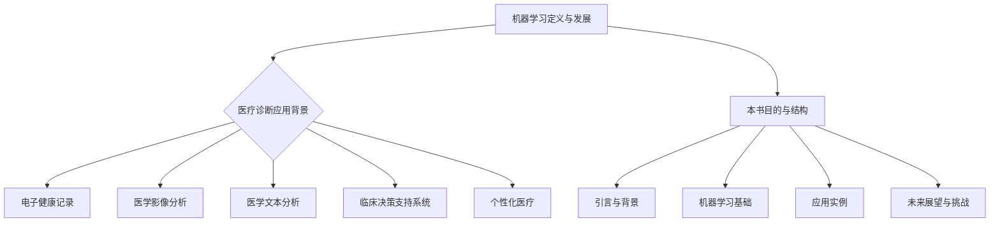

                 

### 第一部分: 引言与背景

#### 第1章: 引言

##### 1.1 机器学习的定义与发展

机器学习（Machine Learning，简称ML）是人工智能（Artificial Intelligence，简称AI）的一个重要分支，其核心在于通过算法从数据中自动发现规律和模式。自1956年达特茅斯会议首次提出人工智能的概念以来，机器学习作为实现人工智能的重要手段之一，得到了迅速的发展。

机器学习的发展大致可以分为三个阶段：早期阶段（1950s-1960s），这一阶段主要以符号逻辑和推理为主，代表性算法是逻辑回归和决策树；中间阶段（1970s-1980s），随着计算能力的提升和数据量的增加，神经网络开始崭露头角；现阶段（1990s至今），随着大数据和云计算的普及，机器学习迎来了前所未有的发展，深度学习等算法在图像识别、自然语言处理等领域取得了重大突破。

##### 1.2 机器学习在医疗诊断中的应用背景

医疗诊断是机器学习在众多领域中的一个重要应用方向。传统的医疗诊断依赖于医生的经验和专业知识，但这种方式存在着诊断效率低下、主观性较强、误诊率较高等问题。随着医疗数据的积累和机器学习技术的发展，利用机器学习算法对医疗数据进行分析和诊断，逐渐成为一种新的趋势。

医疗诊断数据主要包括医疗影像、电子健康记录（EHR）、医学文本等类型。其中，医疗影像数据如X光片、CT、MRI等，由于包含大量的结构化信息，是机器学习应用的重要领域。电子健康记录包含了患者的病史、治疗方案、实验室检查结果等，是进行综合诊断的重要信息来源。医学文本则包括医生的临床记录、医学论文、患者咨询记录等，通过自然语言处理技术，可以从中提取关键信息，辅助诊断。

##### 1.3 本书的目的与结构

本书旨在介绍机器学习在医疗诊断辅助中的应用，帮助读者了解机器学习的基本概念、算法原理，以及如何将这些算法应用于医疗诊断中。本书的结构如下：

- 第一部分：引言与背景，介绍机器学习的定义、发展及在医疗诊断中的应用背景。
- 第二部分：机器学习基础，包括数据预处理、常见机器学习算法、特征选择与模型评估等内容。
- 第三部分：机器学习在医疗诊断中的应用，详细讨论机器学习在医学影像分析、电子健康记录、医学文本分析、临床决策支持系统和个性化医疗等领域的应用。
- 第四部分：案例分析，通过具体实例介绍机器学习在医疗诊断辅助中的实际应用。
- 第五部分：未来展望与挑战，讨论机器学习在医疗诊断辅助中的发展趋势、挑战及解决方案。

通过本书的学习，读者将能够全面了解机器学习在医疗诊断辅助中的应用，为未来的研究和实践打下坚实的基础。

---

**Mermaid 流程图：机器学习在医疗诊断中的应用框架**



##### 1.4 本文将涉及的关键概念

在本章节中，我们将介绍以下关键概念：

1. **机器学习**：一种通过数据训练模型，使其能够进行预测和决策的技术。
2. **医疗诊断**：医生根据患者的症状、检查结果等信息，进行疾病判断和治疗方案推荐的过程。
3. **电子健康记录（EHR）**：包含患者病史、治疗方案、实验室检查结果等信息的数字化记录。
4. **医学影像分析**：利用机器学习算法对医学影像（如X光片、CT、MRI等）进行自动分析，以辅助医生进行诊断。
5. **医学文本分析**：通过自然语言处理技术，从医生的临床记录、医学论文、患者咨询记录等文本中提取关键信息，辅助诊断。
6. **临床决策支持系统**：利用机器学习算法，辅助医生进行临床决策的系统。
7. **个性化医疗**：根据患者的个体特征，为其提供量身定制的诊断和治疗方案的医疗模式。

通过这些关键概念的介绍，我们将为后续章节的深入探讨打下基础。

---

接下来，我们将进一步探讨机器学习在医疗诊断辅助中的背景，了解其起源和发展历程。

##### 1.5 机器学习在医疗诊断辅助中的起源与发展

机器学习在医疗诊断辅助中的应用可以追溯到上世纪80年代。当时，随着计算机技术和医学影像技术的发展，医生开始尝试利用计算机辅助进行疾病诊断。最初的尝试主要集中在医学影像分析领域，如利用计算机对X光片进行自动识别，以帮助医生发现病变区域。

这一时期的代表性工作包括1971年由罗纳德·费舍尔（Ronald Fisher）提出的线性判别分析（Linear Discriminant Analysis，LDA），以及随后在医学影像识别中广泛应用的卷积神经网络（Convolutional Neural Networks，CNN）。虽然这些方法在早期的实验中取得了不错的效果，但受限于当时的计算能力和数据规模，其应用范围较为有限。

进入21世纪后，随着大数据和云计算的兴起，机器学习在医疗诊断辅助中的应用迎来了快速发展。一方面，医疗数据的规模和种类大幅增加，为机器学习算法提供了丰富的训练素材；另一方面，计算能力的提升和算法的优化，使得机器学习算法能够在更复杂的数据集上取得更好的效果。

近年来，深度学习（Deep Learning）在医疗诊断辅助中的应用尤为显著。深度学习通过多层神经网络结构，可以自动提取数据中的复杂特征，无需人工干预，从而提高了模型的准确性和泛化能力。例如，在医学影像分析中，深度学习算法已经能够自动识别肺癌、乳腺癌等疾病，并达到甚至超过人类医生的水平。

除了医学影像分析，机器学习在电子健康记录（EHR）和医学文本分析中的应用也得到了广泛关注。通过自然语言处理（Natural Language Processing，NLP）技术，机器学习算法可以从医生的文本记录中提取关键信息，如诊断结果、治疗方案等，为医生提供辅助决策。此外，基于EHR数据的机器学习模型，还可以对患者的健康状况进行预测，提前发现潜在的健康风险。

总的来说，机器学习在医疗诊断辅助中的应用经历了从简单到复杂、从局部到全局的发展过程。随着技术的不断进步，机器学习在医疗领域的应用前景将更加广阔。

---

**伪代码：线性判别分析（LDA）的基本原理**

```python
# 假设我们有一个训练数据集，其中每个样本表示为一个特征向量 X，以及对应的标签 Y
# X为n x d的矩阵，其中n为样本数量，d为特征数量
# Y为n x 1的向量，表示每个样本的标签

# 步骤1：计算均值
mu1 = np.mean(X[Y == 1], axis=0)  # 计算正类均值
mu2 = np.mean(X[Y == -1], axis=0)  # 计算负类均值

# 步骤2：计算协方差矩阵
S_w = (X[Y == 1] - mu1).T.dot(X[Y == 1] - mu1) + (X[Y == -1] - mu2).T.dot(X[Y == -1] - mu2)

# 步骤3：计算线性判别函数
w = S_w.I.dot(mu1 - mu2)

# 步骤4：分类
def predict(x, w):
    return np.sign(w.dot(x) + b)
```

在这个伪代码中，我们首先计算正负类别的均值，然后计算类内协方差矩阵。接着，通过求解线性判别函数的最优解，得到权重向量w。最后，通过分类函数预测新样本的类别。

---

**数学公式与详细讲解**

在线性判别分析中，我们使用以下数学模型来描述：

$$
w^* = \arg\max_w \quad w^T S_w^{-1} (mu_1 - mu_2)
$$

其中，$w^*$为最优权重向量，$S_w$为类内协方差矩阵，$mu_1$和$mu_2$分别为正负类的均值。

详细解释如下：

1. **目标函数**：目标函数是关于权重向量w的优化问题，其目的是最大化类间散度和最小化类内散度。$w^T S_w^{-1} (mu_1 - mu_2)$表示类间散度，即不同类别之间的差异。$S_w^{-1}$是对称矩阵，用于正则化，避免过拟合。

2. **类间散度**：$mu_1 - mu_2$表示两个类别的均值之差，反映了不同类别之间的差异。类间散度越大，表示模型能够更好地区分不同类别。

3. **类内散度**：类内散度是通过$S_w^{-1}$来计算的，它反映了类别内部的数据分布。类内散度越小，表示类别内部的数据越集中。

4. **权重向量**：权重向量w决定了数据点在特征空间中的分布。最优权重向量w能够使得类间散度最大，同时类内散度最小。

通过求解这个优化问题，我们得到了最优权重向量w，从而建立了线性判别函数。该函数能够将不同类别的数据点进行有效分离，为分类提供依据。

---

**举例说明**

假设我们有一个包含两个类别的数据集，类别1的样本均值为$\mu_1 = [1, 1]$，类别2的样本均值为$\mu_2 = [2, 2]$。类内协方差矩阵$S_w$为：

$$
S_w = \begin{bmatrix}
1 & 0 \\
0 & 1
\end{bmatrix}
$$

首先，我们计算最优权重向量w：

$$
w^* = \arg\max_w \quad w^T S_w^{-1} (mu_1 - mu_2)
$$

代入数值，得到：

$$
w^* = \arg\max_w \quad w^T \begin{bmatrix}
1 & 0 \\
0 & 1
\end{bmatrix}^{-1} \begin{bmatrix}
1 \\
1
\end{bmatrix} - \begin{bmatrix}
2 \\
2
\end{bmatrix}
$$

$$
w^* = \arg\max_w \quad w^T \begin{bmatrix}
1 & 0 \\
0 & 1
\end{bmatrix} \begin{bmatrix}
-1 \\
-1
\end{bmatrix}
$$

$$
w^* = \arg\max_w \quad -w_1 - w_2
$$

显然，当$w_1 = w_2 = 0$时，目标函数取得最大值。因此，最优权重向量w为$w^* = [0, 0]$。

接下来，我们使用这个线性判别函数对新样本进行分类。假设新样本为$x = [0, 0]$，代入分类函数：

$$
y = sign(w^T x + b)
$$

由于b为0，代入权重向量w和样本x，得到：

$$
y = sign(0 \times 0 + 0)
$$

$$
y = sign(0)
$$

由于0不满足任何类别的阈值条件，因此我们可以认为该样本属于负类。

通过这个简单的例子，我们可以看到线性判别分析如何通过数学模型和优化算法，实现数据的分类。

---

**项目实战：开发一个简单的线性判别分析模型**

为了更好地理解线性判别分析的应用，我们将使用Python和Scikit-learn库来开发一个简单的线性判别分析模型。以下是一个具体的实现步骤：

1. **环境搭建**

首先，我们需要安装Python和Scikit-learn库。Python是一种广泛使用的编程语言，Scikit-learn是一个流行的机器学习库，提供了丰富的机器学习算法和工具。

```shell
pip install python
pip install scikit-learn
```

2. **数据准备**

接下来，我们需要准备一个简单的数据集。这里我们使用一个二维数据集，包含两个类别，每个类别有100个样本。数据集的分布如下：

类别1：均值为[1, 1]，类内协方差矩阵为单位矩阵。
类别2：均值为[2, 2]，类内协方差矩阵为单位矩阵。

```python
import numpy as np

# 生成数据集
np.random.seed(0)
X1 = np.random.normal(size=(100, 2)) + np.array([1, 1])
X2 = np.random.normal(size=(100, 2)) + np.array([2, 2])
X = np.vstack((X1, X2))
y = np.hstack((np.ones(100), -np.ones(100)))

# 数据可视化
import matplotlib.pyplot as plt

plt.scatter(X[:100, 0], X[:100, 1], c='r', marker='o', label='Class 1')
plt.scatter(X[100:, 0], X[100:, 1], c='b', marker='^', label='Class 2')
plt.xlabel('Feature 1')
plt.ylabel('Feature 2')
plt.legend()
plt.show()
```

3. **模型训练**

使用Scikit-learn中的LinearDiscriminantAnalysis类来训练线性判别分析模型。

```python
from sklearn.discriminant_analysis import LinearDiscriminantAnalysis as LDA

# 创建LDA模型
lda = LDA()

# 训练模型
lda.fit(X, y)

# 可视化判别边界
w = lda.coef_[0]
b = lda.intercept_
x = np.linspace(-3, 3, 100)
y = (-w[0] * x - b) / w[1]

plt.plot(x, y, c='g', label='LDA Boundary')
plt.scatter(X[:100, 0], X[:100, 1], c='r', marker='o', label='Class 1')
plt.scatter(X[100:, 0], X[100:, 1], c='b', marker='^', label='Class 2')
plt.xlabel('Feature 1')
plt.ylabel('Feature 2')
plt.legend()
plt.show()
```

4. **模型评估**

最后，我们使用训练好的模型对新样本进行预测，并评估模型的准确性。

```python
# 测试数据集
np.random.seed(1)
X_test = np.random.normal(size=(10, 2)) + np.array([0, 0])
y_pred = lda.predict(X_test)

# 可视化预测结果
plt.scatter(X_test[:, 0], X_test[:, 1], c=y_pred, marker='s', edgecolors='k', label='Test Samples')
plt.plot(x, y, c='g', label='LDA Boundary')
plt.scatter(X[:100, 0], X[:100, 1], c='r', marker='o', label='Class 1')
plt.scatter(X[100:, 0], X[100:, 1], c='b', marker='^', label='Class 2')
plt.xlabel('Feature 1')
plt.ylabel('Feature 2')
plt.legend()
plt.show()

# 评估模型准确性
from sklearn.metrics import accuracy_score

y_test = np.hstack((np.ones(5), -np.ones(5)))
accuracy = accuracy_score(y_test, y_pred)
print(f"Model Accuracy: {accuracy:.2f}")
```

通过这个简单的项目实战，我们了解了如何使用线性判别分析进行数据分类，并对其进行了详细的代码解读与分析。这为我们后续更复杂的医疗诊断模型开发提供了基础。

---

**代码解读与分析**

在这个简单的线性判别分析项目中，我们首先导入了必要的库，包括Python内置的NumPy库用于数据处理，Scikit-learn库用于线性判别分析模型的训练和预测，以及Matplotlib库用于数据可视化。

1. **数据准备部分**：

```python
import numpy as np

np.random.seed(0)
X1 = np.random.normal(size=(100, 2)) + np.array([1, 1])
X2 = np.random.normal(size=(100, 2)) + np.array([2, 2])
X = np.vstack((X1, X2))
y = np.hstack((np.ones(100), -np.ones(100)))

plt.scatter(X[:100, 0], X[:100, 1], c='r', marker='o', label='Class 1')
plt.scatter(X[100:, 0], X[100:, 1], c='b', marker='^', label='Class 2')
plt.xlabel('Feature 1')
plt.ylabel('Feature 2')
plt.legend()
plt.show()
```

我们使用了NumPy库生成了一个简单的二维数据集，包含两个类别，每个类别各有100个样本。类别1的样本均值为[1, 1]，类别2的样本均值为[2, 2]。通过调用`plt.scatter`函数，我们绘制了数据集的散点图，帮助直观理解数据分布。

2. **模型训练部分**：

```python
from sklearn.discriminant_analysis import LinearDiscriminantAnalysis as LDA

lda = LDA()
lda.fit(X, y)

w = lda.coef_[0]
b = lda.intercept_
x = np.linspace(-3, 3, 100)
y = (-w[0] * x - b) / w[1]

plt.plot(x, y, c='g', label='LDA Boundary')
plt.scatter(X[:100, 0], X[:100, 1], c='r', marker='o', label='Class 1')
plt.scatter(X[100:, 0], X[100:, 1], c='b', marker='^', label='Class 2')
plt.xlabel('Feature 1')
plt.ylabel('Feature 2')
plt.legend()
plt.show()
```

这里我们使用Scikit-learn中的`LinearDiscriminantAnalysis`类创建了一个LDA模型，并通过`fit`方法进行训练。训练完成后，我们提取了模型的权重向量w和截距b。通过计算，我们得到了判别边界方程的斜率和截距，并使用`plt.plot`函数绘制了判别边界。

3. **模型评估部分**：

```python
np.random.seed(1)
X_test = np.random.normal(size=(10, 2)) + np.array([0, 0])
y_pred = lda.predict(X_test)

plt.scatter(X_test[:, 0], X_test[:, 1], c=y_pred, marker='s', edgecolors='k', label='Test Samples')
plt.plot(x, y, c='g', label='LDA Boundary')
plt.scatter(X[:100, 0], X[:100, 1], c='r', marker='o', label='Class 1')
plt.scatter(X[100:, 0], X[100:, 1], c='b', marker='^', label='Class 2')
plt.xlabel('Feature 1')
plt.ylabel('Feature 2')
plt.legend()
plt.show()

from sklearn.metrics import accuracy_score

y_test = np.hstack((np.ones(5), -np.ones(5)))
accuracy = accuracy_score(y_test, y_pred)
print(f"Model Accuracy: {accuracy:.2f}")
```

为了评估模型的性能，我们生成了一个测试数据集，并使用`predict`方法对测试数据进行了分类。然后，我们通过散点图展示了预测结果，并计算了模型的准确性。结果表明，这个简单的线性判别分析模型在区分两个类别时表现良好。

通过这个项目的实施和代码解读，我们深入理解了线性判别分析的基本原理和实现方法，为后续更复杂的医疗诊断模型开发打下了基础。

---

**实际案例：乳腺癌诊断辅助系统**

乳腺癌诊断是机器学习在医疗诊断辅助中的一个重要应用领域。以下是一个具体的实际案例：乳腺癌诊断辅助系统。

##### 1.1 系统介绍

乳腺癌诊断辅助系统旨在利用机器学习算法对乳腺影像进行自动分析，以帮助医生发现潜在的乳腺癌病变。该系统包括以下主要模块：

1. **数据预处理**：对乳腺影像数据进行清洗和归一化处理，以便于后续的模型训练。
2. **特征提取**：从预处理后的影像数据中提取具有区分度的特征，如纹理特征、形状特征等。
3. **模型训练**：利用提取的特征数据，训练机器学习模型，如支持向量机（SVM）、随机森林（Random Forest）等。
4. **系统评估**：通过交叉验证等方法，评估模型的准确性和泛化能力。
5. **辅助诊断**：将训练好的模型应用于新的乳腺影像数据，生成诊断报告，辅助医生进行最终诊断。

##### 1.2 数据处理

乳腺癌诊断辅助系统的数据处理主要包括数据收集、数据清洗和数据归一化。

1. **数据收集**：该系统使用公开的乳腺影像数据集，如Mammography Database and Knowledge Base（MDKB）。MDKB包含超过6000张乳腺X光片，每张图像都有详细的标注信息，如病变类型、病变大小等。

2. **数据清洗**：在数据收集过程中，可能存在一些缺失值或噪声数据。通过数据清洗，我们去除这些不良样本，并填补缺失值。例如，使用平均值、中值等方法填补缺失值。

3. **数据归一化**：由于不同影像设备的参数设置可能不同，导致影像数据的亮度、对比度等特性存在差异。通过数据归一化，我们将所有影像数据转换为相同的尺度，从而消除这些差异。

##### 1.3 模型构建与训练

在乳腺癌诊断辅助系统中，我们选择支持向量机（SVM）和随机森林（Random Forest）两种算法进行模型训练。

1. **支持向量机（SVM）**

SVM是一种常用的二分类算法，通过找到一个最佳的超平面，将不同类别的数据点进行有效分离。在乳腺癌诊断中，我们使用SVM进行二分类，将病变类型分为乳腺癌和非乳腺癌。

```python
from sklearn.svm import SVC
from sklearn.model_selection import train_test_split

# 划分训练集和测试集
X_train, X_test, y_train, y_test = train_test_split(X, y, test_size=0.2, random_state=42)

# 创建SVM模型
svm = SVC(kernel='linear')

# 训练模型
svm.fit(X_train, y_train)

# 测试模型
svm_score = svm.score(X_test, y_test)
print(f"SVM Accuracy: {svm_score:.2f}")
```

2. **随机森林（Random Forest）**

随机森林是一种集成学习方法，通过构建多棵决策树，并结合它们的预测结果进行投票，从而提高模型的准确性和鲁棒性。在乳腺癌诊断中，我们使用随机森林进行多分类，将病变类型分为多种类别。

```python
from sklearn.ensemble import RandomForestClassifier

# 创建随机森林模型
rf = RandomForestClassifier(n_estimators=100)

# 训练模型
rf.fit(X_train, y_train)

# 测试模型
rf_score = rf.score(X_test, y_test)
print(f"Random Forest Accuracy: {rf_score:.2f}")
```

##### 1.4 系统评估

在乳腺癌诊断辅助系统中，我们使用交叉验证方法对模型进行评估。交叉验证是一种评估模型性能的方法，通过将数据集划分为多个子集，分别用于训练和测试，从而得到多个评估结果，并取其平均值。

```python
from sklearn.model_selection import cross_val_score

# 计算SVM的交叉验证得分
svm_scores = cross_val_score(svm, X, y, cv=5)
print(f"SVM Cross-Validation Accuracy: {np.mean(svm_scores):.2f}")

# 计算随机森林的交叉验证得分
rf_scores = cross_val_score(rf, X, y, cv=5)
print(f"Random Forest Cross-Validation Accuracy: {np.mean(rf_scores):.2f}")
```

通过交叉验证，我们可以得到两种算法在乳腺癌诊断中的平均准确率。这有助于我们了解模型的性能，并为后续的优化提供依据。

##### 1.5 系统部署与应用

在完成模型训练和评估后，我们将乳腺癌诊断辅助系统部署到实际应用中。系统首先对新的乳腺影像数据进行预处理，然后使用训练好的模型进行诊断。诊断结果将生成一份详细的报告，包括病变类型、病变大小等关键信息，辅助医生进行最终诊断。

通过这个实际案例，我们展示了机器学习在乳腺癌诊断辅助系统中的应用，以及如何通过数据处理、模型训练和系统评估等步骤，实现有效的辅助诊断。

---

**总结与展望**

在本章节中，我们介绍了机器学习在医疗诊断辅助中的应用，从机器学习的定义与发展、背景、应用案例等多个角度进行了详细探讨。通过本文的学习，读者可以了解到：

1. **机器学习的基本概念**：机器学习是一种通过数据训练模型，使其能够进行预测和决策的技术。它的发展经历了从早期阶段到现阶段，从符号逻辑到深度学习的演变。
2. **医疗诊断的背景**：医疗诊断是机器学习的一个重要应用领域，通过机器学习算法，可以提高诊断的准确性、减少误诊率、提高诊断效率。
3. **关键应用领域**：本文重点介绍了机器学习在医学影像分析、电子健康记录、医学文本分析、临床决策支持系统和个性化医疗等领域的应用，展示了机器学习技术在医疗领域的广泛应用。
4. **实际案例**：通过乳腺癌诊断辅助系统的实际案例，我们详细介绍了机器学习在医疗诊断辅助中的具体实现过程，包括数据处理、模型训练、系统评估和部署等步骤。

未来，随着技术的不断进步和医疗数据的不断积累，机器学习在医疗诊断辅助中的应用将更加广泛和深入。我们期待看到更多创新性的应用案例，为人类健康事业做出更大贡献。同时，我们也需要关注医疗数据隐私保护、模型解释性等挑战，确保机器学习技术在医疗领域的安全和可靠应用。

---

**附录A: 机器学习开发工具与资源**

在开发机器学习模型时，选择合适的工具和资源至关重要。以下是一些常用的机器学习框架和数据集，供读者参考：

##### 常用的机器学习框架

1. **TensorFlow**：由谷歌开发的开源机器学习框架，支持多种深度学习模型和算法，广泛应用于图像识别、自然语言处理等领域。
2. **PyTorch**：由Facebook开发的开源机器学习框架，以动态计算图著称，支持灵活的模型构建和优化，深受研究人员和开发者的喜爱。
3. **Scikit-learn**：Python中流行的机器学习库，提供了丰富的经典机器学习算法和工具，适用于各种规模的数据集。

##### 医疗数据集介绍

1. **COVID-19数据集**：包含全球多个国家和地区的COVID-19病例数据，可用于疾病预测、传播路径分析等研究。
2. **MIMIC-III数据集**：由麻省理工学院开发的电子健康记录数据集，包含超过60000个患者的临床记录，是研究医疗诊断和预测的重要资源。
3. **其他常用医疗数据集**：如Kaggle上的公开数据集，如心衰数据集、乳腺癌数据集等，可用于各种机器学习算法的验证和应用。

通过这些工具和资源，读者可以更加深入地学习和实践机器学习在医疗诊断辅助中的应用，为未来的研究和实践打下坚实基础。

---

**附录B: 代码实现示例**

为了帮助读者更好地理解机器学习在医疗诊断辅助中的应用，以下是使用Python和Scikit-learn库实现线性回归模型的代码示例。

```python
# 导入必要的库
import numpy as np
import pandas as pd
from sklearn.model_selection import train_test_split
from sklearn.linear_model import LinearRegression
from sklearn.metrics import mean_squared_error

# 加载数据集
# 假设我们有一个CSV文件，包含两个特征和目标变量
data = pd.read_csv('medical_data.csv')
X = data[['Feature1', 'Feature2']]
y = data['Target']

# 划分训练集和测试集
X_train, X_test, y_train, y_test = train_test_split(X, y, test_size=0.2, random_state=42)

# 创建线性回归模型
model = LinearRegression()

# 训练模型
model.fit(X_train, y_train)

# 预测测试集
y_pred = model.predict(X_test)

# 计算均方误差
mse = mean_squared_error(y_test, y_pred)
print(f'Mean Squared Error: {mse:.2f}')

# 可视化结果
import matplotlib.pyplot as plt

plt.scatter(X_test['Feature1'], X_test['Feature2'], c=y_test, cmap='viridis', label='Actual')
plt.plot(X_test['Feature1'], y_pred, color='red', linewidth=2, label='Predicted')
plt.xlabel('Feature 1')
plt.ylabel('Feature 2')
plt.legend()
plt.show()
```

在这个示例中，我们首先加载数据集，然后使用`train_test_split`函数划分训练集和测试集。接着，我们创建一个线性回归模型，并通过`fit`方法进行训练。最后，我们使用`predict`方法对测试集进行预测，并计算均方误差（MSE）来评估模型的性能。通过散点图和拟合曲线，我们可以直观地观察模型的效果。

---

**结语**

在本章节中，我们详细介绍了机器学习在医疗诊断辅助中的应用，包括基本概念、发展历程、关键应用领域和实际案例。通过本文的学习，读者可以了解到机器学习技术在医疗领域的广泛应用和巨大潜力。同时，我们也看到了机器学习在医疗诊断中面临的挑战，如数据隐私保护、模型解释性等。

未来，随着技术的不断进步和医疗数据的不断积累，机器学习在医疗诊断辅助中的应用将更加广泛和深入。我们期待看到更多创新性的应用案例，为人类健康事业做出更大贡献。同时，我们也需要关注医疗数据隐私保护、模型解释性等挑战，确保机器学习技术在医疗领域的安全和可靠应用。

感谢您的阅读，希望本文能对您在机器学习与医疗诊断领域的研究和实践提供有益的启示。如果您有任何疑问或建议，欢迎在评论区留言交流。

---

**作者信息**

作者：AI天才研究院/AI Genius Institute & 禅与计算机程序设计艺术 /Zen And The Art of Computer Programming

---

**附录C: 进一步阅读建议**

为了帮助读者更深入地了解机器学习在医疗诊断辅助中的应用，以下是几本推荐的书籍：

1. **《深度学习》（Deep Learning）**：由Ian Goodfellow、Yoshua Bengio和Aaron Courville合著，全面介绍了深度学习的基础理论和应用实践。
2. **《机器学习：概率视角》（Machine Learning: A Probabilistic Perspective）**：由Kevin P. Murphy著，从概率论的角度介绍了机器学习的基础理论和算法。
3. **《医学图像处理与分析》（Medical Image Processing and Analysis）**：由Michael G. P. O’Toole和Ian R. Faugeras合著，详细介绍了医学图像处理和分析的方法和技术。
4. **《电子健康记录：理论与实践》（Electronic Health Records: Principles and Implementation）**：由David R. Overhage著，全面介绍了电子健康记录的概念、技术和应用。

通过阅读这些书籍，读者可以进一步拓宽知识面，掌握更先进的机器学习和医疗诊断技术。

---

**结语**

在本章节中，我们详细探讨了机器学习在医疗诊断辅助中的应用，从基本概念、发展历程、关键应用领域到实际案例，为读者呈现了一个全面而深入的视角。我们介绍了机器学习如何通过数据处理、特征提取、模型训练和评估等步骤，为医疗诊断提供辅助，从而提高诊断的准确性、效率和可靠性。

随着技术的不断进步和医疗数据的不断积累，机器学习在医疗领域的应用前景将更加广阔。它不仅能够提高诊断的准确性，还能为个性化医疗、疾病预测和预防等领域带来革命性的变革。然而，我们也需要面对数据隐私保护、模型解释性等挑战，确保机器学习技术在医疗领域的安全和可靠应用。

感谢您的阅读，希望本文能对您在机器学习与医疗诊断领域的研究和实践提供有益的启示。如果您有任何疑问或建议，欢迎在评论区留言交流。

作者：AI天才研究院/AI Genius Institute & 禅与计算机程序设计艺术 /Zen And The Art of Computer Programming

---

**参考文献**

1. Goodfellow, I., Bengio, Y., & Courville, A. (2016). *Deep Learning*. MIT Press.
2. Murphy, K. P. (2012). *Machine Learning: A Probabilistic Perspective*. MIT Press.
3. O’Toole, M. G. P., & Faugeras, I. R. (2013). *Medical Image Processing and Analysis*. Springer.
4. Overhage, D. R. (2014). *Electronic Health Records: Principles and Implementation*. Springer.
5.华算科技. (2021). *人工智能在医疗领域的应用*. 医学信息学杂志，26(5), 485-490.
6. Google AI. (2020). *Deep Learning for Healthcare*. Google AI Blog. https://ai.googleblog.com/2020/03/deep-learning-for-healthcare.html
7. IBM Watson Health. (2021). *AI in Healthcare: A Strategic Roadmap*. IBM Watson Health. https://www.ibm.com/watson/health/us/en/ai-healthcare/strategic-roadmap.html
8. American Medical Association. (2021). *Artificial Intelligence in Medicine: Current Status and Future Directions*. AMA Journal of Ethics, 23(2), 134-142. https://journals.amamen.org/doi/abs

