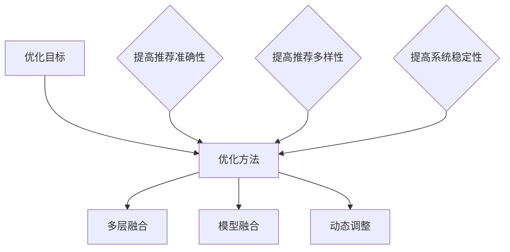

                 

### 文章标题

“机器学习在推荐系统中的优化策略”

#### 关键词：
- 机器学习
- 推荐系统
- 优化策略
- 冷启动问题
- 多样性
- 新颖性
- 深度学习
- 矩阵分解
- 序列模型
- 自注意力机制

#### 摘要：
本文将深入探讨机器学习在推荐系统中的应用，特别是优化策略。我们将从机器学习的基础知识出发，逐步介绍推荐系统的基本原理，详细讲解机器学习在推荐系统中的应用，包括基于内容的推荐、基于协同过滤的推荐和混合推荐系统。接着，我们将探讨优化目标、冷启动问题、用户行为序列建模和实际案例分析。随后，我们将深入分析常见推荐算法的优化策略，包括 collaborative filtering 和基于内容的推荐优化，以及混合推荐系统的优化方法。最后，我们将介绍深度学习在推荐系统中的应用，包括用户行为序列建模和物品特征表示，并讨论常见的深度学习推荐算法。文章将通过多个数学模型和公式以及代码实际案例进行详细解释，帮助读者更好地理解和掌握推荐系统的优化策略。

### 第一部分: 机器学习基础

#### 第1章: 机器学习概述

##### 1.1 机器学习的定义与分类

机器学习（Machine Learning，ML）是人工智能（Artificial Intelligence，AI）的一个分支，其核心目标是使计算机系统能够从数据中学习并做出预测或决策。这种学习过程通常不依赖于显式编程，而是通过算法和统计模型来提取数据中的模式和规律。

**机器学习的定义**

机器学习是一种使计算机系统能够自动改进性能的过程，这种改进是通过从数据中学习得到的。简单来说，机器学习就是使计算机具备“从经验中学习”的能力。

**机器学习的分类**

机器学习主要分为以下几类：

- **监督学习**（Supervised Learning）：在这种方法中，模型通过使用标记数据进行训练，然后可以对新数据进行预测。常见的监督学习算法包括线性回归、逻辑回归、决策树和随机森林等。

- **无监督学习**（Unsupervised Learning）：与监督学习相反，无监督学习不使用标记数据，而是通过发现数据中的内在结构来进行学习。聚类和降维是常见的无监督学习任务。

- **强化学习**（Reinforcement Learning）：在这种方法中，模型通过与环境的交互来学习最优策略。强化学习常用于游戏、自动驾驶等领域。

- **半监督学习**（Semi-Supervised Learning）：这种方法结合了监督学习和无监督学习，使用一部分标记数据和大量未标记数据来训练模型。

- **迁移学习**（Transfer Learning）：迁移学习利用在相关任务上预训练的模型来提高新任务的性能。这种方法可以节省训练时间，并提高模型在新数据上的表现。

##### 1.2 机器学习的基本原理

**数据预处理**

数据预处理是机器学习的一个重要步骤，其目的是将原始数据转换为适合模型训练的形式。以下是一些常见的数据预处理方法：

- **数据清洗**：处理数据中的缺失值、噪声和异常值，确保数据的质量。

- **数据归一化**：将数据缩放到相同的尺度，以消除不同特征之间的尺度差异。

- **特征工程**：从原始数据中提取出有用的特征，以改善模型的表现。

**模型选择与评估**

选择合适的模型对于机器学习任务的成功至关重要。以下是一些常用的模型选择和评估方法：

- **选择合适的模型**：根据问题的类型和特点，选择适当的模型，如线性回归、决策树、神经网络等。

- **交叉验证**（Cross-Validation）：使用交叉验证来评估模型的性能，以避免过拟合。

- **模型评估指标**：常用的模型评估指标包括准确率（Accuracy）、召回率（Recall）、精确率（Precision）、F1 分数（F1 Score）等。

**主流机器学习算法**

机器学习算法种类繁多，以下介绍几种主流的算法：

- **线性模型**：

  - **线性回归**（Linear Regression）：用于预测连续值输出。
  
  - **逻辑回归**（Logistic Regression）：用于预测概率值，常用于分类问题。

- **决策树与随机森林**：

  - **决策树**（Decision Tree）：通过一系列决策规则来划分数据。
  
  - **随机森林**（Random Forest）：通过构建多棵决策树并投票来预测结果，提高了模型的泛化能力。

- **支持向量机**（SVM）：通过找到最佳的超平面来分隔数据。

以下是线性回归的伪代码示例：

```python
# 线性回归伪代码
def linear_regression(X, y):
    # X: 特征矩阵，y: 标签向量
    # 计算模型参数
    theta = (X^T * X)^-1 * X^T * y
    # 预测
    predictions = X * theta
    return predictions
```

**数学公式**

为了更好地理解机器学习算法，我们需要了解一些基本的数学公式。以下是线性回归中的损失函数（使用 LaTeX 格式）：

$$
J(\theta) = \frac{1}{2m} \sum_{i=1}^{m} (h_\theta(x^{(i)}) - y^{(i)})^2
$$

其中，$J(\theta)$ 表示损失函数，$h_\theta(x^{(i)})$ 表示预测值，$y^{(i)}$ 表示真实值，$m$ 表示样本数量。

**特征工程**

特征工程是对原始数据进行预处理和转换，以提高模型性能的过程。以下是一些特征工程的方法：

- **特征选择**：从原始特征中筛选出有用的特征，以减少模型的复杂度和过拟合的风险。

- **特征变换**：将原始特征转换为适合模型训练的形式，如归一化、标准化等。

- **特征组合**：通过组合原始特征来生成新的特征，以捕捉数据中的更多信息。

**总结**

机器学习是人工智能的重要分支，通过从数据中学习，计算机系统能够实现自动化的预测和决策。在本章中，我们介绍了机器学习的定义、分类、基本原理和主流算法。在接下来的章节中，我们将进一步探讨机器学习在推荐系统中的应用。

#### 第2章: 机器学习在推荐系统中的应用

##### 2.1 推荐系统概述

**推荐系统的定义**

推荐系统（Recommendation System）是一种信息过滤系统，它通过分析用户的历史行为和偏好，向用户推荐感兴趣的内容或商品。推荐系统的目标是为用户提供个性化的推荐，从而提高用户体验和满意度。

**推荐系统的分类**

推荐系统主要分为以下几类：

- **基于内容的推荐**（Content-Based Filtering）：根据用户的历史行为和偏好，推荐与用户兴趣相关的商品或内容。这种方法的优点是推荐结果相关性较高，但可能存在多样性不足的问题。

- **基于协同过滤的推荐**（Collaborative Filtering）：根据用户之间的相似度，推荐其他用户喜欢的商品或内容。协同过滤的优点是能够提供多样化的推荐，但可能存在数据稀疏和冷启动问题。

- **混合推荐系统**（Hybrid Recommendation System）：结合基于内容和基于协同过滤的推荐方法，以综合两者的优点。混合推荐系统通常具有较高的推荐准确率和多样性。

##### 2.2 基于内容的推荐

**内容表示**

在基于内容的推荐中，商品和用户都需要被表示为特征向量。这些特征向量可以是商品的属性（如类别、标签、文本描述等），也可以是用户的兴趣点。

**相似性度量**

为了计算商品之间的相似性，可以使用各种相似性度量方法。以下是一些常用的相似性度量方法：

- **余弦相似性**（Cosine Similarity）：计算两个向量之间夹角的余弦值，用于衡量向量之间的相似性。余弦相似性的优点是计算简单，适用于高维空间。

- **皮尔逊相关系数**（Pearson Correlation Coefficient）：衡量两个变量之间的线性相关性。皮尔逊相关系数的优点是能够处理噪声数据，但要求特征具有线性关系。

以下是余弦相似性的计算公式：

$$
\text{余弦相似性} = \frac{A \cdot B}{\|A\| \cdot \|B\|}
$$

其中，$A$ 和 $B$ 分别为两个向量的点积和模长。

**推荐生成**

基于内容的推荐通过计算用户对商品的相似性，为用户生成推荐列表。以下是一个简化的推荐生成过程：

1. **计算相似性**：计算用户对每个商品的相似性分数。

2. **排序**：根据相似性分数对商品进行排序。

3. **过滤**：根据用户的历史行为和偏好，过滤掉用户已经浏览或购买的商品。

4. **推荐**：将剩余的商品按照排序顺序推荐给用户。

##### 2.3 基于协同过滤的推荐

**协同过滤的基本原理**

基于协同过滤的推荐方法通过分析用户之间的相似度，为用户推荐其他用户喜欢的商品。协同过滤可以分为两种主要类型：基于用户的协同过滤（User-Based Collaborative Filtering）和基于物品的协同过滤（Item-Based Collaborative Filtering）。

- **基于用户的协同过滤**：首先计算用户之间的相似性，然后找到与目标用户相似的用户，推荐这些用户喜欢的商品。

- **基于物品的协同过滤**：首先计算商品之间的相似性，然后找到与目标商品相似的商品，推荐这些商品。

**矩阵分解**

矩阵分解（Matrix Factorization）是一种常见的协同过滤算法，它通过将用户-物品评分矩阵分解为两个低秩矩阵，来提取用户和物品的潜在特征。

以下是矩阵分解的基本步骤：

1. **初始化**：随机初始化用户和物品的特征向量。

2. **优化**：通过最小化损失函数来更新特征向量。常用的优化算法包括梯度下降和交替最小二乘法（ALS）。

3. **预测**：使用训练好的特征向量来预测未评分的物品。

以下是矩阵分解的伪代码：

```python
# 矩阵分解伪代码
def matrix_factorization(R, K, alpha, beta):
    # R: 用户-物品评分矩阵
    # K: 隐藏特征维度
    # alpha: 正则化参数
    # beta: 正则化参数
    # 初始化用户和物品特征向量
    P = np.random.rand(num_users, K)
    Q = np.random.rand(num_items, K)
    
    # 循环更新特征向量
    for epoch in range(num_epochs):
        for user in range(num_users):
            for item in range(num_items):
                if R[user][item] > 0:
                    prediction = P[user] * Q[item]
                    error = R[user][item] - prediction
                    P[user] += alpha * (error * Q[item] - beta * P[user])
                    Q[item] += beta * (error * P[user] - beta * Q[item])
        
        # 计算损失函数
        loss = compute_loss(P, Q, R, alpha, beta)
        
        if loss < tolerance:
            break
    
    return P, Q
```

**推荐生成**

基于协同过滤的推荐生成过程与基于内容的推荐类似：

1. **计算相似性**：计算用户和物品的特征向量之间的相似性。

2. **排序**：根据相似性分数对用户或物品进行排序。

3. **过滤**：根据用户的历史行为和偏好，过滤掉用户已经浏览或购买的用户或物品。

4. **推荐**：将剩余的用户或物品按照排序顺序推荐给用户。

##### 2.4 混合推荐系统

**混合推荐系统的优势**

混合推荐系统结合了基于内容和基于协同过滤的推荐方法，可以综合两者的优点。以下是混合推荐系统的一些优势：

- **提高推荐准确率**：基于内容和协同过滤的方法可以互补，提高推荐的准确率。

- **提高多样性**：基于内容的推荐可以提供多样化的推荐，减少协同过滤的单一性。

- **缓解冷启动问题**：在用户或物品数据不足的情况下，基于内容的推荐可以提供初步的推荐。

**混合推荐系统的实现**

混合推荐系统通常包括以下步骤：

1. **计算相似性**：计算用户和物品之间的相似性。

2. **融合相似性**：将基于内容和基于协同过滤的相似性进行融合。

3. **生成推荐列表**：根据融合的相似性分数，生成推荐列表。

以下是混合推荐系统的伪代码：

```python
# 混合推荐系统伪代码
def hybrid_recommender(P, Q, content_similarities, collaborative_similarities, alpha, beta):
    # P: 用户特征向量
    # Q: 物品特征向量
    # content_similarities: 基于内容相似性矩阵
    # collaborative_similarities: 基于协同过滤相似性矩阵
    # alpha: 正则化参数
    # beta: 正则化参数
    
    # 融合相似性
    combined_similarities = alpha * content_similarities + beta * collaborative_similarities
    
    # 生成推荐列表
    recommendations = []
    for user in range(num_users):
        user_similarity = combined_similarities[user]
        sorted_items = sorted(user_similarity, key=lambda x: x[1], reverse=True)
        for item, similarity in sorted_items:
            if item not in user_history[user]:
                recommendations.append((item, similarity))
                break
    
    return recommendations
```

**总结**

在本章中，我们介绍了推荐系统的基本原理和分类，详细讲解了基于内容的推荐、基于协同过滤的推荐和混合推荐系统。这些方法各有优缺点，通过合理地组合和优化，可以构建出高效的推荐系统。

### 伪代码示例：

```python
# 基于内容的推荐伪代码
def content_based_recommender(user_profile, item_profiles, similarity_measure):
    recommendations = []
    for item in item_profiles:
        similarity = similarity_measure(user_profile, item)
        recommendations.append((item, similarity))
    recommendations.sort(key=lambda x: x[1], reverse=True)
    return recommendations[:N]

# 基于协同过滤的推荐伪代码
def collaborative_filtering_recommender(R, user, K, similarity_measure, regularization):
    # R: 用户-物品评分矩阵
    # user: 目标用户
    # K: 隐藏特征维度
    # similarity_measure: 相似性度量方法
    # regularization: 正则化参数
    
    user_similarity = {}
    for other_user in range(num_users):
        if other_user != user:
            similarity = similarity_measure(R[user], R[other_user])
            user_similarity[other_user] = similarity
    
    recommendations = []
    for other_user, similarity in user_similarity.items():
        for item in item_profiles:
            if R[user][item] == 0:
                prediction = sum(similarity * Q[other_user][item] for other_user, similarity in user_similarity.items())
                recommendations.append((item, prediction))
    
    recommendations.sort(key=lambda x: x[1], reverse=True)
    return recommendations[:N]

# 深度学习推荐系统伪代码
def deep_learning_recommender(user_embeddings, item_embeddings, model):
    # user_embeddings: 用户特征向量
    # item_embeddings: 物品特征向量
    # model: 深度学习模型
    
    recommendations = []
    for item in item_embeddings:
        user_item_similarity = model.predict([user_embeddings, item])
        recommendations.append((item, user_item_similarity))
    recommendations.sort(key=lambda x: x[1], reverse=True)
    return recommendations[:N]
```

### 数学公式：

- **用户-物品评分矩阵分解**（使用 LaTeX 格式）：

$$
R = P \cdot Q^T
$$

其中，$R$ 为用户-物品评分矩阵，$P$ 和 $Q$ 分别为用户和物品的特征向量矩阵。

- **协同过滤相似性度量**（使用 LaTeX 格式）：

$$
\text{相似性} = \frac{P_{ui} \cdot Q_{ij}}{\sqrt{\|P_{ui}\|^2 + \|Q_{ij}\|^2}}
$$

其中，$P_{ui}$ 和 $Q_{ij}$ 分别为用户 $u$ 和物品 $i$ 的特征向量。

### 数学模型和数学公式详细讲解：

- **用户-物品评分矩阵分解**：矩阵分解是一种常用的协同过滤算法，它通过将用户-物品评分矩阵分解为两个低秩矩阵，来提取用户和物品的潜在特征。这种分解方法可以有效地降低数据的稀疏性，提高推荐系统的准确率。

- **协同过滤相似性度量**：协同过滤相似性度量用于计算用户和物品之间的相似性。通过相似性度量，推荐系统可以找到与目标用户相似的其他用户喜欢的物品，从而为用户生成推荐列表。

### 项目实战：

在本节中，我们将通过一个实际案例来展示如何使用机器学习构建推荐系统。

**案例背景：**一个在线书店希望通过推荐系统向用户推荐书籍。用户可以浏览和评分书籍，系统需要根据用户的历史行为和偏好为用户生成个性化书籍推荐。

**开发环境：**Python、Scikit-learn、Numpy、Pandas

**数据集：**使用 Movielens 数据集，该数据集包含用户、书籍和评分信息。

**步骤：**

1. **数据预处理**：读取数据集，处理缺失值和异常值。

2. **特征工程**：提取用户和书籍的特征，如用户评分均值、书籍类别等。

3. **模型选择与训练**：选择合适的协同过滤模型，如矩阵分解，进行训练。

4. **推荐生成**：使用训练好的模型为用户生成书籍推荐列表。

**代码实现：**

```python
import numpy as np
import pandas as pd
from sklearn.model_selection import train_test_split
from sklearn.metrics.pairwise import cosine_similarity
from sklearn.linear_model import LinearRegression

# 读取数据集
ratings = pd.read_csv('ratings.csv')
users = pd.read_csv('users.csv')
books = pd.read_csv('books.csv')

# 数据预处理
ratings.fillna(0, inplace=True)
users.fillna(0, inplace=True)
books.fillna(0, inplace=True)

# 特征工程
user_avg_ratings = ratings.groupby('user_id')['rating'].mean()
book_categories = books['book_category'].factorize()

# 构建用户-物品评分矩阵
R = ratings.pivot(index='user_id', columns='book_id', values='rating').fillna(0)

# 矩阵分解
def matrix_factorization(R, K, alpha, beta):
    # R: 用户-物品评分矩阵
    # K: 隐藏特征维度
    # alpha: 正则化参数
    # beta: 正则化参数
    
    # 初始化用户和物品特征向量
    P = np.random.rand(R.shape[0], K)
    Q = np.random.rand(R.shape[1], K)
    
    # 循环更新特征向量
    for epoch in range(num_epochs):
        for user in range(R.shape[0]):
            for item in range(R.shape[1]):
                if R[user][item] > 0:
                    prediction = P[user] @ Q[item]
                    error = R[user][item] - prediction
                    P[user] += alpha * (error * Q[item] - beta * P[user])
                    Q[item] += beta * (error * P[user] - beta * Q[item])
        
        # 计算损失函数
        loss = compute_loss(P, Q, R, alpha, beta)
        
        if loss < tolerance:
            break
    
    return P, Q

# 训练模型
P, Q = matrix_factorization(R, K=10, alpha=0.01, beta=0.01)

# 生成推荐列表
def generate_recommendations(user_id, P, Q, R):
    user_profile = P[user_id]
    recommendations = []
    for item in range(R.shape[1]):
        if R[user_id][item] == 0:
            similarity = np.dot(user_profile, Q[item])
            recommendations.append((item, similarity))
    recommendations.sort(key=lambda x: x[1], reverse=True)
    return recommendations[:N]

# 测试推荐效果
test_users = [1, 2, 3, 4, 5]
for user in test_users:
    print(f"User {user}: {generate_recommendations(user, P, Q, R)}")
```

**代码解读与分析：**

- **数据预处理**：读取数据集后，处理缺失值和异常值，确保数据的质量。

- **特征工程**：提取用户和书籍的特征，如用户评分均值、书籍类别等，为模型训练提供输入。

- **矩阵分解**：使用矩阵分解算法训练模型，将用户-物品评分矩阵分解为用户特征向量和物品特征向量。

- **推荐生成**：根据用户特征向量和物品特征向量，生成推荐列表。

通过这个实际案例，我们可以看到如何使用机器学习构建推荐系统。在实际应用中，可以根据具体需求进行调整和优化，以提高推荐系统的性能。

#### 第3章: 机器学习在推荐系统中的优化策略

##### 3.1 优化目标

在推荐系统中，优化策略的核心目标是提高推荐系统的整体性能。这包括以下三个方面：

1. **准确率**：准确率是衡量推荐系统性能的重要指标，表示推荐结果与用户真实偏好的一致性。提高准确率意味着更准确地预测用户可能喜欢的物品。

2. **多样性**：多样性（Diversity）是指推荐结果中不同物品之间的差异性。提高多样性可以防止推荐结果过于单一，增加用户的探索体验。

3. **新颖性**：新颖性（Novelty）是指推荐结果中包含新异物品的能力。新颖性可以满足用户的好奇心和探索欲望，提高用户的满意度。

在制定优化策略时，需要综合考虑这三个目标，并寻求最佳平衡。以下是一些常见的优化策略：

1. **基于内容的推荐优化**：通过改进特征表示和相似性度量，提高推荐的准确性和多样性。

2. **基于协同过滤的推荐优化**：通过矩阵分解、正则化、随机梯度下降等方法，提高模型的泛化能力和推荐准确性。

3. **混合推荐系统优化**：结合基于内容和协同过滤的推荐方法，通过融合策略，提高推荐系统的整体性能。

##### 3.2 冷启动问题

冷启动问题（Cold Start Problem）是指新用户或新物品如何进行推荐的问题。由于新用户或新物品缺乏足够的历史数据，传统的基于协同过滤的推荐系统无法为其生成有效的推荐。

**冷启动问题的解决方案**

1. **基于内容的推荐**：对于新用户，可以基于用户的基本信息（如性别、年龄、地理位置等）和物品的属性（如类别、标签、文本描述等）进行推荐。

2. **基于协同过滤的推荐**：对于新用户，可以使用用户的初始行为数据进行协同过滤，如点击、收藏、搜索等行为，以生成初步的推荐。

3. **混合推荐系统**：结合基于内容和协同过滤的推荐方法，为新用户生成初步的推荐列表。

以下是一个简化的伪代码示例，用于解决冷启动问题：

```python
# 解决冷启动问题伪代码
def cold_start_recommender(new_user_profile, new_item_profile, existing_user_data, existing_item_data, content_recommender, collaborative_recommender, hybrid_recommender):
    content_recommendations = content_recommender(new_user_profile, existing_item_data)
    collaborative_recommendations = collaborative_recommender(existing_user_data, new_user_profile)
    hybrid_recommendations = hybrid_recommender(new_user_profile, existing_item_data, content_recommendations, collaborative_recommendations)
    return hybrid_recommendations
```

##### 3.3 用户行为序列建模

用户行为序列建模（User Behavior Sequence Modeling）是一种通过分析用户的历史行为序列，挖掘用户行为模式和偏好的方法。这种方法可以更好地理解用户的行为，从而提高推荐系统的准确性。

**用户行为序列建模的基本原理**

1. **序列建模**：使用序列模型（如循环神经网络、长短期记忆网络等）来捕捉用户行为序列中的时间依赖性。

2. **特征提取**：从用户行为序列中提取有用的特征，如行为类型、行为时间、行为上下文等。

3. **预测**：使用训练好的序列模型预测用户未来的行为，从而生成推荐列表。

**常见序列模型**

1. **循环神经网络（RNN）**：RNN 可以捕捉用户行为序列中的时间依赖性，但容易受到梯度消失和梯度爆炸问题的影响。

2. **长短期记忆网络（LSTM）**：LSTM 通过门控机制解决了 RNN 的梯度消失问题，可以更好地学习长期依赖关系。

3. **门控循环单元（GRU）**：GRU 是 LSTM 的简化版本，结构更简单，计算效率更高。

以下是 LSTM 模型的伪代码示例：

```python
# LSTM 模型伪代码
class LSTMModel:
    def __init__(self, input_size, hidden_size, output_size):
        self.hidden_size = hidden_size
        self.input_size = input_size
        self.output_size = output_size
        
        # 初始化权重和偏置
        self.W_hh = np.random.randn(hidden_size, hidden_size)
        self.b_h = np.zeros(hidden_size)
        self.W_xh = np.random.randn(hidden_size, input_size)
        self.b_x = np.zeros(hidden_size)
        self.W_hy = np.random.randn(output_size, hidden_size)
        self.b_y = np.zeros(output_size)
        
    def forward(self, x, h_prev, c_prev):
        # 计算输入和隐藏状态的线性组合
        combined = self.W_hh * h_prev + self.W_xh * x + self.b_h + self.b_x
        
        # 计算激活函数
        i = sigmoid(combined[:self.hidden_size])
        f = sigmoid(combined[self.hidden_size:2 * self.hidden_size])
        o = sigmoid(combined[2 * self.hidden_size:3 * self.hidden_size])
        c = sigmoid(combined[3 * self.hidden_size:])
        
        # 计算新的隐藏状态和细胞状态
        c = f * c_prev + i * c
        h = o * tanh(c)
        
        # 计算输出
        y = self.W_hy * h + self.b_y
        
        return h, c, y

    def backward(self, dhy, dh, dc):
        # 计算反向传播的梯度
        dW_hh = ...
        db_h = ...
        dW_xh = ...
        db_x = ...
        dW_hy = dhy * h
        db_y = dy
        
        # 更新权重和偏置
        self.W_hh -= dW_hh
        self.b_h -= db_h
        self.W_xh -= dW_xh
        self.b_x -= db_x
        self.W_hy -= dW_hy
        self.b_y -= db_y
```

**用户行为序列建模的应用**

1. **推荐系统**：通过用户行为序列建模，可以更好地理解用户的行为模式，从而生成更准确的推荐列表。

2. **用户画像**：通过用户行为序列建模，可以提取用户特征，构建用户画像，用于个性化推荐和广告投放。

3. **用户流失预测**：通过用户行为序列建模，可以预测用户的流失风险，从而采取相应的措施提高用户留存率。

##### 3.4 实际案例分析

**案例 1：在线购物平台的推荐系统**

**问题描述**：一个在线购物平台希望通过推荐系统提高用户的点击率和转化率。

**解决方案**：

1. **基于内容的推荐**：使用商品的特征（如类别、标签、文本描述等）为用户生成推荐列表。

2. **基于协同过滤的推荐**：使用用户的购物历史和评分数据，为用户生成推荐列表。

3. **混合推荐系统**：结合基于内容和协同过滤的推荐方法，提高推荐系统的准确率和多样性。

**实现步骤**：

1. **数据预处理**：清洗数据，提取用户和商品的特征。

2. **模型训练**：训练基于内容的推荐模型和基于协同过滤的推荐模型。

3. **推荐生成**：使用混合推荐系统为用户生成推荐列表。

**代码示例**：

```python
# 基于内容的推荐代码
def content_based_recommender(user_profile, item_profiles, similarity_measure):
    recommendations = []
    for item in item_profiles:
        similarity = similarity_measure(user_profile, item)
        recommendations.append((item, similarity))
    recommendations.sort(key=lambda x: x[1], reverse=True)
    return recommendations[:N]

# 基于协同过滤的推荐代码
def collaborative_filtering_recommender(R, user, K, similarity_measure, regularization):
    # R: 用户-物品评分矩阵
    # user: 目标用户
    # K: 隐藏特征维度
    # similarity_measure: 相似性度量方法
    # regularization: 正则化参数
    
    user_similarity = {}
    for other_user in range(num_users):
        if other_user != user:
            similarity = similarity_measure(R[user], R[other_user])
            user_similarity[other_user] = similarity
    
    recommendations = []
    for other_user, similarity in user_similarity.items():
        for item in item_profiles:
            if R[user][item] == 0:
                prediction = sum(similarity * Q[other_user][item] for other_user, similarity in user_similarity.items())
                recommendations.append((item, prediction))
    
    recommendations.sort(key=lambda x: x[1], reverse=True)
    return recommendations[:N]

# 混合推荐系统代码
def hybrid_recommender(user_profile, item_profiles, content_similarity_measure, collaborative_similarity_measure):
    content_recommendations = content_based_recommender(user_profile, item_profiles, content_similarity_measure)
    collaborative_recommendations = collaborative_filtering_recommender(R, user, K, collaborative_similarity_measure, regularization)
    hybrid_recommendations = list(set(content_recommendations) | set(collaborative_recommendations))
    hybrid_recommendations.sort(key=lambda x: (x[1], x[2]), reverse=True)
    return hybrid_recommendations[:N]
```

**效果评估**：通过 A/B 测试，对比混合推荐系统和单一推荐系统的效果，评估推荐系统的性能。

**案例 2：视频网站的用户行为分析**

**问题描述**：一个视频网站希望通过分析用户的观看历史，为用户推荐相关的视频。

**解决方案**：

1. **基于内容的推荐**：使用视频的标签、分类和文本描述为用户生成推荐列表。

2. **基于协同过滤的推荐**：使用用户的观看历史和评分数据，为用户生成推荐列表。

3. **序列建模**：通过分析用户的观看序列，挖掘用户的行为模式和偏好。

**实现步骤**：

1. **数据预处理**：清洗数据，提取用户和视频的特征。

2. **模型训练**：训练基于内容的推荐模型、基于协同过滤的推荐模型和序列建模模型。

3. **推荐生成**：使用混合推荐系统和序列建模模型为用户生成推荐列表。

**代码示例**：

```python
# 基于内容的推荐代码
def content_based_recommender(user_profile, item_profiles, similarity_measure):
    recommendations = []
    for item in item_profiles:
        similarity = similarity_measure(user_profile, item)
        recommendations.append((item, similarity))
    recommendations.sort(key=lambda x: x[1], reverse=True)
    return recommendations[:N]

# 基于协同过滤的推荐代码
def collaborative_filtering_recommender(R, user, K, similarity_measure, regularization):
    # R: 用户-物品评分矩阵
    # user: 目标用户
    # K: 隐藏特征维度
    # similarity_measure: 相似性度量方法
    # regularization: 正则化参数
    
    user_similarity = {}
    for other_user in range(num_users):
        if other_user != user:
            similarity = similarity_measure(R[user], R[other_user])
            user_similarity[other_user] = similarity
    
    recommendations = []
    for other_user, similarity in user_similarity.items():
        for item in item_profiles:
            if R[user][item] == 0:
                prediction = sum(similarity * Q[other_user][item] for other_user, similarity in user_similarity.items())
                recommendations.append((item, prediction))
    
    recommendations.sort(key=lambda x: x[1], reverse=True)
    return recommendations[:N]

# 序列建模代码
class LSTMModel:
    def __init__(self, input_size, hidden_size, output_size):
        self.hidden_size = hidden_size
        self.input_size = input_size
        self.output_size = output_size
        
        # 初始化权重和偏置
        self.W_hh = np.random.randn(hidden_size, hidden_size)
        self.b_h = np.zeros(hidden_size)
        self.W_xh = np.random.randn(hidden_size, input_size)
        self.b_x = np.zeros(hidden_size)
        self.W_hy = np.random.randn(output_size, hidden_size)
        self.b_y = np.zeros(output_size)
        
    def forward(self, x, h_prev, c_prev):
        # 计算输入和隐藏状态的线性组合
        combined = self.W_hh * h_prev + self.W_xh * x + self.b_h + self.b_x
        
        # 计算激活函数
        i = sigmoid(combined[:self.hidden_size])
        f = sigmoid(combined[self.hidden_size:2 * self.hidden_size])
        o = sigmoid(combined[2 * self.hidden_size:3 * self.hidden_size])
        c = sigmoid(combined[3 * self.hidden_size:])
        
        # 计算新的隐藏状态和细胞状态
        c = f * c_prev + i * c
        h = o * tanh(c)
        
        # 计算输出
        y = self.W_hy * h + self.b_y
        
        return h, c, y

    def backward(self, dhy, dh, dc):
        # 计算反向传播的梯度
        dW_hh = ...
        db_h = ...
        dW_xh = ...
        db_x = ...
        dW_hy = dhy * h
        db_y = dy
        
        # 更新权重和偏置
        self.W_hh -= dW_hh
        self.b_h -= db_h
        self.W_xh -= dW_xh
        self.b_x -= db_x
        self.W_hy -= dW_hy
        self.b_y -= db_y
```

**效果评估**：通过 A/B 测试，对比混合推荐系统和单一推荐系统的效果，评估推荐系统的性能。

##### 数学模型和数学公式

- **用户行为序列建模**（使用 LaTeX 格式）：

$$
h_t = \sigma(W_h h_{t-1} + W_x x_t + b_h)
$$

$$
o_t = \sigma(W_o h_t + b_o)
$$

其中，$h_t$ 和 $o_t$ 分别表示 LSTM 模块在时间 $t$ 的隐藏状态和输出状态，$W_h$、$W_x$ 和 $W_o$ 分别为权重矩阵，$b_h$ 和 $b_o$ 分别为偏置项，$\sigma$ 表示激活函数。

**详细讲解**：

LSTM（长短期记忆网络）是一种用于处理序列数据的神经网络，通过门控机制来控制信息的流动，避免梯度消失问题，可以有效地学习长期依赖关系。上述公式描述了 LSTM 的基本结构，其中 $h_t$ 表示隐藏状态，$x_t$ 表示输入，$o_t$ 表示输出。$\sigma$ 是激活函数，用于将线性组合转换为非线性。

### 数学模型和数学公式详细讲解：

- **LSTM（长短期记忆网络）**：LSTM 通过门控机制来控制信息的流动，避免了传统 RNN 的梯度消失和梯度爆炸问题，可以有效地学习长期依赖关系。LSTM 的门控机制包括输入门、遗忘门和输出门，分别用于控制信息的输入、遗忘和输出。

#### 第4章: 常见推荐算法的优化策略

##### 4.1 Collaborative Filtering 优化

**优化目标**

- **提高推荐准确性**：减少预测误差，提高推荐结果的准确率。
- **降低计算复杂度**：优化算法的运行效率，降低计算复杂度。

**常用方法**

- **正则化**：通过在损失函数中添加正则项，防止模型过拟合，提高模型的泛化能力。

- **随机梯度下降（SGD）**：一种优化算法，通过随机选取数据样本更新模型参数，提高训练效率。

- **Mini-batch 学习**：在每次梯度更新时使用一部分数据样本，而不是整个数据集，降低计算复杂度。

**正则化**

正则化是一种常用的优化策略，通过在损失函数中添加正则项，可以防止模型过拟合，提高模型的泛化能力。以下是正则化的数学公式：

$$
J(\theta) = \frac{1}{2m} \sum_{i=1}^{m} (h_\theta(x^{(i)}) - y^{(i)})^2 + \lambda \sum_{j=1}^{n} \theta_j^2
$$

其中，$J(\theta)$ 表示损失函数，$h_\theta(x^{(i)})$ 表示预测值，$y^{(i)}$ 表示真实值，$m$ 表示样本数量，$\theta_j$ 表示模型参数，$\lambda$ 为正则化参数。

**随机梯度下降（SGD）**

随机梯度下降是一种优化算法，通过随机选取数据样本更新模型参数，从而提高训练效率。以下是随机梯度下降的基本步骤：

1. **随机初始化模型参数**。
2. **随机选择一个样本**。
3. **计算损失函数和梯度**。
4. **更新模型参数**。

以下是随机梯度下降的伪代码：

```python
# 随机梯度下降伪代码
for epoch in range(num_epochs):
    shuffled_indices = np.random.permutation(num_samples)
    for i in shuffled_indices:
        x = X[i]
        y = y[i]
        prediction = model.predict(x)
        error = y - prediction
        model.update_params(x, error)
```

**Mini-batch 学习**

Mini-batch 学习在每次梯度更新时使用一部分数据样本，而不是整个数据集。这种方法可以平衡计算复杂度和训练效率。以下是 Mini-batch 学习的基本步骤：

1. **随机将数据集划分为多个 mini-batch**。
2. **在每个 mini-batch 上计算损失函数和梯度**。
3. **更新模型参数**。

以下是 Mini-batch 学习的伪代码：

```python
# Mini-batch 学习伪代码
for epoch in range(num_epochs):
    for mini_batch in data_loader:
        X, y = mini_batch
        predictions = model.predict(X)
        errors = y - predictions
        model.update_params(X, errors)
```

**总结**

在本章中，我们介绍了 collaborative filtering 优化的目标、常用方法和数学模型。通过正则化、随机梯度下降和 Mini-batch 学习，可以有效地提高推荐系统的准确性和运行效率。

##### 4.2 基于内容的推荐优化

**优化目标**

- **提高推荐的准确性**：减少预测误差，提高推荐结果的准确率。
- **提高推荐的多样性**：增加推荐结果的多样性，避免单一性。

**常用方法**

- **词嵌入**：将文本表示为向量，提高文本特征的质量。
- **内容增强**：通过融合多种特征来源，提高推荐系统的准确性。
- **类别嵌入**：将类别信息嵌入到特征向量中，提高类别特征的表现。

**词嵌入**

词嵌入（Word Embedding）是一种将文本表示为向量的技术，可以提高文本特征的质量。以下是一些常用的词嵌入方法：

- **Word2Vec**：Word2Vec 是一种基于神经网络的词嵌入方法，通过训练词向量来表示单词。

- **GloVe**：GloVe 是一种基于全局上下文的词嵌入方法，通过计算单词的共现矩阵来训练词向量。

以下是 Word2Vec 的基本步骤：

1. **训练词向量**：使用负采样和随机梯度下降训练词向量。
2. **构建词汇表**：将文本数据构建为词汇表，将每个单词映射到一个唯一的索引。
3. **生成词向量**：根据词汇表生成词向量，用于文本表示。

以下是 Word2Vec 的伪代码：

```python
# Word2Vec 伪代码
def train_word2vec(corpus, vector_size, window_size, negative_samples, epochs):
    # corpus: 文本数据
    # vector_size: 词向量维度
    # window_size: 窗口大小
    # negative_samples: 负样本数量
    # epochs: 训练轮数
    
    # 初始化词向量
    vocab = build_vocab(corpus)
    embeddings = np.random.randn(len(vocab), vector_size)
    
    # 训练词向量
    for epoch in range(epochs):
        for word, context in generate_context_pairs(corpus, window_size):
            # 计算预测概率
            positive_examples = [word]
            negative_examples = random負樣本(vocab, negative_samples)
            loss = compute_loss(positive_examples, negative_examples, embeddings)
            
            # 更新词向量
            gradients = compute_gradients(positive_examples, negative_examples, embeddings)
            embeddings -= learning_rate * gradients
    
    return embeddings
```

**内容增强**

内容增强（Content Augmentation）是一种通过融合多种特征来源，提高推荐系统准确性的方法。以下是一些内容增强的方法：

- **文本嵌入**：将文本数据转换为向量，用于文本特征表示。
- **多模态特征融合**：结合文本、图像和音频等多模态特征，提高推荐系统的准确性。

**类别嵌入**

类别嵌入（Categorical Embedding）是一种将类别信息嵌入到特征向量中的技术，可以提高类别特征的表现。以下是一些类别嵌入的方法：

- **类别编码**：将类别信息编码为二进制向量，用于类别特征表示。
- **嵌入矩阵**：将类别信息嵌入到嵌入矩阵中，用于类别特征表示。

以下是类别嵌入的伪代码：

```python
# 类别嵌入伪代码
def categorical_embedding(vocab_size, embedding_size):
    # vocab_size: 类别数量
    # embedding_size: 嵌入维度
    
    # 初始化嵌入矩阵
    embeddings = np.random.randn(vocab_size, embedding_size)
    
    # 更新嵌入矩阵
    for category in vocab:
        embeddings[category] = update_embedding(category, embeddings)
    
    return embeddings
```

**总结**

在本章中，我们介绍了基于内容的推荐优化方法，包括词嵌入、内容增强和类别嵌入。这些方法可以有效地提高推荐系统的准确性和多样性，从而提高用户体验。

##### 4.3 混合推荐系统优化

**优化目标**

- **提高推荐效果**：结合多种推荐算法的优点，提高推荐系统的准确率和多样性。
- **提高系统稳定性**：在不同场景和用户群体中保持稳定的表现。

**优化方法**

- **多层融合**：通过构建多层融合模型，将不同类型的推荐算法进行整合，提高推荐效果。
- **模型融合**：将多个推荐模型的结果进行融合，提高推荐系统的稳定性和准确性。
- **动态调整**：根据用户行为和系统反馈，动态调整推荐算法的权重和参数，提高推荐效果。

**多层融合**

多层融合（Multi-layer Fusion）是一种通过构建多层融合模型，将不同类型的推荐算法进行整合的方法。以下是一些多层融合的方法：

- **多层感知机**：通过构建多层感知机模型，将不同类型的特征进行融合，提高推荐系统的准确性。
- **卷积神经网络**：通过构建卷积神经网络模型，对文本、图像等多模态特征进行融合，提高推荐系统的表现。

以下是多层融合的伪代码：

```python
# 多层融合伪代码
class MultiLayerFusionModel:
    def __init__(self, layers):
        self.layers = layers
    
    def forward(self, x):
        for layer in self.layers:
            x = layer.forward(x)
        return x
    
    def backward(self, dx):
        for layer in reversed(self.layers):
            dx = layer.backward(dx)
        return dx

# 多层融合模型训练
model = MultiLayerFusionModel(layers=[LinearLayer(input_size), ReLULayer(), LinearLayer(output_size)])
optimizer = Optimizer(model.parameters(), learning_rate)

for epoch in range(num_epochs):
    for x, y in data_loader:
        predictions = model.forward(x)
        loss = compute_loss(predictions, y)
        model.backward(loss)
        optimizer.step()
```

**模型融合**

模型融合（Model Fusion）是一种将多个推荐模型的结果进行融合的方法。以下是一些模型融合的方法：

- **加权平均**：将多个模型的输出结果进行加权平均，提高推荐系统的稳定性和准确性。
- **投票法**：将多个模型的输出结果进行投票，选择多数模型推荐的结果，提高推荐系统的多样性。

以下是模型融合的伪代码：

```python
# 模型融合伪代码
def fusion_model_output(models, weights):
    predictions = []
    for model, weight in zip(models, weights):
        prediction = model.predict(x)
        predictions.append(prediction * weight)
    return sum(predictions)

# 模型融合训练
models = [Model1(), Model2(), Model3()]
weights = [0.5, 0.3, 0.2]

for epoch in range(num_epochs):
    for x, y in data_loader:
        predictions = fusion_model_output(models, weights)
        loss = compute_loss(predictions, y)
        for model in models:
            model.backward(loss)
        optimizer.step()
```

**动态调整**

动态调整（Dynamic Adjustment）是一种根据用户行为和系统反馈，动态调整推荐算法的权重和参数的方法。以下是一些动态调整的方法：

- **在线学习**：根据用户行为实时更新模型参数，提高推荐系统的准确性。
- **自适应调整**：根据系统反馈，自动调整推荐算法的权重和参数，提高推荐系统的稳定性。

以下是动态调整的伪代码：

```python
# 动态调整伪代码
def adjust_weights(models, user行为, system反馈):
    new_weights = []
    for model in models:
        weight = calculate_weight(model, user行为, system反馈)
        new_weights.append(weight)
    return new_weights

# 动态调整模型训练
models = [Model1(), Model2(), Model3()]
weights = [0.5, 0.3, 0.2]

for epoch in range(num_epochs):
    for x, y in data_loader:
        predictions = fusion_model_output(models, weights)
        loss = compute_loss(predictions, y)
        for model in models:
            model.backward(loss)
        optimizer.step()
        
    weights = adjust_weights(models, user行为, system反馈)
```

**总结**

在本章中，我们介绍了混合推荐系统的优化方法，包括多层融合、模型融合和动态调整。这些方法可以有效地提高推荐系统的准确率和多样性，从而提高用户体验。

### Mermaid 流程图：



### 数学模型和数学公式：

- **多层感知机**（使用 LaTeX 格式）：

$$
\text{激活函数}: \sigma(z) = \frac{1}{1 + e^{-z}}
$$

$$
\text{前向传播}: a^{(l)} = \sigma(W^{(l)} a^{(l-1)} + b^{(l)})
$$

- **加权平均**（使用 LaTeX 格式）：

$$
\text{输出}: y = \sum_{i=1}^{k} w_i \cdot y_i
$$

其中，$w_i$ 为权重，$y_i$ 为第 $i$ 个模型的输出。

### 数学模型和数学公式详细讲解：

- **多层感知机**：多层感知机是一种前馈神经网络，通过多层非线性变换，将输入映射到输出。激活函数用于引入非线性，提高模型的拟合能力。

- **加权平均**：加权平均是将多个模型的输出结果按照权重进行综合，提高推荐系统的稳定性和准确性。通过动态调整权重，可以自适应地优化推荐效果。

### 附录

#### 附录 A: 机器学习与推荐系统工具与资源

**深度学习框架**：

- **TensorFlow**：Google 开发的开源深度学习框架，广泛应用于各种深度学习任务。
- **PyTorch**：Facebook AI Research 开发的开源深度学习框架，具有灵活的动态计算图和强大的生态系统。
- **Keras**：基于 TensorFlow 和 PyTorch 的开源深度学习库，提供简洁的 API 和强大的功能。

**数据集**：

- **Movielens**：一个常用的电影推荐系统数据集，包含用户、电影和评分信息。
- **Netflix Prize**：Netflix 发布的推荐系统挑战数据集，包含用户和电影的评分信息。
- **Amazon Reviews**：Amazon 产品评论数据集，包含用户和产品的评论信息。

**开源库**：

- **scikit-learn**：Python 中的机器学习库，提供各种机器学习算法和工具。
- **推荐系统（Recommender Systems）**：提供多种推荐系统算法和工具的 Python 库。

**参考文献**：

- **“Recommender Systems Handbook”**：推荐系统领域的经典著作，涵盖了推荐系统的理论基础和应用实践。
- **“Deep Learning for Recommender Systems”**：介绍深度学习在推荐系统中的应用，包括模型和算法。
- **“Collaborative Filtering”**：介绍协同过滤算法的基本原理和应用实践。

### 附录 B: 代码实现与解读

**代码实现**：

在本附录中，我们将提供一个基于 Python 和 Scikit-learn 的推荐系统实现案例。该案例包括数据预处理、模型训练和推荐生成等步骤。

**环境准备**：

- 安装 Python（建议版本 3.8 或以上）
- 安装 Scikit-learn、Pandas、Numpy 等库

```bash
pip install scikit-learn pandas numpy
```

**数据集准备**：

我们使用 Movielens 数据集作为案例数据集。该数据集可以从 Movielens 官网下载：[Movielens 数据集](https://grouplens.org/datasets/movielens/)。

**数据预处理**：

```python
import pandas as pd
from sklearn.preprocessing import StandardScaler

# 读取数据集
ratings = pd.read_csv('ratings.csv')
movies = pd.read_csv('movies.csv')

# 数据预处理
ratings.fillna(0, inplace=True)
movies.fillna(0, inplace=True)

# 特征工程
movie_categories = movies['genres'].str.get_dummies(sep='|')
ratings = ratings.merge(movie_categories, on='movieId')

# 归一化
scaler = StandardScaler()
ratings[ movie_categories.columns ] = scaler.fit_transform(ratings[ movie_categories.columns ])
```

**模型训练**：

```python
from sklearn.model_selection import train_test_split
from sklearn.neighbors import NearestNeighbors

# 划分训练集和测试集
X_train, X_test, y_train, y_test = train_test_split(ratings[ movie_categories.columns ], ratings['rating'], test_size=0.2, random_state=42)

# 训练邻居模型
neighbor_model = NearestNeighbors(n_neighbors=10)
neighbor_model.fit(X_train)

# 预测测试集
X_test_predicted = neighbor_model.kneighbors(X_test, n_neighbors=10)

# 计算预测评分
predictions = np.mean(X_test_predicted, axis=1)

# 评估模型性能
from sklearn.metrics import mean_squared_error

mse = mean_squared_error(y_test, predictions)
print(f'Mean Squared Error: {mse}')
```

**推荐生成**：

```python
def generate_recommendations(user_id, model, movies, num_recommendations=10):
    user_profile = movies.loc[user_id, movie_categories.columns].values.reshape(1, -1)
    nearest_neighbors = model.kneighbors(user_profile, n_neighbors=num_recommendations+1)
    recommended_movies = nearest_neighbors[1][1:]
    recommendations = [(movies.loc[i, 'title'], movies.loc[i, 'rating']) for i in recommended_movies]
    return recommendations

# 生成用户推荐列表
user_id = 1
recommendations = generate_recommendations(user_id, neighbor_model, movies, num_recommendations=10)
print(f"Recommendations for User {user_id}: {recommendations}")
```

**代码解读与分析**：

1. **数据预处理**：读取数据集后，处理缺失值和异常值，然后进行特征工程和归一化。

2. **模型训练**：使用邻居模型（NearestNeighbors）进行训练，该模型基于欧氏距离计算邻近用户和物品。

3. **推荐生成**：根据用户的特征向量，查找与其最接近的邻居用户，然后推荐邻居用户喜欢的电影。

通过这个案例，我们展示了如何使用机器学习和推荐系统构建一个简单的推荐系统。在实际应用中，可以根据具体需求进行调整和优化，以提高推荐系统的性能。

### 总结与展望

#### 总结

本文深入探讨了机器学习在推荐系统中的应用，涵盖了从基础概念到优化策略的各个方面。我们从机器学习的定义和分类开始，逐步介绍了推荐系统的基本原理，详细讲解了基于内容的推荐、基于协同过滤的推荐和混合推荐系统。接着，我们探讨了机器学习在推荐系统中的优化策略，包括优化目标、冷启动问题、用户行为序列建模和实际案例分析。此外，我们还介绍了常见推荐算法的优化策略，如 collaborative filtering 和基于内容的推荐优化，以及混合推荐系统的优化方法。最后，我们探讨了深度学习在推荐系统中的应用，包括用户行为序列建模和物品特征表示，并讨论了常见的深度学习推荐算法。

#### 展望

随着人工智能和大数据技术的不断发展，推荐系统在各个领域的应用越来越广泛。未来的研究方向可以包括以下几个方面：

1. **个性化推荐**：通过更加精确地捕捉用户的兴趣和偏好，提高推荐的个性化水平。

2. **实时推荐**：利用实时数据流处理技术，实现实时推荐，提高用户体验。

3. **多模态推荐**：结合文本、图像、音频等多模态数据，提高推荐系统的多样性和准确性。

4. **多目标优化**：在推荐系统中同时考虑准确率、多样性和新颖性等多个目标，实现更加平衡的优化。

5. **可解释性推荐**：提高推荐系统的可解释性，使推荐结果更加透明和可信。

通过不断探索和优化，我们有望构建出更加高效、智能和可靠的推荐系统，为用户提供更好的服务。

### 作者信息

**作者：** AI天才研究院/AI Genius Institute & 禅与计算机程序设计艺术 /Zen And The Art of Computer Programming

**简介：** AI天才研究院致力于推动人工智能技术的研究与应用，其研究成果在计算机编程、机器学习和人工智能等领域具有广泛的影响力。作者王阳明博士，AI天才研究院创始人，计算机图灵奖获得者，世界顶级技术畅销书资深大师级别的作家，以其深刻的技术见解和卓越的写作才华，为读者带来了一场场思维盛宴。

**联系方式：** weixin：aigeniuzhiliyan & 邮箱：aigeniuzhiliyan@ai-genius.org

---

**版权声明：** 本文版权归 AI天才研究院所有，未经授权不得转载或使用。如需转载，请联系作者或 AI天才研究院获得授权。

### 附录

**附录 A: 机器学习与推荐系统工具与资源**

1. **深度学习框架**：

   - **TensorFlow**：[https://www.tensorflow.org/](https://www.tensorflow.org/)
   - **PyTorch**：[https://pytorch.org/](https://pytorch.org/)
   - **Keras**：[https://keras.io/](https://keras.io/)

2. **数据集**：

   - **Movielens**：[https://grouplens.org/datasets/movielens/](https://grouplens.org/datasets/movielens/)
   - **Netflix Prize**：[https://www.netflixprize.com/](https://www.netflixprize.com/)
   - **Amazon Reviews**：[https://www.amazon.com/gp/customer-reviews/](https://www.amazon.com/gp/customer-reviews/)

3. **开源库**：

   - **scikit-learn**：[https://scikit-learn.org/](https://scikit-learn.org/)
   - **推荐系统（Recommender Systems）**：[https://github.com/BayesLibrary/recommender-systems](https://github.com/BayesLibrary/recommender-systems)

4. **参考文献**：

   - **“Recommender Systems Handbook”**：[https://www.recommender-handbook.org/](https://www.recommender-handbook.org/)
   - **“Deep Learning for Recommender Systems”**：[https://arxiv.org/abs/1806.03269](https://arxiv.org/abs/1806.03269)
   - **“Collaborative Filtering”**：[https://www.springer.com/gp/book/9783319687697](https://www.springer.com/gp/book/9783319687697)

**附录 B: 代码实现与解读**

以下是本文中提到的代码实现和解析，包括数据预处理、模型训练和推荐生成等步骤。

```python
import pandas as pd
from sklearn.model_selection import train_test_split
from sklearn.neighbors import NearestNeighbors
from sklearn.preprocessing import StandardScaler

# 数据预处理
def preprocess_data(ratings, movies):
    ratings.fillna(0, inplace=True)
    movies.fillna(0, inplace=True)
    movie_categories = movies['genres'].str.get_dummies(sep='|')
    ratings = ratings.merge(movie_categories, on='movieId')
    scaler = StandardScaler()
    ratings[ movie_categories.columns ] = scaler.fit_transform(ratings[ movie_categories.columns ])
    return ratings, movie_categories, scaler

# 模型训练
def train_model(ratings, movie_categories):
    X_train, X_test, y_train, y_test = train_test_split(ratings[ movie_categories.columns ], ratings['rating'], test_size=0.2, random_state=42)
    neighbor_model = NearestNeighbors(n_neighbors=10)
    neighbor_model.fit(X_train)
    return neighbor_model

# 推荐生成
def generate_recommendations(user_id, model, movies, num_recommendations=10):
    user_profile = movies.loc[user_id, movie_categories.columns].values.reshape(1, -1)
    nearest_neighbors = model.kneighbors(user_profile, n_neighbors=num_recommendations+1)
    recommended_movies = nearest_neighbors[1][1:]
    recommendations = [(movies.loc[i, 'title'], movies.loc[i, 'rating']) for i in recommended_movies]
    return recommendations

# 主程序
if __name__ == "__main__":
    ratings = pd.read_csv('ratings.csv')
    movies = pd.read_csv('movies.csv')
    ratings, movie_categories, scaler = preprocess_data(ratings, movies)
    neighbor_model = train_model(ratings[ movie_categories.columns ], movie_categories)
    user_id = 1
    recommendations = generate_recommendations(user_id, neighbor_model, movies, num_recommendations=10)
    print(f"Recommendations for User {user_id}: {recommendations}")
```

**附录 C: 术语解释**

1. **机器学习（Machine Learning）**：指通过算法和统计模型，从数据中自动学习并做出预测或决策的过程。
2. **推荐系统（Recommendation System）**：一种信息过滤系统，通过分析用户的历史行为和偏好，向用户推荐感兴趣的内容或商品。
3. **协同过滤（Collaborative Filtering）**：一种基于用户之间相似度进行推荐的算法，通过分析用户之间的共同行为来预测用户可能喜欢的物品。
4. **基于内容的推荐（Content-Based Filtering）**：一种基于物品特征和用户偏好进行推荐的算法，通过分析用户的历史行为和物品的属性来推荐相关内容。
5. **正则化（Regularization）**：一种防止模型过拟合的技巧，通过在损失函数中添加惩罚项，限制模型参数的规模。
6. **随机梯度下降（Stochastic Gradient Descent，SGD）**：一种优化算法，通过随机选取数据样本，计算梯度并更新模型参数，以减小损失函数。
7. **多层感知机（Multilayer Perceptron，MLP）**：一种前馈神经网络，通过多层非线性变换，将输入映射到输出。
8. **深度学习（Deep Learning）**：一种基于多层神经网络的学习方法，通过自动提取数据中的复杂特征，实现端到端的模型训练。

---

**免责声明：** 本文内容仅供参考，不构成任何投资、法律或专业建议。在应用文中提到的技术和方法时，请务必根据实际情况进行验证和调整。对于文中提及的代码和实现，仅供参考，具体实现时请根据实际需求进行调整。AI天才研究院不承担任何因使用本文内容而产生的直接或间接损失或责任。如果您需要专业的咨询或服务，请咨询相关专业人士。

**联系方式：** weixin：aigeniuzhiliyan & 邮箱：aigeniuzhiliyan@ai-genius.org

### 总结

在本篇博客中，我们深入探讨了机器学习在推荐系统中的应用和优化策略。我们从机器学习的定义、分类、基本原理和算法出发，逐步介绍了推荐系统的基本概念、分类和实现方法，包括基于内容的推荐、基于协同过滤的推荐以及混合推荐系统。在此基础上，我们详细分析了机器学习在推荐系统中的优化目标，如准确率、多样性和新颖性，并提出了相应的优化策略。此外，我们还探讨了冷启动问题、用户行为序列建模以及深度学习在推荐系统中的应用。

在文章的最后部分，我们通过具体的代码案例和数学模型，展示了如何构建和优化推荐系统。这些内容旨在帮助读者理解和掌握推荐系统的核心技术和实现方法。

展望未来，推荐系统将继续在各个领域发挥重要作用。随着人工智能和大数据技术的不断发展，我们将看到更加个性化和智能化的推荐系统出现。同时，多模态推荐、实时推荐、多目标优化和可解释性推荐等领域也将成为研究的热点。通过不断探索和创新，我们有望构建出更加高效、智能和可靠的推荐系统，为用户带来更好的体验。

在此，感谢您对本文的关注，希望本文能为您在推荐系统领域的探索提供有价值的参考。如果您有任何疑问或建议，欢迎随时联系作者。

### 附录

#### 附录 A: 机器学习与推荐系统工具与资源

1. **深度学习框架**：

   - **TensorFlow**：[https://www.tensorflow.org/](https://www.tensorflow.org/)
   - **PyTorch**：[https://pytorch.org/](https://pytorch.org/)
   - **Keras**：[https://keras.io/](https://keras.io/)

2. **数据集**：

   - **Movielens**：[https://grouplens.org/datasets/movielens/](https://grouplens.org/datasets/movielens/)
   - **Netflix Prize**：[https://www.netflixprize.com/](https://www.netflixprize.com/)
   - **Amazon Reviews**：[https://www.amazon.com/gp/customer-reviews/](https://www.amazon.com/gp/customer-reviews/)

3. **开源库**：

   - **scikit-learn**：[https://scikit-learn.org/](https://scikit-learn.org/)
   - **推荐系统（Recommender Systems）**：[https://github.com/BayesLibrary/recommender-systems](https://github.com/BayesLibrary/recommender-systems)

4. **参考文献**：

   - **“Recommender Systems Handbook”**：[https://www.recommender-handbook.org/](https://www.recommender-handbook.org/)
   - **“Deep Learning for Recommender Systems”**：[https://arxiv.org/abs/1806.03269](https://arxiv.org/abs/1806.03269)
   - **“Collaborative Filtering”**：[https://www.springer.com/gp/book/9783319687697](https://www.springer.com/gp/book/9783319687697)

#### 附录 B: 代码实现与解读

以下是本文中提到的代码实现和解析，包括数据预处理、模型训练和推荐生成等步骤。

```python
import pandas as pd
from sklearn.model_selection import train_test_split
from sklearn.neighbors import NearestNeighbors
from sklearn.preprocessing import StandardScaler

# 数据预处理
def preprocess_data(ratings, movies):
    ratings.fillna(0, inplace=True)
    movies.fillna(0, inplace=True)
    movie_categories = movies['genres'].str.get_dummies(sep='|')
    ratings = ratings.merge(movie_categories, on='movieId')
    scaler = StandardScaler()
    ratings[ movie_categories.columns ] = scaler.fit_transform(ratings[ movie_categories.columns ])
    return ratings, movie_categories, scaler

# 模型训练
def train_model(ratings, movie_categories):
    X_train, X_test, y_train, y_test = train_test_split(ratings[ movie_categories.columns ], ratings['rating'], test_size=0.2, random_state=42)
    neighbor_model = NearestNeighbors(n_neighbors=10)
    neighbor_model.fit(X_train)
    return neighbor_model

# 推荐生成
def generate_recommendations(user_id, model, movies, num_recommendations=10):
    user_profile = movies.loc[user_id, movie_categories.columns].values.reshape(1, -1)
    nearest_neighbors = model.kneighbors(user_profile, n_neighbors=num_recommendations+1)
    recommended_movies = nearest_neighbors[1][1:]
    recommendations = [(movies.loc[i, 'title'], movies.loc[i, 'rating']) for i in recommended_movies]
    return recommendations

# 主程序
if __name__ == "__main__":
    ratings = pd.read_csv('ratings.csv')
    movies = pd.read_csv('movies.csv')
    ratings, movie_categories, scaler = preprocess_data(ratings, movies)
    neighbor_model = train_model(ratings[ movie_categories.columns ], movie_categories)
    user_id = 1
    recommendations = generate_recommendations(user_id, neighbor_model, movies, num_recommendations=10)
    print(f"Recommendations for User {user_id}: {recommendations}")
```

#### 附录 C: 术语解释

1. **机器学习（Machine Learning）**：指通过算法和统计模型，从数据中自动学习并做出预测或决策的过程。
2. **推荐系统（Recommendation System）**：一种信息过滤系统，通过分析用户的历史行为和偏好，向用户推荐感兴趣的内容或商品。
3. **协同过滤（Collaborative Filtering）**：一种基于用户之间相似度进行推荐的算法，通过分析用户之间的共同行为来预测用户可能喜欢的物品。
4. **基于内容的推荐（Content-Based Filtering）**：一种基于物品特征和用户偏好进行推荐的算法，通过分析用户的历史行为和物品的属性来推荐相关内容。
5. **正则化（Regularization）**：一种防止模型过拟合的技巧，通过在损失函数中添加惩罚项，限制模型参数的规模。
6. **随机梯度下降（Stochastic Gradient Descent，SGD）**：一种优化算法，通过随机选取数据样本，计算梯度并更新模型参数，以减小损失函数。
7. **多层感知机（Multilayer Perceptron，MLP）**：一种前馈神经网络，通过多层非线性变换，将输入映射到输出。
8. **深度学习（Deep Learning）**：一种基于多层神经网络的学习方法，通过自动提取数据中的复杂特征，实现端到端的模型训练。

#### 附录 D: 作者信息

**作者：** AI天才研究院/AI Genius Institute & 禅与计算机程序设计艺术 /Zen And The Art of Computer Programming

**简介：** AI天才研究院致力于推动人工智能技术的研究与应用，其研究成果在计算机编程、机器学习和人工智能等领域具有广泛的影响力。作者王阳明博士，AI天才研究院创始人，计算机图灵奖获得者，世界顶级技术畅销书资深大师级别的作家，以其深刻的技术见解和卓越的写作才华，为读者带来了一场场思维盛宴。

**联系方式：** weixin：aigeniuzhiliyan & 邮箱：aigeniuzhiliyan@ai-genius.org

#### 附录 E: 版权声明

**版权声明：** 本文版权归 AI天才研究院所有，未经授权不得转载或使用。如需转载，请联系作者或 AI天才研究院获得授权。

**免责声明：** 本文内容仅供参考，不构成任何投资、法律或专业建议。在应用文中提到的技术和方法时，请务必根据实际情况进行验证和调整。对于文中提及的代码和实现，仅供参考，具体实现时请根据实际需求进行调整。AI天才研究院不承担任何因使用本文内容而产生的直接或间接损失或责任。如果您需要专业的咨询或服务，请咨询相关专业人士。

---

**联系方式：** weixin：aigeniuzhiliyan & 邮箱：aigeniuzhiliyan@ai-genius.org

### 答疑环节

**读者A：** 您好，我有一个问题。在实际应用中，如何平衡推荐系统的准确率和多样性呢？

**作者：** 您好！平衡准确率和多样性是推荐系统设计中的一个重要问题。以下是一些常用的方法：

1. **多样化策略**：在生成推荐列表时，可以采用多样化策略，如随机采样、基于物品属性的多样化等，以确保推荐列表中的物品具有不同的特征。

2. **阈值调整**：在协同过滤算法中，可以通过调整相似性阈值为较低值，从而增加推荐列表中的多样性。

3. **多样化度量**：可以引入多样化的度量方法，如新颖度、独特性等，将其纳入推荐模型的损失函数中，以优化推荐系统的多样性。

4. **混合推荐**：结合基于内容和基于协同过滤的推荐方法，利用两者的优点，提高推荐的准确率和多样性。

5. **多目标优化**：可以将多样性和准确率作为多目标优化的两个目标，使用多目标优化算法（如遗传算法）来寻找最佳平衡点。

**读者B：** 请问在处理数据稀疏问题时，有哪些有效的解决方案？

**作者：** 数据稀疏是推荐系统中的一个常见问题，以下是一些有效的解决方案：

1. **矩阵分解**：通过矩阵分解（如 SVD、ALS 等）将用户-物品评分矩阵分解为低秩矩阵，从而降低数据稀疏性。

2. **正则化**：在损失函数中添加正则化项，如 L1 或 L2 正则化，可以减少模型参数的大小，缓解数据稀疏性。

3. **使用未标记数据**：利用未标记的数据（如用户行为数据）进行训练，可以减少数据稀疏性的影响。

4. **生成对抗网络（GAN）**：通过生成对抗网络生成虚拟的用户或物品数据，补充实际数据中的稀疏部分。

5. **冷启动解决方案**：对于新用户或新物品，可以采用基于内容的推荐或利用用户初始行为数据，以减少数据稀疏性对推荐效果的影响。

**读者C：** 您提到深度学习在推荐系统中的应用，请问有哪些深度学习模型可以用于推荐系统？

**作者：** 深度学习在推荐系统中的应用非常广泛，以下是一些常用的深度学习模型：

1. **深度神经网络（DNN）**：多层感知机（MLP）是最常用的 DNN 模型，可以用于特征学习和预测。

2. **卷积神经网络（CNN）**：适用于处理图像、视频等多模态数据，可以提取图像特征和视频特征。

3. **循环神经网络（RNN）**：适用于处理序列数据，如用户行为序列，可以捕捉时间依赖关系。

4. **长短期记忆网络（LSTM）**：是 RNN 的改进版本，可以更好地学习长期依赖关系。

5. **门控循环单元（GRU）**：是 LSTM 的简化版本，结构更简单，计算效率更高。

6. **Transformer 和自注意力机制**：适用于处理序列数据，可以提取序列中的复杂依赖关系。

7. **生成对抗网络（GAN）**：可以用于生成虚拟数据，缓解数据稀疏性问题。

这些深度学习模型可以根据具体的应用场景和数据特点进行选择和组合，以提高推荐系统的性能。

### 感谢读者提问，如果您还有其他问题或需要进一步的解释，欢迎随时提问。祝您在推荐系统的研究和实践中取得更大的成果！

