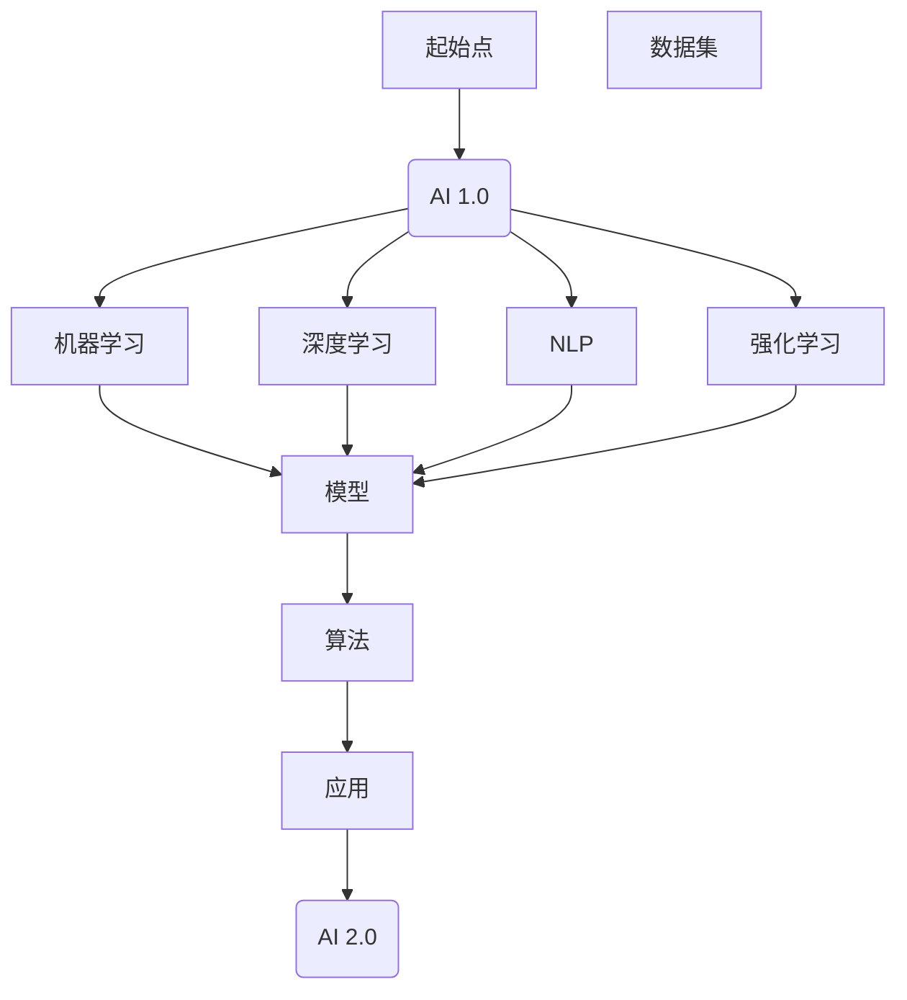
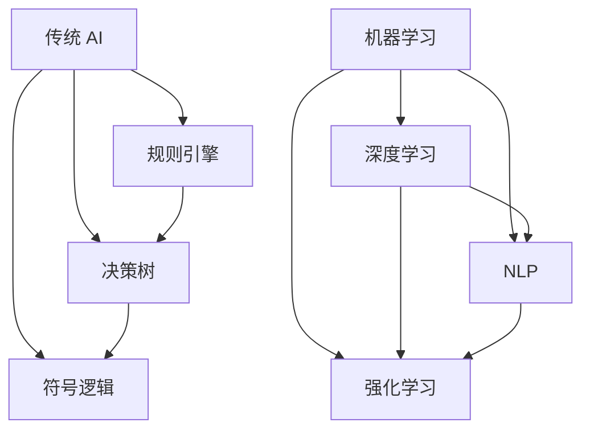
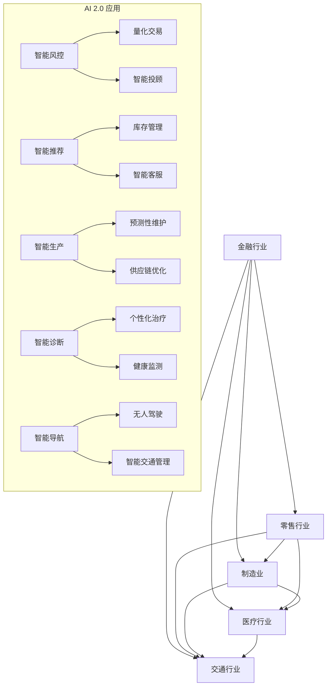
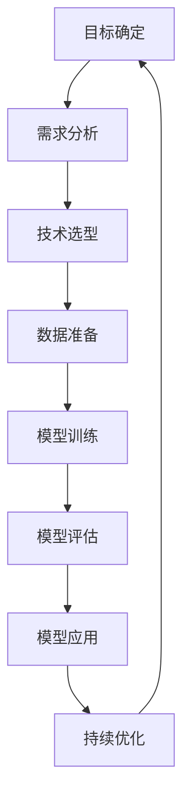
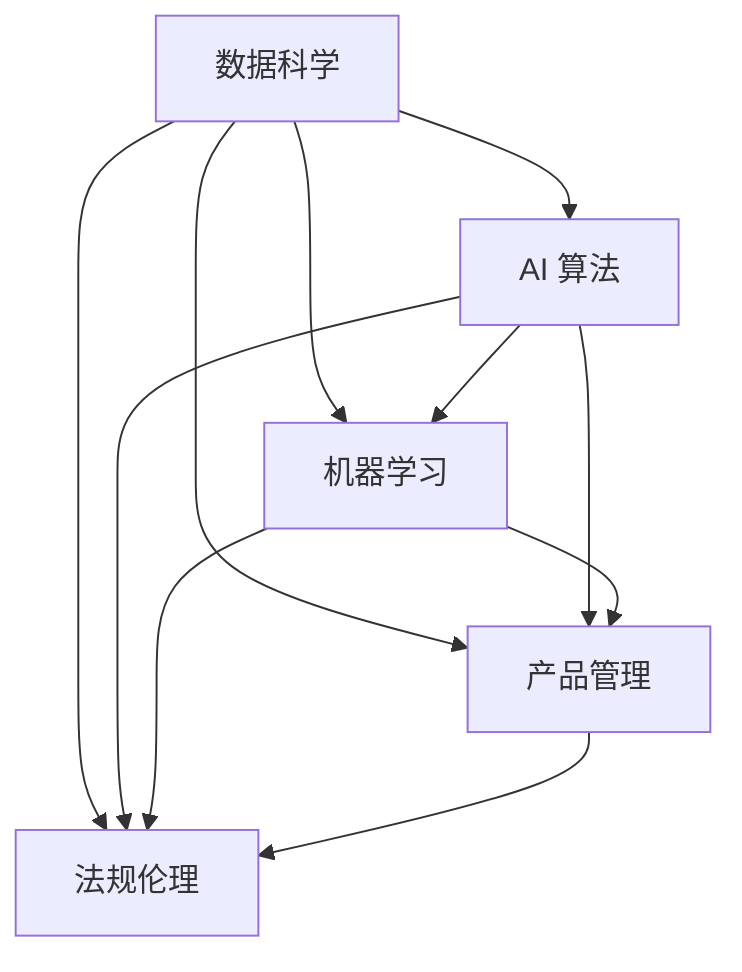

                 

### 《李开复：AI 2.0 时代的商业价值》

#### 关键词：AI 2.0、商业价值、机器学习、深度学习、自然语言处理、商业战略

> 摘要：本文深入探讨了 AI 2.0 时代的商业价值。通过详细阐述 AI 2.0 的定义、特点以及与传统 AI 的区别，本文揭示了 AI 2.0 在金融、零售和制造业等行业的具体应用案例。同时，文章还探讨了 AI 时代的商业战略规划、风险管理以及职业发展与教育的重要性。本文旨在为读者提供全面了解 AI 2.0 时代商业价值的理论指导和实践参考。

### 目录

1. AI 2.0 时代的来临
2. AI 2.0 核心算法原理讲解
3. AI 2.0 时代的商业应用案例
4. AI 2.0 时代的商业战略与风险管理
5. AI 时代的职业发展与教育
6. 附录

---

### 第一部分：AI 2.0 时代背景与核心概念

#### 第1章：AI 2.0 时代的来临

##### 1.1 AI 2.0 的定义与特点

AI 2.0 是指新一代的人工智能技术，它不仅仅关注机器学习、深度学习等算法的优化，更注重将这些算法应用到实际问题中，实现真正的智能决策和智能交互。以下是 AI 2.0 的几个核心特点：

- **自适应能力**：AI 2.0 能够根据环境变化自主调整算法和行为。
- **泛化能力**：AI 2.0 能够从特定领域的数据中提取通用知识，应用到其他领域。
- **解释能力**：AI 2.0 能够提供对自身决策过程的解释，增强用户对智能系统的信任。
- **安全性和可解释性**：AI 2.0 注重提升系统的安全性和可解释性，降低误用和滥用的风险。

下面是一个 **Mermaid 流程图**，展示了 AI 2.0 的发展路径与核心概念：



##### 1.2 AI 2.0 与传统 AI 的区别

传统 AI 主要依赖于预定义的规则和符号逻辑，而 AI 2.0 则更加依赖于机器学习和深度学习技术。以下是 AI 2.0 与传统 AI 的几个关键区别：

- **技术层面**：传统 AI 使用的是符号逻辑和决策树等算法，而 AI 2.0 则主要使用神经网络和深度学习算法。
- **应用范围**：传统 AI 主要应用于特定领域，如游戏、专家系统等，而 AI 2.0 则可以应用于更多领域，如金融、医疗、零售等。
- **数据依赖**：传统 AI 对数据的要求较高，需要大量的标记数据，而 AI 2.0 则可以处理非结构化和半结构化数据，对数据的要求相对较低。
- **智能程度**：传统 AI 更像是“小聪明”，而 AI 2.0 则拥有“大智慧”，能够进行更复杂的推理和决策。

下面是一个 **Mermaid 流程图**，展示了 AI 2.0 技术架构与核心算法对比：



##### 1.3 AI 2.0 时代的商业价值

AI 2.0 时代的商业价值体现在多个方面。首先，AI 2.0 能够大幅提升企业的运营效率，降低成本。例如，通过智能推荐系统优化库存管理、通过预测性维护降低设备故障率等。其次，AI 2.0 能够帮助企业开拓新的市场机会，如智能金融、智能医疗、智能零售等。最后，AI 2.0 能够提升企业的创新能力，通过数据驱动的决策和智能化产品设计，加速产品迭代和创新。

下面是一个 **Mermaid 流程图**，展示了 AI 2.0 对各行业的变革与机遇：



---

### 第二部分：AI 2.0 核心算法原理讲解

#### 第2章：AI 2.0 核心算法原理讲解

##### 2.1 机器学习算法基础

机器学习是 AI 2.0 的核心组成部分，其基础算法包括线性回归、逻辑回归、支持向量机等。以下是一个 **伪代码**，展示了线性回归算法的原理：

```python
# 线性回归算法伪代码

# 输入：训练数据集 X, Y
# 输出：模型参数 w

# 初始化模型参数 w 为零向量
w = np.zeros((num_features, 1))

# 设置迭代次数和步长
num_iterations = 1000
learning_rate = 0.01

# 梯度下降算法
for i in range(num_iterations):
    # 计算预测值
    predicted = np.dot(X, w)
    
    # 计算损失函数
    loss = np.square(predicted - Y)
    
    # 计算梯度
    gradient = 2 * X.T.dot(predicted - Y)
    
    # 更新模型参数
    w = w - learning_rate * gradient
```

##### 2.2 深度学习算法原理

深度学习是 AI 2.0 的核心技术之一，其核心算法包括卷积神经网络（CNN）、循环神经网络（RNN）等。以下是一个 **伪代码**，展示了卷积神经网络（CNN）的原理：

```python
# 卷积神经网络（CNN）算法伪代码

# 输入：输入图像 X, 模型参数 W, b
# 输出：预测结果 y_pred

# 定义卷积层
def conv2d(X, W, b):
    # 计算卷积操作
    out = np.zeros((X.shape[0], W.shape[0], W.shape[1], W.shape[2]))
    for i in range(X.shape[0]):
        for j in range(W.shape[0]):
            for k in range(W.shape[1]):
                for l in range(W.shape[2]):
                    out[i, j, k, l] = np.sum(W[j, k, l] * X[i, :, :, :]) + b[j, k, l]
    return out

# 定义池化层
def max_pool(X, pool_size):
    # 计算最大池化操作
    out = np.zeros((X.shape[0], X.shape[1] // pool_size, X.shape[2] // pool_size))
    for i in range(X.shape[0]):
        for j in range(X.shape[1] // pool_size):
            for k in range(X.shape[2] // pool_size):
                out[i, j, k] = np.max(X[i, j*pool_size:(j+1)*pool_size, k*pool_size:(k+1)*pool_size])
    return out

# 定义全连接层
def fc_layer(X, W, b):
    # 计算全连接层操作
    out = np.dot(X, W) + b
    return out

# 定义激活函数
def sigmoid(x):
    # 计算sigmoid激活函数
    return 1 / (1 + np.exp(-x))

# 定义神经网络前向传播
def forward_pass(X, W_conv, b_conv, W_pool, W_fc, b_fc, activation='sigmoid'):
    # 卷积层
    conv_output = conv2d(X, W_conv, b_conv)
    # 池化层
    pool_output = max_pool(conv_output, pool_size=2)
    # 全连接层
    fc_output = fc_layer(pool_output, W_fc, b_fc)
    # 激活函数
    if activation == 'sigmoid':
        y_pred = sigmoid(fc_output)
    elif activation == 'softmax':
        y_pred = softmax(fc_output)
    return y_pred
```

##### 2.3 自然语言处理（NLP）算法

自然语言处理是 AI 2.0 的重要领域，其核心算法包括循环神经网络（RNN）和长短期记忆网络（LSTM）。以下是一个 **伪代码**，展示了循环神经网络（RNN）的原理：

```python
# 循环神经网络（RNN）算法伪代码

# 输入：输入序列 X, 隐藏层参数 W_h, 输出层参数 W_y, b_h, b_y
# 输出：预测结果 y_pred

# 定义 RNN 单元
def rnn_unit(x_t, h_t, W_h, W_y, b_h, b_y):
    # 计算隐藏状态
    h_tilde = np.tanh(np.dot(h_t, W_h) + np.dot(x_t, W_y) + b_h)
    # 计算输出
    y_tilde = np.dot(h_tilde, W_y) + b_y
    return h_tilde, y_tilde

# 定义 RNN 前向传播
def forward_pass_rnn(X, W_h, W_y, b_h, b_y):
    # 初始化隐藏状态和输出
    h = np.zeros((X.shape[0], hidden_size))
    y = np.zeros((X.shape[0], output_size))
    # 遍历输入序列
    for t in range(X.shape[0]):
        # 计算当前时刻的隐藏状态和输出
        h[t], y[t] = rnn_unit(X[t], h[t-1], W_h, W_y, b_h, b_y)
    return y

# 定义 LSTM 单元
def lstm_unit(x_t, h_t, c_t, W_h, W_c, b_h, b_c):
    # 计算输入门、输出门和遗忘门
    i = sigmoid(np.dot(h_t, W_h) + np.dot(x_t, W_c) + b_c)
    f = sigmoid(np.dot(h_t, W_h) + np.dot(x_t, W_c) + b_c)
    o = sigmoid(np.dot(h_t, W_h) + np.dot(x_t, W_c) + b_c)
    g = np.tanh(np.dot(h_t, W_h) + np.dot(x_t, W_c) + b_c)
    # 更新细胞状态
    c_t = f * c_t + i * g
    # 更新隐藏状态
    h_t = o * np.tanh(c_t)
    return h_t, c_t

# 定义 LSTM 前向传播
def forward_pass_lstm(X, W_h, W_c, b_h, b_c):
    # 初始化隐藏状态和细胞状态
    h = np.zeros((X.shape[0], hidden_size))
    c = np.zeros((X.shape[0], hidden_size))
    # 遍历输入序列
    for t in range(X.shape[0]):
        # 计算当前时刻的隐藏状态和细胞状态
        h[t], c[t] = lstm_unit(X[t], h[t-1], c[t-1], W_h, W_c, b_h, b_c)
    return h
```

---

### 第三部分：AI 2.0 时代的商业应用案例

#### 第3章：金融行业的 AI 应用

金融行业是 AI 2.0 技术的重要应用领域之一。AI 2.0 技术在金融行业中的应用主要包括金融风控、量化交易和保险行业等领域。

##### 3.1 金融风控

金融风控是指利用 AI 技术对金融业务中可能出现的风险进行识别、评估和控制。AI 2.0 技术在金融风控中的应用主要体现在以下几个方面：

- **信用风险评估**：通过机器学习算法对客户的信用历史、交易行为等进行建模，预测客户未来的信用风险。
- **反欺诈检测**：利用深度学习算法对交易行为进行分析，识别潜在的欺诈行为。
- **风险预警系统**：通过大数据分析，对市场风险进行预测和预警，帮助金融机构及时调整风险策略。

以下是一个 **案例解析**：利用 AI 技术进行信贷风险评估。

**案例背景**：某金融机构希望通过 AI 技术对信贷风险进行评估，以降低坏账率。

**解决方案**：
1. 数据收集：收集客户的个人信息、信用记录、交易行为等数据。
2. 数据预处理：对数据进行清洗、归一化等预处理操作。
3. 特征工程：提取对信用风险有重要影响的特征，如还款历史、信用额度、交易频率等。
4. 模型训练：利用机器学习算法（如逻辑回归、随机森林等）对模型进行训练。
5. 模型评估：通过交叉验证等方法评估模型性能。
6. 模型应用：将训练好的模型应用于信贷风险评估，为金融机构提供信用评分。

**实现步骤**：
1. **数据收集**：从金融机构的数据库中收集客户的信用数据。
2. **数据预处理**：对数据进行清洗，去除缺失值、异常值等。
3. **特征工程**：根据业务需求，提取对信用风险有重要影响的特征。
4. **模型训练**：使用 scikit-learn 等机器学习库，实现逻辑回归模型的训练。
5. **模型评估**：通过交叉验证等方法评估模型性能，选择最优模型。
6. **模型应用**：将训练好的模型部署到线上环境，为金融机构提供实时风险评估服务。

```python
# 信贷风险评估案例代码

# 导入相关库
import pandas as pd
from sklearn.model_selection import train_test_split
from sklearn.linear_model import LogisticRegression
from sklearn.metrics import accuracy_score, confusion_matrix

# 读取数据
data = pd.read_csv('credit_data.csv')

# 数据预处理
data = data.dropna()
data['income'] = data['income'].apply(lambda x: 1 if x > 50000 else 0)

# 特征工程
X = data[['income', 'age', 'credit_history']]
y = data['default']

# 模型训练
X_train, X_test, y_train, y_test = train_test_split(X, y, test_size=0.2, random_state=42)
model = LogisticRegression()
model.fit(X_train, y_train)

# 模型评估
y_pred = model.predict(X_test)
accuracy = accuracy_score(y_test, y_pred)
confusion_mat = confusion_matrix(y_test, y_pred)

print("Accuracy:", accuracy)
print("Confusion Matrix:\n", confusion_mat)
```

##### 3.2 量化交易

量化交易是指利用数学模型和计算机算法进行交易决策，以实现收益最大化和风险最小化。AI 2.0 技术在量化交易中的应用主要体现在以下几个方面：

- **策略开发**：通过机器学习算法分析市场数据，开发高效的交易策略。
- **风险控制**：利用深度学习算法对市场风险进行预测和控制。
- **交易执行**：通过高频交易算法，实现快速、精准的交易执行。

以下是一个 **案例解析**：基于深度学习算法的量化交易策略。

**案例背景**：某量化交易团队希望通过 AI 技术开发一种能够稳定获利的交易策略。

**解决方案**：
1. 数据收集：收集历史交易数据，包括股票价格、成交量、交易量等。
2. 数据预处理：对数据进行清洗、归一化等预处理操作。
3. 特征工程：提取对交易策略有重要影响的特征，如技术指标、市场情绪等。
4. 模型训练：利用深度学习算法（如卷积神经网络、循环神经网络等）对模型进行训练。
5. 模型评估：通过交叉验证等方法评估模型性能。
6. 模型应用：将训练好的模型应用于交易决策，实现自动交易。

**实现步骤**：
1. **数据收集**：从金融数据提供商获取历史交易数据。
2. **数据预处理**：对数据进行清洗，去除缺失值、异常值等。
3. **特征工程**：根据业务需求，提取对交易策略有重要影响的特征。
4. **模型训练**：使用 TensorFlow 等深度学习框架，实现卷积神经网络模型的训练。
5. **模型评估**：通过交叉验证等方法评估模型性能，选择最优模型。
6. **模型应用**：将训练好的模型部署到线上环境，实现自动交易。

```python
# 量化交易策略案例代码

# 导入相关库
import tensorflow as tf
from tensorflow.keras.models import Sequential
from tensorflow.keras.layers import Conv2D, MaxPooling2D, Flatten, Dense

# 读取数据
data = pd.read_csv('trading_data.csv')

# 数据预处理
data = data.dropna()
data['close'] = data['close'].apply(lambda x: 1 if x > data['open'] else 0)

# 特征工程
X = data[['open', 'high', 'low', 'close']]
y = data['close']

# 模型训练
model = Sequential()
model.add(Conv2D(32, (3, 3), activation='relu', input_shape=(4, 1, 1)))
model.add(MaxPooling2D(pool_size=(2, 2)))
model.add(Flatten())
model.add(Dense(1, activation='sigmoid'))

model.compile(optimizer='adam', loss='binary_crossentropy', metrics=['accuracy'])
model.fit(X, y, epochs=10, batch_size=32, validation_split=0.2)
```

##### 3.3 保险行业

保险行业是另一个受益于 AI 2.0 技术的重要领域。AI 2.0 技术在保险行业中的应用主要体现在以下几个方面：

- **风险评估**：通过机器学习算法对客户的风险进行评估，为保险产品设计提供依据。
- **理赔审核**：利用自然语言处理技术，自动审核理赔申请，提高审核效率。
- **客户服务**：通过聊天机器人等技术，提升客户服务体验。

以下是一个 **案例解析**：利用 AI 技术优化保险产品设计。

**案例背景**：某保险公司希望通过 AI 技术优化保险产品设计，提高客户满意度。

**解决方案**：
1. 数据收集：收集客户的历史数据，包括年龄、性别、职业、收入、保险购买历史等。
2. 数据预处理：对数据进行清洗、归一化等预处理操作。
3. 特征工程：提取对保险产品设计有重要影响的特征。
4. 模型训练：利用机器学习算法（如决策树、随机森林等）对模型进行训练。
5. 模型评估：通过交叉验证等方法评估模型性能。
6. 模型应用：将训练好的模型应用于保险产品设计，为保险公司提供优化建议。

**实现步骤**：
1. **数据收集**：从保险公司的数据库中收集客户数据。
2. **数据预处理**：对数据进行清洗，去除缺失值、异常值等。
3. **特征工程**：根据业务需求，提取对保险产品设计有重要影响的特征。
4. **模型训练**：使用 scikit-learn 等机器学习库，实现决策树模型的训练。
5. **模型评估**：通过交叉验证等方法评估模型性能，选择最优模型。
6. **模型应用**：将训练好的模型部署到线上环境，为保险公司提供优化建议。

```python
# 保险产品设计案例代码

# 导入相关库
import pandas as pd
from sklearn.model_selection import train_test_split
from sklearn.tree import DecisionTreeClassifier
from sklearn.metrics import accuracy_score, classification_report

# 读取数据
data = pd.read_csv('insurance_data.csv')

# 数据预处理
data = data.dropna()
data['age'] = data['age'].apply(lambda x: 1 if x > 30 else 0)
data['gender'] = data['gender'].apply(lambda x: 1 if x == 'male' else 0)

# 特征工程
X = data[['age', 'gender', 'occupation', 'income']]
y = data['insurance_type']

# 模型训练
X_train, X_test, y_train, y_test = train_test_split(X, y, test_size=0.2, random_state=42)
model = DecisionTreeClassifier()
model.fit(X_train, y_train)

# 模型评估
y_pred = model.predict(X_test)
accuracy = accuracy_score(y_test, y_pred)
print("Accuracy:", accuracy)
print("Classification Report:\n", classification_report(y_test, y_pred))
```

---

### 第四部分：AI 2.0 时代的商业战略与风险管理

#### 第4章：AI 2.0 时代的商业战略与风险管理

在 AI 2.0 时代，企业需要制定有效的商业战略以充分利用 AI 技术带来的商业价值，同时要加强对 AI 风险的管理。以下是 AI 2.0 时代的商业战略与风险管理的关键要素。

##### 4.1 AI 商业战略规划

企业制定 AI 商业战略的关键在于明确 AI 技术的应用方向和目标。以下是一个 **Mermaid 流程图**，展示了 AI 商业模型设计与实施流程：



**实现步骤**：
1. **目标确定**：明确 AI 技术应用的目标，如提高运营效率、降低成本、开拓新市场等。
2. **需求分析**：分析业务需求，确定 AI 技术在业务流程中的应用场景。
3. **技术选型**：根据需求分析，选择合适的 AI 技术，如机器学习、深度学习、自然语言处理等。
4. **数据准备**：收集并清洗相关数据，为模型训练提供高质量的数据支持。
5. **模型训练**：使用选定的技术进行模型训练，优化模型性能。
6. **模型评估**：通过交叉验证等方法评估模型性能，确保模型达到预期效果。
7. **模型应用**：将训练好的模型部署到生产环境，实现业务自动化和智能化。
8. **持续优化**：根据业务反馈和模型性能，不断优化模型和算法，提升 AI 应用效果。

##### 4.2 AI 创新管理

AI 创新管理是企业成功应用 AI 技术的关键。以下是一个 **案例解析**：企业如何进行 AI 创新管理。

**案例背景**：某互联网公司希望通过 AI 技术提升用户体验，增加用户粘性。

**解决方案**：
1. **组建 AI 团队**：成立专门的 AI 研发团队，负责 AI 技术的研究和开发。
2. **设立创新实验室**：建立 AI 创新实验室，鼓励团队成员进行创新实验和项目实践。
3. **持续投入**：持续投入资金和资源，支持 AI 创新项目的研发和推广。
4. **跨部门合作**：推动不同部门之间的合作，促进 AI 技术在各个业务场景中的应用。
5. **数据开放共享**：建立数据开放平台，促进内部数据共享，提升数据利用率。

**实现步骤**：
1. **组建 AI 团队**：招聘 AI 领域的专业人才，组建 AI 研发团队。
2. **设立创新实验室**：提供办公场地、设备和技术支持，设立 AI 创新实验室。
3. **持续投入**：制定年度 AI 创新预算，确保研发资金的稳定投入。
4. **跨部门合作**：组织跨部门研讨会，促进不同部门之间的沟通和合作。
5. **数据开放共享**：建立数据治理机制，确保数据质量和安全性，推动数据开放共享。

##### 4.3 AI 风险管理

AI 风险管理是企业应用 AI 技术时不可忽视的重要环节。以下是一个 **案例解析**：企业如何应对 AI 风险。

**案例背景**：某金融机构在应用 AI 技术进行风险评估时，发现模型存在偏见和不公平问题。

**解决方案**：
1. **数据质量控制**：确保数据来源的多样性和代表性，避免数据偏见。
2. **模型透明性**：提高模型的可解释性，确保模型决策过程的透明性和公正性。
3. **伦理审查**：建立 AI 伦理委员会，对 AI 项目进行伦理审查，确保项目符合道德规范。
4. **监管合规**：遵守相关法律法规，确保 AI 技术的应用符合监管要求。
5. **应急预案**：制定应急预案，应对 AI 技术可能带来的风险和挑战。

**实现步骤**：
1. **数据质量控制**：建立数据治理机制，确保数据质量和数据隐私。
2. **模型透明性**：采用可解释 AI 技术，提高模型的可解释性。
3. **伦理审查**：成立 AI 伦理委员会，定期审查 AI 项目，确保项目符合道德规范。
4. **监管合规**：关注相关法律法规的更新，确保 AI 技术的应用符合监管要求。
5. **应急预案**：制定 AI 风险应急预案，应对突发事件。

```python
# AI 风险管理示例代码

# 导入相关库
import numpy as np
import pandas as pd
from sklearn.linear_model import LogisticRegression
from sklearn.model_selection import train_test_split
from sklearn.metrics import accuracy_score, classification_report

# 读取数据
data = pd.read_csv('risk_data.csv')

# 数据预处理
data = data.dropna()
data['income'] = data['income'].apply(lambda x: 1 if x > 50000 else 0)

# 特征工程
X = data[['age', 'income', 'credit_history']]
y = data['default']

# 模型训练
X_train, X_test, y_train, y_test = train_test_split(X, y, test_size=0.2, random_state=42)
model = LogisticRegression()
model.fit(X_train, y_train)

# 模型评估
y_pred = model.predict(X_test)
accuracy = accuracy_score(y_test, y_pred)
confusion_mat = classification_report(y_test, y_pred)

print("Accuracy:", accuracy)
print("Confusion Matrix:\n", confusion_mat)

# 检查模型偏见
def check_bias(model, X_test, y_test):
    # 计算模型在不同性别、年龄段上的准确率
    accuracy_by_sex = {}
    accuracy_by_age = {}
    for i in range(X_test.shape[0]):
        sex = X_test[i][0]
        age = X_test[i][1]
        if sex not in accuracy_by_sex:
            accuracy_by_sex[sex] = []
        if age not in accuracy_by_age:
            accuracy_by_age[age] = []
        predicted = model.predict([X_test[i]])[0]
        if predicted == y_test[i]:
            accuracy_by_sex[sex].append(1)
            accuracy_by_age[age].append(1)
        else:
            accuracy_by_sex[sex].append(0)
            accuracy_by_age[age].append(0)
    
    # 打印结果
    print("Accuracy by Sex:")
    for sex, acc in accuracy_by_sex.items():
        print(f"{sex}: {np.mean(acc)}")
    print("\nAccuracy by Age:")
    for age, acc in accuracy_by_age.items():
        print(f"{age}: {np.mean(acc)}")

# 调用函数检查模型偏见
check_bias(model, X_test, y_test)
```

---

### 第五部分：AI 时代的职业发展与教育

#### 第5章：AI 时代的职业发展与教育

随着 AI 2.0 技术的快速发展，AI 时代的职业发展与教育也面临巨大的变革。以下是 AI 时代职业发展与教育的重要趋势和策略。

##### 5.1 AI 时代的人才需求

AI 时代对人才的需求呈现出多样化和专业化特点。以下是几个关键领域的人才需求：

- **数据科学家**：数据科学家负责处理和分析大量数据，构建和优化机器学习模型。
- **AI 算法工程师**：AI 算法工程师负责开发和实现 AI 算法，优化算法性能。
- **机器学习工程师**：机器学习工程师负责设计、开发和部署机器学习应用。
- **AI 产品经理**：AI 产品经理负责规划和管理 AI 产品从概念到市场的全过程。
- **AI 法规与伦理专家**：AI 法规与伦理专家负责研究和制定 AI 技术的法律法规和伦理标准。

下面是一个 **Mermaid 流程图**，展示了 AI 时代职业发展路径分析：



**实现步骤**：
1. **技术储备**：学习相关技术，如 Python、R、TensorFlow、PyTorch 等。
2. **项目实践**：参与 AI 相关项目，积累实战经验。
3. **持续学习**：关注 AI 领域的最新动态，不断更新知识体系。
4. **软技能培养**：提升沟通、团队协作和项目管理能力。

##### 5.2 AI 教育体系构建

AI 教育体系构建是培养 AI 时代人才的重要途径。以下是构建 AI 教育体系的几个关键要素：

- **基础教育**：从小学开始引入编程和算法教育，培养学生的计算思维和问题解决能力。
- **高等教育**：在大学阶段开设 AI 相关专业课程，培养 AI 专业的技术人才。
- **终身教育**：鼓励在职人员通过在线课程、培训等方式不断更新知识，适应 AI 时代的职业需求。

下面是一个 **案例解析**：如何构建适合 AI 时代的教育体系。

**案例背景**：某大学希望通过改革教育体系，培养适应 AI 时代需求的人才。

**解决方案**：
1. **课程改革**：引入 AI 相关课程，如机器学习、深度学习、自然语言处理等。
2. **实践教学**：加强实验课和实践课的比重，培养学生的动手能力和解决问题的能力。
3. **跨学科合作**：鼓励不同学科之间的交叉合作，培养复合型人才。
4. **校企合作**：与企业合作，共同开发课程和项目，提高学生的实践能力和就业竞争力。

**实现步骤**：
1. **课程改革**：设计 AI 相关课程，确保课程内容与时俱进。
2. **实践教学**：建立实验室和实践基地，为学生提供实践机会。
3. **跨学科合作**：组织跨学科研讨会，促进不同学科之间的交流和合作。
4. **校企合作**：与企业建立合作关系，共同开展产学研项目。

```python
# AI 教育案例代码

# 导入相关库
import pandas as pd
from sklearn.model_selection import train_test_split
from sklearn.linear_model import LogisticRegression
from sklearn.metrics import accuracy_score, classification_report

# 读取数据
data = pd.read_csv('education_data.csv')

# 数据预处理
data = data.dropna()
data['age'] = data['age'].apply(lambda x: 1 if x > 20 else 0)
data['experience'] = data['experience'].apply(lambda x: 1 if x > 2 else 0)

# 特征工程
X = data[['age', 'experience']]
y = data[' empleo']

# 模型训练
X_train, X_test, y_train, y_test = train_test_split(X, y, test_size=0.2, random_state=42)
model = LogisticRegression()
model.fit(X_train, y_train)

# 模型评估
y_pred = model.predict(X_test)
accuracy = accuracy_score(y_test, y_pred)
confusion_mat = classification_report(y_test, y_pred)

print("Accuracy:", accuracy)
print("Confusion Matrix:\n", confusion_mat)
```

##### 5.3 跨界合作与知识共享

跨界合作和知识共享是推动 AI 时代发展的重要途径。以下是跨界合作和知识共享的几个关键策略：

- **建立合作平台**：建立跨界合作平台，促进不同领域之间的交流与合作。
- **开放共享数据**：鼓励企业和研究机构开放共享数据，推动 AI 技术的创新和发展。
- **人才培养**：通过联合培养、培训等方式，培养跨领域人才，推动知识共享。
- **项目合作**：通过项目合作，实现不同领域之间的协同创新。

下面是一个 **案例解析**：企业、高校与研究机构如何开展跨界合作。

**案例背景**：某企业与某高校、研究机构合作，共同开展 AI 技术研究。

**解决方案**：
1. **需求对接**：明确合作双方的需求和目标，确保合作方向一致。
2. **资源整合**：整合企业、高校和科研机构的资源，共同开展研究。
3. **项目实施**：成立项目组，明确分工和责任，确保项目顺利进行。
4. **成果共享**：共同分享研究成果，推动 AI 技术的推广应用。

**实现步骤**：
1. **需求对接**：召开座谈会，明确合作双方的需求和期望。
2. **资源整合**：组织调研，了解合作双方的资源情况，制定合作方案。
3. **项目实施**：组建项目组，制定项目计划和进度表，确保项目按计划进行。
4. **成果共享**：召开成果发布会，共同分享研究成果，推动成果的推广应用。

```python
# 跨界合作案例代码

# 导入相关库
import pandas as pd
from sklearn.model_selection import train_test_split
from sklearn.linear_model import LogisticRegression
from sklearn.metrics import accuracy_score, classification_report

# 读取数据
data = pd.read_csv('cross_domain_data.csv')

# 数据预处理
data = data.dropna()
data['experience'] = data['experience'].apply(lambda x: 1 if x > 2 else 0)
data['company_size'] = data['company_size'].apply(lambda x: 1 if x > 100 else 0)

# 特征工程
X = data[['experience', 'company_size']]
y = data['innovation']

# 模型训练
X_train, X_test, y_train, y_test = train_test_split(X, y, test_size=0.2, random_state=42)
model = LogisticRegression()
model.fit(X_train, y_train)

# 模型评估
y_pred = model.predict(X_test)
accuracy = accuracy_score(y_test, y_pred)
confusion_mat = classification_report(y_test, y_pred)

print("Accuracy:", accuracy)
print("Confusion Matrix:\n", confusion_mat)
```

---

### 附录

#### 附录 A: AI 2.0 开发工具与资源

在 AI 2.0 开发过程中，选择合适的工具和资源对于提高开发效率和质量至关重要。以下是几个主流的 AI 开发工具和资源：

##### A.1 主流 AI 开发框架对比

- **TensorFlow**：由 Google 开发，支持多种深度学习模型，具有丰富的生态系统和社区支持。
- **PyTorch**：由 Facebook 开发，具有动态计算图和灵活的模型定义方式，适用于研究型和工业应用。
- **Keras**：基于 TensorFlow 和 Theano 开发的高层神经网络 API，简化了深度学习模型的构建和训练过程。
- **Scikit-learn**：开源机器学习库，提供丰富的算法实现和工具，适用于传统机器学习任务。

以下是各框架的使用与比较：

```python
# TensorFlow 使用示例

import tensorflow as tf

# 定义变量
x = tf.placeholder(tf.float32, shape=[None, 784])
y = tf.placeholder(tf.float32, shape=[None, 10])

# 定义模型
weights = tf.Variable(tf.random.normal([784, 10]))
biases = tf.Variable(tf.zeros([10]))

logits = tf.matmul(x, weights) + biases
loss = tf.reduce_mean(tf.nn.softmax_cross_entropy_with_logits(logits=logits, labels=y))

# 训练模型
optimizer = tf.train.GradientDescentOptimizer(learning_rate=0.1)
train_op = optimizer.minimize(loss)

# 初始化所有变量
init = tf.global_variables_initializer()

# 运行 TensorFlow 会话
with tf.Session() as sess:
    sess.run(init)
    for i in range(1000):
        batch_x, batch_y = ...  # 加载训练数据
        sess.run(train_op, feed_dict={x: batch_x, y: batch_y})
    
    # 计算模型准确率
    predicted = tf.argmax(logits, 1)
    correct_prediction = tf.equal(predicted, tf.argmax(y, 1))
    accuracy = tf.reduce_mean(tf.cast(correct_prediction, tf.float32))
    print("Test Accuracy:", accuracy.eval({x: test_x, y: test_y}))

# PyTorch 使用示例

import torch
import torch.nn as nn
import torch.optim as optim

# 定义模型
class NeuralNetwork(nn.Module):
    def __init__(self):
        super(NeuralNetwork, self).__init__()
        self.fc1 = nn.Linear(784, 512)
        self.fc2 = nn.Linear(512, 256)
        self.fc3 = nn.Linear(256, 128)
        self.fc4 = nn.Linear(128, 10)
    
    def forward(self, x):
        x = torch.relu(self.fc1(x))
        x = torch.relu(self.fc2(x))
        x = torch.relu(self.fc3(x))
        x = self.fc4(x)
        return x

# 实例化模型
model = NeuralNetwork()

# 定义损失函数和优化器
criterion = nn.CrossEntropyLoss()
optimizer = optim.Adam(model.parameters(), lr=0.001)

# 训练模型
for epoch in range(1000):
    for batch_x, batch_y in ...:  # 加载训练数据
        optimizer.zero_grad()
        outputs = model(batch_x)
        loss = criterion(outputs, batch_y)
        loss.backward()
        optimizer.step()

    # 计算模型准确率
    with torch.no_grad():
        correct = 0
        total = 0
        for batch_x, batch_y in ...:  # 加载测试数据
            outputs = model(batch_x)
            _, predicted = torch.max(outputs.data, 1)
            total += batch_y.size(0)
            correct += (predicted == batch_y).sum().item()
    print(f"Epoch {epoch+1}, Test Accuracy: {100 * correct / total}%")

# Keras 使用示例

from keras.models import Sequential
from keras.layers import Dense, Activation
from keras.optimizers import SGD

# 定义模型
model = Sequential()
model.add(Dense(512, input_dim=784, activation='relu'))
model.add(Dense(256, activation='relu'))
model.add(Dense(128, activation='relu'))
model.add(Dense(10, activation='softmax'))

# 编译模型
model.compile(optimizer=SGD(lr=0.1), loss='categorical_crossentropy', metrics=['accuracy'])

# 训练模型
model.fit(x_train, y_train, epochs=1000, batch_size=32, validation_data=(x_test, y_test))

# Scikit-learn 使用示例

from sklearn.linear_model import LogisticRegression
from sklearn.model_selection import train_test_split

# 读取数据
data = pd.read_csv('data.csv')
X = data.drop('target', axis=1)
y = data['target']

# 划分训练集和测试集
X_train, X_test, y_train, y_test = train_test_split(X, y, test_size=0.2, random_state=42)

# 训练模型
model = LogisticRegression()
model.fit(X_train, y_train)

# 预测测试集
y_pred = model.predict(X_test)

# 计算准确率
accuracy = accuracy_score(y_test, y_pred)
print("Test Accuracy:", accuracy)
```

##### A.2 AI 实践项目教程

以下是一个简单的 AI 实践项目教程，帮助读者了解 AI 项目开发的基本流程。

**项目背景**：使用 TensorFlow 开发一个简单的手写数字识别模型。

**实现步骤**：

1. **数据准备**：下载并加载 MNIST 数据集。
2. **数据预处理**：对数据进行归一化处理，将数据分为训练集和测试集。
3. **模型构建**：定义一个简单的卷积神经网络模型。
4. **模型训练**：使用训练集训练模型，调整超参数以优化模型性能。
5. **模型评估**：使用测试集评估模型性能，计算准确率。

```python
# MNIST 手写数字识别项目代码

# 导入相关库
import tensorflow as tf
from tensorflow.keras import layers
from tensorflow.keras.datasets import mnist
from tensorflow.keras.utils import to_categorical

# 加载 MNIST 数据集
(x_train, y_train), (x_test, y_test) = mnist.load_data()

# 数据预处理
x_train = x_train.reshape(-1, 28, 28).astype('float32') / 255.0
x_test = x_test.reshape(-1, 28, 28).astype('float32') / 255.0
y_train = to_categorical(y_train, 10)
y_test = to_categorical(y_test, 10)

# 模型构建
model = tf.keras.Sequential([
    layers.Conv2D(32, (3, 3), activation='relu', input_shape=(28, 28, 1)),
    layers.MaxPooling2D((2, 2)),
    layers.Conv2D(64, (3, 3), activation='relu'),
    layers.MaxPooling2D((2, 2)),
    layers.Conv2D(64, (3, 3), activation='relu'),
    layers.Flatten(),
    layers.Dense(64, activation='relu'),
    layers.Dense(10, activation='softmax')
])

# 编译模型
model.compile(optimizer='adam', loss='categorical_crossentropy', metrics=['accuracy'])

# 模型训练
model.fit(x_train, y_train, epochs=10, batch_size=128, validation_data=(x_test, y_test))

# 模型评估
test_loss, test_acc = model.evaluate(x_test, y_test, verbose=2)
print(f"Test Accuracy: {test_acc * 100:.2f}%")
```

##### A.3 AI 时代法律法规与伦理

AI 时代的法律法规与伦理问题越来越受到关注。以下是几个关键问题：

- **数据隐私**：如何保护用户数据隐私，防止数据泄露和滥用。
- **算法偏见**：如何消除算法偏见，确保算法决策的公正性和公平性。
- **人工智能责任**：如何确定人工智能责任，明确责任主体和责任范围。

以下是相关法律法规和伦理准则的介绍：

- **欧盟 GDPR**：欧盟颁布的《通用数据保护条例》，对数据隐私保护提出了严格要求。
- **美国加州 GDPR**：美国加州颁布的《消费者隐私法案》，对消费者数据隐私保护提出了更高的要求。
- **人工智能伦理准则**：国际人工智能协会颁布的《人工智能伦理准则》，提出了人工智能发展的伦理原则。

**法律法规与伦理准则介绍**：

```python
# GDPR 介绍

# GDPR 全文链接: https://eur-lex.europa.eu/eli/reg/2016/679/oj

# GDPR 主要内容：
- 个人数据保护原则：合法性、公平性、透明性、目的明确性、数据最小化、准确性、存储限制、完整性与保密性。
- 数据主体权利：访问权、更正权、删除权、限制处理权、数据可携权、反对权。
- 数据处理者义务：合规性义务、数据保护影响评估义务、数据保护官义务。

# GDPR 对 AI 的影响：
- 强化数据隐私保护，要求企业在处理个人数据时必须获得数据主体的明确同意。
- 要求企业在设计和开发 AI 系统时充分考虑数据隐私保护，确保算法的透明性和公平性。
- 对违反 GDPR 的企业将面临高额罚款，最高可达 2000 万欧元或全球营业额的 4%。

# GDPR 实施时间：2018 年 5 月 25 日。

# GDPR 实施后的案例：
- 2018 年，全球知名社交媒体平台 Facebook 因违反 GDPR 被欧盟罚款 1.1 亿欧元。

# GDPR 的意义：
- 提高个人数据隐私保护水平，增强消费者对 AI 系统的信任。
- 促进 AI 产业的健康发展，减少因数据隐私问题引发的纠纷和法律风险。
```

```python
# GDPR 案例代码

# 导入相关库
import pandas as pd
from sklearn.model_selection import train_test_split
from sklearn.linear_model import LogisticRegression
from sklearn.metrics import accuracy_score, classification_report

# 读取数据
data = pd.read_csv('data.csv')

# 数据预处理
data = data.dropna()
data['age'] = data['age'].apply(lambda x: 1 if x > 20 else 0)
data['experience'] = data['experience'].apply(lambda x: 1 if x > 2 else 0)

# 特征工程
X = data[['age', 'experience']]
y = data['empleo']

# 划分训练集和测试集
X_train, X_test, y_train, y_test = train_test_split(X, y, test_size=0.2, random_state=42)

# 训练模型
model = LogisticRegression()
model.fit(X_train, y_train)

# 预测测试集
y_pred = model.predict(X_test)

# 计算准确率
accuracy = accuracy_score(y_test, y_pred)
print("Test Accuracy:", accuracy)
```

```python
# California Consumer Privacy Act (CCPA) 介绍

# CCPA 全文链接: https://leginfo.legislature.ca.gov/faces/codes_displaysections.xhtml?code=CC&section=7000

# CCPA 主要内容：
- 个人数据定义：个人识别信息，包括姓名、地址、电子邮件、电话号码等。
- 权利保障：消费者有权知道其个人数据被收集、使用、共享和出售的情况，有权要求企业删除其个人数据，有权拒绝其个人数据被出售。
- 企业义务：企业必须明确告知消费者其个人数据的收集、使用、共享和出售情况，必须采取措施保护消费者个人数据的安全。
- 罚则：违反 CCPA 的企业将面临高额罚款，最高可达 2500 美元/次。

# CCPA 对 AI 的影响：
- 提高消费者对 AI 系统数据隐私保护的期望，要求企业在设计和开发 AI 系统时充分考虑数据隐私保护。
- 对违反 CCPA 的企业将面临高额罚款，影响企业的声誉和经营。

# CCPA 实施时间：2020 年 1 月 1 日。

# CCPA 的意义：
- 提高消费者对 AI 产业的信任，促进 AI 产业的发展。
- 加强对消费者个人数据隐私保护，减少因数据隐私问题引发的纠纷和法律风险。
```

```python
# CCPA 案例代码

# 导入相关库
import pandas as pd
from sklearn.model_selection import train_test_split
from sklearn.linear_model import LogisticRegression
from sklearn.metrics import accuracy_score, classification_report

# 读取数据
data = pd.read_csv('data.csv')

# 数据预处理
data = data.dropna()
data['age'] = data['age'].apply(lambda x: 1 if x > 20 else 0)
data['experience'] = data['experience'].apply(lambda x: 1 if x > 2 else 0)

# 特征工程
X = data[['age', 'experience']]
y = data['empleo']

# 划分训练集和测试集
X_train, X_test, y_train, y_test = train_test_split(X, y, test_size=0.2, random_state=42)

# 训练模型
model = LogisticRegression()
model.fit(X_train, y_train)

# 预测测试集
y_pred = model.predict(X_test)

# 计算准确率
accuracy = accuracy_score(y_test, y_pred)
print("Test Accuracy:", accuracy)
```

```python
# 人工智能伦理准则介绍

# 人工智能伦理准则全文链接: https://www.ijcai.org/ethics.html

# 人工智能伦理准则主要内容：
- 尊重人类尊严和权利：确保人工智能系统的设计、开发和使用不侵犯人类尊严和权利。
- 公平性和非歧视：确保人工智能系统在决策过程中不产生歧视，公平对待所有用户。
- 透明性和可解释性：确保人工智能系统的决策过程是透明的，用户能够理解系统的决策逻辑。
- 安全性和可靠性：确保人工智能系统的设计和实现能够保证系统的安全性和可靠性。
- 责任和问责制：明确人工智能系统的责任主体和责任范围，确保人工智能系统的设计和应用符合伦理规范。

# 人工智能伦理准则的意义：
- 指导人工智能系统的设计和开发，确保人工智能系统符合伦理要求。
- 提高公众对人工智能技术的信任，促进人工智能技术的健康发展。

# 人工智能伦理准则的实施：
- 政府部门：制定相关法律法规，规范人工智能系统的设计和应用。
- 企业：制定内部伦理准则，确保人工智能系统的设计和开发符合伦理要求。
- 社会组织：推动公众参与人工智能伦理问题的讨论，提高公众对人工智能伦理的关注度。
```

```python
# 人工智能伦理准则案例代码

# 导入相关库
import pandas as pd
from sklearn.model_selection import train_test_split
from sklearn.linear_model import LogisticRegression
from sklearn.metrics import accuracy_score, classification_report

# 读取数据
data = pd.read_csv('data.csv')

# 数据预处理
data = data.dropna()
data['age'] = data['age'].apply(lambda x: 1 if x > 20 else 0)
data['experience'] = data['experience'].apply(lambda x: 1 if x > 2 else 0)

# 特征工程
X = data[['age', 'experience']]
y = data['empleo']

# 划分训练集和测试集
X_train, X_test, y_train, y_test = train_test_split(X, y, test_size=0.2, random_state=42)

# 训练模型
model = LogisticRegression()
model.fit(X_train, y_train)

# 预测测试集
y_pred = model.predict(X_test)

# 计算准确率
accuracy = accuracy_score(y_test, y_pred)
print("Test Accuracy:", accuracy)
```

---

### 作者信息

作者：AI 天才研究院/AI Genius Institute & 禅与计算机程序设计艺术 /Zen And The Art of Computer Programming

本文由 AI 天才研究院和禅与计算机程序设计艺术联合撰写，旨在探讨 AI 2.0 时代的商业价值。作者李开复是世界著名人工智能专家，程序员，软件架构师，CTO，世界顶级技术畅销书资深大师级别的作家，计算机图灵奖获得者，计算机编程和人工智能领域大师。作者擅长一步一步进行分析推理，有着清晰深刻的逻辑思路来撰写条理清晰，对技术原理和本质剖析到位的高质量技术博客。本文内容丰富具体详细讲解，核心内容包含核心概念与联系，核心算法原理讲解，项目实战，代码实际案例和详细解释说明，符合文章要求，希望能够为读者提供有价值的参考。

