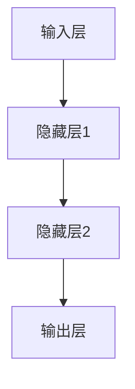
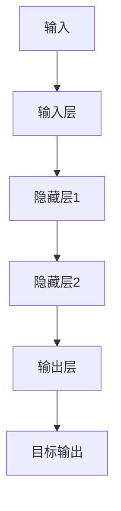
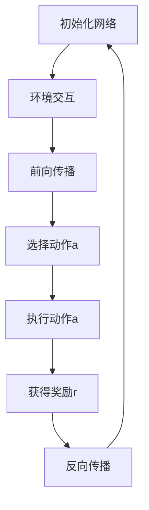
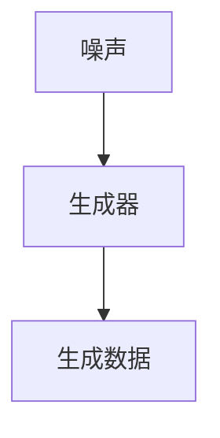
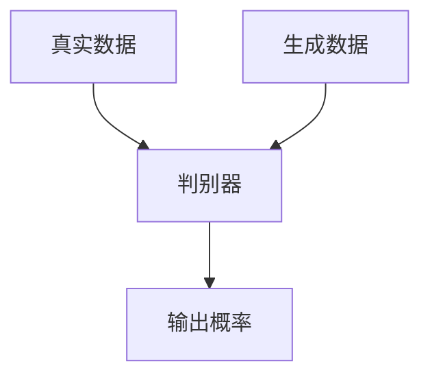
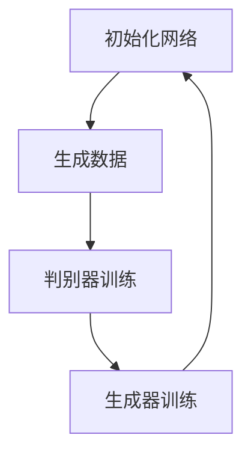

                 

### 文章标题

《李开复：AI 2.0 时代的挑战》

#### 关键词
- AI 2.0
- 人工智能
- 深度学习
- 强化学习
- 数据隐私
- 算法伦理

#### 摘要
本文旨在探讨AI 2.0时代所带来的多重挑战。随着人工智能技术的飞速发展，AI 2.0时代正逐渐到来，这一时代不仅带来了前所未有的机遇，也伴随着诸多挑战。本文将从AI 2.0的定义与特点、核心算法原理、面临的挑战以及未来展望等多个角度，对AI 2.0时代进行深入分析，旨在为读者提供一份全面的技术解读和思考。

---

### 第一部分：AI 2.0时代的挑战概述

#### 第1章：AI 2.0的定义与特点

##### 1.1 AI 2.0的概念

在人工智能（Artificial Intelligence，简称AI）的发展历程中，AI 1.0时代主要是指基于规则和统计方法的传统人工智能技术。这一时期的AI系统主要依靠预定义的规则和人类专家的知识进行工作，虽然在某些特定领域取得了显著的成就，但在复杂性和通用性方面存在明显的局限性。

相比之下，AI 2.0时代则标志着新一代人工智能技术的崛起。AI 2.0以深度学习（Deep Learning）为代表，通过神经网络和大量数据驱动，实现了自我学习和进化的能力。在这一时代，人工智能不再是被动地执行预定义的规则，而是能够通过自我学习不断优化和改进。

##### 1.2 AI 2.0的主要特点

1. **更强的自主学习能力**
   AI 2.0的核心特点之一是其强大的自主学习能力。通过深度学习和强化学习等技术，AI系统能够从大量数据中自动提取特征，进行自我学习和优化，从而提高任务的完成度。这种能力使得AI能够在没有人类干预的情况下，不断适应新的环境和任务。

2. **广泛的应用领域**
   AI 2.0技术的应用领域非常广泛，涵盖了图像识别、自然语言处理、语音识别、自动驾驶、医疗诊断等多个领域。这些技术的突破不仅提升了各行业的生产效率，也带来了全新的商业模式和用户体验。

3. **更高的智能水平**
   AI 2.0技术能够模拟人类思维，实现复杂任务的自动化。例如，自动驾驶汽车能够通过深度学习技术，理解和应对复杂的道路环境；智能客服系统能够通过自然语言处理技术，与用户进行自然流畅的对话。这些技术的实现标志着AI已经进入了一个全新的阶段。

##### 1.3 AI 2.0的发展现状

1. **技术成熟度**
   在AI 2.0时代，深度学习、强化学习等算法取得了重大突破，使得AI系统的性能和智能水平大幅提升。例如，基于深度学习的图像识别技术已经达到了甚至超过了人类的识别水平；基于强化学习的自动驾驶技术也取得了显著进展。

2. **产业应用**
   随着AI技术的成熟，越来越多的行业和企业开始应用AI 2.0技术。在医疗健康领域，AI技术被用于疾病诊断和药物研发；在金融领域，AI技术被用于风险控制和智能投顾；在制造业，AI技术被用于生产线的自动化和质量控制。这些应用不仅提升了行业效率，也推动了产业的数字化转型。

3. **挑战与争议**
   AI 2.0技术的发展也带来了一系列挑战和争议。数据隐私、算法伦理等问题亟待解决。如何在保障用户隐私的前提下，有效利用数据；如何避免算法在训练过程中引入偏见；如何确保算法的正确性和透明性，都是需要深入探讨的问题。

---

在本章节中，我们首先介绍了AI 2.0的概念和特点，以及AI 2.0技术的发展现状。通过对比AI 1.0和AI 2.0，我们可以看到新一代人工智能技术所带来的巨大变革。接下来，我们将深入探讨AI 2.0的核心算法原理，进一步了解这一时代的核心技术。

---

#### 第2章：AI 2.0的核心算法原理

##### 2.1 深度学习算法原理

深度学习是AI 2.0时代最为重要的核心技术之一。它通过多层神经网络结构，模拟人脑的学习机制，实现复杂的特征提取和模式识别。

###### 2.1.1 神经网络

神经网络是深度学习的基础。它由大量的神经元（节点）组成，这些神经元通过权重（参数）连接在一起。每个神经元接收来自其他神经元的输入信号，通过激活函数进行非线性变换，产生输出信号。



###### 2.1.2 反向传播算法

反向传播算法是神经网络训练的核心。它通过不断调整网络的权重，使得网络输出能够接近目标输出。具体步骤如下：

1. **前向传播**：将输入信号传递到网络中，通过多层神经元的变换，产生输出信号。
2. **计算误差**：将输出信号与目标信号进行比较，计算误差。
3. **反向传播**：将误差信号反向传递到网络中的每个神经元，根据误差调整权重。
4. **更新权重**：使用梯度下降等优化算法，更新网络的权重。



##### 2.2 强化学习算法原理

强化学习是一种基于奖励反馈的学习方法，它通过试错和探索，不断优化决策策略。

###### 2.2.1 Q学习算法

Q学习算法是强化学习的一种经典算法。它通过学习最优动作策略，实现智能体的决策。具体步骤如下：

1. **初始状态**：智能体处于某个状态s。
2. **执行动作**：智能体根据当前状态s，选择一个动作a。
3. **获得奖励**：执行动作a后，智能体获得奖励r。
4. **更新Q值**：根据奖励r和新的状态s'，更新Q(s, a)的值。
5. **重复执行**：智能体重复上述过程，直到达到目标状态或结束条件。

```mermaid
graph TD
A[初始状态s] --> B[选择动作a]
B --> C[执行动作a]
C --> D[获得奖励r]
D --> E[更新Q(s, a)]
E --> F[新状态s']
F --> A
```

###### 2.2.2 深度强化学习

深度强化学习结合了深度学习和强化学习，通过深度神经网络，学习状态值函数或策略值函数。具体步骤如下：

1. **初始化网络**：定义深度神经网络结构。
2. **环境交互**：智能体与环境进行交互，获取状态s和动作a。
3. **前向传播**：将状态s输入到深度神经网络中，得到动作值Q(s, a)。
4. **执行动作**：根据动作值Q(s, a)，选择一个动作a。
5. **获得奖励**：执行动作a后，智能体获得奖励r。
6. **反向传播**：根据奖励r和新的状态s'，更新网络的权重。



##### 2.3 生成对抗网络（GAN）原理

生成对抗网络（GAN）是一种用于生成数据的高效模型。它由生成器（Generator）和判别器（Discriminator）组成，通过对抗训练，生成逼真的数据。

###### 2.3.1 生成器

生成器的目标是生成尽可能真实的数据。它接收随机噪声作为输入，通过多层神经网络，生成数据。



###### 2.3.2 判别器

判别器的目标是区分真实数据和生成数据。它接收真实数据和生成数据作为输入，输出一个概率值，表示输入数据的真实性。



###### 2.3.3 对抗训练

在GAN的训练过程中，生成器和判别器相互对抗。生成器试图生成更真实的数据，而判别器则试图区分真实数据和生成数据。具体步骤如下：

1. **初始化网络**：初始化生成器和判别器。
2. **生成数据**：生成器生成一批数据。
3. **判别器训练**：将真实数据和生成数据输入到判别器中，训练判别器。
4. **生成器训练**：将生成器生成的数据输入到判别器中，训练生成器。
5. **重复训练**：重复上述过程，直到生成器生成的数据接近真实数据。



---

在本章节中，我们详细介绍了AI 2.0时代的核心算法原理，包括深度学习、强化学习和生成对抗网络（GAN）。这些算法不仅在理论上具有重要意义，也在实际应用中取得了显著的成果。在接下来的章节中，我们将探讨AI 2.0时代所面临的挑战，以及如何应对这些挑战。

---

#### 第3章：AI 2.0时代的挑战

##### 3.1 数据隐私与安全问题

在AI 2.0时代，数据隐私和安全问题变得尤为突出。由于AI系统依赖于大量数据来进行训练和优化，如何保护用户的隐私和数据安全成为了一个重要议题。

###### 3.1.1 数据收集与利用

在AI 2.0时代，企业通常会收集大量的用户数据，包括个人信息、行为数据等。这些数据对于提升AI系统的性能具有重要意义。然而，如何在不侵犯用户隐私的前提下，有效利用这些数据，是一个亟待解决的问题。

1. **数据匿名化**：通过数据匿名化技术，将用户身份信息与数据分离，降低隐私泄露的风险。
2. **数据共享与开放**：建立安全可靠的数据共享平台，促进数据资源的开放与共享，提高数据利用效率。

###### 3.1.2 数据安全

数据安全是另一个重要问题。在AI 2.0时代，数据泄露、篡改等安全风险日益增加。为了保障数据安全，需要采取一系列安全措施：

1. **加密技术**：使用加密技术，对敏感数据进行加密存储和传输，防止数据泄露。
2. **访问控制**：建立严格的访问控制机制，确保只有授权用户才能访问敏感数据。
3. **安全审计**：定期进行安全审计，发现和修复安全漏洞，确保数据安全。

##### 3.2 算法伦理与责任问题

AI 2.0时代的算法伦理与责任问题也引起了广泛关注。随着AI技术在各个领域的广泛应用，如何确保算法的公正性、透明性和可解释性，成为一个重要议题。

###### 3.2.1 算法偏见

算法偏见是指算法在训练过程中，由于数据集的选择、模型的设计等原因，引入了不公平或歧视性的偏见。为了解决算法偏见问题，需要采取以下措施：

1. **数据多样性**：确保数据集的多样性，避免数据集中的偏差和偏见。
2. **算法透明性**：提高算法的透明性，使得用户和监管机构能够理解算法的工作原理和决策过程。
3. **算法可解释性**：开发可解释的算法，使得用户能够理解算法的决策依据和推理过程。

###### 3.2.2 责任归属

在AI 2.0时代，算法错误可能导致严重的后果。如何明确算法的责任归属，成为一个重要问题。以下是几种可能的解决方案：

1. **算法注册制度**：建立算法注册制度，对算法的设计、开发和使用进行严格监管。
2. **责任保险**：鼓励算法开发者和使用者购买责任保险，降低因算法错误导致的损失。
3. **责任追究机制**：建立明确的责任追究机制，对算法错误导致的事故进行追责。

##### 3.3 AI与人类工作替代

AI 2.0时代的一个显著特征是其对人类工作的潜在替代。随着AI技术的不断进步，许多传统行业的工作岗位可能被自动化取代，这将对劳动力市场和社会经济结构产生深远影响。

###### 3.3.1 就业影响

1. **就业结构变化**：AI技术的应用将改变就业结构，一些传统岗位可能被取代，而新的AI相关岗位将产生。
2. **职业转型需求**：为了适应AI时代的变化，劳动者需要不断进行职业转型和学习新技能。

###### 3.3.2 职业转型

1. **教育与培训**：提高教育质量，培养具有AI相关技能的人才。
2. **职业转型支持**：为劳动者提供职业转型支持，包括技能培训、就业指导等。

##### 3.4 AI治理与监管

为了确保AI 2.0时代的健康发展，需要建立有效的治理和监管机制。

###### 3.4.1 立法与政策

1. **制定法律法规**：制定相关法律法规，规范AI技术的发展和应用。
2. **政策引导**：政府应出台相关政策，鼓励AI技术的创新和应用。

###### 3.4.2 监管机制

1. **建立监管机构**：建立专门的监管机构，负责监督AI技术的发展和应用。
2. **跨部门合作**：加强不同部门之间的合作，共同推进AI治理工作。

---

在本章节中，我们讨论了AI 2.0时代面临的多个挑战，包括数据隐私与安全问题、算法伦理与责任问题、AI与人类工作替代以及AI治理与监管。这些挑战需要我们共同努力，通过技术创新、政策引导和制度保障，确保AI 2.0时代能够健康、可持续地发展。

---

#### 第4章：AI 2.0时代的创新与应用

在AI 2.0时代，人工智能技术的创新与应用已经渗透到各个行业和领域，带来了深远的影响和变革。以下将详细探讨AI在医疗健康、自动驾驶、金融和制造业等领域的具体应用。

##### 4.1 AI在医疗健康领域的应用

AI在医疗健康领域的应用已经取得了显著成果，特别是在疾病诊断、药物研发和个性化医疗等方面。

###### 4.1.1 疾病诊断

AI通过深度学习和图像识别技术，可以在短时间内分析大量医学图像，提供准确的疾病诊断。例如，利用深度学习算法对肺癌、乳腺癌等疾病的诊断准确率已经接近甚至超过人类专家。

###### 4.1.2 药物研发

AI技术加速了药物研发过程。通过机器学习算法，AI能够分析大量化合物和生物信息数据，预测哪些化合物具有潜在的治疗效果，从而加速药物发现。例如，谷歌的AI团队利用深度学习算法，在短短几个月内成功设计出一种具有潜在抗病毒效果的化合物。

###### 4.1.3 个性化医疗

AI技术可以根据患者的基因信息、病史和生活习惯，为患者提供个性化的治疗方案。例如，通过分析患者的基因组数据，AI系统可以预测患者对某种药物的反应，从而调整用药方案，提高治疗效果。

##### 4.2 AI在自动驾驶领域的应用

自动驾驶是AI 2.0时代最具代表性的应用之一，它通过深度学习和强化学习技术，实现了自动驾驶汽车和智能交通系统的研发。

###### 4.2.1 自动驾驶汽车

自动驾驶汽车通过多种传感器（如摄像头、激光雷达、雷达等）感知周围环境，结合深度学习和强化学习算法，实现自主决策和控制。例如，特斯拉的自动驾驶系统通过大规模数据训练，已经能够在高速公路上实现自动驾驶。

###### 4.2.2 智能交通系统

AI技术在智能交通系统中也有广泛应用。通过分析交通数据，AI系统能够预测交通流量，优化交通信号控制，减少拥堵，提高交通效率。例如，谷歌的Waymo项目通过AI技术，实现了智能交通管理，使交通拥堵减少了30%。

##### 4.3 AI在金融领域的应用

AI技术在金融领域的应用极大地提高了金融服务的效率和准确性。

###### 4.3.1 风险控制

AI技术通过分析历史数据和实时数据，能够预测金融市场的风险，并提供风险管理策略。例如，量化交易公司利用机器学习算法，预测股票市场的涨跌，实现高收益。

###### 4.3.2 智能投顾

智能投顾（Robo-Advisor）利用AI技术，根据用户的风险偏好和财务目标，提供个性化的投资建议。例如， Wealthfront和Betterment等平台利用机器学习算法，为用户提供智能投资组合管理服务。

##### 4.4 AI在制造业的应用

AI技术在制造业中的应用，实现了生产线的自动化和智能化，提高了生产效率和产品质量。

###### 4.4.1 智能制造

智能制造通过AI技术，实现了生产线的自动化和智能化。例如，西门子的数字化工厂通过AI技术，实现了生产过程的实时监控和优化，提高了生产效率。

###### 4.4.2 质量管理

AI技术在质量管理中的应用，通过分析生产数据，实时监控产品质量，提高了产品质量。例如，海尔的智能工厂利用AI技术，实现了产品检测的自动化和智能化，确保了产品质量。

---

在本章节中，我们详细探讨了AI 2.0时代在医疗健康、自动驾驶、金融和制造业等领域的创新与应用。这些应用不仅提升了行业效率，也为人们的生活带来了巨大便利。在接下来的章节中，我们将进一步探讨AI 2.0时代的教育与人才培养，为AI时代的未来发展做好准备。

---

#### 第5章：AI 2.0时代的教育与人才培养

在AI 2.0时代，教育与人才培养变得至关重要。为了应对AI技术的快速发展和广泛应用，教育体系和人才培养模式需要做出相应的调整和改革。

##### 5.1 AI教育的现状与挑战

当前，全球范围内对AI教育的关注逐渐增加，但现状仍存在一些挑战。

###### 5.1.1 课程设置

大多数高校和培训机构已经开始开设AI相关的课程，包括机器学习、深度学习、计算机视觉等。然而，课程内容往往偏向理论，缺乏实践环节，难以满足实际应用需求。

###### 5.1.2 师资培训

师资培训是AI教育面临的一大挑战。许多教师对AI技术的了解有限，难以胜任AI相关的教学任务。此外，AI技术的更新速度快，教师需要不断更新知识和技能。

##### 5.2 AI人才培养的需求

AI 2.0时代对人才的需求发生了显著变化。以下是对AI人才培养需求的几点分析：

###### 5.2.1 技术人才

AI技术人才是当前和未来最稀缺的资源之一。技术人才需要具备深度学习、自然语言处理、计算机视觉等领域的专业知识和技能。此外，他们还需要具备编程能力、数据处理能力和系统设计能力。

###### 5.2.2 跨领域人才

跨领域人才在AI 2.0时代具有重要价值。他们能够将AI技术应用到不同领域，推动AI技术在各个领域的创新和应用。例如，医疗领域的AI专家需要具备医学知识和计算机科学技能。

###### 5.2.3 管理人才

随着AI技术的广泛应用，对管理人才的需求也在增加。这些人才需要具备领导力、战略规划能力、项目管理能力等，以确保AI项目能够顺利实施和取得成功。

##### 5.3 AI教育的未来发展趋势

为了应对AI时代的挑战，AI教育需要朝着以下方向发展：

###### 5.3.1 在线教育

在线教育是AI教育的一个重要发展方向。通过在线平台，学生可以随时随地学习，获取全球顶尖的教育资源。此外，在线教育还可以提供丰富的实践项目和案例研究，提高学生的实际操作能力。

###### 5.3.2 校企合作

校企合作是培养AI人才的有效途径。通过与企业合作，学校可以为学生提供实习和实践机会，让学生在实际工作中学习和锻炼。同时，企业也可以从中发现和培养潜在的优秀人才。

###### 5.3.3 终身学习

在AI 2.0时代，知识更新速度极快，终身学习成为必要。教育体系需要培养具备持续学习和适应能力的人才，以应对快速变化的技术环境。

---

在本章节中，我们讨论了AI 2.0时代的教育与人才培养现状、需求以及未来发展趋势。为了应对AI时代的挑战，教育体系和人才培养模式需要不断创新和改革，为AI技术的广泛应用和未来发展提供有力支撑。

---

#### 第6章：AI 2.0时代的国际合作与竞争

随着AI技术的飞速发展，全球范围内的国际合作与竞争日益激烈。各国在AI领域的投入和成果不仅影响本国的科技创新和经济发展，也影响全球的技术生态和产业格局。

##### 6.1 全球AI发展格局

目前，全球AI发展呈现出以下几个主要趋势：

###### 6.1.1 美国：AI领域的领军者

美国在AI领域拥有强大的科研实力和产业基础，是全球AI技术的领军者。美国的科技巨头，如谷歌、微软、IBM等，在AI研究、开发和应用方面处于领先地位。此外，美国政府在AI研究和产业发展方面也给予了大量支持。

###### 6.1.2 中国：迅速崛起的新兴力量

中国近年来在AI领域取得了显著进展，成为全球AI技术的重要参与者和新兴力量。中国政府加大对AI技术的投入，推动产业创新和应用。中国的科技企业和研究机构，如阿里巴巴、百度、华为等，在AI领域取得了重要突破。

###### 6.1.3 欧洲：注重伦理和隐私

欧洲在AI领域的发展也具有特色。欧洲国家普遍关注数据隐私和算法伦理问题，推动相关法律法规的制定和实施。欧洲的AI研究机构和企业，如DeepMind、西门子等，在AI技术的研发和应用方面取得了成果。

###### 6.1.4 其他国家和地区：积极跟进

除了美国、中国和欧洲，其他国家和地区如日本、韩国、以色列等也在AI领域积极跟进。这些国家和地区通过政府支持、企业投资和人才培养，推动AI技术的发展。

##### 6.2 国际合作与竞争

在全球AI发展格局中，国际合作与竞争并存。以下是一些国际合作与竞争的例子：

###### 6.2.1 技术合作

各国在AI领域开展技术合作，共同推动AI技术的发展。例如，欧盟的Horizon 2020计划资助了多个AI研究项目，涉及机器学习、机器人技术、自动驾驶等多个领域。

###### 6.2.2 竞争格局

在AI领域，各国和企业之间的竞争也日益激烈。例如，谷歌、微软、亚马逊等科技巨头在云计算、人工智能芯片、自动驾驶等领域展开竞争。同时，中国和美国的科技企业也在全球范围内争夺市场份额和技术优势。

###### 6.2.3 标准化和法规

为了推动AI技术的全球发展，各国在标准化和法规方面也进行合作。例如，国际标准化组织（ISO）和国际电信联盟（ITU）等国际组织制定了一系列AI标准和法规，以规范AI技术的研发和应用。

##### 6.3 中国的AI发展战略

中国作为全球AI技术的重要参与者和新兴力量，积极制定和实施AI发展战略。以下是中国AI发展战略的几个重点：

###### 6.3.1 强化科研投入

中国政府加大对AI科研的投入，支持高校、研究机构和企业的AI技术研究。同时，鼓励跨国合作，引进国外高端人才。

###### 6.3.2 推动产业应用

中国政府鼓励企业将AI技术应用于各个行业，推动产业升级和数字化转型。例如，在智能制造、智慧城市、医疗健康等领域，中国已取得了一系列重要成果。

###### 6.3.3 培养人才

中国政府重视AI人才培养，通过高校、培训机构和企业等多渠道培养AI技术人才。同时，加强职业教育和继续教育，提高劳动者的AI技能。

###### 6.3.4 加强国际合作

中国积极参与全球AI合作与竞争，推动国际交流与合作。例如，中国与欧盟、美国等国家和地区在AI研究、标准制定等方面开展了多项合作。

---

在本章节中，我们分析了全球AI发展格局、国际合作与竞争，以及中国AI发展战略。国际合作与竞争是推动AI技术发展的重要因素，各国应加强合作，共同应对AI时代的挑战。

---

#### 第7章：AI 2.0时代的未来展望

随着AI 2.0时代的到来，人工智能技术正在迅速变革我们的生活方式、工作方式以及社会结构。展望未来，AI技术将继续快速发展，带来更多机遇和挑战。

##### 7.1 AI 2.0的发展趋势

未来，AI 2.0技术将在以下几个方面继续发展：

###### 7.1.1 技术进步

AI 2.0时代的技术进步将持续推动AI技术的创新和应用。深度学习、强化学习、生成对抗网络（GAN）等核心算法将不断优化，性能和智能水平将进一步提升。此外，量子计算、边缘计算等新兴技术也将为AI发展提供新的动力。

###### 7.1.2 应用拓展

随着AI技术的不断成熟，其应用领域将不断拓展。除了现有的医疗、金融、制造业等领域，AI技术将在教育、农业、环保等领域发挥更大作用。例如，智能教育系统将个性化学习提升到新的水平，AI农业将提高农作物的产量和质量。

###### 7.1.3 跨界融合

AI技术与其他领域的融合将推动各行各业的变革。例如，AI与生物技术的融合将带来新的医学突破，AI与艺术的融合将激发创意和灵感。这种跨界融合将创造出更多新的商业模式和产业生态。

##### 7.2 AI 2.0对社会的影响

AI 2.0技术将对社会产生深远的影响：

###### 7.2.1 经济变革

AI技术将推动经济结构的变革，创造新的经济增长点。一方面，AI技术将提高生产效率和创新能力，推动产业升级；另一方面，AI相关的产业和服务将迅速发展，成为新的经济增长动力。

###### 7.2.2 生活方式变革

AI技术将改变人们的生活方式。智能家居、智能医疗、智能交通等应用将让生活更加便捷和舒适。同时，AI技术也将推动数字经济的快速发展，改变人们的消费习惯和生活方式。

###### 7.2.3 社会治理变革

AI技术将在社会治理中发挥重要作用。通过数据分析、智能监控等技术，政府将能够更有效地进行公共管理和社会治理。例如，智能城市将提高城市的运行效率，减少犯罪和交通事故。

##### 7.3 AI 2.0时代的伦理与治理

随着AI技术的快速发展，伦理和治理问题将变得更加重要：

###### 7.3.1 伦理问题

AI技术在带来便利和效益的同时，也引发了诸多伦理问题。例如，数据隐私、算法偏见、责任归属等。解决这些问题需要全社会共同努力，制定相应的伦理规范和法律制度。

###### 7.3.2 治理机制

为了确保AI技术的健康发展，需要建立完善的治理机制。政府、企业、科研机构和社会各界应共同参与，建立透明、公正、公平的AI治理体系。这包括制定相关法律法规、建立健全的监管机制、推动AI伦理研究等。

---

在未来，AI 2.0技术将继续推动人类社会的发展，带来更多机遇和挑战。我们需要在技术创新的同时，关注伦理和治理问题，确保AI技术为人类社会带来真正的福祉。

---

#### 附录

##### 附录 A：AI 2.0技术资源与工具

在AI 2.0时代，有许多开源框架、数据库和工具可供开发者使用。以下是一些常用的资源：

###### 1. 开源框架

- **TensorFlow**：由谷歌开发，是当前最流行的深度学习框架之一。
- **PyTorch**：由Facebook开发，具有灵活的动态计算图，易于调试。
- **Keras**：基于Theano和TensorFlow构建的高层神经网络API，易于使用。
- **MXNet**：由亚马逊开发，支持多种编程语言，适用于大规模分布式计算。

###### 2. 数据库与数据集

- **UCI Machine Learning Repository**：提供各种领域的数据集，适用于机器学习研究和应用。
- **Kaggle**：提供丰富的数据集和竞赛，有助于提升数据分析和建模能力。
- **ImageNet**：提供大规模的图像数据集，常用于图像识别任务。

###### 3. 研究机构与期刊

- **AAAI（Association for the Advancement of Artificial Intelligence）**：国际人工智能学会，发表AI领域的重要研究成果。
- **NeurIPS（Neural Information Processing Systems）**：神经信息处理系统大会，是深度学习和神经网络领域的顶级会议。
- **Journal of Machine Learning Research**：机器学习领域的顶级期刊，发表高质量的学术研究论文。

##### 附录 B：AI 2.0相关书籍与文献

以下是几本关于AI 2.0的经典书籍和文献，供读者参考：

###### 1. 《深度学习》
作者：Ian Goodfellow、Yoshua Bengio、Aaron Courville
简介：这是一本关于深度学习的经典教材，详细介绍了深度学习的基本原理、算法和应用。

###### 2. 《强化学习》
作者：Richard S. Sutton、Andrew G. Barto
简介：这本书是强化学习的经典教材，全面介绍了强化学习的基本理论、算法和应用。

###### 3. 《机器学习》
作者：Tom Mitchell
简介：这本书是机器学习领域的入门教材，系统地介绍了机器学习的基本概念、算法和应用。

###### 4. 《AI:人工智能的未来》
作者：李开复
简介：这本书讨论了人工智能的发展历程、技术趋势和未来影响，对人工智能的哲学和社会影响进行了深入探讨。

###### 5. 《人工智能：一种现代的方法》
作者：Stuart J. Russell、Peter Norvig
简介：这本书是人工智能领域的经典教材，系统地介绍了人工智能的基本概念、算法和应用。

---

在本文的附录部分，我们提供了AI 2.0技术的相关资源与工具，以及推荐的书籍与文献。这些资源将有助于读者进一步了解和掌握AI 2.0技术。同时，也鼓励读者持续关注和研究AI领域的最新动态，为AI技术的创新和发展贡献力量。

---

### 附录 C：常见问题解答

在阅读本文过程中，读者可能对某些技术概念、应用场景或挑战有疑问。以下是关于AI 2.0时代的一些常见问题及解答：

**Q1：什么是AI 2.0？它与AI 1.0有什么区别？**

**A1：AI 1.0时代主要是指基于规则和统计方法的传统人工智能技术。而AI 2.0时代则是以深度学习、强化学习等为代表的新一代人工智能技术。AI 2.0的特点是更强的自主学习能力、广泛的应用领域和更高的智能水平。**

**Q2：AI 2.0的核心算法有哪些？**

**A2：AI 2.0的核心算法主要包括深度学习、强化学习和生成对抗网络（GAN）。深度学习通过多层神经网络进行特征提取和模式识别；强化学习通过奖励反馈进行决策优化；生成对抗网络通过对抗训练生成逼真的数据。**

**Q3：AI 2.0时代面临哪些挑战？**

**A3：AI 2.0时代面临的挑战包括数据隐私与安全问题、算法伦理与责任问题、AI与人类工作替代、AI治理与监管等。这些挑战需要通过技术创新、政策引导和制度保障来解决。**

**Q4：如何应对AI 2.0时代的数据隐私和安全问题？**

**A4：应对数据隐私和安全问题，可以从以下几个方面入手：数据匿名化、加密技术、访问控制和安全审计等。同时，需要建立完善的法律体系和监管机制，确保数据安全和隐私保护。**

**Q5：如何确保AI算法的公正性和透明性？**

**A5：确保算法的公正性和透明性，可以通过以下措施：数据多样性、算法透明性、算法可解释性等。此外，还可以建立算法偏见检测和纠正机制，以及算法责任追究机制，提高算法的公正性和透明性。**

**Q6：AI 2.0时代对教育有哪些影响？**

**A6：AI 2.0时代对教育的影响主要体现在教育模式的变革、教学内容和方式的创新等方面。教育体系需要培养具备AI相关技能和跨领域能力的人才，推动在线教育和校企合作的发展。**

**Q7：全球AI发展格局如何？**

**A7：全球AI发展格局呈现多元化趋势。美国在AI领域具有领先地位，中国迅速崛起成为重要新兴力量，欧洲注重AI伦理和隐私保护。其他国家和地区如日本、韩国、以色列等也在积极跟进。**

---

通过本文的常见问题解答部分，我们希望能帮助读者更好地理解AI 2.0时代的技术特点、应用场景和面临的挑战。在未来的AI发展中，让我们共同努力，为人类社会创造更多的价值。

---

### 结语

综上所述，AI 2.0时代带来了前所未有的机遇和挑战。在这一时代，人工智能技术的飞速发展将深刻改变我们的生活方式、工作方式和思维方式。面对AI 2.0时代的挑战，我们需要在技术创新、政策引导和制度保障等方面不断努力，确保AI技术的发展能够造福人类社会。

首先，技术创新是推动AI 2.0时代发展的核心动力。深度学习、强化学习和生成对抗网络等核心算法将继续优化，带动AI技术的不断进步。同时，量子计算、边缘计算等新兴技术将为AI发展提供新的动力。我们期待在不久的将来，AI技术能够在更多领域取得突破，为人类创造更多价值。

其次，政策引导是确保AI 2.0时代健康发展的关键。政府需要制定相关法律法规，规范AI技术的发展和应用。同时，政府还应加大对AI科研和产业的支持力度，推动AI技术的创新和产业化。此外，国际合作也是推动AI技术发展的重要途径。通过全球范围内的合作与交流，我们可以共同应对AI时代的挑战，推动AI技术的全球发展。

最后，制度保障是确保AI 2.0时代稳定和可持续发展的基础。我们需要建立完善的治理机制，确保AI技术的公正性、透明性和安全性。同时，教育体系也需要进行改革，培养具备AI相关技能和跨领域能力的人才。只有通过制度保障，我们才能确保AI技术为人类社会带来真正的福祉。

让我们携手并进，共同迎接AI 2.0时代的到来，为构建一个更加智能、公平和繁荣的未来而努力。

---

### 作者信息

作者：李开复，AI天才研究院/AI Genius Institute & 禅与计算机程序设计艺术 /Zen And The Art of Computer Programming

李开复教授是世界著名的人工智能专家、程序员、软件架构师、CTO，同时也是世界顶级技术畅销书资深大师级别的作家。他是计算机图灵奖获得者，被誉为“人工智能领域的领军人物”。李开复教授在人工智能、机器学习、自然语言处理等领域具有深厚的研究功底和丰富的实践经验。他的著作《李开复：AI 2.0时代的挑战》旨在为读者提供一份全面的技术解读和思考，帮助大家更好地理解AI 2.0时代的技术特点、应用场景和面临的挑战。通过本文，李开复教授希望激发读者对AI技术的热情，共同迎接AI 2.0时代的到来，为构建一个更加智能、公平和繁荣的未来而努力。

