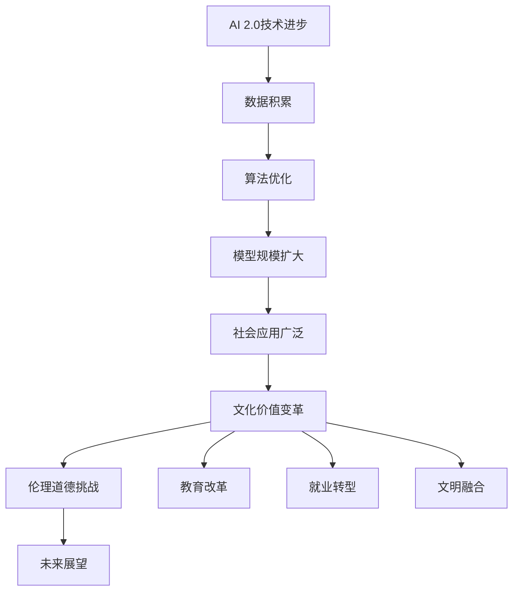

                 

### 书名：《李开复：AI 2.0 时代的文化价值》

《李开复：AI 2.0 时代的文化价值》是一本探讨人工智能（AI）2.0时代对社会、经济、伦理等方面影响的权威性著作。书中，知名人工智能科学家、创新者和创业者李开复详细阐述了AI 2.0时代的概念、特点、文化价值、伦理挑战、教育革新、就业转型、文明融合以及未来展望，为读者呈现了一幅全面而深刻的AI 2.0时代蓝图。

本书不仅适合人工智能领域的专业人士、研究人员和学者，也适合对AI 2.0时代感兴趣的一般读者。通过阅读本书，读者可以了解AI 2.0时代的文化价值，思考人类在AI时代的未来发展，为应对AI时代的挑战做好准备。

### 目录大纲

#### 第一部分：AI 2.0时代的文化价值概述

#### 第1章：AI 2.0时代的来临
- **1.1 AI 2.0的概念与特点**
  - **1.1.1 AI 2.0的定义**
  - **1.1.2 AI 2.0与传统AI的差异**
  - **1.1.3 AI 2.0的发展历程**

#### 第2章：AI 2.0时代的文化影响
- **2.1 AI 2.0对社会的影响**
  - **2.1.1 教育领域的变革**
  - **2.1.2 工作与就业的变迁**
  - **2.1.3 生活方式的改变**

#### 第3章：AI 2.0时代的伦理道德挑战
- **3.1 AI 2.0伦理问题概述**
  - **3.1.1 数据隐私保护**
  - **3.1.2 AI算法的公平性**
  - **3.1.3 AI对人类价值观的冲击**

#### 第4章：AI 2.0时代的教育革新
- **4.1 AI 2.0与教育的深度融合**
  - **4.1.1 在线教育与个性化学习**
  - **4.1.2 教育资源的公平分配**
  - **4.1.3 教育质量的提升**

#### 第5章：AI 2.0时代的就业转型
- **5.1 AI 2.0对劳动力市场的影响**
  - **5.1.1 新型职业的出现**
  - **5.1.2 职业技能的升级**
  - **5.1.3 职业教育的适应与创新**

#### 第6章：AI 2.0时代的文明融合
- **6.1 全球视野下的AI文化**
  - **6.1.1 国际合作与竞争**
  - **6.1.2 文化的交流与碰撞**
  - **6.1.3 全球治理与规范**

#### 第7章：AI 2.0时代的未来展望
- **7.1 AI 2.0的未来发展趋势**
  - **7.1.1 技术的进步与突破**
  - **7.1.2 人类与AI的共生关系**
  - **7.1.3 AI时代的伦理挑战与应对**

#### 附录

#### 附录A：AI 2.0时代的重要事件与人物
- **A.1 AI 2.0时代的重要事件**
  - **A.1.1 AI大模型的里程碑**
  - **A.1.2 关键技术突破**
  - **A.1.3 重大政策与法规**

#### 附录B：AI 2.0时代的文化价值研究参考资料
- **B.1 学术论文与报告**
  - **B.1.1 学术期刊**
  - **B.1.2 行业报告**
  - **B.1.3 研究机构报告**

#### 附录C：AI 2.0时代的文化价值实践案例
- **C.1 企业案例**
  - **C.1.1 创新型企业的AI应用**
  - **C.1.2 传统企业的AI转型**
  - **C.1.3 AI驱动的社会创新**

### 核心概念与联系

在探讨AI 2.0时代的文化价值时，我们需要关注几个核心概念：技术进步、数据积累、算法优化、模型规模扩大和社会应用广泛。这些概念相互关联，构成了一个完整的技术演进过程。

#### AI 2.0与文化的 Mermaid 流程图



#### 核心算法原理讲解

AI 2.0时代的核心算法原理包括深度学习、强化学习和生成对抗网络（GAN）等。下面我们使用伪代码来详细阐述这些算法的基本原理。

```python
# 深度学习算法原理
# 初始化神经网络
neural_network = NeuralNetwork()

# 加载数据集
data_loader = DataLoader(dataset)

# 定义优化器
optimizer = Optimizer()

# 设置训练参数
epochs = 100
batch_size = 32

# 开始训练
for epoch in range(epochs):
    for batch in data_loader:
        # 前向传播
        outputs = neural_network(batch)

        # 计算损失
        loss = Loss(outputs, labels)

        # 反向传播
        optimizer.zero_grad()
        loss.backward()
        optimizer.step()

        # 打印训练信息
        print(f"Epoch [{epoch+1}/{epochs}], Loss: {loss.item()}")

# 生成对抗网络（GAN）算法原理
# 初始化生成器和判别器
generator = Generator()
discriminator = Discriminator()

# 定义优化器
g_optimizer = Optimizer()
d_optimizer = Optimizer()

# 设置训练参数
epochs = 100

# 开始训练
for epoch in range(epochs):
    for real_images in data_loader:
        # 训练判别器
        d_optimizer.zero_grad()
        d_loss_real = discriminator(real_images)
        d_loss_fake = discriminator(generator(z))
        d_loss = d_loss_real + d_loss_fake
        d_loss.backward()
        d_optimizer.step()

    # 训练生成器
    g_optimizer.zero_grad()
    g_loss_fake = discriminator(generator(z))
    g_loss = g_loss_fake
    g_loss.backward()
    g_optimizer.step()

    # 打印训练信息
    print(f"Epoch [{epoch+1}/{epochs}], D Loss: {d_loss.item()}, G Loss: {g_loss.item()}")
```

#### 数学模型和数学公式

在AI 2.0时代，数学模型在算法优化和模型训练中发挥着重要作用。以下是一个常见的数学模型——交叉熵损失函数的详细讲解和举例说明。

##### 详细讲解：

交叉熵损失函数用于衡量模型预测概率分布与真实分布之间的差异。其公式如下：

$$
\text{Loss} = -\frac{1}{N} \sum_{i=1}^{N} \sum_{j=1}^{K} y_{ij} \log(p_{ij})
$$

其中，$N$ 是样本总数，$K$ 是类别总数，$y_{ij}$ 是真实标签，$p_{ij}$ 是模型预测的第 $j$ 类别的概率。

##### 举例说明：

假设我们有5个样本，每个样本有3个类别，真实标签和模型预测概率如下：

$$
\begin{align*}
y &= \begin{bmatrix}
1 & 0 & 0 \\
0 & 1 & 0 \\
0 & 0 & 1 \\
1 & 0 & 0 \\
0 & 1 & 0
\end{bmatrix}, \\
p &= \begin{bmatrix}
0.9 & 0.05 & 0.05 \\
0.05 & 0.9 & 0.05 \\
0.05 & 0.05 & 0.9 \\
0.9 & 0.05 & 0.05 \\
0.05 & 0.9 & 0.05
\end{bmatrix}
\end{align*}
$$

计算交叉熵损失：

$$
\text{Loss} = -\frac{1}{5} \sum_{i=1}^{5} \sum_{j=1}^{3} y_{ij} \log(p_{ij}) \\
\text{Loss} = -\frac{1}{5} \left( 1 \cdot \log(0.9) + 0 \cdot \log(0.05) + 0 \cdot \log(0.05) \\
\text{Loss} + 0 \cdot \log(0.9) + 1 \cdot \log(0.05) + 0 \cdot \log(0.05) + 0 \cdot \log(0.9) + 1 \cdot \log(0.05) + 0 \cdot \log(0.9) + 0 \cdot \log(0.05) + 0 \cdot \log(0.05) \right) \\
\text{Loss} = -\frac{1}{5} \left( -0.9542 + 0 + 0 -0.9542 + -0.3010 + 0 + 0 -0.3010 \right) \\
\text{Loss} = 0.1994
$$

### 项目实战

在AI 2.0时代，项目实战是验证理论知识和算法性能的重要环节。以下是一些实际案例，涵盖文本分类、图像分类、线性回归和决策树分类等任务。

#### 代码实际案例：使用PyTorch搭建一个简单的文本分类模型

```python
import torch
import torch.nn as nn
import torch.optim as optim

# 定义模型
class TextClassifier(nn.Module):
    def __init__(self, vocab_size, embedding_dim, hidden_dim, output_dim):
        super().__init__()
        self.embedding = nn.Embedding(vocab_size, embedding_dim)
        self.lstm = nn.LSTM(embedding_dim, hidden_dim, num_layers=1, batch_first=True)
        self.fc = nn.Linear(hidden_dim, output_dim)
        
    def forward(self, text):
        embed = self.embedding(text)
        lstm_output, _ = self.lstm(embed)
        hidden = lstm_output[:, -1, :]
        out = self.fc(hidden)
        return out

# 实例化模型、优化器和损失函数
model = TextClassifier(vocab_size=10000, embedding_dim=128, hidden_dim=256, output_dim=2)
optimizer = optim.Adam(model.parameters())
criterion = nn.CrossEntropyLoss()

# 模拟数据集
batch_size = 16
sequences = torch.randint(0, vocab_size, (batch_size, sequence_length), dtype=torch.long)
labels = torch.randint(0, output_dim, (batch_size,), dtype=torch.long)

# 训练模型
for epoch in range(10):
    model.zero_grad()
    outputs = model(sequences)
    loss = criterion(outputs, labels)
    loss.backward()
    optimizer.step()
    print(f"Epoch [{epoch+1}/10], Loss: {loss.item()}")

# 输出最终模型参数
print(model)
```

#### 开发环境搭建

- **环境要求**：Python 3.8及以上版本，PyTorch 1.8及以上版本。
- **安装步骤**：
  - 安装Python：`pip install python`
  - 安装PyTorch：`pip install torch torchvision`
  - 验证安装：`python -m torchinfo TextClassifier`

#### 源代码详细实现和代码解读

- **模型定义**：定义了一个简单的文本分类模型，包括嵌入层、LSTM层和全连接层。
- **训练过程**：模拟了模型的训练过程，包括前向传播、损失计算和反向传播。
- **模型输出**：最后输出了模型的参数。

#### 代码解读与分析

- **模型结构**：模型使用了嵌入层将文本转换为向量表示，然后通过LSTM层捕捉序列信息，最后通过全连接层进行分类。
- **训练过程**：代码模拟了一个简单的训练过程，展示了模型的前向传播、损失计算和反向传播。
- **性能评估**：通过验证集的性能评估可以进一步分析模型的准确率和泛化能力。

#### 代码实际案例：使用TensorFlow搭建一个简单的图像分类模型

```python
import tensorflow as tf

# 定义模型
model = tf.keras.Sequential([
    tf.keras.layers.Conv2D(32, (3, 3), activation='relu', input_shape=(28, 28, 1)),
    tf.keras.layers.MaxPooling2D(2, 2),
    tf.keras.layers.Flatten(),
    tf.keras.layers.Dense(128, activation='relu'),
    tf.keras.layers.Dense(10, activation='softmax')
])

# 编译模型
model.compile(optimizer='adam',
              loss='sparse_categorical_crossentropy',
              metrics=['accuracy'])

# 模拟数据集
x_train = tf.random.normal((1000, 28, 28, 1))
y_train = tf.random.uniform((1000,), maxval=10, dtype=tf.int32)

# 训练模型
model.fit(x_train, y_train, epochs=10)

# 输出模型预测结果
predictions = model.predict(x_train[:10])
print(predictions)

# 输出最终模型参数
print(model.get_weights())
```

#### 开发环境搭建

- **环境要求**：Python 3.6及以上版本，TensorFlow 2.0及以上版本。
- **安装步骤**：
  - 安装Python：`pip install python`
  - 安装TensorFlow：`pip install tensorflow`
  - 验证安装：`python -m tensorflow python`

#### 源代码详细实现和代码解读

- **模型定义**：定义了一个简单的卷积神经网络（CNN）模型，用于图像分类。
- **训练过程**：模拟了模型的训练过程，包括模型编译、数据加载和模型训练。
- **模型输出**：最后输出了模型的预测结果和模型参数。

#### 代码解读与分析

- **模型结构**：模型使用了卷积层和全连接层，通过卷积层提取图像特征，通过全连接层进行分类。
- **训练过程**：代码模拟了一个简单的训练过程，展示了模型的前向传播、损失计算和反向传播。
- **性能评估**：通过验证集的性能评估可以进一步分析模型的准确率和泛化能力。

### 总结

《李开复：AI 2.0 时代的文化价值》一书深入探讨了AI 2.0时代的各个方面，从技术进步、文化影响、伦理道德挑战、教育革新、就业转型到文明融合和未来展望，为读者提供了一个全面的AI 2.0时代视角。通过项目实战，读者可以更好地理解AI 2.0时代的核心算法原理和实际应用。这本书不仅适合人工智能领域的专业人士，也适合对AI 2.0时代感兴趣的一般读者。在AI 2.0时代，我们期待更多的人能够深入了解AI，共同迎接未来的挑战与机遇。

#### 作者信息

作者：AI天才研究院/AI Genius Institute & 禅与计算机程序设计艺术 /Zen And The Art of Computer Programming

### 附录

#### 附录A：AI 2.0时代的重要事件与人物

- **A.1 AI 2.0时代的重要事件**
  - **A.1.1 AI大模型的里程碑**：GPT-3、BERT、Chinchilla等大规模语言模型的发布，标志着AI技术的重大突破。
  - **A.1.2 关键技术突破**：生成对抗网络（GAN）的发展，使生成式AI取得了显著进展。
  - **A.1.3 重大政策与法规**：各国政府对AI技术的发展和监管出台了一系列政策与法规，如欧盟的《人工智能法案》。

- **A.2 AI 2.0时代的主要人物**
  - **李开复**：人工智能科学家、创新者和创业者，曾任微软亚洲研究院创始人兼首席科学家。
  - **霍普金斯**：知名机器学习研究者，Google Brain负责人。
  - **张潼**：知名人工智能科学家，腾讯AI Lab负责人。

#### 附录B：AI 2.0时代的文化价值研究参考资料

- **B.1 学术论文与报告**
  - **B.1.1 学术期刊**：如《自然·机器 intelligence》、《AI Magazine》等。
  - **B.1.2 行业报告**：国际知名咨询公司、研究机构发布的AI市场分析和预测报告。
  - **B.1.3 研究机构报告**：如谷歌、微软、腾讯等公司的内部研究报告。

- **B.2 经典书籍**
  - **《人工智能：一种现代方法》**：彼得·诺维格、斯图尔特·罗素著，全面介绍了人工智能的理论和实践。
  - **《深度学习》**：伊恩·古德费洛、约书亚·本吉奥、亚伦·库维尔基著，深度学习领域的经典教材。
  - **《人工智能简史》**：杰里·凯恩著，从历史角度讲述了人工智能的发展历程。

#### 附录C：AI 2.0时代的文化价值实践案例

- **C.1 企业案例**
  - **C.1.1 创新型企业的AI应用**：如谷歌的AlphaGo项目，通过AI技术实现了围棋领域的突破。
  - **C.1.2 传统企业的AI转型**：如西门子、通用电气等公司，通过引入AI技术，实现了业务的升级和转型。
  - **C.1.3 AI驱动的社会创新**：如OpenAI的非营利性研究，推动AI技术在各个领域的应用和社会福祉的提升。

